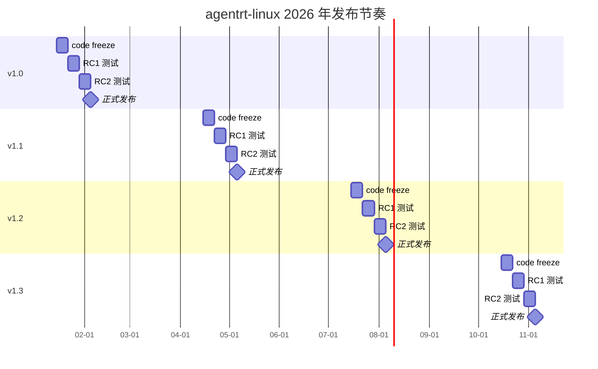
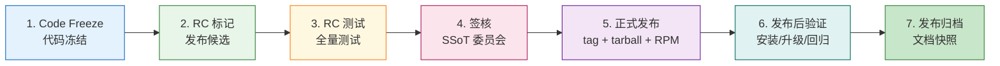
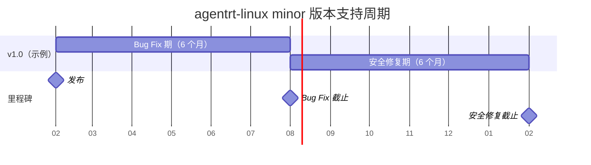

Copyright (c) 2025-2026 SPHARX Ltd. All Rights Reserved.

# agentrt-linux（AirymaxOS）稳定版本发布
> **文档定位**：agentrt-linux（AirymaxOS）120-development-process 模块第 5 卷——稳定版本发布。本文档详述稳定版本的发布周期、版本号体系、稳定分支维护、发布流程、发布清单、发布质量门与版本支持周期，是补丁生命周期（01 卷）阶段 5（Stable Release）的完整展开。\
> **文档版本**：v1.0.1\
> **最后更新**：2026-07-18\
> **上级文档**：[120-development-process README](README.md)\
> **同源映射**：agentrt 稳定版发布 + Linux 6.6 内核 `stable-kernel-rules.rst`（GitHub 分支替代 git send-email -stable 邮件列表）\
> **理论根基**：Linux 6.6 内核基线 + Airymax C-2 增量演化 + S-4 涌现性管理 + SSoT v2 单一权威源\
> **核心约束**：稳定分支仅接受 bug fix；发布质量门要求 CI 全绿 + 性能基准达标 + 安全扫描通过

---

## 1. 模块定位与范围

本文档是 120-development-process 模块的第 5 卷，回答"稳定版本如何规划、如何发布、如何维护、何时终止"。它继承 Linux 6.6 内核 `stable-kernel-rules.rst` 的稳定版规则，并将其适配到 agentrt-linux 的 GitHub PR 工作流与 RPM 发行模型。

### 1.1 与补丁生命周期的关系

补丁生命周期（01 卷）定义 6 阶段（Design → Early review → Wider review → Mainline → Stable release → LTS），本文档定义阶段 5（Stable Release）的完整工作流：版本号、分支、流程、清单、质量门、支持周期。

### 1.2 适用范围

本文档适用于 agentrt-linux 全部 8 子仓的稳定版发布以及 12 daemon 的 RPM 打包发布。涉及 LTS 版本选择与维护的详细规则见第 6 卷（06-long-term-support.md）。

### 1.3 关键术语

| 术语 | 定义 |
|------|------|
| minor 版本 | 每 3 个月发布的稳定版本，例如 v1.0、v1.1、v1.2 |
| patch 版本 | 稳定版的 bug fix 发布，例如 v1.0.1、v1.0.2 |
| MAJOR | 语义化版本的主版本号，破坏性变更时递增 |
| MINOR | 语义化版本的次版本号，每 3 个月递增 |
| PATCH | 语义化版本的修订号，每次 bug fix 发布递增 |
| stable-vX.Y | 稳定分支命名，例如 `stable-v1.0` |
| RC | Release Candidate，发布候选 |
| code freeze | 代码冻结，发布前禁止新功能合入 |
| airy_defconfig | agentrt-linux 内核默认配置文件，锁定五大选型 |

---

## 2. 稳定版本发布周期

### 2.1 周期总览

agentrt-linux 采用每 3 个月一个 minor 版本的发布节奏，每年发布 4 个 minor 版本。



### 2.2 发布时间表

| 阶段 | 时间点 | 责任人 | 产出 |
|------|--------|--------|------|
| T-21 天 | code freeze 启动 | 总维护者 | 冻结公告 |
| T-14 天 | RC1 标记 | 发布团队 | RC1 tarball + RPM |
| T-7 天 | RC2 标记（如需） | 发布团队 | RC2 tarball + RPM |
| T-3 天 | 发布候选签核 | SSoT 委员会 | 签核记录 |
| T-0 天 | 正式发布 | 发布团队 | 正式 tarball + RPM + SBOM |
| T+1 天 | 发布后验证 | QA 团队 | 验证报告 |

### 2.3 发布窗口与延期

- **正常发布**：每季度的第 2 个月第 1 周发布（2 月 / 5 月 / 8 月 / 11 月）。
- **延期条件**：RC 测试发现 P0 缺陷未修复，或安全扫描发现高危 CVE。
- **延期上限**：单次发布最多延期 2 周；超过 2 周由 SSoT 委员会决定是否跳过该 minor 版本。
- **OS-DEV-501**：禁止为追赶发布窗口而降低质量门标准。

---

## 3. 版本号体系

### 3.1 语义化版本

agentrt-linux 遵循 Semantic Versioning 2.0.0：

```
MAJOR.MINOR.PATCH
```

- **MAJOR**：破坏性变更时递增（ABI 不兼容、五大选型变更、API 删除）。
- **MINOR**：每 3 个月递增（新功能、向后兼容）。
- **PATCH**：bug fix 发布递增（向后兼容）。

### 3.2 版本号规则

| 版本类型 | 格式 | 示例 | 说明 |
|---------|------|------|------|
| 正式版 | `vMAJOR.MINOR.PATCH` | v1.0.0、v1.0.1 | 正式发布 |
| RC 版 | `vMAJOR.MINOR-rcN` | v1.0-rc1、v1.0-rc2 | 发布候选 |
| Beta 版 | `vMAJOR.MINOR-betaN` | v1.0-beta1 | 公开测试版 |
| Alpha 版 | `vMAJOR.MINOR-alphaN` | v1.0-alpha1 | 内部测试版 |
| LTS 版 | `vMAJOR.MINOR-lts` | v1.0-lts | LTS 标记 |
| 开发版 | `vMAJOR.MINOR-dev` | v1.1-dev | develop 分支构建 |

### 3.3 版本号递增规则

- **MAJOR 递增**：
  - 五大选型变更（sched_tac / IORING_OP_URING_CMD / 纯 C LSM / alloc_pages+mmap / IRON-9 v3）。
  - [SC] 头文件 ABI 破坏性变更。
  - 12 daemon 接口破坏性变更。
  - 由 SSoT 委员会决议，至少 1 年间隔。
- **MINOR 递增**：每 3 个月固定递增，与新功能合入无关。
- **PATCH 递增**：稳定分支每次 bug fix 发布递增。
- **OS-DEV-502**：禁止跳过版本号（如从 v1.0.0 直接到 v1.0.2）。

### 3.4 版本号在代码中的体现

- **内核版本**：`Makefile` 头部 `VERSION = 1` / `PATCHLEVEL = 0` / `SUBLEVEL = 0`。
- **daemon 版本**：每个 daemon 的 `--version` 输出与 meson.build 中的 `version` 字段。
- **RPM 版本**：`Name: agentrt-linux-<daemon>` / `Version: 1.0.1` / `Release: 1`。
- **文档版本**：每份设计文档头部的 `文档版本` 字段。

---

## 4. 稳定分支维护

### 4.1 稳定分支命名

- **格式**：`stable-vMAJOR.MINOR`，例如 `stable-v1.0`、`stable-v1.1`。
- **创建时机**：正式发布时从 `main` 分支拉出。
- **生命周期**：6 个月 bug fix 期 + 6 个月安全修复期 = 12 个月总支持期（见第 7 节）。

### 4.2 稳定分支接受变更类型

| 变更类型 | 接受 | 说明 |
|---------|------|------|
| Bug fix | ✓ | 必须附 `Fixes:` 标签 |
| 安全漏洞修复 | ✓ | 必须通过安全审查 |
| 回归修复 | ✓ | 必须附 `Fixes:` 或 `Closes:` 标签 |
| 文档修复 | ✓ | 不影响代码 |
| 测试增强 | ✓ | 不影响生产代码 |
| 新功能 | ✗ | 必须合入 main，下个 minor 版本发布 |
| 重构 | ✗ | 必须合入 main |
| ABI 变更 | ✗ | 必须合入 main，下个 MAJOR 版本发布 |
| 性能优化 | ⚠ | 仅在不引入行为变更时接受，需 maintainer 评审 |

### 4.3 稳定分支回溯流程

bug fix 从 main 回溯到稳定分支的流程：

1. **fix 在 main 合并**：bug fix 必须先在 main 合并，附带 `Fixes: <commit-hash>` 标签。
2. **回溯请求**：由 stable 团队或用户在 `stable-vX.Y` 创建回溯 PR，PR 描述引用 main 上的 fix commit。
3. **回溯审查**：stable 团队审查回溯 PR，确认：
   - fix 已在 main 合并。
   - fix 是 bug fix（非新功能）。
   - 回溯不引入冲突或行为变更。
   - 回溯通过 CI 全绿。
4. **回溯合并**：审查通过后由 stable 团队合并到 `stable-vX.Y`。
5. **patch 版本发布**：积累一定数量的 bug fix 后，发布 patch 版本（如 v1.0.1）。

### 4.4 稳定分支管理规则

- **OS-DEV-503**：稳定分支禁止 force push，禁止 rebase 已发布 commit。
- **OS-DEV-504**：稳定分支的 commit 必须能 cherry-pick 回 main（如不能，说明 fix 与 main 已分叉，需在 main 重新提交）。
- **OS-DEV-505**：稳定分支的合并策略仅允许 squash merge，禁用 rebase merge 与 merge commit。
- **OS-DEV-506**：稳定分支只接受对应 minor 版本 maintainer 的审查签字。

---

## 5. 发布流程

### 5.1 发布流程总览



### 5.2 步骤 1：Code Freeze

- **触发**：T-21 天，由总维护者发布冻结公告。
- **效果**：
  - `main` 分支禁止合入新功能 PR（仅接受 bug fix）。
  - `develop` 分支继续接受新功能，作为下一个 minor 版本的集成。
  - 冻结公告列出本 minor 版本的范围与已知问题。
- **解冻**：正式发布后，`main` 解冻，开始接受下个 minor 版本的新功能。

### 5.3 步骤 2：RC 标记

- **RC1**：T-14 天，从 `main` 拉出 `release/vMAJOR.MINOR` 分支，标记 `vMAJOR.MINOR-rc1` tag。
- **RC2**：T-7 天，若 RC1 测试发现 P0/P1 缺陷，修复后标记 `vMAJOR.MINOR-rc2`。
- **RC 数量**：通常 1-2 个 RC；超过 3 个 RC 由 SSoT 委员会决定是否延期。

### 5.4 步骤 3：RC 测试

RC 测试由 QA 团队执行，包括：

- **全量测试**：KUnit + kselftest + 12 daemon 单元测试 + 集成测试。
- **性能基准**：与上一版本对比，关键指标（IPC 延迟、调度延迟、内存占用）无回归。
- **动态分析**：ASan / KASan / ThreadSanitizer / UBSan 全部通过。
- **安全扫描**：Trivy + Snyk + Coverity 全部通过。
- **兼容性测试**：与上一版本的 ABI 兼容性（libabigail）、Agent 契约兼容性、配置兼容性。
- **升级测试**：从上一版本升级到 RC 版本，验证升级路径。
- **回滚测试**：从 RC 版本回滚到上一版本，验证回滚路径。

### 5.5 步骤 4：签核

- **签核人**：SSoT 委员会（5 名顶级子系统维护者 + 总维护者）。
- **签核标准**：
  - RC 测试全部通过。
  - 发布清单完整（见第 6 节）。
  - 发布质量门达标（见第 7 节）。
  - 发布说明（release notes）已编写并评审。
- **签核记录**：在 `agentrt-linux-mgmt` 仓库创建签核 issue，记录每位签核人的签字。

### 5.6 步骤 5：正式发布

- **tag**：在 `release/vMAJOR.MINOR` 分支标记 `vMAJOR.MINOR.PATCH` tag（首个发布为 `vMAJOR.MINOR.0`）。
- **拉出稳定分支**：从 `release/vMAJOR.MINOR` 拉出 `stable-vMAJOR.MINOR` 分支。
- **构建物料**：
  - 源码 tarball：`agentrt-linux-MAJOR.MINOR.PATCH.tar.xz`。
  - RPM 包：12 daemon + kernel + devstation（共 14 个 RPM）。
  - SBOM：CycloneDX 格式。
  - airy_defconfig：本版本锁定的内核配置。
  - 文档快照：本版本的文档分支。
- **签名**：所有物料使用 GPG 密钥签名（详见第 9 卷 09-release-process.md）。
- **发布**：上传到 AtomGit releases 与 RPM 仓库。

### 5.7 步骤 6：发布后验证

- **安装测试**：在干净环境安装本版本，验证所有功能正常。
- **升级测试**：从上 2 个版本升级到本版本，验证升级路径。
- **回归测试**：执行全量回归测试套件。
- **监控**：发布后 7 天内监控 telemetry，关注崩溃率、性能指标、错误率。

### 5.8 步骤 7：发布归档

- **文档快照**：在 `docs-AirymaxOS-vMAJOR.MINOR` 分支保存本版本的文档快照。
- **release notes**：归档到 `docs/AirymaxOS/190-distribution/release-notes/`。
- **SBOM 归档**：归档到 `sbom/MAJOR.MINOR.PATCH/`。
- **签核记录归档**：归档到 `agentrt-linux-mgmt/releases/MAJOR.MINOR.PATCH/`。

---

## 6. 发布物料清单

### 6.1 物料清单总览

| # | 物料 | 格式 | 大小估计 | 签名 |
|---|------|------|---------|------|
| 1 | 源码 tarball | `.tar.xz` | ~200 MB | GPG |
| 2 | 内核 RPM | `.rpm` | ~50 MB | GPG + 实时签名 |
| 3 | 12 daemon RPM | `.rpm` × 12 | ~5 MB × 12 | GPG + 实时签名 |
| 4 | devstation RPM | `.rpm` | ~100 MB | GPG |
| 5 | SBOM | CycloneDX JSON | ~1 MB | GPG |
| 6 | airy_defconfig | text | ~50 KB | GPG |
| 7 | 文档快照 | `.tar.xz` | ~20 MB | GPG |
| 8 | release notes | Markdown | ~100 KB | GPG |
| 9 | 校验和文件 | `.sha256sum` | ~1 KB | GPG |
| 10 | 公钥 | `.asc` | ~5 KB | — |

### 6.2 RPM 包清单

| # | RPM 包名 | 内容 | 依赖 |
|---|---------|------|------|
| 1 | `agentrt-linux-kernel` | 内核镜像 + 模块 + airy_defconfig | — |
| 2 | `agentrt-linux-macro-superv` | macro_d daemon | kernel |
| 3 | `agentrt-linux-logger` | logger_d | kernel |
| 4 | `agentrt-linux-config` | config_d | kernel |
| 5 | `agentrt-linux-gateway` | gateway_d | kernel + net |
| 6 | `agentrt-linux-sched` | sched_d | kernel |
| 7 | `agentrt-linux-vfs` | vfs_d | kernel |
| 8 | `agentrt-linux-net` | net_d | kernel |
| 9 | `agentrt-linux-mem` | mem_d | kernel |
| 10 | `agentrt-linux-cogn` | cogn_d | kernel |
| 11 | `agentrt-linux-sec` | sec_d + 纯 C LSM 模块 | kernel |
| 12 | `agentrt-linux-audit` | audit_d | kernel |
| 13 | `agentrt-linux-dev` | dev_d | kernel |
| 14 | `agentrt-linux-devstation` | 开发工具 + SDK + 文档 | 全部 daemon |

### 6.3 SBOM 内容

SBOM（Software Bill of Materials）采用 CycloneDX 1.5 格式，内容包括：

- **顶层组件**：agentrt-linux vMAJOR.MINOR.PATCH。
- **子组件**：12 daemon + kernel + devstation。
- **依赖关系**：组件间的依赖图。
- **第三方组件**：所有第三方库（如 musl libc、busybox、liburcu 等）。
- **许可证**：每个组件的开源许可证。
- **版本信息**：每个组件的精确版本与 commit hash。
- **CVE 信息**：已知 CVE 与修复状态。

---

## 7. 发布质量门

### 7.1 质量门总览

| # | 质量门 | 工具 | 通过标准 | 阻断级别 |
|---|--------|------|---------|---------|
| 1 | CI 全绿 | GitHub Actions | 6 个 workflow 全绿 | 阻断 |
| 2 | 性能基准达标 | `perf-benchmark` | 关键指标无回归（容差 5%） | 阻断 |
| 3 | 安全扫描通过 | Trivy + Snyk + Coverity | 零高危 CVE | 阻断 |
| 4 | 测试覆盖达标 | `coverage-report` | 行覆盖 ≥ 80%，分支覆盖 ≥ 70% | 阻断 |
| 5 | ABI 兼容性 | libabigail | 无破坏性 ABI 变更 | 阻断 |
| 6 | Agent 契约兼容性 | `check-agent-contract.sh` | 无破坏性契约变更 | 阻断 |
| 7 | [SC] 双端一致 | `sc-dual-ci.yml` | 双端逐字节一致 | 阻断 |
| 8 | SSoT 校验通过 | `ssot-validate.yml` | 四层归属一致 | 阻断 |
| 9 | 文档完整 | `doc-check.sh` | 接口/行为变更已更新文档 | 强制 |
| 10 | release notes 完整 | 人工 | 已编写并评审 | 强制 |

### 7.2 性能基准指标

| 指标 | 基线 | 容差 | 测试方法 |
|------|------|------|---------|
| IPC 延迟（IORING_OP_URING_CMD） | v1.0.0 | ±5% | `ipc-latency-bench` |
| 调度延迟（SCHED_DEADLINE） | v1.0.0 | ±5% | `sched-latency-bench` |
| 内存分配延迟（alloc_pages） | v1.0.0 | ±5% | `mem-alloc-bench` |
| 128B 日志吞吐（ring buffer） | v1.0.0 | ±5% | `log-throughput-bench` |
| Agent 启动时间 | v1.0.0 | ±10% | `agent-startup-bench` |
| 内核构建时间 | v1.0.0 | +10% 上限 | `kernel-build-bench` |

### 7.3 安全扫描标准

- **Trivy**：扫描 RPM 包与容器镜像，零高危 CVE。
- **Snyk**：扫描第三方依赖，零高危 CVE。
- **Coverity**：静态分析，零高危缺陷。
- **ASan / KASan**：动态分析，零内存错误。
- **ThreadSanitizer**：动态分析，零数据竞争。
- **OS-DEV-507**：发现高危 CVE 必须在发布前修复；中危 CVE 必须在 release notes 中列出。

---

## 8. 版本支持周期

### 8.1 支持周期总览

每个 minor 版本的总支持周期为 12 个月，分为两个阶段：



### 8.2 阶段一：Bug Fix 期（6 个月）

- **时长**：发布后 0-6 个月。
- **接受变更**：bug fix + 安全漏洞修复 + 文档修复 + 测试增强。
- **发布频率**：每月 1 个 patch 版本（如 v1.0.1、v1.0.2、...、v1.0.6）。
- **响应 SLA**：
  - P0 缺陷：7 天内修复并发布 patch 版本。
  - P1 缺陷：14 天内修复。
  - P2 缺陷：30 天内修复。
  - P3 缺陷：下个 patch 版本修复。

### 8.3 阶段二：安全修复期（6 个月）

- **时长**：发布后 6-12 个月。
- **接受变更**：仅安全漏洞修复 + 文档修复。
- **发布频率**：按需发布（仅在有安全漏洞时发布 patch 版本）。
- **响应 SLA**：
  - 高危 CVE：72 小时内修复并发布 patch 版本。
  - 中危 CVE：7 天内修复。
  - 低危 CVE：不修复，建议升级到新版本。

### 8.4 终止支持（EOL）

- **EOL 时机**：发布后 12 个月。
- **EOL 公告**：EOL 前 3 个月发布 EOL 公告，建议用户升级到新版本。
- **EOL 后**：稳定分支标记为 `archived`，不再接受任何 PR；仅保留为只读历史。

### 8.5 支持周期与 LTS 的关系

- 每 4 个 minor 版本选 1 个作为 LTS 版本（详见第 6 卷 06-long-term-support.md）。
- LTS 版本的支持周期为 5 年，远长于普通 minor 版本的 12 个月。
- 例：v1.0、v1.4、v2.0、v2.4 可能是 LTS 候选（实际由 SSoT 委员会决议）。

---

## 9. 发布示例：v1.0.1

以 v1.0.1 为例，展示完整的发布流程：

### 9.1 发布背景

- v1.0.0 已于 2026-02-05 发布。
- v1.0.0 发布后 1 个月内，社区报告 3 个 P1 缺陷 + 1 个 P2 缺陷。
- 安全扫描发现 1 个中危 CVE（已在 main 修复）。
- 决定发布 v1.0.1 patch 版本。

### 9.2 发布流程

1. **回溯 fix**：将 main 上的 4 个 bug fix + 1 个 CVE 修复回溯到 `stable-v1.0` 分支。
2. **创建发布 PR**：在 `stable-v1.0` 创建 `release/v1.0.1` 分支。
3. **CI 校验**：`ci-kernel.yml` + `sc-dual-ci.yml` + `ssot-validate.yml` 全绿。
4. **性能基准**：与 v1.0.0 对比，无回归。
5. **安全扫描**：Trivy + Snyk + Coverity 全部通过。
6. **签核**：SSoT 委员会 5 名成员 + 总维护者签核。
7. **tag**：在 `release/v1.0.1` 标记 `v1.0.1` tag。
8. **构建物料**：源码 tarball + 14 个 RPM + SBOM + airy_defconfig + 文档快照。
9. **签名**：GPG 签名所有物料。
10. **发布**：上传到 AtomGit releases 与 RPM 仓库。
11. **公告**：发布 v1.0.1 release notes，列出修复的缺陷与 CVE。
12. **验证**：QA 团队执行安装/升级/回归测试。

### 9.3 release notes 摘要

```markdown
# agentrt-linux v1.0.1

发布日期：2026-03-05
类型：patch 版本（bug fix + 安全修复）

## 修复的缺陷
- [P1] sched: SCHED_DEADLINE 在高负载下错过截止时间（Fixes: a1b2c3d4）
- [P1] ipc: IORING_OP_URING_CMD 在 EAGAIN 时未释放缓冲区（Fixes: e5f6a7b8）
- [P1] mem: alloc_pages 在 NUMA 节点 0 之外分配失败（Fixes: c9d0e1f2）
- [P2] log: 128B 记录在跨 CPU 时时间戳乱序（Fixes: 3a4b5c6d）

## 安全修复
- CVE-2026-1234（中危）：纯 C LSM 钩子在并发场景下存在 TOCTOU（Fixes: 7e8f9a0b）

## 升级说明
- 直接升级：v1.0.0 → v1.0.1（无破坏性变更）
- airy_defconfig：无变更
- ABI：完全兼容 v1.0.0

## 已知问题
- 无
```

---

## 10. 与 Airymax Unify Design 的关系

| Unify 模块 | 发布关系 |
|-----------|---------|
| **A-UEF** | 发布前校验 A-UEF 错误码与 v1.0.0 兼容；新增错误码记入 release notes |
| **A-ULP** | 发布前校验 A-ULP 128B 记录格式与 v1.0.0 兼容；格式变更记入 release notes |
| **A-UCS** | 发布前校验 `airy_defconfig` 锁定五大选型；config 变更记入 release notes |
| **A-ULS** | 发布前校验纯 C LSM 模块与 v1.0.0 兼容；安全钩子变更记入 release notes |
| **A-IPC** | 发布前校验 IORING_OP_URING_CMD 路径与 v1.0.0 兼容；IPC 协议变更记入 release notes |

---

## 11. 相关文档

- [120-development-process README](README.md)：开发流程主索引
- [01-patch-lifecycle.md](01-patch-lifecycle.md)：补丁生命周期 6 阶段
- [06-long-term-support.md](06-long-term-support.md)：长期支持策略
- [09-release-process.md](09-release-process.md)：发布流程详细设计
- [08-ci-cd-pipeline.md](08-ci-cd-pipeline.md)：CI/CD 流水线详细设计
- [../50-engineering-standards/05-development-process.md](../50-engineering-standards/05-development-process.md)：工程标准开发流程
- [../190-distribution/README.md](../190-distribution/README.md)：发行与分发
- [../160-compatibility/03-upstream-tracking.md](../160-compatibility/03-upstream-tracking.md)：上游跟踪

---

## 12. 版本历史

| 版本 | 日期 | 变更 |
|------|------|------|
| v1.0.1 | 2026-07-18 | 初始版本：建立 3 个月 minor 发布周期、语义化版本号体系（MAJOR.MINOR.PATCH）、稳定分支维护规则（仅接受 bug fix）、7 步发布流程（code freeze → RC → 测试 → 签核 → 正式发布 → 验证 → 归档）、10 项发布物料清单（含 14 个 RPM）、10 项发布质量门（CI 全绿 + 性能基准 + 安全扫描）、12 个月版本支持周期（6 个月 bug fix + 6 个月安全修复）、v1.0.1 发布示例 |

---

> **文档结束** | agentrt-linux 稳定版本发布 v1.0.1 | 维护者：开源极境工程与规范委员会 | "From data intelligence emerges."
