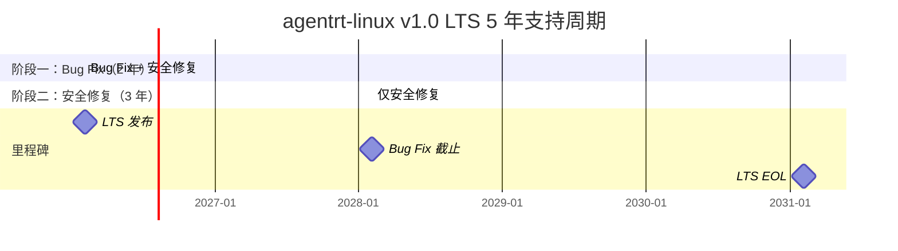

Copyright (c) 2025-2026 SPHARX Ltd. All Rights Reserved.

# agentrt-linux（AirymaxOS）长期支持策略
> **文档定位**：agentrt-linux（AirymaxOS）120-development-process 模块第 6 卷——长期支持（LTS）策略。本文档详述 LTS 版本选择、5 年支持周期、回溯策略、兼容性保证、安全策略、文档维护以及与上游 Linux 6.6 LTS 的对齐关系，是稳定版本发布（05 卷）在长期支持维度的延伸。\
> **文档版本**：v1.0.1\
> **最后更新**： 2026-07-21\
> **上级文档**：[120-development-process README](README.md)\
> **同源映射**：agentrt LTS 策略 + Linux 6.6 LTS（kernel.org LTS 选择与维护规则）\
> **理论根基**：Linux 6.6 内核基线 + Airymax C-2 增量演化 + S-4 涌现性管理 + SSoT v2 单一权威源\
> **核心约束**：LTS 版本 5 年支持周期（2 年 bug fix + 3 年安全修复）；安全漏洞 72 小时内发布修复；[SC] 头文件向后兼容

---

## 1. 模块定位与范围

本文档是 120-development-process 模块的第 6 卷，回答"哪些版本成为 LTS、LTS 支持多久、如何从 mainline 回溯、如何保证兼容性、如何应对安全漏洞、如何维护文档、如何对齐上游 Linux LTS"。它继承 Linux 6.6 LTS 的维护规则，并将其适配到 agentrt-linux 的五大技术选型与 IRON-9 v3 四层模型。

### 1.1 与稳定版本发布的关系

稳定版本发布（05 卷）规定每个 minor 版本 12 个月支持周期，本文档规定其中被选为 LTS 的 minor 版本享有 5 年扩展支持周期。LTS 是稳定版的超集：稳定版的所有规则适用于 LTS，LTS 在此基础上有额外的回溯与兼容性要求。

### 1.2 适用范围

本文档适用于被 SSoT 委员会选为 LTS 的 agentrt-linux minor 版本。当前规划的 LTS 候选包括 v1.0、v1.4、v2.0、v2.4 等（每 4 个 minor 选 1 个，实际由 SSoT 委员会决议）。

### 1.3 关键术语

| 术语 | 定义 |
|------|------|
| LTS | Long Term Support，长期支持版本 |
| LTS 候选 | 每 4 个 minor 版本中候选的 LTS，由 SSoT 委员会决议选定 |
| mainline | `main` 分支，开发主线 |
| backport | 从 mainline 回溯 commit 到 LTS 分支 |
| ABI 稳定性 | 应用二进制接口在 LTS 周期内不破坏 |
| [SC] 向后兼容 | LTS 周期内 [SC] 头文件不引入破坏性变更 |
| LTS 文档分支 | 每个 LTS 版本独立的文档分支，用于维护 LTS 期间的文档 |
| 上游 Linux LTS | kernel.org 维护的 Linux 6.6 LTS（支持至 2026 年 12 月，可延至 2028 年） |

---

## 2. LTS 版本选择

### 2.1 选择规则

- **频率**：每 4 个 minor 版本选 1 个作为 LTS。
- **候选条件**：
  - 该 minor 版本已正式发布且发布质量门全绿。
  - 该 minor 版本发布后 1 个月内无 P0 缺陷。
  - 该 minor 版本的 [SC] 头文件已通过 ABI 稳定性校验。
  - 该 minor 版本的性能基准达到或超过上一 LTS 版本。
- **决议机构**：SSoT 委员会（5 名顶级子系统维护者 + 总维护者）。
- **决议流程**：候选 minor 版本发布后 1 个月，SSoT 委员会召开 LTS 决议会议，投票选定；过半数赞成即选定。

### 2.2 历史与规划 LTS

| LTS 版本 | 发布日期 | LTS 起始 | LTS 终止（5 年后） | 上游 Linux LTS |
|---------|---------|---------|------------------|----------------|
| v1.0 | 2026-02-05 | 2026-02-05 | 2031-02-05 | Linux 6.6 LTS |
| v1.4（规划） | 2027-02-05 | 2027-02-05 | 2032-02-05 | Linux 6.6 LTS / 6.12 LTS |
| v2.0（规划） | 2028-02-05 | 2028-02-05 | 2033-02-05 | Linux 6.12 LTS / 6.18 LTS |

### 2.3 LTS 标记

- **分支**：从 `stable-vX.Y` 重命名为 `lts-vX.Y`（保留 `stable-vX.Y` 作为别名）。
- **tag**：在 LTS 起始时标记 `vX.Y.0-lts`。
- **文档**：在 README 与 release notes 中标记该版本为 LTS。
- **RPM**：LTS 版本的 RPM 包名附加 `-lts` 后缀，例如 `agentrt-linux-kernel-lts-0.1.1`。

---

## 3. LTS 支持周期

### 3.1 5 年支持周期总览

### 3.2 阶段一：Bug Fix 期（2 年）

- **时长**：LTS 发布后 0-2 年。
- **接受变更**：
  - Bug fix（必须附 `Fixes:` 标签）。
  - 安全漏洞修复。
  - 文档修复。
  - 测试增强。
  - 上游 Linux LTS 的 bug fix 回溯（详见第 4 节）。
- **发布频率**：每 3 个月 1 个 patch 版本（如 v1.0.1-lts、v1.0.2-lts、...）。
- **响应 SLA**：
  - P0 缺陷：7 天内修复并发布 patch 版本。
  - P1 缺陷：14 天内修复。
  - P2 缺陷：30 天内修复。
  - P3 缺陷：下个 patch 版本修复。

### 3.3 阶段二：安全修复期（3 年）

- **时长**：LTS 发布后 2-5 年。
- **接受变更**：
  - 仅安全漏洞修复。
  - 文档修复（仅安全相关）。
  - 上游 Linux LTS 的安全修复回溯。
- **发布频率**：按需发布（仅在有安全漏洞时发布 patch 版本）。
- **响应 SLA**：
  - 高危 CVE：72 小时内修复并发布 patch 版本（见第 5 节）。
  - 中危 CVE：7 天内修复。
  - 低危 CVE：不修复，建议升级到新 LTS。

### 3.4 终止支持（EOL）

- **EOL 时机**：LTS 发布后 5 年。
- **EOL 公告**：EOL 前 6 个月发布 EOL 公告，建议用户升级到新 LTS。
- **EOL 后**：
  - LTS 分支标记为 `archived-lts`，不再接受任何 PR。
  - LTS 分支保留为只读历史。
  - LTS 文档分支保留为只读历史。
  - LTS RPM 包从仓库主入口移至 `archive/` 目录。

### 3.5 LTS 重叠期

- 相邻 LTS 版本之间有 1 年重叠期（新 LTS 发布后 1 年内，旧 LTS 仍在安全修复期）。
- 重叠期内，用户应完成从旧 LTS 到新 LTS 的迁移。
- OS-DEV-601：重叠期内 SSoT 委员会提供迁移指南。

---

## 4. LTS 回溯策略

### 4.1 回溯来源

LTS 分支的 commit 来源有三：

1. **mainline 回溯**：从 `main` 分支回溯 bug fix 与安全修复。
2. **上游 Linux LTS 回溯**：从 Linux 6.6 LTS 分支回溯内核 bug fix 与安全修复。
3. **LTS 分支直接修复**：仅在 LTS 分支直接提交的修复（罕见，需 SSoT 委员会批准）。

### 4.2 mainline 回溯规则

- **必须先在 main 合并**：bug fix 必须先在 main 合并，附带 `Fixes: <commit-hash>` 标签。
- **回溯请求**：由 LTS 团队或用户在 `lts-vX.Y` 创建回溯 PR。
- **回溯审查**：LTS 团队审查回溯 PR，确认：
  - fix 已在 main 合并。
  - fix 是 bug fix 或安全修复（非新功能）。
  - 回溯不引入冲突或行为变更。
  - 回溯通过 CI 全绿 + sc-dual-ci 全绿（若涉及 [SC]）。
  - 回溯通过 ABI 兼容性校验。
- **回溯合并**：审查通过后由 LTS 团队合并到 `lts-vX.Y`。

### 4.3 上游 Linux LTS 回溯规则

- **跟踪机制**：LTS 团队每周跟踪 Linux 6.6 LTS 分支（`linux-6.6.y`）的 commit。
- **筛选规则**：
  - 仅回溯 bug fix 与安全修复 commit。
  - 跳过与 agentrt-linux 无关的子系统 commit（如 agentrt-linux 不使用的驱动）。
  - 跳过引入新功能的 commit（Linux LTS 不会引入新功能，但需警惕）。
- **回溯审查**：
  - commit 必须能 clean cherry-pick 到 agentrt-linux LTS 分支。
  - 若冲突，LTS 团队手动适配，并在 commit 消息中记录适配内容。
  - 适配后的 commit 必须通过 CI 全绿。
- **OS-DEV-602**：上游 Linux LTS 回溯的 commit 必须保留原始 `commit-hash` 与 `Signed-off-by` 链，附加 `Backport: <上游 commit-hash>` 标签。

### 4.4 回溯优先级

| 优先级 | commit 类型 | 响应 SLA |
|--------|-----------|---------|
| P0 | 高危 CVE 修复 | 72 小时内回溯并发布 |
| P1 | P0 缺陷修复 | 7 天内回溯 |
| P2 | P1 缺陷修复 | 14 天内回溯 |
| P3 | P2 缺陷修复 | 30 天内回溯 |
| P4 | 上游 Linux LTS bug fix | 60 天内回溯 |

### 4.5 回溯冲突处理

- **cherry-pick 冲突**：LTS 团队手动解决冲突，并在 commit 消息中记录冲突解决方式。
- **行为变更冲突**：若回溯会改变 LTS 版本的既有行为，需 SSoT 委员会评审决定是否接受。
- **[SC] 冲突**：若回溯涉及 [SC] 头文件变更，必须通过 `sc-dual-ci.yml` 双端校验，且 agentrt 端必须同步回溯。

---

## 5. LTS 兼容性保证

### 5.1 ABI 稳定性

- **保证范围**：
  - 内核→用户态 UAPI（`kernel/include/uapi/linux/airymax/*.h`）。
  - 12 daemon 的服务接口（IPC 协议）。
  - Agent 契约接口（[SC] `agent_contract.h`）。
- **保证标准**：LTS 周期内（5 年）不引入破坏性 ABI 变更。
- **校验工具**：`libabigail`（每次 LTS patch 发布前校验）。
- **OS-DEV-603**：LTS patch 发布必须附 ABI 兼容性报告，证明与 LTS 首发版本 ABI 兼容。

### 5.2 [SC] 头文件向后兼容

- **保证范围**：10 个 [SC] 头文件（`kernel/include/uapi/linux/airymax/*.h`）。
- **保证标准**：LTS 周期内 [SC] 头文件不引入破坏性变更。
- **允许的变更**：
  - 新增结构体字段（必须附加在末尾，且不改变 sizeof）。
  - 新增枚举值（必须附加在末尾）。
  - 新增函数声明。
  - 新增宏定义。
- **禁止的变更**：
  - 删除或重命名已有结构体字段、枚举值、函数声明、宏定义。
  - 修改字段类型、字段顺序、枚举值数值。
  - 改变结构体对齐或 sizeof。
- **校验工具**：`check-abi.sh`（libabigail）+ `sc-dual-ci.yml`（双端逐字节校验）。

### 5.3 配置兼容性

- **`airy_defconfig` 稳定性**：LTS 周期内五大选型配置不变（`CONFIG_SCHED_EXT` 未启用 / `CONFIG_IO_URING=y` / `# CONFIG_BPF_LSM is not set` / `CONFIG_SECURITY_AIRY_LSM=y` 等）。
- **新增配置项**：允许新增配置项，但默认值必须保持既有行为。
- **废弃配置项**：禁止在 LTS 周期内废弃配置项。

### 5.4 行为兼容性

- **调度行为**：sched_tac 调度器在 LTS 周期内不改变既有调度策略行为。
- **IPC 行为**：IORING_OP_URING_CMD 在 LTS 周期内不改变既有协议行为。
- **安全行为**：纯 C LSM 在 LTS 周期内不改变既有钩子行为（除非修复安全漏洞）。
- **内存行为**：alloc_pages + mmap 在 LTS 周期内不改变既有分配行为。
- **OS-DEV-604**：行为变更必须附 RFC 评审记录与迁移指南，且仅在 LTS Bug Fix 期（前 2 年）接受；安全修复期（后 3 年）禁止行为变更。

---

## 6. LTS 安全策略

### 6.1 安全漏洞响应 SLA

| 严重程度 | 响应时间 | 修复时间 | 发布时间 |
|---------|---------|---------|---------|
| 高危 CVE（CVSS ≥ 9.0） | 4 小时内确认 | 48 小时内修复 | 72 小时内发布 patch 版本 |
| 中危 CVE（CVSS 7.0-8.9） | 24 小时内确认 | 7 天内修复 | 14 天内发布 patch 版本 |
| 低危 CVE（CVSS < 7.0） | 72 小时内确认 | 30 天内修复 | 下个 patch 版本 |

### 6.2 安全漏洞披露流程

1. **报告**：安全漏洞通过 `security@spharx.com` 私密报告，禁止公开 issue。
2. **确认**：安全子系统维护者在响应时间内确认接收并评估严重程度。
3. **修复**：在私有分支 `security-fix-<CVE>` 开发修复，仅安全团队可见。
4. **预披露**：修复完成后 7 天预披露期，通知下游发行版与关键用户。
5. **发布**：预披露期结束后，发布 patch 版本并公开 CVE 详情。
6. **公开**：发布后在 release notes 与 CVE 数据库公开漏洞详情与修复方案。
- **OS-DEV-605**：禁止在修复发布前公开讨论安全漏洞细节。

### 6.3 安全回溯

- 高危 CVE 修复必须回溯到所有仍在支持期的 LTS 版本。
- 中危 CVE 修复必须回溯到当前 LTS 与上一 LTS。
- 低危 CVE 修复仅在当前 LTS 回溯，上一 LTS 建议升级。
- **OS-DEV-606**：安全回溯的 commit 必须附 `CVE: <CVE 编号>` 标签。

### 6.4 上游 Linux LTS 安全回溯

- 跟踪 linux-cve-announce 邮件列表与 NVD 数据库。
- 影响 agentrt-linux 的上游 CVE 必须在 7 天内评估影响。
- 需要修复的上游 CVE 按 6.1 节 SLA 回溯到 LTS 分支。

---

## 7. LTS 文档维护

### 7.1 LTS 文档分支

- **分支命名**：`docs-lts-vX.Y`，例如 `docs-lts-v1.0`。
- **创建时机**：LTS 选定时，从主文档分支拉出。
- **生命周期**：与 LTS 版本同步，5 年。
- **EOL 后**：标记为 `archived-docs-lts-vX.Y`，保留为只读历史。

### 7.2 LTS 文档内容

LTS 文档分支维护以下内容：

- **设计文档快照**：LTS 发布时的设计文档快照。
- **LTS release notes**：每个 patch 版本的 release notes。
- **LTS 迁移指南**：从上一 LTS 迁移到本 LTS 的指南。
- **LTS ABI 报告**：每个 patch 版本的 ABI 兼容性报告。
- **LTS CVE 历史**：本 LTS 已修复的 CVE 列表与详情。
- **LTS 已知问题**：本 LTS 的已知问题与规避方法。

### 7.3 LTS 文档更新规则

- **Bug Fix 期**：每次 patch 版本发布时同步更新文档。
- **安全修复期**：仅在安全修复发布时更新文档。
- **EOL 后**：文档不再更新，保留为只读历史。
- **OS-DEV-607**：LTS 文档分支禁止从 main 同步新功能文档（避免 LTS 文档与 LTS 代码不一致）。

---

## 8. 与上游 Linux LTS 的关系

### 8.1 上游 Linux 6.6 LTS

- **上游版本**：Linux 6.6 LTS（kernel.org 维护）。
- **上游支持周期**：
  - 主流支持：2026 年 12 月（预计）。
  - 扩展支持（CIP）：2028 年 12 月（预计）。
- **agentrt-linux 跟踪策略**：
  - v1.0 LTS 跟踪 Linux 6.6 LTS 主流支持期。
  - 若 v1.0 LTS 需要支持到 2031 年，需在 Linux 6.6 LTS EOL 后由 agentrt-linux 团队自行维护内核安全修复。

### 8.2 上游回溯策略

- **回溯来源**：Linux 6.6 LTS 分支（`linux-6.6.y`）。
- **回溯频率**：每周跟踪上游 commit，每月批量回溯。
- **回溯审查**：见第 4.3 节。
- **OS-DEV-608**：上游 Linux LTS EOL 后，agentrt-linux LTS 团队需制定"自维护内核安全修复计划"，由 SSoT 委员会评审。

### 8.3 上游贡献

- agentrt-linux 团队发现的通用内核 bug 应直接报告上游 Linux 社区。
- 上游接受的 fix 会自然进入 Linux 6.6 LTS 分支，再回溯到 agentrt-linux LTS。
- **OS-DEV-609**：禁止在 agentrt-linux LTS 中保留未上游化的通用内核 fix（会导致与上游分叉）。

### 8.4 上游 Linux LTS EOL 应对

- 上游 Linux 6.6 LTS EOL 前 6 个月，SSoT 委员会评估：
  - 是否升级到新上游 LTS（如 Linux 6.12 LTS）。
  - 是否进入"自维护"模式（agentrt-linux 团队自行维护内核安全修复）。
- 评估结果记入 LTS 治理文档，并向社区公告。

---

## 9. LTS 治理

### 9.1 LTS 团队

- **LTS 团队组成**：1 名 LTS 维护者 + 4 名 LTS 子系统维护者（对应 kernel / services / security / memory）。
- **LTS 维护者**：由 SSoT 委员会任命，任期 2 年，可连任。
- **LTS 子系统维护者**：由 LTS 维护者任命。
- **职责**：
  - 跟踪 mainline 与上游 Linux LTS 的 commit。
  - 审查回溯 PR。
  - 发布 LTS patch 版本。
  - 维护 LTS 文档分支。
  - 响应安全漏洞报告。

### 9.2 LTS 决策机制

- **常规回溯**：LTS 子系统维护者审查通过即可合并。
- **争议回溯**：LTS 维护者仲裁。
- **行为变更回溯**：SSoT 委员会评审。
- **LTS EOL 决策**：SSoT 委员会决议。

### 9.3 LTS 质量门

LTS patch 版本发布必须满足以下质量门：

| # | 质量门 | 通过标准 |
|---|--------|---------|
| 1 | CI 全绿 | 6 个 workflow 全绿 |
| 2 | ABI 兼容性 | 与 LTS 首发版本 ABI 兼容（libabigail） |
| 3 | [SC] 双端一致 | sc-dual-ci 全绿 |
| 4 | SSoT 校验通过 | ssot-validate 全绿 |
| 5 | 性能基准 | 与 LTS 首发版本对比无回归（容差 5%） |
| 6 | 安全扫描 | 零高危 CVE |
| 7 | LTS 文档更新 | release notes + ABI 报告 + CVE 历史已更新 |
| 8 | LTS 团队签核 | LTS 维护者签字 |

---

## 10. 与 Airymax Unify Design 的关系

| Unify 模块 | LTS 关系 |
|-----------|---------|
| **A-UEF** | LTS 周期内 A-UEF 错误码不删除、不重命名；新增错误码必须向后兼容 |
| **A-ULP** | LTS 周期内 A-ULP 128B 记录格式不变；新增字段必须附加在末尾且不改变 sizeof |
| **A-UCS** | LTS 周期内 `airy_defconfig` 五大选型配置不变；新增配置项默认值保持既有行为 |
| **A-ULS** | LTS 周期内纯 C LSM 钩子行为不变（除安全修复）；安全修复必须回溯所有支持期 LTS |
| **A-IPC** | LTS 周期内 IORING_OP_URING_CMD 协议不变；新增命令必须向后兼容 |

---

## 11. 相关文档

- [120-development-process README](README.md)：开发流程主索引
- [01-patch-lifecycle.md](01-patch-lifecycle.md)：补丁生命周期 6 阶段
- [05-stable-releases.md](05-stable-releases.md)：稳定版本发布
- [09-release-process.md](09-release-process.md)：发布流程详细设计
- [../50-engineering-standards/05-development-process.md](../50-engineering-standards/05-development-process.md)：工程标准开发流程
- [../160-compatibility/03-upstream-tracking.md](../160-compatibility/03-upstream-tracking.md)：上游跟踪
- [../110-security/07-airy-lsm-design.md](../110-security/07-airy-lsm-design.md)：纯 C LSM 设计
- [../130-roadmap/README.md](../130-roadmap/README.md)：路线图与里程碑

---

## 12. 版本历史

| 版本 | 日期 | 变更 |
|------|------|------|
| v1.0.1 | 2026-07-18 | 初始版本：建立 LTS 选择规则（每 4 个 minor 选 1 个）、5 年支持周期（2 年 bug fix + 3 年安全修复）、三源回溯策略（mainline + 上游 Linux LTS + LTS 直接）、兼容性保证（ABI + [SC] + 配置 + 行为）、安全策略（72 小时高危修复）、LTS 文档分支维护、与上游 Linux 6.6 LTS 对齐关系、LTS 治理与质量门 |

---

> **文档结束** | agentrt-linux 长期支持策略 v1.0.1 | 维护者：开源极境工程与规范委员会 | "From data intelligence emerges."
