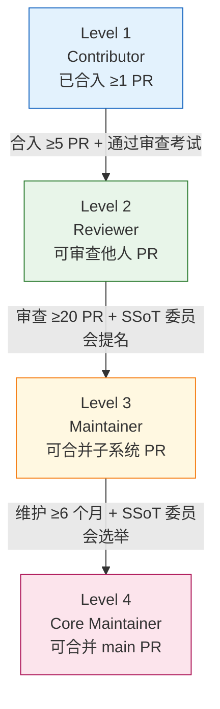
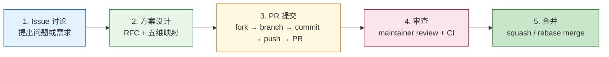

Copyright (c) 2025-2026 SPHARX Ltd. All Rights Reserved.

# agentrt-linux（AirymaxOS）贡献者工作流
> **文档定位**：agentrt-linux（AirymaxOS）120-development-process 模块第 7 卷——贡献者工作流。本文档详述贡献者等级体系、DCO 协议、贡献流程、新贡献者引导、认领机制、贡献统计与认可以及与 agentrt 社区的跨项目协调，是维护者层级制度（02 卷）在贡献者维度的展开。\
> **文档版本**：v1.0.1\
> **最后更新**： 2026-07-21\
> **上级文档**：[120-development-process README](README.md)\
> **同源映射**：agentrt 贡献者工作流 + Linux 6.6 内核 `submitting-patches.rst` §1-3（贡献者协议与流程）\
> **理论根基**：Linux 6.6 内核基线 + Airymax A-3 人文关怀 + S-3 总体设计部 + C-2 增量演化\
> **核心约束**：所有贡献者必须签署 DCO（Signed-off-by）；贡献者等级晋升有明确标准与流程

---

## 1. 模块定位与范围

本文档是 120-development-process 模块的第 7 卷，回答"如何成为一名贡献者、如何晋升、如何认领任务、如何被认可"。它继承 Linux 6.6 内核 `submitting-patches.rst` 第 1-3 节的贡献者协议，并将其适配到 agentrt-linux 的 4 级贡献者等级体系。

### 1.1 与维护者层级制度的关系

维护者层级制度（02 卷）定义 4 级信任链（贡献者 → 子系统维护者 → 顶级子系统维护者 → 总维护者），本文档定义从"零贡献"到"信任链第 1 级"的入口路径，以及从第 1 级到更高等级的晋升路径。

### 1.2 适用范围

本文档适用于所有向 agentrt-linux 8 子仓贡献代码、文档、测试、Issue 的个人与组织。涉及 agentrt（用户态）跨项目贡献的协调见第 8 节。

### 1.3 关键术语

| 术语 | 定义 |
|------|------|
| Contributor | 贡献者，已合入至少 1 个 PR |
| Reviewer | 审查者，可审查他人 PR |
| Maintainer | 维护者，可合并 PR 到子系统分支 |
| Core Maintainer | 核心维护者，可合并 PR 到 main 分支 |
| DCO | Developer Certificate of Origin，开发者来源证明 v1.1 |
| Signed-off-by | commit 签名，表示同意 DCO |
| good-first-issue | 适合新贡献者的入门 issue 标签 |
| CLA | Contributor License Agreement（本项目不采用 CLA，仅采用 DCO） |

---

## 2. 贡献者等级体系

### 2.1 4 级等级体系

agentrt-linux 采用 4 级贡献者等级体系，对应 Linux 内核的 Contributor → Reviewer → Maintainer → Subsystem Maintainer 模型。



### 2.2 等级权限对照

| 权限 | Contributor | Reviewer | Maintainer | Core Maintainer |
|------|:----------:|:--------:|:----------:|:---------------:|
| 提交 PR | ✓ | ✓ | ✓ | ✓ |
| 评论 PR | ✓ | ✓ | ✓ | ✓ |
| 审查 PR（Reviewed-by） | ✗ | ✓ | ✓ | ✓ |
| 合并子系统 PR | ✗ | ✗ | ✓ | ✓ |
| 合并 main PR | ✗ | ✗ | ✗ | ✓ |
| 合并 [SC] PR | ✗ | ✗ | ✗ | ✓（需双端） |
| 创建标签 / 分支 | ✗ | ✗ | ✓（子系统） | ✓（main） |
| 参与 SSoT 委员会 | ✗ | ✗ | ✗ | ✓ |
| 任命 Maintainer | ✗ | ✗ | ✗ | ✓ |

### 2.3 等级晋升标准

#### 2.3.1 Contributor → Reviewer

- **必要条件**：
  - 已合入 ≥ 5 个 PR（含至少 1 个非 trivial PR）。
  - 通过 Reviewer 资格考试（在线测验 + 实战审查 3 个 PR）。
  - 由 1 名 Maintainer 或更高等级推荐。
- **流程**：
  1. 贡献者向 SSoT 委员会提交晋升申请。
  2. SSoT 委员会审核申请，安排资格考试。
  3. 通过考试后，SSoT 委员会授予 Reviewer 权限。
  4. 在 MAINTAINERS.md 中登记。

#### 2.3.2 Reviewer → Maintainer

- **必要条件**：
  - 已审查 ≥ 20 个 PR（含至少 5 个非 trivial PR）。
  - 在特定子系统有持续贡献（≥ 6 个月）。
  - 由 1 名 Core Maintainer 推荐。
  - 通过 SSoT 委员会面试（评估技术深度与判断力）。
- **流程**：
  1. Core Maintainer 向 SSoT 委员会提名。
  2. SSoT 委员会评审提名，安排面试。
  3. 面试通过后，SSoT 委员会授予 Maintainer 权限并分配子系统。
  4. 在 MAINTAINERS.md 与 CODEOWNERS 中登记。

#### 2.3.3 Maintainer → Core Maintainer

- **必要条件**：
  - 已维护子系统 ≥ 6 个月。
  - 在该子系统合入 ≥ 50 个 PR（作为合并者）。
  - 由 2 名 Core Maintainer 推荐。
  - 通过 SSoT 委员会选举（过半数赞成）。
- **流程**：
  1. 2 名 Core Maintainer 向 SSoT 委员会提名。
  2. SSoT 委员会召开选举会议，投票决议。
  3. 过半数赞成后，授予 Core Maintainer 权限。
  4. 在 MAINTAINERS.md 与 CODEOWNERS 中登记。

### 2.4 等级降级与罢免

- **主动降级**：贡献者可主动申请降级或转为 emeritus（荣誉维护者）。
- **被动降级**：
  - Reviewer / Maintainer 连续 6 个月无活动（无审查、无合并、无 PR），自动降级为 Contributor。
  - Core Maintainer 连续 3 个月无活动，由 SSoT 委员会评估是否降级。
- **罢免**：
  - 违反行为准则（CoC）：由 CoC 委员会调查，情节严重者罢免所有权限。
  - 违反 DCO：伪造签名者罢免所有权限。
  - 假审查：未实际审查即 `Reviewed-by` 者，罢免 Reviewer / Maintainer 权限。

---

## 3. 贡献者协议：DCO

### 3.1 DCO 简介

agentrt-linux 采用 DCO（Developer Certificate of Origin）v1.1 作为贡献者协议，而非 CLA。DCO 是 Linux 内核社区的标准做法，贡献者通过在 commit 添加 `Signed-off-by` 行声明：

- 该贡献是我自己创作或有权提交的。
- 该贡献基于开源许可证提交。
- 我理解项目可重新许可该贡献。

### 3.2 Signed-off-by 格式

```
Signed-off-by: 真实姓名 <邮箱>
```

- **真实姓名**：禁止使用昵称、匿名。
- **邮箱**：必须是可联系的有效邮箱。
- **添加方式**：使用 `git commit -s` 自动添加。
- **OS-DEV-701**：每个 commit 必须包含 `Signed-off-by`，缺失会被 DCO bot 阻断。

### 3.3 DCO bot 自动校验

- **工具**：`dco-bot`（基于 `probot/dco`）。
- **校验内容**：
  - 每个 commit 都有 `Signed-off-by` 行。
  - `Signed-off-by` 的姓名与邮箱与 git author 一致。
  - `Signed-off-by` 的邮箱与 GitHub 账号关联的邮箱一致。
- **失败处理**：DCO bot 在 PR 上评论失败原因，并阻断合并；贡献者通过 `git rebase --signoff` 修复。

### 3.4 多人协作的签名链

当一个 commit 经过多位维护者审查与传递时，签名链示例如下：

```
sched: tune SCHED_DEADLINE for high-load scenarios

Improve SCHED_DEADLINE scheduling under high load by ...

Reviewed-by: Alice <alice@spharx.com>
Tested-by: Bob <bob@example.com>
Signed-off-by: Charlie <charlie@example.com>      # 作者
Signed-off-by: Alice <alice@spharx.com>           # 子系统维护者传递
Signed-off-by: Dave <dave@spharx.com>             # 顶级维护者传递
```

- **OS-DEV-702**：传递 commit 时必须在原签名链基础上追加自己的 `Signed-off-by`，禁止删除已有签名。

---

## 4. 贡献流程

### 4.1 贡献流程总览



### 4.2 步骤 1：Issue 讨论

- **创建 Issue**：在对应子仓的 GitHub issue tracker 创建 issue，描述问题或需求。
- **Issue 标签**：使用 `bug` / `feature` / `enhancement` / `rfc` / `good-first-issue` 等标签。
- **讨论**：与社区讨论 issue 的合理性、范围、优先级。
- **OS-DEV-703**：影响 L1/L2 接口或五大选型的变更必须先创建 RFC issue 并获得至少 1 名顶级维护者 ACK。

### 4.3 步骤 2：方案设计

- **RFC 文档**：对于复杂变更，编写 RFC 文档，包括：
  - 背景与动机。
  - 设计方案（含备选方案对比）。
  - 五维原则映射。
  - 影响分析（性能、内存、ABI、向后兼容性）。
  - 测试计划。
- **RFC 评审**：在 issue 或 PR 中评审 RFC，达成共识后进入实现阶段。

### 4.4 步骤 3：PR 提交

- **流程**：见 03 卷 Pull Request 流程。
- **PR 模板**：见 03 卷第 3 节。
- **DCO 签名**：每个 commit 必须 `Signed-off-by`。

### 4.5 步骤 4：审查

- **审查标准**：见 04 卷代码审查标准。
- **审查 SLA**：见 03 卷第 4.2 节。
- **响应审查**：贡献者应及时响应审查意见，使用 `git push --force` 更新 PR。

### 4.6 步骤 5：合并

- **合并策略**：squash merge（默认）/ rebase merge（备选），见 03 卷第 7 节。
- **合并后**：贡献者在 PR 中关联的 issue 自动关闭。

---

## 5. 新贡献者引导

### 5.1 good-first-issue 标签

- **标签用途**：标记适合新贡献者的入门 issue。
- **标签标准**：
  - 问题范围明确，不涉及多个子系统。
  - 修复方式直接，不需要深入理解内核或 daemon 内部。
  - 预计工作量 ≤ 8 小时。
  - 有明确的指引（如指向相关代码、文档）。
- **标签维护**：Maintainer 定期（每月）审视 open issue，为符合条件的打上 `good-first-issue` 标签。
- **OS-DEV-704**：每个子仓至少保持 5 个 `good-first-issue` 标签的 issue open。

### 5.2 入门文档

- **CONTRIBUTING.md**：每个子仓根目录的 `CONTRIBUTING.md`，介绍：
  - 如何 fork、clone、构建。
  - 如何提交 PR（链接到 03 卷）。
  - 如何签署 DCO。
  - 如何选择 issue。
- **新贡献者指南**：`docs/AirymaxOS/120-development-process/07-contribution-workflow.md`（本文档）。
- **开发环境搭建**：`docs/AirymaxOS/140-application-development/` 下的开发环境文档。
- **代码规范**：`docs/AirymaxOS/50-engineering-standards/10-coding-style/`。

### 5.3 导师制度

- **导师分配**：新贡献者首次提交 PR 后，由对应子系统的 Maintainer 担任导师。
- **导师职责**：
  - 协助新贡献者理解代码库与流程。
  - 提供审查意见时更详细地解释原因。
  - 引导新贡献者参与更复杂的任务。
- **OS-DEV-705**：导师对新贡献者的前 3 个 PR 必须亲自审查并提供详细反馈。

### 5.4 新贡献者社区

- **欢迎频道**：在社区聊天工具（如 Discord / 飞书）设立 `#newcomers` 频道，新贡献者可提问。
- **每周办公时间**：每周固定 1 小时办公时间，由 Maintainer 轮值解答新贡献者问题。
- **季度新贡献者 meetup**：每季度举办线上 meetup，介绍项目进展与入门机会。

---

## 6. 贡献者认领机制

### 6.1 Issue 认领

- **认领方式**：在 issue 评论 `@assign-me`，bot 自动将 issue assign 给评论者。
- **认领条件**：
  - Issue 未被 assign 给他人。
  - 认领者是 Contributor 或更高等级（首次贡献者需 Maintainer 同意）。
- **OS-DEV-706**：单个贡献者同时认领的 issue 不超过 3 个，避免囤积。

### 6.2 认领超时释放

- **超时规则**：认领后 2 周内无活动（无 PR、无评论）自动释放。
- **预警机制**：第 10 天 bot 评论提醒；第 14 天 bot 释放认领。
- **重新认领**：释放后的 issue 可被其他贡献者认领；原认领者可重新认领（需说明进度）。
- **延长申请**：若任务复杂需要更多时间，认领者可在 issue 中申请延长，由 Maintainer 批准。

### 6.3 PR 认领

- **PR 认领**：PR 提交后，bot 根据 CODEOWNERS 自动 request review 给对应 Maintainer。
- **审查认领**：Maintainer 通过 `@review-take` 认领审查任务，避免重复审查。
- **审查超时**：见 04 卷第 9 节 SLA。

---

## 7. 贡献统计与认可

### 7.1 贡献统计

- **统计工具**：`git log` + `devstats`（自研统计工具）。
- **统计维度**：
  - PR 数量（合入 / 关闭 / 进行中）。
  - commit 数量。
  - 代码行数（新增 / 删除）。
  - 审查数量（Reviewed-by）。
  - 测试数量（Tested-by）。
  - Issue 数量（提交 / 关闭）。
- **统计周期**：每月 / 每季度 / 每年。

### 7.2 贡献者认可

- **release notes 贡献者列表**：每个版本（minor / patch / LTS）的 release notes 包含贡献者列表，列出本版本所有合入 PR 的贡献者。
- **年度贡献者报告**：每年发布年度贡献者报告，统计全年贡献情况。
- **杰出贡献者奖**：每年评选杰出贡献者（≥ 1 名），在年度报告中表彰。
- **新 Maintainer 公告**：新晋 Maintainer 在社区公告，并在 MAINTAINERS.md 中登记。
- **OS-DEV-707**：贡献者列表必须包含真实姓名（与 DCO 签名一致），禁止使用昵称。

### 7.3 贡献者权益

| 等级 | 权益 |
|------|------|
| Contributor | release notes 署名；社区频道发言权 |
| Reviewer | release notes 署名；审查署名（Reviewed-by）；优先参与社区活动 |
| Maintainer | release notes 署名；合并署名；社区活动演讲机会；项目周边 |
| Core Maintainer | release notes 署名；SSoT 委员会投票权；项目决策参与权；年度津贴 |

---

## 8. 与 agentrt 社区的关系

### 8.1 跨项目贡献者协调

agentrt（用户态运行时）与 agentrt-linux（内核发行版）是同源项目，共享 10 个 [SC] 头文件。涉及 [SC] 变更的贡献需在两个项目同时进行。

- **跨项目贡献者**：贡献者可同时向 agentrt 与 agentrt-linux 贡献。
- **跨项目 PR**：[SC] 变更必须在 agentrt 与 agentrt-linux 同时发起 PR，PR 描述中互相引用。
- **跨项目审查**：[SC] PR 必须由双端审查者审查签字。
- **跨项目等级**：在 agentrt 的贡献者等级与在 agentrt-linux 的贡献者等级独立计算，不自动互通。

### 8.2 同源 API 季度评审

- **评审频率**：每季度由 SSoT 委员会组织 agentrt ↔ agentrt-linux 同源 API 评审。
- **评审内容**：
  - 10 个 [SC] 头文件的双端一致性（逐字节校验）。
  - 同源 API 的语义一致性（[SS] 语义同源层）。
  - 同源 API 的兼容性（ABI 兼容性）。
- **评审产出**：评审报告，列出漂移、不一致、兼容性问题。
- **OS-DEV-708**：评审发现的漂移必须在下个 minor 版本前修复。

### 8.3 跨项目Issue 互通

- agentrt 与 agentrt-linux 的 issue tracker 互通：
  - agentrt 发现的内核相关 issue 转移到 agentrt-linux。
  - agentrt-linux 发现的用户态相关 issue 转移到 agentrt。
- **转移流程**：在原 issue 评论 `@transfer-to-agentrt` 或 `@transfer-to-agentrt-linux`，bot 自动转移并保留引用。

### 8.4 跨项目行为准则

- agentrt 与 agentrt-linux 共享统一的行为准则（CoC）。
- 跨项目违规由统一 CoC 委员会处理。
- OS-DEV-709：在一个项目违规的处罚适用于另一个项目。

---

## 9. 行为准则（CoC）

### 9.1 CoC 核心原则

agentrt-linux 遵循 Contributor Covenant 2.1 行为准则，核心原则：

- 友善与包容。
- 尊重不同观点与经验。
- 接受建设性批评。
- 关注社区利益。
- 对其他社区成员同理。

### 9.2 不可接受行为

- 性化语言或 imagery。
- 人身攻击或政治攻击。
- 公开或私下骚扰。
- 未经许可发布私人信息。
- 其他违反职业道德的行为。

### 9.3 CoC 委员会

- **组成**：3 名由社区选举的 CoC 委员（任期 2 年）。
- **职责**：调查 CoC 违规报告，作出处罚决定。
- **处罚**：警告 → 暂时禁言 → 永久禁言 → 罢免所有权限。
- **报告渠道**：`coc@spharx.com`（私密）。

---

## 10. 贡献者工具

| 工具 | 用途 | 使用者 |
|------|------|--------|
| GitHub PR | 提交与审查 PR | 所有贡献者 |
| `dco-bot` | DCO 自动校验 | CI |
| `stale-pr-bot` | PR 超时关闭 | CI |
| `assign-me-bot` | Issue 认领 | 贡献者 |
| `labeler-bot` | PR 自动标签 | CI |
| `devstats` | 贡献统计 | Maintainer+ |
| `codeowners-bot` | 自动 request review | CI |
| `merge-bot` | 自动合并（满足条件时） | CI |
| `backport-bot` | LTS 回溯辅助 | LTS 团队 |

---

## 11. 与 Airymax Unify Design 的关系

| Unify 模块 | 贡献者关系 |
|-----------|-----------|
| **A-UEF** | 贡献者新增错误码必须通过 SSoT 评审；错误码使用是 Reviewer 资格考试内容 |
| **A-ULP** | 贡献者新增日志级别必须通过 SSoT 评审；128B 记录格式变更属 [SC] 变更 |
| **A-UCS** | 贡献者修改 `airy_defconfig` 必须由 Core Maintainer 审查；选型偏离被 CI 阻断 |
| **A-ULS** | 贡献者修改纯 C LSM 必须通过形式化审查；安全子系统 Maintainer 需通过额外安全考试 |
| **A-IPC** | 贡献者修改 IORING_OP_URING_CMD 路径必须通过性能回归测试；[SC] `ipc.h` 变更属 [SC] 变更 |

---

## 12. 相关文档

- [120-development-process README](README.md)：开发流程主索引
- [01-patch-lifecycle.md](01-patch-lifecycle.md)：补丁生命周期 6 阶段
- [02-maintainer-hierarchy.md](02-maintainer-hierarchy.md)：维护者层级制度
- [03-pull-requests.md](03-pull-requests.md)：Pull Request 流程规范
- [04-code-review.md](04-code-review.md)：代码审查标准
- [../50-engineering-standards/07-maintainers-and-governance.md](../50-engineering-standards/07-maintainers-and-governance.md)：维护者制度
- [../50-engineering-standards/09-ssot-registry.md](../50-engineering-standards/09-ssot-registry.md)：SSoT v2 单一权威源注册表

---

## 13. 版本历史

| 版本 | 日期 | 变更 |
|------|------|------|
| v1.0.1 | 2026-07-18 | 初始版本：建立 4 级贡献者等级体系（Contributor → Reviewer → Maintainer → Core Maintainer）、DCO 协议（Signed-off-by）、5 步贡献流程（Issue → RFC → PR → 审查 → 合并）、新贡献者引导（good-first-issue + 入门文档 + 导师制度）、认领机制（@assign-me + 2 周超时释放）、贡献统计与认可（release notes 署名 + 年度报告）、与 agentrt 社区跨项目协调（同源 API 季度评审）、行为准则（CoC） |

---

> **文档结束** | agentrt-linux 贡献者工作流 v1.0.1 | 维护者：开源极境工程与规范委员会 | "From data intelligence emerges."
