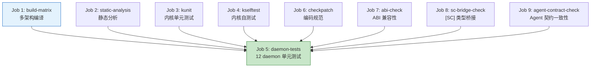

Copyright (c) 2025-2026 SPHARX Ltd. All Rights Reserved.

# agentrt-linux（AirymaxOS）CI/CD 流水线详细设计
> **文档定位**：agentrt-linux（AirymaxOS）120-development-process 模块第 8 卷——CI/CD 流水线详细设计。本文档详述 6 个 CI workflow 的设计、触发条件、资源管理、失败处理，是补丁生命周期（01 卷）CI 强制校验在工具层的完整展开。\
> **文档版本**：v1.0.1\
> **最后更新**：2026-07-18\
> **上级文档**：[120-development-process README](README.md)\
> **同源映射**：agentrt CI/CD 流水线 + Linux 6.6 内核 CI（kernelci.org + 0-Day）\
> **理论根基**：Linux 6.6 内核基线 + Airymax S-4 涌现性管理 + SSoT v2 单一权威源 + C-2 增量演化\
> **核心约束**：6 个 workflow 协同守护五大技术选型；[SC] 双端逐字节校验阻断单端合并；SSoT 四层归属校验阻断违规变更

---

## 1. 模块定位与范围

本文档是 120-development-process 模块的第 8 卷，回答"6 个 CI workflow 各做什么、何时触发、如何并行、如何缓存、失败如何处理"。它继承 Linux 内核 CI（kernelci.org + Intel 0-Day）的设计哲学，并将其适配到 agentrt-linux 的 GitHub Actions 工作流。

### 1.1 与工程标准层的关系

工程标准层 `70-build-system/03-ci-cd-pipeline.md` 定义 CI/CD 的"规则与编号"（OS-BS-3XX），本文档定义 6 个 workflow 在模块设计层的完整实现（OS-DEV-8XX）。

### 1.2 适用范围

本文档适用于 agentrt-linux 8 子仓以及管理仓库 `agentrt-linux-mgmt`。所有 PR、push、定时任务、手动触发的 CI 都在本文档覆盖范围内。

### 1.3 关键术语

| 术语 | 定义 |
|------|------|
| workflow | GitHub Actions 工作流，一个 `.yml` 文件 |
| job | workflow 内的一个任务单元 |
| step | job 内的一个步骤 |
| matrix | 多架构 / 多编译器并行测试矩阵 |
| runner | CI 执行机器（GitHub-hosted / self-hosted） |
| cache | CI 缓存（如 ccache、pip、cargo） |
| artifact | CI 产出物（如 tarball、RPM、日志） |
| quality gate | 质量门，CI 必须通过才能合并 |

### 1.4 6 个 CI workflow 总览

| # | workflow | 主要职责 | 触发条件 | 阻断级别 |
|---|---------|---------|---------|---------|
| 1 | `ci-kernel.yml` | 内核编译 + 静态分析 + KUnit + kselftest | push / PR | 阻断 |
| 2 | `ssot-validate.yml` | SSoT v2 规则校验 + 四层归属校验 + [SC] 数量校验 | push / PR（涉及 SSoT 文件） | 阻断 |
| 3 | `sc-dual-ci.yml` | [SC] 头文件双端逐字节校验 + 编译器无关性 | push / PR（涉及 [SC] 文件） | 阻断 |
| 4 | `nightly.yml` | 全量测试 + 性能基准 + 动态分析 + 覆盖率 | 定时（每日 02:00 UTC） | 不阻断（生成报告） |
| 5 | `release.yml` | RPM 构建 + SBOM 生成 + 签名 + 发布 | tag push / 手动 | 阻断（影响发布） |
| 6 | `mgmt-orchestrator.yml` | 管理仓库同步 + 子仓协调 | push / PR（管理仓库） | 阻断 |

---

## 2. CI 触发条件总览

### 2.1 触发类型

| 触发类型 | 适用 workflow | 说明 |
|---------|-------------|------|
| `push` | 1, 2, 3, 6 | 推送到 `main` / `develop` / `release/*` / `stable-*` 分支 |
| `pull_request` | 1, 2, 3, 6 | PR 提交 / 更新（push 新 commit） |
| `schedule` | 4 | cron 定时（每日 02:00 UTC） |
| `workflow_dispatch` | 4, 5 | 手动触发 |
| `release` (tag push) | 5 | 推送 `v*` 标签 |

### 2.2 路径过滤

为避免无关文件触发 CI，每个 workflow 配置路径过滤：

| workflow | 触发路径 | 排除路径 |
|---------|---------|---------|
| `ci-kernel.yml` | `kernel/**` / `services/**` / `security/**` / `memory/**` / `cognition/**` / `cloudnative/**` / `system/**` | `docs/**` / `*.md` |
| `ssot-validate.yml` | `docs/AirymaxOS/**` / `kernel/include/uapi/linux/airymax/**` / `airy_defconfig` | — |
| `sc-dual-ci.yml` | `kernel/include/uapi/linux/airymax/**`（仅 10 个 [SC] 头文件） | — |
| `nightly.yml` | 全部 | — |
| `release.yml` | tag `v*` | — |
| `mgmt-orchestrator.yml` | `agentrt-linux-mgmt/**` | — |

### 2.3 分支保护规则

| 分支 | 必须通过的 workflow | 必须审查 | 禁止 force push |
|------|------------------|---------|---------------|
| `main` | 1, 2, 3, 6 | ✓ | ✓ |
| `develop` | 1, 2, 3, 6 | ✓ | ✓ |
| `release/*` | 1, 2, 3, 6 | ✓ | ✓ |
| `stable-*` / `lts-*` | 1, 2, 3, 6 | ✓ | ✓ |
| `docs-*` | — | ✓ | ✓ |

---

## 3. workflow 1：ci-kernel.yml

### 3.1 设计目标

`ci-kernel.yml` 是最基础的 CI workflow，负责内核与 daemon 的编译、静态分析、单元测试。每个 PR 必须通过此 workflow 才能合并。

### 3.2 触发条件

```yaml
on:
  push:
    branches: [main, develop, 'release/*', 'stable-*', 'lts-*']
    paths:
      - 'kernel/**'
      - 'services/**'
      - 'security/**'
      - 'memory/**'
      - 'cognition/**'
      - 'cloudnative/**'
      - 'system/**'
  pull_request:
    branches: [main, develop, 'release/*', 'stable-*', 'lts-*']
    paths:
      - 'kernel/**'
      - 'services/**'
      - 'security/**'
      - 'memory/**'
      - 'cognition/**'
      - 'cloudnative/**'
      - 'system/**'
```

### 3.3 Job 结构



### 3.4 Job 1：build-matrix

- **矩阵**：

| 架构 | 编译器 | defconfig |
|------|--------|-----------|
| x86_64 | GCC 13 | `airy_defconfig` |
| x86_64 | Clang 17 | `airy_defconfig` |
| aarch64 | GCC 13 | `airy_defconfig` |
| aarch64 | Clang 17 | `airy_defconfig` |
| riscv64 | GCC 13 | `airy_defconfig` |
| loongarch64 | GCC 13 | `airy_defconfig` |

- **步骤**：
  1. checkout 代码。
  2. 安装编译器与依赖。
  3. 应用 `airy_defconfig`。
  4. **五大选型守护**：扫描 `airy_defconfig` 验证：
     - `# CONFIG_SCHED_EXT is not set`
     - `CONFIG_IO_URING=y`
     - `# CONFIG_BPF_LSM is not set`
     - `CONFIG_SECURITY_AIRY_LSM=y`
  5. `make -j$(nproc)` 编译内核。
  6. 编译 12 daemon（meson）。
  7. 上传构建产物（kernel image、daemon binaries）作为 artifact。
- **失败处理**：任何架构编译失败即 job 失败，阻断 PR。
- **缓存**：ccache 缓存（`~/.ccache`），key 含架构 + 编译器 + lock 文件 hash。

### 3.5 Job 2：static-analysis

- **工具**：
  - `checkpatch.pl`（编码规范）。
  - `sparse`（内核静态分析）。
  - `scan-build`（Clang 静态分析，用于 daemon）。
- **步骤**：
  1. 对所有变更文件运行 `checkpatch.pl --no-tree -f`。
  2. 对内核代码运行 `make C=2`（sparse）。
  3. 对 daemon 代码运行 `scan-build meson compile`。
- **通过标准**：零 error、零 warning。
- **失败处理**：任何 error/warning 即 job 失败。

### 3.6 Job 3：kunit

- **测试范围**：agentrt-linux 内核模块的 KUnit 测试。
- **步骤**：
  1. 编译内核时启用 `CONFIG_KUNIT=y`。
  2. 在 QEMU 中启动内核，运行 KUnit 测试。
  3. 收集测试结果。
- **通过标准**：所有 KUnit 测试通过。
- **失败处理**：任何测试失败即 job 失败。

### 3.7 Job 4：kselftest

- **测试范围**：agentrt-linux 相关的 kselftest 套件。
- **步骤**：
  1. 编译 kselftest。
  2. 在 QEMU 中运行 kselftest。
  3. 收集测试结果。
- **通过标准**：所有 kselftest 通过。
- **失败处理**：任何测试失败即 job 失败。

### 3.8 Job 5：daemon-tests

- **测试范围**：12 daemon 的单元测试与集成测试。
- **步骤**：
  1. 编译 12 daemon。
  2. 运行每个 daemon 的单元测试（meson test）。
  3. 运行 daemon 间集成测试（IPC 协议、监管链路）。
- **通过标准**：所有测试通过。
- **失败处理**：任何测试失败即 job 失败。

### 3.9 Job 6：checkpatch

- **范围**：仅 PR 变更的文件。
- **步骤**：
  1. 获取 PR 变更文件列表。
  2. 对每个文件运行 `checkpatch.pl --no-tree -f`。
- **通过标准**：零 error、零 warning。
- **OS-DEV-801**：checkpatch 失败即阻断 PR，禁止使用 `--ignore` 跳过检查。

### 3.10 Job 7：abi-check

- **范围**：仅涉及 [SC] 头文件变更的 PR。
- **工具**：`libabigail`。
- **步骤**：
  1. 获取上一版本（main 分支 HEAD）的 [SC] 头文件。
  2. 获取本 PR 的 [SC] 头文件。
  3. 运行 `abidiff` 比对。
- **通过标准**：无破坏性 ABI 变更（允许新增，禁止删除/修改）。
- **失败处理**：破坏性 ABI 变更即 job 失败，除非 PR 标记为 `breaking` 且通过 RFC 评审。

### 3.11 Job 8：sc-bridge-check

- **范围**：仅涉及 [SC] 头文件变更的 PR。
- **工具**：`check-sc-bridge.sh`。
- **校验内容**：[SC] 头文件的类型桥接规则（详见 `50-engineering-standards/11-sc-header-type-bridging.md`）。
- **通过标准**：符合桥接规则。

### 3.12 Job 9：agent-contract-check

- **范围**：仅涉及 cognition 子仓变更的 PR。
- **工具**：`check-agent-contract.sh`。
- **校验内容**：Agent 实现与 [SC] `agent_contract.h` 声明的契约一致。
- **通过标准**：契约一致。

---

## 4. workflow 2：ssot-validate.yml

### 4.1 设计目标

`ssot-validate.yml` 守护 SSoT v2 单一权威源模型，确保每个技术点只有一个权威源，且 IRON-9 v3 四层归属一致。

### 4.2 触发条件

```yaml
on:
  push:
    branches: [main, develop, 'release/*', 'stable-*', 'lts-*']
    paths:
      - 'docs/AirymaxOS/**'
      - 'kernel/include/uapi/linux/airymax/**'
      - 'airy_defconfig'
  pull_request:
    branches: [main, develop, 'release/*', 'stable-*', 'lts-*']
    paths:
      - 'docs/AirymaxOS/**'
      - 'kernel/include/uapi/linux/airymax/**'
      - 'airy_defconfig'
```

### 4.3 Job 结构

| Job | 职责 | 通过标准 |
|-----|------|---------|
| 1 | 四层归属校验 | 变更文件正确归属到 [SC] / [SS] / [IND] / [DSL] |
| 2 | 权威源唯一性 | 变更不引入冲突权威源 |
| 3 | [SC] 数量校验 | `kernel/include/uapi/linux/airymax/` 下保持 10 个 [SC] 头文件 |
| 4 | 跨文档引用一致性 | SSoT 注册表中的链接有效 |
| 5 | 五大选型守护 | 变更未偏离五大技术选型 |
| 6 | `airy_defconfig` 锁定 | 五大选型配置不变 |

### 4.4 Job 1：四层归属校验

- **校验内容**：每个变更文件必须明确归属到 IRON-9 v3 四层模型之一：
  - **[SC]**：共享契约层（10 个头文件）。
  - **[SS]**：语义同源层（agentrt 与 agentrt-linux 共享语义但独立实现）。
  - **[IND]**：独立实现层（agentrt-linux 独有）。
  - **[DSL]**：降级生存层（fallback 实现）。
- **校验方式**：根据文件路径与 SSoT 注册表比对。
- **失败处理**：归属错误即 job 失败。

### 4.5 Job 2：权威源唯一性

- **校验内容**：变更不能引入与已有权威源冲突的新权威源声明。
- **校验方式**：扫描变更文件中的"权威源"声明，与 SSoT 注册表比对。
- **失败处理**：冲突即 job 失败。

### 4.6 Job 3：[SC] 数量校验

- **校验内容**：`kernel/include/uapi/linux/airymax/` 下的 [SC] 头文件数量保持为 10 个。
- **校验方式**：统计 `kernel/include/uapi/linux/airymax/*.h` 文件数量。
- **失败处理**：数量不为 10 即 job 失败。
- **OS-DEV-802**：新增或删除 [SC] 头文件必须通过 SSoT 委员会决议，且同步更新 SSoT 注册表。

### 4.7 Job 4：跨文档引用一致性

- **校验内容**：SSoT 注册表（`50-engineering-standards/09-ssot-registry.md`）中的跨文档链接有效。
- **校验方式**：使用 markdown link checker 扫描所有链接。
- **失败处理**：失效链接即 job 失败。

### 4.8 Job 5：五大选型守护

- **校验内容**：变更不能偏离五大技术选型声明：
  - sched_tac（不引入 sched_ext）。
  - IORING_OP_URING_CMD（不引入 page flipping）。
  - 纯 C LSM（不引入 BPF LSM）。
  - alloc_pages + mmap（不引入 DMA 一致性内存）。
  - IRON-9 v3 四层模型（不退化为 v2 三层）。
- **校验方式**：扫描变更文件中的关键词（如 `sched_ext` / `page flipping` / `BPF_LSM` / `dma_alloc_coherent`）。
- **失败处理**：发现偏离关键词即 job 失败，需 SSoT 委员会豁免。

### 4.9 Job 6：airy_defconfig 锁定

- **校验内容**：`airy_defconfig` 中的五大选型配置不变：
  - `# CONFIG_SCHED_EXT is not set`
  - `CONFIG_IO_URING=y`
  - `# CONFIG_BPF_LSM is not set`
  - `CONFIG_SECURITY_AIRY_LSM=y`
- **校验方式**：与上一版本 `airy_defconfig` 比对上述配置项。
- **失败处理**：配置项变更即 job 失败，需 SSoT 委员会豁免。

---

## 5. workflow 3：sc-dual-ci.yml

### 5.1 设计目标

`sc-dual-ci.yml` 守护 10 个 [SC] 头文件的双端（agentrt 与 agentrt-linux）逐字节一致性，以及编译器无关性。

### 5.2 触发条件

```yaml
on:
  push:
    branches: [main, develop, 'release/*', 'stable-*', 'lts-*']
    paths:
      - 'kernel/include/uapi/linux/airymax/**'
  pull_request:
    branches: [main, develop, 'release/*', 'stable-*', 'lts-*']
    paths:
      - 'kernel/include/uapi/linux/airymax/**'
```

### 5.3 Job 结构

| Job | 职责 | 通过标准 |
|-----|------|---------|
| 1 | 双端 PR 检测 | agentrt 端有对应 PR |
| 2 | 双端逐字节校验 | 10 个 [SC] 头文件双端逐字节一致 |
| 3 | 编译器无关性校验 | 通过 `check-uapi-compiler-agnostic.sh` |
| 4 | 五编译器编译 | GCC / Clang / MSVC / icx / armclang 全部编译通过 |
| 5 | ABI 稳定性 | 通过 `check-abi.sh`（libabigail） |

### 5.4 Job 1：双端 PR 检测

- **校验内容**：agentrt-linux 端的 [SC] PR 必须在 agentrt 端有对应 PR。
- **校验方式**：解析 PR 描述中的 agentrt 端 PR 链接，验证链接有效且 PR 存在。
- **失败处理**：未提供 agentrt 端 PR 链接或链接无效即 job 失败。

### 5.5 Job 2：双端逐字节校验

- **校验步骤**：
  1. 从 agentrt-linux 拉取本 PR 分支。
  2. 从 agentrt 拉取对应 PR 分支（使用 GitHub API）。
  3. 提取双端的 10 个 [SC] 头文件。
  4. 对每个文件运行 `diff -u`。
- **通过标准**：10 个文件全部 `diff` 无输出（零字节差异）。
- **失败处理**：任何字节差异即 job 失败，阻断合并。
- **OS-DEV-803**：[SC] 双端校验失败时，CI 评论列出差异，要求双端同步修改。

### 5.6 Job 3：编译器无关性校验

- **工具**：`scripts/check-uapi-compiler-agnostic.sh`。
- **校验内容**：
  - 禁止 GCC 扩展（`__attribute__`、`__builtin_`、`__asm__`）。
  - 禁止 Clang 扩展（`_Clang`、`__has_feature`）。
  - 禁止 MSVC 扩展（`__declspec`、`__int64`）。
  - 必须使用 C11 标准类型。
- **通过标准**：零违反。

### 5.7 Job 4：五编译器编译

- **矩阵**：

| 编译器 | 版本 | 平台 |
|--------|------|------|
| GCC | 13+ | x86_64 |
| Clang | 17+ | x86_64 |
| MSVC | 2022+ | x86_64（交叉编译） |
| icx | 2024+ | x86_64 |
| armclang | 6.20+ | aarch64 |

- **校验步骤**：每个编译器独立编译 10 个 [SC] 头文件。
- **通过标准**：5 种编译器全部编译通过，零 warning。
- **失败处理**：任何编译器编译失败即 job 失败。

### 5.8 Job 5：ABI 稳定性

- **工具**：`scripts/check-abi.sh`（基于 `libabigail`）。
- **校验内容**：与上一版本 [SC] 头文件相比，无破坏性 ABI 变更。
- **通过标准**：无破坏性变更（允许新增，禁止删除/修改）。

---

## 6. workflow 4：nightly.yml

### 6.1 设计目标

`nightly.yml` 是每日全量测试 workflow，执行 PR CI 不便执行的耗时测试（性能基准、动态分析、覆盖率）。其结果不阻断 PR，但生成报告供维护者参考。

### 6.2 触发条件

```yaml
on:
  schedule:
    - cron: '0 2 * * *'  # 每日 02:00 UTC
  workflow_dispatch:      # 手动触发
```

### 6.3 Job 结构

| Job | 职责 | 耗时 |
|-----|------|------|
| 1 | 全量构建 | 30 分钟 |
| 2 | 全量 KUnit + kselftest | 60 分钟 |
| 3 | 性能基准 | 90 分钟 |
| 4 | 动态分析（ASan / KASan / TSan / UBSan） | 120 分钟 |
| 5 | 覆盖率统计 | 60 分钟 |
| 6 | 安全扫描（Trivy / Snyk / Coverity） | 60 分钟 |
| 7 | 上游 Linux LTS 跟踪 | 30 分钟 |
| 8 | 报告生成 | 10 分钟 |

### 6.4 Job 3：性能基准

- **基准指标**：

| 指标 | 工具 | 基线 |
|------|------|------|
| IPC 延迟 | `ipc-latency-bench` | v1.0.0 |
| 调度延迟 | `sched-latency-bench` | v1.0.0 |
| 内存分配延迟 | `mem-alloc-bench` | v1.0.0 |
| 128B 日志吞吐 | `log-throughput-bench` | v1.0.0 |
| Agent 启动时间 | `agent-startup-bench` | v1.0.0 |
| 内核构建时间 | `kernel-build-bench` | v1.0.0 |

- **报告**：与基线对比，列出回归/改进指标。
- **告警**：回归超过 5% 自动通知维护者。

### 6.5 Job 4：动态分析

- **工具矩阵**：

| 工具 | 范围 | 检测内容 |
|------|------|---------|
| ASan | daemon | 用户态内存错误 |
| KASan | kernel | 内核内存错误 |
| ThreadSanitizer | daemon | 数据竞争 |
| KernelThreadSanitizer | kernel | 内核数据竞争 |
| UBSan | kernel + daemon | 未定义行为 |

- **报告**：列出所有发现的错误。
- **告警**：发现错误自动创建 issue。

### 6.6 Job 5：覆盖率统计

- **工具**：`lcov`（内核）+ `gcovr`（daemon）。
- **指标**：行覆盖率、分支覆盖率、函数覆盖率。
- **报告**：与上一版本对比覆盖率变化。
- **告警**：覆盖率下降超过 2% 自动通知维护者。

### 6.7 Job 7：上游 Linux LTS 跟踪

- **跟踪内容**：Linux 6.6 LTS 分支（`linux-6.6.y`）的新 commit。
- **报告**：列出本日新增的 commit，标记是否需要回溯到 agentrt-linux LTS。
- **告警**：发现安全相关 commit 自动通知 LTS 团队。

---

## 7. workflow 5：release.yml

### 7.1 设计目标

`release.yml` 是发布 workflow，负责 RPM 构建、SBOM 生成、签名与发布。

### 7.2 触发条件

```yaml
on:
  push:
    tags:
      - 'v*'  # 推送 v 开头的 tag
  workflow_dispatch:
    inputs:
      version:
        description: '版本号（如 1.0.1）'
        required: true
```

### 7.3 Job 结构

| Job | 职责 |
|-----|------|
| 1 | 构建源码 tarball |
| 2 | 构建 14 个 RPM（12 daemon + kernel + devstation） |
| 3 | 生成 SBOM（CycloneDX） |
| 4 | 生成 `airy_defconfig` 快照 |
| 5 | 生成文档快照 |
| 6 | GPG 签名所有物料 |
| 7 | 实时签名 RPM（若有签名服务） |
| 8 | 上传到 AtomGit releases |
| 9 | 上传到 RPM 仓库 |
| 10 | 发布公告 |

### 7.4 Job 2：RPM 构建

- **构建矩阵**：

| RPM | 架构 | 构建工具 |
|-----|------|---------|
| `agentrt-linux-kernel` | x86_64 / aarch64 / riscv64 / loongarch64 | `rpmbuild` |
| 12 daemon RPM | x86_64 / aarch64 | `rpmbuild` |
| `agentrt-linux-devstation` | x86_64 | `rpmbuild` |

- **依赖**：daemon RPM 依赖 kernel RPM。
- **签名**：RPM 构建后使用 GPG 密钥签名。

### 7.5 Job 3：SBOM 生成

- **工具**：`cyclonedx-cli` + `syft`。
- **格式**：CycloneDX 1.5 JSON。
- **内容**：详见 05 卷第 6.3 节。

### 7.6 Job 6-7：签名

- **GPG 签名**：使用项目 GPG 密钥签名所有物料（tarball、RPM、SBOM、defconfig、文档）。
- **实时签名**：RPM 包使用实时签名服务（如 Sigstore）附加签名。
- **公钥**：项目公钥发布到 `keys.openpgp.org` 与项目 README。

### 7.7 Job 8-9：发布

- **AtomGit releases**：上传 tarball、SBOM、defconfig、文档、release notes。
- **RPM 仓库**：上传 14 个 RPM 到 RPM 仓库，更新仓库元数据。

---

## 8. workflow 6：mgmt-orchestrator.yml

### 8.1 设计目标

`mgmt-orchestrator.yml` 是管理仓库 workflow，负责 8 子仓的协调与同步。

### 8.2 触发条件

```yaml
on:
  push:
    branches: [main, develop]
    paths:
      - 'mgmt/**'
  pull_request:
    branches: [main, develop]
    paths:
      - 'mgmt/**'
  schedule:
    - cron: '0 4 * * *'  # 每日 04:00 UTC 同步检查
```

### 8.3 Job 结构

| Job | 职责 |
|-----|------|
| 1 | 跨仓 PR 状态校验 |
| 2 | 子仓 develop 同步检查 |
| 3 | 子仓版本号一致性校验 |
| 4 | 跨仓依赖图校验 |
| 5 | 协调 issue 自动关闭 |

### 8.4 Job 1：跨仓 PR 状态校验

- **校验内容**：管理仓库中登记的跨仓 PR 全部 ready（所有子仓 PR 通过 CI + 审查）。
- **校验方式**：使用 GitHub API 查询每个子仓 PR 状态。
- **失败处理**：任一子仓 PR 未 ready 即阻止合并。

### 8.5 Job 2：子仓 develop 同步检查

- **校验内容**：8 子仓的 develop 分支与 main 分支的偏离不超过 7 天。
- **校验方式**：比较各子仓 develop 与 main 的最新 commit 时间。
- **告警**：偏离超过 7 天通知维护者。

### 8.6 Job 3：子仓版本号一致性校验

- **校验内容**：8 子仓的版本号一致（同一 minor 版本）。
- **校验方式**：扫描各子仓的 `meson.build` 或 `Makefile` 中的版本号。
- **失败处理**：版本号不一致即 job 失败。

---

## 9. CI 资源管理

### 9.1 Runner 选择

| workflow | Runner | 说明 |
|---------|--------|------|
| `ci-kernel.yml` | self-hosted（x86_64 + aarch64） | 内核编译需要大内存 |
| `ssot-validate.yml` | GitHub-hosted | 轻量校验 |
| `sc-dual-ci.yml` | self-hosted（含 MSVC 编译器） | 需要多种编译器 |
| `nightly.yml` | self-hosted（大内存机器） | 性能基准需要稳定环境 |
| `release.yml` | self-hosted（隔离环境） | 发布需要安全环境 |
| `mgmt-orchestrator.yml` | GitHub-hosted | 轻量校验 |

### 9.2 并发限制

- **PR CI**：同一 PR 同时只允许 1 次 CI 运行（取消旧的，保留新的）。
- **push CI**：同一分支同时只允许 1 次 CI 运行。
- **nightly CI**：全局同时只允许 1 次 nightly 运行。
- **release CI**：全局同时只允许 1 次 release 运行。

```yaml
concurrency:
  group: ${{ github.workflow }}-${{ github.ref }}
  cancel-in-progress: true  # 对 PR CI 启用；对 push/nightly 关闭
```

### 9.3 缓存策略

| 缓存 | 内容 | key | 有效期 |
|------|------|-----|--------|
| ccache | 编译器缓存 | `ccache-<arch>-<compiler>-<lock-hash>` | 7 天 |
| pip | Python 依赖 | `pip-${{ hashFiles('**/requirements.txt') }}` | 7 天 |
| cargo | Rust 依赖（若有） | `cargo-${{ hashFiles('**/Cargo.lock') }}` | 7 天 |
| submodules | Git 子模块 | `submodules-${{ hashFiles('.gitmodules') }}` | 7 天 |
| build | 构建产物（PR 间复用） | `build-<branch>-<arch>` | 1 天 |

### 9.4 资源配额

- **GitHub Actions 配额**：每月 50000 分钟（付费账户）。
- **self-hosted runner 资源**：
  - x86_64 runner：8 台（32 核 / 64GB 内存 / 1TB SSD）。
  - aarch64 runner：4 台（64 核 / 128GB 内存 / 1TB SSD）。
- **OS-DEV-804**：nightly 与 release CI 必须在非工作时间（02:00-08:00 UTC）运行，避免与 PR CI 争抢资源。

---

## 10. CI 失败处理

### 10.1 失败分类

| 失败类型 | 处理方式 |
|---------|---------|
| 代码错误（编译/测试失败） | 阻断 PR，通知作者修复 |
| CI 基础设施错误 | 自动重试 3 次，仍失败则通知 `#ci-infra` 频道 |
| 超时 | 自动重试 1 次，仍超时则通知维护者 |
| flaky 测试 | 标记为 flaky，自动重试 3 次；连续 3 天 flaky 则禁用并创建 issue |

### 10.2 自动重试

- **触发条件**：CI 因基础设施错误（如 runner 离线、网络超时）失败。
- **重试次数**：最多 3 次。
- **退避策略**：指数退避（1 分钟 / 4 分钟 / 9 分钟）。
- **OS-DEV-805**：代码错误禁止自动重试，避免掩盖真实问题。

### 10.3 通知机制

| 事件 | 通知渠道 | 通知对象 |
|------|---------|---------|
| PR CI 失败 | PR 评论 | PR 作者 + 审查者 |
| PR CI 失败超 24 小时未修复 | 邮件 | PR 作者 + 维护者 |
| nightly CI 失败 | 邮件 + 聊天 | 维护者 |
| release CI 失败 | 邮件 + 聊天 + 短信 | 发布团队 + SSoT 委员会 |
| CI 基础设施错误 | 聊天 | `#ci-infra` 频道 |

### 10.4 flaky 测试管理

- **标记**：连续 3 次运行中至少 1 次失败的测试标记为 flaky。
- **隔离**：flaky 测试不阻断 PR，但记入报告。
- **修复**：flaky 测试必须在 14 天内修复，否则禁用并创建 issue。
- **OS-DEV-806**：禁止删除 flaky 测试，必须修复根因。

---

## 11. CI 监控与报表

### 11.1 CI 仪表盘

- **工具**：Grafana + Prometheus。
- **指标**：
  - CI 成功率（按 workflow / job）。
  - CI 平均耗时（按 workflow / job）。
  - CI 队列长度（等待中的 run 数）。
  - runner 利用率。
  - flaky 测试数量。
- **告警**：
  - 成功率低于 95%：通知 `#ci-infra`。
  - 平均耗时增长 20%：通知 `#ci-infra`。
  - runner 利用率超过 90%：通知 `#ci-infra`。

### 11.2 周报

- **内容**：
  - 本周 CI 运行次数与成功率。
  - 本周 flaky 测试列表。
  - 本周性能基准回归/改进。
  - 本周覆盖率变化。
- **发布**：每周一发布到 `#ci-report` 频道与开发周会。

---

## 12. 与 Airymax Unify Design 的关系

| Unify 模块 | CI 关系 |
|-----------|---------|
| **A-UEF** | `ci-kernel.yml` 校验 A-UEF 错误码使用一致性；`ssot-validate.yml` 校验 A-UEF 权威源唯一性 |
| **A-ULP** | `ci-kernel.yml` 校验 A-ULP 日志使用一致性；`sc-dual-ci.yml` 校验 [SC] `log_types.h` 双端一致 |
| **A-UCS** | `ssot-validate.yml` 校验 `airy_defconfig` 五大选型锁定；A-UCS 配置变更触发 SSoT 校验 |
| **A-ULS** | `ci-kernel.yml` 校验纯 C LSM 编译；`ssot-validate.yml` 校验未引入 BPF LSM |
| **A-IPC** | `ci-kernel.yml` 校验 IORING_OP_URING_CMD 路径；`sc-dual-ci.yml` 校验 [SC] `ipc.h` 双端一致；`nightly.yml` 校验 IPC 性能基准 |

---

## 13. 相关文档

- [120-development-process README](README.md)：开发流程主索引
- [01-patch-lifecycle.md](01-patch-lifecycle.md)：补丁生命周期 6 阶段
- [03-pull-requests.md](03-pull-requests.md)：Pull Request 流程规范
- [04-code-review.md](04-code-review.md)：代码审查标准
- [05-stable-releases.md](05-stable-releases.md)：稳定版本发布
- [06-long-term-support.md](06-long-term-support.md)：长期支持策略
- [09-release-process.md](09-release-process.md)：发布流程详细设计
- [../70-build-system/03-ci-cd-pipeline.md](../70-build-system/03-ci-cd-pipeline.md)：工程标准 CI/CD 流水线
- [../50-engineering-standards/09-ssot-registry.md](../50-engineering-standards/09-ssot-registry.md)：SSoT v2 单一权威源注册表
- [../50-engineering-standards/11-sc-header-type-bridging.md](../50-engineering-standards/11-sc-header-type-bridging.md)：[SC] 头文件类型桥接规则
- [../80-testing/README.md](../80-testing/README.md)：测试体系

---

## 14. 版本历史

| 版本 | 日期 | 变更 |
|------|------|------|
| v1.0.1 | 2026-07-18 | 初始版本：建立 6 个 CI workflow 详细设计（`ci-kernel.yml` 9 个 job / `ssot-validate.yml` 6 个 job / `sc-dual-ci.yml` 5 个 job / `nightly.yml` 8 个 job / `release.yml` 10 个 job / `mgmt-orchestrator.yml` 5 个 job）、CI 触发条件（push/PR/定时/手动/tag）、CI 资源管理（self-hosted runner + 并发限制 + 缓存策略）、CI 失败处理（自动重试 + flaky 管理 + 通知机制）、CI 监控与报表（Grafana 仪表盘 + 周报） |

---

> **文档结束** | agentrt-linux CI/CD 流水线详细设计 v1.0.1 | 维护者：开源极境工程与规范委员会 | "From data intelligence emerges."
