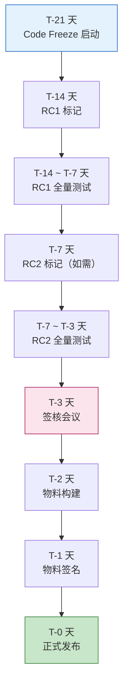
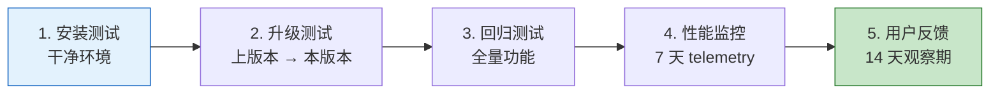
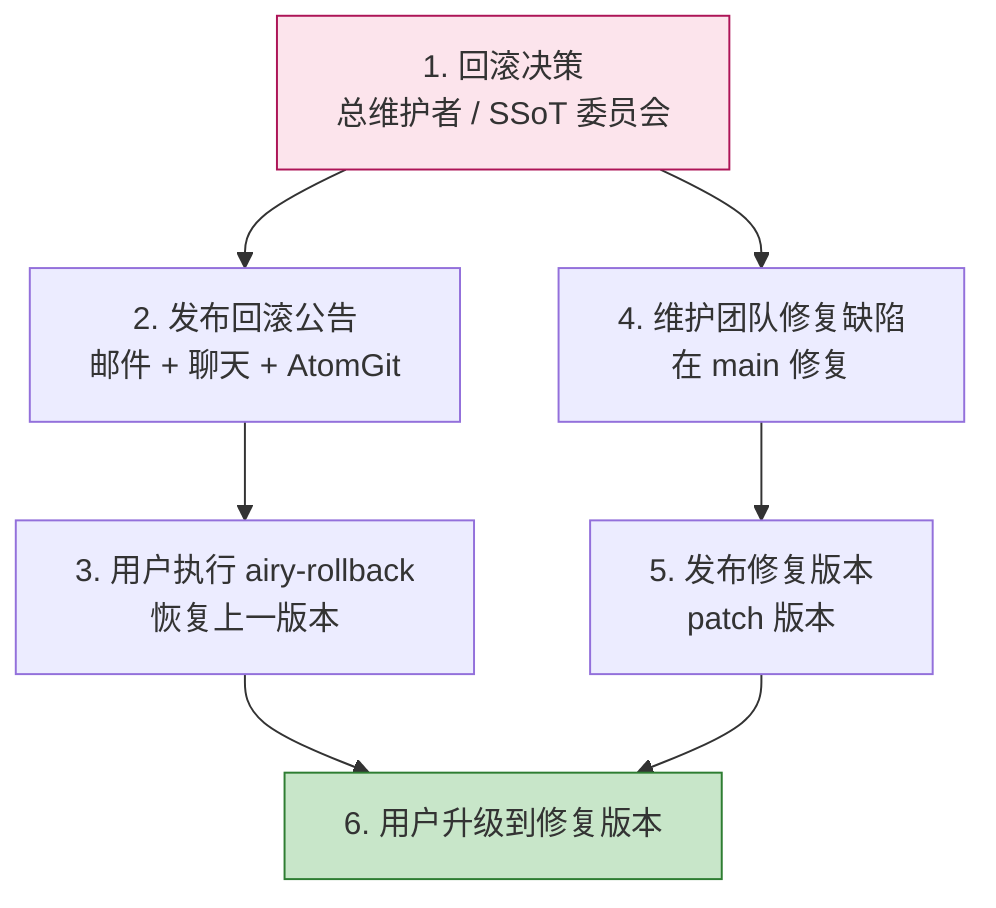

Copyright (c) 2025-2026 SPHARX Ltd. All Rights Reserved.

# agentrt-linux（AirymaxOS）发布流程详细设计
> **文档定位**：agentrt-linux（AirymaxOS）120-development-process 模块第 9 卷——发布流程详细设计。本文档详述发布前准备、发布物料清单、发布签名、发布渠道、发布后验证与回滚策略，是稳定版本发布（05 卷）在工程操作层的完整展开。\
> **文档版本**：v1.0.1\
> **最后更新**：2026-07-18\
> **上级文档**：[120-development-process README](README.md)\
> **同源映射**：agentrt 发布流程 + Linux 6.6 内核发布流程（`release-process.rst` + kernel.org 发布工具链）\
> **理论根基**：Linux 6.6 内核基线 + Airymax S-4 涌现性管理 + SSoT v2 单一权威源 + C-2 增量演化\
> **核心约束**：所有发布物料必须 GPG 签名；RPM 包附加实时签名；发布后必须执行安装/升级/回归验证；回滚通过 `airy-rollback` 命令

---

## 1. 模块定位与范围

本文档是 120-development-process 模块的第 9 卷，回答"发布具体做什么、产出什么物料、如何签名、发布到哪里、发布后如何验证、如何回滚"。它继承 Linux 6.6 内核发布流程（kernel.org 发布工具链），并将其适配到 agentrt-linux 的 RPM 发行模型与 AtomGit 发布渠道。

### 1.1 与稳定版本发布的关系

稳定版本发布（05 卷）规定发布周期、版本号、稳定分支、质量门与支持周期，本文档规定具体发布操作的工程实现。05 卷定义"何时发布、发布什么版本"，本文档定义"如何发布"。

### 1.2 适用范围

本文档适用于 agentrt-linux 所有版本的发布（minor / patch / LTS），包括 8 子仓的源码发布与 14 个 RPM 的二进制发布。

### 1.3 关键术语

| 术语 | 定义 |
|------|------|
| code freeze | 代码冻结，发布前禁止新功能合入 |
| RC | Release Candidate，发布候选 |
| SBOM | Software Bill of Materials，软件物料清单 |
| CycloneDX | SBOM 标准（JSON 格式） |
| GPG 签名 | GNU Privacy Guard 数字签名 |
| 实时签名 | Sigstore / 类似服务的在线签名 |
| airy-rollback | agentrt-linux 回滚命令 |
| 文档快照 | 发布时点的文档分支快照 |
| airy_defconfig | agentrt-linux 内核默认配置文件 |
| devstation | 开发工作站 RPM 包（含 SDK + 工具 + 文档） |

---

## 2. 发布前准备

### 2.1 准备流程总览



### 2.2 步骤 1：Code Freeze（T-21 天）

- **触发**：由总维护者发布冻结公告（issue + 邮件 + 聊天）。
- **效果**：
  - `main` 分支禁止合入新功能 PR（仅接受 bug fix）。
  - `develop` 分支继续接受新功能。
  - 冻结公告列出本版本的范围、已知问题、预期发布日期。
- **冻结期间 PR 政策**：
  - bug fix PR：优先审查，48 小时内响应。
  - 文档 PR：正常审查。
  - 新功能 PR：延迟到下个版本（解冻后合并）。
- **OS-DEV-901**：冻结期间禁止合入影响五大选型的 PR。

### 2.3 步骤 2：RC1 标记（T-14 天）

- **操作**：
  1. 从 `main` 拉出 `release/vMAJOR.MINOR` 分支。
  2. 在 `release/vMAJOR.MINOR` 标记 `vMAJOR.MINOR-rc1` tag。
  3. 触发 `release.yml` workflow 构建 RC1 物料。
- **RC1 物料**：
  - 源码 tarball：`agentrt-linux-MAJOR.MINOR-rc1.tar.xz`。
  - 14 个 RPM（RC 版本，标记 `rc1`）。
  - SBOM（RC 版本）。
  - `airy_defconfig` 快照。
- **RC1 公告**：发布 RC1 公告，邀请社区测试。

### 2.4 步骤 3：RC1 全量测试（T-14 ~ T-7 天）

由 QA 团队执行以下测试：

| 测试类型 | 范围 | 通过标准 |
|---------|------|---------|
| 全量功能测试 | 12 daemon + 内核 | 所有测试通过 |
| 性能基准 | 6 项关键指标 | 无回归（容差 5%） |
| 动态分析 | ASan / KASan / TSan / UBSan | 零错误 |
| 安全扫描 | Trivy / Snyk / Coverity | 零高危 |
| ABI 兼容性 | libabigail | 无破坏性变更 |
| Agent 契约兼容性 | `check-agent-contract.sh` | 无破坏性变更 |
| [SC] 双端一致 | `sc-dual-ci.yml` | 双端逐字节一致 |
| SSoT 校验 | `ssot-validate.yml` | 四层归属一致 |
| 升级测试 | 上版本 → RC1 | 升级路径通过 |
| 回滚测试 | RC1 → 上版本 | 回滚路径通过 |
| 兼容性测试 | 与上版本 ABI / 契约 / 配置兼容 | 全部兼容 |

### 2.5 步骤 4：RC2 标记（T-7 天，如需）

- **触发条件**：RC1 测试发现 P0/P1 缺陷。
- **操作**：
  1. 在 `release/vMAJOR.MINOR` 修复缺陷。
  2. 标记 `vMAJOR.MINOR-rc2` tag。
  3. 触发 `release.yml` 构建 RC2 物料。
- **RC 数量**：通常 1-2 个 RC；超过 3 个 RC 由 SSoT 委员会决定是否延期。

### 2.6 步骤 5：签核会议（T-3 天）

- **参与者**：SSoT 委员会（5 名顶级子系统维护者 + 总维护者）+ 发布团队 + QA 团队。
- **议程**：
  - QA 团队汇报 RC 测试结果。
  - 发布团队汇报发布物料清单。
  - SSoT 委员会评估质量门达标情况。
  - 投票决议是否发布。
- **决议**：
  - 通过：签核发布，进入物料构建。
  - 延期：列出阻塞项与重新签核时间。
- **签核记录**：在 `agentrt-linux-mgmt` 仓库创建签核 issue，记录每位签核人的签字。

---

## 3. 发布物料清单

### 3.1 物料清单总览

| # | 物料 | 格式 | 签名 | 上传位置 |
|---|------|------|------|---------|
| 1 | 源码 tarball | `.tar.xz` | GPG | AtomGit releases |
| 2 | 内核 RPM（4 架构） | `.rpm` × 4 | GPG + 实时签名 | RPM 仓库 |
| 3 | 12 daemon RPM（2 架构） | `.rpm` × 24 | GPG + 实时签名 | RPM 仓库 |
| 4 | devstation RPM | `.rpm` | GPG | RPM 仓库 |
| 5 | SBOM | CycloneDX JSON | GPG | AtomGit releases |
| 6 | `airy_defconfig` | text | GPG | AtomGit releases |
| 7 | 文档快照 | `.tar.xz` | GPG | AtomGit releases |
| 8 | release notes | Markdown | GPG | AtomGit releases |
| 9 | 校验和文件 | `.sha256sum` | GPG | AtomGit releases |
| 10 | 公钥 | `.asc` | — | AtomGit releases + keys.openpgp.org |
| 11 | 签核记录 | Markdown | GPG | `agentrt-linux-mgmt` |
| 12 | ABI 报告 | Markdown | GPG | AtomGit releases |

### 3.2 源码 tarball

- **生成命令**：`git archive --format=tar --prefix=agentrt-linux-MAJOR.MINOR.PATCH/ vMAJOR.MINOR.PATCH | xz > agentrt-linux-MAJOR.MINOR.PATCH.tar.xz`
- **内容**：8 子仓的源码 + 文档 + 构建脚本。
- **大小**：约 200 MB（含 .tar.xz 压缩）。
- **校验和**：`sha256sum agentrt-linux-MAJOR.MINOR.PATCH.tar.xz > agentrt-linux-MAJOR.MINOR.PATCH.tar.xz.sha256sum`

### 3.3 RPM 包清单

| # | RPM 包名 | 内容 | 架构 |
|---|---------|------|------|
| 1 | `agentrt-linux-kernel` | 内核镜像 + 模块 + `airy_defconfig` | x86_64 / aarch64 / riscv64 / loongarch64 |
| 2 | `agentrt-linux-macro-superv` | macro_d daemon | x86_64 / aarch64 |
| 3 | `agentrt-linux-logger` | logger_d | x86_64 / aarch64 |
| 4 | `agentrt-linux-config` | config_d | x86_64 / aarch64 |
| 5 | `agentrt-linux-gateway` | gateway_d | x86_64 / aarch64 |
| 6 | `agentrt-linux-sched` | sched_d | x86_64 / aarch64 |
| 7 | `agentrt-linux-vfs` | vfs_d | x86_64 / aarch64 |
| 8 | `agentrt-linux-net` | net_d | x86_64 / aarch64 |
| 9 | `agentrt-linux-mem` | mem_d | x86_64 / aarch64 |
| 10 | `agentrt-linux-cogn` | cogn_d | x86_64 / aarch64 |
| 11 | `agentrt-linux-sec` | sec_d + 纯 C LSM 模块 | x86_64 / aarch64 |
| 12 | `agentrt-linux-audit` | audit_d | x86_64 / aarch64 |
| 13 | `agentrt-linux-dev` | dev_d | x86_64 / aarch64 |
| 14 | `agentrt-linux-devstation` | 开发工具 + SDK + 文档 | x86_64 |

### 3.4 SBOM 内容

SBOM 采用 CycloneDX 1.5 JSON 格式，内容包括：

- **顶层组件**：agentrt-linux vMAJOR.MINOR.PATCH。
- **子组件**：12 daemon + kernel + devstation。
- **依赖关系**：组件间的依赖图。
- **第三方组件**：所有第三方库（musl libc、busybox、liburcu 等）。
- **许可证**：每个组件的开源许可证。
- **版本信息**：精确版本 + commit hash。
- **CVE 信息**：已知 CVE 与修复状态。
- **构建环境**：编译器版本、构建机器信息（用于可重现构建）。

### 3.5 `airy_defconfig` 快照

- **内容**：本版本锁定的内核配置文件。
- **校验**：包含五大选型配置：
  - `# CONFIG_SCHED_EXT is not set`
  - `CONFIG_IO_URING=y`
  - `# CONFIG_BPF_LSM is not set`
  - `CONFIG_SECURITY_AIRY_LSM=y`
  - 其他 agentrt-linux 特有配置。
- **用途**：用户可基于此配置自行编译内核。

### 3.6 文档快照

- **内容**：本版本发布时点的全部设计文档。
- **格式**：`.tar.xz` 压缩包。
- **来源**：从 `docs-lts-vX.Y` 或 `docs-vX.Y` 分支导出。
- **用途**：归档本版本的文档状态，便于离线查阅与历史追溯。

### 3.7 release notes

- **格式**：Markdown。
- **内容**：
  - 版本概述（版本号、发布日期、类型）。
  - 新特性（minor 版本）。
  - 修复的缺陷（含 `Fixes:` 引用）。
  - 安全修复（含 CVE 编号）。
  - 已知问题。
  - 升级说明（兼容性、迁移路径）。
  - 贡献者列表。
  - 物料校验和。

---

## 4. 发布签名

### 4.1 签名体系总览


### 4.2 GPG 签名

- **签名密钥**：项目 GPG 主密钥（4096 位 RSA）。
- **密钥管理**：
  - 主密钥离线保管（HSM 或气隙机器）。
  - 子密钥用于日常签名（每年轮换）。
  - 主密钥指纹发布到 README 与 `keys.openpgp.org`。
- **签名命令**：`gpg --detach-sign --armor <file>`，生成 `<file>.asc` 签名文件。
- **签名范围**：所有物料（tarball、RPM、SBOM、defconfig、文档、release notes、校验和文件）。
- **OS-DEV-902**：禁止使用未签名的物料进行发布。

### 4.3 实时签名

- **签名服务**：使用 Sigstore（Fulcio + Rekor）进行实时签名。
- **签名对象**：14 个 RPM 包。
- **签名流程**：
  1. RPM 构建完成后，上传到 Sigstore 签名服务。
  2. 签名服务使用短期证书签名 RPM。
  3. 签名记录写入 Rekor 透明日志。
- **优势**：
  - 短期证书避免密钥泄露风险。
  - 透明日志提供可审计性。
  - 用户可在线验证签名。

### 4.4 公钥发布

- **公钥位置**：
  - AtomGit releases 中的 `public-key.asc`。
  - `keys.openpgp.org` 上的项目公钥。
  - README 中的主密钥指纹。
- **公钥轮换**：子密钥每年轮换；主密钥 5 年轮换。
- **公钥撤销**：若密钥泄露，立即发布撤销证书并发布新公钥。

### 4.5 用户验证

用户下载物料后，必须验证签名：

```bash
# 下载公钥
gpg --recv-keys <主密钥指纹>

# 验证 tarball 签名
gpg --verify agentrt-linux-1.0.1.tar.xz.asc agentrt-linux-1.0.1.tar.xz

# 验证 RPM 签名
rpm --checksig agentrt-linux-kernel-1.0.1.x86_64.rpm

# 验证校验和
sha256sum -c agentrt-linux-1.0.1.tar.xz.sha256sum
```

---

## 5. 发布渠道

### 5.1 渠道总览

| 渠道 | 内容 | 受众 |
|------|------|------|
| AtomGit releases | tarball + SBOM + defconfig + 文档 + release notes + 公钥 | 所有用户 |
| RPM 仓库 | 14 个 RPM | RPM 用户 |
| 容器镜像仓库 | agentrt-linux 容器镜像 | 容器用户 |
| 文档站点 | 在线文档（含本版本快照） | 所有用户 |
| 邮件列表 | 发布公告 | 订阅者 |
| 聊天频道 | 发布公告 | 社区成员 |

### 5.2 AtomGit releases

- **release 标题**：`agentrt-linux vMAJOR.MINOR.PATCH`。
- **release 描述**：release notes 内容。
- **附件**：所有物料（tarball、SBOM、defconfig、文档、release notes、校验和、公钥、签名）。
- **标签**：`latest`（最新稳定版）/ `lts`（LTS 版本）/ `rc`（RC 版本）/ `archived`（已 EOL 版本）。

### 5.3 RPM 仓库

- **仓库结构**：

```
rpm-repo/
├── stable/                  # 稳定版
│   ├── 1.0/
│   │   ├── x86_64/
│   │   ├── aarch64/
│   │   ├── riscv64/
│   │   └── loongarch64/
│   ├── 1.0.1/
│   └── ...
├── lts/                     # LTS 版本
│   └── 1.0-lts/
├── rc/                      # RC 版本
│   └── 1.1-rc1/
└── archive/                 # 已 EOL 版本
```

- **仓库元数据**：`repodata/repomd.xml`（含 GPG 签名）。
- **用户配置**：用户在 `/etc/yum.repos.d/agentrt-linux.repo` 配置仓库地址。

### 5.4 容器镜像仓库

- **镜像名**：`spharx/agentrt-linux:vMAJOR.MINOR.PATCH`。
- **镜像内容**：最小化 agentrt-linux 系统（内核 + 12 daemon + 必要工具）。
- **签名**：容器镜像使用 Cosign 签名。
- **架构**：x86_64 / aarch64 多架构镜像。

---

## 6. 发布后验证

### 6.1 验证流程



### 6.2 安装测试

- **环境**：干净的虚拟机 / 物理机（x86_64 + aarch64）。
- **步骤**：
  1. 安装内核 RPM：`dnf install agentrt-linux-kernel-1.0.1`。
  2. 安装 12 daemon RPM：`dnf install agentrt-linux-*`。
  3. 重启系统。
  4. 验证 12 daemon 启动：`systemctl status macro-superv logger ...`。
  5. 验证五大选型：`zcat /proc/config.gz | grep -E 'SCHED_EXT|IO_URING|BPF_LSM|AIRY_LSM'`。
  6. 运行冒烟测试套件。
- **通过标准**：所有步骤通过。

### 6.3 升级测试

- **环境**：已安装上一版本（如 v0.1.1）。
- **步骤**：
  1. `dnf upgrade agentrt-linux-*`。
  2. 重启系统。
  3. 验证 12 daemon 启动。
  4. 验证配置兼容性（`airy_defconfig` 不变）。
  5. 验证 Agent 契约兼容性。
  6. 验证 [SC] 头文件 ABI 兼容性。
  7. 运行回归测试套件。
- **通过标准**：所有步骤通过，无兼容性问题。

### 6.4 回归测试

- **范围**：全量回归测试套件（含 12 daemon 单元测试 + 集成测试 + 内核 KUnit + kselftest）。
- **执行**：自动化执行（QA 团队的 CI 系统）。
- **通过标准**：所有测试通过，无回归。

### 6.5 性能监控

- **时长**：发布后 7 天。
- **指标**：6 项关键性能指标（IPC 延迟、调度延迟、内存分配延迟、日志吞吐、Agent 启动时间、内核构建时间）。
- **告警**：任何指标回归超过 5% 自动告警。
- **处理**：回归严重时发布 patch 版本修复。

### 6.6 用户反馈观察期

- **时长**：发布后 14 天。
- **渠道**：GitHub issues、邮件列表、聊天频道。
- **响应**：P0 缺陷 7 天内修复并发布 patch 版本；P1 缺陷 14 天内修复。
- **OS-DEV-903**：发布后 14 天内发现的 P0 缺陷必须在 7 天内发布 patch 版本。

---

## 7. 回滚策略

### 7.1 回滚触发条件

- 发布后发现 P0 缺陷且无法在 24 小时内修复。
- 发布后性能严重回归（> 20%）。
- 发布后安全扫描发现遗漏的高危 CVE。
- 发布后用户大规模反馈无法使用。
- **OS-DEV-904**：回滚决策由总维护者或 SSoT 委员会作出。

### 7.2 回滚命令：airy-rollback

agentrt-linux 提供 `airy-rollback` 命令用于一键回滚：

```bash
# 回滚到上一版本
airy-rollback

# 回滚到指定版本
airy-rollback --to 0.1.1

# 回滚到指定快照
airy-rollback --snapshot 2026-02-05
```

### 7.3 回滚流程



### 7.4 快照恢复机制

- **快照创建**：每次安装/升级 agentrt-linux 时，自动创建系统快照：
  - 内核镜像快照（`/boot/agentrt-linux-<version>.img`）。
  - daemon 二进制快照（`/var/lib/agentrt-linux/snapshots/<version>/`）。
  - 配置快照（`/etc/agentrt-linux/snapshots/<version>/`）。
- **快照保留**：保留最近 3 个版本的快照。
- **恢复方式**：`airy-rollback` 从快照恢复，无需重新下载 RPM。

### 7.5 回滚验证

- 回滚后必须验证：
  - 12 daemon 启动正常。
  - 五大选型配置不变。
  - 数据完整性（日志、配置、Agent 状态）。
  - 性能恢复正常。

### 7.6 回滚后处理

- 修复缺陷后发布修复版本（patch 版本）。
- 用户从回滚版本直接升级到修复版本。
- 回滚原因与修复方案记入 release notes。
- 严重回滚事件由 SSoT 委员会进行事后复盘，输出改进措施。

---

## 8. 发布公告

### 8.1 公告渠道

| 渠道 | 内容 | 时机 |
|------|------|------|
| AtomGit releases | 完整 release notes | 发布时 |
| 邮件列表 | 发布公告摘要 | 发布时 |
| 聊天频道 | 发布通知 + 链接 | 发布时 |
| 文档站点 | 在线文档更新 | 发布时 |
| 社交媒体 | 发布通知 | 发布后 1 小时内 |

### 8.2 公告内容

公告包括以下内容：

- 版本号与发布日期。
- 版本类型（minor / patch / LTS / RC）。
- 主要变更（新特性 / 修复 / 安全修复）。
- 升级说明（兼容性、迁移路径）。
- 已知问题。
- 物料下载链接。
- 物料校验与签名验证说明。
- 贡献者列表。
- 反馈渠道。

---

## 9. 发布归档

### 9.1 归档内容

| 归档项 | 位置 | 保留期 |
|--------|------|--------|
| 源码 tarball | AtomGit releases | 永久 |
| RPM 包 | RPM 仓库 `archive/` | 永久 |
| SBOM | `sbom/MAJOR.MINOR.PATCH/` | 永久 |
| `airy_defconfig` | AtomGit releases | 永久 |
| 文档快照 | `docs-AirymaxOS-vMAJOR.MINOR` 分支 | 永久 |
| release notes | `docs/AirymaxOS/190-distribution/release-notes/` | 永久 |
| 签核记录 | `agentrt-linux-mgmt/releases/MAJOR.MINOR.PATCH/` | 永久 |
| ABI 报告 | `abi-reports/MAJOR.MINOR.PATCH/` | 永久 |
| 构建日志 | CI 系统 | 1 年 |

### 9.2 归档访问

- 永久归档的物料通过 AtomGit releases 与 RPM 仓库 `archive/` 目录公开访问。
- EOL 版本的物料移至 `archive/` 目录，但仍可访问。
- OS-DEV-905：禁止删除已发布的物料，即使是严重缺陷版本（保留历史可追溯性）。

---

## 10. 发布质量门

### 10.1 质量门清单

| # | 质量门 | 工具 | 通过标准 | 阻断级别 |
|---|--------|------|---------|---------|
| 1 | CI 全绿 | GitHub Actions | 6 个 workflow 全绿 | 阻断 |
| 2 | 性能基准达标 | `perf-benchmark` | 关键指标无回归（容差 5%） | 阻断 |
| 3 | 安全扫描通过 | Trivy + Snyk + Coverity | 零高危 CVE | 阻断 |
| 4 | 测试覆盖达标 | `coverage-report` | 行覆盖 ≥ 80%，分支覆盖 ≥ 70% | 阻断 |
| 5 | ABI 兼容性 | libabigail | 无破坏性 ABI 变更 | 阻断 |
| 6 | Agent 契约兼容性 | `check-agent-contract.sh` | 无破坏性契约变更 | 阻断 |
| 7 | [SC] 双端一致 | `sc-dual-ci.yml` | 双端逐字节一致 | 阻断 |
| 8 | SSoT 校验通过 | `ssot-validate.yml` | 四层归属一致 | 阻断 |
| 9 | 文档完整 | `doc-check.sh` | 接口/行为变更已更新文档 | 强制 |
| 10 | release notes 完整 | 人工 | 已编写并评审 | 强制 |
| 11 | 签核记录完整 | 人工 | SSoT 委员会签字 | 强制 |
| 12 | 物料签名完整 | GPG + 实时签名 | 所有物料已签名 | 阻断 |

### 10.2 质量门豁免

- 任何阻断级质量门失败必须延期发布。
- 强制级质量门失败可由 SSoT 委员会豁免（需记录豁免理由）。
- OS-DEV-906：禁止为追赶发布窗口而豁免阻断级质量门。

---

## 11. 与 Airymax Unify Design 的关系

| Unify 模块 | 发布关系 |
|-----------|---------|
| **A-UEF** | 发布前校验 A-UEF 错误码与上版本兼容；新增错误码记入 release notes |
| **A-ULP** | 发布前校验 A-ULP 128B 记录格式与上版本兼容；格式变更记入 release notes |
| **A-UCS** | 发布前校验 `airy_defconfig` 锁定五大选型；config 变更记入 release notes |
| **A-ULS** | 发布前校验纯 C LSM 模块与上版本兼容；安全钩子变更记入 release notes |
| **A-IPC** | 发布前校验 IORING_OP_URING_CMD 路径与上版本兼容；IPC 协议变更记入 release notes |

---

## 12. 相关文档

- [120-development-process README](README.md)：开发流程主索引
- [01-patch-lifecycle.md](01-patch-lifecycle.md)：补丁生命周期 6 阶段
- [05-stable-releases.md](05-stable-releases.md)：稳定版本发布
- [06-long-term-support.md](06-long-term-support.md)：长期支持策略
- [08-ci-cd-pipeline.md](08-ci-cd-pipeline.md)：CI/CD 流水线详细设计
- [../50-engineering-standards/05-development-process.md](../50-engineering-standards/05-development-process.md)：工程标准开发流程
- [../190-distribution/README.md](../190-distribution/README.md)：发行与分发
- [../70-build-system/03-ci-cd-pipeline.md](../70-build-system/03-ci-cd-pipeline.md)：CI/CD 流水线
- [../110-security/07-airy-lsm-design.md](../110-security/07-airy-lsm-design.md)：纯 C LSM 设计

---

## 13. 版本历史

| 版本 | 日期 | 变更 |
|------|------|------|
| v1.0.1 | 2026-07-18 | 初始版本：建立 5 步发布前准备流程（code freeze → RC1 → 测试 → RC2 → 签核）、12 项发布物料清单（含 14 个 RPM × 4 架构 + SBOM + defconfig + 文档快照）、GPG + 实时签名双签名体系、4 类发布渠道（AtomGit + RPM 仓库 + 容器镜像 + 文档站点）、5 步发布后验证（安装 + 升级 + 回归 + 性能监控 + 用户反馈）、`airy-rollback` 回滚策略（含快照恢复机制）、12 项发布质量门、发布归档规范 |

---

> **文档结束** | agentrt-linux 发布流程详细设计 v1.0.1 | 维护者：开源极境工程与规范委员会 | "From data intelligence emerges."
