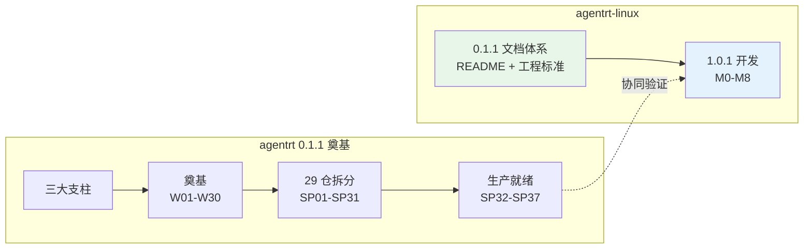
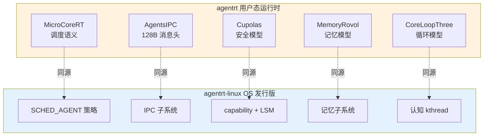

Copyright (c) 2025-2026 SPHARX Ltd. All Rights Reserved.

# agentrt-linux（AirymaxOS）开发策略

> **文档定位**：agentrt-linux（AirymaxOS，极境智能体操作系统）开发策略与三大支柱详解\
> **版本**：0.1.1（文档体系完成）/ 1.0.1（开发）\
> **最后更新**：2026-07-06\
> **同源映射**：agentrt `0.1.1技术全面改进方案v3.0.md`（v4.2，三大支柱）\
> **理论根基**：Linux 6.6 内核基线 + Airymax 五维正交 24 原则

---

## 1. 开发策略概述

### 1.1 总策略

agentrt-linux 采用**"工程标准先行 + 模块化并行 + 渐进式发布"**的开发策略，与 agentrt 0.1.1 奠基版本并行（agentrt 在前，agentrt-linux 在后）：

| 策略要素 | 含义 | 体现 |
|---------|------|------|
| **工程标准先行** | 工程标准规范在所有代码之前完成；规范是代码的"宪法" | Part 1 → 其余 Part |
| **模块化并行** | 架构、测试、可观测、安全、治理可并行推进 | Part 2-6 并行 |
| **渐进式发布** | 0.1.1 文档体系 → 1.0.1 开发 → 1.1.x 协同；每阶段可验证 | 双版本策略 |

### 1.2 与 agentrt 0.1.1 奠基版本的并行关系

agentrt 0.1.1 先完成奠基（atoms 解耦、CoreKern 精简、taskflow 修复、SDK 4 语言、许可证合规、29 仓拆分、生产就绪），随后 agentrt-linux 1.0.1 基于 agentrt 同源语义开始内核与 OS 开发，两端在 1.0.1 阶段协同验证。

### 1.3 策略原则

开发策略遵循三条核心原则：

1. **不破坏用户空间**——用户空间 ABI 永不破坏（K-2 接口契约化）；任何 ABI 改动必须经 RFC + 6 个月宽限期。
2. **regression 不可接受**——E-6 错误可追溯；任何补丁不得引入回归，回归必须 Fixes: 标签修复。
3. **审查优先**——A-3 人文关怀；任何代码进入主线必须经过 Reviewed-by 审查，无例外。

---

## 2. 三大开发支柱详解

agentrt-linux 开发方案由三大支柱构成。三大支柱对应"标准 → 设计 → 治理"的递进关系。

### 2.1 工程标准与规范体系（Part 1）

**范围**: `50-engineering-standards/` 全部 8 文档

| 文档 | 核心问题 | 工时 |
|------|---------|------|
| README.md | 工程标准总纲是什么？ | 含在 Part 1 |
| 01-coding-standards.md | 代码该怎么写？ | 含在 Part 1 |
| 02-code-format.md | 代码长什么样？ | 含在 Part 1 |
| 03-code-style.md | 代码该怎么思考？ | 含在 Part 1 |
| 04-engineering-philosophy.md | 工程体系怎么建立？ | 含在 Part 1 |
| 05-development-process.md | 代码怎么进入主线？ | 含在 Part 1 |
| 06-toolchain-and-automation.md | 规范怎么被执行？ | 含在 Part 1 |
| 07-maintainers-and-governance.md | 项目怎么被治理？ | 含在 Part 1 |

**与 agentrt 工程标准的关系（IRON-9 v2 同源且部分代码共享）**:

- **同源**: 与 agentrt `0.1.1工程标准规范手册.md`（v28.0）共享 17 类规则编号体系骨架（IRON/BAN/STD/ACC 等）；共享五维正交 24 原则作为顶层设计哲学；共享 E-7 文档即代码、E-6 错误可追溯等核心工程观。
- **独立**: agentrt-linux 是 OS 发行版，工程标准必须独立处理内核 ABI 稳定性、内核内部 API 不稳定性、补丁生命周期、维护者层级制度等 agentrt 不涉及的领域；同时为内核态特有场景（驱动模型、构建系统、可观测性、安全 LSM）制定专门规范。
- **新增编号前缀**: OS-IRON / OS-BAN / OS-STD / OS-ACC（继承 agentrt）+ OS-KER / OS-DRV / OS-BUILD / OS-TEST / OS-OBS / OS-SEC / OS-ABI（全新，agentrt 不涉及）。

**关键设计**:

- **Linux 6.6 内核基线**——继承 Linux 内核 30+ 年沉淀的工程思想（不破坏用户空间 ABI、不维护稳定内部 API、goto 集中错误处理、强制工具链、信任链分层维护者制度）。
- **4 层接口稳定性分级**——L1 Agent API（极稳定）/ L2 智能体运行时接口（中等稳定）/ L3 内核子系统接口（可重构）/ L4 内部实现（完全自由）。
- **7 层自动化验证**——checkpatch + 编译 + 单元测试 + 集成测试 + 性能基准 + Soak + 形式化验证。

### 2.2 架构与模块设计（Part 2）

**范围**: `10-architecture/` + `20-modules/` 完善 + `60-driver-model/` + `70-build-system/`

**8 子仓设计完善**:

| # | 子仓 | 中文 | 核心职责 | 同源 agentrt |
|---|------|------|---------|--------------|
| 1 | kernel | 极境内核 | Linux 6.6 内核基线 + 微内核化改造（sched_ext + eBPF + io_uring + Rust） | atoms/corekern（MicroCoreRT） |
| 2 | services | 极境服务 | 用户态系统服务（VFS + 网络 + 驱动 + 12 daemons 集成） | daemons |
| 3 | security | 极境安全 | capability 安全 + LSM + 机密计算 + 国密 | cupolas |
| 4 | memory | 极境记忆 | 记忆持久化 + CXL + PMEM + MGLRU | heapstore + memoryrovol |
| 5 | cognition | 极境认知 | CoreLoopThree kthread + Wasm + LLM 调度 + 超节点沙箱 | coreloopthree + frameworks |
| 6 | cloudnative | 极境云原生 | K8s + containerd + OCI + agentctl + 超节点 OS | gateway + sdk |
| 7 | system | 极境系统 | 包管理 + 配置 + shell + 基础库 + DevStation | commons |
| 8 | airymaxos-tests-linux | 极境测试 | 单元测试 + 集成测试 + 形式化验证 + Soak + 混沌 | 全模块测试 |

**微内核化改造策略**（K-1 内核极简）:

| 改造方向 | 当前（Linux 6.6） | 目标（agentrt-linux 1.0.1） |
|---------|-------------------|------------------------|
| 调度类 | CFS + EEVDF | + SCHED_AGENT（sched_ext BPF 调度器，与 MicroCoreRT 同源） |
| 驱动 | 内核态驱动 | 驱动用户态化（DPDK/SPDK 模式 + capability 隔离） |
| IPC | System V + POSIX | + AgentsIPC 128B 消息头（与 agentrt 同源） |
| 安全 | LSM 钩子 | + capability 安全模型（与 Cupolas 同源） |
| 内存 | buddy + slab | + MGLRU 多代 LRU + 记忆卷载（与 MemoryRovol 同源） |
| 认知 | 无 | + CoreLoopThree kthread（与 agentrt 同源） |

**用户态服务化**（K-3 服务隔离）:

- VFS、网络协议栈、设备驱动尽可能下沉到用户态守护进程
- 内核仅保留不可再分的原子机制（IPC、地址空间、调度、时间）
- 服务崩溃不拖垮内核稳定性（演进安全网）

### 2.3 开发流程与治理（Part 6）

**范围**: `120-development-process/` 9 文档 + `50-engineering-standards/07-maintainers-and-governance.md`

**维护者制度建立**:

- **MAINTAINERS 文件**——每个子仓 / 子系统有明确维护者（继承 Linux MAINTAINERS 范式）
- **Lieutenant System**——分层维护者（子系统维护者 → 模块维护者 → 总维护者）
- **DCO 验证**——Signed-off-by 链条，DCO bot 自动验证（继承 Linux DCO）
- **6 级成熟度模型**——从 "Experimental" 到 "Stable" 的渐进式成熟度评估

**6 级成熟度模型**:

| 级别 | 名称 | 标准 |
|------|------|------|
| 1 | Experimental | 设计草案 + 原型验证 |
| 2 | Alpha | 单元测试覆盖 + 基本 CI |
| 3 | Beta | 集成测试 + 文档完整 |
| 4 | RC | 性能基准 + Soak 测试通过 |
| 5 | Stable | 7 层验证全部就位 + 维护者制度落地 |
| 6 | LTS | 长期支持 + ABI 冻结 |

---

## 3. 9 部分开发方案

agentrt-linux 开发方案拆分为 9 个 Part。以下详述每个 Part 的范围、优先级、依赖与工时。

### Part 1: 工程标准与规范体系建立

| 维度 | 内容 |
|------|------|
| **范围** | `50-engineering-standards/` 全部 8 文档（README + 01-07） |
| **优先级** | P0 前置（无依赖） |
| **依赖** | 无 |
| **工时** | 240h |
| **里程碑** | M0（2 周） |
| **完成标准** | 8 文档完成 + OS 工程规则编号体系注册表建立 + 与 agentrt IRON-9 v2 同源且部分代码共享关系明确 |

**关键产出**:
- 代码规范 / 代码格式 / 代码风格三大主题（继承 Linux coding-style.rst）
- 工程思想（双层稳定性哲学 + 4 层接口稳定性分级）
- 开发流程（补丁生命周期 + 维护者层级）
- 工具链与自动化（7 层验证）
- 维护者制度与治理（MAINTAINERS + 6 级成熟度模型 + DCO）

### Part 2: 架构与模块设计完善

| 维度 | 内容 |
|------|------|
| **范围** | `10-architecture/` + `20-modules/` 完善 + `60-driver-model/` + `70-build-system/` |
| **优先级** | P0 并行（与 Part 1 部分并行） |
| **依赖** | 无（与 Part 1 互不阻塞） |
| **工时** | 480h |
| **里程碑** | M1（4 周） |
| **完成标准** | 8 子仓设计完善 + 微内核化改造策略明确 + 驱动模型 + 构建系统就位 |

**关键产出**:
- 系统架构设计（微内核策略 + 工程哲学）
- 8 子仓模块设计（kernel / services / security / memory / cognition / cloudnative / system / tests）
- 驱动模型设计（驱动用户态化 + capability 隔离）
- 构建系统设计（多语言构建 + 跨平台 + 7 层验证集成）

### Part 3: 测试与质量体系建立

| 维度 | 内容 |
|------|------|
| **范围** | `80-testing/` 10 文档 |
| **优先级** | P0（依赖 Part 1 + Part 2） |
| **依赖** | Part 1（工程标准定义测试规范）+ Part 2（架构定义测试范围） |
| **工时** | 320h |
| **里程碑** | M2（3 周） |
| **完成标准** | 10 文档完成 + KUnit + kselftest + fault injection + 覆盖率门槛就位 |

**关键产出**:
- 单元测试规范（KUnit + 语言专属框架）
- 集成测试规范（多仓集成 + 端到端）
- 形式化验证规范（seL4 范式，针对安全敏感子系统）
- Soak 测试规范（72h 持续负载）
- 混沌工程规范（故障注入 + 熔断验证）

### Part 4: 可观测性与运维体系

| 维度 | 内容 |
|------|------|
| **范围** | `90-observability/` 9 文档 + `100-operations/` 10 文档 |
| **优先级** | P0（依赖 Part 2） |
| **依赖** | Part 2（架构定义可观测性接入点） |
| **工时** | 380h |
| **里程碑** | M3（3 周） |
| **完成标准** | 19 文档完成 + ftrace + eBPF + perf + 4 层文件系统接口就位 |

**关键产出**:
- 可观测性三支柱（Metrics + Logging + Tracing）
- eBPF 可观测性（kfunc + dynamic pointer + 签名验证）
- 4 层文件系统接口（debugfs / tracefs / proc / sysfs）
- 运维体系（部署 + 升级 + 回滚 + 灾备）

### Part 5: 安全加固与合规体系

| 维度 | 内容 |
|------|------|
| **范围** | `110-security/` 9 文档 |
| **优先级** | P0（依赖 Part 2） |
| **依赖** | Part 2（架构定义安全模型） |
| **工时** | 320h |
| **里程碑** | M4（3 周） |
| **完成标准** | 9 文档完成 + capability 安全 + LSM + 机密计算 + 国密就位 |

**关键产出**:
- capability 安全模型（与 agentrt Cupolas 同源）
- LSM 钩子集成（多 LSM 并存策略）
- 机密计算（TEE + 内存加密）
- 国密算法集成（SM2/SM3/SM4）
- eBPF 签名验证（防止未授权 BPF 程序）

### Part 6: 开发流程与治理

| 维度 | 内容 |
|------|------|
| **范围** | `120-development-process/` 9 文档 + `50-engineering-standards/07-maintainers-and-governance.md` |
| **优先级** | P0（依赖 Part 1） |
| **依赖** | Part 1（工程标准定义治理框架） |
| **工时** | 240h |
| **里程碑** | M5（2 周） |
| **完成标准** | 9 文档完成 + 维护者制度 + 6 级成熟度模型 + DCO 就位 |

**关键产出**:
- 补丁生命周期（Design → Early review → Wider review → Mainline → Stable → LTS）
- 维护者制度（MAINTAINERS + Lieutenant System）
- 6 级成熟度模型（Experimental → LTS）
- 治理流程（RFC → 评审 → ACC 验收）

### Part 7: 路线图与里程碑

| 维度 | 内容 |
|------|------|
| **范围** | `130-roadmap/` 7 文档（本模块） |
| **优先级** | P0（依赖 Part 1-6） |
| **依赖** | Part 1-6（前 6 部分提供输入） |
| **工时** | 80h |
| **里程碑** | M6（1 周） |
| **完成标准** | 7 文档完成 + M0-M8 里程碑 + Gantt 图 + 关键路径 + 验收标准 |

**关键产出**:
- 开发策略（本文件）
- 里程碑与时间线（02 文件）
- 资源估算 / 依赖图 / 风险缓解 / 验收标准（03-06 文件）

### Part 8: 应用生态与云原生

| 维度 | 内容 |
|------|------|
| **范围** | `140-application-development/` 9 文档 + `150-cloudnative/` 8 文档 |
| **优先级** | P1（依赖 Part 2-5） |
| **依赖** | Part 2（架构）+ Part 3（测试）+ Part 4（可观测）+ Part 5（安全） |
| **工时** | 200h |
| **里程碑** | M7（3 周） |
| **完成标准** | 17 文档完成 + 应用开发 SDK + 云原生部署就位 |

**关键产出**:
- 应用开发 SDK（与 agentrt SDK 同源，4 语言：Python/Rust/Go/TS）
- 云原生部署（K8s + containerd + OCI）
- agentctl 命令行工具
- 超节点 OS 集成

### Part 9: 兼容性与性能工程

| 维度 | 内容 |
|------|------|
| **范围** | `160-compatibility/` 8 文档 + `170-performance/` 8 文档 |
| **优先级** | P1（依赖 Part 2-5） |
| **依赖** | Part 2（架构）+ Part 3（测试）+ Part 4（可观测）+ Part 5（安全） |
| **工时** | 150h |
| **里程碑** | M8（2 周） |
| **完成标准** | 16 文档完成 + 兼容性矩阵 + 性能基准就位 |

**关键产出**:
- 兼容性矩阵（硬件 / 软件 / ABI 兼容性）
- 性能基准（调度 / 内存 / IPC / 认知循环）
- 性能调优指南（热路径优化 + cache 友好）
- Token 能效可观测性（智能体场景专属）

---

## 4. 同源 agentrt 协同

### 4.1 协同模型

agentrt-linux 与 agentrt 是**同源**关系，两端通过同源 API 实现无适配层互操作：

### 4.2 同源红利

agentrt 的设计假设和 agentrt-linux 的实现假设一致，agentrt 在 agentrt-linux 上运行**无适配层**，天然契合：

| 同源点 | agentrt 侧 | agentrt-linux 侧 | 互操作效果 |
|--------|-----------|--------------|-----------|
| 调度 | MicroCoreRT 调度 | SCHED_AGENT 策略 | 调度语义一致，无调度适配 |
| IPC | AgentsIPC 128B 消息头 | IPC 子系统 | 消息格式一致，无序列化转换 |
| 安全 | Cupolas 权限模型 | capability + LSM | 安全模型一致，无权限映射 |
| 记忆 | MemoryRovol 四层 | 记忆子系统 MGLRU | 记忆模型一致，无记忆迁移 |
| 认知 | CoreLoopThree 三层 | 认知 kthread | 循环模型一致，无循环桥接 |

### 4.3 版本协同时序

| 阶段 | agentrt | agentrt-linux | 协同内容 |
|------|---------|-----------|---------|
| 0.1.1 | 完成奠基 + 29 仓拆分 + 生产就绪 | 文档体系完成（~64 文档，不含内核/OS 实施） | agentrt-linux 同步工程标准语义 |
| 1.0.1 | 与 agentrt-linux 协同验证 | 完成 M0-M8 全部里程碑 | 同源 API 端到端验证 |
| 1.1.x | 在 agentrt-linux 上天然适配运行 | 稳定运行 | 无适配层互操作 |

---

## 5. 开发原则

### 5.1 IRON-9 v2 同源且部分代码共享

agentrt-linux 工程标准与 agentrt 工程标准遵循 IRON-9 v2 同源且部分代码共享原则：

- **同源**: 共享五维正交 24 原则、17 类规则编号体系骨架、核心工程观（E-7 文档即代码、E-6 错误可追溯、E-1 安全内生）。
- **独立**: agentrt-linux 独立处理内核 ABI 稳定性、补丁生命周期、维护者层级制度；新增 OS 专属编号前缀（OS-KER / OS-DRV / OS-BUILD / OS-TEST / OS-OBS / OS-SEC / OS-ABI）。
- **互操作**: 两端通过同源 API（MicroCoreRT / AgentsIPC / Cupolas / MemoryRovol / CoreLoopThree）实现无适配层互操作。

### 5.2 渐进式开发（S-4 涌现性管理）

- **渐进式发布**: 0.1.1 文档体系 → 1.0.1 开发 → 1.1.x 协同；每阶段可验证、可回退。
- **里程碑驱动**: 9 个里程碑（M0-M8）逐步交付，每个里程碑有明确验收标准。
- **负面涌现抑制**: 跨 Part 协调通过缓冲工时（340h）吸收延期传染。

### 5.3 稳定性优先：regression 不可接受（E-6 错误可追溯）

- **不破坏用户空间**: 用户空间 ABI 永不破坏（K-2 接口契约化）。
- **回归零容忍**: 任何补丁不得引入回归；回归必须 Fixes: 标签修复，并通过 7 层验证。
- **可追溯**: Fixes: / Closes: / Link: / Signed-off-by 标签体系，12 字符 SHA。

### 5.4 审查优先文化（A-3 人文关怀）

- ** Reviewed-by 强制**: 任何代码进入主线必须经过 Reviewed-by 审查，无例外。
- **审查礼仪**: 审查针对代码而非个人；不烧桥管理哲学。
- **审查 SLA**: 子系统维护者 5 工作日内响应，模块维护者 10 工作日内响应。

### 5.5 文档即代码（E-7 文档即代码）

- **kernel-doc 强制**: 所有公共函数必须有 kernel-doc 注释。
- **ABI 文档化**: 所有用户空间接口必须 ABI 文档化。
- **make htmldocs 验证**: CI 中强制文档构建验证。
- **路线图即代码**: 本模块（130-roadmap/）是 Markdown 即代码，与代码同源演进。

---

## 6. 五维原则映射

agentrt-linux 开发策略是五维正交 24 原则在"开发方法"维度的具体落地：

| 五维原则 | 在开发策略中的体现 | 落地 Part |
|---------|------------------|-----------|
| **S-1 反馈闭环** | 7 层自动化验证每层是反馈闭环；里程碑验收反馈 | Part 1 + Part 3 |
| **S-2 层次分解** | 三大支柱 → 9 Part → 里程碑 → 子任务的层次分解 | 全部 |
| **S-3 总体设计部** | 总维护者统筹 9 Part 优先级；Lieutenant System | Part 6 |
| **S-4 涌现性管理** | 渐进式开发 + 缓冲吸收延期；模块化并行放大正面涌现 | 全部 |
| **K-1 内核极简** | Part 2 微内核化改造；内核职责最小化 | Part 2 |
| **K-2 接口契约化** | 4 层接口稳定性分级；用户 ABI 永不破坏 | Part 1 + Part 2 |
| **K-3 服务隔离** | 用户态服务化 + capability 隔离 | Part 2 + Part 5 |
| **K-4 可插拔策略** | sched_ext BPF 调度器 + LSM 钩子 + 模块签名 | Part 2 + Part 5 |
| **C-1 双系统协同** | 快慢路径分层（热路径 C / 冷路径 Rust） | Part 2 |
| **C-2 增量演化** | 补丁序列中点可编译；git bisect 友好 | Part 6 |
| **E-1 安全内生** | Part 5 安全加固前置（与 Part 3/4 并行） | Part 5 |
| **E-2 可观测性** | Part 4 可观测性体系 | Part 4 |
| **E-3 资源确定性** | 引用计数强制 + devm_ 资源管理 | Part 1 + Part 2 |
| **E-6 错误可追溯** | regression 不可接受；Fixes:/DCO 标签 | Part 1 + Part 6 |
| **E-7 文档即代码** | 路线图即代码；kernel-doc 强制 | 全部 |
| **E-8 可测试性** | Part 3 测试体系依赖 Part 1+2 先行 | Part 3 |
| **A-1 极简主义** | 反过度抽象；内核职责最小化 | Part 2 |
| **A-3 人文关怀** | 审查优先文化；审查礼仪 | Part 6 |
| **A-4 完美主义** | 7 层验证 + 关键路径管理；P0 不可妥协 | 全部 |

---

## 7. 开发策略总结

agentrt-linux 开发策略以三大支柱（工程标准 + 架构设计 + 开发治理）为骨架，以 9 个 Part（P0 七部分 + P1 两部分）为执行单元，以 9 个里程碑（M0-M8）为节奏节点，以五维正交 24 原则为设计哲学，以 IRON-9 v2 同源且部分代码共享原则处理与 agentrt 的协同关系。

**策略要点**:

1. **工程标准先行**（Part 1）——规范在代码之前，是代码的"宪法"。
2. **架构设计并行**（Part 2）——与 Part 1 部分并行，互不阻塞。
3. **测试/可观测/安全/治理随后**（Part 3-6）——依赖 Part 1+2，可并行推进。
4. **路线图收口**（Part 7）——依赖 Part 1-6，定义里程碑与验收。
5. **应用生态与性能工程延伸**（Part 8-9）——P1，在 P0 完成后启动。
6. **同源 agentrt 协同**——两端通过同源 API 无适配层互操作。

---

## 8. 相关文档

### 8.1 本模块内部文档

- `README.md` — 路线图主索引与总纲
- `02-milestones-and-timeline.md` — 里程碑与时间线（含 Mermaid Gantt 图）
- `03-resource-estimation.md` — 资源估算（待编写）
- `04-dependency-graph.md` — 依赖关系图（待编写）
- `05-risk-mitigation.md` — 风险识别与缓解（待编写）
- `06-acceptance-criteria.md` — 验收标准与质量门禁（待编写）

### 8.2 同源 Airymax 文档

- `docs/AirymaxRT/00-architectural-principles.md` — 五维正交 24 原则
- IRON-9 v2 工程铁律（闭源内部参考） — 17 类规则编号体系（v28.0，含 IRON-9 v2 同源且部分代码共享）
- 内部工程改进方案（闭源） — agentrt 三大支柱方案（v4.2）

### 8.3 agentrt-linux 设计文档

- `50-engineering-standards/README.md` — 工程标准主框架（Part 1 范围）
- `10-architecture/` + `20-modules/` — 架构与模块设计（Part 2 范围）
- `80-testing/` — 测试体系（Part 3 范围）
- `90-observability/` + `100-operations/` — 可观测性与运维（Part 4 范围）
- `110-security/` — 安全加固（Part 5 范围）
- `120-development-process/` — 开发流程（Part 6 范围）

---

## 9. 文档版本与维护

- **当前版本**: v1.0（2026-07-06）
- **维护者**: 工程规范委员会（待成立）
- **变更流程**: 任何开发策略变更必须经过 RFC → 评审 → ACC 验收流程
- **回顾周期**: 里程碑回顾（每 M 完成时）+ 季度策略回顾

---

> **文档结束** | 开发策略是"怎么开发"的总纲 | 三大支柱 + 9 Part + 五维原则映射
