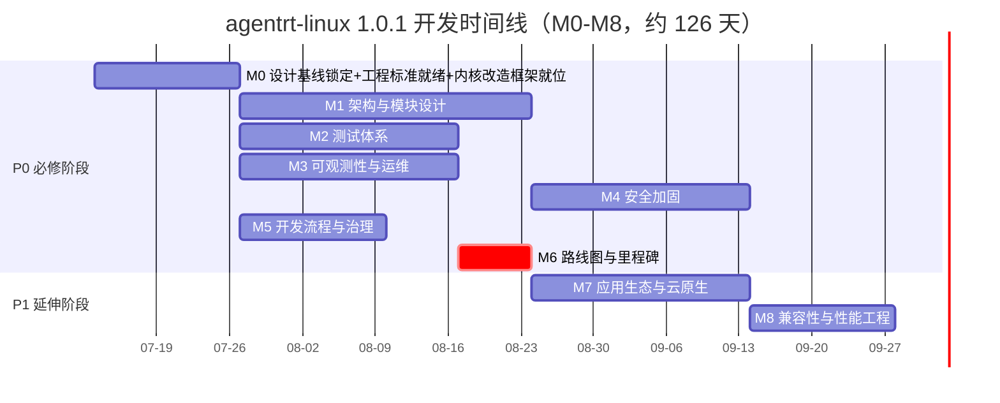
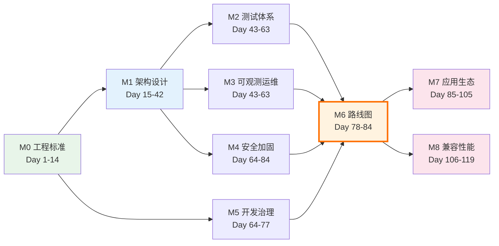

Copyright (c) 2025-2026 SPHARX Ltd. All Rights Reserved.

# agentrt-linux（AirymaxOS）里程碑与时间线
> **文档定位**：agentrt-linux（AirymaxOS，极境智能体操作系统）里程碑定义、时间线与关键路径\
> **文档版本**：v1.0.1\
> **最后更新**： 2026-07-21\
> **上级文档**：[agentrt-linux 设计文档](README.md)\
> **同源映射**：agentrt `0.1.1技术全面改进方案v3.0.md`（v4.2，36 天路线图）\
> **理论根基**：Linux 6.6 内核基线 + Airymax 五维正交 24 原则（S-4 涌现性管理 / E-6 错误可追溯 / A-4 完美主义）

---

## 1. 里程碑总览

agentrt-linux 开发方案拆分为 9 个里程碑（M0-M8），对应 9 个 Part。P0 包含 M0-M6（60-90 天），P1 包含 M7-M8（30-45 天），总计约 126 天。

| 里程碑 | 名称 | 对应 Part | 工期 | 完成标准 |
|--------|------|-----------|------|---------|
| M0 | 设计基线锁定 + 工程标准就绪 + 内核改造框架就位 | Part 1 | 2 周（14 天） | `50-engineering-standards/` 23 文档完成 + OS 规则编号注册表 + 内核改造框架（37 .c + Kbuild）+ [SC] 10 头文件 + CI 基础设施 |
| M1 | 架构与模块设计完善 | Part 2 | 4 周（28 天） | `10-architecture/` + `20-modules/` + `60-driver-model/` + `70-build-system/` 完善 |
| M2 | 测试体系建立 | Part 3 | 3 周（21 天） | `80-testing/` 10 文档完成 + KUnit/kselftest/fault injection 就位 |
| M3 | 可观测性与运维体系 | Part 4 | 3 周（21 天） | `90-observability/` + `100-operations/` 完成 + ftrace/eBPF/perf 就位 |
| M4 | 安全加固体系 | Part 5 | 3 周（21 天） | `110-security/` 完成 + capability + LSM + 机密计算就位 |
| M5 | 开发流程与治理 | Part 6 | 2 周（14 天） | `120-development-process/` + `50/07` 完成 + 维护者制度落地 |
| M6 | 路线图与里程碑 | Part 7 | 1 周（7 天） | `130-roadmap/` 7 文档完成（本模块） |
| M7 | 应用生态与云原生 | Part 8 | 3 周（21 天） | `140-application-development/` + `150-cloudnative/` 完成 |
| M8 | 兼容性与性能工程 | Part 9 | 2 周（14 天） | `160-compatibility/` + `170-performance/` 完成 |

### 1.1 里程碑分类

| 类别 | 里程碑 | 总工期 | 说明 |
|------|--------|--------|------|
| P0（必修） | M0-M6 | 91 天（13 周） | 工程标准 + 架构 + 测试 + 可观测 + 安全 + 治理 + 路线图 |
| P1（延伸） | M7-M8 | 35 天（5 周） | 应用生态 + 云原生 + 兼容性 + 性能 |
| **总计** | **M0-M8** | **126 天（18 周）** | 含并行重叠后的净工期 |

---

## 2. 时间线（Mermaid Gantt 图）

以下 Gantt 图展示 M0-M8 全部里程碑的时间线。起点设为 2026-07-13（1.0.1 开发启动），终点为 2026-11-08。

### 2.1 时间线说明

| 里程碑 | 开始日期 | 结束日期 | 工期 | 并行关系 |
|--------|---------|---------|------|---------|
| M0 | 2026-07-13 | 2026-07-26 | 14 天 | 前置（无依赖） |
| M1 | 2026-07-27 | 2026-08-23 | 28 天 | 与 M0 部分并行 |
| M2 | 2026-08-24 | 2026-09-13 | 21 天 | 依赖 M0+M1；与 M3/M5 并行 |
| M3 | 2026-08-24 | 2026-09-13 | 21 天 | 依赖 M0+M1；与 M2/M5 并行 |
| M4 | 2026-09-14 | 2026-10-04 | 21 天 | 依赖 M1；与 M5 后段并行 |
| M5 | 2026-09-14 | 2026-09-27 | 14 天 | 依赖 M0；与 M2/M3/M4 并行 |
| M6 | 2026-09-28 | 2026-10-04 | 7 天 | 依赖 M0-M5（关键路径收口） |
| M7 | 2026-10-05 | 2026-10-25 | 21 天 | 依赖 M2-M5 |
| M8 | 2026-10-26 | 2026-11-08 | 14 天 | 依赖 M2-M5 |

---

## 3. P0 详细时间线（60-91 天）

P0 阶段覆盖 M0-M6，净工期 91 天（13 周），其中多个里程碑并行推进。

### 3.1 Day 1-14: M0 设计基线锁定 + 工程标准就绪 + 内核改造框架就位

| 维度 | 内容 |
|------|------|
| **范围** | `50-engineering-standards/` 全部 23 文档 + 10 架构文档 + 10 接口文档 + 4 数据流文档 + 16 ADR + 内核改造框架（37+ .c + Kbuild/Kconfig + 4 syscall + 10 [SC] 头文件 + codegen + 7 CI workflow） |
| **依赖** | 无 |
| **工时** | 240h |
| **并行** | 与 M1 部分并行（M1 Day 15 起） |
| **关键产出** | 23 文档 + OS 规则编号注册表 + IRON-9 v3 同源且部分代码共享关系明确 + 内核改造框架就位 + [SC] 10 头文件 + CI 基础设施 |

**子任务**:
- Day 1-3: README + 01 代码规范 + 02 代码格式
- Day 4-7: 03 代码风格 + 04 工程思想（双层稳定性哲学）
- Day 8-11: 05 开发流程 + 06 工具链与自动化（7 层验证）
- Day 12-14: 07 维护者制度与治理 + OS 规则编号注册表

**验收标准**: 23 文档全部完成 + 与 agentrt IRON-9 v3 同源且部分代码共享关系明确 + 4 层接口稳定性分级定义完成。

### 3.2 Day 15-42: M1 架构与模块设计

| 维度 | 内容 |
|------|------|
| **范围** | `10-architecture/` + `20-modules/` + `60-driver-model/` + `70-build-system/` |
| **依赖** | 无（与 M0 互不阻塞） |
| **工时** | 480h |
| **并行** | 与 M0 后段并行 |
| **关键产出** | 8 子仓设计完善 + 微内核化改造策略 + 驱动模型 + 构建系统 |

**子任务**:
- Day 15-21: `10-architecture/` 系统架构（微内核策略 + 工程哲学）
- Day 22-28: `20-modules/` 8 子仓模块设计（kernel/services/security/memory/cognition/cloudnative/system/tests-linux）
- Day 29-35: `60-driver-model/` 驱动模型（驱动用户态化 + capability 隔离）
- Day 36-42: `70-build-system/` 构建系统（多语言 + 跨平台 + 7 层验证集成）

**验收标准**: 4 模块设计完善 + 微内核化改造策略（sched_tac / AgentsIPC / capability / MGLRU / CoreLoopThree kthread）明确 + 与 agentrt 同源 API 映射表完成。

### 3.3 Day 43-63: M2 测试体系（依赖 M0+M1）

| 维度 | 内容 |
|------|------|
| **范围** | `80-testing/` 10 文档 |
| **依赖** | M0（测试规范）+ M1（测试范围） |
| **工时** | 320h |
| **并行** | 与 M3、M5 并行 |
| **关键产出** | 10 文档 + KUnit + kselftest + fault injection + 覆盖率门槛 |

**子任务**:
- Day 43-49: 单元测试规范 + 集成测试规范
- Day 50-56: 形式化验证规范（seL4 范式）+ Soak 测试规范
- Day 57-63: 混沌工程规范 + 覆盖率门槛定义

**验收标准**: 10 文档完成 + 7 层验证中测试层就位 + 覆盖率门槛（单元 ≥80% / 集成 ≥70%）定义完成。

#### 3.3.1 CBS 准入算法（runtime governance 补强）

> **背景**：v3.6 评审 §1.1 主要差距第 4 点指出"CBS 带宽准入……均未实现（M2-M5 项）"，[08-closure-summary-v3.6.md](../../../docs-closed/agentrt-linux/00-reviews/_review_v3.6/08-closure-summary-v3.6.md) §4.3 列为 P2-1。本小节补齐 CBS 准入的技术细节。

**目标**：在 sched_tac 之上为 Agent 提供利用率上界（utilization bound）保证与可预测的补充周期（replenishment period），杜绝过载时的带宽倾斜与活锁。

**关键算法与数据结构**：

| 维度 | 设计 |
|------|------|
| 准入闸门位置 | `airy/sched` 入口（`kernel/kernel/superv/airy_sched.c`），在 `sched_setattr(SCHED_DEADLINE)` 前置 `airy_cbs_admit()` 检查 |
| 利用率上界 | 单 CPU `Σ(runtime_ns/period_ns) ≤ AIRY_CBS_UTIL_MAX`（默认 0.85，对齐 Linux `sched_rt_runtime` 比例上界；保留 15% 给系统/中断/daemon） |
| 补充周期 | 复用 `sched_attr.sched_period`（对齐 seL4 `scPeriod`），sporadic server 语义——CBS 在 `sched_dl_entity.runtime` 耗尽时 throttle 而非降级，下一个 `period` 起点由 `dl_timer` 补充（对齐 [10-sc-sched-extension.md](../30-interfaces/10-sc-sched-extension.md) §5.2 CBS refill 模拟 MCS refill 循环缓冲） |
| 与 CFS/SC 的交互 | DEADLINE Agent 受 CBS 管制；FIFO/EEVDF/BESTEFFORT Agent 走 CFS，通过 cpuset 与 DEADLINE 队列隔离；SC 捐赠期间被捐赠方临时获得 donor 配额（见 §3.4.1），捐赠撤销后 CBS 重新核算利用率 |
| 关键数据结构 | `struct airy_cbs_entry { u64 runtime_ns; u64 deadline_ns; u64 period_ns; airy_q16_t utilization_q16; u32 agent_id; u8 sched_policy; }`——per-agent，红黑树按 `deadline_ns` 排序，对齐 Linux `sched_dl_entity` |
| [DSL] 降级 | `AIRY_SC_FALLBACK` 下准入闸门退化为 `runtime_ns ≤ period_ns` 单点校验，不维护利用率上界 |

**交付物**：

1. `kernel/kernel/superv/airy_cbs.c` + `airy_cbs.h`——准入闸门实现（< 300 行）
2. `airy/sched` 入口接线——`airy_agent_set_deadline()` 在调用 `sched_setattr()` 前调用 `airy_cbs_admit()`
3. KUnit 用例：`tests-linux/kernel/airy_cbs_test.c`——利用率上界 / 超载拒绝 / 补充时序
4. debugfs 接口：`/sys/kernel/debug/airy/cbs`——per-agent utilization、admission 决策日志

**验收标准**：

- 单 CPU 上 DEADLINE Agent 总利用率 ≤ 0.85 时全部准入，> 0.85 时拒绝并返回 `-AIRY_EBUSY`
- 补充周期与 `sched_period` 一致（抖动 ≤ 1%），无 starvation
- 撤销后释放的带宽立即可被新 Agent 重新申请
- 与既有 sched_tac 调度类组合（SCHED_DEADLINE / SCHED_FIFO / EEVDF）协同工作，无回归

**与既有 airy 模块依赖**：

- A-ULS 模块（[10-sc-sched-extension.md](../30-interfaces/10-sc-sched-extension.md)）——`struct airy_task_desc` + Agent 8 态
- 微内核策略（[03-microkernel-strategy.md](../10-architecture/03-microkernel-strategy.md) §4.5）——seL4 MCS 映射
- Linux 6.6 `kernel/sched/deadline.c`——`sched_dl_entity` 与 `dl_timer`

#### 3.3.2 Budget 入口检查（budget guard）

> **背景**：v3.6 评审 §1.1 第 4 点"budget 入口检查"缺失，08 闭环 §4.3 列为 P2-2。本小节定义 budget guard 在调度入口与 IPC 入口的双重检查机制。

**目标**：在每个调度入口与 IPC 入口检查 Agent 剩余 budget（runtime_ns），耗尽时 throttle 或转入 SC 捐赠路径，避免单 Agent 突发性消耗拖垮系统。

**关键算法与数据结构**：

| 维度 | 设计 |
|------|------|
| 检查点 | (1) `airy/sched` 入口：`airy_sched_tick()` 每次时钟中断检查 `sched_dl_entity.runtime ≤ 0` → throttle（CBS 自然完成） (2) IPC 入口：`airy_uring_cmd_check()` 在 fastpath C-S9 后追加 `airy_budget_guard()`，剩余 budget < `AIRY_BUDGET_GUARD_MIN_NS`（默认 100µs）时拒绝本次 IPC 并通知 Macro-Supervisor |
| 耗尽响应 | DEADLINE Agent：CBS throttle 至下个 `period` 补充点；FIFO Agent：降级为 BESTEFFORT；BESTEFFORT Agent：直接 `TASK_INTERRUPTIBLE` 让出 CPU |
| 捐赠分支 | 若 IPC 目标已绑定 donor（见 §3.4.1），耗尽时优先尝试 `airy_sc_donate_try()` 借用 donor budget，借用成功则放行；失败再 throttle |
| 关键数据结构 | `struct airy_budget_state { atomic64_t remaining_ns; u64 period_ns; u64 last_replenish_ns; }`——per-agent，与 `sched_dl_entity.runtime` 字段同义，但用 atomic64 以便 IPC fastpath 无锁读取 |
| 与 Token Budget 的边界 | Token 预算（[04-token-budget.md](../140-application-development/04-token-budget.md)）是用户态认知预算；本 budget guard 是内核态 CPU 预算，两者独立不耦合 |

**交付物**：

1. `kernel/kernel/superv/airy_budget.c`——budget guard 实现
2. `airy_uring_cmd_check()` 钩子接入——在 [07-airy-lsm-design.md](../110-security/07-airy-lsm-design.md) §3.3 Phase 4 后追加 budget guard
3. KUnit 用例：budget 耗尽 throttle / 捐赠分支借用 / 补充时序
4. ftrace 事件：`airy:budget_throttle`、`airy:budget_donate_try`

**验收标准**：

- IPC 入口 budget guard 延迟 ≤ 5ns（无锁 atomic 读取）
- budget 耗尽 + 非捐赠路径下 100µs 内 throttle 生效
- budget 耗尽 + 捐赠路径下 ≤ 1µs 内完成借用决策
- 与 CBS 准入（§3.3.1）协同：补充点恢复 budget 自动 unthrottle

**与既有 airy 模块依赖**：

- 纯 C LSM 模块（[07-airy-lsm-design.md](../110-security/07-airy-lsm-design.md) §3.3）——`airy_uring_cmd_check()` 钩子挂载点
- A-ULS 模块——Agent 8 态迁移（throttle → BLOCKED）
- Token Budget 契约（[04-token-budget.md](../140-application-development/04-token-budget.md)）——边界划分（用户态 vs 内核态）

### 3.4 Day 43-63: M3 可观测性与运维（与 M2 并行，依赖 M1）

| 维度 | 内容 |
|------|------|
| **范围** | `90-observability/` 9 文档 + `100-operations/` 10 文档 |
| **依赖** | M1（可观测性接入点） |
| **工时** | 380h |
| **并行** | 与 M2、M5 并行 |
| **关键产出** | 19 文档 + ftrace + eBPF + perf + 4 层文件系统接口 |

**子任务**:
- Day 43-49: `90-observability/` 可观测性三支柱（Metrics + Logging + Tracing）
- Day 50-56: `90-observability/` eBPF 可观测性 + 4 层文件系统接口
- Day 57-63: `100-operations/` 运维体系（部署 + 升级 + 回滚 + 灾备）

**验收标准**: 19 文档完成 + eBPF 可观测性探针（kfunc + dynamic pointer，非核心架构，H5 约束）+ 4 层文件系统接口（debugfs/tracefs/proc/sysfs）定义完成。

#### 3.4.1 SC 捐赠协议（SC donation）

> **背景**：v3.6 评审 §1.1 主要差距第 4 点指出"SC 捐赠……均未实现（M2-M5 项）"，08 闭环 §4.3 列为 P2-3。本小节补齐 SC 捐赠协议技术细节，对齐 seL4 MCS ES-SEL4-15 SchedContext 捐赠语义。

**目标**：在 IPC 服务端为客户端代理执行的场景下，将客户端的调度预算（SchedContext）临时捐赠给服务端，确保服务端用客户端预算完成工作并保持客户端的截止时间保证。

**关键算法与数据结构**：

| 维度 | 设计 |
|------|------|
| 捐赠方/接收方握手 | (1) donor（client）发起 IPC call，在 `airy_ipc_msg_hdr.flags` 置 `AIRY_IPC_FLAG_SC_DONATE` (2) receiver（server）在 `airy_uring_cmd_check()` 中识别该 flag，调用 `airy_sc_donate_accept()` (3) 双方通过原子交换 `airy_sc_donation_token`（u64，含 donor agent_id + epoch + budget_ns）完成握手 |
| 捐赠内容 | donor 当前 `sched_dl_entity.runtime` 的剩余部分（不预借未补充的预算），临时附加到 receiver 的 `runtime` 字段 |
| 优先级传递 | donor 的 `sched_attr.sched_priority`（FIFO）或 `sched_deadline`（DEADLINE）通过 `airy_sc_inherit_prio()` 传递给 receiver，对齐 sched_tac 优先级继承（[03-microkernel-strategy.md](../10-architecture/03-microkernel-strategy.md) §4.5） |
| 与 Badge 的关系 | 捐赠 token 复用 Badge 的 64-bit 布局（`Epoch<<48 \| RandomTag<<16 \| Perms`），但 Perms 字段重定义为 `AIRY_SC_PERM_DONATE`（0x4000）；sec_d 仍是 token 的唯一写者（[07-airy-lsm-design.md](../110-security/07-airy-lsm-design.md) §3.5） |
| 撤销条件 | (1) IPC 返回（reply 完成）→ 自动撤销 (2) donor 主动 `airy_sc_donate_revoke()` (3) donor budget 耗尽且无补充 → 强制撤销 (4) donor 进入 STOPPING/DEAD 态 → 强制撤销 |
| 关键数据结构 | `struct airy_sc_donation { u64 token; u32 donor_id; u32 receiver_id; atomic64_t donated_ns; u64 revoke_deadline_ns; }`——per-donor 链表，由 `airy_sc_lock` 保护 |
| [DSL] 降级 | `AIRY_SC_FALLBACK` 下 SC 捐赠退化为优先级继承（仅传递 priority，不传递 budget），保证最小可用 |

**交付物**：

1. `kernel/kernel/superv/airy_sc_donate.c` + `airy_sc_donate.h`——捐赠协议实现
2. IPC fastpath 接入——`AIRY_IPC_FLAG_SC_DONATE` 在 `airy_ipc_msg_hdr.flags` 中分配（与 [02-ipc-protocol.md](../30-interfaces/02-ipc-protocol.md) §3 opcode 表同步）
3. KUnit 用例：握手 / 撤销 / 强制撤销 / 并发捐赠
4. ftrace 事件：`airy:sc_donate_accept`、`airy:sc_donate_revoke`、`airy:sc_donate_force_revoke`

**验收标准**：

- 捐赠握手延迟 ≤ 200ns（fastpath 内联）
- 捐赠期间 receiver 使用 donor budget 执行，donor 的 `sched_deadline` 不变（截止时间保证保持）
- 4 种撤销条件均在 ≤ 1µs 内完成（含 budget 归还）
- 捐赠 token 不可伪造（C-S9.RANDTAG 校验同样适用）
- 与 CBS 准入协同：捐赠的 budget 不计入 receiver 的利用率上界，仅计入 donor

**与既有 airy 模块依赖**：

- A-IPC 模块（[07-ipc-fastpath.md](../30-interfaces/07-ipc-fastpath.md)）——fastpath C-S9 校验 + flag 扩展
- A-ULS 模块——Agent 8 态触发强制撤销
- 纯 C LSM 模块（[07-airy-lsm-design.md](../110-security/07-airy-lsm-design.md) §3.5）——sec_d token 编译 + Badge 校验
- 微内核策略 §4.5——seL4 MCS SchedContext 捐赠语义对齐

### 3.5 Day 64-84: M4 安全加固（依赖 M1）

| 维度 | 内容 |
|------|------|
| **范围** | `110-security/` 9 文档 |
| **依赖** | M1（安全模型） |
| **工时** | 320h |
| **并行** | 与 M5 后段并行 |
| **关键产出** | 9 文档 + capability + LSM + 机密计算 + 国密 |

**子任务**:
- Day 64-70: capability 安全模型（与 agentrt Cupolas 同源）+ LSM 钩子集成
- Day 71-77: 机密计算（TEE + 内存加密）+ 国密算法集成（SM2/SM3/SM4）
- Day 78-84: 纯 C LSM 代码完整性验证（CBMC 形式化验证，H5）+ 安全审计规范

**验收标准**: 9 文档完成 + capability 安全模型与 Cupolas 同源映射 + LSM 多 LSM 并存策略明确。

#### 3.5.1 Lockdown 分阶段策略（early/late lockdown）

> **背景**：v3.6 评审 §1.1 主要差距第 4 点指出"lockdown……均未实现（M2-M5 项）"，08 闭环 §4.3 列为 P2-4。本小节定义 AirymaxOS 在 Linux 6.6 内置 lockdown LSM 之上的分阶段锁定策略，与 [07-airy-lsm-design.md](../110-security/07-airy-lsm-design.md) §2.2 `CONFIG_LSM` 默认值中的 `lockdown` 协同。

**目标**：在系统启动、Macro-Supervisor 就绪、关键配置冻结三个时点分阶段收敛可写接口，杜绝运行时被篡改风险，对齐 Linux 6.6 `Documentation/admin-guide/lockdown.rst` 的 integrity/confidentiality 两阶段语义并扩展为 AirymaxOS 三阶段。

**关键算法与数据结构**：

| 维度 | 设计 |
|------|------|
| 阶段划分 | (1) **early lockdown**（boot 阶段）：`early_security_init()` 中由 `DEFINE_EARLY_LSM(airy_lockdown)` 注册，禁止 `/dev/mem`、`kexec_load`、`bpf()` 非特权调用、模块签名未通过的 `init_module`，对齐 Linux lockdown `integrity` 模式 (2) **late lockdown**（Macro-Supervisor 就绪后）：Macro-Supervisor 通过 `airy_sys_admin(AIRY_ADMIN_LOCKDOWN_LATE)` 触发，追加禁止 `ptrace` 跨 Agent 附加、`userfaultfd` 非特权注册、`/sys/kernel/debug/airy/cbs` 写入、未签名 Agent 二进制 `execve` (3) **full lockdown**（配置冻结后）：`AIRY_ADMIN_LOCKDOWN_FULL` 触发，所有 `airy_sys_admin` 写接口、`sched_setattr` 跨 Agent 修改、`airy_sys_rovol_ctl` 的 TIER_SET/MGLRU_CONFIG 全部转只读 |
| 接口收敛机制 | `airy_lockdown_state`（atomic_t，0=none/1=early/2=late/3=full），每个可写内核接口入口检查 `airy_lockdown_gate(level)`——当前 lockdown 等级 ≥ 接口要求等级时返回 `-AIRY_ELOCKDOWN`（`AIRY_ELOCKDOWN` 为**规划错误码**，[SC] error.h 当前未定义，待 lockdown 落地时新增注册） |
| 与 airy_lsm 联动 | lockdown 检查在 [07-airy-lsm-design.md](../110-security/07-airy-lsm-design.md) §3.3 `airy_uring_cmd_check()` 钩子中作为 Phase 0 前置：lockdown 等级不满足时直接返回 `-AIRY_ELOCKDOWN`，不进入 fastpath C-S9 Badge 校验，不触发 Fault（区分"策略拒绝"与"安全违规"） |
| 与 Linux lockdown 的关系 | AirymaxOS lockdown 是 Linux 6.6 内置 lockdown LSM 的扩展：Linux lockdown 仅覆盖 integrity/confidentiality 两阶段内核接口，AirymaxOS lockdown 追加 Airymax 专属接口（`airy_sys_admin` / `airy_sys_rovol_ctl` / `sched_setattr` 跨 Agent）的收敛，两者并存且不冲突 |
| 关键数据结构 | `struct airy_lockdown_rule { const char *interface; u8 required_level; u32 flags; }`——静态规则表 `airy_lockdown_rules[]`，编译期生成，运行时只读 |
| [DSL] 降级 | `AIRY_SC_FALLBACK` 下 lockdown 退化为仅 early lockdown（Linux lockdown integrity 模式），late/full 阶段不触发，保证最小可用 |

**交付物**：

1. `kernel/security/airy/airy_lockdown.c` + `airy_lockdown.h`——分阶段 lockdown 实现
2. `airy_sys_admin` 扩展——新增 `AIRY_ADMIN_LOCKDOWN_LATE` / `AIRY_ADMIN_LOCKDOWN_FULL` op 码
3. `airy_lockdown_gate()` 接入所有可写 Airymax 接口入口（`airy_sys_admin` / `airy_sys_rovol_ctl` 写操作 / `sched_setattr` 跨 Agent）
4. KUnit 用例：阶段切换 / 接口收敛 / 与 airy_lsm 协同 / DSL 降级
5. ftrace 事件：`airy:lockdown_early`、`airy:lockdown_late`、`airy:lockdown_full`、`airy:lockdown_reject`

**验收标准**：

- early lockdown 在 `early_security_init()` 完成前生效，`/dev/mem` 打开返回 `-EPERM`
- late lockdown 触发后 ≤ 1ms 内所有 late 阶段接口返回 `-AIRY_ELOCKDOWN`（规划错误码，待 [SC] 新增）
- lockdown 等级单调递增（不可降级），杜绝运行时放松约束的攻击面
- lockdown 拒绝路径不触发 `airy_fault_enforce()`（区分策略拒绝与安全违规）
- 与既有 Linux lockdown LSM 共存，无语义冲突
- 与 CBS 准入（§3.3.1）/ SC 捐赠（§3.4.1）协同：full lockdown 后 `sched_setattr` 跨 Agent 修改被拒绝，但已准入 Agent 的 CBS throttle / SC 捐赠仍正常工作（只读路径不受影响）

**与既有 airy 模块依赖**：

- 纯 C LSM 模块（[07-airy-lsm-design.md](../110-security/07-airy-lsm-design.md) §2.2 / §3.3）——`CONFIG_LSM` 共存 + `airy_uring_cmd_check()` Phase 0 前置
- LSM 框架（[01-lsm-framework.md](../110-security/01-lsm-framework.md) §5）——`DEFINE_EARLY_LSM` + `early_security_init()` 注册点
- 威胁模型（[08-threat-model.md](../10-architecture/08-threat-model.md)）——锁定对象与攻击面对齐
- A-ULS 模块——`sched_setattr` 跨 Agent 接口收敛点

### 3.6 Day 64-77: M5 开发流程与治理（依赖 M0）

| 维度 | 内容 |
|------|------|
| **范围** | `120-development-process/` 9 文档 + `50-engineering-standards/07-maintainers-and-governance.md` |
| **依赖** | M0（治理框架） |
| **工时** | 240h |
| **并行** | 与 M2/M3/M4 并行 |
| **关键产出** | 9 文档 + 维护者制度 + 6 级成熟度模型 + DCO |

**子任务**:
- Day 64-70: 补丁生命周期 + 维护者制度（MAINTAINERS + Lieutenant System）
- Day 71-77: 6 级成熟度模型 + 治理流程（RFC → 评审 → ACC 验收）

**验收标准**: 9 文档完成 + MAINTAINERS 文件范本 + 6 级成熟度模型（Experimental → LTS）定义完成 + DCO bot 集成方案就位。

#### 3.6.1 MemoryRovol 完整 API 落地（revoke/evolve/restore 语义）

> **背景**：v3.6 评审 §1.1 主要差距第 4 点指出"MemoryRovol 仅作为 M2-M5 行项列出，无技术细节"，08 闭环 §4.3 列为 P2-5。API 契约已在 [05-memory-rovol-api.md](../140-application-development/05-memory-rovol-api.md) 完整定义（10 个 op-dispatch 操作），本小节补齐 M5 阶段的落地实施细节：revoke/evolve/restore 三组语义的内核实现、与 capability 派生树的联动、回收时序、与 IPC ring 取消的协同。

**目标**：在 M5 阶段完成 `airy_sys_rovol_ctl` (549) 10 个 op 码的内核态实现，重点打通三组核心语义：(1) **revoke**（撤销/销毁）—— DELETE 操作的资源回收；(2) **evolve**（演化）—— DEMOTE/PROMOTE 的层级迁移；(3) **restore**（恢复）—— RESTORE 的时间旅行式恢复，并确保与 capability 派生树、IPC ring 取消机制的时序协同。

**关键算法与数据结构**：

| 维度 | 设计 |
|------|------|
| revoke 语义实现 | `AIRY_ROVOL_DELETE` 采用 seL4 `cteDelete()` 两阶段删除：(1) 同步阶段快照状态 `ACTIVE → DELETING`，阻止新访问；(2) 异步阶段内核工作队列回收 PMEM/CXL 内存，每 64MB 插入 `preemption_point()` 避免阻塞调度器，状态 `DELETING → DELETED`。L1 原始卷在 `AIRY_ROVOL_FLAG_CHECKPOINT` 标记时保留，否则一并回收 |
| evolve 语义实现 | `AIRY_ROVOL_DEMOTE` / `AIRY_ROVOL_PROMOTE` 基于艾宾浩斯遗忘曲线 `weight(t) = initial * exp(-λ * t / 3600)`：weight < 0.1（`0x1999` Q16.16）触发 demote（L1→L2→L3→L4），重新访问触发 promote（L4→L3→L2）。`decay_factor` 字段（`airy_q16_t`）支持 `AIRY_DECAY_EBBINGHAUS` (0.5) / `AIRY_DECAY_LINEAR` (1.0) / `AIRY_DECAY_AGGRESSIVE` (0.25) 三种策略。L1→L2 不可逆（特征提取有损），其他层级可逆 |
| restore 语义实现 | `AIRY_ROVOL_RESTORE` 采用 `mmap()` + `userfaultfd()` 按需加载：(1) mmap 占位 VMA；(2) 注册 userfaultfd 缺页处理；(3) 后台按 L1→L2→L3→L4 加载热页；(4) 冷页访问触发 userfaultfd 从快照加载。同一快照可恢复到多个目标 Agent（时间旅行式调试，对齐 Git branch 语义） |
| 与 capability 派生树联动 | 每个 snapshot 关联一个 capability 节点（`AIRY_CAP_ROVOL_SNAPSHOT` 派生自 `AIRY_CAP_ROVOL_ADMIN`），存入 `airy_cap_node_t` MDB 派生树（[03-capability-model.md](../110-security/03-capability-model.md) §4）。DELETE 操作时调用 `airy_cap_revoke()` 递归级联撤销该快照派生的所有子 capability（对齐 seL4 MDB `derive_tree`）。Agent 终止时其名下所有 snapshot 的 capability 节点由 `airy_cap_revoke_all(agent_id)` 批量撤销 |
| 回收时序 | (1) 用户调用 `DELETE` → capability 节点标记 `REVOKING` (2) IPC ring 取消：调用 `airy_ipc_cancel_badged_sends(snapshot_cap_badge)` 取消所有使用该 badge 的在途 IPC（对齐 [09-kernel-agent-supervisor.md](../20-modules/09-kernel-agent-supervisor.md) §6.4 `cancelBadgedSends`） (3) PMEM/CXL 内存回收（异步，分块 + preemption point） (4) capability 节点从 MDB 树摘除，状态 `DELETED` (5) 通知 Macro-Supervisor（eventfd_signal）|
| 与 IPC ring 取消协同 | DELETE/MIGRATE 操作前必须等待该 Agent 的 IPC ring 中所有引用目标 snapshot badge 的在途消息完成或取消。`airy_ipc_cancel_badged_sends()` 遍历 ring，对匹配 badge 的 SQE 设置 `AIRY_EIPC_FROZEN` (-53)，CQE 携带 `-EINTR` 通知提交方。对齐 `AIRY_EIPC_FROZEN` 唯一值 -53（不与 `AIRY_EIPC_FLAGS` -46 别名，IRON-9）|
| 关键数据结构 | `struct airy_rovol_snapshot { u64 snapshot_id; u32 agent_id; u8 state; u8 layer_mask; u8 flags; struct airy_cap_node *cap_node; struct list_head migrate_list; atomic64_t refcount; }`——per-agent 红黑树按 `snapshot_id` 排序，`airy_rovol_lock` 读写锁保护（读操作 LIST/TIER_GET 共享锁，写操作 SNAPSHOT/RESTORE/MIGRATE/DELETE 排他锁） |
| [DSL] 降级 | `AIRY_SC_FALLBACK` 下 MemoryRovol 退化为仅 SNAPSHOT/RESTORE/DELETE 三操作（fork+COW + mmap + 同步删除），MIGRATE/TIER_SET/MGLRU_CONFIG/DEMOTE/PROMOTE 返回 `-ENOSYS`（内核标准 errno，[SC] error.h 未定义 `AIRY_ENOSYS` 宏，直接使用 Linux `ENOSYS`） |

**交付物**：

1. `kernel/mm/rovol/airy_rovol.c` + `airy_rovol.h`——op-dispatch 主入口 + 10 个 op 码实现
2. `kernel/mm/rovol/airy_rovol_snapshot.c`——SNAPSHOT/LIST/DELETE 三操作 + 两阶段删除
3. `kernel/mm/rovol/airy_rovol_restore.c`——RESTORE + userfaultfd 缺页处理
4. `kernel/mm/rovol/airy_rovol_migrate.c`——MIGRATE + CXL post-copy 8 步协议
5. `kernel/mm/rovol/airy_rovol_tier.c`——TIER_SET/TIER_GET/MGLRU_CONFIG/DEMOTE/PROMOTE
6. `airy_ipc_cancel_badged_sends()` 接入 IPC ring 取消路径
7. KUnit 用例：revoke 两阶段删除 / evolve 层级迁移 / restore 时间旅行 / capability 级联撤销 / IPC ring 取消协同 / DSL 降级
8. ftrace 事件：`airy:rovol_snapshot`、`airy:rovol_delete`、`airy:rovol_demote`、`airy:rovol_restore`、`airy:rovol_migrate`、`airy:rovol_cancel_badged`

**验收标准**：

- 10 个 op 码全部通过 capability 守卫（[16.1 capability 表](../140-application-development/05-memory-rovol-api.md) §16.1）
- revoke（DELETE）两阶段删除在 ≤ 1ms 内完成同步阶段（状态转 DELETING），异步阶段大快照（> 1GB）≤ 1s 完成回收
- evolve（DEMOTE/PROMOTE）层级迁移在 ≤ 100ms（DEMOTE）/ ≤ 50ms（PROMOTE）内完成
- restore（RESTORE）首次恢复 ≤ 100ms，冷页访问 ≤ 5ms（userfaultfd 缺页）
- capability 级联撤销：DELETE 一个有 N 个子派生 capability 的快照时，所有子 capability 在 ≤ 10µs 内全部撤销
- IPC ring 取消协同：DELETE/MIGRATE 触发 `airy_ipc_cancel_badged_sends()` 后，所有在途匹配 badge 的 IPC 在 ≤ 100µs 内完成取消（CQE 返回 `-EINTR`）
- DSL 降级下仅 SNAPSHOT/RESTORE/DELETE 可用，其余 op 返回 `-ENOSYS`（内核标准 errno）
- 与 CBS 准入（§3.3.1）/ lockdown（§3.5.1）协同：full lockdown 后 TIER_SET/MGLRU_CONFIG 返回 `-AIRY_ELOCKDOWN`（规划错误码，待 [SC] 新增），但 SNAPSHOT/RESTORE/DELETE 不受影响

**与既有 airy 模块依赖**：

- MemoryRovol API 契约（[05-memory-rovol-api.md](../140-application-development/05-memory-rovol-api.md)）——10 个 op 码签名的 SSoT
- Capability 模型（[03-capability-model.md](../110-security/03-capability-model.md) §4）——MDB 派生树 + `airy_cap_revoke()` 级联撤销
- 纯 C LSM 模块（[07-airy-lsm-design.md](../110-security/07-airy-lsm-design.md) §3.3）——`airy_uring_cmd_check()` capability 守卫挂载点
- 内核 Agent 监督模块（[09-kernel-agent-supervisor.md](../20-modules/09-kernel-agent-supervisor.md) §6.4）——`airy_ipc_cancel_badged_sends()` + `AIRY_EIPC_FROZEN` (-53)
- 记忆数据流（[02-memory-flow.md](../40-dataflows/02-memory-flow.md)）——L1-L4 四层数据结构与 MGLRU 集成
- Lockdown 策略（§3.5.1）——full lockdown 下写操作收敛
- Linux 6.6 `mm/vmscan.c`（MGLRU aging/eviction）+ `mm/userfaultfd.c`（缺页迁移）+ `mm/memory-tiers.c`（CXL 分层）

### 3.7 Day 78-84: M6 路线图（依赖 M0-M5）

| 维度 | 内容 |
|------|------|
| **范围** | `130-roadmap/` 7 文档（本模块） |
| **依赖** | M0-M5（前 6 里程碑提供输入） |
| **工时** | 80h |
| **并行** | 无（关键路径收口） |
| **关键产出** | 7 文档 + Gantt 图 + 关键路径 + 验收标准 |

**子任务**:
- Day 78-80: README + 01 开发策略 + 02 里程碑与时间线（本文件）
- Day 81-84: 03 资源估算 + 04 依赖图 + 05 风险缓解 + 06 验收标准

**验收标准**: 7 文档完成 + Gantt 图 + 关键路径图 + M0-M8 验收标准全部定义 + 与 agentrt 协同时序明确。

---

## 4. P1 详细时间线（30-45 天）

P1 阶段覆盖 M7-M8，净工期 35 天（5 周），在 P0 完成后启动。

### 4.1 Day 85-105: M7 应用生态与云原生（依赖 M2-M5）

| 维度 | 内容 |
|------|------|
| **范围** | `140-application-development/` 9 文档 + `150-cloudnative/` 8 文档 |
| **依赖** | M2（测试）+ M3（可观测）+ M4（安全）+ M5（治理） |
| **工时** | 200h |
| **并行** | 与 M8 部分并行（M8 Day 106 起） |
| **关键产出** | 17 文档 + 应用开发 SDK + 云原生部署 |

**子任务**:
- Day 85-91: `140-application-development/` 应用开发 SDK（与 agentrt SDK 同源，4 语言）
- Day 92-98: `150-cloudnative/` K8s + containerd + OCI 集成
- Day 99-105: agentctl 命令行工具 + 超节点 OS 集成

**验收标准**: 17 文档完成 + 应用开发 SDK 4 语言（Python/Rust/Go/TS）+ 与 agentrt SDK 同源映射 + 云原生部署方案就位。

### 4.2 Day 106-119: M8 兼容性与性能工程（依赖 M2-M5）

| 维度 | 内容 |
|------|------|
| **范围** | `160-compatibility/` 8 文档 + `170-performance/` 8 文档 |
| **依赖** | M2（测试）+ M3（可观测）+ M4（安全）+ M5（治理） |
| **工时** | 150h |
| **并行** | 与 M7 后段并行 |
| **关键产出** | 16 文档 + 兼容性矩阵 + 性能基准 |

**子任务**:
- Day 106-112: `160-compatibility/` 兼容性矩阵（硬件 / 软件 / ABI）
- Day 113-119: `170-performance/` 性能基准 + 调优指南 + Token 能效可观测性

**验收标准**: 16 文档完成 + 兼容性矩阵（硬件/软件/ABI）+ 性能基准（调度/内存/IPC/认知循环）+ Token 能效可观测性方案就位。

---

## 5. 0.1.1 版本范围

0.1.1 是 agentrt-linux 的"文档体系奠基版本"，目标是完成全部设计文档与工程标准框架（不含内核/OS 代码实施）。

### 5.1 0.1.1 完成范围

| 模块 | 0.1.1 范围 | 里程碑 |
|------|-----------|--------|
| `50-engineering-standards/` | 全部 23 文档完成 | M0（提前完成） |
| `130-roadmap/` | 全部 7 文档完成 | M6（提前完成） |
| `10-architecture/` ~ `20-modules/` | 仅 README.md 占位 | — |
| `60-driver-model/` ~ `70-build-system/` | README + 01 + 02 占位 | — |
| `80-testing/` ~ `120-development-process/` | README + 01 + 02 占位 | — |
| `140-application-development/` ~ `170-performance/` | 仅 README.md 占位 | — |

### 5.2 0.1.1 不完成范围

- M1-M5、M7-M8 里程碑的**实际开发**（不含，在 1.0.1 完成）
- 8 子仓的**实际代码开发**（不含，在 1.0.1 完成）
- 7 层自动化验证的**实际实施**（不含，在 1.0.1 完成）
- 维护者制度的**实际落地**（不含，在 1.0.1 完成）

### 5.3 0.1.1 验收标准

- `50-engineering-standards/` 23 文档全部完成
- `130-roadmap/` 7 文档全部完成
- 其余 P0 模块 README.md 占位完成
- 与 agentrt IRON-9 v3 同源且部分代码共享关系明确
- 总产出约 79 文档

---

## 6. 1.0.1 版本范围

1.0.1 是 agentrt-linux 的"实际开发版本"，目标是完成可投产的智能体操作系统。

### 6.1 1.0.1 完成范围

- 完成 M0-M8 全部 9 个里程碑
- 19 模块 ~140 文档全部产出
- 工程标准全面实施（7 层自动化验证全部就位）
- 8 子仓（kernel / services / security / memory / cognition / cloudnative / system / tests-linux）实际开发
- 维护者制度与治理落地
- 与 agentrt 同源 API 端到端验证

### 6.2 1.0.1 验收标准

- M0-M8 全部里程碑验收通过
- 7 层自动化验证全部就位（checkpatch + 编译 + 单元 + 集成 + 性能 + Soak + 形式化）
- 8 子仓实际代码开发完成
- 维护者制度落地（MAINTAINERS + Lieutenant System + DCO）
- 与 agentrt 同源 API 端到端验证通过
- regression 零容忍（E-6 错误可追溯）

### 6.3 1.0.1 与 agentrt 协同

| 协同内容 | agentrt 侧 | agentrt-linux 侧 | 验证方式 |
|---------|-----------|--------------|---------|
| 调度 | MicroCoreRT 调度语义 | sched_tac 调度策略 | 端到端调度延迟测试 |
| IPC | AgentsIPC 128B 消息头 | IPC 子系统 | 端到端消息吞吐测试 |
| 安全 | Cupolas 权限模型 | capability + LSM | 端到端权限验证测试 |
| 记忆 | MemoryRovol 四层 | 记忆子系统 MGLRU | 端到端记忆卷载测试 |
| 认知 | CoreLoopThree 三层 | 认知 kthread | 端到端认知循环测试 |

---

## 7. 关键路径

关键路径是决定项目最短工期的依赖链。agentrt-linux 关键路径为：M0 → M1 → (M2, M4) → M6 → M7 → M8。

### 7.1 关键路径分析

| 节点 | 关键路径 | 工期 | 说明 |
|------|---------|------|------|
| M0 → M1 | 工程标准 → 架构设计 | 42 天 | 前置依赖链 |
| M1 → M2 → M6 | 架构 → 测试 → 路线图 | 42 天 | 关键依赖链（M1 结束 Day 42 → M6 结束 Day 84） |
| M6 → M7 → M8 | 路线图 → 应用生态 → 性能 | 35 天 | P1 延伸链（M7 21 天 + M8 14 天） |
| **关键路径总工期** | M0 → M1 → M2 → M6 → M7 → M8 | **126 天** | 项目最短工期（P0 91 天 + P1 35 天） |

### 7.2 关键路径管理（A-4 完美主义）

- **关键路径不可延期**: M0/M1/M2/M6/M7/M8 任一延期直接推迟项目交付。
- **非关键路径可吸收**: M3/M4/M5 有缓冲空间，可在 M6 收口前追赶。
- **关键路径节点每日跟踪**: M0/M1/M2/M6/M7/M8 节点每日 standup 跟踪进度。
- **缓冲分配**: 340h 管理与风险缓冲优先分配给关键路径节点。

---

## 8. 里程碑验收标准

每个里程碑的详细验收标准详见 `06-acceptance-criteria.md`。本节给出摘要：

| 里程碑 | 验收标准摘要 | 质量门禁 |
|--------|------------|---------|
| M0 | 23 文档完成 + IRON-9 关系明确 | 文档审查通过 |
| M1 | 4 模块设计完善 + 同源 API 映射 | 架构评审通过 |
| M2 | 10 文档 + 覆盖率门槛定义 | 测试规范评审通过 |
| M3 | 19 文档 + 4 层文件系统接口 | 可观测性评审通过 |
| M4 | 9 文档 + capability + LSM | 安全评审通过 |
| M5 | 9 文档 + 6 级成熟度模型 | 治理评审通过 |
| M6 | 7 文档 + Gantt + 关键路径 | 路线图评审通过 |
| M7 | 17 文档 + SDK 4 语言 | 应用生态评审通过 |
| M8 | 16 文档 + 兼容性矩阵 + 性能基准 | 性能评审通过 |

---

## 9. 风险与缓解

里程碑相关风险详见 `05-risk-mitigation.md`。本节给出摘要：

| 风险 | 概率 | 影响 | 缓解策略 |
|------|:---:|:---:|---------|
| M0 工程标准范围蔓延 | 中 | 高 | 严格限定 23 文档范围；新增需求延后到 1.1.x |
| M1 微内核化改造策略争议 | 中 | 高 | 工程规范委员会评审；保守方案优先（不追求激进目标） |
| M2 测试体系依赖 M0+M1 延期 | 中 | 中 | M0/M1 关键路径每日跟踪；M2 启动前确认依赖就绪 |
| M3/M4 与 M2 并行资源争用 | 高 | 中 | 人力分配优先 M2（关键路径）；M3/M4 可吸收缓冲 |
| M6 收口时 M3/M4/M5 未完成 | 中 | 高 | M6 启动前确认 M0-M5 全部完成；未完成项延后到 P1 |
| M7/M8 P1 延伸优先级降低 | 高 | 低 | P1 可在 1.0.1 后期或 1.1.x 持续完善 |
| 与 agentrt 同源 API 对齐成本 | 中 | 中 | 340h 缓冲吸收；agentrt 0.1.1 先完成奠基降低对齐成本 |

---

## 10. 五维原则映射

里程碑与时间线是五维正交 24 原则在"开发时序"维度的具体落地：

| 五维原则 | 在里程碑中的体现 | 落地里程碑 |
|---------|-----------------|-----------|
| **S-1 反馈闭环** | 每个里程碑验收即反馈闭环；M6 收口反馈到 M7/M8 | M0-M8 |
| **S-2 层次分解** | 9 里程碑 → 子任务 → 每日任务的三层分解 | M0-M8 |
| **S-3 总体设计部** | 总维护者统筹关键路径；里程碑优先级 | M6 |
| **S-4 涌现性管理** | 渐进式里程碑；缓冲吸收延期；抑制负面涌现（延期传染） | 全部 |
| **K-1 内核极简** | M1 微内核化改造优先 | M1 |
| **K-2 接口契约化** | 4 层接口稳定性分级贯穿 M0-M5 | M0-M5 |
| **E-1 安全内生** | M4 安全加固与 M2/M3 并行（前置） | M4 |
| **E-2 可观测性** | M3 可观测性体系 | M3 |
| **E-6 错误可追溯** | 里程碑验收标准可追溯；regression 不可接受 | M0-M8 |
| **E-7 文档即代码** | 里程碑本身是 Markdown 即代码；Gantt 图即代码 | 全部 |
| **E-8 可测试性** | M2 测试体系依赖 M0+M1 先行 | M2 |
| **A-3 人文关怀** | 审查优先文化；里程碑工时含审查与缓冲 | M0-M8 |
| **A-4 完美主义** | 关键路径管理；P0 不可妥协；关键路径每日跟踪 | M0-M6 |

---

## 11. 相关文档

### 11.1 本模块内部文档

- `README.md` — 路线图主索引与总纲
- `01-development-strategy.md` — 开发策略与三大支柱详解
- `03-resource-estimation.md` — 资源估算（待编写）
- `04-dependency-graph.md` — 依赖关系图（待编写）
- `05-risk-mitigation.md` — 风险识别与缓解（待编写，含本节 §9 详述）
- `06-acceptance-criteria.md` — 验收标准与质量门禁（待编写，含本节 §8 详述）

### 11.2 同源 Airymax 文档

- `docs/AirymaxRT/10-architecture/00-architectural-principles.md` — 五维正交 24 原则（S-4 / E-6 / A-4）
- agentrt 工程改进方案 — agentrt 36 天路线图（v4.2，对照参考）

### 11.3 agentrt-linux 设计文档

- `50-engineering-standards/` — 工程标准（M0 范围）
- `10-architecture/` + `20-modules/` — 架构与模块（M1 范围）
- `80-testing/` — 测试体系（M2 范围）
- `90-observability/` + `100-operations/` — 可观测与运维（M3 范围）
- `110-security/` — 安全加固（M4 范围）
- `120-development-process/` — 开发流程（M5 范围）

---

## 12. 文档版本与维护

- **当前版本**: v1.0.1（2026-07-21）
- **维护者**: 工程规范委员会（待成立）
- **变更流程**: 任何里程碑变更必须经过 RFC → 评审 → ACC 验收流程
- **回顾周期**: 里程碑回顾（每 M 完成时）+ 季度时间线回顾

---

> **文档结束** | 里程碑与时间线是"什么时候做完"的总纲 | M0-M8 + Gantt 图 + 关键路径
