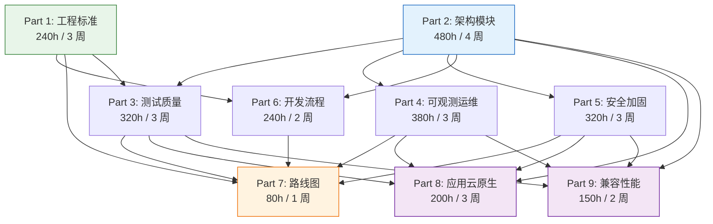
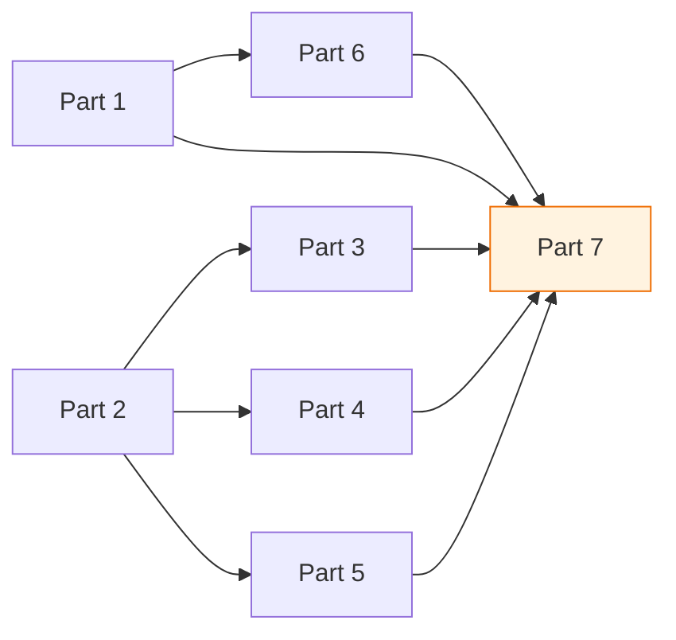
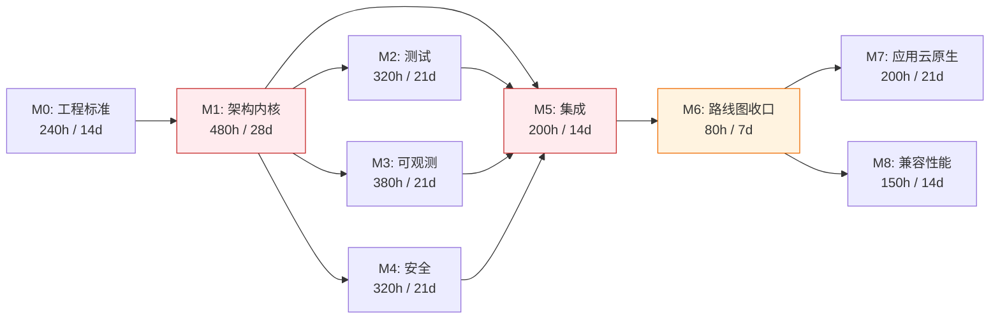
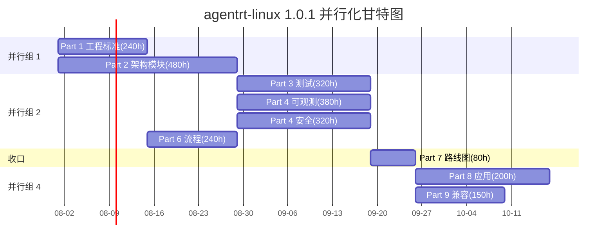
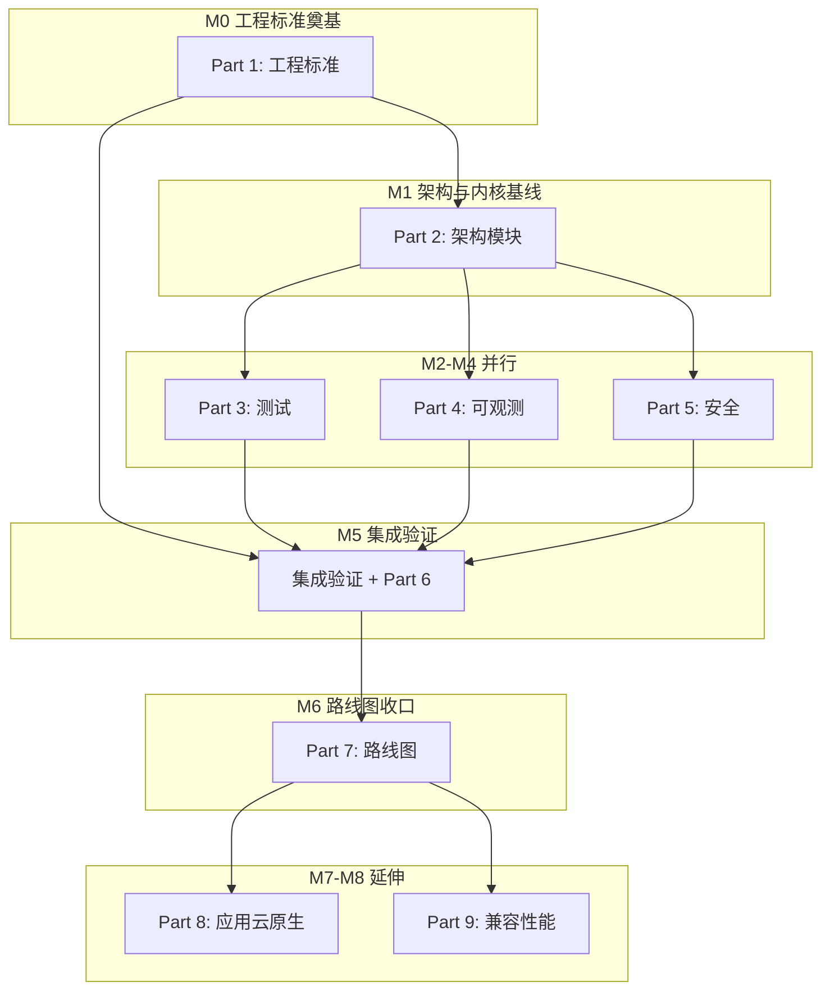

Copyright (c) 2025-2026 SPHARX Ltd. All Rights Reserved.

# agentrt-linux（AirymaxOS）依赖关系图
> **文档定位**：agentrt-linux（AirymaxOS，极境智能体操作系统）开发详细方案（路线图）模块第 4 文档\
> **文档版本**：0.1.1\
> **最后更新**： 2026-07-21\
> **上级文档**：[agentrt-linux 设计文档](README.md)\
> **同源映射**：agentrt `0.1.1技术全面改进方案v3.0.md`（v4.2，§36 SP07-SP12 仓间依赖）\
> **理论根基**：Linux 6.6 内核基线 + Airymax 五维正交 24 原则（体系并行论）\
> **核心约束**：IRON-9 v3 同源且部分代码共享（agentrt 与 agentrt-linux 通过同源语义解耦，非代码耦合）

---

## 1. 依赖关系图总览

### 1.1 依赖建模原则

agentrt-linux 开发方案的依赖关系建模遵循以下原则：

1. **S-2 层次分解**——9 个 Part 按抽象层次组织，依赖必须自上而下，禁止循环依赖
2. **C-2 增量演化**——每个 Part 内部必须可独立验证，依赖断裂不影响已完成 Part
3. **E-3 资源确定性**——每条依赖必须明确标注上游 Part 与下游影响范围
4. **K-2 接口契约化**——Part 间依赖通过明确接口契约（OS-ACC 验收标准）约束，非隐式假设

### 1.2 9 Part 依赖关系总图



### 1.3 依赖关系特征

- **Part 1 与 Part 2 是根节点**——无上游依赖，可并行启动
- **Part 7 是收敛节点**——依赖 Part 1-6 全部完成，是 P0 收口
- **Part 8 与 Part 9 是 P1 延伸**——依赖 Part 2-5，与 Part 7 无强依赖
- **无循环依赖**——依赖图是 DAG（有向无环图），符合 S-2 层次分解

---

## 2. 9 部分详细依赖

### 2.1 Part 依赖矩阵

| Part | 上游依赖 | 下游影响 | 依赖强度 | 备注 |
|------|---------|---------|---------|------|
| Part 1 | 无 | Part 3, 6, 7 | 强 | 工程标准是所有后续 Part 的语法基础 |
| Part 2 | 无 | Part 3, 4, 5, 6, 8, 9 | 强 | 架构是测试/可观测/安全/治理的语义基础 |
| Part 3 | Part 1, 2 | Part 7, 8, 9 | 中 | 测试体系依赖工程标准与架构定义 |
| Part 4 | Part 2 | Part 7, 8 | 中 | 可观测性依赖架构定义的接口契约 |
| Part 5 | Part 2 | Part 7, 8 | 中 | 安全加固依赖架构定义的 capability 模型 |
| Part 6 | Part 1 | Part 7 | 中 | 开发流程依赖工程标准定义的规则编号 |
| Part 7 | Part 1-6 | 无 | 强（收敛） | 路线图收口，依赖全部上游 |
| Part 8 | Part 2-5 | 无 | 弱 | P1 延伸，可在 Part 7 完成后启动 |
| Part 9 | Part 2-5 | 无 | 弱 | P1 延伸，与 Part 8 可并行 |

### 2.2 Part 间依赖强度说明

| 强度 | 含义 | 允许的并行度 |
|------|------|------------|
| 强 | 上游未完成则下游无法启动 | 串行 |
| 中 | 上游 README + 01 + 02 完成即可启动下游 | 部分并行 |
| 弱 | 仅依赖上游接口契约，不依赖完整实施 | 完全并行 |

### 2.3 关键依赖链



- **最长依赖链**：Part 1 → Part 6 → Part 7（3 节点，~560h，5 周）
- **次长依赖链**：Part 2 → Part 3/4/5 → Part 7（3 节点，~880h，7 周）
- **关键路径**：Part 2 → Part 3/4/5（并行）→ Part 7（详见 §5）

---

## 3. 模块间依赖矩阵

### 3.1 19 模块依赖矩阵

下表为 19 个文档模块的依赖矩阵（行=上游，列=下游，●=强依赖，○=中依赖，·=弱依赖）：

| 上游 \ 下游 | 50 | 60 | 70 | 80 | 90 | 100 | 110 | 120 | 130 | 140 | 150 | 160 | 170 | 180 | 190 |
|------------|----|----|----|----|----|-----|-----|-----|-----|-----|-----|-----|-----|-----|-----|
| 50-工程标准 | — | ● | ● | ● | ● | ● | ● | ● | ● | ○ | ○ | ○ | ○ | · | · |
| 60-驱动模型 | · | — | · | ○ | · | · | · | · | · | · | · | · | · | · | · |
| 70-构建系统 | · | · | — | ○ | ○ | ○ | ○ | ○ | · | ○ | ○ | ○ | ○ | · | ○ |
| 80-测试 | · | · | · | — | · | · | · | · | ● | ● | ○ | ● | ● | · | · |
| 90-可观测 | · | · | · | ○ | — | ● | ○ | · | ● | ○ | ○ | ○ | ● | · | · |
| 100-运维 | · | · | · | · | · | — | · | · | ● | ○ | ● | ○ | ○ | · | ● |
| 110-安全 | · | · | · | ○ | ○ | · | — | · | ● | ● | ● | ● | ○ | · | · |
| 120-开发流程 | · | · | · | · | · | · | · | — | ● | · | · | · | · | · | · |
| 130-路线图 | · | · | · | · | · | · | · | · | — | · | · | · | · | · | · |
| 140-应用开发 | · | · | · | · | · | · | · | · | · | — | ● | · | · | · | · |
| 150-云原生 | · | · | · | · | · | · | · | · | · | · | — | · | · | · | · |
| 160-兼容性 | · | · | · | · | · | · | · | · | · | · | · | — | ● | · | · |
| 170-性能 | · | · | · | · | · | · | · | · | · | · | · | · | — | · | · |
| 180-i18n | · | · | · | · | · | · | · | · | · | · | · | · | · | — | · |
| 190-分发 | · | · | · | · | · | · | · | · | · | · | · | · | · | · | — |

### 3.2 模块依赖解读

- **50-工程标准是全模块的根**——所有模块都强依赖或中依赖工程标准
- **80-测试与 110-安全是横向支柱**——多个模块依赖它们的契约定义
- **90-可观测与 100-运维耦合度高**——可观测性产出的指标直接喂给运维告警
- **140-应用开发 → 150-云原生**——应用模型决定云原生部署形态
- **160-兼容性 → 170-性能**——兼容性矩阵决定性能基准的覆盖范围

### 3.3 模块依赖强度统计

| 强度 | 数量 | 占比 | 含义 |
|------|------|------|------|
| ● 强依赖 | 28 | 13.3% | 上游未完成则下游无法启动 |
| ○ 中依赖 | 36 | 17.1% | 上游 README + 01 + 02 即可启动下游 |
| · 弱依赖 | 146 | 69.5% | 仅依赖接口契约，不依赖完整实施 |
| **总计** | **210** | **100%** | — |

> 注：强依赖占比仅 13.3%，说明 agentrt-linux 文档体系高度可并行化，符合 S-2 层次分解与 C-2 增量演化原则。

---

## 4. 关键路径

### 4.1 关键路径定义

关键路径是依赖图中**最长**的路径，决定项目整体工期。agentrt-linux 1.0.1 的关键路径为：

```
M0（Part 1）→ M1（Part 2）→ M2/M3/M4/M5（Part 3/4/5 + 集成，并行）→ M6（Part 7）
```

### 4.2 关键路径图



### 4.3 关键路径工时与工期

| 节点 | 工时(h) | 工期(天) | 累计工期 | 是否关键 |
|------|---------|---------|---------|---------|
| M0 工程标准 | 240 | 14 | 14 | 是 |
| M1 架构内核 | 480 | 28 | 42 | 是（最长前置） |
| M2/M3/M4 并行 | 380（取最大） | 21 | 63 | 是（并行） |
| M5 集成验证 | 200 | 14 | 77 | 是 |
| M6 路线图收口 | 80 | 7 | 84 | 是 |
| M7/M8 并行 | 200（取最大） | 21 | 105 | 否（P1 延伸） |
| **关键路径合计** | **~1,760** | **~84 天（12 周）** | — | — |

> 注：M7/M8 为 P1 延伸，不计入 P0 关键路径。P0 关键路径为 M0-M6，约 84 天（12 周）。

### 4.4 关键路径风险

- **M1 是最长前置任务**——28 天工期，任何延期将传染下游所有里程碑
- **M5 集成验证是缓冲消耗点**——M2/M3/M4 任何延期都集中反映到 M5
- **M6 是收敛点**——依赖 M0-M5 全部完成，是 P0 收口

---

## 5. 并行化机会

### 5.1 可并行的 Part 组合

| 并行组 | Part 组合 | 并行条件 | 预期收益 |
|--------|---------|---------|---------|
| 并行组 1 | Part 1 + Part 2 | 无上游依赖，可同时启动 | 压缩 4 周 |
| 并行组 2 | Part 3 + Part 4 + Part 5 | Part 2 完成后，三者可并行 | 压缩 6 周 |
| 并行组 3 | Part 6 + Part 3/4/5 | Part 6 仅依赖 Part 1，可与 Part 3/4/5 并行 | 压缩 2 周 |
| 并行组 4 | Part 8 + Part 9 | P1 延伸，两者可并行 | 压缩 2 周 |

### 5.2 并行化甘特图



### 5.3 并行化收益

| 优化项 | 串行工期 | 并行工期 | 压缩比例 |
|--------|---------|---------|---------|
| Part 1 + Part 2 | 7 周 | 4 周 | 43% |
| Part 3 + Part 4 + Part 5 | 9 周 | 3 周 | 67% |
| Part 8 + Part 9 | 5 周 | 3 周 | 40% |
| **整体** | **~24 周** | **~14 周** | **42%** |

并行化是缩短 agentrt-linux 1.0.1 工期的核心杠杆，但需注意：

- 并行化要求核心团队 ≥4 人（见 03-resource-estimation.md §4.1）
- 并行化增加跨 Part 集成调试成本（消耗 340h 缓冲中的 ~120h）
- 并行化要求接口契约（OS-ACC）提前定义，避免下游返工

---

## 6. 模块依赖详细说明

### 6.1 强依赖（●）详解

| 上游 → 下游 | 依赖内容 | 触发条件 |
|------------|---------|---------|
| 50 → 60/70/80/90/100/110/120/130 | OS-IRON/OS-STD/OS-ACC 规则编号体系 | 工程标准定义完成后 |
| 80 → 130 | 测试体系覆盖范围（KUnit + kselftest + fault injection） | 测试体系 README + 01 + 02 完成后 |
| 90 → 100 | 可观测性指标定义（ftrace + eBPF + perf） | 可观测性 README + 01 + 02 完成后 |
| 90 → 130 | 可观测性覆盖里程碑验收（OS-ACC-051~060） | 可观测性 README + 01 + 02 完成后 |
| 100 → 130 | 运维体系覆盖里程碑验收（OS-ACC-051~060） | 运维 README + 01 + 02 完成后 |
| 110 → 130 | 安全体系覆盖里程碑验收（OS-ACC-061~070） | 安全 README + 01 + 02 完成后 |
| 110 → 140/150/160 | 安全 capability 模型 + 机密计算契约 | 安全 README + 01 + 02 完成后 |
| 120 → 130 | 开发流程覆盖里程碑验收（OS-ACC-071~080） | 开发流程 README + 01 + 02 完成后 |
| 140 → 150 | 应用模型决定云原生部署形态 | 应用开发 README + 01 + 02 完成后 |

### 6.2 中依赖（○）详解

中依赖通常仅需上游的接口契约（README + 01 + 02）即可启动下游，常见场景：

- 70-构建系统 → 80/90/100/110/120：构建系统提供 Bazel + 交叉编译 + ABI 检查，下游模块依赖其工具链
- 90-可观测 → 110：可观测性产出安全审计所需的事件流（cupolas_audit_record）
- 100-运维 → 150：运维体系定义云原生部署的运维契约
- 160-兼容性 → 170：兼容性矩阵决定性能基准的覆盖范围

### 6.3 弱依赖（·）详解

弱依赖仅依赖接口契约的语义一致性，不依赖完整实施，常见场景：

- 60-驱动模型 → 多数下游：驱动模型通过 K-4 可插拔策略与下游解耦
- 180-i18n / 190-分发：作为 P2 模块，几乎完全独立
- 同源语义对齐：agentrt 与 agentrt-linux 通过 IRON-9 v3 同源且部分代码共享原则解耦

---

## 7. 依赖关系与里程碑映射

### 7.1 Part 到里程碑映射



### 7.2 里程碑验收与依赖对齐

每个里程碑验收时，必须验证其依赖的上游 Part 已完成对应 OS-ACC：

| 里程碑 | 必须完成的 Part | 必须通过的 OS-ACC |
|--------|---------------|------------------|
| M0 | Part 1 | OS-ACC-001~020 |
| M1 | Part 2 | OS-ACC-021~040 |
| M2 | Part 3 | OS-ACC-041~050 |
| M3 | Part 4 | OS-ACC-051~060 |
| M4 | Part 5 | OS-ACC-061~070 |
| M5 | Part 6 + 集成 | OS-ACC-071~080 |
| M6 | Part 7 | OS-ACC-081~090 |
| M7 | Part 8 | OS-ACC-091~100 |
| M8 | Part 9 | OS-ACC-101~110 |

---

## 8. 依赖关系风险

### 8.1 依赖断裂风险

| 风险 | 触发条件 | 影响 | 缓解措施 |
|------|---------|------|---------|
| 上游 Part 延期 | Part 2 延期导致 Part 3/4/5 无法启动 | 关键路径延期 | 提前定义接口契约（README + 01 + 02） |
| 接口契约漂移 | Part 1 工程标准变更影响下游全部 Part | 大规模返工 | OS-ACC 验收 + RFC 流程 |
| 循环依赖引入 | Part 间出现循环依赖 | 无法并行 | 依赖图定期审查（季度） |
| 同源 API 漂移 | agentrt API 变更影响 agentrt-linux 同源语义 | 同源对齐成本增加 | 季度同步评审 + 兼容性测试（R-005） |

### 8.2 依赖管理机制

1. **接口契约先行**——每个 Part 必须先完成 README + 01 + 02，定义接口契约后下游才可启动
2. **OS-ACC 验收门禁**——每个里程碑必须通过对应 OS-ACC 验收，否则不可解锁下游 Part
3. **依赖图季度审查**——每季度审查依赖关系是否仍然合理，是否引入循环依赖
4. **同源 API 季度同步**——与 agentrt 季度同步评审同源 API 漂移（R-005 缓解）

---

## 9. 五维原则映射

本文档遵循 Airymax 五维正交 24 原则中的以下项：

| 原则 | 在依赖关系图中的体现 | 落地章节 |
|------|---------------------|---------|
| **S-2 层次分解** | 9 Part 按抽象层次组织，依赖必须自上而下，禁止循环依赖 | §1.2 + §3.1 依赖矩阵 |
| **C-2 增量演化** | 每个 Part 内部必须可独立验证，依赖断裂不影响已完成 Part | §1.1 + §6 依赖详解 |
| **S-4 涌现性管理** | 关键路径管理 + 并行化抑制延期传染 | §4 关键路径 + §5 并行化 |
| **K-2 接口契约化** | Part 间依赖通过 OS-ACC 验收标准约束，非隐式假设 | §7.2 里程碑验收 |
| **E-3 资源确定性** | 每条依赖明确标注上游 Part 与下游影响范围 | §2.1 Part 依赖矩阵 |
| **E-6 错误可追溯** | 依赖关系变更留 RFC 痕迹；季度审查 | §8.2 依赖管理机制 |
| **IRON-9 v3 同源且部分代码共享** | agentrt 与 agentrt-linux 通过同源语义解耦，非代码耦合 | §1.1 + §6.3 弱依赖 |

---

## 10. 相关文档

### 10.1 本模块内部

- `README.md` — 路线图主索引与总纲
- `01-development-strategy.md` — 开发策略与三大支柱详解
- `02-milestones-and-timeline.md` — 里程碑与时间线（Gantt 图）
- `03-resource-estimation.md` — 资源估算（人力 / 工时 / 预算）
- `05-risk-mitigation.md` — 风险识别与缓解（含依赖断裂风险 R-005）
- `06-acceptance-criteria.md` — 验收标准与质量门禁（OS-ACC 编号体系）

### 10.2 同源 Airymax 文档

- `docs/AirymaxRT/10-architecture/00-architectural-principles.md` — 五维正交 24 原则
- IRON-9 v3 工程铁律 — 17 类规则编号体系（v28.0，含 IRON-9）
- agentrt 工程改进方案 — agentrt 三大支柱方案（v4.2，§36 SP07-SP12）

### 10.3 agentrt-linux 工程标准

- `50-engineering-standards/README.md` — 工程标准主框架
- `50-engineering-standards/04-engineering-philosophy.md` — 工程思想（双层稳定性 + 4 层接口分级）
- `50-engineering-standards/07-maintainers-and-governance.md` — 维护者制度与治理

---

## 11. 文档版本与维护

- **当前版本**: v1.0.1（2026-07-21）
- **维护者**: 工程规范委员会（待成立，详见 50-engineering-standards/07-maintainers-and-governance.md）
- **变更流程**: 任何依赖关系变更必须经过 RFC → 评审 → OS-ACC-087 验收流程
- **回顾周期**: 里程碑回顾（每 M 完成时）+ 季度依赖图审查 + 年度大版本校准

---

> **文档结束** | 共 11 节 | Linux 6.6 内核基线 + 五维正交 24 原则 + IRON-9 v3 同源且部分代码共享 | 9 Part 依赖图 + 19 模块依赖矩阵 + 关键路径
