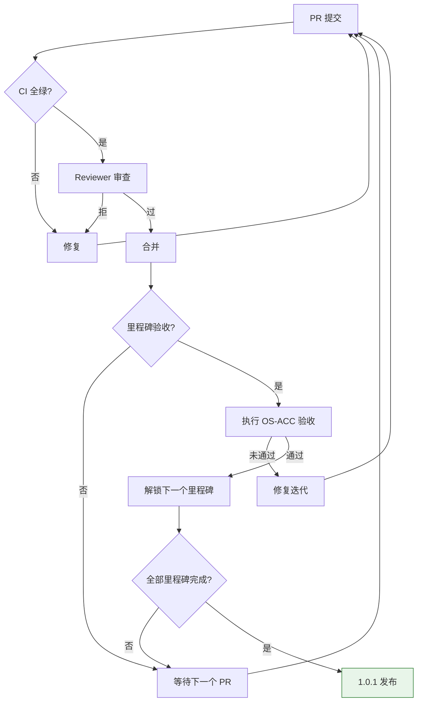

Copyright (c) 2025-2026 SPHARX Ltd. All Rights Reserved.

# agentrt-linux（AirymaxOS）验收标准与质量门禁

> **文档定位**：agentrt-linux（AirymaxOS，极境智能体操作系统）开发详细方案（路线图）模块第 6 文档\
> **版本**：0.1.1\
> **最后更新**：2026-07-06\
> **同源映射**：agentrt `0.1.1工程标准规范手册.md`（v28.0，§38.10 ACC-OS04 + 149 项 ACC）\
> **理论根基**：Linux 6.6 内核基线 + Airymax 五维正交 24 原则（体系并行论）\
> **核心约束**：IRON-9 v2 同源且部分代码共享（agentrt 与 agentrt-linux 验收标准共享编号骨架，独立实施）

---

## 1. 验收标准总览

### 1.1 验收标准定位

agentrt-linux 验收标准（OS-ACC）是工程标准（OS-IRON / OS-STD / OS-BAN）的**可执行验证形态**。每条验收标准必须满足：

1. **可执行验证方法**——配 grep / wc / find / make 等命令，CI 可自动执行
2. **明确通过标准**——量化阈值（如 ≥80% 覆盖率、≥400 行、0 结果）
3. **OS-ACC 规则编号**——每条标准赋予唯一编号，纳入规则编号注册表
4. **A-4 完美主义**——P0 不可妥协，未通过则不可解锁下游里程碑

### 1.2 OS-ACC 总数

agentrt-linux 1.0.1 共定义约 110 项 OS-ACC 验收标准，覆盖 9 个 Part：

| 类别 | 数量 | 编号范围 |
|------|------|---------|
| Part 1 工程标准验收 | 20 | OS-ACC-001~020 |
| Part 2 架构模块验收 | 20 | OS-ACC-021~040 |
| Part 3 测试质量验收 | 10 | OS-ACC-041~050 |
| Part 4 可观测运维验收 | 10 | OS-ACC-051~060 |
| Part 5 安全加固验收 | 10 | OS-ACC-061~070 |
| Part 6 开发流程验收 | 10 | OS-ACC-071~080 |
| Part 7 路线图验收 | 10 | OS-ACC-081~090 |
| Part 8 应用生态验收 | 10 | OS-ACC-091~100 |
| Part 9 兼容性性能验收 | 10 | OS-ACC-101~110 |
| **总计** | **110** | OS-ACC-001~110 |

> 注：核心高优先级 OS-ACC 约 60 项（标 ★），其余为延伸性验收。

---

## 2. OS-ACC 验收标准编号体系

### 2.1 编号前缀定义

| 编号前缀 | 含义 | 与 agentrt 的关系 |
|---------|------|------------------|
| **OS-ACC-001~020** | 工程标准验收（Part 1） | 继承 agentrt ACC-FOUND + OS 专属扩展 |
| **OS-ACC-021~040** | 架构模块验收（Part 2） | 继承 agentrt ACC-SP + OS 专属扩展 |
| **OS-ACC-041~050** | 测试质量验收（Part 3） | 继承 agentrt ACC-TEST + OS 专属扩展 |
| **OS-ACC-051~060** | 可观测运维验收（Part 4） | 全新（agentrt 不涉及内核可观测性） |
| **OS-ACC-061~070** | 安全加固验收（Part 5） | 继承 agentrt ACC-SEC + OS 专属扩展 |
| **OS-ACC-071~080** | 开发流程验收（Part 6） | 继承 agentrt ACC-DEV + OS 专属扩展 |
| **OS-ACC-081~090** | 路线图验收（Part 7） | 全新（agentrt 不涉及 OS 路线图） |
| **OS-ACC-091~100** | 应用生态验收（Part 8） | 全新（agentrt 不涉及云原生 OS） |
| **OS-ACC-101~110** | 兼容性性能验收（Part 9） | 全新（agentrt 不涉及内核性能） |

### 2.2 编号规则

- 每条 OS-ACC 编号唯一，不可复用
- 编号一旦定义不可删除，仅可标记为 Deprecated（弃用）
- 新增 OS-ACC 按编号顺序追加，不允许插入中间
- 弃用 OS-ACC 必须在 `50-engineering-standards/07-maintainers-and-governance.md` 的"规则编号注册表"中声明

### 2.3 验收标准模板

每条 OS-ACC 必须包含以下字段：

| 字段 | 说明 | 示例 |
|------|------|------|
| 编号 | OS-ACC-XXX | OS-ACC-001 |
| 验收项 | 简短描述 | 50-engineering-standards/ 23 文档完成 |
| 验证方法 | 可执行命令 | `find docs/AirymaxOS/50-engineering-standards/ -name "*.md" \| wc -l` |
| 通过标准 | 量化阈值 | 23 |
| 优先级 | P0 / P1 / P2 | P0 |
| 适用里程碑 | M0-M8 | M0 |

---

## 3. 工程标准验收（OS-ACC-001~020，Part 1）

| 编号 | 验收项 | 验证方法 | 通过标准 | 优先级 | 里程碑 |
|------|--------|---------|---------|--------|--------|
| OS-ACC-001 ★ | 50-engineering-standards/ 23 文档完成 | `find docs/AirymaxOS/50-engineering-standards/ -name "*.md" \| wc -l` | ≥23 | P0 | M0 |
| OS-ACC-002 ★ | 文档行数 | `find docs/AirymaxOS/50-engineering-standards/ -name "*.md" -exec wc -l {} +` | 每个文档 ≥400 行 | P0 | M0 |
| OS-ACC-003 ★ | 文档版权声明 | `grep -rL "Copyright (c) 2025-2026 SPHARX" docs/AirymaxOS/50-engineering-standards/` | 0 结果（全部包含） | P0 | M0 |
| OS-ACC-004 ★ | 无禁用关键词（其他 OS 发行版名 / 测试框架名 / 智能体框架名等，详见 50-engineering-standards 黑名单） | `grep -rEf docs/AirymaxOS/50-engineering-standards/forbidden-keywords.txt docs/AirymaxOS/50-engineering-standards/` | 0 结果 | P0 | M0 |
| OS-ACC-005 ★ | OS-IRON 规则编号定义 | `grep -rE "OS-IRON-[0-9]+" docs/AirymaxOS/50-engineering-standards/ \| wc -l` | ≥10 项 | P0 | M0 |
| OS-ACC-006 ★ | OS-STD 规则编号定义 | `grep -rE "OS-STD-[0-9]+" docs/AirymaxOS/50-engineering-standards/ \| wc -l` | ≥20 项 | P0 | M0 |
| OS-ACC-007 ★ | OS-BAN 规则编号定义 | `grep -rE "OS-BAN-[0-9]+" docs/AirymaxOS/50-engineering-standards/ \| wc -l` | ≥30 项 | P0 | M0 |
| OS-ACC-008 ★ | 五维原则映射 | `grep -rE "S-1\|S-2\|S-3\|S-4\|K-1\|K-2\|K-3\|K-4\|C-1\|C-2\|C-3\|C-4\|E-1\|E-2\|E-3\|E-4\|E-5\|E-6\|E-7\|E-8\|A-1\|A-2\|A-3\|A-4" docs/AirymaxOS/50-engineering-standards/` | 每个文档包含映射 | P0 | M0 |
| OS-ACC-009 | 代码示例 | `grep -rE "\`\`\`(c\|rust\|python\|ts\|bash)" docs/AirymaxOS/50-engineering-standards/` | 每个文档 ≥5 个代码示例 | P0 | M0 |
| OS-ACC-010 ★ | Mermaid 图表 | `grep -rE "\`\`\`mermaid" docs/AirymaxOS/50-engineering-standards/` | 关键文档包含图表 | P0 | M0 |
| OS-ACC-011 | Linux 6.6 内核基线声明 | `grep -rE "Linux 6.6 内核基线\|Linux 6.6（Linux 6.6 内核基线）" docs/AirymaxOS/50-engineering-standards/` | 全部文档包含 | P0 | M0 |
| OS-ACC-012 ★ | IRON-9 v2 同源且部分代码共享声明 | `grep -rE "IRON-9 v2 同源且部分代码共享" docs/AirymaxOS/50-engineering-standards/` | ≥3 处声明 | P0 | M0 |
| OS-ACC-013 | 五维正交 24 原则声明 | `grep -rE "五维正交 24 原则\|五维正交" docs/AirymaxOS/50-engineering-standards/` | 全部文档包含 | P0 | M0 |
| OS-ACC-014 | .clang-format 配置 | `find . -name ".clang-format" \| wc -l` | ≥1 个 | P0 | M0 |
| OS-ACC-015 | .rustfmt.toml 配置 | `find . -name ".rustfmt.toml" \| wc -l` | ≥1 个 | P0 | M0 |
| OS-ACC-016 | MAINTAINERS 文件 | `find . -name "MAINTAINERS" \| wc -l` | ≥1 个 | P0 | M0 |
| OS-ACC-017 | checkpatch 集成 | `grep -rE "checkpatch" .github/workflows/` | ≥1 处引用 | P0 | M0 |
| OS-ACC-018 | 7 层验证流水线 | `grep -rE "7 层\|seven-layer" docs/AirymaxOS/50-engineering-standards/` | ≥1 处定义 | P0 | M0 |
| OS-ACC-019 | 6 级成熟度模型 | `grep -rE "6 级成熟度\|Level 0\|Level 1\|Level 2\|Level 3\|Level 4\|Level 5" docs/AirymaxOS/50-engineering-standards/` | ≥1 处定义 | P0 | M0 |
| OS-ACC-020 | DCO 验证 | `grep -rE "DCO\|Signed-off-by" .github/workflows/` | ≥1 处引用 | P0 | M0 |

---

## 4. 架构模块验收（OS-ACC-021~040，Part 2）

| 编号 | 验收项 | 验证方法 | 通过标准 | 优先级 | 里程碑 |
|------|--------|---------|---------|--------|--------|
| OS-ACC-021 ★ | 60-driver-model/ 7 文档完成 | `find docs/AirymaxOS/60-driver-model/ -name "*.md" \| wc -l` | ≥7 | P0 | M1 |
| OS-ACC-022 ★ | 70-build-system/ 8 文档完成 | `find docs/AirymaxOS/70-build-system/ -name "*.md" \| wc -l` | ≥8 | P0 | M1 |
| OS-ACC-023 | 微内核设计文档 | `find docs/AirymaxOS/ -name "*microkernel*" -o -name "*10-architecture*" \| wc -l` | ≥1 个 | P0 | M1 |
| OS-ACC-024 ★ | 8 子仓设计文档 | `find docs/AirymaxOS/20-modules/ -name "*.md" \| wc -l` | ≥8 | P0 | M1 |
| OS-ACC-025 | SCHED_AGENT 策略定义 | `grep -rE "SCHED_AGENT\|sched_ext" docs/AirymaxOS/` | ≥5 处 | P0 | M1 |
| OS-ACC-026 | AgentsIPC 128B 消息头定义 | `grep -rE "AgentsIPC\|128B 消息头" docs/AirymaxOS/` | ≥3 处 | P0 | M1 |
| OS-ACC-027 | capability 安全模型定义 | `grep -rE "capability" docs/AirymaxOS/110-security/` | ≥10 处 | P0 | M1 |
| OS-ACC-028 ★ | 4 层接口稳定性分级 | `grep -rE "L1\|L2\|L3\|L4" docs/AirymaxOS/50-engineering-standards/04-engineering-philosophy.md` | ≥4 层定义 | P0 | M1 |
| OS-ACC-029 | MGLRU 多代 LRU 定义 | `grep -rE "MGLRU" docs/AirymaxOS/` | ≥3 处 | P0 | M1 |
| OS-ACC-030 | CXL 内存分层定义 | `grep -rE "CXL" docs/AirymaxOS/` | ≥3 处 | P0 | M1 |
| OS-ACC-031 | CoreLoopThree kthread 定义 | `grep -rE "CoreLoopThree\|认知 kthread" docs/AirymaxOS/` | ≥3 处 | P0 | M1 |
| OS-ACC-032 | Wasm 沙箱定义 | `grep -rE "Wasm" docs/AirymaxOS/` | ≥3 处 | P0 | M1 |
| OS-ACC-033 ★ | io_uring 集成定义 | `grep -rE "io_uring" docs/AirymaxOS/` | ≥3 处 | P0 | M1 |
| OS-ACC-034 | eBPF 子系统定义 | `grep -rE "eBPF" docs/AirymaxOS/` | ≥5 处 | P0 | M1 |
| OS-ACC-035 | Bazel 构建系统定义 | `grep -rE "Bazel" docs/AirymaxOS/70-build-system/` | ≥5 处 | P0 | M1 |
| OS-ACC-036 | 交叉编译支持 | `grep -rE "交叉编译\|cross-compile" docs/AirymaxOS/70-build-system/` | ≥2 处 | P0 | M1 |
| OS-ACC-037 ★ | ABI 检查工具集成 | `grep -rE "abi-check\|libabigail" docs/AirymaxOS/70-build-system/` | ≥1 处 | P0 | M1 |
| OS-ACC-038 | 12 daemons 集成定义 | `grep -rE "12 daemons\|daemons 集成" docs/AirymaxOS/` | ≥2 处 | P0 | M1 |
| OS-ACC-039 | 同源 API 映射表 | `grep -rE "同源 API\|MicroCoreRT\|Cupolas\|MemoryRovol\|CoreLoopThree" docs/AirymaxOS/` | ≥5 处 | P0 | M1 |
| OS-ACC-040 | 8 子仓裸名（禁止 airymaxos- 前缀） | `grep -rE "github.com/agentrt-linux/airymaxos-" docs/AirymaxOS/` | 0 处 | P0 | M1 |

---

## 5. 测试质量验收（OS-ACC-041~050，Part 3）

| 编号 | 验收项 | 验证方法 | 通过标准 | 优先级 | 里程碑 |
|------|--------|---------|---------|--------|--------|
| OS-ACC-041 ★ | 80-testing/ 10 文档完成 | `find docs/AirymaxOS/80-testing/ -name "*.md" \| wc -l` | ≥10 | P0 | M2 |
| OS-ACC-042 ★ | 测试覆盖率 ≥80% | `make coverage \| grep -E "coverage"` | ≥80% | P0 | M2 |
| OS-ACC-043 ★ | KUnit 集成 | `grep -rE "KUnit" docs/AirymaxOS/80-testing/` | ≥5 处 | P0 | M2 |
| OS-ACC-044 | kselftest 集成 | `grep -rE "kselftest" docs/AirymaxOS/80-testing/` | ≥3 处 | P0 | M2 |
| OS-ACC-045 ★ | fault injection 覆盖 | `grep -rE "fault injection\|FAIL_FUNCTION\|FAIL_MAKE_REQUEST" docs/AirymaxOS/80-testing/` | ≥3 处 | P0 | M2 |
| OS-ACC-046 | 形式化验证 | `grep -rE "形式化验证\|formal verification" docs/AirymaxOS/80-testing/` | ≥2 处 | P0 | M2 |
| OS-ACC-047 | Soak 测试定义 | `grep -rE "Soak" docs/AirymaxOS/80-testing/` | ≥2 处 | P0 | M2 |
| OS-ACC-048 | 混沌测试定义 | `grep -rE "混沌\|chaos" docs/AirymaxOS/80-testing/` | ≥2 处 | P0 | M2 |
| OS-ACC-049 ★ | CI 测试流水线 | `find .github/workflows/ -name "*test*" \| wc -l` | ≥3 个工作流 | P0 | M2 |
| OS-ACC-050 | 测试结果报告 | `grep -rE "测试结果报告\|test report" docs/AirymaxOS/80-testing/` | ≥1 处定义 | P0 | M2 |

---

## 6. 可观测运维验收（OS-ACC-051~060，Part 4）

| 编号 | 验收项 | 验证方法 | 通过标准 | 优先级 | 里程碑 |
|------|--------|---------|---------|--------|--------|
| OS-ACC-051 ★ | 90-observability/ 9 文档完成 | `find docs/AirymaxOS/90-observability/ -name "*.md" \| wc -l` | ≥9 | P0 | M3 |
| OS-ACC-052 ★ | 100-operations/ 10 文档完成 | `find docs/AirymaxOS/100-operations/ -name "*.md" \| wc -l` | ≥10 | P0 | M3 |
| OS-ACC-053 ★ | ftrace 集成 | `grep -rE "ftrace" docs/AirymaxOS/90-observability/` | ≥5 处 | P0 | M3 |
| OS-ACC-054 | perf 集成 | `grep -rE "perf " docs/AirymaxOS/90-observability/` | ≥3 处 | P0 | M3 |
| OS-ACC-055 ★ | eBPF 可观测性 | `grep -rE "eBPF" docs/AirymaxOS/90-observability/` | ≥5 处 | P0 | M3 |
| OS-ACC-056 | 4 层文件系统接口 | `grep -rE "4 层文件系统\|tracefs\|debugfs\|procfs\|sysfs" docs/AirymaxOS/90-observability/` | ≥4 层定义 | P0 | M3 |
| OS-ACC-057 | DevStation 定义 | `grep -rE "DevStation" docs/AirymaxOS/100-operations/` | ≥3 处 | P0 | M3 |
| OS-ACC-058 | 告警机制定义 | `grep -rE "告警\|alert" docs/AirymaxOS/100-operations/` | ≥3 处 | P0 | M3 |
| OS-ACC-059 | 升级流程定义 | `grep -rE "升级\|upgrade" docs/AirymaxOS/100-operations/` | ≥2 处 | P0 | M3 |
| OS-ACC-060 | Token 能效监控 | `grep -rE "Token 能效\|Token efficiency" docs/AirymaxOS/90-observability/` | ≥2 处 | P0 | M3 |

---

## 7. 安全加固验收（OS-ACC-061~070，Part 5）

| 编号 | 验收项 | 验证方法 | 通过标准 | 优先级 | 里程碑 |
|------|--------|---------|---------|--------|--------|
| OS-ACC-061 ★ | 110-security/ 9 文档完成 | `find docs/AirymaxOS/110-security/ -name "*.md" \| wc -l` | ≥9 | P0 | M4 |
| OS-ACC-062 ★ | capability 模型定义 | `grep -rE "capability" docs/AirymaxOS/110-security/` | ≥10 处 | P0 | M4 |
| OS-ACC-063 ★ | LSM 集成 | `grep -rE "LSM\|Linux Security Module" docs/AirymaxOS/110-security/` | ≥5 处 | P0 | M4 |
| OS-ACC-064 | 机密计算定义 | `grep -rE "机密计算\|confidential computing" docs/AirymaxOS/110-security/` | ≥3 处 | P0 | M4 |
| OS-ACC-065 | 国密支持 | `grep -rE "国密\|SM2\|SM3\|SM4" docs/AirymaxOS/110-security/` | ≥3 处 | P0 | M4 |
| OS-ACC-066 | eBPF 签名验证 | `grep -rE "eBPF.*签名\|eBPF.*signature" docs/AirymaxOS/110-security/` | ≥2 处 | P0 | M4 |
| OS-ACC-067 | 模块签名 | `grep -rE "模块签名\|module signature" docs/AirymaxOS/110-security/` | ≥2 处 | P0 | M4 |
| OS-ACC-068 ★ | 安全审计流程 | `grep -rE "安全审计\|security audit" docs/AirymaxOS/110-security/` | ≥2 处 | P0 | M4 |
| OS-ACC-069 | 漏洞响应预案 | `grep -rE "漏洞响应\|vulnerability response" docs/AirymaxOS/110-security/` | ≥1 处定义 | P0 | M4 |
| OS-ACC-070 | Cupolas 安全穹顶映射 | `grep -rE "Cupolas\|安全穹顶" docs/AirymaxOS/110-security/` | ≥3 处 | P0 | M4 |

---

## 8. 开发流程验收（OS-ACC-071~080，Part 6）

| 编号 | 验收项 | 验证方法 | 通过标准 | 优先级 | 里程碑 |
|------|--------|---------|---------|--------|--------|
| OS-ACC-071 ★ | 120-development-process/ 9 文档完成 | `find docs/AirymaxOS/120-development-process/ -name "*.md" \| wc -l` | ≥9 | P0 | M5 |
| OS-ACC-072 ★ | PR 模板定义 | `find .github/ -name "*PULL_REQUEST*" -o -name "*pull_request*"` | ≥1 个 | P0 | M5 |
| OS-ACC-073 | CODEOWNERS 定义 | `find . -name "CODEOWNERS" \| wc -l` | ≥1 个 | P0 | M5 |
| OS-ACC-074 ★ | DCO bot 集成 | `grep -rE "DCO\|dco" .github/workflows/` | ≥1 处 | P0 | M5 |
| OS-ACC-075 | Fixes/Closes/Link 标签 | `grep -rE "Fixes:\|Closes:\|Link:" docs/AirymaxOS/120-development-process/` | ≥3 处定义 | P0 | M5 |
| OS-ACC-076 | Reviewed-by 流程 | `grep -rE "Reviewed-by\|Acked-by\|Tested-by" docs/AirymaxOS/120-development-process/` | ≥3 处定义 | P0 | M5 |
| OS-ACC-077 | develop 集成分支 | `grep -rE "develop\|linux-next" docs/AirymaxOS/120-development-process/` | ≥2 处 | P0 | M5 |
| OS-ACC-078 | release 稳定分支 | `grep -rE "release/\|stable" docs/AirymaxOS/120-development-process/` | ≥2 处 | P0 | M5 |
| OS-ACC-079 | git bisect 友好 | `grep -rE "git bisect\|bisect" docs/AirymaxOS/120-development-process/` | ≥2 处 | P0 | M5 |
| OS-ACC-080 | 审查响应 SLA | `grep -rE "SLA\|响应" docs/AirymaxOS/120-development-process/` | ≥1 处定义 | P0 | M5 |

---

## 9. 路线图验收（OS-ACC-081~090，Part 7）

| 编号 | 验收项 | 验证方法 | 通过标准 | 优先级 | 里程碑 |
|------|--------|---------|---------|--------|--------|
| OS-ACC-081 ★ | 130-roadmap/ 7 文档完成 | `find docs/AirymaxOS/130-roadmap/ -name "*.md" \| wc -l` | ≥7 | P0 | M6 |
| OS-ACC-082 ★ | README.md 路线图总纲 | `test -f docs/AirymaxOS/130-roadmap/README.md && echo OK` | OK | P0 | M6 |
| OS-ACC-083 | 开发策略文档 | `test -f docs/AirymaxOS/130-roadmap/01-development-strategy.md && echo OK` | OK | P0 | M6 |
| OS-ACC-084 | 里程碑与时间线文档 | `test -f docs/AirymaxOS/130-roadmap/02-milestones-and-timeline.md && echo OK` | OK | P0 | M6 |
| OS-ACC-085 ★ | 资源估算文档 | `test -f docs/AirymaxOS/130-roadmap/03-resource-estimation.md && echo OK` | OK | P0 | M6 |
| OS-ACC-086 ★ | 依赖关系图文档 | `test -f docs/AirymaxOS/130-roadmap/04-dependency-graph.md && echo OK` | OK | P0 | M6 |
| OS-ACC-087 ★ | 风险识别与缓解文档 | `test -f docs/AirymaxOS/130-roadmap/05-risk-mitigation.md && echo OK` | OK | P0 | M6 |
| OS-ACC-088 ★ | 验收标准与质量门禁文档 | `test -f docs/AirymaxOS/130-roadmap/06-acceptance-criteria.md && echo OK` | OK | P0 | M6 |
| OS-ACC-089 | Mermaid Gantt 图 | `grep -rE "\`\`\`mermaid" docs/AirymaxOS/130-roadmap/02-milestones-and-timeline.md` | ≥1 处 | P0 | M6 |
| OS-ACC-090 | 关键路径定义 | `grep -rE "关键路径\|critical path" docs/AirymaxOS/130-roadmap/` | ≥3 处 | P0 | M6 |

---

## 10. 应用生态验收（OS-ACC-091~100，Part 8）

| 编号 | 验收项 | 验证方法 | 通过标准 | 优先级 | 里程碑 |
|------|--------|---------|---------|--------|--------|
| OS-ACC-091 | 140-application-development/ 9 文档完成 | `find docs/AirymaxOS/140-application-development/ -name "*.md" \| wc -l` | ≥9 | P1 | M7 |
| OS-ACC-092 | 150-cloudnative/ 8 文档完成 | `find docs/AirymaxOS/150-cloudnative/ -name "*.md" \| wc -l` | ≥8 | P1 | M7 |
| OS-ACC-093 | Agent SDK 定义 | `grep -rE "Agent SDK\|agent sdk" docs/AirymaxOS/140-application-development/` | ≥3 处 | P1 | M7 |
| OS-ACC-094 | 应用模型定义 | `grep -rE "应用模型\|application model" docs/AirymaxOS/140-application-development/` | ≥2 处 | P1 | M7 |
| OS-ACC-095 | K8s 集成 | `grep -rE "K8s\|Kubernetes" docs/AirymaxOS/150-cloudnative/` | ≥3 处 | P1 | M7 |
| OS-ACC-096 | containerd 集成 | `grep -rE "containerd" docs/AirymaxOS/150-cloudnative/` | ≥2 处 | P1 | M7 |
| OS-ACC-097 | OCI 镜像标准 | `grep -rE "OCI" docs/AirymaxOS/150-cloudnative/` | ≥2 处 | P1 | M7 |
| OS-ACC-098 | agentctl 工具 | `grep -rE "agentctl" docs/AirymaxOS/150-cloudnative/` | ≥2 处 | P1 | M7 |
| OS-ACC-099 | 超节点 OS | `grep -rE "超节点" docs/AirymaxOS/150-cloudnative/` | ≥2 处 | P1 | M7 |
| OS-ACC-100 | 包管理定义 | `grep -rE "包管理\|package" docs/AirymaxOS/140-application-development/` | ≥2 处 | P1 | M7 |

---

## 11. 兼容性性能验收（OS-ACC-101~110，Part 9）

| 编号 | 验收项 | 验证方法 | 通过标准 | 优先级 | 里程碑 |
|------|--------|---------|---------|--------|--------|
| OS-ACC-101 | 160-compatibility/ 8 文档完成 | `find docs/AirymaxOS/160-compatibility/ -name "*.md" \| wc -l` | ≥8 | P1 | M8 |
| OS-ACC-102 | 170-performance/ 8 文档完成 | `find docs/AirymaxOS/170-performance/ -name "*.md" \| wc -l` | ≥8 | P1 | M8 |
| OS-ACC-103 ★ | 性能基线定义 | `grep -rE "性能基线\|performance baseline" docs/AirymaxOS/170-performance/` | ≥2 处 | P1 | M8 |
| OS-ACC-104 | 硬件兼容矩阵 | `grep -rE "硬件兼容\|hardware compatibility" docs/AirymaxOS/160-compatibility/` | ≥2 处 | P1 | M8 |
| OS-ACC-105 | 软件兼容矩阵 | `grep -rE "软件兼容\|software compatibility" docs/AirymaxOS/160-compatibility/` | ≥2 处 | P1 | M8 |
| OS-ACC-106 ★ | ABI 兼容性测试 | `grep -rE "ABI 兼容\|ABI compatibility" docs/AirymaxOS/160-compatibility/` | ≥2 处 | P1 | M8 |
| OS-ACC-107 | 调优指南 | `grep -rE "调优\|tuning" docs/AirymaxOS/170-performance/` | ≥2 处 | P1 | M8 |
| OS-ACC-108 | Token 能效基准 | `grep -rE "Token 能效\|Token efficiency" docs/AirymaxOS/170-performance/` | ≥2 处 | P1 | M8 |
| OS-ACC-109 | 基准测试套件 | `grep -rE "基准测试\|benchmark" docs/AirymaxOS/170-performance/` | ≥3 处 | P1 | M8 |
| OS-ACC-110 ★ | Linux 6.6 兼容性验证 | `grep -rE "Linux 7\.0\|PREEMPT_LAZY\|Rust 正式转正\|XFS 自修复\|MGLRU 2\.0" docs/AirymaxOS/ \| grep -v "06-acceptance-criteria"` | 0 结果（同 ACC-OS04，排除本文件自身） | P1 | M8 |

---

## 12. 质量门禁

### 12.1 PR 合并门禁

每个 PR 合并前必须通过以下门禁（对应 OS-ACC 验收标准）：

| 门禁 | 对应 OS-ACC | 通过标准 | 阻断级别 |
|------|------------|---------|---------|
| 文档版权声明 | OS-ACC-003 | 全部 PR 修改的文档包含版权 | 阻断合并 |
| 无禁用关键词 | OS-ACC-004 | 0 结果 | 阻断合并 |
| 文档行数 | OS-ACC-002 | 新增文档 ≥400 行 | 阻断合并 |
| checkpatch 通过 | OS-ACC-017 | 0 错误 | 阻断合并 |
| 测试覆盖率 | OS-ACC-042 | ≥80% | 阻断合并 |
| CI 全绿 | OS-ACC-049 | 全部 CI 任务通过 | 阻断合并 |
| DCO 验证 | OS-ACC-020 / 074 | Signed-off-by 链完整 | 阻断合并 |
| 文档同步 | OS-ACC-009 | 代码变更同步更新文档 | 阻断合并 |

### 12.2 里程碑验收门禁

每个里程碑验收时，必须通过该里程碑对应的整组 OS-ACC：

| 里程碑 | 必须通过的 OS-ACC | 阻断级别 |
|--------|-----------------|---------|
| M0 工程标准奠基 | OS-ACC-001~020（20 项） | 阻断 M1 启动 |
| M1 架构与内核基线 | OS-ACC-021~040（20 项） | 阻断 M2-M5 启动 |
| M2 测试体系 | OS-ACC-041~050（10 项） | 阻断 M5 集成 |
| M3 可观测性 | OS-ACC-051~060（10 项） | 阻断 M5 集成 |
| M4 安全加固 | OS-ACC-061~070（10 项） | 阻断 M5 集成 |
| M5 集成验证 | OS-ACC-071~080（10 项） | 阻断 M6 收口 |
| M6 路线图收口 | OS-ACC-081~090（10 项） | 阻断 1.0.1 发布 |
| M7 应用生态 | OS-ACC-091~100（10 项） | 阻断 1.0.1 发布 |
| M8 性能与兼容 | OS-ACC-101~110（10 项） | 阻断 1.0.1 发布 |

### 12.3 版本发布门禁

1.0.1 版本发布前必须通过全部 110 项 OS-ACC：

| 门禁类别 | OS-ACC 数量 | 通过标准 |
|---------|------------|---------|
| PR 合并门禁 | 8 项（每个 PR） | 全部 PASS |
| 里程碑门禁 | 110 项（每个 M） | 全部 PASS |
| 高风险门禁（★） | 约 60 项核心 | 全部 PASS |
| 安全审计门禁 | OS-ACC-061~070 + 外部审计 | 全部 PASS |
| 性能基线门禁 | OS-ACC-103 / 110 | regression ≤5% |

### 12.4 质量门禁流程

---

## 13. 验收流程

### 13.1 自验收（开发者）

- **执行者**：PR 提交者
- **时机**：PR 提交前
- **方法**：本地执行 OS-ACC 验证命令（如 `grep` / `wc` / `find`）
- **产物**：PR 描述中勾选自验收清单
- **责任**：开发者对自验收结果负责，未通过不可提交 PR

### 13.2 同行验收（Reviewer）

- **执行者**：Reviewer（必须非 PR 提交者）
- **时机**：PR 审查阶段
- **方法**：Reviewer 复核 OS-ACC 验证命令的执行结果
- **产物**：Reviewed-by 标签 + 审查评论
- **责任**：Reviewer 对审查结果负责；高优先级 OS-ACC（★）必须由 ≥2 名 Reviewer 通过

### 13.3 工程规范委员会验收

- **执行者**：工程规范委员会（详见 50-engineering-standards/07-maintainers-and-governance.md）
- **时机**：里程碑验收时
- **方法**：工程规范委员会执行整组 OS-ACC 验收，记录通过/未通过状态
- **产物**：里程碑验收报告（含每项 OS-ACC 的验证命令输出）
- **责任**：工程规范委员会对里程碑验收结果负责；未通过不可解锁下游里程碑

### 13.4 验收流程图

### 13.5 验收记录存档

所有 OS-ACC 验收结果必须存档：

- **PR 级别**：存档于 PR 评论 + CI 日志
- **里程碑级别**：存档于 `130-roadmap/` 内部（每里程碑一份验收报告）
- **版本级别**：存档于 1.0.1 发布说明

---

## 14. 五维原则映射

本文档遵循 Airymax 五维正交 24 原则中的以下项：

| 原则 | 在验收标准与质量门禁中的体现 | 落地章节 |
|------|---------------------------|---------|
| **A-4 完美主义** | P0 不可妥协；高优先级 OS-ACC（★）必须通过；7 层验证 | §1.1 + §12 质量门禁 |
| **E-8 可测试性** | 每条 OS-ACC 配可执行验证命令（grep/wc/find/make） | §2.3 验收标准模板 |
| **S-1 反馈闭环** | PR 合并门禁 → 里程碑验收 → 版本发布的三层反馈闭环 | §12 + §13 |
| **E-6 错误可追溯** | 验收结果存档于 PR/里程碑/版本三个层级，可追溯 | §13.5 验收记录存档 |
| **S-3 总体设计部** | 工程规范委员会统筹里程碑验收与版本发布门禁 | §13.3 工程规范委员会验收 |
| **K-2 接口契约化** | OS-ACC 是 Part 间接口契约的可执行形态 | §2 编号体系 + §12.2 |
| **E-7 文档即代码** | 验收标准本身是 Markdown 表格即代码；CI 自动执行 | 全文 |
| **IRON-9 v2 同源且部分代码共享** | OS-ACC 继承 agentrt ACC 编号骨架，独立实施内核态专属验收 | §2.1 编号前缀 |

---

## 15. 相关文档

### 15.1 本模块内部

- `README.md` — 路线图主索引与总纲
- `01-development-strategy.md` — 开发策略与三大支柱详解
- `02-milestones-and-timeline.md` — 里程碑与时间线（M0-M8 详解）
- `03-resource-estimation.md` — 资源估算（含 340h 风险缓冲）
- `04-dependency-graph.md` — 依赖关系图（Part 间依赖与 OS-ACC 验收对齐）
- `05-risk-mitigation.md` — 风险识别与缓解（含验收失败风险）

### 15.2 同源 Airymax 文档

- `docs/AirymaxRT/00-architectural-principles.md` — 五维正交 24 原则
- IRON-9 v2 工程铁律 — 17 类规则编号体系（v28.0，含 IRON-9 + ACC-OS04 + 149 项 ACC）
- agentrt 工程改进方案 — agentrt 三大支柱方案（v4.2）

### 15.3 agentrt-linux 工程标准

- `50-engineering-standards/README.md` — 工程标准主框架（OS-IRON / OS-STD / OS-BAN 编号体系）
- `50-engineering-standards/06-toolchain-and-automation.md` — 工具链与自动化（7 层验证 + 24 项提交检查清单）
- `50-engineering-standards/07-maintainers-and-governance.md` — 维护者制度与治理（含规则编号注册表）

---

## 16. 文档版本与维护

- **当前版本**: v1.0（2026-07-06）
- **维护者**: 工程规范委员会（待成立，详见 50-engineering-standards/07-maintainers-and-governance.md）
- **变更流程**: 任何 OS-ACC 验收标准变更必须经过 RFC → 评审 → 工程规范委员会批准流程
- **回顾周期**: 里程碑回顾（每 M 完成时验收）+ 季度验收标准回顾 + 年度大版本校准

---

> **文档结束** | 共 16 节 | Linux 6.6 内核基线 + 五维正交 24 原则 + IRON-9 v2 同源且部分代码共享 | 约 110 项 OS-ACC 验收标准 + 三层质量门禁 + 三级验收流程