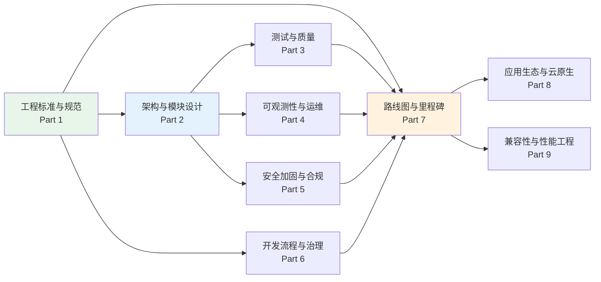
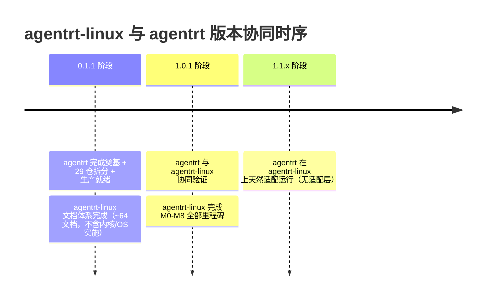

Copyright (c) 2025-2026 SPHARX Ltd. All Rights Reserved.

# agentrt-linux（AirymaxOS）开发详细方案（路线图）

> **文档定位**: agentrt-linux（AirymaxOS，极境智能体操作系统）开发详细方案的主索引与总纲
> **版本**: 0.1.1（文档体系完成）/ 1.0.1（开发）
> **最后更新**: 2026-07-06
> **同源映射**: agentrt `0.1.1技术全面改进方案v3.0.md`（v4.2，三大支柱：奠基 + 29 仓拆分 + 生产就绪）
> **理论根基**: Linux 6.6 内核基线 + Airymax 五维正交 24 原则（体系并行论）

---

## 1. 路线图定位

### 1.1 本模块在 agentrt-linux 文档体系中的位置

`130-roadmap/` 是 agentrt-linux 19 个文档模块中的第 13 个，定位为**开发详细方案的总索引**：

- **50-engineering-standards/** 定义"代码该怎么写"——工程标准与规范
- **130-roadmap/**（本模块）定义"什么时候写什么代码"——开发策略、里程碑与时间线

工程标准是"语法"，路线图是"时序"。两者共同回答 agentrt-linux 从"文档体系仓库"演进到"可投产发行版"的完整路径。

### 1.2 与 agentrt 0.1.1 / 1.0.1 的关系

agentrt-linux 与 agentrt（AirymaxAgentRT，跨平台用户态运行时）**同源**：

| 版本 | agentrt 范围 | agentrt-linux 范围 |
|------|--------------|----------------|
| 0.1.1 | 全部三大支柱（奠基 + 29 仓拆分 + 生产就绪，约 3,414.5h） | **文档体系完成**（工程标准 8 + 架构 6 + 模块 9 + 接口 5 + 数据流 4 + P0 模块 21 + 路线图 7，共 ~64 文档；不含内核/OS 实施） |
| 1.0.1 | 与 agentrt-linux 协同验证 | 内核和 OS 实际开发（本文档定义的 M0-M8 全部里程碑） |

agentrt 在前（0.1.1 已完成奠基），agentrt-linux 在后（1.0.1 基于 agentrt 同源语义开发）。两端通过 MicroCoreRT / AgentsIPC / Cupolas / MemoryRovol / CoreLoopThree 同源 API 实现无适配层互操作。

### 1.3 0.1.1 与 1.0.1 范围区分

- **0.1.1 文档体系完成**：完成 `50-engineering-standards/` 全部 8 文档 + `130-roadmap/` 全部 7 文档 + `00-requirements/` + `10-architecture/` + `20-modules/` + `30-interfaces/` + `40-dataflows/` 五层核心设计文档（共 28 文档）+ P0 模块（`60-120`）各 3 文档（共 21 文档），合计 ~64 文档。0.1.1 完成**文档体系与设计草案**，**不要求内核/OS 实施**。
- **1.0.1 实际开发**：完成 M0-M8 全部里程碑，19 模块 ~140 文档全部产出，工程标准全面实施，7 层自动化验证全部就位。

---

## 2. 三大开发支柱

agentrt-linux 开发方案由三大支柱构成，分别对应工程标准、架构设计、开发治理三类工作：

| 支柱 | 范围 | 0.1.1 | 1.0.1 |
|------|------|-------|-------|
| **工程标准与规范** | `50-engineering-standards/`（8 文档） | 文档体系完成 | 实施 |
| **架构与模块设计** | `10-architecture/` + `20-modules/` + `60-driver-model/` + `70-build-system/` | README + 设计草案 | 实施 |
| **开发流程与治理** | `120-development-process/`（9 文档）+ `50-engineering-standards/07` | README + 设计草案 | 实施 |

### 2.1 支柱间关系



工程标准先行（Part 1），架构设计并行（Part 2），测试/可观测/安全/治理随后（Part 3-6），路线图收口（Part 7），应用生态与性能工程作为 P1 延伸（Part 8-9）。

---

## 3. 9 部分开发方案概览

agentrt-linux 开发方案拆分为 9 个 Part，按优先级分两层（P0 / P1）：

| Part | 名称 | 优先级 | 依赖 | 工时 | 0.1.1 范围 |
|------|------|--------|------|------|-----------|
| Part 1 | 工程标准与规范体系建立 | P0 | 无 | 240h | 全部完成 |
| Part 2 | 架构与模块设计完善 | P0 | 无 | 480h | README + 01 + 02 |
| Part 3 | 测试与质量体系建立 | P0 | Part 1 + Part 2 | 320h | README + 01 + 02 |
| Part 4 | 可观测性与运维体系 | P0 | Part 2 | 380h | README + 01 + 02 |
| Part 5 | 安全加固与合规体系 | P0 | Part 2 | 320h | README + 01 + 02 |
| Part 6 | 开发流程与治理 | P0 | Part 1 | 240h | README + 01 + 02 |
| Part 7 | 路线图与里程碑 | P0 | Part 1-6 | 80h | 全部完成 |
| Part 8 | 应用生态与云原生 | P1 | Part 2-5 | 200h | 仅 README |
| Part 9 | 兼容性与性能工程 | P1 | Part 2-5 | 150h | 仅 README |

### 3.1 优先级说明

- **P0（必修）**：Part 1-7，覆盖工程标准、架构、测试、可观测、安全、治理、路线图。P0 是 agentrt-linux 1.0.1 可投产的前提。
- **P1（延伸）**：Part 8-9，覆盖应用生态、云原生、兼容性、性能工程。P1 在 P0 完成后启动，可在 1.0.1 后期或 1.1.x 持续完善。

---

## 4. 文档索引

`130-roadmap/` 由 7 个文档构成（含本 README）：

```
130-roadmap/
├── README.md                      # 本文件 — 主索引与总纲
├── 01-development-strategy.md     # 开发策略与三大支柱详解
├── 02-milestones-and-timeline.md  # 里程碑与时间线（含 Mermaid Gantt 图）
├── 03-resource-estimation.md      # 资源估算（人力 / 工时 / 预算）
├── 04-dependency-graph.md         # 依赖关系图（Part 间 / 模块间）
├── 05-risk-mitigation.md          # 风险识别与缓解策略
└── 06-acceptance-criteria.md      # 验收标准与质量门禁
```

### 4.1 各文档定位

| 文档 | 核心问题 | 主要产物 |
|------|---------|---------|
| README.md | 路线图全貌是什么？ | 9 Part 总览表 + 版本规划 + 工时汇总 |
| 01-development-strategy.md | 怎么开发？ | 三大支柱详解 + 9 Part 范围 + 开发原则 |
| 02-milestones-and-timeline.md | 什么时候做完？ | M0-M8 里程碑 + Gantt 图 + 关键路径 |
| 03-resource-estimation.md | 需要多少资源？ | 人力配置 + 工时分解 + 预算 |
| 04-dependency-graph.md | 谁依赖谁？ | Part 依赖图 + 模块依赖矩阵 |
| 05-risk-mitigation.md | 风险在哪？ | 风险登记册 + 缓解策略 + 应急预案 |
| 06-acceptance-criteria.md | 怎么算完成？ | 每个 Part / 里程碑的验收标准 + 质量门禁 |

---

## 5. 版本规划

### 5.1 双版本策略

agentrt-linux 采用"占位 → 开发"两阶段版本策略，与 agentrt 的版本节奏对齐：

| 版本 | agentrt-linux 范围 | agentrt 范围 | agentrt-linux 工时 |
|------|----------------|--------------|----------------|
| **0.1.1** | 文档体系完成（~64 文档：工程标准 8 + 架构 6 + 模块 9 + 接口 5 + 数据流 4 + P0 模块 21 + 路线图 7 + 根 README 等） | 全部三大支柱（奠基 + 29 仓拆分 + 生产就绪） | ~150h（文档编写） |
| **1.0.1** | 内核和 OS 实际开发（M0-M8 全部里程碑） | 与 agentrt-linux 协同验证 | ~2,750h |

### 5.2 0.1.1 版本范围（文档体系完成）

0.1.1 是 agentrt-linux 的"文档体系奠基版本"，目标是完成全部设计文档与工程标准框架（不含内核/OS 代码实施）：

- 完成 `50-engineering-standards/` 全部 8 文档（工程标准框架）
- 完成 `130-roadmap/` 全部 7 文档（路线图模块）
- 完成 `00-requirements/` 4 文档 + `10-architecture/` 6 文档 + `20-modules/` 9 文档 + `30-interfaces/` 5 文档 + `40-dataflows/` 4 文档（五层核心设计文档 28 篇）
- 完成 P0 模块（`60-120`）各 3 文档（README + 01 + 02，共 21 篇）
- P1 模块（`140-170`）仅 README.md 占位
- 合计 ~64 文档
- **不要求内核/OS 代码实施**（实施在 1.0.1 版本）

### 5.3 1.0.1 版本范围（开发）

1.0.1 是 agentrt-linux 的"实际开发版本"，目标是完成可投产的智能体操作系统：

- 完成 M0-M8 全部 9 个里程碑
- 19 模块 ~140 文档全部产出
- 工程标准全面实施（7 层自动化验证全部就位）
- 8 子仓（kernel / services / security / memory / cognition / cloudnative / system / airymaxos-tests-linux）实际开发
- 维护者制度与治理落地

---

## 6. 总工时估算

### 6.1 工时汇总

| 优先级 | 范围 | 工时合计 | 工期 |
|--------|------|---------|------|
| P0 | Part 1-7（9 部分中前 7 部分） | ~2,060h + 340h 缓冲 = ~2,400h | 60-90 天 |
| P1 | Part 8-9（应用生态 + 性能工程） | ~350h | 30-45 天 |
| **总计** | **Part 1-9** | **~2,750h** | **~120 天** |

### 6.2 P0 工时分解

| Part | 名称 | 工时 | 占 P0 比例 |
|------|------|------|-----------|
| Part 1 | 工程标准与规范体系建立 | 240h | 10.0% |
| Part 2 | 架构与模块设计完善 | 480h | 20.0% |
| Part 3 | 测试与质量体系建立 | 320h | 13.3% |
| Part 4 | 可观测性与运维体系 | 380h | 15.8% |
| Part 5 | 安全加固与合规体系 | 320h | 13.3% |
| Part 6 | 开发流程与治理 | 240h | 10.0% |
| Part 7 | 路线图与里程碑 | 80h | 3.3% |
| 缓冲 | 管理与风险缓冲（约 14%） | 340h | 14.2% |
| **P0 合计** | — | **~2,400h** | **100%** |

### 6.3 缓冲说明

340h 管理与风险缓冲（约占 P0 直接工时的 14%）用于：

- 跨 Part 协调与集成调试
- 0.1.1 → 1.0.1 范围变更引起的返工
- 里程碑验收未通过的修复迭代
- 与 agentrt 同源语义对齐的额外成本

缓冲比例符合早期路线图规划标准（10%-20%），详见 `05-risk-mitigation.md`。

---

## 7. 五维原则映射

agentrt-linux 路线图是 Airymax 五维正交 24 原则在"开发时序"维度的具体落地：

| 五维原则 | 在路线图中的体现 | 落地章节 |
|---------|-----------------|---------|
| **S-1 反馈闭环** | 每个里程碑验收即反馈闭环；P0 完成后反馈到 P1 计划 | 02 里程碑 + 06 验收标准 |
| **S-2 层次分解** | 9 Part → 9 里程碑 → 子任务的三层分解 | 01 开发策略 |
| **S-3 总体设计部** | 总维护者统筹 9 Part 优先级与依赖 | 01 §3 + 06 验收 |
| **S-4 涌现性管理** | 渐进式里程碑 + 关键路径管理；抑制负面涌现（延期传染） | 02 关键路径 |
| **K-1 内核极简** | Part 2 微内核化改造优先；内核职责最小化 | 01 §2.2 |
| **K-2 接口契约化** | 4 层接口稳定性分级贯穿 Part 1-5 | 01 §5 |
| **K-3 服务隔离** | Part 2 用户态服务化 + Part 5 capability 安全 | 01 §2.2 |
| **E-1 安全内生** | Part 5 安全加固前置（与 Part 3/4 并行） | 02 里程碑 |
| **E-6 错误可追溯** | 里程碑验收标准可追溯；regression 不可接受 | 06 验收标准 |
| **E-7 文档即代码** | 路线图本身是 Markdown 即代码；与代码同源演进 | 本模块全部 |
| **E-8 可测试性** | Part 3 测试体系依赖 Part 1+2 先行 | 02 依赖关系 |
| **A-3 人文关怀** | 审查优先文化；里程碑工时含审查与缓冲 | 01 §5.4 |
| **A-4 完美主义** | 关键路径管理；P0 不可妥协 | 02 §7 |

---

## 8. 同源 agentrt 协同

### 8.1 IRON-9 v2 同源且部分代码共享原则

agentrt-linux 路线图与 agentrt 路线图遵循 **IRON-9 v2 同源且部分代码共享**原则：

- **同源**：共享五维正交 24 原则作为顶层设计哲学；共享 17 类规则编号体系骨架（IRON/BAN/STD/ACC 等）；共享 E-7 文档即代码、E-6 错误可追溯等核心工程观。
- **独立**：agentrt-linux 是 OS 发行版，承担内核态严肃性责任，路线图必须独立处理内核 ABI 稳定性、补丁生命周期、维护者层级制度等 agentrt 不涉及的领域。
- **互操作**：agentrt 在 agentrt-linux 上运行时，两端通过同源 API（MicroCoreRT 调度、AgentsIPC 128B 消息头、Cupolas 安全模型）实现无适配层互操作。

### 8.2 同源 API 映射

| agentrt 概念 | agentrt-linux 对应 | 同源语义 |
|--------------|----------------|----------|
| MicroCoreRT（atoms/corekern） | airymaxos-kernel（SCHED_AGENT 策略） | 调度语义同源 |
| AgentsIPC（128B 消息头） | airymaxos-kernel IPC 子系统 | 消息头同源 |
| Cupolas（安全穹顶） | airymaxos-security（capability + LSM） | 安全模型同源 |
| MemoryRovol（记忆卷载） | airymaxos-memory（记忆子系统） | 记忆模型同源 |
| CoreLoopThree（认知循环） | airymaxos-cognition（认知 kthread） | 循环模型同源 |

### 8.3 版本协同时序



---

## 9. 相关文档

### 9.1 本模块内部文档

- `01-development-strategy.md` — 开发策略与三大支柱详解
- `02-milestones-and-timeline.md` — 里程碑与时间线（Mermaid Gantt 图）
- `03-resource-estimation.md` — 资源估算（待编写）
- `04-dependency-graph.md` — 依赖关系图（待编写）
- `05-risk-mitigation.md` — 风险识别与缓解（待编写）
- `06-acceptance-criteria.md` — 验收标准与质量门禁（待编写）

### 9.2 同源 Airymax 文档

- `docs/AirymaxRT/00-architectural-principles.md` — 五维正交 24 原则
- IRON-9 v2 工程铁律（闭源内部参考） — 17 类规则编号体系（v28.0，含 IRON-9）
- 内部工程改进方案（闭源） — agentrt 三大支柱方案（v4.2）

### 9.3 agentrt-linux 设计文档

- `50-engineering-standards/README.md` — 工程标准主框架（已完成）
- `10-architecture/` — 系统架构设计
- `20-modules/` — 8 子仓模块设计
- `80-testing/` — 测试体系设计
- `90-observability/` — 可观测性设计
- `100-operations/` — 运维体系设计
- `110-security/` — 安全加固设计
- `120-development-process/` — 开发流程设计

---

## 10. 文档版本与维护

- **当前版本**: v1.0（2026-07-06）
- **维护者**: agentrt-linux 工程标准委员会（待成立，详见 50-engineering-standards/07-maintainers-and-governance.md）
- **变更流程**: 任何路线图变更必须经过 RFC → 评审 → ACC 验收流程
- **回顾周期**: 里程碑回顾（每 M 完成时）+ 季度路线图回顾 + 年度大版本

---

> **文档结束** | 共 7 文档 | 0.1.1 版本 P0 优先完成 | 路线图是"什么时候写什么代码"的总纲
