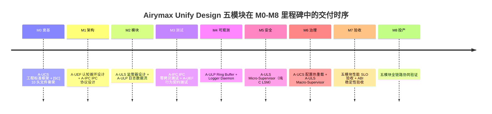

Copyright (c) 2025-2026 SPHARX Ltd. All Rights Reserved.

# 开发路线图（Roadmap）
> **文档定位**：agentrt-linux（AirymaxOS，极境智能体操作系统）开发详细方案的总索引与总纲——版本规划、里程碑、工时估算与验收标准\
> **文档版本**：v1.0\
> **最后更新**：2026-07-17\
> **上级文档**：[AirymaxOS 总览](../README.md)

---

## 1. 模块概述

`130-roadmap/` 是 AirymaxOS 文档体系中**开发时序维度的总纲**，承担四项核心职责：

1. **版本规划**：定义 agentrt-linux 的版本节奏（0.1.1 文档体系完成 → 1.0.1 内核/OS 实际开发），与同源的 agentrt 版本协同时序对齐。
2. **里程碑编排**：将开发方案拆分为 9 个 Part（P0 七部分 + P1 两部分）与 M0-M8 共 9 个里程碑，明确关键路径与依赖关系。
3. **资源估算**：对人力、工时、预算进行分解与缓冲管理（P0 约 2,400h + P1 约 350h ≈ 2,750h）。
4. **验收标准**：为每个 Part / 里程碑定义验收标准与质量门禁，确保"可投产"可判定。

路线图是"什么时候写什么代码"的总纲：`50-engineering-standards/` 定义"代码该怎么写"（语法），`130-roadmap/`（本模块）定义"什么时候写什么代码"（时序）。二者共同回答 agentrt-linux 从"文档体系仓库"演进到"可投产发行版"的完整路径。

---

## 2. 技术选型声明

agentrt-linux v1.0 在内核调度、IPC 传输、安全钩子、内存分配与同源代码共享五个维度做出**不可妥协**的技术选型。本目录所有路线图与里程碑规划必须以本声明为基线——任何里程碑的验收标准均须校验技术选型未被偏离。

| # | 技术维度 | 选定方案 | 明确不采用 | 选定理由 |
|---|---------|---------|-----------|---------|
| 1 | **内核调度** | **sched_tac**：复用 Linux 6.6 原生 `SCHED_DEADLINE` / `SCHED_FIFO` / `EEVDF` 调度类，通过 `nice` / `sched_setattr` / `sched_setaffinity` 注入 Agent 感知策略，**不定义新的调度类宏** | **不使用 sched_ext**（不引入 eBPF 调度器、不依赖 `SCHED_EXT=7`、不使用 SCHED_AGENT 宏） | 保留 Linux 6.6 主线调度器稳定性与可维护性，避免 sched_ext 实验性语义漂移，ABI 稳定 |
| 2 | **IPC 零拷贝** | **IORING_OP_URING_CMD**：通过 io_uring 命令操作码实现内核↔用户态零拷贝传输，固定 buffer + registered ring 路径 | **不使用 page flipping**（不交换物理页、不破坏内存布局稳定性） | IORING_OP_URING_CMD 在 Linux 6.6 已稳定，避免 page flipping 引发的 DMA 映射复杂性与跨架构兼容问题 |
| 3 | **安全钩子** | **纯 C LSM**：以纯 C 实现的 Linux Security Module（`airy_lsm`），通过 `security_hook_list` 注册 | **不使用 BPF LSM**（不依赖 BPF LSM 框架、不通过 eBPF 程序挂载安全钩子） | 纯 C LSM 保证安全策略的可审计性与形式化验证可行性，避免 BPF 验证器在安全关键路径的语义不确定性 |
| 4 | **内存分配** | **alloc_pages + mmap**：通过 `alloc_pages` 分配物理页后 `vm_map_pages` / `remap_pfn_range` 映射到用户态地址空间 | **不使用 DMA 一致性内存**（不调用 `dma_alloc_coherent`、不依赖硬件一致性缓存） | 提供跨架构（x86/ARM/RISC-V）一致的内存语义，避免 DMA 一致性内存在不支持硬件一致性的平台上的兼容性问题 |
| 5 | **同源代码共享** | **IRON-9 v3 四层模型**：[SC] 共享契约层 + [SS] 语义同源层 + [IND] 独立实现层 + [DSL] 降级生存层 | v2 三层模型（升级为 v3，新增 [DSL] 降级生存层） | [DSL] 降级生存层确保 [SC] 损坏时系统仍可降级运行，确保契约层多语言类型安全 |

> 详细技术选型声明见上级文档 [AirymaxOS 总览](../README.md) §2 与 [`10-architecture/10-unify-design.md`](../10-architecture/10-unify-design.md) SSoT 声明。

---

## 3. 文档索引

`130-roadmap/` 由 7 个文档构成（含本 README）：

```
130-roadmap/
├── README.md                      # 本文件 — 路线图主索引与总纲（v1.0）
├── 01-development-strategy.md     # 开发策略与三大支柱详解（v1.0）
├── 02-milestones-and-timeline.md # 里程碑与时间线（含 Mermaid Gantt 图，v1.0）
├── 03-resource-estimation.md     # 资源估算（人力 / 工时 / 预算，v1.0）
├── 04-dependency-graph.md        # 依赖关系图（Part 间 / 模块间，v1.0）
├── 05-risk-mitigation.md         # 风险识别与缓解策略（v1.0）
└── 06-acceptance-criteria.md     # 验收标准与质量门禁（v1.0）
```

### 3.1 各文档定位

| 文档 | 核心问题 | 主要产物 |
|------|---------|---------|
| README.md | 路线图全貌是什么？ | 9 Part 总览表 + 版本规划 + 工时汇总 + 技术选型声明 |
| 01-development-strategy.md | 怎么开发？ | 三大支柱详解 + 9 Part 范围 + 开发原则 |
| 02-milestones-and-timeline.md | 什么时候做完？ | M0-M8 里程碑 + Gantt 图 + 关键路径 |
| 03-resource-estimation.md | 需要多少资源？ | 人力配置 + 工时分解 + 预算 |
| 04-dependency-graph.md | 谁依赖谁？ | Part 依赖图 + 模块依赖矩阵 |
| 05-risk-mitigation.md | 风险在哪？ | 风险登记册 + 缓解策略 + 应急预案 |
| 06-acceptance-criteria.md | 怎么算完成？ | 每个 Part / 里程碑的验收标准 + 质量门禁 |

### 3.2 三大开发支柱

| 支柱 | 范围 | 0.1.1 | 1.0.1 |
|------|------|-------|-------|
| **工程标准与规范** | `50-engineering-standards/`（23 文档） | 文档体系完成 | 实施 |
| **架构与模块设计** | `10-architecture/` + `20-modules/` + `60-driver-model/` + `70-build-system/` | README + 设计草案 | 实施 |
| **开发流程与治理** | `120-development-process/` + `50-engineering-standards/07` | README + 设计草案 | 实施 |

### 3.3 9 Part 开发方案概览

| Part | 名称 | 优先级 | 依赖 | 工时 |
|------|------|--------|------|------|
| Part 1 | 工程标准与规范体系建立 | P0 | 无 | 240h |
| Part 2 | 架构与模块设计完善 | P0 | 无 | 480h |
| Part 3 | 测试与质量体系建立 | P0 | Part 1 + Part 2 | 320h |
| Part 4 | 可观测性与运维体系 | P0 | Part 2 | 380h |
| Part 5 | 安全加固与合规体系 | P0 | Part 2 | 320h |
| Part 6 | 开发流程与治理 | P0 | Part 1 | 240h |
| Part 7 | 路线图与里程碑 | P0 | Part 1-6 | 80h |
| Part 8 | 应用生态与云原生 | P1 | Part 2-5 | 200h |
| Part 9 | 兼容性与性能工程 | P1 | Part 2-5 | 150h |

### 3.4 版本规划

| 版本 | agentrt-linux 范围 | agentrt 范围 | 工时 |
|------|----------------|--------------|------|
| **0.1.1** | 文档体系完成（~79 文档 P0 基线 / ~85 文档工程基线 / ~122 文档全量展开，不含内核/OS 实施） | 全部三大支柱（奠基 + 29 仓拆分 + 生产就绪） | ~150h |
| **1.0.1** | 内核和 OS 实际开发（M0-M8 全部里程碑） | 与 agentrt-linux 协同验证 | ~2,750h |

---

## 4. Airymax Unify Design 映射

Airymax Unify Design 五模块（A-UEF/A-ULP/A-UCS/A-ULS/A-IPC）在路线图中的里程碑分布如下。路线图是五模块落地时序的统一编排，确保五模块按依赖关系分阶段交付。

| Unify 模块 | 全称 | 在路线图中的里程碑分布 | 主要交付 Part |
|-----------|------|---------------------|--------------|
| **A-UEF** | Unified Error and Fault Framework | Part 2 架构设计 → Part 3 测试 → Part 7 里程碑验收 | Part 2（认知循环设计）+ Part 3（行为契约测试） |
| **A-ULP** | Unified Logging and Printk Subsystem | Part 2 日志数据流 → Part 4 可观测性 → Part 7 日志性能验收 | Part 4（Ring Buffer + Logger Daemon） |
| **A-UCS** | Unified Configuration Subsystem | Part 1 工程标准（airy_defconfig） → Part 6 配置治理 | Part 1（SSoT）+ Part 6（配置热重载流程） |
| **A-ULS** | Unified Lifecycle Supervision Framework | Part 2 监管器设计 → Part 5 安全加固 → Part 7 8 态生命周期验收 | Part 5（Micro/Macro-Supervisor） |
| **A-IPC** | Unified Airymax IPC Fabric | Part 2 IPC 数据流 → Part 3 IPC 零拷贝测试 → Part 7 IPC 性能 SLO 验收 | Part 3（IPC fastpath 测试） |

### 4.1 五模块里程碑协同时序



### 4.2 同源 agentrt 协同

agentrt-linux 路线图与 agentrt 路线图遵循 **IRON-9 v3 四层模型**（[SC]/[SS]/[IND]/[DSL]）共享契约：两端通过 [SC] 共享 10 个头文件，[SS] 语义同源（MicroCoreRT / AgentsIPC / Cupolas / MemoryRovol / CoreLoopThree），[IND] 各自独立实现，[DSL] 降级生存块共享。

---

## 5. 相关文档

### 5.1 上级与同层文档
- [AirymaxOS 总览](../README.md) —— 文档体系顶层纲领（v1.0）
- [10-architecture/10-unify-design.md](../10-architecture/10-unify-design.md) —— Airymax Unify Design 总纲（五模块 SSoT）
- [10-architecture/06-iron9-shared-model.md](../10-architecture/06-iron9-shared-model.md) —— IRON-9 v3 四层模型

### 5.2 依赖模块文档
- [50-engineering-standards/README.md](../50-engineering-standards/README.md) —— 工程标准主框架（Part 1）
- [10-architecture/README.md](../10-architecture/README.md) —— 架构设计（Part 2）
- [80-testing/README.md](../80-testing/README.md) —— 测试体系（Part 3）
- [90-observability/README.md](../90-observability/README.md) —— 可观测性（Part 4）
- [110-security/README.md](../110-security/README.md) —— 安全加固（Part 5）
- [120-development-process/README.md](../120-development-process/README.md) —— 开发流程（Part 6）
- [170-performance/README.md](../170-performance/README.md) —— 性能工程（Part 9，SLO 验收依据）

### 5.3 同源 Airymax 文档
- `docs/AirymaxRT/10-architecture/00-architectural-principles.md` —— 五维正交 24 原则
- IRON-9 v3 工程铁律 —— 17 类规则编号体系

---

## 6. 版本历史

| 版本 | 日期 | 变更 |
|------|------|------|
| 0.1.1 | 2026-07-13 | 初始版本，建立 7 文档路线图模块 |
| v1.0 | 2026-07-17 | 升级为 v1.0：新增sched_tac 技术选型声明（不使用 sched_ext）；IORING_OP_URING_CMD（不使用 page flipping）；纯 C LSM（不使用 BPF LSM）；alloc_pages + mmap（不使用 DMA 一致性内存）；IRON-9 v3 四层模型（新增 [DSL] 降级生存层）；新增 Airymax Unify Design 五模块里程碑分布映射 |

---

> **文档结束** | 路线图模块 v1.0 | 共 7 文档 | 维护者：开源极境工程与规范委员会 | 路线图是"什么时候写什么代码"的总纲
