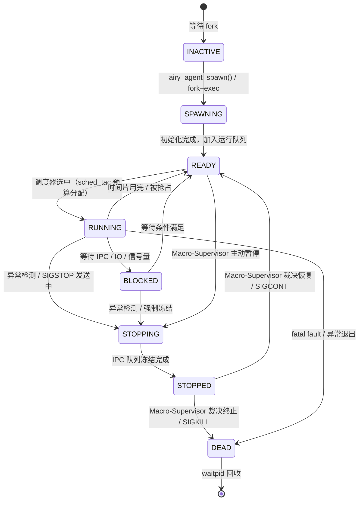

Copyright (c) 2025-2026 SPHARX Ltd. All Rights Reserved.

# Agent 应用生命周期管理
> **文档定位**：agentrt-linux Agent 应用的完整生命周期管理\
> **文档版本**：v1.0.1\
> **最后更新**： 2026-07-21\
> **上级文档**：[agentrt-linux 设计文档](README.md)\
> **同源映射**：agentrt Agent 生命周期 + Linux 6.6 进程模型 + seL4 TCB 生命周期\
> **设计参考**：seL4 `src/object/tcb.c` (线程生命周期) + Linux `kernel/exit.c` (进程退出)

---

## 1. Agent 生命周期模型

### 1.1 生命周期状态机（8 态 SSoT 模型）

Agent 应用在 agentrt-linux 上经历 **8 个明确的生命周期状态**。这一模型是 agentrt-linux 的 SSoT（Single Source of Truth），物理宿主为 [SC] `sched.h`（`enum airy_agent_state`），权威源文档为 [10-sc-sched-extension.md §2.1](../30-interfaces/10-sc-sched-extension.md)。

8 态模型借鉴了 seL4 TCB 线程状态机（ThreadState_Running/Restart/Blocked/Inactive）和 Linux 6.6 进程状态模型（TASK_RUNNING/TASK_INTERRUPTIBLE/TASK_STOPPED/EXIT_ZOMBIE 等），通过 sched_tac 调度参数（SCHED_DEADLINE/SCHED_FIFO/EEVDF）实现与 Linux 调度器的天然映射，无需新增内核调度器状态。

**关键设计决策**：READY 与 RUNNING 分离——READY 态参与 EEVDF 虚拟时间衰减（等待 CPU），RUNNING 态消耗 sched_tac 预算（正在 CPU 执行）。这一分离使 sched_tac 能够精确控制 Agent 的 CPU 时间分配，同时保持与 Linux CFS/EEVDF 调度器的兼容性。


```mermaid
stateDiagram-v2
    [*] --> INACTIVE : 等待 fork
    INACTIVE --> SPAWNING : airy_agent_spawn() / fork+exec
    SPAWNING --> READY : 初始化完成，加入运行队列
    READY --> RUNNING : 调度器选中（sched_tac 预算分配）
    RUNNING --> READY : 时间片用完 / 被抢占
    RUNNING --> BLOCKED : 等待 IPC / IO / 信号量
    BLOCKED --> READY : 等待条件满足
    RUNNING --> STOPPING : 异常检测 / SIGSTOP 发送中
    BLOCKED --> STOPPING : 异常检测 / 强制冻结
    STOPPING --> STOPPED : IPC 队列冻结完成
    STOPPED --> READY : Macro-Supervisor 裁决恢复 / SIGCONT
    STOPPED --> DEAD : Macro-Supervisor 裁决终止 / SIGKILL
    READY --> STOPPING : Macro-Supervisor 主动暂停
    RUNNING --> DEAD : fatal fault / 异常退出
    DEAD --> [*] : waitpid 回收
```

### 1.2 各状态详述（8 态枚举对齐 [SC] sched.h）

| 状态 | 枚举值 | Linux 进程态映射 | 描述 | sched_tac 行为 |
|------|--------|-----------------|------|----------------|
| **INACTIVE** | `AIRY_AGENT_INACTIVE = 0` | 进程不存在 | 等待 fork，Agent 槽位空闲 | 不参与调度 |
| **SPAWNING** | `AIRY_AGENT_SPAWNING = 1` | fork/exec 中 | Agent 正在创建，TCB 初始化、CSpace 分配、capability 注入进行中 | 不参与调度 |
| **READY** | `AIRY_AGENT_READY = 2` | `TASK_RUNNING`（在运行队列） | 初始化完成，在运行队列等待 CPU，EEVDF 虚拟时间衰减中 | vtime 衰减，等待预算分配 |
| **RUNNING** | `AIRY_AGENT_RUNNING = 3` | `TASK_RUNNING`（正在 CPU 执行） | 正在 CPU 上执行，消耗 sched_tac 预算 | 消耗 runtime_ns 预算 |
| **BLOCKED** | `AIRY_AGENT_BLOCKED = 4` | `TASK_INTERRUPTIBLE` | 等待 IPC 消息、IO 完成、信号量 | 预算暂停消耗 |
| **STOPPING** | `AIRY_AGENT_STOPPING = 5` | SIGSTOP 发送中 | 过渡态：正在冻结 IPC 队列，由 Micro-Supervisor 检测异常或 Macro-Supervisor 主动触发 | 快速过渡 |
| **STOPPED** | `AIRY_AGENT_STOPPED = 6` | `TASK_STOPPED` | 已冻结，等待 Macro-Supervisor 裁决（恢复或终止） | 不参与调度 |
| **DEAD** | `AIRY_AGENT_DEAD = 7` | `EXIT_ZOMBIE` | 进程已退出，等待 waitpid 回收 Agent ID 和 capability 资源 | 不参与调度 |

### 1.3 状态迁移驱动方

| 迁移 | 驱动方 | 触发条件 |
|------|--------|---------|
| INACTIVE → SPAWNING | 用户态 | `airy_agent_spawn()` 调用，fork+exec 启动 |
| SPAWNING → READY | 内核 | TCB 初始化完成，capability 注入完成，加入运行队列 |
| READY ↔ RUNNING | Linux 调度器 | CFS/EEVDF 正常调度，sched_tac 预算分配 |
| RUNNING → BLOCKED | 内核 | IPC 等待、IO 等待、信号量等待 |
| BLOCKED → READY | 内核 | 等待条件满足（IPC 消息到达、IO 完成） |
| * → STOPPING | Micro-Supervisor | 检测到异常（心跳超时、capability 伪造等） |
| * → STOPPING | Macro-Supervisor | 主动暂停（资源调整、迁移准备） |
| STOPPING → STOPPED | 内核 | IPC 队列冻结完成 |
| STOPPED → READY | Macro-Supervisor | 裁决恢复，SIGCONT |
| STOPPED → DEAD | Macro-Supervisor | 裁决终止，SIGKILL |
| RUNNING → DEAD | 内核 | fatal fault（`AIRY_FAULT_ABNORMAL_CAP` 等） |

> **注**：sched_tac 核心成果是 8 态与 Linux 进程状态天然映射，无需新增内核调度器状态，仅复用 SCHED_DEADLINE/SCHED_FIFO/EEVDF。状态迁移由 Macro-Supervisor 驱动，Micro-Supervisor 仅在检测到异常时触发 RUNNING → STOPPING 的强制迁移。

---

## 2. Agent 注册与配置

### 2.1 Agent 注册（INACTIVE → SPAWNING）

Agent 通过 `airy_agent_register()` 系统调用向内核注册。注册过程分配 Agent ID、创建 Capability 空间（CSpace）并初始化 TCB（Thread Control Block）。

```c
/**
 * airy_agent_register - 注册一个新的 Agent
 * @config: Agent 注册配置（名称、类型、初始 capability 需求）
 * @agent_id: 输出参数，返回分配的 Agent ID
 *
 * 返回: 0 成功，-EINVAL 参数无效，-ENOMEM 内存不足，-ENOSPC Agent 槽位已满
 *
 * 注册完成后 Agent 进入 SPAWNING 状态（等待初始化完成后转为 READY）。
 * Agent ID 在系统生命周期内唯一，不会复用。
 */
int airy_agent_register(const struct airy_agent_config *config,
                           u32 *agent_id);

struct airy_agent_config {
    char name[AIRY_MAX_AGENT_NAME];      /* Agent 名称（最多 64 字符） */
    u32  type;                               /* Agent 类型（AGENT_TYPE_*) */
    u32  initial_token_budget;               /* 初始 Token 预算 */
    u32  memory_rovol_layers;                /* 启用的记忆层级（位掩码） */
    u64  capability_flags;                   /* 初始 capability 需求 */
};
```

**借鉴 seL4 设计**：Agent ID 类似于 seL4 的 `tcb_t` 指针，不可伪造（用户态只持有 opaque handle）。CSpace 采用类似 seL4 CNode 的树状结构组织 capabilities。

**借鉴 Linux 设计**：Agent 类型（AGENT_TYPE_*）枚举类似于 Linux 的 `task_struct->comm` 和调度类的组合，用于调度器优先级判定。

### 2.2 Agent 配置（SPAWNING → READY）

```c
/**
 * airy_agent_configure - 配置 Agent 运行参数
 * @agent_id: Agent ID
 * @params: 配置参数（Token 预算、记忆策略、认知参数、安全策略）
 *
 * 返回: 0 成功，-EINVAL 参数无效，-EPERM 权限不足（capability 不满足）
 *
 * 配置完成后进入 READY 状态，可以启动。
 * 配置期间进行 capability 检查——若 Agent 不具备所需权限，配置失败。
 */
int airy_agent_configure(u32 agent_id,
                            const struct airy_agent_params *params);

struct airy_agent_params {
    /* Token 预算 */
    u32  token_budget;               /* 每周期 Token 上限 */
    u32  token_refill_rate;          /* Token 补充速率（tokens/ms）*/

    /* 记忆策略 */
    u8   memory_l1_ttl_ms;           /* L1 原始记忆 TTL（毫秒） */
    u8   memory_l2_promotion_threshold; /* L1→L2 晋升阈值（命中次数）*/
    u8   memory_l3_consolidation_interval; /* L3 巩固间隔（秒）*/

    /* 认知参数 */
    u32  cognition_cycle_ms;         /* 认知循环周期（毫秒） */
    u8   thinkdual_system1_timeout_ms; /* System 1 快思考超时 */
    u8   thinkdual_system2_timeout_ms; /* System 2 慢思考超时 */

    /* 安全策略 */
    u64  sandbox_policy_flags;       /* 沙箱策略（Landlock + seccomp）*/
    u32  max_ipc_channels;           /* 最大 IPC 通道数 */
};
```

**设计决策**：配置参数与启动参数分离。配置阶段是可逆的（可重新配置），启动阶段只消费已生效的配置。这如同 Linux 进程的 `execve` 和 `prctl` 的区别——exec 前可自由调整，exec 后部分参数锁定。

---

## 3. Agent 启动与运行

### 3.1 启动（READY → RUNNING）

```c
/**
 * airy_agent_start - 启动 Agent 执行
 * @agent_id: Agent ID
 *
 * 返回: 0 成功，-EINVAL 状态不正确（必须为 READY/STOPPED），
 *       -EPERM 沙箱策略违反，-ENOMEM 资源不足
 *
 * 启动过程：
 * 1. 验证 capability——检查 Agent 是否具备所需权限
 * 2. 分配 cgroup v2 资源组——CPU/内存/IO 隔离
 * 3. 设置 Landlock 沙箱——文件访问控制
 * 4. 设置 seccomp 过滤器——系统调用白名单
 * 5. 分配 Wasm 运行时——创建 Wasm 3.0 沙箱实例
 * 6. 注册到 MicroCoreRT 调度器——sched_tac 调度策略排队
 * 7. 状态切换到 RUNNING
 */
int airy_agent_start(u32 agent_id);
```

**借鉴 seL4 设计**：启动过程的"Point of No Return"模式——从步骤 5（Wasm 运行时分配）开始进入不可返回阶段，步骤 5-7 的任何失败都会导致 Agent 直接进入 STOPPING 状态（随后 STOPPED/DEAD）而非回滚。这避免了启动过程中的部分资源残留问题。

**借鉴 Linux 设计**：cgroup v2 + Landlock + seccomp 三重隔离类似于 Linux 容器的安全模型，但粒度更细——每个 Agent 租户拥有独立的 cgroup 层级。

### 3.2 运行时调度

Agent 在 RUNNING 状态下由 MicroCoreRT 调度器管理。调度器采用类似 Linux sched_class 的虚表架构：

```c
/* MicroCoreRT 调度类 - 借鉴 Linux sched_class 模式 */
struct airy_sched_class {
    const char *name;
    void (*enqueue_agent)(struct airy_rq *rq, struct airy_agent *a, int flags);
    bool (*dequeue_agent)(struct airy_rq *rq, struct airy_agent *a, int flags);
    struct airy_agent *(*pick_next_agent)(struct airy_rq *rq);
    void (*put_prev_agent)(struct airy_rq *rq, struct airy_agent *a);
    bool (*wakeup_preempt)(struct airy_rq *rq, struct airy_agent *a);
    void (*update_curr)(struct airy_rq *rq);
    void (*yield)(struct airy_rq *rq);
    int  (*balance)(struct airy_rq *rq, struct airy_agent *prev);
    void (*task_tick)(struct airy_rq *rq, struct airy_agent *curr);
};

/* 注册方式 - 借鉴 DEFINE_SCHED_CLASS + linker section 模式 */
#define DEFINE_AGENT_SCHED_CLASS(name_) \
    const struct airy_sched_class name_##_agent_sched_class \
        __aligned(__alignof__(struct airy_sched_class)) \
        __section("__" #name_ "_agent_sched_class")
```

**设计决策**：直接借鉴 Linux `sched_class` 的虚表 + linker section 注册模式（见 主流 Linux 发行版 Linux 6.6 内核基线 `kernel/sched/sched.h: L2573-L2693`）。优先级顺序：`token_aware > realtime > fair > batch > idle`，通过 linker script 的内存增长方向实现天然排序。

### 3.3 Token 预算管理

```c
struct airy_token_budget {
    u32  current_tokens;      /* 当前可用 Token */
    u32  max_tokens;          /* 预算上限 */
    u32  refill_rate;         /* 补充速率（tokens/ms） */
    u64  last_refill_ts;      /* 上次补充时间戳（ns） */
    u32  warning_threshold;   /* 警告阈值（低于此值触发 BLOCKED 挂起） */
    u32  critical_threshold;  /* 临界阈值（低于此值触发 STOPPING 终止流程） */

    /* 统计数据 */
    u64  total_consumed;      /* 累计消耗 */
    u64  peak_rate;           /* 峰值消耗速率 */
    u32  suspend_count;       /* 因预算不足挂起次数 */
};
```

Token 预算采用类似 Linux CFS 的带宽控制模型：
- `refill_rate` 如同 `cpu.cfs_period_us`，定义补充周期
- `max_tokens` 如同 `cpu.cfs_quota_us`，定义周期内上限
- 令牌桶算法防止突发消耗导致其他 Agent 饥饿

---

## 4. Agent 暂停与迁移

### 4.1 暂停流程

```c
/**
 * airy_agent_pause - 请求 Agent 暂停（保存状态）
 * @agent_id: Agent ID
 * @flags: 暂停选项
 *   AIRY_PAUSE_SAVE_MEMORY  - 保存 MemoryRovol 快照
 *   AIRY_PAUSE_SAVE_WASM    - 保存 Wasm 状态快照
 *   AIRY_PAUSE_MIGRATE      - 准备迁移到其他节点
 *
 * 返回: 0 成功（进入 STOPPING 过渡态，冻结完成后 STOPPED），-EINVAL 状态不正确，
 *       -EBUSY Agent 正忙（认知循环中），-ETIME 超时
 *
 * 暂停过程（借鉴 seL4 Zombie 增量模式）：
 * 暂停语义对应 8 态中的 STOPPING（过渡态）→ STOPPED（已冻结）：
 * Agent 在认知循环的完成点进行状态保存。
 * 借鉴 seL4 preemptionPoint 模式，长时间保存操作分块可抢占：
 */
int airy_agent_pause(u32 agent_id, u32 flags);

/* 引用 seL4 的抢占点设计模式 */
struct airy_memory_rovol_snapshot {
    void *l1_raw;          /* L1 原始记忆快照 */
    void *l2_features;     /* L2 特征记忆快照 */
    void *l3_structured;   /* L3 结构化记忆快照 */
    void *l4_pattern;      /* L4 模式记忆快照 */
    u32   l1_size;         /* L1 快照大小（字节） */
    u32   l2_size;
    u32   l3_size;
    u32   l4_size;
    u64   timestamp;       /* 快照时间戳 */
    u64   checkpoint_id;   /* 检查点 ID（用于恢复验证） */
};
```

**设计决策**：暂停中间态借鉴 seL4 的 Zombie 对象模式，语义映射到 8 态中的 STOPPING（过渡）→ STOPPED（冻结）。如同 seL4 能力删除分解为"标记 Zombie → 分块回收 → 最终清理"，Agent 暂停分解为"标记 STOPPING → 分层保存记忆 → 检查点验证 → 标记 STOPPED"。每个分层保存操作后插入 preemption point，允许调度器和中断响应。

### 4.2 跨节点迁移

```c
/**
 * airy_agent_migrate - 将 Agent 迁移到目标节点
 * @agent_id: Agent ID
 * @target_node: 目标节点 ID
 * @migration_policy: 迁移策略（冷迁移/热迁移/增量迁移）
 *
 * 热迁移流程（借鉴 Linux CRIU + seL4 capability 转移）：
 * 1. Agent 进入 STOPPING 过渡态（冻结，8 态 SSoT）
 * 2. 保存 MemoryRovol 快照 + Wasm 状态
 * 3. 通过 CXL 内存池化传输快照到目标节点
 * 4. 在目标节点重建 CSpace（capability 重新派生）
 * 5. 在源节点启动增量同步（dirty page tracking）
 * 6. 最终同步 + 切换
 * 7. 源节点 Agent 进入 DEAD（终止完成，等待回收）
 * 8. 目标节点 Agent 恢复 RUNNING
 */
int airy_agent_migrate(u32 agent_id, u32 target_node,
                          const struct airy_migration_policy *policy);
```

---

## 5. Agent 终止与资源回收

### 5.1 终止流程

```c
/**
 * airy_agent_stop - 请求 Agent 终止
 * @agent_id: Agent ID
 * @exit_code: 退出码（用户定义 + 系统定义）
 *
 * 借鉴 seL4 fault handler 分级错误码设计（seL4 src/api/faults.h：seL4_FaultType）：
 *   高 16 位：退出类别
 *     0x0000: AGENT_EXIT_NORMAL     - 正常退出
 *     0x0001: AGENT_EXIT_TOKEN_EXHAUSTED - Token 预算耗尽
 *     0x0002: AGENT_EXIT_SECURITY_VIOLATION - 安全策略违反
 *     0x0003: AGENT_EXIT_RUNTIME_ERROR - Wasm 运行时错误
 *     0x0004: AGENT_EXIT_SANDBOX_ESCAPE - 沙箱逃逸（严重）
 *     0x0005: AGENT_EXIT_MEMORY_CORRUPTION - 记忆损坏
 *   低 16 位：子类别（Agent 自定义）
 */
int airy_agent_stop(u32 agent_id, u32 exit_code);
```

### 5.2 Capability 撤销（借鉴 seL4 cteRevoke）

终止时执行能力撤销——类似 seL4 `cteRevoke()` 的递归级联撤销：

```c
/*
 * 借鉴 seL4 cnode.c:528-550 的 cteRevoke 算法
 *
 * airy_cap_derive - 递归撤销所有派生 capability（AIRY_CAP_OP_REVOKE）
 * @agent_id: Agent ID
 *
 * 递归撤销算法（借鉴 MDB 链表遍历 + preemptionPoint）：
 * while (还有派生 capability) {
 *     cap = 获取下一个派生 capability;
 *     if (cap 是 Endpoint 类型) {
 *         取消 badge 上所有待发消息;
 *     }
 *     cap_delete(cap);          // 标记 Zombie 或直接删除
 *     preemption_point();        // 允许调度器干预
 *     if (错误 != SUCCESS) {
 *         return 错误;
 *     }
 * }
 */
int airy_cap_derive(uint32_t src_agent, uint32_t dst_agent,
                    enum airy_cap_op op, uint16_t new_perms);
```

### 5.3 资源清理清单

| 资源类型 | 清理操作 | 借鉴来源 |
|---------|---------|---------|
| Capability 令牌 | 递归撤销（类似 seL4 cteRevoke） | seL4 cnode.c |
| MemoryRovol 记忆 | L1→L4 层分层清理（类似 Untyped retype） | seL4 untyped.c |
| Wasm 运行时 | 沙箱实例销毁 | Wasm 3.0 spec |
| cgroup v2 | 资源组删除（递归删除子 cgroup） | Linux cgroup.c |
| Landlock 规则 | 释放文件访问规则 | Linux landlock |
| seccomp 过滤器 | 释放 BPF 程序 | Linux seccomp.c |
| AgentsIPC 通道 | 取消待发消息 + 关闭通道 | seL4 endpoint.c |
| TCB 槽位 | 释放 Thread Control Block | seL4 tcb.c |
| Agent ID | 标记为已释放（不复用） | - |

---

## 6. 生命周期 Hook 机制

### 6.1 Hook 定义（借鉴 Linux LSM X-Macro 模式）

```c
/*
 * 借鉴 主流 Linux 发行版 Linux 6.6 内核基线 security/lsm_hook_defs.h 的 X-Macro 模式
 *
 * AGENT_HOOK 宏定义所有生命周期钩子点。
 * 每次#include将展开为不同的视图：
 *   - 函数指针成员 (agent_hook_list)
 *   - 调用包装器 (call_agent_hook)
 *   - 钩子注册管理 (agent_hook_heads)
 */
#define AGENT_HOOK(RET, NAME, ...) RET (*NAME)(__VA_ARGS__)

/* 钩子定义表 */
#define ALL_AGENT_HOOKS              \
    AGENT_HOOK(int, agent_register,  \
        const struct airy_agent_config *config) \
    AGENT_HOOK(int, agent_configure, \
        u32 agent_id, const struct airy_agent_params *params) \
    AGENT_HOOK(int, agent_start,     \
        u32 agent_id)                \
    AGENT_HOOK(int, agent_pause,     \
        u32 agent_id, u32 flags)     \
    AGENT_HOOK(int, agent_resume,    \
        u32 agent_id)                \
    AGENT_HOOK(int, agent_stop,      \
        u32 agent_id, u32 exit_code) \
    AGENT_HOOK(int, agent_migrate,   \
        u32 agent_id, u32 target_node)
```

**设计决策**：借鉴 LSM 的 X-Macro 模式（见 `lsm_hook_defs.h`），一个宏定义文件展开为多种视图。这避免了在多个位置重复维护钩子点列表，同时支持编译时条件编译（`#ifdef CONFIG_AIRY_LSM`）。

### 6.2 钩子调用模式（短路评估）

```c
/* 借鉴 LSM call_int_hook 的短路评估模式 */
#define call_agent_hook(FUNC, IRC, ...) ({      \
    int RC = IRC;                                \
    do {                                         \
        struct agent_hook_entry *P;              \
        list_for_each_entry(P, &agent_hook_heads.FUNC, list) { \
            RC = P->hook.FUNC(__VA_ARGS__);      \
            if (RC != 0) break;                  \
        }                                        \
    } while (0);                                  \
    RC;                                           \
})
```

**关键设计**：与 LSM 一致的短路评估——任意钩子返回非零即中断链。这确保安全模块可以拒绝操作（如 security 模块可以拦截 agent_start）。

---

## 7. 错误处理与恢复

### 7.1 分级错误响应

借鉴 Linux 内核 watchdog 与 seL4 fault handler 的分级错误响应设计，sched_tac 用户态调度器采用等效的 watchdog 机制（不使用 sched_ext）：

| 错误级别 | 处理方式 | 触发条件 |
|---------|---------|---------|
| **RECOVERABLE** | 重试（最多 3 次） | 内存临时不足、IPC 超时 |
| **DEGRADABLE** | 降级（降低 Token 预算） | Token 消耗超限 |
| **SUSPENDABLE** | 暂停（保存状态，进入 BLOCKED/STOPPED） | Wasm 运行时 OOM |
| **TERMINATABLE** | 终止（回收资源，进入 STOPPING/DEAD） | 安全策略违反、沙箱逃逸 |
| **PANIC** | 系统告警（隔离该 Agent） | 连续 3 次沙箱逃逸 |

### 7.2 Agent 诊断信息收集（借鉴 scx_exit_info）

```c
struct airy_exit_info {
    u32  exit_kind;        /* AGENT_EXIT_* */
    s64  exit_code;        /* 退出码 */
    char reason[256];      /* 人类可读原因 */
    u64  backtrace[64];    /* 调用栈（64 帧） */
    u32  bt_len;           /* 调用栈深度 */
    char wasm_stack[4096]; /* Wasm 栈快照 */
    struct airy_token_budget budget_snapshot; /* Token 预算快照 */
    struct airy_memory_rovol_snapshot mem_snapshot; /* 记忆快照 */
};
```

---

## 8. 代码品味要求

### 8.1 命名规范

| 规范项 | 规则 | 示例 |
|--------|------|------|
| 函数前缀 | `airy_agent_*` 用于 Agent 生命周期 API | `airy_agent_register()` |
| 枚举前缀 | `AIRY_AGENT_*` 用于状态枚举（对齐 [SC] `sched.h`） | `AIRY_AGENT_RUNNING` |
| 宏前缀 | `AIRY_EXIT_*` 用于退出码 | `AIRY_EXIT_NORMAL` |
| 结构体命名 | `airy_*_t` 或 `struct airy_*` | `struct airy_token_budget` |

### 8.2 注释要求

- 每个公共 API 函数必须有 Doxygen 注释（参数说明、返回值、错误码、使用示例）
- 每个状态转换必须有 inline 注释解释转换条件和副作用
- 借鉴 seL4 GHOSTUPD 注释模式标注关键不变量

### 8.3 静态断言（借鉴 seL4 compile_assert）

```c
/* 借鉴 seL4 include/object/structures.h */
compile_assert(agent_state_size, sizeof(struct airy_agent_state) == 64);
compile_assert(token_budget_alignment, IS_ALIGNED(sizeof(struct airy_token_budget), 16));
compile_assert(agent_id_max, AIRY_CAP_MAX_AGENTS <= 1024);
```

---

## 9. 相关文档

- [Agent SDK 四语言集成](02-sdk-integration.md)
- [Agent 编排设计](03-agent-orchestration.md)
- [Token 预算契约](04-token-budget.md)
- [MemoryRovol API](05-memory-rovol-api.md)
- [Agent 部署与运行](06-agent-deployment.md)
- [系统调用编号注册表](07-syscall-registry.md) — 应用层 API 到系统调用编号映射（第 5 章）
- `30-interfaces/01-syscalls.md`（系统调用接口设计）
- `30-interfaces/02-ipc-protocol.md`（AgentsIPC 协议）
- `50-engineering-standards/20-contracts/contracts.md`（系统调用 API 契约）
- `20-modules/03-security.md`（Capability 安全模型）
- `20-modules/05-cognition.md`（CoreLoopThree 认知循环）

---
> **文档结束** | 0.1.1 生命周期设计
