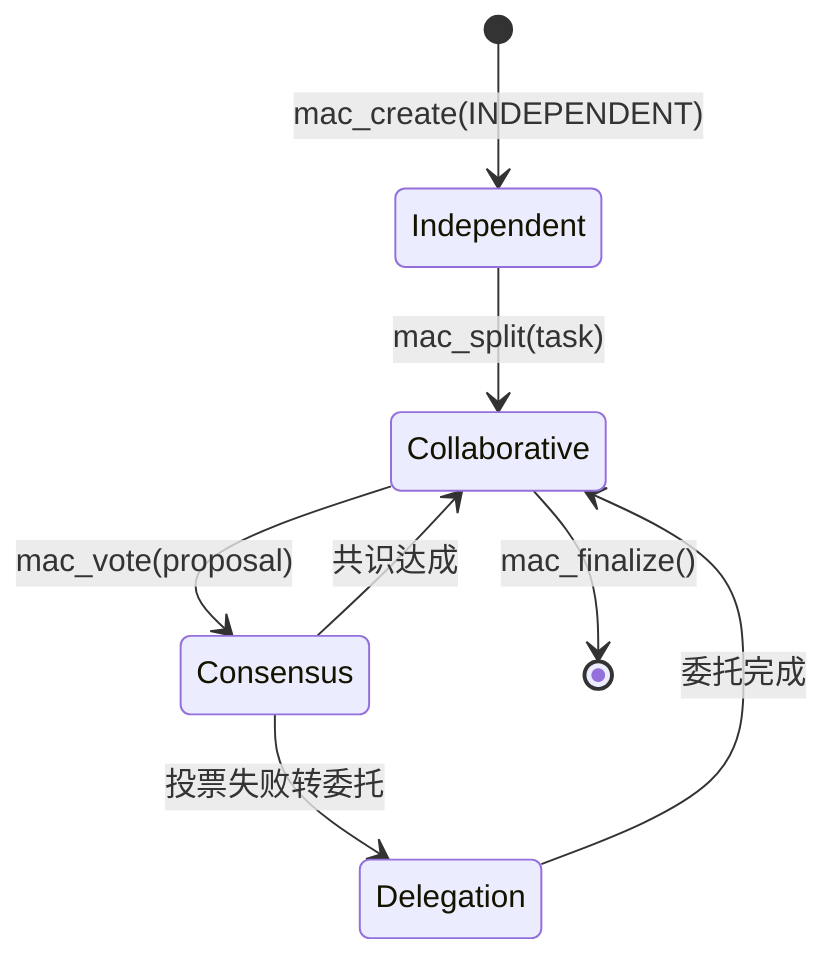
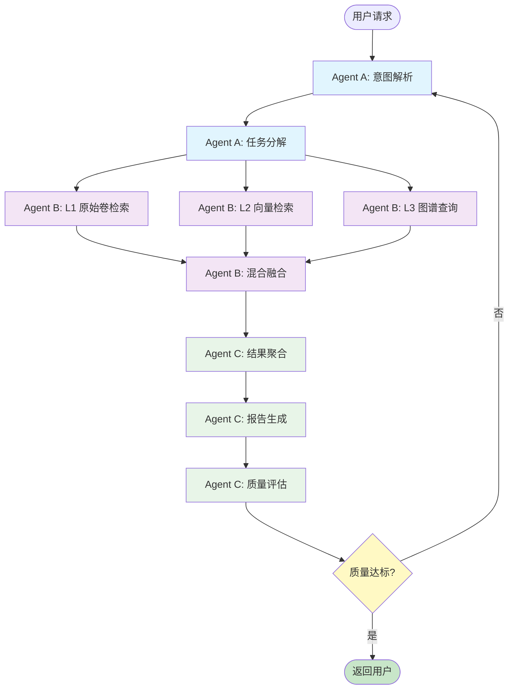

Copyright (c) 2025-2026 SPHARX Ltd. All Rights Reserved.

# Agent 编排设计

> **文档定位**：agentrt-linux（AirymaxOS，极境智能体操作系统）Agent 应用开发体系核心子文档，定义多 Agent 协作模型、DAG 工作流编排与 TaskFlow 引擎在 OS 层的应用\
> **版本**：0.1.1（文档体系完成）/ 1.0.1（开发）\
> **最后更新**：2026-07-09\
> **理论根基**：Linux 6.6 内核基线工程思想 + seL4 微内核设计思想 + Airymax 体系并行论\
> **SPDX-License-Identifier**：AGPL-3.0-or-later OR Apache-2.0\
> **同源映射**：agentrt 用户态运行时 MAC 框架 + TaskFlow 引擎（IRON-9 v2 [SS] 语义同源层）\
> **IRON-9 v2 层次**：[SS] 语义同源层（协作模式高层 API 语义同源（概念操作一致），签名因抽象层级不同而独立演进——agentrt-linux 基于内核 kthread + SCHED_AGENT，agentrt 基于用户态线程）

---

## 1. 设计目标与协作模型

### 1.1 设计目标

agentrt-linux（AirymaxOS）将多 Agent 编排视为操作系统级一等公民能力。Agent 编排设计达成以下工程目标：

1. **OS 级编排**：编排引擎运行于内核态（kthread），获得 SCHED_AGENT 调度优先级与确定性延迟
2. **DAG 工作流**：支持有向无环图（DAG）表达复杂任务依赖，超步（superstep）执行
3. **四种协作模式**：独立/协作/共识/委托，覆盖单 Agent 到多 Agent 协作全场景
4. **容错恢复**：基于检查点的超步容错，单 Agent 失败可回滚至最近检查点
5. **MAC 框架集成**：与多智能体协作框架（MAC）同源，支持四种共识策略

### 1.2 编排能力分层

| 层级 | 类型 | 机制 | 范围 |
|------|------|------|------|
| L1 | 单 Agent 任务 | 单进程执行 | 顺序认知循环 |
| L2 | DAG 工作流 | TaskFlow 超步 | 任务依赖编排 |
| L3 | 多 Agent 协作 | MAC 框架 | 跨 Agent 协同 |
| **L4** | **OS 级编排** | **内核 kthread + SCHED_AGENT** | **agentrt-linux 专属** |

### 1.3 与 agentrt 同源关系

agentrt 用户态运行时的 MAC 框架与 TaskFlow 引擎与本设计遵循 IRON-9 v2 [SS] 语义同源层：

| 维度 | agentrt（微核心） | agentrt-linux（微内核） |
|------|-------------------|------------------------|
| 编排引擎 | 用户态线程池 | 内核 kthread + SCHED_AGENT |
| 协作模式 API | `mac_*` | `mac_*`（同源签名） |
| DAG 引擎 | 用户态 TaskFlow | OS 级 TaskFlow（内核态） |
| 通信 | 用户态消息队列 | AgentsIPC（io_uring） |
| 检查点 | HeapStore 持久化 | MemoryRovol 持久化 |

---

## 2. MAC 四种协作模式

### 2.1 协作模式定义

```c
/* include/uapi/agentrt/mac.h（IRON-9 v2 [SC] 共享契约层） */
enum agentrt_mac_mode {
	AGENTRT_MAC_MODE_INDEPENDENT = 0,  /* 独立：各 Agent 独立执行 */
	AGENTRT_MAC_MODE_COLLABORATIVE = 1, /* 协作：分工合作 */
	AGENTRT_MAC_MODE_CONSENSUS = 2,    /* 共识：投票决策 */
	AGENTRT_MAC_MODE_DELEGATION = 3,   /* 委托：主从委托 */
};

enum agentrt_mac_consensus {
	AGENTRT_MAC_CONSENSUS_MAJORITY = 0,  /* 多数投票 */
	AGENTRT_MAC_CONSENSUS_UNANIMOUS = 1, /* 全票通过 */
	AGENTRT_MAC_CONSENSUS_WEIGHTED = 2,  /* 加权投票 */
	AGENTRT_MAC_CONSENSUS_LEADER_VETO = 3, /* 领导者否决 */
};
```

### 2.2 四种模式对比

| 模式 | Agent 数 | 通信开销 | 适用场景 | 共识需求 |
|------|----------|----------|----------|----------|
| 独立 | 1 | 无 | 单一任务 | 无 |
| 协作 | N | 中 | 任务分解 | 无（各司其职） |
| 共识 | N | 高 | 决策投票 | 需要（4 种策略） |
| 委托 | 主+从 | 低 | 任务委派 | 主决策 |

### 2.3 协作模式状态机



---

## 3. DAG 工作流编排

### 3.1 DAG 数据结构

TaskFlow 引擎基于 Pregel BSP 模型，将任务表达为 DAG：

```c
/* include/uapi/agentrt/taskflow.h（[SC] 共享契约层） */
struct agentrt_task_node {
	uint32_t node_id;            /* 节点 ID */
	uint32_t agent_id;          /* 执行 Agent */
	char method[64];            /* 调用方法名 */
	uint8_t *input_payload;     /* 输入 payload */
	size_t input_len;
	uint32_t dependencies[16];  /* 依赖节点 ID 列表 */
	uint32_t dep_count;
	enum agentrt_task_status status;
	uint64_t trace_id;
};

enum agentrt_task_status {
	AGENTRT_TASK_PENDING   = 0,
	AGENTRT_TASK_READY     = 1,  /* 依赖全部完成 */
	AGENTRT_TASK_RUNNING   = 2,
	AGENTRT_TASK_COMPLETED = 3,
	AGENTRT_TASK_FAILED    = 4,
	AGENTRT_TASK_ROLLBACK  = 5,
};

struct agentrt_dag_workflow {
	uint32_t workflow_id;
	char name[64];
	struct agentrt_task_node nodes[256];
	uint32_t node_count;
	uint32_t superstep;       /* 当前超步 */
	uint32_t checkpoint_step; /* 最近检查点超步 */
};
```

### 3.2 超步执行模型

DAG 按超步（superstep）执行，每个超步内并行执行就绪节点：

```
超步 0: [Node A] 并行执行
            |
超步 1: [Node B, Node C] 并行（A 完成后 B、C 依赖满足）
            |
超步 2: [Node D]（B、C 完成后 D 依赖满足）
            |
超步 3: [Node E]（最终聚合）
```

每个超步结束写入检查点（MemoryRovol 持久化），失败时回滚至最近检查点。

### 3.3 DAG 调度算法

```c
/**
 * agentrt_dag_schedule - 调度 DAG 工作流的下一超步
 * @wf: 工作流
 *
 * 算法：
 *   1. 扫描所有 PENDING 节点
 *   2. 检查依赖是否全部 COMPLETED
 *   3. 就绪节点置为 READY
 *   4. 并行提交至 SCHED_AGENT
 *
 * 返回：本超步就绪节点数
 */
int agentrt_dag_schedule(struct agentrt_dag_workflow *wf)
{
	int ready_count = 0;
	int i, j;

	for (i = 0; i < wf->node_count; i++) {
		struct agentrt_task_node *node = &wf->nodes[i];
		bool deps_met = true;

		if (node->status != AGENTRT_TASK_PENDING)
			continue;

		/* 检查所有依赖 */
		for (j = 0; j < node->dep_count; j++) {
			uint32_t dep_id = node->dependencies[j];
			struct agentrt_task_node *dep =
				agentrt_dag_find_node(wf, dep_id);
			if (!dep || dep->status != AGENTRT_TASK_COMPLETED) {
				deps_met = false;
				break;
			}
		}

		if (!deps_met)
			continue;

		/* 依赖满足，置为 READY 并提交调度 */
		node->status = AGENTRT_TASK_READY;
		agentrt_sched_agent_submit_dag_node(node);
		ready_count++;
	}

	/* 若本超步无就绪节点且仍有 PENDING，说明存在环路或死锁 */
	if (ready_count == 0 && agentrt_dag_has_pending(wf))
		return -AGENTRT_EDAG_DEADLOCK;

	return ready_count;
}
```

---

## 4. 三 Agent 协作工作流示例

### 4.1 场景描述

场景：用户提交一个复杂研究任务，需要三个 Agent 协作完成：
- **Agent A（认知 Agent）**：意图解析与任务分解
- **Agent B（检索 Agent）**：记忆卷载检索与向量搜索
- **Agent C（综合 Agent）**：结果综合与报告生成

### 4.2 工作流 Mermaid 图



### 4.3 工作流 DAG 定义

```c
/* 示例：构造三 Agent 协作 DAG */
struct agentrt_dag_workflow research_wf = {
	.name = "research_workflow",
	.superstep = 0,
};

/* 节点定义 */
static struct agentrt_task_node nodes[] = {
	/* Agent A：认知阶段 */
	{.node_id = 1, .agent_id = 100, .method = "cognition.parse_intent",
	 .dep_count = 0, .status = AGENTRT_TASK_PENDING},
	{.node_id = 2, .agent_id = 100, .method = "cognition.decompose",
	 .dependencies = {1}, .dep_count = 1, .status = AGENTRT_TASK_PENDING},

	/* Agent B：检索阶段（并行三路） */
	{.node_id = 3, .agent_id = 200, .method = "memory.rovol_l1_search",
	 .dependencies = {2}, .dep_count = 1, .status = AGENTRT_TASK_PENDING},
	{.node_id = 4, .agent_id = 200, .method = "memory.rovol_l2_vector",
	 .dependencies = {2}, .dep_count = 1, .status = AGENTRT_TASK_PENDING},
	{.node_id = 5, .agent_id = 200, .method = "memory.rovol_l3_graph",
	 .dependencies = {2}, .dep_count = 1, .status = AGENTRT_TASK_PENDING},
	{.node_id = 6, .agent_id = 200, .method = "memory.hybrid_fuse",
	 .dependencies = {3, 4, 5}, .dep_count = 3, .status = AGENTRT_TASK_PENDING},

	/* Agent C：综合阶段 */
	{.node_id = 7, .agent_id = 300, .method = "synthesis.aggregate",
	 .dependencies = {6}, .dep_count = 1, .status = AGENTRT_TASK_PENDING},
	{.node_id = 8, .agent_id = 300, .method = "synthesis.report",
	 .dependencies = {7}, .dep_count = 1, .status = AGENTRT_TASK_PENDING},
	{.node_id = 9, .agent_id = 300, .method = "synthesis.evaluate",
	 .dependencies = {8}, .dep_count = 1, .status = AGENTRT_TASK_PENDING},
};
```

### 4.4 超步执行时序

```
超步 0: 节点 1（Agent A: 意图解析）
          |
          v (检查点：MemoryRovol 持久化)
超步 1: 节点 2（Agent A: 任务分解）
          |
          v (检查点)
超步 2: 节点 3、4、5 并行（Agent B: 三路检索）
          |    |    |
          v    v    v (三个并行任务均完成)
超步 3: 节点 6（Agent B: 混合融合）
          |
          v (检查点)
超步 4: 节点 7（Agent C: 结果聚合）
超步 5: 节点 8（Agent C: 报告生成）
超步 6: 节点 9（Agent C: 质量评估）
          |
          v
        若质量不达标，回滚至超步 0 重试
```

---

## 5. TaskFlow 引擎 OS 层应用

### 5.1 内核态 TaskFlow 引擎

agentrt-linux 将 TaskFlow 引擎实现为内核 kthread，获得 OS 级调度优先级：

```c
/* airymaxos-cognition/taskflow.c（内核态） */

static struct task_struct *taskflow_kthread;

/**
 * agentrt_taskflow_kthread - TaskFlow 引擎内核线程
 *
 * 作为 SCHED_AGENT 策略的常驻 kthread
 * 周期性扫描工作流队列，调度就绪超步
 * 通过 kfifo + wait_event_interruptible 与其他 kthread 通信
 */
static int agentrt_taskflow_kthread(void *data)
{
	struct agentrt_dag_workflow *wf;

	while (!kthread_should_stop()) {
		/* 等待工作流到达 */
		if (kfifo_is_empty(&taskflow_queue)) {
			wait_event_interruptible(taskflow_wq,
				!kfifo_is_empty(&taskflow_queue) ||
				kthread_should_stop());
			continue;
		}

		/* 取出待调度工作流 */
		if (!kfifo_out_spinlocked(&taskflow_queue, &wf, 1,
					   &taskflow_lock))
			continue;

		/* 调度下一超步 */
		int ready = agentrt_dag_schedule(wf);
		if (ready < 0) {
			pr_err("taskflow: deadlock in workflow %s\n",
			       wf->name);
			continue;
		}

		/* 若仍有未完成节点，重新入队等待下一轮 */
		if (agentrt_dag_has_pending(wf))
			kfifo_in_spinlocked(&taskflow_queue, &wf, 1,
					    &taskflow_lock);
	}

	return 0;
}

void __init agentrt_taskflow_init(void)
{
	INIT_KFIFO(taskflow_queue);
	init_waitqueue_head(&taskflow_wq);
	taskflow_kthread = kthread_run(agentrt_taskflow_kthread, NULL,
				       "agentrt_taskflow");
}
```

### 5.2 检查点与容错

每个超步结束写入检查点至 MemoryRovol，失败时回滚：

```c
/**
 * agentrt_taskflow_checkpoint - 写入超步检查点
 * @wf: 工作流
 *
 * 将当前工作流状态序列化至 MemoryRovol L1 原始卷
 * 检查点格式：workflow_id + superstep + node_statuses
 */
int agentrt_taskflow_checkpoint(struct agentrt_dag_workflow *wf)
{
	struct agentrt_checkpoint_record rec = {
		.workflow_id = wf->workflow_id,
		.superstep = wf->superstep,
		.timestamp = ktime_get_real_ns(),
	};
	int i, ret;

	for (i = 0; i < wf->node_count; i++)
		rec.node_statuses[i] = wf->nodes[i].status;

	/* 写入 MemoryRovol L1（append-only，SHA-256 哈希） */
	ret = agentrt_memoryrov_l1_append(wf->workflow_id,
					  &rec, sizeof(rec));
	if (ret)
		pr_err("taskflow: checkpoint failed for wf %u: %d\n",
		       wf->workflow_id, ret);
	else
		wf->checkpoint_step = wf->superstep;

	return ret;
}

/**
 * agentrt_taskflow_rollback - 回滚至最近检查点
 * @wf: 工作流
 */
int agentrt_taskflow_rollback(struct agentrt_dag_workflow *wf)
{
	struct agentrt_checkpoint_record rec;
	int ret, i;

	ret = agentrt_memoryrov_l1_read_last(wf->workflow_id,
					      &rec, sizeof(rec));
	if (ret)
		return ret;

	pr_info("taskflow: rolling back wf %u to superstep %u\n",
		wf->workflow_id, rec.superstep);

	wf->superstep = rec.superstep;
	for (i = 0; i < wf->node_count; i++) {
		/* 检查点之后的节点状态重置为 PENDING */
		if (wf->nodes[i].status != rec.node_statuses[i])
			wf->nodes[i].status = AGENTRT_TASK_PENDING;
	}

	return 0;
}
```

---

## 6. 共识机制实现

### 6.1 共识投票流程

当协作模式为 CONSENSUS 时，多 Agent 通过投票达成共识：

```c
struct agentrt_consensus_session {
	uint32_t session_id;
	enum agentrt_mac_consensus strategy;
	uint32_t *participants;   /* 参与 Agent ID 列表 */
	uint32_t participant_count;
	struct agentrt_vote_record *votes;
	uint32_t vote_count;
	uint64_t deadline_ns;    /* 投票截止时间 */
};

/**
 * agentrt_consensus_reach - 达成共识
 * @session: 共识会话
 *
 * 根据策略统计投票，返回共识结果
 */
int agentrt_consensus_reach(struct agentrt_consensus_session *session)
{
	int yes = 0, no = 0, total = session->participant_count;
	int i;

	for (i = 0; i < session->vote_count; i++) {
		if (session->votes[i].approve)
			yes++;
		else
			no++;
	}

	switch (session->strategy) {
	case AGENTRT_MAC_CONSENSUS_MAJORITY:
		return yes > total / 2 ? 0 : -AGENTRT_ENOCONSENSUS;
	case AGENTRT_MAC_CONSENSUS_UNANIMOUS:
		return no == 0 ? 0 : -AGENTRT_ENOCONSENSUS;
	case AGENTRT_MAC_CONSENSUS_WEIGHTED:
		return agentrt_weighted_vote(session);
	case AGENTRT_MAC_CONSENSUS_LEADER_VETO:
		return session->votes[0].leader_veto ?
		       -AGENTRT_ENOCONSENSUS : 0;
	}
	return -AGENTRT_EINVAL;
}
```

### 6.2 四种共识策略对比

| 策略 | 通过条件 | 适用场景 | 性能 |
|------|----------|----------|------|
| 多数投票 | yes > total/2 | 民主决策 | 高 |
| 全票通过 | no == 0 | 严格共识 | 低（易失败） |
| 加权投票 | sum(weights_yes) > threshold | 专家决策 | 中 |
| 领导者否决 | leader 不否决 | 层级决策 | 最高 |

---

## 7. 委托模式实现

### 7.1 主从委托

委托模式下，主 Agent 将子任务委托给从 Agent：

```c
/**
 * agentrt_delegation_dispatch - 主 Agent 委托子任务
 * @master: 主 Agent ID
 * @slave: 从 Agent ID
 * @task: 委托任务
 *
 * 主 Agent 通过 AgentsIPC 发送委托请求
 * 从 Agent 执行完毕后通过 IPC 回传结果
 */
int agentrt_delegation_dispatch(uint32_t master, uint32_t slave,
				struct agentrt_task_node *task)
{
	struct agentrt_ipc_msg_hdr_t hdr = {0};
	int ret;

	hdr.magic = 0x41524531;
	hdr.version = 1;
	hdr.type = AGENTRT_IPC_TYPE_REQUEST;
	hdr.src_agent_id = master;
	hdr.dst_agent_id = slave;
	hdr.payload_len = sizeof(*task);
	hdr.trace_id = task->trace_id;

	/* 通过 io_uring 提交委托请求 */
	ret = agentrt_ipc_send(&hdr, task, sizeof(*task));
	if (ret)
		return ret;

	/* 主 Agent 阻塞等待从 Agent 响应（wait_event_interruptible） */
	return agentrt_ipc_wait_response(master, hdr.seq,
					 task->trace_id, 5000);
}
```

---

## 8. 与 agentrt 同源的运行时互操作

### 8.1 跨运行时编排

agentrt 用户态运行时的 MAC 框架与 agentrt-linux 的内核态 TaskFlow 引擎可互操作：

| 场景 | 机制 | 性能 |
|------|------|------|
| agentrt 内部编排 | 用户态 TaskFlow | 高 |
| agentrt-linux 内部编排 | 内核态 TaskFlow | 最高 |
| 跨运行时编排 | AgentsIPC 跨进程通信 | 中（IPC 开销） |

### 8.2 API 同源保证

由于 IRON-9 v2 [SS] 层高层 API 语义同源，编排代码可跨运行时迁移：

```python
# 编排代码无需修改即可在两端运行
from agentrt import MACFramework, ConsensusStrategy

mac = MACFramework(mode=MACMode.COLLABORATIVE)
result = mac.execute(workflow=research_dag,
                     consensus=ConsensusStrategy.MAJORITY)
```

---

## 9. 测试与验证

### 9.1 DAG 调度测试矩阵

| 测试用例 | DAG 结构 | 验证目标 | 预期结果 |
|----------|----------|----------|----------|
| 线性依赖 | A->B->C | 顺序执行 | 3 超步完成 |
| 并行扇出 | A->B,C,D | 并行执行 | 2 超步完成 |
| 菱形 | A->B,C->D | B、C 并行后聚合 | 3 超步完成 |
| 死锁 | A->B->A 环路 | 检测死锁 | 返回 -EDAG_DEADLOCK |
| 节点失败 | A->B(fail) | 触发回滚 | 回滚至超步 0 |

### 9.2 共识测试

```bash
# 三 Agent 共识测试
./test_mac_consensus --participants=3 --strategy=majority \
    --votes=yes,yes,no --expect=consensus_reached

# 全票通过测试（一票否决）
./test_mac_consensus --participants=3 --strategy=unanimous \
    --votes=yes,yes,no --expect=no_consensus
```

---

## 10. 相关文档

- `140-application-development/README.md`（应用开发主索引）
- `140-application-development/01-agent-lifecycle.md`（Agent 生命周期管理）
- `140-application-development/02-sdk-integration.md`（SDK 集成设计）
- `30-interfaces/02-ipc-protocol.md`（AgentsIPC 协议）
- `90-observability/README.md`（编排链路追踪）

---

## 11. 参考材料

- Pregel BSP 模型（Google 图计算）
- Apache Airflow DAG 调度设计
- LangGraph 多 Agent 编排框架
- Linux 6.6 `kernel/kthread.c`（内核线程机制）
- Linux 6.6 `include/linux/kfifo.h`（FIFO 队列）
- agentrt MAC 框架与 TaskFlow 引擎实现（IRON-9 v2 [SS] 同源）

---

> **文档结束** | agentrt-linux（AirymaxOS）Agent 编排设计 v0.1.1
> 遵循 IRON-9 v2 [SS] 语义同源层与 agentrt MAC/TaskFlow 同源
