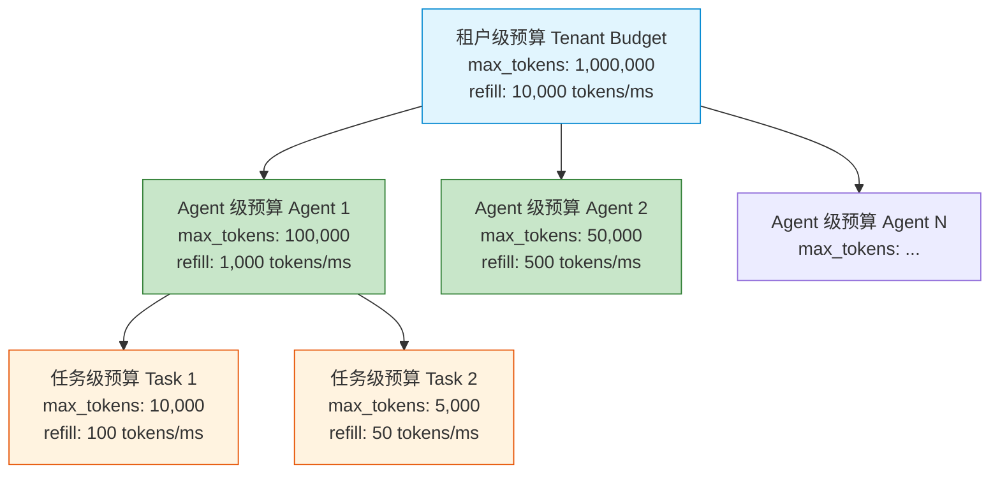
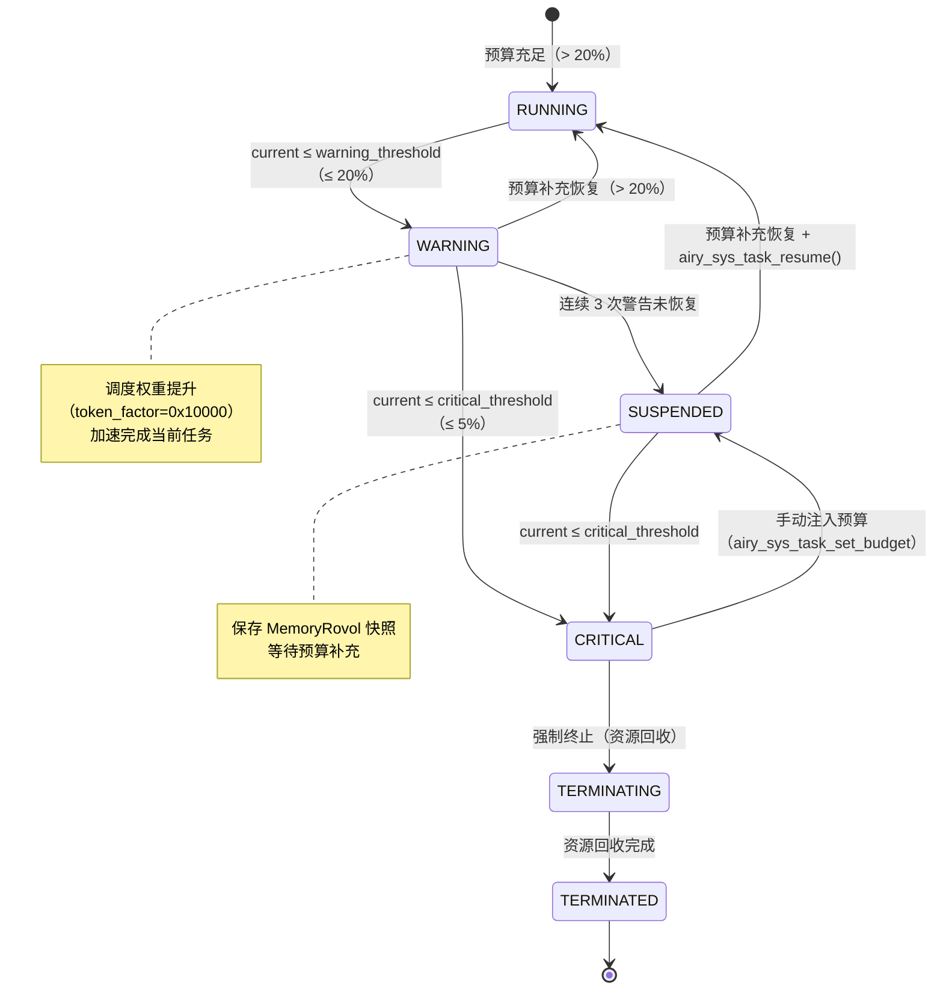

Copyright (c) 2025-2026 SPHARX Ltd. All Rights Reserved.

# Token 预算契约
> **文档定位**：agentrt-linux（AirymaxOS）Agent Token 预算的完整工程契约，定义令牌桶算法、数据结构、分配策略、消耗计量、耗尽处理、恢复机制、系统调用集成、调度集成与 SDK 集成\
> **文档版本**：0.1.1\
> **最后更新**：2026-07-09\
> **上级文档**：[agentrt-linux 设计文档](README.md)\
> **同源映射**：Linux 6.6 CFS 带宽控制（`cpu.cfs_quota_us` / `cpu.cfs_period_us`）+ seL4 MCS 调度上下文（Scheduling Context）+ agentrt Token 能效工程\
> **文档性质**：实现方案文档（非设计文档）。本契约在 [01-agent-lifecycle.md](01-agent-lifecycle.md) 第 3.3 节 Token 预算管理与 [170-performance/01-scheduling-performance.md](../170-performance/01-scheduling-performance.md) 第 3.3 节 Token 预算感知权重的基础上，补充完整的预算模型、接口定义、状态机与错误处理\
> **设计参考**：主流 Linux 发行版 Linux 6.6 内核基线 `kernel/sched/fair.c`（CFS 带宽控制 `sched_cfs_period_timer`）+ seL4 `src/object/schedcontext.c`（调度上下文预算消耗）

---

## 1. 概述

### 1.1 为什么需要 Token 预算

Agent 应用的核心资源消耗是 LLM Token，而非传统 CPU 时间或内存。一个失控的 Agent 可能在数秒内消耗数万 Token，导致：

- **成本失控**：LLM 推理按 Token 计费，无限制消耗直接造成经济损失
- **资源饥饿**：单个 Agent 独占 GPU/NPU 推理资源，其他 Agent 排队等待
- **级联故障**：Token 消耗引发 GPU OOM，导致整个节点不可用

Token 预算契约是 agentrt-linux 的**第一公民资源管理机制**——如同 Linux cfs 带宽控制管理 CPU 时间、memcg 管理内存、io_uring 管理 I/O 带宽，Token 预算管理 LLM 推理资源的分配与消耗。

### 1.2 与传统资源配额的区别

| 维度 | 传统资源配额（cgroup） | Token 预算 |
|------|----------------------|-----------|
| 资源类型 | CPU 时间 / 内存 / I/O | LLM Token |
| 计量方式 | 内核统计（字节/纳秒） | 推理引擎回调上报 |
| 消耗速率 | 相对均匀（CPU 周期） | 突发性强（推理批处理） |
| 补充模型 | 周期性配额（cfs_period） | 令牌桶（连续补充） |
| 耗尽后果 | 限流（throttle） | 挂起（suspend）+ 记忆保存 |
| 恢复成本 | 立即可用 | 需等待补充或手动注入 |

### 1.3 设计目标

1. **预算精确计量**：每个 Agent 的 Token 消耗 100% 可追溯，精度到单 Token
2. **突发控制**：令牌桶算法防止突发消耗导致其他 Agent 饥饿
3. **优雅降级**：预算耗尽时 Agent 进入 SUSPENDED 而非直接终止，保存记忆快照
4. **调度感知**：预算水位影响调度权重——低水位 Agent 获得更高调度优先级以尽快完成
5. **多级预算**：支持租户级 → Agent 级 → 任务级三级预算层级

### 1.4 与 Linux CFS 带宽控制的对齐

Token 预算借鉴 Linux CFS 带宽控制的设计哲学，但适配 Token 消耗特性：

| CFS 概念 | Token 预算对应 | 对齐方式 |
|---------|--------------|---------|
| `cpu.cfs_quota_us` | `max_tokens`（预算上限） | 周期内可消耗上限 |
| `cpu.cfs_period_us` | `refill_period`（补充周期） | 预算补充周期 |
| `cpu.stat` throttle | `suspend_count`（挂起计数） | 预算耗尽统计 |
| throttle 恢复 | 令牌桶补充 | 周期性自动恢复 |
| cgroup 层级 | 租户/Agent/任务层级 | 三级预算层级 |

---

## 2. 令牌桶算法

### 2.1 算法描述

Token 预算采用**令牌桶算法**（Token Bucket），类似 Linux CFS 带宽控制的周期性配额补充：

```
令牌桶容量 = max_tokens（预算上限）
当前令牌数 = current_tokens（当前可用）
补充速率 = refill_rate（tokens/ms）

每次 LLM 推理消耗 N 个 Token:
    if current_tokens >= N:
        current_tokens -= N
        total_consumed += N
        return OK
    else:
        if current_tokens <= critical_threshold:
            触发 TERMINATING（临界耗尽）
        elif current_tokens <= warning_threshold:
            触发 SUSPENDED（警告耗尽）
        return -AIRY_EBUDGET_EXHAUSTED

定时补充（每 refill_period_ms 毫秒）:
    current_tokens = min(max_tokens, current_tokens + refill_rate * refill_period_ms)
    last_refill_ts = now
```

### 2.2 数学模型

令牌桶的连续补充模型：

```
current_tokens(t) = min(max_tokens, current_tokens(t₀) + refill_rate × (t - t₀))

其中:
    t           = 当前时间（ms）
    t₀          = 上次补充时间（last_refill_ts）
    refill_rate = 补充速率（tokens/ms）
    max_tokens  = 桶容量（预算上限）
```

**补充触发时机**：采用惰性补充（lazy refill）——不使用定时器周期性补充，而是在每次消费前检查时间差并补充。这避免了空闲 Agent 的定时器开销，对齐 CFS 的 `update_curr()` 惰性更新模式。

### 2.3 三级阈值设计

| 阈值 | 触发条件（占 max_tokens 比例） | 响应动作 | Agent 状态 |
|------|------------------------------|---------|-----------|
| 正常 | > 50% | 正常运行 | RUNNING |
| 警告（warning） | ≤ 20% | 触发 SUSPENDED + 保存记忆 | SUSPENDED |
| 临界（critical） | ≤ 5% | 触发 TERMINATING + 资源回收 | TERMINATING |

**设计决策理由**：三级阈值而非单一耗尽判断，确保 Agent 有足够时间进行优雅降级——20% 警告阈值时 Agent 仍可运行（但调度权重提升以加速完成），5% 临界阈值时强制终止避免资源泄漏。这参考了 seL4 MCS 调度上下文的预算耗尽处理模式。

---

## 3. 核心数据结构

### 3.1 预算状态结构体

```c
/**
 * struct airy_token_budget - Token 预算状态
 *
 * @current_tokens:    当前可用 Token 数
 * @max_tokens:        预算上限（桶容量）
 * @refill_rate:       补充速率（tokens/ms）
 * @last_refill_ts:    上次补充时间戳（ns，CLOCK_MONOTONIC）
 * @warning_threshold: 警告阈值（低于此值触发 SUSPENDED）
 * @critical_threshold:临界阈值（低于此值触发 TERMINATING）
 * @total_consumed:    累计消耗 Token 数
 * @peak_rate:         峰值消耗速率（tokens/ms）
 * @suspend_count:     因预算不足挂起次数
 * @refill_count:      补充次数
 *
 * 对齐 01-agent-lifecycle.md 第 3.3 节定义，补充统计字段。
 * 所有时间戳使用 CLOCK_MONOTONIC（内核态），避免墙钟跳变。
 */
struct airy_token_budget {
    uint32_t current_tokens;
    uint32_t max_tokens;
    uint32_t refill_rate;           /* tokens/ms */
    uint64_t last_refill_ts;        /* ns */
    uint32_t warning_threshold;     /* 默认 max_tokens * 20% */
    uint32_t critical_threshold;    /* 默认 max_tokens * 5% */

    /* 统计数据 */
    uint64_t total_consumed;
    uint64_t peak_rate;             /* tokens/ms */
    uint32_t suspend_count;
    uint32_t refill_count;
} __attribute__((aligned(64)));     /* 缓存行对齐，减少 false sharing */
```

### 3.2 预算配置结构体

```c
/**
 * struct airy_token_budget_config - Token 预算配置（版本化）
 *
 * @size:              结构体大小（版本协商，必须为首字段）
 * @version:           结构体版本（当前 0x0100）
 * @reserved:          保留字段（填充为 0）
 * @max_tokens:        预算上限
 * @refill_rate:       补充速率（tokens/ms）
 * @refill_period_ms:  补充周期（默认 1000ms = 1s）
 * @warning_pct:       警告阈值百分比（0-100，默认 20）
 * @critical_pct:      临界阈值百分比（0-100，默认 5）
 * @flags:             预算标志（AIRY_BUDGET_FLAG_*）
 *
 * 版本协商规则与 07-syscall-registry.md 第 8.2 节一致。
 */
struct airy_token_budget_config {
    uint32_t size;
    uint32_t version;
    uint32_t reserved;

    uint32_t max_tokens;
    uint32_t refill_rate;
    uint32_t refill_period_ms;
    uint8_t  warning_pct;       /* 默认 20 */
    uint8_t  critical_pct;       /* 默认 5 */
    uint16_t flags;
} __attribute__((aligned(8)));

/* 预算标志位 */
#define AIRY_BUDGET_FLAG_BORROW      0x0001  /* 允许预算借用 */
#define AIRY_BUDGET_FLAG_BURST       0x0002  /* 允许突发消耗 */
#define AIRY_BUDGET_FLAG_HARD_LIMIT  0x0004  /* 硬限制（禁止超限） */
#define AIRY_BUDGET_FLAG_AUTOSUSPEND 0x0008  /* 耗尽自动挂起 */
```

### 3.3 消费记录结构体

```c
/**
 * struct airy_token_usage - 单次 Token 消费记录
 *
 * @agent_id:     Agent ID
 * @task_id:      任务 ID
 * @tokens_used:  本次消费 Token 数
 * @timestamp:    消费时间戳（ns）
 * @phase:        CoreLoopThree 阶段（PERCEPTION/THINKING/ACTION）
 * @model:        LLM 模型标识
 * @latency_ns:   本次推理延迟（ns）
 *
 * 消费记录通过 user_events 上报到可观测性系统（对齐 E-2 可观测性原则）。
 */
struct airy_token_usage {
    uint32_t agent_id;
    uint32_t task_id;
    uint32_t tokens_used;
    uint64_t timestamp;
    uint8_t  phase;          /* CLT_PHASE_* */
    uint8_t  model;          /* LLM 模型 ID */
    uint16_t reserved;
    uint64_t latency_ns;
};
```

---

## 4. 预算分配策略

### 4.1 三级预算层级

Token 预算采用三级层级，类似 cgroup v2 的层级资源分配：



**层级规则**：
- 子级预算总和不超过父级预算上限
- 子级预算耗尽时，向父级借用（若 `AIRY_BUDGET_FLAG_BORROW` 已设置）
- 父级预算耗尽时，所有子级进入 SUSPENDED

### 4.2 初始预算分配

Agent 注册时通过 `airy_agent_config.initial_token_budget` 设置初始预算（详见 [01-agent-lifecycle.md](01-agent-lifecycle.md) 第 2.1 节）。

**默认预算推荐值**：

| Agent 类型 | max_tokens | refill_rate | 典型场景 |
|-----------|-----------|-------------|---------|
| 认知 Agent | 100,000 | 1,000 tokens/ms | CoreLoopThree 思考 |
| 对话 Agent | 50,000 | 500 tokens/ms | 用户交互补全 |
| 工具 Agent | 10,000 | 100 tokens/ms | 函数调用 |
| 批处理 Agent | 500,000 | 5,000 tokens/ms | LLM 批量推理 |
| 实时控制 Agent | 1,000 | 50 tokens/ms | 具身智能运动控制 |

### 4.3 补充速率策略

补充速率（refill_rate）决定预算恢复速度：

| 策略 | refill_rate 计算 | 适用场景 |
|------|-----------------|---------|
| 匀速补充 | 固定值 | 默认策略 |
| 峰谷补充 | 高峰 2x / 低谷 0.5x | 按时段弹性 |
| 自适应补充 | 基于历史消耗率动态调整 | 智能预算管理 |

**自适应补充算法**：

```c
/**
 * airy_budget_adaptive_refill - 自适应补充速率计算
 * @budget: Token 预算状态
 *
 * 基于过去 N 个补充周期的平均消耗率，动态调整补充速率。
 * 若 Agent 持续高消耗，提高补充速率；低消耗则降低。
 */
static uint32_t airy_budget_adaptive_refill(
    const struct airy_token_budget *budget)
{
    uint64_t avg_rate;
    uint32_t new_rate;

    /* 计算平均消耗率（tokens/ms） */
    if (budget->refill_count == 0)
        return budget->refill_rate;

    avg_rate = budget->total_consumed /
               (budget->refill_count * budget->refill_period_ms);

    /* 补充速率 = 平均消耗率 * 安全系数 1.2 */
    new_rate = (uint32_t)(avg_rate * 12 / 10);

    /* 限制在 [refill_rate/2, refill_rate*2] 范围内 */
    if (new_rate < budget->refill_rate / 2)
        new_rate = budget->refill_rate / 2;
    if (new_rate > budget->refill_rate * 2)
        new_rate = budget->refill_rate * 2;

    return new_rate;
}
```

---

## 5. 消耗计量与审计

### 5.1 消费上报机制

Token 消费通过两种路径上报：

| 路径 | 机制 | 延迟 | 用途 |
|------|------|------|------|
| 同步上报 | LLM 推理完成后立即调用 `airy_budget_consume()` | < 1 μs | 精确计量 |
| 异步上报 | io_uring 批量提交消费记录 | < 10 μs | 高吞吐场景 |

### 5.2 消费上报接口

```c
/**
 * airy_budget_consume - 消费 Token 预算
 * @agent_id:  Agent ID
 * @tokens:   消费 Token 数
 * @usage:    消费记录（可选，NULL 则不记录详细日志）
 *
 * 返回: 0 成功，-AIRY_EBUDGET_EXHAUSTED 预算不足，
 *       -AIRY_ENOENT Agent 不存在
 *
 * 消费前先执行惰性补充（lazy refill），更新 current_tokens。
 * 若消费后 current_tokens 低于阈值，触发状态转换。
 */
int airy_budget_consume(uint32_t agent_id, uint32_t tokens,
                           const struct airy_token_usage *usage);
```

### 5.3 审计日志

每次 Token 消费记录审计日志，遵循 E-6（错误可追溯）原则：

```
[TIMESTAMP] BUDGET_CONSUME agent_id=42 task_id=128 tokens=150 \
    phase=THINKING model=GPT-4 latency=850ms remaining=8420
[TIMESTAMP] BUDGET_WARNING agent_id=42 remaining=8420 threshold=20000 \
    pct=8.4% (SUSPENDED triggered)
[TIMESTAMP] BUDGET_REFILL agent_id=42 added=1000 new_total=9420
[TIMESTAMP] BUDGET_EXHAUSTED agent_id=42 total_consumed=100000 \
    suspend_count=3 (TERMINATING triggered)
```

### 5.4 统计数据导出

预算统计数据通过 sysfs 与 user_events 导出：

```bash
# 查看单个 Agent 预算状态
cat /sys/kernel/agentrt/budget/agent_42

# 输出
agent_id:        42
max_tokens:      100000
current_tokens: 8420
refill_rate:     1000 tokens/ms
total_consumed:  91580
peak_rate:       3200 tokens/ms
suspend_count:   2
refill_count:    92
```

---

## 6. 耗尽处理与状态转换

### 6.1 预算耗尽状态机



### 6.2 分级响应动作

| 阶段 | 触发条件 | 响应动作 | Agent 状态 | 调度影响 |
|------|---------|---------|-----------|---------|
| 正常 | current > 20% max | 无 | RUNNING | 正常权重 |
| 警告 | current ≤ 20% max | 调度权重提升 + 日志告警 | RUNNING | token_factor=0x10000 |
| 挂起 | current ≤ warning 且连续 3 次 | 保存记忆 + 进入 SUSPENDED | SUSPENDED | 不参与调度 |
| 临界 | current ≤ 5% max | 强制终止 + 资源回收 | TERMINATING | 不参与调度 |

### 6.3 退出码设计

预算耗尽触发的退出码遵循 [01-agent-lifecycle.md](01-agent-lifecycle.md) 第 5.1 节的分级退出码设计：

| 退出码 | 含义 | 触发条件 | 可恢复 |
|--------|------|---------|--------|
| `AGENT_EXIT_TOKEN_EXHAUSTED` (0x0001) | Token 预算耗尽 | critical 阈值触发 TERMINATING | 否（需重启） |
| `AGENT_EXIT_BUDGET_SUSPENDED` (0x0006) | 预算挂起 | warning 阈值触发 SUSPENDED | 是（补充后恢复） |

---

## 7. 预算恢复机制

### 7.1 自动补充（令牌桶）

令牌桶的惰性补充在每次消费前自动执行：

```c
/**
 * airy_budget_refill - 惰性补充令牌桶
 * @budget: Token 预算状态
 *
 * 基于时间差计算应补充的令牌数。
 * 不使用定时器，对齐 CFS update_curr() 惰性更新模式。
 */
static void airy_budget_refill(struct airy_token_budget *budget)
{
    uint64_t now, elapsed_ms, refill_amount;

    now = airy_clock_gettime_ns();  /* CLOCK_MONOTONIC */
    elapsed_ms = (now - budget->last_refill_ts) / 1000000;

    if (elapsed_ms == 0)
        return;  /* 不足 1ms，不补充 */

    refill_amount = budget->refill_rate * elapsed_ms;
    budget->current_tokens = min(budget->max_tokens,
                                 budget->current_tokens + refill_amount);
    budget->last_refill_ts = now;
    budget->refill_count++;
}
```

### 7.2 手动注入

管理员或调度器可通过系统调用手动注入预算：

```c
/* 手动注入 10000 Token */
struct airy_token_budget_config cfg = {
    .max_tokens = 100000,
    .refill_rate = 1000,
};
airy_sys_task_set_budget(agent_id, &cfg);
```

### 7.3 预算借用

启用 `AIRY_BUDGET_FLAG_BORROW` 时，子级预算可向父级借用：

```c
/**
 * airy_budget_borrow - 向父级借用预算
 * @child:  子级预算
 * @parent: 父级预算
 * @amount: 借用数量
 *
 * 借用规则:
 *   1. 子级必须设置 AIRY_BUDGET_FLAG_BORROW
 *   2. 父级剩余预算必须 > 借用后阈值
 *   3. 借用记录在审计日志中
 *   4. 父级预算补充时自动归还
 */
int airy_budget_borrow(struct airy_token_budget *child,
                          struct airy_token_budget *parent,
                          uint32_t amount);
```

---

## 8. 系统调用集成

### 8.1 预算管理系统调用

Token 预算通过两个系统调用管理（编号定义见 [07-syscall-registry.md](07-syscall-registry.md)）：

| 编号 | 系统调用 | 功能 |
|------|---------|------|
| 523 | `airy_sys_task_set_budget` | 设置/更新 Agent Token 预算 |
| 524 | `airy_sys_task_get_budget` | 查询 Agent Token 预算状态 |

### 8.2 设置预算 C 接口

```c
/**
 * airy_sys_task_set_budget - 设置 Agent Token 预算
 * @agent_id: Agent ID
 * @config:   预算配置
 *
 * 返回: 0 成功，-AIRY_EINVAL 参数无效，
 *       -AIRY_ENOENT Agent 不存在，-AIRY_EPERM 权限不足
 *
 * 设置预算时保留当前 total_consumed 统计，仅重置
 * current_tokens 和补充参数。
 *
 * @since 1.0.1
 */
AIRY_API int airy_sys_task_set_budget(
    uint32_t agent_id,
    const struct airy_token_budget_config *config);
```

### 8.3 查询预算 C 接口

```c
/**
 * airy_sys_task_get_budget - 查询 Agent Token 预算状态
 * @agent_id:   Agent ID
 * @budget_out: 预算状态输出指针
 *
 * 返回: 0 成功，-AIRY_ENOENT Agent 不存在
 *
 * 查询前执行惰性补充，返回最新状态。
 *
 * @since 1.0.1
 */
AIRY_API int airy_sys_task_get_budget(
    uint32_t agent_id,
    struct airy_token_budget *budget_out);
```

### 8.4 内核侧预算消费接口

内核内部接口（非系统调用，供 LLM 守护进程等内核模块调用）：

```c
/**
 * airy_budget_consume - 消费 Token 预算（内核内部接口）
 * @agent_id: Agent ID
 * @tokens:   消费数量
 * @usage:    消费记录（可选）
 *
 * 返回: 0 成功，-AIRY_EBUDGET_EXHAUSTED 预算不足
 *
 * 内核侧接口，非 UAPI。LLM 守护进程通过 kfunc 调用。
 */
int airy_budget_consume(uint32_t agent_id, uint32_t tokens,
                           const struct airy_token_usage *usage);
```

---

## 9. 调度集成

### 9.1 Token 预算感知权重计算

Token 预算水位影响 stc_agent 调度权重，对齐 [170-performance/01-scheduling-performance.md](../170-performance/01-scheduling-performance.md) 第 3.3 节：

```
weight = base_weight * stage_factor * token_factor / 65536 / 65536
```

| token_factor 值 | 触发条件 | 效果 |
|----------------|---------|------|
| 0x10000 (1.0) | current ≤ 20% max（警告水位） | 权重提升，加速完成 |
| 0xC000 (0.75) | 20% < current ≤ 50% max | 中等加速 |
| 0x8000 (0.5) | current > 50% max（充足） | 正常权重 |

### 9.2 权重计算实现

```c
/* 借鉴 170-performance/01-scheduling-performance.md 第 3.3 节 */
static airy_weight_t airy_budget_compute_token_factor(
    const struct airy_token_budget *budget)
{
    uint32_t pct;

    /* 计算剩余预算百分比（Q16.16 定点数） */
    if (budget->max_tokens == 0)
        return 0x8000;  /* 无预算限制，正常权重 */

    pct = (budget->current_tokens * 100) / budget->max_tokens;

    if (pct <= 20)
        return 0x10000;     /* 警告水位：加速完成 */
    else if (pct <= 50)
        return 0xC000;      /* 中等水位：中等加速 */
    else
        return 0x8000;      /* 充足水位：正常权重 */
}
```

### 9.3 与 EEVDF 调度器的集成

Token 预算感知权重通过 sched_tac 调度策略的 `agent_enqueue` 回调注入 EEVDF 调度器：

1. Agent 入队时，`agent_enqueue` 回调计算 `token_factor`
2. `token_factor` 与 `base_weight`、`stage_factor` 相乘得到最终 `weight`
3. `weight` 转换为 EEVDF 的 `lag`（延迟补偿）和 `vruntime`
4. 低水位 Agent 获得更小 vtime，更早被调度

---

## 10. SDK 集成

### 10.1 CognitionClient Token 预算管理

对齐 [02-sdk-integration.md](02-sdk-integration.md) 第 478-505 行的 Python SDK 设计：

```python
from agentrt import CognitionClient, AgentrtError

# 创建带 Token 预算的 CognitionClient
client = CognitionClient(token_budget=10000)

try:
    result = client.process(prompt="分析这段代码")
    # SDK 内部自动管理 token 消耗
except AgentrtError as e:
    if e.code == -401:  # AIRY_EBUDGET_EXHAUSTED
        print(f"Token 预算耗尽，已使用 {client.tokens_used}/{client.token_budget}")
        # 执行优雅降级：保存上下文、通知用户
    elif e.code == -701:  # AIRY_EPERM
        print("权限不足")
```

### 10.2 四语言 SDK 接口

| 语言 | 接口 | Token 预算参数 |
|------|------|--------------|
| Python | `CognitionClient(token_budget=N)` | 构造函数参数 |
| Rust | `CognitionClient::new(token_budget: u32)` | `new()` 参数 |
| Go | `NewCognitionClient(tokenBudget int)` | 构造函数参数 |
| TypeScript | `new CognitionClient({tokenBudget: N})` | 配置对象 |

### 10.3 SDK 层预算管理逻辑

SDK 层在每次推理前检查预算，调用后更新消耗：

```python
class CognitionClient:
    def __init__(self, token_budget: int = 10000, client: Client = None):
        self._client = client or Client()
        self._token_budget = token_budget
        self._tokens_used = 0

    @property
    def tokens_remaining(self) -> int:
        return self._token_budget - self._tokens_used

    def process(self, prompt: str, **kwargs) -> dict:
        # 1. 检查预算
        if self._tokens_used >= self._token_budget:
            raise AgentrtError(-401)  # AIRY_EBUDGET_EXHAUSTED

        # 2. 传递剩余预算给后端
        payload = json.dumps({
            "prompt": prompt,
            "token_budget": self.tokens_remaining,
            "options": kwargs,
        }).encode()

        # 3. 发送到 LLM 守护进程
        resp = self._client.call(LLM_DAEMON_ID, "process", payload)
        result = json.loads(resp)

        # 4. 更新消耗
        self._tokens_used += result.get("tokens_used", 0)
        return result
```

---

## 11. 性能约束

### 11.1 Token 能效三大指标

对齐 [170-performance/README.md](../170-performance/README.md) 第 4.1 节：

| 指标 | 含义 | 测量方法 | 目标 |
|------|------|---------|------|
| Token / Watt | 每瓦功耗处理的 Token 数 | perf + RAPL 功耗监控 | ≥ CFS 130% |
| Token / Latency | 每单位延迟处理的 Token 数 | ftrace + AgentsIPC trace | ≥ CFS 130% |
| Token / Dollar | 每美元成本处理的 Token 数 | 成本核算 | 业务定义 |

### 11.2 预算管理开销约束

| 操作 | 延迟预算（P99） | 测量方法 |
|------|---------------|---------|
| `airy_budget_consume()` | < 1 μs | perf trace |
| `airy_budget_refill()` | < 500 ns | perf trace |
| `airy_sys_task_set_budget()` | < 1 μs | perf trace |
| `airy_sys_task_get_budget()` | < 1 μs | perf trace |

### 11.3 性能回归保护

- 每次 PR 运行 `tests-linux/benchmark/token-budget-overhead` 微基准
- 预算管理开销退化 > 5% 自动打回
- Token/Watt 能效退化 > 3% 自动打回

---

## 12. 错误码定义与统一

### 12.1 新增错误码

Token 预算引入一个新错误码，追加到 [30-interfaces/01-syscalls.md](../30-interfaces/01-syscalls.md) 第 6 章错误码表末尾：

| 错误码 | 值 | 含义 | 触发场景 | 可重试 |
|--------|-----|------|---------|--------|
| `AIRY_EBUDGET_EXHAUSTED` | -15 | Token 预算耗尽 | current_tokens < 请求量 | 是（等待补充后） |

### 12.2 SDK 错误码统一

[02-sdk-integration.md](02-sdk-integration.md) 中使用的 `-401` 错误码需统一到系统调用错误码体系：

| SDK 层错误码 | 系统调用错误码 | 统一说明 |
|-------------|--------------|---------|
| `-401` (SDK 旧) | `-15` (AIRY_EBUDGET_EXHAUSTED) | SDK 层通过 `airy_errno_to_app()` 转换 |
| `-701` (SDK 旧) | `-4` (AIRY_EPERM) | SDK 层通过 `airy_errno_to_app()` 转换 |

**统一约束**：SDK 层错误码是应用层错误码（`airy_app_*`），通过 `airy_errno_to_app()` 从系统调用错误码转换而来。系统调用层统一使用 `AIRY_E*` 前缀（值 -1 ~ -15）。

### 12.3 错误处理规范

```c
/* 正确：检查预算错误并优雅降级 */
int ret = airy_budget_consume(agent_id, tokens, &usage);
if (ret == -AIRY_EBUDGET_EXHAUSTED) {
    log_write(LOG_WARN, "token budget exhausted, agent=%u", agent_id);
    /* 触发 SUSPENDED：保存记忆快照 */
    airy_sys_task_pause(agent_id, AIRY_PAUSE_SAVE_MEMORY);
    return ret;
} else if (ret < 0) {
    log_write(LOG_ERROR, "budget_consume failed: %d (%s)",
              ret, airy_strerror(ret));
    return ret;
}
```

---

## 13. 使用示例

### 13.1 基础使用：创建带预算的 Agent

```c
#include <agentrt/syscalls.h>
#include <agentrt/budget.h>

int create_budgeted_agent(void)
{
    struct airy_task_config task_cfg = {
        .size = sizeof(task_cfg),
        .version = 0x0100,
        .name = "cognition-agent-01",
        .type = AGENT_TYPE_COGNITION,
        .initial_token_budget = 100000,
    };
    struct airy_token_budget_config budget_cfg = {
        .size = sizeof(budget_cfg),
        .version = 0x0100,
        .max_tokens = 100000,
        .refill_rate = 1000,        /* 1000 tokens/ms */
        .refill_period_ms = 1000,  /* 1s 补充周期 */
        .warning_pct = 20,         /* 20% 警告 */
        .critical_pct = 5,         /* 5% 临界 */
        .flags = AIRY_BUDGET_FLAG_AUTOSUSPEND,
    };
    uint32_t agent_id;
    int ret;

    /* 1. 注册 Agent */
    ret = airy_sys_task_register(&task_cfg, &agent_id);
    if (ret < 0) return ret;

    /* 2. 设置预算 */
    ret = airy_sys_task_set_budget(agent_id, &budget_cfg);
    if (ret < 0) {
        airy_sys_task_stop(agent_id, 0);
        return ret;
    }

    /* 3. 启动 Agent */
    ret = airy_sys_task_start(agent_id);
    return ret;
}
```

### 13.2 预算监控

```c
void monitor_agent_budget(uint32_t agent_id)
{
    struct airy_token_budget budget;

    if (airy_sys_task_get_budget(agent_id, &budget) == 0) {
        uint32_t pct = (budget.current_tokens * 100) / budget.max_tokens;

        log_write(LOG_INFO, "agent=%u tokens=%u/%u (%u%%) consumed=%llu",
                  agent_id, budget.current_tokens, budget.max_tokens,
                  pct, (unsigned long long)budget.total_consumed);

        if (pct <= 20)
            log_write(LOG_WARN, "budget warning: agent=%u at %u%%", agent_id, pct);
        if (pct <= 5)
            log_write(LOG_ERROR, "budget critical: agent=%u at %u%%", agent_id, pct);
    }
}
```

### 13.3 耗尽恢复

```c
int handle_budget_exhaustion(uint32_t agent_id)
{
    struct airy_token_budget_config new_budget = {
        .size = sizeof(new_budget),
        .version = 0x0100,
        .max_tokens = 200000,       /* 增加预算 */
        .refill_rate = 2000,        /* 提高补充速率 */
        .refill_period_ms = 1000,
        .warning_pct = 20,
        .critical_pct = 5,
        .flags = AIRY_BUDGET_FLAG_AUTOSUSPEND,
    };

    /* 1. 手动注入新预算 */
    int ret = airy_sys_task_set_budget(agent_id, &new_budget);
    if (ret < 0) return ret;

    /* 2. 恢复 Agent（从 SUSPENDED 到 RUNNING） */
    ret = airy_sys_task_resume(agent_id);
    if (ret < 0) {
        log_write(LOG_ERROR, "resume failed: %d", ret);
        return ret;
    }

    log_write(LOG_INFO, "agent %u budget restored and resumed", agent_id);
    return AIRY_EOK;
}
```

### 13.4 多 Agent 预算分配

```python
from agentrt import CognitionClient

# 租户总预算 1,000,000 Token
TENANT_BUDGET = 1_000_000

# 按优先级分配给多个 Agent
budgets = {
    "cognition": 500_000,   # 认知 Agent（高优先级）
    "dialogue":  300_000,   # 对话 Agent（中优先级）
    "tools":     200_000,   # 工具 Agent（低优先级）
}

clients = {}
for name, budget in budgets.items():
    clients[name] = CognitionClient(token_budget=budget)
    print(f"Agent '{name}' allocated {budget} tokens "
          f"({budget*100//TENANT_BUDGET}% of tenant budget)")
```

---

## 14. 测试策略

### 14.1 单元测试（KUnit）

| 测试项 | 测试方法 | 通过标准 |
|--------|---------|---------|
| 令牌桶补充 | 设置 refill_rate，等待后检查 current_tokens | 补充量 = rate × elapsed |
| 令牌桶上限 | 补充后 current_tokens 不超过 max_tokens | current ≤ max |
| 阈值触发 | 消耗至 warning/critical 阈值 | 正确触发状态转换 |
| 统计准确性 | 消费后检查 total_consumed | 精确匹配 |
| 借用机制 | 子级向父级借用 | 父级减少、子级增加 |

### 14.2 集成测试（kselftest）

| 测试场景 | 步骤 | 预期结果 |
|---------|------|---------|
| 完整生命周期 | 创建→设预算→启动→消费→耗尽→恢复 | 状态转换正确 |
| 多 Agent 竞争 | 2 个 Agent 同时消费 | 预算隔离正确 |
| 调度权重 | 低水位 Agent 优先级 | vtime 更小 |
| 借用归还 | 子级借用→父级补充→归还 | 借用记录正确 |

### 14.3 性能基准

```bash
# Token 预算管理开销基准
agentrt-bench budget-overhead --agents 100 --duration 60

# Token 吞吐基准（对比 CFS）
agentrt-bench token-stream --duration 60 --concurrency 8 \
    --scheduler scx_agent

# 能效基准（RAPL 功耗）
perf stat -e power/energy-pkg/ \
    agentrt-bench token-stream --duration 60
```

### 14.4 KUnit 测试示例

```c
/* KUnit 测试：令牌桶补充 */
static void test_token_bucket_refill(struct kunit *test)
{
    struct airy_token_budget budget = {
        .max_tokens = 100000,
        .current_tokens = 0,
        .refill_rate = 1000,        /* 1000 tokens/ms */
        .last_refill_ts = 0,
    };
    uint64_t old_ts;

    /* 模拟 10ms 后补充 */
    budget.last_refill_ts = airy_clock_gettime_ns() - 10000000; /* 10ms 前 */
    old_ts = budget.last_refill_ts;

    airy_budget_refill(&budget);

    /* 10ms × 1000 tokens/ms = 10000 tokens */
    KUNIT_EXPECT_EQ(test, budget.current_tokens, 10000);
    KUNIT_EXPECT_GT(test, budget.last_refill_ts, old_ts);
    KUNIT_EXPECT_EQ(test, budget.refill_count, 1);
}

/* KUnit 测试：预算耗尽触发 SUSPENDED */
static void test_budget_exhaustion(struct kunit *test)
{
    struct airy_token_budget budget = {
        .max_tokens = 1000,
        .current_tokens = 100,
        .warning_threshold = 200,    /* 20% */
        .critical_threshold = 50,    /* 5% */
    };

    /* 消耗 850 tokens，剩余 100，低于 warning(200) */
    int ret = airy_budget_consume_internal(&budget, 850, NULL);
    KUNIT_EXPECT_EQ(test, ret, 0);
    KUNIT_EXPECT_EQ(test, budget.current_tokens, 100);
    KUNIT_EXPECT_TRUE(test, budget.current_tokens <= budget.warning_threshold);

    /* 再消耗 60 tokens，剩余 40，低于 critical(50) */
    ret = airy_budget_consume_internal(&budget, 60, NULL);
    KUNIT_EXPECT_EQ(test, ret, 0);
    KUNIT_EXPECT_TRUE(test, budget.current_tokens <= budget.critical_threshold);
}
```

---

## 15. IRON-9 v3 同源映射

### 15.1 [SS] 层语义同源

| 维度 | agentrt 用户态 | agentrt-linux OS 层 | 同源语义 |
|------|---------------|-------------------|---------|
| 预算模型 | 用户态令牌桶 | 内核态令牌桶 | 算法语义一致 |
| 预算配置 | `airy_token_budget_config` | 同结构体 | [SC] 共享结构体 |
| 消费接口 | `airy_budget_consume()` | 内核 kfunc | 语义一致 |
| 耗尽处理 | 应用层 SUSPENDED | 内核态 SUSPENDED | 状态语义一致 |

### 15.2 [SC] 层共享

Token 预算的 `airy_token_budget` 结构体定义在 `include/uapi/linux/airymax/sched.h`（[SC] 共享头文件）中，agentrt 与 agentrt-linux 代码字面共享。

### 15.3 [IND] 层独立

agentrt-linux 独有的维度：
- 调度权重感知（token_factor 注入 stc_agent）
- sysfs 统计导出
- 内核态审计日志（SHA-256 哈希链）

---

## 16. 已知问题与修复指引

### 16.1 问题 P1-BUD-01: SDK 错误码与系统调用错误码不一致

**问题描述**：[02-sdk-integration.md](02-sdk-integration.md) 使用 `-401`（AIRY_EBUDGET_EXHAUSTED）和 `-701`（权限错误），而系统调用错误码表（[30-interfaces/01-syscalls.md](../30-interfaces/01-syscalls.md) 第 6 章）使用 `-15` 和 `-4`。

**严重程度**：P1（错误码一致性）

**修复指引**：SDK 层错误码是应用层错误码（`airy_app_*`），通过 `airy_errno_to_app()` 从系统调用错误码转换。需在 SDK 文档中明确标注转换关系。系统调用层新增 `AIRY_EBUDGET_EXHAUSTED = -15` 到错误码表。

---

## 17. 相关文档

### 17.1 上游设计文档（不修改）

- [01-agent-lifecycle.md](01-agent-lifecycle.md) — Agent 生命周期设计（第 3.3 节 Token 预算管理）
- [170-performance/01-scheduling-performance.md](../170-performance/01-scheduling-performance.md) — 调度性能（第 3.3 节 Token 预算感知权重）
- [02-sdk-integration.md](02-sdk-integration.md) — SDK 集成（CognitionClient token_budget）
- [30-interfaces/01-syscalls.md](../30-interfaces/01-syscalls.md) — 系统调用错误码表

### 17.2 实现方案文档（本系列）

- [07-syscall-registry.md](07-syscall-registry.md) — 系统调用编号注册表（编号 523/524）
- [05-memory-rovol-api.md](05-memory-rovol-api.md) — 记忆卷载 API
- [06-agent-deployment.md](06-agent-deployment.md) — Agent 部署与运行

### 17.3 关联模块

- [170-performance/README.md](../170-performance/README.md) — Token 能效工程（Token/Watt）
- [20-modules/01-kernel.md](../20-modules/01-kernel.md) — 内核设计（stc_agent 调度器）
- [90-observability/README.md](../90-observability/README.md) — 可观测性（Token 消费上报）

---

## 18. 参考材料

### 18.1 主流 Linux 发行版 Linux 6.6 内核基线 参考

- `kernel/sched/fair.c` — CFS 带宽控制（`sched_cfs_period_timer`、`tg_unthrottle`）
- `kernel/sched/sched.h` — `cfs_bandwidth` 结构体定义
- `kernel/cgroup/cgroup-v2.c` — cgroup v2 资源层级分配
- `Documentation/admin-guide/cgroup-v2.rst` — cgroup v2 CPU 带宽控制文档

### 18.2 seL4 参考

- `src/object/schedcontext.c` — 调度上下文预算消耗（`sched_consume_budget`）
- `src/object/schedcontrol.c` — 调度上下文配置（`sched_control_configure`）
- `libsel4/include/api/sched.h` — 调度参数定义

### 18.3 Linux 6.6 参考

- `Documentation/scheduler/sched-design-CFS.rst` — CFS 设计文档
- `tools/cgroup/cgroup_event_listener.c` — cgroup 事件监听
- `include/uapi/linux/sched/types.h` — 调度参数类型定义

---

## 19. 版本历史

| 版本 | 日期 | 变更 |
|------|------|------|
| 0.1.1 | 2026-07-09 | 初始版本。定义令牌桶算法、三级阈值设计、核心数据结构（`airy_token_budget` + `airy_token_budget_config` + `airy_token_usage`）、三级预算层级、消耗计量与审计、耗尽状态机、恢复机制（自动补充 + 手动注入 + 借用）、系统调用集成（523/524）、调度集成（token_factor Q16.16）、SDK 集成（四语言）、性能约束（Token/Watt/Latency）、错误码统一（AIRY_EBUDGET_EXHAUSTED = -15）、KUnit 测试 |
| 1.0.1 | 2027-XX-XX | 内核实现完成，自适应补充算法落地，多级预算层级支持，性能基准达标 |

---

Copyright (c) 2025-2026 SPHARX Ltd. All Rights Reserved.
