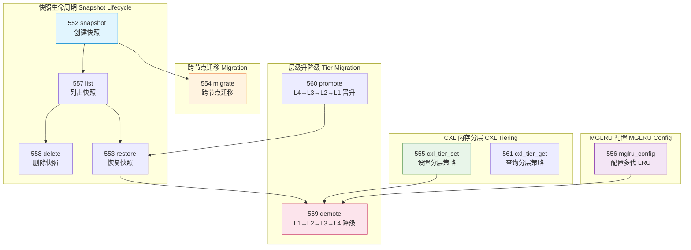
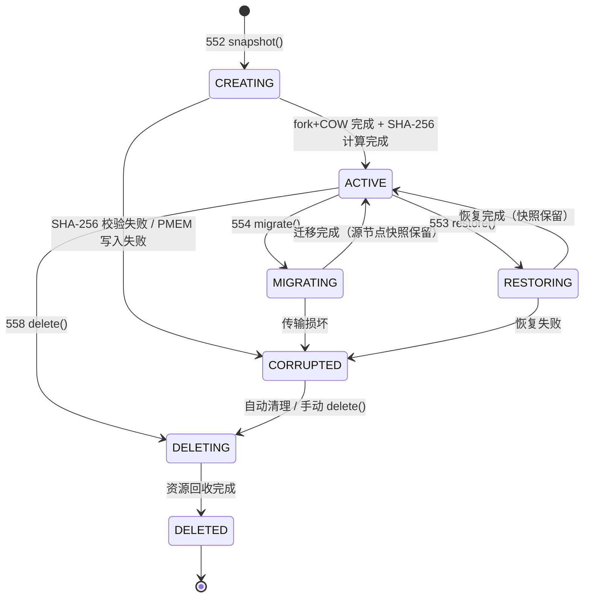
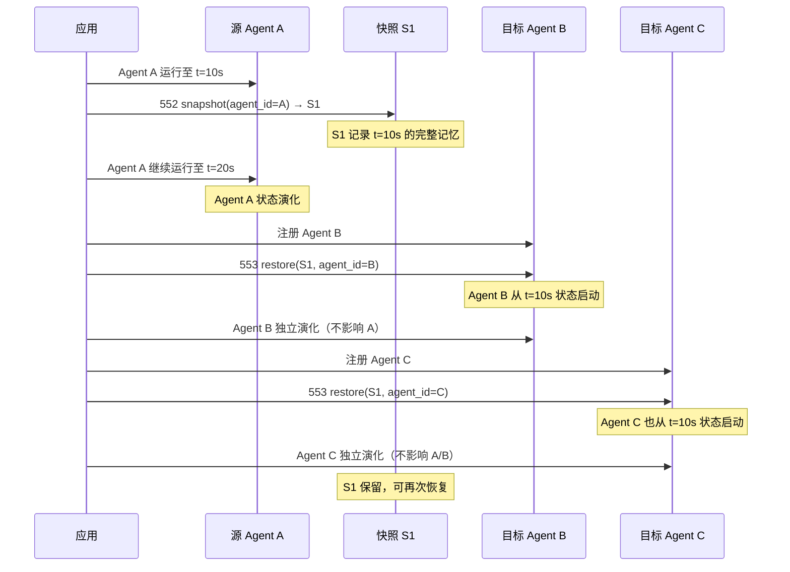
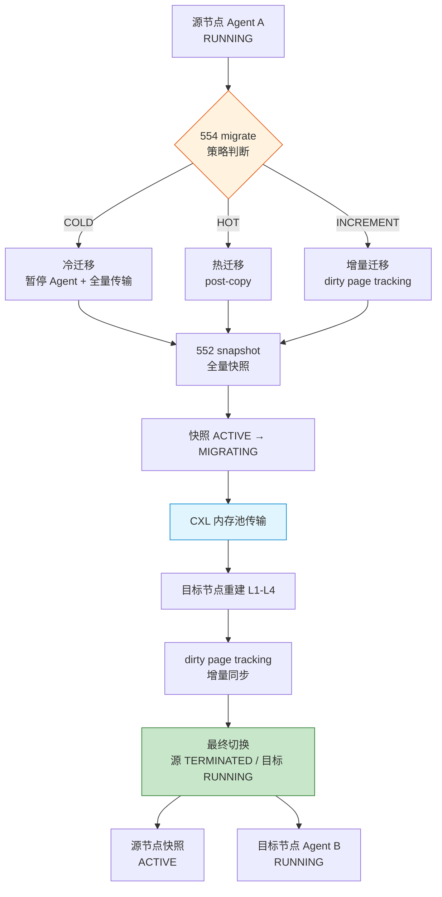
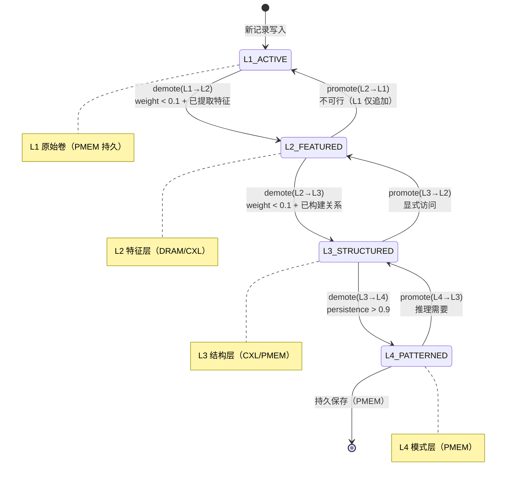
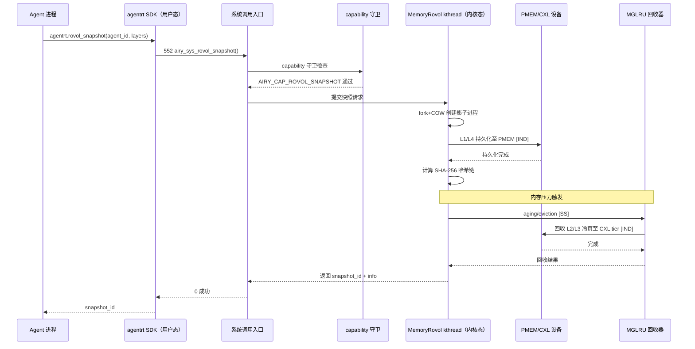

Copyright (c) 2025-2026 SPHARX Ltd. All Rights Reserved.

# MemoryRovol 记忆卷载 API 契约

> **文档定位**：agentrt-linux（AirymaxOS）MemoryRovol 记忆卷载子系统的完整应用层 API 契约，定义 10 个系统调用（编号 552-561）的签名、参数语义、状态机、数据流、错误处理与 SDK 集成\
> **版本**：0.1.1\
> **最后更新**：2026-07-09\
> **父文档**：[Agent 应用开发 README](README.md)\
> **文档性质**：实现方案文档（非设计文档）。本契约在 [02-memory-flow.md](../40-dataflows/02-memory-flow.md) 数据流设计与 [04-memory.md](../20-modules/04-memory.md) 子仓设计的基础上，补充完整的 API 签名、状态机与接口定义\
> **同源映射**：agentrt memoryrovol（记忆卷载）+ Linux 6.6 mm 子系统（MGLRU/userfaultfd/CXL）+ seL4 Untyped retype（记忆重派生）\
> **设计参考**：Linux 6.6 `mm/vmscan.c`（MGLRU aging/eviction）+ `mm/userfaultfd.c`（缺页迁移）+ `drivers/cxl/`（CXL 3.0 池化）+ seL4 `src/object/untyped.c`（retype 派生）+ agentrt memoryrovol L1-L4 模型\
> **编号 SSoT**：完整的系统调用编号注册表见 [07-syscall-registry.md](07-syscall-registry.md) 第 3.3 节（ROVOL 552-571）

---

## 1. 概述

### 1.1 为什么需要此 API 契约

MemoryRovol 是 agentrt-linux 区别于通用操作系统的核心特征——它将"记忆"作为一等资源进行卷载管理，而非传统的文件系统或数据库存储。MemoryRovol 的设计已分散在 [02-memory-flow.md](../40-dataflows/02-memory-flow.md)（数据流）、[04-memory.md](../20-modules/04-memory.md)（子仓设计）、[contracts.md](../50-engineering-standards/20-contracts/contracts.md) 第 7 章（系统调用编号）中。

本契约文档作为**实现层 SSoT**（Single Source of Truth），收口以下问题：

| 问题 | 当前状态 | 本契约解决方式 |
|------|---------|---------------|
| API 签名分散 | snapshot/restore 在 3 处文档，签名略有差异 | 统一为 10 个调用的权威签名 |
| 快照生命周期不明 | 仅 contracts.md 第 7.2 节提及"快照 ID"概念 | 定义完整 7 状态生命周期状态机 |
| 跨节点迁移契约缺失 | 04-memory.md 仅提"基于 userfaultfd post-copy" | 定义 8 步迁移协议 + 状态转换 |
| 层级升降级语义模糊 | syscall-registry 仅列 demote/promote 名称 | 定义艾宾浩斯遗忘曲线的层级迁移规则 |
| SDK 集成不一致 | 02-sdk-integration.md 未覆盖 MemoryRovol | 定义四语言 SDK 集成模式 |
| 错误码未对齐 | memory-flow 与 syscalls 错误码命名混用 | 统一为 `AIRY_E*` 错误码表 |

### 1.2 与设计文档的关系

本契约**不修改**已有设计文档，仅作为实现层补充：

| 设计文档 | 本契约的关系 |
|---------|------------|
| [02-memory-flow.md](../40-dataflows/02-memory-flow.md) | 数据流设计的实现——本契约定义 API 签名与状态机 |
| [04-memory.md](../20-modules/04-memory.md) | 子仓设计的实现——本契约定义系统调用入口 |
| [contracts.md](../50-engineering-standards/20-contracts/contracts.md) | 第 7 章编号定义的扩展——本契约补全至 10 个调用 |
| [07-syscall-registry.md](07-syscall-registry.md) | 第 3.3 节 ROVOL 编号段的 API 层细化 |
| [30-interfaces/01-syscalls.md](../30-interfaces/01-syscalls.md) | 第 3.3 节 snapshot/restore 签名的完整扩展 |

### 1.3 设计目标

1. **存用分离**：存储（PMEM/CXL/DRAM tier）与使用（snapshot/restore/migrate）解耦，符合 K-3 服务隔离原则
2. **层级透明**：L1-L4 四层对应用透明，应用通过单一 API 操作记忆，层级迁移由内核 eBPF 策略驱动
3. **零拷贝优先**：snapshot 基于 fork+COW，migrate 基于 userfaultfd post-copy，避免数据复制
4. **可回滚**：每个快照可恢复，支持时间旅行式调试
5. **跨节点一致**：CXL 内存池化保证跨节点访问语义一致，延迟 < 10μs
6. **遗忘可控**：demote/promote 操作对齐艾宾浩斯遗忘曲线，应用可主动干预遗忘节奏

### 1.4 在五维原则中的位置

| 原则 | 在 MemoryRovol API 的体现 |
|------|-------------------------|
| **K-1 内核极简** | 内核仅提供 snapshot/restore/migrate 机制，遗忘策略在用户态 |
| **K-2 接口契约化** | 10 个系统调用均通过 C 头文件 + Doxygen 给出显式契约 |
| **K-3 服务隔离** | MemoryRovol 独立 kthread + memcg 隔离，Agent 间记忆不可互访 |
| **K-4 可插拔策略** | 遗忘策略（艾宾浩斯/线性/基于访问）可运行时替换 |
| **E-1 安全内生** | 记忆加密（TEE）+ 完整性校验（SHA-256 哈希链）+ capability 守卫 |
| **S-1 反馈闭环** | 检索反馈反向调整权重与衰减速率 |
| **IRON-9 v2 同源且部分代码共享** | [SC] L1-L4 数据结构 + [SS] 6 项操作语义同源（签名独立演进） + [IND] 内核态实现 |

---

## 2. 系统调用总览

### 2.1 编号分配（SSoT 引用）

MemoryRovol API 占用系统调用编号段 **552-571**（共 20 个编号，已分配 10 个，预留 10 个）。完整编号注册表见 [07-syscall-registry.md](07-syscall-registry.md) 第 3.3 节。

| 编号 | 宏定义 | C 符号 | 功能 | 参数数 | 引入版本 |
|------|--------|--------|------|--------|---------|
| 552 | `AIRY_SYS_ROVOL_SNAPSHOT` | `airy_sys_rovol_snapshot` | 创建进程记忆快照 | 2 | 0.1.1 |
| 553 | `AIRY_SYS_ROVOL_RESTORE` | `airy_sys_rovol_restore` | 从快照恢复记忆 | 2 | 0.1.1 |
| 554 | `AIRY_SYS_ROVOL_MIGRATE` | `airy_sys_rovol_migrate` | 跨节点记忆迁移 | 3 | 0.1.1 |
| 555 | `AIRY_SYS_CXL_TIER_SET` | `airy_sys_cxl_tier_set` | 设置 CXL 内存分层策略 | 3 | 0.1.1 |
| 556 | `AIRY_SYS_MGLRU_CONFIG` | `airy_sys_mglru_config` | 配置 MGLRU 多代 LRU | 2 | 0.1.1 |
| 557 | `AIRY_SYS_ROVOL_LIST` | `airy_sys_rovol_list` | 列出进程的所有快照 | 3 | 1.0.1 |
| 558 | `AIRY_SYS_ROVOL_DELETE` | `airy_sys_rovol_delete` | 删除指定快照 | 2 | 1.0.1 |
| 559 | `AIRY_SYS_ROVOL_DEMOTE` | `airy_sys_rovol_demote` | L1→L2→L3→L4 层级降级 | 3 | 1.0.1 |
| 560 | `AIRY_SYS_ROVOL_PROMOTE` | `airy_sys_rovol_promote` | L4→L3→L2→L1 层级晋升 | 3 | 1.0.1 |
| 561 | `AIRY_SYS_CXL_TIER_GET` | `airy_sys_cxl_tier_get` | 查询 CXL 分层策略 | 2 | 1.0.1 |
| 562-571 | — | — | 预留扩展空间 | — | — |

### 2.2 API 分类



**图 1**：MemoryRovol API 分类。10 个调用分为 5 组：快照生命周期（4 个）、跨节点迁移（1 个）、CXL 分层（2 个）、MGLRU 配置（1 个）、层级升降级（2 个）。

### 2.3 参数传递约定

遵循 [contracts.md](../50-engineering-standards/20-contracts/contracts.md) 第 3 章的 System V AMD64 ABI 约定：

- 单个系统调用最多 6 个参数
- 超过 3 个参数时使用结构体指针封装
- 结构体首字段为 `uint32_t size`（用于版本协商）
- 所有指针参数经 `airy_validate_user_ptr()` 验证

---

## 3. 核心数据结构

### 3.1 [SC] 共享契约层引用

MemoryRovol API 的所有数据结构定义在 [SC] 共享契约层头文件 `include/airymax/memory_types.h` 中，agentrt 用户态与 agentrt-linux 内核态**完全共享代码**。完整定义见 [02-memory-flow.md](../40-dataflows/02-memory-flow.md) 第 3 章。

本契约仅引用关键结构，不重复定义：

```c
/* include/airymax/memory_types.h —— IRON-9 v2 [SC] 共享契约层 */

/* L1 原始记录条目（仅追加，PMEM 持久，SHA-256 哈希链保护） */
typedef struct __attribute__((aligned(64))) airy_l1_record {
    uint64_t record_id;
    uint64_t timestamp_ns;
    uint64_t trace_id;
    uint64_t task_id;
    uint32_t record_type;      /* EXEC/PERCEPT/FEEDBACK */
    uint32_t payload_len;
    uint8_t  prev_hash[32];    /* SHA-256 哈希链 */
    uint8_t  payload[];
} airy_l1_record_t;

/* L2 特征向量条目（768 维 Q16.16 定点向量） */
typedef struct __attribute__((aligned(64))) airy_l2_feature {
    uint64_t feature_id;
    uint64_t source_record_id;
    uint64_t timestamp_ns;
    uint32_t model_version;
    uint32_t dim;              /* 默认 768 */
    airy_q16_t weight;      /* Q16.16 权重（受遗忘机制影响） */
    airy_q16_t vector[768]; /* Q16.16 定点向量 */
} airy_l2_feature_t;

/* L3 关系图节点 + 边 */
typedef struct airy_l3_node {
    uint64_t node_id;
    uint64_t source_feature_id;
    uint32_t node_type;       /* ENTITY/CONCEPT/EVENT */
    uint32_t edge_count;
    char     label[64];
    struct airy_l3_edge *edges;
} airy_l3_node_t;

/* L4 持久同调 barcode */
typedef struct airy_l4_barcode {
    uint64_t pattern_id;
    uint64_t source_graph_id;
    int32_t  dimension;       /* 同调维度 0/1/2 */
    airy_q16_t birth;      /* birth 阈值 */
    airy_q16_t death;      /* death 阈值（INT32_MAX = 永生） */
    airy_q16_t persistence;
    uint32_t confidence;      /* 0-100 */
} airy_l4_barcode_t;
```

### 3.2 快照元数据结构

快照元数据是 API 层新增结构（非 [SC] 共享），定义在 `include/uapi/agentrt/rovol.h`：

```c
/* include/uapi/agentrt/rovol.h —— MemoryRovol API UAPI */

#pragma once

#include <stdint.h>
#include <airymax/memory_types.h>   /* [SC] 共享契约层 */

#ifdef __cplusplus
extern "C" {
#endif

/**
 * @brief 快照层级位掩码
 * @since 1.0.1
 * @location include/uapi/agentrt/rovol.h
 *
 * 用于 snapshot/restore/list 操作指定参与的 MemoryRovol 层级。
 * 默认（值为 0）表示全部 4 层参与。
 */
#define AIRY_ROVOL_LAYER_L1   0x01u   /* 原始卷 */
#define AIRY_ROVOL_LAYER_L2   0x02u   /* 特征层 */
#define AIRY_ROVOL_LAYER_L3   0x04u   /* 结构层 */
#define AIRY_ROVOL_LAYER_L4   0x08u   /* 模式层 */
#define AIRY_ROVOL_LAYER_ALL  0x0Fu   /* 全部 4 层 */

/**
 * @brief 快照标志位
 * @since 1.0.1
 */
#define AIRY_ROVOL_FLAG_COMPRESS    0x01u   /* 启用 zstd 压缩 */
#define AIRY_ROVOL_FLAG_ENCRYPT     0x02u   /* 启用 TEE 加密 */
#define AIRY_ROVOL_FLAG_CHECKPOINT  0x04u   /* 标记为检查点（用于回滚） */
#define AIRY_ROVOL_FLAG_MIGRATABLE  0x08u   /* 允许后续跨节点迁移 */

/**
 * @brief 快照元数据——每次 snapshot 返回的描述符
 * @since 1.0.1
 *
 * 此结构由内核填充，应用通过 airy_sys_rovol_list 获取数组。
 * 借鉴 Linux 6.6 struct stat 的"不可变字段 + 保留字段"模式。
 */
typedef struct __attribute__((aligned(8))) airy_rovol_snapshot_info {
    uint32_t size;              /* 结构体大小（版本协商） */
    uint32_t version;           /* 当前 0x0100 */
    uint64_t snapshot_id;       /* 快照 ID（单调递增） */
    uint32_t agent_id;          /* 所属 Agent ID */
    uint32_t layer_mask;        /* AIRY_ROVOL_LAYER_* 位掩码 */
    uint32_t flags;             /* AIRY_ROVOL_FLAG_* 标志位 */
    uint32_t reserved;           /* 保留字段（必须为 0） */

    /* 容量统计（字节） */
    uint64_t l1_size;           /* L1 原始卷大小 */
    uint64_t l2_size;           /* L2 特征层大小 */
    uint64_t l3_size;           /* L3 结构层大小 */
    uint64_t l4_size;           /* L4 模式层大小 */
    uint64_t total_size;        /* 快照总大小 */

    /* 时间戳（纳秒，CLOCK_REALTIME） */
    uint64_t created_ns;        /* 快照创建时间 */
    uint64_t last_accessed_ns;  /* 最后访问时间 */

    /* 完整性 */
    uint8_t  sha256[32];         /* 快照内容 SHA-256 哈希 */
    uint8_t  state;             /* 见 §4.1 状态机 */

    uint8_t  padding[7];        /* 8 字节对齐填充 */
} airy_rovol_snapshot_info_t;

/**
 * @brief 快照状态枚举
 * @since 1.0.1
 * @see §4.1 快照生命周期状态机
 */
typedef enum {
    AIRY_ROVOL_STATE_CREATING    = 0,   /* 创建中（fork + COW 进行中） */
    AIRY_ROVOL_STATE_ACTIVE      = 1,   /* 活跃（可用于 restore） */
    AIRY_ROVOL_STATE_MIGRATING   = 2,   /* 迁移中（跨节点传输） */
    AIRY_ROVOL_STATE_RESTORING   = 3,   /* 恢复中（mmap + userfaultfd） */
    AIRY_ROVOL_STATE_DELETING    = 4,   /* 删除中（资源回收） */
    AIRY_ROVOL_STATE_DELETED     = 5,   /* 已删除（终态） */
    AIRY_ROVOL_STATE_CORRUPTED   = 6,   /* 损坏（SHA-256 校验失败） */
} airy_rovol_state_t;

/**
 * @brief CXL 内存分层策略
 * @since 1.0.1
 */
typedef enum {
    AIRY_CXL_TIER_FAST     = 0,   /* 仅 DRAM（热数据） */
    AIRY_CXL_TIER_BALANCED = 1,   /* DRAM + CXL（温数据） */
    AIRY_CXL_TIER_COLD     = 2,   /* CXL + PMEM（冷数据） */
    AIRY_CXL_TIER_ARCHIVE  = 3,   /* PMEM + SSD（归档） */
} airy_cxl_tier_policy_t;

/**
 * @brief MGLRU 配置参数
 * @since 1.0.1
 */
typedef struct __attribute__((aligned(8))) airy_mglru_config {
    uint32_t size;              /* 结构体大小 */
    uint32_t version;
    uint32_t max_seq;           /* 最大代序号（默认 4） */
    uint32_t min_ttl_ms;        /* 最小 TTL（防 thrashing，默认 1000ms） */
    uint32_t enabled;           /* 是否启用 MGLRU（1=启用） */
    uint32_t swappiness;        /* swappiness（0-200，默认 60） */
    uint64_t reserved[4];        /* 保留扩展 */
} airy_mglru_config_t;

/**
 * @brief 层级升降级操作参数
 * @since 1.0.1
 * @see §9 demote/promote 操作
 */
typedef struct __attribute__((aligned(8))) airy_rovol_tier_op {
    uint32_t size;
    uint32_t version;
    uint64_t snapshot_id;       /* 目标快照 */
    uint32_t from_layer;       /* 源层级（1-4） */
    uint32_t to_layer;          /* 目标层级（1-4） */
    airy_q16_t decay_factor; /* 衰减系数（Q16.16，艾宾浩斯曲线参数） */
    uint64_t reserved[3];
} airy_rovol_tier_op_t;

#ifdef __cplusplus
}
#endif
```

### 3.3 设计决策：Q16.16 定点数

> **内核态禁用 float 约束**：Linux 6.6 内核编译使用 `-mno-80387` 禁用 x87 FPU（见 `arch/x86/Makefile:137`），内核态任何 float/double 算术运算必须包裹在 `kernel_fpu_begin()`/`kernel_fpu_end()` 之间（会禁用抢占，不可在原子/中断/调度器热路径使用）。
>
> **本契约方案**：所有浮点字段（`weight`、`decay_factor`、`birth`、`death`）统一使用 `airy_q16_t`（int32_t）Q16.16 定点数。用户态需 float 展示时用 `AIRY_Q16_TO_F()` 转换。

```c
/* Q16.16 转换辅助宏（仅用户态使用 TO_F） */
#define AIRY_Q16_ONE      (1 << 16)                    /* 1.0 */
#define AIRY_Q16_FLOAT(f) ((airy_q16_t)((f) * AIRY_Q16_ONE))
#define AIRY_Q16_TO_F(x)  ((float)(x) / AIRY_Q16_ONE)

/* 艾宾浩斯衰减系数常用值 */
#define AIRY_DECAY_EBBINGHAUS  0x8000    /* 0.5 Q16.16（默认艾宾浩斯系数） */
#define AIRY_DECAY_LINEAR      0x10000   /* 1.0 Q16.16（线性衰减） */
#define AIRY_DECAY_AGGRESSIVE  0x4000    /* 0.25 Q16.16（激进衰减） */
```

---

## 4. 快照生命周期 API

### 4.1 快照状态机

MemoryRovol 快照经历 7 个状态，借鉴 seL4 Zombie 对象的"中间态 + 抢占点"模式（见 seL4 `src/object/cnode.c`）与 Linux `fork()` 的"创建中"状态：



**图 2**：快照生命周期状态机。CREATING/MIGRATING/RESTORING/DELETING 为中间态（含 preemption point），ACTIVE 为稳态，CORRUPTED/DELETED 为终态。

**设计决策**：中间态借鉴 seL4 的 preemptionPoint 模式——长时间操作（如大快照迁移）分块可抢占，每个分块后检查是否有更高优先级任务需要调度。这避免了快照操作阻塞调度器。

### 4.2 `airy_sys_rovol_snapshot`（编号 552）

创建指定 Agent 进程的记忆快照。借鉴 Linux `fork()` + COW（Copy-On-Write）机制——快照创建时不立即复制内存，而是在首次写入时按页复制。

```c
/**
 * @brief 创建进程记忆快照
 * @param agent_id    目标 Agent ID
 * @param options     快照选项（layer_mask + flags 组合）
 * @param info_out    快照元数据输出指针（调用方分配）
 * @return 0 成功（info_out 已填充），<0 AIRY_E* 错误码
 *
 * @since 0.1.1
 * @par Example:
 * @code
 *   airy_rovol_snapshot_info_t info = { .size = sizeof(info), .version = 0x0100 };
 *   int ret = airy_sys_rovol_snapshot(agent_id,
 *       AIRY_ROVOL_LAYER_ALL | AIRY_ROVOL_FLAG_COMPRESS,
 *       &info);
 *   if (ret < 0) { ... }
 * @endcode
 *
 * @par 借鉴来源:
 * - Linux 6.6 `kernel/fork.c` copy_process()——COW 快照基础
 * - Linux 6.6 `mm/userfaultfd.c`——缺页处理（用于增量快照）
 * - seL4 `src/object/untyped.c` UntypedRetype——记忆重派生语义
 *
 * @par 实现细节:
 * 1. capability 守卫：检查 AIRY_CAP_ROVOL_SNAPSHOT 权限
 * 2. 状态检查：Agent 必须处于 RUNNING/PAUSED 状态
 * 3. fork+COW：调用内核 do_fork() 创建影子进程
 * 4. 层级遍历：按 layer_mask 遍历 L1-L4，PMEM 持久化 L1/L4
 * 5. SHA-256：计算快照内容哈希链
 * 6. 状态转换：CREATING → ACTIVE
 *
 * @par 性能:
 * - 小快照（< 100MB）：< 50ms
 * - 大快照（~1GB）：< 500ms（COW 延迟复制）
 * - 超大快照（> 10GB）：分块 + preemption point
 */
AIRY_API int airy_sys_rovol_snapshot(uint32_t agent_id,
                                           uint32_t options,
                                           airy_rovol_snapshot_info_t *info_out);
```

**参数语义**：

| 参数 | 类型 | 语义 | 约束 |
|------|------|------|------|
| `agent_id` | `uint32_t` | 目标 Agent ID | 必须已注册且属于当前 capability 域 |
| `options` | `uint32_t` | 低 16 位为 `AIRY_ROVOL_LAYER_*`，高 16 位为 `AIRY_ROVOL_FLAG_*` | 至少包含一层 |
| `info_out` | `airy_rovol_snapshot_info_t *` | 快照元数据输出 | 调用方分配，`size` 字段必须已设置 |

**错误码**：

| 返回值 | 含义 | 触发条件 |
|--------|------|---------|
| 0 | 成功 | 快照已创建，`info_out->snapshot_id` 有效 |
| `-AIRY_EINVAL` | 参数无效 | `agent_id` 不存在、`options` 为 0、`info_out` 为 NULL |
| `-AIRY_EPERM` | 权限不足 | 缺少 `AIRY_CAP_ROVOL_SNAPSHOT` capability |
| `-AIRY_ECONFLICT` | 状态冲突 | Agent 不在 RUNNING/PAUSED 状态 |
| `-AIRY_ENOMEM` | 内存不足 | PMEM/CXL 池耗尽 |
| `-AIRY_EBUSY` | 资源繁忙 | Agent 正在迁移，无法快照 |

### 4.3 `airy_sys_rovol_list`（编号 557）

列出指定 Agent 的所有快照。借鉴 Linux `getdents64()` 的"批量读取 + 偏移续读"模式。

```c
/**
 * @brief 列出 Agent 的所有快照
 * @param agent_id      目标 Agent ID
 * @param infos_out     快照信息数组输出（调用方分配）
 * @param in_out_count  输入：数组容量；输出：实际填充数量
 * @return 0 成功，<0 AIRY_E* 错误码
 *
 * @since 1.0.1
 * @par 借鉴来源:
 * - Linux 6.6 `fs/readdir.c` getdents64——批量读取 + 续读模式
 * - Linux 6.6 `fs/proc/base.c`——per-process 信息枚举
 *
 * @par 实现细节:
 * 1. capability 守卫：检查 AIRY_CAP_ROVOL_LIST 权限
 * 2. 遍历 per-agent 快照红黑树（按 snapshot_id 排序）
 * 3. 仅返回 ACTIVE/MIGRATING/RESTORING 状态的快照
 * 4. CORRUPTED 快照单独标记（infos_out[].state = CORRUPTED）
 *
 * @par 续读语义:
 * 若快照数超过 in_out_count 容量，返回实际填充数，
 * 应用可再次调用获取剩余快照（无需偏移参数，因按 ID 排序）。
 */
AIRY_API int airy_sys_rovol_list(uint32_t agent_id,
                                       airy_rovol_snapshot_info_t *infos_out,
                                       uint32_t *in_out_count);
```

### 4.4 `airy_sys_rovol_delete`（编号 558）

删除指定快照。借鉴 seL4 `cteDelete()` 的"Zombie 中间态 → 最终清理"两阶段删除模式。

```c
/**
 * @brief 删除指定快照
 * @param snapshot_id   目标快照 ID
 * @param flags         删除标志（当前保留，必须为 0）
 * @return 0 成功，<0 AIRY_E* 错误码
 *
 * @since 1.0.1
 * @par 借鉴来源:
 * - seL4 `src/object/cnode.c` cteDelete——Zombie 中间态两阶段删除
 * - Linux 6.6 `mm/mmap.c` do_munmap——内存区域回收
 *
 * @par 两阶段删除:
 * 1. 阶段 1（同步）：快照状态 ACTIVE → DELETING，阻止新访问
 * 2. 阶段 2（异步）：内核工作队列回收 PMEM/CXL 内存，状态 → DELETED
 *
 * @par 抢占点:
 * 阶段 2 分块执行，每 64MB 后插入 preemption_point()，
 * 避免大快照删除阻塞调度器（借鉴 seL4 preemptionPoint）。
 *
 * @par 不可逆性:
 * 删除后 L1 原始卷也回收（除非快照标记了 AIRY_ROVOL_FLAG_CHECKPOINT）。
 * CHECKPOINT 快照的 L1 保留，可重新提取特征。
 */
AIRY_API int airy_sys_rovol_delete(uint64_t snapshot_id,
                                         uint32_t flags);
```

---

## 5. 恢复 API

### 5.1 `airy_sys_rovol_restore`（编号 553）

从快照恢复 Agent 记忆。借鉴 Linux `mmap()` + `userfaultfd()` 的按需加载机制——恢复时不立即加载所有页，而是在访问时按需加载。

```c
/**
 * @brief 从快照恢复进程记忆
 * @param snapshot_id   源快照 ID
 * @param agent_id      目标 Agent ID（必须已存在）
 * @return 0 成功（Agent 进入 RESTORING → RUNNING），<0 AIRY_E* 错误码
 *
 * @since 0.1.1
 * @par 借鉴来源:
 * - Linux 6.6 `mm/memory.c` do_read_fault——按需加载
 * - Linux 6.6 `mm/userfaultfd.c`——缺页处理框架
 * - CRIU (Checkpoint/Restore In Userspace)——进程恢复语义
 *
 * @par 恢复流程:
 * 1. capability 守卫：检查 AIRY_CAP_ROVOL_RESTORE 权限
 * 2. 快照状态检查：必须为 ACTIVE 状态
 * 3. Agent 状态检查：必须为 REGISTERED/CONFIGURED 状态
 * 4. mmap 占位：为目标 Agent 地址空间建立 VMA 占位
 * 5. 注册 userfaultfd：为占位 VMA 注册缺页处理
 * 6. 状态转换：快照 ACTIVE → RESTORING，Agent → RUNNING
 * 7. 后台加载：内核工作队列按 L1→L2→L3→L4 顺序加载热页
 * 8. 按需加载：访问冷页时触发 userfaultfd，从快照加载
 * 9. 快照恢复：RESTORING → ACTIVE（快照保留，可多次恢复）
 *
 * @par 时间旅行式调试:
 * 同一快照可恢复到不同 Agent，实现"时间旅行"——
 * 从快照 A 恢复到 Agent B，Agent B 可独立演化，不影响 Agent A。
 * 这如同 Git 的 branch——快照是 commit，恢复是 checkout 到新 branch。
 *
 * @par 性能:
 * - 首次恢复延迟： < 100ms（仅加载热页）
 * - 冷页访问延迟： < 5ms（userfaultfd 缺页处理）
 * - 完整恢复：后台异步，不阻塞应用
 */
AIRY_API int airy_sys_rovol_restore(uint64_t snapshot_id,
                                          uint32_t agent_id);
```

### 5.2 恢复与时间旅行

MemoryRovol 的恢复 API 支持"时间旅行式调试"——这是区别于传统进程恢复（CRIU）的关键特性：



**图 3**：时间旅行式恢复。快照 S1 可恢复到多个目标 Agent，每个 Agent 独立演化。这如同 Git 的 branch——快照是 commit，恢复是 checkout。

---

## 6. 跨节点迁移 API

### 6.1 `airy_sys_rovol_migrate`（编号 554）

跨节点迁移 Agent 记忆。借鉴 Linux CRIU + userfaultfd post-copy 迁移机制。

```c
/**
 * @brief 跨节点迁移 Agent 记忆
 * @param agent_id      目标 Agent ID
 * @param target_node   目标节点 ID
 * @param policy        迁移策略
 * @return 0 成功（迁移在后台进行），<0 AIRY_E* 错误码
 *
 * @since 0.1.1
 * @par 借鉴来源:
 * - Linux CRIU post-copy 迁移
 * - Linux 6.6 `mm/migrate.c` migrate_pages——页迁移基础
 * - Linux 6.6 `mm/userfaultfd.c`——post-copy 缺页处理
 * - CXL 3.0 内存池化——跨节点内存访问
 *
 * @par 迁移策略枚举:
 */
typedef enum {
    AIRY_MIGRATE_COLD     = 0,   /* 冷迁移：暂停 Agent，全量传输 */
    AIRY_MIGRATE_HOT      = 1,   /* 热迁移：post-copy，先切后传 */
    AIRY_MIGRATE_INCREMENT= 2,   /* 增量迁移：dirty page tracking */
} airy_migrate_policy_t;
/**
 * @par 8 步迁移协议（post-copy 热迁移）:
 * 1. capability 守卫：检查 AIRY_CAP_ROVOL_MIGRATE 权限
 * 2. Agent 进入 PAUSING 状态（借鉴 seL4 Zombie 中间态）
 * 3. 创建快照：552 snapshot（L1-L4 全部）
 * 4. 快照状态：ACTIVE → MIGRATING
 * 5. CXL 传输：通过 CXL 内存池传输快照到目标节点
 * 6. 目标重建：在目标节点重建 L1-L4 数据结构
 * 7. 最终同步：dirty page tracking + 增量同步
 * 8. 切换：源节点 Agent → TERMINATED，目标节点 Agent → RUNNING
 *
 * @par post-copy 优势:
 * - 迁移期间 Agent 保持运行（仅最终切换时短暂暂停）
 * - 冷页延迟传输，不影响热路径
 * - 借助 CXL 内存池，跨节点访问延迟 < 10μs
 *
 * @par 性能:
 * - 冷迁移延迟： < 30s（1GB 快照）
 * - 热迁移停顿： < 100ms（仅最终切换）
 * - 增量迁移： < 1s（仅传输 dirty pages）
 */
AIRY_API int airy_sys_rovol_migrate(uint32_t agent_id,
                                          uint32_t target_node,
                                          airy_migrate_policy_t policy);
```

### 6.2 迁移数据流



**图 4**：跨节点迁移数据流。三种迁移策略共享"快照 → CXL 传输 → 重建 → 切换"基础流程，差异在切换时机。

---

## 7. CXL 内存分层 API

### 7.1 `airy_sys_cxl_tier_set`（编号 555）

设置 CXL 内存分层策略。借鉴 Linux 6.6 `mm/memory-tiers.c` 的分层抽象。

```c
/**
 * @brief 设置 CXL 内存分层策略
 * @param agent_id      目标 Agent ID
 * @param layer         MemoryRovol 层级（1-4）
 * @param policy        分层策略
 * @return 0 成功，<0 AIRY_E* 错误码
 *
 * @since 0.1.1
 * @par 借鉴来源:
 * - Linux 6.6 `mm/memory-tiers.c`——内存分层抽象
 * - Linux 6.6 `mm/migrate.c`——页迁移至不同 tier
 * - CXL 3.0 规格——跨节点内存池
 *
 * @par 层级与 tier 映射:
 * | MemoryRovol 层 | 默认 tier | 策略可调整 |
 * |---|---|---|
 * | L1 原始卷 | FAST (DRAM) | 不可调整（PMEM 持久） |
 * | L2 特征层 | BALANCED (DRAM+CXL) | 可调整 |
 * | L3 结构层 | COLD (CXL+PMEM) | 可调整 |
 * | L4 模式层 | ARCHIVE (PMEM+SSD) | 不可调整（PMEM 持久） |
 *
 * @par 策略生效:
 * 设置后立即生效，内核 MGLRU 回收器按新策略调整 aging/eviction。
 * 已存在的页面通过后台 migrate_pages() 迁移至新 tier。
 */
AIRY_API int airy_sys_cxl_tier_set(uint32_t agent_id,
                                         uint32_t layer,
                                         airy_cxl_tier_policy_t policy);
```

### 7.2 `airy_sys_cxl_tier_get`（编号 561）

查询当前 CXL 分层策略。

```c
/**
 * @brief 查询 CXL 分层策略
 * @param agent_id      目标 Agent ID
 * @param policy_out    策略输出指针
 * @return 0 成功，<0 AIRY_E* 错误码
 *
 * @since 1.0.1
 * @par 借鉴来源:
 * - Linux 6.6 `sysfs` 接口——配置查询模式
 */
AIRY_API int airy_sys_cxl_tier_get(uint32_t agent_id,
                                         airy_cxl_tier_policy_t *policy_out);
```

---

## 8. MGLRU 配置 API

### 8.1 `airy_sys_mglru_config`（编号 556）

配置 MGLRU 多代 LRU 回收策略。借鉴 Linux 6.6 `mm/vmscan.c` 的 MGLRU 参数。

```c
/**
 * @brief 配置 MGLRU 多代 LRU
 * @param agent_id      目标 Agent ID（0 = 全局配置）
 * @param config        配置参数
 * @return 0 成功，<0 AIRY_E* 错误码
 *
 * @since 0.1.1
 * @par 借鉴来源:
 * - Linux 6.6 `mm/vmscan.c` try_to_inc_max_seq——aging 增量
 * - Linux 6.6 `mm/vmscan.c` evict_folios——eviction 增量
 * - Linux 6.6 `include/linux/mmzone.h` struct lru_gen_folio——核心数据结构
 *
 * @par 参数语义:
 * - max_seq：最大代序号（默认 4，对应 MGLRU MAX_NR_GENS）
 * - min_ttl_ms：最小 TTL 防止 thrashing（默认 1000ms）
 * - swappiness：swap 倾向（0-200，默认 60）
 *
 * @par 等效 sysfs 操作:
 * @code
 *   echo y > /sys/kernel/mm/lru_gen/enabled
 *   echo 1000 > /sys/kernel/mm/lru_gen/min_ttl_ms
 * @endcode
 * 系统调用封装了 sysfs 操作，提供 per-agent 粒度配置。
 *
 * @par MGLRU 与 MemoryRovol 的语义同源 [SS]:
 * - aging（max_seq++）：对应 L2 特征新生（新特征进入 youngest gen）
 * - eviction（min_seq++）：对应 L2/L3 遗忘（老特征被驱逐）
 * - tier 调整：对应 weight 衰减（基于访问频次）
 */
AIRY_API int airy_sys_mglru_config(uint32_t agent_id,
                                         const airy_mglru_config_t *config);
```

---

## 9. 层级升降级 API

### 9.1 艾宾浩斯遗忘曲线

MemoryRovol 的层级升降级基于艾宾浩斯遗忘曲线——记忆权重随时间衰减，衰减到阈值时触发降级（demote），重新访问时触发晋升（promote）：

```
weight(t) = initial_weight * exp(-λ * t / 3600)
```

- `t`：自上次访问以来的秒数
- `λ`：衰减系数（默认 0.5，即 `AIRY_DECAY_EBBINGHAUS` 0x8000 Q16.16）
- 当 `weight < 0.1`（`0x1999` Q16.16）时，触发 demote（L1→L2 或 L2→L3）
- 重新访问时，`weight` 重置为 `initial_weight`，触发 promote（L3→L2 或 L2→L1）

### 9.2 `airy_sys_rovol_demote`（编号 559）

手动触发层级降级。借鉴 seL4 Untyped retype 的"降级为更原始类型"语义。

```c
/**
 * @brief L1→L2→L3→L4 层级降级
 * @param snapshot_id   目标快照 ID
 * @param op            降级操作参数
 * @param flags         保留字段（必须为 0）
 * @return 0 成功，<0 AIRY_E* 错误码
 *
 * @since 1.0.1
 * @par 借鉴来源:
 * - seL4 `src/object/untyped.c` UntypedRetype——降级为更原始类型
 * - 艾宾浩斯遗忘曲线——权重衰减触发降级
 * - Linux 6.6 `mm/vmscan.c` shrink_folio_list——页降级至慢速 tier
 *
 * @par 降级规则:
 * | 源层级 | 目标层级 | 触发条件 | 操作 |
 * |---|---|---|---|
 * | L1 原始卷 | L2 特征层 | weight < 0.1 且已提取特征 | 提取特征向量，L1 保留（PMEM 持久） |
 * | L2 特征层 | L3 结构层 | weight < 0.1 且已构建关系 | 构建关系图，L2 移至 CXL tier |
 * | L3 结构层 | L4 模式层 | persistence > 0.9 | 挖掘持久同调，L3 移至 PMEM tier |
 * | L4 模式层 | — | 不可降级 | L4 为最深层，持久保存 |
 *
 * @par 不可逆性:
 * demote 操作本身可逆（可通过 promote 升回），
 * 但 L1 → L2 的特征提取可能丢失部分原始信息（仅保留语义向量）。
 *
 * @par 衰减系数:
 * decay_factor 控制 weight 衰减速率：
 * - AIRY_DECAY_EBBINGHAUS (0.5)：标准艾宾浩斯曲线
 * - AIRY_DECAY_LINEAR (1.0)：线性衰减（更快遗忘）
 * - AIRY_DECAY_AGGRESSIVE (0.25)：激进衰减（用于内存压力场景）
 */
AIRY_API int airy_sys_rovol_demote(uint64_t snapshot_id,
                                         const airy_rovol_tier_op_t *op,
                                         uint32_t flags);
```

### 9.3 `airy_sys_rovol_promote`（编号 560）

手动触发层级晋升。借鉴 seL4 capability mint 的"提升权限"语义。

```c
/**
 * @brief L4→L3→L2→L1 层级晋升
 * @param snapshot_id   目标快照 ID
 * @param op            晋升操作参数
 * @param flags         保留字段（必须为 0）
 * @return 0 成功，<0 AIRY_E* 错误码
 *
 * @since 1.0.1
 * @par 借鉴来源:
 * - seL4 `src/object/cnode.c` cnodeCopy——capability 派生（语义提升）
 * - 艾宾浩斯遗忘曲线——重新访问触发权重重置
 * - Linux 6.6 `mm/migrate.c` migrate_pages——页晋升至快速 tier
 *
 * @par 晋升规则:
 * | 源层级 | 目标层级 | 触发条件 | 操作 |
 * |---|---|---|---|
 * | L4 模式层 | L3 结构层 | 显式访问或推理需要 | 从 barcode 重建关系图 |
 * | L3 结构层 | L2 特征层 | 显式访问或检索需要 | 从图节点提取特征向量 |
 * | L2 特征层 | L1 原始卷 | 不可晋升 | L1 仅追加，不可重建 |
 * | L1 原始卷 | — | 不可晋升 | L1 为最原始层 |
 *
 * @par 权重重置:
 * promote 操作将 weight 重置为 initial_weight（1.0 Q16.16），
 * 相当于"重新学习"该记忆。
 */
AIRY_API int airy_sys_rovol_promote(uint64_t snapshot_id,
                                          const airy_rovol_tier_op_t *op,
                                          uint32_t flags);
```

### 9.4 层级迁移状态机



**图 5**：MemoryRovol L1-L4 层级迁移状态机。降级（demote）对应艾宾浩斯遗忘曲线的权重衰减，晋升（promote）对应重新访问的权重重置。L1 → L2 不可逆（特征提取有损），其他层级可逆。

---

## 10. 错误码统一

### 10.1 MemoryRovol 专用错误码

MemoryRovol API 复用 [contracts.md](../50-engineering-standards/20-contracts/contracts.md) 第 4.2 节的通用错误码，并新增 3 个 MemoryRovol 专用错误码：

| 错误码 | 值 | 含义 | 典型触发场景 | 可重试 |
|--------|-----|------|-------------|--------|
| `AIRY_EOK` | 0 | 成功 | 调用成功 | - |
| `AIRY_EINVAL` | -1 | 参数无效 | `agent_id` 不存在、`options` 为 0 | 否 |
| `AIRY_ENOMEM` | -2 | 内存不足 | PMEM/CXL 池耗尽 | 是（等待后） |
| `AIRY_ENOSYS` | -3 | 未实现 | 编号未实现或已废弃 | 否 |
| `AIRY_EPERM` | -4 | 权限不足 | capability 令牌缺失 | 否 |
| `AIRY_ENOENT` | -5 | 资源不存在 | `snapshot_id` 不存在 | 否 |
| `AIRY_EAGAIN` | -6 | 暂时不可用 | CXL 带宽不足 | 是（立即） |
| `AIRY_EMSGSIZE` | -7 | 消息过大 | 快照超过最大限制 | 否 |
| `AIRY_EBUSY` | -9 | 资源繁忙 | Agent 正在迁移 | 是（延迟） |
| `AIRY_ENOTSUP` | -10 | 不支持 | 无 CXL 设备、PMEM 未配置 | 否 |
| `AIRY_ETIMEDOUT` | -11 | 超时 | 迁移超时、userfaultfd 超时 | 是（限制次数） |
| `AIRY_ECONFLICT` | -12 | 状态冲突 | 快照非 ACTIVE 状态、Agent 非 RUNNING | 否 |
| `AIRY_EFAULT` | -13 | 地址错误 | 用户态指针非法 | 否 |
| **`AIRY_ECORRUPTED`** | **-15** | **快照损坏** | **SHA-256 校验失败** | **否** |
| **`AIRY_ETIER`** | **-16** | **层级非法** | **demote/promote 层级越界** | **否** |
| **`AIRY_EMIGRATE`** | **-17** | **迁移失败** | **目标节点不可达、CXL 池故障** | **是（限制次数）** |

### 10.2 错误码字符串化

```c
/**
 * @brief 错误码转人类可读字符串
 * @param err 错误码（AIRY_E*）
 * @return 静态字符串指针（无需释放）
 *
 * @since 1.0.1
 */
AIRY_API const char *airy_strerror(int err);
```

### 10.3 错误处理规范

所有 MemoryRovol API 实现必须遵循：

1. **错误码原样传递**：内核子系统的错误码必须原样传递到用户态，不得吞没或转换
2. **错误日志记录**：每个错误返回前必须调用 `log_write(LOG_ERROR, ...)` 记录上下文
3. **审计日志**：`-AIRY_EPERM`（权限不足）和 `-AIRY_ECORRUPTED`（损坏）必须记录审计日志
4. **状态回滚**：错误发生时，快照/Agent 状态必须回滚到操作前状态（借鉴 seL4 Point of No Return 模式——仅在不可回滚点之后失败才进入 CORRUPTED）

---

## 11. IRON-9 v2 同源映射

### 11.1 [SC] 共享契约层

MemoryRovol API 的数据结构通过 [SC] 共享契约层与 agentrt 用户态**完全共享代码**：

| [SC] 共享内容 | 头文件位置 | 在本 API 中的作用 |
|--------------|-----------|------------------|
| `airy_l1_record_t` | `include/airymax/memory_types.h` | snapshot/restore 的 L1 数据结构 |
| `airy_l2_feature_t` | `include/airymax/memory_types.h` | snapshot/restore 的 L2 数据结构 |
| `airy_l3_node_t` / `airy_l3_edge_t` | `include/airymax/memory_types.h` | snapshot/restore 的 L3 数据结构 |
| `airy_l4_barcode_t` | `include/airymax/memory_types.h` | snapshot/restore 的 L4 数据结构 |
| `AIRY_GFP_*` 宏 | `include/airymax/memory_types.h` | 内核分配标志语义 |
| `airy_pmem_flush_fn` | `include/airymax/memory_types.h` | PMEM 持久化接口 |
| `airy_q16_t` + 转换宏 | `include/airymax/memory_types.h` | 定点数算术（内核态禁用 float） |

### 11.2 [SS] 语义同源层

MemoryRovol API 的 6 项核心操作与 agentrt 用户态**操作模式同源（概念操作一致），函数签名因抽象层级不同而独立**：

| 序号 | agentrt 用户态 API | agentrt-linux 系统调用 | 语义 | 实现差异 |
|------|-------------------|----------------------|------|---------|
| 1 | `airy_rovol_snapshot()` | `airy_sys_rovol_snapshot` | 创建快照 | 用户态 fork+COW / 内核 fork+userfaultfd |
| 2 | `airy_rovol_restore()` | `airy_sys_rovol_restore` | 恢复记忆 | 用户态 mmap / 内核 mmap+userfaultfd |
| 3 | `airy_rovol_migrate()` | `airy_sys_rovol_migrate` | 跨节点迁移 | 用户态迁移 / 内核 userfaultfd post-copy |
| 4 | `airy_rovol_compress()` | （封装在 552 flags） | 压缩快照 | 用户态 zstd / 内核 zswap/zram |
| 5 | MGLRU aging | `airy_sys_mglru_config` | 代际回收 | 用户态模拟 / 内核 `lru_gen_folio` |
| 6 | userfaultfd 处理 | （封装在 553/554 内部） | 缺页处理 | 用户态 handler / 内核 uffd 框架 |

### 11.3 [IND] 完全独立层

MemoryRovol API 的以下部分为 agentrt-linux 内核态**完全独立**，agentrt 用户态不实现：

| [IND] 独立内容 | 独立原因 |
|---------------|---------|
| CXL 设备驱动（`drivers/cxl/`） | 硬件驱动层，仅内核态 |
| PMEM nvdimm 驱动（`drivers/nvdimm/`） | 硬件驱动层，仅内核态 |
| VFS 持久化层实现 | 文件系统后端，仅内核态 |
| THP 优化实现 | khugepaged，仅内核态 |
| zswap/zram 集成 | 内核压缩框架，仅内核态 |
| 跨节点 CXL 内存池 | CXL 3.0 池化，仅内核态 |

### 11.4 跨态协作流



**图 6**：跨态协作流。Agent 通过 SDK 调用系统调用，经 capability 守卫后进入 MemoryRovol kthread，与 PMEM/CXL 设备和 MGLRU 回收器协作完成快照。

---

## 12. SDK 集成

MemoryRovol API 通过四语言 SDK 暴露给应用层。SDK 封装系统调用，提供类型安全的高级接口。

### 12.1 Python SDK

```python
# agentrt-python/agentrt/memoryrovol.py

from ctypes import c_uint32, c_uint64, POINTER, byref
from .bindings import _libagentrt
from .exceptions import AgentrtError
from .types import SnapshotInfo, MglruConfig, CxlTierPolicy

class MemoryRovolClient:
    """MemoryRovol 记忆卷载客户端。

    封装系统调用 552-561，提供类型安全的 Python 接口。
    """

    def snapshot(self, agent_id: int, layers: int = 0x0F,
                 compress: bool = False) -> SnapshotInfo:
        """创建 Agent 记忆快照（系统调用 552）。

        :param agent_id: Agent ID
        :param layers: 层级位掩码（默认 0x0F = 全部 4 层）
        :param compress: 是否启用 zstd 压缩
        :return: 快照元数据
        :raises AgentrtError: 失败时抛出，errno 为 AIRY_E*
        """
        flags = 0x01 if compress else 0x00
        options = (layers & 0xFFFF) | ((flags & 0xFFFF) << 16)
        info = SnapshotInfo()
        ret = _libagentrt.airy_sys_rovol_snapshot(
            c_uint32(agent_id), c_uint32(options), byref(info._c))
        if ret < 0:
            raise AgentrtError(ret, f"snapshot failed for agent {agent_id}")
        return info

    def restore(self, snapshot_id: int, agent_id: int) -> None:
        """从快照恢复记忆（系统调用 553）。"""
        ret = _libagentrt.airy_sys_rovol_restore(
            c_uint64(snapshot_id), c_uint32(agent_id))
        if ret < 0:
            raise AgentrtError(ret, f"restore failed for snapshot {snapshot_id}")

    def migrate(self, agent_id: int, target_node: int,
                policy: str = "hot") -> None:
        """跨节点迁移记忆（系统调用 554）。"""
        policy_map = {"cold": 0, "hot": 1, "increment": 2}
        if policy not in policy_map:
            raise ValueError(f"unknown policy: {policy}")
        ret = _libagentrt.airy_sys_rovol_migrate(
            c_uint32(agent_id), c_uint32(target_node),
            c_uint32(policy_map[policy]))
        if ret < 0:
            raise AgentrtError(ret, f"migrate failed for agent {agent_id}")

    def list_snapshots(self, agent_id: int) -> list:
        """列出 Agent 的所有快照（系统调用 557）。"""
        count = c_uint32(16)
        infos = (SnapshotInfo._c_type * 16)()
        ret = _libagentrt.airy_sys_rovol_list(
            c_uint32(agent_id), infos, byref(count))
        if ret < 0:
            raise AgentrtError(ret, f"list failed for agent {agent_id}")
        return [SnapshotInfo._from_c(infos[i]) for i in range(count.value)]

    def delete(self, snapshot_id: int) -> None:
        """删除快照（系统调用 558）。"""
        ret = _libagentrt.airy_sys_rovol_delete(
            c_uint64(snapshot_id), c_uint32(0))
        if ret < 0:
            raise AgentrtError(ret, f"delete failed for snapshot {snapshot_id}")

    def demote(self, snapshot_id: int, from_layer: int, to_layer: int,
               decay: float = 0.5) -> None:
        """层级降级（系统调用 559）。"""
        decay_q16 = int(decay * 65536)
        op = self._make_tier_op(snapshot_id, from_layer, to_layer, decay_q16)
        ret = _libagentrt.airy_sys_rovol_demote(
            c_uint64(snapshot_id), byref(op), c_uint32(0))
        if ret < 0:
            raise AgentrtError(ret, f"demote failed for snapshot {snapshot_id}")

    def promote(self, snapshot_id: int, from_layer: int, to_layer: int) -> None:
        """层级晋升（系统调用 560）。"""
        op = self._make_tier_op(snapshot_id, from_layer, to_layer, 0x10000)
        ret = _libagentrt.airy_sys_rovol_promote(
            c_uint64(snapshot_id), byref(op), c_uint32(0))
        if ret < 0:
            raise AgentrtError(ret, f"promote failed for snapshot {snapshot_id}")
```

### 12.2 Rust SDK

```rust
// agentrt-rust/src/memoryrovol.rs

use crate::error::{AgentrtError, Result};
use crate::types::{SnapshotInfo, MglruConfig, CxlTierPolicy};
use crate::bindings::*;

/// MemoryRovol 记忆卷载客户端
pub struct MemoryRovolClient;

impl MemoryRovolClient {
    /// 创建 Agent 记忆快照（系统调用 552）
    pub fn snapshot(agent_id: u32, layers: u32, compress: bool) -> Result<SnapshotInfo> {
        let flags = if compress { 0x01 } else { 0x00 };
        let options = (layers & 0xFFFF) | ((flags & 0xFFFF) << 16);
        let mut info = SnapshotInfo::default();
        let ret = unsafe {
            airy_sys_rovol_snapshot(agent_id, options, &mut info as *mut _)
        };
        if ret < 0 {
            return Err(AgentrtError::from_errno(ret));
        }
        Ok(info)
    }

    /// 从快照恢复记忆（系统调用 553）
    pub fn restore(snapshot_id: u64, agent_id: u32) -> Result<()> {
        let ret = unsafe {
            airy_sys_rovol_restore(snapshot_id, agent_id)
        };
        if ret < 0 {
            return Err(AgentrtError::from_errno(ret));
        }
        Ok(())
    }

    /// 跨节点迁移记忆（系统调用 554）
    pub fn migrate(agent_id: u32, target_node: u32, policy: MigratePolicy) -> Result<()> {
        let ret = unsafe {
            airy_sys_rovol_migrate(agent_id, target_node, policy as u32)
        };
        if ret < 0 {
            return Err(AgentrtError::from_errno(ret));
        }
        Ok(())
    }
}

/// 迁移策略枚举
#[repr(u32)]
pub enum MigratePolicy {
    Cold = 0,
    Hot = 1,
    Increment = 2,
}
```

### 12.3 Go SDK

```go
// agentrt-go/memoryrovol/memoryrovol.go

package memoryrovol

/*
#cgo LDFLAGS: -lagentrt
#include <agentrt/rovol.h>
*/
import "C"
import (
    "fmt"
    "unsafe"
)

// MemoryRovolClient 提供 MemoryRovol 记忆卷载操作
type MemoryRovolClient struct{}

// Snapshot 创建 Agent 记忆快照（系统调用 552）
func (c *MemoryRovolClient) Snapshot(agentID uint32, layers uint32, compress bool) (*SnapshotInfo, error) {
    flags := uint32(0)
    if compress {
        flags = 0x01
    }
    options := (layers & 0xFFFF) | ((flags & 0xFFFF) << 16)
    var info C.airy_rovol_snapshot_info_t
    info.size = C.uint32_t(unsafe.Sizeof(info))
    info.version = 0x0100
    ret := C.airy_sys_rovol_snapshot(C.uint32_t(agentID), C.uint32_t(options), &info)
    if ret < 0 {
        return nil, fmt.Errorf("snapshot failed: %w", AgentrtError(ret))
    }
    return snapshotInfoFromC(&info), nil
}

// Restore 从快照恢复记忆（系统调用 553）
func (c *MemoryRovolClient) Restore(snapshotID uint64, agentID uint32) error {
    ret := C.airy_sys_rovol_restore(C.uint64_t(snapshotID), C.uint32_t(agentID))
    if ret < 0 {
        return fmt.Errorf("restore failed: %w", AgentrtError(ret))
    }
    return nil
}

// Migrate 跨节点迁移记忆（系统调用 554）
func (c *MemoryRovolClient) Migrate(agentID, targetNode uint32, policy MigratePolicy) error {
    ret := C.airy_sys_rovol_migrate(C.uint32_t(agentID), C.uint32_t(targetNode), C.uint32_t(policy))
    if ret < 0 {
        return fmt.Errorf("migrate failed: %w", AgentrtError(ret))
    }
    return nil
}
```

### 12.4 TypeScript SDK

```typescript
// agentrt-typescript/src/memoryrovol.ts

import { AgentrtError, SnapshotInfo, MglruConfig, CxlTierPolicy } from './types';
import { bindings } from './bindings';

/**
 * MemoryRovol 记忆卷载客户端
 */
export class MemoryRovolClient {
    /**
     * 创建 Agent 记忆快照（系统调用 552）
     */
    async snapshot(agentId: number, layers: number = 0x0F, compress: boolean = false): Promise<SnapshotInfo> {
        const flags = compress ? 0x01 : 0x00;
        const options = (layers & 0xFFFF) | ((flags & 0xFFFF) << 16);
        const info = new SnapshotInfo();
        const ret = await bindings.airy_sys_rovol_snapshot(agentId, options, info);
        if (ret < 0) {
            throw new AgentrtError(ret, `snapshot failed for agent ${agentId}`);
        }
        return info;
    }

    /**
     * 从快照恢复记忆（系统调用 553）
     */
    async restore(snapshotId: number, agentId: number): Promise<void> {
        const ret = await bindings.airy_sys_rovol_restore(snapshotId, agentId);
        if (ret < 0) {
            throw new AgentrtError(ret, `restore failed for snapshot ${snapshotId}`);
        }
    }

    /**
     * 跨节点迁移记忆（系统调用 554）
     */
    async migrate(agentId: number, targetNode: number, policy: 'cold' | 'hot' | 'increment' = 'hot'): Promise<void> {
        const policyMap = { cold: 0, hot: 1, increment: 2 };
        const ret = await bindings.airy_sys_rovol_migrate(agentId, targetNode, policyMap[policy]);
        if (ret < 0) {
            throw new AgentrtError(ret, `migrate failed for agent ${agentId}`);
        }
    }
}
```

---

## 13. 性能约束

### 13.1 性能指标

MemoryRovol API 的性能约束对齐 [00-requirements/03-non-functional-requirements.md](../00-requirements/03-non-functional-requirements.md) NFR-P-006：

| 操作 | 目标延迟 | P99 延迟 | 测量方法 |
|------|---------|---------|---------|
| 552 snapshot（小，< 100MB） | < 50ms | < 100ms | `perf trace -e airy_sys_rovol_snapshot` |
| 552 snapshot（大，~1GB） | < 500ms | < 1s | COW 延迟复制 |
| 553 restore（首次） | < 100ms | < 200ms | 仅加载热页 |
| 553 restore（冷页访问） | < 5ms | < 10ms | userfaultfd 缺页 |
| 554 migrate（冷迁移，1GB） | < 30s | < 60s | 全量传输 |
| 554 migrate（热迁移停顿） | < 100ms | < 200ms | 仅最终切换 |
| 555 cxl_tier_set | < 1ms | < 5ms | sysfs 写入 |
| 556 mglru_config | < 1ms | < 5ms | sysfs 写入 |
| 557 list | < 1ms | < 5ms | 红黑树遍历 |
| 558 delete（小） | < 10ms | < 50ms | 同步阶段 |
| 558 delete（大，> 1GB） | < 1s | < 5s | 异步回收 |
| 559 demote | < 100ms | < 500ms | 特征提取 |
| 560 promote | < 50ms | < 100ms | 权重重置 |

### 13.2 资源约束

| 资源 | 约束 | 说明 |
|------|------|------|
| 单 Agent 快照数 | ≤ 64 | 防止快照爆炸 |
| 单快照最大大小 | ≤ 10GB | 超过需分块 |
| CXL 内存池 | ≤ 1TB | 跨节点共享 |
| PMEM 持久化 | ≤ 4TB | 单节点 |
| MGLRU 最大代数 | ≤ 4 | 对齐 MAX_NR_GENS |

### 13.3 并发约束

```c
/**
 * @brief 并发安全保证
 *
 * MemoryRovol API 提供以下并发保证：
 *
 * 1. 快照创建（552）：与 Agent 运行并发，COW 保证一致性
 * 2. 快照恢复（553）：与快照创建互斥（同一 Agent）
 * 3. 跨节点迁移（554）：与快照操作互斥（同一 Agent）
 * 4. CXL 分层设置（555）：与 MGLRU 配置互斥（同一 Agent）
 * 5. 列表/删除（557/558）：只读操作可并发
 *
 * 互斥通过 per-agent 读写锁实现：
 * - 读操作（list/get）：共享锁
 * - 写操作（snapshot/restore/migrate/delete）：排他锁
 */
```

---

## 14. 使用示例

### 14.1 基本快照与恢复

```c
#include <agentrt/rovol.h>
#include <stdio.h>

int basic_snapshot_restore_example(uint32_t agent_id)
{
    int ret;
    airy_rovol_snapshot_info_t info = {
        .size = sizeof(info),
        .version = 0x0100,
    };

    /* 1. 创建快照（全部 4 层 + 压缩） */
    uint32_t options = AIRY_ROVOL_LAYER_ALL | (AIRY_ROVOL_FLAG_COMPRESS << 16);
    ret = airy_sys_rovol_snapshot(agent_id, options, &info);
    if (ret < 0) {
        fprintf(stderr, "snapshot failed: %s\n", airy_strerror(ret));
        return ret;
    }
    printf("snapshot created: id=%llu, size=%llu bytes\n",
           (unsigned long long)info.snapshot_id,
           (unsigned long long)info.total_size);

    /* 2. 列出快照 */
    airy_rovol_snapshot_info_t infos[16];
    uint32_t count = 16;
    ret = airy_sys_rovol_list(agent_id, infos, &count);
    if (ret < 0) {
        fprintf(stderr, "list failed: %s\n", airy_strerror(ret));
        return ret;
    }
    printf("found %u snapshots\n", count);

    /* 3. 从快照恢复到新 Agent（时间旅行） */
    uint32_t new_agent_id = 0;  /* 假设已注册 */
    ret = airy_sys_rovol_restore(info.snapshot_id, new_agent_id);
    if (ret < 0) {
        fprintf(stderr, "restore failed: %s\n", airy_strerror(ret));
        return ret;
    }

    /* 4. 删除快照 */
    ret = airy_sys_rovol_delete(info.snapshot_id, 0);
    if (ret < 0) {
        fprintf(stderr, "delete failed: %s\n", airy_strerror(ret));
        return ret;
    }

    return 0;
}
```

### 14.2 跨节点热迁移

```c
int hot_migration_example(uint32_t agent_id)
{
    int ret;

    /* 热迁移：post-copy，先切后传 */
    ret = airy_sys_rovol_migrate(agent_id, /*target_node=*/2,
                                    AIRY_MIGRATE_HOT);
    if (ret == -AIRY_EMIGRATE) {
        /* 迁移失败，可重试 */
        printf("migration failed, retrying with cold policy...\n");
        ret = airy_sys_rovol_migrate(agent_id, 2, AIRY_MIGRATE_COLD);
    }

    return ret;
}
```

### 14.3 层级降级与晋升

```c
int tier_migration_example(uint64_t snapshot_id)
{
    int ret;
    airy_rovol_tier_op_t op = {
        .size = sizeof(op),
        .version = 0x0100,
        .snapshot_id = snapshot_id,
    };

    /* 1. L2 → L3 降级（艾宾浩斯衰减系数 0.5） */
    op.from_layer = 2;
    op.to_layer = 3;
    op.decay_factor = AIRY_DECAY_EBBINGHAUS;  /* 0x8000 Q16.16 */
    ret = airy_sys_rovol_demote(snapshot_id, &op, 0);
    if (ret < 0) {
        fprintf(stderr, "demote failed: %s\n", airy_strerror(ret));
        return ret;
    }

    /* 2. L3 → L2 晋升（权重重置为 1.0） */
    op.from_layer = 3;
    op.to_layer = 2;
    op.decay_factor = AIRY_Q16_ONE;  /* 0x10000 Q16.16 = 1.0 */
    ret = airy_sys_rovol_promote(snapshot_id, &op, 0);
    if (ret < 0) {
        fprintf(stderr, "promote failed: %s\n", airy_strerror(ret));
        return ret;
    }

    return 0;
}
```

---

## 15. 测试策略

### 15.1 测试分层

| 测试层 | 覆盖范围 | 工具 | 示例 |
|--------|---------|------|------|
| **单元测试** | API 签名、参数验证、错误码 | KUnit（内核）+ pytest（用户态） | snapshot 参数为 0 时返回 `-AIRY_EINVAL` |
| **集成测试** | 完整快照-恢复-删除流程 | kselftest + 自定义脚本 | snapshot → list → restore → delete 全流程 |
| **压力测试** | 并发快照、大快照、内存压力 | stress-ng + 自定义负载 | 1000 Agent 并发 snapshot |
| **迁移测试** | 跨节点迁移正确性 | 多节点测试环境 | 双节点 CXL 池热迁移 |
| **持久化测试** | PMEM 持久性、崩溃恢复 | PMEM 模拟器 + 断电测试 | snapshot 后断电，验证恢复 |
| **遗忘测试** | 艾宾浩斯衰减曲线 | 时间模拟 + 权重断言 | 1 小时后 weight 衰减至预期值 |

### 15.2 关键测试用例

```c
/* test_rovol_snapshot_basic.c —— KUnit 单元测试 */

#include <kunit/test.h>
#include <agentrt/rovol.h>

static void test_snapshot_basic(struct kunit *test)
{
    uint32_t agent_id = create_test_agent();
    airy_rovol_snapshot_info_t info = {
        .size = sizeof(info), .version = 0x0100,
    };

    /* 正常快照 */
    int ret = airy_sys_rovol_snapshot(agent_id,
        AIRY_ROVOL_LAYER_ALL, &info);
    KUNIT_EXPECT_EQ(test, ret, 0);
    KUNIT_EXPECT_NE(test, info.snapshot_id, 0);
    KUNIT_EXPECT_EQ(test, info.state, AIRY_ROVOL_STATE_ACTIVE);

    /* 清理 */
    airy_sys_rovol_delete(info.snapshot_id, 0);
}

static void test_snapshot_invalid_params(struct kunit *test)
{
    /* agent_id 不存在 */
    int ret = airy_sys_rovol_snapshot(0xFFFF, 0x0F, NULL);
    KUNIT_EXPECT_EQ(test, ret, -AIRY_EINVAL);

    /* options 为 0 */
    airy_rovol_snapshot_info_t info = { .size = sizeof(info) };
    ret = airy_sys_rovol_snapshot(1, 0, &info);
    KUNIT_EXPECT_EQ(test, ret, -AIRY_EINVAL);
}

static void test_snapshot_restore_roundtrip(struct kunit *test)
{
    uint32_t src_agent = create_test_agent_with_memory();
    uint32_t dst_agent = create_test_agent();

    /* 快照源 Agent */
    airy_rovol_snapshot_info_t info = { .size = sizeof(info) };
    KUNIT_EXPECT_EQ(test, airy_sys_rovol_snapshot(src_agent,
        AIRY_ROVOL_LAYER_ALL, &info), 0);

    /* 恢复到目标 Agent */
    KUNIT_EXPECT_EQ(test, airy_sys_rovol_restore(info.snapshot_id,
        dst_agent), 0);

    /* 验证记忆一致 */
    KUNIT_EXPECT_TRUE(test, verify_memory_equal(src_agent, dst_agent));
}

static struct kunit_case rovol_test_cases[] = {
    KUNIT_CASE(test_snapshot_basic),
    KUNIT_CASE(test_snapshot_invalid_params),
    KUNIT_CASE(test_snapshot_restore_roundtrip),
    {},
};

static struct kunit_suite rovol_test_suite = {
    .name = "agentrt-rovol",
    .test_cases = rovol_test_cases,
};

kunit_test_suite(rovol_test_suite);
```

### 15.3 性能基准测试

```bash
# 性能基准测试脚本
#!/bin/bash

# 1. 快照延迟测试（不同大小）
for size in 10MB 100MB 1GB 10GB; do
    echo "=== Snapshot latency (size=$size) ==="
    perf stat -e airy_sys_rovol_snapshot \
        ./snapshot_bench --size $size --count 100
done

# 2. 恢复延迟测试
echo "=== Restore latency ==="
perf stat -e airy_sys_rovol_restore \
    ./restore_bench --snapshot-id $SID --count 100

# 3. 跨节点迁移测试
echo "=== Migration latency ==="
perf stat -e airy_sys_rovol_migrate \
    ./migrate_bench --target-node 2 --policy hot --count 10

# 4. 并发快照压力测试
echo "=== Concurrent snapshot stress ==="
stress-ng --cpu 4 --io 2 --vm 2 --vm-bytes 1G --timeout 60s &
./concurrent_snapshot_bench --agents 1000 --snapshots-per-agent 10
```

---

## 16. 安全考量

### 16.1 capability 守卫

所有 MemoryRovol 系统调用必须通过 capability 守卫：

| 系统调用 | 所需 capability | 说明 |
|---------|---------------|------|
| 552 snapshot | `AIRY_CAP_ROVOL_SNAPSHOT` | 对目标 Agent 创建快照 |
| 553 restore | `AIRY_CAP_ROVOL_RESTORE` | 恢复记忆到目标 Agent |
| 554 migrate | `AIRY_CAP_ROVOL_MIGRATE` | 跨节点迁移 |
| 555 cxl_tier_set | `AIRY_CAP_CXL_TIER` | 修改 CXL 分层 |
| 556 mglru_config | `AIRY_CAP_MGLRU_CONFIG` | 修改 MGLRU 配置 |
| 557 list | `AIRY_CAP_ROVOL_LIST` | 列出快照（较弱权限） |
| 558 delete | `AIRY_CAP_ROVOL_DELETE` | 删除快照 |
| 559 demote | `AIRY_CAP_ROVOL_DEMOTE` | 层级降级 |
| 560 promote | `AIRY_CAP_ROVOL_PROMOTE` | 层级晋升 |
| 561 cxl_tier_get | `AIRY_CAP_ROVOL_LIST` | 查询分层（较弱权限） |

### 16.2 记忆加密

L1 原始卷与 L4 模式层在 PMEM 持久化时启用 TEE 加密：

- **L1 加密**：AES-256-GCM，密钥由 Vault backend 管理
- **L4 加密**：AES-256-GCM + SHA-256 完整性校验
- **L2/L3**：DRAM/CXL 内存，依赖硬件内存加密（Intel TDX/AMD SEV）

### 16.3 审计日志

以下操作必须记录审计日志：

- `snapshot` 失败（`-AIRY_EPERM`）——可能的未授权访问
- `restore` 失败（`-AIRY_ECORRUPTED`）——可能的数据篡改
- `migrate` 失败（`-AIRY_EMIGRATE`）——可能的网络/CXL 故障
- `delete` 成功——记忆销毁审计

---

## 17. 相关文档

### 17.1 设计文档（不修改）

- [40-dataflows/02-memory-flow.md](../40-dataflows/02-memory-flow.md)——记忆卷载数据流设计
- [20-modules/04-memory.md](../20-modules/04-memory.md)——记忆子仓设计
- [30-interfaces/01-syscalls.md](../30-interfaces/01-syscalls.md)——系统调用接口设计
- [50-engineering-standards/20-contracts/contracts.md](../50-engineering-standards/20-contracts/contracts.md)——系统调用 API 契约

### 17.2 实现方案文档（本系列）

- [07-syscall-registry.md](07-syscall-registry.md)——系统调用编号 SSoT 注册表
- [04-token-budget.md](04-token-budget.md)——Token 预算契约
- [03-capability-model.md](../110-security/03-capability-model.md)——Capability 安全模型
- [01-agent-lifecycle.md](01-agent-lifecycle.md)——Agent 生命周期管理

---

## 18. 五维原则映射

| 原则 | 在 MemoryRovol API 的体现 |
|------|-------------------------|
| **K-1 内核极简** | 内核仅提供 snapshot/restore/migrate 机制，遗忘策略在用户态 |
| **K-2 接口契约化** | 10 个系统调用通过 C 头文件 + Doxygen 给出显式契约 |
| **K-3 服务隔离** | MemoryRovol 独立 kthread + memcg 隔离 |
| **K-4 可插拔策略** | 遗忘策略（艾宾浩斯/线性/基于访问）可运行时替换 |
| **E-1 安全内生** | 记忆加密（TEE）+ SHA-256 哈希链 + capability 守卫 |
| **E-7 文档即代码** | 本契约与 UAPI 头文件同源同审 |
| **S-1 反馈闭环** | 检索反馈反向调整权重与衰减速率 |
| **S-2 同源契约** | [SC] 共享契约层 `include/airymax/memory_types.h` |
| **P-1 性能可观测** | Prometheus metrics + OpenTelemetry span |
| **R-1 持久性** | L1/L4 PMEM 持久化 |
| **R-2 完整性** | SHA-256 哈希链保护 L1 |
| **IRON-9 v2 同源且部分代码共享** | [SC] + [SS] + [IND] 三层共享 |

---

## 19. 文档变更记录

| 版本 | 日期 | 变更内容 | 变更人 |
|------|------|---------|--------|
| 0.1.1 | 2026-07-09 | 初始版本，定义 10 个系统调用（552-561）的完整 API 契约、快照状态机、迁移协议、层级升降级、SDK 集成、错误码统一、测试策略 | 工程规范委员会 |

---

> **文档结束** | 0.1.1 实现方案文档 | IRON-9 v2 同源且部分代码共享 | 存用分离 + 零拷贝优先 + 可回滚 + 跨节点一致 + 遗忘可控
