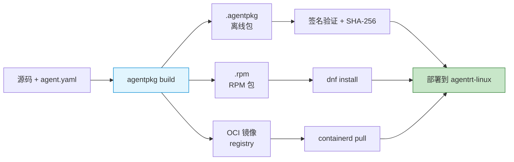
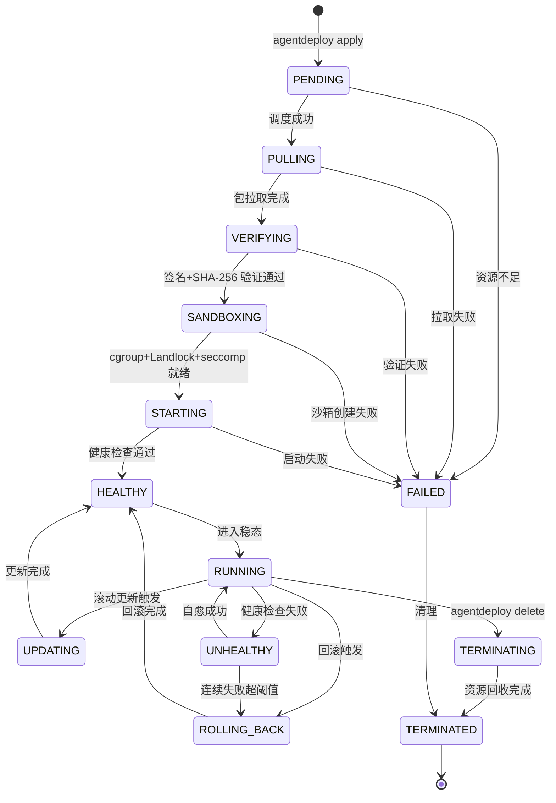
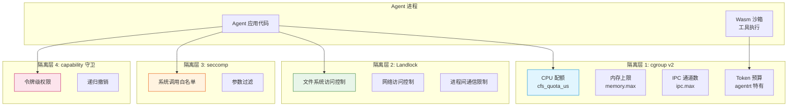
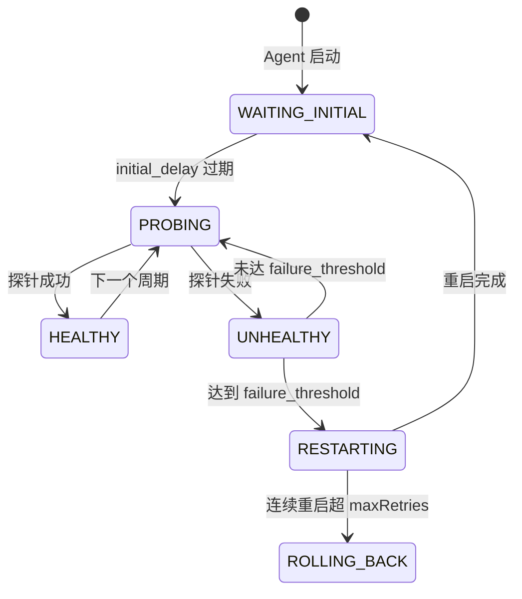
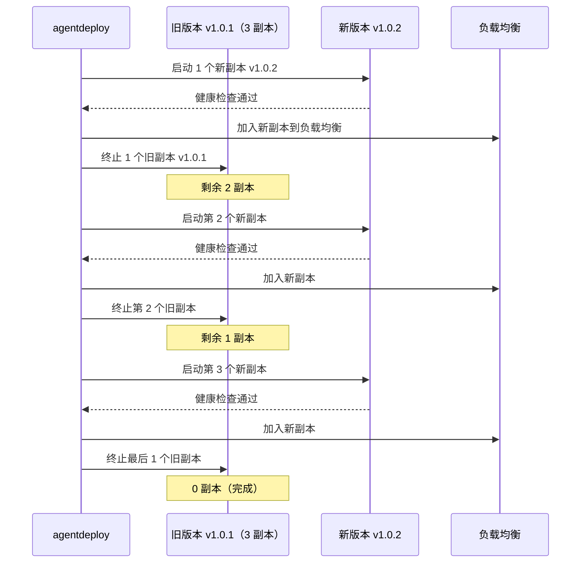
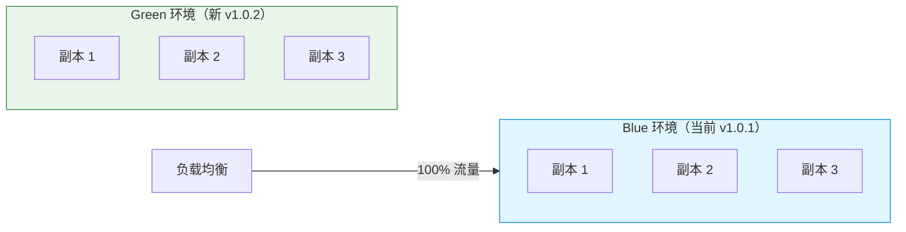
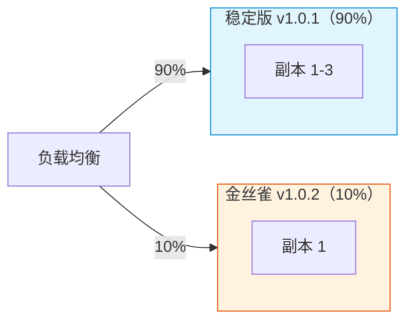
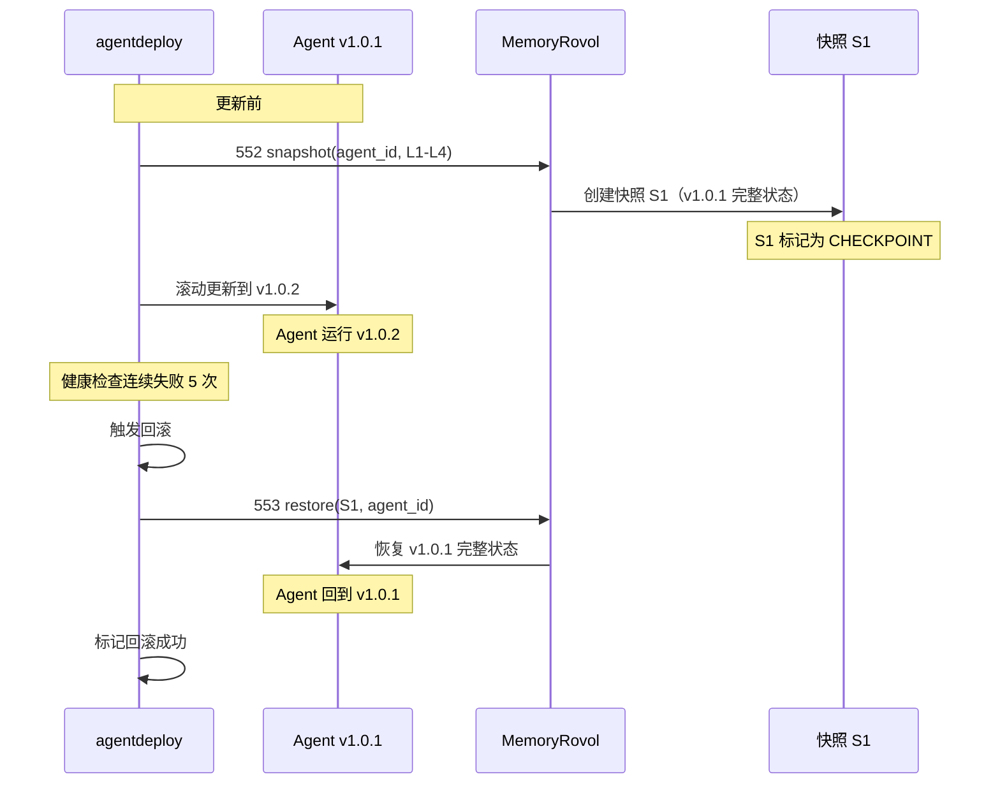
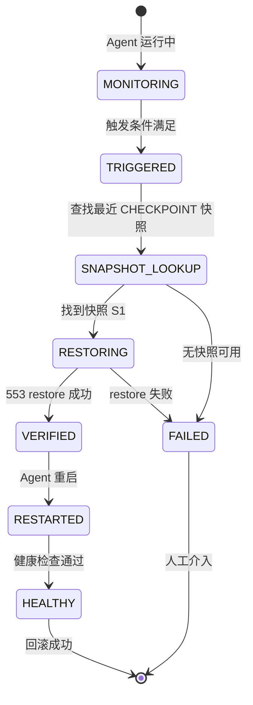

Copyright (c) 2025-2026 SPHARX Ltd. All Rights Reserved.

# Agent 部署与运行契约
> **文档定位**：agentrt-linux（AirymaxOS）Agent 应用的完整部署与运行工程契约，定义 Agent 包格式、清单规范、部署状态机、运行时沙箱、健康检查、滚动更新、回滚机制与资源配额\
> **文档版本**：0.1.1\
> **最后更新**： 2026-07-21\
> **上级文档**：[agentrt-linux 设计文档](README.md)\
> **同源映射**：agentrt gateway（Agent 网关）+ Linux 6.6 容器与进程模型 + OCI 镜像标准 + Kubernetes CRD + seL4 isolation\
> **文档性质**：实现方案文档（非设计文档）。本契约在 [01-agent-lifecycle.md](01-agent-lifecycle.md) Agent 生命周期管理与 [190-distribution/README.md](../190-distribution/README.md) Agent 应用商店设计的基础上，补充完整的部署、打包、分发与运行模型\
> **设计参考**：Linux 6.6 `kernel/cgroup/cgroup-v2.c`（资源隔离）+ `security/landlock/`（用户态沙箱）+ OCI image spec v1.1 + Kubernetes 1.30 + CRIU（进程迁移）+ seL4 `src/object/tcb.c`（线程隔离）

---

## 1. 概述

### 1.1 为什么需要此契约

Agent 部署是 agentrt-linux 区别于通用操作系统的另一核心特征——它将"Agent"作为一等公民进行部署管理，而非传统的进程或容器。Agent 部署涉及的设计已分散在 [01-agent-lifecycle.md](01-agent-lifecycle.md)（生命周期）、[150-cloudnative/README.md](../150-cloudnative/README.md)（容器化）、[190-distribution/README.md](../190-distribution/README.md)（RPM 分发）中。

本契约文档作为**部署层 SSoT**（Single Source of Truth），收口以下问题：

| 问题 | 当前状态 | 本契约解决方式 |
|------|---------|---------------|
| Agent 包格式不明 | 190-distribution 仅提"RPM 分发" | 定义完整 Agent 包格式（`.agentpkg` + OCI 镜像） |
| 部署清单缺失 | 150-cloudnative 仅给 CRD 示例片段 | 定义完整 Agent 清单 YAML Schema |
| 部署状态机不明 | 01-agent-lifecycle 仅覆盖运行态 | 定义完整 9 状态部署生命周期 |
| 健康检查契约缺失 | 无文档定义 liveness/readiness 协议 | 定义统一健康检查协议 |
| 滚动更新策略不清 | 190-distribution 仅提"原子更新" | 定义 blue-green/canary/rolling 三策略 |
| 回滚机制不明 | 190-distribution 仅提"Btrfs 快照" | 定义基于 MemoryRovol 快照的应用层回滚 |
| 资源配额分散 | Token 在 04、Memory 在 05、CPU/Mem 无定义 | 统一为 4 维资源配额契约 |

### 1.2 与设计文档的关系

本契约**不修改**已有设计文档，仅作为实现层补充：

| 设计文档 | 本契约的关系 |
|---------|------------|
| [01-agent-lifecycle.md](01-agent-lifecycle.md) | 8 状态运行生命周期的前置——部署生命周期 |
| [150-cloudnative/README.md](../150-cloudnative/README.md) | L5-L7 容器化扩展的细化 |
| [190-distribution/README.md](../190-distribution/README.md) | L5 Agent 应用商店的实现 |
| [110-security/02-landlock-sandbox.md](../110-security/02-landlock-sandbox.md) | 运行时沙箱的具体应用 |
| [110-security/03-capability-model.md](../110-security/03-capability-model.md) | capability 守卫在部署中的应用 |
| [04-token-budget.md](04-token-budget.md) | Token 预算作为资源配额维度 |
| [05-memory-rovol-api.md](05-memory-rovol-api.md) | MemoryRovol 作为资源配额维度 |

### 1.3 设计目标

1. **声明式部署**：Agent 通过清单描述期望状态，系统自动收敛（对齐 K8s 声明式模型）
2. **不可变基础设施**：Agent 包不可变，配置与代码分离，支持任意版本回滚
3. **多形态部署**：原生进程、容器、K8s CRD 三种形态共享同一套 SDK 与契约
4. **零停机更新**：滚动更新支持 blue-green/canary/rolling 三策略
5. **故障自愈**：健康检查失败自动重启，连续失败自动回滚
6. **资源隔离**：4 维资源配额（Token / Memory / CPU / IPC）确保 Agent 间隔离
7. **安全沙箱**：cgroup v2 + Landlock + seccomp + Wasm 四重隔离

### 1.4 在五维原则中的位置

| 原则 | 在 Agent 部署的体现 |
|------|-------------------|
| **K-1 内核极简** | 部署编排器在用户态（`agentdeploy_d`），内核仅提供机制 |
| **K-2 接口契约化** | Agent 清单 YAML Schema + 包格式规范 |
| **K-3 服务隔离** | cgroup v2 + Landlock + capability 三重隔离 |
| **K-4 可插拔策略** | 调度策略、遗忘策略、健康检查策略可运行时替换 |
| **E-1 安全内生** | 包签名 + capability 守卫 + 沙箱隔离 + 审计 |
| **E-6 错误可追溯** | 部署事件全链路追踪 + 审计日志 |
| **S-4 涌现性管理** | 多 Agent 协同部署涌现行为管理 |

---

## 2. Agent 包格式

### 2.1 包格式总览

Agent 应用以两种等价格式分发：

| 格式 | 扩展名 | 适用场景 | 构建工具 |
|------|--------|---------|---------|
| **RPM 包** | `.rpm` | 系统级安装（dnf） | `rpmbuild` |
| **OCI 镜像** | `.tar` 或 registry | 容器化部署（containerd/K8s） | `buildah` / `docker build` |
| **Agent 包** | `.agentpkg` | 离线分发 + 校验 | `agentpkg build` |

三种格式共享同一份 Agent 清单（`agent.yaml`），通过工具链转换：



**图 1**：Agent 包构建与分发流程。三种格式共享 `agent.yaml` 清单，通过 `agentpkg` 工具链统一构建。

### 2.2 Agent 包结构（.agentpkg）

`.agentpkg` 是 tar.gz 归档，结构如下：

```
my-agent-1.0.1.agentpkg
├── agent.yaml              # Agent 清单（必需）
├── manifest.sig            # 清单签名（GPG/SM2）
├── manifest.sha256         # 清单 SHA-256
├── payload/               # 二进制负载
│   ├── bin/                # 可执行文件
│   │   └── cognition-agent
│   ├── lib/                # 库文件
│   │   └── libagentrt.so
│   ├── wasm/               # Wasm 模块（沙箱执行）
│   │   └── tools.wasm
│   └── models/             # 模型文件
│       └── embedding-768.bin
├── configs/                # 默认配置
│   ├── token-budget.yaml
│   └── memory-rovol.yaml
├── schemas/                # 配置 Schema
│   └── token-budget.schema.json
└── METADATA                # 包元数据（构建信息）
    ├── build_timestamp
    ├── builder_version
    ├── source_revision
    └── os_target
```

### 2.3 OCI 镜像扩展标签

基于 OCI Image Spec v1.1，agentrt-linux 扩展以下标签（对齐 [150-cloudnative/README.md](../150-cloudnative/README.md) 第 4.1 节）：

```yaml
# OCI 镜像 config 的 annotations 字段
annotations:
  airymaxos.agent.version: "1.0.1"
  airymaxos.agent.token-budget: "1000000"
  airymaxos.agent.memory-rovol: "L1,L2,L3,L4"
  airymaxos.agent.scheduler: "stc_agent"
  airymaxos.agent.cognition-cycle: "CoreLoopThree"
  airymaxos.agent.min-kernel: "1.0.1"
  airymaxos.agent.capabilities: "CAP_ROVOL_SNAPSHOT,CAP_IPC_SEND"
  airymaxos.agent.wasm-modules: "tools.wasm,search.wasm"
```

### 2.4 RPM 包 spec 模板

对齐 [190-distribution/01-rpm-packaging.md](../190-distribution/01-rpm-packaging.md)，Agent RPM 包 spec 模板：

```spec
# my-agent.spec
Name:    my-agent
Version: 1.0.1
Release: 1%{?dist}
Summary: Cognition Agent for agentrt-linux
License: AGPLv3+

# 依赖 agentrt-linux SDK
Requires: airymaxos-sdk-python >= 1.0.1
Requires: airymaxos-memory >= 1.0.1
Requires: airymaxos-cognition >= 1.0.1

# Agent 专属依赖
Requires(post): airymaxos-agentdeploy >= 1.0.1

%description
Cognition Agent with CoreLoopThree cognitive cycle.

%prep
%setup -q

%build
# Agent 二进制构建
make CFLAGS="-O2 -Wall"

%install
# 安装到 /opt/airymaxos/agents/{name}/{version}/
install -d %{buildroot}/opt/airymaxos/agents/my-agent/1.0.1/
install -m 755 cognition-agent %{buildroot}/opt/airymaxos/agents/my-agent/1.0.1/
install -m 644 agent.yaml %{buildroot}/opt/airymaxos/agents/my-agent/1.0.1/

%post
# 注册到 Agent 部署系统
agentdeploy register /opt/airymaxos/agents/my-agent/1.0.1/agent.yaml

%preun
# 注销
agentdeploy unregister my-agent

%files
/opt/airymaxos/agents/my-agent/1.0.1/cognition-agent
/opt/airymaxos/agents/my-agent/1.0.1/agent.yaml
```

---

## 3. Agent 清单规范

### 3.1 清单 YAML Schema

`agent.yaml` 是 Agent 的声明式清单，描述期望状态。借鉴 Kubernetes Manifest + Helm values 的模式：

```yaml
# agent.yaml —— Agent 声明式清单
apiVersion: agent.airymaxos.dev/v1
kind: Agent
metadata:
  name: cognition-agent-01
  version: "1.0.1"
  labels:
    app: cognition
    tier: production
spec:
  # === 镜像与负载 ===
  image: registry.airymaxos.dev/cognition:v1.0.1
  # 或本地路径
  # payload: /opt/airymaxos/agents/my-agent/1.0.1/
  entrypoint: /usr/bin/cognition-agent
  args: ["--config", "/etc/agent/config.yaml"]

  # === 资源配额（4 维） ===
  resources:
    token:
      budget: 1000000          # 每周期 Token 上限
      refillRate: 1000         # 补充速率 tokens/ms
      warningThreshold: 20     # 警告阈值（%）
      criticalThreshold: 5     # 临界阈值（%）
    memory:
      memoryRovol: true        # 启用 MemoryRovol
      layers: [L1, L2, L3, L4] # 启用层级
      l1TtlMs: 3600000         # L1 TTL（1 小时）
      l2PromotionThreshold: 5  # L1→L2 晋升阈值
      l3ConsolidationInterval: 300  # L3 巩固间隔（秒）
    cpu:
      cfsQuotaUs: 100000       # CFS 配额（100ms）
      cfsPeriodUs: 100000     # CFS 周期（100ms）
      cpuset: "0-3"            # CPU 亲和性
    memory:
      limit: 4Gi               # 内存上限
      swapLimit: 1Gi           # swap 上限
      kernelLimit: 512Mi       # 内核内存上限
    ipc:
      maxChannels: 32          # 最大 IPC 通道数
      maxMessageSize: 65536    # 最大消息大小

  # === 调度 ===
  scheduler:
    policy: stc_agent                   # stc_agent 策略（sched_tac）
    priority: 100             # 优先级（0-139）
    nodeSelector:
      airymaxos.dev/cxl: "true"  # 要求 CXL 节点

  # === 安全沙箱 ===
  security:
    sandbox:
      landlock:
        enabled: true
        rules:
          - path: /opt/agent/data
            access: rw
          - path: /opt/agent/logs
            access: w
      seccomp:
        enabled: true
        profile: /etc/agent/seccomp.json
      wasm:
        enabled: true
        modules: [tools.wasm, search.wasm]
    capabilities:
      request:
        - CAP_ROVOL_SNAPSHOT
        - CAP_ROVOL_RESTORE
        - CAP_IPC_SEND
        - CAP_IPC_RECV
      drop:
        - CAP_SYS_ADMIN       # 显式移除危险 capability

  # === 认知循环 ===
  cognition:
    cycle: CoreLoopThree
    system1TimeoutMs: 100      # System 1 快思考超时
    system2TimeoutMs: 5000     # System 2 慢思考超时
    perceptionInterval: 1000   # 感知间隔（ms）

  # === 健康检查 ===
  healthCheck:
    liveness:
      type: exec               # exec / http / ipc
      command: ["/usr/bin/agent-health", "liveness"]
      initialDelaySeconds: 10
      periodSeconds: 30
      timeoutSeconds: 5
      failureThreshold: 3
    readiness:
      type: ipc
      message:
        type: READINESS_PROBE
      initialDelaySeconds: 5
      periodSeconds: 10
      timeoutSeconds: 2
      failureThreshold: 3

  # === 部署策略 ===
  deployment:
    replicas: 3                # 副本数
    strategy: rolling          # rolling / blue-green / canary
    rollingUpdate:
      maxUnavailable: 1
      maxSurge: 1
    canary:
      weight: 10              # 10% 流量
      duration: 300s          # 持续时间
    restartPolicy:
      onFailure: true
      maxRetries: 3
      backoffSeconds: 30

  # === 回滚策略 ===
  rollback:
    enabled: true
    trigger:
      healthFailureCount: 5   # 连续健康检查失败次数
      errorRateThreshold: 0.1  # 错误率阈值（10%）
      latencyThresholdMs: 5000 # 延迟阈值
    snapshotBeforeUpdate: true # 更新前创建 MemoryRovol 快照
    maxHistory: 5             # 保留最近 5 个版本

  # === 可观测性 ===
  observability:
    metrics:
      enabled: true
      port: 9090
      path: /metrics
    tracing:
      enabled: true
      endpoint: http://otel-collector:4317
    logging:
      level: INFO
      format: json
      destination: journald
```

### 3.2 清单校验

清单提交时经过以下校验（借鉴 K8s admission webhook 模式）：

| 校验阶段 | 检查项 | 失败行为 |
|---------|--------|---------|
| 1. Schema 校验 | YAML 符合 Schema | 拒绝，返回 Schema 错误 |
| 2. 依赖校验 | `image` 或 `payload` 必须存在 | 拒绝 |
| 3. 资源配额校验 | Token/Memory/CPU/IPC 配额合理 | 拒绝 |
| 4. 安全校验 | capability 请求合法 | 拒绝 |
| 5. 签名校验 | `manifest.sig` 验证通过 | 拒绝 |
| 6. 兼容性校验 | `min-kernel` 满足当前内核版本 | 拒绝 |
| 7. 重复校验 | `name` + `version` 不冲突 | 拒绝 |

---

## 4. 部署生命周期

### 4.1 部署状态机

Agent 部署经历 9 个状态，借鉴 Kubernetes Pod 生命周期与 seL4 TCB 状态机的组合：



**图 2**：Agent 部署 9 状态生命周期。PENDING/PULLING/VERIFYING/SANDBOXING/STARTING 为部署阶段，HEALTHY/RUNNING/UPDATING/UNHEALTHY 为运行阶段，ROLLING_BACK/TERMINATING/FAILED/TERMINATED 为终态或回收阶段。

**设计决策**：中间态（PULLING/VERIFYING/SANDBOXING/STARTING）借鉴 seL4 的 preemptionPoint 模式——每个阶段可被更高优先级任务抢占，避免长部署阻塞调度器。

### 4.2 各状态详述

| 状态 | 描述 | 触发条件 | 持续时间 |
|------|------|---------|---------|
| **PENDING** | 清单已提交，等待调度 | `agentdeploy apply` | < 1s |
| **PULLING** | 拉取 Agent 包/镜像 | 调度成功 | < 30s（取决于镜像大小） |
| **VERIFYING** | 签名 + SHA-256 校验 | 拉取完成 | < 1s |
| **SANDBOXING** | 创建 cgroup + Landlock + seccomp | 验证通过 | < 100ms |
| **STARTING** | 启动 Agent 进程 + 注册到调度器 | 沙箱就绪 | < 1s |
| **HEALTHY** | 健康检查通过（首次） | 启动完成 | 取决于 `initialDelaySeconds` |
| **RUNNING** | 正常运行，参与 CoreLoopThree | 健康检查通过 | 长期 |
| **UPDATING** | 滚动更新中 | `agentdeploy update` | 取决于策略 |
| **UNHEALTHY** | 健康检查失败 | liveness 失败 | 短暂（自愈或回滚） |
| **ROLLING_BACK** | 回滚到上一版本 | 触发条件满足 | < 10s（MemoryRovol 快照恢复） |
| **TERMINATING** | 清理资源 | `agentdeploy delete` | < 5s |
| **TERMINATED** | 完全终止 | 资源回收完成 | 终态 |
| **FAILED** | 部署失败 | 任何阶段失败 | 等待清理 |

### 4.3 部署工具：`agentdeploy`

`agentdeploy` 是 Agent 部署编排器（用户态 daemon），借鉴 Kubernetes controller-manager 模式：

```bash
# 部署 Agent
agentdeploy apply -f agent.yaml

# 查询部署状态
agentdeploy status cognition-agent-01

# 滚动更新
agentdeploy update cognition-agent-01 --image=v1.0.2 --strategy=rolling

# 回滚
agentdeploy rollback cognition-agent-01 --to-version=v1.0.1

# 删除
agentdeploy delete cognition-agent-01

# 查看历史
agentdeploy history cognition-agent-01
```

---

## 5. 运行时沙箱

### 5.1 四重隔离架构

Agent 运行时受四重隔离保护，借鉴 seL4 capability 隔离 + Linux 容器隔离：



**图 3**：Agent 四重隔离架构。cgroup v2 资源配额、Landlock 文件/网络访问、seccomp 系统调用过滤、capability 令牌级权限。

### 5.2 cgroup v2 层级

每个 Agent 拥有独立的 cgroup v2 层级，借鉴 Linux 6.6 cgroup-v2 统一层级：

```bash
# /sys/fs/cgroup/agentrt/{agent_id}/
agentrt/
├── cognition-agent-01/
│   ├── cpu.max              # 100000 100000（配额/周期）
│   ├── cpu.cpuset.cpus      # 0-3
│   ├── memory.max           # 4294967296（4Gi）
│   ├── memory.swap.max      # 1073741824（1Gi）
│   ├── memory.reclaim       # 主动回收接口
│   ├── pids.max             # 64
│   └── agentrt.token_budget # agentrt 专属（Token 预算）
└── cognition-agent-02/
    └── ...
```

### 5.3 Landlock 规则

对齐 [110-security/02-landlock-sandbox.md](../110-security/02-landlock-sandbox.md)，Agent 的 Landlock 规则从清单的 `security.sandbox.landlock.rules` 生成：

```c
/* agentdeploy 生成的 Landlock 规则 */
struct landlock_ruleset_attr attr = {
    .handled_access_fs =
        LANDLOCK_ACCESS_FS_EXECUTE |
        LANDLOCK_ACCESS_FS_WRITE_FILE |
        LANDLOCK_ACCESS_FS_READ_FILE |
        LANDLOCK_ACCESS_FS_MAKE_DIR,
    .handled_access_net =
        LANDLOCK_ACCESS_NET_BIND_TCP |
        LANDLOCK_ACCESS_NET_CONNECT_TCP,
};

/* 添加文件系统规则 */
struct landlock_path_beneath_attr paths[] = {
    { .allowed_access = LANDLOCK_ACCESS_FS_READ_FILE | LANDLOCK_ACCESS_FS_WRITE_FILE,
      .parent_fd = open("/opt/agent/data", O_PATH) },
    { .allowed_access = LANDLOCK_ACCESS_FS_WRITE_FILE,
      .parent_fd = open("/opt/agent/logs", O_PATH) },
};

/* 限制网络：仅允许连接特定端口 */
landlock_add_rule(ruleset_fd, LANDLOCK_RULE_NET_PORT,
    &(struct landlock_net_port_attr){ .port = 8080 }, 0);
```

### 5.4 seccomp 过滤器

Agent 的 seccomp 过滤器从清单的 `security.sandbox.seccomp.profile` 加载：

```json
{
  "defaultAction": "SCMP_ACT_ERRNO",
  "syscalls": [
    {
      "names": [
        "read", "write", "open", "openat", "close",
        "mmap", "munmap", "mprotect", "brk",
        "rt_sigaction", "rt_sigprocmask", "rt_sigreturn",
        "futex", "sched_yield",
        "airy_sys_task_submit", "airy_sys_task_status",
        "airy_sys_ipc_send", "airy_sys_ipc_recv",
        "airy_sys_rovol_snapshot", "airy_sys_rovol_restore",
        "airy_sys_capability_request",
        "airy_sys_clt_phase_notify"
      ],
      "action": "SCMP_ACT_ALLOW"
    }
  ]
}
```

### 5.5 capability 守卫

对齐 [110-security/03-capability-model.md](../110-security/03-capability-model.md)，Agent 启动时从清单的 `security.capabilities.request` 申请 capability 令牌：

```c
/* agentdeploy 在 Agent 启动前申请 capability */
for (const char *cap_name : manifest.security.capabilities.request) {
    uint32_t cap_id = airy_cap_name_to_id(cap_name);
    int ret = airy_sys_capability_request(cap_id, resource, &cap_handle);
    if (ret < 0) {
        log_error("capability request failed: %s", cap_name);
        goto failed;
    }
    /* 将 cap_handle 注入 Agent 的 CSpace */
    airy_cspace_insert(agent_id, cap_handle);
}
```

---

## 6. 健康检查协议

### 6.1 三类探针

Agent 健康检查借鉴 Kubernetes liveness/readiness/startup probe 模式：

| 探针类型 | 用途 | 失败行为 | 调用频率 |
|---------|------|---------|---------|
| **liveness** | 判断 Agent 是否存活 | 重启 Agent | `periodSeconds` |
| **readiness** | 判断 Agent 是否就绪 | 从负载均衡移除 | `periodSeconds` |
| **startup** | 判断 Agent 是否已启动 | 阻止 liveness 检查 | 启动期间 |

### 6.2 探针类型

```c
/**
 * @brief 健康检查探针类型
 * @since 1.0.1
 */
typedef enum {
    AIRY_PROBE_EXEC   = 0,   /* 执行命令检查退出码 */
    AIRY_PROBE_HTTP   = 1,   /* HTTP GET 检查状态码 */
    AIRY_PROBE_IPC    = 2,   /* AgentsIPC 消息检查响应 */
    AIRY_PROBE_WASM   = 3,   /* Wasm 函数调用检查返回值 */
} airy_probe_type_t;

/**
 * @brief 健康检查探针配置
 * @since 1.0.1
 */
typedef struct airy_probe_config {
    airy_probe_type_t type;
    union {
        struct {
            char command[256];     /* 执行命令 */
            char args[1024];       /* 命令参数 */
        } exec;
        struct {
            char url[256];          /* HTTP URL */
            uint16_t port;          /* 端口 */
            char path[128];         /* 路径 */
            uint16_t expected_code; /* 期望状态码（默认 200） */
        } http;
        struct {
            uint32_t message_type; /* IPC 消息类型 */
            uint32_t timeout_ms;   /* 响应超时 */
        } ipc;
        struct {
            char module[128];       /* Wasm 模块名 */
            char function[128];     /* 函数名 */
        } wasm;
    };
    uint32_t initial_delay_seconds; /* 初始延迟（秒） */
    uint32_t period_seconds;        /* 检查间隔（秒） */
    uint32_t timeout_seconds;       /* 超时（秒） */
    uint32_t failure_threshold;     /* 连续失败阈值 */
    uint32_t success_threshold;      /* 连续成功阈值（readiness 用） */
} airy_probe_config_t;
```

### 6.3 健康检查状态机



**图 4**：健康检查状态机。初始延迟后开始探针，失败达阈值触发重启，连续重启失败触发回滚。

---

## 7. 滚动更新策略

### 7.1 三种更新策略

| 策略 | 描述 | 停机时间 | 回滚速度 | 适用场景 |
|------|------|---------|---------|---------|
| **rolling** | 逐步替换旧版本 | 零停机 | 中（逐个回滚） | 常规更新 |
| **blue-green** | 同时运行新旧，切换流量 | 零停机 | 快（切换流量） | 关键服务 |
| **canary** | 小流量验证，逐步扩大 | 零停机 | 快（停止 canary） | 高风险更新 |

### 7.2 Rolling 策略



**图 5**：Rolling 更新策略。逐步启动新副本、终止旧副本，`maxUnavailable` 和 `maxSurge` 控制速率。

### 7.3 Blue-Green 策略



Blue-Green 策略流程：
1. 部署 Green 环境（v1.0.2），与 Blue 并行
2. Green 健康检查通过后，切换负载均衡：100% 流量 → Green
3. Blue 环境保留（用于快速回滚）
4. 确认稳定后，终止 Blue 环境

### 7.4 Canary 策略



Canary 策略流程：
1. 部署 1 个 Canary 副本（v1.0.2），10% 流量
2. 观察 `duration`（默认 300s），监控错误率、延迟
3. 若指标正常，逐步扩大：10% → 30% → 50% → 100%
4. 若指标异常，立即停止 Canary，回滚到稳定版

---

## 8. 回滚机制

### 8.1 基于 MemoryRovol 快照的回滚

agentrt-linux 的回滚机制基于 [05-memory-rovol-api.md](05-memory-rovol-api.md) 的 MemoryRovol 快照：



**图 6**：基于 MemoryRovol 快照的回滚。更新前创建 CHECKPOINT 快照，回滚时通过 553 restore 恢复。

### 8.2 回滚触发条件

回滚触发条件从清单的 `rollback.trigger` 读取：

| 触发条件 | 默认值 | 说明 |
|---------|--------|------|
| `healthFailureCount` | 5 | 连续健康检查失败次数 |
| `errorRateThreshold` | 0.1 | 错误率阈值（10%） |
| `latencyThresholdMs` | 5000 | P99 延迟阈值 |
| `cpuUsageThreshold` | 0.95 | CPU 使用率阈值 |
| `memoryUsageThreshold` | 0.95 | 内存使用率阈值 |

### 8.3 回滚状态机



---

## 9. 资源配额契约

### 9.1 四维资源配额

Agent 的资源配额分为 4 个维度，借鉴 Kubernetes Resource Requests/Limits + agentrt 扩展：

| 维度 | 配额类型 | 默认值 | 超限行为 |
|------|---------|--------|---------|
| **Token** | 预算 + 补充速率 | 1,000,000 / 1,000 tokens/ms | SUSPENDED（[04-token-budget.md](04-token-budget.md)） |
| **MemoryRovol** | 层级 + TTL | 4 层 + 1h TTL | 遗忘（[05-memory-rovol-api.md](05-memory-rovol-api.md)） |
| **CPU** | CFS 配额 + cpuset | 100ms / 100ms | 限流 |
| **Memory** | 上限 + swap | 4Gi / 1Gi | OOM Kill |
| **IPC** | 通道数 + 消息大小 | 32 / 64KB | `-AIRY_EAGAIN` |

### 9.2 配额声明与执行

```c
/**
 * @brief Agent 资源配额——从清单 spec.resources 解析
 * @since 1.0.1
 */
typedef struct airy_resource_quota {
    /* Token 预算 */
    struct {
        uint32_t budget;
        uint32_t refill_rate;
        uint32_t warning_threshold;
        uint32_t critical_threshold;
    } token;

    /* MemoryRovol */
    struct {
        bool enabled;
        uint32_t layer_mask;       /* AIRY_ROVOL_LAYER_* */
        uint32_t l1_ttl_ms;
        uint32_t l2_promotion_threshold;
        uint32_t l3_consolidation_interval;
    } memory_rovol;

    /* CPU */
    struct {
        uint64_t cfs_quota_us;
        uint64_t cfs_period_us;
        char cpuset[32];
    } cpu;

    /* Memory */
    struct {
        uint64_t limit_bytes;
        uint64_t swap_limit_bytes;
        uint64_t kernel_limit_bytes;
    } memory;

    /* IPC */
    struct {
        uint32_t max_channels;
        uint32_t max_message_size;
    } ipc;
} airy_resource_quota_t;

/**
 * @brief 应用资源配额到 cgroup v2
 * @param agent_id  Agent ID
 * @param quota     资源配额
 * @return 0 成功，<0 AIRY_E* 错误码
 *
 * @par 借鉴来源:
 * - Linux 6.6 cgroup-v2 统一层级
 * - Linux 6.6 cpu.max / memory.max / pids.max
 *
 * @par 实现细节:
 * 1. 创建 /sys/fs/cgroup/agentrt/{agent_id}/
 * 2. 写入 cpu.max、memory.max、pids.max
 * 3. 写入 agentrt.token_budget（agentrt 专属）
 * 4. 创建 MemoryRovol L1-L4 数据结构
 */
AIRY_API int airy_deploy_apply_quota(uint32_t agent_id,
                                           const airy_resource_quota_t *quota);
```

---

## 10. `agentdeploy` 命令行接口

### 10.1 命令清单

```bash
# 部署相关
agentdeploy apply -f <manifest>           # 部署/更新 Agent
agentdeploy update <name> [flags]         # 滚动更新
agentdeploy rollback <name> [flags]       # 回滚
agentdeploy delete <name>                 # 删除 Agent

# 查询相关
agentdeploy status <name>                 # 查询状态
agentdeploy list [--filter]               # 列出所有 Agent
agentdeploy history <name>                # 查看历史版本
agentdeploy logs <name> [--follow]        # 查看日志

# 调试相关
agentdeploy exec <name> <command>          # 在 Agent 内执行命令
agentdeploy inspect <name>                 # 检查清单与运行时状态
agentdeploy port-forward <name> <port>    # 端口转发

# 包管理
agentdeploy package <dir> -o <out>        # 构建 .agentpkg
agentdeploy verify <pkg>                  # 验证签名
agentdeploy sign <manifest> --key <key>    # 签名清单
```

### 10.2 `apply` 命令

```bash
# 部署新 Agent
agentdeploy apply -f agent.yaml

# 干运行（仅校验，不实际部署）
agentdeploy apply -f agent.yaml --dry-run

# 指定命名空间
agentdeploy apply -f agent.yaml --namespace=production

# 等待部署完成
agentdeploy apply -f agent.yaml --wait --timeout=300s
```

### 10.3 `update` 命令

```bash
# 滚动更新到新版本
agentdeploy update cognition-agent-01 --image=v1.0.2

# 指定策略
agentdeploy update cognition-agent-01 --image=v1.0.2 --strategy=canary --weight=10

# 立即更新（不等待健康检查）
agentdeploy update cognition-agent-01 --image=v1.0.2 --no-wait
```

### 10.4 `rollback` 命令

```bash
# 回滚到上一版本
agentdeploy rollback cognition-agent-01

# 回滚到指定版本
agentdeploy rollback cognition-agent-01 --to-version=v1.0.1

# 回滚到最近 CHECKPOINT 快照
agentdeploy rollback cognition-agent-01 --to-last-checkpoint
```

---

## 11. SDK 集成

### 11.1 Python SDK

```python
# agentrt-python/agentrt/deploy.py

from .bindings import _libagentrt
from .exceptions import AgentrtError

class AgentDeployClient:
    """Agent 部署客户端。

    封装 agentdeploy 操作，提供类型安全的 Python 接口。
    """

    def apply(self, manifest_path: str, wait: bool = True,
              timeout: int = 300) -> str:
        """部署 Agent（agentdeploy apply）。

        :param manifest_path: agent.yaml 路径
        :param wait: 是否等待部署完成
        :param timeout: 超时（秒）
        :return: Agent 名称
        :raises AgentrtError: 部署失败
        """
        flags = 0x01 if wait else 0x00
        name_buf = ctypes.create_string_buffer(256)
        ret = _libagentrt.airy_deploy_apply(
            manifest_path.encode(), flags, timeout, name_buf, 256)
        if ret < 0:
            raise AgentrtError(ret, f"apply failed: {manifest_path}")
        return name_buf.value.decode()

    def update(self, name: str, image: str,
               strategy: str = "rolling") -> None:
        """滚动更新 Agent。"""
        strategy_map = {"rolling": 0, "blue-green": 1, "canary": 2}
        ret = _libagentrt.airy_deploy_update(
            name.encode(), image.encode(),
            strategy_map.get(strategy, 0))
        if ret < 0:
            raise AgentrtError(ret, f"update failed: {name}")

    def rollback(self, name: str, to_version: str = None) -> None:
        """回滚 Agent。"""
        version = to_version.encode() if to_version else b""
        ret = _libagentrt.airy_deploy_rollback(name.encode(), version)
        if ret < 0:
            raise AgentrtError(ret, f"rollback failed: {name}")

    def status(self, name: str) -> dict:
        """查询 Agent 部署状态。"""
        status_buf = ctypes.create_string_buffer(4096)
        ret = _libagentrt.airy_deploy_status(
            name.encode(), status_buf, 4096)
        if ret < 0:
            raise AgentrtError(ret, f"status failed: {name}")
        import json
        return json.loads(status_buf.value.decode())

    def delete(self, name: str) -> None:
        """删除 Agent。"""
        ret = _libagentrt.airy_deploy_delete(name.encode())
        if ret < 0:
            raise AgentrtError(ret, f"delete failed: {name}")
```

### 11.2 Rust SDK

```rust
// agentrt-rust/src/deploy.rs

use crate::error::{AgentrtError, Result};
use crate::bindings::*;

/// Agent 部署客户端
pub struct AgentDeployClient;

impl AgentDeployClient {
    /// 部署 Agent（agentdeploy apply）
    pub fn apply(manifest_path: &str, wait: bool, timeout: u32) -> Result<String> {
        let flags = if wait { 0x01u32 } else { 0x00 };
        let mut name_buf = [0i8; 256];
        let ret = unsafe {
            airy_deploy_apply(
                manifest_path.as_ptr(),
                flags, timeout,
                name_buf.as_mut_ptr(), 256,
            )
        };
        if ret < 0 {
            return Err(AgentrtError::from_errno(ret));
        }
        Ok(c_str_to_string(&name_buf))
    }

    /// 滚动更新 Agent
    pub fn update(name: &str, image: &str, strategy: UpdateStrategy) -> Result<()> {
        let ret = unsafe {
            airy_deploy_update(name.as_ptr(), image.as_ptr(), strategy as u32)
        };
        if ret < 0 {
            return Err(AgentrtError::from_errno(ret));
        }
        Ok(())
    }

    /// 回滚 Agent
    pub fn rollback(name: &str, to_version: Option<&str>) -> Result<()> {
        let version = to_version.unwrap_or("");
        let ret = unsafe {
            airy_deploy_rollback(name.as_ptr(), version.as_ptr())
        };
        if ret < 0 {
            return Err(AgentrtError::from_errno(ret));
        }
        Ok(())
    }
}

/// 更新策略
#[repr(u32)]
pub enum UpdateStrategy {
    Rolling = 0,
    BlueGreen = 1,
    Canary = 2,
}
```

---

## 12. 性能约束

### 12.1 部署性能指标

| 操作 | 目标延迟 | P99 延迟 | 说明 |
|------|---------|---------|------|
| `apply`（小包，< 100MB） | < 5s | < 10s | 拉取 + 验证 + 沙箱 + 启动 |
| `apply`（大包，~1GB） | < 30s | < 60s | OCI 镜像拉取 |
| `update` rolling | < 60s | < 120s | 3 副本逐步替换 |
| `update` blue-green | < 10s | < 30s | 并行部署 + 切换 |
| `rollback` | < 10s | < 30s | MemoryRovol 快照恢复 |
| `delete` | < 5s | < 10s | 资源回收 |
| `status` | < 10ms | < 50ms | 状态查询 |

### 12.2 资源开销

| 组件 | 内存开销 | CPU 开销 |
|------|---------|---------|
| `agentdeploy_d` daemon | < 50MB | < 1% |
| 每个 Agent 元数据 | < 10KB | - |
| 健康检查（每探针） | < 1KB | < 0.01% |
| 滚动更新控制器 | < 20MB | < 0.5% |

---

## 13. 安全考量

### 13.1 包签名验证

所有 Agent 包必须签名验证，借鉴 Linux 6.6 模块签名机制：

```bash
# 生成签名密钥
gpg --gen-key

# 签名 Agent 清单
agentdeploy sign agent.yaml --key ~/.gnupg/agent-signing.key

# 验证签名
agentdeploy verify my-agent-1.0.1.agentpkg
```

### 13.2 capability 最小权限

Agent 清单的 `security.capabilities` 遵循最小权限原则：

| 规则 | 说明 |
|------|------|
| 显式请求 | 所有 capability 必须在 `request` 中显式列出 |
| 显式拒绝 | `drop` 列出禁止的 capability（即使 request 中有也拒绝） |
| 最小集 | 默认不授予任何 capability，需逐个申请 |
| 审计 | 所有 capability 请求记录审计日志 |

### 13.3 审计日志

以下事件必须记录审计日志：

| 事件 | 级别 | 说明 |
|------|------|------|
| `apply` 成功 | INFO | Agent 部署成功 |
| `apply` 失败 | WARN | 部署失败（可能配置错误） |
| `update` 触发 | INFO | 滚动更新触发 |
| `rollback` 触发 | WARN | 回滚触发（可能故障） |
| `delete` | INFO | Agent 删除 |
| 签名验证失败 | ERROR | 可能的供应链攻击 |
| capability 拒绝 | WARN | 可能的权限提升尝试 |
| 沙箱逃逸检测 | FATAL | 严重安全事件 |

---

## 14. IRON-9 v3 同源映射

### 14.1 同源关系

Agent 部署体系与 agentrt 用户态 `gateway_d` daemon 同源：

| 维度 | agentrt gateway_d | agentrt-linux agentdeploy | 同源标注 |
|------|-------------------|--------------------------|---------|
| 部署编排 | 用户态进程编排 | OS 级 Agent 编排 | [SS] 语义同源 |
| 包格式 | 用户态 zip | RPM + OCI + .agentpkg | [IND] 独立实现 |
| 资源配额 | 用户态估算 | cgroup v2 精确控制 | [IND] 升级 |
| 沙箱 | 进程级 | cgroup + Landlock + seccomp + capability | [IND] 升级 |
| 健康检查 | 用户态心跳 | exec/http/ipc/wasm 多探针 | [SS] 语义同源 |
| 回滚 | 用户态版本切换 | MemoryRovol 快照恢复 | [IND] 升级 |

### 14.2 [SS] 语义同源层

| 序号 | agentrt API | agentrt-linux API | 语义 |
|------|-------------|-------------------|------|
| 1 | `gateway.deploy()` | `agentdeploy apply` | 部署 Agent |
| 2 | `gateway.update()` | `agentdeploy update` | 更新 Agent |
| 3 | `gateway.rollback()` | `agentdeploy rollback` | 回滚 Agent |
| 4 | `gateway.status()` | `agentdeploy status` | 查询状态 |

---

## 15. 使用示例

### 15.1 完整部署流程

```bash
#!/bin/bash
# deploy-agent.sh —— 完整 Agent 部署示例

set -e

AGENT_NAME="cognition-agent-01"
AGENT_VERSION="1.0.1"

# 1. 构建 Agent 包
echo "=== Building Agent package ==="
agentdeploy package ./my-agent/ -o ${AGENT_NAME}-${AGENT_VERSION}.agentpkg

# 2. 签名
echo "=== Signing package ==="
agentdeploy sign agent.yaml --key ~/.gnupg/agent-signing.key

# 3. 验证
echo "=== Verifying signature ==="
agentdeploy verify ${AGENT_NAME}-${AGENT_VERSION}.agentpkg

# 4. 部署
echo "=== Deploying Agent ==="
agentdeploy apply -f agent.yaml --wait --timeout=300s

# 5. 查询状态
echo "=== Checking status ==="
agentdeploy status ${AGENT_NAME}

# 6. 查看日志
echo "=== Viewing logs ==="
agentdeploy logs ${AGENT_NAME} --follow
```

### 15.2 滚动更新与回滚

```bash
#!/bin/bash
# update-and-rollback.sh

AGENT_NAME="cognition-agent-01"

# 1. 记录当前版本
CURRENT=$(agentdeploy status ${AGENT_NAME} | jq -r '.version')
echo "Current version: ${CURRENT}"

# 2. 滚动更新到 v1.0.2
echo "=== Rolling update to v1.0.2 ==="
agentdeploy update ${AGENT_NAME} --image=v1.0.2 --strategy=rolling

# 3. 等待并观察
sleep 60

# 4. 检查健康状态
HEALTH=$(agentdeploy status ${AGENT_NAME} | jq -r '.health')
if [ "$HEALTH" != "HEALTHY" ]; then
    echo "=== Health check failed, rolling back ==="
    agentdeploy rollback ${AGENT_NAME} --to-version=${CURRENT}
fi
```

### 15.3 Canary 部署

```bash
#!/bin/bash
# canary-deploy.sh

AGENT_NAME="cognition-agent-01"

# 1. Canary 部署（10% 流量）
echo "=== Canary deploy (10% traffic) ==="
agentdeploy update ${AGENT_NAME} --image=v1.0.2 --strategy=canary --weight=10

# 2. 观察 5 分钟
echo "=== Observing for 5 minutes ==="
sleep 300

# 3. 检查错误率
ERROR_RATE=$(agentdeploy status ${AGENT_NAME} | jq -r '.canary.errorRate')
if (( $(echo "$ERROR_RATE > 0.05" | bc -l) )); then
    echo "=== Error rate too high, stopping canary ==="
    agentdeploy rollback ${AGENT_NAME}
else
    echo "=== Canary healthy, expanding to 50% ==="
    agentdeploy update ${AGENT_NAME} --image=v1.0.2 --strategy=canary --weight=50
    sleep 300

    echo "=== Expanding to 100% ==="
    agentdeploy update ${AGENT_NAME} --image=v1.0.2 --strategy=rolling
fi
```

---

## 16. 测试策略

### 16.1 测试分层

| 测试层 | 覆盖范围 | 工具 | 示例 |
|--------|---------|------|------|
| **单元测试** | 清单解析、配额计算、状态机 | pytest + KUnit | 清单 YAML Schema 校验 |
| **集成测试** | 完整 apply → update → rollback 流程 | kselftest + shell 脚本 | 部署 → 更新 → 回滚全流程 |
| **压力测试** | 大量 Agent 并发部署 | stress-ng + 自定义负载 | 1000 Agent 并发 apply |
| **故障注入** | 健康检查失败、沙箱逃逸 | chaos engineering | kill Agent 进程，验证自愈 |
| **回滚测试** | 各种回滚触发条件 | 自动化测试 | 错误率超阈值触发回滚 |
| **安全测试** | 签名绕过、capability 提权 | 安全扫描工具 | 篡改包签名，验证拒绝 |

### 16.2 关键测试用例

```python
# test_deploy.py —— pytest 集成测试

import pytest
from agentrt import AgentDeployClient

class TestAgentDeploy:
    def setup_method(self):
        self.client = AgentDeployClient()

    def test_apply_basic(self):
        """测试基本部署"""
        name = self.client.apply("test-fixtures/agent.yaml", wait=True, timeout=60)
        assert name == "test-agent"

        status = self.client.status(name)
        assert status["state"] == "RUNNING"
        assert status["health"] == "HEALTHY"

        # 清理
        self.client.delete(name)

    def test_rolling_update(self):
        """测试滚动更新"""
        # 部署 v1.0.1
        name = self.client.apply("test-fixtures/agent-v1.yaml", wait=True)

        # 更新到 v1.0.2
        self.client.update(name, "v1.0.2", strategy="rolling")

        # 验证版本
        status = self.client.status(name)
        assert status["version"] == "1.0.2"

        self.client.delete(name)

    def test_rollback_on_failure(self):
        """测试健康检查失败触发回滚"""
        # 部署健康版本
        name = self.client.apply("test-fixtures/healthy-agent.yaml", wait=True)

        # 更新到不健康版本
        self.client.update(name, "unhealthy-v1.0.2")

        # 等待回滚触发
        import time
        time.sleep(120)  # 等待 healthFailureCount * periodSeconds

        # 验证已回滚
        status = self.client.status(name)
        assert status["state"] == "RUNNING"
        assert status["version"] == "1.0.1"  # 回滚到原版本

        self.client.delete(name)

    def test_resource_quota_enforcement(self):
        """测试资源配额强制执行"""
        name = self.client.apply("test-fixtures/high-cpu-agent.yaml", wait=True)

        # 验证 cgroup 配额
        with open(f"/sys/fs/cgroup/agentrt/{name}/cpu.max") as f:
            cpu_max = f.read().strip()
        assert cpu_max == "100000 100000"  # 配额/周期

        self.client.delete(name)
```

---

## 17. 相关文档

### 17.1 设计文档（不修改）

- [01-agent-lifecycle.md](01-agent-lifecycle.md)——Agent 生命周期管理（运行态 8 状态）
- [150-cloudnative/README.md](../150-cloudnative/README.md)——云原生 Agent 部署设计
- [190-distribution/README.md](../190-distribution/README.md)——发行版管理设计（Agent 应用商店）
- [110-security/02-landlock-sandbox.md](../110-security/02-landlock-sandbox.md)——Landlock 用户态沙箱
- [20-modules/07-system.md](../20-modules/07-system.md)——系统子仓设计

### 17.2 实现方案文档（本系列）

- [04-token-budget.md](04-token-budget.md)——Token 预算契约（资源配额维度 1）
- [05-memory-rovol-api.md](05-memory-rovol-api.md)——记忆卷载 API（资源配额维度 2 + 回滚基础）
- [110-security/03-capability-model.md](../110-security/03-capability-model.md)——Capability 安全模型（沙箱维度 4）
- [07-syscall-registry.md](07-syscall-registry.md)——系统调用编号 SSoT 注册表

---

## 18. 五维原则映射

| 原则 | 在 Agent 部署的体现 |
|------|-------------------|
| **K-1 内核极简** | 部署编排器在用户态（`agentdeploy_d`），内核仅提供 cgroup/Landlock 机制 |
| **K-2 接口契约化** | Agent 清单 YAML Schema + 包格式规范 + CLI 契约 |
| **K-3 服务隔离** | cgroup v2 + Landlock + seccomp + capability 四重隔离 |
| **K-4 可插拔策略** | 调度策略、健康检查策略、更新策略可运行时替换 |
| **E-1 安全内生** | 包签名 + capability 守卫 + 沙箱隔离 + 审计日志 |
| **E-6 错误可追溯** | 部署事件全链路追踪 + 审计日志 |
| **E-7 文档即代码** | 清单 YAML 即代码，与代码同源同审 |
| **S-4 涌现性管理** | 多 Agent 协同部署涌现行为管理 |
| **IRON-9 v3 同源且部分代码共享** | 与 agentrt gateway_d 同源（[SS] 语义同源） |

---

## 19. 文档变更记录

| 版本 | 日期 | 变更内容 | 变更人 |
|------|------|---------|--------|
| 0.1.1 | 2026-07-09 | 初始版本，定义 Agent 包格式、清单规范、9 状态部署生命周期、四重沙箱隔离、三类健康检查探针、三种滚动更新策略、MemoryRovol 快照回滚、4 维资源配额、agentdeploy CLI、四语言 SDK 集成、测试策略 | 工程规范委员会 |

---

> **文档结束** | 0.1.1 实现方案文档 | 声明式部署 + 不可变基础设施 + 多形态 + 零停机更新 + 故障自愈 + 四重隔离
