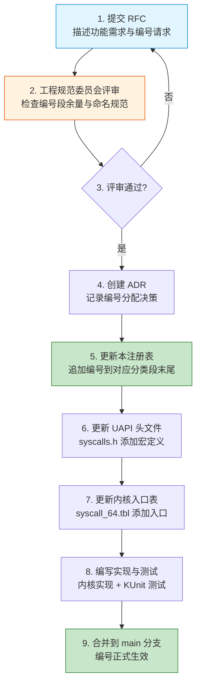

Copyright (c) 2025-2026 SPHARX Ltd. All Rights Reserved.

# Agent 系统调用编号注册表（SSoT）
> **文档定位**：agentrt-linux（AirymaxOS）专用系统调用编号的唯一权威注册表（Single Source of Truth），统一编号分配、命名前缀、ABI 稳定性约束、UAPI 头文件模板与注册审批流程\
> **文档版本**：0.1.1\
> **最后更新**： 2026-07-21\
> **上级文档**：[agentrt-linux 设计文档](README.md)\
> **同源映射**：Linux 6.6 `include/uapi/asm-generic/unistd.h`（编号注册表）+ seL4 `libsel4/include/api/syscall.xml`（接口契约代码生成）\
> **文档性质**：实现方案文档（非设计文档）。本注册表不替代 [30-interfaces/01-syscalls.md](../30-interfaces/01-syscalls.md) 的接口设计与 [50-engineering-standards/20-contracts/contracts.md](../50-engineering-standards/20-contracts/contracts.md) 的契约定义，仅作为编号分配的唯一权威来源（SSoT）对所有设计文档与契约文档的编号进行统一收口\
> **设计参考**：主流 Linux 发行版 Linux 6.6 内核基线 `arch/x86/entry/syscalls/syscall_64.tbl`（编号表格式）+ seL4 `syscall.xml` + `syscall_generator.py`（声明式接口定义）

---

## 1. SSoT 声明

### 1.1 唯一权威来源

本注册表是 agentrt-linux 专用系统调用编号的**唯一权威来源**（Single Source of Truth）。所有涉及系统调用编号的文档、头文件、实现代码、测试用例必须以本注册表为准。

| 文档类型 | 文档路径 | 与本注册表的关系 |
|---------|---------|----------------|
| 接口设计文档 | [30-interfaces/01-syscalls.md](../30-interfaces/01-syscalls.md) | 设计意图来源，其编号定义以本注册表为准 |
| API 契约文档 | [50-engineering-standards/20-contracts/contracts.md](../50-engineering-standards/20-contracts/contracts.md) | 契约定义来源，其编号段以本注册表为准 |
| Agent 生命周期 | [01-agent-lifecycle.md](01-agent-lifecycle.md) | 应用层 API（`airy_agent_*`）映射到本注册表的 `AIRY_SYS_TASK_*` 编号 |
| UAPI 头文件 | `kernel/include/uapi/agentrt/syscalls.h` | 由本注册表派生（1.0.1 阶段可由代码生成器自动生成） |
| 内核入口表 | `kernel/arch/x86/entry/syscalls/syscall_64.tbl` | 由本注册表派生 |

### 1.2 冲突解决规则

当任何文档与本注册表发生编号冲突时，以本注册表为准，并按第 11 章「已知不一致问题与修复指引」执行修复。

### 1.3 SSoT 演进原则

本注册表遵循 IRON-9 v3 同源且部分代码共享原则的 [SC] 层要求：编号定义在 agentrt（用户态）与 agentrt-linux（OS 层）之间共享，两端必须引用同一编号注册表，禁止任何一端独立修改编号。

---

## 2. 编号分配规则

### 2.1 编号空间划分

agentrt-linux 专用系统调用编号从 `512` 起始分配，避开 Linux 6.6 标准 0-511 编号空间（x86_64 `__NR_` 编号上限为 462，预留 50 个编号余量）。

| 编号范围 | 用途 | 管理方 |
|---------|------|--------|
| 0-511 | Linux 6.6 标准系统调用 | Linux 上游（不可修改） |
| 512-631 | agentrt-linux 专用系统调用（6 类 × 20 编号） | 本注册表 |
| 632-1023 | 预留扩展空间 | 本注册表（需 ADR 审批） |
| 1024+ | 未来 MAJOR 版本扩展 | 需新 ADR + ABI 审查 |

### 2.2 20-gap 块方案

6 类系统调用按 20 编号为一块进行分段，每块预留扩展空间：

| 编号段 | 分类 | 前缀 | 起始 | 终止 | 已分配 | 预留 | 利用率 |
|--------|------|------|------|------|--------|------|--------|
| 512-531 | 进程管理（TASK） | `AIRY_SYS_TASK_*` | 512 | 531 | 13 | 7 | 65% |
| 532-551 | IPC | `AIRY_SYS_IPC_*` | 532 | 551 | 3 | 17 | 15% |
| 552-571 | 内存管理（ROVOL） | `AIRY_SYS_ROVOL_*` | 552 | 571 | 5 | 15 | 25% |
| 572-591 | 调度（SCHED） | `AIRY_SYS_SCHED_*` | 572 | 591 | 4 | 16 | 20% |
| 592-611 | 安全（CAP） | `AIRY_SYS_CAP_*` | 592 | 611 | 3 | 17 | 15% |
| 612-631 | 认知（CLT） | `AIRY_SYS_CLT_*` | 612 | 631 | 3 | 17 | 15% |
| **合计** | — | — | 512 | 631 | **31** | **89** | **31%** |

**设计决策理由**：20-gap 块方案参考 Linux 内核 syscall 编号的分段实践（如 64-bit 扩展段预留充足空间），同时避免单段过宽导致编号稀疏。每段 20 个编号的容量在 0.1.1 阶段验证为合理——TASK 段因 Agent 生命周期需求最密集（13/20），其余段在 1.0.1-3.0 阶段逐步填充。

### 2.3 编号不变性规则（ABI 铁律）

编号一旦分配，遵循以下四条不变性规则，对齐 OS-IRON-001（用户空间 ABI 永不破坏）：

1. **编号不可变更**：编号在 MAJOR 版本内不可变更。即使系统调用被废弃，编号保留，返回 `-AIRY_ENOSYS`。
2. **编号不可复用**：废弃编号永不复用。新系统调用只能追加到对应分类段末尾的预留空间。
3. **语义不可破坏**：已分配编号的语义（参数个数、参数类型、返回值含义）在 MAJOR 版本内不可破坏性变更。可向后兼容地扩展（如结构体新增字段通过 `version` 字段协商）。
4. **编号段扩展需 ADR**：若某分类 20 个编号耗尽，需在下一 MAJOR 版本中扩展编号段，并创建架构决策记录（ADR）记录扩展理由与影响。

### 2.4 命名前缀规范

所有 agentrt-linux 专用系统调用统一使用以下命名前缀，遵循五维正交 24 原则中的 E-5（命名语义化）：

| 前缀（宏形式） | C 符号形式 | 分类 | 编号段 | 示例 |
|---------------|-----------|------|--------|------|
| `AIRY_SYS_TASK_*` | `airy_sys_task_*` | 进程管理 | 512-531 | `airy_sys_task_submit` |
| `AIRY_SYS_IPC_*` | `airy_sys_ipc_*` | IPC | 532-551 | `airy_sys_ipc_send` |
| `AIRY_SYS_ROVOL_*` | `airy_sys_rovol_*` | 内存管理 | 552-571 | `airy_sys_rovol_snapshot` |
| `AIRY_SYS_SCHED_*` | `airy_sys_sched_*` | 调度 | 572-591 | `airy_sys_sched_set_policy` |
| `AIRY_SYS_CAP_*` | `airy_sys_capability_*` | 安全 | 592-611 | `airy_sys_capability_request` |
| `AIRY_SYS_CLT_*` | `airy_sys_clt_*` | 认知 | 612-631 | `airy_sys_clt_phase_notify` |

**命名结构**：`<namespace>_sys_<category>_<action>[_<object>]`

- `<namespace>` = `AGENTRT`（宏）/ `agentrt`（符号）
- `sys` = 系统调用标识
- `<category>` = `task` / `ipc` / `rovol` / `sched` / `capability` / `clt`
- `<action>` = 动词（submit / send / snapshot / set / request / notify）
- `<object>` = 可选宾语（ring / policy / kthread / module）

**CAP 分类例外说明**：安全分类的宏前缀为 `AIRY_SYS_CAP_*`，但 C 符号形式为 `airy_sys_capability_*`（完整单词 `capability` 而非缩写 `cap`）。这是为了与 `security_types.h`（[SC] 共享头文件）中的 `capability` 命名保持一致，避免缩写歧义。

---

## 3. 完整编号注册表

### 3.1 进程管理（TASK）512-531

进程管理段覆盖 Agent 任务提交与 Agent 生命周期管理。本段整合了两类 API：
- **任务操作**（512-515）：原 `airy_sys_task_*` 系列，对齐 Linux 进程管理的提交/取消/查询语义
- **生命周期操作**（516-524）：Agent 生命周期 API（`airy_agent_*`）映射到系统调用编号（详见第 5 章）

| 编号 | 宏定义 | C 符号 | 功能 | 参数数 | 引入版本 | 状态 |
|------|--------|--------|------|--------|---------|------|
| 512 | `AIRY_SYS_TASK_SUBMIT` | `airy_sys_task_submit` | 提交 Agent 任务到 stc_agent 调度器 | 2 | 0.1.1 | 已分配 |
| 513 | `AIRY_SYS_TASK_CANCEL` | `airy_sys_task_cancel` | 取消 Agent 任务 | 1 | 0.1.1 | 已分配 |
| 514 | `AIRY_SYS_TASK_STATUS` | `airy_sys_task_status` | 查询任务状态 | 2 | 0.1.1 | 已分配 |
| 515 | `AIRY_SYS_TASK_MIGRATE` | `airy_sys_task_migrate` | 跨超节点迁移任务 | 3 | 0.1.1 | 已分配 |
| 516 | `AIRY_SYS_TASK_REGISTER` | `airy_sys_task_register` | 注册新 Agent（对应 `airy_agent_register`） | 2 | 1.0.1 | 已分配 |
| 517 | `AIRY_SYS_TASK_CONFIGURE` | `airy_sys_task_configure` | 配置 Agent 运行参数（对应 `airy_agent_configure`） | 2 | 1.0.1 | 已分配 |
| 518 | `AIRY_SYS_TASK_START` | `airy_sys_task_start` | 启动 Agent 执行（对应 `airy_agent_start`） | 1 | 1.0.1 | 已分配 |
| 519 | `AIRY_SYS_TASK_PAUSE` | `airy_sys_task_pause` | 暂停 Agent（对应 `airy_agent_pause`） | 2 | 1.0.1 | 已分配 |
| 520 | `AIRY_SYS_TASK_RESUME` | `airy_sys_task_resume` | 恢复 Agent（对应 `airy_agent_resume`） | 1 | 1.0.1 | 已分配 |
| 521 | `AIRY_SYS_TASK_STOP` | `airy_sys_task_stop` | 终止 Agent（对应 `airy_agent_stop`） | 2 | 1.0.1 | 已分配 |
| 522 | `AIRY_SYS_TASK_GET_STATE` | `airy_sys_task_get_state` | 查询 Agent 生命周期状态 | 2 | 1.0.1 | 已分配 |
| 523 | `AIRY_SYS_TASK_SET_BUDGET` | `airy_sys_task_set_budget` | 设置 Token 预算（对应 `airy_agent_set_token_budget`） | 2 | 1.0.1 | 已分配 |
| 524 | `AIRY_SYS_TASK_GET_BUDGET` | `airy_sys_task_get_budget` | 查询 Token 预算 | 2 | 1.0.1 | 已分配 |
| 525-531 | — | — | 预留扩展空间 | — | — | 预留 |

**参数数说明**：指系统调用本身的参数数量（不含系统调用编号）。超过 6 个参数时使用结构体指针封装（遵循 Linux x86_64 System V AMD64 ABI 约束，详见 [contracts.md](../50-engineering-standards/20-contracts/contracts.md) 第 3 章）。

### 3.2 IPC 532-551

| 编号 | 宏定义 | C 符号 | 功能 | 参数数 | 引入版本 | 状态 |
|------|--------|--------|------|--------|---------|------|
| 532 | `AIRY_SYS_IPC_SEND` | `airy_sys_ipc_send` | 发送 IPC 消息（io_uring 零拷贝） | 2 | 0.1.1 | 已分配 |
| 533 | `AIRY_SYS_IPC_RECV` | `airy_sys_ipc_recv` | 接收 IPC 消息（io_uring 零拷贝） | 3 | 0.1.1 | 已分配 |
| 534 | `AIRY_SYS_IPC_REGISTER_RING` | `airy_sys_ipc_register_ring` | 注册跨进程 io_uring ring | 3 | 0.1.1 | 已分配 |
| 535 | `AIRY_SYS_IPC_UNREGISTER_RING` | `airy_sys_ipc_unregister_ring` | 注销 io_uring ring | 1 | 1.0.1 | 已分配 |
| 536 | `AIRY_SYS_IPC_BIND` | `airy_sys_ipc_bind` | 绑定 IPC 端点到 badge | 2 | 1.0.1 | 已分配 |
| 537 | `AIRY_SYS_IPC_CONNECT` | `airy_sys_ipc_connect` | 连接远程端点 | 2 | 1.0.1 | 已分配 |
| 538 | `AIRY_SYS_IPC_CLOSE` | `airy_sys_ipc_close` | 关闭端点 | 1 | 1.0.1 | 已分配 |
| 539-551 | — | — | 预留扩展空间 | — | — | 预留 |

**IPC 编号设计理由**：532-534 为 0.1.1 已确立的核心收发与 ring 注册操作；535-538 为 1.0.1 补充的端点生命周期管理操作（unbind/connect/close），对齐 seL4 Endpoint 对象的生命周期语义（create/bind/connect/close）。

### 3.3 内存管理（ROVOL）552-571

| 编号 | 宏定义 | C 符号 | 功能 | 参数数 | 引入版本 | 状态 |
|------|--------|--------|------|--------|---------|------|
| 552 | `AIRY_SYS_ROVOL_SNAPSHOT` | `airy_sys_rovol_snapshot` | 创建进程记忆快照 | 2 | 0.1.1 | 已分配 |
| 553 | `AIRY_SYS_ROVOL_RESTORE` | `airy_sys_rovol_restore` | 从快照恢复记忆 | 2 | 0.1.1 | 已分配 |
| 554 | `AIRY_SYS_ROVOL_MIGRATE` | `airy_sys_rovol_migrate` | 跨节点记忆迁移 | 3 | 0.1.1 | 已分配 |
| 555 | `AIRY_SYS_CXL_TIER_SET` | `airy_sys_cxl_tier_set` | CXL 内存分层策略 | 3 | 0.1.1 | 已分配 |
| 556 | `AIRY_SYS_MGLRU_CONFIG` | `airy_sys_mglru_config` | MGLRU（多代 LRU）配置 | 2 | 0.1.1 | 已分配 |
| 557 | `AIRY_SYS_ROVOL_LIST` | `airy_sys_rovol_list` | 列出进程的所有快照 | 3 | 1.0.1 | 已分配 |
| 558 | `AIRY_SYS_ROVOL_DELETE` | `airy_sys_rovol_delete` | 删除指定快照 | 2 | 1.0.1 | 已分配 |
| 559 | `AIRY_SYS_ROVOL_DEMOTE` | `airy_sys_rovol_demote` | L1→L2→L3→L4 层级降级 | 3 | 1.0.1 | 已分配 |
| 560 | `AIRY_SYS_ROVOL_PROMOTE` | `airy_sys_rovol_promote` | L4→L3→L2→L1 层级晋升 | 3 | 1.0.1 | 已分配 |
| 561 | `AIRY_SYS_CXL_TIER_GET` | `airy_sys_cxl_tier_get` | 查询 CXL 分层策略 | 2 | 1.0.1 | 已分配 |
| 562-571 | — | — | 预留扩展空间 | — | — | 预留 |

**内存段设计理由**：557-561 为 1.0.1 补充的快照管理与层级操作，对齐 MemoryRovol 四层卷载（L1 原始/L2 特征/L3 结构化/L4 模式）的晋升与降级语义。demote/promote 操作对应艾宾浩斯遗忘曲线的层级迁移机制。

### 3.4 调度（SCHED）572-591

| 编号 | 宏定义 | C 符号 | 功能 | 参数数 | 引入版本 | 状态 |
|------|--------|--------|------|--------|---------|------|
| 572 | `AIRY_SYS_SCHED_SET_POLICY` | `airy_sys_sched_set_policy` | 设置sched_tac 调度策略 | 2 | 0.1.1 | 已分配 |
| 573 | `AIRY_SYS_SCHED_GET_POLICY` | `airy_sys_sched_get_policy` | 查询当前调度策略 | 2 | 0.1.1 | 已分配 |
| 574 | `AIRY_SYS_SCHED_REGISTER_BPF` | `airy_sys_sched_register_bpf` | 注册 eBPF 调度器程序 | 2 | 1.0.1 | 已分配 |
| 575 | `AIRY_SYS_SCHED_GET_LATENCY` | `airy_sys_sched_get_latency` | 查询调度延迟统计 | 2 | 1.0.1 | 已分配 |
| 576 | `AIRY_SYS_SCHED_SET_PRIORITY` | `airy_sys_sched_set_priority` | 设置 Agent 优先级（0-139） | 2 | 1.0.1 | 已分配 |
| 577 | `AIRY_SYS_SCHED_GET_VTIME` | `airy_sys_sched_get_vtime` | 查询 Agent 虚拟时间 | 2 | 1.0.1 | 已分配 |
| 578 | `AIRY_SYS_SCHED_YIELD` | `airy_sys_sched_yield` | Agent 主动让出 CPU | 1 | 1.0.1 | 已分配 |
| 579-591 | — | — | 预留扩展空间 | — | — | 预留 |

**调度段设计理由**：574-575 来自 [contracts.md](../50-engineering-standards/20-contracts/contracts.md) 第 5 章；576-578 为 1.0.1 补充的优先级与 vtime 操作，对齐 `sched.h`（[SC] 共享头文件）中的 vtime 衰减公式与优先级范围 0-139。

### 3.5 安全（CAP）592-611

| 编号 | 宏定义 | C 符号 | 功能 | 参数数 | 引入版本 | 状态 |
|------|--------|--------|------|--------|---------|------|
| 592 | `AIRY_SYS_CAPABILITY_REQUEST` | `airy_sys_capability_request` | 申请 capability 令牌 | 2 | 0.1.1 | 已分配 |
| 593 | `AIRY_SYS_CAPABILITY_REVOKE` | `airy_sys_capability_revoke` | 撤销 capability | 1 | 0.1.1 | 已分配 |
| 594 | `AIRY_SYS_LSM_LOAD_POLICY` | `airy_sys_lsm_load_policy` | 加载 airy_lsm 策略 | 2 | 0.1.1 | 已分配 |
| 595 | `AIRY_SYS_CAPABILITY_DERIVE` | `airy_sys_capability_derive` | 派生 capability（mint/mintcopy） | 3 | 1.0.1 | 已分配 |
| 596 | `AIRY_SYS_CAPABILITY_MINT` | `airy_sys_capability_mint` | Mint 操作（缩减权限派生） | 3 | 1.0.1 | 已分配 |
| 597 | `AIRY_SYS_CAPABILITY_MINTCOPY` | `airy_sys_capability_mintcopy` | MintCopy 操作（复制 + 缩减） | 3 | 1.0.1 | 已分配 |
| 598 | `AIRY_SYS_CAPABILITY_INSPECT` | `airy_sys_capability_inspect` | 检查 capability 权限 | 2 | 1.0.1 | 已分配 |
| 599 | `AIRY_SYS_LSM_AUDIT_QUERY` | `airy_sys_lsm_audit_query` | 查询审计日志 | 3 | 1.0.1 | 已分配 |
| 600 | `AIRY_SYS_CAPABILITY_TRANSFER` | `airy_sys_capability_transfer` | 通过 IPC 传递 capability | 3 | 1.0.1 | 已分配 |
| 601-611 | — | — | 预留扩展空间 | — | — | 预留 |

**安全段设计理由**：595-597 来自 `security_types.h`（[SC] 共享头文件）定义的 capability 派生模型（mint/mintcopy/derive/revoke）；598-600 为 1.0.1 补充的检查、审计与传递操作，对齐 seL4 CNode 的 capability 操作全集。

### 3.6 认知（CLT）612-631

| 编号 | 宏定义 | C 符号 | 功能 | 参数数 | 引入版本 | 状态 |
|------|--------|--------|------|--------|---------|------|
| 612 | `AIRY_SYS_CLT_PHASE_NOTIFY` | `airy_sys_clt_phase_notify` | CoreLoopThree 阶段通知 | 2 | 0.1.1 | 已分配 |
| 613 | `AIRY_SYS_CLT_REGISTER_KTHREAD` | `airy_sys_clt_register_kthread` | 注册 CoreLoopThree kthread | 2 | 0.1.1 | 已分配 |
| 614 | `AIRY_SYS_WASM_LOAD_MODULE` | `airy_sys_wasm_load_module` | 加载 Wasm 3.0 安全模块 | 3 | 0.1.1 | 已分配 |
| 615 | `AIRY_SYS_CLT_UNREGISTER_KTHREAD` | `airy_sys_clt_unregister_kthread` | 注销 CoreLoopThree kthread | 1 | 1.0.1 | 已分配 |
| 616 | `AIRY_SYS_CLT_SET_MODE` | `airy_sys_clt_set_mode` | 设置 Thinkdual 模式（System1/System2） | 2 | 1.0.1 | 已分配 |
| 617 | `AIRY_SYS_CLT_GET_METRICS` | `airy_sys_clt_get_metrics` | 查询 Token 能效指标 | 2 | 1.0.1 | 已分配 |
| 618 | `AIRY_SYS_WASM_UNLOAD_MODULE` | `airy_sys_wasm_unload_module` | 卸载 Wasm 模块 | 1 | 1.0.1 | 已分配 |
| 619 | `AIRY_SYS_WASM_INVOKE` | `airy_sys_wasm_invoke` | 调用 Wasm 函数 | 4 | 1.0.1 | 已分配 |
| 620-631 | — | — | 预留扩展空间 | — | — | 预留 |

**认知段设计理由**：615-619 为 1.0.1 补充的 kthread 注销、Thinkdual 模式切换、Token 能效查询与 Wasm 模块操作，对齐 `cognition_types.h`（[SC] 共享头文件）定义的 CoreLoopThree 阶段枚举与 Thinkdual 模式枚举。

---

## 4. 系统调用分类总览

### 4.1 6 类分类设计原则

agentrt-linux 系统调用分类遵循五维正交 24 原则中的 K-1（内核极简）和 K-4（可插拔策略）：

| 原则 | 编号 | 在系统调用分类中的体现 |
|------|------|----------------------|
| 机制在内核，策略在用户态 | K-1 | 系统调用仅提供原子机制（提交、发送、快照、授权），策略由用户态 eBPF 程序或守护进程定义 |
| 可插拔策略 | K-4 | 调度策略（stc_agent）、遗忘策略（艾宾浩斯/线性/基于访问）、净化策略（正则/类型/语义）均可运行时替换 |
| 接口契约化 | K-2 | 每类系统调用通过 C 头文件 + Doxygen 注释给出显式契约 |
| 安全内生 | E-1 | 所有安全敏感系统调用必须先通过 capability 守卫 |

### 4.2 分类与子仓映射

| 分类 | 编号段 | 覆盖子仓 | 同源 agentrt |
|------|--------|---------|--------------|
| 进程管理（TASK） | 512-531 | kernel / cognition | MicroCoreRT 调度 |
| IPC | 532-551 | kernel / services | AgentsIPC |
| 内存管理（ROVOL） | 552-571 | kernel / memory | MemoryRovol |
| 调度（SCHED） | 572-591 | kernel | MicroCoreRT sub-scheduler |
| 安全（CAP） | 592-611 | kernel / security | Cupolas 权限 |
| 认知（CLT） | 612-631 | kernel / cognition | CoreLoopThree |

---

## 5. Agent 生命周期 API 与系统调用编号映射

### 5.1 映射必要性

[01-agent-lifecycle.md](01-agent-lifecycle.md) 定义了 Agent 生命周期应用层 API，使用 `airy_agent_*` 前缀（如 `airy_agent_register()`）。这些是 SDK 层封装的便捷 API，底层通过系统调用实现。本节建立应用层 API 到系统调用编号的映射关系，确保两端编号一致。

### 5.2 完整映射表

| 应用层 API（SDK 封装） | 系统调用编号 | 系统调用 C 符号 | 生命周期状态转换 |
|----------------------|-------------|----------------|----------------|
| `airy_agent_register()` | 516 | `airy_sys_task_register` | → REGISTERED |
| `airy_agent_configure()` | 517 | `airy_sys_task_configure` | REGISTERED → CONFIGURED |
| `airy_agent_start()` | 518 | `airy_sys_task_start` | CONFIGURED → RUNNING |
| `airy_agent_pause()` | 519 | `airy_sys_task_pause` | RUNNING → PAUSING → PAUSED |
| `airy_agent_resume()` | 520 | `airy_sys_task_resume` | PAUSED/SUSPENDED → RUNNING |
| `airy_agent_stop()` | 521 | `airy_sys_task_stop` | RUNNING → TERMINATING → TERMINATED |
| `airy_agent_migrate()` | 515 | `airy_sys_task_migrate` | PAUSED → 迁移 → 目标节点 RUNNING |
| `airy_agent_get_state()` | 522 | `airy_sys_task_get_state` | 查询当前状态 |
| `airy_agent_set_token_budget()` | 523 | `airy_sys_task_set_budget` | 设置 Token 预算 |
| `airy_agent_get_token_budget()` | 524 | `airy_sys_task_get_budget` | 查询 Token 预算 |
| `airy_cap_revoke()` | 593 | `airy_sys_capability_revoke` | 终止时递归撤销 capability |

**映射设计决策理由**：
1. **前缀分离**：`airy_agent_*` 是 SDK 应用层 API（用户友好），`airy_sys_task_*` 是内核系统调用（机制层）。分离前缀遵循 K-1（机制在内核，策略在用户态）——SDK 层封装策略（重试、错误转换、日志），系统调用层仅提供机制。
2. **编号集中在 TASK 段**：Agent 生命周期本质是任务管理，归入 512-531 段，而非另开新段。这避免了编号空间碎片化。
3. **migrate 复用 515**：`airy_agent_migrate()` 复用已有的 `task_migrate`（515），因为 Agent 迁移是任务迁移的特例（带 MemoryRovol 快照）。SDK 层通过参数区分两种语义。

### 5.3 SDK 封装示例

```c
/* agentrt SDK 层封装示例（libagentrt/agent_lifecycle.c） */

/**
 * airy_agent_register - 注册一个新的 Agent（SDK 便捷 API）
 * @config: Agent 注册配置
 * @agent_id: 输出参数，返回分配的 Agent ID
 *
 * 返回: 0 成功，<0 AIRY_E* 错误码
 *
 * 本函数是 airy_sys_task_register()（编号 516）的 SDK 封装，
 * 增加参数校验、错误日志、重试逻辑。
 */
int airy_agent_register(const struct airy_agent_config *config,
                           uint32_t *agent_id)
{
    int ret;

    /* 1. 参数校验（SDK 层策略） */
    if (!config || !agent_id)
        return -AIRY_EINVAL;
    if (config->name[0] == '\0')
        return -AIRY_EINVAL;

    /* 2. 调用系统调用（机制层） */
    ret = airy_sys_task_register(config, agent_id);
    if (ret < 0) {
        log_write(LOG_ERROR, "agent_register failed: errno=%d (%s)",
                  ret, airy_strerror(ret));
        return ret;
    }

    /* 3. 审计日志（SDK 层策略） */
    log_write(LOG_INFO, "agent registered: id=%u name=%s", *agent_id, config->name);
    return AIRY_EOK;
}
```

---

## 6. UAPI 头文件定义模板

### 6.1 头文件位置

系统调用 UAPI 头文件位于 `kernel/include/uapi/agentrt/syscalls.h`，由本注册表派生。1.0.1 阶段可通过代码生成器从本注册表自动生成（R-01 增强建议，借鉴 seL4 `syscall.xml` + `syscall_generator.py`）。

### 6.2 完整 UAPI 头文件模板

```c
/* SPDX-License-Identifier: GPL-2.0 WITH Linux-syscall-note */
/*
 * Copyright (c) 2025-2026 SPHARX Ltd. All Rights Reserved.
 *
 * agentrt-linux (AirymaxOS) Agent 专用系统调用编号定义
 *
 * 本文件由 140-application-development/07-syscall-registry.md 派生。
 * 编号注册表 SSoT: docs/AirymaxOS/140-application-development/07-syscall-registry.md
 *
 * 编号规则:
 *   - 起始编号 512（避开 Linux 6.6 标准 0-511 编号空间）
 *   - 20-gap 块方案（每类 20 个编号）
 *   - 编号在 MAJOR 版本内不可变更（OS-IRON-001）
 *   - 废弃编号保留，返回 -AIRY_ENOSYS
 */

#ifndef _UAPI_AIRY_SYSCALLS_H
#define _UAPI_AIRY_SYSCALLS_H

#include <linux/types.h>

#ifdef __cplusplus
extern "C" {
#endif

/* ====================================================================
 * 编号段分配（20-gap 块方案）
 * ==================================================================== */

#define AIRY_SYS_BASE            512  /* agentrt-linux 专用编号起始 */

/* 进程管理（TASK）512-531 */
#define AIRY_SYS_TASK_BASE       512
#define AIRY_SYS_TASK_END        531

/* IPC 532-551 */
#define AIRY_SYS_IPC_BASE        532
#define AIRY_SYS_IPC_END         551

/* 内存管理（ROVOL）552-571 */
#define AIRY_SYS_ROVOL_BASE      552
#define AIRY_SYS_ROVOL_END       571

/* 调度（SCHED）572-591 */
#define AIRY_SYS_SCHED_BASE      572
#define AIRY_SYS_SCHED_END       591

/* 安全（CAP）592-611 */
#define AIRY_SYS_CAP_BASE        592
#define AIRY_SYS_CAP_END         611

/* 认知（CLT）612-631 */
#define AIRY_SYS_CLT_BASE        612
#define AIRY_SYS_CLT_END         631

/* ====================================================================
 * 进程管理（TASK）512-531
 * ==================================================================== */

/* 任务操作 512-515 */
#define AIRY_SYS_TASK_SUBMIT     512  /* 提交 Agent 任务到 stc_agent */
#define AIRY_SYS_TASK_CANCEL     513  /* 取消 Agent 任务 */
#define AIRY_SYS_TASK_STATUS     514  /* 查询任务状态 */
#define AIRY_SYS_TASK_MIGRATE    515  /* 跨超节点迁移任务/Agent */

/* Agent 生命周期操作 516-524 */
#define AIRY_SYS_TASK_REGISTER   516  /* 注册新 Agent（airy_agent_register） */
#define AIRY_SYS_TASK_CONFIGURE  517  /* 配置 Agent 参数（airy_agent_configure） */
#define AIRY_SYS_TASK_START      518  /* 启动 Agent（airy_agent_start） */
#define AIRY_SYS_TASK_PAUSE      519  /* 暂停 Agent（airy_agent_pause） */
#define AIRY_SYS_TASK_RESUME     520  /* 恢复 Agent（airy_agent_resume） */
#define AIRY_SYS_TASK_STOP       521  /* 终止 Agent（airy_agent_stop） */
#define AIRY_SYS_TASK_GET_STATE  522  /* 查询 Agent 生命周期状态 */
#define AIRY_SYS_TASK_SET_BUDGET 523  /* 设置 Token 预算 */
#define AIRY_SYS_TASK_GET_BUDGET 524  /* 查询 Token 预算 */

/* 525-531 预留 */

/* ====================================================================
 * IPC 532-551
 * ==================================================================== */

#define AIRY_SYS_IPC_SEND            532  /* 发送 IPC 消息（io_uring 零拷贝） */
#define AIRY_SYS_IPC_RECV            533  /* 接收 IPC 消息（io_uring 零拷贝） */
#define AIRY_SYS_IPC_REGISTER_RING   534  /* 注册跨进程 io_uring ring */
#define AIRY_SYS_IPC_UNREGISTER_RING 535  /* 注销 io_uring ring */
#define AIRY_SYS_IPC_BIND            536  /* 绑定 IPC 端点到 badge */
#define AIRY_SYS_IPC_CONNECT         537  /* 连接远程端点 */
#define AIRY_SYS_IPC_CLOSE           538  /* 关闭端点 */

/* 539-551 预留 */

/* ====================================================================
 * 内存管理（ROVOL）552-571
 * ==================================================================== */

#define AIRY_SYS_ROVOL_SNAPSHOT  552  /* 创建进程记忆快照 */
#define AIRY_SYS_ROVOL_RESTORE   553  /* 从快照恢复记忆 */
#define AIRY_SYS_ROVOL_MIGRATE   554  /* 跨节点记忆迁移 */
#define AIRY_SYS_CXL_TIER_SET    555  /* CXL 内存分层策略 */
#define AIRY_SYS_MGLRU_CONFIG    556  /* MGLRU（多代 LRU）配置 */
#define AIRY_SYS_ROVOL_LIST      557  /* 列出所有快照 */
#define AIRY_SYS_ROVOL_DELETE    558  /* 删除指定快照 */
#define AIRY_SYS_ROVOL_DEMOTE    559  /* L1→L2→L3→L4 层级降级 */
#define AIRY_SYS_ROVOL_PROMOTE   560  /* L4→L3→L2→L1 层级晋升 */
#define AIRY_SYS_CXL_TIER_GET    561  /* 查询 CXL 分层策略 */

/* 562-571 预留 */

/* ====================================================================
 * 调度（SCHED）572-591
 * ==================================================================== */

#define AIRY_SYS_SCHED_SET_POLICY    572  /* 设置sched_tac 调度策略 */
#define AIRY_SYS_SCHED_GET_POLICY    573  /* 查询当前调度策略 */
#define AIRY_SYS_SCHED_REGISTER_BPF  574  /* 注册 eBPF 调度器程序 */
#define AIRY_SYS_SCHED_GET_LATENCY   575  /* 查询调度延迟统计 */
#define AIRY_SYS_SCHED_SET_PRIORITY  576  /* 设置 Agent 优先级（0-139） */
#define AIRY_SYS_SCHED_GET_VTIME     577  /* 查询 Agent 虚拟时间 */
#define AIRY_SYS_SCHED_YIELD         578  /* Agent 主动让出 CPU */

/* 579-591 预留 */

/* ====================================================================
 * 安全（CAP）592-611
 * ==================================================================== */

#define AIRY_SYS_CAPABILITY_REQUEST   592  /* 申请 capability 令牌 */
#define AIRY_SYS_CAPABILITY_REVOKE    593  /* 撤销 capability */
#define AIRY_SYS_LSM_LOAD_POLICY      594  /* 加载 airy_lsm 策略 */
#define AIRY_SYS_CAPABILITY_DERIVE    595  /* 派生 capability（mint/mintcopy） */
#define AIRY_SYS_CAPABILITY_MINT      596  /* Mint 操作（缩减权限派生） */
#define AIRY_SYS_CAPABILITY_MINTCOPY   597  /* MintCopy 操作（复制 + 缩减） */
#define AIRY_SYS_CAPABILITY_INSPECT   598  /* 检查 capability 权限 */
#define AIRY_SYS_LSM_AUDIT_QUERY      599  /* 查询审计日志 */
#define AIRY_SYS_CAPABILITY_TRANSFER  600  /* 通过 IPC 传递 capability */

/* 601-611 预留 */

/* ====================================================================
 * 认知（CLT）612-631
 * ==================================================================== */

#define AIRY_SYS_CLT_PHASE_NOTIFY       612  /* CoreLoopThree 阶段通知 */
#define AIRY_SYS_CLT_REGISTER_KTHREAD   613  /* 注册 CoreLoopThree kthread */
#define AIRY_SYS_WASM_LOAD_MODULE       614  /* 加载 Wasm 3.0 安全模块 */
#define AIRY_SYS_CLT_UNREGISTER_KTHREAD 615  /* 注销 CoreLoopThree kthread */
#define AIRY_SYS_CLT_SET_MODE           616  /* 设置 Thinkdual 模式 */
#define AIRY_SYS_CLT_GET_METRICS       617  /* 查询 Token 能效指标 */
#define AIRY_SYS_WASM_UNLOAD_MODULE    618  /* 卸载 Wasm 模块 */
#define AIRY_SYS_WASM_INVOKE           619  /* 调用 Wasm 函数 */

/* 620-631 预留 */

/* ====================================================================
 * 编号总数统计
 * ==================================================================== */

#define AIRY_SYS_NR_ASSIGNED   31   /* 已分配编号总数 */
#define AIRY_SYS_NR_RESERVED   89   /* 预留编号总数 */
#define AIRY_SYS_NR_TOTAL      120  /* 编号总数（512-631） */

#ifdef __cplusplus
}
#endif

#endif /* _UAPI_AIRY_SYSCALLS_H */
```

### 6.3 内核入口表模板（syscall_64.tbl 格式）

参考 主流 Linux 发行版 Linux 6.6 内核基线 `arch/x86/entry/syscalls/syscall_64.tbl` 格式：

```
# <number> <abi> <name>                  <entry point>
# agentrt-linux 专用系统调用（512-631）
512     64      airy_sys_task_submit        sys_airy_sys_task_submit
513     64      airy_sys_task_cancel        sys_airy_sys_task_cancel
514     64      airy_sys_task_status        sys_airy_sys_task_status
515     64      airy_sys_task_migrate       sys_airy_sys_task_migrate
516     64      airy_sys_task_register      sys_airy_sys_task_register
517     64      airy_sys_task_configure     sys_airy_sys_task_configure
518     64      airy_sys_task_start         sys_airy_sys_task_start
519     64      airy_sys_task_pause         sys_airy_sys_task_pause
520     64      airy_sys_task_resume        sys_airy_sys_task_resume
521     64      airy_sys_task_stop          sys_airy_sys_task_stop
522     64      airy_sys_task_get_state     sys_airy_sys_task_get_state
523     64      airy_sys_task_set_budget    sys_airy_sys_task_set_budget
524     64      airy_sys_task_get_budget    sys_airy_sys_task_get_budget
532     64      airy_sys_ipc_send           sys_airy_sys_ipc_send
533     64      airy_sys_ipc_recv           sys_airy_sys_ipc_recv
534     64      airy_sys_ipc_register_ring  sys_airy_sys_ipc_register_ring
# ...（完整列表按本注册表第 3 章展开）
```

---

## 7. 编号注册审批流程

### 7.1 新增系统调用注册流程

新增系统调用必须遵循以下审批流程，确保编号分配的可追溯性与 ABI 稳定性：



### 7.2 审批检查清单

新增系统调用注册时，工程规范委员会必须检查以下项：

| # | 检查项 | 通过标准 |
|---|--------|---------|
| 1 | 编号段余量 | 目标分类段至少有 1 个预留编号可用 |
| 2 | 命名规范 | 符合 `<namespace>_sys_<category>_<action>` 结构 |
| 3 | 前缀正确 | 宏 `AIRY_SYS_*`，C 符号 `airy_sys_*` |
| 4 | 参数数限制 | ≤ 6 个参数（超过用结构体封装） |
| 5 | 错误码定义 | 使用 `AIRY_E*` 错误码，不引入新前缀 |
| 6 | capability 守卫 | 安全敏感调用标注是否需要 capability 令牌 |
| 7 | 性能基准 | 附带延迟预算与测量方法 |
| 8 | 测试用例 | 附带 KUnit 或 kselftest 测试用例 |
| 9 | 文档更新 | 更新本注册表 + UAPI 头文件 + 内核入口表 |
| 10 | 同源对齐 | 确认与 agentrt 用户态同源语义一致（若适用） |

### 7.3 废弃流程

废弃系统调用遵循以下流程：

1. **标记废弃**：在本注册表中标注 `@deprecated since <version>`，并提供迁移指引。
2. **保留编号**：废弃编号永不复用，内核实现改为返回 `-AIRY_ENOSYS`。
3. **宽限期**：废弃后保留至少 1 个 MAJOR 版本的宽限期，期间继续可用（但标记废弃警告）。
4. **最终移除**：宽限期结束后，内核返回 `-AIRY_ENOSYS`，但编号永不复用。

---

## 8. ABI 稳定性约束

### 8.1 四层稳定性分级

agentrt-linux 系统调用遵循四层稳定性分级，对齐 [160-compatibility/01-abi-stability.md](../160-compatibility/01-abi-stability.md)：

| 层级 | 接口类型 | 稳定性 | 变更流程 |
|------|---------|--------|---------|
| L1 | 系统调用编号 + 语义 | 永不破坏（OS-IRON-001） | RFC + ABI 审查 + 6 个月宽限期 |
| L2 | 系统调用参数结构体 | 语义版本化 | 结构体 `version` 字段协商 |
| L3 | 错误码值 | MAJOR 版本内不可变更 | 新增错误码只能追加到末尾 |
| L4 | 内部实现 | 完全自由 | 无约束 |

### 8.2 结构体版本协商

参数结构体通过 `version` 字段实现向后兼容扩展：

```c
/**
 * airy_task_config - Agent 注册配置结构体（版本化）
 *
 * @size:    结构体大小（用于版本协商，必须为首字段）
 * @version:  结构体版本（当前 0x0100 = 1.0）
 * @reserved: 保留字段（必须填充为 0，未来扩展）
 *
 * 版本协商规则:
 *   - 内核检查 size 字段，若大于已知大小，仅读取已知部分
 *   - 内核检查 version 字段，若版本不匹配，返回 -AIRY_ENOTSUP
 *   - 新增字段只能追加到结构体末尾，不可修改已有字段顺序
 */
struct airy_task_config {
    uint32_t size;              /* 结构体大小（版本协商） */
    uint32_t version;           /* 结构体版本（当前 0x0100） */
    uint32_t reserved;           /* 保留字段（填充为 0） */

    /* 1.0 字段 */
    char     name[64];          /* Agent 名称 */
    uint32_t type;              /* Agent 类型（AGENT_TYPE_*） */
    uint32_t initial_token_budget;
    uint32_t memory_rovol_layers;
    uint64_t capability_flags;

    /* 1.1 新增字段（向后兼容） */
    /* uint32_t priority_hint; */  /* 1.1 新增：优先级提示 */
} __attribute__((aligned(8)));
```

### 8.3 错误码稳定性

错误码值在 MAJOR 版本内不可变更，新增错误码只能追加到末尾。完整错误码注册表见 [30-interfaces/01-syscalls.md](../30-interfaces/01-syscalls.md) 第 6 章与 [contracts.md](../50-engineering-standards/20-contracts/contracts.md) 第 4 章。

---

## 9. 性能约束引用

系统调用性能约束对齐 NFR-P-001（详见 [00-requirements/03-non-functional-requirements.md](../00-requirements/03-non-functional-requirements.md)）：

| 约束 ID | 指标 | 阈值（P99） | 测量方法 |
|---------|------|------------|---------|
| NFR-P-001 | Agent 任务调度延迟 | < 100 ms | `airy_sys_task_submit` 到任务首次执行 |
| NFR-P-001a | 系统调用本身开销 | < 1 μs | strace + perf 测量 |
| NFR-P-001b | io_uring IPC 往返延迟 | < 10 μs | `airy_sys_ipc_send` + `airy_sys_ipc_recv` |

### 9.1 各分类延迟预算

| 系统调用类别 | 典型延迟（P99） | 最大延迟（P99.9） | 测量命令 |
|-------------|---------------|------------------|---------|
| 进程管理（TASK） | < 1 μs | < 5 μs | `perf trace -e airy_sys_task_*` |
| IPC（控制面） | < 1 μs | < 5 μs | `perf trace -e airy_sys_ipc_*` |
| 内存管理（ROVOL） | < 5 μs（快照）/ < 100 ms（迁移） | < 10 μs / < 500 ms | 按操作类型分别测量 |
| 调度（SCHED） | < 1 μs | < 5 μs | `perf trace -e airy_sys_sched_*` |
| 安全（CAP） | < 1 μs | < 5 μs | `perf trace -e airy_sys_capability_*` |
| 认知（CLT） | < 1 μs | < 5 μs | `perf trace -e airy_sys_clt_*` |

### 9.2 性能回归保护

- 每次 PR 运行 `tests-linux/benchmark/syscall-latency` 微基准。
- 与基线对比，延迟退化 > 5% 自动打回。
- 新增系统调用必须附带性能基准测试。

---

## 10. IRON-9 v3 同源映射

### 10.1 [SC] 层共享（10 个头文件）

agentrt-linux 与 agentrt 在以下 10 个头文件中实现代码字面共享，影响系统调用语义：

| 头文件 | 共享内容 | 影响的系统调用分类 |
|--------|---------|------------------|
| `syscalls.h` | v1.1: 4 核心 syscall 编号 + 20 预留槽位| 系统调用（SYS） |
| `memory_types.h` | MemoryRovol L1-L4 数据结构 + GFP 掩码 | 内存管理（ROVOL） |
| `security_types.h` | capability 41 ID 枚举 + LSM 250 钩子 + 派生模型 | 安全（CAP） |
| `cognition_types.h` | CoreLoopThree 阶段枚举 + Thinkdual 模式 | 认知（CLT） |
| `sched.h` | 任务描述符（magic 0x41475453）+ vtime 衰减 | 调度（SCHED） |
| `ipc.h` | IPC magic（0x41524531）+ 128B 消息头 | IPC |

### 10.2 [SS] 层语义同源

| 系统调用分类 | agentrt 用户态 | agentrt-linux OS 层 | 同源语义 |
|-------------|---------------|-------------------|---------|
| 进程管理（TASK） | MicroCoreRT 用户态调度 | `AIRY_SYS_TASK_*` | 任务提交、优先级、状态查询语义一致 |
| IPC | AgentsIPC 用户态消息队列 | `AIRY_SYS_IPC_*` io_uring | 128B 消息头布局兼容 |
| 内存管理（ROVOL） | MemoryRovol 用户态 API | `AIRY_SYS_ROVOL_*` | 四层卷载、存用分离语义一致 |
| 调度（SCHED） | MicroCoreRT sub-scheduler | `AIRY_SYS_SCHED_*` | 优先级范围 0-139、vtime 衰减一致 |
| 安全（CAP） | Cupolas 应用权限模型 | `AIRY_SYS_CAP_*` | 不可伪造令牌、最小权限语义一致 |
| 认知（CLT） | CoreLoopThree 用户态 | `AIRY_SYS_CLT_*` | 三阶段循环语义一致 |

### 10.3 [IND] 层完全独立

agentrt-linux 独有的系统调用维度（io_uring 固定 OP 扩展、CXL 内存分层、MGLRU 配置、内核态 eBPF kfunc 注册）属于 [IND] 层，agentrt 不涉及。

---

## 11. 已知不一致问题与修复指引

### 11.1 问题 P0-SYS-01: README 编号冲突（已识别）

**问题描述**：[140-application-development/README.md](README.md) 第 2.1 节使用了 `AIRY_SYS_COGNITION_PROCESS 1001`、`AIRY_SYS_MEMORY_ROVOL_GET 1002`、`AIRY_SYS_TOKEN_BUDGET_QUERY 1003`、`AIRY_SYS_AGENT_REGISTER 1004` 编号，与本注册表确立的 512-631 编号段冲突。

**严重程度**：P0（ABI 稳定性基础）

**影响范围**：README.md 示例代码段（第 40-46 行），不影响设计文档核心内容。

**修复指引**：将 README.md 第 2.1 节示例代码更新为引用本注册表的正确编号：
- `AIRY_SYS_COGNITION_PROCESS 1001` → `AIRY_SYS_CLT_PHASE_NOTIFY 612`
- `AIRY_SYS_MEMORY_ROVOL_GET 1002` → `AIRY_SYS_ROVOL_SNAPSHOT 552`
- `AIRY_SYS_TOKEN_BUDGET_QUERY 1003` → `AIRY_SYS_TASK_GET_BUDGET 524`
- `AIRY_SYS_AGENT_REGISTER 1004` → `AIRY_SYS_TASK_REGISTER 516`

**修复约束**：README.md 是索引文档（非设计文档），修复仅涉及示例代码段的编号引用，不改动设计内容，符合"设计文档不能随意大幅度删改"约束。

### 11.2 问题 P1-SYS-02: 生命周期文档交叉引用错误（已修复，2026-07-09）

**问题描述**：[01-agent-lifecycle.md](01-agent-lifecycle.md) 第 9 章「相关文档」的交叉引用文件名与 README 实际文件名不匹配：
- 引用 `03-token-budget.md`，实际文件为 `04-token-budget.md`
- 引用 `04-memory-rovol-api.md`，实际文件为 `05-memory-rovol-api.md`
- 引用 `05-multi-agent-orchestration.md`，实际文件为 `03-agent-orchestration.md`

**严重程度**：P1（文档可用性）

**修复状态**：已修复。经校对确认，01-agent-lifecycle.md 第 453-457 行的引用文件名（`03-agent-orchestration.md` / `04-token-budget.md` / `05-memory-rovol-api.md` / `06-agent-deployment.md`）已与 README 实际文件名一致，问题关闭。

### 11.3 问题 P1-SYS-03: 应用层 API 前缀与系统调用前缀分离（已识别，设计意图）

**问题描述**：[01-agent-lifecycle.md](01-agent-lifecycle.md) 使用 `airy_agent_*` 前缀（如 `airy_agent_register()`），而系统调用规范要求 `airy_sys_task_*` 前缀。

**严重程度**：P1（命名一致性），但为**设计意图**而非缺陷。

**说明**：这是 K-1（机制在内核，策略在用户态）原则的体现——`airy_agent_*` 是 SDK 应用层 API（封装策略），`airy_sys_task_*` 是内核系统调用（机制层）。本注册表第 5 章已建立完整映射关系。无需修复，但需在 SDK 文档中明确标注映射关系。

### 11.4 问题 P2-SYS-04: contracts.md 编号段已分配数与本注册表不一致

**问题描述**：[contracts.md](../50-engineering-standards/20-contracts/contracts.md) 第 2.1 节记录的已分配数为 TASK=4、IPC=3、ROVOL=5、SCHED=2、CAP=3、CLT=3（合计 20），而本注册表扩展至 31（补充了 Agent 生命周期与 1.0.1 阶段新增调用）。

**严重程度**：P2（文档同步）

**修复指引**：契约文档的已分配数为 0.1.1 阶段快照，本注册表为 1.0.1 阶段完整注册表。契约文档无需修改（其反映 0.1.1 阶段状态），但需在契约文档版本历史中追加一行引用本注册表作为编号 SSoT。

---

## 12. 使用示例

### 12.1 Agent 注册与启动完整流程

```c
#include <agentrt/syscalls.h>
#include <agentrt/errno.h>

int launch_agent(void)
{
    struct airy_task_config config = {
        .size    = sizeof(config),
        .version = 0x0100,
        .name    = "cognition-agent-01",
        .type    = AGENT_TYPE_COGNITION,
        .initial_token_budget = 10000,
        .memory_rovol_layers = 0x0F,  /* L1-L4 全启用 */
        .capability_flags    = AIRY_CAP_COGNITION | AIRY_CAP_IPC,
    };
    uint32_t agent_id;
    int ret;

    /* 1. 注册 Agent（编号 516） */
    ret = airy_sys_task_register(&config, &agent_id);
    if (ret < 0) {
        log_write(LOG_ERROR, "register failed: %d (%s)",
                  ret, airy_strerror(ret));
        return ret;
    }

    /* 2. 启动 Agent（编号 518） */
    ret = airy_sys_task_start(agent_id);
    if (ret < 0) {
        log_write(LOG_ERROR, "start failed: %d", ret);
        airy_sys_task_stop(agent_id, AGENT_EXIT_RUNTIME_ERROR);  /* 编号 521 */
        return ret;
    }

    log_write(LOG_INFO, "agent launched: id=%u", agent_id);
    return AIRY_EOK;
}
```

### 12.2 IPC 零拷贝通信

```c
#include <agentrt/syscalls.h>

int send_cognition_result(uint32_t agent_id, const void *payload, size_t len)
{
    struct airy_ipc_msg_hdr hdr = {
        .magic   = AIRY_IPC_MAGIC,     /* 0x41524531 'ARE1' */
        .version = 0x0100,
        .src     = agent_id,
        .dst     = AIRY_DST_BROADCAST,
        .opcode  = AIRY_IPC_OP_SEND,
        .flags   = AIRY_IPC_F_ZEROCOPY,
        .payload_len = len,
    };
    int ret;

    /* 发送 IPC 消息（编号 532，io_uring 零拷贝） */
    ret = airy_sys_ipc_send(&hdr, payload);
    if (ret == -AIRY_EAGAIN) {
        /* io_uring 队列满，短暂等待后重试 */
        usleep(100);
        ret = airy_sys_ipc_send(&hdr, payload);
    }
    return ret;
}
```

### 12.3 记忆快照与恢复

```c
#include <agentrt/syscalls.h>

int checkpoint_agent_memory(uint32_t pid, uint64_t *snapshot_id)
{
    int ret;

    /* 创建记忆快照（编号 552） */
    ret = airy_sys_rovol_snapshot(pid, snapshot_id);
    if (ret < 0) {
        log_write(LOG_ERROR, "snapshot failed: %d", ret);
        return ret;
    }

    log_write(LOG_INFO, "snapshot created: pid=%u id=%llu",
              pid, (unsigned long long)*snapshot_id);
    return AIRY_EOK;
}

int restore_agent_memory(uint64_t snapshot_id, uint32_t pid)
{
    int ret;

    /* 从快照恢复（编号 553） */
    ret = airy_sys_rovol_restore(snapshot_id, pid);
    if (ret == -AIRY_EBUSY) {
        log_write(LOG_WARN, "agent busy, retry later");
        return ret;
    }
    return ret;
}
```

### 12.4 capability 守卫流程

```c
#include <agentrt/syscalls.h>

int secure_ipc_send(const char *cap_name, const char *resource,
                    const struct airy_ipc_msg_hdr *hdr,
                    const void *payload)
{
    int cap, ret;

    /* 1. 申请 capability 令牌（编号 592） */
    cap = airy_sys_capability_request(cap_name, resource);
    if (cap < 0) {
        log_write(LOG_ERROR, "capability denied: %d", cap);
        return -AIRY_EPERM;
    }

    /* 2. 携带令牌执行受保护操作（编号 532） */
    ret = airy_sys_ipc_send(hdr, payload);
    if (ret < 0) {
        log_write(LOG_ERROR, "ipc_send failed: %d", ret);
    }

    /* 3. 撤销令牌（编号 593） */
    airy_sys_capability_revoke(cap);
    return ret;
}
```

---

## 13. 测试策略

### 13.1 编号注册表完整性测试

| 测试项 | 测试方法 | 通过标准 |
|--------|---------|---------|
| 编号唯一性 | 遍历注册表所有编号 | 无重复编号 |
| 编号段连续性 | 检查每段 20 编号连续 | 512-531, 532-551, ..., 612-631 连续 |
| 命名前缀一致性 | 检查每段编号的宏前缀与符号前缀 | 前缀与本注册表第 2.4 节一致 |
| UAPI 头文件同步 | 对比 syscalls.h 宏定义与本注册表 | 完全一致 |
| 内核入口表同步 | 对比 syscall_64.tbl 与本注册表 | 完全一致 |

### 13.2 系统调用功能测试

每个系统调用必须配备以下测试（借鉴 KUnit + kselftest 双轨体系）：

| 测试类型 | 框架 | 覆盖目标 |
|---------|------|---------|
| 单元测试 | KUnit | 单个系统调用的参数校验、错误码返回 |
| 集成测试 | kselftest | 系统调用组合使用（注册→启动→暂停→恢复→停止） |
| 性能基准 | benchmark | 延迟符合 NFR-P-001 约束 |
| ABI 兼容性 | abi-test | 结构体版本协商、错误码稳定性 |

### 13.3 ABI 稳定性回归测试

```c
/* KUnit 测试示例：编号不可变性 */
static void test_syscall_number_stability(struct kunit *test)
{
    /* 编号在 MAJOR 版本内不可变更 */
    KUNIT_EXPECT_EQ(test, AIRY_SYS_TASK_SUBMIT, 512);
    KUNIT_EXPECT_EQ(test, AIRY_SYS_IPC_SEND, 532);
    KUNIT_EXPECT_EQ(test, AIRY_SYS_ROVOL_SNAPSHOT, 552);
    KUNIT_EXPECT_EQ(test, AIRY_SYS_SCHED_SET_POLICY, 572);
    KUNIT_EXPECT_EQ(test, AIRY_SYS_CAPABILITY_REQUEST, 592);
    KUNIT_EXPECT_EQ(test, AIRY_SYS_CLT_PHASE_NOTIFY, 612);

    /* 编号段边界 */
    KUNIT_EXPECT_EQ(test, AIRY_SYS_TASK_BASE, 512);
    KUNIT_EXPECT_EQ(test, AIRY_SYS_CLT_END, 631);
}
```

---

## 14. 相关文档

### 14.1 上游设计文档（不修改）

- [30-interfaces/01-syscalls.md](../30-interfaces/01-syscalls.md) — 系统调用接口设计（编号意图来源）
- [50-engineering-standards/20-contracts/contracts.md](../50-engineering-standards/20-contracts/contracts.md) — 系统调用 API 契约（契约定义来源）
- [01-agent-lifecycle.md](01-agent-lifecycle.md) — Agent 生命周期设计（应用层 API 来源）

### 14.2 实现方案文档（本系列）

- [01-agent-lifecycle.md](01-agent-lifecycle.md) — Agent 8 状态生命周期
- [02-sdk-integration.md](02-sdk-integration.md) — 四语言 SDK 集成
- [03-agent-orchestration.md](03-agent-orchestration.md) — Agent 编排设计
- [04-token-budget.md](04-token-budget.md) — Token 预算契约
- [05-memory-rovol-api.md](05-memory-rovol-api.md) — 记忆卷载 API
- [06-agent-deployment.md](06-agent-deployment.md) — Agent 部署与运行
- [07-syscall-registry.md](07-syscall-registry.md) — 本文件

### 14.3 关联模块

- [160-compatibility/01-abi-stability.md](../160-compatibility/01-abi-stability.md) — ABI 稳定性设计
- [20-modules/01-kernel.md](../20-modules/01-kernel.md) — 内核设计
- [20-modules/03-security.md](../20-modules/03-security.md) — 安全设计（capability 模型）
- [00-requirements/03-non-functional-requirements.md](../00-requirements/03-non-functional-requirements.md) — NFR-P-001 性能约束

---

## 15. 参考材料

### 15.1 主流 Linux 发行版 Linux 6.6 内核基线 参考

- `arch/x86/entry/syscalls/syscall_64.tbl` — 系统调用编号表格式（编号 / ABI / 名称 / 入口点）
- `include/uapi/asm-generic/unistd.h` — 通用系统调用编号定义
- `include/linux/syscalls.h` — 系统调用原型声明
- `kernel/sys_ni.c` — 未实现系统调用的桩函数（返回 -ENOSYS）

### 15.2 seL4 参考

- `libsel4/include/api/syscall.xml` — 声明式系统调用接口定义（XML）
- `tools/syscall_generator.py` — 从 XML 自动生成 UAPI stub 与内核 entry 表（R-01 增强建议）
- `src/api/syscall.c` — 系统调用分发表
- `libsel4/include/api/syscall.h` — 用户态系统调用编号定义

### 15.3 Linux 6.6 参考

- `Documentation/ABI/stable/` — 稳定 ABI 文档
- `Documentation/process/stable-api-nonsense.rst` — 内核内部 API 不稳定原则
- `tools/include/nolibc/` — nolibc 轻量级系统调用封装

---

## 16. 版本历史

| 版本 | 日期 | 变更 |
|------|------|------|
| 0.1.1 | 2026-07-09 | 初始版本。整合 30-interfaces/01-syscalls.md（20 个编号）与原 syscall_api_contract.md（编号段规则，已合并入 contracts.md）为统一 SSoT 注册表。扩展至 31 个已分配编号（新增 Agent 生命周期 9 个 + 1.0.1 阶段补充 2 个）。建立完整编号分配规则、UAPI 头文件模板、注册审批流程、ABI 稳定性约束、Agent 生命周期 API 映射、已知不一致问题清单 |
| 1.0.1 | 2027-XX-XX | 编号分配完成，UAPI 头文件由代码生成器自动生成（R-01），内核入口表建立，KUnit 测试覆盖 |
| v1.0.1 | 2026-07-21 | 版本号统一：按 IRON-8 铁律，所有文档版本号统一为 v1.0.1（禁止 v1.0/v1.1/v1.1.1/v1.2/v2.0 中间过渡版本） |

---

Copyright (c) 2025-2026 SPHARX Ltd. All Rights Reserved.
