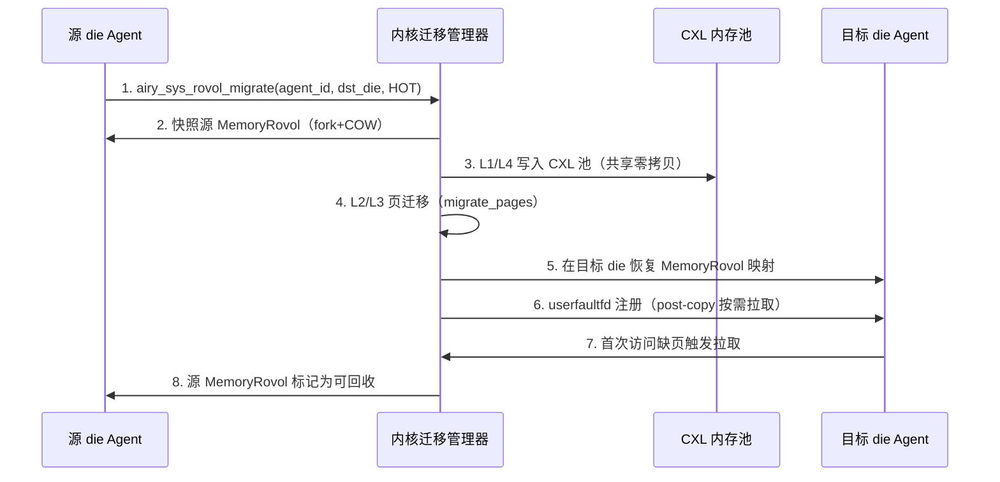
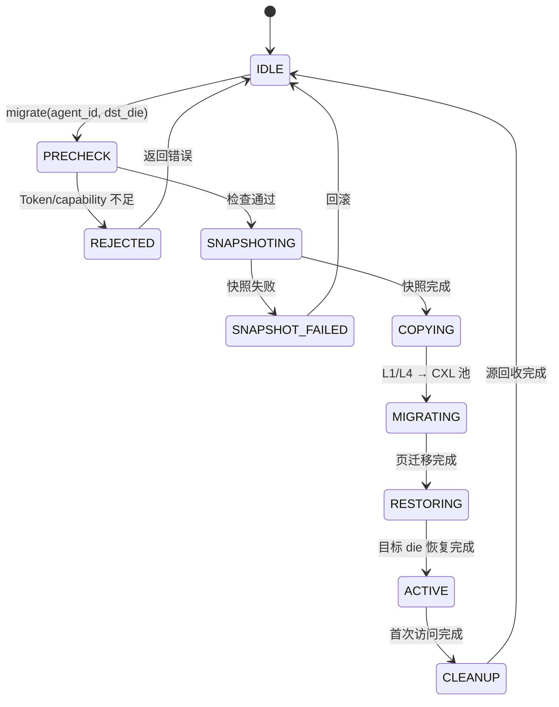
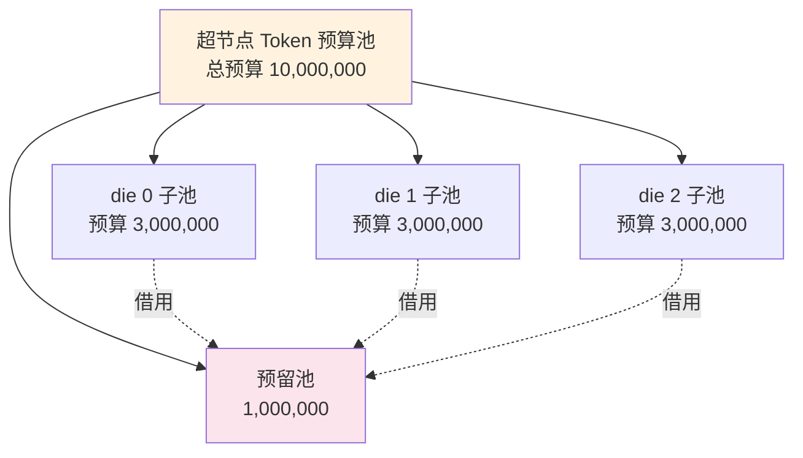
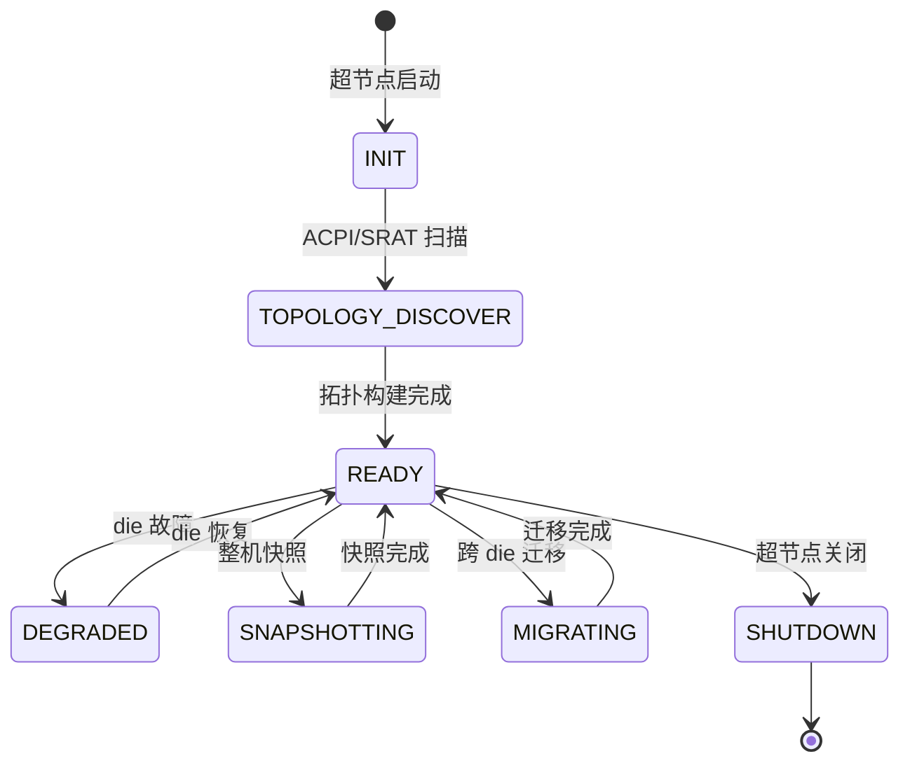
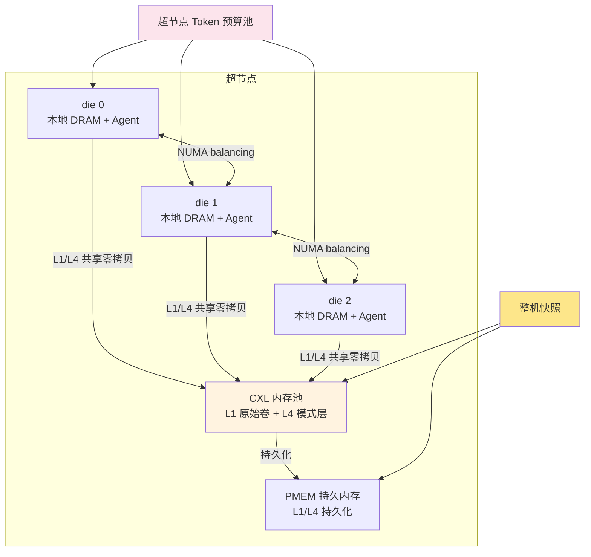

Copyright (c) 2025-2026 SPHARX Ltd. All Rights Reserved.

# 超节点 OS 实现方案
> **文档定位**：agentrt-linux（AirymaxOS）超节点 OS 的完整实现方案，定义超节点拓扑模型、NUMA 感知调度、跨 die 迁移协议、CXL 内存分层、超节点级 Token 预算池与整机快照恢复\
> **文档版本**：0.1.1\
> **最后更新**：2026-07-09\
> **上级文档**：[agentrt-linux 设计文档](README.md)\
> **同源映射**：agentrt gateway（Agent 网关多节点协调）[SS] + Linux 6.6 NUMA 调度与内存分层 [IND]\
> **文档性质**：实现方案文档（非设计文档）。本方案在 [20-modules/06-cloudnative.md](../20-modules/06-cloudnative.md) §3.8/§4.8 超节点 OS 设计与 [40-dataflows/02-memory-flow.md](../40-dataflows/02-memory-flow.md) 记忆卷载数据流的基础上，补充完整的超节点拓扑、调度、迁移、分层与预算实现\
> **设计参考**：Linux 6.6 `kernel/sched/topology.c:2068`（`sched_init_numa`）+ `kernel/sched/fair.c:3496`（`task_numa_fault`）+ `kernel/sched/fair.c:2958`（`numa_migrate_preferred`）+ `mm/memory-tiers.c:13`（`struct memory_tier`）+ `mm/memory-tiers.c:321`（`next_demotion_node`）+ `mm/migrate.c:2025`（`migrate_pages`）+ `drivers/cxl/`（CXL 驱动）+ seL4 `src/kernel/smp/`（多核同步）\
> **IRON-9 v3 层次**：[IND] 完全独立层（超节点 OS 为 agentrt-linux 云原生专属，MemoryRovol L1-L4 数据结构 [SC] 共享）

---

## 1. 概述

### 1.1 为什么需要超节点 OS

超节点（Supernode）是 2026 年高端服务器的主流形态——单台服务器集成多 die（chiplet）CPU + CXL 内存池 + 多 GPU/NPU，形成"超节点"计算单元。传统操作系统将多 die 视为独立 NUMA 节点，缺乏超节点级的统一调度、迁移与预算管理能力。

agentrt-linux（AirymaxOS）的超节点 OS 能力解决以下核心问题：

| 问题 | 传统 Linux 局限 | 超节点 OS 解决方式 |
|------|----------------|-------------------|
| 多 die 调度割裂 | NUMA balancing 仅做页迁移，无 Agent 级亲和 | Agent NUMA 亲和性调度（§3） |
| 跨 die 迁移无语义 | `migrate_pages` 仅迁移物理页 | MemoryRovol 8 步跨 die 迁移协议（§4） |
| 内存分层无 Agent 感知 | `memory-tiers` 按 node 分层，无 per-agent 配额 | per-agent 内存分层 + CXL 池化（§5） |
| 无超节点级 Token 预算 | Token 预算仅限单节点 | 超节点 Token 预算池（§6） |
| 无整机快照 | CRIU 仅进程级 | 超节点整机快照与恢复（§7） |

### 1.2 与设计文档的关系

本实现方案文档**不修改**以下设计文档，仅在其基础上补充完整的实现细节：

| 设计文档 | 提供的设计基础 | 本方案补充的实现细节 |
|---------|---------------|---------------------|
| [20-modules/06-cloudnative.md](../20-modules/06-cloudnative.md) §3.8/§4.8 | 超节点 OS 拓扑/调度/迁移/快照 4 项设计要点 | 完整拓扑数据结构、NUMA 调度算法、迁移协议、Token 池模型 |
| [40-dataflows/02-memory-flow.md](../40-dataflows/02-memory-flow.md) | MemoryRovol L1-L4 数据结构 + CXL 池化数据流 | 跨 die 迁移的 MemoryRovol 集成、内存分层映射 |
| [150-cloudnative/README.md](README.md) §4.2 | 超节点 OS 概念（多节点协同/跨节点记忆同步/超节点级 Token） | 详细的拓扑发现、调度策略、迁移状态机 |

### 1.3 设计目标

1. **NUMA 感知 Agent 调度**：Agent 任务优先在本地 die 调度，跨 die 迁移延迟 < 100ms（P99）
2. **CXL 内存池化**：L1 原始卷与 L4 模式层驻留 CXL 池，跨 die 共享读取零拷贝
3. **超节点 Token 预算池**：跨 die Token 调度，单 die Token 耗尽时从池中借用
4. **整机快照恢复**：超节点整机状态快照，故障切换 RTO < 30s
5. **微内核思想借鉴**：服务用户态化——超节点生命周期由 A-ULS（macro_superv）统一管理，运行在用户态，内核仅提供机制（参考 seL4 Liedtke minimality principle）

### 1.4 五维原则映射

| 原则 | 在本方案的体现 |
|------|---------------|
| **S-1 反馈闭环** | NUMA fault 统计反馈到 Agent 亲和性调度策略 |
| **S-4 涌现性管理** | 超节点级 Token 预算池管理多 die 涌现性 |
| **K-3 服务隔离** | 超节点生命周期由 A-ULS（macro_superv）统一管理（用户态），内核仅提供机制 |
| **E-2 可观测性** | NUMA balancing + CXL tier 全栈可观测 |
| **IRON-9 v3** | MemoryRovol L1-L4 数据结构 [SC] 共享，超节点 OS 实现 [IND] 独立 |

---

## 2. 超节点拓扑模型

### 2.1 拓扑层次

超节点 OS 将硬件拓扑抽象为 4 层：

```
超节点（Supernode）
└── die（Chiplet）           ← NUMA 调度域边界
    └── chip（CPU Package）
        └── core（逻辑核）    ← 最小调度单元
```

| 层次 | 硬件对应 | 调度语义 | 内核数据来源 |
|------|---------|---------|-------------|
| 超节点 | 整机（多 die + CXL 池） | Token 预算池范围 | 本方案自定义 |
| die | NUMA node（ACPI SRAT） | NUMA 调度域 | `kernel/sched/topology.c:2068 sched_init_numa` |
| chip | CPU package（物理 CPU） | L3 cache 共享域 | `sched_domain_topology_level`（`MC` 层） |
| core | 逻辑核（SMT 线程） | 最小调度单元 | `sched_domain_topology_level`（`SMT` 层） |

### 2.2 拓扑发现

超节点拓扑发现基于 Linux 6.6 的 ACPI 表与调度拓扑子系统：

| 发现来源 | 内核位置 | 提取信息 |
|---------|---------|---------|
| ACPI SRAT | `drivers/acpi/numa/srat.c` | NUMA node → die 映射 |
| ACPI SLIT | `drivers/acpi/numa/slit.c` | die 间距离矩阵 |
| 调度拓扑 | `kernel/sched/topology.c:2068 sched_init_numa` | sched_domain 层级 |
| CXL 拓扑 | `drivers/cxl/acpi.c` + `drivers/cxl/port.c` | CXL 池拓扑 |

`sched_init_numa()`（`kernel/sched/topology.c:2068`）构建 NUMA 调度域层次，是超节点 NUMA 感知调度的基础：

```c
/* kernel/sched/topology.c:2068 — Linux 6.6 内核基线 */
void sched_init_numa(int offline_node)
{
    struct sched_domain_topology_level *tl;
    /* 构建 NUMA 调度域层次：sched_domains_numa_levels */
    /* 超节点 OS 在此基础上注入 Agent 亲和性策略 */
}
```

### 2.3 拓扑数据结构

```c
/**
 * @brief 超节点拓扑描述符
 * @since 1.0.1
 * @location include/uapi/linux/airymax/supernode.h
 */
typedef struct airy_supernode_topology {
    uint32_t supernode_id;          /* 超节点 ID */
    uint32_t die_count;              /* die 数量 */
    uint32_t chip_count;             /* chip 数量 */
    uint32_t core_count;             /* 总核心数 */
    uint32_t cxl_pool_count;         /* CXL 内存池数量 */
    uint32_t distance_matrix[MAC_MAX_DIES][MAC_MAX_DIES]; /* die 间距离（SLIT） */
    struct {
        uint32_t die_id;             /* die ID（= NUMA node ID） */
        uint32_t chip_id;            /* 所属 chip */
        uint32_t core_count;         /* 该 die 核心数 */
        uint64_t memory_bytes;       /* 本地内存大小 */
        uint32_t cxl_pool_id;        /* 关联 CXL 池（0xFFFF = 无） */
    } dies[MAC_MAX_DIES];
} airy_supernode_topology_t;
```

### 2.4 拓扑感知的 cgroup

超节点 OS 在 cgroup v2 层级中引入超节点维度：

```
/sys/fs/cgroup/
└── supernode.slice/                 ← 超节点级（Token 预算池）
    ├── die0.slice/                 ← die 0（NUMA node 0）
    │   ├── agent_001.slice/        ← Agent 实例
    │   └── agent_002.slice/
    ├── die1.slice/                 ← die 1（NUMA node 1）
    │   └── agent_003.slice/
    └── cxl_pool.slice/             ← CXL 池（共享内存）
```

每个 die 对应一个 cgroup slice，Agent 实例挂载到目标 die 的 slice 下。超节点级 `supernode.slice` 管理跨 die 的 Token 预算池。

---

## 3. NUMA 感知调度

### 3.1 Linux 6.6 NUMA 调度域构建

Linux 6.6 通过 `sched_init_numa()`（`kernel/sched/topology.c:2068`）构建 NUMA 调度域层次。该函数读取 ACPI SRAT/SLIT 表，为每个 NUMA 距离层级构建 `sched_domain`，最终形成 NUMA balancing 的调度域拓扑。

超节点 OS 不修改 `sched_init_numa()` 本身（保持 Linux 6.6 工程基线不变），而是在其构建的调度域之上注入 Agent 亲和性策略——通过sched_tac（SCHED_DEADLINE/SCHED_FIFO/EEVDF 用户态调度器，不依赖 sched_ext 或已删除的 SCHED_AGENT 内核宏）实现。

### 3.2 NUMA balancing 故障统计

Linux 6.6 的 NUMA balancing 通过 `task_numa_fault()`（`kernel/sched/fair.c:3496`）统计每个任务的 NUMA 访问故障：

```c
/* kernel/sched/fair.c:3496 — Linux 6.6 内核基线 */
void task_numa_fault(int last_cpupid, int mem_node, int pages, int flags)
{
    struct task_struct *p = current;
    bool migrated = flags & TNF_MIGRATED;
    /* 统计 p->numa_faults 数组，记录每个 node 的访问频次 */
    /* 超节点 OS 通过 eBPF 追踪此函数，为 Agent 亲和性提供数据 */
}
```

超节点 OS 利用 `task_numa_fault()` 的统计数据，计算每个 Agent 的 NUMA 亲和性得分：

```
Agent 亲和性得分 = Σ(访问 node i 的页数 × node i 与本地 die 的距离倒数)
```

得分越高表示 Agent 的内存访问越分散，越需要迁移到更优的 die。

### 3.3 NUMA 倾向迁移

Linux 6.6 通过 `numa_migrate_preferred()`（`kernel/sched/fair.c:2958`）将任务迁移到其偏好节点：

```c
/* kernel/sched/fair.c:2958 — Linux 6.6 内核基线 */
static void numa_migrate_preferred(struct task_struct *p)
{
    unsigned long interval = HZ;
    /* 迁移任务到 p->numa_preferred_nid */
    /* 超节点 OS 增强：迁移前检查 Token 预算与 MemoryRovol 状态 */
}
```

超节点 OS 在 `numa_migrate_preferred()` 迁移前注入 Agent 级检查（通过 ftrace hook 或sched_tac 用户态调度策略）：

1. **Token 预算检查**：目标 die 的 Token 池是否有余量
2. **MemoryRovol 状态检查**：Agent 是否正在快照/迁移（`AIRY_ROVOL_STATE_MIGRATING` 状态禁止跨 die 迁移）
3. **capability 检查**：Agent 是否有 `CAP_SUPERNODE_MIGRATE` 权限

### 3.4 Agent NUMA 亲和性调度策略

超节点 OS 通过sched_tac 用户态调度策略 `airy_agent`（SCHED_DEADLINE/SCHED_FIFO 策略名，非宏）实现 Agent NUMA 亲和性：

```c
/* sched_tac 用户态调度策略：airy_agent（用户态调度程序） */
SEC("struct_ops/agent_enqueue")
int BPF_PROG(agent_enqueue, struct task_struct *p, u64 enq_flags)
{
    /* 1. 读取 Agent 的 numa_faults 统计 */
    /* 2. 计算 NUMA 亲和性得分 */
    /* 3. 优先入队到本地 die 的 CPU 运行队列 */
    /* 4. 本地 die 过载时，按距离矩阵选择次优 die */
    return 0;
}
```

### 3.5 调度策略与延迟预算

| Agent 任务类别 | cgroup | NUMA 策略 | 延迟预算（P99） |
|---------------|---------|-----------|----------------|
| 实时控制 | `die*.slice/realtime.slice` | 严格本地 die，禁止跨 die | < 1 ms |
| 交互响应 | `die*.slice/interactive.slice` | 优先本地 die，允许跨 die | < 10 ms |
| Agent 认知 | `die*.slice/agent.slice` | NUMA balancing 允许 | < 100 ms |
| 批处理推理 | `die*.slice/batch.slice` | 无 NUMA 约束 | < 1 s |

---

## 4. 跨 die 迁移协议

### 4.1 页面迁移机制

Linux 6.6 通过 `migrate_pages()`（`mm/migrate.c:2025`）实现物理页迁移：

```c
/* mm/migrate.c:2025 — Linux 6.6 内核基线 */
int migrate_pages(struct list_head *from, new_folio_t get_new_folio,
                  free_folio_t put_new_folio, unsigned long private,
                  enum migrate_mode mode, int reason, unsigned int *ret_succeeded)
{
    /* 逐页迁移：分配新页 → 复制内容 → 建立映射 → 释放旧页 */
    /* 超节点 OS 利用此机制实现 MemoryRovol 跨 die 迁移 */
}
```

超节点 OS 的跨 die 迁移**不修改** `migrate_pages()`，而是在其上构建 MemoryRovol 语义层迁移协议。

### 4.2 Agent 任务跨 die 迁移

Agent 任务跨 die 迁移分为 3 个层次：

| 层次 | 迁移对象 | 机制 | 延迟 |
|------|---------|------|------|
| L1 任务迁移 | task_struct | `numa_migrate_preferred`（fair.c:2958） | < 1 ms |
| L2 内存迁移 | 物理页 | `migrate_pages`（migrate.c:2025） | < 10 ms/MB |
| L3 MemoryRovol 迁移 | L1-L4 记忆卷载 | MemoryRovol 8 步迁移协议（§4.3） | < 100 ms |

### 4.3 MemoryRovol 跨 die 迁移协议

MemoryRovol 跨 die 迁移在 [140-application-development/05-memory-rovol-api.md](../140-application-development/05-memory-rovol-api.md) §5 定义的 8 步迁移协议基础上，增加超节点 NUMA 感知：



### 4.4 迁移状态机



### 4.5 迁移性能约束

| 指标 | 阈值 | 测量方法 |
|------|------|---------|
| 冷迁移（COLD）总延迟 | < 500 ms（P99） | `airy_sys_rovol_migrate` 全程 |
| 热迁移（HOT）停顿时间 | < 10 ms（P99） | Agent 不可用时间窗口 |
| 增量迁移（INCREMENT）同步延迟 | < 50 ms（P99） | 增量同步窗口 |
| CXL 池零拷贝读取延迟 | < 10 μs（P99） | CXL 3.0 单次读 |

---

## 5. 内存分层与 CXL 池化

### 5.1 内存分层模型

Linux 6.6 通过 `struct memory_tier`（`mm/memory-tiers.c:13`）管理内存分层：

```c
/* mm/memory-tiers.c:13 — Linux 6.6 内核基线 */
struct memory_tier {
    /* hierarchy of memory tiers */
    struct list_head list;
    /* list of all memory types part of this tier */
    struct list_head memory_types;
    /* ... */
};
```

超节点 OS 在 Linux 6.6 内存分层之上定义 Agent 感知的分层模型：

| 分层 | 硬件 | MemoryRovol 层 | tier 策略 |
|------|------|---------------|-----------|
| Tier 0 | 本地 DRAM（die 本地） | L2 热向量 + L3 热节点 | 不回收 |
| Tier 1 | 远端 DRAM（跨 die） | L2 温向量 | 低优先级回收 |
| Tier 2 | CXL 池内存 | L1 原始卷 + L4 模式层 | 共享零拷贝 |
| Tier 3 | PMEM 持久内存 | L1/L4 持久化副本 | 不回收（持久） |

### 5.2 降级路径

Linux 6.6 通过 `next_demotion_node()`（`mm/memory-tiers.c:321`）确定内存降级路径：

```c
/* mm/memory-tiers.c:321 — Linux 6.6 内核基线 */
int next_demotion_node(int node)
{
    struct demotion_nodes *nd;
    int target;
    /* 返回 node 的下一个降级目标节点 */
    /* 超节点 OS 利用此机制实现 MemoryRovol 层级降级 */
}
```

超节点 OS 的 MemoryRovol 层级降级（[140/05-memory-rovol-api.md](../140-application-development/05-memory-rovol-api.md) §8 艾宾浩斯遗忘曲线）与 `next_demotion_node()` 语义同源 [SS]：

- MemoryRovol L2→L3 降级 ≈ memory tier Tier 0→Tier 1 降级
- 两者都基于"访问频次下降"触发，但 MemoryRovol 是硬删除，memory tier 是迁移

### 5.3 CXL 内存池化

CXL（Compute Express Link）3.0 内存池化是超节点 OS 的核心能力。Linux 6.6 的 CXL 驱动位于 `drivers/cxl/`：

| CXL 驱动文件 | 职责 | 超节点 OS 使用方式 |
|-------------|------|-------------------|
| `drivers/cxl/acpi.c` | ACPI 拓扑发现 | CXL 池拓扑发现 |
| `drivers/cxl/pci.c` | PCI 设备枚举 | CXL 设备注册 |
| `drivers/cxl/mem.c` | CXL 内存设备 | CXL 内存分配 |
| `drivers/cxl/port.c` | CXL 端口 | CXL 端口管理 |
| `drivers/cxl/pmem.c` | CXL 持久内存 | L1/L4 持久化 |
| `drivers/cxl/security.c` | CXL 安全 | MemoryRovol 加密 |

### 5.4 MemoryRovol L1-L4 与内存分层映射

| MemoryRovol 层 | 默认 tier | 迁移策略 | CXL 共享 |
|---------------|----------|---------|---------|
| L1 原始卷 | Tier 2（CXL 池） | 写入 CXL 池，跨 die 共享读取 | ✓ 零拷贝 |
| L2 特征层 | Tier 0（本地 DRAM） | MGLRU aging/eviction 回收 | ✗ 本地 |
| L3 结构层 | Tier 0/1 | 冷节点降级到 Tier 1 | ✗ 本地 |
| L4 模式层 | Tier 2（CXL 池） | 写入 CXL 池，集中计算 | ✓ 零拷贝 |

### 5.5 超节点级内存配额

```c
/**
 * @brief 超节点级内存配额
 * @since 1.0.1
 */
typedef struct airy_supernode_mem_quota {
    uint64_t local_dram_limit;      /* 本地 DRAM 上限（per die） */
    uint64_t cxl_pool_limit;         /* CXL 池上限（超节点级） */
    uint64_t pmem_limit;            /* PMEM 上限（超节点级） */
    uint32_t tier_policy;            /* 分层策略 */
} airy_supernode_mem_quota_t;
```

---

## 6. 超节点 Token 预算池

### 6.1 跨节点 Token 池模型

超节点 Token 预算池在 [140-application-development/04-token-budget.md](../140-application-development/04-token-budget.md) 单节点令牌桶基础上，增加跨 die 池化：



### 6.2 Token 池调度算法

```c
/**
 * @brief 从超节点 Token 池分配
 * @param die_id 目标 die
 * @param amount 申请 Token 数
 * @return 0 成功，<0 失败
 * @since 1.0.1
 */
AIRY_API int airy_supernode_token_alloc(uint32_t die_id,
                                              uint64_t amount);

/**
 * @brief 跨 die 借用 Token
 * @param src_die 源 die（耗尽）
 * @param dst_die 目标 die（有余量）
 * @param amount 借用数量
 * @return 0 成功，<0 失败
 * @since 1.0.1
 */
AIRY_API int airy_supernode_token_borrow(uint32_t src_die,
                                                uint32_t dst_die,
                                                uint64_t amount);
```

### 6.3 Token 池配额与抢占

| 场景 | 策略 | 优先级 |
|------|------|--------|
| die Token 耗尽 < 20% | 从预留池借用 | 高 |
| die Token 耗尽 < 5% | 抢占低优先级 Agent 的 Token | 临界 |
| 超节点总池耗尽 < 5% | 触发全局 Token 配额收缩 | 临界 |

### 6.4 与单节点 Token 预算的关系

单节点令牌桶（[140/04-token-budget.md](../140-application-development/04-token-budget.md)）是超节点 Token 池的子集——每个 die 的子池实现单节点令牌桶算法，超节点池层负责跨 die 调度。两者通过 `token_factor`（Q16.16 定点数）保持调度权重一致。

---

## 7. 超节点快照与恢复

### 7.1 整机快照语义

超节点整机快照是单 Agent MemoryRovol 快照（[140/05-memory-rovol-api.md](../140-application-development/05-memory-rovol-api.md) §4）的超集，包含：

| 快照内容 | 来源 | 机制 |
|---------|------|------|
| 全部 Agent 的 MemoryRovol | L1-L4 记忆卷载 | `airy_sys_rovol_snapshot`（552） |
| 全部 Agent 的 Token 状态 | 令牌桶当前水位 | Token 池快照 |
| cgroup 层级与配额 | cgroup v2 状态 | cgroup 快照 |
| 超节点拓扑 | 拓扑描述符 | `airy_supernode_topology_t` 序列化 |

### 7.2 快照数据流


### 7.3 恢复协议

整机恢复是快照的逆过程，按以下顺序恢复：

1. 恢复超节点拓扑（验证硬件一致性）
2. 恢复 cgroup 层级与配额
3. 恢复 Token 池状态
4. 逐 Agent 恢复 MemoryRovol（`airy_sys_rovol_restore` 553）
5. 唤醒 Agent（按延迟预算优先级排序）

**RTO 约束**：整机恢复 RTO < 30s（P99），取决于 Agent 数量与 MemoryRovol 总大小。

---

## 8. 超节点状态机

### 8.1 超节点生命周期状态



### 8.2 状态转换条件

| 转换 | 触发条件 | 动作 |
|------|---------|------|
| INIT → TOPOLOGY_DISCOVER | 系统启动 | `sched_init_numa` + CXL 拓扑发现 |
| TOPOLOGY_DISCOVER → READY | 拓扑构建完成 | 注册超节点 Token 池 |
| READY → DEGRADED | die 故障（热插拔/错误） | 故障 die Agent 迁移到其他 die |
| READY → SNAPSHOTTING | `agentctl supernode snapshot` | 冻结调度 + 快照 |
| READY → MIGRATING | `airy_sys_rovol_migrate` | 跨 die 迁移 |

---

## 9. 接口定义

### 9.1 agentctl supernode 子命令

```bash
# 查看超节点拓扑
agentctl supernode topology
# 输出：die/chip/core/CXL 池拓扑

# 查看超节点 Token 池状态
agentctl supernode token-pool status

# 整机快照
agentctl supernode snapshot --output /mnt/pmem/supernode.snap

# 整机恢复
agentctl supernode restore --input /mnt/pmem/supernode.snap

# 跨 die 迁移 Agent
agentctl supernode migrate-agent <agent_id> --dst-die 2

# 查看 NUMA 亲和性得分
agentctl supernode affinity --agent <agent_id>
```

### 9.2 系统调用

超节点 OS 复用已分配的系统调用编号（[140/07-syscall-registry.md](../140-application-development/07-syscall-registry.md) SSoT）：

| 编号 | 调用 | 用途 |
|------|------|------|
| 515 | `airy_sys_task_migrate` | Agent 任务跨 die 迁移 |
| 554 | `airy_sys_rovol_migrate` | MemoryRovol 跨 die 迁移 |
| 555 | `airy_sys_cxl_tier_set` | CXL 内存分层策略 |

超节点 Token 池 API 通过 A-ULS（`services/daemons/macro_superv/`）统一管理，不新增系统调用（遵循"机制在内核、策略在用户态"的微内核原则）。超节点生命周期由 A-ULS 统一监管，与 Agent 8 态生命周期同构（见 [30-interfaces/10-sc-sched-extension.md](../30-interfaces/10-sc-sched-extension.md)），消除超节点功能三方交叉。

### 9.3 超节点拓扑 sysfs 接口

```bash
# 超节点拓扑
cat /sys/kernel/agentrt/supernode/topology

# die 间距离矩阵
cat /sys/kernel/agentrt/supernode/distance_matrix

# CXL 池状态
cat /sys/kernel/agentrt/supernode/cxl_pools

# Token 池状态
cat /sys/kernel/agentrt/supernode/token_pool
```

---

## 10. 数据流图



---

## 11. 错误处理

### 11.1 错误码

超节点 OS 复用 [140/07-syscall-registry.md](../140-application-development/07-syscall-registry.md) 定义的错误码，并扩展以下专用错误码（归入内核错误段 -200~-299，SSoT 定义于 `include/uapi/linux/airymax/error.h`）：

| 错误码 | 值 | 含义 | 触发场景 |
|--------|-----|------|---------|
| `AIRY_KERN_ENODIE` | -210 | die 不存在 | 指定的 die_id 超出范围 |
| `AIRY_KERN_ECXL` | -211 | CXL 操作失败 | CXL 设备不可用或池已满 |
| `AIRY_KERN_ESNAPSHOT` | -212 | 快照失败 | 整机快照过程中 Agent 状态冲突 |

### 11.2 错误处理策略

```c
int ret = airy_sys_rovol_migrate(agent_id, dst_die, AIRY_ROVOL_MIGRATE_HOT);
if (ret == -AIRY_EBUSY) {
    /* Agent 正在快照，等待后重试 */
    usleep(10000);
    ret = airy_sys_rovol_migrate(agent_id, dst_die, AIRY_ROVOL_MIGRATE_HOT);
} else if (ret == -AIRY_KERN_ENODIE) {
    log_write(LOG_ERROR, "目标 die %u 不存在", dst_die);
    return ret;
} else if (ret == -AIRY_EPERM) {
    log_write(LOG_ERROR, "缺少 CAP_SUPERNODE_MIGRATE 权限");
    return ret;
}
```

---

## 12. 安全考量

### 12.1 capability 守卫

超节点 OS 的关键操作受 capability 守卫（[110-security/03-capability-model.md](../110-security/03-capability-model.md)）保护：

| 操作 | 所需 capability | 说明 |
|------|----------------|------|
| 跨 die 迁移 Agent | `CAP_SUPERNODE_MIGRATE` | 防止未授权迁移 |
| 整机快照 | `CAP_SUPERNODE_SNAPSHOT` | 防止未授权快照 |
| Token 池借用 | `CAP_TOKEN_POOL_BORROW` | 防止 Token 窃取 |
| CXL tier 策略修改 | `CAP_CXL_TIER_SET` | 防止未授权分层修改 |

### 12.2 MemoryRovol 加密

跨 die 迁移过程中，MemoryRovol 数据在 CXL 池中传输时加密（AES-256-GCM），密钥由 Cupolas Vault backend 管理（[110-security/03-capability-model.md](../110-security/03-capability-model.md) §6）。

### 12.3 审计日志

所有超节点操作记录审计日志：

```
[2026-07-09T10:23:45+08:00] SUPERNODE_MIGRATE agent_id=42 src_die=0 dst_die=2 ret=0 duration_ms=87
[2026-07-09T10:24:12+08:00] SUPERNODE_SNAPSHOT snapshot_id=1024 agents=15 size_gb=4.2
```

---

## 13. 性能约束

| 指标 | 阈值 | 测量方法 |
|------|------|---------|
| NUMA balancing 迁移延迟 | < 1 ms（P99） | `task_numa_fault` 到迁移完成 |
| 跨 die Agent 迁移延迟 | < 100 ms（P99） | `airy_sys_task_migrate` 全程 |
| CXL 池零拷贝读延迟 | < 10 μs（P99） | CXL 3.0 单次读 |
| 整机快照 RTO | < 30 s（P99） | 快照触发到完成 |
| 整机恢复 RTO | < 30 s（P99） | 恢复触发到全部 Agent 唤醒 |
| Token 池借用延迟 | < 1 ms（P99） | `airy_supernode_token_borrow` |

性能基准测试位于 `tests-linux/benchmark/supernode/`（[170-performance](../170-performance/README.md)）。

---

## 14. IRON-9 v3 同源映射

| 层次 | 共享内容 | 超节点 OS 使用方式 |
|------|---------|-------------------|
| **[SC] 共享契约层** | MemoryRovol L1-L4 数据结构（`include/uapi/linux/airymax/memory_types.h`） | 跨 die 迁移使用 [SC] 数据结构 |
| **[SC] 共享契约层** | IPC 消息头（`include/uapi/linux/airymax/ipc.h`） | macro_superv 与 Agent 通信 |
| **[SS] 语义同源层** | gateway 多节点协调语义 | agentrt gateway → macro_superv |
| **[IND] 完全独立层** | 超节点拓扑/调度/迁移/CXL 池化 | agentrt-linux 专属 |

---

## 15. SDK 集成

### 15.1 Python SDK

```python
from agentrt import SupernodeClient

client = SupernodeClient()

# 查看拓扑
topology = client.get_topology()
for die in topology.dies:
    print(f"die {die.die_id}: {die.core_count} cores, {die.memory_bytes} bytes")

# 跨 die 迁移 Agent
client.migrate_agent(agent_id=42, dst_die=2, strategy="hot")

# 整机快照
snapshot_id = client.snapshot()
print(f"快照完成: {snapshot_id}")
```

### 15.2 Rust SDK

```rust
use agentrt::SupernodeClient;

let client = SupernodeClient::new()?;
let topology = client.get_topology()?;
for die in &topology.dies {
    println!("die {}: {} cores", die.die_id, die.core_count);
}
client.migrate_agent(42, 2, MigrateStrategy::Hot)?;
let snapshot_id = client.snapshot()?;
```

---

## 16. 使用示例

### 16.1 超节点部署与拓扑查看

```bash
# 部署超节点
agentctl supernode init --dies 4 --cxl-pool 1

# 查看拓扑
agentctl supernode topology
# die 0: 32 cores, 256GB DRAM, cxl_pool=0
# die 1: 32 cores, 256GB DRAM, cxl_pool=0
# die 2: 32 cores, 256GB DRAM, cxl_pool=0
# die 3: 32 cores, 256GB DRAM, cxl_pool=0
# CXL pool 0: 1TB shared
```

### 16.2 跨 die 迁移

```bash
# 将 Agent 42 从 die 0 迁移到 die 2（热迁移）
agentctl supernode migrate-agent 42 --dst-die 2 --strategy hot

# 查看 NUMA 亲和性
agentctl supernode affinity --agent 42
# die 0: 12% (migrating away)
# die 2: 88% (migrating to)
```

### 16.3 整机快照与恢复

```bash
# 整机快照
agentctl supernode snapshot --output /mnt/pmem/supernode.snap
# 快照完成：15 agents, 4.2GB, 耗时 18s

# 整机恢复（故障切换后）
agentctl supernode restore --input /mnt/pmem/supernode.snap
# 恢复完成：15 agents, 耗时 22s
```

---

## 17. 测试策略

### 17.1 KUnit 单元测试

```c
/* tests-linux/kunit/supernode/topology_test.c */
KUNIT_DEFINE_TEST(test_supernode_topology_discovery) {
    struct airy_supernode_topology topo;
    int ret = airy_supernode_discover(&topo);
    KUNIT_EXPECT_EQ(test, ret, 0);
    KUNIT_EXPECT_GT(test, topo.die_count, 0);
}
```

### 17.2 性能基准测试

```bash
# tests-linux/benchmark/supernode/
./bench_supernode_migrate --agents 100 --dst-die 2
./bench_supernode_snapshot --agents 100 --size 10GB
./bench_cxl_zerocopy --pool 0 --size 1GB
```

### 17.3 混沌工程测试

| 测试场景 | 注入方式 | 预期行为 |
|---------|---------|---------|
| die 故障 | 热拔 die | Agent 自动迁移到其他 die |
| CXL 池故障 | 模拟 CXL 设备错误 | L1/L4 降级到 PMEM |
| Token 池耗尽 | 耗尽超节点 Token | 触发全局配额收缩 |
| 迁移中断 | 迁移过程中 kill Agent | 回滚到源 die |

---

## 18. 合规声明

### 18.1 不移植的 主流 Linux 发行版 特有特性

根据项目合规约束（[50-engineering-standards/08-compliance-checklist.md](../50-engineering-standards/08-compliance-checklist.md)），超节点 OS **不移植**以下 主流 Linux 发行版 特有特性，改用替代方案：

| 不移植特性 | 原因 | 替代方案 |
|-----------|------|---------|
| `etmem`（`mm/etmem.c`） | 主流 Linux 发行版 特有，与 IRON-1 冲突 | `memory.reclaim` + memory-tiers |
| `dynamic_pool` | 主流 Linux 发行版 特有 | memcg（cgroup v2） |
| `numa_remote` | 主流 Linux 发行版 特有 | CXL 3.0 池化 |
| KABI_RESERVE | 与 IRON-1 冲突 | 不使用保留域 |

### 18.2 微内核思想来源

超节点 OS 的微内核设计思想**仅来源于 seL4**（Liedtke minimality principle + 服务用户态化），不引入 Zircon 或 Minix3（遵循 [10-architecture/03-microkernel-strategy.md](../10-architecture/03-microkernel-strategy.md) 决策）。超节点生命周期由 A-ULS（`services/daemons/macro_superv/`）统一管理，运行在用户态，内核仅提供机制（NUMA 调度域 + 页迁移 + CXL 驱动）。A-ULS 是 12 daemons 之一（见 [20-modules/10-user-supervisor-daemon.md](../20-modules/10-user-supervisor-daemon.md)），统一监管 Agent 与超节点生命周期，消除功能三方交叉。

### 18.3 sched_tac 调度约束

超节点 OS 使用 sched_tac 用户态调度策略（stc_agent 枚举，SCHED_DEADLINE/SCHED_FIFO/EEVDF），**不使用** SCHED_AGENT 内核宏（已删除）。策略标识通过 stc_* 枚举引用。

---

## 19. 相关文档

- [150-cloudnative README](README.md) — 云原生 Agent 部署主索引
- [20-modules/06-cloudnative.md](../20-modules/06-cloudnative.md) — 云原生子仓设计（§3.8/§4.8 超节点 OS）
- [40-dataflows/02-memory-flow.md](../40-dataflows/02-memory-flow.md) — 记忆卷载数据流（CXL/PMEM/MGLRU）
- [140-application-development/04-token-budget.md](../140-application-development/04-token-budget.md) — Token 预算契约
- [140-application-development/05-memory-rovol-api.md](../140-application-development/05-memory-rovol-api.md) — MemoryRovol API（§5 迁移协议）
- [140-application-development/07-syscall-registry.md](../140-application-development/07-syscall-registry.md) — 系统调用编号 SSoT
- [110-security/03-capability-model.md](../110-security/03-capability-model.md) — Capability 安全模型
- [10-architecture/03-microkernel-strategy.md](../10-architecture/03-microkernel-strategy.md) — 微内核策略（seL4 唯一来源）
- [170-performance/02-memory-performance.md](../170-performance/02-memory-performance.md) — 内存性能

---

© 2025-2026 SPHARX Ltd. All Rights Reserved.
