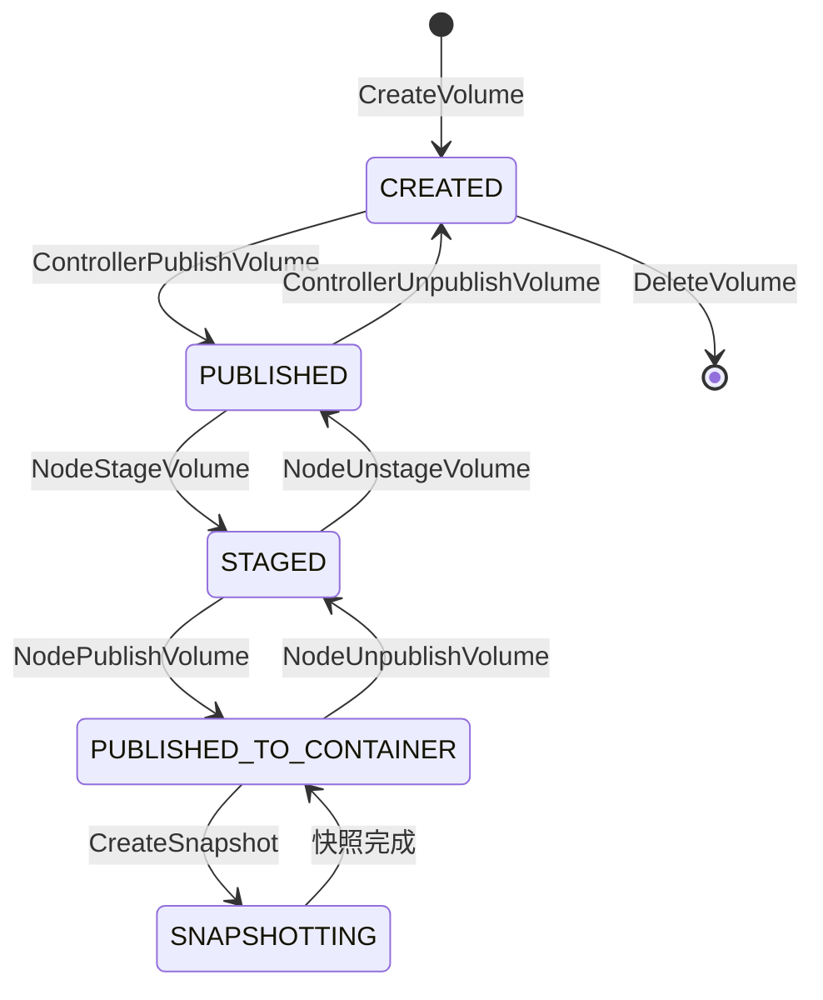
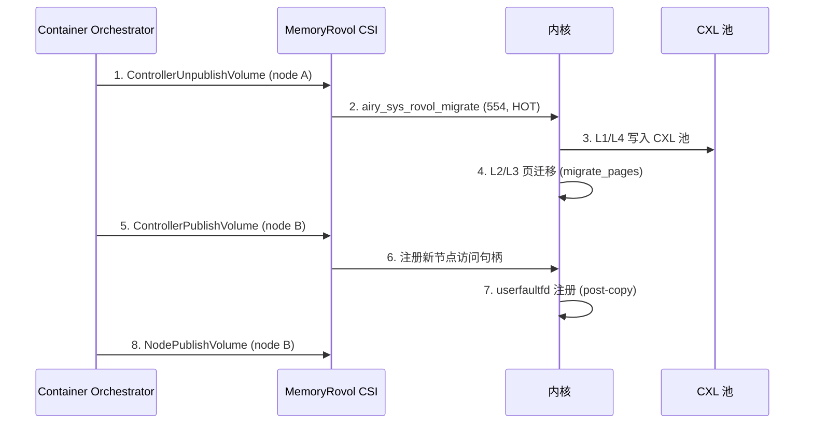
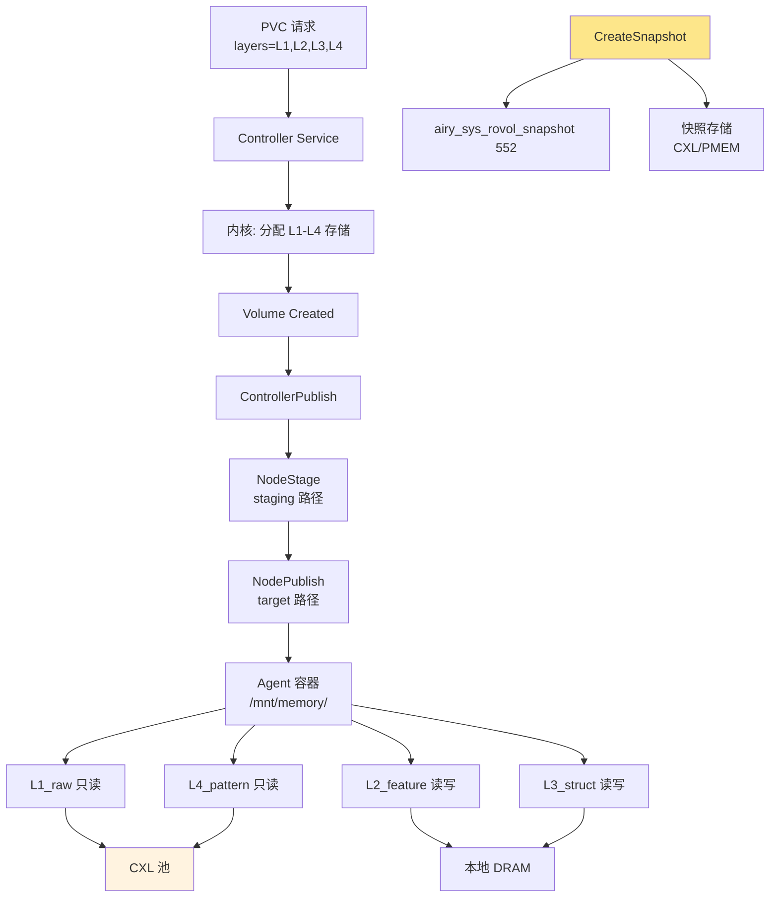

Copyright (c) 2025-2026 SPHARX Ltd. All Rights Reserved.

# MemoryRovol CSI 驱动实现方案
> **文档定位**：agentrt-linux（AirymaxOS）MemoryRovol CSI（Container Storage Interface）驱动的完整实现方案，定义将记忆卷载 L1-L4 四层作为 CSI 卷挂载到 Agent 容器的协议、接口与生命周期\
> **文档版本**：0.1.1\
> **最后更新**：2026-07-09\
> **上级文档**：[agentrt-linux 设计文档](README.md)\
> **同源映射**：MemoryRovol L1-L4 数据结构 [SC] 共享 + CSI v1.9 规范 [IND] 独立实现\
> **文档性质**：实现方案文档（非设计文档）。本方案在 [20-modules/06-cloudnative.md](../20-modules/06-cloudnative.md) §4.3 容器快照与 [40-dataflows/02-memory-flow.md](../40-dataflows/02-memory-flow.md) MemoryRovol L1-L4 数据结构的基础上，补充完整的 CSI 驱动实现\
> **设计参考**：CSI v1.9 规范（container-storage-interface spec）+ Linux 6.6 `drivers/cxl/`（CXL 持久化）+ `include/airymax/memory_types.h`（[SC] 共享契约层）\
> **IRON-9 v2 层次**：[SC] 共享契约层（L1-L4 数据结构）+ [IND] 完全独立层（CSI 驱动实现）

---

## 1. 概述

### 1.1 为什么需要 MemoryRovol CSI

Agent 容器化部署（[150-cloudnative/02-containerd-shim.md](02-containerd-shim.md)）要求 Agent 容器能访问 MemoryRovol 记忆卷载。传统 CSI 驱动仅支持文件系统或块设备卷，无法表达 MemoryRovol L1-L4 四层递进的语义结构。

MemoryRovol CSI 驱动解决以下核心问题：

| 问题 | 传统 CSI 局限 | MemoryRovol CSI 解决方式 |
|------|-------------|------------------------|
| L1-L4 层级无法表达 | 仅 volumeType=block/filesystem | 扩展 `airymaxos.agent.memory-rovol.layers` 参数 |
| 只读/读写语义不分 | 全卷统一读写权限 | per-layer 挂载语义（L1 只读、L2 读写等） |
| 快照无 Agent 感知 | CSI snapshot 仅块级 | 复用 `airy_sys_rovol_snapshot`（552）语义 |
| 跨节点迁移无记忆 | CSI 仅支持 detach/attach | 集成超节点 OS 跨 die 迁移协议（[04-supernode-os.md](04-supernode-os.md) §4） |

### 1.2 与设计文档的关系

本实现方案文档**不修改**以下设计文档：

| 设计文档 | 提供的设计基础 | 本方案补充的实现细节 |
|---------|---------------|---------------------|
| [20-modules/06-cloudnative.md](../20-modules/06-cloudnative.md) §4.3 | 容器快照与迁移设计 | 完整 CSI gRPC 接口 + 卷生命周期 + 挂载语义 |
| [40-dataflows/02-memory-flow.md](../40-dataflows/02-memory-flow.md) | MemoryRovol L1-L4 数据结构 [SC] | L1-L4 作为 CSI 卷的挂载协议 |
| [150-cloudnative/README.md](README.md) §2.3 | MemoryRovol CSI 概念 | 完整驱动架构与 gRPC 实现 |

### 1.3 设计目标

1. **CSI v1.9 合规**：完全实现 CSI v1.9 规范的 Identity/Controller/Node 三阶段 gRPC 接口
2. **L1-L4 层级表达**：通过 CSI 卷参数表达 MemoryRovol 四层结构与挂载语义
3. **零拷贝挂载**：L1/L4 通过 CXL 池零拷贝挂载，避免数据复制
4. **快照集成**：CSI VolumeSnapshot 复用 `airy_sys_rovol_snapshot`（552）系统调用
5. **跨节点迁移**：CSI 卷 detach/attach 集成超节点 OS 跨 die 迁移

---

## 2. CSI 驱动架构

### 2.1 CSI 三阶段 gRPC 架构

MemoryRovol CSI 驱动遵循 CSI v1.9 规范，实现三阶段 gRPC 服务：

```
┌─────────────────────────────────────────────────────────┐
│ Kubernetes / containerd                                 │
│   CO (Container Orchestrator)                           │
└──────────┬──────────────────┬───────────────────────────┘
           │                  │
    Identity Service    Controller Service    Node Service
    (GetPluginInfo)     (CreateVolume)       (NodePublishVolume)
    (GetCapabilities)   (DeleteVolume)       (NodeUnpublishVolume)
    (Probe)             (ControllerPublish)  (NodeStageVolume)
                        (CreateSnapshot)     (NodeExpandVolume)
           │                  │                  │
           └──────────────────┼──────────────────┘
                              │
                   ┌──────────▼──────────┐
                   │ memoryrovol-csi     │
                   │ (agentrt-linux 专属)│
                   │  [IND]              │
                   ├─────────────────────┤
                   │ 内核系统调用         │
                   │  552 snapshot       │
                   │  553 restore        │
                   │  554 migrate        │
                   │  557 list           │
                   │  558 delete         │
                   ├─────────────────────┤
                   │ [SC] 共享契约层      │
                   │  memory_types.h     │
                   │  L1-L4 数据结构     │
                   └─────────────────────┘
```

### 2.2 驱动组件

| 组件 | 部署形态 | 职责 |
|------|---------|------|
| `memoryrovol-csi-controller` | Deployment（单副本） | Controller Service：卷创建/删除/快照 |
| `memoryrovol-csi-node` | DaemonSet（每节点） | Node Service：卷挂载/卸载/扩容 |
| `memoryrovol-csi-identity` | 两者内置 | Identity Service：驱动信息与能力 |

### 2.3 部署形态

```yaml
# memoryrovol-csi-controller（Deployment）
apiVersion: apps/v1
kind: Deployment
metadata:
  name: memoryrovol-csi-controller
spec:
  replicas: 1
  template:
    spec:
      containers:
      - name: csi-driver
        image: registry.airymaxos.dev/memoryrovol-csi:1.0.1
        args: ["--mode=controller"]
        securityContext:
          capabilities:
            add: ["CAP_ROVOL_SNAPSHOT", "CAP_ROVOL_DELETE"]  # [SC] capability
---
# memoryrovol-csi-node（DaemonSet）
apiVersion: apps/v1
kind: DaemonSet
metadata:
  name: memoryrovol-csi-node
spec:
  template:
    spec:
      containers:
      - name: csi-driver
        image: registry.airymaxos.dev/memoryrovol-csi:1.0.1
        args: ["--mode=node"]
        securityContext:
          privileged: true  # 挂载需要
```

---

## 3. Identity Service

### 3.1 GetPluginInfo

```proto
rpc GetPluginInfo(GetPluginInfoRequest)
    returns (GetPluginInfoResponse) {}

// Response:
//   name: "memoryrovol.airymaxos.dev"
//   vendor_version: "1.0.1"
//   manifest: {
//     "supported_layers": "L1,L2,L3,L4",
//     "cxl_pool_support": "true",
//     "pmem_support": "true"
//   }
```

### 3.2 GetPluginCapabilities

```proto
// Response: 插件能力
//   CONTROLLER_SERVICE: true
//   VOLUME_ACCESSIBILITY_CONSTRAINTS: true
//   GROUP_CONTROLLER_SERVICE: false
//   VOLUME_SNAPSHOT: true
```

### 3.3 Probe

```proto
// 检查驱动就绪状态
//   ready: true  (当 airy_sys_rovol_list 557 可调用时)
//   ready: false (内核 MemoryRovol 子系统未就绪)
```

---

## 4. Controller Service

### 4.1 CreateVolume

创建 MemoryRovol CSI 卷，底层调用内核分配 L1-L4 记忆卷载存储：

```proto
rpc CreateVolume(CreateVolumeRequest)
    returns (CreateVolumeResponse) {}
```

**关键参数**：

| 参数 | 类型 | 说明 |
|------|------|------|
| `name` | string | 卷名（`pvc-<uid>`） |
| `capacity_range.required_bytes` | int64 | 最小容量（字节） |
| `volume_capabilities` | repeated | 卷访问模式 |
| `parameters` | map<string,string> | MemoryRovol 专属参数 |

**MemoryRovol 专属参数**（`parameters`）：

```yaml
parameters:
  airymaxos.agent.memory-rovol.layers: "L1,L2,L3,L4"   # 启用层级
  airymaxos.agent.memory-rovol.cxl-pool: "0"            # CXL 池 ID
  airymaxos.agent.memory-rovol.pmem-persist: "true"     # PMEM 持久化
  airymaxos.agent.memory-rovol.encrypt: "true"          # 加密
```

**CreateVolume 底层流程**：

1. 解析 `layers` 参数，确定 L1-L4 启用层级
2. 分配各层存储（L1/L4 → CXL/PMEM，L2/L3 → 本地 DRAM）
3. 初始化 L1-L4 数据结构（[SC] `airy_l1_record_t` 等）
4. 返回 `volume_id`

### 4.2 DeleteVolume

```proto
rpc DeleteVolume(DeleteVolumeRequest)
    returns (DeleteVolumeResponse) {}
```

底层调用 `airy_sys_rovol_delete`（558）两阶段删除：
1. 第一阶段：标记为 `AIRY_ROVOL_STATE_DELETING`，拒绝新访问
2. 第二阶段：实际释放存储资源

### 4.3 ControllerPublishVolume

将卷附加到目标节点（Agent 容器所在节点）：

```proto
rpc ControllerPublishVolume(ControllerPublishVolumeRequest)
    returns (ControllerPublishVolumeResponse) {}
```

底层在目标节点注册 MemoryRovol 卷的访问句柄，关联 `agent_id`。

### 4.4 ControllerExpandVolume

```proto
rpc ControllerExpandVolume(ControllerExpandVolumeRequest)
    returns (ControllerExpandVolumeResponse) {}
```

扩容各层存储容量。L1 原始卷扩容追加 PMEM 空间；L2 特征层扩容追加 DRAM 向量空间。

### 4.5 CreateSnapshot / DeleteSnapshot

```proto
rpc CreateSnapshot(CreateSnapshotRequest)
    returns (CreateSnapshotResponse) {}
```

**CSI VolumeSnapshot 与 MemoryRovol 快照的关系**：

| CSI Snapshot 概念 | MemoryRovol 对应 |
|-------------------|------------------|
| `snapshot_id` | `airy_sys_rovol_snapshot`（552）返回的 `snapshot_id` |
| `source_volume_id` | MemoryRovol 卷 ID |
| `creation_time` | `airy_rovol_snapshot_info_t.created_ns` |
| `size_bytes` | `airy_rovol_snapshot_info_t.total_size` |

CreateSnapshot 底层调用 `airy_sys_rovol_snapshot`（552），返回 CSI snapshot。

---

## 5. Node Service

### 5.1 NodeStageVolume / NodeUnstageVolume

NodeStageVolume 将卷暂存到节点全局路径（`/var/lib/kubelet/pods/<uid>/volumes/`）：

```proto
rpc NodeStageVolume(NodeStageVolumeRequest)
    returns (NodeStageVolumeResponse) {}
```

**staging 路径规则**：

```
/var/lib/kubelet/pods/<pod_uid>/volumes/airymaxos~memoryrovol/<vol_name>/
├── L1_raw/      # L1 原始卷（只读 block）
├── L2_feature/  # L2 特征层（读写 filesystem）
├── L3_struct/   # L3 结构层（读写 filesystem）
└── L4_pattern/  # L4 模式层（只读 block）
```

### 5.2 NodePublishVolume / NodeUnpublishVolume

NodePublishVolume 将 staged 路径绑定挂载到容器内目标路径：

```proto
rpc NodePublishVolume(NodePublishVolumeRequest)
    returns (NodePublishVolumeResponse) {}
```

**target_path 示例**：`/mnt/memory`（容器内）

挂载完成后，Agent 容器内 `/mnt/memory/` 下可见 L1-L4 四层目录。

### 5.3 NodeExpandVolume

```proto
rpc NodeExpandVolume(NodeExpandVolumeRequest)
    returns (NodeExpandVolumeResponse) {}
```

节点侧文件系统扩容。

---

## 6. 卷生命周期

### 6.1 卷状态机



### 6.2 卷参数定义

```c
/**
 * @brief MemoryRovol CSI 卷参数
 * @since 1.0.1
 */
typedef struct airy_csi_volume_params {
    uint32_t layer_mask;       /* AIRY_ROVOL_LAYER_* 位掩码 */
    uint32_t cxl_pool_id;      /* CXL 池 ID（0xFFFF = 不使用） */
    uint8_t  pmem_persist;     /* PMEM 持久化标志 */
    uint8_t  encrypt;          /* 加密标志 */
    uint8_t  reserved[2];      /* 8 字节对齐 */
} airy_csi_volume_params_t;
```

---

## 7. L1-L4 层级挂载语义

### 7.1 L1 原始卷挂载（只读 Block）

L1 是仅追加、不可变的记录流，以 Block 设备模式只读挂载：

| 属性 | 值 |
|------|-----|
| access_mode | `SINGLE_NODE_READER_ONLY` |
| volume_type | block |
| mount_options | `ro,nosuid` |
| 底层存储 | CXL 池或 PMEM |

### 7.2 L2 特征层挂载（读写 Filesystem）

L2 是语义向量集合，以 Filesystem 模式读写挂载：

| 属性 | 值 |
|------|-----|
| access_mode | `SINGLE_NODE_WRITER` |
| volume_type | filesystem（ext4） |
| mount_options | `rw,nosuid` |
| 底层存储 | 本地 DRAM（MGLRU 回收） |

### 7.3 L3 结构层挂载（读写 Filesystem）

L3 是关系图，以 Filesystem 模式读写挂载：

| 属性 | 值 |
|------|-----|
| access_mode | `SINGLE_NODE_WRITER` |
| volume_type | filesystem（ext4） |
| mount_options | `rw,nosuid` |
| 底层存储 | 本地 DRAM |

### 7.4 L4 模式层挂载（只读 Block）

L4 是持久同调模式，以 Block 设备模式只读挂载：

| 属性 | 值 |
|------|-----|
| access_mode | `SINGLE_NODE_READER_ONLY` |
| volume_type | block |
| mount_options | `ro,nosuid` |
| 底层存储 | CXL 池或 PMEM |

### 7.5 多层组合挂载

Agent 容器通常同时挂载多层。通过 CSI 卷参数 `layers` 指定：

```yaml
# Agent PVC 请求全部 4 层
apiVersion: v1
kind: PersistentVolumeClaim
metadata:
  name: agent-memory
spec:
  accessModes: ["ReadWriteMany"]
  resources:
    requests:
      storage: 100Gi
  storageClassName: memoryrovol
  parameters:
    airymaxos.agent.memory-rovol.layers: "L1,L2,L3,L4"
    airymaxos.agent.memory-rovol.cxl-pool: "0"
```

---

## 8. 快照备份

### 8.1 CSI VolumeSnapshot

```yaml
apiVersion: snapshot.storage.k8s.io/v1
kind: VolumeSnapshot
metadata:
  name: agent-memory-snap
spec:
  volumeSnapshotClassName: memoryrovol-snapshot
  source:
    persistentVolumeClaimName: agent-memory
```

### 8.2 快照与 MemoryRovol 快照的关系

CSI VolumeSnapshot 底层调用 `airy_sys_rovol_snapshot`（552），返回的 `snapshot_id` 作为 CSI `snapshot_id`。恢复时调用 `airy_sys_rovol_restore`（553）。

| CSI 操作 | 系统调用 | 说明 |
|---------|---------|------|
| CreateSnapshot | `airy_sys_rovol_snapshot`（552） | 创建快照 |
| DeleteSnapshot | `airy_sys_rovol_delete`（558） | 删除快照 |
| CreateVolume from snapshot | `airy_sys_rovol_restore`（553） | 从快照恢复 |
| ListSnapshots | `airy_sys_rovol_list`（557） | 列出快照 |

---

## 9. 跨节点迁移

### 9.1 CSI 卷迁移与超节点 OS 协作

当 Agent 容器从节点 A 迁移到节点 B 时，CSI 卷需要 detach/attach。MemoryRovol CSI 驱动集成超节点 OS 跨 die 迁移协议（[04-supernode-os.md](04-supernode-os.md) §4）：



### 9.2 迁移数据流

跨节点迁移复用 [04-supernode-os.md](04-supernode-os.md) §4.3 的 8 步迁移协议。CSI 驱动在迁移期间返回 `AIRY_EBUSY`（-9），CO 重试。

---

## 10. 数据流图



---

## 11. 错误处理

### 11.1 CSI 错误码映射

| CSI 错误码 | 内核错误码 | 场景 |
|-----------|-----------|------|
| `FAILED_PRECONDITION` | - | 卷未发布就尝试挂载 |
| `NOT_FOUND` | `AIRY_ENOENT`（-5） | 卷/snapshot ID 不存在 |
| `OUT_OF_RANGE` | `AIRY_EMSGSIZE`（-7） | 容量超出限制 |
| `RESOURCE_EXHAUSTED` | `AIRY_ENOMEM`（-2） | CXL 池/DRAM 不足 |
| `UNAVAILABLE` | `AIRY_EBUSY`（-9） | 正在迁移，重试 |
| `ABORTED` | `AIRY_ECONFLICT`（-12） | 卷状态冲突 |

### 11.2 重试策略

```go
// CSI 驱动重试（Go 实现）
func retryCreateVolume(req *csi.CreateVolumeRequest) (*csi.CreateVolumeResponse, error) {
    backoff := wait.Backoff{
        Steps:    5,
        Duration: 1 * time.Second,
        Factor:   2.0,
        Jitter:   0.1,
    }
    var resp *csi.CreateVolumeResponse
    err := wait.ExponentialBackoff(backoff, func() error {
        var err error
        resp, err = driver.CreateVolume(req)
        if err == csi.Error_RESOURCE_EXHAUSTED {
            return err  // 重试
        }
        return err  // 不重试
    })
    return resp, err
}
```

---

## 12. 性能约束

| 指标 | 阈值 | 测量方法 |
|------|------|---------|
| CreateVolume 延迟 | < 100 ms（P99） | gRPC 调用全程 |
| NodePublishVolume 延迟 | < 50 ms（P99） | gRPC 调用全程 |
| L1/L4 CXL 零拷贝挂载延迟 | < 10 μs（P99） | CXL 3.0 单次读 |
| CreateSnapshot 延迟 | < 500 ms（P99） | `airy_sys_rovol_snapshot` 全程 |
| 跨节点卷迁移停顿 | < 10 ms（P99） | Agent 不可用窗口 |

---

## 13. IRON-9 v2 同源映射

| 层次 | 共享内容 | CSI 驱动使用方式 |
|------|---------|-----------------|
| **[SC] 共享契约层** | `include/airymax/memory_types.h` L1-L4 数据结构 | 卷存储使用 [SC] 数据结构 |
| **[SC] 共享契约层** | `include/airymax/security_types.h` capability 41 ID | 卷操作的 capability 守卫 |
| **[IND] 完全独立层** | CSI gRPC 实现、卷生命周期、挂载协议 | agentrt-linux 专属 |

---

## 14. SDK 集成与使用示例

### 14.1 Python SDK

```python
from agentrt import MemoryRovolCSIClient

client = MemoryRovolCSIClient()

# 创建卷
vol = client.create_volume(
    name="agent-memory",
    capacity_gb=100,
    layers=["L1", "L2", "L3", "L4"],
    cxl_pool=0,
    pmem_persist=True
)
print(f"卷创建: {vol.volume_id}")

# 创建快照
snap = client.create_snapshot(vol.volume_id)
print(f"快照创建: {snap.snapshot_id}")

# 跨节点迁移
client.migrate_volume(vol.volume_id, dst_node="node-2", strategy="hot")
```

### 14.2 K8s StorageClass

```yaml
apiVersion: storage.k8s.io/v1
kind: StorageClass
metadata:
  name: memoryrovol
provisioner: memoryrovol.airymaxos.dev
parameters:
  airymaxos.agent.memory-rovol.layers: "L1,L2,L3,L4"
  airymaxos.agent.memory-rovol.cxl-pool: "0"
  airymaxos.agent.memory-rovol.pmem-persist: "true"
  airymaxos.agent.memory-rovol.encrypt: "true"
reclaimPolicy: Retain
allowVolumeExpansion: true
volumeBindingMode: WaitForFirstConsumer
```

### 14.3 Agent 容器使用

```yaml
apiVersion: v1
kind: Pod
metadata:
  name: cognition-agent
spec:
  containers:
  - name: agent
    image: registry.airymaxos.dev/cognition:v1.0.1
    volumeMounts:
    - name: memory
      mountPath: /mnt/memory
  volumes:
  - name: memory
    persistentVolumeClaim:
      claimName: agent-memory
```

---

## 15. 测试策略与相关文档

### 15.1 测试策略

| 测试类型 | 工具 | 覆盖场景 |
|---------|------|---------|
| CSI 合规测试 | `csc`（CSI Sanity） | CSI v1.9 规范合规性 |
| 单元测试 | Go testing | gRPC 接口逻辑 |
| 集成测试 | pytest + K8s testenv | 卷生命周期端到端 |
| 性能测试 | `bench_csi` | 挂载/快照/迁移延迟 |
| 混沌测试 | chaos-mesh | 节点故障/网络分区 |

```bash
# CSI 合规测试
csc --endpoint unix:///csi/csi.sock run

# 性能基准
./bench_csi --volume-size 100GB --layers L1,L2,L3,L4
```

### 15.2 相关文档

- [150-cloudnative README](README.md) — 云原生 Agent 部署主索引
- [150-cloudnative/02-containerd-shim.md](02-containerd-shim.md) — containerd shim 集成
- [150-cloudnative/04-supernode-os.md](04-supernode-os.md) — 超节点 OS（跨 die 迁移）
- [20-modules/06-cloudnative.md](../20-modules/06-cloudnative.md) — 云原生子仓设计
- [40-dataflows/02-memory-flow.md](../40-dataflows/02-memory-flow.md) — MemoryRovol L1-L4 数据流
- [140-application-development/05-memory-rovol-api.md](../140-application-development/05-memory-rovol-api.md) — MemoryRovol API（系统调用 552-561）
- [110-security/03-capability-model.md](../110-security/03-capability-model.md) — Capability 安全模型

---

© 2025-2026 SPHARX Ltd. All Rights Reserved.
