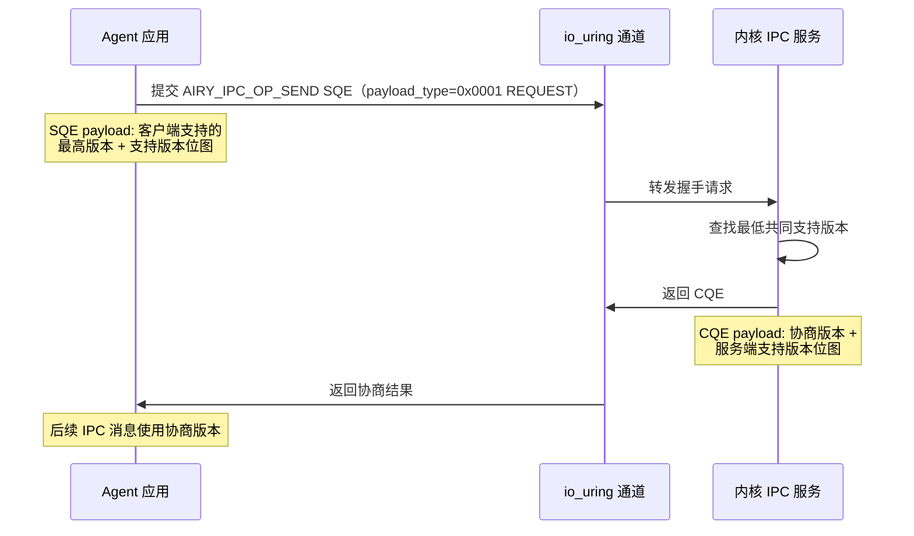
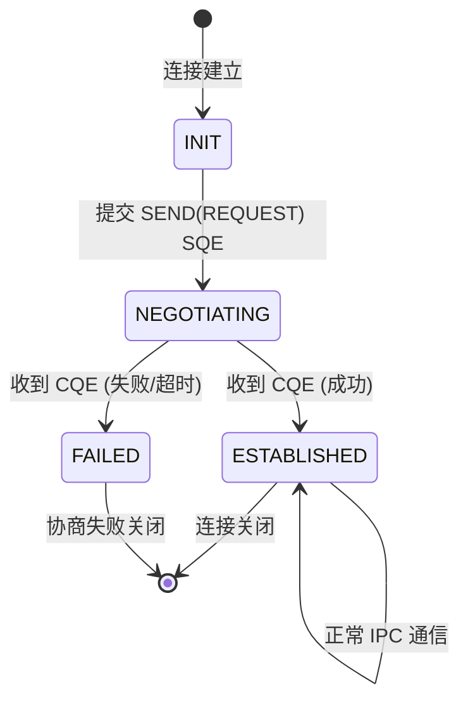
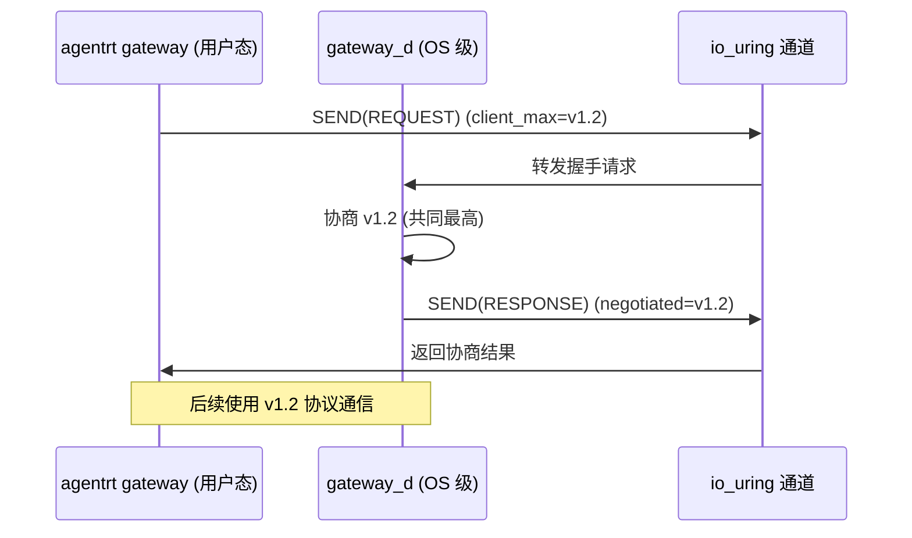
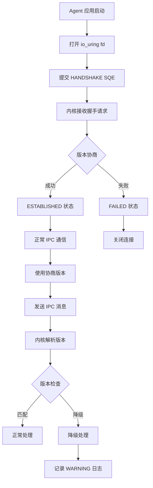

Copyright (c) 2025-2026 SPHARX Ltd. All Rights Reserved.

# AgentsIPC 版本协商实现方案
> **文档定位**：agentrt-linux（AirymaxOS，极境智能体操作系统）兼容性工程体系核心子文档，定义 AgentsIPC 协议的版本化演进与运行时协商机制\
> **文档版本**：0.1.1\
> **最后更新**：2026-07-09\
> **上级文档**：[agentrt-linux 设计文档](README.md)\
> **同源映射**：Linux 6.6 系统调用兼容性（IRON-9 v3 [SC] 共享契约层，IPC 消息头与 agentrt 共享）\
> **理论根基**：Linux 6.6 UABI 永不破坏哲学 + seL4 接口契约 XML 思想 + Airymax K-2 接口契约化 + C-2 增量演化\
> **SPDX-License-Identifier**：AGPL-3.0-or-later OR Apache-2.0\
> **IRON-9 v3 层次**：[SC] 共享契约层（IPC 消息头 `struct airy_ipc_msg_hdr` 与 agentrt 共享）+ [IND] 完全独立层（版本协商逻辑为 agentrt-linux 专属）

---

## 目录

- [1. 设计目标与背景](#1-设计目标与背景)
- [2. 协议版本演进模型](#2-协议版本演进模型)
- [3. 128B 消息头版本识别](#3-128b-消息头版本识别)
- [4. 运行时协商协议](#4-运行时协商协议)
- [5. 版本兼容矩阵](#5-版本兼容矩阵)
- [6. 降级策略](#6-降级策略)
- [7. payload 协议版本化](#7-payload-协议版本化)
- [8. SQE/CQE 操作码版本化](#8-sqecqe-操作码版本化)
- [9. 网关协议协商](#9-网关协议协商)
- [10. 内核侧版本管理](#10-内核侧版本管理)
- [11. 用户态 SDK 版本协商](#11-用户态-sdk-版本协商)
- [12. 错误处理](#12-错误处理)
- [13. 数据流图](#13-数据流图)
- [14. 安全考量](#14-安全考量)
- [15. 性能约束](#15-性能约束)
- [16. IRON-9 v3 同源映射](#16-iron-9-v2-同源映射)
- [17. SDK 集成](#17-sdk-集成)
- [18. 使用示例](#18-使用示例)
- [19. 测试策略](#19-测试策略)
- [20. 合规声明](#20-合规声明)
- [21. 相关文档](#21-相关文档)

---

## 1. 设计目标与背景

### 1.1 设计目标

AgentsIPC 是 agentrt-linux 内核与用户态 Agent 之间的核心通信协议，承载所有 Agent 系统调用、事件通知、记忆卷载访问等关键数据流。协议版本化与运行时协商机制的设计达成以下工程目标：

1. **协议永不破坏（OS-IRON-001）**：已发布的 IPC 协议版本必须永久支持，新版本只能新增字段，不得删除或重排已有字段
2. **运行时协商**：通信双方在建立连接时自动协商最低共同支持版本，无需人工配置
3. **优雅降级**：当对端版本较低时，高版本端自动降级至兼容模式，仅使用对端支持的字段与操作码
4. **前向兼容**：旧版本客户端可以访问新版本服务端，未识别的字段被忽略
5. **可观测性**：版本协商过程全程可观测，便于诊断协议不兼容问题

### 1.2 背景与挑战

AgentsIPC 协议采用 128B 定长消息头（magic 0x41524531 'ARE1'），通过 io_uring SQE/CQE 通道在用户态与内核态之间传输。随着 agentrt-linux 从 1.0.1 演进至 5.0 LTS，IPC 协议必然需要扩展（新增操作码、新增 payload 类型、新增标志位）。如果不建立版本化机制，将出现以下问题：

- 旧版本 Agent 应用在新内核上运行时，可能因新字段语义变化而崩溃
- 新版本 Agent 应用在旧内核上运行时，可能因使用未实现操作码而失败
- 跨节点迁移时，不同版本内核之间的 IPC 协议不兼容

本方案参考 Linux 6.6 内核 UABI 永不破坏哲学（`Documentation/admin-guide/abi-stable.rst`）与 seL4 接口契约 XML 思想（`libsel4/arch_include/interfaces/sel4arch.xml` 定义系统调用接口版本），建立 AgentsIPC 协议版本化与运行时协商机制。

---

## 2. 协议版本演进模型

### 2.1 语义化版本策略

AgentsIPC 协议遵循语义化版本（Semantic Versioning）：

| 版本变更 | 含义 | 兼容性 | 触发条件 |
|---------|------|--------|---------|
| MAJOR（主版本） | 不兼容变更 | 需迁移 | 消息头布局变更、字段重排、字段语义变更 |
| MINOR（次版本） | 向后兼容新增 | 自动兼容 | 新增 payload 类型、新增操作码、新增标志位 |
| PATCH（修订版本） | 缺陷修复 | 完全兼容 | 文档澄清、实现修复 |

### 2.2 主版本演进约束

主版本变更（如 v1 → v2）是破坏性变更，agentrt-linux 承诺：

1. **永不强制迁移**：v1 协议永久支持，新版本只能作为可选并行协议
2. **双版本并存期**：主版本变更后，旧版本至少维护 2 个 LTS 周期（10 年）
3. **迁移工具**：提供自动化迁移工具，将 v1 payload 转换为 v2 payload
4. **明确废弃路径**：新版本发布时明确旧版本废弃时间表

### 2.3 版本号编码

协议版本号不编码在 128B 消息头中（SSoT `struct airy_ipc_msg_hdr` 无 `version` 字段）。消息头通过 `magic`（0x41524531 'ARE1'）标识协议族；版本协商在连接建立时通过握手协议完成，不使用每消息版本字段。版本号编解码宏仅用于握手 payload：

```c
/* IPC 128B 消息头定义见 [SC] 共享契约层（SSoT），不就地重定义 */
#include <airymax/ipc.h>
/* 结构体名称：struct airy_ipc_msg_hdr（Layout C，物理宿主见
 * 50-engineering-standards/120-cross-project-code-sharing.md §Layout C） */
```

> **SSoT 声明**：本节 IPC 128B 消息头不再就地重定义，以 `include/uapi/linux/airymax/ipc.h`（物理宿主见 `50-engineering-standards/120-cross-project-code-sharing.md` §Layout C）为单一数据源。结构体名称为 `struct airy_ipc_msg_hdr`（Layout C）。版本号编解码宏作为协议层语义保留，但消息头权威布局以 SSoT Layout C 为准（`opcode`/`flags`/`trace_id`/`timestamp_ns`/`src_task`/`dst_task`/`payload_len`/`reserved[84]`）。

```c
/* 版本号编解码宏 */
#define AIRY_IPC_VERSION_MAJOR(v)  ((uint8_t)((v) >> 8))
#define AIRY_IPC_VERSION_MINOR(v)  ((uint8_t)((v) & 0xFF))
#define AIRY_IPC_VERSION_MAKE(maj, min) ((((uint16_t)(maj)) << 8) | ((uint16_t)(min)))

/* 当前协议版本 */
#define AIRY_IPC_VERSION_1_0  AIRY_IPC_VERSION_MAKE(1, 0)
#define AIRY_IPC_VERSION_1_1  AIRY_IPC_VERSION_MAKE(1, 1)
#define AIRY_IPC_VERSION_1_2  AIRY_IPC_VERSION_MAKE(1, 2)
#define AIRY_IPC_VERSION_CURRENT  AIRY_IPC_VERSION_1_2
```

---

## 3. 128B 消息头版本识别

> **SSoT 对齐说明**：SSoT Layout C（`struct airy_ipc_msg_hdr`，定义于 `include/uapi/linux/airymax/ipc.h`）**不含 `version` 字段**。128B 消息头布局为 magic/opcode/flags/trace_id/timestamp_ns/src_task/dst_task/payload_len/reserved[84]，共 9 字段。协议版本识别依赖 `magic` 字段（0x41524531 'ARE1'），版本协商通过 §4 运行时握手协议完成，而非消息头内嵌版本号。

### 3.1 magic 字段版本识别

`magic` 字段（offset 0, 4 bytes, `__u32`）值 0x41524531（'ARE1'）是协议识别的唯一标识。magic 值永不变更，与 agentrt 逐字节一致（[SC] 共享契约层）。接收方校验 magic 失败时直接丢弃消息，返回 `-EPROTO`。

### 3.2 版本兼容范围

agentrt-linux 各版本通过运行时握手协议（§4）协商支持的特性集。内核版本与特性集映射：

| 内核版本 | 支持的特性集 | 默认协商特性集 |
|---------|------------|--------------|
| 1.0.1 | 基础 IPC（SEND/RECV/SEND_BATCH/CANCEL） | 基础 IPC |
| 1.0.2 | 基础 IPC + 零拷贝 | 基础 IPC + 零拷贝 |
| 2.0.1 | 基础 IPC + 零拷贝 + 序列号确认 | 全特性 |
| 3.0 LTS | 全特性 + 扩展保留字段 | 全特性 |
| 5.0 LTS | 全特性 + 扩展保留字段 + v3 扩展 | 全特性 + v3 扩展 |

### 3.3 reserved 字段扩展

`reserved[84]` 字段（offset 44, 84 bytes, `__u8[84]`）是保留字段，用于未来版本扩展。版本演进规则：

- v1.x：reserved 字段必须全零，接收方忽略非零值
- v2.0：reserved 前 8 字节用于扩展字段（如 `seq_num`、`ack_num`），剩余全零
- v3.0：reserved 前 16 字节用于扩展字段，剩余全零

旧版本内核解析新版本消息时，仅读取自身版本支持的字段，忽略 reserved 中的新字段。

---

## 4. 运行时协商协议

### 4.1 协商握手流程

Agent 应用在首次通过 io_uring 发送 IPC 消息前，必须执行版本协商握手：



### 4.2 协商数据结构

```c
/* include/uapi/linux/airymax/ipc.h [SC] 共享契约层 */

/* 握手请求 payload */
typedef struct airy_ipc_handshake_req {
    uint16_t client_max_version;    /* 客户端支持的最高版本 */
    uint16_t client_min_version;    /* 客户端支持的最低版本 */
    uint32_t client_version_bitmap; /* 客户端支持版本位图（bit n = v1.n）*/
    uint8_t  reserved[8];
} airy_ipc_handshake_req_t;

/* 握手响应 payload */
typedef struct airy_ipc_handshake_resp {
    uint16_t negotiated_version;    /* 协商确定的版本 */
    uint16_t server_max_version;    /* 服务端支持的最高版本 */
    uint32_t server_version_bitmap; /* 服务端支持版本位图 */
    uint32_t server_features;       /* 服务端特性标志 */
    uint8_t  reserved[4];
} airy_ipc_handshake_resp_t;

/* 特性标志位 */
#define AIRY_IPC_FEAT_FAST_PATH     0x01  /* 快速路径优化 */
#define AIRY_IPC_FEAT_BATCH_SUBMIT  0x02  /* 批量提交 */
#define AIRY_IPC_FEAT_ZERO_COPY     0x04  /* 零拷贝 */
#define AIRY_IPC_FEAT_TRACE_ID      0x08  /* trace_id 贯穿 */
```

### 4.3 协商算法

协商算法采用"最低共同支持版本"策略：

```c
/* kernel/ipc/version_negotiate.c [IND] */

/**
 * airy_ipc_negotiate_version - 协商 IPC 协议版本
 * @client_req: 客户端握手请求
 * @server_supported: 服务端支持版本位图
 *
 * 返回协商确定的版本，或 0 表示协商失败
 *
 * 算法：取客户端与服务端共同支持的最高版本
 */
uint16_t airy_ipc_negotiate_version(
    const airy_ipc_handshake_req_t *client_req,
    uint32_t server_supported)
{
    uint32_t common = client_req->client_version_bitmap & server_supported;

    if (common == 0) {
        /* 无共同版本，协商失败 */
        return 0;
    }

    /* 取共同支持的最高版本 */
    uint16_t negotiated = 0;
    for (int v = 15; v >= 0; v--) {
        if (common & (1U << v)) {
            negotiated = AIRY_IPC_VERSION_MAKE(1, v);
            break;
        }
    }

    /* 检查是否在客户端 min/max 范围内 */
    if (negotiated < client_req->client_min_version ||
        negotiated > client_req->client_max_version) {
        return 0;
    }

    return negotiated;
}
```

### 4.4 协商状态机

每个 io_uring 连接维护独立的协商状态：



---

## 5. 版本兼容矩阵

### 5.1 消息头字段兼容性

| 字段 | v1.0 | v1.1 | v1.2 | v2.0 | 兼容性 |
|------|------|------|------|------|--------|
| magic | ✓ | ✓ | ✓ | ✓ | 永不变更 |
| payload_len | ✓ | ✓ | ✓ | ✓ | 永不变更 |
| flags | ✓ | ✓ | ✓ | ✓ | 新标志位向后兼容 |
| src_task | ✓ | ✓ | ✓ | ✓ | 永不变更（__u64） |
| dst_task | ✓ | ✓ | ✓ | ✓ | 永不变更（__u64） |
| trace_id | ✓ | ✓ | ✓ | ✓ | 永不变更 |
| timestamp_ns | ✓ | ✓ | ✓ | ✓ | 永不变更 |
| reserved[0..7] | 忽略 | 忽略 | 忽略 | seq_num | v2.0 新增 |
| reserved[8..15] | 忽略 | 忽略 | 忽略 | ack_num | v2.0 新增 |
| reserved[16..83] | 忽略 | 忽略 | 忽略 | 忽略 | 保留 |

### 5.2 payload 类型版本化

5 种 payload 协议的版本化策略：

| payload 类型 | payload_type 值 | 版本化策略 |
|-------------|---------|-----------|
| AIRY_IPC_TYPE_REQUEST | 0x01 | 新增字段追加至尾部，旧版本忽略尾部 |
| AIRY_IPC_TYPE_RESPONSE | 0x02 | 同上 |
| AIRY_IPC_TYPE_EVENT | 0x03 | 同上 |
| AIRY_IPC_TYPE_STREAM | 0x04 | 流式数据，有序可靠投递 |
| AIRY_IPC_TYPE_NOTIFICATION | 0x05 | 尽力投递，无需响应 |

---

## 6. 降级策略

### 6.1 自动降级规则

当协商版本低于发送方期望版本时，发送方自动降级：

| 期望特性 | 降级行为 | 影响版本 |
|---------|---------|---------|
| trace_id 贯穿 | 退化为本地日志关联 | v1.0 → 无 trace_id |
| 批量提交 | 退化为单条提交 | v1.1 以下 |
| 零拷贝 | 退化为用户态拷贝 | v1.2 以下 |
| 序列号确认 | 退化为无序可靠传输 | v2.0 以下 |

### 6.2 降级日志

降级发生时记录 WARNING 日志，包含以下信息：

```c
/* 降级日志示例 */
log_write(LOG_WARN,
    "IPC version downgrade: client=v%d.%d server=v%d.%d negotiated=v%d.%d "
    "feature=fast_path disabled reason=server_version_too_low",
    AIRY_IPC_VERSION_MAJOR(client_ver),
    AIRY_IPC_VERSION_MINOR(client_ver),
    AIRY_IPC_VERSION_MAJOR(server_ver),
    AIRY_IPC_VERSION_MINOR(server_ver),
    AIRY_IPC_VERSION_MAJOR(negotiated),
    AIRY_IPC_VERSION_MINOR(negotiated));
```

---

## 7. payload 协议版本化

### 7.1 payload 扩展规则

payload 版本化遵循"只追加不修改"原则：

1. **新增字段**：追加至 payload 尾部，旧版本根据 `payload_len` 截断读取
2. **删除字段**：禁止删除，标记为 deprecated 并保留占位
3. **字段类型变更**：禁止变更，必须新增字段替代

### 7.2 payload 版本协商

每个 payload 类型内部可以定义子版本，通过 `flags` 字段高位编码：

```c
/* flags 高 8 位用于 payload 子版本 */
#define AIRY_IPC_FLAGS_PAYLOAD_VER_SHIFT  24
#define AIRY_IPC_FLAGS_PAYLOAD_VER_MASK   0xFF000000
#define AIRY_IPC_FLAGS_GET_PAYLOAD_VER(f) \
    (((f) & AIRY_IPC_FLAGS_PAYLOAD_VER_MASK) >> AIRY_IPC_FLAGS_PAYLOAD_VER_SHIFT)
```

---

## 8. SQE/CQE 操作码版本化

### 8.1 操作码编号约束

操作码遵循 SSoT 权威定义（见 `50-engineering-standards/120-cross-project-code-sharing.md` §Layout C），7 个操作码自 v1.1 起保持稳定，永不重定义、永不复用：

```c
/* include/uapi/linux/airymax/ipc.h [SC] 共享契约层（SSoT，不就地重定义） */
/* v1.1: opcode 已升级为宏定义，非 enum（见 [SC] ipc.h） */
#define AIRY_IPC_OP_SEND          0x0001
#define AIRY_IPC_OP_RECV          0x0002
#define AIRY_IPC_OP_SEND_BATCH    0x0003
#define AIRY_IPC_OP_CANCEL        0x0004
#define AIRY_IPC_OP_FREEZE        0x0005
#define AIRY_IPC_OP_CAP_REQUEST   0x0010
#define AIRY_IPC_OP_CAP_RESPONSE  0x0011
```

| 操作码 | 名称 | 层次 | 版本兼容性 |
|--------|------|------|-----------|
| 0x0001 | AIRY_IPC_OP_SEND | [SC] SSoT | v1.1+ 稳定 |
| 0x0002 | AIRY_IPC_OP_RECV | [SC] SSoT | v1.1+ 稳定 |
| 0x0003 | AIRY_IPC_OP_SEND_BATCH | [SC] SSoT | v1.1+ 稳定 |
| 0x0004 | AIRY_IPC_OP_CANCEL | [SC] SSoT | v1.1+ 稳定 |
| 0x0005 | AIRY_IPC_OP_FREEZE | [SC] SSoT | v1.1+ 稳定 |
| 0x0010 | AIRY_IPC_OP_CAP_REQUEST | [SC] SSoT | v1.1+ 稳定 |
| 0x0011 | AIRY_IPC_OP_CAP_RESPONSE | [SC] SSoT | v1.1+ 稳定 |
| >= 0x100 | [IND] 独立扩展 | [IND] agentrt-linux 专属 | 版本协商中按需引入 |

> **SSoT 约束**：操作码（0x0001-0x0011）由 SSoT 权威定义，本文档不重定义。agentrt-linux 专属扩展操作码（如 Agent 生命周期管理等）必须使用 >= 0x100 的值并标注 [IND] 独立扩展，避免与 SSoT 基础值（0x0001-0x0011）冲突。

### 8.2 未识别操作码处理

接收方收到未识别的操作码时返回 `-ENOSYS`：

```c
switch (opcode) {
case AIRY_IPC_OP_SEND:
    return handle_send(sqes, cqe);
case AIRY_IPC_OP_RECV:
    return handle_recv(sqes, cqe);
case AIRY_IPC_OP_SEND_BATCH:
    return handle_send_batch(sqes, cqe);
case AIRY_IPC_OP_CANCEL:
    return handle_cancel(sqes, cqe);
/* [IND] 独立扩展 opcode >= 0x100 由 agentrt-linux 专属处理 */
default:
    /* 未识别操作码 */
    cqe->res = -ENOSYS;
    log_write(LOG_WARN, "unsupported IPC opcode: 0x%04x", opcode);
    return 0;
}
```

---

## 9. 网关协议协商

### 9.1 gateway_d 与 agentrt gateway 协商

gateway_d（agentrt-linux OS 级网关）与 agentrt gateway（用户态网关）通过 [SS] 语义同源层保持网关语义一致，IPC 通道通过 [SC] 共享契约层共享 128B 消息头。两端建立连接时执行版本协商：



### 9.2 跨节点迁移版本协商

跨节点迁移时，源节点与目标节点的内核版本可能不同。迁移前执行 IPC 版本兼容性检查：

```c
/**
 * airy_ipc_check_migration_compat - 检查跨节点迁移 IPC 兼容性
 * @src_version: 源节点内核支持的协议版本位图
 * @dst_version: 目标节点内核支持的协议版本位图
 *
 * 返回 0 表示兼容，-EINVAL 表示不兼容
 */
int airy_ipc_check_migration_compat(uint32_t src_version,
                                       uint32_t dst_version)
{
    uint32_t common = src_version & dst_version;
    if (common == 0) {
        log_write(LOG_ERROR,
            "migration blocked: no common IPC version "
            "src=0x%08x dst=0x%08x", src_version, dst_version);
        return -EINVAL;
    }
    return 0;
}
```

---

## 10. 内核侧版本管理

### 10.1 版本注册表

内核维护一个全局版本注册表，记录支持的协议版本与特性：

```c
/* kernel/ipc/version_registry.c [IND] */

static const struct {
    uint16_t version;
    uint32_t features;
    const char *description;
} airy_ipc_supported_versions[] = {
    { AIRY_IPC_VERSION_1_0, 0, "v1.0 基础版本" },
    { AIRY_IPC_VERSION_1_1, AIRY_IPC_FEAT_TRACE_ID, "v1.1 新增 trace_id" },
    { AIRY_IPC_VERSION_1_2,
      AIRY_IPC_FEAT_TRACE_ID | AIRY_IPC_FEAT_BATCH_SUBMIT,
      "v1.2 新增批量提交" },
    { 0, 0, NULL }  /* 终止符 */
};

uint32_t airy_ipc_get_supported_bitmap(void)
{
    uint32_t bitmap = 0;
    for (int i = 0; airy_ipc_supported_versions[i].version; i++) {
        uint8_t minor = AIRY_IPC_VERSION_MINOR(
            airy_ipc_supported_versions[i].version);
        bitmap |= (1U << minor);
    }
    return bitmap;
}
```

### 10.2 sysfs 接口

通过 sysfs 暴露版本信息，便于用户态查询：

```bash
# 查看内核支持的 IPC 版本
cat /sys/kernel/agentrt/ipc/supported_versions
# 输出: v1.0 v1.1 v1.2

# 查看当前默认协商版本
cat /sys/kernel/agentrt/ipc/default_version
# 输出: v1.2

# 查看特性标志
cat /sys/kernel/agentrt/ipc/features
# 输出: fast_path batch_submit zero_copy trace_id
```

---

## 11. 用户态 SDK 版本协商

### 11.1 Python SDK

```python
# airymaxos-sdk-python/airymaxos/ipc/version.py

from enum import IntFlag
from typing import List

class IPCFeature(IntFlag):
    FAST_PATH = 0x01
    BATCH_SUBMIT = 0x02
    ZERO_COPY = 0x04
    TRACE_ID = 0x08

class IPCVersion:
    """AgentsIPC 协议版本管理"""

    def __init__(self, major: int, minor: int):
        self.major = major
        self.minor = minor

    @property
    def encoded(self) -> int:
        return (self.major << 8) | self.minor

    def __str__(self):
        return f"v{self.major}.{self.minor}"

    def __lt__(self, other):
        return self.encoded < other.encoded

class IPCNegotiator:
    """IPC 版本协商器"""

    def __init__(self, client_versions: List[IPCVersion]):
        self.client_versions = client_versions
        self.client_bitmap = sum(
            1 << v.minor for v in client_versions if v.major == 1
        )

    def negotiate(self, server_bitmap: int, server_features: int) -> IPCVersion:
        """与服务端协商版本"""
        common = self.client_bitmap & server_bitmap
        if common == 0:
            raise RuntimeError("no common IPC version")

        # 取共同支持的最高版本
        for v in sorted(self.client_versions, reverse=True):
            if (common >> v.minor) & 1:
                return v
        raise RuntimeError("negotiation failed")
```

### 11.2 Rust SDK

```rust
// airymaxos-sdk-rust/src/ipc/version.rs

#[derive(Debug, Clone, Copy, PartialEq, Eq, PartialOrd, Ord)]
pub struct IpcVersion {
    pub major: u8,
    pub minor: u8,
}

impl IpcVersion {
    pub const fn new(major: u8, minor: u8) -> Self {
        Self { major, minor }
    }

    pub const fn encoded(self) -> u16 {
        ((self.major as u16) << 8) | (self.minor as u16)
    }

    pub const fn v1_0() -> Self { Self::new(1, 0) }
    pub const fn v1_1() -> Self { Self::new(1, 1) }
    pub const fn v1_2() -> Self { Self::new(1, 2) }
}

bitflags::bitflags! {
    pub struct IpcFeatures: u32 {
        const FAST_PATH    = 0x01;
        const BATCH_SUBMIT = 0x02;
        const ZERO_COPY   = 0x04;
        const TRACE_ID    = 0x08;
    }
}

pub struct IpcNegotiator {
    client_versions: Vec<IpcVersion>,
}

impl IpcNegotiator {
    pub fn new(versions: Vec<IpcVersion>) -> Self {
        Self { client_versions: versions }
    }

    pub fn negotiate(&self, server_bitmap: u32) -> Result<IpcVersion, String> {
        let mut best = None;
        for &v in self.client_versions.iter().rev() {
            if v.major == 1 && (server_bitmap >> v.minor) & 1 == 1 {
                best = Some(v);
                break;
            }
        }
        best.ok_or_else(|| "no common IPC version".to_string())
    }
}
```

---

## 12. 错误处理

### 12.1 IPC 错误码

| 错误码 | 名称 | 含义 | 处理建议 |
|--------|------|------|---------|
| -EINVAL | AIRY_IPC_EINVAL | 无效参数 | 检查 payload 格式 |
| -ENOSYS | AIRY_IPC_ENOSYS | 未实现操作码 | 降级至已实现操作码 |
| -EPROTO | AIRY_IPC_EPROTO | 协议错误 | 检查 magic/version |
| -EOPNOTSUPP | AIRY_IPC_ENOTSUP | 版本不支持 | 降级至更低版本 |
| -ETIMEDOUT | AIRY_IPC_ETIMEOUT | 协商超时 | 重试或关闭连接 |

### 12.2 协商失败处理

```c
/* kernel/ipc/handshake.c [IND] */

int handle_handshake_failure(struct airy_ipc_connection *conn,
                             int error)
{
    switch (error) {
    case -EOPNOTSUPP:
        log_write(LOG_ERROR,
            "IPC handshake failed: version unsupported "
            "client_min=%d client_max=%d server_supported=0x%08x",
            conn->client_min, conn->client_max,
            airy_ipc_get_supported_bitmap());
        break;
    case -ETIMEDOUT:
        log_write(LOG_WARN,
            "IPC handshake timeout: client=%d retrying",
            conn->client_pid);
        /* 重试一次 */
        schedule_handshake_retry(conn);
        break;
    default:
        log_write(LOG_ERROR,
            "IPC handshake failed: error=%d client=%d",
            error, conn->client_pid);
    }
    return error;
}
```

---

## 13. 数据流图



---

## 14. 安全考量

### 14.1 版本伪造防护

攻击者可能伪造高版本号以触发未测试的代码路径。防护措施：

1. **版本白名单**：内核仅接受注册表中的版本，拒绝伪造版本
2. **特性验证**：高版本请求要求对应特性标志位有效
3. **审计日志**：所有版本协商过程记录审计日志

### 14.2 降级攻击防护

攻击者可能强迫降级至弱版本以绕过安全特性。防护措施：

1. **最低版本约束**：可配置最低协商版本，拒绝低于阈值的协商
2. **特性强制**：安全相关特性（如 trace_id）不可降级
3. **管理员告警**：强制降级触发管理员告警

```c
/* 最低版本约束配置 */
static uint16_t min_negotiated_version = AIRY_IPC_VERSION_1_1;

int airy_ipc_set_min_version(uint16_t min_ver)
{
    if (min_ver > AIRY_IPC_VERSION_CURRENT) {
        return -EINVAL;
    }
    min_negotiated_version = min_ver;
    log_write(LOG_INFO, "IPC minimum negotiated version set to v%d.%d",
        AIRY_IPC_VERSION_MAJOR(min_ver),
        AIRY_IPC_VERSION_MINOR(min_ver));
    return 0;
}
```

---

## 15. 性能约束

| 指标 | 目标值 | 测量方法 |
|------|--------|---------|
| 协商延迟 | ≤ 100μs | ftrace 追踪 |
| 协商成功率 | ≥ 99.99% | metrics 采集 |
| 版本检查开销 | ≤ 10ns/消息 | perf 剖析 |
| 降级日志开销 | ≤ 1μs/条 | ftrace 追踪 |

---

## 16. IRON-9 v3 同源映射

| 层次 | 共享内容 | 本文档使用 |
|------|---------|-----------|
| [SC] 共享契约层 | `include/uapi/linux/airymax/ipc.h` 128B 消息头 + magic 字段 | 消息头布局与 agentrt 共享 |
| [SS] 语义同源层 | 网关协议协商语义 | gateway_d 与 agentrt gateway 协商语义同源 |
| [IND] 完全独立层 | 版本协商逻辑 + 注册表 + sysfs | agentrt-linux 专属实现 |

---

## 17. SDK 集成

### 17.1 Python SDK 使用

```python
from airymaxos.ipc import IPCVersion, IPCNegotiator, IPCConnection

# 创建协商器
negotiator = IPCNegotiator([
    IPCVersion(1, 0),
    IPCVersion(1, 1),
    IPCVersion(1, 2),
])

# 建立连接
conn = IPCConnection("/dev/agentrt-ipc")
server_info = conn.handshake(negotiator)
print(f"Negotiated: {server_info.version}")
print(f"Features: {server_info.features}")

# 发送 IPC 消息
conn.send(opcode=0x10, payload=b"...", trace_id=12345)
```

### 17.2 Rust SDK 使用

```rust
use airymaxos::ipc::{IpcVersion, IpcNegotiator, IpcConnection};

let negotiator = IpcNegotiator::new(vec![
    IpcVersion::v1_0(),
    IpcVersion::v1_1(),
    IpcVersion::v1_2(),
]);

let mut conn = IpcConnection::open("/dev/agentrt-ipc")?;
let info = conn.handshake(&negotiator)?;
println!("Negotiated: {:?}", info.version);

conn.send(0x10, b"...", Some(12345))?;
```

---

## 18. 使用示例

### 18.1 基本版本协商

```bash
# 查看 Agent 应用的 IPC 版本支持
agentctl ipc version
# 输出:
# Client supports: v1.0 v1.1 v1.2
# Server supports: v1.0 v1.1 v1.2
# Negotiated: v1.2
# Features: fast_path batch_submit zero_copy trace_id

# 查看特定连接的协商状态
agentctl ipc status --pid 1234
# 输出:
# PID: 1234
# State: ESTABLISHED
# Negotiated version: v1.2
# Features: fast_path batch_submit zero_copy trace_id
```

### 18.2 降级场景诊断

```bash
# 旧版本 Agent 在新内核上运行
agentctl ipc diagnose --pid 5678
# 输出:
# PID: 5678
# Client version: v1.0
# Server version: v1.2
# Negotiated version: v1.0 (downgraded)
# Disabled features: batch_submit zero_copy
# Warnings: 2 (see /var/log/agentrt/ipc-downgrade.log)
```

---

## 19. 测试策略

### 19.1 单元测试

```python
# tests/test_ipc_versioning.py
import pytest
from airymaxos.ipc import IPCVersion, IPCNegotiator

class TestIPCVersionNegotiation:
    def test_negotiate_highest_common(self):
        negotiator = IPCNegotiator([IPCVersion(1,0), IPCVersion(1,2)])
        result = negotiator.negotiate(server_bitmap=0b101)  # v1.0 + v1.2
        assert result == IPCVersion(1, 2)

    def test_negotiate_lowest_when_no_high(self):
        negotiator = IPCNegotiator([IPCVersion(1,0), IPCVersion(1,2)])
        result = negotiator.negotiate(server_bitmap=0b001)  # v1.0 only
        assert result == IPCVersion(1, 0)

    def test_negotiate_fail_no_common(self):
        negotiator = IPCNegotiator([IPCVersion(1,2)])
        with pytest.raises(RuntimeError):
            negotiator.negotiate(server_bitmap=0b001)  # v1.0 only
```

### 19.2 集成测试

```bash
# KUnit 测试
make kunitconfig CONFIG_AIRY_IPC_KUNIT=y
make test

# 版本兼容性矩阵测试
./tests/ipc/version_matrix_test.sh
```

### 19.3 混沌测试

- 旧版本客户端 + 新版本服务端
- 新版本客户端 + 旧版本服务端
- 协商超时重试
- 伪造版本号攻击

---

## 20. 合规声明

- **OS-IRON-001 遵守**：已发布的 IPC 协议版本永久支持，永不破坏
- **IRON-9 v3 遵守**：IPC 消息头 [SC] 共享契约层与 agentrt 共享，版本协商逻辑 [IND] 独立
- **seL4 唯一来源遵守**：接口契约 XML 思想借鉴 seL4，不引入其他微内核
- **Linux 6.6 基线遵守**：UABI 永不破坏哲学对齐 Linux 6.6

---

## 21. 相关文档

- `160-compatibility/01-abi-stability.md`（用户空间 ABI 稳定性）
- `160-compatibility/02-posix-compat.md`（POSIX 兼容性）
- `160-compatibility/03-upstream-tracking.md`（上游跟踪策略）
- `160-compatibility/05-cross-distro.md`（跨发行版兼容性）
- `10-architecture/05-adrs.md`（架构决策记录）
- `50-engineering-standards/08-compliance-checklist.md`（合规检查清单）

---

> **文档结束** | AgentsIPC 版本协商实现方案 | IRON-9 v3 [SC] + [IND]
