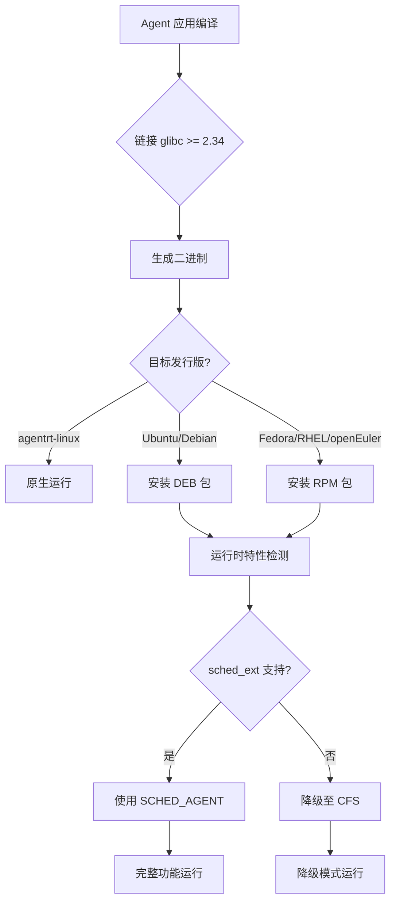

Copyright (c) 2025-2026 SPHARX Ltd. All Rights Reserved.

# 跨发行版兼容性实现方案

> **文档定位**：agentrt-linux（AirymaxOS，极境智能体操作系统）兼容性工程体系核心子文档，定义 agentrt-linux 与主流 Linux 发行版的二进制兼容性机制\
> **版本**：0.1.1（文档体系完成）/ 1.0.1（开发）\
> **最后更新**：2026-07-09\
> **理论根基**：Linux 6.6 LSB/FHS 兼容性 + openEuler 发行版兼容性思想 + Airymax K-2 接口契约化 + C-2 增量演化\
> **SPDX-License-Identifier**：AGPL-3.0-or-later OR Apache-2.0\
> **同源映射**：Linux 6.6 发行版兼容性（IRON-9 v2 [IND] 完全独立层，发行版兼容为 agentrt-linux 专属）\
> **IRON-9 v2 层次**：[IND] 完全独立层（跨发行版兼容为 agentrt-linux 发行版专属）

---

## 目录

- [1. 设计目标与背景](#1-设计目标与背景)
- [2. 兼容性层级模型](#2-兼容性层级模型)
- [3. 主流发行版支持矩阵](#3-主流发行版支持矩阵)
- [4. glibc 兼容性](#4-glibc-兼容性)
- [5. 内核模块兼容性](#5-内核模块兼容性)
- [6. Agent 应用可移植性](#6-agent-应用可移植性)
- [7. 包管理兼容性](#7-包管理兼容性)
- [8. 文件系统层次标准（FHS）](#8-文件系统层次标准fhs)
- [9. 容器镜像兼容性](#9-容器镜像兼容性)
- [10. systemd 服务兼容性](#10-systemd-服务兼容性)
- [11. openEuler 标准兼容性](#11-openeuler-标准兼容性)
- [12. 兼容性测试矩阵](#12-兼容性测试矩阵)
- [13. 已知限制与降级策略](#13-已知限制与降级策略)
- [14. 数据流图](#14-数据流图)
- [15. 错误处理](#15-错误处理)
- [16. 安全考量](#16-安全考量)
- [17. 性能约束](#17-性能约束)
- [18. IRON-9 v2 同源映射](#18-iron-9-v2-同源映射)
- [19. SDK 集成](#19-sdk-集成)
- [20. 使用示例](#20-使用示例)
- [21. 测试策略](#21-测试策略)
- [22. 合规声明](#22-合规声明)
- [23. 相关文档](#23-相关文档)

---

## 1. 设计目标与背景

### 1.1 设计目标

agentrt-linux 作为智能体操作系统发行版，其 Agent 应用与生态工具需要在不同 Linux 发行版之间实现平滑移植。跨发行版兼容性机制的设计达成以下工程目标：

1. **Agent 应用一次编写，多发行版运行**：Agent 应用编译一次，可在 Ubuntu/Debian/Fedora/RHEL/openEuler 等主流发行版上运行
2. **内核模块按需加载**：agentrt-linux 专属内核模块在支持的发行版上按需加载，不支持的发行版降级至用户态
3. **包管理适配**：提供 RPM 与 DEB 双格式包，适配不同发行版的包管理器
4. **容器镜像统一**：Agent 容器镜像基于 OCI 标准，跨发行版可运行
5. **openEuler 标准兼容**：agentrt-linux 的工程思想与实现方式与 Euler 标准保持一致性

### 1.2 背景与挑战

Linux 发行版生态碎片化严重，不同发行版在以下维度存在差异：

- **glibc 版本**：Ubuntu 22.04 使用 glibc 2.35，Debian 12 使用 2.36，RHEL 9 使用 2.34
- **内核版本**：Ubuntu 22.04 使用 5.15/6.8，Fedora 40 使用 6.8，RHEL 9 使用 5.14
- **包管理器**：Ubuntu/Debian 使用 apt/dpkg，Fedora/RHEL/openEuler 使用 dnf/rpm
- **init 系统**：多数使用 systemd，但配置路径与版本不同
- **文件系统层次**：多数遵循 FHS，但部分路径存在差异

agentrt-linux 基于 Linux 6.6 内核，需要确保其 Agent 应用与工具链在不同发行版上兼容运行。

### 1.3 设计哲学

本方案遵循 Linux 6.6 发行版兼容性哲学（参考 openEuler 兼容性规范）与 seL4 接口最小化思想：

1. **接口契约化（K-2）**：明确声明兼容性边界，不承诺未声明的能力
2. **增量演化（C-2）**：兼容性矩阵随版本演进逐步扩展
3. **优雅降级**：不兼容时提供降级路径而非直接失败
4. **可测试性（E-8）**：建立完整的兼容性测试矩阵

---

## 2. 兼容性层级模型

### 2.1 六层兼容性分级

| 层级 | 类型 | 范围 | 兼容性承诺 |
|------|------|------|-----------|
| L1 | 二进制兼容 | 用户态二进制（glibc 链接） | 向后兼容（低版本 glibc 编译可在高版本运行） |
| L2 | 内核 ABI | 系统调用接口 | 永不破坏（OS-IRON-001） |
| L3 | 内核模块 | agentrt-linux 专属模块 | 按发行版内核版本适配 |
| L4 | 包格式 | RPM/DEB 包 | 双格式发布 |
| L5 | 容器镜像 | OCI 镜像 | 跨发行版可运行 |
| L6 | 配置路径 | FHS 路径 | 兼容主流发行版路径 |

### 2.2 兼容性优先级

| 优先级 | 兼容性类型 | 保障措施 |
|--------|-----------|---------|
| P0 | Agent 应用二进制兼容 | 静态链接关键库 + glibc 版本下限 |
| P0 | 内核 ABI 兼容 | UABI 永不破坏 + KABI 白名单 |
| P1 | 内核模块兼容 | 按内核版本编译 + DKMS |
| P1 | 包格式兼容 | RPM + DEB 双格式 |
| P2 | 容器镜像兼容 | OCI 标准 + 多架构 |
| P2 | 配置路径兼容 | FHS + 发行版特定路径适配 |

---

## 3. 主流发行版支持矩阵

### 3.1 发行版支持矩阵

| 发行版 | 版本 | 内核版本 | glibc 版本 | 包管理 | 兼容等级 | 说明 |
|--------|------|---------|-----------|--------|---------|------|
| **agentrt-linux** | 1.0.1 | 6.6 | 2.38 | dnf/rpm | 原生 | 完整支持 |
| Ubuntu | 24.04 LTS | 6.8 | 2.39 | apt/dpkg | L1+L4+L5 | Agent 应用二进制兼容 |
| Ubuntu | 22.04 LTS | 5.15/6.8 | 2.35 | apt/dpkg | L1+L4+L5 | Agent 应用二进制兼容 |
| Debian | 12 | 6.1 | 2.36 | apt/dpkg | L1+L4+L5 | Agent 应用二进制兼容 |
| Fedora | 40 | 6.8 | 2.39 | dnf/rpm | L1+L3+L4+L5 | 内核模块可加载 |
| Fedora | 41 | 6.10 | 2.40 | dnf/rpm | L1+L3+L4+L5 | 内核模块可加载 |
| RHEL | 9 | 5.14 | 2.34 | dnf/rpm | L1+L4+L5 | Agent 应用二进制兼容 |
| openEuler | 24.03 LTS | 6.6 | 2.38 | dnf/rpm | L1+L3+L4+L5 | 完整兼容（同源 6.6 基线） |
| openEuler | 26.03 | 6.6+ | 2.39+ | dnf/rpm | L1+L3+L4+L5 | 完整兼容 |

### 3.2 兼容等级说明

- **原生**：agentrt-linux 自身，完整支持所有特性
- **L1+L3+L4+L5**：Agent 应用二进制兼容 + 内核模块可加载 + 包格式兼容 + 容器镜像兼容
- **L1+L4+L5**：Agent 应用二进制兼容 + 包格式兼容 + 容器镜像兼容（内核模块不可加载）

### 3.3 不支持的发行版

以下发行版因技术原因不支持：

| 发行版 | 原因 |
|--------|------|
| CentOS 7 | glibc 2.17 过低，内核 3.10 过旧 |
| Ubuntu 20.04 | 内核 5.4 不满足 sched_ext 要求 |
| Alpine Linux | musl libc 非 glibc，需额外适配 |
| NixOS | 非标准 FHS 路径，需额外配置 |

---

## 4. glibc 兼容性

### 4.1 glibc 版本下限

agentrt-linux Agent 应用编译时链接的 glibc 版本下限为 **2.34**（RHEL 9 基线），确保向后兼容：

```bash
# 编译时指定 glibc 版本
gcc -o agent_app agent_app.c \
    -Wl,--hash-style=gnu \
    -Wl,-z,now \
    -Wl,-z,relro \
    -D_GNU_SOURCE
```

### 4.2 glibc 符号版本化

使用 glibc 符号版本化机制确保向后兼容：

```c
/* 使用 __asm__ 声明符号版本 */
__asm__(".symver old_function,function@GLIBC_2.2.5");
__asm__(".symver new_function,function@@GLIBC_2.34");
```

### 4.3 静态链接关键库

对于不依赖 glibc 的关键库（如 seL4 capability 库），采用静态链接：

```bash
# 静态链接 libagentrt_capability
gcc -o agent_app agent_app.c \
    -lagentrt_capability_static \
    -Wl,-Bstatic -lagentrt_capability -Wl,-Bdynamic \
    -lc -lpthread
```

---

## 5. 内核模块兼容性

### 5.1 内核版本适配

agentrt-linux 内核模块针对不同发行版内核版本进行适配：

| 内核版本 | 发行版 | sched_ext 支持 | 模块适配策略 |
|---------|--------|---------------|-------------|
| 6.6 | agentrt-linux / openEuler 24.03 | 原生 | 完整功能 |
| 6.8 | Ubuntu 24.04 / Fedora 40 | 原生 | 完整功能 |
| 6.1 | Debian 12 | 需 backport | 降级至用户态调度 |
| 5.15 | Ubuntu 22.04 (HWE) | 需 backport | 降级至用户态调度 |
| 5.14 | RHEL 9 | 不支持 | 降级至用户态调度 |

### 5.2 DKMS 动态编译

对于非 6.6 内核的发行版，通过 DKMS（Dynamic Kernel Module Support）动态编译内核模块：

```bash
# 安装 DKMS 包
dnf install agentrt-linux-dkms

# 或
apt install agentrt-linux-dkms

# DKMS 自动编译
dkms autoinstall
```

### 5.3 内核特性检测

运行时检测内核特性，降级使用：

```c
/* airymaxos-services/compat/kernel_feature_detect.c [IND] */

/**
 * agentrt_detect_sched_ext - 检测内核是否支持 sched_ext
 *
 * 返回 1 表示支持，0 表示不支持
 */
int agentrt_detect_sched_ext(void)
{
    if (access("/sys/kernel/sched_ext", F_OK) == 0) {
        log_write(LOG_INFO, "sched_ext supported: using SCHED_AGENT");
        return 1;
    }
    log_write(LOG_WARN, "sched_ext not supported: falling back to CFS");
    return 0;
}

/**
 * agentrt_detect_io_uring - 检测内核是否支持 io_uring
 */
int agentrt_detect_io_uring(void)
{
    struct io_uring_params params;
    int fd = syscall(__NR_io_uring_setup, 1, &params);
    if (fd >= 0) {
        close(fd);
        log_write(LOG_INFO, "io_uring supported: using zero-copy IPC");
        return 1;
    }
    log_write(LOG_WARN, "io_uring not supported: falling back to unix socket");
    return 0;
}
```

---

## 6. Agent 应用可移植性

### 6.1 可移植性分级

| 级别 | 描述 | 兼容性 |
|------|------|--------|
| Platinum | 纯用户态 Agent，仅依赖 glibc | 所有 L1 兼容发行版 |
| Gold | 依赖 agentrt SDK 用户态库 | 所有安装 agentrt-sdk 的发行版 |
| Silver | 依赖 agentrt-linux 内核模块 | 仅 L3 兼容发行版 |
| Bronze | 依赖特定硬件（GPU/NPU/DPU） | 仅特定硬件发行版 |

### 6.2 可移植性检查工具

```bash
# 检查 Agent 应用的可移植性
agentctl app check-portability my-agent

# 输出:
# Agent: my-agent
# Portability level: Gold
# Dependencies:
#   - glibc >= 2.34 ✓
#   - libagentrt_sdk >= 1.0.1 ✓
#   - sched_ext (optional) ✓
#   - io_uring (optional) ✓
# Compatible distributions:
#   - agentrt-linux 1.0.1
#   - Ubuntu 24.04 LTS
#   - Ubuntu 22.04 LTS
#   - Debian 12
#   - Fedora 40
#   - RHEL 9
#   - openEuler 24.03 LTS
```

---

## 7. 包管理兼容性

### 7.1 双格式包发布

agentrt-linux 同时发布 RPM 与 DEB 格式包：

```bash
# RPM 格式（Fedora/RHEL/openEuler/agentrt-linux）
airymaxos-kernel-1.0.1-1.x86_64.rpm
airymaxos-services-1.0.1-1.x86_64.rpm
airymaxos-sdk-python-1.0.1-1.x86_64.rpm

# DEB 格式（Ubuntu/Debian）
airymaxos-kernel_1.0.1-1_amd64.deb
airymaxos-services_1.0.1-1_amd64.deb
airymaxos-sdk-python_1.0.1-1_amd64.deb
```

### 7.2 包依赖声明

```spec
# RPM spec 依赖声明
Requires: glibc >= 2.34
Requires: systemd >= 239
Recommends: io_uring-tools
Suggests: bpftrace
```

```control
# DEB control 依赖声明
Depends: libc6 (>= 2.34), systemd (>= 239)
Recommends: liburing-dev
Suggests: bpftrace
```

---

## 8. 文件系统层次标准（FHS）

### 8.1 FHS 兼容路径

agentrt-linux 遵循 FHS（Filesystem Hierarchy Standard）3.0：

| 路径 | 用途 | FHS 兼容 |
|------|------|---------|
| /etc/agentrt/ | 配置文件 | ✓ |
| /var/lib/agentrt/ | 运行时数据 | ✓ |
| /var/log/agentrt/ | 日志文件 | ✓ |
| /usr/lib/agentrt/ | 库文件 | ✓ |
| /usr/include/agentrt/ | 头文件 | ✓ |
| /usr/bin/agentctl | 命令行工具 | ✓ |
| /usr/sbin/agentrt-daemon | 系统守护进程 | ✓ |
| /opt/agentrt/ | 可选组件 | ✓（FHS 可选） |

### 8.2 发行版特定路径适配

部分发行版有特定路径约定，agentrt-linux 适配如下：

| 发行版 | 特定路径 | 适配策略 |
|--------|---------|---------|
| Ubuntu/Debian | /usr/lib/<arch>-linux-gnu/ | 创建符号链接 |
| Fedora/RHEL | /usr/libexec/ | 将内部工具放此目录 |
| openEuler | /etc/sysconfig/ | 配置文件兼容 |

---

## 9. 容器镜像兼容性

### 9.1 OCI 镜像跨发行版

Agent 容器镜像基于 OCI 标准，可在任何支持 OCI 的容器运行时上运行：

```dockerfile
# Agent 镜像 Dockerfile
FROM ubuntu:22.04 AS builder
RUN apt-get update && apt-get install -y build-essential
COPY . /src
WORKDIR /src
RUN gcc -o agent_app agent_app.c

FROM ubuntu:22.04
COPY --from=builder /src/agent_app /usr/local/bin/
ENTRYPOINT ["/usr/local/bin/agent_app"]
```

### 9.2 多架构镜像

```bash
# 构建多架构镜像
docker buildx build --platform linux/amd64,linux/arm64 \
    -t registry.airymaxos.dev/my-agent:v1.0.1 \
    --push .
```

---

## 10. systemd 服务兼容性

### 10.1 systemd 服务单元

```ini
# /usr/lib/systemd/system/agentrt-daemon.service
[Unit]
Description=AirymaxOS Agent Runtime Daemon
After=network.target
After=syslog.target

[Service]
Type=simple
ExecStart=/usr/sbin/agentrt-daemon
Restart=always
RestartSec=5
LimitNOFILE=65536

[Install]
WantedBy=multi-user.target
```

### 10.2 不同发行版 systemd 版本

| 发行版 | systemd 版本 | 兼容性 |
|--------|-------------|--------|
| agentrt-linux | 255+ | 完整功能 |
| Ubuntu 24.04 | 255 | 完整功能 |
| Ubuntu 22.04 | 249 | 完整功能 |
| Debian 12 | 252 | 完整功能 |
| Fedora 40 | 255 | 完整功能 |
| RHEL 9 | 239 | 基本功能（部分指令不支持） |
| openEuler 24.03 | 252 | 完整功能 |

---

## 11. openEuler 标准兼容性

### 11.1 工程思想一致性

agentrt-linux 的工程思想与实现方式与 openEuler 保持一致性（参考 openEuler 24.03 LTS / 26.03）：

| 兼容层次 | 内容 | 状态 |
|---------|------|------|
| 协议层兼容 | kthread/IPC/capability 协议 | ✓ 对齐 |
| 接入层兼容 | accel/drm_sched/eBPF 模式 | ✓ 对齐 |
| 模块化兼容 | Kconfig/Makefile/Kbuild | ✓ 对齐 |
| 工具链兼容 | GCC/Clang/Rust/RPM/dnf | ✓ 对齐 |

### 11.2 代码共享边界澄清

- **agentrt ↔ AirymaxOS**：共享 [SC] 共享契约层代码（6 个头文件）
- **AirymaxOS ↔ openEuler**：仅技术参考，不共享代码
- **AirymaxOS ↔ Euler 标准发行版**：工具链兼容，可运行 Euler 标准 RPM 包

---

## 12. 兼容性测试矩阵

### 12.1 测试矩阵

| 测试维度 | 测试内容 | 发行版 |
|---------|---------|--------|
| 二进制兼容 | Agent 应用运行 | Ubuntu/Debian/Fedora/RHEL/openEuler |
| 内核模块 | 模块加载与卸载 | Fedora/openEuler |
| 包安装 | RPM/DEB 安装与卸载 | 全部 |
| 容器镜像 | 镜像构建与运行 | 全部 |
| systemd 服务 | 服务启动与停止 | 全部 |
| FHS 路径 | 路径访问 | 全部 |

### 12.2 CI/CD 兼容性测试

```yaml
# .github/workflows/compat-matrix.yml
matrix:
  distro:
    - ubuntu:24.04
    - ubuntu:22.04
    - debian:12
    - fedora:40
    - fedora:41
    - rhel:9
    - openeuler:24.03
  arch:
    - amd64
    - arm64

steps:
  - name: Install agentrt-linux packages
    run: |
      if command -v dnf; then
        dnf install -y airymaxos-services
      else
        apt install -y airymaxos-services
      fi
  - name: Run compatibility tests
    run: agentctl test compat
```

---

## 13. 已知限制与降级策略

### 13.1 已知限制

| 限制 | 影响发行版 | 降级策略 |
|------|-----------|---------|
| sched_ext 不支持 | RHEL 9 / Ubuntu 20.04 | 降级至 CFS 调度 |
| io_uring 不支持 | RHEL 9（旧版） | 降级至 unix socket |
| BPF 不可用 | 部分嵌入式发行版 | 降级至用户态过滤 |
| CXL 不可用 | 非 CXL 硬件 | 降级至本地内存 |
| PMEM 不可用 | 非 PMEM 硬件 | 降级至 DRAM |

### 13.2 降级通知

```c
/* 降级时通知 Agent 应用 */
void agentrt_notify_fallback(const char *feature,
                              const char *reason)
{
    log_write(LOG_WARN,
        "feature fallback: %s reason=%s agent=%d",
        feature, reason, current_agent_id);

    /* 通过 IPC 通知 Agent */
    agentrt_ipc_event_t event = {
        .type = AGENTRT_EVENT_FEATURE_FALLBACK,
        .feature = feature,
        .reason = reason,
    };
    agentrt_ipc_send_event(current_agent_id, &event);
}
```

---

## 14. 数据流图



---

## 15. 错误处理

### 15.1 兼容性错误码

| 错误码 | 名称 | 含义 |
|--------|------|------|
| -ENODISTRO | AGENTRT_ENODISTRO | 不支持的发行版 |
| -ENOKERN | AGENTRT_ENOKERN | 内核版本过低 |
| -ENOGLIBC | AGENTRT_ENOGLIBC | glibc 版本过低 |
| -ENOMOD | AGENTRT_ENOMOD | 内核模块加载失败 |
| -ENOFALLBACK | AGENTRT_ENOFALLBACK | 无可用降级路径 |

### 15.2 错误诊断

```bash
# 诊断兼容性问题
agentctl compat diagnose
# 输出:
# Distribution: Ubuntu 22.04 LTS
# Kernel: 5.15.0-91-generic
# glibc: 2.35
# sched_ext: not supported (fallback: CFS)
# io_uring: supported
# BPF: supported
# Status: Silver (降级模式)
```

---

## 16. 安全考量

### 16.1 包签名验证

所有发布的 RPM 与 DEB 包使用 GPG 签名：

```bash
# 导入 GPG 公钥
rpm --import https://repo.airymaxos.dev/RPM-GPG-KEY-airymaxos
# 或
wget -qO - https://repo.airymaxos.dev/DEB-GPG-KEY-airymaxos | apt-key add -

# 验证包签名
rpm --checksig airymaxos-kernel-1.0.1-1.x86_64.rpm
```

### 16.2 内核模块签名

内核模块使用内核签名机制：

```bash
# 签名内核模块
/usr/src/linux-6.6/scripts/sign-file sha256 \
    /etc/agentrt/keys/private_key.pem \
    /etc/agentrt/keys/public_key.x509 \
    agentrt_sched.ko
```

---

## 17. 性能约束

| 指标 | 目标值 | 说明 |
|------|--------|------|
| 兼容性检测开销 | ≤ 1ms | 启动时一次性检测 |
| 降级性能损失 | ≤ 20% | 相比原生模式 |
| 包安装时间 | ≤ 30s | 标准安装 |
| 容器镜像大小 | ≤ 200MB | 基础镜像 |

---

## 18. IRON-9 v2 同源映射

| 层次 | 共享内容 | 本文档使用 |
|------|---------|-----------|
| [SC] 共享契约层 | 无（发行版兼容为 [IND]） | 不涉及 |
| [SS] 语义同源层 | Agent 应用可移植性语义 | 与 agentrt 应用可移植性语义同源 |
| [IND] 完全独立层 | 跨发行版兼容性 + 包格式 + FHS 适配 | agentrt-linux 发行版专属 |

---

## 19. SDK 集成

### 19.1 Python SDK 兼容性检测

```python
from airymaxos.compat import DistroCompat

compat = DistroCompat.detect()
print(f"Distribution: {compat.distro}")
print(f"Kernel: {compat.kernel_version}")
print(f"glibc: {compat.glibc_version}")
print(f"sched_ext: {'supported' if compat.has_sched_ext else 'not supported'}")
print(f"Compatibility level: {compat.level}")
```

### 19.2 Rust SDK 兼容性检测

```rust
use airymaxos::compat::DistroCompat;

let compat = DistroCompat::detect()?;
println!("Distribution: {}", compat.distro);
println!("Kernel: {}", compat.kernel_version);
println!("Compatibility level: {:?}", compat.level);
```

---

## 20. 使用示例

### 20.1 在 Ubuntu 上安装 agentrt-linux 组件

```bash
# 添加 agentrt-linux 仓库
wget -qO - https://repo.airymaxos.dev/DEB-GPG-KEY-airymaxos | sudo apt-key add -
echo "deb https://repo.airymaxos.dev/ubuntu jammy main" | \
    sudo tee /etc/apt/sources.list.d/airymaxos.list

# 安装
sudo apt update
sudo apt install airymaxos-services airymaxos-sdk-python

# 验证
agentctl version
agentctl compat diagnose
```

### 20.2 在 Fedora 上加载内核模块

```bash
# 安装 DKMS 包
sudo dnf install agentrt-linux-dkms kernel-devel

# 编译并加载内核模块
sudo dkms autoinstall
sudo modprobe agentrt_sched

# 验证
lsmod | grep agentrt
cat /sys/kernel/agentrt/status
```

---

## 21. 测试策略

### 21.1 兼容性测试矩阵

```bash
# 运行完整兼容性测试矩阵
agentctl test compat --matrix full

# 测试特定发行版
agentctl test compat --distro ubuntu:22.04
agentctl test compat --distro fedora:40
agentctl test compat --distro openeuler:24.03
```

### 21.2 回归测试

```bash
# 每次发布前运行回归测试
agentctl test compat --regression
```

---

## 22. 合规声明

- **OS-IRON-001 遵守**：跨发行版兼容性不破坏 UABI 稳定性
- **IRON-9 v2 遵守**：跨发行版兼容为 [IND] 独立层
- **openEuler 标准兼容**：工程思想与实现方式与 Euler 保持一致性
- **FHS 3.0 遵守**：文件系统路径遵循 FHS 3.0 标准
- **OCI 标准遵守**：容器镜像遵循 OCI 标准

---

## 23. 相关文档

- `160-compatibility/01-abi-stability.md`（用户空间 ABI 稳定性）
- `160-compatibility/02-posix-compat.md`（POSIX 兼容性）
- `160-compatibility/03-upstream-tracking.md`（上游跟踪策略）
- `160-compatibility/04-ipc-versioning.md`（AgentsIPC 版本协商）
- `190-distribution/README.md`（发行版管理）
- `190-distribution/01-rpm-packaging.md`（RPM 打包规范）
- `50-engineering-standards/08-compliance-checklist.md`（合规检查清单）

---

> **文档结束** | 跨发行版兼容性实现方案 | IRON-9 v2 [IND]
