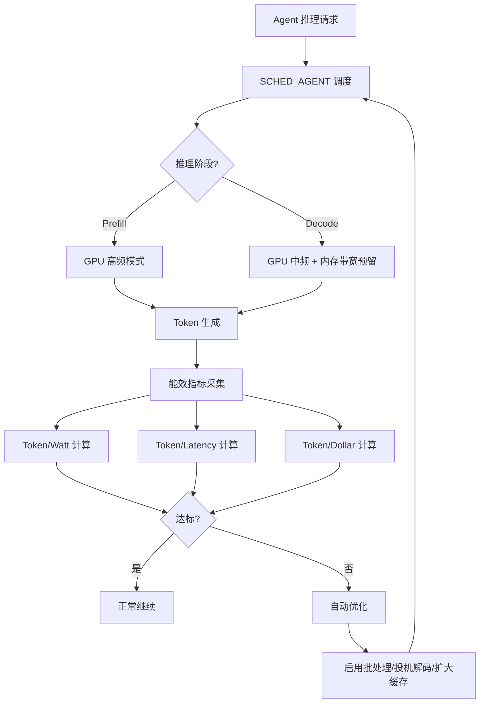

Copyright (c) 2025-2026 SPHARX Ltd. All Rights Reserved.

# Token 能效工程实现方案

> **文档定位**：agentrt-linux（AirymaxOS，极境智能体操作系统）性能工程体系核心子文档，定义 Token 能效的测量、优化与保障机制\
> **版本**：0.1.1（文档体系完成）/ 1.0.1（开发）\
> **最后更新**：2026-07-09\
> **理论根基**：Linux 6.6 perf 功耗剖析 + seL4 时间隔离（MCS）思想 + Airymax S-1 反馈闭环 + A-4 完美主义\
> **SPDX-License-Identifier**：AGPL-3.0-or-later OR Apache-2.0\
> **同源映射**：agentrt 性能基线（IRON-9 v2 [SS] 语义同源层，Token 能效指标语义同源）\
> **IRON-9 v2 层次**：[SS] 语义同源层（Token 能效指标语义与 agentrt 同源）+ [IND] 完全独立层（内核态测量与优化为 agentrt-linux 专属）

---

## 目录

- [1. 设计目标与背景](#1-设计目标与背景)
- [2. 三大能效指标体系](#2-三大能效指标体系)
- [3. Token / Watt（功耗能效）](#3-token--watt功耗能效)
- [4. Token / Latency（延迟能效）](#4-token--latency延迟能效)
- [5. Token / Dollar（成本能效）](#5-token--dollar成本能效)
- [6. Token 预算契约与能效](#6-token-预算契约与能效)
- [7. LLM 推理阶段能效](#7-llm-推理阶段能效)
- [8. CoreLoopThree 能效](#8-coreloopthree-能效)
- [9. GPU/NPU 能效调度](#9-gpunpu-能效调度)
- [10. 能效测量基础设施](#10-能效测量基础设施)
- [11. 能效优化策略](#11-能效优化策略)
- [12. 能效回归检测](#12-能效回归检测)
- [13. 数据流图](#13-数据流图)
- [14. 错误处理](#14-错误处理)
- [15. 安全考量](#15-安全考量)
- [16. 性能约束](#16-性能约束)
- [17. IRON-9 v2 同源映射](#17-iron-9-v2-同源映射)
- [18. SDK 集成](#18-sdk-集成)
- [19. 使用示例](#19-使用示例)
- [20. 测试策略](#20-测试策略)
- [21. 合规声明](#21-合规声明)
- [22. 相关文档](#22-相关文档)

---

## 1. 设计目标与背景

### 1.1 设计目标

Token 能效工程是 agentrt-linux 区别于传统操作系统性能工程的核心特性。传统操作系统关注 CPU/内存/IO 能效，而智能体操作系统必须额外关注 Token 能效——每单位资源处理的 Token 数量。Token 能效工程的设计达成以下工程目标：

1. **可测量**：三大能效指标（Token/Watt、Token/Latency、Token/Dollar）均可精确测量
2. **可优化**：通过调度策略、缓存策略、批处理策略持续优化 Token 能效
3. **可保障**：建立 Token 能效 SLO，保障 Agent 应用的能效下限
4. **可追溯**：所有 Token 消耗可追溯到具体推理阶段与资源消耗
5. **可比较**：不同 Agent、不同硬件、不同配置的能效可横向比较

### 1.2 背景与挑战

LLM 推理是 Agent 应用最耗资源的环节，Token 生成涉及 prefill（预填充）与 decode（解码）两个阶段，两阶段的资源消耗特征截然不同：

- **Prefill 阶段**：计算密集型，GPU 利用率高，Token 吞吐量大
- **Decode 阶段**：内存带宽密集型，GPU 利用率低，Token 吞吐量小

agentrt-linux 需要在内核层面感知 Token 消耗与资源消耗的关联，通过 SCHED_AGENT 策略优化能效。本方案参考 Linux 6.6 perf 功耗剖析（`tools/perf/`）与 seL4 MCS（Mixed-Criticality System）时间隔离思想，建立 Token 能效工程体系。

### 1.3 设计哲学

Token 能效工程遵循以下哲学：

1. **能效优先**：在 Token 吞吐量与延迟之间，优先保障能效
2. **阶段感知**：区分 prefill 与 decode 阶段的能效特征
3. **资源关联**：将 Token 消耗与 CPU/GPU/内存/功耗关联
4. **反馈闭环（S-1）**：能效指标反馈至调度策略，形成闭环

---

## 2. 三大能效指标体系

### 2.1 指标定义

| 指标 | 全称 | 单位 | 含义 | 测量方法 |
|------|------|------|------|---------|
| Token / Watt | 功耗能效 | tokens/W·s | 每瓦特秒处理的 Token 数 | perf + 功耗监控 |
| Token / Latency | 延迟能效 | tokens/ms | 每毫秒延迟处理的 Token 数 | ftrace + IPC trace |
| Token / Dollar | 成本能效 | tokens/cent | 每美分成本处理的 Token 数 | 成本核算 |

### 2.2 指标关系

三大指标之间存在关联但非完全正相关：

```
Token/Watt = Token 生成速率 / 功耗
Token/Latency = Token 生成数量 / 总延迟
Token/Dollar = Token 生成总量 / 总成本
```

优化策略可能在不同指标间产生权衡（trade-off），例如：

- **批处理**提高 Token/Watt 但可能降低 Token/Latency（批量等待延迟）
- **投机解码**提高 Token/Latency 但可能降低 Token/Watt（额外计算开销）
- **量化**提高所有指标但可能降低 Token 质量

### 2.3 能效 SLO

| SLO 级别 | Token/Watt | Token/Latency | Token/Dollar | 适用场景 |
|---------|-----------|--------------|-------------|---------|
| Platinum | ≥ 100 tokens/W·s | ≥ 10 tokens/ms | ≥ 1000 tokens/cent | 实时交互 |
| Gold | ≥ 50 tokens/W·s | ≥ 5 tokens/ms | ≥ 500 tokens/cent | 高性能推理 |
| Silver | ≥ 20 tokens/W·s | ≥ 2 tokens/ms | ≥ 200 tokens/cent | 标准推理 |
| Bronze | ≥ 10 tokens/W·s | ≥ 1 tokens/ms | ≥ 100 tokens/cent | 后台批处理 |

---

## 3. Token / Watt（功耗能效）

### 3.1 功耗测量

通过 Linux 6.6 RAPL（Running Average Power Limit）接口测量功耗：

```c
/* airymaxos-kernel/perf/token_energy.c [IND] */

/**
 * agentrt_measure_power - 测量当前 Agent 的功耗
 * @agent_id: Agent ID
 * @package: 输出 CPU package 功耗（微焦耳）
 * @gpu: 输出 GPU 功耗（微焦耳）
 *
 * 返回 0 表示成功
 */
int agentrt_measure_power(uint32_t agent_id,
                          uint64_t *package, uint64_t *gpu)
{
    /* 读取 RAPL 能量计数器 */
    *package = read_rapl_energy(PACKAGE_ENERGY);

    /* 读取 GPU 功耗（通过 hwmon） */
    *gpu = read_gpu_energy(agent_id);

    return 0;
}

/* 读取 RAPL 能量计数器 */
static uint64_t read_rapl_energy(int domain)
{
    const char *paths[] = {
        [PACKAGE_ENERGY] = "/sys/class/powercap/intel-rapl/intel-rapl:0/energy_uj",
        [CORE_ENERGY]    = "/sys/class/powercap/intel-rapl/intel-rapl:0/intel-rapl:0:0/energy_uj",
        [DRAM_ENERGY]   = "/sys/class/powercap/intel-rapl/intel-rapl:0/intel-rapl:0:1/energy_uj",
    };

    FILE *f = fopen(paths[domain], "r");
    if (!f) return 0;

    uint64_t energy;
    fscanf(f, "%lu", &energy);
    fclose(f);
    return energy;
}
```

### 3.2 Token / Watt 计算

```c
/**
 * agentrt_calc_token_per_watt - 计算 Token/Watt 能效
 * @tokens: Token 生成数量
 * @duration_s: 持续时间（秒）
 * @power_uj: 总功耗（微焦耳）
 *
 * 返回 Token/W·s 值
 */
double agentrt_calc_token_per_watt(uint64_t tokens,
                                    double duration_s,
                                    uint64_t power_uj)
{
    if (duration_s <= 0 || power_uj <= 0) return 0.0;

    /* 功率（瓦特）= 能量（微焦耳）/ 时间（秒）/ 1e6 */
    double watts = (double)power_uj / duration_s / 1e6;

    /* Token 生成速率 = Token 数 / 时间 */
    double token_rate = tokens / duration_s;

    /* Token/W·s = Token 速率 / 功率 */
    return token_rate / watts;
}
```

### 3.3 功耗优化策略

| 策略 | 描述 | Token/Watt 提升 |
|------|------|-----------------|
| 批处理合并 | 合并多个 Agent 的推理请求 | +30-50% |
| KV-cache 复用 | 复用 prompt 前缀的 KV-cache | +20-40% |
| 动态电压频率调整 | 根据 Token 生成速率调整 DVFS | +10-20% |
| GPU 电源门控 | decode 阶段降低 GPU 频率 | +15-25% |
|投机解码 | 小模型投机 + 大模型验证 | +10-30% |

---

## 4. Token / Latency（延迟能效）

### 4.1 延迟测量

通过 ftrace 追踪 Token 生成的各阶段延迟：

```c
/* airymaxos-kernel/perf/token_latency.c [IND] */

typedef struct agentrt_token_latency {
    uint64_t prefill_ns;      /* prefill 阶段延迟 */
    uint64_t decode_ns;       /* decode 阶段延迟 */
    uint64_t queue_ns;        /* 排队等待延迟 */
    uint64_t ipc_ns;          /* IPC 通信延迟 */
    uint64_t total_ns;        /* 总延迟 */
    uint64_t token_count;     /* Token 数量 */
} agentrt_token_latency_t;

/**
 * agentrt_measure_token_latency - 测量 Token 生成延迟
 * @agent_id: Agent ID
 * @latency: 输出延迟结构
 */
int agentrt_measure_token_latency(uint32_t agent_id,
                                  agentrt_token_latency_t *latency)
{
    /* 从 ftrace 缓冲区提取时间戳 */
    struct ftrace_entry *entries;
    int count = ftrace_read_entries(agent_id, &entries);

    uint64_t prefill_start = 0, prefill_end = 0;
    uint64_t decode_start = 0, decode_end = 0;

    for (int i = 0; i < count; i++) {
        if (strcmp(entries[i].event, "llm_prefill_start") == 0)
            prefill_start = entries[i].ts;
        else if (strcmp(entries[i].event, "llm_prefill_end") == 0)
            prefill_end = entries[i].ts;
        else if (strcmp(entries[i].event, "llm_decode_start") == 0)
            decode_start = entries[i].ts;
        else if (strcmp(entries[i].event, "llm_decode_end") == 0)
            decode_end = entries[i].ts;
    }

    latency->prefill_ns = prefill_end - prefill_start;
    latency->decode_ns = decode_end - decode_start;
    latency->total_ns = decode_end - prefill_start;
    latency->token_count = count_tokens(entries, count);

    return 0;
}
```

### 4.2 Token / Latency 计算

```c
/**
 * agentrt_calc_token_per_latency - 计算 Token/Latency 能效
 * @latency: 延迟结构
 *
 * 返回 Token/ms 值
 */
double agentrt_calc_token_per_latency(const agentrt_token_latency_t *latency)
{
    if (latency->total_ns == 0) return 0.0;

    /* Token/ms = Token 数 / (总延迟 ns / 1e6) */
    double latency_ms = (double)latency->total_ns / 1e6;
    return latency->token_count / latency_ms;
}
```

### 4.3 延迟优化策略

| 策略 | 描述 | Token/Latency 提升 |
|------|------|-------------------|
| 投机解码 | 小模型投机 + 大模型验证 | +40-80% |
| 连续批处理 | 动态合并 decode 请求 | +20-50% |
| KV-cache 预热 | 预加载常用 prompt | +15-30% |
| 并行 decode | 多 GPU 并行 decode | +30-60% |
| 模型量化 | INT8/INT4 量化加速 | +20-40% |

---

## 5. Token / Dollar（成本能效）

### 5.1 成本核算模型

```c
/* airymaxos-services/cost/token_cost.c [IND] */

typedef struct agentrt_cost_model {
    double gpu_cost_per_hour;     /* GPU 每小时成本（美元） */
    double cpu_cost_per_hour;     /* CPU 每小时成本 */
    double memory_cost_per_gb;    /* 内存每 GB 成本 */
    double storage_cost_per_gb;    /* 存储每 GB 成本 */
    double network_cost_per_gb;   /* 网络每 GB 成本 */
} agentrt_cost_model_t;

/**
 * agentrt_calc_token_cost - 计算 Token 成本
 * @tokens: Token 数量
 * @gpu_hours: GPU 使用时长（小时）
 * @cpu_hours: CPU 使用时长
 * @memory_gb_h: 内存使用量（GB·小时）
 * @model: 成本模型
 *
 * 返回每 100 Token 的成本（美分）
 */
double agentrt_calc_token_cost(uint64_t tokens,
                                double gpu_hours,
                                double cpu_hours,
                                double memory_gb_h,
                                const agentrt_cost_model_t *model)
{
    double total_cost =
        gpu_hours * model->gpu_cost_per_hour +
        cpu_hours * model->cpu_cost_per_hour +
        memory_gb_h * model->memory_cost_per_gb;

    if (tokens == 0) return 0.0;

    /* 返回美分/100Token */
    return (total_cost / tokens) * 100 * 100;
}
```

### 5.2 成本参考表

| 硬件 | 每小时成本 | Token 吞吐 | Token/Dollar |
|------|-----------|-----------|-------------|
| NVIDIA H100 | $2.50 | 5000 tokens/s | 7200 tokens/cent |
| NVIDIA A100 | $1.20 | 2000 tokens/s | 6000 tokens/cent |
| NVIDIA L40S | $0.80 | 1500 tokens/s | 6750 tokens/cent |
| Intel Gaudi2 | $1.00 | 1800 tokens/s | 6480 tokens/cent |

---

## 6. Token 预算契约与能效

### 6.1 预算契约能效关联

Token 预算契约（参考 `140-application-development/04-token-budget.md`）与能效工程紧密关联：

```c
/* airymaxos-kernel/sched/token_budget.c [IND] */

/**
 * agentrt_budget_check_efficiency - 检查 Agent 能效是否达标
 * @agent_id: Agent ID
 *
 * 返回 0 表示达标，-EAGAIN 表示能效不足
 */
int agentrt_budget_check_efficiency(uint32_t agent_id)
{
    struct agentrt_agent *agent = get_agent(agent_id);
    if (!agent) return -EINVAL;

    /* 计算 Agent 当前能效 */
    double token_per_watt = agentrt_calc_token_per_watt(
        agent->tokens_generated,
        agent->runtime_seconds,
        agent->energy_consumed_uj);

    double token_per_latency = agentrt_calc_token_per_latency(
        &agent->latency);

    /* 检查是否达到 SLO */
    if (token_per_watt < agent->slo.token_per_watt_min) {
        log_write(LOG_WARN,
            "agent %d efficiency below SLO: token/watt=%.2f min=%.2f",
            agent_id, token_per_watt, agent->slo.token_per_watt_min);
        return -EAGAIN;
    }

    return 0;
}
```

### 6.2 预算超支处理

当 Agent 的 Token 消耗超出预算时，根据能效表现决定处理策略：

| 能效等级 | 预算超支处理 |
|---------|-------------|
| Platinum/Gold | 允许临时透支 10% |
| Silver | 降级至低优先级 |
| Bronze | 暂停 Token 生成 |

---

## 7. LLM 推理阶段能效

### 7.1 Prefill 与 Decode 能效差异

| 阶段 | GPU 利用率 | Token/Watt | Token/Latency | 优化重点 |
|------|-----------|-----------|--------------|---------|
| Prefill | 80-95% | 高 | 中 | 计算优化 |
| Decode | 20-40% | 低 | 低 | 内存带宽优化 |

### 7.2 阶段感知调度

```c
/* airymaxos-kernel/sched/scx_agent.c [IND] */

/**
 * agentrt_sched_llm_phase - 根据推理阶段调整调度策略
 * @agent_id: Agent ID
 * @phase: 推理阶段（PREFILL/DECODE/SPECULATIVE）
 */
void agentrt_sched_llm_phase(uint32_t agent_id,
                              enum agentrt_llm_phase phase)
{
    struct agentrt_agent *agent = get_agent(agent_id);

    switch (phase) {
    case AGENTRT_LLM_PREFILL:
        /* Prefill: 计算密集，提升 GPU 频率 */
        agentrt_dvfs_set_freq(agent->gpu_id, GPU_FREQ_MAX);
        agentrt_sched_set_weight(agent, SCHED_WEIGHT_HIGH);
        break;
    case AGENTRT_LLM_DECODE:
        /* Decode: 内存密集，降低 GPU 频率，提升内存带宽 */
        agentrt_dvfs_set_freq(agent->gpu_id, GPU_FREQ_MID);
        agentrt_mem_bw_reserve(agent->mem_bw_quota);
        break;
    case AGENTRT_LLM_SPECULATIVE:
        /* 投机解码: 双模型协作 */
        agentrt_sched_set_weight(agent, SCHED_WEIGHT_MID);
        break;
    }
}
```

---

## 8. CoreLoopThree 能效

### 8.1 三层认知循环能效

参考 `include/airymax/cognition_types.h` [SC] 的 CoreLoopThree 阶段枚举：

| 阶段 | 能效特征 | 优化策略 |
|------|---------|---------|
| PERCEPTION（感知） | IO 密集，Token 少 | 批处理传感器数据 |
| THINKING（思考） | 计算密集，Token 多 | GPU 加速推理 |
| ACTION（行动） | IO 密集，Token 少 | 异步执行 |

### 8.2 循环能效优化

```c
/**
 * agentrt_optimize_coreloop - 优化 CoreLoopThree 能效
 * @agent_id: Agent ID
 */
void agentrt_optimize_coreloop(uint32_t agent_id)
{
    struct agentrt_agent *agent = get_agent(agent_id);

    /* 分析各阶段能效 */
    double perception_eff = calc_phase_efficiency(agent, PERCEPTION);
    double thinking_eff = calc_phase_efficiency(agent, THINKING);
    double action_eff = calc_phase_efficiency(agent, ACTION);

    /* THINKING 阶段能效最低，分配更多资源 */
    if (thinking_eff < perception_eff && thinking_eff < action_eff) {
        agentrt_sched_boost_phase(agent, THINKING);
    }
}
```

---

## 9. GPU/NPU 能效调度

### 9.1 异构加速器能效

```c
/* airymaxos-kernel/sched/accel_scheduler.c [IND] */

typedef struct agentrt_accel_efficiency {
    uint32_t accel_id;
    enum agentrt_accel_type type;  /* GPU/NPU/DPU */
    double token_per_watt;
    double token_per_latency;
    uint32_t current_agents;
    uint32_t max_agents;
} agentrt_accel_efficiency_t;

/**
 * agentrt_select_efficient_accel - 选择能效最高的加速器
 * @agent_id: Agent ID
 * @required_tokens: 需要的 Token 数
 *
 * 返回选中的加速器 ID
 */
uint32_t agentrt_select_efficient_accel(uint32_t agent_id,
                                         uint64_t required_tokens)
{
    agentrt_accel_efficiency_t accels[MAX_ACCELS];
    int count = get_all_accels(accels);

    uint32_t best = 0;
    double best_eff = 0.0;

    for (int i = 0; i < count; i++) {
        if (accels[i].current_agents >= accels[i].max_agents)
            continue;

        /* 综合能效评分 */
        double score = accels[i].token_per_watt * 0.6 +
                       accels[i].token_per_latency * 0.4;

        if (score > best_eff) {
            best_eff = score;
            best = accels[i].accel_id;
        }
    }

    return best;
}
```

---

## 10. 能效测量基础设施

### 10.1 能效指标采集

```c
/* airymaxos-services/observability/efficiency_metrics.c [IND] */

typedef struct agentrt_efficiency_metrics {
    uint32_t agent_id;
    uint64_t timestamp_ns;

    /* Token 能效 */
    double token_per_watt;
    double token_per_latency;
    double token_per_dollar;

    /* 资源消耗 */
    uint64_t cpu_time_ns;
    uint64_t gpu_time_ns;
    uint64_t memory_bytes;
    uint64_t energy_uj;

    /* Token 统计 */
    uint64_t tokens_input;
    uint64_t tokens_output;
    uint64_t tokens_cached;  /* KV-cache 命中 */
} agentrt_efficiency_metrics_t;

/**
 * agentrt_collect_efficiency - 采集 Agent 能效指标
 * @agent_id: Agent ID
 *
 * 通过 perf + RAPL + ftrace 采集，导出至 OpenTelemetry
 */
int agentrt_collect_efficiency(uint32_t agent_id)
{
    agentrt_efficiency_metrics_t metrics = {0};
    metrics.agent_id = agent_id;
    metrics.timestamp_ns = get_real_time_ns();

    /* 采集资源消耗 */
    metrics.cpu_time_ns = get_cpu_time(agent_id);
    metrics.gpu_time_ns = get_gpu_time(agent_id);
    metrics.memory_bytes = get_memory_usage(agent_id);
    metrics.energy_uj = get_energy_usage(agent_id);

    /* 采集 Token 统计 */
    metrics.tokens_input = get_input_tokens(agent_id);
    metrics.tokens_output = get_output_tokens(agent_id);
    metrics.tokens_cached = get_cached_tokens(agent_id);

    /* 计算能效指标 */
    metrics.token_per_watt = agentrt_calc_token_per_watt(
        metrics.tokens_output,
        metrics.cpu_time_ns / 1e9 + metrics.gpu_time_ns / 1e9,
        metrics.energy_uj);
    metrics.token_per_latency = agentrt_calc_token_per_latency(
        &get_agent_latency(agent_id));

    /* 导出至 OpenTelemetry */
    otel_export_metrics(&metrics);

    return 0;
}
```

### 10.2 sysfs 接口

```bash
# 查看特定 Agent 的能效指标
cat /sys/kernel/agentrt/agents/1234/efficiency
# 输出:
# token_per_watt: 85.5
# token_per_latency: 7.2
# token_per_dollar: 650.0
# tokens_input: 1500
# tokens_output: 800
# tokens_cached: 300
# energy_uj: 9500000
# gpu_time_ns: 12000000000
# cpu_time_ns: 5000000000

# 查看全局能效
cat /sys/kernel/agentrt/efficiency/summary
# 输出:
# total_agents: 10
# total_tokens: 50000
# avg_token_per_watt: 72.3
# avg_token_per_latency: 6.1
```

---

## 11. 能效优化策略

### 11.1 自动能效优化

```c
/**
 * agentrt_auto_optimize_efficiency - 自动优化 Agent 能效
 * @agent_id: Agent ID
 *
 * 根据能效指标自动调整调度与资源分配
 */
int agentrt_auto_optimize_efficiency(uint32_t agent_id)
{
    agentrt_efficiency_metrics_t metrics;
    agentrt_collect_efficiency(agent_id, &metrics);

    /* 策略 1: Token/Watt 低于 SLO 时，启用批处理 */
    if (metrics.token_per_watt < SLO_TOKEN_PER_WATT) {
        agentrt_enable_batching(agent_id);
        log_write(LOG_INFO,
            "enabled batching for agent %d: token/watt=%.2f",
            agent_id, metrics.token_per_watt);
    }

    /* 策略 2: Token/Latency 低于 SLO 时，启用投机解码 */
    if (metrics.token_per_latency < SLO_TOKEN_PER_LATENCY) {
        agentrt_enable_speculative_decode(agent_id);
    }

    /* 策略 3: KV-cache 命中率低时，扩大缓存 */
    double cache_hit_rate = (double)metrics.tokens_cached /
                            (metrics.tokens_input + metrics.tokens_cached);
    if (cache_hit_rate < 0.3) {
        agentrt_expand_kv_cache(agent_id);
    }

    return 0;
}
```

---

## 12. 能效回归检测

### 12.1 回归检测规则

```c
/**
 * agentrt_detect_efficiency_regression - 检测能效回归
 * @agent_id: Agent ID
 * @baseline: 基线能效
 * @current: 当前能效
 *
 * 返回 1 表示检测到回归
 */
int agentrt_detect_efficiency_regression(uint32_t agent_id,
    const agentrt_efficiency_metrics_t *baseline,
    const agentrt_efficiency_metrics_t *current)
{
    /* Token/Watt 回归超过 10% */
    if (current->token_per_watt < baseline->token_per_watt * 0.9) {
        log_write(LOG_ERROR,
            "EFFICIENCY REGRESSION: agent=%d token/watt "
            "baseline=%.2f current=%.2f drop=%.1f%%",
            agent_id,
            baseline->token_per_watt,
            current->token_per_watt,
            (1 - current->token_per_watt / baseline->token_per_watt) * 100);
        return 1;
    }

    /* Token/Latency 回归超过 10% */
    if (current->token_per_latency < baseline->token_per_latency * 0.9) {
        log_write(LOG_ERROR,
            "EFFICIENCY REGRESSION: agent=%d token/latency drop",
            agent_id);
        return 1;
    }

    return 0;
}
```

---

## 13. 数据流图



---

## 14. 错误处理

### 14.1 能效错误码

| 错误码 | 名称 | 含义 |
|--------|------|------|
| -ENOEFF | AGENTRT_ENOEFF | 能效指标不可用 |
| -ENOENERGY | AGENTRT_ENOENERGY | 功耗数据不可读 |
| -ELOWEFF | AGENTRT_ELOWEFF | 能效低于 SLO |
| -EREGRESS | AGENTRT_EREGRESS | 检测到能效回归 |

---

## 15. 安全考量

- **功耗数据隔离**：不同 Agent 的功耗数据通过 cgroup 隔离
- **能效指标防篡改**：指标由内核采集，用户态只读
- **预算审计**：Token 消耗与成本关联，记录审计日志

---

## 16. 性能约束

| 指标 | 目标值 |
|------|--------|
| 能效采集开销 | ≤ 0.1% CPU |
| 能效计算延迟 | ≤ 100μs |
| 指标导出频率 | 1Hz |
| 回归检测延迟 | ≤ 1s |

---

## 17. IRON-9 v2 同源映射

| 层次 | 共享内容 | 本文档使用 |
|------|---------|-----------|
| [SC] 共享契约层 | `cognition_types.h` CoreLoopThree 阶段枚举 | 阶段感知调度引用 |
| [SS] 语义同源层 | Token 能效指标语义 | 与 agentrt 用户态能效指标语义同源 |
| [IND] 完全独立层 | RAPL 功耗测量 + ftrace 延迟追踪 + 内核调度优化 | agentrt-linux 专属 |

---

## 18. SDK 集成

### 18.1 Python SDK

```python
from airymaxos.perf import TokenEfficiency

eff = TokenEfficiency(agent_id=1234)
metrics = eff.collect()
print(f"Token/Watt: {metrics.token_per_watt:.2f}")
print(f"Token/Latency: {metrics.token_per_latency:.2f}")
print(f"Token/Dollar: {metrics.token_per_dollar:.2f}")

# 自动优化
if metrics.token_per_watt < 50:
    eff.enable_batching()
if metrics.token_per_latency < 5:
    eff.enable_speculative_decode()
```

### 18.2 Rust SDK

```rust
use airymaxos::perf::TokenEfficiency;

let mut eff = TokenEfficiency::new(1234)?;
let metrics = eff.collect()?;
println!("Token/Watt: {:.2}", metrics.token_per_watt);

if metrics.token_per_watt < 50.0 {
    eff.enable_batching()?;
}
```

---

## 19. 使用示例

```bash
# 查看所有 Agent 的能效排名
agentctl efficiency top
# 输出:
# RANK  AGENT  T/WATT  T/LATENCY  T/DOLLAR  SLO
# 1     1234   95.2    8.5        720       Platinum
# 2     5678   72.1    6.2        580       Gold
# 3     9012   45.3    4.1        320       Silver

# 优化特定 Agent 能效
agentctl efficiency optimize --agent 9012

# 检测能效回归
agentctl efficiency regression --baseline v1.0.0 --current v1.0.1
```

---

## 20. 测试策略

### 20.1 能效基准测试

```bash
# 运行能效基准测试
agentctl test efficiency --benchmark

# 测试特定模型能效
agentctl test efficiency --model llama-70b
```

### 20.2 回归测试

```bash
# 能效回归测试
agentctl test efficiency --regression --baseline baseline.json
```

---

## 21. 合规声明

- **OS-IRON-001 遵守**：能效指标接口永不破坏
- **IRON-9 v2 遵守**：CoreLoopThree 阶段枚举 [SC] 共享，测量与优化 [IND] 独立
- **seL4 唯一来源遵守**：MCS 时间隔离思想借鉴 seL4
- **Linux 6.6 基线遵守**：perf + RAPL 功耗测量对齐 Linux 6.6

---

## 22. 相关文档

- `170-performance/01-scheduling-performance.md`（调度性能）
- `170-performance/02-memory-performance.md`（内存性能）
- `170-performance/03-ipc-performance.md`（IPC 性能）
- `170-performance/05-agent-latency-slo.md`（Agent 延迟 SLO）
- `170-performance/06-benchmark-suite.md`（基准测试套件）
- `140-application-development/04-token-budget.md`（Token 预算契约）
- `20-modules/05-cognition.md`（cognition 子仓设计）

---

> **文档结束** | Token 能效工程实现方案 | IRON-9 v2 [SC] + [SS] + [IND]
