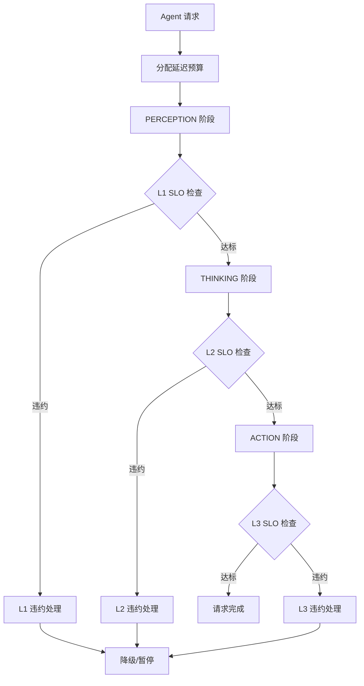

Copyright (c) 2025-2026 SPHARX Ltd. All Rights Reserved.

# Agent 延迟 SLO 实现方案
> **文档定位**：agentrt-linux（AirymaxOS，极境智能体操作系统）性能工程体系核心子文档，定义 Agent 响应延迟的服务等级目标（SLO）与保障机制\
> **文档版本**：0.1.1\
> **最后更新**：2026-07-09\
> **上级文档**：[agentrt-linux 设计文档](README.md)\
> **同源映射**：agentrt 延迟基线（IRON-9 v3 [SS] 语义同源层，延迟 SLO 语义同源）\
> **理论根基**：sched_tac（SCHED_DEADLINE/SCHED_FIFO/EEVDF + seL4 MCS 映射）延迟调度 + Airymax A-4 完美主义 + S-1 反馈闭环\
> **SPDX-License-Identifier**：AGPL-3.0-or-later OR Apache-2.0\
> **IRON-9 v3 层次**：[SS] 语义同源层（延迟 SLO 语义与 agentrt 同源）+ [IND] 完全独立层（内核态延迟保障为 agentrt-linux 专属）

---

## 目录

- [1. 设计目标与背景](#1-设计目标与背景)
- [2. 三级延迟 SLO 体系](#2-三级延迟-slo-体系)
- [3. 认知延迟（L1）](#3-认知延迟l1)
- [4. 规划延迟（L2）](#4-规划延迟l2)
- [5. 执行延迟（L3）](#5-执行延迟l3)
- [6. CoreLoopThree 延迟分解](#6-coreloopthree-延迟分解)
- [7. SLO 保障机制](#7-slo-保障机制)
- [8. SLO 监控与告警](#8-slo-监控与告警)
- [9. SLO 违约处理](#9-slo-违约处理)
- [10. 延迟预算管理](#10-延迟预算管理)
- [11. 数据流图](#11-数据流图)
- [12. 错误处理](#12-错误处理)
- [13. 安全考量](#13-安全考量)
- [14. 性能约束](#14-性能约束)
- [15. IRON-9 v3 同源映射](#15-iron-9-v2-同源映射)
- [16. SDK 集成](#16-sdk-集成)
- [17. 使用示例](#17-使用示例)
- [18. 测试策略](#18-测试策略)
- [19. 合规声明](#19-合规声明)
- [20. 相关文档](#20-相关文档)

---

## 1. 设计目标与背景

### 1.1 设计目标

Agent 延迟 SLO 是智能体操作系统对 Agent 应用响应延迟的服务等级承诺。延迟 SLO 工程的设计达成以下工程目标：

1. **可测量**：三级延迟（认知/规划/执行）均可精确测量至微秒级
2. **可保障**：通过 sched_tac 用户态调度器策略与资源预留保障 SLO 达标
3. **可告警**：SLO 违约实时告警，触发自动降级或扩容
4. **可追溯**：所有延迟数据可追溯至具体推理阶段与系统调用
5. **可协商**：Agent 应用可声明自定义 SLO，系统根据资源情况协商

### 1.2 背景与挑战

Agent 应用的延迟由多个阶段叠加而成，每个阶段受不同因素影响：

- **感知延迟**：传感器数据采集、预处理延迟
- **认知延迟**：LLM 推理延迟（prefill + decode）
- **规划延迟**：思维链推理、决策延迟
- **执行延迟**：工具调用、API 请求延迟

传统操作系统不感知这些阶段，无法针对性优化。agentrt-linux 通过 sched_tac 用户态调度器策略与 CoreLoopThree 阶段感知，实现端到端延迟 SLO 保障。

### 1.3 设计哲学

本方案参考 Linux 6.6 sched_tac（SCHED_DEADLINE/SCHED_FIFO/EEVDF）延迟调度（`kernel/sched/deadline.c`/`rt.c`/`fair.c`）与 seL4 MCS（Mixed-Criticality System）时间隔离思想：

1. **延迟优先**：在吞吐量与延迟之间，优先保障延迟 SLO
2. **阶段分解**：将端到端延迟分解至各可优化阶段
3. **预算隔离**：通过时间预算隔离不同 Agent 的延迟
4. **反馈闭环（S-1）**：延迟数据反馈至调度策略

---

## 2. 三级延迟 SLO 体系

### 2.1 SLO 分级

| 级别 | 名称 | 延迟阈值 | 适用场景 | 测量点 |
|------|------|---------|---------|--------|
| L1 | 认知延迟 | ≤ 100ms | 感知 → 理解 | 传感器输入到 LLM 输出 |
| L2 | 规划延迟 | ≤ 1s | 理解 → 决策 | LLM 输出到决策生成 |
| L3 | 执行延迟 | ≤ 10s | 决策 → 执行 | 决策生成到行动完成 |

### 2.2 SLO 等级

| SLO 等级 | 可用性目标 | L1 达标率 | L2 达标率 | L3 达标率 | 适用场景 |
|---------|-----------|----------|----------|----------|---------|
| Platinum | 99.99% | 99.9% | 99.9% | 99.9% | 实时交互 |
| Gold | 99.9% | 99% | 99% | 99% | 高性能推理 |
| Silver | 99% | 95% | 95% | 95% | 标准推理 |
| Bronze | 95% | 90% | 90% | 90% | 后台批处理 |

### 2.3 延迟数据结构

```c
/* include/uapi/linux/airymax/sched.h [SC] 共享契约层 */

typedef struct airy_latency_slo {
    uint32_t agent_id;
    uint32_t slo_level;  /* Platinum/Gold/Silver/Bronze */

    /* 三级延迟阈值（纳秒） */
    uint64_t l1_cognition_max_ns;  /* 认知延迟上限 */
    uint64_t l2_planning_max_ns;    /* 规划延迟上限 */
    uint64_t l3_action_max_ns;     /* 执行延迟上限 */

    /* 可用性目标（百分比 * 100） */
    uint32_t availability_target;  /* 9999 = 99.99% */
} airy_latency_slo_t;

/* 默认 SLO 阈值 */
#define AIRY_SLO_L1_DEFAULT_NS  (100 * 1000 * 1000ULL)  /* 100ms */
#define AIRY_SLO_L2_DEFAULT_NS  (1 * 1000 * 1000 * 1000ULL)  /* 1s */
#define AIRY_SLO_L3_DEFAULT_NS  (10 * 1000 * 1000 * 1000ULL) /* 10s */
```

---

## 3. 认知延迟（L1）

### 3.1 认知延迟定义

认知延迟是指从传感器输入到 LLM 理解输出的端到端延迟，包含：

| 子阶段 | 典型延迟 | 优化点 |
|--------|---------|--------|
| 传感器采集 | 5-10ms | 批处理采集 |
| 数据预处理 | 5-20ms | SIMD 加速 |
| Token 化 | 2-5ms | 词汇表优化 |
| LLM Prefill | 20-50ms | KV-cache 预热 |
| LLM Decode（首 Token） | 10-30ms | 投机解码 |

### 3.2 认知延迟测量

```c
/* kernel/perf/latency_slo.c [IND] */

/**
 * airy_measure_cognition_latency - 测量认知延迟
 * @agent_id: Agent ID
 *
 * 返回认知延迟（纳秒）
 */
uint64_t airy_measure_cognition_latency(uint32_t agent_id)
{
    struct airy_agent *agent = get_agent(agent_id);

    /* 从 trace 缓冲区提取时间戳 */
    uint64_t sensor_ts = agent->trace.sensor_input_ts;
    uint64_t llm_ts = agent->trace.llm_output_ts;

    if (sensor_ts == 0 || llm_ts == 0) return 0;

    return llm_ts - sensor_ts;
}

/**
 * airy_check_l1_slo - 检查 L1 认知延迟 SLO
 * @agent_id: Agent ID
 *
 * 返回 0 表示达标，-EDELAY 表示违约
 */
int airy_check_l1_slo(uint32_t agent_id)
{
    uint64_t latency = airy_measure_cognition_latency(agent_id);
    struct airy_agent *agent = get_agent(agent_id);

    if (latency > agent->slo.l1_cognition_max_ns) {
        log_write(LOG_WARN,
            "L1 SLO violation: agent=%d latency=%luns max=%luns",
            agent_id, latency, agent->slo.l1_cognition_max_ns);

        /* 记录违约计数 */
        agent->slo_violations.l1_count++;

        return -EDELAY;
    }

    agent->slo_achieved.l1_count++;
    return 0;
}
```

---

## 4. 规划延迟（L2）

### 4.1 规划延迟定义

规划延迟是指从 LLM 理解输出到决策生成的延迟，包含：

| 子阶段 | 典型延迟 | 优化点 |
|--------|---------|--------|
| 思维链推理 | 100-500ms | ReAct/CoT 优化 |
| 工具选择 | 10-50ms | 缓存策略 |
| 方案生成 | 50-200ms | 并行推理 |

### 4.2 规划延迟优化

```c
/**
 * airy_optimize_planning_latency - 优化规划延迟
 * @agent_id: Agent ID
 */
void airy_optimize_planning_latency(uint32_t agent_id)
{
    struct airy_agent *agent = get_agent(agent_id);
    uint64_t latency = airy_measure_planning_latency(agent_id);

    if (latency > agent->slo.l2_planning_max_ns * 0.8) {
        /* 接近 SLO 阈值，启用优化 */

        /* 策略 1: 简化思维链 */
        if (agent->cot_depth > 3) {
            agent->cot_depth = 3;
            log_write(LOG_INFO, "reduced CoT depth for agent %d", agent_id);
        }

        /* 策略 2: 启用工具缓存 */
        airy_enable_tool_cache(agent_id);

        /* 策略 3: 并行推理 */
        airy_enable_parallel_inference(agent_id);
    }
}
```

---

## 5. 执行延迟（L3）

### 5.1 执行延迟定义

执行延迟是指从决策生成到行动完成的延迟，包含：

| 子阶段 | 典型延迟 | 优化点 |
|--------|---------|--------|
| 工具调用 | 100-1000ms | 异步执行 |
| API 请求 | 500-5000ms | 批处理 + 缓存 |
| 结果验证 | 50-200ms | 快速验证 |
| 状态更新 | 10-50ms | 异步更新 |

### 5.2 执行延迟保障

```c
/**
 * airy_guarantee_l3_slo - 保障 L3 执行延迟 SLO
 * @agent_id: Agent ID
 */
int airy_guarantee_l3_slo(uint32_t agent_id)
{
    struct airy_agent *agent = get_agent(agent_id);

    /* 预留执行时间预算 */
    uint64_t budget = agent->slo.l3_action_max_ns;
    if (!airy_reserve_time_budget(agent_id, budget)) {
        log_write(LOG_ERROR, "failed to reserve L3 budget for agent %d",
            agent_id);
        return -ENOMEM;
    }

    /* 提升调度优先级 */
    airy_sched_boost(agent_id, SCHED_BOOST_HIGH);

    /* 预热工具缓存 */
    airy_preheat_tool_cache(agent_id);

    return 0;
}
```

---

## 6. CoreLoopThree 延迟分解

### 6.1 三层循环延迟映射

参考 `include/uapi/linux/airymax/cognition_types.h` [SC] 的 CoreLoopThree 阶段枚举：

| CoreLoopThree 阶段 | SLO 级别 | 延迟阈值 | 调度策略 |
|--------------------|---------|---------|---------|
| PERCEPTION | L1 | ≤ 100ms | IO 优先 |
| THINKING | L1+L2 | ≤ 100ms + ≤ 1s | CPU/GPU 优先 |
| ACTION | L3 | ≤ 10s | IO 优先 + 异步 |

### 6.2 循环延迟监控

```c
/**
 * airy_monitor_coreloop_latency - 监控 CoreLoopThree 延迟
 * @agent_id: Agent ID
 */
void airy_monitor_coreloop_latency(uint32_t agent_id)
{
    struct airy_agent *agent = get_agent(agent_id);

    /* 记录各阶段延迟 */
    airy_record_phase_latency(agent_id, PERCEPTION,
        agent->trace.perception_end - agent->trace.perception_start);

    airy_record_phase_latency(agent_id, THINKING,
        agent->trace.thinking_end - agent->trace.thinking_start);

    airy_record_phase_latency(agent_id, ACTION,
        agent->trace.action_end - agent->trace.action_start);

    /* 检查 SLO */
    airy_check_l1_slo(agent_id);
    airy_check_l2_slo(agent_id);
    airy_check_l3_slo(agent_id);
}
```

---

## 7. SLO 保障机制

### 7.1 调度优先级提升

当 Agent 接近 SLO 违约时，提升其调度优先级：

```c
/* kernel/sched/slo_guard.c [IND] */

/**
 * airy_slo_guard - SLO 保障守护
 * @agent_id: Agent ID
 *
 * 当 Agent 接近 SLO 阈值时，自动提升调度优先级
 */
void airy_slo_guard(uint32_t agent_id)
{
    struct airy_agent *agent = get_agent(agent_id);

    /* 计算当前延迟占 SLO 的比例 */
    double l1_ratio = (double)agent->current_l1_latency /
                      agent->slo.l1_cognition_max_ns;

    if (l1_ratio > 0.8) {
        /* 超过 80% 阈值，提升优先级 */
        airy_sched_boost(agent_id, SCHED_BOOST_HIGH);
        log_write(LOG_INFO, "SLO guard: boosted agent %d (L1 ratio=%.2f)",
            agent_id, l1_ratio);
    } else if (l1_ratio > 0.6) {
        /* 超过 60% 阈值，中量提升 */
        airy_sched_boost(agent_id, SCHED_BOOST_MID);
    }
}
```

### 7.2 资源预留

为高 SLO 等级的 Agent 预留资源：

| SLO 等级 | CPU 预留 | GPU 预留 | 内存预留 | 带宽预留 |
|---------|---------|---------|---------|---------|
| Platinum | 独占核 | 独占 GPU | 独占 | 独占 |
| Gold | 50% 核 | 50% GPU | 独占 | 50% |
| Silver | 25% 核 | 共享 | 独占 | 25% |
| Bronze | 共享 | 共享 | 共享 | 共享 |

---

## 8. SLO 监控与告警

### 8.1 监控指标

```c
typedef struct airy_slo_metrics {
    uint32_t agent_id;
    uint64_t timestamp_ns;

    /* L1 认知延迟 */
    uint64_t l1_current_ns;
    uint64_t l1_p50_ns;
    uint64_t l1_p95_ns;
    uint64_t l1_p99_ns;
    uint32_t l1_violation_count;
    uint32_t l1_total_count;
    double l1_achievement_rate;

    /* L2 规划延迟 */
    uint64_t l2_current_ns;
    uint64_t l2_p50_ns;
    uint64_t l2_p95_ns;
    uint64_t l2_p99_ns;
    uint32_t l2_violation_count;
    uint32_t l2_total_count;
    double l2_achievement_rate;

    /* L3 执行延迟 */
    uint64_t l3_current_ns;
    uint64_t l3_p50_ns;
    uint64_t l3_p95_ns;
    uint64_t l3_p99_ns;
    uint32_t l3_violation_count;
    uint32_t l3_total_count;
    double l3_achievement_rate;
} airy_slo_metrics_t;
```

### 8.2 告警规则

| 告警级别 | 触发条件 | 动作 |
|---------|---------|------|
| WARNING | 延迟超过 80% SLO | 记录日志 + 提升优先级 |
| ERROR | 延迟超过 SLO | 记录违约 + 降级 |
| CRITICAL | 连续 3 次违约 | 暂停 Agent + 告警管理员 |

---

## 9. SLO 违约处理

### 9.1 违约降级策略

```c
/**
 * airy_handle_slo_violation - 处理 SLO 违约
 * @agent_id: Agent ID
 * @level: 违约级别（L1/L2/L3）
 */
void airy_handle_slo_violation(uint32_t agent_id, int level)
{
    struct airy_agent *agent = get_agent(agent_id);

    log_write(LOG_ERROR,
        "SLO violation: agent=%d level=L%d current=%luns max=%luns",
        agent_id, level,
        level == 1 ? agent->current_l1_latency :
        level == 2 ? agent->current_l2_latency :
                     agent->current_l3_latency,
        level == 1 ? agent->slo.l1_cognition_max_ns :
        level == 2 ? agent->slo.l2_planning_max_ns :
                     agent->slo.l3_action_max_ns);

    /* 根据违约次数决定降级策略 */
    uint32_t violations = (level == 1 ? agent->slo_violations.l1_count :
                          level == 2 ? agent->slo_violations.l2_count :
                                       agent->slo_violations.l3_count);

    if (violations >= 3) {
        /* 连续 3 次违约，暂停 Agent */
        airy_suspend_agent(agent_id);
        airy_alert_admin("SLO critical violation", agent_id, level);
    } else if (violations >= 1) {
        /* 首次违约，降级 SLO 等级 */
        airy_downgrade_slo(agent_id);
    }
}
```

---

## 10. 延迟预算管理

### 10.1 延迟预算分配

每个 Agent 获得延迟预算，各阶段从预算中扣除：

```c
typedef struct airy_latency_budget {
    uint64_t total_budget_ns;      /* 总延迟预算 */
    uint64_t perception_used_ns;   /* 感知阶段已用 */
    uint64_t thinking_used_ns;     /* 思考阶段已用 */
    uint64_t action_used_ns;       /* 行动阶段已用 */
    uint64_t remaining_ns;          /* 剩余预算 */
} airy_latency_budget_t;

/**
 * airy_consume_latency_budget - 消耗延迟预算
 * @agent_id: Agent ID
 * @phase: 阶段
 * @latency_ns: 消耗的延迟
 *
 * 返回 0 表示预算充足，-EBUDGET 表示预算耗尽
 */
int airy_consume_latency_budget(uint32_t agent_id,
                                     enum airy_coreloop_phase phase,
                                     uint64_t latency_ns)
{
    struct airy_agent *agent = get_agent(agent_id);

    if (agent->latency_budget.remaining_ns < latency_ns) {
        log_write(LOG_WARN,
            "latency budget exhausted: agent=%d phase=%d "
            "remaining=%luns needed=%luns",
            agent_id, phase,
            agent->latency_budget.remaining_ns, latency_ns);
        return -EBUDGET;
    }

    agent->latency_budget.remaining_ns -= latency_ns;

    switch (phase) {
    case PERCEPTION:
        agent->latency_budget.perception_used_ns += latency_ns;
        break;
    case THINKING:
        agent->latency_budget.thinking_used_ns += latency_ns;
        break;
    case ACTION:
        agent->latency_budget.action_used_ns += latency_ns;
        break;
    }

    return 0;
}
```

---

## 11. 数据流图



---

## 12. 错误处理

### 12.1 SLO 错误码

| 错误码 | 名称 | 含义 |
|--------|------|------|
| -EDELAY | AIRY_EDELAY | 延迟超过 SLO |
| -EBUDGET | AIRY_EBUDGET | 延迟预算耗尽 |
| -ESLOVIOLATION | AIRY_ESLOVIOLATION | SLO 违约 |
| -ENOSLO | AIRY_ENOSLO | SLO 未定义 |

---

## 13. 安全考量

- **SLO 隔离**：不同 Agent 的 SLO 互不影响
- **预算防篡改**：延迟预算由内核管理，用户态只读
- **违约审计**：所有 SLO 违约记录审计日志

---

## 14. 性能约束

| 指标 | 目标值 |
|------|--------|
| SLO 检查开销 | ≤ 1μs |
| 延迟测量精度 | ≤ 1μs |
| 告警延迟 | ≤ 100ms |
| 预算计算开销 | ≤ 100ns |

---

## 15. IRON-9 v3 同源映射

| 层次 | 共享内容 | 本文档使用 |
|------|---------|-----------|
| [SC] 共享契约层 | `sched.h` SLO 数据结构 + CoreLoopThree 阶段枚举 | 阶段感知与 SLO 结构引用 |
| [SS] 语义同源层 | 延迟 SLO 语义 | 与 agentrt 用户态延迟基线语义同源 |
| [IND] 完全独立层 | 内核态延迟保障 + SLO 守护 + 预算管理 | agentrt-linux 专属 |

---

## 16. SDK 集成

### 16.1 Python SDK

```python
from airymaxos.perf import LatencySLO, SLOLevel

slo = LatencySLO(
    agent_id=1234,
    level=SLOLevel.PLATINUM,
    l1_max_ns=100_000_000,  # 100ms
    l2_max_ns=1_000_000_000,  # 1s
    l3_max_ns=10_000_000_000,  # 10s
)

metrics = slo.collect()
print(f"L1 achievement: {metrics.l1_achievement_rate:.2%}")
print(f"L2 achievement: {metrics.l2_achievement_rate:.2%}")
print(f"L3 achievement: {metrics.l3_achievement_rate:.2%}")

if metrics.l1_violation_count > 0:
    slo.boost_priority()
```

### 16.2 Rust SDK

```rust
use airymaxos::perf::{LatencySlo, SloLevel};

let slo = LatencySlo::new(1234, SloLevel::Platinum)?;
let metrics = slo.collect()?;
println!("L1 achievement: {:.2}%", metrics.l1_achievement_rate * 100.0);
```

---

## 17. 使用示例

```bash
# 查看 Agent 的 SLO 状态
agentctl slo status --agent 1234
# 输出:
# Agent: 1234
# SLO Level: Platinum
# L1 (Cognition): 85ms / 100ms [OK] achievement=99.5%
# L2 (Planning): 450ms / 1000ms [OK] achievement=99.2%
# L3 (Action): 2.1s / 10s [OK] achievement=99.8%

# 设置自定义 SLO
agentctl slo set --agent 1234 --level gold

# 查看 SLO 违约历史
agentctl slo violations --agent 1234
```

---

## 18. 测试策略

### 18.1 SLO 达标测试

```bash
# 运行 SLO 达标测试
agentctl test slo --benchmark

# 测试特定场景
agentctl test slo --scenario realtime-interaction
```

### 18.2 压力测试

```bash
# 高负载下 SLO 保障测试
agentctl test slo --stress --agents 100
```

---

## 19. 合规声明

- **OS-IRON-001 遵守**：SLO 接口永不破坏
- **IRON-9 v3 遵守**：SLO 数据结构 [SC] 共享，保障机制 [IND] 独立
- **seL4 唯一来源遵守**：MCS 时间隔离思想借鉴 seL4
- **Linux 6.6 基线遵守**：sched_tac（SCHED_DEADLINE/SCHED_FIFO/EEVDF）基于 Linux 6.6 原生调度类

---

## 20. 相关文档

- `170-performance/01-scheduling-performance.md`（调度性能）
- `170-performance/02-memory-performance.md`（内存性能）
- `170-performance/03-ipc-performance.md`（IPC 性能）
- `170-performance/04-token-efficiency.md`（Token 能效工程）
- `170-performance/06-benchmark-suite.md`（基准测试套件）
- `140-application-development/04-token-budget.md`（Token 预算契约）
- `20-modules/04-cognition.md`（cognition 子仓设计）

---

> **文档结束** | Agent 延迟 SLO 实现方案 | IRON-9 v3 [SC] + [SS] + [IND]
