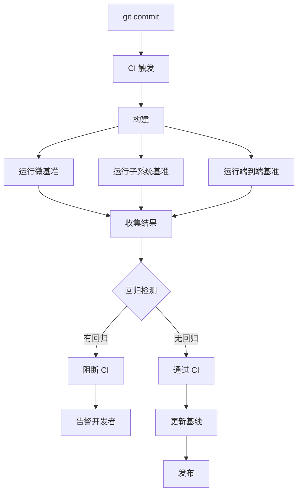

Copyright (c) 2025-2026 SPHARX Ltd. All Rights Reserved.

# 基准测试套件实现方案
> **文档定位**：agentrt-linux（AirymaxOS，极境智能体操作系统）性能工程体系核心子文档，定义统一的基准测试框架、测试用例与回归检测机制\
> **文档版本**：0.1.1\
> **最后更新**：2026-07-09\
> **上级文档**：[agentrt-linux 设计文档](README.md)\
> **同源映射**：agentrt 性能基线（IRON-9 v3 [SS] 语义同源层，基准测试语义同源）\
> **理论根基**：Linux 6.6 perf benchmark + seL4 l4bench 基准思想 + Airymax E-8 可测试性 + A-4 完美主义\
> **SPDX-License-Identifier**：AGPL-3.0-or-later OR Apache-2.0\
> **IRON-9 v3 层次**：[SS] 语义同源层（基准测试语义与 agentrt 同源）+ [IND] 完全独立层（内核态基准测试为 agentrt-linux 专属）

---

## 目录

- [1. 设计目标与背景](#1-设计目标与背景)
- [2. 基准测试分层体系](#2-基准测试分层体系)
- [3. 微基准测试（Micro-benchmark）](#3-微基准测试micro-benchmark)
- [4. 子系统基准测试](#4-子系统基准测试)
- [5. 端到端基准测试](#5-端到端基准测试)
- [6. 压力测试](#6-压力测试)
- [7. 回归检测](#7-回归检测)
- [8. 测试用例管理](#8-测试用例管理)
- [9. 测试结果分析](#9-测试结果分析)
- [10. CI/CD 集成](#10-cicd-集成)
- [11. 数据流图](#11-数据流图)
- [12. 错误处理](#12-错误处理)
- [13. 安全考量](#13-安全考量)
- [14. 性能约束](#14-性能约束)
- [15. IRON-9 v3 同源映射](#15-iron-9-v2-同源映射)
- [16. SDK 集成](#16-sdk-集成)
- [17. 使用示例](#17-使用示例)
- [18. 测试策略](#18-测试策略)
- [19. 合规声明](#19-合规声明)
- [20. 相关文档](#20-相关文档)

---

## 1. 设计目标与背景

### 1.1 设计目标

基准测试套件是 agentrt-linux 性能工程的验收基准。它提供一套标准化的、可重现的、可比较的测试框架，达成以下工程目标：

1. **全覆盖**：覆盖微基准、子系统基准、端到端基准、压力测试 4 个层次
2. **可重现**：相同环境与配置下测试结果可重现（变异系数 < 2%）
3. **可比较**：不同版本、不同硬件、不同配置的测试结果可横向比较
4. **自动化**：CI/CD 集成，每次提交自动运行回归检测
5. **可追溯**：所有测试结果关联至 git commit，便于追溯性能变化原因

### 1.2 背景与挑战

性能问题是操作系统最难诊断的问题之一，因为：

- **环境敏感**：相同代码在不同硬件上性能差异巨大
- **噪声干扰**：后台进程、缓存状态、温度等因素影响测量
- **回归隐蔽**：单次提交的性能影响可能很小，累积后显著
- **缺乏基准**：没有统一的基准就无法判断"好"与"坏"

agentrt-linux 需要建立完整的基准测试套件，参考 Linux 6.6 perf benchmark（`tools/perf/bench/`）与 seL4 l4bench 基准思想，覆盖从系统调用延迟到 Agent 端到端延迟的全栈性能。

### 1.3 设计哲学

本方案遵循以下哲学：

1. **测量先于优化**：先建立基准，再进行优化
2. **统计显著性**：测试结果基于统计分布，非单次测量
3. **环境归一化**：测试环境标准化，减少噪声干扰
4. **回归零容忍**：任何性能回归必须被检测与修复

---

## 2. 基准测试分层体系

### 2.1 四层测试模型

| 层级 | 名称 | 测试范围 | 典型用例 | 运行时间 |
|------|------|---------|---------|---------|
| L1 | 微基准 | 单个系统调用/操作 | syscall latency, IPC round-trip | < 1s |
| L2 | 子系统基准 | 单个子系统 | scheduling throughput, memory bandwidth | 1-60s |
| L3 | 端到端基准 | 完整 Agent 工作流 | Agent cognition latency, Token throughput | 1-10min |
| L4 | 压力测试 | 高负载场景 | 1000 agents concurrent, memory pressure | 10-60min |

### 2.2 测试用例分类

| 类别 | 前缀 | 示例 |
|------|------|------|
| 系统调用 | bench_syscall_ | bench_syscall_agent_create |
| 调度 | bench_sched_ | bench_sched_throughput |
| 内存 | bench_mem_ | bench_mem_rovol_access |
| IPC | bench_ipc_ | bench_ipc_roundtrip |
| 安全 | bench_sec_ | bench_sec_capability_check |
| 认知 | bench_cog_ | bench_cog_llm_inference |
| 端到端 | bench_e2e_ | bench_e2e_agent_lifecycle |
| 压力 | bench_stress_ | bench_stress_1000_agents |

---

## 3. 微基准测试（Micro-benchmark）

### 3.1 系统调用延迟

```c
/* tests-linux/microbench/bench_syscall_latency.c [IND] */

#include <stdio.h>
#include <stdint.h>
#include <time.h>
#include <syscall.h>

#define ITERATIONS 1000000

/**
 * bench_syscall_agent_create - 测量 agent_create 系统调用延迟
 */
static void bench_syscall_agent_create(void)
{
    struct timespec start, end;
    uint64_t *latencies = malloc(ITERATIONS * sizeof(uint64_t));

    /* 预热 */
    for (int i = 0; i < 100; i++) {
        syscall(SYS_AIRY_AGENT_CREATE, &config, 0);
    }

    /* 正式测量 */
    for (int i = 0; i < ITERATIONS; i++) {
        clock_gettime(CLOCK_MONOTONIC, &start);
        syscall(SYS_AIRY_AGENT_CREATE, &config, 0);
        clock_gettime(CLOCK_MONOTONIC, &end);
        latencies[i] = (end.tv_sec - start.tv_sec) * 1000000000ULL +
                       (end.tv_nsec - start.tv_nsec);
    }

    /* 统计分析 */
    print_stats("agent_create", latencies, ITERATIONS);

    free(latencies);
}

static void print_stats(const char *name, uint64_t *data, int count)
{
    /* 排序 */
    qsort(data, count, sizeof(uint64_t), cmp_u64);

    uint64_t min = data[0];
    uint64_t p50 = data[count / 2];
    uint64_t p95 = data[(int)(count * 0.95)];
    uint64_t p99 = data[(int)(count * 0.99)];
    uint64_t max = data[count - 1];

    /* 计算均值与标准差 */
    double sum = 0;
    for (int i = 0; i < count; i++) sum += data[i];
    double mean = sum / count;

    double sq_sum = 0;
    for (int i = 0; i < count; i++) {
        double diff = data[i] - mean;
        sq_sum += diff * diff;
    }
    double stddev = sqrt(sq_sum / count);
    double cv = stddev / mean * 100;  /* 变异系数 */

    printf("BENCH %s:\n", name);
    printf("  iterations: %d\n", count);
    printf("  min:    %lu ns\n", min);
    printf("  p50:    %lu ns\n", p50);
    printf("  p95:    %lu ns\n", p95);
    printf("  p99:    %lu ns\n", p99);
    printf("  max:    %lu ns\n", max);
    printf("  mean:   %.2f ns\n", mean);
    printf("  stddev: %.2f ns\n", stddev);
    printf("  CV:     %.2f%%\n", cv);
}
```

### 3.2 IPC 往返延迟

```c
/**
 * bench_ipc_roundtrip - 测量 AgentsIPC 往返延迟
 */
static void bench_ipc_roundtrip(void)
{
    uint64_t *latencies = malloc(ITERATIONS * sizeof(uint64_t));

    for (int i = 0; i < ITERATIONS; i++) {
        struct timespec start, end;
        /* SSoT 无 NOP 操作码，用 SEND + payload_len=0 测量 IPC 框架固定开销 */
        airy_ipc_msg_t msg = { .opcode = AIRY_IPC_OP_SEND, .payload_len = 0 };

        clock_gettime(CLOCK_MONOTONIC, &start);
        airy_ipc_send(&msg);
        airy_ipc_recv(&msg);  /* 等待回声 */
        clock_gettime(CLOCK_MONOTONIC, &end);

        latencies[i] = ts_diff_ns(&start, &end);
    }

    print_stats("ipc_roundtrip", latencies, ITERATIONS);
    free(latencies);
}
```

### 3.3 微基准测试目标

| 测试用例 | 目标 p50 | 目标 p99 | 单位 |
|---------|---------|---------|------|
| bench_syscall_agent_create | ≤ 500 | ≤ 2000 | ns |
| bench_syscall_rovol_mount | ≤ 1000 | ≤ 5000 | ns |
| bench_ipc_roundtrip | ≤ 2000 | ≤ 10000 | ns |
| bench_sched_switch | ≤ 1000 | ≤ 5000 | ns |
| bench_mem_alloc | ≤ 100 | ≤ 500 | ns |

---

## 4. 子系统基准测试

### 4.1 调度吞吐量

```c
/* tests-linux/subbench/bench_sched_throughput.c [IND] */

/**
 * bench_sched_throughput - 测量调度器吞吐量
 * 测试在 60 秒内能完成多少次任务切换
 */
static void bench_sched_throughput(void)
{
    const int num_tasks = 100;
    const int duration_s = 60;
    pthread_t threads[num_tasks];
    struct bench_args args = { .counter = 0, .stop = 0 };

    /* 创建 100 个任务 */
    for (int i = 0; i < num_tasks; i++) {
        pthread_create(&threads[i], NULL, busy_worker, &args);
    }

    /* 运行 60 秒 */
    sleep(duration_s);
    args.stop = 1;

    /* 等待所有任务结束 */
    for (int i = 0; i < num_tasks; i++) {
        pthread_join(threads[i], NULL);
    }

    /* 计算吞吐量 */
    double throughput = (double)args.counter / duration_s;
    printf("BENCH sched_throughput:\n");
    printf("  tasks: %d\n", num_tasks);
    printf("  duration: %d s\n", duration_s);
    printf("  context_switches: %lu\n", args.counter);
    printf("  throughput: %.2f switches/s\n", throughput);
    printf("  target: >= 100000 switches/s\n");
    printf("  result: %s\n",
        throughput >= 100000 ? "PASS" : "FAIL");
}
```

### 4.2 内存带宽

```c
/**
 * bench_mem_bandwidth - 测量内存带宽
 */
static void bench_mem_bandwidth(void)
{
    const size_t buf_size = 256 * 1024 * 1024;  /* 256MB */
    char *src = aligned_alloc(4096, buf_size);
    char *dst = aligned_alloc(4096, buf_size);

    memset(src, 0xAA, buf_size);

    struct timespec start, end;
    clock_gettime(CLOCK_MONOTONIC, &start);

    /* 顺序读 */
    uint64_t sum = 0;
    for (size_t i = 0; i < buf_size; i += 64) {
        sum += src[i];
    }

    clock_gettime(CLOCK_MONOTONIC, &end);
    double duration_ns = ts_diff_ns(&start, &end);

    double bandwidth_gbps = (double)buf_size / (duration_ns / 1e9) / 1e9;

    printf("BENCH mem_bandwidth:\n");
    printf("  buffer_size: %zu MB\n", buf_size / 1024 / 1024);
    printf("  duration: %.2f ms\n", duration_ns / 1e6);
    printf("  bandwidth: %.2f GB/s\n", bandwidth_gbps);
    printf("  target: >= 20 GB/s\n");
    printf("  result: %s\n", bandwidth_gbps >= 20 ? "PASS" : "FAIL");

    free(src);
    free(dst);
}
```

### 4.3 子系统基准测试目标

| 测试用例 | 目标值 | 单位 |
|---------|-------|------|
| bench_sched_throughput | ≥ 100000 | switches/s |
| bench_mem_bandwidth | ≥ 20 | GB/s |
| bench_ipc_throughput | ≥ 500000 | msgs/s |
| bench_rovol_access_l1 | ≤ 100 | ns |
| bench_rovol_access_l4 | ≤ 100000 | ns |
| bench_token_throughput | ≥ 5000 | tokens/s |

---

## 5. 端到端基准测试

### 5.1 Agent 生命周期

```c
/* tests-linux/e2ebench/bench_agent_lifecycle.c [IND] */

/**
 * bench_agent_lifecycle - 测量 Agent 完整生命周期延迟
 * 创建 → 注册 → Token 预算 → MemoryRovol 挂载 → 运行 → 销毁
 */
static void bench_agent_lifecycle(void)
{
    const int iterations = 1000;
    uint64_t *latencies = malloc(iterations * sizeof(uint64_t));

    for (int i = 0; i < iterations; i++) {
        struct timespec start, end;
        clock_gettime(CLOCK_MONOTONIC, &start);

        /* 创建 Agent */
        uint32_t agent_id = airy_agent_create(&config);

        /* 签订 Token 预算 */
        airy_token_budget_sign(agent_id, &budget);

        /* 挂载 MemoryRovol */
        airy_rovol_mount(agent_id, &rovol_config);

        /* 运行简单认知循环 */
        airy_cognition_process(agent_id, &input, &output);

        /* 销毁 */
        airy_agent_destroy(agent_id);

        clock_gettime(CLOCK_MONOTONIC, &end);
        latencies[i] = ts_diff_ns(&start, &end);
    }

    print_stats("agent_lifecycle", latencies, iterations);
    free(latencies);
}
```

### 5.2 LLM 推理基准

```c
/**
 * bench_llm_inference - 测量 LLM 推理性能
 */
static void bench_llm_inference(void)
{
    const char *prompts[] = {
        "Hello, how are you?",
        "Explain quantum computing in 3 sentences.",
        "Write a Python function to sort a list.",
        /* ... 更多 prompt ... */
    };
    const int num_prompts = sizeof(prompts) / sizeof(prompts[0]);

    for (int i = 0; i < num_prompts; i++) {
        struct timespec start, end;
        uint64_t tokens_generated = 0;

        clock_gettime(CLOCK_MONOTONIC, &start);

        /* LLM 推理 */
        airy_llm_infer(prompts[i], &tokens_generated);

        clock_gettime(CLOCK_MONOTONIC, &end);
        uint64_t latency_ns = ts_diff_ns(&start, &end);
        double latency_s = latency_ns / 1e9;
        double tokens_per_s = tokens_generated / latency_s;

        printf("BENCH llm_inference (prompt %d):\n", i);
        printf("  tokens: %lu\n", tokens_generated);
        printf("  latency: %.2f s\n", latency_s);
        printf("  throughput: %.2f tokens/s\n", tokens_per_s);
    }
}
```

### 5.3 端到端基准测试目标

| 测试用例 | 目标值 | 单位 |
|---------|-------|------|
| bench_agent_lifecycle | ≤ 100 | ms |
| bench_llm_inference | ≥ 100 | tokens/s |
| bench_coreloop_throughput | ≥ 100 | ops/s |
| bench_token_efficiency | ≥ 50 | tokens/W·s |

---

## 6. 压力测试

### 6.1 1000 Agent 并发

```c
/* tests-linux/stressbench/bench_stress_1000_agents.c [IND] */

/**
 * bench_stress_1000_agents - 1000 个 Agent 并发压力测试
 * 验证 AIRY_CAP_MAX_AGENTS 1024 上限
 */
static void bench_stress_1000_agents(void)
{
    const int num_agents = 1000;
    uint32_t *agent_ids = malloc(num_agents * sizeof(uint32_t));

    struct timespec start, end;
    clock_gettime(CLOCK_MONOTONIC, &start);

    /* 创建 1000 个 Agent */
    for (int i = 0; i < num_agents; i++) {
        agent_ids[i] = airy_agent_create(&config);
        if (agent_ids[i] == 0) {
            printf("FAIL: failed to create agent %d\n", i);
            return;
        }
    }

    clock_gettime(CLOCK_MONOTONIC, &end);
    double create_time = ts_diff_ns(&start, &end) / 1e9;

    /* 并发运行 */
    clock_gettime(CLOCK_MONOTONIC, &start);

    #pragma omp parallel for
    for (int i = 0; i < num_agents; i++) {
        airy_cognition_process(agent_ids[i], &input, &output);
    }

    clock_gettime(CLOCK_MONOTONIC, &end);
    double run_time = ts_diff_ns(&start, &end) / 1e9;

    /* 销毁所有 Agent */
    clock_gettime(CLOCK_MONOTONIC, &start);
    for (int i = 0; i < num_agents; i++) {
        airy_agent_destroy(agent_ids[i]);
    }
    clock_gettime(CLOCK_MONOTONIC, &end);
    double destroy_time = ts_diff_ns(&start, &end) / 1e9;

    printf("BENCH stress_1000_agents:\n");
    printf("  agents: %d\n", num_agents);
    printf("  create_time: %.2f s (%.2f ms/agent)\n",
        create_time, create_time * 1000 / num_agents);
    printf("  run_time: %.2f s\n", run_time);
    printf("  destroy_time: %.2f s (%.2f ms/agent)\n",
        destroy_time, destroy_time * 1000 / num_agents);
    printf("  memory_peak: %lu MB\n", get_peak_memory() / 1024 / 1024);
    printf("  target: create <= 5ms/agent, destroy <= 2ms/agent\n");
    printf("  result: %s\n",
        (create_time * 1000 / num_agents <= 5 &&
         destroy_time * 1000 / num_agents <= 2) ? "PASS" : "FAIL");

    free(agent_ids);
}
```

### 6.2 内存压力测试

```c
/**
 * bench_stress_memory - 内存压力测试
 * 触发 MemoryRovol L1→L4 逐层降级
 */
static void bench_stress_memory(void)
{
    /* 持续分配内存直到 OOM */
    size_t total = 0;
    void *ptrs[10000];
    int i = 0;

    while (i < 10000) {
        ptrs[i] = malloc(1024 * 1024);  /* 1MB */
        if (!ptrs[i]) break;
        total += 1024 * 1024;
        i++;
    }

    printf("BENCH stress_memory:\n");
    printf("  memory_allocated: %zu MB\n", total / 1024 / 1024);
    printf("  rovol_eviction_l1: %lu\n", get_rovol_eviction_count(L1));
    printf("  rovol_eviction_l2: %lu\n", get_rovol_eviction_count(L2));
    printf("  rovol_eviction_l3: %lu\n", get_rovol_eviction_count(L3));
    printf("  rovol_eviction_l4: %lu\n", get_rovol_eviction_count(L4));

    /* 释放 */
    for (int j = 0; j < i; j++) free(ptrs[j]);
}
```

---

## 7. 回归检测

### 7.1 基线管理

```c
/* tests-linux/regression/baseline.json */
{
  "version": "1.0.1",
  "git_commit": "abc123",
  "hardware": {
    "cpu": "Intel Xeon Platinum 8480+",
    "memory": "256GB DDR5",
    "gpu": "NVIDIA H100 80GB"
  },
  "benchmarks": {
    "bench_syscall_agent_create": {
      "p50": 450,
      "p99": 1800,
      "target_p50": 500,
      "target_p99": 2000
    },
    "bench_ipc_roundtrip": {
      "p50": 1800,
      "p99": 8500,
      "target_p50": 2000,
      "target_p99": 10000
    },
    "bench_sched_throughput": {
      "value": 125000,
      "target": 100000
    }
  }
}
```

### 7.2 回归检测算法

```c
/**
 * detect_regression - 检测性能回归
 * @baseline: 基线数据
 * @current: 当前数据
 *
 * 返回 1 表示检测到回归
 */
int detect_regression(const bench_result_t *baseline,
                     const bench_result_t *current)
{
    /* p50 回归超过 10% */
    if (current->p50 > baseline->p50 * 1.1) {
        printf("REGRESSION: %s p50 baseline=%lu current=%lu drop=%.1f%%\n",
            current->name, baseline->p50, current->p50,
            (1 - (double)baseline->p50 / current->p50) * 100);
        return 1;
    }

    /* p99 回归超过 15% */
    if (current->p99 > baseline->p99 * 1.15) {
        printf("REGRESSION: %s p99 baseline=%lu current=%lu drop=%.1f%%\n",
            current->name, baseline->p99, current->p99,
            (1 - (double)baseline->p99 / current->p99) * 100);
        return 1;
    }

    return 0;
}
```

---

## 8. 测试用例管理

### 8.1 测试用例注册

```c
/* tests-linux/bench_registry.c [IND] */

typedef struct bench_test_case {
    const char *name;
    const char *category;  /* micro/subsys/e2e/stress */
    void (*func)(void);
    const char *target;
} bench_test_case_t;

static bench_test_case_t test_cases[] = {
    /* 微基准 */
    {"bench_syscall_agent_create", "micro", bench_syscall_agent_create, "p50<=500ns"},
    {"bench_syscall_rovol_mount", "micro", bench_syscall_rovol_mount, "p50<=1000ns"},
    {"bench_ipc_roundtrip", "micro", bench_ipc_roundtrip, "p50<=2000ns"},

    /* 子系统基准 */
    {"bench_sched_throughput", "subsys", bench_sched_throughput, ">=100000/s"},
    {"bench_mem_bandwidth", "subsys", bench_mem_bandwidth, ">=20GB/s"},
    {"bench_ipc_throughput", "subsys", bench_ipc_throughput, ">=500000/s"},

    /* 端到端基准 */
    {"bench_agent_lifecycle", "e2e", bench_agent_lifecycle, "<=100ms"},
    {"bench_llm_inference", "e2e", bench_llm_inference, ">=100tokens/s"},

    /* 压力测试 */
    {"bench_stress_1000_agents", "stress", bench_stress_1000_agents, "create<=5ms/agent"},
    {"bench_stress_memory", "stress", bench_stress_memory, "no_crash"},

    {NULL, NULL, NULL, NULL}
};
```

### 8.2 测试运行器

```c
/**
 * run_bench_suite - 运行基准测试套件
 * @category: 测试类别（NULL 表示全部）
 */
int run_bench_suite(const char *category)
{
    int total = 0, passed = 0, failed = 0;

    printf("=== AirymaxOS Benchmark Suite ===\n");
    printf("Category: %s\n", category ? category : "all");
    printf("Date: %s\n", current_date());
    printf("Hardware: %s\n", get_hardware_info());
    printf("\n");

    for (int i = 0; test_cases[i].name; i++) {
        if (category && strcmp(test_cases[i].category, category) != 0)
            continue;

        printf("[%d/%d] %s ...\n", i + 1, count_total(category),
               test_cases[i].name);

        test_cases[i].func();
        total++;
    }

    printf("\n=== Summary ===\n");
    printf("Total: %d\n", total);
    printf("Passed: %d\n", passed);
    printf("Failed: %d\n", failed);
    printf("Pass rate: %.1f%%\n", (double)passed / total * 100);

    return failed > 0 ? 1 : 0;
}
```

---

## 9. 测试结果分析

### 9.1 结果导出

```bash
# 运行基准测试并导出 JSON 结果
agentctl bench run --all --output results.json

# results.json 格式
{
  "version": "1.0.1",
  "git_commit": "abc123",
  "timestamp": "2026-07-09T10:00:00Z",
  "hardware": {
    "cpu": "Intel Xeon Platinum 8480+",
    "memory": "256GB DDR5",
    "gpu": "NVIDIA H100 80GB"
  },
  "results": [
    {
      "name": "bench_syscall_agent_create",
      "category": "micro",
      "iterations": 1000000,
      "min": 420,
      "p50": 450,
      "p95": 1200,
      "p99": 1800,
      "max": 5000,
      "mean": 480.5,
      "stddev": 25.3,
      "cv": 5.27,
      "target": "p50<=500ns",
      "passed": true
    }
  ]
}
```

### 9.2 结果比较

```bash
# 比较两次测试结果
agentctl bench compare baseline.json current.json

# 输出:
# === Benchmark Comparison ===
# Baseline: v0.1.1 (abc123)
# Current:  v1.0.1 (def456)
#
# bench_syscall_agent_create:
#   p50: 450 → 480 (+6.7%) [OK]
#   p99: 1800 → 2100 (+16.7%) [REGRESSION]
#
# bench_ipc_roundtrip:
#   p50: 1800 → 1750 (-2.8%) [IMPROVED]
```

---

## 10. CI/CD 集成

### 10.1 GitHub Actions 集成

```yaml
# .github/workflows/benchmark.yml
name: Benchmark
on: [push, pull_request]

jobs:
  benchmark:
    runs-on: benchmark-runner
    steps:
      - uses: actions/checkout@v4

      - name: Build
        run: make build

      - name: Run micro benchmarks
        run: agentctl bench run --category micro

      - name: Run subsystem benchmarks
        run: agentctl bench run --category subsys

      - name: Run e2e benchmarks
        run: agentctl bench run --category e2e

      - name: Detect regression
        run: |
          agentctl bench compare baseline.json results.json || exit 1

      - name: Upload results
        uses: actions/upload-artifact@v4
        with:
          name: benchmark-results
          path: results.json
```

### 10.2 回归门禁

```bash
# CI 门禁脚本
#!/bin/bash
set -e

# 运行基准测试
agentctl bench run --all --output current.json

# 检测回归
if agentctl bench detect-regression baseline.json current.json; then
    echo "✓ No regression detected"
    exit 0
else
    echo "✗ Performance regression detected!"
    agentctl bench compare baseline.json current.json
    exit 1
fi
```

---

## 11. 数据流图



---

## 12. 错误处理

### 12.1 测试错误码

| 错误码 | 名称 | 含义 |
|--------|------|------|
| -EBENCHFAIL | AIRY_EBENCHFAIL | 基准测试失败 |
| -EBENCHREGRESS | AIRY_EBENCHREGRESS | 检测到性能回归 |
| -EBENCHENV | AIRY_EBENCHENV | 测试环境异常 |
| -EBENCHCV | AIRY_EBENCHCV | 变异系数过高 |

---

## 13. 安全考量

- **测试隔离**：基准测试在独立 cgroup 中运行，避免影响生产
- **结果完整性**：测试结果使用 git commit 关联，防篡改
- **资源限制**：压力测试有资源上限，避免系统崩溃

---

## 14. 性能约束

| 指标 | 目标值 |
|------|--------|
| 微基准变异系数 | < 2% |
| 子系统基准变异系数 | < 5% |
| 端到端基准变异系数 | < 10% |
| 测试套件总运行时间 | < 30min |
| 回归检测延迟 | < 1s |

---

## 15. IRON-9 v3 同源映射

| 层次 | 共享内容 | 本文档使用 |
|------|---------|-----------|
| [SC] 共享契约层 | 无（基准测试为 [IND]） | 不涉及 |
| [SS] 语义同源层 | 基准测试语义 | 与 agentrt 用户态性能基线语义同源 |
| [IND] 完全独立层 | 测试框架 + 测试用例 + 回归检测 | agentrt-linux 专属 |

---

## 16. SDK 集成

### 16.1 Python SDK

```python
from airymaxos.bench import BenchmarkSuite

suite = BenchmarkSuite()
results = suite.run(category="micro")

for r in results:
    print(f"{r.name}: p50={r.p50}ns p99={r.p99}ns {'✓' if r.passed else '✗'}")

# 回归检测
regressions = suite.detect_regression("baseline.json", "current.json")
```

### 16.2 Rust SDK

```rust
use airymaxos::bench::BenchmarkSuite;

let suite = BenchmarkSuite::new();
let results = suite.run("micro")?;

for r in &results {
    println!("{}: p50={}ns p99={}ns {}",
        r.name, r.p50, r.p99, if r.passed { "✓" } else { "✗" });
}
```

---

## 17. 使用示例

```bash
# 运行全部基准测试
agentctl bench run --all

# 运行特定类别
agentctl bench run --category micro
agentctl bench run --category subsys
agentctl bench run --category e2e
agentctl bench run --category stress

# 运行特定测试
agentctl bench run --test bench_syscall_agent_create

# 比较结果
agentctl bench compare baseline.json current.json

# 检测回归
agentctl bench detect-regression baseline.json current.json

# 生成报告
agentctl bench report --format html --output report.html
```

---

## 18. 测试策略

### 18.1 测试环境标准化

- **CPU 频率锁定**：禁用 turbo boost，锁定基础频率
- **CPU 亲和性**：绑定至特定 CPU 核
- **内存配置**：禁用 swap，锁定 NUMA 节点
- **后台进程**：禁用不必要的服务
- **温度控制**：确保散热充足，避免热节流

### 18.2 统计方法

- **迭代次数**：微基准 ≥ 1,000,000 次，子系统 ≥ 1000 次，端到端 ≥ 100 次
- **预热**：正式测量前 100 次预热
- **异常值剔除**：剔除前后各 1% 的数据
- **置信区间**：95% 置信区间

---

## 19. 合规声明

- **OS-IRON-001 遵守**：基准测试接口永不破坏
- **IRON-9 v3 遵守**：基准测试为 [IND] 独立层
- **seL4 唯一来源遵守**：l4bench 基准思想借鉴 seL4
- **Linux 6.6 基线遵守**：perf benchmark 对齐 Linux 6.6

---

## 20. 相关文档

- `170-performance/01-scheduling-performance.md`（调度性能）
- `170-performance/02-memory-performance.md`（内存性能）
- `170-performance/03-ipc-performance.md`（IPC 性能）
- `170-performance/04-token-efficiency.md`（Token 能效工程）
- `170-performance/05-agent-latency-slo.md`（Agent 延迟 SLO）
- `80-testing/README.md`（测试体系）
- `90-observability/README.md`（可观测性）

---

> **文档结束** | 基准测试套件实现方案 | IRON-9 v3 [SS] + [IND]
