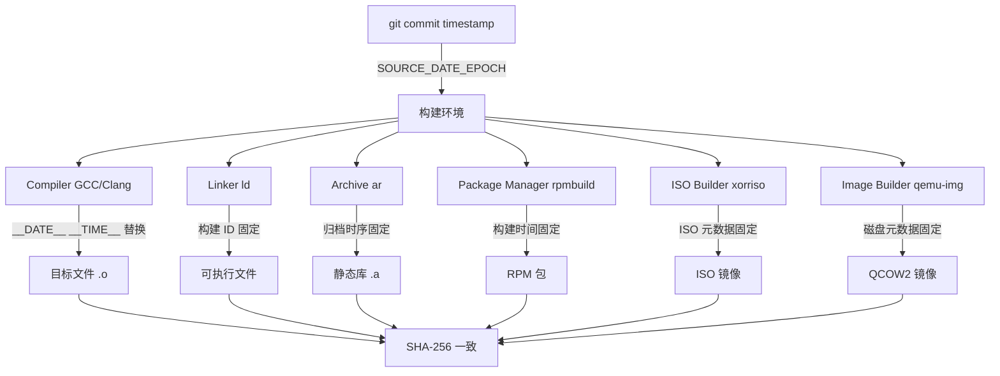
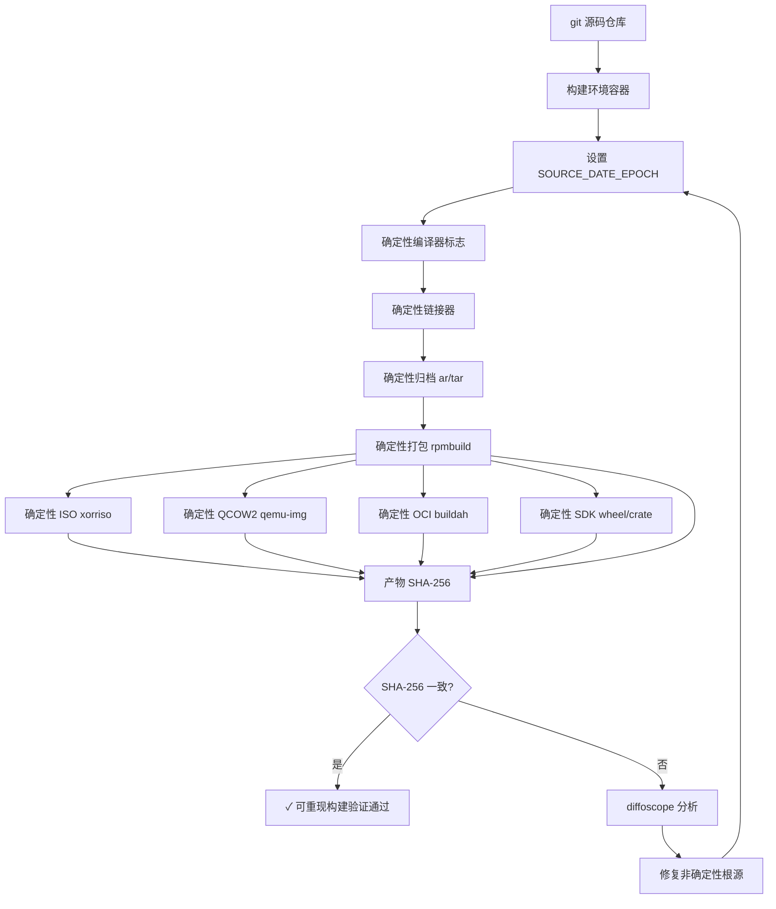

Copyright (c) 2025-2026 SPHARX Ltd. All Rights Reserved.

# agentrt-linux（AirymaxOS）可重现构建设计详细规范
> **文档定位**：agentrt-linux（AirymaxOS，极境智能体操作系统）可重现构建（Reproducible Builds）详细设计，确保从源码到二进制的端到端可验证性\
> **文档版本**：0.1.1\
> **最后更新**：2026-07-09\
> **上级文档**：[agentrt-linux 设计文档](README.md)\
> **同源映射**：agentrt 构建基线（IRON-9 v2 [IND] 完全独立层，构建工具链为 agentrt-linux 专属）\
> **理论根基**：Linux 6.6 内核基线工程思想 + seL4 微内核设计思想 + Airymax 体系并行论\
> **SPDX-License-Identifier**：AGPL-3.0-or-later OR Apache-2.0\
> **IRON-9 v2 层次**：[IND] 完全独立层（可重现构建为 agentrt-linux 发行版专属）

---

## 1. 设计目标与范围

### 1.1 设计目标

agentrt-linux（AirymaxOS）可重现构建设计旨在确保：**任何人在任何时间、任何地点、使用任何符合规范的构建环境，从同一份源码构建出的二进制产物逐字节完全一致**。这是"可追溯、可验证"发行版哲学的终极体现，也是供应链安全的工程基石。

本设计达成以下核心目标：

1. **位级可重现（bit-for-bit reproducible）**：同一源码 + 同一构建规范 → 逐字节一致的二进制产物（SHA-256 完全匹配）
2. **全产物覆盖**：内核 RPM、用户态 RPM、ISO 镜像、QCOW2 镜像、容器镜像、SDK 包 6 类产物全部可重现
3. **跨架构一致**：x86_64 / aarch64 / riscv64 三架构均通过可重现构建验证
4. **构建溯源**：每个二进制产物可溯源至精确的 git commit + 构建环境指纹 + 构建时间戳

### 1.2 适用范围

- Linux 6.6 内核基线构建（kernel）
- 8 个子仓的用户态构建（kernel/services/security/memory/cognition/cloudnative/system/tests-linux）
- ISO 镜像构建（mkisofs + xorriso）
- QCOW2 镜像构建（qemu-img + libguestfs）
- OCI 容器镜像构建（buildah + podman）
- SDK 包构建（Python wheel + Rust crate + C header tarball）

### 1.3 术语规范

本设计严格遵守 agentrt-linux 术语规范：agentrt（用户态）称为**微核心**（micro-core），agentrt-linux（OS 发行版）称为**微内核**（micro-kernel）。可重现构建与 agentrt 构建之间属于 IRON-9 v2 [IND] 完全独立层。

### 1.4 可重现构建场景矩阵

| 场景 | 产物类型 | 可重现难度 | 验证方法 | 适用 |
|------|----------|-----------|----------|------|
| 内核 RPM | 二进制 RPM | 高（编译器版本敏感） | SHA-256 + diffoscope | 每次发布 |
| 用户态 RPM | 二进制 RPM | 中 | SHA-256 + diffoscope | 每次发布 |
| ISO 镜像 | ISO 9660 | 高（元数据时序敏感） | SHA-256 + isohybrid | 每次发布 |
| QCOW2 镜像 | QCOW2 磁盘 | 高（文件系统时序） | SHA-256 + qemu-img compare | 每次发布 |
| 容器镜像 | OCI 镜像 | 中（层摘要可重现） | 摘要对比 + skopeo | 每次构建 |
| SDK 包 | wheel/crate/tarball | 低 | SHA-256 + twine check | 每次发布 |

---

## 2. 可重现构建原理与挑战

### 2.1 不可重现的根源

传统构建过程产生不可重现二进制的 5 大根源：

| 编号 | 根源 | 影响 | 解决方向 |
|------|------|------|----------|
| RB-01 | 时间戳嵌入 | 二进制中嵌入 `__DATE__`/`__TIME__` 宏 | SOURCE_DATE_EPOCH |
| RB-02 | 文件排序非确定 | 构建系统遍历文件系统顺序不定 | 显式排序 |
| RB-03 | 随机性 | UUID、临时文件名、内存地址 | 固定种子 + 确定性分配 |
| RB-04 | 路径嵌入 | 构建目录绝对路径嵌入调试信息 | -ffile-prefix-map |
| RB-05 | 时区与 locale | 构建环境时区影响时间戳 | 固定 UTC + C locale |

### 2.2 可重现构建核心原理

可重现构建的核心原理是**消除所有非确定性输入**，使构建过程成为纯函数：

```
build(source, spec) → deterministic_binary
```

即：构建输出仅依赖于源码（source）和构建规范（spec），与构建环境、构建时间、构建者身份无关。

### 2.3 设计哲学

agentrt-linux 可重现构建遵循三大设计哲学：

1. **零信任供应链（Zero-Trust Supply Chain）**：不信任任何构建中间产物，所有产物必须可从源码独立验证
2. **确定性优先（Determinism First）**：在性能与确定性冲突时，优先保证确定性（如禁用 `-ffast-math`）
3. **可验证优于可信任（Verifiable over Trustable）**：不要求信任构建者，只要求产物可被任何人独立验证

---

## 3. SOURCE_DATE_EPOCH 规范

### 3.1 SOURCE_DATE_EPOCH 定义

`SOURCE_DATE_EPOCH` 是 Reproducible Builds 项目确立的行业标准环境变量，指定构建的"逻辑时间戳"（Unix 纪元秒数），替代所有 `__DATE__`/`__TIME__`/`__TIMESTAMP__` 宏。

### 3.2 SOURCE_DATE_EPOCH 设定规则

```bash
# /etc/airymaxos/build/env.sh（agentrt-linux 构建环境标准）
# SOURCE_DATE_EPOCH 设定为最后一次 git commit 的时间戳
export SOURCE_DATE_EPOCH=$(git -C "$SRC_DIR" log -1 --pretty=%ct)

# 强制 UTC 时区
export TZ=UTC

# 强制 C locale
export LC_ALL=C
export LANG=C

# 强制统一 umask
umask 022
```

### 3.3 SOURCE_DATE_EPOCH 传播



### 3.4 编译器 SOURCE_DATE_EPOCH 支持

GCC 7+ 和 Clang 8+ 原生支持 `SOURCE_DATE_EPOCH`，自动替换 `__DATE__`/`__TIME__`/`__TIMESTAMP__` 宏：

```c
/* 验证 SOURCE_DATE_EPOCH 生效的测试代码 */
/* tests-linux/reproducible/test_source_date_epoch.c */
#include <stdio.h>
#include <string.h>

int main(void)
{
    /* 当 SOURCE_DATE_EPOCH 设定时，以下宏返回固定值 */
    printf("Build date: %s\n", __DATE__);       /* 应为固定日期 */
    printf("Build time: %s\n", __TIME__);       /* 应为固定时间 */
    printf("Timestamp:  %s\n", __TIMESTAMP__);  /* 应为固定时间戳 */
    return 0;
}
```

---

## 4. 编译器确定性标志

### 4.1 GCC/Clang 可重现构建标志

```makefile
# kernel/Makefile（节选）
# 可重现构建编译器标志

# 强制确定性构建
KBUILD_CFLAGS += -ffile-prefix-map=$(src)=/usr/src/airymaxos-kernel
KBUILD_CFLAGS += -fdebug-prefix-map=$(src)=/usr/src/airymaxos-kernel
KBUILD_CFLAGS += -fmacro-prefix-map=$(src)=/usr/src/airymaxos-kernel

# 禁用不确定的优化（可能导致浮点差异）
KBUILD_CFLAGS += -fno-fast-math
KBUILD_CFLAGS += -fno-associative-math

# 禁用不确定的内联（依赖编译器版本）
KBUILD_CFLAGS += -fno-inline-functions-called-once

# 强制确定性异常处理
KBUILD_CFLAGS += -fno-asynchronous-unwind-tables

# 调试信息确定性
KBUILD_CFLAGS += -gdwarf-4
KBUILD_CFLAGS += -fdebug-types-section

# 链接器确定性标志
LDFLAGS += -Wl,--build-id=sha1
LDFLAGS += -Wl,--no-insert-timestamp
```

### 4.2 -ffile-prefix-map 详解

`-ffile-prefix-map=old=new` 将调试信息和宏中的构建目录绝对路径替换为固定路径：

```bash
# 构建命令
gcc -ffile-prefix-map=/home/builder/airymaxos=/usr/src/airymaxos \
    -c kernel/sched/core.c -o sched/core.o

# 调试信息中的路径
# 修改前: /home/builder/airymaxos/kernel/sched/core.c
# 修改后: /usr/src/airymaxos/kernel/sched/core.c
```

### 4.3 链接器确定性

```c
/* airymaxos-build/ld-scripts/deterministic.ld */
/* 确定性链接脚本 */

SECTIONS
{
    /* 强制节区顺序确定 */
    . = 0xffffffff80000000;
    .text : {
        *(.text.head)
        *(.text)
        /* 显式排序符号 */
        *(SORT(.text.*))
    }
    
    /* 构建ID 使用 SHA-1（确定性） */
    .note.gnu.build-id : {
        PROVIDE(build_id = .);
        *(.note.gnu.build-id)
    }
    
    /* 调试信息确定性排序 */
    .debug_info : { *(.debug_info) }
    .debug_abbrev : { *(.debug_abbrev) }
    .debug_line : { *(.debug_line) }
    .debug_str : { *(SORT(.debug_str)) }
}
```

### 4.4 归档工具确定性

```bash
# ar 归档确定性标志（D = 确定性）
ar rcsD libairymaxos.a *.o

# 或使用 ar 的 --date 选项指定时间戳
ar rcs --date=@${SOURCE_DATE_EPOCH} libairymaxos.a *.o

# tar 归档确定性
tar --sort=name \
    --mtime="@${SOURCE_DATE_EPOCH}" \
    --owner=0 --group=0 --numeric-owner \
    --mode=go+u,go-w \
    -cf airymaxos.tar .
```

---

## 5. RPM 可重现构建

### 5.1 RPM 可重现构建原理

RPM 包的可重现构建需要控制 3 个层面：
1. **源 RPM（SRPM）确定性**：源码 tarball + patch 顺序 + spec 文件
2. **构建环境确定性**：构建依赖版本 + 编译器版本 + 系统库版本
3. **二进制 RPM 确定性**：文件排序 + 时间戳 + 文件权限 + 摘要算法

### 5.2 RPM spec 可重现构建标志

```spec
# airymaxos-kernel.spec（节选）
# 可重现构建 RPM spec 标志

%global source_date_epoch_from_changelog 1
%global _build_id_links all
%global _missing_build_ids_terminate_build 1
%global _no_reorder_build_id_links 1

# 强制确定性文件排序
%global _tmppath /var/tmp
%global _rpmfilename %%{ARCH}/%%{NAME}-%%{VERSION}-%%{RELEASE}.%%{ARCH}.rpm

# 禁用非确定性的 debuginfo 编辑
%global _include_minidebuginfo 0
%global _find_debuginfo_dwz_opts ""

Name:           airymaxos-kernel
Version:        1.0.1
Release:        1%{?dist}
Summary:        AirymaxOS Kernel (Linux 6.6 based)

%build
# 设置 SOURCE_DATE_EPOCH
export SOURCE_DATE_EPOCH=$(git log -1 --pretty=%ct)
export TZ=UTC
export LC_ALL=C

# 可重现构建编译器标志
export CFLAGS="%{optflags} -ffile-prefix-map=%{_builddir}=/usr/src/airymaxos"
export LDFLAGS="-Wl,--build-id=sha1 -Wl,--no-insert-timestamp"

make %{?_smp_mflags} CFLAGS="$CFLAGS" LDFLAGS="$LDFLAGS"

%install
# 确定性安装
make INSTALL_MOD_PATH=%{buildroot} INSTALL_MOD_STRIP=1 modules_install
# 强制文件时间戳
find %{buildroot} -exec touch -h -d "@${SOURCE_DATE_EPOCH}" {} +

%files
# 文件列表确定性排序（按字母序）
%defattr(-,root,root,-)
/boot/vmlinuz-%{version}
/lib/modules/%{version}/...
```

### 5.3 RPM 构建脚本

```bash
#!/bin/bash
# airymaxos-build/scripts/reproducible-rpm-build.sh
# 可重现 RPM 构建脚本

set -euo pipefail

SRC_DIR="${1:?Usage: $0 <src_dir> <arch>}"
ARCH="${2:?Architecture required (x86_64|aarch64|riscv64)}"

# 1. 设置确定性环境
export SOURCE_DATE_EPOCH=$(git -C "$SRC_DIR" log -1 --pretty=%ct)
export TZ=UTC
export LC_ALL=C
export LANG=C
umask 022

echo "[reproducible] SOURCE_DATE_EPOCH=$SOURCE_DATE_EPOCH"
echo "[reproducible] Architecture=$ARCH"

# 2. 准备构建环境
BUILD_DIR=$(mktemp -d /var/tmp/airymaxos-build.XXXXXX)
trap "rm -rf $BUILD_DIR" EXIT

# 3. 复制源码（确定性排序）
rsync -a --delete "$SRC_DIR/" "$BUILD_DIR/S/"

# 4. 安装构建依赖
dnf builddep -y "$BUILD_DIR/S/airymaxos-kernel.spec"

# 5. 构建 SRPM
rpmbuild -bs \
    --define "_topdir $BUILD_DIR" \
    --define "_srcrpmdir $BUILD_DIR/SRPMS" \
    --define "_sourcedir $BUILD_DIR/S" \
    --define "_specdir $BUILD_DIR/S" \
    "$BUILD_DIR/S/airymaxos-kernel.spec"

# 6. 构建二进制 RPM
rpmbuild -bb \
    --define "_topdir $BUILD_DIR" \
    --define "_rpmdir $BUILD_DIR/RPMS" \
    --define "_sourcedir $BUILD_DIR/S" \
    --target "$ARCH" \
    "$BUILD_DIR/S/airymaxos-kernel.spec"

# 7. 计算产物 SHA-256
echo "[reproducible] Product SHA-256:"
sha256sum "$BUILD_DIR"/RPMS/$ARCH/*.rpm

# 8. 导出构建环境指纹
cat > "$BUILD_DIR/build-manifest.json" <<EOF
{
  "source_date_epoch": $SOURCE_DATE_EPOCH,
  "git_commit": "$(git -C "$SRC_DIR" rev-parse HEAD)",
  "git_branch": "$(git -C "$SRC_DIR" rev-parse --abbrev-ref HEAD)",
  "architecture": "$ARCH",
  "builder_gcc": "$(gcc --version | head -1)",
  "builder_kernel": "$(uname -r)",
  "builder_os": "$(cat /etc/os-release | grep PRETTY_NAME | cut -d= -f2)",
  "build_timestamp": $(date +%s)
}
EOF
cp "$BUILD_DIR/build-manifest.json" ./build-manifest.json

echo "[reproducible] Build complete. Manifest: ./build-manifest.json"
```

### 5.4 RPM 验证流程

```bash
#!/bin/bash
# airymaxos-build/scripts/verify-reproducible-rpm.sh
# 验证 RPM 可重现性

set -euo pipefail

RPM_A="${1:?First RPM required}"
RPM_B="${2:?Second RPM required}"

echo "[verify] Comparing RPM A: $RPM_A"
echo "[verify] Comparing RPM B: $RPM_B"

# 1. SHA-256 对比
SHA_A=$(sha256sum "$RPM_A" | cut -d' ' -f1)
SHA_B=$(sha256sum "$RPM_B" | cut -d' ' -f1)

if [ "$SHA_A" = "$SHA_B" ]; then
    echo "[verify] ✓ SHA-256 match (bit-for-bit identical)"
    exit 0
fi

echo "[verify] ✗ SHA-256 mismatch, running diffoscope analysis..."

# 2. diffoscope 深度分析
diffoscope "$RPM_A" "$RPM_B" > reproducible-diff.txt 2>&1 || true

# 3. 提取关键差异
DIFF_COUNT=$(grep -c "^│\|^-" reproducible-diff.txt || true)
echo "[verify] Differences found: $DIFF_COUNT"
echo "[verify] See reproducible-diff.txt for details"

exit 1
```

---

## 6. ISO 镜像可重现构建

### 6.1 ISO 不可重现根源

ISO 镜像的不可重现根源主要有 3 个：
1. **El Torito 引导记录**：包含构建时间戳
2. **ISO 9660 元数据**：卷创建时间、应用名称等
3. **文件排序**：Rock Ridge 扩展中的文件顺序

### 6.2 xorriso 可重现构建

```bash
#!/bin/bash
# airymaxos-build/scripts/reproducible-iso-build.sh
# 可重现 ISO 镜像构建

set -euo pipefail

ROOTFS="${1:?Rootfs directory required}"
OUTPUT="${2:?Output ISO path required}"
ISO_LABEL="AIRYMAXOS"

export SOURCE_DATE_EPOCH=$(git log -1 --pretty=%ct)
export TZ=UTC
export LC_ALL=C

# 1. 确定性文件排序
find "$ROOTFS" -exec touch -h -d "@${SOURCE_DATE_EPOCH}" {} +
find "$ROOTFS" -exec chmod go+u,go-w {} +

# 2. xorriso 可重现构建
xorriso -as mkisofs \
    -r -V "$ISO_LABEL" \
    -J -joliet-long \
    -no-emul-boot \
    -boot-load-size 4 \
    -boot-info-table \
    -input-charset utf-8 \
    -output "$OUTPUT" \
    -volume_date all_file_dates "@${SOURCE_DATE_EPOCH}" \
    -volume_date creation "@${SOURCE_DATE_EPOCH}" \
    -volume_date modification "@${SOURCE_DATE_EPOCH}" \
    -volume_date expiration "9999999999" \
    -volume_date effective "@${SOURCE_DATE_EPOCH}" \
    -appid "AirymaxOS 1.0.1" \
    -publisher "SPHARX Ltd." \
    -sysid "AirymaxOS" \
    -preparer "agentrt-linux Reproducible Build" \
    -b isolinux/isolinux.bin \
    -c isolinux/boot.cat \
    -sort-weight 0 / \
    "$ROOTFS"

# 3. 计算 SHA-256
echo "[reproducible] ISO SHA-256:"
sha256sum "$OUTPUT"

# 4. isohybrid 处理（可 UEFI 启动）
isohybrid --uefi "$OUTPUT"

# 5. 重新计算 SHA-256（isohybrid 修改了引导扇区）
echo "[reproducible] ISO SHA-256 (after isohybrid):"
sha256sum "$OUTPUT"
```

### 6.3 ISO 验证

```bash
#!/bin/bash
# 验证 ISO 可重现性

ISO_A="${1:?First ISO required}"
ISO_B="${2:?Second ISO required}"

# 1. SHA-256 对比
if sha256sum "$ISO_A" "$ISO_B" | awk '{print $1}' | sort -u | wc -l | grep -q "^1$"; then
    echo "[verify] ✓ ISO SHA-256 match (bit-for-bit identical)"
    exit 0
fi

# 2. ISO 内容对比
echo "[verify] ✗ SHA-256 mismatch, comparing ISO contents..."

# 挂载两个 ISO 并对比内容
mkdir -p /mnt/iso_a /mnt/iso_b
mount -o loop,ro "$ISO_A" /mnt/iso_a
mount -o loop,ro "$ISO_B" /mnt/iso_b
trap "umount /mnt/iso_a /mnt/iso_b" EXIT

diff -r /mnt/iso_a /mnt/iso_b && echo "[verify] ✓ Content identical" || echo "[verify] ✗ Content differs"

# 3. ISO 元数据对比
echo "[verify] ISO metadata A:"
isoinfo -d -i "$ISO_A"
echo "[verify] ISO metadata B:"
isoinfo -d -i "$ISO_B"
```

---

## 7. QCOW2 镜像可重现构建

### 7.1 QCOW2 不可重现根源

QCOW2 镜像的不可重现根源主要有 4 个：
1. **文件系统元数据**：inode 创建时间、修改时间
2. **UUID 生成**：文件系统 UUID 随机生成
3. **块分配顺序**：文件系统块分配依赖写入顺序
4. **QCOW2 头部**：镜像创建时间戳

### 7.2 确定性 QCOW2 构建

```bash
#!/bin/bash
# airymaxos-build/scripts/reproducible-qcow2-build.sh
# 可重现 QCOW2 镜像构建

set -euo pipefail

ROOTFS="${1:?Rootfs directory required}"
OUTPUT="${2:?Output QCOW2 path required}"
SIZE="${3:-10G}"

export SOURCE_DATE_EPOCH=$(git log -1 --pretty=%ct)
export TZ=UTC
export LC_ALL=C

# 1. 创建原始磁盘镜像
RAW_IMG=$(mktemp /var/tmp/airymaxos-raw.XXXXXX.img)
trap "rm -f $RAW_IMG" EXIT

# 2. 创建 ext4 文件系统（固定 UUID + 固定时间戳)
dd if=/dev/zero of="$RAW_IMG" bs=1M count=0 seek=$(numfmt --from=iec "$SIZE")
mkfs.ext4 -F \
    -U "00000000-0000-0000-0000-$(printf '%012x' $SOURCE_DATE_EPOCH)" \
    -T now="@${SOURCE_DATE_EPOCH}" \
    -E lazy_itable_init=0,lazy_journal_init=0 \
    -m 0 \
    "$RAW_IMG"

# 3. 挂载并填充 rootfs
MOUNT_POINT=$(mktemp -d /var/tmp/airymaxos-mount.XXXXXX)
mount -o loop "$RAW_IMG" "$MOUNT_POINT"
trap "umount $MOUNT_POINT; rmdir $MOUNT_POINT; rm -f $RAW_IMG" EXIT

# 4. 确定性复制 rootfs
rsync -a --delete \
    --no-times \
    --no-perms \
    --no-owner \
    --no-group \
    "$ROOTFS/" "$MOUNT_POINT/"

# 5. 强制文件时间戳
find "$MOUNT_POINT" -exec touch -h -d "@${SOURCE_DATE_EPOCH}" {} +
find "$MOUNT_POINT" -exec chmod go+u,go-w {} +

# 6. 卸载并同步
sync
umount "$MOUNT_POINT"
rmdir "$MOUNT_POINT"

# 7. 转换为 QCOW2（确定性）
qemu-img convert -f raw -O qcow2 \
    -o compat=1.1,cluster_size=65536,preallocation=off \
    "$RAW_IMG" "$OUTPUT"

# 8. 计算 SHA-256
echo "[reproducible] QCOW2 SHA-256:"
sha256sum "$OUTPUT"
```

### 7.3 QCOW2 验证

```bash
#!/bin/bash
# 验证 QCOW2 可重现性

QCOW2_A="${1:?First QCOW2 required}"
QCOW2_B="${2:?Second QCOW2 required}"

# 1. SHA-256 对比
if sha256sum "$QCOW2_A" "$QCOW2_B" | awk '{print $1}' | sort -u | wc -l | grep -q "^1$"; then
    echo "[verify] ✓ QCOW2 SHA-256 match (bit-for-bit identical)"
    exit 0
fi

# 2. qemu-img compare 内容对比
echo "[verify] ✗ SHA-256 mismatch, running qemu-img compare..."
if qemu-img compare "$QCOW2_A" "$QCOW2_B"; then
    echo "[verify] ✓ Content identical (metadata differs only)"
else
    echo "[verify] ✗ Content differs"
    exit 1
fi
```

---

## 8. 容器镜像可重现构建

### 8.1 OCI 镜像不可重现根源

OCI 容器镜像的不可重现根源主要有 3 个：
1. **层摘要（layer digest）**：层内容依赖构建顺序
2. **配置摘要（config digest）**：配置包含创建时间戳
3. **基础镜像版本**：基础镜像版本浮动

### 8.2 Buildah 可重现构建

```bash
#!/bin/bash
# airymaxos-build/scripts/reproducible-container-build.sh
# 可重现 OCI 容器镜像构建

set -euo pipefail

CONTAINERFILE="${1:?Containerfile path required}"
IMAGE_NAME="${2:?Image name required}"

export SOURCE_DATE_EPOCH=$(git log -1 --pretty=%ct)
export TZ=UTC
export LC_ALL=C

# 1. 使用 buildah 可重现构建
buildah bud \
    --build-arg SOURCE_DATE_EPOCH=$SOURCE_DATE_EPOCH \
    --build-arg TZ=UTC \
    --build-arg LC_ALL=C \
    --timestamp $SOURCE_DATE_EPOCH \
    --format docker \
    --tag "$IMAGE_NAME" \
    -f "$CONTAINERFILE"

# 2. 导出为 OCI 镜像（确定性）
buildah push \
    --format oci \
    "$IMAGE_NAME" \
    "oci-dir:$IMAGE_NAME-oci"

# 3. 计算各层摘要
echo "[reproducible] Layer digests:"
skopeo inspect --format '{{range .Layers}}{{.Digest}}{{"\n"}}{{end}}' \
    "oci:$IMAGE_NAME-oci"

# 4. 计算配置摘要
echo "[reproducible] Config digest:"
skopeo inspect --format '{{.Digest}}' \
    "oci:$IMAGE_NAME-oci"
```

### 8.3 可重现 Containerfile 模板

```dockerfile
# cloudnative/oci/Containerfile.agent-base
# 可重现 Agent 基础镜像

ARG BASE_IMAGE=registry.airymaxos.dev/airymaxos/base:1.0.1
FROM $BASE_IMAGE

# 构建参数（确定性）
ARG SOURCE_DATE_EPOCH
ARG TZ=UTC
ARG LC_ALL=C

# 设置确定性环境
ENV SOURCE_DATE_EPOCH=$SOURCE_DATE_EPOCH
ENV TZ=$TZ
ENV LC_ALL=$LC_ALL

# 安装确定性依赖（固定版本）
RUN dnf install -y \
        airymaxos-sdk-python-1.0.1 \
        airymaxos-sdk-rust-1.0.1 \
    && dnf clean all

# 复制 Agent 代码（确定性时间戳）
COPY --chown=0:0 agent-src/ /opt/agent/

# 设置工作目录
WORKDIR /opt/agent

# 安装 Python 依赖
RUN pip install --no-cache-dir --no-deps -r requirements.txt

# 强制文件时间戳
RUN find / -exec touch -h -d "@${SOURCE_DATE_EPOCH}" {} + 2>/dev/null || true

# 入口点
ENTRYPOINT ["python3", "-m", "agent.main"]
```

---

## 9. SDK 包可重现构建

### 9.1 Python wheel 可重现构建

```bash
#!/bin/bash
# 可重现 Python wheel 构建

export SOURCE_DATE_EPOCH=$(git log -1 --pretty=%ct)
export TZ=UTC
export LC_ALL=C
export PYTHONHASHSEED=0

# 1. 清理旧构建
rm -rf build/ dist/ *.egg-info/

# 2. 构建 wheel（确定性）
python -m pip wheel \
    --no-deps \
    --no-build-isolation \
    --wheel-dir dist/ \
    .

# 3. 修正 wheel 时间戳
WHEEL_FILE=$(ls dist/*.whl | head -1)
ZIP_DIR=$(mktemp -d)
unzip -d "$ZIP_DIR" "$WHEEL_FILE"
find "$ZIP_DIR" -exec touch -h -d "@${SOURCE_DATE_EPOCH}" {} +
(cd "$ZIP_DIR" && zip -X -r "$OLDPWD/$WHEEL_FILE" .)
rm -rf "$ZIP_DIR"

# 4. 计算 SHA-256
echo "[reproducible] Wheel SHA-256:"
sha256sum "$WHEEL_FILE"
```

### 9.2 Rust crate 可重现构建

```bash
#!/bin/bash
# 可重现 Rust crate 构建

export SOURCE_DATE_EPOCH=$(git log -1 --pretty=%ct)
export TZ=UTC
export LC_ALL=C

# 1. 清理旧构建
cargo clean

# 2. 构建 crate（确定性）
RUSTFLAGS="--remap-path-prefix $PWD=/usr/src/airymaxos" \
cargo build --release

# 3. 打包 crate
cargo package --no-verify

# 4. 修正 crate 时间戳
CRATE_FILE=$(ls target/package/*.crate | head -1)
TAR_DIR=$(mktemp -d)
tar xf "$CRATE_FILE" -C "$TAR_DIR"
find "$TAR_DIR" -exec touch -h -d "@${SOURCE_DATE_EPOCH}" {} +
(cd "$TAR_DIR" && tar --sort=name --mtime="@${SOURCE_DATE_EPOCH}" \
    --owner=0 --group=0 --numeric-owner \
    -cf "$OLDPWD/$CRATE_FILE" .)
rm -rf "$TAR_DIR"

# 5. 计算 SHA-256
echo "[reproducible] Crate SHA-256:"
sha256sum "$CRATE_FILE"
```

### 9.3 C header tarball 可重现构建

```bash
#!/bin/bash
# 可重现 C header tarball 构建

export SOURCE_DATE_EPOCH=$(git log -1 --pretty=%ct)
export TZ=UTC
export LC_ALL=C

# 1. 收集 [SC] 共享契约层头文件
mkdir -p airymaxos-headers/airymax
cp include/airymax/*.h airymaxos-headers/airymax/

# 2. 强制时间戳
find airymaxos-headers -exec touch -h -d "@${SOURCE_DATE_EPOCH}" {} +
find airymaxos-headers -exec chmod 0644 {} +

# 3. 创建确定性 tarball
tar --sort=name \
    --mtime="@${SOURCE_DATE_EPOCH}" \
    --owner=0 --group=0 --numeric-owner \
    --mode=go+u,go-w \
    -czf airymaxos-headers-1.0.1.tar.gz \
    airymaxos-headers/

# 4. 计算 SHA-256
echo "[reproducible] Header tarball SHA-256:"
sha256sum airymaxos-headers-1.0.1.tar.gz
```

---

## 10. 构建环境确定性

### 10.1 构建环境指纹

```bash
#!/bin/bash
# airymaxos-build/scripts/build-env-fingerprint.sh
# 生成构建环境指纹

cat > build-env-fingerprint.json <<EOF
{
  "timestamp": "$(date -u +%Y-%m-%dT%H:%M:%SZ)",
  "source_date_epoch": $SOURCE_DATE_EPOCH,
  "git_commit": "$(git rev-parse HEAD)",
  "git_branch": "$(git rev-parse --abbrev-ref HEAD)",
  "architecture": "$(uname -m)",
  "kernel": "$(uname -r)",
  "os": "$(cat /etc/os-release | grep PRETTY_NAME | cut -d= -f2 | tr -d '"')",
  "gcc": {
    "version": "$(gcc --version | head -1)",
    "path": "$(which gcc)"
  },
  "ld": {
    "version": "$(ld --version | head -1)",
    "path": "$(which ld)"
  },
  "ar": {
    "version": "$(ar --version | head -1)",
    "path": "$(which ar)"
  },
  "rpmbuild": {
    "version": "$(rpmbuild --version)",
    "path": "$(which rpmbuild)"
  },
  "glibc": "$(ldd --version | head -1)",
  "binutils": "$(as --version | head -1)",
  "packages": [
$(rpm -qa --queryformat '"%{NAME}-%{VERSION}-%{RELEASE}.%{ARCH}",\n' | sort | sed '$ s/,$//')
  ]
}
EOF

echo "[fingerprint] Build environment fingerprint: build-env-fingerprint.json"
sha256sum build-env-fingerprint.json
```

### 10.2 构建环境锁文件

```json
{
  "build_env_lock_version": "1.0.1",
  "base_image": "registry.airymaxos.dev/airymaxos/build-base:1.0.1",
  "base_image_digest": "sha256:abcdef1234567890...",
  "packages": {
    "gcc": "13.2.1-6.fc39",
    "binutils": "2.41-37.fc39",
    "rpmbuild": "4.19-1.fc39",
    "xorriso": "1.5.6-2.fc39",
    "qemu-img": "8.2.0-5.fc39",
    "buildah": "1.33.2-1.fc39"
  },
  "environment": {
    "TZ": "UTC",
    "LC_ALL": "C",
    "LANG": "C",
    "UMASK": "022",
    "PYTHONHASHSEED": "0"
  },
  "kernel": "6.6.0-airymaxos",
  "glibc": "2.38"
}
```

### 10.3 构建容器镜像

```dockerfile
# airymaxos-build/oci/Containerfile.build-base
# agentrt-linux 可重现构建基础镜像

FROM registry.fedoraproject.org/fedora:39

# 安装构建依赖（固定版本）
RUN dnf install -y --setopt=install_weak_deps=False \
        gcc-13.2.1 \
        gcc-c++-13.2.1 \
        binutils-2.41 \
        rpmbuild-4.19 \
        rpmdevtools \
        xorriso-1.5.6 \
        qemu-img-8.2.0 \
        libguestfs-tools \
        buildah-1.33.2 \
        podman-4.9.0 \
        skopeo-1.14.0 \
        diffoscope \
        python3-devel \
        python3-pip \
        python3-wheel \
        cargo \
        rustfmt \
        make \
        git \
        findutils \
        coreutils \
    && dnf clean all

# 设置确定性环境
ENV TZ=UTC \
    LC_ALL=C \
    LANG=C \
    PYTHONHASHSEED=0

WORKDIR /build

ENTRYPOINT ["/usr/bin/bash"]
```

---

## 11. 验证基础设施

### 11.1 可重现构建验证矩阵

```python
#!/usr/bin/env python3
# tests-linux/reproducible/verify_matrix.py
# 可重现构建验证矩阵

import hashlib
import json
import subprocess
import sys
from dataclasses import dataclass
from pathlib import Path
from typing import List, Optional


@dataclass
class BuildProduct:
    """构建产物"""
    name: str
    path: Path
    product_type: str  # rpm, iso, qcow2, oci, wheel, crate, tarball
    architecture: str  # x86_64, aarch64, riscv64
    expected_sha256: Optional[str] = None

    def compute_sha256(self) -> str:
        """计算产物 SHA-256"""
        h = hashlib.sha256()
        with open(self.path, 'rb') as f:
            for chunk in iter(lambda: f.read(8192), b''):
                h.update(chunk)
        return h.hexdigest()


@dataclass
class VerificationResult:
    """验证结果"""
    product: BuildProduct
    build_a_sha256: str
    build_b_sha256: str
    is_reproducible: bool
    diffoscope_report: Optional[str] = None


def verify_product(product: BuildProduct,
                   build_a_dir: Path,
                   build_b_dir: Path) -> VerificationResult:
    """验证单个产物可重现性"""
    path_a = build_a_dir / product.path.name
    path_b = build_b_dir / product.path.name

    sha_a = product.__class__(name=product.name, path=path_a,
                              product_type=product.product_type,
                              architecture=product.architecture).compute_sha256()
    sha_b = product.__class__(name=product.name, path=path_b,
                              product_type=product.product_type,
                              architecture=product.architecture).compute_sha256()

    is_reproducible = (sha_a == sha_b)

    # 如不可重现，运行 diffoscope
    diff_report = None
    if not is_reproducible:
        try:
            result = subprocess.run(
                ['diffoscope', str(path_a), str(path_b)],
                capture_output=True, text=True, timeout=300)
            diff_report = result.stdout
        except (subprocess.TimeoutExpired, FileNotFoundError):
            diff_report = "diffoscope unavailable or timed out"

    return VerificationResult(
        product=product,
        build_a_sha256=sha_a,
        build_b_sha256=sha_b,
        is_reproducible=is_reproducible,
        diffoscope_report=diff_report)


def main():
    """主验证函数"""
    build_a_dir = Path(sys.argv[1])
    build_b_dir = Path(sys.argv[2])

    # 验证矩阵
    products = [
        BuildProduct("kernel-rpm", Path("airymaxos-kernel-1.0.1-1.x86_64.rpm"),
                     "rpm", "x86_64"),
        BuildProduct("services-rpm", Path("airymaxos-services-1.0.1-1.x86_64.rpm"),
                     "rpm", "x86_64"),
        BuildProduct("iso-image", Path("airymaxos-1.0.1-x86_64.iso"),
                     "iso", "x86_64"),
        BuildProduct("qcow2-image", Path("airymaxos-1.0.1-x86_64.qcow2"),
                     "qcow2", "x86_64"),
        BuildProduct("oci-image", Path("agent-base-1.0.1.tar"),
                     "oci", "x86_64"),
        BuildProduct("python-wheel", Path("agentrt_sdk-1.0.1-py3-none-any.whl"),
                     "wheel", "noarch"),
        BuildProduct("rust-crate", Path("agentrt_sdk-1.0.1.crate"),
                     "crate", "noarch"),
        BuildProduct("header-tarball", Path("airymaxos-headers-1.0.1.tar.gz"),
                     "tarball", "noarch"),
    ]

    results: List[VerificationResult] = []
    for product in products:
        print(f"[verify] Checking {product.name}...")
        result = verify_product(product, build_a_dir, build_b_dir)
        status = "✓ REPRODUCIBLE" if result.is_reproducible else "✗ NOT REPRODUCIBLE"
        print(f"  {status}")
        print(f"  SHA-A: {result.build_a_sha256}")
        print(f"  SHA-B: {result.build_b_sha256}")
        results.append(result)

    # 生成报告
    report = {
        "verification_time": subprocess.check_output(
            ['date', '-u', '+%Y-%m-%dT%H:%M:%SZ']).decode().strip(),
        "total_products": len(results),
        "reproducible_count": sum(1 for r in results if r.is_reproducible),
        "non_reproducible_count": sum(1 for r in results if not r.is_reproducible),
        "products": [
            {
                "name": r.product.name,
                "type": r.product.product_type,
                "architecture": r.product.architecture,
                "sha256_a": r.build_a_sha256,
                "sha256_b": r.build_b_sha256,
                "is_reproducible": r.is_reproducible,
                "has_diffoscope_report": r.diffoscope_report is not None,
            }
            for r in results
        ],
    }

    report_path = Path("reproducible-verification-report.json")
    with open(report_path, 'w') as f:
        json.dump(report, f, indent=2)

    print(f"\n[verify] Report: {report_path}")
    print(f"[verify] Reproducible: {report['reproducible_count']}/{report['total_products']}")

    # 非零退出码如有不可重现产物
    if report['non_reproducible_count'] > 0:
        sys.exit(1)


if __name__ == '__main__':
    main()
```

### 11.2 CI/CD 可重现构建验证

```yaml
# .github/workflows/reproducible-build-verify.yml
name: Reproducible Build Verification

on:
  push:
    branches: [main, 'release-*']
    tags: ['v*']
  pull_request:
    branches: [main]

jobs:
  reproducible-build:
    name: Reproducible Build (${{ matrix.arch }})
    strategy:
      fail-fast: false
      matrix:
        arch: [x86_64, aarch64, riscv64]
    runs-on: ubuntu-22.04
    steps:
      - uses: actions/checkout@v4
        with:
          fetch-depth: 0

      - name: Set up build environment
        run: |
          export SOURCE_DATE_EPOCH=$(git log -1 --pretty=%ct)
          echo "SOURCE_DATE_EPOCH=$SOURCE_DATE_EPOCH" >> $GITHUB_ENV
          echo "TZ=UTC" >> $GITHUB_ENV
          echo "LC_ALL=C" >> $GITHUB_ENV

      - name: Build A (first build)
        run: |
          mkdir -p build-a
          ./scripts/reproducible-rpm-build.sh . ${{ matrix.arch }}
          cp -r RPMS/*.rpm build-a/

      - name: Build B (second build, clean environment)
        run: |
          # 清理构建缓存确保完全独立
          make clean || true
          rm -rf /var/tmp/airymaxos-build.*
          mkdir -p build-b
          ./scripts/reproducible-rpm-build.sh . ${{ matrix.arch }}
          cp -r RPMS/*.rpm build-b/

      - name: Verify reproducibility
        run: |
          python3 tests/reproducible/verify_matrix.py build-a build-b

      - name: Upload verification report
        if: always()
        uses: actions/upload-artifact@v4
        with:
          name: reproducible-report-${{ matrix.arch }}
          path: |
            reproducible-verification-report.json
            reproducible-diff.txt
            build-manifest.json
```

---

## 12. 数据流图



---

## 13. 错误处理

### 13.1 错误码定义

| 错误码 | 含义 | 处理方式 |
|--------|------|----------|
| `RB-E001` | SOURCE_DATE_EPOCH 未设置 | 从 git commit 自动推断 |
| `RB-E002` | 编译器版本不匹配 | 锁定至构建环境锁文件版本 |
| `RB-E003` | 构建依赖版本浮动 | 使用 dnf 锁定版本 |
| `RB-E004` | 产物 SHA-256 不匹配 | 运行 diffoscope 分析差异 |
| `RB-E005` | 构建环境指纹不匹配 | 重新创建构建环境容器 |

### 13.2 错误处理流程

```bash
#!/bin/bash
# airymaxos-build/scripts/handle-reproducible-error.sh

ERROR_CODE="${1:?Error code required}"

case "$ERROR_CODE" in
    RB-E001)
        echo "[ERROR] SOURCE_DATE_EPOCH not set"
        export SOURCE_DATE_EPOCH=$(git log -1 --pretty=%ct)
        echo "[INFO] Auto-set SOURCE_DATE_EPOCH=$SOURCE_DATE_EPOCH"
        ;;
    RB-E002)
        echo "[ERROR] Compiler version mismatch"
        echo "[INFO] Expected: $(jq -r .gcc.version build-env-lock.json)"
        echo "[INFO] Actual: $(gcc --version | head -1)"
        echo "[FIX] Rebuild in locked container image"
        ;;
    RB-E003)
        echo "[ERROR] Build dependency version drift"
        echo "[INFO] Run: dnf install --setopt=install_weak_deps=False"
        echo "[FIX] Pin dependency versions in spec file"
        ;;
    RB-E004)
        echo "[ERROR] Product SHA-256 mismatch"
        echo "[INFO] Running diffoscope analysis..."
        diffoscope "$2" "$3" > reproducible-diff.txt 2>&1
        echo "[INFO] See reproducible-diff.txt"
        ;;
    RB-E005)
        echo "[ERROR] Build environment fingerprint mismatch"
        echo "[INFO] Rebuild from locked container image"
        echo "[FIX] podman pull registry.airymaxos.dev/airymaxos/build-base:1.0.1"
        ;;
    *)
        echo "[ERROR] Unknown error code: $ERROR_CODE"
        exit 1
        ;;
esac
```

---

## 14. 安全考量

### 14.1 供应链安全

可重现构建是供应链安全的核心防线。通过确保任何人都可独立验证二进制产物，消除对构建者的信任依赖：

```bash
# 供应链验证流程
# 1. 用户获取官方发布的 SHA-256
# 2. 用户从源码独立构建
# 3. 用户对比 SHA-256
# 4. 如一致，则产物可信

# 官方发布 SHA-256
cat > airymaxos-1.0.1.sha256 <<EOF
a1b2c3d4e5f6...  airymaxos-kernel-1.0.1-1.x86_64.rpm
b2c3d4e5f6a1...  airymaxos-1.0.1-x86_64.iso
c3d4e5f6a1b2...  airymaxos-1.0.1-x86_64.qcow2
EOF

# GPG 签名
gpg --sign airymaxos-1.0.1.sha256

# 用户验证
gpg --verify airymaxos-1.0.1.sha256.gpg
sha256sum -c airymaxos-1.0.1.sha256
```

### 14.2 签名验证

```bash
#!/bin/bash
# 签名验证

# 1. 导入官方 GPG 公钥
gpg --import airymaxos-official-gpg-key.pub

# 2. 验证 SHA-256 文件签名
if ! gpg --verify airymaxos-1.0.1.sha256.gpg; then
    echo "[ERROR] GPG signature verification failed"
    exit 1
fi

# 3. 验证产物 SHA-256
if ! sha256sum -c airymaxos-1.0.1.sha256; then
    echo "[ERROR] SHA-256 verification failed"
    exit 1
fi

echo "[OK] All products verified"
```

### 14.3 构建环境隔离

```bash
# 在隔离的容器中构建，确保构建环境一致性
podman run --rm \
    -v $(pwd):/build:Z \
    -w /build \
    registry.airymaxos.dev/airymaxos/build-base:1.0.1 \
    /build/scripts/reproducible-rpm-build.sh /build x86_64
```

---

## 15. 性能约束

| 指标 | 目标值 | 测量方法 |
|------|--------|----------|
| RPM 构建时间 | ≤ 30 分钟 | time + rpmbuild |
| ISO 构建时间 | ≤ 15 分钟 | time + xorriso |
| QCOW2 构建时间 | ≤ 20 分钟 | time + qemu-img |
| 容器镜像构建时间 | ≤ 10 分钟 | time + buildah |
| 可重现验证时间 | ≤ 5 分钟 | time + verify_matrix.py |
| 构建环境准备时间 | ≤ 5 分钟 | time + podman pull |

---

## 16. IRON-9 v2 同源映射

| 层次 | 内容 | 共享程度 |
|------|------|----------|
| [SC] 共享契约层 | 无 | N/A（构建工具链为独立层） |
| [SS] 语义同源层 | 构建理念同源（确定性优先 + 零信任供应链） | 理念同源，实现独立 |
| [IND] 完全独立层 | RPM/ISO/QCOW2/OCI/SDK 全部构建工具链 | 完全独立 |

---

## 17. SDK 集成

### 17.1 Python SDK

```python
# airymaxos-sdk-python/airymaxos/reproducible.py
"""AirymaxOS 可重现构建 SDK"""

import hashlib
import json
import subprocess
from dataclasses import dataclass
from pathlib import Path
from typing import List, Optional


@dataclass
class BuildProduct:
    """构建产物"""
    name: str
    path: Path
    product_type: str
    architecture: str
    sha256: Optional[str] = None

    def compute_sha256(self) -> str:
        """计算 SHA-256"""
        h = hashlib.sha256()
        with open(self.path, 'rb') as f:
            for chunk in iter(lambda: f.read(8192), b''):
                h.update(chunk)
        self.sha256 = h.hexdigest()
        return self.sha256


@dataclass
class BuildManifest:
    """构建清单"""
    source_date_epoch: int
    git_commit: str
    architecture: str
    products: List[BuildProduct]

    def to_json(self) -> str:
        """导出为 JSON"""
        return json.dumps({
            "source_date_epoch": self.source_date_epoch,
            "git_commit": self.git_commit,
            "architecture": self.architecture,
            "products": [
                {
                    "name": p.name,
                    "path": str(p.path),
                    "type": p.product_type,
                    "architecture": p.architecture,
                    "sha256": p.sha256,
                }
                for p in self.products
            ],
        }, indent=2)


def verify_reproducibility(manifest_a: BuildManifest,
                          manifest_b: BuildManifest) -> bool:
    """验证两个构建清单的可重现性"""
    if len(manifest_a.products) != len(manifest_b.products):
        return False

    for a, b in zip(manifest_a.products, manifest_b.products):
        if a.name != b.name:
            return False
        if a.compute_sha256() != b.compute_sha256():
            return False
    return True
```

### 17.2 Rust SDK

```rust
// airymaxos-sdk-rust/src/reproducible.rs
//! AirymaxOS 可重现构建 SDK

use sha2::{Sha256, Digest};
use std::fs::File;
use std::io::{BufReader, Read};
use std::path::Path;

/// 构建产物
#[derive(Debug, Clone)]
pub struct BuildProduct {
    pub name: String,
    pub path: std::path::PathBuf,
    pub product_type: String,
    pub architecture: String,
    pub sha256: Option<String>,
}

impl BuildProduct {
    /// 计算产物 SHA-256
    pub fn compute_sha256(&mut self) -> Result<String, std::io::Error> {
        let file = File::open(&self.path)?;
        let mut reader = BufReader::new(file);
        let mut hasher = Sha256::new();
        let mut buffer = [0u8; 8192];

        loop {
            let n = reader.read(&mut buffer)?;
            if n == 0 {
                break;
            }
            hasher.update(&buffer[..n]);
        }

        let hash = format!("{:x}", hasher.finalize());
        self.sha256 = Some(hash.clone());
        Ok(hash)
    }
}

/// 构建清单
#[derive(Debug)]
pub struct BuildManifest {
    pub source_date_epoch: u64,
    pub git_commit: String,
    pub architecture: String,
    pub products: Vec<BuildProduct>,
}

impl BuildManifest {
    /// 验证两个清单的可重现性
    pub fn verify_reproducibility(&self, other: &BuildManifest) -> bool {
        if self.products.len() != other.products.len() {
            return false;
        }

        for (a, b) in self.products.iter().zip(&other.products) {
            if a.name != b.name {
                return false;
            }
            let mut a = a.clone();
            let mut b = b.clone();
            if a.compute_sha256().ok() != b.compute_sha256().ok() {
                return false;
            }
        }
        true
    }
}
```

---

## 18. 使用示例

### 18.1 完整可重现构建流程

```bash
# 1. 准备源码
git clone https://github.com/OpenAirymax/agentrt-linux.git
cd agentrt-linux

# 2. 设置构建环境
source /etc/airymaxos/build/env.sh

# 3. 构建所有产物
./scripts/reproducible-rpm-build.sh . x86_64
./scripts/reproducible-iso-build.sh ./rootfs airymaxos-1.0.1-x86_64.iso
./scripts/reproducible-qcow2-build.sh ./rootfs airymaxos-1.0.1-x86_64.qcow2 10G
./scripts/reproducible-container-build.sh Containerfile.agent-base agent-base:1.0.1

# 4. 验证可重现性
# 第一次构建
mkdir -p build-a && cp *.rpm *.iso *.qcow2 build-a/

# 清理后第二次构建
make clean
mkdir -p build-b && cp *.rpm *.iso *.qcow2 build-b/

# 对比
python3 tests/reproducible/verify_matrix.py build-a build-b
```

### 18.2 agentctl 命令

```bash
# 验证已安装系统的可重现性
agentctl reproducible verify \
    --product airymaxos-kernel-1.0.1-1.x86_64.rpm \
    --source ./agentrt-linux

# 对比两个构建环境
agentctl reproducible compare \
    --env-a build-env-fingerprint-a.json \
    --env-b build-env-fingerprint-b.json

# 生成构建清单
agentctl reproducible manifest \
    --output build-manifest.json \
    --products "airymaxos-kernel-*.rpm,airymaxos-1.0.1-*.iso"
```

---

## 19. 测试策略

### 19.1 单元测试

- SOURCE_DATE_EPOCH 传播测试
- 编译器确定性标志测试
- 归档工具确定性测试

### 19.2 集成测试

- RPM 完整构建可重现性测试
- ISO 完整构建可重现性测试
- QCOW2 完整构建可重现性测试
- 容器镜像完整构建可重现性测试

### 19.3 回归测试

- 构建环境变更检测
- 编译器版本变更检测
- 依赖版本变更检测

### 19.4 混沌测试

- 不同构建机器验证
- 不同时区验证
- 不同 locale 验证
- 不同用户验证

---

## 20. 合规声明

本设计严格遵守以下规范：

- **Reproducible Builds 项目规范**：完全遵循 SOURCE_DATE_EPOCH 标准
- **Linux 6.6 内核基线**：使用 GCC/Clang 原生 SOURCE_DATE_EPOCH 支持
- **RPM 打包规范**：遵循 RPM 可重现构建最佳实践
- **OCI 镜像规范**：遵循 OCI 镜像可重现构建最佳实践
- **IRON-9 v2**：[IND] 完全独立层，构建工具链为 agentrt-linux 专属
- **E-7 文档即代码**：本文档与代码同步演进
- **A-4 完美主义**：追求位级可重现，不接受"近似可重现"

---

## 21. 相关文档

- `190-distribution/README.md`（发行版管理主索引）
- `190-distribution/01-rpm-packaging.md`（RPM 打包规范）
- `190-distribution/02-dnf-repo-design.md`（dnf 仓库设计）
- `190-distribution/03-installer-design.md`（安装器设计）
- `190-distribution/04-update-mechanism.md`（更新机制）
- `50-engineering-standards/05-development-process.md`（开发流程规范）
- `50-engineering-standards/08-compliance-checklist.md`（合规检查清单）

---

## 22. 参考材料

- Reproducible Builds 项目（https://reproducible-builds.org/）
- Linux 6.6 `Documentation/kbuild/reproducible-builds.rst`
- RPM 可重现构建指南
- OCI 镜像规范
- diffoscope 工具
- SOURCE_DATE_EPOCH 规范

---

> **文档结束** | 190 模块 5/5 文档全部完成（100%）
