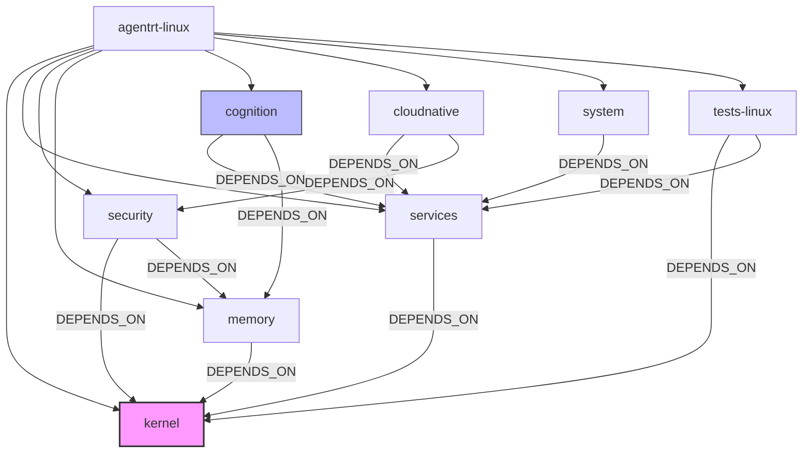
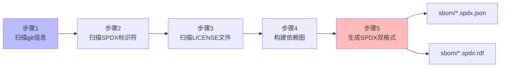
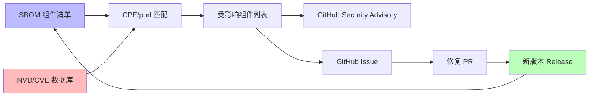

Copyright (c) 2025-2026 SPHARX Ltd. All Rights Reserved.

# agentrt-linux（AirymaxOS）SBOM 生成与分发方案

> **文档定位**：agentrt-linux（AirymaxOS，极境智能体操作系统）软件物料清单（Software Bill of Materials，SBOM）生成、校验、分发与消费的工程设计规范，覆盖 SPDX 2.3 格式规范、组件清单、生成工具链、CI 集成、随产物分发、漏洞关联与可重复构建验证\
> **版本**：0.2.8\
> **最后更新**：2026-07-15\
> **父文档**：`190-distribution/README.md`\
> **理论根基**：Linux 6.6 内核基线工程思想 + seL4 微内核设计思想 + Airymax 体系并行论 + NTIA Minimum Elements 标准\
> **SPDX-License-Identifier**：AGPL-3.0-or-later OR Apache-2.0\
> **SSoT 依赖声明**：本文档所引用的全部规则编号（`OS-IRON-*`、`OS-BAN-*`、`OS-STD-*`、`OS-ACC-*` 等）权威定义见 `50-engineering-standards/09-ssot-registry.md`，本文档不私自定义新规则编号。\
> **同源映射**：agentrt 构建基线（IRON-9 v2 [IND] 完全独立层，SBOM 工具链为 agentrt-linux 专属）\
> **IRON-9 v2 层次**：[IND] 完全独立层（SBOM 为 agentrt-linux 发行版专属）\
> **对标基线**：openEuler 24.03 LTS（SBOM 工程实践参照）+ NTIA Minimum Elements v1.0

---

## 1. 设计目标

### 1.1 设计背景

软件物料清单（SBOM）是现代软件供应链安全的核心机制，要求对软件构成要素进行机器可读、可验证、可追溯的完整记录。NTIA（美国国家标准与技术研究院下属技术管理局）于 2021 年发布 *Minimum Elements for a Software Bill of Materials (SBOM)* 标准，定义了 SBOM 的最小要素集合。openEuler 24.03 LTS 已建立 SBOM 工程实践，对标该标准为发行版提供组件溯源能力。

agentrt-linux（AirymaxOS）作为基于 Linux 6.6 完整 fork（Model A）构建的智能体操作系统，包含 8 个子仓（kernel / services / security / memory / cognition / cloudnative / system / tests-linux），通过 git submodule 管理，采用双许可证（AGPL-3.0-or-later + Apache-2.0）策略，并集成国密算法（SM2/SM3/SM4）。其复杂性要求建立一套完整、可机器校验、随产物分发的 SBOM 工程体系，作为漏洞响应、许可证合规、供应链审计的工程基石。

### 1.2 设计目标

本方案达成以下核心目标：

1. **符合 NTIA Minimum Elements 标准**：完整覆盖 NTIA 规定的 SBOM 最小要素（供应商名称、组件名称、版本字符串、唯一标识符、依赖关系、SBOM 作者、时间戳），并对每个要素提供机器可读字段
2. **SPDX 2.3 格式（兼容 SPDX 3.0）**：采用 SPDX 2.3 作为主格式（业界最广泛支持），同时输出兼容 SPDX 3.0 的 RDF 格式，确保格式标准化与工具链互操作性
3. **覆盖 8 子仓全部组件**：将 kernel / services / security / memory / cognition / cloudnative / system / tests-linux 8 个子仓的全部源文件、二进制产物、第三方依赖完整纳入 SBOM
4. **可机器校验（JSON + RDF）**：所有 SBOM 文件均输出 JSON 与 RDF 双格式，支持 `spdx-tools-python` 进行结构校验与 `jsonschema` 进行 schema 校验
5. **CI 自动生成，随发布产物分发**：SBOM 在每次 release tag 创建时由 CI 自动生成，签名后随 RPM 仓库元数据、OCI 镜像注解、SDK tarball 一并分发

### 1.3 NTIA Minimum Elements 映射

| NTIA 要素 | SPDX 2.3 字段 | agentrt-linux 实现 |
|-----------|---------------|---------------------|
| 供应商名称（Supplier Name） | `Package.originator` / `Package.supplier` | "SPHARX Ltd."（自有组件）/ 上游供应商（第三方依赖） |
| 组件名称（Component Name） | `Package.name` | 子仓/包名（如 `agentrt-linux-kernel`） |
| 版本字符串（Version String） | `Package.version` | 语义化版本 + git commit hash |
| 唯一标识符（Unique Identifier） | `Package.SPDXID` + `Package.externalRefs` | `SPDXRef-Package-kernel` + purl/cpe23 |
| 依赖关系（Dependency Relationship） | `Relationship.type=DEPENDS_ON` | 见 §2.3 组件关系 |
| SBOM 作者（SBOM Author） | `CreationInfo.creators` | "Tool: generate-sbom.py-v1.0.1" + "Organization: SPHARX Ltd." |
| 时间戳（Timestamp） | `CreationInfo.created` | `SOURCE_DATE_EPOCH` 派生（见 §8） |

### 1.4 适用范围

- 8 子仓的源码 SBOM（pre-build SBOM）
- RPM 包的构建产物 SBOM（post-build SBOM）
- ISO/QCOW2/OCI 镜像的镜像 SBOM（image SBOM）
- SDK tarball 的 SDK SBOM
- dnf 仓库的聚合 SBOM（aggregate SBOM）

### 1.5 不适用范围

- agentrt 用户态运行时（独立 SBOM 体系，由 `agentrt` 仓库自行生成）
- 第三方上游项目的内部 SBOM（仅记录外部依赖 SBOM 的引用，不重复生成）
- 源文件内容哈希的逐行哈希（性能开销过大，仅记录文件级 SHA-256）

---

## 2. SBOM 格式规范

### 2.1 SPDX 2.3 JSON 格式

agentrt-linux SBOM 主格式为 SPDX 2.3 JSON。SPDX 2.3 由 SPDX 规范组织于 2023 年发布，是当前业界最广泛支持的版本，被 Linux Foundation OpenChain、CycloneDX 工具链、openEuler SBOM 工具链共同支持。

#### 2.1.1 必填字段

SPDX 2.3 JSON 顶层结构包含以下必填字段：

| 字段 | 类型 | 说明 |
|------|------|------|
| `spdxVersion` | string | SPDX 版本，固定 `"SPDX-2.3"` |
| `dataLicense` | string | SPDX 文档许可证，固定 `"CC0-1.0"`（SBOM 文档本身不限制使用） |
| `SPDXID` | string | SPDX 文档唯一标识符，格式 `SPDXRef-DOCUMENT` |
| `name` | string | SBOM 文档名称（对应 `DocumentName`），如 `"agentrt-linux-1.0.1"` |
| `documentNamespace` | string | 文档命名空间，URI 格式，如 `https://airymaxos.com/spdx/agentrt-linux-1.0.1-{commit}` |
| `creationInfo` | object | 创建信息（对应 `CreatorInfo` + `Created`） |
| `creationInfo.creators` | array | 创建者列表，格式 `"Organization: SPHARX Ltd."` / `"Tool: generate-sbom.py-v1.0.1"` |
| `creationInfo.created` | string | 创建时间，ISO 8601 格式（基于 `SOURCE_DATE_EPOCH`） |
| `packages` | array | 包列表（对应 `PackageInfo`） |
| `files` | array | 文件列表（对应 `FileInfo`，大型 SBOM 中可选） |
| `relationships` | array | 关系列表（对应 `RelationshipInfo`） |

#### 2.1.2 agentrt-linux 扩展字段

为表达 agentrt-linux 特有的工程语义，本方案定义 3 个扩展字段，使用 `airymax:` 命名空间前缀，置于 `package.annotations` 中，遵循 SPDX 2.3 § 8.9 Annotation 机制：

| 扩展字段 | 类型 | 说明 | 示例值 |
|---------|------|------|--------|
| `airymax:submodule` | string | 标识组件所属的 git submodule | `"kernel"` / `"services"` |
| `airymax:homologousModule` | string | 标识同源 agentrt 用户态模块（IRON-9 v2 [SS] 语义同源层） | `"gateway_d"` / `"llm_d"` |
| `airymax:scLayer` | enum | 标识 IRON-9 v2 三层共享模型层次 | `"[SC]"` / `"[SS]"` / `"[IND]"` |

> **规则引用**：扩展字段命名遵循 SSoT 注册表 §13 其他 `OS-*` 工程规则扩展登记约定，新增扩展字段须先在 `50-engineering-standards/09-ssot-registry.md` 登记。

#### 2.1.3 SPDX 2.3 JSON 完整示例

```json
{
  "spdxVersion": "SPDX-2.3",
  "dataLicense": "CC0-1.0",
  "SPDXID": "SPDXRef-DOCUMENT",
  "name": "agentrt-linux-1.0.1",
  "documentNamespace": "https://airymaxos.com/spdx/agentrt-linux-1.0.1-7f3a2c9b8e",
  "creationInfo": {
    "creators": [
      "Organization: SPHARX Ltd.",
      "Tool: generate-sbom.py-v1.0.1"
    ],
    "created": "2026-07-15T08:00:00Z",
    "licenseListVersion": "3.23"
  },
  "packages": [
    {
      "SPDXID": "SPDXRef-Package-agentrt-linux",
      "name": "agentrt-linux",
      "versionInfo": "1.0.1",
      "supplier": "Organization: SPHARX Ltd.",
      "originator": "Organization: SPHARX Ltd.",
      "downloadLocation": "git+https://atomgit.com/openairymax/agentrt-linux.git@7f3a2c9b8e",
      "filesAnalyzed": true,
      "packageVerificationCode": {
        "packageVerificationCodeValue": "8a4f2e1c0d6b7a3f5e9c1d2b4a8f0e6c3d7b5a9f"
      },
      "licenseConcluded": "AGPL-3.0-or-later OR Apache-2.0",
      "licenseDeclared": "AGPL-3.0-or-later OR Apache-2.0",
      "copyrightText": "Copyright (c) 2025-2026 SPHARX Ltd. All Rights Reserved.",
      "externalRefs": [
        {
          "referenceType": "purl",
          "referenceLocator": "pkg:github/openairymax/agentrt-linux@1.0.1"
        },
        {
          "referenceType": "cpe23Type",
          "referenceLocator": "cpe:2.3:a:spharx:agentrt-linux:1.0.1:*:*:*:*:*:*:*"
        }
      ],
      "annotations": [
        {
          "annotationType": "OTHER",
          "annotator": "Tool: generate-sbom.py-v1.0.1",
          "annotationDate": "2026-07-15T08:00:00Z",
          "comment": "airymax:submodule=root"
        },
        {
          "annotationType": "OTHER",
          "annotator": "Tool: generate-sbom.py-v1.0.1",
          "annotationDate": "2026-07-15T08:00:00Z",
          "comment": "airymax:scLayer=[IND]"
        }
      ]
    },
    {
      "SPDXID": "SPDXRef-Package-kernel",
      "name": "agentrt-linux-kernel",
      "versionInfo": "1.0.1+linux6.6.1-airymax",
      "supplier": "Organization: SPHARX Ltd.",
      "originator": "Organization: SPHARX Ltd.",
      "downloadLocation": "git+https://atomgit.com/openairymax/agentrt-linux.git@7f3a2c9b8e#kernel",
      "filesAnalyzed": true,
      "packageVerificationCode": {
        "packageVerificationCodeValue": "2c9b5e7a3f1d8b4c6e0a2d5f7b9c1e3a"
      },
      "licenseConcluded": "GPL-2.0-only AND AGPL-3.0-or-later OR Apache-2.0",
      "licenseDeclared": "GPL-2.0-only",
      "copyrightText": "Copyright (c) 2025-2026 SPHARX Ltd. All Rights Reserved. Copyright (c) Linus Torvalds and others.",
      "externalRefs": [
        {
          "referenceType": "purl",
          "referenceLocator": "pkg:github/openairymax/agentrt-linux@1.0.1#kernel"
        }
      ],
      "annotations": [
        {
          "annotationType": "OTHER",
          "annotator": "Tool: generate-sbom.py-v1.0.1",
          "annotationDate": "2026-07-15T08:00:00Z",
          "comment": "airymax:submodule=kernel"
        },
        {
          "annotationType": "OTHER",
          "annotator": "Tool: generate-sbom.py-v1.0.1",
          "annotationDate": "2026-07-15T08:00:00Z",
          "comment": "airymax:scLayer=[SC]"
        }
      ]
    }
  ],
  "relationships": [
    {
      "spdxElementId": "SPDXRef-DOCUMENT",
      "relationshipType": "DESCRIBES",
      "relatedSpdxElement": "SPDXRef-Package-agentrt-linux"
    },
    {
      "spdxElementId": "SPDXRef-Package-agentrt-linux",
      "relationshipType": "CONTAINS",
      "relatedSpdxElement": "SPDXRef-Package-kernel"
    },
    {
      "spdxElementId": "SPDXRef-Package-cognition",
      "relationshipType": "DEPENDS_ON",
      "relatedSpdxElement": "SPDXRef-Package-memory"
    }
  ]
}
```

### 2.2 许可证标识

#### 2.2.1 许可证 SPDX 标识符

agentrt-linux 涉及的许可证 SPDX 标识符如下表：

| 许可证 | SPDX 标识符 | 适用范围 |
|--------|-----------|---------|
| AGPL-3.0 及以上版本 | `AGPL-3.0-or-later` | agentrt-linux 自有源码（默认许可证） |
| Apache-2.0 | `Apache-2.0` | agentrt-linux 自有源码（双许可证路径） |
| GPL-2.0 仅本版本 | `GPL-2.0-only` | Linux 6.6 上游内核源码 |
| CC0-1.0 | `CC0-1.0` | SBOM 文档本身（dataLicense） |
| MIT | `MIT` | liburing 等第三方库 |
| BSD-3-Clause | `BSD-3-Clause` | Rust crate 依赖 |
| MPL-2.0 | `MPL-2.0` | 部分 Rust crate 依赖 |
| ISC | `ISC` | 部分用户态工具 |

#### 2.2.2 双许可证声明

agentrt-linux 自有源码采用双许可证策略，允许接收方在两条许可证路径中任选其一：

```
AGPL-3.0-or-later OR Apache-2.0
```

此声明在 SPDX 中表达为 `licenseConcluded` 与 `licenseDeclared` 字段同时设置为 `"AGPL-3.0-or-later OR Apache-2.0"`，其中 SPDX License Expression 语法使用 `OR` 关键字（大写）表示许可证选择关系。

> **规则引用**：双许可证策略的合规边界由 SSoT 注册表中 `OS-BAN-*`（禁止规则）相关条目约束，详见 §4.3。

#### 2.2.3 Linux 6.6 上游许可证保留

Linux 6.6 内核源码树遵循 `GPL-2.0-only` 许可证。对 kernel 子仓中 fork 自上游的源文件，必须保留其原始 `GPL-2.0-only` 许可证声明，不得在文件级覆盖为 AGPL/Apache 双许可证。在 SBOM 中，此类文件的 `licenseDeclared` 字段为 `GPL-2.0-only`，而包级 `licenseConcluded` 表达双许可证组合：

```
licenseConcluded = "GPL-2.0-only AND (AGPL-3.0-or-later OR Apache-2.0)"
```

其中 `AND` 表示许可证同时满足（GPL-2.0 文件与双许可证文件共存于同一包），`OR` 表示双许可证路径选择。

### 2.3 组件关系

agentrt-linux SBOM 的 `relationships` 字段定义以下 4 类关系：

| 关系类型 | 方向 | 说明 | 示例 |
|---------|------|------|------|
| `DESCRIBES` | SBOM 文档 → 主体 | SBOM 文档描述的目标 | `SPDXRef-DOCUMENT DESCRIBES SPDXRef-Package-agentrt-linux` |
| `CONTAINS` | 父组件 → 子组件 | 父包包含子包 | `SPDXRef-Package-agentrt-linux CONTAINS SPDXRef-Package-kernel` |
| `DEPENDS_ON` | 依赖方 → 被依赖方 | 子仓间依赖关系 | `SPDXRef-Package-cognition DEPENDS_ON SPDXRef-Package-memory` |
| `GENERATED_FROM` | 生成代码 → 契约源 | 自动生成代码溯源至契约文件 | `SPDXRef-File-syscall-table.c GENERATED_FROM SPDXRef-File-syscall.xml` |

#### 2.3.1 8 子仓依赖关系图



#### 2.3.2 GENERATED_FROM 关系示例

agentrt-linux 中存在大量自动生成代码（syscall 表、ioctl 编号、错误码、capability 位），此类代码必须通过 `GENERATED_FROM` 关系溯源至其契约源文件：

| 生成代码 | 契约源 | 生成工具 |
|---------|--------|---------|
| `kernel/include/uapi/agentrt/syscall_table.h` | `50-engineering-standards/20-contracts/syscall.xml` | `tools/syscall-gen.py` |
| `kernel/include/uapi/agentrt/ioctl_numbers.h` | `20-contracts/ioctl.xml` | `tools/ioctl-gen.py` |
| `kernel/include/uapi/agentrt/error_codes.h` | `20-contracts/errors.xml` | `tools/error-gen.py` |
| `services/include/agentrt/capability_bits.h` | `20-contracts/capability.xml` | `tools/cap-gen.py` |

---

## 3. 组件清单

### 3.1 8 子仓组件

agentrt-linux 通过 git submodule 管理 8 个子仓。每个子仓作为 SPDX 包记录在 SBOM 的 `packages` 字段中，包含其 git commit hash、分支、源文件许可证扫描结果。

| 子仓 | SPDX 包名 | 主要构成 | 默认许可证 | IRON-9 v2 层次 |
|------|----------|---------|-----------|----------------|
| kernel | `agentrt-linux-kernel` | Linux 6.6 fork + Airymax 修改 + corekern/ + [SC] 头文件 | `GPL-2.0-only`（上游）+ `AGPL-3.0-or-later OR Apache-2.0`（修改） | [SC] + [IND] |
| services | `agentrt-linux-services` | 12 daemons + VFS 用户态化 + network 用户态化 | `AGPL-3.0-or-later OR Apache-2.0` | [SS] + [IND] |
| security | `agentrt-linux-security` | Cupolas LSM + capability + Landlock + 国密（SM2/SM3/SM4） | `AGPL-3.0-or-later OR Apache-2.0` | [SS] + [IND] |
| memory | `agentrt-linux-memory` | MemoryRovol + CXL + PMEM + MGLRU | `AGPL-3.0-or-later OR Apache-2.0` | [SS] + [IND] |
| cognition | `agentrt-linux-cognition` | CoreLoopThree + Wasm 3.0 + LLM 调度 | `AGPL-3.0-or-later OR Apache-2.0` | [SS] + [IND] |
| cloudnative | `agentrt-linux-cloudnative` | K8s CRD + containerd shim + OCI + CNI | `AGPL-3.0-or-later OR Apache-2.0` | [IND] |
| system | `agentrt-linux-system` | RPM + dnf + configuration + DevStation | `AGPL-3.0-or-later OR Apache-2.0` | [IND] |
| tests-linux | `agentrt-linux-tests` | KUnit + kselftest + 形式化验证 | `AGPL-3.0-or-later OR Apache-2.0` | [IND] |

#### 3.1.1 kernel 子仓详细清单

kernel 子仓是 agentrt-linux 的内核基线，包含以下 4 类组件：

| 组件类别 | 路径 | 许可证 | 说明 |
|---------|------|--------|------|
| Linux 6.6 上游源码 | `kernel/linux-6.6/` | `GPL-2.0-only` | 完整 fork（Model A）保留上游许可证 |
| Airymax 修改源码 | `kernel/airymax/` | `AGPL-3.0-or-later OR Apache-2.0` | agentrt-linux 专属修改 |
| corekern 子组件 | `kernel/corekern/` | `AGPL-3.0-or-later OR Apache-2.0` | 微核心架构组件 |
| [SC] 共享头文件 | `kernel/include/uapi/agentrt/` | `AGPL-3.0-or-later OR Apache-2.0` | IRON-9 v2 [SC] 共享契约层 |

#### 3.1.2 services 子仓详细清单

services 子仓包含 12 个 daemon 与 2 个用户态化子系统：

| 组件 | SPDX 子包名 | 功能 | 依赖 |
|------|------------|------|------|
| gateway_d | `agentrt-linux-services-gateway` | IPC 网关守护进程 | kernel |
| llm_d | `agentrt-linux-services-llm` | LLM 调度守护进程 | kernel, cognition |
| tool_d | `agentrt-linux-services-tool` | 工具调用守护进程 | kernel |
| sched_d | `agentrt-linux-services-sched` | 调度守护进程 | kernel |
| monit_d | `agentrt-linux-services-monit` | 监控守护进程 | kernel |
| net_d | `agentrt-linux-services-net` | 网络用户态化 | kernel |
| vfs_d | `agentrt-linux-services-vfs` | VFS 用户态化 | kernel |
| 其余 5 个 daemon | `agentrt-linux-services-*` | 各类系统服务 | kernel |
| VFS 用户态化 | `agentrt-linux-services-vfs` | 虚拟文件系统用户态化 | kernel |
| network 用户态化 | `agentrt-linux-services-net` | 网络栈用户态化 | kernel |

### 3.2 第三方依赖

agentrt-linux 依赖以下第三方组件，每个组件作为独立 SPDX 包记录，并通过 `DEPENDS_ON` 关系关联至依赖它的子仓：

| 第三方依赖 | SPDX 标识符 | 来源 | 许可证 | 关联子仓 |
|-----------|-------------|------|--------|---------|
| Linux 6.6 内核源码树 | `SPDXRef-Package-linux-upstream` | kernel.org | `GPL-2.0-only` | kernel（~60K 文件） |
| seL4 验证工具链 | `SPDXRef-Package-sel4-toolchain` | seL4 项目 | `BSD-2-Clause` | tests-linux（Isabelle/HOL） |
| Rust 工具链 | `SPDXRef-Package-rustc` | rust-lang.org | `Apache-2.0 OR MIT` | services, cloudnative |
| Rust 包管理器 | `SPDXRef-Package-cargo` | rust-lang.org | `Apache-2.0 OR MIT` | services, cloudnative |
| Python 运行时 | `SPDXRef-Package-python` | python.org | `Python-2.0` | system, cognition, tests-linux |
| Go 工具链 | `SPDXRef-Package-go` | go.dev | `BSD-3-Clause` | cloudnative, system |
| io_uring 库 | `SPDXRef-Package-liburing` | axboe/liburing | `MIT` | services, memory |
| systemd init 系统 | `SPDXRef-Package-systemd` | systemd.io | `LGPL-2.1-or-later` | system |

#### 3.2.1 第三方依赖 SBOM 引用

对于已有 SBOM 的第三方组件（如 Rust crate、Python wheel），采用 SPDX 3.0 ExternalDocumentRef 机制引用其上游 SBOM，不重复生成内容：

```json
{
  "externalDocumentRefs": [
    {
      "externalDocumentId": "DocumentRef-rustc-1.78.0",
      "checksum": {
        "algorithm": "SHA256",
        "checksumValue": "5c5e8e4ed4a3b7c1f9d2e8a0b6c4d2e9f1a3b5c7d8e0f2a4b6c8d0e2f4a6b8c"
      },
      "externalDocumentUri": "https://static.rust-lang.org/sbom/rustc-1.78.0.spdx.json"
    }
  ]
}
```

#### 3.2.2 国密算法库清单

agentrt-linux 集成国密算法（SM2/SM3/SM4），其实现来源必须在 SBOM 中显式记录：

| 算法 | 实现来源 | 路径 | 许可证 | 说明 |
|------|---------|------|--------|------|
| SM2 | GmSSL | `security/gmssl/` | `Apache-2.0` | 椭圆曲线公钥密码 |
| SM3 | GmSSL | `security/gmssl/` | `Apache-2.0` | 密码杂凑算法 |
| SM4 | GmSSL | `security/gmssl/` | `Apache-2.0` | 分组密码算法 |
| 国密 TLS | GmSSL | `security/gmssl-tls/` | `Apache-2.0` | 国密 TLS 协议栈 |

---

## 4. 生成工具链

### 4.1 SPDX Generator

agentrt-linux SBOM 生成工具为 `tools/sbom/generate-sbom.py`，是一个 Python 脚本，负责扫描源码树、收集许可证信息、构建依赖关系图、输出 SPDX 2.3 JSON 与 RDF 双格式。

| 属性 | 值 |
|------|----|
| 工具路径 | `tools/sbom/generate-sbom.py` |
| 工具版本 | 1.0.1 |
| 输入 | git submodule 状态、LICENSE 文件、SPDX 标识符扫描 |
| 输出 | `sbom/agentrt-linux-1.0.1.spdx.json` + `sbom/agentrt-linux-1.0.1.spdx.rdf` |
| 依赖 | `spdx-tools-python`（>=0.8.0）、`jsonschema`（>=4.18）、`networkx`（>=3.1） |
| 配置文件 | `tools/sbom/sbom-config.yaml` |
| 锁定文件 | `tools/sbom/requirements.lock.txt` |

#### 4.1.1 配置文件示例（sbom-config.yaml）

```yaml
# tools/sbom/sbom-config.yaml
# agentrt-linux SBOM 生成配置文件

project:
  name: agentrt-linux
  version: 1.0.1
  supplier: "SPHARX Ltd."
  download_base: "https://atomgit.com/openairymax/agentrt-linux"
  namespace_base: "https://airymaxos.com/spdx"

submodules:
  - name: kernel
    path: agentrt-linux/kernel
    spdx_id: SPDXRef-Package-kernel
    declared_license: "GPL-2.0-only AND (AGPL-3.0-or-later OR Apache-2.0)"
    sc_layer: "[SC]"
    homologous: null
  - name: services
    path: agentrt-linux/services
    spdx_id: SPDXRef-Package-services
    declared_license: "AGPL-3.0-or-later OR Apache-2.0"
    sc_layer: "[SS]"
    homologous: "gateway_d"
  - name: security
    path: agentrt-linux/security
    spdx_id: SPDXRef-Package-security
    declared_license: "AGPL-3.0-or-later OR Apache-2.0"
    sc_layer: "[SS]"
    homologous: "cupolas_lsm"
  - name: memory
    path: agentrt-linux/memory
    spdx_id: SPDXRef-Package-memory
    declared_license: "AGPL-3.0-or-later OR Apache-2.0"
    sc_layer: "[SS]"
    homologous: "memoryrovol"
  - name: cognition
    path: agentrt-linux/cognition
    spdx_id: SPDXRef-Package-cognition
    declared_license: "AGPL-3.0-or-later OR Apache-2.0"
    sc_layer: "[SS]"
    homologous: "coreloop"
  - name: cloudnative
    path: agentrt-linux/cloudnative
    spdx_id: SPDXRef-Package-cloudnative
    declared_license: "AGPL-3.0-or-later OR Apache-2.0"
    sc_layer: "[IND]"
    homologous: null
  - name: system
    path: agentrt-linux/system
    spdx_id: SPDXRef-Package-system
    declared_license: "AGPL-3.0-or-later OR Apache-2.0"
    sc_layer: "[IND]"
    homologous: null
  - name: tests-linux
    path: agentrt-linux/tests-linux
    spdx_id: SPDXRef-Package-tests
    declared_license: "AGPL-3.0-or-later OR Apache-2.0"
    sc_layer: "[IND]"
    homologous: null

dependencies:
  - from: services
    to: kernel
  - from: security
    to: kernel
  - from: security
    to: memory
  - from: memory
    to: kernel
  - from: cognition
    to: services
  - from: cognition
    to: memory
  - from: cloudnative
    to: services
  - from: cloudnative
    to: security
  - from: system
    to: services
  - from: tests-linux
    to: kernel
  - from: tests-linux
    to: services

generated_from:
  - source: "50-engineering-standards/20-contracts/syscall.xml"
    target: "kernel/include/uapi/agentrt/syscall_table.h"
    tool: "tools/syscall-gen.py"
  - source: "20-contracts/ioctl.xml"
    target: "kernel/include/uapi/agentrt/ioctl_numbers.h"
    tool: "tools/ioctl-gen.py"
  - source: "20-contracts/errors.xml"
    target: "kernel/include/uapi/agentrt/error_codes.h"
    tool: "tools/error-gen.py"
  - source: "20-contracts/capability.xml"
    target: "services/include/agentrt/capability_bits.h"
    tool: "tools/cap-gen.py"

forbidden_licenses:
  - "GPL-3.0-only"
  - "GPL-3.0-or-later"
  - "GPL-3.0+"

reproducible:
  source_date_epoch_from: git
  timezone: UTC
  locale: C
```

### 4.2 扫描流程

SBOM 生成过程分为 5 个步骤，按顺序执行：



#### 4.2.1 步骤 1：扫描 8 子仓 git 信息

对每个 git submodule，收集其 commit hash、分支、作者、提交时间：

```python
# 步骤 1：扫描 8 子仓 git 信息
import subprocess
import json
from pathlib import Path

def scan_submodule_git_info(submodule_path: str) -> dict:
    """扫描单个 submodule 的 git 元信息。

    Args:
        submodule_path: submodule 在工作区的路径

    Returns:
        包含 commit hash、branch、author、commit_time 的字典
    """
    result = {
        "commit": "",
        "branch": "",
        "author": "",
        "commit_time": 0,
        "commit_time_iso": "",
    }

    # 获取 commit hash
    commit = subprocess.run(
        ["git", "-C", submodule_path, "rev-parse", "HEAD"],
        capture_output=True, text=True, check=True,
    ).stdout.strip()
    result["commit"] = commit

    # 获取分支
    branch = subprocess.run(
        ["git", "-C", submodule_path, "rev-parse", "--abbrev-ref", "HEAD"],
        capture_output=True, text=True, check=True,
    ).stdout.strip()
    result["branch"] = branch

    # 获取最后一次提交作者
    author = subprocess.run(
        ["git", "-C", submodule_path, "log", "-1", "--pretty=%an <%ae>"],
        capture_output=True, text=True, check=True,
    ).stdout.strip()
    result["author"] = author

    # 获取最后一次提交时间（Unix 纪元秒数）
    commit_time = int(subprocess.run(
        ["git", "-C", submodule_path, "log", "-1", "--pretty=%ct"],
        capture_output=True, text=True, check=True,
    ).stdout.strip())
    result["commit_time"] = commit_time
    result["commit_time_iso"] = subprocess.run(
        ["git", "-C", submodule_path, "log", "-1", "--pretty=%cI"],
        capture_output=True, text=True, check=True,
    ).stdout.strip()

    return result


def scan_all_submodules(config: dict) -> list:
    """扫描配置中全部 submodule 的 git 信息。

    Args:
        config: sbom-config.yaml 解析后的配置字典

    Returns:
        submodule 信息列表，每项含 SPDX 包信息
    """
    packages = []
    for sub in config["submodules"]:
        git_info = scan_submodule_git_info(sub["path"])
        packages.append({
            "spdx_id": sub["spdx_id"],
            "name": f"agentrt-linux-{sub['name']}",
            "version_info": f"{config['project']['version']}+{git_info['commit'][:8]}",
            "supplier": f"Organization: {config['project']['supplier']}",
            "downloadLocation": (
                f"git+{config['project']['download_base']}.git"
                f"@{git_info['commit']}#{sub['name']}"
            ),
            "git_info": git_info,
            "declared_license": sub["declared_license"],
            "sc_layer": sub["sc_layer"],
            "homologous": sub["homologous"],
        })
    return packages
```

#### 4.2.2 步骤 2：扫描 SPDX-License-Identifier 头

扫描所有源文件中的 `SPDX-License-Identifier` 头，确定文件级许可证。此扫描覆盖 `.c` / `.h` / `.rs` / `.py` / `.go` / `.sh` / `.yaml` / `.toml` 等扩展名：

```python
# 步骤 2：扫描 SPDX-License-Identifier 头
import re
from pathlib import Path

# SPDX-License-Identifier 头匹配正则
SPDX_HEADER_RE = re.compile(
    r"SPDX-License-Identifier:\s*(.+?)[\r\n]",
    re.MULTILINE,
)

# 支持扫描的文件扩展名
SCAN_EXTENSIONS = {
    ".c", ".h", ".rs", ".py", ".go", ".sh",
    ".yaml", ".yml", ".toml", ".json", ".md",
    ".cpp", ".hpp", ".cc", ".c++", ".h++",
    ".S", ".s", ".asm",
}


def scan_file_spdx_headers(submodule_path: str) -> list:
    """扫描 submodule 内所有源文件的 SPDX-License-Identifier 头。

    Args:
        submodule_path: submodule 路径

    Returns:
        文件级许可证扫描结果列表，每项含 file_path、license
    """
    files_info = []
    base = Path(submodule_path)

    for file_path in base.rglob("*"):
        if not file_path.is_file():
            continue
        if file_path.suffix not in SCAN_EXTENSIONS:
            continue
        # 跳过 .git/、build/、node_modules/ 等目录
        if any(part in {".git", "build", "node_modules", "__pycache__"}
               for part in file_path.parts):
            continue

        try:
            content = file_path.read_text(encoding="utf-8", errors="ignore")
        except OSError:
            continue

        match = SPDX_HEADER_RE.search(content)
        license_expr = match.group(1).strip() if match else "NOASSERTION"

        files_info.append({
            "path": str(file_path.relative_to(base)),
            "license": license_expr,
            "has_spdx_header": match is not None,
        })

    return files_info
```

#### 4.2.3 步骤 3：扫描 LICENSE 文件确定包级许可证

扫描每个 submodule 根目录及子目录下的 `LICENSE` / `LICENSE.*` / `COPYING` 文件，结合 `sbom-config.yaml` 中声明的许可证，确定包级 `licenseDeclared` 字段：

```python
# 步骤 3：扫描 LICENSE 文件
import hashlib
from pathlib import Path


def scan_license_files(submodule_path: str, declared_license: str) -> dict:
    """扫描 submodule 内的 LICENSE 文件，确定包级许可证。

    Args:
        submodule_path: submodule 路径
        declared_license: 配置中声明的许可证表达式

    Returns:
        含 licenseDeclared、licenseConcluded、copyrightText 的字典
    """
    license_info = {
        "licenseDeclared": declared_license,
        "licenseConcluded": declared_license,
        "copyrightText": "NOASSERTION",
        "license_files": [],
    }

    # 扫描 LICENSE / COPYING 文件
    base = Path(submodule_path)
    for pattern in ["LICENSE", "LICENSE.*", "COPYING", "COPYING.*", "NOTICE"]:
        for license_file in base.glob(pattern):
            content = license_file.read_text(encoding="utf-8", errors="ignore")
            sha256 = hashlib.sha256(content.encode("utf-8")).hexdigest()
            license_info["license_files"].append({
                "path": str(license_file.relative_to(base)),
                "sha256": sha256,
            })
            # 提取 copyright 文本（前 500 字符作为摘要）
            if "copyright" in content.lower():
                license_info["copyrightText"] = content[:500]

    return license_info
```

#### 4.2.4 步骤 4：构建依赖关系图

基于 `sbom-config.yaml` 的 `dependencies` 配置与扫描结果，构建 SPDX `relationships` 列表：

```python
# 步骤 4：构建依赖关系图
import networkx as nx


def build_relationships(config: dict, packages: list) -> list:
    """构建 SPDX relationships 列表。

    Args:
        config: sbom-config.yaml 配置字典
        packages: 步骤 1~3 收集的包信息列表

    Returns:
        SPDX relationships 列表
    """
    relationships = []
    spdx_id_map = {p["name"].split("-")[-1]: p["spdx_id"] for p in packages}
    # 顶层 agentrt-linux 包的 SPDXID
    root_spdx_id = "SPDXRef-Package-agentrt-linux"

    # DESCRIBES 关系：SBOM 文档描述 agentrt-linux
    relationships.append({
        "spdxElementId": "SPDXRef-DOCUMENT",
        "relationshipType": "DESCRIBES",
        "relatedSpdxElement": root_spdx_id,
    })

    # CONTAINS 关系：agentrt-linux 包含 8 个子仓
    for sub in config["submodules"]:
        relationships.append({
            "spdxElementId": root_spdx_id,
            "relationshipType": "CONTAINS",
            "relatedSpdxElement": sub["spdx_id"],
        })

    # DEPENDS_ON 关系：子仓间依赖
    for dep in config["dependencies"]:
        from_id = f"SPDXRef-Package-{dep['from']}"
        to_id = f"SPDXRef-Package-{dep['to']}"
        relationships.append({
            "spdxElementId": from_id,
            "relationshipType": "DEPENDS_ON",
            "relatedSpdxElement": to_id,
        })

    # GENERATED_FROM 关系：生成代码溯源至契约源
    for gen in config.get("generated_from", []):
        relationships.append({
            "spdxElementId": f"SPDXRef-File-{Path(gen['target']).stem}",
            "relationshipType": "GENERATED_FROM",
            "relatedSpdxElement": f"SPDXRef-File-{Path(gen['source']).stem}",
        })

    # 验证依赖图无环（DAG）
    graph = nx.DiGraph()
    for dep in config["dependencies"]:
        graph.add_edge(dep["from"], dep["to"])
    if not nx.is_directed_acyclic_graph(graph):
        raise ValueError("依赖关系图存在环，违反 OS-ARCH 拓扑约束")

    return relationships
```

#### 4.2.5 步骤 5：生成 SPDX JSON + RDF 双格式

使用 `spdx-tools-python` 将内存中的 SPDX 文档对象序列化为 JSON 与 RDF 双格式：

```python
# 步骤 5：生成 SPDX JSON + RDF 双格式
import json
import datetime
from spdx_tools.spdx.model import (
    Document, CreationInfo, Package, Relationship, RelationshipType,
)
from spdx_tools.spdx.writer.json import write as write_json
from spdx_tools.spdx.writer.rdf import write as write_rdf


def generate_sbom(
    config: dict,
    packages: list,
    relationships: list,
    output_dir: str,
) -> tuple:
    """生成 SPDX 2.3 JSON + RDF 双格式 SBOM 文件。

    Args:
        config: sbom-config.yaml 配置字典
        packages: 包信息列表
        relationships: 关系列表
        output_dir: 输出目录

    Returns:
        (json_path, rdf_path) 元组
    """
    # 构建 SPDX CreationInfo
    # 时间戳使用 SOURCE_DATE_EPOCH（保证可重复构建，见 §8）
    source_date_epoch = config.get("reproducible", {}).get("source_date_epoch", 0)
    created = datetime.datetime.fromtimestamp(
        source_date_epoch, tz=datetime.timezone.utc,
    ).strftime("%Y-%m-%dT%H:%M:%SZ")

    creation_info = CreationInfo(
        spdx_version="SPDX-2.3",
        spdx_id="SPDXRef-DOCUMENT",
        name=f"agentrt-linux-{config['project']['version']}",
        document_namespace=(
            f"{config['project']['namespace_base']}/"
            f"agentrt-linux-{config['project']['version']}-"
            f"{packages[0]['git_info']['commit'][:10]}"
        ),
        creators=[
            f"Organization: {config['project']['supplier']}",
            "Tool: generate-sbom.py-v1.0.1",
        ],
        created=created,
        license_list_version="3.23",
    )

    # 构建 SPDX Package 列表
    spdx_packages = [
        Package(
            spdx_id=pkg["spdx_id"],
            name=pkg["name"],
            version_info=pkg["version_info"],
            supplier=pkg["supplier"],
            download_location=pkg["downloadLocation"],
            license_declared=pkg["declared_license"],
            license_concluded=pkg["declared_license"],
            copyright_text="Copyright (c) 2025-2026 SPHARX Ltd.",
        )
        for pkg in packages
    ]

    # 构建 SPDX Relationship 列表
    type_map = {
        "DESCRIBES": RelationshipType.DESCRIBES,
        "CONTAINS": RelationshipType.CONTAINS,
        "DEPENDS_ON": RelationshipType.DEPENDS_ON,
        "GENERATED_FROM": RelationshipType.GENERATED_FROM,
    }
    spdx_relationships = [
        Relationship(
            spdx_element_id=rel["spdxElementId"],
            relationship_type=type_map[rel["relationshipType"]],
            related_spdx_element_id=rel["relatedSpdxElement"],
        )
        for rel in relationships
    ]

    # 组装 SPDX Document
    document = Document(
        creation_info=creation_info,
        packages=spdx_packages,
        relationships=spdx_relationships,
    )

    # 写出 JSON 格式
    json_path = (
        f"{output_dir}/agentrt-linux-"
        f"{config['project']['version']}.spdx.json"
    )
    write_json(document, json_path)

    # 写出 RDF 格式
    rdf_path = (
        f"{output_dir}/agentrt-linux-"
        f"{config['project']['version']}.spdx.rdf"
    )
    write_rdf(document, rdf_path)

    return json_path, rdf_path
```

### 4.3 许可证合规检查

#### 4.3.1 禁止许可证

agentrt-linux 双许可证策略中，Apache-2.0 路径要求所有链接进发行版的组件必须与 Apache-2.0 兼容。以下许可证因与 Apache-2.0 不兼容或与双许可证策略冲突而被禁止：

| 禁止许可证 | 原因 | SPDX 表达 |
|-----------|------|----------|
| `GPL-3.0-only` | 与 AGPL-3.0+Apache-2.0 双许可证策略中的 Apache-2.0 路径不兼容 | `GPL-3.0-only` |
| `GPL-3.0-or-later` | 同上 | `GPL-3.0-or-later` |
| `GPL-3.0+`（旧式） | 同上 | `GPL-3.0+` |
| `AGPL-3.0-only` | 与 AGPL-3.0-or-later 路径冲突（缺少 -or-later 传播性） | `AGPL-3.0-only` |

> **说明**：GPL-2.0 与 AGPL-3.0 路径兼容，因此 Linux 6.6 上游 `GPL-2.0-only` 文件允许纳入 agentrt-linux 发行版。

#### 4.3.2 兼容性矩阵

许可证兼容性矩阵如下，CI 门禁基于此矩阵进行合规判定：

| 上游许可证 | AGPL-3.0-or-later 路径 | Apache-2.0 路径 | 决策 |
|-----------|----------------------|------------------|------|
| `GPL-2.0-only` | 兼容 | 兼容 | 允许（Linux 6.6 上游） |
| `GPL-2.0-or-later` | 兼容 | 兼容 | 允许 |
| `LGPL-2.1-or-later` | 兼容 | 兼容 | 允许（systemd） |
| `MIT` | 兼容 | 兼容 | 允许（liburing） |
| `BSD-3-Clause` | 兼容 | 兼容 | 允许（Rust crate） |
| `Apache-2.0` | 兼容 | 兼容 | 允许（Rust 工具链） |
| `MPL-2.0` | 兼容 | 兼容 | 允许（文件级 copyleft） |
| `Python-2.0` | 兼容 | 兼容 | 允许（Python 运行时） |
| `ISC` | 兼容 | 兼容 | 允许 |
| `GPL-3.0-only` | 兼容 | **不兼容** | **禁止** |
| `GPL-3.0-or-later` | 兼容 | **不兼容** | **禁止** |
| `AGPL-3.0-only` | **不兼容** | 兼容 | **禁止** |

#### 4.3.3 CI 门禁实现

许可证合规检查在 SBOM 生成后强制执行，任何禁止许可证的存在导致构建失败：

```python
# 许可证合规检查
import sys
from pathlib import Path

# 禁止许可证集合
FORBIDDEN_LICENSES = {
    "GPL-3.0-only",
    "GPL-3.0-or-later",
    "GPL-3.0+",
    "AGPL-3.0-only",
}


def check_license_compliance(sbom_json_path: str) -> int:
    """检查 SBOM 中是否存在禁止许可证。

    Args:
        sbom_json_path: SPDX JSON 文件路径

    Returns:
        0 表示合规，1 表示存在禁止许可证（CI 失败）
    """
    with open(sbom_json_path, "r", encoding="utf-8") as f:
        sbom = json.load(f)

    violations = []
    for pkg in sbom.get("packages", []):
        declared = pkg.get("licenseDeclared", "NOASSERTION")
        if declared == "NOASSERTION":
            continue
        # 拆分 License Expression
        for token in declared.replace("(", " ").replace(")", " ").split():
            if token in FORBIDDEN_LICENSES:
                violations.append({
                    "package": pkg["name"],
                    "license": token,
                    "spdx_id": pkg["SPDXID"],
                })

    # 文件级扫描（files 字段存在时）
    for file_info in sbom.get("files", []):
        file_license = file_info.get("licenseInfoInFile", [])
        for lic in file_license:
            if lic in FORBIDDEN_LICENSES:
                violations.append({
                    "file": file_info.get("fileName"),
                    "license": lic,
                })

    if violations:
        print("[SBOM] 许可证合规检查失败：")
        for v in violations:
            location = v.get("package") or v.get("file")
            print(f"  - {location}: 禁止许可证 {v['license']}")
        return 1

    print("[SBOM] 许可证合规检查通过")
    return 0


if __name__ == "__main__":
    sys.exit(check_license_compliance(sys.argv[1]))
```

---

## 5. CI 集成

### 5.1 生成时机

SBOM 在以下时机自动生成：

| 触发事件 | 工作流 | 产物 |
|---------|--------|------|
| Release tag 创建（`v*.*.*`） | `sbom-generate.yml` | 正式版 SBOM（签名） |
| Nightly 构建（每日 02:00 UTC） | `sbom-nightly.yml` | nightly SBOM（未签名） |
| PR 合并至 main | `sbom-pr-check.yml` | PR SBOM（仅校验，不发布） |

### 5.2 GitHub Actions 工作流

工作流文件位于 `.github/workflows/sbom-generate.yml`：

```yaml
# .github/workflows/sbom-generate.yml
name: SBOM Generation

on:
  push:
    tags:
      - "v*.*.*"
  workflow_dispatch:

permissions:
  contents: write
  packages: write
  id-token: write  # cosign keyless 签名

env:
  PYTHON_VERSION: "3.11"
  PROJECT_VERSION: "1.0.1"

jobs:
  generate-sbom:
    name: Generate SPDX SBOM
    runs-on: ubuntu-24.04
    container:
      image: ghcr.io/spharx/airymaxos-build-env:1.0.1@sha256:5c5e8e4ed4a3b7c1f9d2e8a0b6c4d2e9f1a3b5c7d8e0f2a4b6c8d0e2f4a6b8c
      env:
        SOURCE_DATE_EPOCH: ${{ vars.SOURCE_DATE_EPOCH }}
        TZ: UTC
        LC_ALL: C
    steps:
      - name: Checkout agentrt-linux（含全部 submodule）
        uses: actions/checkout@v4
        with:
          submodules: recursive
          fetch-depth: 0

      - name: Setup Python
        uses: actions/setup-python@v5
        with:
          python-version: ${{ env.PYTHON_VERSION }}

      - name: Install spdx-tools-python
        run: |
          pip install -r tools/sbom/requirements.lock.txt

      - name: Generate SPDX SBOM
        run: |
          python tools/sbom/generate-sbom.py \
            --config tools/sbom/sbom-config.yaml \
            --output sbom/ \
            --version ${{ env.PROJECT_VERSION }}

      - name: Validate SPDX
        run: |
          python -m spdx_tools.spdx.validator \
            sbom/agentrt-linux-${{ env.PROJECT_VERSION }}.spdx.json
          python -m spdx_tools.spdx.validator \
            sbom/agentrt-linux-${{ env.PROJECT_VERSION }}.spdx.rdf

      - name: License compliance check
        run: |
          python tools/sbom/check-license.py \
            sbom/agentrt-linux-${{ env.PROJECT_VERSION }}.spdx.json

      - name: Compute SHA-256
        run: |
          sha256sum sbom/agentrt-linux-${{ env.PROJECT_VERSION }}.spdx.json \
            > sbom/agentrt-linux-${{ env.PROJECT_VERSION }}.spdx.json.sha256
          sha256sum sbom/agentrt-linux-${{ env.PROJECT_VERSION }}.spdx.rdf \
            > sbom/agentrt-linux-${{ env.PROJECT_VERSION }}.spdx.rdf.sha256

      - name: Sign SBOM with cosign
        uses: sigstore/cosign-installer@v3
      - run: |
          cosign sign-blob \
            --yes \
            --output-signature sbom/agentrt-linux-${{ env.PROJECT_VERSION }}.spdx.json.sig \
            --output-certificate sbom/agentrt-linux-${{ env.PROJECT_VERSION }}.spdx.json.crt \
            sbom/agentrt-linux-${{ env.PROJECT_VERSION }}.spdx.json

      - name: Upload to GitHub Release
        uses: softprops/action-gh-release@v2
        with:
          files: |
            sbom/agentrt-linux-${{ env.PROJECT_VERSION }}.spdx.json
            sbom/agentrt-linux-${{ env.PROJECT_VERSION }}.spdx.rdf
            sbom/*.sha256
            sbom/*.sig
            sbom/*.crt

      - name: Publish to dnf repo metadata
        run: |
          tools/sbom/publish-to-repo.sh \
            --sbom sbom/agentrt-linux-${{ env.PROJECT_VERSION }}.spdx.json \
            --repo airymaxos-stable
```

### 5.3 产物清单

每次 SBOM 生成产出以下 7 个文件，全部上传至 GitHub Release 与 dnf 仓库 metadata：

| 文件 | 大小预估 | 说明 |
|------|---------|------|
| `agentrt-linux-1.0.1.spdx.json` | ~2-5 MB | SPDX 2.3 JSON 主格式 |
| `agentrt-linux-1.0.1.spdx.rdf` | ~3-8 MB | SPDX 3.0 RDF 兼容格式 |
| `*.spdx.json.sha256` | 64 字节 + 文件名 | JSON SHA-256 |
| `*.spdx.rdf.sha256` | 64 字节 + 文件名 | RDF SHA-256 |
| `*.spdx.json.sig` | ~96 字节 | cosign 签名（keyless） |
| `*.spdx.json.crt` | ~1 KB | cosign 签名证书 |
| `sbom-manifest.txt` | ~1 KB | 产物清单（文件名 + SHA-256） |

---

## 6. 分发与消费

### 6.1 随发布产物分发

SBOM 文件随以下 3 类发布产物分发，确保消费者可在任意位置获取对应版本的 SBOM：

#### 6.1.1 RPM 包内嵌 SBOM

每个 RPM 包在构建时通过 `%install` 阶段将 SBOM 复制至 `/usr/share/doc/agentrt-linux/sbom/`，并通过 `%files` 声明：

```spec
# agentrt-linux.spec 片段
%install
# 复制 SBOM 至包文档目录
install -d %{buildroot}%{_defaultdocdir}/agentrt-linux/sbom
install -m 0644 %{_sourcedir}/sbom/agentrt-linux-%{version}.spdx.json \
    %{buildroot}%{_defaultdocdir}/agentrt-linux/sbom/
install -m 0644 %{_sourcedir}/sbom/agentrt-linux-%{version}.spdx.rdf \
    %{buildroot}%{_defaultdocdir}/agentrt-linux/sbom/

%files
%{_defaultdocdir}/agentrt-linux/sbom/agentrt-linux-%{version}.spdx.json
%{_defaultdocdir}/agentrt-linux/sbom/agentrt-linux-%{version}.spdx.rdf
```

消费者查询方式：

```bash
# 查看 RPM 内嵌 SBOM
dnf install agentrt-linux-kernel-1.0.1
cat /usr/share/doc/agentrt-linux/sbom/agentrt-linux-1.0.1.spdx.json | jq '.packages[] | .name'

# 通过 rpm 命令查询
rpm -ql agentrt-linux-kernel | grep sbom
rpm -q --requires agentrt-linux-cognition | grep memory
```

#### 6.1.2 OCI 镜像 SBOM 注解

OCI 镜像通过注解（annotation）声明 SBOM 位置，遵循 `org.opencontainers.image.sbom.*` 注解规范：

```json
{
  "schemaVersion": 2,
  "mediaType": "application/vnd.oci.image.manifest.v1+json",
  "annotations": {
    "org.opencontainers.image.sbom": "https://airymaxos.com/api/sbom/1.0.1",
    "org.opencontainers.image.sbom.format": "spdx-2.3-json",
    "org.opencontainers.image.sbom.digest": "sha256:5c5e8e4ed4a3b7c1f9d2e8a0b6c4d2e9f1a3b5c7d8e0f2a4b6c8d0e2f4a6b8c",
    "org.opencontainers.image.sbom.signature": "cosign:sha256:9f1a3b5c7d8e0f2a4b6c8d0e2f4a6b8c5c5e8e4ed4a3b7c1f9d2e8a0b6c4d2e"
  },
  "layers": [...]
}
```

查询 OCI 镜像 SBOM：

```bash
# 通过 cosign attestation 下载并验证 SBOM
cosign attest --predicate sbom/agentrt-linux-1.0.1.spdx.json \
    airymaxos/kernel:1.0.1

# 查询镜像 SBOM
cosign download attestation airymaxos/kernel:1.0.1 | jq -r .payload | base64 -d
```

#### 6.1.3 SDK tarball 内嵌 SBOM

SDK tarball（`airymaxos-sdk-1.0.1.tar.zst`）在打包时将 SBOM 复制至 `sbom/` 子目录：

```bash
# 解压 SDK tarball
tar --zstd -xf airymaxos-sdk-1.0.1.tar.zst
cat airymaxos-sdk-1.0.1/sbom/agentrt-linux-1.0.1.spdx.json | jq '.packages | length'
```

### 6.2 在线查询

#### 6.2.1 SBOM API

提供 RESTful API 供外部消费者在线查询 SBOM：

| 端点 | 方法 | 说明 |
|------|------|------|
| `/api/sbom/{version}` | GET | 获取指定版本完整 SBOM（JSON） |
| `/api/sbom/{version}/packages` | GET | 获取组件列表 |
| `/api/sbom/{version}/packages/{name}` | GET | 获取单个组件详情 |
| `/api/sbom/{version}/cve/{cve_id}` | GET | 查询 CVE 影响的组件 |
| `/api/sbom/{version}/license/{license}` | GET | 查询使用指定许可证的组件 |
| `/api/sbom/{version}/verify` | POST | 校验 SBOM 签名 |

API 调用示例：

```bash
# 获取 1.0.1 版本 SBOM
curl -s https://airymaxos.com/api/sbom/1.0.1 | \
    jq '.packages[] | {name, version: .versionInfo, license: .licenseDeclared}'

# 查询 CVE-2026-1234 影响的组件
curl -s https://airymaxos.com/api/sbom/1.0.1/cve/CVE-2026-1234

# 查询使用 GPL-2.0-only 许可证的组件
curl -s https://airymaxos.com/api/sbom/1.0.1/license/GPL-2.0-only
```

#### 6.2.2 dnf 插件

提供 `dnf sbom` 子命令插件，支持在终端查询 SBOM：

```bash
# 列出指定版本 SBOM 包含的全部组件
dnf sbom list --version 1.0.1

# 查询某个 CVE 影响的已安装包
dnf sbom cve CVE-2026-1234

# 验证当前系统 SBOM 完整性
dnf sbom verify

# 导出 SBOM 至文件
dnf sbom export --version 1.0.1 --format json --output ./my-sbom.json
```

#### 6.2.3 Web UI

提供 SBOM 查看器 Web UI（`https://airymaxos.com/sbom`），支持以下功能：

- 组件树状浏览（agentrt-linux → 8 子仓 → 文件）
- 许可证统计饼图（GPL-2.0 / AGPL-3.0+Apache-2.0 / MIT / BSD 等）
- CVE 影响可视化（红色高亮受影响组件）
- SBOM 签名验证（上传 SBOM 文件 → 显示验证结果）
- 在线 diff（对比两个版本的 SBOM 差异）

---

## 7. 漏洞关联

### 7.1 CVE 扫描流程

agentrt-linux SBOM 与 NVD（National Vulnerability Database）/ CVE 数据库进行每日匹配扫描，建立"组件 → CVE → 修复"全链路追踪：



### 7.2 每日扫描

每日扫描由 `tools/sbom/scan-cve.py` 执行，作为 GitHub Actions 的 `schedule` 事件触发：

```yaml
# .github/workflows/sbom-cve-scan.yml 片段
on:
  schedule:
    - cron: "0 4 * * *"  # 每日 UTC 04:00
  workflow_dispatch:

jobs:
  cve-scan:
    runs-on: ubuntu-24.04
    steps:
      - uses: actions/checkout@v4
      - name: Download latest SBOM
        run: |
          curl -sL https://airymaxos.com/api/sbom/1.0.1 \
            -o sbom.json
      - name: Scan against NVD
        run: |
          python tools/sbom/scan-cve.py \
            --sbom sbom.json \
            --nvd-feed https://nvd.nist.gov/feeds/json/cve/1.1/nvdcve-1.1-2026.json.gz \
            --output cve-report.json
      - name: Create GitHub Security Advisory
        if: steps.scan.outputs.vulnerabilities > 0
        uses: github/advisory-database-action@v1
        with:
          report: cve-report.json
```

### 7.3 通知机制

| 渠道 | 触发条件 | 接收者 |
|------|---------|--------|
| GitHub Security Advisory | 发现新 CVE 匹配 | 维护者团队 |
| GitHub Issue | CVE 匹配且影响发行版 | 维护者团队 + 安全团队 |
| Email | Critical 级别 CVE（CVSS ≥ 9.0） | 安全官 + 产品负责人 |
| Slack Webhook | 任何 CVE 匹配 | `#airymaxos-security` 频道 |

### 7.4 修复追踪流程

每个受影响 CVE 的修复遵循"CVE → Issue → PR → Release"闭环：

| 阶段 | 动作 | 时效要求 |
|------|------|---------|
| 1. CVE 识别 | 每日扫描发现匹配 | T+1 日内确认 |
| 2. Issue 创建 | 创建 GitHub Issue，标注 CVE 编号、影响组件、严重级别 | T+2 日内 |
| 3. 修复 PR | 提交修复补丁，更新子仓 submodule 指针 | Critical：T+7 日；High：T+30 日；Medium：T+90 日 |
| 4. 发布 | 创建新 release tag，触发 SBOM 重新生成 | 修复 PR 合并后 T+1 日 |
| 5. 验证 | 新 SBOM 中确认 CVE 已消除 | 发布后 T+1 日 |

> **规则引用**：CVE 修复时效遵循 SSoT 注册表中 `OS-ACC-*`（验收标准）相关条目。

---

## 8. 可重复构建验证

### 8.1 可重复性要求

SBOM 生成必须可重复（reproducible），即：相同输入 → 相同输出（byte-for-byte）。这是 agentrt-linux 可重现构建体系（详见 `190-distribution/05-reproducible-build.md`）在 SBOM 工具链上的延伸。

### 8.2 可重复性实现

为确保 SBOM 文件 byte-for-byte 可重现，`generate-sbom.py` 必须消除以下非确定性来源：

| 非确定性来源 | 解决方案 | 实现位置 |
|-------------|---------|---------|
| 时间戳嵌入（`creationInfo.created`） | 使用 `SOURCE_DATE_EPOCH` 派生时间戳，不使用 `datetime.now()` | `generate_sbom()` |
| 字段顺序非确定 | 使用 `sort_keys=True` 序列化 JSON；包列表按 SPDXID 排序 | JSON 序列化 |
| 文件扫描顺序非确定 | `Path.rglob()` 结果按字典序排序 | `scan_file_spdx_headers()` |
| SHA-256 非确定 | 文件读取使用二进制模式，编码固定为 UTF-8 | 扫描函数 |
| 路径嵌入（绝对路径） | SBOM 中仅使用相对路径（相对 submodule 根） | 路径处理 |
| 时区与 locale | 固定 `TZ=UTC`、`LC_ALL=C` | 构建环境 |

### 8.3 SOURCE_DATE_EPOCH 传播

`SOURCE_DATE_EPOCH` 设定为最后一次 git commit 的时间戳，与 `05-reproducible-build.md` §3 规范一致：

```python
# generate-sbom.py 中的 SOURCE_DATE_EPOCH 读取
import os
import time

def get_source_date_epoch() -> int:
    """获取 SOURCE_DATE_EPOCH 时间戳。

    优先级：
    1. 环境变量 SOURCE_DATE_EPOCH
    2. git 最后一次 commit 时间戳
    """
    env_value = os.environ.get("SOURCE_DATE_EPOCH")
    if env_value and env_value.isdigit():
        return int(env_value)

    # 回退至 git 最后一次 commit
    import subprocess
    return int(subprocess.run(
        ["git", "log", "-1", "--pretty=%ct"],
        capture_output=True, text=True, check=True,
    ).stdout.strip())
```

### 8.4 构建环境锁定

SBOM 生成环境通过容器镜像锁定，容器镜像的 digest 写入 `sbom-manifest.txt`：

```bash
# sbom-manifest.txt 示例
# agentrt-linux SBOM manifest
# Generated at: 2026-07-15T08:00:00Z (SOURCE_DATE_EPOCH=1721000000)
# Build environment: ghcr.io/spharx/airymaxos-build-env:1.0.1
# Container digest: sha256:5c5e8e4ed4a3b7c1f9d2e8a0b6c4d2e9f1a3b5c7d8e0f2a4b6c8d0e2f4a6b8c

agentrt-linux-1.0.1.spdx.json    sha256:7a3f5e9c1d2b4a8f0e6c3d7b5a9f1e3c2d4b6a8f0e2c4d6b8a0f2e4c6d8b0a2
agentrt-linux-1.0.1.spdx.rdf     sha256:9b1c3d5e7f9a1c3d5e7f9b1c3d5e7f9a1c3d5e7f9b1c3d5e7f9a1c3d5e7f9b1
```

### 8.5 可重复性验证

CI 在生成 SBOM 后执行可重复性验证，对比两次生成的 SBOM 是否 byte-for-byte 一致：

```bash
# 可重复性验证脚本（tools/sbom/verify-reproducible.sh）
#!/bin/bash
set -euo pipefail

WORK_DIR=$(mktemp -d)
trap "rm -rf $WORK_DIR" EXIT

# 第一次生成
python tools/sbom/generate-sbom.py \
    --config tools/sbom/sbom-config.yaml \
    --output "$WORK_DIR/run1/"

# 第二次生成（相同输入）
python tools/sbom/generate-sbom.py \
    --config tools/sbom/sbom-config.yaml \
    --output "$WORK_DIR/run2/"

# 对比两次输出
diff "$WORK_DIR/run1/agentrt-linux-1.0.1.spdx.json" \
     "$WORK_DIR/run2/agentrt-linux-1.0.1.spdx.json" || {
    echo "[FAIL] SBOM 不可重现：两次生成的 JSON 不一致"
    exit 1
}

diff "$WORK_DIR/run1/agentrt-linux-1.0.1.spdx.rdf" \
     "$WORK_DIR/run2/agentrt-linux-1.0.1.spdx.rdf" || {
    echo "[FAIL] SBOM 不可重现：两次生成的 RDF 不一致"
    exit 1
}

echo "[PASS] SBOM 可重现性验证通过"
```

---

## 9. 五维原则映射

| 原则 | 在本模块的体现 |
|------|---------------|
| **S-4 涌现性管理** | SBOM 版本化追踪组件演化涌现性 |
| **C-2 增量演化** | 每次发布生成新版本 SBOM，支持版本间 diff |
| **E-6 错误可追溯** | CVE → SBOM 组件 → Issue → PR 全链路可追溯 |
| **E-7 文档即代码** | SBOM 生成配置 YAML 化，纳入版本控制 |
| **IRON-9 v2 同源且部分代码共享** | SBOM 工具链为 agentrt-linux [IND] 完全独立层；8 子仓跨 [SC]/[SS]/[IND] 三层均纳入 SBOM |

---

## 10. 相关文档

- `190-distribution/README.md`（发行版管理主索引，本文档父文档）
- `190-distribution/01-rpm-packaging.md`（RPM 打包设计，SBOM 内嵌至 RPM）
- `190-distribution/02-dnf-repo-design.md`（dnf 仓库设计，SBOM metadata 集成）
- `190-distribution/05-reproducible-build.md`（可重现构建，SBOM 可重复性依赖）
- `50-engineering-standards/09-ssot-registry.md`（SSoT 注册表，规则编号权威来源）
- `50-engineering-standards/20-contracts/syscall.xml`（syscall 契约源，GENERATED_FROM 关系目标）
- `110-security/README.md`（安全工程，CVE 漏洞响应）
- `120-development-process/README.md`（开发流程，CVE 修复时效）

---

## 11. 参考材料

- NTIA, *Minimum Elements for a Software Bill of Materials (SBOM)*, v1.0
- SPDX 2.3 规范（https://spdx.github.io/spdx-spec/v2.3/）
- SPDX 3.0 规范（https://spdx.github.io/spdx-spec/v3.0/）
- CycloneDX 工具链互操作性指南
- openEuler 24.03 LTS SBOM 工程实践
- sigstore/cosign 签名工具文档
- spdx-tools-python 库文档
- Reproducible Builds 项目 SOURCE_DATE_EPOCH 规范
- GitHub Security Advisory API 文档
- NVD/CVE 数据库格式规范

---

> **文档结束** | agentrt-linux（AirymaxOS）SBOM 生成与分发方案 v0.2.8 | 父文档：`190-distribution/README.md`
