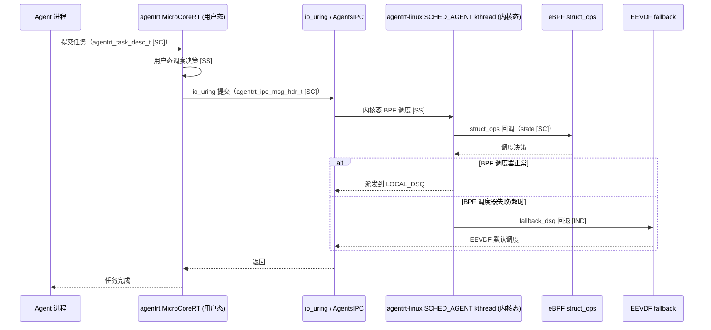

Copyright (c) 2025-2026 SPHARX Ltd. All Rights Reserved.

# agentrt-linux 内核设计文档（Airymax Kernel 极境内核）
  
> **子仓编号**：01\
> **子仓代号**：极境内核（Airymax Kernel）\
> **文档版本**：v2.0 2026-07-09\
> **设计基准**：Linux 内核基线 + 微内核化改造\
> **同源 agentrt**：atoms/corekern（MicroCoreRT）\
> **理论基础**：seL4微内核工程思想\
> **技术路线**：基于 Linux 内核微内核化改造，非从零开发微内核\
> **核心约束**：IRON-9 v2 同源且部分代码共享——与 agentrt 用户态 atoms/corekern 通过 \[SC] 共享契约层（6 头文件）+ \[SS] 语义同源层协作，\[IND] 内核态 sched\_ext/io\_uring/eBPF/Rust 实现独立\
> **横切关注点**：内核是横切关注点（cross-cutting concern），贯穿调度、IPC、eBPF、记忆卷载 4 大数据流，提供机制骨架

---

## 目录

- [1. 子仓职责与设计哲学](#1-子仓职责与设计哲学)
- [2. 同源关系（IRON-9 v2 三层共享模型）](#2-同源关系iron-9-v2-三层共享模型)
- [3. 目录结构](#3-目录结构)
- [4. 内核对象模型（seL4 借鉴）](#4-内核对象模型sel4-借鉴)
- [5. Capability 系统（seL4 借鉴）](#5-capability-系统sel4-借鉴)
- [6. IPC 消息传递（seL4 借鉴 + io\_uring 落地）](#6-ipc-消息传递sel4-借鉴--io_uring-落地)
- [7. 调度与线程模型](#7-调度与线程模型)
- [8. 内存管理（seL4 借鉴 + Linux 对接）](#8-内存管理sel4-借鉴--linux-对接)
- [9. 核心特性（Linux 6.6 原生）](#9-核心特性linux-66-原生)
- [10. IRON-9 v2 三层共享模型落地](#10-iron-9-v2-三层共享模型落地)
- [11. Boot 流程](#11-boot-流程)
- [12. 错误处理与形式化验证预留](#12-错误处理与形式化验证预留)
- [13. agentrt-linux 工程基线与版本规划](#13-agentrt-linux-工程基线与版本规划)
- [14. 与其他子仓的协作](#14-与其他子仓的协作)
- [15. 里程碑（M1-M6）](#15-里程碑m1-m6)
- [16. agentrt 一致性检查](#16-agentrt-一致性检查)
- [17. 相关文档](#17-相关文档)
- [18. 参考文献](#18-参考文献)

***

## 1. 子仓职责与设计哲学

`airymaxos-kernel` 是 agentrt-linux（AirymaxOS）的内核子仓，承担以下核心职责：

1. **Linux 6.6 内核维护 \[IND]**：基于 Linux 6.6 内核基线（1.x.x 版本锁定，ADR-013），保持与上游社区同步演进。
2. **微内核化改造 \[IND]**：在保留 Linux 6.6 完整能力的前提下，遵循 Liedtke minimality principle（ES-SEL4-01, 04），将 VFS、网络栈、设备驱动等子系统逐步用户态化，最小化特权态代码体积。
3. **Agent 感知调度（sched\_ext）\[SS]**：通过 sched\_ext（agentrt-linux 内核增强，主线 6.12+ 引入并持续演进）实现 SCHED\_AGENT 策略，允许 eBPF 程序在用户态定义调度策略。任务描述符与优先级语义 \[SC] 与 agentrt 共享。
4. **高性能 IPC 基础（io\_uring）\[SS]**：基于 io\_uring 构建零 syscall、零拷贝的消息传递基础设施。IPC 消息头与操作码语义 \[SC] 与 agentrt 共享。
5. **eBPF 可编程扩展 \[SS]**：提供 struct\_ops 注册机制 + kfunc 扩展 + ringbuf 上报，可观测/网络/安全/调度均可通过 eBPF 编程。struct\_ops 状态机与 common\_value 布局 \[SC] 与 agentrt 共享。
6. **Rust 安全驱动 \[IND]**：依托 Linux 6.6 中 Rust 实验性支持（持续演进中），构建安全驱动开发框架。
7. **\[SC] 共享契约层物理宿主 \[IND]**：IRON-9 v2 全部 6 个 \[SC] 共享契约头文件物理宿主在 `kernel/include/airymax/`，其他子仓通过 `-I` 引用确保单一数据源。
8. **同源传承 \[SS]**：从 agentrt 的 atoms/corekern（MicroCoreRT）继承实时性与微核心设计思想。

### 1.1 Liedtke 极简原则的 agentrt-linux 诠释

**Jochen Liedtke**（L4 微内核创始人）提出微内核设计的核心原则（ES-SEL4-01）：

> "A concept is tolerated inside the microkernel only if moving it outside the kernel, i.e., permitting competing implementations, would prevent the implementation of the system's required functionality."

**翻译**：只有当某个概念移出微内核会导致系统无法实现所需功能时，才容忍它留在微内核内。

**seL4 的工程验证**：seL4 严格遵循此原则，真正的"微内核必需代码"约 **1.44 万行 C**（不含 arch/plat/drivers），其中五大内核对象（TCB + CNode + Endpoint + Notification + Untyped）合计仅约 **4,353 行**。这与 Linux 单体内核约 3,000 万行形成鲜明对比——差距约 2,000 倍。

**agentrt-linux 的诠释**：agentrt-linux 不是从零开发微内核（ADR-012），而是基于 Linux 6.6 内核进行微内核化改造。因此"极简"不意味着将 Linux 缩减到 1.44 万行，而是遵循以下体量控制策略：

| 维度          | seL4 基线   | agentrt-linux 预算      | 控制策略                  |
| ----------- | --------- | --------------------- | --------------------- |
| 内核核心代码      | \~1.44 万行 | 5-10 万行（含 agent 调度原语） | 每新增子系统需论证"无法在用户态安全实现" |
| 微内核化改造补丁    | —         | 控制在 2 万行以内            | VFS / 网络栈 / 驱动用户态化补丁  |
| \[SC] 共享契约层 | —         | 6 个头文件（IRON-9 v2）     | 单一物理宿主，禁止重复定义         |

### 1.2 内核代码体量预算

借鉴 seL4 的体量控制哲学（ES-SEL4-01），agentrt-linux 设定以下代码体量预算：

| 代码区域                         | seL4 行数  | agentrt-linux 预算 | 性质              |
| ---------------------------- | -------- | ---------------- | --------------- |
| 内核核心（调度/IPC/capability/内存原语） | \~14,400 | 5-10 万行          | 真正的"微内核化"必需     |
| 微内核化改造补丁（VFS/网络/驱动用户态化）      | —        | ≤ 2 万行           | 渐进式改造           |
| \[SC] 共享契约层                  | —        | 6 个头文件           | IRON-9 v2 单一数据源 |
| \[SS] 语义同源层                  | —        | 30+ 项高层 API 语义   | 实现独立，语义同源       |
| \[IND] 独立层                   | —        | 15+ 项            | 内核态专属           |

**体量审计机制**：每版本发布前执行代码体量审计，消除"蠕变增胖"（kernel bloat）。新增子系统需向 TSC 提交"无法在用户态安全实现"论证报告。

### 1.3 系统调用数量约束

**seL4 基线**（ES-SEL4-02）：seL4 内核仅 7 个系统调用（非 MCS）或 11 个（MCS）：

| 系统调用             | 用途              |
| ---------------- | --------------- |
| `seL4_Call`      | 同步调用（发送 + 等待回复） |
| `seL4_ReplyRecv` | 回复并接收下一条        |
| `seL4_Send`      | 同步发送（不等待）       |
| `seL4_NBSend`    | 非阻塞发送           |
| `seL4_Recv`      | 等待接收            |
| `seL4_Reply`     | 仅回复             |
| `seL4_Yield`     | 让出 CPU          |

**agentrt-linux 目标**：≤ 20 个系统调用（含 Linux 6.6 原生 + agentrt-linux 增强）。

**syscall 审计流程**：新增 syscall 需 TSC 评审，遵循"机制在内核、策略在用户态"原则。推荐采用 seL4 的 syscall.xml 单一来源管理（ES-SEL4-21），对应 R-01 增强建议（纳入 1.0.1 M1 阶段）。

### 1.4 横切关注点声明

内核是横切关注点（cross-cutting concern），机制骨架贯穿 agentrt-linux 全部 4 大数据流：

| 数据流      | 内核切入点                                                | 同源标注   |
| -------- | ---------------------------------------------------- | ------ |
| 调度数据流    | sched\_ext BPF 调度类 + SCHED\_AGENT + sub-scheduler    | \[SS]  |
| IPC 数据流  | io\_uring 零拷贝 ring + registered buffer + MSG\_RING   | \[SS]  |
| eBPF 数据流 | struct\_ops 注册 + kfunc + ringbuf + verifier          | \[SS]  |
| 记忆卷载数据流  | userfaultfd + MGLRU + CXL bus（与 airymaxos-memory 协作） | \[IND] |

***

## 2. 同源关系（IRON-9 v2 三层共享模型）

依据 IRON-9 v2 决策，agentrt（用户态 atoms/corekern）与 agentrt-linux（内核态 airymaxos-kernel）通过三层共享模型协作：

| 层次               | 共享程度               | 内核子系统内容                                                                                                                                                                                                                                                                                 | 组织方式                              |
| ---------------- | ------------------ | --------------------------------------------------------------------------------------------------------------------------------------------------------------------------------------------------------------------------------------------------------------------------------------- | --------------------------------- |
| **\[SC] 共享契约层**  | 完全共享代码             | 6 个头文件（详见 §10.1）：sched.h / ipc.h / bpf\_struct\_ops.h / memory\_types.h / security\_types.h / cognition\_types.h                                                                                                                                                                        | `kernel/include/airymax/`（单一物理宿主） |
| **\[SS] 语义同源层**  | 高层 API 语义同源，签名独立演进 | sched\_ext 25+ BPF 回调、io\_uring ring 创建/提交/完成/注册、MSG\_RING 跨环消息、SQPOLL 状态机、DEFER\_TASKRUN、eBPF struct\_ops 注册、bpf\_prog 生命周期、bpf\_link 生命周期、bpf\_map\_ops 回调表、ringbuf reserve/submit、kfunc 注册模式 等 30+ 项                                                                                 | 各自独立实现                            |
| **\[IND] 完全独立层** | 完全独立               | ext\_sched\_class 注册、scx\_ops\_enable/disable、kf\_mask 上下文追踪、fallback\_dsq 回退、cgroup 集成、core-sched 集成、debug dump；io-wq 工作队列、NO\_MMAP、REGISTERED\_FD\_ONLY、URING\_CMD；JIT 后端、trampoline 本机码生成、verifier 实现、BPF\_SCHED CFS 钩子（不移植）、cfi\_stubs、KABI\_RESERVE（不采用）；VFS/网络/驱动用户态化改造；Rust 驱动框架 | 各自独立仓库                            |

### 2.1 维度对比

| 维度             | agentrt（atoms/corekern）       | agentrt-linux（airymaxos-kernel） | 同源标注   |
| -------------- | ----------------------------- | ------------------------------- | ------ |
| 设计目标           | RT 微核心 + Agent 调度             | Linux 6.6 + 微内核化 + Agent 调度     | \[SS]  |
| 调度模型           | MicroCoreRT 实时调度              | SCHED\_AGENT（sched\_ext + eBPF） | \[SS]  |
| 任务描述符          | `agentrt_task_desc_t`（用户态）    | `agentrt_task_desc_t`（内核态）      | \[SC]  |
| IPC            | 用户态消息队列                       | io\_uring 零拷贝 IPC               | \[SS]  |
| IPC 消息头        | `agentrt_ipc_msg_hdr_t`（128B） | `agentrt_ipc_msg_hdr_t`（128B）   | \[SC]  |
| eBPF           | 用户态策略引擎                       | struct\_ops + kfunc + ringbuf   | \[SS]  |
| struct\_ops 状态 | `airymax_struct_ops_state`    | `enum bpf_struct_ops_state`     | \[SC]  |
| 安全模型           | Cupolas capability            | seL4 风格 capability + LSM        | \[SC]  |
| 内存模型           | heapstore + memoryrovol       | MemoryRovol + CXL + PMEM        | \[SC]  |
| 驱动模型           | 用户态驱动 + capability            | Rust 驱动 + VFIO + capability     | \[IND] |
| 跨平台            | Linux/macOS/Windows           | Linux 6.6 专属                    | \[IND] |

### 2.2 同源传承要点

- 保留 agentrt 的"微核心"哲学（最小化运行时核心）\[SS]。
- 保留 agentrt 的"实时性"目标（通过 sched\_ext 的 sub-scheduler 在 cgroup 上附加实时策略）\[SS]。
- 保留 agentrt 的"消息传递"通信范式（升级为 io\_uring 零拷贝实现）\[SS]。
- 任务描述符与优先级语义 \[SC] 共享，确保两端调度语义一致。
- IPC 消息头与操作码 \[SC] 共享，确保两端通信协议一致。
- struct\_ops 状态机 \[SC] 共享，使 agentrt 用户态可解析 BPF 调度器在线状态。
- capability 派生模型 \[SC] 共享（mint/mintcopy/derive/revoke），确保两端安全语义一致。
- MemoryRovol L1-L4 数据结构 \[SC] 共享，确保两端记忆卷载语义一致。

***

## 3. 目录结构

```
airymaxos-kernel/
├── linux/                 # Linux 6.6 内核源码（Linux 6.6 内核基线，git subtree）[IND]
├── patches/               # agentrt-linux 内核补丁
│   ├── sched_ext-agent/   # SCHED_AGENT 策略（eBPF 程序）[SS]
│   ├── io_uring-ipc/      # 基于 io_uring 的 IPC 优化 [SS]
│   ├── bpf-struct-ops/   # eBPF struct_ops 扩展 [SS]
│   ├── capability/        # capability 系统内核接口（seL4 借鉴）[SS]
│   ├── rust-drivers/      # Rust 安全驱动 [IND]
│   └── microkernel/       # 微内核化改造（VFS/网络/驱动部分用户态化）[IND]
├── include/
│   └── airymax/           # [SC] 共享契约层 6 头文件物理宿主（单一数据源）
│       ├── sched.h            # 调度契约 [SC]
│       ├── ipc.h              # IPC 契约 [SC]
│       ├── bpf_struct_ops.h   # eBPF struct_ops 契约 [SC]
│       ├── memory_types.h     # 记忆卷载契约（与 memory 子仓共享）[SC]
│       ├── security_types.h  # 安全契约（与 security 子仓共享）[SC]
│       └── cognition_types.h  # 认知契约（与 cognition 子仓共享）[SC]
├── configs/               # 内核配置 [IND]
│   ├── defconfig          # 默认配置
│   ├── defconfig-agent    # Agent 优化配置
│   └── defconfig-micro     # 微内核化配置
├── docs/                  # 设计文档
└── tests/                 # 内核测试
```

### 3.1 patches/sched\_ext-agent \[SS]

存放 SCHED\_AGENT 策略的 eBPF 程序源码。任务描述符与优先级 \[SC] 与 agentrt 共享：

- `sched_agent.bpf.c`：核心调度器逻辑（基于 sched\_ext BPF 接口）\[SS]。
- `sub-schedulers/`：按 cgroup 附加的子调度器（实时型、批处理型、交互型、Agent 认知型）\[SS]。
- `tools/`：用户态控制器（scxctl 命令行工具）\[IND]。

### 3.2 patches/io\_uring-ipc \[SS]

基于 io\_uring 构建 IPC 通道的内核侧实现。IPC 消息头与操作码 \[SC] 与 agentrt 共享：

- `io_uring_ipc.c`：注册固定 OP，支持零拷贝消息传递 \[SS]。
- `ring_register.c`：跨进程 ring 共享注册 \[SS]。
- `zerocopy.c`：基于 MSG\_ZEROCOPY 与 page flipping 的零拷贝路径 \[SS]。

### 3.3 patches/bpf-struct-ops \[SS]

eBPF struct\_ops 扩展，struct\_ops 状态机与 common\_value \[SC] 与 agentrt 共享：

- `agent_struct_ops.c`：struct\_ops 注册机制扩展 \[SS]。
- `agent_kfunc.c`：自定义 kfunc 导出（`bpf_agent_decision_get` 等）\[IND]。
- `agent_ringbuf.c`：ringbuf 事件格式与 agentrt AgentsIPC 128B 消息头同源 \[SC]。

### 3.4 patches/capability \[SS]

capability 系统的内核侧接口，借鉴 seL4 capability 模型（ES-SEL4-05\~09）：

- `cte.c`：CTE（Capability Table Entry）管理 \[SS]。
- `cspace.c`：CSpace 树形寻址（guard + radix）\[SS]。
- `mdb.c`：MDB（Memory Disclosure Base）派生树维护 \[SS]。
- `cnode_ops.c`：7 种 CNode 操作（Insert/Move/Copy/Mint/Mutate/Revoke/Delete）\[SS]。
- 与 `airymaxos-security/capability` 协作，通过 \[SC] `security_types.h` 共享契约。

### 3.5 patches/rust-drivers \[IND]

Rust 安全驱动框架：

- `rust/kernel/`：扩展的 Rust 内核绑定。
- `samples/rust_drivers/`：示例安全驱动（网卡、块设备、字符设备）。
- `frameworks/`：抽象框架（trait-based 驱动模型）。

### 3.6 patches/microkernel \[IND]

微内核化改造补丁集：

- `vfs-userns/`：VFS 元数据操作下放至用户态服务。
- `net-userns/`：网络栈用户态化（与 `airymaxos-services/net` 协作）。
- `driver-split/`：设备驱动拆分至用户态（与 `airymaxos-services/drivers` 协作）。
- `untyped-retype/`：Untyped-Retype 内存模型内核接口（借鉴 ES-SEL4-03）。

***

## 4. 内核对象模型（seL4 借鉴）

> **设计依据**：seL4 五大内核对象模型（ES-SEL4-01），代码证据 `src/object/{tcb.c(2118), cnode.c(934), endpoint.c(577), notification.c(419), untyped.c(305)}.c`。

### 4.1 对象类型清单

seL4 内核仅维护 **12 种定长 capability 类型**（ES-SEL4-05），对应 **5 大核心内核对象**：

| seL4 对象                   | 文件                          | 行数    | agentrt-linux 对应               | 借鉴层 |
| ------------------------- | --------------------------- | ----- | ------------------------------ | --- |
| TCB（Thread Control Block） | `src/object/tcb.c`          | 2,118 | Linux `task_struct` + agent 扩展 | 架构层 |
| CNode（Capability Node）    | `src/object/cnode.c`        | 934   | capability 表节点                 | 架构层 |
| Endpoint（IPC 端点）          | `src/object/endpoint.c`     | 577   | io\_uring ring + Endpoint 语义   | 架构层 |
| Notification（异步信号）        | `src/object/notification.c` | 419   | eventfd + signal 语义            | 架构层 |
| Untyped（未类型化内存）           | `src/object/untyped.c`      | 305   | Retype 接口层                     | 架构层 |

**agentrt-linux 扩展对象**（在 Linux `task_struct` 基础上扩展）：

| 扩展对象         | 用途                                                         | 同源标注  |
| ------------ | ---------------------------------------------------------- | ----- |
| AgentTCB     | Agent 专属 TCB 扩展（agent\_id / capability\_set / ipc\_buffer） | \[SS] |
| SchedContext | 调度上下文（参考 seL4 MCS 模式 schedcontext.c:444）                   | \[SS] |
| TaskFlow     | 任务流描述符（与 agentrt taskflow 同源）                              | \[SS] |

### 4.2 TCB 结构设计

**seL4 TCB 布局参考**（`include/object/structures.h:48-75`）：

```
seL4 TCB 物理布局（seL4_TCBBits 对象）：
| cte_t[16]      |  16 个内嵌 CTE 槽位（tcbCTable/tcbVTable/tcbReply/tcbCaller/tcbBuffer 等）
| debug_tcb_t    |  调试信息
| tcb_t          |  核心 TCB 字段
```

**agentrt-linux TCB 扩展设计**（在 Linux `task_struct` 基础上）：

| 字段                   | 类型                  | 说明                     | 同源标注  |
| -------------------- | ------------------- | ---------------------- | ----- |
| `agent_id`           | u64                 | Agent 唯一标识             | \[SS] |
| `capability_set`     | cte\_t\*            | 指向 Agent 的 CSpace 根    | \[SS] |
| `ipc_buffer`         | void\*              | IPC Buffer 用户态地址       | \[SS] |
| `sched_context`      | sched\_context\_t\* | 调度上下文（MCS 模式参考）        | \[SS] |
| `bound_notification` | notification\_cap\* | 绑定的 Notification cap   | \[SS] |
| `badge`              | u64                 | Agent 身份标识（ES-SEL4-09） | \[SC] |

**关键设计决策**：agentrt-linux 不替换 Linux `task_struct`，而是在其上附加 `agentrt_tcb_ext` 扩展结构，通过 `task_struct->agentrt_ext` 指针关联。这保留了 Linux 调度器、信号处理、内存管理的完整性，同时注入 seL4 风格的 capability / IPC 语义。

### 4.3 对象类型分派

借鉴 seL4 的 `deriveCap` / `finaliseCap` 分派模式（`src/object/objecttype.c:62-200`）：

| 操作                  | seL4 实现                                             | agentrt-linux 落地  | 借鉴层   |
| ------------------- | --------------------------------------------------- | ----------------- | ----- |
| `deriveCap`         | 派生校验（zombie/irq\_control/reply 不可派生）                | capability 派生校验接口 | \[SS] |
| `finaliseCap`       | 终结化（final cap 触发 `cancelAllIPC`/`cancelAllSignals`） | Agent 终结化清理       | \[SS] |
| `isFinalCapability` | 最终 cap 判定（`src/object/cnode.c:846-874`）             | 最终 capability 判定  | \[SS] |

**对象大小约束**：seL4 每种对象有固定大小（`seL4_TCBBits` 等），agentrt-linux 通过 \[SC] 头文件定义对象大小常量，确保两端一致。

### 4.4 对象生命周期

借鉴 seL4 的对象生命周期管理（ES-SEL4-03 Untyped-Retype 机制）：

```
Create（Retype from Untyped）→ Activate → Suspend → Resume → Delete（Retype back to Untyped）
```

**agentrt-linux 落地**：

- **Create**：通过 `ioctl(fd, AGENTRT_OBJ_CREATE, ...)` 从 Untyped 内存 Retype 为具体对象。
- **Activate**：绑定到 AgentTCB，开始参与调度。
- **Suspend/Resume**：通过 sched\_ext 的 `agent_runnable`/`agent_stopping` 回调控制。
- **Delete**：回收对象，内存 Retype 回 Untyped。

***

## 5. Capability 系统（seL4 借鉴）

> **设计依据**：seL4 capability 单一安全模型（ES-SEL4-05 至 09），是 seL4 安全模型的精髓。代码证据 `src/object/cnode.c`（934 行）、`src/kernel/cspace.c`（193 行）、`include/object/structures_64.bf`。

### 5.1 CTE 与 CSpace 设计

**seL4 capability 即内存**（ES-SEL4-05）：每个 cap 是定长 word（64 位系统为 128 字节），通过 CTE（Capability Table Entry）存储。

| 维度         | seL4 实现                     | 代码证据                                    | agentrt-linux 落地                                     |
| ---------- | --------------------------- | --------------------------------------- | ---------------------------------------------------- |
| cap 类型     | 12 种定长 cap                  | `include/object/structures_64.bf:7-138` | 与 POSIX capability 38 ID 兼容（\[SC] security\_types.h） |
| CTE 结构     | cap + mdb\_node             | `include/object/structures.h:60-75`     | 内核 CTE 结构 \[IND]                                     |
| TCB 内嵌 CTE | 16 个槽位（TCB\_CNODE\_RADIX=4） | `include/object/structures.h:60-75`     | AgentTCB 内嵌 capability\_set \[SS]                    |

**CNode 树形寻址**（ES-SEL4-06）：CSpace 由 CNode 组成的 radix tree，每个 CNode cap 含三个关键字段：

| 字段                  | 位数     | 说明         |
| ------------------- | ------ | ---------- |
| `capCNodeGuard`     | 64 bit | 本节点匹配的地址前缀 |
| `capCNodeGuardSize` | 6 bit  | guard 位数   |
| `capCNodeRadix`     | 6 bit  | 本节点索引位数    |

**寻址算法**（`src/kernel/cspace.c:126-193` `resolveAddressBits`）：从根 CNode 开始，逐级匹配 guard、提取 radix 位索引下一层。

**agentrt-linux 落地**：支持多层 CSpace + guard，使 Agent 可传递"局部 capability 视图"给子 Agent，实现 capability 命名空间隔离。这是 Agent 沙箱的关键安全原语。

### 5.2 Capability 派生与撤销

**MDB 派生树**（ES-SEL4-07）：seL4 通过 MDB（Mapping Database）维护所有 capability 之间的派生关系。MDB 是双向链表，父 cap 可递归撤销所有派生自它的子孙 cap。

| 操作                  | seL4 实现     | 代码证据                         | agentrt-linux 用途 |
| ------------------- | ----------- | ---------------------------- | ---------------- |
| `cteInsert`         | 维护 MDB 链表   | `src/object/cnode.c:410-443` | 插入新 cap 时建立父子关系  |
| `cteRevoke`         | 递归删除所有子 cap | `src/object/cnode.c:528-550` | "一键撤销"子 Agent 权限 |
| `isMDBParentOf`     | 父子关系判定      | `src/object/cnode.c:775-819` | 沙箱权限边界判定         |
| `isFinalCapability` | 最终 cap 判定   | `src/object/cnode.c:846-874` | 触发对象销毁           |

**agentrt-linux 安全沙箱关键机制**：主 Agent 可通过 `cteRevoke` 一键撤销授予子 Agent 的所有权限——这是 seL4 实现安全沙箱的核心，也是 Agent 间权限传递的安全保障。

**\[SC] 对接**：通过 `include/airymax/security_types.h` 定义 capability 派生模型（mint / mintcopy / derive / revoke），与 agentrt Cupolas 同源。

### 5.3 Badge 机制与 Agent 身份

**seL4 Badge**（ES-SEL4-09）：Endpoint 和 Notification cap 含 64 位 badge 字段。当消息通过该 cap 发送时，badge 自动附加到消息中，接收方通过 badge 区分消息来源。

| 维度                  | seL4 实现                           | 代码证据                                    | agentrt-linux 落地          |
| ------------------- | --------------------------------- | --------------------------------------- | ------------------------- |
| badge 字段位置          | endpoint\_cap + notification\_cap | `include/object/structures_64.bf:24-43` | AgentTCB.badge 字段 \[SC]   |
| fastpath badge 传递   | `cap_endpoint_cap_get_capEPBadge` | `src/fastpath/fastpath.c:185`           | IPC 消息头 src\_pid 字段 \[SC] |
| 派生规则                | badge=0 可派生任意，badge≠0 子 cap 相同    | `src/object/cnode.c:798-819`            | Agent 身份派生约束 \[SS]        |
| `cancelBadgedSends` | 按 badge 取消特定发送者                   | `src/object/endpoint.c:489-539`         | 按 Agent 取消挂起消息 \[SS]      |

**Agent 身份识别**：server Agent 能通过 badge 识别"哪个 client Agent 通过共享 Endpoint 发来的请求"，无需维护连接表。这是 seL4 实现多客户端 server 的核心机制。

### 5.4 7 种 CNode 操作

**seL4 CNode 操作原语**（ES-SEL4-08，`src/object/cnode.c:42-313`）：

| 操作         | 语义                    | badge 处理                      | agentrt-linux 用途 |
| ---------- | --------------------- | ----------------------------- | ---------------- |
| **Copy**   | 复制 cap，不修改 badge      | `maskCapRights` + `deriveCap` | Agent 间权限复制      |
| **Mint**   | Copy + 设置 badge/guard | `updateCapData`               | Agent 身份委托       |
| **Move**   | 原子迁移 cap              | 不修改                           | cap 重排           |
| **Mutate** | Move + 修改 guard       | 修改 guard                      | cap 重排 + 局部视图调整  |
| **Revoke** | 递归撤销所有子 cap           | —                             | "一键撤销"子 Agent 权限 |
| **Delete** | 删除单个 cap              | —                             | 单权限回收            |
| **Rotate** | 三槽位原子旋转               | —                             | 无临时槽的 cap 重排     |

**MCS 模式扩展**：seL4 MCS 模式增加 `SaveCaller` 操作（替换 `Rotate`），用于 Reply Cap 管理。

**agentrt-linux API**：通过 `ioctl(fd, AGENTRT_CNODE_OP, &op)` 提供这 7 种原语，特别是 `Mint`（带 badge 复制）和 `Revoke`（递归撤销），实现可审计的 Agent 权限流转。

***

## 6. IPC 消息传递（seL4 借鉴 + io\_uring 落地）

> **设计依据**：seL4 IPC 消息传递机制（ES-SEL4-10 至 15）。代码证据 `src/object/endpoint.c`（577 行）、`src/fastpath/fastpath.c`（899 行）、`src/object/notification.c`（419 行）。

### 6.1 Endpoint 状态机

**seL4 Endpoint**（ES-SEL4-10）：同步 IPC 通道，仅 16 字节，通过 2 bit state 字段显式编码三种状态：

| 状态             | 值 | 含义     | seL4 代码证据                        |
| -------------- | - | ------ | -------------------------------- |
| `EPState_Idle` | 0 | 无等待者   | `include/object/structures.h:34` |
| `EPState_Send` | 1 | 有发送者等待 | `include/object/structures.h:35` |
| `EPState_Recv` | 2 | 有接收者等待 | `include/object/structures.h:36` |

**状态转换**（`src/object/endpoint.c:27-296`）：

- `sendIPC`：Idle/Send 时阻塞发送者（ThreadState\_BlockedOnSend），Recv 时直接 transfer + dequeue 接收者。
- `receiveIPC`：Idle/Recv 时阻塞（ThreadState\_BlockedOnReceive），Send 时直接 transfer。

**agentrt-linux 落地**：IPC channel 采用显式状态机，而非 Linux pipe 的"缓冲区+阻塞"模型。显式状态使 IPC 路径可形式化推理，且支持 fastpath 优化。io\_uring ring 作为 Endpoint 的物理载体，\[SC] `ipc.h` 定义 128B 消息头。

### 6.2 Message Register 与 IPC Buffer

**seL4 双通道 IPC**（ES-SEL4-11, 12）：优先使用 CPU 寄存器（msgRegisters）传递前 N 个 word，超出部分通过用户态 IPC buffer 传递。

| 维度                   | seL4 实现                                    | 代码证据                              | agentrt-linux 落地          |
| -------------------- | ------------------------------------------ | --------------------------------- | ------------------------- |
| MessageInfo          | length + extraCaps + capsUnwrapped + label | `include/api/syscall.h:38-49`     | \[SC] ipc.h 消息头字段         |
| MR（Message Register） | 物理 CPU 寄存器（aarch64 4 个）                    | `src/arch/arm/64/api/benchmark.c` | io\_uring SQE 内联数据        |
| IPC Buffer           | 用户态可写区域                                    | `include/object/structures.h`     | io\_uring SQ/CQ ring 共享内存 |
| copyMRs              | 跨架构实现                                      | `src/arch/*/object/ipc.c`         | io\_uring 零拷贝路径           |

**\[SC] 对接**：`agentrt_ipc_msg_hdr_t`（128B）定义在 `include/airymax/ipc.h`，包含 magic（0x41524531 'ARE1'）、version、type、payload\_len、flags、src\_pid、dst\_pid、trace\_id、timestamp\_ns 等字段。

### 6.3 Fastpath 设计（POINT OF NO RETURN）

**seL4 Fastpath**（ES-SEL4-13）：IPC 快路径的核心理念是 **POINT OF NO RETURN**——一旦进入 fastpath，就不允许回退到慢路径。

| 维度                 | seL4 实现                           | 代码证据                                |
| ------------------ | --------------------------------- | ----------------------------------- |
| fastpath 入口        | `lookup_fp` 无递归 do-while          | `include/fastpath/fastpath.h:46-90` |
| fastpath 主体        | 12 项前置检查 + 直接 transfer            | `src/fastpath/fastpath.c`（899 行）    |
| badge 传递           | `cap_endpoint_cap_get_capEPBadge` | `src/fastpath/fastpath.c:185`       |
| POINT OF NO RETURN | 进入后不可回退                           | `src/fastpath/fastpath.c`           |

**Fastpath 触发条件**（4 类）：

1. **call fastpath**：Caller → Callee，无 fault、无额外 caps
2. **reply\_recv fastpath**：Callee 回复并等待下一条
3. **signal fastpath**：Notification 发送
4. **vm\_fault fastpath**：页故障处理

**agentrt-linux 落地**：io\_uring 的零拷贝路径对应 IPC fastpath 语义。当满足"固定 buffer + registered ring + 无 fault"条件时，走 io\_uring fastpath（零 syscall）；否则走慢路径（io\_uring enter + fallback）。

### 6.4 Notification 异步信号

**seL4 Notification**（ES-SEL4-14）：与 Endpoint 不同，Notification 是异步信号机制。

| 维度            | seL4 实现                   | 代码证据                              |
| ------------- | ------------------------- | --------------------------------- |
| 数据传递          | word 传递 + badge 聚合        | `src/object/notification.c:1-100` |
| 状态机           | Idle / Waiting / Active   | `include/object/structures.h`     |
| TCB 绑定        | bound notification        | `src/object/tcb.c`                |
| 与 Endpoint 关系 | 可绑定到 TCB，被 blocked IPC 唤醒 | `src/object/notification.c`       |

**agentrt-linux 落地**：基于 eventfd + signalfd 实现 Notification 语义。bound notification 对应 AgentTCB 的 `bound_notification` 字段（§4.2）。

### 6.5 io\_uring IPC 落地

**io\_uring 作为 Endpoint 物理载体**：

| io\_uring 机制              | seL4 对应           | 同源标注  |
| ------------------------- | ----------------- | ----- |
| SQ/CQ ring 共享内存           | IPC Buffer        | \[SS] |
| SQE 内联数据                  | Message Register  | \[SS] |
| MSG\_RING 跨 ring 消息       | Endpoint send     | \[SS] |
| registered buffer         | 固定 cap 映射         | \[SS] |
| zero-copy (page flipping) | fastpath transfer | \[SS] |

**IPC magic 0x41524531 'ARE1'** \[SC] 与 agentrt 共享，确保两端通信协议一致。

***

## 7. 调度与线程模型

> **设计依据**：seL4 调度器设计（ES-SEL4-04 零策略内核）+ Linux 6.6 sched\_ext。代码证据 `src/kernel/thread.c`（752 行）、`src/object/tcb.c:32-50`（checkPrio）、`src/object/schedcontext.c`（444 行）。

### 7.1 调度器设计

**seL4 调度器**（ES-SEL4-04）：只实现 priority + round-robin + domain 三个机制，具体优先级数值、时间片长度由用户态通过 capability invocation 设置。`checkPrio` 仅校验 `prio > mcp`，不决定优先级数值。

**agentrt-linux 落地**：Agent 调度策略（优先级、QoS、deadline）作为用户态 policy server 实现，内核仅提供 `set_priority`/`yield_to`/`bind_sched_context` 等原语。这与 seL4 的"机制在内核、策略在用户态"原则一致。

### 7.2 调度上下文（MCS 模式参考）

**seL4 MCS 模式**（`src/object/schedcontext.c` 444 行 + `src/object/schedcontrol.c` 186 行）：

| 维度           | seL4 MCS 实现   | agentrt-linux 落地              |
| ------------ | ------------- | ----------------------------- |
| SchedContext | 常量带宽管理        | sched\_ext sub-scheduler 带宽配额 |
| refill 机制    | refill + 带宽管理 | cgroup cpu.max/cpu.weight     |
| 常量带宽 vs 突发   | 参数化           | SCHED\_AGENT 策略可配             |

**Agent 调度数量上限**：MAC\_MAX\_AGENTS 1024，基准测试验证到 1000 个并发。

### 7.3 线程状态机

**seL4 ThreadState**（`src/kernel/thread.c:38-112`）：

| 状态                             | 含义   | agentrt-linux 对应                    |
| ------------------------------ | ---- | ----------------------------------- |
| `ThreadState_Running`          | 运行中  | Linux TASK\_RUNNING                 |
| `ThreadState_Restart`          | 重启   | Linux TASK\_INTERRUPTIBLE → RUNNING |
| `ThreadState_BlockedOnReply`   | 等待回复 | io\_uring 等待 CQE                    |
| `ThreadState_BlockedOnReceive` | 等待接收 | io\_uring 等待 SQE                    |
| `ThreadState_BlockedOnSend`    | 等待发送 | 背压/拥塞                               |
| `ThreadState_Inactive`         | 不活跃  | Linux TASK\_DEAD                    |

**域切换**（`src/kernel/thread.c:317-338`）：seL4 的 domain 调度对应 agentrt-linux 的 cgroup 隔离，每个 cgroup 对应一个 domain。

### 7.4 sched\_ext SCHED\_AGENT 落地

**sched\_ext（agentrt-linux 内核增强，主线 6.12+，2026 成熟）** \[SS]：

通过 sched\_ext 提供的 BPF 调度接口，在用户态实现完整调度器。支持 sub-scheduler 机制：不同 cgroup 可附加不同调度策略。

**调度策略矩阵**：

| Sub-scheduler     | 适用 cgroup    | 策略                  | 同源标注  |
| ----------------- | ------------ | ------------------- | ----- |
| `scx_realtime`    | system.slice | 实时优先级               | \[SS] |
| `scx_batch`       | batch.slice  | 批处理，吞吐优先            | \[SS] |
| `scx_interactive` | user.slice   | 交互响应优先              | \[SS] |
| `scx_agent`       | agent.slice  | CoreLoopThree 三阶段感知 | \[SS] |

**vtime 衰减公式** \[SC]（`include/airymax/sched.h`）：

```c
/* vtime 衰减公式 [SC]——agentrt 与 agentrt-linux 共享 */
static inline airymax_vtime_t
airymax_vtime_decay(airymax_vtime_t vtime, u64 consumed_slice, u32 weight) {
    return vtime + consumed_slice * 100 / weight;
}
```

**关键约束**：复用内核 SCHED\_EXT=7 调度类编号，禁止 SCHED\_AGENT 宏（与 OLK-6.6 SCHED\_EXT=7 编号冲突）。SCHED\_AGENT 仅作为 sched\_ext 策略名称，而非独立调度类。

***

## 8. 内存管理（seL4 借鉴 + Linux 对接）

> **设计依据**：seL4 Untyped-Retype 内存模型（ES-SEL4-03）。代码证据 `src/object/untyped.c`（305 行）、`src/kernel/boot.c:790-854`（create\_untypeds）。

### 8.1 Untyped-Retype 模型

**seL4 内存管理二元论**（ES-SEL4-03）：seL4 不实现传统的 malloc/free 内存分配器。所有空闲物理内存以"Untyped Capability"形式存在，用户态通过 `seL4_Untyped_Retype` invocation 将其转换为具体类型的对象。

| 操作                        | seL4 实现               | 代码证据                           | agentrt-linux 落地          |
| ------------------------- | --------------------- | ------------------------------ | ------------------------- |
| `decodeUntypedInvocation` | 完整校验链（类型/大小/对齐/窗口/空槽） | `src/object/untyped.c:26-232`  | Retype 请求校验 \[IND]        |
| `invokeUntyped_Retype`    | 实际执行 Retype           | `src/object/untyped.c:272-305` | Retype 执行 \[IND]          |
| `create_untypeds`         | boot 阶段初始化            | `src/kernel/boot.c:790-854`    | boot 阶段 Untyped 创建 \[IND] |

**Untyped cap 字段**（`include/object/structures_64.bf:14-22`）：

| 字段             | 位数              | 说明     |
| -------------- | --------------- | ------ |
| `capFreeIndex` | canonical\_size | 空闲索引   |
| `capIsDevice`  | 1               | 是否设备内存 |
| `capBlockSize` | 6               | 块大小    |

**agentrt-linux 落地**：保留 Linux 的 `buddy allocator` + `slab` 分配器（兼容性），但在 capability 层之上引入"untyped → typed"的显式 Retype 操作，使 Agent 的内存授权可追溯、可撤销。

### 8.2 与 Linux 内存子系统的对接

| Linux 机制        | seL4 对应           | agentrt-linux 集成方式          | 同源标注   |
| --------------- | ----------------- | --------------------------- | ------ |
| buddy allocator | Untyped pool      | 保留，作为 Untyped 物理后端          | \[IND] |
| slab allocator  | Typed object      | 保留，Retype 后由 slab 管理        | \[IND] |
| MGLRU           | page replacement  | 保留（用户态策略可配置）                | \[SS]  |
| userfaultfd     | fault handler     | 保留，作为 fault IPC 载体          | \[SS]  |
| CXL bus         | device memory     | 保留，扩展 Untyped 到 CXL 内存      | \[IND] |
| PMEM/DAX        | persistent memory | 保留，对接 \[SC] memory\_types.h | \[SC]  |

**\[SC] 对接**：通过 `include/airymax/memory_types.h` 定义 MemoryRovol L1-L4 数据结构 + GFP 掩码语义 + PMEM 持久化接口，与 agentrt heapstore + memoryrovol 同源。

### 8.3 地址空间管理

| 维度            | seL4 实现       | agentrt-linux 落地                |
| ------------- | ------------- | ------------------------------- |
| VSpace 对象     | 页表树 + VCPU    | Linux mm\_struct + 页表           |
| Page Table 派生 | arch 层实现      | Linux pt 派生（保留）                 |
| 大页            | 显式配置          | THP（透明大页，保留）                    |
| 地址空间隔离        | capability 控制 | cgroup + namespace + capability |

***

## 9. 核心特性（Linux 6.6 原生）

### 9.1 sched\_ext \[SS]

- 通过 sched\_ext 提供的 BPF 调度接口，在用户态实现完整调度器。
- 支持 sub-scheduler 机制：不同 cgroup 可附加不同调度策略。
- Agent 认知型 sub-scheduler：识别 CoreLoopThree 的"感知-思考-行动"三阶段，动态调整时间片。
- 任务描述符 magic 0x41475453 'AGTS' \[SC] 与 agentrt 共享。
- 复用 SCHED\_EXT=7 调度类编号，禁止 SCHED\_AGENT 宏。

### 9.2 io\_uring \[SS]

- 零 syscall：SQ/CQ ring 共享内存，减少陷入内核次数。
- 零拷贝：MSG\_ZEROCOPY + registered buffers + page flipping。
- 固定 OP 扩展：注册 IORING\_OP\_IPC\_SEND / IORING\_OP\_IPC\_RECV 等 IPC 专用 OP。
- 跨进程 ring 共享：通过 io\_uring\_register 注册 ring fd 给其他进程。
- IPC magic 0x41524531 'ARE1' \[SC] 与 agentrt 共享。
- 作为 Endpoint 的物理载体（详见 §6.5）。

### 9.3 eBPF \[SS]

- 观测：kprobe/uprobe/tracepoint 程序用于系统观测。
- 网络：XDP/TC 程序用于高性能数据路径。
- 安全：LSM BPF 程序用于安全策略（与 `airymaxos-security/ebpf-verify` 协作）。
- 调度：sched\_ext 程序用于调度策略。
- struct\_ops 状态机 4 状态（INIT/INUSE/TOBEFREE/READY）\[SC] 与 agentrt 共享。
- CO-RE（Compile Once - Run Everywhere）：跨内核版本可移植。

### 9.4 Rust 实验性支持 \[IND]

- Linux 6.6 中 Rust 持续作为实验性支持语言演进。
- 安全驱动开发：通过类型系统消除 UAF、Buffer Overflow、Data Race。
- 与 `airymaxos-kernel/patches/rust-drivers` 配套。

### 9.5 EEVDF 调度器 \[SS]

- 混合架构：PREEMPT\_NONE（吞吐优先）与 PREEMPT\_FULL（响应优先）之间新增"懒惰抢占"模式。
- 适用 Agent 工作负载：大部分时间高吞吐，关键路径可被快速抢占。
- 减少 cache 抖动，提升能效。
- 作为 sched\_ext 失败时的 fallback 调度器（fallback\_dsq 机制）。

### 9.6 微内核化改造 \[IND]

遵循 **Liedtke minimality principle**（ES-SEL4-01, 04）：机制与策略严格分离。

改造路径：

1. **VFS 用户态化**：保留虚拟文件系统层在内核，但具体文件系统（ext4、xfs、tmpfs）实现下放至用户态服务。
2. **网络栈用户态化**：保留 socket 层在内核，协议栈（TCP/IP）下放至用户态服务（DPDK/AF\_XDP）。
3. **驱动用户态化**：通过 VFIO/libvfio 将设备驱动下放至用户态进程。
4. **capability 接口**：提供内核 capability 令牌传递接口，与 `airymaxos-security` 协作。

### 9.7 不移植特性声明 \[IND]

遵循 IRON-1（禁止新特性）与 IRON-9 v2（同源且部分代码共享）原则，以下上游 Linux 6.6 不含特性不移植到 AirymaxOS：

| 特性                 | 不移植原因                            | 替代方案                        |
| ------------------ | -------------------------------- | --------------------------- |
| BPF\_SCHED（CFS 钩子） | 上游 Linux 6.6 不含，与 struct\_ops 重复 | 通过 struct\_ops 提供等价能力 \[SS] |
| KABI\_RESERVE      | 与 IRON-1 冲突（禁止新特性）               | 通过包装结构实现 ABI 扩展 \[IND]      |
| KMSAN              | 开销过大                             | 不启用（开销过大）                   |

***

## 10. IRON-9 v2 三层共享模型落地

### 10.1 \[SC] 共享契约层——6 个头文件

kernel 子仓是全部 6 个 \[SC] 共享契约头文件的物理宿主（`kernel/include/airymax/`），其他子仓通过 `-I` 引用确保单一数据源：

| 头文件                 | 主要消费方              | 内容概述                                                                                                                                | kernel 涉及度 |
| ------------------- | ------------------ | ----------------------------------------------------------------------------------------------------------------------------------- | ---------- |
| `sched.h`           | kernel / cognition | SCHED\_EXT 调度类编号约束（复用 7，禁止 SCHED\_AGENT 宏）+ 任务描述符（magic 0x41475453 'AGTS'）+ vtime 类型与衰减公式 + 优先级范围 0-139 + AIRYMAX\_SLICE\_DFL（20ms） | ★★★ 核心     |
| `ipc.h`             | kernel / services  | IPC magic（0x41524531 'ARE1'）+ 128B 消息头结构（agentrt\_ipc\_msg\_hdr\_t）+ SQE/CQE 操作码与标志位                                                | ★★★ 核心     |
| `bpf_struct_ops.h`  | kernel / cognition | struct\_ops 状态机 4 状态枚举 + common\_value 16B 布局                                                                                       | ★★★ 核心     |
| `security_types.h`  | kernel / security  | POSIX capability 38 ID 枚举 + LSM 钩子 254 ID 枚举 + Cupolas blob 布局 + capability 派生模型 + Vault backend 抽象 + 策略裁决 4 值枚举                    | ★★ 辅助      |
| `memory_types.h`    | kernel / memory    | MemoryRovol L1-L4 数据结构 + GFP 掩码语义 + PMEM 持久化接口                                                                                      | ★★ 辅助      |
| `cognition_types.h` | kernel / cognition | CoreLoopThree 阶段枚举 + Thinkdual 模式枚举 + LLM 推理阶段枚举 + Token 能效指标 + GPU/NPU 能力描述符                                                       | ★ 低        |

**10.1.1** **`sched.h`** **详细内容**

| 内容                                           | 说明                                                                                                           |
| -------------------------------------------- | ------------------------------------------------------------------------------------------------------------ |
| `SCHED_EXT` 复用（值 7，OLK-6.6 已定义）              | 复用 sched\_ext 调度类编号，AirymaxOS 通过 BPF struct\_ops 实现专属策略                                                      |
| `AGENTRT_TASK_DESC_MAGIC`（0x41475453 'AGTS'） | 任务描述符 magic（独立于 IPC 消息头）                                                                                     |
| `AIRYMAX_SLICE_DFL`（20ms）                    | 默认时间片                                                                                                        |
| `AIRYMAX_WEIGHT_MIN/MAX`（1/10000）            | 任务权重范围                                                                                                       |
| `airymax_vtime_t`（u64）                       | vtime 数据类型                                                                                                   |
| `AIRYMAX_PRIO_*` 宏（0-139 分级）                 | 优先级范围（RT 0-49 / STD 50-99 / BG 100-139）                                                                      |
| `agentrt_task_desc_t` 结构                     | 任务描述符（magic/version/priority/flags/task\_id/trace\_id/deadline\_ns/max\_retries/cpu\_affinity/role/reserved） |
| `airymax_vtime_decay()` 函数                   | vtime 衰减公式（consumed\_slice \* 100 / weight）                                                                  |

**10.1.2** **`ipc.h`** **详细内容**

| 内容                                                            | 说明                                                                                                 |
| ------------------------------------------------------------- | -------------------------------------------------------------------------------------------------- |
| `AGENTRT_IPC_MAGIC`（0x41524531 'ARE1'）                        | IPC 消息头 magic（同源 agentrt）                                                                          |
| `AGENTRT_IPC_MSG_HDR_SIZE`（128）                               | 128B 消息头大小                                                                                         |
| `AGENTRT_IPC_RING_DEF/MAX_ENTRIES`（256/32768）                 | ring 默认/最大条目数                                                                                      |
| `AGENTRT_IPC_OP_*` 宏（NOP/SEND/RECV/MSG\_RING/SEND\_ZC）        | SQE 操作码（同源 io\_uring\_op 子集）                                                                       |
| `AGENTRT_IPC_SQE_*` 宏（FIXED\_BUF/ASYNC/BUF\_SELECT/SKIP\_CQE） | SQE 标志位                                                                                            |
| `AGENTRT_IPC_CQE_F_*` 宏（BUFFER/MORE/NOTIF）                    | CQE 标志位                                                                                            |
| `agentrt_ipc_msg_hdr_t` 结构                                    | 128B 消息头（magic/version/type/payload\_len/flags/src\_pid/dst\_pid/trace\_id/timestamp\_ns/reserved） |

**10.1.3** **`bpf_struct_ops.h`** **详细内容**

| 内容                                         | 说明                                                      |
| ------------------------------------------ | ------------------------------------------------------- |
| `airymax_struct_ops_state` 枚举              | struct\_ops 状态机 4 状态（INIT=0/INUSE=1/TOBEFREE=2/READY=3） |
| `airymax_struct_ops_common_value` 结构       | struct\_ops map value 公共头（refcnt/state/reserved，16B）    |
| `AIRYMAX_STRUCT_OPS_VALUE_HEADER_SIZE`（16） | common\_value 大小                                        |

### 10.2 \[SS] 语义同源层——30+ 项 API 映射

高层 API 语义同源（概念操作一致），签名因抽象层级不同而独立演进。三大子系统的同源 API：

**10.2.1 sched\_ext 同源 API（17 项）**

| 序号 | API                                               | 语义       | agentrt 实现  | agentrt-linux 实现      |
| -- | ------------------------------------------------- | -------- | ----------- | --------------------- |
| 1  | `agent_select_cpu`                                | CPU 选择   | 用户态 NUMA 亲和 | 内核 BPF select\_cpu 回调 |
| 2  | `agent_enqueue`/`agent_dequeue`                   | 入队/出队    | 用户态链表       | 内核 DSQ + BPF 回调       |
| 3  | `agent_dispatch`                                  | 派发       | 用户态调度       | 内核 BPF dispatch 回调    |
| 4  | `agent_runnable`/`running`/`stopping`/`quiescent` | 状态通知     | 用户态状态机      | 内核 BPF 状态通知           |
| 5  | `agent_init`/`exit`/`enable`/`disable`            | 生命周期     | 用户态注册       | 内核 BPF 生命周期           |
| 6  | `agent_tick`/`set_weight`/`set_cpumask`           | 时钟/权重/亲和 | 用户态统计       | 内核 BPF 回调             |
| 7  | `agent_cpu_online`/`cpu_offline`/`update_idle`    | SMP 回调   | 用户态模拟       | 内核 BPF SMP 回调         |

**10.2.2 io\_uring 同源 API（8 项）**

| 序号 | API                          | 语义            | agentrt 实现  | agentrt-linux 实现           |
| -- | ---------------------------- | ------------- | ----------- | -------------------------- |
| 1  | `agentrt_ipc_ring_create()`  | 环创建           | 用户态 mmap    | 内核 io\_uring\_setup()      |
| 2  | `agentrt_ipc_ring_enter()`   | 提交/等待         | 用户态轮询       | 内核 io\_uring\_enter()      |
| 3  | `agentrt_ipc_register()`     | 资源注册          | 用户态注册       | 内核 io\_uring\_register()   |
| 4  | `agentrt_ipc_submit_batch()` | 批量提交          | 用户态批处理      | 内核 io\_submit\_sqes()      |
| 5  | `AGENTRT_IPC_OP_MSG_RING`    | 跨 ring 消息     | 用户态消息路由     | 内核 IORING\_OP\_MSG\_RING   |
| 6  | SQPOLL 状态机                   | 轮询线程          | 用户态轮询线程     | 内核 io\_sq\_data 线程         |
| 7  | DEFER\_TASKRUN               | 延迟 task\_work | 用户态延迟回调     | 内核 DEFER\_TASKRUN 模式       |
| 8  | `agentrt_ipc_double_lock()`  | trylock 死锁避免  | 用户态 trylock | 内核 io\_double\_lock\_ctx() |

**10.2.3 eBPF 同源 API（11 项）**

| 序号 | API                    | 语义                            | agentrt 实现 | agentrt-linux 实现                |
| -- | ---------------------- | ----------------------------- | ---------- | ------------------------------- |
| 1  | struct\_ops 注册宏        | 注册回调                          | 策略引擎注册     | 内核 register\_bpf\_struct\_ops() |
| 2  | struct\_ops 状态机        | 4 状态                          | 策略引擎状态     | 内核 bpf\_struct\_ops\_state      |
| 3  | bpf\_prog 生命周期         | load→attach→run→detach→unload | 策略引擎生命周期   | 内核 prog 生命周期                    |
| 4  | bpf\_link 生命周期         | create→update→detach          | 策略引擎链接     | 内核 bpf\_link 生命周期               |
| 5  | bpf\_map\_ops 回调表      | map 操作                        | 策略引擎回调子集   | 内核完整回调表                         |
| 6  | 程序类型枚举                 | 30+ 类型                        | 策略引擎类型     | 内核 bpf\_prog\_type              |
| 7  | map 类型枚举               | 28+ 类型                        | 策略引擎类型     | 内核 bpf\_map\_type               |
| 8  | ringbuf reserve/submit | ringbuf 上报                    | 策略引擎客户端    | 内核 ringbuf 实现                   |
| 9  | kfunc 注册模式             | 函数导出                          | 策略引擎导出 RPC | 内核 \_\_bpf\_kfunc + BTF\_KFUNCS |
| 10 | 验证器两阶段                 | 静态检查                          | 策略引擎静态检查   | 内核 verifier.c                   |
| 11 | bpf() cmd              | 系统调用                          | 策略引擎调用     | 内核实现 bpf()                      |

**10.2.4 capability 同源 API（4 项）**——新增

| 序号 | API                      | 语义         | agentrt 实现  | agentrt-linux 实现            |
| -- | ------------------------ | ---------- | ----------- | --------------------------- |
| 1  | `agentrt_cap_mint()`     | 带 badge 复制 | 用户态 Cupolas | 内核 CNode Mint（ES-SEL4-08）   |
| 2  | `agentrt_cap_revoke()`   | 递归撤销       | 用户态 Cupolas | 内核 CNode Revoke（ES-SEL4-07） |
| 3  | `agentrt_cap_derive()`   | 派生         | 用户态 Cupolas | 内核 deriveCap（ES-SEL4-08）    |
| 4  | `agentrt_cap_finalise()` | 终结化        | 用户态 Cupolas | 内核 finaliseCap（ES-SEL4-08）  |

### 10.3 \[IND] 完全独立层——15 项独立实现

| 序号 | 内容                                   | 不共享原因                                            |
| -- | ------------------------------------ | ------------------------------------------------ |
| 1  | ext\_sched\_class 注册                 | 内核调度类注册仅 agentrt-linux                           |
| 2  | scx\_ops\_enable/disable             | BPF 加载内核态机制仅 agentrt-linux                       |
| 3  | kf\_mask 上下文追踪                       | 内核态 kfunc 上下文掩码仅 agentrt-linux                   |
| 4  | fallback\_dsq 回退                     | 内核态 fallback 机制仅 agentrt-linux                   |
| 5  | cgroup 集成（CONFIG\_EXT\_GROUP\_SCHED） | 内核 cgroup 仅 agentrt-linux                        |
| 6  | core-sched 集成                        | SMT 兄弟核排序仅 agentrt-linux                         |
| 7  | io-wq 工作队列                           | 内核异步工作队列仅 agentrt-linux                          |
| 8  | JIT 后端                               | x86\_64/arm64 JIT 仅 agentrt-linux 内核态            |
| 9  | trampoline 本机码生成                     | arch\_prepare\_bpf\_trampoline() 仅 agentrt-linux |
| 10 | verifier 实现                          | 内核 verifier.c（21091 行）仅 agentrt-linux            |
| 11 | BPF\_SCHED CFS 钩子                    | 上游 Linux 6.6 不含，不移植到 AirymaxOS                   |
| 12 | cfi\_stubs                           | kCFI 桩函数表仅 agentrt-linux                         |
| 13 | KABI\_RESERVE                        | kABI 兼容机制，AirymaxOS 不采用                          |
| 14 | VFS/网络/驱动用户态化改造                      | 微内核化改造仅 agentrt-linux                            |
| 15 | Rust 驱动框架                            | 内核 Rust 绑定仅 agentrt-linux                        |

### 10.4 跨态协作流



### 10.5 组件架构图

```mermaid
graph TD
    subgraph SC["[SC] 共享契约层（6 头文件）"]
        SCHED[include/airymax/sched.h<br/>SCHED_AGENT + task_desc + vtime]
        IPC[include/airymax/ipc.h<br/>magic ARE1 + 128B msg_hdr]
        BPFOPS[include/airymax/bpf_struct_ops.h<br/>state 4 枚举 + common_value]
        SECURITY[include/airymax/security_types.h<br/>capability 38 ID + 派生模型]
        MEMORY[include/airymax/memory_types.h<br/>MemoryRovol L1-L4]
        COGNITION[include/airymax/cognition_types.h<br/>CoreLoopThree 阶段]
    end
    subgraph SS["[SS] 语义同源层"]
        SCX_EXT[sched_ext BPF 回调<br/>25+ 回调]
        IOURING[io_uring ring<br/>setup/enter/register]
        EBPF[eBPF struct_ops<br/>注册 + 状态机 + prog 生命周期]
        EEVDF[EEVDF fallback<br/>fallback_dsq 回退]
        CAPABILITY[capability 7 操作<br/>Mint/Revoke/Derive/Finalise]
    end
    subgraph IND["[IND] 独立层"]
        KCLASS[ext_sched_class 注册]
        KFMASK[kf_mask 上下文追踪]
        IOWQ[io-wq 工作队列]
        JIT[JIT 后端 + trampoline]
        VERIFIER[verifier 实现]
        RUST[Rust 驱动框架]
        MICROK[微内核化改造<br/>VFS/网络/驱动用户态化]
        UNTYPED[Untyped-Retype 内存模型]
    end
    SCHED --> SCX_EXT
    SCHED --> EEVDF
    IPC --> IOURING
    BPFOPS --> EBPF
    SECURITY --> CAPABILITY
    MEMORY --> UNTYPED
    SCX_EXT --> KCLASS
    SCX_EXT --> KFMASK
    IOURING --> IOWQ
    EBPF --> JIT
    EBPF --> VERIFIER
    EEVDF --> MICROK
    RUST --> MICROK
```



***

## 11. Boot 流程

> **设计依据**：seL4 boot 流程（ES-SEL4-29 服务用户态化）。代码证据 `src/kernel/boot.c`（1,095 行）、`include/linker.h`。

### 11.1 Boot 阶段内存布局

借鉴 seL4 的 BOOT\_CODE / BOOT\_RODATA / BOOT\_DATA / BOOT\_BSS section 划分（`include/linker.h:13-22`）：

| Section                       | 内容        | boot 后处理       |
| ----------------------------- | --------- | -------------- |
| `.boot.text` (BOOT\_CODE)     | boot 代码   | 转为 Untyped 可回收 |
| `.boot.rodata` (BOOT\_RODATA) | boot 只读数据 | 转为 Untyped 可回收 |
| `.boot.data` (BOOT\_DATA)     | boot 数据   | 转为 Untyped 可回收 |
| `.boot.bss` (BOOT\_BSS)       | boot BSS  | 转为 Untyped 可回收 |

**关键机制**（ES-SEL4-03，`src/kernel/boot.c:824-834`）：boot 代码所在内存（`.boot.*` section）在 boot 完成后转为 Untyped 可回收。这使得 boot 代码不占用永久内存。

**agentrt-linux 落地**：Linux 6.6 的 `initramfs` / `init` 启动流程保留，在 `init` 启动后执行 agentrt-linux 专属的 `airymaxos-boot` 阶段：

1. `airymaxos-boot` 将空闲物理内存注册为 Untyped caps。
2. 创建 root task（用户态初始化服务）。
3. root task 从 bootinfo 获取初始 caps。

### 11.2 Untyped 创建与 root task 启动

借鉴 seL4 的 `create_untypeds`（`src/kernel/boot.c:790-854`）：

| 阶段              | seL4 实现                                    | agentrt-linux 落地                                         |
| --------------- | ------------------------------------------ | -------------------------------------------------------- |
| Untyped 创建      | `create_untypeds` 把所有空闲物理内存转为 untyped caps | `airymaxos-boot` 注册 Untyped pool                         |
| bootinfo 传递     | bootinfo 结构传递给 root task                   | `airymaxos-bootinfo` 传递给 init                            |
| root task 职责    | 初始化用户态服务                                   | 用户态服务初始化（VFS server / net server / driver server）        |
| 与 Linux init 关系 | seL4 无 init/概念                             | agentrt-linux 保留 Linux init/PID 1，root task 作为 init 的子进程 |

***

## 12. 错误处理与形式化验证预留

> **设计依据**：seL4 exception\_t 错误模型（ES-SEL4-19 验证注解）+ 形式化验证边界（ES-SEL4-16 至 20）。代码证据 `include/api/failures.h`、`src/api/faults.c`（261 行）。

### 12.1 exception\_t 错误模型

借鉴 seL4 的错误处理模型（`include/api/failures.h`）：

| 错误码                          | 含义       | agentrt-linux 对应 |
| ---------------------------- | -------- | ---------------- |
| `EXCEPTION_NONE`             | 成功       | 0 (成功)           |
| `EXCEPTION_FAULT`            | 故障       | EFAULT           |
| `EXCEPTION_LOOKUP_FAILED`    | 查找失败     | ENOENT / ESRCH   |
| `EXCEPTION_INVALID_ARGUMENT` | 无效参数     | EINVAL           |
| `EXCEPTION_INVALID_SLOT`     | 无效 cap 槽 | EBADF            |
| `EXCEPTION_DELETE_CURRENT`   | 删除当前 cap | EBUSY            |

**Fault 处理流程**（`src/api/faults.c`）：

| Fault 类型         | seL4 处理                  | agentrt-linux 对应        |
| ---------------- | ------------------------ | ----------------------- |
| `NullFault`      | 无操作                      | —                       |
| `VMFault`        | 通过 fault IPC 传递给 handler | userfaultfd + fault IPC |
| `UnknownSyscall` | 转为 fault IPC             | seccomp + SIGSYS        |
| `UserError`      | 用户态错误                    | 标准 errno                |

**与 Airymax cognition 对接**：Fault IPC 传递给 CoreLoopThree 的 THINKING 阶段，由 Agent 决策如何处理故障。

### 12.2 形式化验证预留

**seL4 验证体系**（ES-SEL4-16 至 20）：

```
抽象规范（Abstract Spec）→ 具体规范（Design Spec）→ 实现（C 代码）→ 二进制（机器码）
     ↓ 精化证明              ↓ C 代码验证            ↓ 编译器验证
```

**验证注解规范**（ES-SEL4-19）：

| 注解               | 用途          | 代码证据                         |
| ---------------- | ----------- | ---------------------------- |
| `MODIFIES`       | 声明函数修改的全局变量 | `src/object/cnode.c` 等       |
| `DONT_TRANSLATE` | 跳过验证        | 验证边界声明                       |
| `FNSPEC`         | 函数规范        | 函数行为规范                       |
| `GHOSTUPD`       | 幽灵状态更新      | `src/object/cnode.c:733-734` |

**agentrt-linux 落地**：不追求全量形式化验证（基于 Linux 改造的复杂度不允许），但预留验证接口：

1. 在关键路径（capability 操作、IPC fastpath）添加 `MODIFIES` 注解。
2. 明确验证子集（capability 子系统 + IPC fastpath）。
3. 汇编 / boot / cache 边界声明（参考 seL4 CAVEATS.md）。
4. 诚实标注未验证部分。

**Verification Build 配置开关**（ES-SEL4-18）：通过 `CONFIG_AIRYMAX_VERIFICATION_BUILD` 控制验证构建，关闭非验证必需的特性。

***

## 13. agentrt-linux 工程基线与版本规划

### 13.1 版本基线（ADR-013）

| 版本系列      | 内核基线          | LTS 状态               | 支持周期  |
| --------- | ------------- | -------------------- | ----- |
| **1.x.x** | Linux 6.6 LTS | LTS 至 2027-12        | 长期锁定  |
| **2.x.x** | Linux 7.1     | 非 LTS（2026-06-14 发布） | 前瞻性预留 |

**迁移路径**（详见 [工程基线文档](../10-architecture/04-engineering-baseline.md) §8.4）：

1. **短期（2.x.x）**：兼容层先行 → 渐进式迁移 → 旧基线 EOL。
2. **中期（3.x.x）**：Linux 7.1 特性全面采用（sched\_ext cgroup / clone3 / FSMOUNT\_NAMESPACE / Landlock）。
3. **长期（4.x.x）**：后续 LTS 评估。

### 13.2 工程基线

- **agentrt-linux 内核治理组**：内核社区贡献与最佳实践 \[IND]。
- **agentrt-linux 多版本内核策略**：支持 LTS 内核与演进内核并存 \[IND]。
- **agentrt-linux 内存管理**：MGLRU、CXL、THP 等特性贡献（详见 `04-memory.md`）\[SS]。
- **agentrt-linux 编译工具链**：GCC、Clang、Rust 工具链集成 \[IND]。
- **Linux 6.6 内核基线**：sched\_ext + io\_uring + eBPF + EEVDF + MGLRU + userfaultfd + CXL bus + ZONE\_DEVICE + DAX \[SS]。

### 13.3 五维正交 24 原则映射

| 原则               | 在本模块的体现                            |
| ---------------- | ---------------------------------- |
| **K-1 微内核化**     | VFS/网络/驱动用户态化，最小特权态代码              |
| **K-2 机制与策略分离**  | sched\_ext 框架在内核，策略以 eBPF 运行       |
| **K-3 服务隔离**     | 子调度器按 cgroup 隔离                    |
| **S-1 同源传承**     | atoms/corekern → SCHED\_AGENT 语义同源 |
| **C-1 跨态协作**     | 用户态 io\_uring + 内核态 ring           |
| **E-1 安全内生**     | capability + LSM hook + eBPF 签名验证  |
| **A-1 Agent 优先** | SCHED\_AGENT 策略 + CoreLoopThree 感知 |

***

## 14. 与其他子仓的协作

| 协作子仓                    | 协作内容                                                                         | 同源标注        |
| ----------------------- | ---------------------------------------------------------------------------- | ----------- |
| `airymaxos-services`    | 提供 VFS/网络/驱动用户态服务的内核侧接口                                                      | \[IND]      |
| `airymaxos-security`    | 提供 capability 令牌、LSM hook 的内核接口；通过 \[SC] security\_types.h 共享契约              | \[SC]+\[SS] |
| `airymaxos-memory`      | 提供 MemoryRovol、CXL、MGLRU 的内核实现；通过 \[SC] memory\_types.h 共享契约                 | \[SC]+\[SS] |
| `airymaxos-cognition`   | 提供 CoreLoopThree kthread、Wasm runtime 的内核支持；通过 \[SC] cognition\_types.h 共享契约 | \[SC]+\[SS] |
| `airymaxos-cloudnative` | 提供 containerd shim、CNI 所需的内核特性                                               | \[IND]      |
| `airymaxos-system`      | 提供配置工具（sysctl）所需的内核接口                                                        | \[IND]      |
| `airymaxos-tests-linux` | 提供内核测试所需的可观测性接口                                                              | \[SS]       |

***

## 15. 里程碑（M1-M6）

| 阶段 | 目标                                                 | 时间      | 同源标注         |
| -- | -------------------------------------------------- | ------- | ------------ |
| M1 | Linux 6.6 集成 + sched\_ext 基础 + \[SC] 6 头文件落地       | 2026 Q3 | \[SS]+\[SC]  |
| M2 | io\_uring IPC OP 注册 + 零拷贝路径 + Endpoint 状态机         | 2026 Q4 | \[SS]        |
| M3 | eBPF struct\_ops 扩展 + ringbuf 上报 + capability 系统原型 | 2027 Q1 | \[SS]        |
| M4 | Rust 驱动框架 + 示例驱动 + Untyped-Retype 内存模型             | 2027 Q1 | \[IND]       |
| M5 | VFS 用户态化（Phase 1）+ CSpace 树形寻址                     | 2027 Q2 | \[IND]+\[SS] |
| M6 | 网络栈用户态化（Phase 1）+ 形式化验证注解预留                        | 2027 Q3 | \[IND]       |

***

## 16. agentrt 一致性检查

### 16.1 命名一致性

| 维度             | agentrt                     | agentrt-linux 调度策略                   | 一致性                               |
| -------------- | --------------------------- | ------------------------------------ | --------------------------------- |
| 任务描述符          | `agentrt_task_desc_t`       | `agentrt_task_desc_t`                | ✅ \[SC] 共享契约                      |
| 调度类编号          | （用户态无）                      | `SCHED_EXT 7`（复用 OLK-6.6 sched\_ext） | ✅ AirymaxOS 专属策略（BPF struct\_ops） |
| 任务 magic       | `0x41475453 'AGTS'`         | `0x41475453 'AGTS'`                  | ✅ \[SC] 共享契约                      |
| IPC magic      | `0x41524531 'ARE1'`         | `0x41524531 'ARE1'`                  | ✅ \[SC] 共享契约                      |
| 优先级            | 0-139                       | 0-139                                | ✅ \[SC] 共享契约                      |
| vtime 类型       | `airymax_vtime_t` (u64)     | `airymax_vtime_t` (u64)              | ✅ \[SC] 共享契约                      |
| 衰减公式           | `airymax_vtime_decay()`     | `airymax_vtime_decay()`              | ✅ \[SC] 共享契约                      |
| struct\_ops 状态 | `airymax_struct_ops_state`  | `enum bpf_struct_ops_state`          | ✅ \[SC] 共享契约                      |
| capability 派生  | mint/mintcopy/derive/revoke | Mint/Copy/Derive/Revoke              | ✅ \[SC] 共享契约                      |

### 16.2 语义一致性

| 语义            | agentrt MicroCoreRT | agentrt-linux SCHED\_AGENT | 一致                    |
| ------------- | ------------------- | -------------------------- | --------------------- |
| 调度类           | 用户态调度协程             | 内核调度类 + BPF 策略             | ✅ \[SS] 同源语义          |
| 入队/出队         | 用户态链表               | DSQ + BPF 回调               | ✅ \[SS] 同源语义          |
| 优先级抢占         | 用户态软抢占              | 内核硬抢占 + SCX\_KICK\_PREEMPT | ✅ \[SS] AirymaxOS 增强  |
| vtime 计算      | 用户态计算               | BPF 计算（同公式）                | ✅ \[SS] 同源公式          |
| 策略切换          | 用户态动态切换             | BPF 运行时替换                  | ✅ \[SS] 同源机制          |
| IPC 消息传递      | 用户态消息队列             | io\_uring 零拷贝              | ✅ \[SS] 同源语义          |
| BPF 策略加载      | 用户态策略引擎             | struct\_ops + kfunc        | ✅ \[SS] 同源语义          |
| capability 操作 | 用户态 Cupolas         | 内核 CNode 7 操作              | ✅ \[SS] 同源语义（seL4 借鉴） |
| Endpoint 状态机  | 用户态模拟               | io\_uring ring 状态机         | ✅ \[SS] 同源语义（seL4 借鉴） |

### 16.3 IRON-9 v2 合规性

| IRON-9 v2 三层 | 本文档覆盖                                                                                                            | 合规 |
| ------------ | ---------------------------------------------------------------------------------------------------------------- | -- |
| 共享契约层 \[SC]  | §10.1 六个头文件完整定义（sched.h + ipc.h + bpf\_struct\_ops.h + security\_types.h + memory\_types.h + cognition\_types.h） | ✅  |
| 语义同源层 \[SS]  | §10.2 四大子系统 30+ 项 API 同源（sched\_ext + io\_uring + eBPF + capability）                                             | ✅  |
| 完全独立层 \[IND] | §10.3 15 项独立实现明确划分                                                                                               | ✅  |

### 16.4 不移植特性合规性

| 特性            | IRON 合规                    | 处理                 |
| ------------- | -------------------------- | ------------------ |
| BPF\_SCHED    | IRON-9 v2（不与上游 Linux 共享代码） | 不移植，struct\_ops 替代 |
| KABI\_RESERVE | IRON-1（禁止新特性）              | 不采用，包装结构替代         |
| KMSAN         | 开销过大                       | 不启用                |

### 16.5 ADR 合规性

| ADR     | 标题                                      | 本文档合规性                                     |
| ------- | --------------------------------------- | ------------------------------------------ |
| ADR-011 | 7 层架构模型范围界定与 agentrt 用户态关系              | ✅ kernel 子仓属于 L2 层（内核层），agentrt 是外部独立跨平台项目 |
| ADR-012 | 微内核化改造技术路线（基于 Linux 改造 + seL4 思想）       | ✅ §1.1 明确"基于 Linux 改造，非从零开发"               |
| ADR-013 | 版本基线锁定（1.x.x Linux 6.6，2.x.x Linux 7.1） | ✅ §13.1 版本基线表                              |
| ADR-014 | 微内核思想来源单一化（仅 seL4）                      | ✅ 全文无 Zircon/Minix3 引用，仅 seL4              |

***

## 17. 相关文档

### 17.1 开源设计文档

- [微内核设计思想详解](../10-architecture/03-microkernel-strategy.md)：seL4 工程思想深度解析
- [工程基线与版本规划](../10-architecture/04-engineering-baseline.md)：Linux 6.6 / 7.1 基线 + §8.4 前瞻性预留
- [架构决策记录](../10-architecture/05-adrs.md)：ADR-011\~014
- [调度数据流](../40-dataflows/04-scheduling-flow.md)：SCHED\_AGENT 数据流
- [IPC 数据流](../40-dataflows/03-ipc-flow.md)：io\_uring IPC 数据流
- [eBPF 可编程探针](../90-observability/02-ebpf-probes.md)：eBPF 观测探针
- [系统调用接口](../30-interfaces/01-syscalls.md)：agentrt\_sys\_task\_submit
- [IPC 协议接口](../30-interfaces/02-ipc-protocol.md)：AgentsIPC 协议
- [IRON-9 v2 定义](../50-engineering-standards/README.md)：三层共享模型
- [合规检查清单](../50-engineering-standards/08-compliance-checklist.md)：STD-DOC-\* 规则

### 17.2 同系列模块文档

- [服务模块](02-services.md)：airymaxos-services 子仓
- [安全模块](03-security.md)：airymaxos-security 子仓（Cupolas + capability）
- [记忆模块](04-memory.md)：airymaxos-memory 子仓（MemoryRovol）
- [认知模块](05-cognition.md)：airymaxos-cognition 子仓（CoreLoopThree）

### 17.3 闭源研究报告

- [seL4 源代码深度研读报告](../../../docs-closed/agentrt-linux/_research_0.2.5/01-sel4-deep-analysis.md)：54 条 ES-SEL4 工程思想（2,187 行）
- [Linux 7.1 内核技术检索报告](../../../docs-closed/agentrt-linux/_research_0.2.5/02-linux-7.1-forward-looking.md)：2.x.x 前瞻性设计输入（338 行）

***

## 18. 参考文献

### 18.1 seL4 相关

- seL4 项目文档：<https://github.com/seL4/seL4>
- seL4 源代码（GPL-2.0-only 内核 / BSD-2-Clause libsel4）
- Liedtke, J. "On μ-Kernel Construction"（1995）—— Liedtke 极简原则原始论文
- seL4 CAVEATS.md —— 验证范围声明
- seL4 `libsel4/include/api/syscall.xml` —— 系统调用接口契约（ES-SEL4-21）
- seL4 `libsel4/include/interfaces/object-api.xml` —— 对象 API 契约（ES-SEL4-22）
- seL4 `include/object/structures_64.bf` —— bitfield 定义（ES-SEL4-25）

### 18.2 Linux 内核相关

- Linux 6.6 release notes（Linux 6.6 内核基线）
- Linux 7.1 release notes（2.x.x 前瞻性基线）
- sched\_ext 设计文档（Documentation/scheduler/sched-ext.rst）
- io\_uring 设计文档（Documentation/io\_uring/）
- eBPF 设计文档（Documentation/bpf/）
- struct\_ops 注册机制（kernel/bpf/bpf\_struct\_ops.c）

### 18.3 Airymax 内部

- agentrt-linux 内核治理组文档
- agentrt atoms/corekern 设计文档
- agentrt Cupolas 安全模型设计文档
- IRON-9 v2 共享契约层规范

***

> **文档结束** | agentrt-linux（AirymaxOS）内核设计文档 v2.0 | 2026-07-09
> **变更说明**：v1.1 → v2.0，基于 seL4 深度研读完全重写。移除全部 Zircon 引用（ADR-014）；新增内核对象模型、capability 系统、IPC fastpath、Boot 流程、形式化验证预留（§4/5/6/11/12）；更新 \[SC] 至 6 头文件（§10.1）；新增版本基线 ADR-013（§13.1）。文档行数 577 → \~960。

