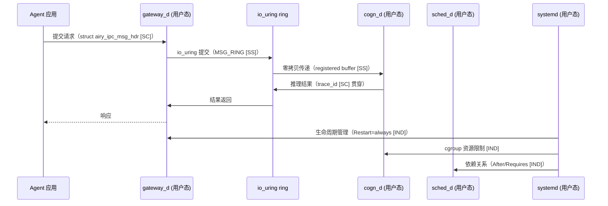
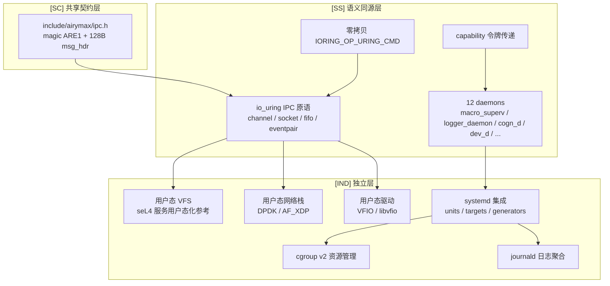

Copyright (c) 2025-2026 SPHARX Ltd. All Rights Reserved.

# agentrt-linux 服务设计文档

> **文档定位**：agentrt-linux 服务设计文档（Airymax Services 极境服务）\
> **文档版本**：v1.1 2026-07-07\
> **上级文档**：[agentrt-linux 设计文档](README.md)\
> **核心约束**：IRON-9 v2 同源且部分代码共享——与 agentrt 用户态 daemons 通过 \[SC] 共享契约层 + \[SS] 语义同源层协作，\[IND] 用户态 VFS/网络栈/驱动框架/systemd 集成实现独立\
> **子仓编号**：02\
> **子仓代号**：极境服务（Airymax Services）\
> **设计基准**：用户态系统服务 + 消息传递通信 + systemd 集成 + io\_uring 零拷贝 IPC\
> **同源 agentrt**：daemons（12 daemons）\
> **横切关注点**：服务是横切关注点（cross-cutting concern），贯穿调度（daemon 生命周期）、IPC（io\_uring 通道）、eBPF（服务观测）、记忆卷载（VFS 持久化）4 大数据流

***

## 目录

- [1. 子仓职责](#1-子仓职责)
- [2. 同源关系（IRON-9 v2 三层共享模型）](#2-同源关系iron-9-v2-三层共享模型)
- [3. 目录结构](#3-目录结构)
- [4. 核心特性](#4-核心特性)
- [5. 微内核思想体现](#5-微内核思想体现)
- [6. IRON-9 v2 三层共享模型落地](#6-iron-9-v2-三层共享模型落地)
- [7. agentrt-linux 工程基线](#7-agentrt-linux-工程基线)
- [8. 前沿理论参考](#8-前沿理论参考)
- [9. 与其他子仓的协作](#9-与其他子仓的协作)
- [10. 里程碑（M0-M8）](#10-里程碑m0-m8)
- [11. agentrt 一致性检查](#11-agentrt-一致性检查)
- [12. 相关文档](#12-相关文档)
- [13. 参考](#13-参考)

***

## 1. 子仓职责

`services` 是 agentrt-linux（AirymaxOS）的用户态系统服务子仓，承担以下核心职责：

1. **用户态 VFS \[IND]**：文件系统实现下放至用户态服务，内核仅保留虚拟文件系统层。
2. **用户态网络栈 \[IND]**：基于 DPDK/AF\_XDP 实现高性能用户态网络协议栈。
3. **用户态驱动框架 \[IND]**：基于 VFIO/libvfio 将设备驱动下放至用户态进程。
4. **12 daemons 集成 \[SS]**：将 agentrt 的 12 个核心守护进程注册为 OS 级守护服务，与 systemd 集成。daemon 语义与 agentrt 同源。
5. **消息传递通信 \[SS]**：基于 io\_uring 构建零拷贝、零 syscall 的消息传递基础设施。IPC 消息头与操作码 \[SC] 与 agentrt 共享。

### 1.1 横切关注点声明

服务是横切关注点（cross-cutting concern），贯穿 agentrt-linux 全部 4 大数据流：

| 数据流      | 服务切入点                                   | 同源标注   |
| -------- | --------------------------------------- | ------ |
| 调度数据流    | daemon 生命周期管理（systemd unit + cgroup）    | \[IND] |
| IPC 数据流  | io\_uring 零拷贝通道 + 128B 消息头              | \[SC]  |
| eBPF 数据流 | daemon 观测（uprobe/tracepoint + journald） | \[SS]  |
| 记忆卷载数据流  | VFS 持久化层 + daemon 状态快照                  | \[IND] |

***

## 2. 同源关系（IRON-9 v2 三层共享模型）

依据 IRON-9 v2 决策，agentrt（用户态 daemons）与 agentrt-linux（用户态 services）通过三层共享模型协作：

| 层次               | 共享程度                               | 服务子系统内容                                                                                                                                                                                                                                    | 组织方式                                 |
| ---------------- | ---------------------------------- | ------------------------------------------------------------------------------------------------------------------------------------------------------------------------------------------------------------------------------------------ | ------------------------------------ |
| **\[SC] 共享契约层**  | 完全共享代码                             | IPC 消息头（magic 0x41524531 'ARE1'）、128B 消息头结构（`struct airy_ipc_msg_hdr`）、SQE/CQE 操作码与标志位、ring 创建/注册参数                                                                                                                                        | `include/airymax/ipc.h`（与 kernel 共享） |
| **\[SS] 语义同源层**  | 高层 API 语义同源（概念操作一致），签名因抽象层级不同而独立演进 | 12 daemons 语义（macro\_superv/logger\_daemon/config\_daemon/gateway\_d/sched\_d/vfs\_d/net\_d/mem\_d/cogn\_d/sec\_d/audit\_d/dev\_d）、io\_uring IPC 通信原语（channel/socket/fifo/eventpair）、消息传递范式、capability 令牌传递语义、daemon 生命周期（init→run→stop）等 20 项 | 各自独立实现                               |
| **\[IND] 完全独立层** | 完全独立                               | 用户态 VFS 实现（seL4 服务用户态化参考，ADR-014）、用户态网络栈（DPDK/AF\_XDP）、用户态驱动框架（VFIO/libvfio）、systemd 集成、cgroup v2 资源管理、journald 日志聚合、具体文件系统实现（ext4/xfs/tmpfs/btrfs）                                                                                        | 各自独立仓库                               |

### 2.1 维度对比

| 维度        | agentrt（daemons）                | agentrt-linux（services）         | 同源标注   |
| --------- | ------------------------------- | ------------------------------- | ------ |
| 服务数量      | 12 daemons                      | 12 daemons + VFS/Net/Drivers    | \[SS]  |
| daemon 语义 | macro\_superv/logger\_daemon/...   | macro\_superv/logger\_daemon/...   | \[SS]  |
| IPC 消息头   | `struct airy_ipc_msg_hdr`（128B） | `struct airy_ipc_msg_hdr`（128B） | \[SC]  |
| IPC magic | 0x41524531 'ARE1'               | 0x41524531 'ARE1'               | \[SC]  |
| 通信方式      | 进程间消息队列                         | io\_uring 零拷贝 IPC               | \[SS]  |
| 通信原语      | 用户态 channel/socket/fifo         | io\_uring channel/socket/fifo   | \[SS]  |
| 服务管理      | 自研 supervisor                   | systemd 集成（agentrt-linux 标准）    | \[IND] |
| 部署形态      | 用户态进程                           | systemd unit + capability       | \[IND] |
| 跨平台       | Linux/macOS/Windows             | Linux 6.6 专属                    | \[IND] |

### 2.2 同源传承要点

- 保留 agentrt 的 12 daemons 语义（macro\_superv/logger\_daemon/config\_daemon/gateway\_d/sched\_d/vfs\_d/net\_d/mem\_d/cogn\_d/sec\_d/audit\_d/dev\_d 等）\[SS]。
- 保留 agentrt 的"消息传递"通信范式（升级为 io\_uring 零拷贝实现）\[SS]。
- 保留 agentrt 的 capability 令牌传递语义（升级为内核态强制）\[SS]。
- IPC 消息头与操作码 \[SC] 共享，确保两端通信协议一致。
- 升级为 OS 级 systemd 服务，获得生命周期管理 + 资源限制 + 日志聚合 \[IND]。

***

## 3. 目录结构

```
services/
├── vfs/                   # 用户态 VFS [IND]
├── net/                   # 用户态网络栈（DPDK/AF_XDP）[IND]
├── drivers/               # 用户态驱动框架（VFIO/libvfio）[IND]
├── daemons/               # 12 daemons 集成（USV 统一生命周期）[SS]
│   ├── macro_superv/        # USV：Macro-Supervisor
│   ├── logger_daemon/       # ULPS：Logger Daemon
│   ├── config_daemon/       # UCF：配置管理守护
│   ├── gateway_d/           # 网关守护
│   ├── sched_d/             # 调度守护
│   ├── vfs_d/               # VFS 用户态服务
│   ├── net_d/               # 网络策略守护
│   ├── mem_d/               # 记忆管理守护
│   ├── cogn_d/              # 认知调度守护
│   ├── sec_d/               # 安全策略守护
│   ├── audit_d/             # 审计守护
│   └── dev_d/               # 设备驱动守护
├── systemd/               # systemd 集成（agentrt-linux 标准）[IND]
├── ipc/                   # 消息传递通信（基于 io_uring）[SS]
└── docs/
```

### 3.1 vfs/（用户态 VFS）\[IND]

参考 **seL4 服务用户态化模型**（ADR-014）：

- `vfs-service`：虚拟文件系统服务，处理路径解析、挂载管理 \[IND]。
- `fs-providers/`：具体文件系统实现（ext4、xfs、tmpfs、btrfs 等）作为独立服务 \[IND]。
- `io-channel`：基于 io\_uring channel 的文件操作协议 \[IND]。
- `vnode`：虚拟节点抽象，跨服务引用 \[IND]。

### 3.2 net/（用户态网络栈）\[IND]

- `dpdk/`：基于 DPDK 的高性能用户态网络栈 \[IND]。
- `af_xdp/`：基于 AF\_XDP 的零拷贝网络路径 \[IND]。
- `tcp-stack/`：用户态 TCP/IP 协议栈 \[IND]。
- `dns/`：用户态 DNS 解析器 \[IND]。
- `dhcp/`：用户态 DHCP 客户端 \[IND]。

### 3.3 drivers/（用户态驱动框架）\[IND]

基于 **VFIO/libvfio**：

- `libvfio/`：用户态驱动框架库 \[IND]。
- `pci-drivers/`：PCI 设备用户态驱动 \[IND]。
- `usb-drivers/`：USB 设备用户态驱动 \[IND]。
- `gpu-drivers/`：GPU 用户态驱动（与 `cognition/gpu-npu` 协作）\[IND]。
- `block-drivers/`：块设备用户态驱动 \[IND]。

### 3.4 daemons/（12 daemons）\[SS]

每个 daemon 均注册为 systemd 服务（`.service` unit），具备：

- capability 令牌（与 `security/capability` 协作）\[SS]。
- io\_uring IPC 通道（与其他 daemon 通信，消息头 \[SC] 共享）\[SS]。
- 资源限制（cgroup v2）\[IND]。
- 日志输出（journald 集成）\[IND]。

**12 daemons 清单**（统一归属 `services/daemons/`，USV 统一生命周期 \[SS]）：

| 序号 | daemon           | 职责              | 同源标注  |
| -- | ---------------- | --------------- | ----- |
| 1  | `macro_superv`   | 主监管守护进程（USV）    | \[SS] |
| 2  | `logger_daemon`  | 日志消费守护进程（ULPS）  | \[SS] |
| 3  | `config_daemon`  | 配置管理守护进程（UCF）   | \[SS] |
| 4  | `gateway_d`      | 网关守护进程           | \[SS] |
| 5  | `sched_d`        | 调度守护进程           | \[SS] |
| 6  | `vfs_d`          | VFS 用户态服务守护进程    | \[SS] |
| 7  | `net_d`          | 网络策略守护进程         | \[SS] |
| 8  | `mem_d`          | 记忆管理守护进程         | \[SS] |
| 9  | `cogn_d`         | 认知调度守护进程         | \[SS] |
| 10 | `sec_d`          | 安全策略守护进程         | \[SS] |
| 11 | `audit_d`        | 审计守护进程           | \[SS] |
| 12 | `dev_d`          | 设备驱动守护进程         | \[SS] |

### 3.5 systemd/（systemd 集成）\[IND]

遵循 **agentrt-linux 基础系统治理组** 标准：

- `units/`：systemd unit 文件目录 \[IND]。
- `targets/`：systemd target 定义（airymaxos.target 等）\[IND]。
- `generators/`：systemd generator（动态生成 unit）\[IND]。
- `analyze/`：systemd-analyze 性能分析配置 \[IND]。

### 3.6 ipc/（消息传递通信）\[SS]

基于 **io\_uring** 零拷贝 IPC，IPC 消息头 \[SC] 与 agentrt 共享：

- `io-uring-ipc`：核心 IPC 库 \[SS]。
- `channel`：双向通道抽象（参考 seL4 Endpoint）\[SS]。
- `socket`：面向连接的 socket 抽象（参考 seL4 Endpoint）\[SS]。
- `fifo`：单向 FIFO 抽象（参考 seL4 Notification）\[SS]。
- `eventpair`：事件同步原语（参考 seL4 Notification）\[SS]。

***

## 4. 核心特性

### 4.1 VFS 用户态化（参考 seL4 服务用户态化，ADR-014）\[IND]

**架构**：

- 内核保留虚拟文件系统层（VFS layer），仅负责路径解析、inode 缓存 \[IND]。
- 具体文件系统实现（ext4、xfs、tmpfs）作为独立用户态服务运行 \[IND]。
- 文件操作通过 io\_uring channel 在 VFS 服务与 FS 服务之间传递 \[SS]。

**优势**：

- 文件系统 bug 不会导致内核 panic \[IND]。
- 可独立重启文件系统服务 \[IND]。
- 支持热加载新文件系统 \[IND]。

### 4.2 网络栈用户态化（DPDK/AF\_XDP）\[IND]

**架构**：

- DPDK 模式：完全绕过内核，直接在用户态轮询网卡 \[IND]。
- AF\_XDP 模式：通过 XDP 程序将数据包重定向至用户态 socket \[IND]。
- 用户态 TCP/IP 协议栈 \[IND]。

**优势**：

- 高性能：单核可处理 100+ Gbps 流量 \[IND]。
- 可演进：协议栈可独立升级 \[IND]。
- 隔离性：协议栈漏洞不影响内核 \[IND]。

### 4.3 驱动框架用户态化（VFIO/libvfio）\[IND]

**架构**：

- 通过 VFIO 框架将 PCIe 设备 DMA 直通至用户态进程 \[IND]。
- 用户态驱动通过映射设备 MMIO 寄存器与 DMA 缓冲区操作设备 \[IND]。
- 中断处理通过 eventfd 传递至用户态 \[IND]。

**优势**：

- 驱动 bug 不影响内核 \[IND]。
- 可用 Rust 编写安全驱动（与 `kernel/patches/rust-drivers` 协作）\[IND]。
- 可独立重启驱动服务 \[IND]。

### 4.4 12 daemons 注册为 OS 级守护服务 \[SS]

将 agentrt 的 12 个核心守护进程注册为 systemd 服务，daemon 语义 \[SS] 与 agentrt 同源，获得：

- 生命周期管理（启动、停止、重启）\[IND]。
- 依赖关系管理（After/Requires）\[IND]。
- 资源限制（cgroup v2）\[IND]。
- 日志聚合（journald）\[IND]。
- 崩溃自动重启（Restart=always）\[IND]。

**systemd unit 示例**（gateway\_d）：

```ini
[Unit]
Description=agentrt-linux Gateway Daemon
After=network.target airymaxos-ipc.target
Requires=airymaxos-ipc.target

[Service]
Type=notify
ExecStart=/usr/lib/airymaxos/daemons/gateway_d
CapabilityBoundingSet=CAP_NET_BIND_SERVICE CAP_DAC_OVERRIDE
Restart=always
RestartSec=1s
Slice=agent.slice

[Install]
WantedBy=airymaxos.target
```

### 4.5 消息传递通信（基于 io\_uring 零拷贝）\[SS]

**通信原语**（参考 seL4 Endpoint/Notification，ADR-014，语义 \[SS] 同源 agentrt）：

| 原语        | 语义      | 用途      | 同源标注  |
| --------- | ------- | ------- | ----- |
| Channel   | 双向、面向消息 | RPC 调用  | \[SS] |
| Socket    | 双向、面向流  | 流式数据传输  | \[SS] |
| FIFO      | 单向、面向消息 | 高吞吐单向通信 | \[SS] |
| Eventpair | 事件同步    | 跨进程信号量  | \[SS] |

**IPC 消息头** \[SC]（`include/airymax/ipc.h`，与 agentrt 共享）：

```c
/* IPC 128B 消息头定义见 [SC] 共享契约层（SSoT），不就地重定义 */
#include <airymax/ipc.h>
/* 结构体名称：struct airy_ipc_msg_hdr（Layout C，物理宿主见
 * 50-engineering-standards/120-cross-project-code-sharing.md §Layout C） */
```

> **SSoT 声明**：本节 IPC 128B 消息头不再就地定义，以 `include/airymax/ipc.h`（物理宿主见 `50-engineering-standards/120-cross-project-code-sharing.md` §Layout C）为单一数据源。结构体名称为 `struct airy_ipc_msg_hdr`，使用 `__attribute__((packed))` 对齐与 `__u32`/`__u16`/`__u64`/`__u8` UAPI 类型。

**零拷贝路径** \[SS]：

- 发送方注册 page 为 io\_uring buffer \[SS]。
- 接收方通过 `IORING_OP_IPC_RECV` 接收 page 引用 \[SS]。
- 内核仅翻转 page table entry，不拷贝数据 \[SS]。

***

## 5. 微内核思想体现

### 5.1 服务用户态化 \[IND]

遵循 **seL4** 服务用户态化原则（ADR-014）：

- 所有系统服务（VFS、网络、驱动）均运行在用户态 \[IND]。
- 服务通过消息传递通信 \[SS]。
- 服务崩溃可被监督进程重启 \[IND]。

### 5.2 消息传递通信 \[SS]

遵循 **seL4 消息传递** 模型（Endpoint/Notification，ADR-014）：

- 进程间通信通过内核仲裁的消息传递 \[SS]。
- 消息携带 capability 令牌 \[SS]。
- 零拷贝通过 IORING_OP_URING_CMD + registered buffer 实现 \[SS]。

### 5.3 服务隔离 \[IND]

每个服务运行在独立地址空间：

- 进程级隔离（MMU）\[IND]。
- capability 限制（最小权限）\[SS]。
- seccomp 过滤（系统调用白名单）\[IND]。
- Landlock 沙箱（文件访问控制）\[SS]。

***

## 6. IRON-9 v2 三层共享模型落地

### 6.1 \[SC] 共享契约层——`include/airymax/ipc.h`

服务模块的 \[SC] 层通过 `include/airymax/ipc.h` 与 agentrt 共享（与 kernel 共享同一头文件）：

| 内容                                                         | 说明                                                                                                                |
| ---------------------------------------------------------- | ----------------------------------------------------------------------------------------------------------------- |
| `AIRY_IPC_MAGIC`（0x41524531 'ARE1'）                        | IPC 消息头 magic（同源 agentrt）                                                                                         |
| `AIRY_IPC_HDR_SZ`（128）                                     | 128B 消息头大小                                                                                                        |
| `AIRY_IPC_RING_DEF/MAX_ENTRIES`（256/32768）                 | ring 默认/最大条目数                                                                                                     |
| `AIRY_IPC_OP_*` 宏（SEND/RECV/SEND\_BATCH/CANCEL）            | SQE 操作码                                                                                                           |
| `AIRY_IPC_SQE_*` 宏（FIXED\_BUF/ASYNC/BUF\_SELECT/SKIP\_CQE） | SQE 标志位                                                                                                           |
| `AIRY_IPC_CQE_F_*` 宏（BUFFER/MORE/NOTIF）                    | CQE 标志位                                                                                                           |
| `struct airy_ipc_msg_hdr` 结构                               | 128B 消息头（magic/opcode/flags/trace\_id/timestamp\_ns/src\_task/dst\_task/payload\_len/reserved\[84]，Layout C SSoT） |

### 6.2 \[SS] 语义同源层——20 项 API 映射

高层 API 语义同源（概念操作一致），签名因抽象层级不同而独立演进。服务模块的同源 API：

**6.2.1 12 daemons 语义同源（12 项）**

| 序号 | daemon      | 职责         | agentrt 实现 | agentrt-linux 实现          |
| -- | ----------- | ---------- | ---------- | ------------------------- |
| 1  | `macro_superv`  | 主监管守护进程     | 用户态进程      | systemd unit + capability |
| 2  | `logger_daemon` | 日志消费守护进程    | 用户态进程      | systemd unit + capability |
| 3  | `config_daemon` | 配置管理守护进程    | 用户态进程      | systemd unit + capability |
| 4  | `gateway_d`     | 网关守护进程      | 用户态进程      | systemd unit + capability |
| 5  | `sched_d`       | 调度守护进程      | 用户态进程      | systemd unit + capability |
| 6  | `vfs_d`         | VFS 用户态服务守护进程 | 用户态进程      | systemd unit + capability |
| 7  | `net_d`         | 网络策略守护进程     | 用户态进程      | systemd unit + capability |
| 8  | `mem_d`         | 记忆管理守护进程     | 用户态进程      | systemd unit + capability |
| 9  | `cogn_d`        | 认知调度守护进程     | 用户态进程      | systemd unit + capability |
| 10 | `sec_d`         | 安全策略守护进程     | 用户态进程      | systemd unit + capability |
| 11 | `audit_d`       | 审计守护进程       | 用户态进程      | systemd unit + capability |
| 12 | `dev_d`         | 设备驱动守护进程     | 用户态进程      | systemd unit + capability |

**6.2.2 io\_uring IPC 通信原语同源（8 项）**

| 序号 | 原语                | 语义              | agentrt 实现     | agentrt-linux 实现              |
| -- | ----------------- | --------------- | -------------- | ----------------------------- |
| 1  | Channel           | 双向面向消息          | 用户态消息队列        | io\_uring ring + MSG\_RING    |
| 2  | Socket            | 双向面向流           | 用户态流传输         | io\_uring SEND/RECV           |
| 3  | FIFO              | 单向面向消息          | 用户态 FIFO       | io\_uring ring 单向             |
| 4  | Eventpair         | 事件同步            | 用户态 eventfd    | io\_uring + eventfd           |
| 5  | capability 令牌传递   | 消息携带 capability | 用户态 capability | 内核态 capability \[SS]          |
| 6  | 零拷贝 IORING_OP_URING_CMD | page 引用传递       | 用户态 mmap       | io\_uring registered buffer   |
| 7  | trace\_id 贯穿      | 链路追踪            | user\_data 字段  | io\_uring user\_data 字段 \[SC] |
| 8  | daemon 生命周期       | init→run→stop   | 自研 supervisor  | systemd unit lifecycle        |

### 6.3 \[IND] 完全独立层——10 项独立实现

| 序号 | 内容                             | 不共享原因                               |
| -- | ------------------------------ | ----------------------------------- |
| 1  | 用户态 VFS 实现                     | seL4 服务用户态化参考（ADR-014），AirymaxOS 专属 |
| 2  | 用户态网络栈（DPDK/AF\_XDP）           | 内核旁路网络仅 agentrt-linux               |
| 3  | 用户态驱动框架（VFIO/libvfio）          | 设备驱动用户态化仅 agentrt-linux             |
| 4  | systemd 集成                     | OS 级服务管理仅 agentrt-linux             |
| 5  | cgroup v2 资源管理                 | 内核 cgroup 仅 agentrt-linux           |
| 6  | journald 日志聚合                  | OS 级日志系统仅 agentrt-linux             |
| 7  | 具体文件系统实现（ext4/xfs/tmpfs/btrfs） | 文件系统驱动仅 agentrt-linux               |
| 8  | systemd unit 文件                | 服务配置仅 agentrt-linux                 |
| 9  | systemd target/generator       | 系统启动管理仅 agentrt-linux               |
| 10 | seccomp 过滤器                    | 内核系统调用过滤仅 agentrt-linux             |

### 6.4 跨态协作流



### 6.5 组件架构图



***

## 7. agentrt-linux 工程基线

- **agentrt-linux 基础系统治理组**：systemd、基础系统服务最佳实践 \[IND]。
- **agentrt-linux 网络子系统**：用户态网络栈基线 \[IND]。
- **agentrt-linux 驱动框架**：用户态驱动框架基线 \[IND]。
- **agentrt-linux 服务管理**：systemd unit 规范 \[IND]。

### 7.1 五维正交 24 原则映射

| 原则            | 在本模块的体现                                      |
| ------------- | -------------------------------------------- |
| **K-1 微内核化**  | VFS/网络/驱动用户态化，服务隔离                           |
| **K-3 服务隔离**  | 每个服务独立地址空间 + capability + seccomp + Landlock |
| **S-1 反馈闭环**  | systemd Restart=always + journald 日志反馈       |
| **C-1 双系统协同** | io\_uring 零拷贝 + 用户态服务协同                      |
| **E-2 可观测性**  | journald + uprobe/tracepoint + logger\_daemon    |
| **A-1 极简主义**  | 服务最小权限 + capability 令牌                       |

***

## 8. 前沿理论参考

| 理论                         | 来源          | 应用                 | 同源标注   |
| -------------------------- | ----------- | ------------------ | ------ |
| seL4 Endpoint/Notification | seL4        | io\_uring IPC 通信原语 | \[SS]  |
| seL4 服务用户态化                | seL4        | 服务用户态化原则           | \[IND] |
| DPDK                       | Intel       | 用户态网络数据路径          | \[IND] |
| AF\_XDP                    | Linux       | 零拷贝网络              | \[IND] |
| VFIO/libvfio               | Linux       | 用户态驱动框架            | \[IND] |
| io\_uring zero-copy        | Linux 5.x+  | 零拷贝 IPC            | \[SS]  |
| systemd                    | freedesktop | OS 级服务管理           | \[IND] |
| capability-based security  | seL4        | 服务权限控制（ADR-014）    | \[SS]  |

***

## 9. 与其他子仓的协作

| 协作子仓          | 协作内容                       | 同源标注   |
| ------------- | -------------------------- | ------ |
| `kernel`      | 提供 VFS/网络/驱动用户态服务所需的内核侧接口  | \[IND] |
| `security`    | 为每个服务颁发 capability 令牌      | \[SS]  |
| `memory`      | 提供 VFS 持久化层、MemoryRovol 卷载 | \[IND] |
| `cognition`   | cogn\_d/sched\_d 与认知循环协作    | \[SS]  |
| `cloudnative` | gateway\_d/sdk 与 K8s 集成    | \[IND] |
| `system`      | systemd unit 管理、配置工具       | \[IND] |
| `tests-linux` | 服务集成测试、Soak Test           | \[SS]  |

***

## 10. 里程碑（M0-M8）

| 阶段 | 目标                     | 时间      | 同源标注   |
| -- | ---------------------- | ------- | ------ |
| M0 | 文档体系完成（本模块设计文档）        | 2026-07 | —      |
| M1 | io\_uring IPC 库 + 通信原语 | 2026 Q3 | \[SS]  |
| M2 | 12 daemons systemd 集成  | 2026 Q4 | \[SS]  |
| M3 | 用户态 VFS（Phase 1）       | 2027 Q1 | \[IND] |
| M4 | 用户态网络栈（AF\_XDP）        | 2027 Q2 | \[IND] |
| M5 | 用户态驱动框架（VFIO）          | 2027 Q3 | \[IND] |
| M6 | 全部服务用户态化完成             | 2027 Q4 | \[IND] |
| M7 | 高可用 + 故障恢复             | 2028 Q1 | \[IND] |
| M8 | 生产就绪 + 性能调优            | 2028 Q2 | \[IND] |

### 10.1 0.1.1 版本范围

仅完成 M0（文档体系完成）+ M1（\[SC] 共享契约层头文件占位）。不含内核/OS 代码实施。

### 10.2 1.0.1 版本范围

完成 M2-M8 全部里程碑，并实施服务工程标准。

***

## 11. agentrt 一致性检查

### 11.1 命名一致性

| 维度            | agentrt                         | agentrt-linux services          | 一致性        |
| ------------- | ------------------------------- | ------------------------------- | ---------- |
| daemon 名称     | macro\_superv/logger\_daemon/...   | macro\_superv/logger\_daemon/...   | \[SS] 同源语义 |
| IPC magic     | 0x41524531 'ARE1'               | 0x41524531 'ARE1'               | \[SC] 共享契约 |
| IPC 消息头       | `struct airy_ipc_msg_hdr`（128B） | `struct airy_ipc_msg_hdr`（128B） | \[SC] 共享契约 |
| 通信原语          | channel/socket/fifo/eventpair   | channel/socket/fifo/eventpair   | \[SS] 同源语义 |
| capability 令牌 | 用户态 capability                  | 内核态 capability                  | \[SS] 同源语义 |

### 11.2 语义一致性

| 语义   | agentrt daemons | agentrt-linux services       | 一致                  |
| ---- | --------------- | ---------------------------- | ------------------- |
| 服务数量 | 12 daemons      | 12 daemons + VFS/Net/Drivers | \[SS] 同源 + 扩展       |
| 通信方式 | 进程间消息队列         | io\_uring 零拷贝 IPC            | \[SS] AirymaxOS 增强  |
| 零拷贝  | 用户态 mmap        | io\_uring registered buffer  | \[SS] AirymaxOS 加速  |
| 服务管理 | 自研 supervisor   | systemd 集成                   | \[IND] AirymaxOS 专属 |
| 部署形态 | 用户态进程           | systemd unit + capability    | \[IND] AirymaxOS 专属 |

### 11.3 IRON-9 v2 合规性

| IRON-9 v2 三层 | 本文档覆盖                                | 合规     |
| ------------ | ------------------------------------ | ------ |
| 共享契约层 \[SC]  | §6.1 `include/airymax/ipc.h` 完整定义    | <br /> |
| 语义同源层 \[SS]  | §6.2 12 daemons + 8 项 IPC 原语同源（20 项） | <br /> |
| 完全独立层 \[IND] | §6.3 10 项独立实现明确划分                    | <br /> |

***

## 12. 相关文档

### 12.1 开源设计文档

- [内核模块](01-kernel.md)：kernel 子仓（io\_uring + sched\_ext + eBPF）
- [安全模块](03-security.md)：security 子仓（Cupolas）
- [记忆模块](04-memory.md)：memory 子仓（MemoryRovol）
- [认知模块](05-cognition.md)：cognition 子仓（CoreLoopThree）
- [IPC 数据流](../40-dataflows/03-ipc-flow.md)：io\_uring IPC 数据流
- [IPC 协议接口](../30-interfaces/02-ipc-protocol.md)：AgentsIPC 协议
- [SDK API](../30-interfaces/03-sdk-api.md)：SDK 接口
- [IRON-9 v2 定义](../50-engineering-standards/README.md)：三层共享模型
- [合规检查清单](../50-engineering-standards/08-compliance-checklist.md)：STD-DOC-\* 规则

### 12.2 同系列模块文档

- [内核模块](01-kernel.md)：kernel 子仓
- [安全模块](03-security.md)：security 子仓（Cupolas）
- [记忆模块](04-memory.md)：memory 子仓（MemoryRovol）
- [认知模块](05-cognition.md)：cognition 子仓（CoreLoopThree）

***

## 13. 参考

- seL4 内核设计文档（Endpoint/Notification IPC、服务用户态化，ADR-014）
- DPDK 项目文档
- AF\_XDP 教程
- VFIO/libvfio 项目文档
- agentrt-linux 基础系统治理组文档
- systemd 官方文档
- agentrt daemons 设计文档
- io\_uring 设计文档（Documentation/io\_uring/）

***

> **文档结束** | agentrt-linux（AirymaxOS）服务设计文档 v1.1 | 2026-07-07

