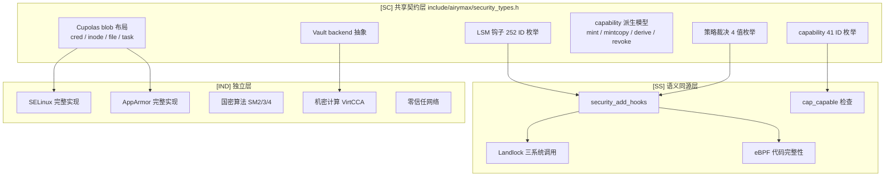
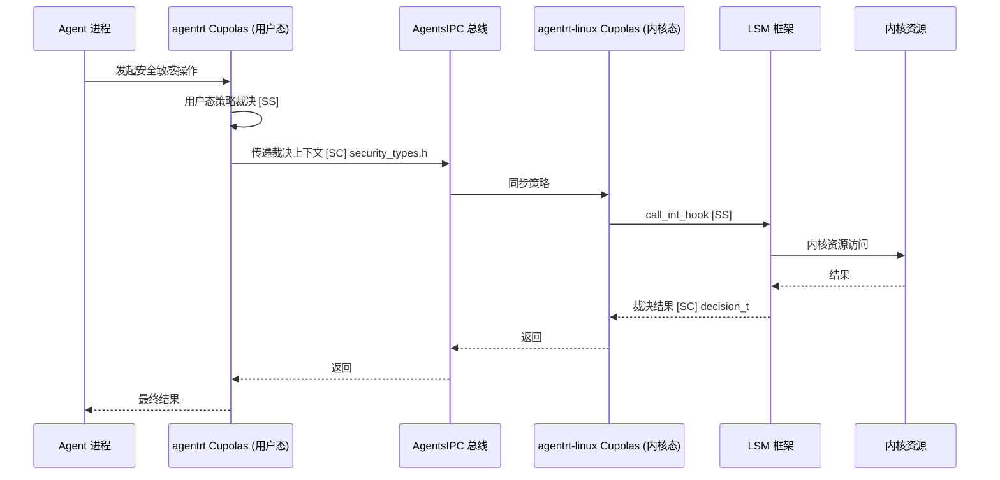

Copyright (c) 2025-2026 SPHARX Ltd. All Rights Reserved.

# agentrt-linux 安全设计文档

> **文档定位**：agentrt-linux（AirymaxOS）安全设计文档（security，极境安全）\
> **文档版本**：v1.1（2026-07-07）\
> **上级文档**：[agentrt-linux 设计文档](README.md)\
> **核心约束**：IRON-9 v2 同源且部分代码共享——与 agentrt 用户态 cupolas 通过 \[SC] 共享契约层 + \[SS] 语义同源层协作，\[IND] 内核态 LSM/Landlock/capability 实现独立\
> **子仓编号**：03\
> **子仓代号**：极境安全（Airymax Security）\
> **设计基准**：capability 安全 + LSM 框架 + Landlock 沙箱 + 机密计算\
> **同源 agentrt**：cupolas（Cupolas 安全穹顶）\
> **横切关注点**：安全是横切关注点（cross-cutting concern），贯穿调度、IPC、eBPF、记忆卷载 4 大数据流，不作为独立数据流

***

## 目录

- [1. 子仓职责](#1-子仓职责)
- [2. 同源关系（IRON-9 v2 三层共享模型）](#2-同源关系iron-9-v2-三层共享模型)
- [3. 目录结构](#3-目录结构)
- [4. 核心特性](#4-核心特性)
- [5. 微内核思想体现](#5-微内核思想体现)
- [6. IRON-9 v2 三层共享模型落地](#6-iron-9-v2-三层共享模型落地)
- [7. agentrt-linux 工程基线](#7-agentrt-linux-工程基线)
- [8. 前沿理论参考](#8-前沿理论参考)
- [9. 与其他子仓的协作](#9-与其他子仓的协作)
- [10. 里程碑（M0-M8）](#10-里程碑m0-m8)
- [11. agentrt 一致性检查](#11-agentrt-一致性检查)
- [12. 相关文档](#12-相关文档)
- [13. 参考](#13-参考)

***

## 1. 子仓职责

`security` 是 agentrt-linux（AirymaxOS）的安全子仓，承担以下核心职责：

1. **capability 系统 \[SC]**：基于 seL4 风格的不可伪造令牌实现最小权限访问控制，capability ID 枚举与派生模型与 agentrt 共享。
2. **LSM Hook \[SS]**：agent\_lsm 提供 Linux Security Module 钩子，调度机制与 agentrt cupolas 语义同源。
3. **沙箱隔离 \[SS]**：Landlock + seccomp 构建用户态沙箱，三系统调用语义与 agentrt 同源。
4. **机密计算 \[IND]**：支持 TEE/SGX/SEV-SNP/TDX/CCA 等可信执行环境，Vault backend 抽象 \[SC] 与 agentrt 共享。
5. **国密算法 \[IND]**：遵循 agentrt-linux 标准集成 SM2/SM3/SM4 国密算法。
6. **零信任网络 \[IND]**：基于身份的零信任网络架构。
7. **eBPF kfunc + dynamic pointer \[SS]**：利用 Linux 6.6 原生特性对 eBPF 程序进行签名验证。

### 1.1 横切关注点声明

安全**不是独立数据流**，而是横切关注点（cross-cutting concern），贯穿 agentrt-linux 全部 4 大数据流：

| 数据流      | 安全切入点                                      | 同源标注   |
| -------- | ------------------------------------------ | ------ |
| 调度数据流    | task\_create/task\_kill 钩子 + capability 检查 | \[SS]  |
| IPC 数据流  | binder/ipc 钩子 + 消息端点 capability 校验         | \[SS]  |
| eBPF 数据流 | eBPF 程序签名验证 + BPF\_LSM 钩子                  | \[SS]  |
| 记忆卷载数据流  | memory 加密 + TEE 保护 + memcg 隔离              | \[IND] |

***

## 2. 同源关系（IRON-9 v2 三层共享模型）

依据 IRON-9 v2 决策，agentrt（用户态 cupolas）与 agentrt-linux（内核态 security）通过三层共享模型协作：

| 层次               | 共享程度                               | 安全子系统内容                                                                                                                                                           | 组织方式                               |
| ---------------- | ---------------------------------- | ----------------------------------------------------------------------------------------------------------------------------------------------------------------- | ---------------------------------- |
| **\[SC] 共享契约层**  | 完全共享代码                             | POSIX capability 41 个 ID 枚举、LSM 钩子 252 个 ID 枚举、Cupolas blob 结构布局（cred/inode/file/task）、capability 派生模型（mint/mintcopy/derive/revoke）、Vault backend 抽象、策略裁决结果 4 值枚举 | `include/airymax/security_types.h` |
| **\[SS] 语义同源层**  | 高层 API 语义同源（概念操作一致），签名因抽象层级不同而独立演进 | `security_add_hooks()`、`call_int_hook` 短路、`DEFINE_LSM(cupolas)`、Landlock 三系统调用、`cap_capable()`、`security_file_open()` 等 17 项                                      | 各自独立实现                             |
| **\[IND] 完全独立层** | 完全独立                               | SELinux 完整实现、AppArmor 完整实现、Smack、TOMOYO、IMA digest list、IMA VirtCCA、IMA 策略 DB、EVM xattr 签名、内核 ABI 预留机制                                                            | 各自独立仓库                             |

### 2.1 维度对比

| 维度  | agentrt（cupolas） | agentrt-linux（security）                      | 同源标注   |
| --- | ---------------- | -------------------------------------------- | ------ |
| LSM | Cupolas 用户态策略注入  | agent\_lsm 内核态钩子注册                           | \[SS]  |
| 沙箱  | 进程沙箱（用户态）        | Landlock + seccomp + capability（内核态强制）       | \[SS]  |
| 加密  | 应用层加密            | 国密 + TEE 机密计算                                | \[IND] |
| 权限  | 应用权限模型           | capability 令牌系统（seL4 风格）                     | \[SC]  |
| 完整性 | 应用级签名            | IMA/EVM + 模块签名                               | \[IND] |
| 密钥环 | 应用级密钥库           | 4 层可信密钥环（builtin/secondary/machine/platform） | \[IND] |

### 2.2 同源传承要点

- 保留 agentrt Cupolas 的"LSM hook 风格"安全策略注入 \[SS]。
- 保留 Cupolas 的"声明式安全策略"配置范式 \[SS]。
- 升级为 OS 级 capability 系统（seL4 风格）\[SC]——capability ID 与派生模型两端共享。
- 新增内核态 LSM 框架承重 \[SS]——`security_hook_heads` 252 钩子 + `lsm_blob_sizes` 扁平 blob。
- 新增 Landlock 用户态沙箱 \[SS]——非特权进程自限制 + 域不可逆叠加。
- 新增机密计算 Vault backend 抽象 \[SC]——TPM/SGX/SEV-SNP/TDX/CCA 后端可插拔。

***

## 3. 目录结构

```
security/
├── capability/             # capability 系统（seL4 风格）[SC]
├── lsm/                    # agent_lsm（LSM hook）[SS]
├── sandbox/               # Landlock + seccomp [SS]
├── confidential-compute/   # 机密计算（TEE/SGX/SEV-SNP/TDX/CCA）[IND]
├── crypto/                 # 国密算法（agentrt-linux 标准）[IND]
├── zero-trust/             # 零信任网络 [IND]
├── ebpf-verify/            # eBPF kfunc + dynamic pointer（6.6 原生）[SS]
└── docs/
```

### 3.1 capability/（capability 系统）\[SC]

参考 **seL4 capability** 设计，capability ID 枚举与派生模型通过 `include/airymax/security_types.h` 与 agentrt 共享：

- `cap-types`：capability 类型定义（CNode、Endpoint、Thread、Frame、IO、IRQ、ASID）。
- `cap-table`：capability 表（per-process 树状结构）。
- `cap-transfer`：跨进程 capability 传递（通过消息传递）。
- `cap-derive`：capability 派生（mint、mintcopy、derive）——派生模型 \[SC] 共享。
- `cap-revoke`：capability 撤销（递归撤销派生 capability）。

### 3.2 lsm/（agent\_lsm）\[SS]

与 Cupolas 同源的 LSM 实现，调度机制语义同源但实现独立：

- `agent_lsm.c`：LSM hook 注册（file\_ops、net\_ops、task\_ops、ipc\_ops）——`security_add_hooks()` \[SS]。
- `policy-engine`：声明式策略引擎（YAML/JSON 策略）。
- `policy-compiler`：策略编译器（编译为 BPF 程序）。
- `audit`：安全审计日志。

### 3.3 sandbox/（Landlock + seccomp）\[SS]

- `landlock-rules/`：Landlock 规则集（文件访问控制）——三系统调用 \[SS]。
- `seccomp-filters/`：seccomp BPF 过滤器（系统调用白名单）。
- `sandbox-runner`：沙箱启动器（创建 namespace + 应用规则）。
- `bubblewrap`：bubblewrap 集成（容器化沙箱）。

### 3.4 confidential-compute/（机密计算）\[IND]

支持多种 TEE 技术，Vault backend 抽象 \[SC] 与 agentrt 共享：

- `sgx/`：Intel SGX enclave 支持。
- `sev-snp/`：AMD SEV-SNP 虚拟机加密。
- `tdx/`：Intel TDX 信任域。
- `arm-cca/`：ARM CCA 机密计算架构。
- `attestation`：远程证明框架。
- `key-broker`：密钥代理服务（与 KBS 协作）。

### 3.5 crypto/（国密算法）\[IND]

遵循 **agentrt-linux 安全治理组** 标准：

- `sm2/`：SM2 椭圆曲线公钥密码算法。
- `sm3/`：SM3 密码杂凑算法。
- `sm4/`：SM4 分组密码算法。
- `sm9/`：SM9 标识密码算法。
- `tls-gm`：国密 TLS 协议支持。
- `openssl-provider`：OpenSSL provider 集成。

### 3.6 zero-trust/（零信任网络）\[IND]

- `identity`：身份认证服务（基于 capability）。
- `policy-engine`：零信任策略引擎（持续验证）。
- `micro-segmentation`：微分段网络隔离。
- `mtls`：双向 TLS 通信。
- `beyondcorp`：BeyondCorp 模型参考。

### 3.7 ebpf-verify/（eBPF kfunc + dynamic pointer）\[SS]

利用 **Linux 6.6** 原生特性：

- `signing`：eBPF 程序签名工具。
- `verification`：内核签名验证集成。
- `keyring`：签名密钥环管理。
- `policy`：仅允许已签名 eBPF 程序加载的策略。

#### 3.8 组件架构图



***

## 4. 核心特性

### 4.1 capability 系统（seL4 风格）\[SC]

**设计原则**：

- 不可伪造：capability 由内核生成，用户态无法伪造。
- 可传递：capability 可通过消息传递给其他进程。
- 可派生：capability 可派生子 capability（受限权限）——派生模型 \[SC] 共享。
- 可撤销：capability 可被递归撤销。

**capability 类型** \[SC]：

| 类型       | 权限             | 同源标注  |
| -------- | -------------- | ----- |
| CNode    | capability 表节点 | \[SC] |
| Endpoint | 消息端点（IPC）      | \[SC] |
| Thread   | 线程控制           | \[SC] |
| Frame    | 物理页映射          | \[SC] |
| IO       | I/O 端口访问       | \[SC] |
| IRQ      | 中断控制           | \[SC] |
| ASID     | 地址空间标识         | \[SC] |

**capability 派生模型** \[SC]（`include/airymax/security_types.h`）：

```c
typedef struct airy_capability {
    uint64_t cap_id;
    uint32_t cap_type;      /* CNode/Endpoint/Thread/Frame/IO/IRQ/ASID */
    uint32_t rights;        /* read/write/execute/grant/revoke */
    uint64_t parent_cap_id;
    uint64_t mint_depth;
    uint32_t mint_quota;
} airy_capability_t;

/**
 * cap_t — Capability 引用（句柄）类型 [SC]
 *
 * cap_t 是 capability 的轻量引用/句柄，用于 syscall 参数传递和 IPC 消息
 * 中的 capability 标识。它与 airy_capability_t 的关系类似于 seL4 中
 * seL4_CPtr 与 cte_t（capability table entry）的关系：
 *
 *   - cap_t：64-bit 整数句柄，标识 CNode 中某个 capability slot，
 *           轻量、可在用户态/内核态间零拷贝传递
 *   - airy_capability_t：完整的 capability 元数据结构体，存储在
 *                        CNode slot 中，包含类型/权限/派生链等信息
 *
 * syscall 入口通过 cap_t 查找对应 CNode slot，取出 airy_capability_t
 * 进行权限检查后执行操作。与 seL4 seL4_CPtr (= seL4_Word = uint64_t)
 * 的设计一致。
 */
typedef uint64_t cap_t;
```

**CNode + CSpace 派生树**（seL4 风格，Step 2.4 #1 补齐）：

seL4 capability 空间由 CNode 树构成——每个进程持有一个根 CNode，CNode 节点可指向子 CNode（形成树状 capability 空间 CSpace），也可指向具体 capability（Endpoint/Thread/Frame 等）。agentrt-linux 借鉴此模型实现进程级 capability 空间隔离：

| 概念     | seL4 原语                   | agentrt-linux 实现                                | 层次     |
| ------ | ------------------------- | ----------------------------------------------- | ------ |
| CNode  | capability 表节点（可嵌套）       | `airy_cnode`（radix-tree，slot 数 = 2^n）           | \[IND] |
| CSpace | 进程 capability 空间（CNode 树） | per-task `airy_cspace`（根 CNode 指针）              | \[IND] |
| MDB    | Mapping Database（全局派生关系）  | `airy_cap_mdb`（全局 radix-tree，parent→children 链） | \[IND] |
| slot   | CNode 中的 capability 槽位    | `airy_cap_slot`（cap\_id + cnode 偏移）             | \[SC]  |

**MDB 派生树**：每个 capability 的 `parent_cap_id` 字段记录父 capability，内核维护全局 MDB（Mapping Database）跟踪所有派生关系。撤销操作通过 MDB 递归遍历子树，确保所有派生 capability 同步失效——这是 seL4 `cap_revoke` 语义在 agentrt-linux 的落地。

```c
/* MDB 节点：capability 派生关系的全局追踪（[IND] 实现独立） */
struct airy_cap_mdb_node {
    uint64_t cap_id;            /* 本 capability ID */
    uint64_t parent_cap_id;     /* 父 capability ID（0 = 根） */
    struct list_head children;  /* 子 capability 链表 */
    struct list_head sibling;   /* 兄弟节点链表 */
    uint32_t mint_depth;        /* 派生深度（0 = 原始） */
};
```

**与 seL4 的差异**：seL4 的 CNode/MDB 实现完全在微内核中（形式化验证）；agentrt-linux 借鉴其设计思想，但实现基于 Linux radix-tree + RCU（性能优先，非形式化验证），属于 \[IND] 实现独立层。capability ID 枚举与派生模型（mint/mintcopy/derive/revoke）的语义在 \[SC] 层与 agentrt 共享。

### 4.2 agent\_lsm（LSM hook，Cupolas 同源）\[SS]

**LSM Hook 点**（252 个钩子 ID 枚举 \[SC]）：

- `file_open`、`file_permission`、`file_ioctl`
- `socket_bind`、`socket_connect`、`socket_accept`
- `task_create`、`task_kill`、`task_setpgid`
- `ipc_permission`、`msg_queue_msgctl`

**调度机制** \[SS]：

- `call_int_hook`：fail-fast first-deny 短路语义，任一钩子返回非零即终止。
- `call_void_hook`：遍历全部钩子，无短路。
- `DEFINE_LSM(cupolas)`：Cupolas 作为最后初始化的 LSM 注册，不打 `LSM_FLAG_EXCLUSIVE` 标记（穹顶叠加而非替代）。

**策略示例**（YAML）：

```yaml
policy: agent-default
version: v1
rules:
  - name: restrict-network
    selector:
      domain: untrusted.slice
    effect: deny
    operations:
      - socket_connect
      - socket_bind
  - name: allow-vfs-read
    selector:
      domain: agent.slice
    effect: allow
    operations:
      - file_open
    paths:
      - /var/lib/airymaxos/**
```

### 4.3 Landlock + seccomp（用户态沙箱）\[SS]

**Landlock** \[SS]：

- 文件路径访问控制（15 个正交访问位）。
- 网络绑定/连接控制（前向移植）。
- 进程间通信控制。
- 域不可逆叠加（`landlock_restrict_self` 后单调收紧）。

**Landlock 三系统调用** \[SS]：

- `landlock_create_ruleset()`：创建规则集（红黑树组织）。
- `landlock_add_rule()`：追加规则。
- `landlock_restrict_self()`：施加于自身（要求 `no_new_privs` 或 `CAP_SYS_ADMIN`）。

**seccomp**：

- 系统调用白名单/黑名单。
- 参数级过滤（BPF 过滤器）。

**组合使用**：

```c
// 创建沙箱
sandbox_create()
    -> landlock_restrict_paths(rules)
    -> seccomp_load(filter)
    -> execve(target);
```

### 4.4 机密计算（TEE/SGX/SEV-SNP/TDX/CCA）\[IND]

**支持的 TEE**（Vault backend 抽象 \[SC]）：

| 技术          | 厂商    | 粒度      | 同源标注   |
| ----------- | ----- | ------- | ------ |
| Intel SGX   | Intel | Enclave | \[IND] |
| Intel TDX   | Intel | VM      | \[IND] |
| AMD SEV-SNP | AMD   | VM      | \[IND] |
| ARM CCA     | ARM   | Realm   | \[IND] |

**Vault backend 抽象** \[SC]（`include/airymax/security_types.h`，借鉴 IMA ROT 抽象层）：

```c
typedef struct airy_vault_backend {
    const char *name;       /* tpm/sgx/sev-snp/tdx/cca */
    int (*init)(struct airy_vault_backend *self);
    int (*seal)(struct airy_vault_backend *self,
                const uint8_t *plaintext, size_t len,
                uint8_t *ciphertext, size_t *out_len);
    int (*unseal)(struct airy_vault_backend *self,
                  const uint8_t *ciphertext, size_t len,
                  uint8_t *plaintext, size_t *out_len);
    int (*attest)(struct airy_vault_backend *self,
                  const uint8_t *challenge, size_t len,
                  uint8_t *evidence, size_t *out_len);
} airy_vault_backend_t;
```

**应用场景**：

- LLM 推理保护（模型权重、推理数据）。
- 密钥管理（HSM 替代）。
- 隐私计算（联邦学习）。
- Agent 记忆加密（与 `memory` 协作）。

### 4.5 eBPF kfunc + dynamic pointer（6.6 原生特性）\[SS]

**特性**：

- Linux 6.6 引入 eBPF 程序签名验证机制。
- 仅允许已签名 eBPF 程序加载至内核。
- 防止恶意 eBPF 程序破坏内核安全。
- BPF\_LSM 通过 X-macro 模式为全部 252 个 LSM 钩子生成 trampoline \[SS]。

**策略**：

- `enforce`：仅允许已签名程序加载。
- `log`：记录未签名程序加载尝试。
- `disable`：禁用签名验证（仅开发环境）。

### 4.6 国密算法支持（agentrt-linux 标准）\[IND]

遵循 **GB/T 32918、GB/T 32905、GB/T 32907** 等国密标准：

- SM2：公钥密码（替代 RSA/ECDSA）。
- SM3：杂凑算法（替代 SHA-256）。
- SM4：分组密码（替代 AES）。
- SM9：标识密码（基于身份的加密）。
- 国密 TLS：GMT 0024 标准的 TLS 协议。

### 4.7 零信任网络架构 \[IND]

**核心原则**：

- 从不信任，始终验证（Never trust, always verify）。
- 最小权限访问。
- 持续验证身份与设备状态。
- 微分段隔离。

**架构**：

- 身份认证（基于 capability）。
- 设备健康度评估。
- 持续授权（动态策略）。
- 微分段（网络隔离）。

### 4.8 策略裁决结果 \[SC]

策略裁决结果 4 值枚举与 agentrt 共享（`include/airymax/security_types.h`）：

```c
typedef enum {
    AIRY_CUPOLAS_DECISION_ALLOW = 0,  /* 允许 */
    AIRY_CUPOLAS_DECISION_DENY  = 1,  /* 拒绝 */
    AIRY_CUPOLAS_DECISION_AUDIT = 2,  /* 允许但审计 */
    AIRY_CUPOLAS_DECISION_LOG   = 3,  /* 允许但记录日志 */
} airy_cupolas_decision_t;
```

### 4.9 Cupolas 7 大子系统（与 agentrt 同源 \[SS]）

| 子系统                   | 职责     | agentrt-linux 实现    | 同源标注           |
| --------------------- | ------ | ------------------- | -------------- |
| Guards 守卫             | 入口防护   | 内核态 + 用户态双层守卫       | \[SS]          |
| Permission 权限裁决       | 策略裁决   | capability + LSM 钩子 | \[SS]          |
| Sanitizer 输入净化        | 输入验证   | 内核态输入过滤             | \[SS]          |
| Audit 审计追踪            | 行为审计   | ftrace + eBPF 审计    | \[SS]          |
| Workbench 虚拟工作台       | 隔离环境   | Landlock 沙箱         | \[SS]          |
| Security Vault 安全金库   | 敏感数据保护 | TPM + 机密计算          | \[SC] Vault 抽象 |
| Network Security 网络安全 | 网络防护   | LSM + 防火墙           | \[SS]          |

***

## 5. 微内核思想体现

### 5.1 capability-based security

遵循 **seL4 capability** 模型（Liedtke minimality principle）：

- 所有权限通过 capability 令牌表示。
- capability 不可伪造、可传递、可派生、可撤销。
- 每个进程仅持有完成其功能所需的最小 capability 集。
- capability 派生模型 \[SC] 与 agentrt 共享，确保两端权限语义一致。

### 5.2 最小权限

- 进程仅持有必要的 capability。
- 沙箱限制系统调用与文件访问。
- LSM hook 在每个安全敏感操作点验证权限。
- Landlock 域不可逆叠加保证 Agent 即便被攻陷也无法越界。

### 5.3 安全即机制

- capability 系统：安全机制（在内核）。
- 策略引擎：安全策略（在用户态，可热替换）。
- 符合 Liedtke 的"机制与策略分离"原则。
- LSM 框架提供钩子骨架，具体策略由 Cupolas 填充。

### 5.4 服务用户态化

- Cupolas 的 7 大子系统中，策略引擎、审计、Workbench 均用户态化。
- 内核态仅保留 capability 检查、LSM 钩子调度、Landlock 域强制。
- 符合微内核"服务用户态化"设计思想。

***

## 6. IRON-9 v2 三层共享模型落地

### 6.1 \[SC] 共享契约层——`include/airymax/security_types.h`

本头文件完全共享代码，agentrt 用户态与 agentrt-linux 内核态两端直接 include。内容清单：

| 内容                                 | 说明                                                                                   |
| ---------------------------------- | ------------------------------------------------------------------------------------ |
| `airy_cap_id_t` 枚举                 | POSIX capability 41 个 ID（CAP\_CHOWN=0 ... CAP\_CHECKPOINT\_RESTORE=40）               |
| `airy_lsm_hook_id_t` 枚举            | LSM 钩子 252 个 ID（binder\_set\_context\_mgr=0 ... MAX）                                 |
| `airy_cupolas_cred_security_t` 结构  | Cupolas cred blob 布局（agent\_id/domain\_id/capability\_set/sandbox\_level/audit\_seq） |
| `airy_cupolas_inode_security_t` 结构 | Cupolas inode blob 布局                                                                |
| `airy_cupolas_file_security_t` 结构  | Cupolas file blob 布局                                                                 |
| `airy_cupolas_task_security_t` 结构  | Cupolas task blob 布局                                                                 |
| `airy_capability_t` 结构             | capability 派生模型（cap\_id/cap\_type/rights/parent\_cap\_id/mint\_depth/mint\_quota）    |
| `airy_vault_backend_t` 结构          | Vault backend 抽象（init/seal/unseal/attest）                                            |
| `airy_cupolas_decision_t` 枚举       | 策略裁决结果 4 值（ALLOW/DENY/AUDIT/LOG）                                                     |

### 6.2 \[SS] 语义同源层——17 项 API 映射

高层 API 语义同源（概念操作一致），签名因抽象层级不同而独立演进：

| 序号 | API                                 | 语义               | agentrt 实现 | agentrt-linux 实现        |
| -- | ----------------------------------- | ---------------- | ---------- | ----------------------- |
| 1  | `security_add_hooks()`              | 钩子注册             | 用户态策略表注册   | 内核 `hlist_add_tail_rcu` |
| 2  | `call_int_hook`                     | first-deny 短路    | 用户态遍历      | 内核宏展开                   |
| 3  | `call_void_hook`                    | 全遍历              | 用户态遍历      | 内核宏展开                   |
| 4  | `DEFINE_LSM(cupolas)`               | LSM 声明           | 用户态模拟      | 内核 `lsm_info` 结构        |
| 5  | `landlock_create_ruleset()`         | 创建规则集            | 用户态包装      | 内核 syscall              |
| 6  | `landlock_add_rule()`               | 追加规则             | 用户态包装      | 内核 syscall              |
| 7  | `landlock_restrict_self()`          | 施加域              | 用户态包装      | 内核 syscall              |
| 8  | `cap_capable()`                     | capability 检查    | 用户态模拟      | 内核 `commoncap.c`        |
| 9  | `security_file_open()`              | 文件打开检查           | 用户态拦截      | 内核 LSM 钩子               |
| 10 | `security_task_create()`            | 任务创建检查           | 用户态拦截      | 内核 LSM 钩子               |
| 11 | `security_binder_set_context_mgr()` | binder 检查        | 用户态拦截      | 内核 LSM 钩子               |
| 12 | `security_socket_bind()`            | socket bind 检查   | 用户态拦截      | 内核 LSM 钩子               |
| 13 | `security_cred_prepare()`           | 凭据复制             | 用户态模拟      | 内核 LSM 钩子               |
| 14 | `security_cred_transfer()`          | 凭据转移             | 用户态模拟      | 内核 LSM 钩子               |
| 15 | `bpf_lsm_##NAME` trampoline         | BPF\_LSM 钩子      | 用户态 eBPF   | 内核 X-macro 生成           |
| 16 | `task_no_new_privs()`               | NNP 检查           | 用户态模拟      | 内核标志位                   |
| 17 | `ns_capable_noaudit()`              | capability 无审计检查 | 用户态模拟      | 内核 `commoncap.c`        |

### 6.3 \[IND] 完全独立层——10 项独立实现

| 序号 | 内容              | 不共享原因                                           |
| -- | --------------- | ----------------------------------------------- |
| 1  | SELinux 完整实现    | agentrt-linux 不移植 SELinux（TE/RBAC/MLS 过重）       |
| 2  | AppArmor 完整实现   | agentrt-linux 不移植 AppArmor（路径基策略与 Cupolas 语义冲突） |
| 3  | Smack           | agentrt-linux 不移植 Smack                         |
| 4  | TOMOYO          | agentrt-linux 不移植 TOMOYO                        |
| 5  | IMA digest list | 与完整性解耦冲突，用 Cupolas Vault 运行时签名替代                |
| 6  | IMA VirtCCA     | Huawei 硬件绑定，用 Cupolas 机密计算抽象层替代                 |
| 7  | IMA 策略 DB       | agentrt-linux 用 Cupolas 声明式策略引擎替代               |
| 8  | EVM xattr 签名    | agentrt-linux 用 Cupolas Vault seal/unseal 替代    |
| 9  | 内核 ABI 预留机制     | 与 IRON-1 冲突（0.1.1 唯一奠基版本）                       |
| 10 | 内核发行版特有增强       | 详见工程规范委员会发布的安全技术规范                              |

### 6.4 跨态协作流



***

## 7. agentrt-linux 工程基线

- **agentrt-linux 安全治理组**：安全子系统最佳实践。
- **agentrt-linux 国密**：SM2/SM3/SM4 国密算法实现。
- **agentrt-linux LSM**：LSM hook 集成经验——252 钩子 + 扁平 blob + 三源排序。
- **agentrt-linux 机密计算**：TEE 集成基线——Vault backend 抽象 \[SC]。
- **Linux 6.6 内核基线**：LSM 框架 + Landlock + capability + Lockdown + 4 层密钥环。

### 7.1 五维正交 24 原则映射

| 原则                      | 在本模块的体现                                             |
| ----------------------- | --------------------------------------------------- |
| **E-1 安全内生**            | 安全机制内置于系统每一层（capability + LSM + Landlock + Cupolas） |
| **K-3 服务隔离**            | Landlock 沙箱 + 进程隔离 + memcg 隔离                       |
| **K-4 可插拔策略**           | LSM 钩子可插拔 + Cupolas 7 大子系统可配置                       |
| **IRON-9 v2 同源且部分代码共享** | \[SC] 共享契约层 + \[SS] 语义同源层 + \[IND] 独立层              |
| **A-4 完美主义**            | 形式化验证 + 机密计算 + 国密合规                                 |

***

## 8. 前沿理论参考

| 理论                           | 来源              | 应用                 | 同源标注   |
| ---------------------------- | --------------- | ------------------ | ------ |
| seL4 capability              | seL4 项目         | capability 系统设计    | \[SC]  |
| seL4 CNode/MDB 派生            | seL4 项目         | capability 句柄传递与撤销 | \[SS]  |
| Liedtke minimality principle | Liedtke SOSP'95 | 微内核最小化原则           | \[SS]  |
| eBPF kfunc + dynamic pointer | Linux 6.6       | eBPF 程序签名验证        | \[SS]  |
| 机密计算                         | CCC             | TEE 集成             | \[IND] |
| Landlock                     | Linux 5.x+      | 用户态沙箱              | \[SS]  |
| seccomp BPF                  | Linux           | 系统调用过滤             | \[SS]  |
| LSM 框架                       | Linux           | 安全模块 hook          | \[SS]  |
| BeyondCorp                   | Google          | 零信任网络              | \[IND] |
| 国密标准                         | GB/T            | 国密算法集成             | \[IND] |

***

## 9. 与其他子仓的协作

| 协作子仓          | 协作内容                            | 同源标注   |
| ------------- | ------------------------------- | ------ |
| `kernel`      | 提供 capability 内核接口、LSM hook 注册点 | \[SS]  |
| `services`    | 为每个服务颁发 capability、应用 LSM 策略    | \[SS]  |
| `memory`      | 提供 MemoryRovol 加密、TEE 保护        | \[IND] |
| `cognition`   | 提供 Wasm 沙箱、LLM 推理 TEE 保护        | \[IND] |
| `cloudnative` | 提供容器沙箱、零信任网络                    | \[IND] |
| `system`      | 提供安全配置工具                        | \[SS]  |
| `tests-linux` | 安全测试、形式化验证                      | \[SS]  |

***

## 10. 里程碑（M0-M8）

| 阶段 | 目标                                             | 时间      | 同源标注           |
| -- | ---------------------------------------------- | ------- | -------------- |
| M0 | 文档体系完成（本模块设计文档）                                | 2026-07 | —              |
| M1 | \[SC] `include/airymax/security_types.h` 共享契约层 | 2026 Q3 | \[SC]          |
| M2 | capability 系统内核接口 + 派生模型                       | 2026 Q3 | \[SC]          |
| M3 | agent\_lsm 集成 + 252 钩子注册 + 策略引擎                | 2026 Q4 | \[SS]          |
| M4 | Landlock 沙箱 + seccomp + 三系统调用                  | 2026 Q4 | \[SS]          |
| M5 | Vault backend 抽象 + TPM/SGX 后端                  | 2027 Q1 | \[SC] + \[IND] |
| M6 | 国密算法集成（SM2/SM3/SM4）                            | 2027 Q1 | \[IND]         |
| M7 | 机密计算（SEV-SNP/TDX/CCA）                          | 2027 Q2 | \[IND]         |
| M8 | 零信任网络 + eBPF kfunc + dynamic pointer           | 2027 Q2 | \[SS] + \[IND] |

### 10.1 0.1.1 版本范围

仅完成 M0（文档体系完成）+ M1（\[SC] 共享契约层头文件占位）。不含内核/OS 代码实施。

### 10.2 1.0.1 版本范围

完成 M2-M8 全部里程碑，并实施安全工程标准。

***

## 11. agentrt 一致性检查

对 agentrt cupolas 设计进行一致性检查，确认两端在 IRON-9 v2 三层共享模型下无冲突：

| 序号 | 检查项                          | agentrt 状态                                                | agentrt-linux 状态                | 结论          |
| -- | ---------------------------- | --------------------------------------------------------- | ------------------------------- | ----------- |
| 1  | capability ID 枚举一致性          | 41 个 POSIX caps                                           | 41 个 POSIX caps                 | PASS \[SC]  |
| 2  | LSM 钩子 ID 枚举一致性              | 252 个钩子 ID                                                | 252 个钩子 ID                      | PASS \[SC]  |
| 3  | capability 派生模型一致性           | mint/mintcopy/derive/revoke                               | mint/mintcopy/derive/revoke     | PASS \[SC]  |
| 4  | Cupolas blob 布局一致性           | cred/inode/file/task                                      | cred/inode/file/task            | PASS \[SC]  |
| 5  | Vault backend 抽象一致性          | 4 函数指针（init/seal/unseal/attest）                           | 4 函数指针（init/seal/unseal/attest） | PASS \[SC]  |
| 6  | 策略裁决结果一致性                    | 4 值（ALLOW/DENY/AUDIT/LOG）                                 | 4 值（ALLOW/DENY/AUDIT/LOG）       | PASS \[SC]  |
| 7  | `security_add_hooks()` 语义等价性 | 用户态注册                                                     | 内核 `hlist_add_tail_rcu`         | PASS \[SS]  |
| 8  | `call_int_hook` 短路语义一致性      | first-deny                                                | first-deny                      | PASS \[SS]  |
| 9  | Landlock 三系统调用一致性            | 用户态包装                                                     | 内核 syscall                      | PASS \[SS]  |
| 10 | `cap_capable()` 检查流程一致性      | 用户态模拟                                                     | 内核 `commoncap.c`                | PASS \[SS]  |
| 11 | BPF\_LSM X-macro 模式一致性       | 用户态 eBPF                                                  | 内核 trampoline                   | PASS \[SS]  |
| 12 | Cupolas 7 大子系统命名一致性          | Guards/Permission/Sanitizer/Audit/Workbench/Vault/Network | 同名                              | PASS \[SS]  |
| 13 | `DEFINE_LSM(cupolas)` 声明一致性  | 用户态模拟                                                     | 内核 `lsm_info`                   | PASS \[SS]  |
| 14 | `no_new_privs` 检查一致性         | 用户态模拟                                                     | 内核标志位                           | PASS \[SS]  |
| 15 | SELinux/AppArmor/IMA 独立性     | 不实现                                                       | 不移植                             | PASS \[IND] |

**结论**：agentrt cupolas 设计无需修改。15 项检查全部 PASS，两端在 \[SC]/\[SS]/\[IND] 三层共享模型下完全一致。

***

## 12. 相关文档

- `110-security/01-lsm-framework.md`（LSM 框架详解）
- `110-security/02-landlock-sandbox.md`（Landlock 用户态沙箱）
- `110-security/README.md`（安全加固体系主索引）
- `40-dataflows/` 各数据流文档（安全作为横切关注点切入）
- `50-engineering-standards/01-coding-standards.md`（安全编码规范）
- `80-testing/` 安全测试文档
- `90-observability/README.md`（安全审计）
- agentrt cupolas 设计文档（同源 \[SC]/\[SS]）

***

## 13. 参考

- seL4 项目文档（capability 系统、CNode/MDB 派生，ADR-014）
- Linux 6.6 `security/security.c`（LSM 框架核心）
- Linux 6.6 `security/landlock/`（Landlock 实现）
- Linux 6.6 `security/keys/`（密钥环实现）
- Linux 6.6 `include/linux/lsm_hooks.h`（LSM 钩子声明）
- Linux 6.6 `include/linux/lsm_hook_defs.h`（252 钩子定义）
- Linux 6.6 `security/bpf/hooks.c`（BPF\_LSM X-macro）
- Linux 6.6 `Documentation/admin-guide/lockdown.rst`（Lockdown）
- Linux 6.6 eBPF kfunc + dynamic pointer 文档
- CCC（Confidential Computing Consortium）白皮书
- Landlock 官方文档
- seccomp BPF 教程
- agentrt-linux 安全治理组文档
- 国密标准文档（GB/T 32918 等）
- agentrt cupolas 设计文档
- Liedtke SOSP'95（微内核最小化原则）

***

> **文档结束** | v1.1 | IRON-9 v2 同源且部分代码共享 | 安全是横切关注点 | 0.1.1 = 文档体系完成

