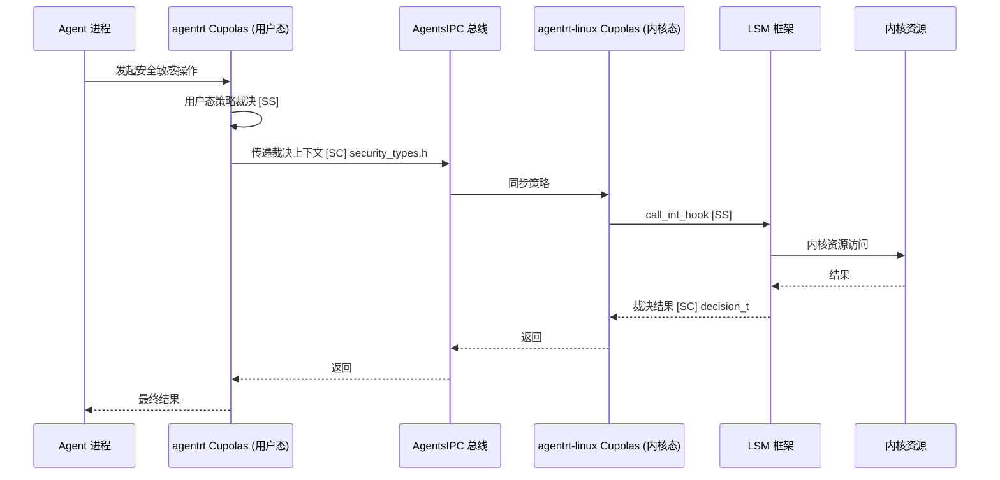

Copyright (c) 2025-2026 SPHARX Ltd. All Rights Reserved.

# agentrt-linux 安全设计文档

> **文档定位**：agentrt-linux（AirymaxOS）安全设计文档（security，极境安全）\
> **文档版本**：v1.1（2026-07-07）\
> **上级文档**：[agentrt-linux 设计文档](README.md)\
> **核心约束**：IRON-9 v3 同源且部分代码共享——与 agentrt 用户态 cupolas 通过 \[SC] 共享契约层 + \[SS] 语义同源层协作，\[IND] 内核态 LSM/Landlock/capability 实现独立\
> **子仓编号**：03\
> **子仓代号**：极境安全（Airymax Security）\
> **设计基准**：capability 安全 + LSM 框架 + Landlock 沙箱 + 机密计算\
> **同源 agentrt**：cupolas（Cupolas 安全穹顶）\
> **横切关注点**：安全是横切关注点（cross-cutting concern），贯穿调度、IPC、eBPF、记忆卷载 4 大数据流，不作为独立数据流

***

## 目录

- [1. 子仓职责](#1-子仓职责)
- [2. 同源关系（IRON-9 v3 四层共享模型）](#2-同源关系iron-9-v3-四层共享模型)
- [3. 目录结构](#3-目录结构)
- [4. 核心特性](#4-核心特性)
  - [4.10 sec_d 运行时设计（v1.1 Capability Folding 核心枢纽）](#410-sec_d-运行时设计v11-capability-folding-核心枢纽)
  - [4.11 OLK 6.6 io_uring 安全](#411-olk-66-io_uring-安全)
  - [4.12 错误码与 magic 一致性](#412-错误码与-magic-一致性)
  - [4.13 ADR 引用（v1.1 Capability Folding 决策溯源）](#413-adr-引用v11-capability-folding-决策溯源)
- [5. 微内核思想体现](#5-微内核思想体现)
- [6. IRON-9 v3 四层共享模型落地](#6-iron-9-v3-四层共享模型落地)
- [7. agentrt-linux 工程基线](#7-agentrt-linux-工程基线)
- [8. 前沿理论参考](#8-前沿理论参考)
- [9. 与其他子仓的协作](#9-与其他子仓的协作)
- [10. 里程碑（M0-M8）](#10-里程碑m0-m8)
- [11. agentrt 一致性检查](#11-agentrt-一致性检查)
- [12. 相关文档](#12-相关文档)
- [13. 参考](#13-参考)

***

## 1. 子仓职责

`security` 是 agentrt-linux（AirymaxOS）的安全子仓，承担以下核心职责：

1. **capability 系统 \[SC]**：基于 seL4 风格的不可伪造令牌实现最小权限访问控制，capability ID 枚举与派生模型与 agentrt 共享。
2. **LSM Hook \[SS]**：airy\_lsm 提供 Linux Security Module 钩子，调度机制与 agentrt cupolas 语义同源。
3. **沙箱隔离 \[SS]**：Landlock + seccomp 构建用户态沙箱，三系统调用语义与 agentrt 同源。
4. **机密计算 \[IND]**：支持 TEE/SGX/SEV-SNP/TDX/CCA 等可信执行环境，Vault backend 抽象 \[SC] 与 agentrt 共享。
5. **国密算法 \[IND]**：遵循 agentrt-linux 标准集成 SM2/SM3/SM4 国密算法。
6. **零信任网络 \[IND]**：基于身份的零信任网络架构。
7. **eBPF kfunc + dynamic pointer \[SS]**：利用 Linux 6.6 原生特性对 eBPF 程序进行签名验证。

### 1.1 横切关注点声明

安全**不是独立数据流**，而是横切关注点（cross-cutting concern），贯穿 agentrt-linux 全部 4 大数据流：

| 数据流      | 安全切入点                                      | 同源标注   |
| -------- | ------------------------------------------ | ------ |
| 调度数据流    | task\_create/task\_kill 钩子 + capability 检查 | \[SS]  |
| IPC 数据流  | binder/ipc 钩子 + 消息端点 capability 校验         | \[SS]  |
| eBPF 数据流 | eBPF 程序签名验证 + 纯 C LSM 钩子                  | \[SS]  |
| 记忆卷载数据流  | memory 加密 + TEE 保护 + memcg 隔离              | \[IND] |

***

## 2. 同源关系（IRON-9 v3 四层共享模型）

依据 IRON-9 v3 决策，agentrt（用户态 cupolas）与 agentrt-linux（内核态 security）通过 v3 四层共享模型（[SC] 共享契约 + [SS] 同源签名 + [IND] 独立 + [DSL] 降级生存）协作：

| 层次               | 共享程度                               | 安全子系统内容                                                                                                                                                           | 组织方式                               |
| ---------------- | ---------------------------------- | ----------------------------------------------------------------------------------------------------------------------------------------------------------------- | ---------------------------------- |
| **\[SC] 共享契约层**  | 完全共享代码                             | POSIX capability 41 个 ID 枚举、LSM 钩子 252 个 ID 枚举、Cupolas blob 结构布局（cred/inode/file/task）、capability 派生模型（mint/mintcopy/derive/revoke）、Vault backend 抽象、策略裁决结果 4 值枚举 | `include/uapi/linux/airymax/security_types.h`（10 个 [SC] 头文件之一） |
| **\[SS] 语义同源层**  | 高层 API 语义同源（概念操作一致），签名因抽象层级不同而独立演进 | `security_add_hooks()`、`call_int_hook` 短路、`DEFINE_LSM(airy)`、Landlock 三系统调用、`cap_capable()`、`security_file_open()` 等 17 项                                      | 各自独立实现                             |
| **\[IND] 完全独立层** | 完全独立                               | SELinux 完整实现、AppArmor 完整实现、Smack、TOMOYO、IMA digest list、IMA VirtCCA、IMA 策略 DB、EVM xattr 签名、内核 ABI 预留机制                                                            | 各自独立仓库                             |
| **\[DSL] 降级生存层** | 降级模式生存                             | `#ifdef AIRY_SC_FALLBACK` 降级块位于每个 \[SC] 头文件底部——`capability_badge=0` 跳过 fastpath C-S9 Badge 校验（H6 约束）、IPC 数据面 fastpath 仍可用、控制面 `airy_sys_call` 降级为传统 cap_t 引用模式、Vault backend 降级为应用层加密 | 每个 \[SC] 头文件底部 `#ifdef AIRY_SC_FALLBACK` 块 |

### 2.1 维度对比

| 维度  | agentrt（cupolas） | agentrt-linux（security）                      | 同源标注   |
| --- | ---------------- | -------------------------------------------- | ------ |
| LSM | Cupolas 用户态策略注入  | airy\_lsm 内核态钩子注册                           | \[SS]  |
| 沙箱  | 进程沙箱（用户态）        | Landlock + seccomp + capability（内核态强制）       | \[SS]  |
| 加密  | 应用层加密            | 国密 + TEE 机密计算                                | \[IND] |
| 权限  | 应用权限模型           | capability 令牌系统（seL4 风格）                     | \[SC]  |
| 完整性 | 应用级签名            | IMA/EVM + 模块签名                               | \[IND] |
| 密钥环 | 应用级密钥库           | 4 层可信密钥环（builtin/secondary/machine/platform） | \[IND] |

### 2.2 同源传承要点

- 保留 agentrt Cupolas 的"LSM hook 风格"安全策略注入 \[SS]。
- 保留 Cupolas 的"声明式安全策略"配置范式 \[SS]。
- 升级为 OS 级 capability 系统（seL4 风格）\[SC]——capability ID 与派生模型两端共享。
- 新增内核态 LSM 框架承重 \[SS]——`security_hook_heads` 252 钩子 + `lsm_blob_sizes` 扁平 blob。
- 新增 Landlock 用户态沙箱 \[SS]——非特权进程自限制 + 域不可逆叠加。
- 新增机密计算 Vault backend 抽象 \[SC]——TPM/SGX/SEV-SNP/TDX/CCA 后端可插拔。

***

## 3. 目录结构

```
security/
├── capability/             # capability 系统（seL4 风格）[SC]
├── lsm/                    # airy_lsm（LSM hook）[SS]
├── sandbox/               # Landlock + seccomp [SS]
├── confidential-compute/   # 机密计算（TEE/SGX/SEV-SNP/TDX/CCA）[IND]
├── crypto/                 # 国密算法（agentrt-linux 标准）[IND]
├── zero-trust/             # 零信任网络 [IND]
├── ebpf-verify/            # eBPF kfunc + dynamic pointer（6.6 原生）[SS]
└── docs/
```

### 3.1 capability/（capability 系统）\[SC]

参考 **seL4 capability** 设计，capability ID 枚举与派生模型通过 `include/uapi/linux/airymax/security_types.h` 与 agentrt 共享：

- `cap-types`：capability 类型定义（CNode、Endpoint、Thread、Frame、IO、IRQ、ASID）。
- `cap-table`：capability 表（per-process 树状结构）。
- `cap-transfer`：跨进程 capability 传递（通过消息传递）。
- `cap-derive`：capability 派生（mint、mintcopy、derive）——派生模型 \[SC] 共享。
- `cap-revoke`：capability 撤销（递归撤销派生 capability）。

### 3.2 lsm/（airy\_lsm）\[SS]

与 Cupolas 同源的 LSM 实现，调度机制语义同源但实现独立：

- `airy_lsm.c`：LSM hook 注册（file\_ops、net\_ops、task\_ops、ipc\_ops）——`security_add_hooks()` \[SS]。
- `policy-engine`：声明式策略引擎（YAML/JSON 策略）。
- `policy-compiler`：策略编译器（编译为 BPF 程序）。
- `audit`：安全审计日志。

### 3.3 sandbox/（Landlock + seccomp）\[SS]

- `landlock-rules/`：Landlock 规则集（文件访问控制）——三系统调用 \[SS]。
- `seccomp-filters/`：seccomp BPF 过滤器（系统调用白名单）。
- `sandbox-runner`：沙箱启动器（创建 namespace + 应用规则）。
- `bubblewrap`：bubblewrap 集成（容器化沙箱）。

### 3.4 confidential-compute/（机密计算）\[IND]

支持多种 TEE 技术，Vault backend 抽象 \[SC] 与 agentrt 共享：

- `sgx/`：Intel SGX enclave 支持。
- `sev-snp/`：AMD SEV-SNP 虚拟机加密。
- `tdx/`：Intel TDX 信任域。
- `arm-cca/`：ARM CCA 机密计算架构。
- `attestation`：远程证明框架。
- `key-broker`：密钥代理服务（与 KBS 协作）。

### 3.5 crypto/（国密算法）\[IND]

遵循 **agentrt-linux 安全治理组** 标准：

- `sm2/`：SM2 椭圆曲线公钥密码算法。
- `sm3/`：SM3 密码杂凑算法。
- `sm4/`：SM4 分组密码算法。
- `sm9/`：SM9 标识密码算法。
- `tls-gm`：国密 TLS 协议支持。
- `openssl-provider`：OpenSSL provider 集成。

### 3.6 zero-trust/（零信任网络）\[IND]

- `identity`：身份认证服务（基于 capability）。
- `policy-engine`：零信任策略引擎（持续验证）。
- `micro-segmentation`：微分段网络隔离。
- `mtls`：双向 TLS 通信。
- `beyondcorp`：BeyondCorp 模型参考。

### 3.7 ebpf-verify/（eBPF kfunc + dynamic pointer）\[SS]

利用 **Linux 6.6** 原生特性：

- `signing`：eBPF 程序签名工具。
- `verification`：内核签名验证集成。
- `keyring`：签名密钥环管理。
- `policy`：仅允许已签名 eBPF 程序加载的策略。

#### 3.8 组件架构图


***

## 4. 核心特性

### 4.1 capability 系统（seL4 风格）\[SC]

**设计原则**：

- 不可伪造：capability 由内核生成，用户态无法伪造。
- 可传递：capability 可通过消息传递给其他进程。
- 可派生：capability 可派生子 capability（受限权限）——派生模型 \[SC] 共享。
- 可撤销：capability 可被递归撤销。

**capability 类型** \[SC]：

| 类型       | 权限             | 同源标注  |
| -------- | -------------- | ----- |
| CNode    | capability 表节点 | \[SC] |
| Endpoint | 消息端点（IPC）      | \[SC] |
| Thread   | 线程控制           | \[SC] |
| Frame    | 物理页映射          | \[SC] |
| IO       | I/O 端口访问       | \[SC] |
| IRQ      | 中断控制           | \[SC] |
| ASID     | 地址空间标识         | \[SC] |

**capability 派生模型** \[SC]（`include/uapi/linux/airymax/security_types.h`）：

```c
/**
 * cap_t — Capability 引用（句柄）类型 [SC]
 *
 * cap_t 是 capability 的轻量引用/句柄，用于 syscall 参数传递和 IPC 消息
 * 中的 capability 标识。与 seL4 中 seL4_CPtr (= seL4_Word = uint64_t) 的
 * 设计一致：64-bit 整数句柄，标识 CNode 中某个 capability slot，轻量、可在
 * 用户态/内核态间零拷贝传递。
 *
 * v1.1 Capability Folding 后，cap_t 物理指向 agent_caps[1024] 静态数组中的
 * 某个 slot（slot 内嵌 Badge 64-bit Native Word 自包含权限与派生信息）。
 * 派生模型语义（Copy/Mint/Move/Mutate/Revoke/Delete/Rotate 7 操作）在 [SC]
 * 层与 agentrt 共享；物理实现属 [IND] 独立层（详见 §4.1 v1.1 表格）。
 */
typedef uint64_t cap_t;

/**
 * airy_cap_id_t / airy_cap_op_t — capability 语义模型 [SC]
 *
 * 仅描述语义契约（ID 枚举 + 7 派生操作），不描述物理存储。物理存储由 v1.1
 * Capability Folding 改用 agent_caps[1024] 静态数组 + Badge 64-bit Native
 * Word（详见 §4.1 v1.1 表格与下方代码）。
 */
/* typedef uint32_t airy_cap_id_t;        -- 41 个 POSIX cap ID 枚举 */
/* typedef enum { CAP_OP_COPY, CAP_OP_MINT, CAP_OP_MOVE, CAP_OP_MUTATE,
 *                CAP_OP_REVOKE, CAP_OP_DELETE, CAP_OP_ROTATE } airy_cap_op_t; */
```

**v1.1 Capability Folding 物理实现**（`security/airy/`，SSoT：[03-capability-model.md](../110-security/03-capability-model.md) + [07-airy-lsm-design.md](../110-security/07-airy-lsm-design.md) + [01-kernel.md §5.0](01-kernel.md)）：

```c
/* v1.1 Capability Folding: 静态数组 + Badge 64-bit 编码（替代 v1.0 capability 元数据结构体） */
#define AIRY_CAP_MAX_AGENTS        1024
#define AIRY_CAP_GLOBAL_EPOCH_INIT 1

/* Badge 64-bit Native Word 布局：Epoch<<48 | RandomTag<<16 | Perms
 * - Epoch[48:63]   16 bit：全局代序号，atomic_inc(&airy_cap_global_epoch) O(1) 撤销
 * - RandomTag[16:47] 32 bit：派生关系隐式编码（同源派生共享 RandomTag）
 * - Perms[0:15]    16 bit：权限位段（send/recv/cap_request/grant/revoke 等）
 */
struct airy_cap_slot {
    __u64 badge;        /* Epoch<<48 | RandomTag<<16 | Perms */
    __u64 target_id;    /* Agent ID / Endpoint ID / Resource ID */
} __aligned(64);        /* cache line 对齐，避免 false sharing 与侧信道 */

struct airy_cap_table {
    struct airy_cap_slot slots[AIRY_CAP_MAX_AGENTS];  /* agent_caps[1024] 静态数组，16KB */
    atomic_t global_epoch;  /* O(1) 撤销：atomic_inc 即失效所有旧 badge */
};

/* 全局唯一实例，sec_d 唯一写者（串行化写入消除内核锁） */
extern struct airy_cap_table airy_cap_global_table;
#define agent_caps  (airy_cap_global_table.slots)
```

**v1.1 Capability Folding 集成**（CNode/CSpace 概念保留 + 物理存储重构）：

**v1.1 重构**：自 v1.1 起，agentrt-linux 的 capability 存储从 v1.0 的 `airy_cnode`（radix-tree）+ `airy_cap_mdb`（MDB 派生树）+ v1.0 capability 元数据结构体（含 cap_id/cap_type/rights/parent_cap_id/mint_depth/mint_quota 六字段）重构为 **Capability Folding 单平面架构**——`airy_cnode`/`airy_cspace`/v1.0 capability 元数据结构体作为逻辑/语义概念保留（[03-capability-model.md §2.1-2.4](../110-security/03-capability-model.md)），但物理存储改用 `agent_caps[1024]` 内核静态数组 + Badge 64-bit Native Word，撤销机制改用 `atomic_inc(&airy_cap_global_epoch)` O(1) 全局失效。

| 维度 | v1.0 实现（已废弃） | v1.1 实现（当前权威） |
|------|-------------------|---------------------|
| 物理存储 | `airy_cnode`（radix-tree 动态分配）+ v1.0 capability 元数据结构体 | `agent_caps[1024]` 静态数组（16KB，sec_d 唯一写者）+ Badge 64-bit Native Word |
| 逻辑视图 | `airy_cspace`（CNode 树） | `airy_cspace` 保留（`slots` 指针指向 `agent_caps[agent_id]`） |
| 派生关系 | `airy_cap_mdb`（全局 MDB，parent→children 链）+ v1.0 元数据 parent_cap_id 字段 | 不需要——Badge 64-bit Native Word 自包含 Epoch + RandomTag + Perms |
| 撤销机制 | MDB 递归遍历子树（O(n)） | `atomic_inc(&airy_cap_global_epoch)` 一行代码 O(1) 全局撤销 |
| 校验方式 | 独立 `airy_cap_check()` 前置 + radix tree 查找 | fastpath C-S9 内联 Badge 校验（~10ns）+ slowpath LSM 钩子接管 |
| slot 对齐 | 动态分配（无对齐保证） | `__aligned(64)` cache line 对齐（防 false sharing + 侧信道） |

> **权威定义**：v1.1 Capability Folding 完整设计以 [03-capability-model.md](../110-security/03-capability-model.md) 和 [07-airy-lsm-design.md](../110-security/07-airy-lsm-design.md) 为 SSoT 权威源。本文件仅做概念性引用，不重新定义实现细节。

**与 seL4 的差异**：seL4 的 CNode/MDB 实现完全在微内核中（形式化验证）；agentrt-linux v1.1 借鉴其 capability 思想但物理实现基于 **`agent_caps[1024]` 静态数组 + atomic Epoch + Badge 64-bit Native Word**（性能优先，CBMC 全函数验证 fastpath），属于 \[IND] 实现独立层。capability ID 枚举与派生模型（mint/mintcopy/derive/revoke）的语义在 \[SC] 层与 agentrt 共享。该简化符合"对 Linux 6.6 进行 seL4 思想借鉴的微内核化改造"定位（ADR-012 + ADR-014），不引入 seL4 完整 CSpace/MDB 实现复杂度。

### 4.2 airy\_lsm（LSM hook，Cupolas 同源）\[SS]

**LSM Hook 点**（252 个钩子 ID 枚举 \[SC]）：

- `file_open`、`file_permission`、`file_ioctl`
- `socket_bind`、`socket_connect`、`socket_accept`
- `task_create`、`task_kill`、`task_setpgid`
- `ipc_permission`、`msg_queue_msgctl`

**调度机制** \[SS]：

- `call_int_hook`：fail-fast first-deny 短路语义，任一钩子返回非零即终止。
- `call_void_hook`：遍历全部钩子，无短路。
- `DEFINE_LSM(airy)`：Cupolas（内核态模块名 `airy`）通过 `LSM_ORDER_MUTABLE` + `CONFIG_LSM` 首位初始化注册（v1.1：airy_lsm 必须使用 `LSM_ORDER_MUTABLE`，不得使用早期启动排序——OLK 6.6 注释明确早期启动排序仅用于 capabilities），不打 `LSM_FLAG_EXCLUSIVE` 标记（穹顶叠加而非替代）。详见 [07-airy-lsm-design.md](../110-security/07-airy-lsm-design.md) §2.1。

**策略示例**（YAML）：

```yaml
policy: agent-default
version: v1
rules:
  - name: restrict-network
    selector:
      domain: untrusted.slice
    effect: deny
    operations:
      - socket_connect
      - socket_bind
  - name: allow-vfs-read
    selector:
      domain: agent.slice
    effect: allow
    operations:
      - file_open
    paths:
      - /var/lib/airymaxos/**
```

### 4.3 Landlock + seccomp（用户态沙箱）\[SS]

**Landlock** \[SS]：

- 文件路径访问控制（15 个正交访问位）。
- 网络绑定/连接控制（前向移植）。
- 进程间通信控制。
- 域不可逆叠加（`landlock_restrict_self` 后单调收紧）。

**Landlock 三系统调用** \[SS]：

- `landlock_create_ruleset()`：创建规则集（红黑树组织）。
- `landlock_add_rule()`：追加规则。
- `landlock_restrict_self()`：施加于自身（要求 `no_new_privs` 或 `CAP_SYS_ADMIN`）。

**seccomp**：

- 系统调用白名单/黑名单。
- 参数级过滤（BPF 过滤器）。

**组合使用**：

```c
// 创建沙箱
sandbox_create()
    -> landlock_restrict_paths(rules)
    -> seccomp_load(filter)
    -> execve(target);
```

### 4.4 机密计算（TEE/SGX/SEV-SNP/TDX/CCA）\[IND]

**支持的 TEE**（Vault backend 抽象 \[SC]）：

| 技术          | 厂商    | 粒度      | 同源标注   |
| ----------- | ----- | ------- | ------ |
| Intel SGX   | Intel | Enclave | \[IND] |
| Intel TDX   | Intel | VM      | \[IND] |
| AMD SEV-SNP | AMD   | VM      | \[IND] |
| ARM CCA     | ARM   | Realm   | \[IND] |

**Vault backend 抽象** \[SC]（`include/uapi/linux/airymax/security_types.h`，借鉴 IMA ROT 抽象层）：

```c
typedef struct airy_vault_backend {
    const char *name;       /* tpm/sgx/sev-snp/tdx/cca */
    int (*init)(struct airy_vault_backend *self);
    int (*seal)(struct airy_vault_backend *self,
                const uint8_t *plaintext, size_t len,
                uint8_t *ciphertext, size_t *out_len);
    int (*unseal)(struct airy_vault_backend *self,
                  const uint8_t *ciphertext, size_t len,
                  uint8_t *plaintext, size_t *out_len);
    int (*attest)(struct airy_vault_backend *self,
                  const uint8_t *challenge, size_t len,
                  uint8_t *evidence, size_t *out_len);
} airy_vault_backend_t;
```

**应用场景**：

- LLM 推理保护（模型权重、推理数据）。
- 密钥管理（HSM 替代）。
- 隐私计算（联邦学习）。
- Agent 记忆加密（与 `memory` 协作）。

### 4.5 eBPF kfunc + dynamic pointer（6.6 原生特性）\[SS]

**特性**：

- Linux 6.6 引入 eBPF 程序签名验证机制。
- 仅允许已签名 eBPF 程序加载至内核。
- 防止恶意 eBPF 程序破坏内核安全。
- 纯 C LSM 通过 `LSM_HOOK_INIT` 宏注册到 `security_hook_heads`（X-macro 模式经 `lsm_hook_defs.h` 生成钩子声明，但回调是纯 C 函数，非 BPF 程序）\[SS]。

**策略**：

- `enforce`：仅允许已签名程序加载。
- `log`：记录未签名程序加载尝试。
- `disable`：禁用签名验证（仅开发环境）。

### 4.6 国密算法支持（agentrt-linux 标准）\[IND]

遵循 **GB/T 32918、GB/T 32905、GB/T 32907** 等国密标准：

- SM2：公钥密码（替代 RSA/ECDSA）。
- SM3：杂凑算法（替代 SHA-256）。
- SM4：分组密码（替代 AES）。
- SM9：标识密码（基于身份的加密）。
- 国密 TLS：GMT 0024 标准的 TLS 协议。

### 4.7 零信任网络架构 \[IND]

**核心原则**：

- 从不信任，始终验证（Never trust, always verify）。
- 最小权限访问。
- 持续验证身份与设备状态。
- 微分段隔离。

**架构**：

- 身份认证（基于 capability）。
- 设备健康度评估。
- 持续授权（动态策略）。
- 微分段（网络隔离）。

### 4.8 策略裁决结果 \[SC]

策略裁决结果 4 值枚举与 agentrt 共享（`include/uapi/linux/airymax/security_types.h`）：

```c
typedef enum {
    AIRY_VERDICT_ALLOW    = 0,  /* 允许 */
    AIRY_VERDICT_DENY     = 1,  /* 拒绝 */
    AIRY_VERDICT_AUDIT    = 2,  /* 允许但审计 */
    AIRY_VERDICT_COMPLAIN = 3,  /* 拒绝但记录日志（用于策略调试） */
} airy_verdict_t;
```

### 4.9 Cupolas 7 大子系统（与 agentrt 同源 \[SS]）

| 子系统                   | 职责     | agentrt-linux 实现    | 同源标注           |
| --------------------- | ------ | ------------------- | -------------- |
| Guards 守卫             | 入口防护   | 内核态 + 用户态双层守卫       | \[SS]          |
| Permission 权限裁决       | 策略裁决   | capability + LSM 钩子 | \[SS]          |
| Sanitizer 输入净化        | 输入验证   | 内核态输入过滤             | \[SS]          |
| Audit 审计追踪            | 行为审计   | ftrace + eBPF 审计    | \[SS]          |
| Workbench 虚拟工作台       | 隔离环境   | Landlock 沙箱         | \[SS]          |
| Security Vault 安全金库   | 敏感数据保护 | TPM + 机密计算          | \[SC] Vault 抽象 |
| Network Security 网络安全 | 网络防护   | LSM + 防火墙           | \[SS]          |

### 4.10 sec_d 运行时设计（v1.1 Capability Folding 核心枢纽）

`sec_d` 是 12 daemon 之一，作为 v1.1 Capability Folding 的**核心枢纽**——`agent_caps[1024]` 静态数组唯一写者，所有 Badge 编译/撤销请求通过 `airy_sys_call`（编号 0）串行化处理。详见 [01-kernel.md §14.2](01-kernel.md)。

#### 4.10.1 串行化 Badge 编译（令牌桶限流 + 50ms SLO）

| 维度 | 设计 |
| --- | --- |
| 入口 | `airy_sys_call`（编号 0）COMPILE_BADGE opcode |
| 串行化机制 | sec_d 持单写令牌，内核侧 `agent_caps[1024]` 写入无锁（用户态串行化消除内核锁） |
| 限流 | 令牌桶（token bucket）：每 Agent 配额默认 100 Badge/s，突发上限 200 |
| SLO | 单次 Badge 编译 ≤ 50ms（含 RandomTag 生成 + slot 写入 + WAL 追加） |
| 拒绝码 | 超出令牌桶配额返回 `-AIRY_ESEC_D_THROTTLED = -83`（sec_d 限流拒绝） |
| 失败处理 | sec_d 限流拒绝后客户端退避重试（指数退避 1ms→2ms→4ms→...→50ms 封顶） |

```c
/* sec_d 令牌桶限流伪码 */
int sec_d_compile_badge(uint32_t agent_id, uint16_t perms, uint32_t *out_randtag)
{
    if (!token_bucket_consume(&sec_d_buckets[agent_id], 1)) {
        audit_log("sec_d throttled: agent_id=%u", agent_id);
        return -AIRY_ESEC_D_THROTTLED;  /* -83 */
    }
    /* ...RandomTag 生成 + agent_caps[agent_id].badge 写入 + WAL 追加... */
    return 0;
}
```

#### 4.10.2 持久化恢复协议（Snapshot 5min + WAL + 两阶段恢复）

| 阶段 | 机制 | 时间窗口 |
| --- | --- | --- |
| Snapshot | sec_d 每 5min 对 `agent_caps[1024]` 全量快照至 PMEM/SSD（`fsync` 保证持久化） | 5min 周期 |
| WAL | 两次 Snapshot 之间，每次 Badge 编译/撤销追加写 WAL 日志条目（含 slot_idx + old_badge + new_badge + epoch） | 实时 |
| 两阶段恢复 | 阶段 1：加载最近 Snapshot；阶段 2：重放 WAL 日志至 last_sync_lsn | 启动时 < 1s |
| Epoch 自增 | 恢复完成后强制 `atomic_inc(&airy_cap_global_epoch)`，使所有飞行中的旧 Badge 失效 | O(1) |
| systemd watchdog | `macro_d` 通过 systemd watchdog 监控 sec_d 心跳（默认 30s），超时强制重启 | 30s 触发 |

> **崩溃一致性**：WAL 追加采用 `write()` + `fdatasync()` 两步，崩溃后通过 WAL last_sync_lsn 校验保证不重放已提交条目（幂等）。Snapshot 文件采用原子替换（`rename()`）保证一致性。

#### 4.10.3 跨节点 Badge 一致性

| 版本 | 拓扑 | 协议 | 延迟 |
| --- | --- | --- | --- |
| 0.1.1（奠基版本） | 单节点 | 无跨节点同步——`agent_caps[1024]` 仅本节点可见 | 0ms（本地） |
| 1.0.1 | 多节点 | `gateway_d`（12 daemon 之一）承担跨节点 IPC，gossip 协议同步 Epoch（100ms 周期） | 100ms 最终一致 |

**gossip Epoch 同步**（1.0.1）：

- `gateway_d` 每 100ms 向 peer 节点广播本节点 `airy_cap_global_epoch` 值。
- 接收方比对：若 peer epoch > local epoch，触发本地 `atomic_set(&airy_cap_global_epoch, peer_epoch)` 收敛。
- 跨节点 Badge **不互验**——每个节点 `agent_caps[1024]` 独立维护本地 Agent 集合，跨节点 Agent 通过 `gateway_d` 转发 IPC（数据面由 io_uring 承载，Badge 仅本节点有效）。
- 跨节点撤销：发起节点 `atomic_inc` 本地 epoch，gossip 100ms 内传播至 peer，peer 节点对本节点内同名 Agent 执行 `atomic_inc` 完成跨节点撤销收敛。

#### 4.10.4 侧信道防护

| 防护点 | 机制 | 实现位置 |
| --- | --- | --- |
| Badge 比较 | **constant-time 比较**（`crypto_memcmp()` / `consttime_memequal()`），杜绝时序侧信道 | `airy_cap_fastpath_verify()` C-S9.EPOCH 路径 |
| `agent_caps[]` 内存布局 | `__aligned(64)` cache line 对齐，每个 slot 独占 cache line，避免 false sharing 与 Flush+Reload | `struct airy_cap_slot` 定义 |
| Spectre v1/v2 | `array_index_nospec()` 索引屏障 + retpoline/IBRS | slot 索引计算路径 |
| Meltdown/L1TF | `set_memory_np()` 标记 `agent_caps[]` 区域为非推测访问 + KPTI 强制 | 内核页表 |
| RandomTag 生成 | `get_random_bytes_wait()` 内核 CSPRNG，杜绝可预测 RandomTag | Badge 编译路径 |
| epoch 读取 | `smp_load_acquire()` 内存屏障，避免弱内存序导致 stale read | C-S9.EPOCH 比对 |

> **设计原则**：fastpath C-S9 内联校验虽以性能优先（~10ns），但侧信道防护不可妥协——constant-time 比较 + cache line 对齐是底线。该原则源自 seL4 形式化验证思想（ADR-014）：安全机制的正确性应可证明，不应依赖"攻击者无法测量时序"假设。

### 4.11 OLK 6.6 io_uring 安全

OLK 6.6 内核基线下，io_uring 是 IPC 数据面唯一通道（v1.1 Capability Folding 后 8 个 seL4 风格 IPC 原语 syscall 已全部移除）。安全子仓在 io_uring 路径的职责：

#### 4.11.1 `security_uring_cmd` LSM 钩子（单参数）

OLK 6.6 `include/linux/lsm_hooks.h` 定义的 `uring_cmd` LSM 钩子签名为**单参数**：

```c
/* OLK 6.6: uring_cmd LSM 钩子——单参数 struct io_uring_cmd *ioucmd */
int security_uring_cmd(struct io_uring_cmd *ioucmd);
```

`airy_lsm`（CONFIG\_SECURITY\_AIRY，default 'n'）通过 `LSM_ORDER_MUTABLE` + `CONFIG_LSM` 控制注册该钩子，叠加 Badge 审计 + sec_d 限流检查 + Wasm_load 校验。**airy_lsm 必须使用 `LSM_ORDER_MUTABLE`，不得使用早期启动排序**——OLK 6.6 注释明确早期启动排序仅用于 capabilities（早期启动阶段）。

#### 4.11.2 `io_uring_cmd_to_pdu()` 安全宏

OLK 6.6 标准宏 `io_uring_cmd_to_pdu(cmd, pdu_type)` 用于安全访问 `struct io_uring_cmd` 的 `pdu[32]` 字段（仅内联存储 cmd 的前 32 字节副本）。完整 80 字节 cmd 数据需通过 `ioucmd->sqe->cmd` 访问原始 SQE 区域。

```c
/* OLK 6.6 标准 PDU 访问宏——airy_lsm uring_cmd 钩子内使用 */
static int airy_uring_cmd_security(struct io_uring_cmd *ioucmd)
{
    /* pdu[32] 仅承载前 32 字节副本——仅校验元信息 */
    struct airy_ipc_cmd *cmd = io_uring_cmd_to_pdu(ioucmd, struct airy_ipc_cmd);

    /* Malformed SQE 防护 */
    if (airy_uring_sqe_validate(ioucmd->sqe) < 0)
        return -EACCES;

    /* fastpath C-S9 Badge 校验已在 io_uring issue 路径内联完成，
     * slowpath 此处叠加审计 + sec_d 限流检查 */
    return airy_lsm_audit_uring_cmd(ioucmd);
}
```

#### 4.11.3 SQE128 模式下的安全校验

agentrt-linux IPC 启用 **SQE128 模式**（`IORING_SETUP_SQE128`，Linux 5.18+，OLK 6.6 基线支持）：

- SQE 大小从标准 64 字节扩展到 128 字节（64B 标准 + 64B 扩展）。
- `cmd` 字段从 16 字节扩展到 80 字节（标准 16B + 扩展 64B），承载 `airy_ipc_cmd`（≤ 80 字节）。
- `airy_lsm` `uring_cmd` 钩子需对 80 字节 cmd 完整性校验（CRC32 + opcode 白名单 + payload_len 越界检查）。
- `BUILD_BUG_ON(sizeof(struct airy_ipc_cmd) > 80)` 编译期断言保证。

#### 4.11.4 Malformed SQE 防护

`airy_uring_sqe_validate()` 函数在 `airy_lsm` `uring_cmd` 钩子入口对 SQE 进行完整校验，检测到 malformed 输入立即触发 `AIRY_FAULT_URING_MALFORMED = 0x100A`：

| 校验项 | 失败动作 |
| --- | --- |
| `sqe->opcode == IORING_OP_URING_CMD` | 不匹配 → 返回 `-EINVAL` |
| `sqe->cmd_op` ∈ `AIRY_URING_CMD_*` 白名单 | 不在白名单 → 返回 `-EACCES` |
| `sqe->cmd` payload_len ≤ `AIRY_IPC_MAX_PAYLOAD` | 越界 → 触发 `AIRY_FAULT_URING_MALFORMED = 0x100A` |
| `sqe->flags` 无保留位被置位 | 保留位置位 → 触发 `AIRY_FAULT_URING_MALFORMED = 0x100A` |
| CRC32 校验 `sqe->cmd` 完整性 | 不匹配 → 触发 `AIRY_FAULT_URING_MALFORMED = 0x100A` |

**故障处理**：检测到 malformed SQE 时，调用 `airy_security_fault(agent_id, AIRY_FAULT_URING_MALFORMED, cmd)` 通知 Micro-Supervisor（`macro_d`）+ 冻结对应 io_uring Ring，由 Micro-Supervisor 裁决重启 Ring 或终止 Agent。详见 [08-sc-error-contract.md §3.2](../30-interfaces/08-sc-error-contract.md)。

**完成接口**：所有 io_uring `IORING_OP_URING_CMD` 路径必须使用 4 参数 `io_uring_cmd_done(cmd, ret, res2, issue_flags)` 完成（OLK 6.6 标准），不允许使用旧版 2 参数变体。

### 4.12 错误码与 magic 一致性

#### 4.12.1 \[SC] 共享契约层 magic

| Magic 常量 | 值 | ASCII | 用途 | 物理宿主 |
| --- | --- | --- | --- | --- |
| `AIRY_IPC_MAGIC` | `0x41524531` | `'ARE1'` | `airy_ipc_msg_hdr` Layout C v4 128B 消息头 magic（C-S1 校验） | `include/uapi/linux/airymax/ipc.h` |
| `AIRY_LOG_MAGIC` | `0x414C4F47` | `'ALOG'` | `airy_log_record` 128B 日志记录 magic | `include/uapi/linux/airymax/log_types.h` |
| `AIRY_TASK_MAGIC` | `0x41475453` | `'AGTS'` | `struct airy_task_desc` 任务描述符 magic（优先级 0-139 + MAC_MAX_AGENTS=1024） | `include/uapi/linux/airymax/sched.h` |

> **H1 硬约束**：IPC magic `0x41524531` 'ARE1' 与日志/任务 magic 互不重叠，禁止复用同一 magic。详见 [02-ipc-protocol.md §2.6](../30-interfaces/02-ipc-protocol.md)。

#### 4.12.2 安全相关 Error 码（负数 errno 码空间）

| 错误码 | 值 | 含义 | 触发场景 |
| --- | --- | --- | --- |
| `AIRY_EIPC_MAGIC` | -41 | IPC magic 错误 | C-S1 校验失败（magic != 0x41524531） |
| `AIRY_ECAP_FORGED` | -80 | Badge 伪造 | C-S9 校验失败（badge_randtag != agent_caps[randtag]），触发 `AIRY_FAULT_CAP_FORGED` |
| `AIRY_ECAP_PERM` | -81 | 权限不足 | C-S9 校验失败（badge_perms 不含 opcode 对应权限位） |
| `AIRY_ECAP_FROZEN` | -82 | capability 冻结 | C-S9 校验失败（slot_epoch != expected_epoch，ring 已冻结或 epoch 失效） |
| `AIRY_ESEC_D_THROTTLED` | -83 | sec_d 限流拒绝 | sec_d 令牌桶耗尽（超出 100 Badge/s 配额或 200 突发上限） |

#### 4.12.3 安全相关 Fault 码（正数 0x1000+ 码空间）

| Fault 码 | 值 | 含义 | 处置 |
| --- | --- | --- | --- |
| `AIRY_FAULT_CAP_FORGED` | 0x1001 | Badge 伪造 | 终止 Agent + 安全团队介入 |
| `AIRY_FAULT_CAP_LEAK` | 0x1002 | A-IPC Badge 泄漏 | 冻结 Ring + 重启 Agent |
| `AIRY_FAULT_URING_MALFORMED` | 0x100A | malformed SQE/CQE 输入（opcode/flags/payload_len 越界） | `airy_security_fault()` 通知 Micro-Supervisor + 冻结 Ring |
| `AIRY_FAULT_AUDIT_TAMPER` | 0x100B | 审计哈希链断裂（`airy_audit_chain_verify` 检测到 `prev_hash` 不匹配） | 紧急 CRITICAL 告警 + 停止审计写入 + 安全团队介入 |

> **Error vs Fault**：Error（负数 errno）由调用方处理；Fault（正数 0x1000+）触发 `airy_security_fault()` 上报 Micro-Supervisor，由 `macro_d` 裁决。两者码空间严格不重叠。详见 [08-sc-error-contract.md](../30-interfaces/08-sc-error-contract.md)。

### 4.13 ADR 引用（v1.1 Capability Folding 决策溯源）

| ADR | 标题 | 在本子仓的体现 |
| --- | --- | --- |
| [ADR-012](../10-architecture/05-adrs.md#adr-012) | 微内核化改造技术路线确认（基于 Linux 改造 + seL4 思想，非从零开发） | capability 系统 + LSM 框架 + Landlock 沙箱 + 机密计算均基于 Linux 6.6 改造，非从零实现 |
| [ADR-013](../10-architecture/05-adrs.md#adr-013) | 版本基线锁定（1.x.x 锁定 Linux 6.6） | OLK 6.6 LSM 框架 + Landlock + capability + 4 层密钥环 |
| [ADR-014](../10-architecture/05-adrs.md#adr-014) | **微内核设计思想来源单一化（仅 seL4，不引入 Zircon/Minix3）** | **capability 模型来源 = seL4（ADR-014）；CNode/MDB/Badge 等概念仅溯源 seL4，不引入 Zircon rights/Minix3 多服务器模型；v1.1 Capability Folding 物理实现简化为 `agent_caps[1024]` + Badge 64-bit + atomic Epoch，仍属 seL4 思想借鉴范畴（性能优先，CBMC 全函数验证 fastpath）** |

***

## 5. 微内核思想体现

### 5.1 capability-based security

遵循 **seL4 capability** 模型（Liedtke minimality principle）：

- 所有权限通过 capability 令牌表示。
- capability 不可伪造、可传递、可派生、可撤销。
- 每个进程仅持有完成其功能所需的最小 capability 集。
- capability 派生模型 \[SC] 与 agentrt 共享，确保两端权限语义一致。

### 5.2 最小权限

- 进程仅持有必要的 capability。
- 沙箱限制系统调用与文件访问。
- LSM hook 在每个安全敏感操作点验证权限。
- Landlock 域不可逆叠加保证 Agent 即便被攻陷也无法越界。

### 5.3 安全即机制

- capability 系统：安全机制（在内核）。
- 策略引擎：安全策略（在用户态，可热替换）。
- 符合 Liedtke 的"机制与策略分离"原则。
- LSM 框架提供钩子骨架，具体策略由 Cupolas 填充。

### 5.4 服务用户态化

- Cupolas 的 7 大子系统中，策略引擎、审计、Workbench 均用户态化。
- 内核态仅保留 capability 检查、LSM 钩子调度、Landlock 域强制。
- 符合微内核"服务用户态化"设计思想。

***

## 6. IRON-9 v3 四层共享模型落地

### 6.1 \[SC] 共享契约层——`include/uapi/linux/airymax/security_types.h`

本头文件完全共享代码，agentrt 用户态与 agentrt-linux 内核态两端直接 include。内容清单：

| 内容                                 | 说明                                                                                   |
| ---------------------------------- | ------------------------------------------------------------------------------------ |
| `airy_cap_id_t` 枚举                 | POSIX capability 41 个 ID（CAP\_CHOWN=0 ... CAP\_CHECKPOINT\_RESTORE=40）               |
| `airy_lsm_hook_id_t` 枚举            | LSM 钩子 252 个 ID（binder\_set\_context\_mgr=0 ... MAX）                                 |
| `airy_cupolas_cred_security_t` 结构  | Cupolas cred blob 布局（agent\_id/domain\_id/capability\_set/sandbox\_level/audit\_seq） |
| `airy_cupolas_inode_security_t` 结构 | Cupolas inode blob 布局                                                                |
| `airy_cupolas_file_security_t` 结构  | Cupolas file blob 布局                                                                 |
| `airy_cupolas_task_security_t` 结构  | Cupolas task blob 布局                                                                 |
| v1.0 capability 元数据语义模型（v1.0 元数据已废弃） | capability 派生模型语义契约（cap\_id/cap\_type/rights/parent\_cap\_id/mint\_depth/mint\_quota + 7 操作 Copy/Mint/Move/Mutate/Revoke/Delete/Rotate）；v1.1 物理存储改用 `agent_caps[1024]` 静态数组 + Badge 64-bit Native Word（详见 §4.1） |
| `airy_vault_backend_t` 结构          | Vault backend 抽象（init/seal/unseal/attest）                                            |
| `airy_verdict_t` 枚举               | 策略裁决结果 4 值（ALLOW/DENY/AUDIT/COMPLAIN）                                                     |

### 6.2 \[SS] 语义同源层——17 项 API 映射

高层 API 语义同源（概念操作一致），签名因抽象层级不同而独立演进：

| 序号 | API                                 | 语义               | agentrt 实现 | agentrt-linux 实现        |
| -- | ----------------------------------- | ---------------- | ---------- | ----------------------- |
| 1  | `security_add_hooks()`              | 钩子注册             | 用户态策略表注册   | 内核 `hlist_add_tail_rcu` |
| 2  | `call_int_hook`                     | first-deny 短路    | 用户态遍历      | 内核宏展开                   |
| 3  | `call_void_hook`                    | 全遍历              | 用户态遍历      | 内核宏展开                   |
| 4  | `DEFINE_LSM(airy)`               | LSM 声明           | 用户态模拟      | 内核 `lsm_info` 结构        |
| 5  | `landlock_create_ruleset()`         | 创建规则集            | 用户态包装      | 内核 syscall              |
| 6  | `landlock_add_rule()`               | 追加规则             | 用户态包装      | 内核 syscall              |
| 7  | `landlock_restrict_self()`          | 施加域              | 用户态包装      | 内核 syscall              |
| 8  | `cap_capable()`                     | capability 检查    | 用户态模拟      | 内核 `commoncap.c`        |
| 9  | `security_file_open()`              | 文件打开检查           | 用户态拦截      | 内核 LSM 钩子               |
| 10 | `security_task_create()`            | 任务创建检查           | 用户态拦截      | 内核 LSM 钩子               |
| 11 | `security_binder_set_context_mgr()` | binder 检查        | 用户态拦截      | 内核 LSM 钩子               |
| 12 | `security_socket_bind()`            | socket bind 检查   | 用户态拦截      | 内核 LSM 钩子               |
| 13 | `security_cred_prepare()`           | 凭据复制             | 用户态模拟      | 内核 LSM 钩子               |
| 14 | `security_cred_transfer()`          | 凭据转移             | 用户态模拟      | 内核 LSM 钩子               |
| 15 | `LSM_HOOK_INIT(NAME, hook)` 宏 | 纯 C LSM 钩子注册（对齐 openEuler） | 用户态策略表注册 | 内核 `security_hook_heads` 链表 |
| 16 | `task_no_new_privs()`               | NNP 检查           | 用户态模拟      | 内核标志位                   |
| 17 | `ns_capable_noaudit()`              | capability 无审计检查 | 用户态模拟      | 内核 `commoncap.c`        |

### 6.3 \[IND] 完全独立层——10 项独立实现

| 序号 | 内容              | 不共享原因                                           |
| -- | --------------- | ----------------------------------------------- |
| 1  | SELinux 完整实现    | agentrt-linux 不移植 SELinux（TE/RBAC/MLS 过重）       |
| 2  | AppArmor 完整实现   | agentrt-linux 不移植 AppArmor（路径基策略与 Cupolas 语义冲突） |
| 3  | Smack           | agentrt-linux 不移植 Smack                         |
| 4  | TOMOYO          | agentrt-linux 不移植 TOMOYO                        |
| 5  | IMA digest list | 与完整性解耦冲突，用 Cupolas Vault 运行时签名替代                |
| 6  | IMA VirtCCA     | Huawei 硬件绑定，用 Cupolas 机密计算抽象层替代                 |
| 7  | IMA 策略 DB       | agentrt-linux 用 Cupolas 声明式策略引擎替代               |
| 8  | EVM xattr 签名    | agentrt-linux 用 Cupolas Vault seal/unseal 替代    |
| 9  | 内核 ABI 预留机制     | 与 IRON-1 冲突（0.1.1 唯一奠基版本）                       |
| 10 | 内核发行版特有增强       | 详见工程规范委员会发布的安全技术规范                              |

### 6.4 \[DSL] 降级生存层——`#ifdef AIRY_SC_FALLBACK` 降级块

依据 IRON-9 v3 决策，每个 \[SC] 头文件底部必须存在 `#ifdef AIRY_SC_FALLBACK` 降级块，保证 \[SC] 共享契约在内核态 \[SC] 头文件不可用或被裁剪时仍能维持降级生存模式。安全子仓的 \[DSL] 降级策略：

| 序号 | 降级项 | 正常模式 | \[DSL] 降级模式 | H 约束 |
| -- | ---- | ------ | ------------- | ----- |
| 1  | `capability_badge` 字段 | 64-bit Badge（Epoch+RandomTag+Perms） | `capability_badge=0` 跳过 fastpath C-S9 Badge 校验 | H6 |
| 2  | fastpath C-S9 校验 | 内联 ~10ns Badge 校验 | 跳过 C-S9，仅保留 slowpath LSM 钩子兜底 | H5/H6 |
| 3  | `airy_sys_call` 控制面 | sec_d 编译 Badge + 派生 | 降级为传统 cap_t 引用模式（无 Badge 编译） | H4 |
| 4  | IPC 数据面 fastpath | io_uring `IORING_OP_URING_CMD` + C-S9 内联 | fastpath 仍可用（payload 传递不变），仅省略 Badge | H6 |
| 5  | Vault backend | TPM/SGX/SEV-SNP/TDX/CCA 硬件后端 | 降级为应用层加密（OpenSSL/国密软实现） | — |
| 6  | 审计哈希链 | 内核 eBPF ringbuf + 哈希链 | 降级为用户态日志文件（无哈希链保护） | — |

> **H6 硬约束**（源自 v1.1 Capability Folding 决策）：\[DSL] 降级模式下 `capability_badge=0`，fastpath C-S9 跳过 Badge 校验。详见 [01-syscalls.md §1](../30-interfaces/01-syscalls.md) 与 [08-sc-error-contract.md](../30-interfaces/08-sc-error-contract.md)。

### 6.5 跨态协作流



***

## 7. agentrt-linux 工程基线

- **agentrt-linux 安全治理组**：安全子系统最佳实践。
- **agentrt-linux 国密**：SM2/SM3/SM4 国密算法实现。
- **agentrt-linux LSM**：LSM hook 集成经验——252 钩子 + 扁平 blob + 三源排序。
- **agentrt-linux 机密计算**：TEE 集成基线——Vault backend 抽象 \[SC]。
- **Linux 6.6 内核基线**：LSM 框架 + Landlock + capability + Lockdown + 4 层密钥环。

### 7.1 五维正交 24 原则映射

| 原则                      | 在本模块的体现                                             |
| ----------------------- | --------------------------------------------------- |
| **E-1 安全内生**            | 安全机制内置于系统每一层（capability + LSM + Landlock + Cupolas） |
| **K-3 服务隔离**            | Landlock 沙箱 + 进程隔离 + memcg 隔离                       |
| **K-4 可插拔策略**           | LSM 钩子可插拔 + Cupolas 7 大子系统可配置                       |
| **IRON-9 v3 同源且部分代码共享** | \[SC] 共享契约层 + \[SS] 语义同源层 + \[IND] 独立层              |
| **A-4 完美主义**            | 形式化验证 + 机密计算 + 国密合规                                 |

***

## 8. 前沿理论参考

| 理论                           | 来源              | 应用                 | 同源标注   |
| ---------------------------- | --------------- | ------------------ | ------ |
| seL4 capability              | seL4 项目         | capability 系统设计    | \[SC]  |
| seL4 CNode/MDB 派生            | seL4 项目         | capability 句柄传递与撤销 | \[SS]  |
| Liedtke minimality principle | Liedtke SOSP'95 | 微内核最小化原则           | \[SS]  |
| eBPF kfunc + dynamic pointer | Linux 6.6       | eBPF 程序签名验证        | \[SS]  |
| 机密计算                         | CCC             | TEE 集成             | \[IND] |
| Landlock                     | Linux 5.x+      | 用户态沙箱              | \[SS]  |
| seccomp BPF                  | Linux           | 系统调用过滤             | \[SS]  |
| LSM 框架                       | Linux           | 安全模块 hook          | \[SS]  |
| BeyondCorp                   | Google          | 零信任网络              | \[IND] |
| 国密标准                         | GB/T            | 国密算法集成             | \[IND] |

***

## 9. 与其他子仓的协作

### 9.1 与子仓协作

| 协作子仓          | 协作内容                            | 同源标注   |
| ------------- | ------------------------------- | ------ |
| `kernel`      | 提供 capability 内核接口、LSM hook 注册点 | \[SS]  |
| `services`    | 为每个服务颁发 capability、应用 LSM 策略    | \[SS]  |
| `memory`      | 提供 MemoryRovol 加密、TEE 保护        | \[IND] |
| `cognition`   | 提供 Wasm 沙箱、LLM 推理 TEE 保护        | \[IND] |
| `cloudnative` | 提供容器沙箱、零信任网络                    | \[IND] |
| `system`      | 提供安全配置工具                        | \[SS]  |
| `tests-linux` | 安全测试、形式化验证                      | \[SS]  |

### 9.2 与 12 daemon 协作

AirymaxOS 用户态 **12 daemon**（daemon 命名后缀 `_d`，例外 `macro_d` / `config_d`）与安全子仓的协作关系（详见 [01-kernel.md §14.2](01-kernel.md)）：

| Daemon | 职责 | 与安全子仓的协作 | 安全机制 |
| --- | --- | --- | --- |
| `sec_d` | capability 编译/撤销 + Badge 生命周期 + LSM_ctl + Wasm_load | **安全子仓核心枢纽**——`agent_caps[1024]` 唯一写者 | Badge 编译 + 令牌桶限流 + 持久化恢复 |
| `cogn_d` | 认知循环调度（CoreLoopThree） | 接收 sec_d 颁发的 Badge，CoreLoopThree 阶段切换需 Badge perms 校验 | capability perms 校验 |
| `mem_d` | 记忆卷载管理（MemoryRovol L1-L4） | MemoryRovol 分层访问受 Badge 权限控制（详见 [04-memory.md §4.x](04-memory.md)） | Badge perms + TEE 加密 |
| `gateway_d` | 跨节点 IPC（分布式 Agent 通信） | 跨节点 Badge 一致性 gossip 同步（100ms Epoch 收敛） | gossip Epoch 同步 |
| `logger_d` | 统一日志（128B 记录） | 接收安全审计日志（`AIRY_LOG_MAGIC=0x414C4F47`） | 日志完整性 + magic 区分 |
| `macro_d` | 宏观监管（系统级看门狗 + daemon 重启） | 监控 sec_d 心跳（systemd watchdog 30s），处置 `AIRY_FAULT_*` 故障 | systemd watchdog + 故障裁决 |
| `audit_d` | 审计哈希链 | 检测 `AIRY_FAULT_AUDIT_TAMPER=0x100B`（哈希链断裂），告警安全团队 | 审计哈希链 + 紧急告警 |
| `sched_d` | sched_tac 策略守护 | 调度策略变更需 sec_d 校验调用方 Badge | capability perms 校验 |
| `dev_d` | 设备驱动用户态化 | 设备 DMA 访问受 capability 控制（`AIRY_FAULT_DMA` 检测） | capability + VFIO 隔离 |
| `net_d` | 网络栈用户态化 | 网络包过滤 + 零信任网络策略 | Landlock + LSM 钩子 |
| `vfs_d` | VFS 用户态化 | 文件访问受 `security_file_open()` 钩子 + Landlock 沙箱控制 | LSM hook + Landlock |
| `config_d` | 统一配置管理 | 安全策略热更新（YAML/JSON）经 sec_d 校验后下发 | 策略签名 + capability 校验 |

> **sec_d 是 12 daemon 的安全核心**：所有 daemon 的 capability 颁发、Badge 编译、LSM 策略加载均经 `sec_d` 通过 `airy_sys_call`（编号 0）串行化处理。其他 11 daemon 通过 io_uring 数据面 / char dev / eBPF ringbuf / sysfs 等通道与 sec_d 间接协作。

***

## 10. 里程碑（M0-M8）

| 阶段 | 目标                                             | 时间      | 同源标注           |
| -- | ---------------------------------------------- | ------- | -------------- |
| M0 | 文档体系完成（本模块设计文档）                                | 2026-07 | —              |
| M1 | \[SC] `include/uapi/linux/airymax/security_types.h` 共享契约层 | 2026 Q3 | \[SC]          |
| M2 | capability 系统内核接口 + 派生模型                       | 2026 Q3 | \[SC]          |
| M3 | airy\_lsm 集成 + 252 钩子注册 + 策略引擎                | 2026 Q4 | \[SS]          |
| M4 | Landlock 沙箱 + seccomp + 三系统调用                  | 2026 Q4 | \[SS]          |
| M5 | Vault backend 抽象 + TPM/SGX 后端                  | 2027 Q1 | \[SC] + \[IND] |
| M6 | 国密算法集成（SM2/SM3/SM4）                            | 2027 Q1 | \[IND]         |
| M7 | 机密计算（SEV-SNP/TDX/CCA）                          | 2027 Q2 | \[IND]         |
| M8 | 零信任网络 + eBPF kfunc + dynamic pointer           | 2027 Q2 | \[SS] + \[IND] |

### 10.1 0.1.1 版本范围

仅完成 M0（文档体系完成）+ M1（\[SC] 共享契约层头文件占位）。不含内核/OS 代码实施。

### 10.2 1.0.1 版本范围

完成 M2-M8 全部里程碑，并实施安全工程标准。

***

## 11. agentrt 一致性检查

对 agentrt cupolas 设计进行一致性检查，确认两端在 IRON-9 v3 四层共享模型下无冲突：

| 序号 | 检查项                          | agentrt 状态                                                | agentrt-linux 状态                | 结论          |
| -- | ---------------------------- | --------------------------------------------------------- | ------------------------------- | ----------- |
| 1  | capability ID 枚举一致性          | 41 个 POSIX caps                                           | 41 个 POSIX caps                 | PASS \[SC]  |
| 2  | LSM 钩子 ID 枚举一致性              | 252 个钩子 ID                                                | 252 个钩子 ID                      | PASS \[SC]  |
| 3  | capability 派生模型一致性           | mint/mintcopy/derive/revoke                               | mint/mintcopy/derive/revoke     | PASS \[SC]  |
| 4  | Cupolas blob 布局一致性           | cred/inode/file/task                                      | cred/inode/file/task            | PASS \[SC]  |
| 5  | Vault backend 抽象一致性          | 4 函数指针（init/seal/unseal/attest）                           | 4 函数指针（init/seal/unseal/attest） | PASS \[SC]  |
| 6  | 策略裁决结果一致性                    | 4 值（ALLOW/DENY/AUDIT/COMPLAIN）                            | 4 值（ALLOW/DENY/AUDIT/COMPLAIN） | PASS \[SC]  |
| 7  | `security_add_hooks()` 语义等价性 | 用户态注册                                                     | 内核 `hlist_add_tail_rcu`         | PASS \[SS]  |
| 8  | `call_int_hook` 短路语义一致性      | first-deny                                                | first-deny                      | PASS \[SS]  |
| 9  | Landlock 三系统调用一致性            | 用户态包装                                                     | 内核 syscall                      | PASS \[SS]  |
| 10 | `cap_capable()` 检查流程一致性      | 用户态模拟                                                     | 内核 `commoncap.c`                | PASS \[SS]  |
| 11 | `LSM_HOOK_INIT` 纯 C 钩子注册一致性 | 用户态策略表注册                                                  | 内核 `security_hook_heads`         | PASS \[SS]  |
| 12 | Cupolas 7 大子系统命名一致性          | Guards/Permission/Sanitizer/Audit/Workbench/Vault/Network | 同名                              | PASS \[SS]  |
| 13 | `DEFINE_LSM(airy)` 声明一致性  | 用户态模拟                                                     | 内核 `lsm_info`                   | PASS \[SS]  |
| 14 | `no_new_privs` 检查一致性         | 用户态模拟                                                     | 内核标志位                           | PASS \[SS]  |
| 15 | SELinux/AppArmor/IMA 独立性     | 不实现                                                       | 不移植                             | PASS \[IND] |

**结论**：agentrt cupolas 设计无需修改。15 项检查全部 PASS，两端在 \[SC]/\[SS]/\[IND]/\[DSL] v3 四层共享模型下完全一致。

***

## 12. 相关文档

- `110-security/01-lsm-framework.md`（LSM 框架详解）
- `110-security/02-landlock-sandbox.md`（Landlock 用户态沙箱）
- `110-security/03-capability-model.md`（v1.1 Capability Folding SSoT）
- `110-security/07-airy-lsm-design.md`（airy_lsm 设计 SSoT）
- `110-security/README.md`（安全加固体系主索引）
- [01-kernel.md §5.0](01-kernel.md)（v1.1 Capability Folding 实现概览）
- [01-kernel.md §14.2](01-kernel.md)（12 daemon 内核切入点）
- [04-memory.md](04-memory.md)（MemoryRovol 加密与 TEE 协作）
- `40-dataflows/` 各数据流文档（安全作为横切关注点切入）
- `50-engineering-standards/01-coding-standards.md`（安全编码规范）
- `80-testing/` 安全测试文档
- `90-observability/README.md`（安全审计）
- [30-interfaces/01-syscalls.md](../30-interfaces/01-syscalls.md)（24 槽位 syscall 表 + H1-H6 硬约束）
- [30-interfaces/02-ipc-protocol.md](../30-interfaces/02-ipc-protocol.md)（IPC magic `0x41524531` 'ARE1'）
- [30-interfaces/07-ipc-fastpath.md](../30-interfaces/07-ipc-fastpath.md)（fastpath C-S9 + SQE128 模式）
- [30-interfaces/08-sc-error-contract.md](../30-interfaces/08-sc-error-contract.md)（Error/Fault 码空间 + `AIRY_FAULT_URING_MALFORMED`）
- [10-architecture/05-adrs.md#adr-012](../10-architecture/05-adrs.md)（ADR-012 微内核化改造技术路线）
- [10-architecture/05-adrs.md#adr-014](../10-architecture/05-adrs.md)（ADR-014 微内核设计思想来源单一化——仅 seL4）
- agentrt cupolas 设计文档（同源 \[SC]/\[SS]）

***

## 13. 参考

- **ADR-014: 微内核设计思想来源单一化（仅 seL4，不引入 Zircon/Minix3）**——capability 模型来源 SSoT，详见 [10-architecture/05-adrs.md#adr-014](../10-architecture/05-adrs.md)
- **ADR-012: 微内核化改造技术路线确认（基于 Linux 改造 + seL4 思想，非从零开发）**——v1.1 Capability Folding 工程简化定位依据
- seL4 项目文档（capability 系统、CNode/MDB 派生，ADR-014）
- Linux 6.6 `security/security.c`（LSM 框架核心）
- Linux 6.6 `security/landlock/`（Landlock 实现）
- Linux 6.6 `security/keys/`（密钥环实现）
- Linux 6.6 `include/linux/lsm_hooks.h`（LSM 钩子声明，含单参数 `security_uring_cmd`）
- Linux 6.6 `include/linux/lsm_hook_defs.h`（252 钩子定义）
- Linux 6.6 `security/selinux/hooks.c`（纯 C LSM 注册参考：`DEFINE_LSM` + `security_add_hooks`）
- Linux 6.6 `include/uapi/linux/io_uring.h`（`io_uring_cmd_to_pdu()` 安全宏 + `io_uring_cmd_done()` 4 参数 + `IORING_SETUP_SQE128`）
- Linux 6.6 `Documentation/admin-guide/lockdown.rst`（Lockdown）
- Linux 6.6 eBPF kfunc + dynamic pointer 文档
- CCC（Confidential Computing Consortium）白皮书
- Landlock 官方文档
- seccomp BPF 教程
- agentrt-linux 安全治理组文档
- 国密标准文档（GB/T 32918 等）
- agentrt cupolas 设计文档
- Liedtke SOSP'95（微内核最小化原则，seL4 思想来源之一，ADR-014）

***

> **文档结束** | v1.1 | IRON-9 v3 同源且部分代码共享 | 安全是横切关注点 | 0.1.1 = 文档体系完成

