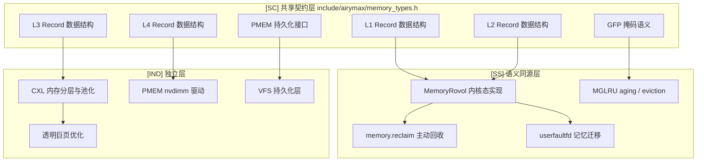
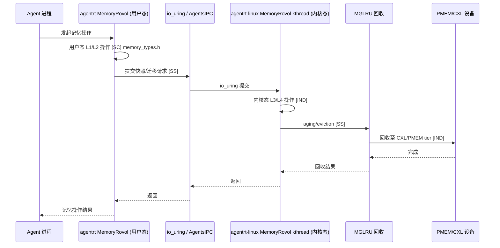

Copyright (c) 2025-2026 SPHARX Ltd. All Rights Reserved.

# agentrt-linux 记忆设计文档

> **文档定位**：agentrt-linux（AirymaxOS）记忆设计文档（memory，极境记忆&存储）\
> **文档版本**：v1.1（2026-07-07）\
> **上级文档**：[agentrt-linux 设计文档](README.md)\
> **核心约束**：IRON-9 v2 同源且部分代码共享——与 agentrt 用户态 memoryrovol 通过 \[SC] 共享契约层 + \[SS] 语义同源层协作，\[IND] 内核态 CXL/PMEM/VFS 持久化实现独立\
> **子仓编号**：04\
> **子仓代号**：极境记忆（Airymax Memory）\
> **设计基准**：MemoryRovol 内核态 + CXL 内存分层 + PMEM 持久化 + MGLRU 多代回收\
> **同源 agentrt**：heapstore + memoryrovol（MemoryRovol）\
> **横切关注点**：记忆卷载贯穿调度（记忆迁移感知）、IPC（快照传递）、eBPF（回收追踪）、安全（记忆加密）4 大数据流

***

## 目录

- [1. 子仓职责](#1-子仓职责)
- [2. 同源关系（IRON-9 v2 三层共享模型）](#2-同源关系iron-9-v2-三层共享模型)
- [3. 目录结构](#3-目录结构)
- [4. 核心特性](#4-核心特性)
- [5. 微内核思想体现](#5-微内核思想体现)
- [6. IRON-9 v2 三层共享模型落地](#6-iron-9-v2-三层共享模型落地)
- [7. agentrt-linux 工程基线](#7-agentrt-linux-工程基线)
- [8. 前沿理论参考](#8-前沿理论参考)
- [9. 与其他子仓的协作](#9-与其他子仓的协作)
- [10. 里程碑（M0-M8）](#10-里程碑m0-m8)
- [11. agentrt 一致性检查](#11-agentrt-一致性检查)
- [12. 相关文档](#12-相关文档)
- [13. 参考](#13-参考)

***

## 1. 子仓职责

`memory` 是 agentrt-linux（AirymaxOS）的记忆与存储子仓，承担以下核心职责：

1. **MemoryRovol 内核态实现 \[SS]**：将 agentrt 的 MemoryRovol（记忆卷载）升级为内核态实现，提供 Agent 记忆的持久化与卷载能力。L1-L4 数据结构 \[SC] 与 agentrt 共享。
2. **CXL 内存分层与池化 \[IND]**：利用 2026 年 CXL 3.0 硬件普及，实现内存分层与池化。
3. **持久化内存（PMEM）\[IND]**：基于 PMEM 提供非易失性内存支持。PMEM 持久化接口 \[SC] 与 agentrt 共享。
4. **MGLRU \[SS]**：利用 Linux 6.6 多代 LRU 改进，优化内存回收策略。GFP 掩码语义 \[SC] 与 agentrt 共享。
5. **VFS 持久化层 \[IND]**：为 `services/vfs` 提供持久化后端。
6. **userfaultfd 用户态缺页处理 \[SS]**：支持用户态缺页处理，用于记忆迁移与快照。
7. **透明巨页（THP）优化 \[IND]**：利用 Linux 6.6 THP 改进提升大页性能。

### 1.1 横切关注点声明

记忆卷载贯穿 agentrt-linux 全部 4 大数据流：

| 数据流      | 记忆切入点                               | 同源标注   |
| -------- | ----------------------------------- | ------ |
| 调度数据流    | 记忆迁移感知——迁移期间调整调度优先级                 | \[SS]  |
| IPC 数据流  | 快照传递——MemoryRovol 快照通过 io\_uring 传递 | \[SS]  |
| eBPF 数据流 | MGLRU 回收追踪——BPF 追踪 aging/eviction   | \[SS]  |
| 安全数据流    | 记忆加密——MemoryRovol 加密与 TEE 保护        | \[IND] |

***

## 2. 同源关系（IRON-9 v2 三层共享模型）

依据 IRON-9 v2 决策，agentrt（用户态 memoryrovol）与 agentrt-linux（内核态 memory）通过三层共享模型协作：

| 层次               | 共享程度          | 记忆子系统内容                                                                                                                  | 组织方式                             |
| ---------------- | ------------- | ------------------------------------------------------------------------------------------------------------------------ | -------------------------------- |
| **\[SC] 共享契约层**  | 完全共享代码        | MemoryRovol L1-L4 数据结构、GFP 掩码语义、PMEM 持久化接口                                                                               | `include/airymax/memory_types.h` |
| **\[SS] 语义同源层**  | 操作模式同源，函数签名独立 | `rovol_snapshot()`、`rovol_restore()`、`rovol_migrate()`、`rovol_compress()`、MGLRU aging/eviction 语义、userfaultfd 处理接口 等 6 项 | 各自独立实现                           |
| **\[IND] 完全独立层** | 完全独立          | CXL 设备驱动、PMEM 设备驱动、VFS 持久化层实现、THP 优化实现、zswap/zram 集成                                                                     | 各自独立仓库                           |

### 2.1 维度对比

| 维度       | agentrt（heapstore + memoryrovol） | agentrt-linux（memory）           | 同源标注   |
| -------- | -------------------------------- | ------------------------------- | ------ |
| 记忆存储     | heapstore（用户态）                   | MemoryRovol 内核态 + heapstore 用户态 | \[SS]  |
| 记忆卷载     | MemoryRovol（用户态）                 | MemoryRovol 内核态实现               | \[SS]  |
| 持久化      | 文件系统                             | PMEM + CXL + VFS 持久化层           | \[IND] |
| 分层       | 用户态分层                            | CXL 内存分层 + MGLRU                | \[IND] |
| L1-L4 结构 | 用户态数据结构                          | 内核态数据结构                         | \[SC]  |
| GFP 掩码   | 应用层标志                            | 内核分配标志                          | \[SC]  |
| PMEM 接口  | 应用层抽象                            | 内核持久化接口                         | \[SC]  |

### 2.2 同源传承要点

- 保留 agentrt MemoryRovol 的"记忆卷载"语义（snapshot + restore）\[SS]。
- 保留 heapstore 的"记忆存储"抽象 \[SS]。
- L1-L4 数据结构 \[SC] 共享，确保两端记忆层级语义一致。
- GFP 掩码语义 \[SC] 共享，便于用户态代码移植到内核态。
- PMEM 持久化接口 \[SC] 共享，统一持久化抽象。
- 升级为内核态实现，利用 CXL/PMEM 硬件加速 \[IND]。

***

## 3. 目录结构

```
memory/
├── memoryrovol/            # MemoryRovol 内核态实现（记忆卷载）[SS]
├── cxl/                    # CXL 内存分层与池化 [IND]
├── pmem/                   # 持久化内存 [IND]
├── mglru/                  # MGLRU（Linux 6.6 多代 LRU）[SS]
├── vfs-persist/            # VFS 持久化层 [IND]
├── userfaultfd/           # 用户态缺页处理 [SS]
├── thp/                    # 透明巨页优化 [IND]
└── docs/
```

### 3.1 memoryrovol/（MemoryRovol 内核态实现）\[SS]

参考 agentrt MemoryRovol 设计，L1-L4 数据结构 \[SC] 共享：

- `rovol-kmod`：内核模块，提供记忆卷载系统调用 \[SS]。
- `snapshot`：记忆快照（基于 fork + COW）\[SS]。
- `restore`：记忆恢复（基于 mmap + userfaultfd）\[SS]。
- `migrate`：记忆迁移（跨节点、跨 CXL 设备）\[SS]。
- `compress`：记忆压缩（zswap、zram 集成）\[IND]。
- `encrypt`：记忆加密（与 `security` 协作）\[IND]。

### 3.2 cxl/（CXL 内存分层与池化）\[IND]

基于 **CXL 3.0** 规格：

- `cxl-type2`：CXL Type 2 设备支持（缓存一致内存）。
- `cxl-type3`：CXL Type 3 设备支持（内存扩展）。
- `tiering`：内存分层策略（FAST/CXL/PMEM tier）。
- `pooling`：内存池化（跨节点共享）。
- `hotplug`：CXL 内存热插拔。

### 3.3 pmem/（持久化内存）\[IND]

PMEM 持久化接口 \[SC] 与 agentrt 共享：

- `pmem-driver`：PMEM 设备驱动（nvdimm）。
- `dax`：DAX（Direct Access）模式，绕过 page cache。
- `fsdax`：文件系统 DAX（ext4-dax、xfs-dax）。
- `devdax`：设备 DAX（字符设备模式）。

### 3.4 mglru/（MGLRU）\[SS]

利用 **Linux 6.6** MGLRU 改进，GFP 掩码语义 \[SC] 共享：

- `multi-gen-lru`：多代 LRU 回收策略 \[SS]。
- `aging`：老化策略（按代标记页面）\[SS]。
- `eviction`：逐出策略（按代逐出）\[SS]。
- `workingset-protection`：工作集保护 \[SS]。

### 3.5 vfs-persist/（VFS 持久化层）\[IND]

为 `services/vfs` 提供持久化后端：

- `backends/`：后端实现（PMEM、CXL、SSD、HDD）。
- `journal`：日志系统（WAL）。
- `snapshot`：文件系统快照。
- `dedup`：去重。
- `compress`：压缩（zstd、lz4）。

### 3.6 userfaultfd/（用户态缺页处理）\[SS]

- `uffd-handler`：用户态缺页处理框架 \[SS]。
- `live-migration`：进程实时迁移 \[SS]。
- `snapshot`：进程快照（与 MemoryRovol 协作）\[SS]。
- `postcopy`：post-copy 迁移策略 \[SS]。

### 3.7 thp/（透明巨页优化）\[IND]

利用 **Linux 6.6** THP 改进：

- `hugepages`：大页分配策略。
- `khugepaged`：大页合并守护进程。
- `madvise`：madvise 策略（MADV\_HUGEPAGE）。
- `shmem`：shmem 大页支持。

#### 3.8 组件架构图



***

## 4. 核心特性

### 4.1 MemoryRovol 内核态实现（同源）\[SS]

**记忆卷载语义** \[SS]——操作模式同源（概念操作一致），函数签名因抽象层级不同而独立：

- `rovol_snapshot(pid)`：对指定进程创建记忆快照 \[SS]。
- `rovol_restore(snapshot_id)`：从快照恢复记忆 \[SS]。
- `rovol_migrate(pid, target_node)`：迁移进程记忆至目标节点 \[SS]。
- `rovol_compress(snapshot_id)`：压缩快照 \[SS]。

**MemoryRovol L1-L4 数据结构** \[SC]（`include/airymax/memory_types.h`）：

```c
/* L1: 实时记忆层——高频读写，DRAM 存储 */
typedef struct airy_mr_l1_record {
    uint64_t trace_id;          /* 追踪 ID */
    uint64_t timestamp;         /* 时间戳 */
    uint32_t priority;          /* 优先级 */
    uint32_t data_len;          /* 数据长度 */
    uint8_t  data[];            /* 柔性数组 */
} airy_mr_l1_record_t;

/* L2: 短期记忆层——中频读写，MGLRU aging 管理 */
typedef struct airy_mr_l2_block {
    uint64_t block_id;
    uint64_t generation;        /* MGLRU 代序号 [SS] */
    uint32_t ref_count;
    uint32_t compressed_size;
} airy_mr_l2_block_t;

/* L3: 长期记忆层——低频读写，CXL tier 存储 */
typedef struct airy_mr_l3_entry {
    uint64_t entry_id;
    uint64_t last_access;       /* 最后访问时间 */
    uint32_t access_count;      /* 访问计数 */
    uint8_t  tier;              /* 存储层级（CXL/PMEM/SSD）*/
} airy_mr_l3_entry_t;

/* L4: 持久记忆层——PMEM 持久化 */
typedef struct airy_mr_l4_persistent {
    uint64_t persistent_id;
    uint64_t checksum;          /* 完整性校验 */
    uint32_t flags;              /* GFP 掩码 [SC] */
} airy_mr_l4_persistent_t;
```

**实现机制** \[IND]：

- 快照基于 fork + COW（用户空间）或 fork + userfaultfd（内核空间）。
- 恢复基于 mmap + userfaultfd 按需加载。
- 迁移基于 userfaultfd post-copy。

### 4.2 CXL 内存分层与池化（2026 硬件普及）\[IND]

**CXL 3.0 规格**（2026 硬件普及）：

- cache coherent：缓存一致性，简化编程模型。
- multi-host：多主机共享内存池。
- switching：CXL switch 支持复杂拓扑。

**分层策略** \[IND]：

| Tier | 设备         | 延迟      | 用途  | 对应 MemoryRovol  |
| ---- | ---------- | ------- | --- | --------------- |
| FAST | DRAM       | \~100ns | 热数据 | L1 实时记忆 \[SC]   |
| CXL  | CXL memory | \~200ns | 温数据 | L2/L3 中长期 \[SS] |
| PMEM | 持久内存       | \~300ns | 持久化 | L4 持久 \[SC]     |
| SSD  | NVMe SSD   | \~10μs  | 冷数据 | 归档 \[IND]       |

**池化** \[IND]：

- 多节点共享 CXL 内存池。
- 动态分配/释放内存至不同节点。
- 故障切换（节点宕机时内存迁移）。

### 4.3 PMEM 持久化内存 \[IND]

**PMEM 持久化接口** \[SC]（`include/airymax/memory_types.h`）：

```c
/* PMEM 持久化接口 [SC]——agentrt 与 agentrt-linux 共享 */
typedef struct airy_pmem_ops {
    int (*persist)(const void *addr, size_t len);    /* 持久化（clwb + sfence）*/
    int (*flush)(const void *addr, size_t len);       /* 刷新缓存行 */
    void *(*map)(uint64_t offset, size_t len);        /* 映射 PMEM 区域 */
    int (*unmap)(void *addr, size_t len);             /* 解除映射 */
} airy_pmem_ops_t;
```

**特性** \[IND]：

- 非易失性：断电后数据保留。
- 字节寻址：像内存一样访问。
- 低延迟：\~300ns（比 SSD 快 30 倍）。

**应用** \[IND]：

- Agent 记忆持久化（MemoryRovol L4 后端）。
- 文件系统元数据（DAX 模式）。
- 日志系统（WAL）。

### 4.4 MGLRU（Linux 6.6 多代 LRU）\[SS]

**GFP 掩码语义** \[SC]（`include/airymax/memory_types.h`）：

```c
/* GFP 掩码 [SC]——agentrt 与 agentrt-linux 共享分配语义 */
#define AIRY_GFP_IO         0x40    /* 允许 I/O（写回脏页）*/
#define AIRY_GFP_FS         0x80    /* 允许文件系统操作 */
#define AIRY_GFP_RECLAIM    0x400   /* 允许直接回收（阻塞）*/
#define AIRY_GFP_KSWAPD     0x800   /* 唤醒 kswapd 异步回收 */
#define AIRY_GFP_HIGH       0x20    /* 高优先级 */
#define AIRY_GFP_NOWARN     0x200   /* 抑制分配失败警告 */
#define AIRY_GFP_ZERO        0x100   /* 返回清零页 */
```

**改进** \[SS]：

- 多代回收：页面按代分组，按代逐出。
- 工作集保护：识别并保护活跃工作集。
- 更优的内存压力应对。

**配置** \[IND]：

```
echo y > /sys/kernel/mm/lru_gen/enabled
echo 1000 > /sys/kernel/mm/lru_gen/max_seq
```

### 4.5 VFS 持久化层 \[IND]

**多后端支持** \[IND]：

- PMEM：高性能持久化。
- CXL：可共享持久化。
- SSD：大容量持久化。
- HDD：归档持久化。

**特性** \[IND]：

- 写前日志（WAL）：保证崩溃一致性。
- 快照：文件系统级快照。
- 去重：块级去重。
- 压缩：zstd/lz4 压缩。

### 4.6 userfaultfd 用户态缺页处理 \[SS]

**用例** \[SS]：

- 进程实时迁移：将进程从一节点迁移至另一节点。
- 进程快照：创建进程记忆快照。
- 按需加载：仅在访问时加载页面。
- 惰性恢复：从快照惰性恢复。

**API** \[SS]：

```c
struct uffdio_api api = { .api = UFFD_API };
ioctl(uffd, UFFDIO_API, &api);
/* 注册缺页处理区域 */
struct uffdio_register reg = {
    .range = { .start = addr, .len = size },
    .mode = UFFDIO_REGISTER_MODE_MISSING,
};
ioctl(uffd, UFFDIO_REGISTER, &reg);
```

### 4.7 透明巨页（THP）优化（Linux 6.6）\[IND]

**Linux 6.6 改进** \[IND]：

- 更激进的 khugepaged 合并策略。
- shmem 大页支持改进。
- madvise 行为更可预测。
- 减少 THP 抖动。

**配置** \[IND]：

```
echo always > /sys/kernel/mm/transparent_hugepage/enabled
echo madvise > /sys/kernel/mm/transparent_hugepage/shmem_enabled
```

***

## 5. 微内核思想体现

### 5.1 记忆作为独立服务

遵循微内核"机制在内核，策略在用户态"原则（Liedtke minimality principle）：

- 内核提供 MemoryRovol 机制（snapshot、restore、migrate）\[SS]。
- 记忆管理策略（何时快照、何时迁移）在用户态 daemon（`macro_superv`）\[SS]。
- L1-L4 数据结构 \[SC] 两端共享，确保记忆层级语义一致。

### 5.2 内存分层解耦

- 内存分层策略在用户态（与 `cognition` 协作）\[IND]。
- 内核仅提供分层机制（CXL、PMEM、DRAM tier）\[IND]。
- GFP 掩码 \[SC] 两端共享，统一分配语义。

### 5.3 最小内核介入

- userfaultfd 让用户态处理缺页，减少内核介入 \[SS]。
- DAX 模式绕过 page cache，减少内核介入 \[IND]。
- 符合微内核"最小化特权态代码"原则。

***

## 6. IRON-9 v2 三层共享模型落地

### 6.1 \[SC] 共享契约层——`include/airymax/memory_types.h`

本头文件完全共享代码，agentrt 用户态与 agentrt-linux 内核态两端直接 include。内容清单：

| 内容                           | 说明                                                         |
| ---------------------------- | ---------------------------------------------------------- |
| `airy_mr_l1_record_t` 结构     | L1 实时记忆层（trace\_id/timestamp/priority/data\_len/data）      |
| `airy_mr_l2_block_t` 结构      | L2 短期记忆层（block\_id/generation/ref\_count/compressed\_size） |
| `airy_mr_l3_entry_t` 结构      | L3 长期记忆层（entry\_id/last\_access/access\_count/tier）        |
| `airy_mr_l4_persistent_t` 结构 | L4 持久记忆层（persistent\_id/checksum/flags）                    |
| `AIRY_GFP_*` 宏               | GFP 掩码语义（IO/FS/RECLAIM/KSWAPD/HIGH/NOWARN/ZERO）            |
| `airy_pmem_ops_t` 结构         | PMEM 持久化接口（persist/flush/map/unmap）                        |

### 6.2 \[SS] 语义同源层——6 项 API 映射

操作模式同源（概念操作一致），函数签名因抽象层级不同而独立：

| 序号 | API                  | 语义     | agentrt 实现   | agentrt-linux 实现         |
| -- | -------------------- | ------ | ------------ | ------------------------ |
| 1  | `rovol_snapshot()`   | 创建记忆快照 | 用户态 fork+COW | 内核 fork+userfaultfd      |
| 2  | `rovol_restore()`    | 恢复记忆   | 用户态 mmap     | 内核 mmap+userfaultfd      |
| 3  | `rovol_migrate()`    | 迁移记忆   | 用户态迁移        | 内核 userfaultfd post-copy |
| 4  | `rovol_compress()`   | 压缩快照   | 用户态 zstd     | 内核 zswap/zram            |
| 5  | MGLRU aging/eviction | 代际回收语义 | 用户态模拟        | 内核 `lru_gen_folio`       |
| 6  | userfaultfd 处理       | 缺页处理   | 用户态 handler  | 内核 uffd 框架               |

### 6.3 \[IND] 完全独立层——5 项独立实现

| 序号 | 内容            | 不共享原因                          |
| -- | ------------- | ------------------------------ |
| 1  | CXL 设备驱动      | 硬件驱动仅 agentrt-linux 内核态        |
| 2  | PMEM 设备驱动     | nvdimm 驱动仅 agentrt-linux 内核态   |
| 3  | VFS 持久化层实现    | 文件系统后端仅 agentrt-linux          |
| 4  | THP 优化实现      | khugepaged 仅 agentrt-linux 内核态 |
| 5  | zswap/zram 集成 | 内核压缩框架仅 agentrt-linux          |

### 6.4 跨态协作流



***

## 7. agentrt-linux 工程基线

- **agentrt-linux 内存管理**：MGLRU、CXL、THP 等特性贡献。
- **agentrt-linux 内存分层**：内存分层策略基线。
- **agentrt-linux PMEM**：持久化内存支持。
- **agentrt-linux CXL**：CXL 设备支持。
- **Linux 6.6 内核基线**：MGLRU + userfaultfd + THP + CXL bus + ZONE\_DEVICE + DAX。

### 7.1 五维正交 24 原则映射

| 原则                      | 在本模块的体现                                |
| ----------------------- | -------------------------------------- |
| **E-1 安全内生**            | 记忆加密 + PMEM 完整性校验 + TEE 保护             |
| **K-3 服务隔离**            | MemoryRovol 独立 kthread + memcg 隔离      |
| **K-4 可插拔策略**           | 内存分层策略可配置 + VFS 后端可插拔                  |
| **IRON-9 v2 同源且部分代码共享** | \[SC] 共享契约层 + \[SS] 语义同源层 + \[IND] 独立层 |
| **A-4 完美主义**            | CXL 内存池化 + PMEM 持久化 + MGLRU 多代回收       |

***

## 8. 前沿理论参考

| 理论                           | 来源              | 应用                     | 同源标注   |
| ---------------------------- | --------------- | ---------------------- | ------ |
| Liedtke minimality principle | Liedtke SOSP'95 | 微内核最小化原则——机制在内核，策略在用户态 | \[SS]  |
| CXL 3.0                      | CXL Consortium  | 内存分层与池化                | \[IND] |
| PMEM                         | Intel           | 持久化内存                  | \[IND] |
| MGLRU                        | Linux 6.6       | 多代 LRU 回收——代际模型        | \[SS]  |
| userfaultfd                  | Linux 4.x+      | 用户态缺页处理                | \[SS]  |
| Linux 6.6 THP                | Linux 6.6       | 透明巨页                   | \[IND] |
| DAX                          | Linux           | 直接访问模式                 | \[IND] |
| zswap/zram                   | Linux           | 内存压缩                   | \[IND] |
| MemoryRovol                  | agentrt         | 记忆卷载——L1-L4 分层         | \[SC]  |

***

## 9. 与其他子仓的协作

| 协作子仓          | 协作内容                           | 同源标注           |
| ------------- | ------------------------------ | -------------- |
| `kernel`      | 提供 MemoryRovol、CXL、MGLRU 内核实现  | \[SS] + \[IND] |
| `services`    | 提供 VFS 持久化层、MemoryRovol 用户态服务  | \[SS]          |
| `security`    | 提供记忆加密、TEE 保护                  | \[IND]         |
| `cognition`   | 提供 Agent 记忆管理、CoreLoopThree 协作 | \[SS]          |
| `cloudnative` | 提供容器记忆卷载、迁移                    | \[IND]         |
| `system`      | 提供内存监控工具                       | \[SS]          |
| `tests-linux` | 内存测试、Soak Test                 | \[SS]          |

***

## 10. 里程碑（M0-M8）

| 阶段 | 目标                                           | 时间      | 同源标注   |
| -- | -------------------------------------------- | ------- | ------ |
| M0 | 文档体系完成（本模块设计文档）                              | 2026-07 | —      |
| M1 | \[SC] `include/airymax/memory_types.h` 共享契约层 | 2026 Q3 | \[SC]  |
| M2 | MemoryRovol 内核态实现 + L1-L4 数据结构               | 2026 Q3 | \[SS]  |
| M3 | MGLRU 集成 + aging/eviction 策略                 | 2026 Q4 | \[SS]  |
| M4 | userfaultfd 缺页处理框架 + 迁移                      | 2026 Q4 | \[SS]  |
| M5 | PMEM 持久化内存支持 + DAX                           | 2027 Q1 | \[IND] |
| M6 | CXL 内存分层（Phase 1）+ tiering                   | 2027 Q1 | \[IND] |
| M7 | CXL 内存池化 + VFS 持久化层                          | 2027 Q2 | \[IND] |
| M8 | THP 优化 + zswap/zram 集成                       | 2027 Q2 | \[IND] |

### 10.1 0.1.1 版本范围

仅完成 M0（文档体系完成）+ M1（\[SC] 共享契约层头文件占位）。不含内核/OS 代码实施。

### 10.2 1.0.1 版本范围

完成 M2-M8 全部里程碑，并实施记忆工程标准。

***

## 11. agentrt 一致性检查

对 agentrt heapstore + memoryrovol 设计进行一致性检查，确认两端在 IRON-9 v2 三层共享模型下无冲突：

| 序号 | 检查项                        | agentrt 状态                    | agentrt-linux 状态         | 结论          |
| -- | -------------------------- | ----------------------------- | ------------------------ | ----------- |
| 1  | L1 实时记忆数据结构一致性             | l1\_record\_t                 | l1\_record\_t（同）         | PASS \[SC]  |
| 2  | L2 短期记忆数据结构一致性             | l2\_block\_t（含 generation）    | l2\_block\_t（同）          | PASS \[SC]  |
| 3  | L3 长期记忆数据结构一致性             | l3\_entry\_t（含 tier）          | l3\_entry\_t（同）          | PASS \[SC]  |
| 4  | L4 持久记忆数据结构一致性             | l4\_persistent\_t（含 checksum） | l4\_persistent\_t（同）     | PASS \[SC]  |
| 5  | GFP 掩码语义一致性                | 7 个 AIRY\_GFP\_\* 宏           | 7 个（同）                   | PASS \[SC]  |
| 6  | PMEM 持久化接口一致性              | 4 函数（persist/flush/map/unmap） | 4 函数（同）                  | PASS \[SC]  |
| 7  | `rovol_snapshot()` 语义等价性   | 用户态 fork+COW                  | 内核 fork+userfaultfd      | PASS \[SS]  |
| 8  | `rovol_restore()` 语义等价性    | 用户态 mmap                      | 内核 mmap+userfaultfd      | PASS \[SS]  |
| 9  | `rovol_migrate()` 语义等价性    | 用户态迁移                         | 内核 userfaultfd post-copy | PASS \[SS]  |
| 10 | `rovol_compress()` 语义等价性   | 用户态 zstd                      | 内核 zswap/zram            | PASS \[SS]  |
| 11 | MGLRU aging/eviction 语义一致性 | 用户态模拟                         | 内核 `lru_gen_folio`       | PASS \[SS]  |
| 12 | userfaultfd 处理语义等价性        | 用户态 handler                   | 内核 uffd 框架               | PASS \[SS]  |
| 13 | CXL/PMEM/VFS 独立性           | 不实现                           | 内核态实现                    | PASS \[IND] |
| 14 | THP/zswap 独立性              | 不实现                           | 内核态实现                    | PASS \[IND] |
| 15 | MGLRU Bloom 过滤器独立性         | 不使用                           | 内核态使用（可选优化）              | PASS \[IND] |

**结论**：agentrt heapstore + memoryrovol 设计无需修改。15 项检查全部 PASS，两端在 \[SC]/\[SS]/\[IND] 三层共享模型下完全一致。

***

## 12. 相关文档

- `40-dataflows/02-memory-flow.md`（记忆卷载数据流设计）
- `50-engineering-standards/01-coding-standards.md`（记忆编码规范）
- `80-testing/` 内存测试文档
- `90-observability/README.md`（内存监控）
- agentrt heapstore + memoryrovol 设计文档（同源 \[SC]/\[SS]）

***

## 13. 参考

- CXL 3.0 规格（CXL Consortium）
- Linux 6.6 MGLRU 文档（`mm/vmscan.c` + `include/linux/mmzone.h`）
- Linux 6.6 THP 文档
- Linux 6.6 userfaultfd 文档（`mm/userfaultfd.c`）
- Linux 6.6 DAX 文档（`fs/dax.c`）
- Linux 6.6 CXL bus 文档（`drivers/cxl/`）
- Linux 6.6 ZONE\_DEVICE 文档（`include/linux/mmzone.h`）
- PMEM 文档（Intel）
- agentrt-linux 内存管理文档
- agentrt heapstore + memoryrovol 设计文档
- Liedtke SOSP'95（微内核最小化原则）

***

> **文档结束** | v1.1 | IRON-9 v2 同源且部分代码共享 | 记忆卷载贯穿 4 大数据流 | 0.1.1 = 文档体系完成

