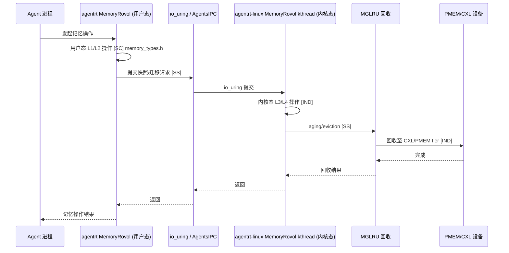

Copyright (c) 2025-2026 SPHARX Ltd. All Rights Reserved.

# agentrt-linux 记忆设计文档

> **文档定位**：agentrt-linux（AirymaxOS）记忆设计文档（memory，极境记忆&存储）\
> **文档版本**：v1.0.1\
> **上级文档**：[agentrt-linux 设计文档](README.md)\
> **核心约束**：IRON-9 v3 同源且部分代码共享——与 agentrt 用户态 memoryrovol 通过 \[SC] 共享契约层 + \[SS] 语义同源层协作，\[IND] 内核态 CXL/PMEM/VFS 持久化实现独立\
> **子仓编号**：04\
> **子仓代号**：极境记忆（Airymax Memory）\
> **设计基准**：MemoryRovol 内核态 + CXL 内存分层 + PMEM 持久化 + MGLRU 多代回收\
> **同源 agentrt**：heapstore + memoryrovol（MemoryRovol）\
> **横切关注点**：记忆卷载贯穿调度（记忆迁移感知）、IPC（快照传递）、eBPF（回收追踪）、安全（记忆加密）4 大数据流

***

## 目录

- [1. 子仓职责](#1-子仓职责)
- [2. 同源关系（IRON-9 v3 四层共享模型）](#2-同源关系iron-9-v3-四层共享模型)
- [3. 目录结构](#3-目录结构)
- [4. 核心特性](#4-核心特性)
  - [4.8 mem_d daemon 设计（12 daemon 之一）](#48-mem_d-daemon-设计12-daemon-之一)
  - [4.9 io_uring 工程规范与三独立数据区](#49-io_uring-工程规范与三独立数据区)
  - [4.10 Badge 在 MemoryRovol 中的应用](#410-badge-在-memoryrovol-中的应用)
  - [4.11 ADR 引用](#411-adr-引用)
- [5. 微内核思想体现](#5-微内核思想体现)
- [6. IRON-9 v3 四层共享模型落地](#6-iron-9-v3-四层共享模型落地)
- [7. agentrt-linux 工程基线](#7-agentrt-linux-工程基线)
- [8. 前沿理论参考](#8-前沿理论参考)
- [9. 与其他子仓的协作](#9-与其他子仓的协作)
- [10. 里程碑（M0-M8）](#10-里程碑m0-m8)
- [11. agentrt 一致性检查](#11-agentrt-一致性检查)
- [12. 相关文档](#12-相关文档)
- [13. 参考](#13-参考)

***

## 1. 子仓职责

`memory` 是 agentrt-linux（AirymaxOS）的记忆与存储子仓，承担以下核心职责：

1. **MemoryRovol 内核态实现 \[SS]**：将 agentrt 的 MemoryRovol（记忆卷载）升级为内核态实现，提供 Agent 记忆的持久化与卷载能力。L1-L4 数据结构 \[SC] 与 agentrt 共享。
2. **CXL 内存分层与池化 \[IND]**：利用 2026 年 CXL 3.0 硬件普及，实现内存分层与池化。
3. **持久化内存（PMEM）\[IND]**：基于 PMEM 提供非易失性内存支持。PMEM 持久化接口 \[SC] 与 agentrt 共享。
4. **MGLRU \[SS]**：利用 Linux 6.6 多代 LRU 改进，优化内存回收策略。GFP 掩码语义 \[SC] 与 agentrt 共享。
5. **VFS 持久化层 \[IND]**：为 `services/vfs` 提供持久化后端。
6. **userfaultfd 用户态缺页处理 \[SS]**：支持用户态缺页处理，用于记忆迁移与快照。
7. **透明巨页（THP）优化 \[IND]**：利用 Linux 6.6 THP 改进提升大页性能。

### 1.1 横切关注点声明

记忆卷载贯穿 agentrt-linux 全部 4 大数据流：

| 数据流      | 记忆切入点                               | 同源标注   |
| -------- | ----------------------------------- | ------ |
| 调度数据流    | 记忆迁移感知——迁移期间调整调度优先级                 | \[SS]  |
| IPC 数据流  | 快照传递——MemoryRovol 快照通过 io\_uring 传递 | \[SS]  |
| eBPF 数据流 | MGLRU 回收追踪——BPF 追踪 aging/eviction   | \[SS]  |
| 安全数据流    | 记忆加密——MemoryRovol 加密与 TEE 保护        | \[IND] |

***

## 2. 同源关系（IRON-9 v3 四层共享模型）

依据 IRON-9 v3 决策，agentrt（用户态 memoryrovol）与 agentrt-linux（内核态 memory）通过 v3 四层共享模型（[SC] 共享契约 + [SS] 同源签名 + [IND] 独立 + [DSL] 降级生存）协作：

| 层次               | 共享程度          | 记忆子系统内容                                                                                                                  | 组织方式                             |
| ---------------- | ------------- | ------------------------------------------------------------------------------------------------------------------------ | -------------------------------- |
| **\[SC] 共享契约层**  | 完全共享代码        | MemoryRovol L1-L4 数据结构、GFP 掩码语义、PMEM 持久化接口                                                                               | `include/uapi/linux/airymax/memory_types.h`（10 个 [SC] 头文件之一） |
| **\[SS] 语义同源层**  | 操作模式同源，函数签名独立 | `rovol_snapshot()`、`rovol_restore()`、`rovol_migrate()`、`rovol_compress()`、MGLRU aging/eviction 语义、userfaultfd 处理接口 等 6 项 | 各自独立实现                           |
| **\[IND] 完全独立层** | 完全独立          | CXL 设备驱动、PMEM 设备驱动、VFS 持久化层实现、THP 优化实现、zswap/zram 集成                                                                     | 各自独立仓库                           |
| **\[DSL] 降级生存层** | 降级模式生存        | `#ifdef AIRY_SC_FALLBACK` 降级块位于 `memory_types.h` 底部——MemoryRovol L1-L4 降级为用户态 heapstore 实现、PMEM 持久化降级为文件 fsync、CXL tier 降级为 DRAM 单层、GFP 掩码降级为应用层标志 | 每个 \[SC] 头文件底部 `#ifdef AIRY_SC_FALLBACK` 块 |

### 2.1 维度对比

| 维度       | agentrt（heapstore + memoryrovol） | agentrt-linux（memory）           | 同源标注   |
| -------- | -------------------------------- | ------------------------------- | ------ |
| 记忆存储     | heapstore（用户态）                   | MemoryRovol 内核态 + heapstore 用户态 | \[SS]  |
| 记忆卷载     | MemoryRovol（用户态）                 | MemoryRovol 内核态实现               | \[SS]  |
| 持久化      | 文件系统                             | PMEM + CXL + VFS 持久化层           | \[IND] |
| 分层       | 用户态分层                            | CXL 内存分层 + MGLRU                | \[IND] |
| L1-L4 结构 | 用户态数据结构                          | 内核态数据结构                         | \[SC]  |
| GFP 掩码   | 应用层标志                            | 内核分配标志                          | \[SC]  |
| PMEM 接口  | 应用层抽象                            | 内核持久化接口                         | \[SC]  |

### 2.2 同源传承要点

- 保留 agentrt MemoryRovol 的"记忆卷载"语义（snapshot + restore）\[SS]。
- 保留 heapstore 的"记忆存储"抽象 \[SS]。
- L1-L4 数据结构 \[SC] 共享，确保两端记忆层级语义一致。
- GFP 掩码语义 \[SC] 共享，便于用户态代码移植到内核态。
- PMEM 持久化接口 \[SC] 共享，统一持久化抽象。
- 升级为内核态实现，利用 CXL/PMEM 硬件加速 \[IND]。

***

## 3. 目录结构

```
memory/
├── memoryrovol/            # MemoryRovol 内核态实现（记忆卷载）[SS]
├── cxl/                    # CXL 内存分层与池化 [IND]
├── pmem/                   # 持久化内存 [IND]
├── mglru/                  # MGLRU（Linux 6.6 多代 LRU）[SS]
├── vfs-persist/            # VFS 持久化层 [IND]
├── userfaultfd/           # 用户态缺页处理 [SS]
├── thp/                    # 透明巨页优化 [IND]
└── docs/
```

### 3.1 memoryrovol/（MemoryRovol 内核态实现）\[SS]

参考 agentrt MemoryRovol 设计，L1-L4 数据结构 \[SC] 共享：

- `rovol-kmod`：内核模块，提供记忆卷载系统调用 \[SS]。
- `snapshot`：记忆快照（基于 fork + COW）\[SS]。
- `restore`：记忆恢复（基于 mmap + userfaultfd）\[SS]。
- `migrate`：记忆迁移（跨节点、跨 CXL 设备）\[SS]。
- `compress`：记忆压缩（zswap、zram 集成）\[IND]。
- `encrypt`：记忆加密（与 `security` 协作）\[IND]。

### 3.2 cxl/（CXL 内存分层与池化）\[IND]

基于 **CXL 3.0** 规格：

- `cxl-type2`：CXL Type 2 设备支持（缓存一致内存）。
- `cxl-type3`：CXL Type 3 设备支持（内存扩展）。
- `tiering`：内存分层策略（FAST/CXL/PMEM tier）。
- `pooling`：内存池化（跨节点共享）。
- `hotplug`：CXL 内存热插拔。

### 3.3 pmem/（持久化内存）\[IND]

PMEM 持久化接口 \[SC] 与 agentrt 共享：

- `pmem-driver`：PMEM 设备驱动（nvdimm）。
- `dax`：DAX（Direct Access）模式，绕过 page cache。
- `fsdax`：文件系统 DAX（ext4-dax、xfs-dax）。
- `devdax`：设备 DAX（字符设备模式）。

### 3.4 mglru/（MGLRU）\[SS]

利用 **Linux 6.6** MGLRU 改进，GFP 掩码语义 \[SC] 共享：

- `multi-gen-lru`：多代 LRU 回收策略 \[SS]。
- `aging`：老化策略（按代标记页面）\[SS]。
- `eviction`：逐出策略（按代逐出）\[SS]。
- `workingset-protection`：工作集保护 \[SS]。

### 3.5 vfs-persist/（VFS 持久化层）\[IND]

为 `services/vfs` 提供持久化后端：

- `backends/`：后端实现（PMEM、CXL、SSD、HDD）。
- `journal`：日志系统（WAL）。
- `snapshot`：文件系统快照。
- `dedup`：去重。
- `compress`：压缩（zstd、lz4）。

### 3.6 userfaultfd/（用户态缺页处理）\[SS]

- `uffd-handler`：用户态缺页处理框架 \[SS]。
- `live-migration`：进程实时迁移 \[SS]。
- `snapshot`：进程快照（与 MemoryRovol 协作）\[SS]。
- `postcopy`：post-copy 迁移策略 \[SS]。

### 3.7 thp/（透明巨页优化）\[IND]

利用 **Linux 6.6** THP 改进：

- `hugepages`：大页分配策略。
- `khugepaged`：大页合并守护进程。
- `madvise`：madvise 策略（MADV\_HUGEPAGE）。
- `shmem`：shmem 大页支持。

#### 3.8 组件架构图


***

## 4. 核心特性

### 4.1 MemoryRovol 内核态实现（同源）\[SS]

**记忆卷载语义** \[SS]——操作模式同源（概念操作一致），函数签名因抽象层级不同而独立：

- `rovol_snapshot(pid)`：对指定进程创建记忆快照 \[SS]。
- `rovol_restore(snapshot_id)`：从快照恢复记忆 \[SS]。
- `rovol_migrate(pid, target_node)`：迁移进程记忆至目标节点 \[SS]。
- `rovol_compress(snapshot_id)`：压缩快照 \[SS]。

**MemoryRovol L1-L4 数据结构** \[SC]（`include/uapi/linux/airymax/memory_types.h`）：

```c
/* L1: 实时记忆层——高频读写，DRAM 存储 */
typedef struct airy_mr_l1_record {
    uint64_t trace_id;          /* 追踪 ID */
    uint64_t timestamp;         /* 时间戳 */
    uint32_t priority;          /* 优先级 */
    uint32_t data_len;          /* 数据长度 */
    uint8_t  data[];            /* 柔性数组 */
} airy_mr_l1_record_t;          /* 走 io_uring registered buffer，无需 __aligned(64) */

/* L2: 短期记忆层——中频读写，MGLRU aging 管理 */
typedef struct airy_mr_l2_block {
    uint64_t block_id;
    uint64_t generation;        /* MGLRU 代序号 [SS] */
    uint32_t ref_count;
    uint32_t compressed_size;
} airy_mr_l2_block_t __aligned(64);  /* cache line 对齐，避免 false sharing */

/* L3: 长期记忆层——低频读写，CXL tier 存储 */
typedef struct airy_mr_l3_entry {
    uint64_t entry_id;
    uint64_t last_access;       /* 最后访问时间 */
    uint32_t access_count;      /* 访问计数 */
    uint8_t  tier;              /* 存储层级（CXL/PMEM/SSD）*/
} airy_mr_l3_entry_t __aligned(64);  /* cache line 对齐 */

/* L4: 持久记忆层——PMEM 持久化 */
typedef struct airy_mr_l4_persistent {
    uint64_t persistent_id;
    uint64_t checksum;          /* 完整性校验 */
    uint32_t flags;              /* GFP 掩码 [SC] */
} airy_mr_l4_persistent_t __aligned(64);  /* PMEM cache line 对齐，保证原子持久化 */
```

> **对齐规范**：L2/L3/L4 结构体使用 `__aligned(64)`（OLK 6.6 工程规范——禁止使用 packed 属性或旧式 aligned 属性，统一使用 `__aligned(64)` 语法）。L1 走 io_uring registered buffer 路径，柔性数组按字节流传递，不强制对齐。

**实现机制** \[IND]：

- 快照基于 fork + COW（用户空间）或 fork + userfaultfd（内核空间）。
- 恢复基于 mmap + userfaultfd 按需加载。
- 迁移基于 userfaultfd post-copy。

### 4.2 CXL 内存分层与池化（2026 硬件普及）\[IND]

**CXL 3.0 规格**（2026 硬件普及）：

- cache coherent：缓存一致性，简化编程模型。
- multi-host：多主机共享内存池。
- switching：CXL switch 支持复杂拓扑。

**分层策略** \[IND]：

| Tier | 设备         | 延迟      | 用途  | 对应 MemoryRovol  |
| ---- | ---------- | ------- | --- | --------------- |
| FAST | DRAM       | \~100ns | 热数据 | L1 实时记忆 \[SC]   |
| CXL  | CXL memory | \~200ns | 温数据 | L2/L3 中长期 \[SS] |
| PMEM | 持久内存       | \~300ns | 持久化 | L4 持久 \[SC]     |
| SSD  | NVMe SSD   | \~10μs  | 冷数据 | 归档 \[IND]       |

**池化** \[IND]：

- 多节点共享 CXL 内存池。
- 动态分配/释放内存至不同节点。
- 故障切换（节点宕机时内存迁移）。

### 4.3 PMEM 持久化内存 \[IND]

**PMEM 持久化接口** \[SC]（`include/uapi/linux/airymax/memory_types.h`）：

```c
/* PMEM 持久化接口 [SC]——agentrt 与 agentrt-linux 共享 */
typedef struct airy_pmem_ops {
    int (*persist)(const void *addr, size_t len);    /* 持久化（clwb + sfence）*/
    int (*flush)(const void *addr, size_t len);       /* 刷新缓存行 */
    void *(*map)(uint64_t offset, size_t len);        /* 映射 PMEM 区域 */
    int (*unmap)(void *addr, size_t len);             /* 解除映射 */
} airy_pmem_ops_t;
```

**特性** \[IND]：

- 非易失性：断电后数据保留。
- 字节寻址：像内存一样访问。
- 低延迟：\~300ns（比 SSD 快 30 倍）。

**应用** \[IND]：

- Agent 记忆持久化（MemoryRovol L4 后端）。
- 文件系统元数据（DAX 模式）。
- 日志系统（WAL）。

### 4.4 MGLRU（Linux 6.6 多代 LRU）\[SS]

**GFP 掩码语义** \[SC]（`include/uapi/linux/airymax/memory_types.h`）：

```c
/* GFP 掩码 [SC]——agentrt 与 agentrt-linux 共享分配语义 */
#define AIRY_GFP_IO         0x40    /* 允许 I/O（写回脏页）*/
#define AIRY_GFP_FS         0x80    /* 允许文件系统操作 */
#define AIRY_GFP_RECLAIM    0x400   /* 允许直接回收（阻塞）*/
#define AIRY_GFP_KSWAPD     0x800   /* 唤醒 kswapd 异步回收 */
#define AIRY_GFP_HIGH       0x20    /* 高优先级 */
#define AIRY_GFP_NOWARN     0x200   /* 抑制分配失败警告 */
#define AIRY_GFP_ZERO        0x100   /* 返回清零页 */
```

**改进** \[SS]：

- 多代回收：页面按代分组，按代逐出。
- 工作集保护：识别并保护活跃工作集。
- 更优的内存压力应对。

**配置** \[IND]：

```
echo y > /sys/kernel/mm/lru_gen/enabled
echo 1000 > /sys/kernel/mm/lru_gen/max_seq
```

### 4.5 VFS 持久化层 \[IND]

**多后端支持** \[IND]：

- PMEM：高性能持久化。
- CXL：可共享持久化。
- SSD：大容量持久化。
- HDD：归档持久化。

**特性** \[IND]：

- 写前日志（WAL）：保证崩溃一致性。
- 快照：文件系统级快照。
- 去重：块级去重。
- 压缩：zstd/lz4 压缩。

### 4.6 userfaultfd 用户态缺页处理 \[SS]

**用例** \[SS]：

- 进程实时迁移：将进程从一节点迁移至另一节点。
- 进程快照：创建进程记忆快照。
- 按需加载：仅在访问时加载页面。
- 惰性恢复：从快照惰性恢复。

**API** \[SS]：

```c
struct uffdio_api api = { .api = UFFD_API };
ioctl(uffd, UFFDIO_API, &api);
/* 注册缺页处理区域 */
struct uffdio_register reg = {
    .range = { .start = addr, .len = size },
    .mode = UFFDIO_REGISTER_MODE_MISSING,
};
ioctl(uffd, UFFDIO_REGISTER, &reg);
```

### 4.7 透明巨页（THP）优化（Linux 6.6）\[IND]

**Linux 6.6 改进** \[IND]：

- 更激进的 khugepaged 合并策略。
- shmem 大页支持改进。
- madvise 行为更可预测。
- 减少 THP 抖动。

**配置** \[IND]：

```
echo always > /sys/kernel/mm/transparent_hugepage/enabled
echo madvise > /sys/kernel/mm/transparent_hugepage/shmem_enabled
```

### 4.8 mem_d daemon 设计（12 daemon 之一）

`mem_d` 是 AirymaxOS 用户态 **12 daemon** 之一，承担记忆卷载管理职责。daemon 命名后缀 `_d`（详见 [01-kernel.md §14.2](01-kernel.md)）。

| 维度 | 设计 |
| --- | --- |
| 职责 | MemoryRovol L1-L4 快照/恢复/迁移管理 |
| 内核切入点 | userfaultfd + MGLRU + CXL bus |
| 控制通道 | `airy_sys_rovol_ctl`（编号 1）——记忆卷载控制 syscall |
| 数据通道 | io_uring `IORING_OP_URING_CMD`（SQE128 模式，cmd 扩展至 80 字节） |
| daemon 命名 | `mem_d`（`_d` 后缀，12 daemon 命名约定） |

**`airy_sys_rovol_ctl`（编号 1）控制接口**：

```c
/* mem_d 通过 airy_sys_rovol_ctl 控制记忆卷载——4 核心 syscall 之一 */
enum airy_rovol_opcode {
    AIRY_ROVOL_SNAPSHOT   = 1,  /* 创建记忆快照 [SS] */
    AIRY_ROVOL_RESTORE    = 2,  /* 从快照恢复 [SS] */
    AIRY_ROVOL_MIGRATE    = 3,  /* 跨节点/跨 tier 迁移 [SS] */
    AIRY_ROVOL_COMPRESS   = 4,  /* 压缩快照 [SS] */
    AIRY_ROVOL_REGISTER   = 5,  /* 注册 io_uring registered buffer [IND] */
    AIRY_ROVOL_QUERY_TIER = 6,  /* 查询页面所在 tier [IND] */
};

int airy_sys_rovol_ctl(enum airy_rovol_opcode op,
                       struct airy_rovol_args __user *args);
```

> **mem_d 与 sec_d 协作**：mem_d 的所有记忆卷载操作受 `sec_d` 颁发的 Badge 权限控制（详见 §4.10）。`airy_sys_rovol_ctl` 入口校验调用方 Badge 的 Perms 位段是否含 `AIRY_CAP_PERM_ROVOL_*` 权限位。

### 4.9 io_uring 工程规范与三独立数据区

#### 4.9.1 io_uring 工程规范

OLK 6.6 内核基线下，记忆卷载数据面完全由 io_uring 承载（v1.0.1 Capability Folding 后 8 个 seL4 风格 IPC 原语 syscall 已全部移除）：

| 规范 | 说明 |
| --- | --- |
| `io_uring_cmd_to_pdu(cmd, pdu_type)` | OLK 6.6 安全宏，访问 `struct io_uring_cmd` 的 `pdu[32]` 字段（仅内联存储 cmd 前 32 字节副本） |
| `io_uring_cmd_done(cmd, ret, res2, issue_flags)` | OLK 6.6 标准 4 参数完成接口（禁止使用旧版 2 参数变体） |
| `security_uring_cmd(struct io_uring_cmd *ioucmd)` | OLK 6.6 LSM 钩子，**单参数**——airy_lsm 通过 `LSM_ORDER_MUTABLE` 注册叠加 Badge 审计 |
| SQE128 模式 | `IORING_SETUP_SQE128`——SQE 64B→128B，cmd 16B→80B，承载 `airy_ipc_cmd` |
| UAPI 路径 | `include/uapi/linux/airymax/`（标准路径） |

**mem_d 使用 `io_uring_cmd_to_pdu()` 示例**：

```c
/* mem_d io_uring cmd 处理——访问 pdu[32] 字段 */
static int mem_d_uring_cmd_handler(struct io_uring_cmd *ioucmd)
{
    /* pdu[32] 仅承载前 32 字节副本——含 rovol_opcode + agent_id */
    struct airy_rovol_cmd *cmd = io_uring_cmd_to_pdu(ioucmd, struct airy_rovol_cmd);
    int ret;

    /* fastpath C-S9 Badge 校验已在 io_uring issue 路径内联完成 */
    switch (cmd->rovol_opcode) {
    case AIRY_ROVOL_SNAPSHOT:
        ret = mem_d_do_snapshot(cmd->agent_id, cmd->snapshot_id);
        break;
    case AIRY_ROVOL_RESTORE:
        ret = mem_d_do_restore(cmd->agent_id, cmd->snapshot_id);
        break;
    /* ... */
    }

    /* OLK 6.6 标准 4 参数完成接口 */
    io_uring_cmd_done(ioucmd, ret, 0, 0);
    return 0;
}
```

#### 4.9.2 三独立数据区

mem_d 运行时维护**三个相互独立的数据区**，物理隔离避免相互污染：

| 数据区 | 大小 | 用途 | 分配方式 | 写者 |
| --- | --- | --- | --- | --- |
| **`agent_caps[1024]` 静态数组** | 16KB | capability Badge 存储（与 sec_d 共享全局实例） | 内核静态分配（`__aligned(64)` slot） | sec_d 唯一写者（mem_d 只读） |
| **`airy_ipc_ring` kfifo** | 默认 1MB | io_uring SQ/CQ ring + IPC 消息传递 | `kfifo_alloc()` 内核动态分配 | mem_d 内核侧 + io_uring issue 路径 |
| **io_uring registered buffer** | 默认 64MB | MemoryRovol L1 实时记忆数据零拷贝区 | `alloc_pages()` + `mmap()` 用户态映射 | mem_d 用户态 + 内核零拷贝读 |

> **三独立数据区设计原则**：capability（控制面）+ IPC ring（消息面）+ registered buffer（数据面）物理隔离，避免数据面负载影响控制面 Badge 校验延迟。这是 seL4 "机制与策略分离"思想在记忆子仓的体现（ADR-014）。

#### 4.9.3 io_uring registered buffer + alloc_pages + mmap（替代 page flipping）

MemoryRovol L1 实时记忆数据通过 **io_uring registered buffer** 零拷贝传递，替代传统 page flipping 方案：

| 维度 | 传统 page flipping | io_uring registered buffer |
| --- | --- | --- |
| 内存分配 | `alloc_page()` 单页 + `vm_insert_page()` | `alloc_pages()` 批量 + `mmap()` 用户态映射 |
| DMA 一致性 | 需要 DMA 一致性内存（`dma_alloc_coherent`） | **不使用 DMA 一致性内存**——纯 CPU 内存 + userfaultfd |
| 零拷贝 | 页表翻转（`mmap()` + `remap_pfn_range()`） | registered buffer 固定页 + io_uring 直接 DMA（如有设备） |
| 权限校验 | 每次翻转需 `cap_capable()` | 注册时一次性 Badge 校验 + 运行时 fastpath C-S9 内联 |
| 用户态访问 | 翻转后用户态可见 | `mmap()` 持久映射，无需翻转 |

**registered buffer 注册流程**（mem_d 启动时）：

```c
/* mem_d 启动时注册 io_uring registered buffer——alloc_pages + mmap 模式 */
int mem_d_register_ring_buffer(int ring_fd, size_t size)
{
    struct page **pages;
    void *vaddr;
    int nr_pages, ret;

    nr_pages = (size + PAGE_SIZE - 1) >> PAGE_SHIFT;
    pages = kvmalloc_array(nr_pages, sizeof(*pages), GFP_KERNEL);
    if (!pages)
        return -ENOMEM;

    /* alloc_pages 批量分配——不使用 DMA 一致性内存 */
    ret = alloc_pages_bulk_array(GFP_KERNEL | __GFP_ZERO, nr_pages, pages);
    if (ret != nr_pages)
        goto out_free_pages;

    /* vmap 映射到内核虚拟地址空间 */
    vaddr = vmap(pages, nr_pages, VM_MAP, PAGE_KERNEL);
    if (!vaddr)
        goto out_free_pages;

    /* mmap 映射到用户态——持久映射，无需 page flipping */
    /* ...vm_area_struct 处理 + remap_pfn_range... */

    /* 注册到 io_uring registered buffer 表 */
    ret = io_uring_register_buffers(ring_fd, /* ... */);

out_free_pages:
    kvmfree(pages);
    return ret;
}
```

> **关键约束**：registered buffer 使用 `alloc_pages()` + `mmap()` 模式，**不使用 DMA 一致性内存**（`dma_alloc_coherent()`）。MemoryRovol L1 数据通过 userfaultfd 按需加载，无需设备 DMA 一致性保证。该约束源自 OLK 6.6 工程规范——DMA 一致性内存资源稀缺，仅在设备驱动场景使用。
>
> **OLK 6.6 smart grid 扩展说明**：OLK 6.6 的 `__alloc_pages_mpol(gfp, order, mpol, ilx, nid, use_smart_grid)` 相比 vanilla 主线多出第 6 个参数 `bool use_smart_grid`，这是 openEuler 特有扩展。agentrt-linux 不依赖此扩展，MemoryRovol 内核态使用标准 `alloc_pages()` / `alloc_pages_bulk_array()` 接口。

### 4.10 Badge 在 MemoryRovol 中的应用

MemoryRovol L1-L4 分层访问受 `sec_d` 颁发的 Badge 权限控制。`mem_d` 在执行 `airy_sys_rovol_ctl` 操作时，fastpath C-S9 内联校验 Badge Perms 位段：

| MemoryRovol 操作 | Badge Perms 位 | 校验位置 | 失败错误码 |
| --- | --- | --- | --- |
| L1 实时记忆读写 | `AIRY_CAP_PERM_ROVOL_L1_RW` | fastpath C-S9.PERMS 内联 | `-AIRY_ECAP_PERM = -81` |
| L2 短期记忆读写 | `AIRY_CAP_PERM_ROVOL_L2_RW` | fastpath C-S9.PERMS 内联 | `-AIRY_ECAP_PERM = -81` |
| L3 长期记忆只读 | `AIRY_CAP_PERM_ROVOL_L3_RO` | fastpath C-S9.PERMS 内联 | `-AIRY_ECAP_PERM = -81` |
| L4 持久记忆读写 | `AIRY_CAP_PERM_ROVOL_L4_RW` | fastpath C-S9.PERMS 内联 | `-AIRY_ECAP_PERM = -81` |
| 跨 tier 迁移 | `AIRY_CAP_PERM_ROVOL_MIGRATE` | slowpath airy_lsm 钩子 | `-AIRY_ECAP_PERM = -81` |
| 跨节点迁移 | `AIRY_CAP_PERM_ROVOL_MIGRATE_NODE` | slowpath airy_lsm + gateway_d | `-AIRY_ECAP_PERM = -81` |
| 快照/恢复 | `AIRY_CAP_PERM_ROVOL_SNAPSHOT` | fastpath C-S9.PERMS 内联 | `-AIRY_ECAP_PERM = -81` |

**Badge Epoch 失效场景**：

- `sec_d` 执行 `atomic_inc(&airy_cap_global_epoch)` 撤销时，所有飞行中的 MemoryRovol 操作 fastpath C-S9.EPOCH 校验失败，返回 `-AIRY_ECAP_FROZEN = -82`（capability 冻结）。
- `mem_d` 收到 `-82` 后中止当前操作，通知 `macro_d` 重启受影响 Agent。
- 跨节点迁移时，`gateway_d` gossip 100ms 内同步 Epoch，确保 peer 节点 Badge 一致失效。

> **设计原则**：MemoryRovol 分层访问的 Badge 校验遵循"机制在内核（fastpath C-S9），策略在用户态（sec_d 编译 Badge）"原则（ADR-014 seL4 思想借鉴）。mem_d 不自行决定权限，仅执行 Badge 校验结果。

### 4.11 ADR 引用

| ADR | 标题 | 在本子仓的体现 |
| --- | --- | --- |
| [ADR-012](../10-architecture/05-adrs.md#adr-012) | 微内核化改造技术路线确认（基于 Linux 改造 + seL4 思想） | MemoryRovol 内核态实现基于 Linux 6.6 userfaultfd + MGLRU + CXL bus 改造，非从零实现 |
| [ADR-016](../10-architecture/05-adrs.md#adr-016) | 版本基线锁定（1.x.x 锁定 Linux 6.6） | OLK 6.6 MGLRU + userfaultfd + THP + CXL bus + ZONE_DEVICE + DAX |
| [ADR-014](../10-architecture/05-adrs.md#adr-014) | **微内核设计思想来源单一化（仅 seL4，不引入 Zircon/Minix3）** | **机制与策略分离原则（MemoryRovol 机制在内核，策略在 mem_d 用户态）；三独立数据区物理隔离借鉴 seL4 capability 空间隔离思想；Badge 分层访问控制借鉴 seL4 capability-based security；不引入 Zircon VMO rights/Minix3 多服务器模型** |

***

## 5. 微内核思想体现

### 5.1 记忆作为独立服务

遵循微内核"机制在内核，策略在用户态"原则（Liedtke minimality principle）：

- 内核提供 MemoryRovol 机制（snapshot、restore、migrate）\[SS]。
- 记忆管理策略（何时快照、何时迁移）在用户态 daemon（`macro_d`）\[SS]。
- L1-L4 数据结构 \[SC] 两端共享，确保记忆层级语义一致。

### 5.2 内存分层解耦

- 内存分层策略在用户态（与 `cognition` 协作）\[IND]。
- 内核仅提供分层机制（CXL、PMEM、DRAM tier）\[IND]。
- GFP 掩码 \[SC] 两端共享，统一分配语义。

### 5.3 最小内核介入

- userfaultfd 让用户态处理缺页，减少内核介入 \[SS]。
- DAX 模式绕过 page cache，减少内核介入 \[IND]。
- 符合微内核"最小化特权态代码"原则。

***

## 6. IRON-9 v3 四层共享模型落地

### 6.1 \[SC] 共享契约层——`include/uapi/linux/airymax/memory_types.h`

本头文件完全共享代码，agentrt 用户态与 agentrt-linux 内核态两端直接 include。内容清单：

| 内容                           | 说明                                                         |
| ---------------------------- | ---------------------------------------------------------- |
| `airy_mr_l1_record_t` 结构     | L1 实时记忆层（trace\_id/timestamp/priority/data\_len/data）      |
| `airy_mr_l2_block_t` 结构      | L2 短期记忆层（block\_id/generation/ref\_count/compressed\_size） |
| `airy_mr_l3_entry_t` 结构      | L3 长期记忆层（entry\_id/last\_access/access\_count/tier）        |
| `airy_mr_l4_persistent_t` 结构 | L4 持久记忆层（persistent\_id/checksum/flags）                    |
| `AIRY_GFP_*` 宏               | GFP 掩码语义（IO/FS/RECLAIM/KSWAPD/HIGH/NOWARN/ZERO）            |
| `airy_pmem_ops_t` 结构         | PMEM 持久化接口（persist/flush/map/unmap）                        |

### 6.2 \[SS] 语义同源层——6 项 API 映射

操作模式同源（概念操作一致），函数签名因抽象层级不同而独立：

| 序号 | API                  | 语义     | agentrt 实现   | agentrt-linux 实现         |
| -- | -------------------- | ------ | ------------ | ------------------------ |
| 1  | `rovol_snapshot()`   | 创建记忆快照 | 用户态 fork+COW | 内核 fork+userfaultfd      |
| 2  | `rovol_restore()`    | 恢复记忆   | 用户态 mmap     | 内核 mmap+userfaultfd      |
| 3  | `rovol_migrate()`    | 迁移记忆   | 用户态迁移        | 内核 userfaultfd post-copy |
| 4  | `rovol_compress()`   | 压缩快照   | 用户态 zstd     | 内核 zswap/zram            |
| 5  | MGLRU aging/eviction | 代际回收语义 | 用户态模拟        | 内核 `lru_gen_folio`       |
| 6  | userfaultfd 处理       | 缺页处理   | 用户态 handler  | 内核 uffd 框架               |

### 6.3 \[IND] 完全独立层——5 项独立实现

| 序号 | 内容            | 不共享原因                          |
| -- | ------------- | ------------------------------ |
| 1  | CXL 设备驱动      | 硬件驱动仅 agentrt-linux 内核态        |
| 2  | PMEM 设备驱动     | nvdimm 驱动仅 agentrt-linux 内核态   |
| 3  | VFS 持久化层实现    | 文件系统后端仅 agentrt-linux          |
| 4  | THP 优化实现      | khugepaged 仅 agentrt-linux 内核态 |
| 5  | zswap/zram 集成 | 内核压缩框架仅 agentrt-linux          |

### 6.4 \[DSL] 降级生存层——`#ifdef AIRY_SC_FALLBACK` 降级块

依据 IRON-9 v3 决策，`memory_types.h` 底部必须存在 `#ifdef AIRY_SC_FALLBACK` 降级块，保证 \[SC] 共享契约在内核态 \[SC] 头文件不可用或被裁剪时仍能维持降级生存模式。记忆子仓的 \[DSL] 降级策略：

| 序号 | 降级项 | 正常模式 | \[DSL] 降级模式 |
| -- | ---- | ------ | ------------- |
| 1  | MemoryRovol L1-L4 数据结构 | 内核态实现 + CXL/PMEM tier 分层 | 降级为 agentrt 用户态 heapstore 实现（仅 DRAM 单层） |
| 2  | PMEM 持久化接口 | `airy_pmem_ops_t`（clwb + sfence + DAX） | 降级为文件 `fsync()` 持久化 |
| 3  | MGLRU aging/eviction | 内核 `lru_gen_folio` 代际回收 | 降级为应用层 LRU 模拟 |
| 4  | userfaultfd 缺页处理 | 内核 uffd 框架 | 降级为 `mmap()` + `madvise()` 用户态模拟 |
| 5  | GFP 掩码语义 | 内核分配标志 | 降级为应用层 malloc 标志（语义保留，无内核效果） |
| 6  | io_uring registered buffer | 内核 registered buffer + 零拷贝 | 降级为 `read()`/`write()` 拷贝模式 |

> **\[DSL] 设计原则**：降级生存不等于功能完整——降级模式下性能显著下降（CXL/PMEM tier 退化为 DRAM 单层、零拷贝退化为拷贝），但保证 agentrt 用户态代码可在不支持 agentrt-linux 内核的平台上运行（兼容性优先）。

### 6.5 跨态协作流



***

## 7. agentrt-linux 工程基线

- **agentrt-linux 内存管理**：MGLRU、CXL、THP 等特性贡献。
- **agentrt-linux 内存分层**：内存分层策略基线。
- **agentrt-linux PMEM**：持久化内存支持。
- **agentrt-linux CXL**：CXL 设备支持。
- **Linux 6.6 内核基线**：MGLRU + userfaultfd + THP + CXL bus + ZONE\_DEVICE + DAX。

### 7.1 五维正交 24 原则映射

| 原则                      | 在本模块的体现                                |
| ----------------------- | -------------------------------------- |
| **E-1 安全内生**            | 记忆加密 + PMEM 完整性校验 + TEE 保护             |
| **K-3 服务隔离**            | MemoryRovol 独立 kthread + memcg 隔离      |
| **K-4 可插拔策略**           | 内存分层策略可配置 + VFS 后端可插拔                  |
| **IRON-9 v3 同源且部分代码共享** | \[SC] 共享契约层 + \[SS] 语义同源层 + \[IND] 独立层 |
| **A-4 完美主义**            | CXL 内存池化 + PMEM 持久化 + MGLRU 多代回收       |

***

## 8. 前沿理论参考

| 理论                           | 来源              | 应用                     | 同源标注   |
| ---------------------------- | --------------- | ---------------------- | ------ |
| Liedtke minimality principle | Liedtke SOSP'95 | 微内核最小化原则——机制在内核，策略在用户态 | \[SS]  |
| CXL 3.0                      | CXL Consortium  | 内存分层与池化                | \[IND] |
| PMEM                         | Intel           | 持久化内存                  | \[IND] |
| MGLRU                        | Linux 6.6       | 多代 LRU 回收——代际模型        | \[SS]  |
| userfaultfd                  | Linux 4.x+      | 用户态缺页处理                | \[SS]  |
| Linux 6.6 THP                | Linux 6.6       | 透明巨页                   | \[IND] |
| DAX                          | Linux           | 直接访问模式                 | \[IND] |
| zswap/zram                   | Linux           | 内存压缩                   | \[IND] |
| MemoryRovol                  | agentrt         | 记忆卷载——L1-L4 分层         | \[SC]  |

***

## 9. 与其他子仓的协作

### 9.1 与子仓协作

| 协作子仓          | 协作内容                           | 同源标注           |
| ------------- | ------------------------------ | -------------- |
| `kernel`      | 提供 MemoryRovol、CXL、MGLRU 内核实现  | \[SS] + \[IND] |
| `services`    | 提供 VFS 持久化层、MemoryRovol 用户态服务  | \[SS]          |
| `security`    | 提供记忆加密、TEE 保护                  | \[IND]         |
| `cognition`   | 提供 Agent 记忆管理、CoreLoopThree 协作 | \[SS]          |
| `cloudnative` | 提供容器记忆卷载、迁移                    | \[IND]         |
| `system`      | 提供内存监控工具                       | \[SS]          |
| `tests-linux` | 内存测试、Soak Test                 | \[SS]          |

### 9.2 与 12 daemon 协作

AirymaxOS 用户态 **12 daemon**（daemon 命名后缀统一为 `_d`，**无例外**，v2.0 决策 C1；12 daemon 完整名单以 [10-user-supervisor-daemon.md §1.3](10-user-supervisor-daemon.md) 为 SSoT）与记忆子仓的协作关系（详见 [01-kernel.md §14.2](01-kernel.md)）：

| Daemon | 职责 | 与记忆子仓的协作 | 数据通道 |
| --- | --- | --- | --- |
| `mem_d` | 记忆卷载管理（MemoryRovol L1-L4） | **记忆子仓核心 daemon**——通过 `airy_sys_rovol_ctl`（编号 1）控制记忆卷载 | io_uring + userfaultfd |
| `sec_d` | capability 编译/撤销 + Badge 生命周期 | 为 mem_d 颁发 `AIRY_CAP_PERM_ROVOL_*` Badge 权限位；fastpath C-S9 校验 | `airy_sys_call`（编号 0）+ agent_caps[] |
| `cogn_d` | 认知循环调度（CoreLoopThree） | CoreLoopThree 各阶段切换时同步记忆状态（perception→thinking→action） | `airy_sys_clt_notify`（编号 3） |
| `gateway_d` | 跨节点 IPC | 跨节点记忆迁移通过 `gateway_d` 转发 + gossip 100ms Epoch 同步 | io_uring + gRPC/QUIC |
| `logger_d` | 统一日志（128B 记录） | 接收 MemoryRovol 操作日志（快照/恢复/迁移事件） | char dev `/dev/airy_log` |
| `macro_d` | 宏观监管 | 监控 mem_d 心跳（systemd watchdog），Badge Epoch 失效时重启 Agent | systemd watchdog |
| `audit_d` | 审计哈希链 | 审计 MemoryRovol 跨 tier/跨节点迁移操作 | eBPF ringbuf |
| `sched_d` | sched_tac 策略守护 | 记忆迁移感知——迁移期间调整调度优先级 | `airy_sys_sched_ctl`（编号 2） |
| `dev_d` | 设备驱动用户态化 | CXL/PMEM 设备通过 dev_d 用户态驱动注册 | io_uring + VFIO |
| `net_d` | 网络栈用户态化 | 跨节点记忆迁移数据传输 | io_uring + VFIO |
| `vfs_d` | VFS 用户态化 | MemoryRovol 快照通过 vfs_d 持久化至文件系统 | io_uring + VFIO |
| `config_d` | 统一配置管理 | MGLRU/CXL tier/THP 等运行时参数热更新 | sysfs + procfs |

> **mem_d 是 12 daemon 的记忆核心**：所有记忆卷载操作（快照/恢复/迁移/压缩）均经 `mem_d` 通过 `airy_sys_rovol_ctl`（编号 1）处理。mem_d 与 sec_d 协作完成 Badge 权限校验，与 cogn_d 协作完成 CoreLoopThree 阶段同步，与 gateway_d 协作完成跨节点迁移。

***

## 10. 里程碑（M0-M8）

| 阶段 | 目标                                           | 时间      | 同源标注   |
| -- | -------------------------------------------- | ------- | ------ |
| M0 | 文档体系完成（本模块设计文档）                              | 2026-07 | —      |
| M1 | \[SC] `include/uapi/linux/airymax/memory_types.h` 共享契约层 | 2026 Q3 | \[SC]  |
| M2 | MemoryRovol 内核态实现 + L1-L4 数据结构               | 2026 Q3 | \[SS]  |
| M3 | MGLRU 集成 + aging/eviction 策略                 | 2026 Q4 | \[SS]  |
| M4 | userfaultfd 缺页处理框架 + 迁移                      | 2026 Q4 | \[SS]  |
| M5 | PMEM 持久化内存支持 + DAX                           | 2027 Q1 | \[IND] |
| M6 | CXL 内存分层（Phase 1）+ tiering                   | 2027 Q1 | \[IND] |
| M7 | CXL 内存池化 + VFS 持久化层                          | 2027 Q2 | \[IND] |
| M8 | THP 优化 + zswap/zram 集成                       | 2027 Q2 | \[IND] |

### 10.1 0.1.1 版本范围

仅完成 M0（文档体系完成）+ M1（\[SC] 共享契约层头文件占位）。不含内核/OS 代码实施。

### 10.2 1.0.1 版本范围

完成 M2-M8 全部里程碑，并实施记忆工程标准。

***

## 11. agentrt 一致性检查

对 agentrt heapstore + memoryrovol 设计进行一致性检查，确认两端在 IRON-9 v3 四层共享模型下无冲突：

| 序号 | 检查项                        | agentrt 状态                    | agentrt-linux 状态         | 结论          |
| -- | -------------------------- | ----------------------------- | ------------------------ | ----------- |
| 1  | L1 实时记忆数据结构一致性             | l1\_record\_t                 | l1\_record\_t（同）         | PASS \[SC]  |
| 2  | L2 短期记忆数据结构一致性             | l2\_block\_t（含 generation）    | l2\_block\_t（同）          | PASS \[SC]  |
| 3  | L3 长期记忆数据结构一致性             | l3\_entry\_t（含 tier）          | l3\_entry\_t（同）          | PASS \[SC]  |
| 4  | L4 持久记忆数据结构一致性             | l4\_persistent\_t（含 checksum） | l4\_persistent\_t（同）     | PASS \[SC]  |
| 5  | GFP 掩码语义一致性                | 7 个 AIRY\_GFP\_\* 宏           | 7 个（同）                   | PASS \[SC]  |
| 6  | PMEM 持久化接口一致性              | 4 函数（persist/flush/map/unmap） | 4 函数（同）                  | PASS \[SC]  |
| 7  | `rovol_snapshot()` 语义等价性   | 用户态 fork+COW                  | 内核 fork+userfaultfd      | PASS \[SS]  |
| 8  | `rovol_restore()` 语义等价性    | 用户态 mmap                      | 内核 mmap+userfaultfd      | PASS \[SS]  |
| 9  | `rovol_migrate()` 语义等价性    | 用户态迁移                         | 内核 userfaultfd post-copy | PASS \[SS]  |
| 10 | `rovol_compress()` 语义等价性   | 用户态 zstd                      | 内核 zswap/zram            | PASS \[SS]  |
| 11 | MGLRU aging/eviction 语义一致性 | 用户态模拟                         | 内核 `lru_gen_folio`       | PASS \[SS]  |
| 12 | userfaultfd 处理语义等价性        | 用户态 handler                   | 内核 uffd 框架               | PASS \[SS]  |
| 13 | CXL/PMEM/VFS 独立性           | 不实现                           | 内核态实现                    | PASS \[IND] |
| 14 | THP/zswap 独立性              | 不实现                           | 内核态实现                    | PASS \[IND] |
| 15 | MGLRU Bloom 过滤器独立性         | 不使用                           | 内核态使用（可选优化）              | PASS \[IND] |

**结论**：agentrt heapstore + memoryrovol 设计无需修改。15 项检查全部 PASS，两端在 \[SC]/\[SS]/\[IND]/\[DSL] v3 四层共享模型下完全一致。

***

## 12. 相关文档

- `40-dataflows/02-memory-flow.md`（记忆卷载数据流设计）
- `50-engineering-standards/01-coding-standards.md`（记忆编码规范）
- `80-testing/` 内存测试文档
- `90-observability/README.md`（内存监控）
- [01-kernel.md §14.2](01-kernel.md)（12 daemon 内核切入点）
- [03-security.md](03-security.md)（Badge 权限 + sec_d 协作 + 记忆加密）
- [30-interfaces/01-syscalls.md](../30-interfaces/01-syscalls.md)（`airy_sys_rovol_ctl` 编号 1 + 24 槽位 syscall 表）
- [30-interfaces/07-ipc-fastpath.md](../30-interfaces/07-ipc-fastpath.md)（io_uring SQE128 模式 + `io_uring_cmd_to_pdu()` + `io_uring_cmd_done()` 4 参数）
- [30-interfaces/08-sc-error-contract.md](../30-interfaces/08-sc-error-contract.md)（`AIRY_ECAP_FROZEN = -82` + `AIRY_ECAP_PERM = -81`）
- [10-architecture/05-adrs.md#adr-012](../10-architecture/05-adrs.md)（ADR-012 微内核化改造技术路线）
- [10-architecture/05-adrs.md#adr-014](../10-architecture/05-adrs.md)（ADR-014 微内核设计思想来源单一化——仅 seL4）
- agentrt heapstore + memoryrovol 设计文档（同源 \[SC]/\[SS]）

***

## 13. 参考

- **ADR-014: 微内核设计思想来源单一化（仅 seL4，不引入 Zircon/Minix3）**——机制与策略分离 + capability-based security 思想来源 SSoT，详见 [10-architecture/05-adrs.md#adr-014](../10-architecture/05-adrs.md)
- **ADR-012: 微内核化改造技术路线确认（基于 Linux 改造 + seL4 思想，非从零开发）**——MemoryRovol 内核态实现基于 Linux 6.6 改造的定位依据
- CXL 3.0 规格（CXL Consortium）
- Linux 6.6 MGLRU 文档（`mm/vmscan.c` + `include/linux/mmzone.h`）
- Linux 6.6 THP 文档
- Linux 6.6 userfaultfd 文档（`mm/userfaultfd.c`）
- Linux 6.6 DAX 文档（`fs/dax.c`）
- Linux 6.6 CXL bus 文档（`drivers/cxl/`）
- Linux 6.6 ZONE\_DEVICE 文档（`include/linux/mmzone.h`）
- Linux 6.6 `include/uapi/linux/io_uring.h`（`io_uring_cmd_to_pdu()` 安全宏 + `io_uring_cmd_done()` 4 参数 + `IORING_SETUP_SQE128` + registered buffer 接口）
- Linux 6.6 `mm/page_alloc.c`（`alloc_pages()` + `alloc_pages_bulk_array()` 接口）
- PMEM 文档（Intel）
- agentrt-linux 内存管理文档
- agentrt heapstore + memoryrovol 设计文档
- Liedtke SOSP'95（微内核最小化原则，seL4 思想来源之一，ADR-014）

***

> **文档结束** | v1.1 | IRON-9 v3 同源且部分代码共享 | 记忆卷载贯穿 4 大数据流 | 0.1.1 = 文档体系完成

