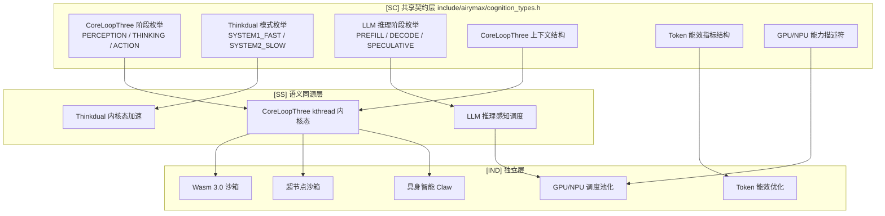
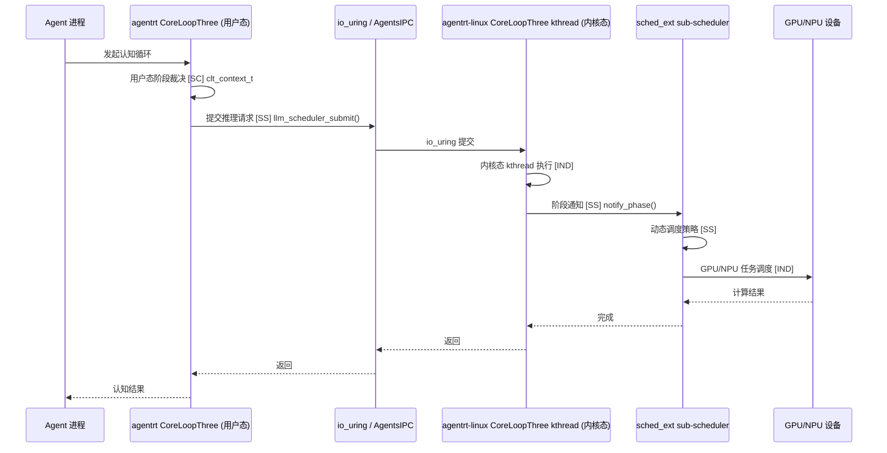

Copyright (c) 2025-2026 SPHARX Ltd. All Rights Reserved.

# agentrt-linux（AirymaxOS）认知设计文档（airymaxos-cognition，极境认知）

> **子仓编号**：05
> **子仓代号**：极境认知（Airymax Cognition）
> **文档版本**：v1.1（2026-07-07）
> **设计基准**：CoreLoopThree kthread + Thinkdual 双思考 + Wasm 3.0 + LLM 推理感知调度
> **同源 agentrt**：coreloopthree + frameworks（CoreLoopThree + Thinkdual）
> **核心约束**：IRON-9 v2 同源且部分代码共享——与 agentrt 用户态 coreloopthree 通过 [SC] 共享契约层 + [SS] 语义同源层协作，[IND] 内核态 kthread 加速、Wasm runtime、GPU/NPU 驱动实现独立
> **横切关注点**：认知循环贯穿调度（阶段通知）、IPC（推理提交）、eBPF（推理追踪）、记忆卷载（快照迁移）4 大数据流

---

## 目录

- [1. 子仓职责](#1-子仓职责)
- [2. 同源关系（IRON-9 v2 三层共享模型）](#2-同源关系iron-9-v2-三层共享模型)
- [3. 目录结构](#3-目录结构)
- [4. 核心特性](#4-核心特性)
- [5. 微内核思想体现](#5-微内核思想体现)
- [6. IRON-9 v2 三层共享模型落地](#6-iron-9-v2-三层共享模型落地)
- [7. agentrt-linux 工程基线](#7-agentrt-linux-工程基线)
- [8. 前沿理论参考](#8-前沿理论参考)
- [9. 与其他子仓的协作](#9-与其他子仓的协作)
- [10. 里程碑（M0-M8）](#10-里程碑m0-m8)
- [11. agentrt 一致性检查](#11-agentrt-一致性检查)
- [12. 相关文档](#12-相关文档)
- [13. 参考](#13-参考)

---

## 1. 子仓职责

`airymaxos-cognition` 是 agentrt-linux（AirymaxOS）的认知与 AI 推理子仓，承担以下核心职责：

1. **CoreLoopThree kthread 实现 [SS]**：将 agentrt 的 CoreLoopThree（三层认知循环）升级为 OS 级 kthread 实现，提供 Agent 认知循环的内核态加速。阶段枚举与上下文结构 [SC] 与 agentrt 共享。
2. **Thinkdual 双思考系统内核态加速 [SS]**：将 agentrt 的 Thinkdual（双思考系统）通过内核态加速提升响应速度。模式枚举 [SC] 与 agentrt 共享。
3. **Wasm runtime 3.0 [IND]**：集成 Wasm 3.0 runtime，提供安全沙箱执行环境。
4. **LLM 推理感知调度 [SS]**：基于 agentrt-linux 认知循环，实现 LLM 推理任务的感知调度。推理阶段枚举 [SC] 与 agentrt 共享。
5. **GPU/NPU 调度与池化 [IND]**：统一调度 GPU/NPU 异构算力，基于 Linux 6.6 加速器框架（`drivers/accel/`）与 DRM 调度器（`drivers/gpu/drm/scheduler/`）。
6. **Token 能效优化 [IND]**：参考 KVC-Gateway + LMCache + Bifrost 优化 Token 能效。能效指标结构 [SC] 与 agentrt 共享。
7. **超节点沙箱 [IND]**：基于 agentrt-linux 超节点 OS，实现软硬协同优化镜像快照。
8. **具身智能支持 [IND]**：基于 agentrt-linux Claw 提供具身智能运行时支持。

### 1.1 横切关注点声明

认知循环贯穿 agentrt-linux 全部 4 大数据流：

| 数据流 | 认知切入点 | 同源标注 |
|--------|-----------|----------|
| 调度数据流 | CoreLoopThree 阶段通知 → sched_ext sub-scheduler 动态调度 | [SS] |
| IPC 数据流 | LLM 推理任务通过 io_uring 提交至 System 2 | [SS] |
| eBPF 数据流 | BPF tracing 识别 LLM 推理阶段（prefill/decode） | [SS] |
| 记忆卷载数据流 | 超节点沙箱快照/迁移依赖 MemoryRovol + userfaultfd | [IND] |

---

## 2. 同源关系（IRON-9 v2 三层共享模型）

依据 IRON-9 v2 决策，agentrt（用户态 coreloopthree）与 agentrt-linux（内核态 airymaxos-cognition）通过三层共享模型协作：

| 层次 | 共享程度 | 认知子系统内容 | 组织方式 |
|------|---------|---------------|---------|
| **[SC] 共享契约层** | 完全共享代码 | CoreLoopThree 阶段枚举（PERCEPTION/THINKING/ACTION）、Thinkdual 模式枚举（SYSTEM1_FAST/SYSTEM2_SLOW）、LLM 推理阶段枚举（PREFILL/DECODE/SPECULATIVE）、CoreLoopThree 上下文结构、Token 能效指标结构、GPU/NPU 能力描述符 | `include/airymax/cognition_types.h` |
| **[SS] 语义同源层** | API 签名同源，实现独立 | `coreloopthree_run()`、`coreloopthree_notify_phase()`、`thinkdual_switch()`、`llm_scheduler_submit()`、`llm_scheduler_query_phase()`、`wasm_runtime_instantiate()`、`gpu_npu_schedule()`、`token_efficiency_record()` 等 8 项 | 各自独立实现 |
| **[IND] 完全独立层** | 完全独立 | Wasm runtime 完整实现（wasmtime/WAMR）、GPU/NPU 驱动、超节点沙箱实现、具身智能框架（Claw）、KVC-Gateway/LMCache/Bifrost 集成、CoreLoopThree kthread 内核态实现 | 各自独立仓库 |

### 2.1 维度对比

| 维度 | agentrt（coreloopthree + frameworks） | agentrt-linux（airymaxos-cognition） | 同源标注 |
|------|--------------------------------------|-------------------------------|----------|
| 认知循环 | CoreLoopThree（用户态） | CoreLoopThree kthread（内核态） | [SS] |
| 双思考 | Thinkdual（用户态） | Thinkdual 内核态加速 | [SS] |
| 推理调度 | 用户态调度器 | LLM 推理感知调度（基于认知循环） | [SS] |
| 算力调度 | 应用层调度 | GPU/NPU 调度与池化（OS 级） | [IND] |
| 沙箱 | 进程沙箱 | Wasm 3.0 + 超节点沙箱 | [IND] |
| 阶段定义 | 阶段枚举 | 阶段枚举 | [SC] |
| 能效指标 | 指标结构 | 指标结构 | [SC] |

### 2.2 同源传承要点

- 保留 agentrt CoreLoopThree 的"三层认知循环"语义（感知-思考-行动）[SS]。
- 保留 Thinkdual 的"双思考系统"架构（快思考 + 慢思考）[SS]。
- 阶段枚举与上下文结构 [SC] 共享，确保两端认知循环语义一致。
- Token 能效指标 [SC] 共享，便于两端统一度量。
- 升级为 OS 级实现，获得内核态加速与硬件感知 [IND]。

---

## 3. 目录结构

```
airymaxos-cognition/
├── coreloopthree/          # CoreLoopThree kthread 实现 [SS]
├── thinkdual/             # Thinkdual 双思考系统内核态加速 [SS]
├── wasm-runtime/           # Wasm 3.0 runtime（安全沙箱）[IND]
├── llm-scheduler/          # LLM 推理感知调度 [SS]
├── gpu-npu/                # GPU/NPU 调度与池化 [IND]
├── token-efficiency/       # Token 能效优化 [IND]
├── super-node-sandbox/     # 超节点沙箱 [IND]
├── embodied-ai/            # 具身智能支持 [IND]
└── docs/
```

### 3.1 coreloopthree/（CoreLoopThree kthread 实现）[SS]

参考 agentrt CoreLoopThree 设计，内核态基于 Linux 6.6 `kernel/kthread.c`（1562 行）kthread 机制：

- `clt-kmod`：内核模块，注册 kthread 执行 CoreLoopThree——`kthread_run()`/`kthread_should_stop()` [SS]。
- `perception-loop`：感知循环（输入采集）——阶段枚举 [SC] 共享。
- `thinking-loop`：思考循环（LLM 推理）——阶段枚举 [SC] 共享。
- `action-loop`：行动循环（输出执行）——阶段枚举 [SC] 共享。
- `phase-notify`：阶段通知（与 sched_ext sub-scheduler 协作）[SS]。

### 3.2 thinkdual/（Thinkdual 双思考系统内核态加速）[SS]

参考 agentrt Thinkdual 设计，模式枚举 [SC] 共享：

- `system1`：快思考（直觉式，低延迟路径）——模式 [SC] SYSTEM1_FAST。
- `system2`：慢思考（推理式，高准确度路径）——模式 [SC] SYSTEM2_SLOW。
- `switcher`：快慢思考切换器（基于任务复杂度）[SS]。
- `kernel-accel`：内核态加速（共享内存、零拷贝数据传递）[IND]。

### 3.3 wasm-runtime/（Wasm 3.0 runtime）[IND]

集成 **Wasm 3.0** runtime（2026 成熟）：

- `wasmtime`：Wasmtime runtime 集成。
- `wamr`：WAMR（WebAssembly Micro Runtime）集成。
- `component-model`：Wasm Component Model 支持。
- `wasi`：WASI（WebAssembly System Interface）支持。
- `simd`：Wasm SIMD 指令支持。
- `gc`：Wasm GC（垃圾回收）支持。
- `threads`：Wasm 线程支持。

### 3.4 llm-scheduler/（LLM 推理感知调度）[SS]

基于 **agentrt-linux 认知循环**，推理阶段枚举 [SC] 共享：

- `inference-aware`：推理感知调度器（识别 LLM 推理阶段）[SC] PREFILL/DECODE/SPECULATIVE。
- `kv-cache-aware`：KV Cache 感知调度。
- `batch-scheduler`：动态 batching 调度。
- `prefill-decode`：prefill 与 decode 阶段分离调度 [SC]。
- `speculative-decoding`：投机解码调度支持 [SC]。

### 3.5 gpu-npu/（GPU/NPU 调度与池化）[IND]

基于 Linux 6.6 加速器框架（`drivers/accel/`）与 DRM 调度器（`drivers/gpu/drm/scheduler/`）：

- `gpu-scheduler`：GPU 调度器（与 `drm_sched` 框架协作）。
- `npu-scheduler`：NPU 调度器（与 `drivers/accel/` 协作，含 habanalabs/ivpu/qaic）。
- `mps`：MPS（Multi-Process Service）支持。
- `mig`：MIG（Multi-Instance GPU）支持。
- `pooling`：算力池化（跨设备调度）。
- `vfio-mdev`：VFIO-mdev 虚拟化支持。

### 3.6 token-efficiency/（Token 能效优化）[IND]

参考 **KVC-Gateway + LMCache + Bifrost**，能效指标 [SC] 共享：

- `kvc-gateway`：KV Cache 网关（跨请求复用）。
- `lmcache`：LMCache 集成（KV Cache 跨节点缓存）。
- `bifrost`：Bifrost 集成（推测解码加速）。
- `prefix-cache`：前缀缓存（共享 prompt 复用）。
- `quantization`：量化支持（INT8/INT4）。
- `speculative`：投机解码优化。

### 3.7 super-node-sandbox/（超节点沙箱）[IND]

基于 **agentrt-linux 超节点 OS**：

- `snapshot`：镜像快照（软硬协同优化，基于 userfaultfd）。
- `restore`：快照恢复（基于 userfaultfd）。
- `clone`：快速克隆（COW 共享）。
- `migrate`：跨节点迁移（与 MemoryRovol 协作）。
- `scheduling`：超节点调度（NUMA 感知）。

### 3.8 embodied-ai/（具身智能支持）[IND]

基于 **agentrt-linux Claw**：

- `sensor-hub`：传感器数据汇聚。
- `motor-control`：运动控制接口。
- `realtime-loop`：实时控制循环。
- `perception-fusion`：多模态感知融合。
- `safety-monitor`：安全监控（紧急停止）。

#### 3.9 组件架构图



---

## 4. 核心特性

### 4.1 CoreLoopThree kthread 实现（三层认知循环 OS 化）[SS]

**三层循环** [SC] 阶段枚举共享：

```c
typedef enum {
    AGENTRT_CLT_PHASE_PERCEPTION = 0,  /* 感知循环：采集多模态输入 */
    AGENTRT_CLT_PHASE_THINKING   = 1,  /* 思考循环：LLM 推理，决策制定 */
    AGENTRT_CLT_PHASE_ACTION     = 2,  /* 行动循环：执行决策，输出结果 */
} agentrt_clt_phase_t;
```

1. **Perception Loop（感知循环）**：采集多模态输入（文本、图像、音频、传感器）。
2. **Thinking Loop（思考循环）**：LLM 推理，决策制定。
3. **Action Loop（行动循环）**：执行决策，输出结果。

**kthread 实现** [IND]——基于 Linux 6.6 `kernel/kthread.c`：
- CoreLoopThree 作为内核 kthread 运行（`kthread_run()`），减少用户态/内核态切换开销。
- 阶段通知通过 sched_ext 接口传递给 sub-scheduler [SS]。
- sub-scheduler 根据阶段动态调整调度策略（思考阶段优先级高）。

**CoreLoopThree 上下文** [SC]（`include/airymax/cognition_types.h`）：

```c
typedef struct agentrt_clt_context {
    agentrt_clt_phase_t           current_phase;       /* 当前阶段 */
    agentrt_thinkdual_mode_t      thinkdual_mode;      /* 双思考模式 */
    agentrt_llm_inference_phase_t inference_phase;     /* LLM 推理阶段 */
    uint32_t                      priority;             /* 调度优先级 */
    uint64_t                      timestamp;           /* 阶段时间戳 */
    uint64_t                      cycle_count;         /* 循环计数 */
} agentrt_clt_context_t;
```

### 4.2 Thinkdual 双思考系统内核态加速 [SS]

**双思考架构**（参考 Daniel Kahneman "Thinking, Fast and Slow"）——模式枚举 [SC] 共享：

```c
typedef enum {
    AGENTRT_THINKDUAL_SYSTEM1_FAST = 0,  /* 快思考：直觉式、低延迟、低能耗 */
    AGENTRT_THINKDUAL_SYSTEM2_SLOW = 1,  /* 慢思考：推理式、高延迟、高准确度 */
} agentrt_thinkdual_mode_t;
```

- **System 1（快思考）**：直觉式、低延迟、低能耗。适用于简单决策。
- **System 2（慢思考）**：推理式、高延迟、高准确度。适用于复杂推理。

**内核态加速** [IND]：
- System 1 与 System 2 共享内核态内存（零拷贝数据传递）。
- 切换器在内核态运行，减少切换延迟。
- LLM 推理任务通过 io_uring 提交至 System 2。

### 4.3 Wasm runtime 3.0（安全沙箱，2026 成熟）[IND]

**Wasm 3.0 特性**：
- Component Model：跨语言组件互操作。
- WASI Preview 3：完整系统接口。
- GC：垃圾回收支持。
- Threads：多线程支持。
- SIMD：向量指令支持。
- Exception Handling：异常处理。

**安全沙箱** [IND]：
- 内存隔离（线性内存模型）。
- capability-based security（WASI capability）。
- 资源限制（fuel metering）。
- 与 `airymaxos-security/sandbox` 协作。

### 4.4 LLM 推理感知调度（基于 agentrt-linux 认知循环）[SS]

**推理阶段枚举** [SC] 共享：

```c
typedef enum {
    AGENTRT_LLM_PHASE_PREFILL      = 0,  /* prefill 阶段：首 token 生成 */
    AGENTRT_LLM_PHASE_DECODE       = 1,  /* decode 阶段：后续 token 生成 */
    AGENTRT_LLM_PHASE_SPECULATIVE  = 2,  /* 投机解码阶段 */
} agentrt_llm_inference_phase_t;
```

**调度策略** [SS]：
- 推理阶段感知：识别 prefill 与 decode 阶段，分别调度。
- KV Cache 感知：调度时考虑 KV Cache 局部性。
- 动态 batching：根据负载动态调整 batch size。
- 投机解码：支持 speculative decoding 调度。

**与 sched_ext 协作** [SS]：
- LLM 推理任务标记为 `agent-inference` cgroup。
- sub-scheduler `scx_agent` 识别推理阶段动态调度。

### 4.5 GPU/NPU 调度与池化 [IND]

基于 Linux 6.6 加速器框架（`drivers/accel/`，含 habanalabs/ivpu/qaic）与 DRM 调度器（`drivers/gpu/drm/scheduler/`，含 `drm_sched` 通用 GPU 调度框架）：

**GPU 调度**：
- 时间片调度：多任务共享 GPU（`drm_sched` 框架）。
- 空间分区：MIG/MPS 支持多实例。
- 上下文切换：快速上下文切换。

**NPU 调度**：
- 厂商驱动集成（华为昇腾、英伟达、AMD）。
- 加速器框架（`drivers/accel/`）统一接入。
- 算力池化：跨设备调度。

**算力池化**：
- 跨节点 GPU/NPU 调度。
- 故障切换。
- 弹性扩缩容。

**GPU/NPU 能力描述符** [SC]（`include/airymax/cognition_types.h`）：

```c
typedef struct agentrt_gpu_npu_descriptor {
    uint32_t device_id;        /* 设备 ID */
    uint32_t device_type;      /* GPU/NPU/加速器 */
    uint64_t memory_bytes;     /* 设备内存 */
    uint32_t compute_units;    /* 计算单元数 */
    uint32_t tflops;           /* 算力（TFLOPS） */
    uint8_t  supports_mig;     /* 是否支持 MIG */
    uint8_t  supports_mps;     /* 是否支持 MPS */
} agentrt_gpu_npu_descriptor_t;
```

### 4.6 Token 能效优化（KVC-Gateway + LMCache + Bifrost）[IND]

**KVC-Gateway**：KV Cache 网关，跨请求复用 KV Cache。
**LMCache**：KV Cache 跨节点缓存，减少重复计算。
**Bifrost**：推测解码加速，减少 decode 阶段延迟。

**Token 能效指标** [SC]（`include/airymax/cognition_types.h`）：

```c
typedef struct agentrt_token_efficiency_metric {
    uint64_t total_tokens;          /* 总 token 数 */
    uint64_t cached_tokens;         /* 缓存命中 token 数 */
    uint64_t speculative_tokens;    /* 投机解码 token 数 */
    uint64_t discarded_tokens;      /* 丢弃 token 数 */
    double   cache_hit_rate;        /* 缓存命中率 */
    double   speculative_accept_rate; /* 投机接受率 */
} agentrt_token_efficiency_metric_t;
```

**优化效果**：
- 共享 prompt 复用：减少 50%+ KV Cache 计算。
- 跨节点缓存：减少 30%+ 重复推理。
- 推测解码：减少 2-3x decode 延迟。

### 4.7 超节点沙箱（软硬协同优化镜像快照）[IND]

基于 **agentrt-linux 超节点 OS**：
- 镜像快照：基于 userfaultfd 与 CXL 实现快速快照。
- 快速克隆：COW 共享内存，秒级克隆。
- 跨节点迁移：基于 MemoryRovol 迁移。
- NUMA 感知调度：优先本地节点调度。

### 4.8 具身智能支持（基于 agentrt-linux Claw）[IND]

基于 **agentrt-linux Claw** 具身智能框架：
- 传感器数据汇聚：多模态传感器接入。
- 运动控制接口：标准化的运动控制 API。
- 实时控制循环：硬实时保证（与 sched_ext sub-scheduler 协作）。
- 多模态感知融合：视觉、听觉、触觉融合。
- 安全监控：紧急停止机制。

---

## 5. 微内核思想体现

### 5.1 Agent 认知作为独立服务

遵循微内核"机制在内核，策略在用户态"原则（Liedtke minimality principle）：
- 内核提供 CoreLoopThree kthread 机制（调度、加速）[IND]。
- 认知策略（思考模型、决策逻辑）在用户态（与 `airymaxos-services/daemons/llm_d` 协作）[SS]。
- 阶段枚举与上下文结构 [SC] 两端共享，确保语义一致。

### 5.2 算力调度解耦

- 算力调度机制在内核（GPU/NPU 调度器，基于 `drm_sched` + `drivers/accel/`）[IND]。
- 调度策略在用户态（与 `airymaxos-services/daemons/sched_d` 协作）[SS]。
- GPU/NPU 能力描述符 [SC] 两端共享。

### 5.3 安全沙箱隔离

- Wasm runtime 提供安全沙箱隔离 [IND]。
- 与 `airymaxos-security/sandbox` 协作提供多层防护 [SS]。
- capability-based security 通过 [SC] 共享契约层与安全子系统对齐。

### 5.4 消息传递通信

- CoreLoopThree 阶段通知通过 sched_ext 接口（消息传递）[SS]。
- LLM 推理任务通过 io_uring 提交（异步消息传递）[SS]。
- 符合微内核"消息传递通信"设计思想。

---

## 6. IRON-9 v2 三层共享模型落地

### 6.1 [SC] 共享契约层——`include/airymax/cognition_types.h`

本头文件完全共享代码，agentrt 用户态与 agentrt-linux 内核态两端直接 include。内容清单：

| 内容 | 说明 |
|------|------|
| `agentrt_clt_phase_t` 枚举 | CoreLoopThree 3 阶段（PERCEPTION/THINKING/ACTION） |
| `agentrt_thinkdual_mode_t` 枚举 | Thinkdual 2 模式（SYSTEM1_FAST/SYSTEM2_SLOW） |
| `agentrt_llm_inference_phase_t` 枚举 | LLM 推理 3 阶段（PREFILL/DECODE/SPECULATIVE） |
| `agentrt_clt_context_t` 结构 | CoreLoopThree 上下文（current_phase/thinkdual_mode/inference_phase/priority/timestamp/cycle_count） |
| `agentrt_token_efficiency_metric_t` 结构 | Token 能效指标（total_tokens/cached_tokens/speculative_tokens/discarded_tokens/cache_hit_rate/speculative_accept_rate） |
| `agentrt_gpu_npu_descriptor_t` 结构 | GPU/NPU 能力描述符（device_id/device_type/memory_bytes/compute_units/tflops/supports_mig/supports_mps） |

### 6.2 [SS] 语义同源层——8 项 API 映射

API 签名同源，实现独立：

| 序号 | API | 语义 | agentrt 实现 | agentrt-linux 实现 |
|------|-----|------|-------------|---------------|
| 1 | `coreloopthree_run()` | 运行一个认知循环 | 用户态循环 | 内核 kthread 循环 |
| 2 | `coreloopthree_notify_phase()` | 阶段通知 | 用户态回调 | sched_ext 接口 |
| 3 | `thinkdual_switch()` | 快慢思考切换 | 用户态切换 | 内核态切换 |
| 4 | `llm_scheduler_submit()` | 提交推理请求 | 用户态队列 | io_uring 提交 |
| 5 | `llm_scheduler_query_phase()` | 查询推理阶段 | 用户态查询 | 内核 BPF tracing |
| 6 | `wasm_runtime_instantiate()` | 实例化 Wasm 模块 | 用户态 wasmtime | 内核态 WAMR |
| 7 | `gpu_npu_schedule()` | 调度 GPU/NPU 任务 | 用户态 API | `drm_sched` + `drivers/accel/` |
| 8 | `token_efficiency_record()` | 记录能效指标 | 用户态记录 | 内核 ftrace |

### 6.3 [IND] 完全独立层——6 项独立实现

| 序号 | 内容 | 不共享原因 |
|------|------|-----------|
| 1 | Wasm runtime 完整实现 | wasmtime（用户态）vs WAMR（内核态），运行时差异大 |
| 2 | GPU/NPU 驱动实现 | 厂商驱动各平台独立（habanalabs/ivpu/qaic） |
| 3 | 超节点沙箱实现 | 依赖 userfaultfd + CXL，仅 agentrt-linux 内核态 |
| 4 | 具身智能框架（Claw） | 依赖硬件传感器，仅 agentrt-linux |
| 5 | KVC-Gateway/LMCache/Bifrost 集成 | 用户态库集成，agentrt 与 agentrt-linux 各自集成 |
| 6 | CoreLoopThree kthread 内核态实现 | `kthread_run()` 机制仅 agentrt-linux 内核态 |

### 6.4 跨态协作流



---

## 7. agentrt-linux 工程基线

- **agentrt-linux 认知循环**：AI 原生调度框架基线。
- **agentrt-linux 超节点 OS**：超节点沙箱基线。
- **agentrt-linux 具身智能（Claw）**：具身智能运行时基线。
- **agentrt-linux AI 原生**：AI 原生 OS 设计哲学基线。
- **Linux 6.6 kthread 机制**：`kernel/kthread.c`（1562 行）kthread 创建/停止/绑定。
- **Linux 6.6 加速器框架**：`drivers/accel/`（含 habanalabs/ivpu/qaic）。
- **Linux 6.6 DRM 调度器**：`drivers/gpu/drm/scheduler/`（`drm_sched` 通用 GPU 调度）。

### 7.1 五维正交 24 原则映射

| 原则 | 在本模块的体现 |
|------|---------------|
| **E-1 安全内生** | Wasm 沙箱 + capability-based security + TEE 保护 |
| **K-3 服务隔离** | 认知循环作为独立 kthread + Wasm 沙箱隔离 |
| **K-4 可插拔策略** | CoreLoopThree 阶段策略可热替换 + GPU/NPU 调度策略可配置 |
| **IRON-9 v2 同源且部分代码共享** | [SC] 共享契约层 + [SS] 语义同源层 + [IND] 独立层 |
| **A-4 完美主义** | CoreLoopThree kthread 内核态加速 + Token 能效优化 + 超节点沙箱 |

---

## 8. 前沿理论参考

| 理论 | 来源 | 应用 | 同源标注 |
|------|------|------|----------|
| Liedtke minimality principle | Liedtke SOSP'95 | 微内核最小化原则——机制在内核，策略在用户态 | [SS] |
| Thinking, Fast and Slow | Daniel Kahneman | Thinkdual 双思考系统 | [SC] 模式枚举 |
| CoreLoopThree | Airymax 原创 | 三层认知循环（感知-思考-行动） | [SC] 阶段枚举 |
| Wasm 3.0 | Bytecode Alliance | 安全沙箱 runtime | [IND] |
| Wasm Component Model | Bytecode Alliance | 组件互操作 | [IND] |
| WASI Preview 3 | Bytecode Alliance | 系统接口 | [IND] |
| LLM 调度 | 学术研究 | LLM 推理感知调度 | [SS] |
| KVC-Gateway | 业界实践 | KV Cache 网关 | [IND] |
| LMCache | 学术研究 | KV Cache 跨节点缓存 | [IND] |
| Bifrost | 学术研究 | 推测解码加速 | [IND] |
| DRM 调度器 | Linux 6.6 | GPU 通用调度框架 | [IND] |
| 加速器框架 | Linux 6.6 | NPU 统一接入框架 | [IND] |

---

## 9. 与其他子仓的协作

| 协作子仓 | 协作内容 | 同源标注 |
|---------|---------|----------|
| `airymaxos-kernel` | 提供 CoreLoopThree kthread 机制、Wasm runtime 内核支持 | [SS] + [IND] |
| `airymaxos-services` | 与 llm_d/sched_d 协作，调度策略在用户态 | [SS] |
| `airymaxos-security` | 提供 Wasm 沙箱、LLM 推理 TEE 保护 | [SS] + [IND] |
| `airymaxos-memory` | 提供 MemoryRovol 快照、超节点沙箱迁移 | [IND] |
| `airymaxos-cloudnative` | 提供 Agent 容器化、超节点 OS 集成 | [IND] |
| `airymaxos-system` | 提供认知监控工具 | [SS] |
| `airymaxos-tests-linux` | 认知测试、性能基准 | [SS] |

---

## 10. 里程碑（M0-M8）

| 阶段 | 目标 | 时间 | 同源标注 |
|------|------|------|----------|
| M0 | 文档体系完成（本模块设计文档） | 2026-07 | — |
| M1 | [SC] `include/airymax/cognition_types.h` 共享契约层 | 2026 Q3 | [SC] |
| M2 | CoreLoopThree kthread 实现 + 阶段通知 | 2026 Q3 | [SS] |
| M3 | Thinkdual 双思考内核态加速 | 2026 Q4 | [SS] |
| M4 | Wasm 3.0 runtime 集成 | 2026 Q4 | [IND] |
| M5 | LLM 推理感知调度 + KV Cache 感知 | 2027 Q1 | [SS] |
| M6 | GPU/NPU 调度与池化（drm_sched + drivers/accel/） | 2027 Q1 | [IND] |
| M7 | Token 能效优化（KVC-Gateway + LMCache + Bifrost） | 2027 Q2 | [IND] |
| M8 | 超节点沙箱 + 具身智能 | 2027 Q2 | [IND] |

### 10.1 0.1.1 版本范围

仅完成 M0（文档体系完成）+ M1（[SC] 共享契约层头文件占位）。不含内核/OS 代码实施。

### 10.2 1.0.1 版本范围

完成 M2-M8 全部里程碑，并实施认知工程标准。

---

## 11. agentrt 一致性检查

对 agentrt coreloopthree + frameworks 设计进行一致性检查，确认两端在 IRON-9 v2 三层共享模型下无冲突：

| 序号 | 检查项 | agentrt 状态 | agentrt-linux 状态 | 结论 |
|------|--------|-------------|---------------|------|
| 1 | CoreLoopThree 阶段枚举一致性 | 3 阶段（PERCEPTION/THINKING/ACTION） | 3 阶段（同） | ✅ PASS [SC] |
| 2 | Thinkdual 模式枚举一致性 | 2 模式（SYSTEM1_FAST/SYSTEM2_SLOW） | 2 模式（同） | ✅ PASS [SC] |
| 3 | LLM 推理阶段枚举一致性 | 3 阶段（PREFILL/DECODE/SPECULATIVE） | 3 阶段（同） | ✅ PASS [SC] |
| 4 | CoreLoopThree 上下文结构一致性 | 6 字段 | 6 字段（同） | ✅ PASS [SC] |
| 5 | Token 能效指标结构一致性 | 6 字段 | 6 字段（同） | ✅ PASS [SC] |
| 6 | GPU/NPU 能力描述符一致性 | 7 字段 | 7 字段（同） | ✅ PASS [SC] |
| 7 | `coreloopthree_run()` 签名一致性 | 用户态循环 | 内核 kthread 循环 | ✅ PASS [SS] |
| 8 | `coreloopthree_notify_phase()` 签名一致性 | 用户态回调 | sched_ext 接口 | ✅ PASS [SS] |
| 9 | `thinkdual_switch()` 签名一致性 | 用户态切换 | 内核态切换 | ✅ PASS [SS] |
| 10 | `llm_scheduler_submit()` 签名一致性 | 用户态队列 | io_uring 提交 | ✅ PASS [SS] |
| 11 | `llm_scheduler_query_phase()` 签名一致性 | 用户态查询 | 内核 BPF tracing | ✅ PASS [SS] |
| 12 | `wasm_runtime_instantiate()` 签名一致性 | 用户态 wasmtime | 内核态 WAMR | ✅ PASS [SS] |
| 13 | `gpu_npu_schedule()` 签名一致性 | 用户态 API | drm_sched + drivers/accel/ | ✅ PASS [SS] |
| 14 | `token_efficiency_record()` 签名一致性 | 用户态记录 | 内核 ftrace | ✅ PASS [SS] |
| 15 | Wasm runtime/GPU 驱动/超节点沙箱独立性 | 用户态实现 | 内核态实现 | ✅ PASS [IND] |

**结论**：agentrt coreloopthree + frameworks 设计无需修改。15 项检查全部 PASS，两端在 [SC]/[SS]/[IND] 三层共享模型下完全一致。

---

## 12. 相关文档

- `40-dataflows/` 各数据流文档（认知循环作为横切关注点切入）
- `50-engineering-standards/01-coding-standards.md`（认知编码规范）
- `80-testing/` 认知测试文档
- `90-observability/README.md`（认知监控）
- agentrt coreloopthree + frameworks 设计文档（同源 [SC]/[SS]）

### 12.1 闭源参考文档

以下文档为闭源内部参考，不公开：

- 闭源源码映射文档（OLK-6.6 kthread + GPU 调度 + 加速器框架支撑机制映射）
- 闭源认知技术规范参考文档（行业最新理论参考）

---

## 13. 参考

- agentrt-linux 认知循环文档
- agentrt-linux 超节点 OS 文档
- agentrt-linux Claw 具身智能文档
- Linux 6.6 `kernel/kthread.c`（kthread 机制，1562 行）
- Linux 6.6 `include/linux/kthread.h`（kthread API，227 行）
- Linux 6.6 `drivers/accel/`（加速器框架，含 habanalabs/ivpu/qaic）
- Linux 6.6 `drivers/gpu/drm/scheduler/`（DRM 调度器，`drm_sched` 通用 GPU 调度）
- Wasm 3.0 规范（Bytecode Alliance）
- WASI Preview 3 规范
- Wasm Component Model 规范
- Daniel Kahneman "Thinking, Fast and Slow"
- KVC-Gateway、LMCache、Bifrost 论文
- Liedtke SOSP'95（微内核最小化原则）
- agentrt coreloopthree + frameworks 设计文档

---

> **文档结束** | v1.1 | IRON-9 v2 同源且部分代码共享 | 认知循环贯穿 4 大数据流 | 0.1.1 = 文档体系完成
