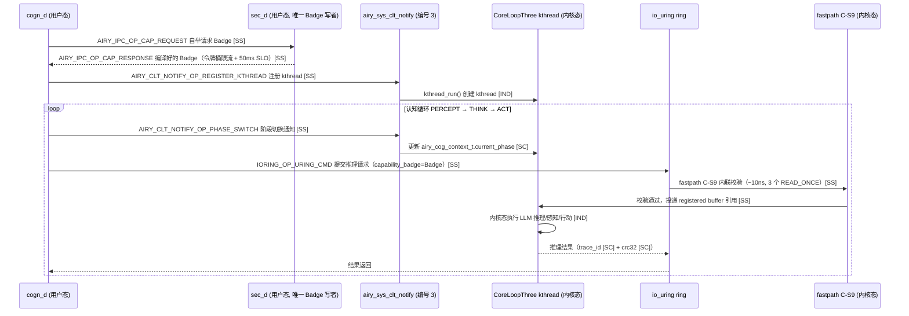
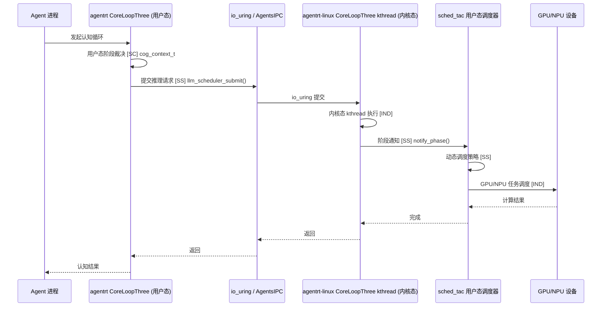

Copyright (c) 2025-2026 SPHARX Ltd. All Rights Reserved.

# agentrt-linux 认知设计文档

> **文档定位**：agentrt-linux（AirymaxOS）认知设计文档（cognition，极境认知）\
> **文档版本**：v1.1（2026-07-07）\
> **上级文档**：[agentrt-linux 设计文档](README.md)\
> **核心约束**：IRON-9 v3 同源且部分代码共享——与 agentrt 用户态 coreloopthree 通过 \[SC] 共享契约层 + \[SS] 语义同源层协作，\[IND] 内核态 kthread 加速、Wasm runtime、GPU/NPU 驱动实现独立\
> **子仓编号**：05\
> **子仓代号**：极境认知（Airymax Cognition）\
> **设计基准**：CoreLoopThree kthread + Thinkdual 双思考 + Wasm 3.0 + LLM 推理感知调度\
> **同源 agentrt**：coreloopthree + frameworks（CoreLoopThree + Thinkdual）\
> **横切关注点**：认知循环贯穿调度（阶段通知）、IPC（推理提交）、eBPF（推理追踪）、记忆卷载（快照迁移）4 大数据流

***

## 目录

- [1. 子仓职责](#1-子仓职责)
- [2. 同源关系（IRON-9 v3 四层共享模型）](#2-同源关系iron-9-v3-四层共享模型)
- [3. 目录结构](#3-目录结构)
- [4. 核心特性](#4-核心特性)
- [5. 微内核思想体现](#5-微内核思想体现)
- [6. IRON-9 v3 四层共享模型落地](#6-iron-9-v3-四层共享模型落地)
- [7. agentrt-linux 工程基线](#7-agentrt-linux-工程基线)
- [8. 前沿理论参考](#8-前沿理论参考)
- [9. 与其他子仓的协作](#9-与其他子仓的协作)
- [10. 里程碑（M0-M8）](#10-里程碑m0-m8)
- [11. agentrt 一致性检查](#11-agentrt-一致性检查)
- [12. 相关文档](#12-相关文档)
- [13. 参考](#13-参考)

***

## 1. 子仓职责

`cognition` 是 agentrt-linux（AirymaxOS）的认知与 AI 推理子仓，承担以下核心职责：

1. **CoreLoopThree kthread 实现 \[SS]**：将 agentrt 的 CoreLoopThree（三阶段认知循环）升级为 OS 级 kthread 实现，提供 Agent 认知循环的内核态加速。阶段枚举与上下文结构 \[SC] 与 agentrt 共享。
2. **Thinkdual 双思考系统内核态加速 \[SS]**：将 agentrt 的 Thinkdual（双思考系统）通过内核态加速提升响应速度。模式枚举 \[SC] 与 agentrt 共享。
3. **Wasm runtime 3.0 \[IND]**：集成 Wasm 3.0 runtime，提供安全沙箱执行环境。
4. **LLM 推理感知调度 \[SS]**：基于 agentrt-linux 认知循环，实现 LLM 推理任务的感知调度。推理阶段枚举 \[SC] 与 agentrt 共享。
5. **GPU/NPU 调度与池化 \[IND]**：统一调度 GPU/NPU 异构算力，基于 Linux 6.6 加速器框架（`drivers/accel/`）与 DRM 调度器（`drivers/gpu/drm/scheduler/`）。
6. **Token 能效优化 \[IND]**：参考 KVC-Gateway + LMCache + Bifrost 优化 Token 能效。能效指标结构 \[SC] 与 agentrt 共享。
7. **超节点沙箱 \[IND]**：基于 agentrt-linux 超节点 OS，实现软硬协同优化镜像快照。
8. **具身智能支持 \[IND]**：基于 agentrt-linux Claw 提供具身智能运行时支持。

### 1.1 横切关注点声明

认知循环贯穿 agentrt-linux 全部 4 大数据流：

| 数据流      | 认知切入点                                              | 同源标注   |
| -------- | -------------------------------------------------- | ------ |
| 调度数据流    | CoreLoopThree 阶段通知 → sched\_tac sub-scheduler 动态调度 | \[SS]  |
| IPC 数据流  | LLM 推理任务通过 io\_uring 提交至 System 2                  | \[SS]  |
| eBPF 数据流 | BPF tracing 识别 LLM 推理阶段（prefill/decode）            | \[SS]  |
| 记忆卷载数据流  | 超节点沙箱快照/迁移依赖 MemoryRovol + userfaultfd             | \[IND] |

***

## 2. 同源关系（IRON-9 v3 四层共享模型）

依据 IRON-9 v3 决策，agentrt（用户态 coreloopthree）与 agentrt-linux（内核态 cognition）通过四层共享模型协作（\[SC] 共享契约 + \[SS] 语义同源 + \[IND] 完全独立 + \[DSL] 降级生存）：

| 层次               | 共享程度                               | 认知子系统内容                                                                                                                                                                                                              | 组织方式                                |
| ---------------- | ---------------------------------- | -------------------------------------------------------------------------------------------------------------------------------------------------------------------------------------------------------------------- | ----------------------------------- |
| **\[SC] 共享契约层**  | 完全共享代码                             | CoreLoopThree 阶段枚举 `airy_cog_phase`（PERCEPT=0/THINK=1/ACT=2）、Thinkdual 模式枚举 `airy_think_mode`（FAST=0/SLOW=1）、LLM 推理阶段枚举（PREFILL/DECODE/SPECULATIVE）、CoreLoopThree 上下文结构、Token 能效指标结构、GPU/NPU 能力描述符                                     | `include/uapi/linux/airymax/cognition_types.h` |
| **\[SS] 语义同源层**  | 高层 API 语义同源（概念操作一致），签名因抽象层级不同而独立演进 | `coreloopthree_run()`、`coreloopthree_notify_phase()`、`thinkdual_switch()`、`llm_scheduler_submit()`、`llm_scheduler_query_phase()`、`wasm_runtime_instantiate()`、`gpu_npu_schedule()`、`token_efficiency_record()` 等 8 项；v1.1 Capability Folding Badge 校验语义 | 各自独立实现                              |
| **\[IND] 完全独立层** | 完全独立                               | Wasm runtime 完整实现（wasmtime/WAMR）、GPU/NPU 驱动、超节点沙箱实现、具身智能框架（Claw）、KVC-Gateway/LMCache/Bifrost 集成、CoreLoopThree kthread 内核态实现                                                                                          | 各自独立仓库                              |
| **\[DSL] 降级生存层** | 最小生存子集                             | `#ifdef AIRY_SC_FALLBACK` 降级块：cognition 子仓仅保留 `airy_cog_phase` 三阶段枚举最小骨架，`capability_badge=0` 跳过 fastpath C-S9，CoreLoopThree kthread 退化为用户态轮询 | 各自独立仓库（受 [SC] 头文件 `AIRY_SC_FALLBACK` 宏驱动） |

### 2.1 维度对比

| 维度   | agentrt（coreloopthree + frameworks） | agentrt-linux（cognition）   | 同源标注   |
| ---- | ----------------------------------- | -------------------------- | ------ |
| 认知循环 | CoreLoopThree（用户态）                  | CoreLoopThree kthread（内核态） | \[SS]  |
| 双思考  | Thinkdual（用户态）                      | Thinkdual 内核态加速            | \[SS]  |
| 推理调度 | 用户态调度器                              | LLM 推理感知调度（基于认知循环）         | \[SS]  |
| 算力调度 | 应用层调度                               | GPU/NPU 调度与池化（OS 级）        | \[IND] |
| 沙箱   | 进程沙箱                                | Wasm 3.0 + 超节点沙箱           | \[IND] |
| 阶段定义 | 阶段枚举                                | 阶段枚举                       | \[SC]  |
| 能效指标 | 指标结构                                | 指标结构                       | \[SC]  |

### 2.2 同源传承要点

- 保留 agentrt CoreLoopThree 的"三阶段认知循环"语义（感知-思考-行动）\[SS]。
- 保留 Thinkdual 的"双思考系统"架构（快思考 + 慢思考）\[SS]。
- 阶段枚举与上下文结构 \[SC] 共享，确保两端认知循环语义一致。
- Token 能效指标 \[SC] 共享，便于两端统一度量。
- 升级为 OS 级实现，获得内核态加速与硬件感知 \[IND]。

***

## 3. 目录结构

```
cognition/
├── coreloopthree/          # CoreLoopThree kthread 实现 [SS]
├── thinkdual/             # Thinkdual 双思考系统内核态加速 [SS]
├── wasm-runtime/           # Wasm 3.0 runtime（安全沙箱）[IND]
├── llm-scheduler/          # LLM 推理感知调度 [SS]
├── gpu-npu/                # GPU/NPU 调度与池化 [IND]
├── token-efficiency/       # Token 能效优化 [IND]
├── super-node-sandbox/     # 超节点沙箱 [IND]
├── embodied-ai/            # 具身智能支持 [IND]
└── docs/
```

### 3.1 coreloopthree/（CoreLoopThree kthread 实现）\[SS]

参考 agentrt CoreLoopThree 设计，内核态基于 Linux 6.6 `kernel/kthread.c`（1562 行）kthread 机制：

- `clt-kmod`：内核模块，注册 kthread 执行 CoreLoopThree——`kthread_run()`/`kthread_should_stop()` \[SS]。
- `perception-loop`：感知循环（输入采集）——阶段枚举 \[SC] 共享。
- `thinking-loop`：思考循环（LLM 推理）——阶段枚举 \[SC] 共享。
- `action-loop`：行动循环（输出执行）——阶段枚举 \[SC] 共享。
- `phase-notify`：阶段通知（与 sched\_tac sub-scheduler 协作）\[SS]。

### 3.2 thinkdual/（Thinkdual 双思考系统内核态加速）\[SS]

参考 agentrt Thinkdual 设计，模式枚举 \[SC] 共享：

- `system1`：快思考（直觉式，低延迟路径）——模式 \[SC] SYSTEM1\_FAST。
- `system2`：慢思考（推理式，高准确度路径）——模式 \[SC] SYSTEM2\_SLOW。
- `switcher`：快慢思考切换器（基于任务复杂度）\[SS]。
- `kernel-accel`：内核态加速（共享内存、零拷贝数据传递）\[IND]。

### 3.3 wasm-runtime/（Wasm 3.0 runtime）\[IND]

集成 **Wasm 3.0** runtime（2026 成熟）：

- `wasmtime`：Wasmtime runtime 集成。
- `wamr`：WAMR（WebAssembly Micro Runtime）集成。
- `component-model`：Wasm Component Model 支持。
- `wasi`：WASI（WebAssembly System Interface）支持。
- `simd`：Wasm SIMD 指令支持。
- `gc`：Wasm GC（垃圾回收）支持。
- `threads`：Wasm 线程支持。

### 3.4 llm-scheduler/（LLM 推理感知调度）\[SS]

基于 **agentrt-linux 认知循环**，推理阶段枚举 \[SC] 共享：

- `inference-aware`：推理感知调度器（识别 LLM 推理阶段）\[SC] PREFILL/DECODE/SPECULATIVE。
- `kv-cache-aware`：KV Cache 感知调度。
- `batch-scheduler`：动态 batching 调度。
- `prefill-decode`：prefill 与 decode 阶段分离调度 \[SC]。
- `speculative-decoding`：投机解码调度支持 \[SC]。

### 3.5 gpu-npu/（GPU/NPU 调度与池化）\[IND]

基于 Linux 6.6 加速器框架（`drivers/accel/`）与 DRM 调度器（`drivers/gpu/drm/scheduler/`）：

- `gpu-scheduler`：GPU 调度器（与 `drm_sched` 框架协作）。
- `npu-scheduler`：NPU 调度器（与 `drivers/accel/` 协作，含 habanalabs/ivpu/qaic）。
- `mps`：MPS（Multi-Process Service）支持。
- `mig`：MIG（Multi-Instance GPU）支持。
- `pooling`：算力池化（跨设备调度）。
- `vfio-mdev`：VFIO-mdev 虚拟化支持。

### 3.6 token-efficiency/（Token 能效优化）\[IND]

参考 **KVC-Gateway + LMCache + Bifrost**，能效指标 \[SC] 共享：

- `kvc-gateway`：KV Cache 网关（跨请求复用）。
- `lmcache`：LMCache 集成（KV Cache 跨节点缓存）。
- `bifrost`：Bifrost 集成（推测解码加速）。
- `prefix-cache`：前缀缓存（共享 prompt 复用）。
- `quantization`：量化支持（INT8/INT4）。
- `speculative`：投机解码优化。

### 3.7 super-node-sandbox/（超节点沙箱）\[IND]

基于 **agentrt-linux 超节点 OS**：

- `snapshot`：镜像快照（软硬协同优化，基于 userfaultfd）。
- `restore`：快照恢复（基于 userfaultfd）。
- `clone`：快速克隆（COW 共享）。
- `migrate`：跨节点迁移（与 MemoryRovol 协作）。
- `scheduling`：超节点调度（NUMA 感知）。

### 3.8 embodied-ai/（具身智能支持）\[IND]

基于 **agentrt-linux Claw**：

- `sensor-hub`：传感器数据汇聚。
- `motor-control`：运动控制接口。
- `realtime-loop`：实时控制循环。
- `perception-fusion`：多模态感知融合。
- `safety-monitor`：安全监控（紧急停止）。

#### 3.9 组件架构图


***

## 4. 核心特性

### 4.1 CoreLoopThree kthread 实现（三阶段认知循环 OS 化）\[SS]

**三阶段循环** \[SC] 阶段枚举共享：

```c
typedef enum {
    AIRY_COG_PHASE_PERCEPT = 0,  /* 感知循环：采集多模态输入 */
    AIRY_COG_PHASE_THINK   = 1,  /* 思考循环：LLM 推理，决策制定 */
    AIRY_COG_PHASE_ACT     = 2,  /* 行动循环：执行决策，输出结果 */
} airy_cog_phase_t;
```

1. **Perception Loop（感知循环）**：采集多模态输入（文本、图像、音频、传感器）。
2. **Thinking Loop（思考循环）**：LLM 推理，决策制定。
3. **Action Loop（行动循环）**：执行决策，输出结果。

**kthread 实现** \[IND]——基于 Linux 6.6 `kernel/kthread.c`：

- CoreLoopThree 作为内核 kthread 运行（`kthread_run()`），减少用户态/内核态切换开销。
- 阶段通知通过 sched\_tac 接口传递给 sub-scheduler \[SS]。
- sub-scheduler 根据阶段动态调整调度策略（思考阶段优先级高）。

**CoreLoopThree 上下文** \[SC]（`include/uapi/linux/airymax/cognition_types.h`）：

```c
typedef struct airy_cog_context {
    airy_cog_phase_t           current_phase;       /* 当前阶段 */
    airy_think_mode_t          think_mode;          /* 双思考模式 */
    airy_llm_inference_phase_t inference_phase;     /* LLM 推理阶段 */
    uint32_t                      priority;             /* 调度优先级 */
    uint64_t                      timestamp;           /* 阶段时间戳 */
    uint64_t                      cycle_count;         /* 循环计数 */
} airy_cog_context_t;
```

### 4.2 Thinkdual 双思考系统内核态加速 \[SS]

**双思考架构**（参考 Daniel Kahneman "Thinking, Fast and Slow"）——模式枚举 \[SC] 共享：

```c
typedef enum {
    AIRY_THINK_MODE_FAST = 0,  /* 快思考：直觉式、低延迟、低能耗 */
    AIRY_THINK_MODE_SLOW = 1,  /* 慢思考：推理式、高延迟、高准确度 */
} airy_think_mode_t;
```

- **System 1（快思考）**：直觉式、低延迟、低能耗。适用于简单决策。
- **System 2（慢思考）**：推理式、高延迟、高准确度。适用于复杂推理。

**内核态加速** \[IND]：

- System 1 与 System 2 共享内核态内存（零拷贝数据传递）。
- 切换器在内核态运行，减少切换延迟。
- LLM 推理任务通过 io\_uring 提交至 System 2。

### 4.3 Wasm runtime 3.0（安全沙箱，2026 成熟）\[IND]

**Wasm 3.0 特性**：

- Component Model：跨语言组件互操作。
- WASI Preview 3：完整系统接口。
- GC：垃圾回收支持。
- Threads：多线程支持。
- SIMD：向量指令支持。
- Exception Handling：异常处理。

**安全沙箱** \[IND]：

- 内存隔离（线性内存模型）。
- capability-based security（WASI capability）。
- 资源限制（fuel metering）。
- 与 `security/sandbox` 协作。

### 4.4 LLM 推理感知调度（基于 agentrt-linux 认知循环）\[SS]

**推理阶段枚举** \[SC] 共享：

```c
typedef enum {
    AIRY_LLM_PHASE_PREFILL      = 0,  /* prefill 阶段：首 token 生成 */
    AIRY_LLM_PHASE_DECODE       = 1,  /* decode 阶段：后续 token 生成 */
    AIRY_LLM_PHASE_SPECULATIVE  = 2,  /* 投机解码阶段 */
} airy_llm_inference_phase_t;
```

**调度策略** \[SS]：

- 推理阶段感知：识别 prefill 与 decode 阶段，分别调度。
- KV Cache 感知：调度时考虑 KV Cache 局部性。
- 动态 batching：根据负载动态调整 batch size。
- 投机解码：支持 speculative decoding 调度。

**与 sched\_tac 协作** \[SS]：

- LLM 推理任务标记为 `agent-inference` cgroup。
- sub-scheduler `stc_agent` 识别推理阶段动态调度。

### 4.5 GPU/NPU 调度与池化 \[IND]

基于 Linux 6.6 加速器框架（`drivers/accel/`，含 habanalabs/ivpu/qaic）与 DRM 调度器（`drivers/gpu/drm/scheduler/`，含 `drm_sched` 通用 GPU 调度框架）：

**GPU 调度**：

- 时间片调度：多任务共享 GPU（`drm_sched` 框架）。
- 空间分区：MIG/MPS 支持多实例。
- 上下文切换：快速上下文切换。

**NPU 调度**：

- 厂商驱动集成（华为昇腾、英伟达、AMD）。
- 加速器框架（`drivers/accel/`）统一接入。
- 算力池化：跨设备调度。

**算力池化**：

- 跨节点 GPU/NPU 调度。
- 故障切换。
- 弹性扩缩容。

**GPU/NPU 能力描述符** \[SC]（`include/uapi/linux/airymax/cognition_types.h`）：

```c
typedef struct airy_gpu_npu_descriptor {
    uint32_t device_id;        /* 设备 ID */
    uint32_t device_type;      /* GPU/NPU/加速器 */
    uint64_t memory_bytes;     /* 设备内存 */
    uint32_t compute_units;    /* 计算单元数 */
    uint32_t tflops;           /* 算力（TFLOPS） */
    uint8_t  supports_mig;     /* 是否支持 MIG */
    uint8_t  supports_mps;     /* 是否支持 MPS */
} airy_gpu_npu_descriptor_t;
```

### 4.6 Token 能效优化（KVC-Gateway + LMCache + Bifrost）\[IND]

**KVC-Gateway**：KV Cache 网关，跨请求复用 KV Cache。
**LMCache**：KV Cache 跨节点缓存，减少重复计算。
**Bifrost**：推测解码加速，减少 decode 阶段延迟。

**Token 能效指标** \[SC]（`include/uapi/linux/airymax/cognition_types.h`）：

```c
typedef struct airy_token_efficiency_metric {
    uint64_t total_tokens;          /* 总 token 数 */
    uint64_t cached_tokens;         /* 缓存命中 token 数 */
    uint64_t speculative_tokens;    /* 投机解码 token 数 */
    uint64_t discarded_tokens;      /* 丢弃 token 数 */
    double   cache_hit_rate;        /* 缓存命中率 */
    double   speculative_accept_rate; /* 投机接受率 */
} airy_token_efficiency_metric_t;
```

**优化效果**：

- 共享 prompt 复用：减少 50%+ KV Cache 计算。
- 跨节点缓存：减少 30%+ 重复推理。
- 推测解码：减少 2-3x decode 延迟。

### 4.7 超节点沙箱（软硬协同优化镜像快照）\[IND]

基于 **agentrt-linux 超节点 OS**：

- 镜像快照：基于 userfaultfd 与 CXL 实现快速快照。
- 快速克隆：COW 共享内存，秒级克隆。
- 跨节点迁移：基于 MemoryRovol 迁移。
- NUMA 感知调度：优先本地节点调度。

### 4.8 具身智能支持（基于 agentrt-linux Claw）\[IND]

基于 **agentrt-linux Claw** 具身智能框架：

- 传感器数据汇聚：多模态传感器接入。
- 运动控制接口：标准化的运动控制 API。
- 实时控制循环：硬实时保证（与 sched\_tac sub-scheduler 协作）。
- 多模态感知融合：视觉、听觉、触觉融合。
- 安全监控：紧急停止机制。

### 4.9 v1.1 Capability Folding 在 cognition 层的落地 \[SS]

v1.1 Capability Folding 将 capability check 从独立控制面操作"折叠"到 IPC 数据面 fastpath 中，IPC 消息头 offset 40 的 `capability_badge` 字段承载 64-bit Native Word Badge（`Epoch<<48 | RandomTag<<16 | Perms`），由 fastpath C-S9 内联校验（~10ns），无双平面、无独立 capability syscall。cognition 子仓作为 CoreLoopThree kthread + LLM 推理调度的物理宿主，承载以下 Capability Folding 职责：

**4.9.1 cogn_d daemon 在 cognition 子仓中的设计** \[SS]

`cogn_d` 是 12 daemon 中的"认知调度守护进程"，作为 cognition 子仓的用户态策略入口，负责 CoreLoopThree 阶段通知的发起与 LLM 推理请求的 Badge 携带：

| 序号 | 职责                                   | Capability Folding 角色                                                  |
| -- | ------------------------------------ | ---------------------------------------------------------------------- |
| 1  | CoreLoopThree 阶段通知发起                 | 通过 `airy_sys_clt_notify`（编号 3）向内核 kthread 推送阶段切换，携带 Badge            |
| 2  | LLM 推理请求投递                           | 推理请求经 `IORING_OP_URING_CMD`（cmd_op=IPC_SEND）提交，`capability_badge` 承载 Badge |
| 3  | Thinkdual 快慢思考切换                     | 切换决策通过 io\_uring IPC 传递至内核态 kthread，C-S9 校验后生效                       |
| 4  | 推理阶段（PREFILL/DECODE/SPECULATIVE）感知   | cogn_d 标记推理阶段至 `airy_cog_context_t.inference_phase`，调度器感知             |
| 5  | Badge 携带者                            | 所有 cognition 相关 IPC 消息均携带 sec_d 编译的 Badge，fastpath C-S9 校验              |

**4.9.2 `airy_sys_clt_notify`（编号 3）的使用** \[SS]

`airy_sys_clt_notify` 是 v1.1 4 核心 syscall 之一（编号 3），专为 CoreLoopThree 通知 + kthread 注册设计：

```c
/* airy_sys_clt_notify（编号 3）：CoreLoopThree 通知 + kthread 注册 */
int airy_sys_clt_notify(unsigned int op, unsigned long arg);

/* op 取值（定义于 include/uapi/linux/airymax/syscalls.h [SC]）：
 *   AIRY_CLT_NOTIFY_OP_REGISTER_KTHREAD   注册 CoreLoopThree kthread
 *   AIRY_CLT_NOTIFY_OP_PHASE_SWITCH       阶段切换通知（PERCEPT→THINK→ACT）
 *   AIRY_CLT_NOTIFY_OP_THINK_MODE_SWITCH  Thinkdual 快慢思考切换
 *   AIRY_CLT_NOTIFY_OP_INFERENCE_PHASE    LLM 推理阶段标记
 */
```

- **kthread 注册**：cogn_d 启动时通过 `AIRY_CLT_NOTIFY_OP_REGISTER_KTHREAD` 注册 CoreLoopThree kthread，内核态 `kthread_run()` 创建 kthread 执行循环 \[IND]。
- **阶段切换通知**：cogn_d 在每阶段切换时通过 `AIRY_CLT_NOTIFY_OP_PHASE_SWITCH` 通知内核 kthread，同时通过 io\_uring IPC 携带 Badge 至 sched_d 协同调度策略 \[SS]。
- **Thinkdual 切换**：cogn_d 根据任务复杂度决策快慢思考切换，通过 `AIRY_CLT_NOTIFY_OP_THINK_MODE_SWITCH` 通知内核 kthread 切换执行路径 \[SS]。
- **推理阶段标记**：cogn_d 标记推理阶段（PREFILL/DECODE/SPECULATIVE）至 `airy_cog_context_t.inference_phase`，sched_d 通过 sched_tac 感知调度 \[SS]。
- **不承载 Badge 编译**：`airy_sys_clt_notify` 仅承载通知原语，Badge 编译/撤销由 sec_d 通过 `airy_sys_call`（编号 0）独占管理 \[SS]。

**4.9.3 CoreLoopThree kthread 与 fastpath C-S9 Badge 校验的协作** \[SS]

CoreLoopThree kthread 是 cognition 子仓的内核态执行实体，与 fastpath C-S9 Badge 校验形成"通知原语 + 数据面 IPC"双路径协作：



**fastpath C-S9 校验步骤** \[SS]（cognition 子仓与 services 子仓共用同一 fastpath）：

1. 提取 `badge_epoch = AIRY_BADGE_EPOCH(badge)`，比对 `airy_cap_global_epoch` → 不匹配返回 `AIRY_ECAP_EPOCH`(-79)
2. 提取 `badge_randtag = AIRY_BADGE_RANDTAG(badge)`，比对 `READ_ONCE(agent_caps[src_task].randtag)` → 不匹配返回 `AIRY_ECAP_FORGED`(-80) 同时触发 `AIRY_FAULT_CAP_FORGED`(0x1001)
3. 提取 `badge_perms = AIRY_BADGE_PERMS(badge)`，比对 opcode 所需权限位（如 `AIRY_PERM_CLT_NOTIFY` / `AIRY_PERM_LLM_SUBMIT`） → 不满足返回 `AIRY_ECAP_PERM`(-81)
4. Ring 冻结检查（C-S0）：`ring->frozen == true` → 返回 `AIRY_ECAP_FROZEN`(-82)
5. slowpath LSM 钩子（`security_uring_cmd`，单参数 `struct io_uring_cmd *ioucmd`）仅在 C-S9 失败时调用，做策略裁决与冷酷执法

**4.9.4 `agent_caps[1024]` 在认知子仓中的引用** \[SS]

cognition 子仓引用 `agent_caps[1024]` 静态数组（16KB，物理宿主在 kernel 子仓 `kernel/airy/capability.c`）作为 Badge 校验的真相源：

```c
/* agent_caps[1024] 静态数组——Badge 校验真相源（物理宿主：kernel/airy/capability.c） */
struct airy_cap_entry {
    u32 randtag;       /* RandomTag（16-bit 实际有效，高 16-bit 保留） */
    u32 perms;         /* 权限位掩码（含 AIRY_PERM_CLT_NOTIFY / AIRY_PERM_LLM_SUBMIT 等） */
} agent_caps[1024];   /* 索引：src_task ∈ [0, 1024)，16KB 总占用 */
```

- **索引语义**：`agent_caps[src_task].randtag` 与 IPC 消息头 `src_task` 字段一一对应，cognition 子仓的 cogn_d 作为 `src_task` 之一，其 Badge 由 sec_d 编译至 `agent_caps[cogn_d_task_id]`。
- **只读访问**：cognition 子仓（含 CoreLoopThree kthread）对 `agent_caps[]` 仅通过 `READ_ONCE()` 读取，**禁止任何写入**（写入由 sec_d 通过 `airy_sys_call` 独占）。
- **容量上限**：1024 槽位承载 1024 个 Agent/daemon task，cogn_d 占 1 槽，CoreLoopThree kthread 复用 cogn_d 的槽位（kthread 是 cogn_d 的内核态延伸，非独立 task）。
- **Epoch 失效**：sec_d 撤销时 `atomic_inc(&airy_cap_global_epoch)`，cogn_d 的 Badge 自动失效，下一次 IPC 触发 `AIRY_ECAP_EPOCH`(-79)，cogn_d 重新向 sec_d 申请 Badge。

**4.9.5 OLK 6.6 工程规范** \[IND]

cognition 子仓的 CoreLoopThree kthread + io\_uring IPC 实现严格遵循 OLK 6.6 工程规范：

- **`io_uring_cmd_to_pdu(cmd, pdu_type)`**：访问 `struct io_uring_cmd` 的 `pdu[32]` 内联数据区的安全宏，fastpath 路径仅依赖前 32 字节时使用
- **`io_uring_cmd_done(cmd, ret, res2, issue_flags)`**：4 参数完成接口，`issue_flags` 必须使用核心 io\_uring 代码传入的 mask（如 `IO_URING_F_NONBLOCK` / `IO_URING_F_IOWQ`），禁止硬编码
- **`security_uring_cmd` LSM 钩子**：单参数 `struct io_uring_cmd *ioucmd`，由 `airy_lsm` 在 `LSM_ORDER_MUTABLE`（默认值，非 `LSM_ORDER_FIRST`）下注册，仅在 fastpath C-S9 失败时被调用
- **SQE128 模式**（`IORING_SETUP_SQE128`）：`cmd` 字段从标准 16 字节扩展至 80 字节（16→80），承载 `airy_ipc_cmd` 结构体（≤ 80 字节，`BUILD_BUG_ON(sizeof(struct airy_ipc_cmd) > 80)` 编译期校验）
- **`airy_lsm` 模块**：物理宿主 `security/airy/`（非 `security/airymax/`），`CONFIG_SECURITY_AIRY` default 'n'
- **UAPI 标准路径**：`include/uapi/linux/airymax/`（10 个 \[SC] 共享契约头文件物理宿主，`cognition_types.h` 为其中之一）
- **CoreLoopThree kthread 实现**：基于 Linux 6.6 `kernel/kthread.c`（1562 行）的 `kthread_run()` / `kthread_should_stop()` / `kthread_bind()` API，禁止使用已废弃的 `kthread_create()` 直接调用模式
- **结构体对齐**：`airy_cog_context_t` 等 \[SC] 共享结构使用 `__aligned(64)` 对齐（参考 OLK 6.6 `struct ethhdr` / `struct iphdr` 手动安排字段自然对齐的做法），D-9 修复后移除 packed 属性（破坏自然对齐，影响 fastpath 性能）

***

## 5. 微内核思想体现

### 5.1 Agent 认知作为独立服务

遵循微内核"机制在内核，策略在用户态"原则（seL4 遵循 Liedtke minimality principle，ES-SEL4-01；ADR-014 确立 seL4 为微内核设计思想唯一来源）：

- 内核提供 CoreLoopThree kthread 机制（调度、加速）\[IND]。
- 认知策略（思考模型、决策逻辑）在用户态（与 `services/daemons/cogn_d` 协作）\[SS]。
- 阶段枚举与上下文结构 \[SC] 两端共享，确保语义一致。

### 5.2 算力调度解耦

- 算力调度机制在内核（GPU/NPU 调度器，基于 `drm_sched` + `drivers/accel/`）\[IND]。
- 调度策略在用户态（与 `services/daemons/sched_d` 协作）\[SS]。
- GPU/NPU 能力描述符 \[SC] 两端共享。

### 5.3 安全沙箱隔离

- Wasm runtime 提供安全沙箱隔离 \[IND]。
- 与 `security/sandbox` 协作提供多层防护 \[SS]。
- capability-based security 通过 \[SC] 共享契约层与安全子系统对齐。

### 5.4 消息传递通信

- CoreLoopThree 阶段通知通过 sched\_tac 接口（消息传递）\[SS]。
- LLM 推理任务通过 io\_uring 提交（异步消息传递）\[SS]。
- 符合微内核"消息传递通信"设计思想。

***

## 6. IRON-9 v3 四层共享模型落地

### 6.1 \[SC] 共享契约层——`include/uapi/linux/airymax/cognition_types.h`

本头文件完全共享代码，agentrt 用户态与 agentrt-linux 内核态两端直接 include。内容清单：

| 内容                                  | 说明                                                                                                                        |
| ----------------------------------- | ------------------------------------------------------------------------------------------------------------------------- |
| `airy_cog_phase_t` 枚举               | CoreLoopThree 3 阶段（PERCEPT=0/THINK=1/ACT=2）                                                                            |
| `airy_think_mode_t` 枚举          | Thinkdual 2 模式（FAST=0/SLOW=1）                                                                               |
| `airy_llm_inference_phase_t` 枚举     | LLM 推理 3 阶段（PREFILL/DECODE/SPECULATIVE）                                                                                   |
| `airy_cog_context_t` 结构             | CoreLoopThree 上下文（current\_phase/think\_mode/inference\_phase/priority/timestamp/cycle\_count）                        |
| `airy_token_efficiency_metric_t` 结构 | Token 能效指标（total\_tokens/cached\_tokens/speculative\_tokens/discarded\_tokens/cache\_hit\_rate/speculative\_accept\_rate） |
| `airy_gpu_npu_descriptor_t` 结构      | GPU/NPU 能力描述符（device\_id/device\_type/memory\_bytes/compute\_units/tflops/supports\_mig/supports\_mps）                    |

### 6.2 \[SS] 语义同源层——8 项 API 映射

高层 API 语义同源（概念操作一致），签名因抽象层级不同而独立演进：

| 序号 | API                            | 语义            | agentrt 实现   | agentrt-linux 实现               |
| -- | ------------------------------ | ------------- | ------------ | ------------------------------ |
| 1  | `coreloopthree_run()`          | 运行一个认知循环      | 用户态循环        | 内核 kthread 循环                  |
| 2  | `coreloopthree_notify_phase()` | 阶段通知          | 用户态回调        | sched\_tac 接口                  |
| 3  | `thinkdual_switch()`           | 快慢思考切换        | 用户态切换        | 内核态切换                          |
| 4  | `llm_scheduler_submit()`       | 提交推理请求        | 用户态队列        | io\_uring 提交                   |
| 5  | `llm_scheduler_query_phase()`  | 查询推理阶段        | 用户态查询        | 内核 BPF tracing                 |
| 6  | `wasm_runtime_instantiate()`   | 实例化 Wasm 模块   | 用户态 wasmtime | 内核态 WAMR                       |
| 7  | `gpu_npu_schedule()`           | 调度 GPU/NPU 任务 | 用户态 API      | `drm_sched` + `drivers/accel/` |
| 8  | `token_efficiency_record()`    | 记录能效指标        | 用户态记录        | 内核 ftrace                      |

### 6.3 \[IND] 完全独立层——6 项独立实现

| 序号 | 内容                             | 不共享原因                                    |
| -- | ------------------------------ | ---------------------------------------- |
| 1  | Wasm runtime 完整实现              | wasmtime（用户态）vs WAMR（内核态），运行时差异大         |
| 2  | GPU/NPU 驱动实现                   | 厂商驱动各平台独立（habanalabs/ivpu/qaic）          |
| 3  | 超节点沙箱实现                        | 依赖 userfaultfd + CXL，仅 agentrt-linux 内核态 |
| 4  | 具身智能框架（Claw）                   | 依赖硬件传感器，仅 agentrt-linux                  |
| 5  | KVC-Gateway/LMCache/Bifrost 集成 | 用户态库集成，agentrt 与 agentrt-linux 各自集成      |
| 6  | CoreLoopThree kthread 内核态实现    | `kthread_run()` 机制仅 agentrt-linux 内核态    |

### 6.4 跨态协作流



***

## 7. agentrt-linux 工程基线

- **agentrt-linux 认知循环**：AI 原生调度框架基线。
- **agentrt-linux 超节点 OS**：超节点沙箱基线。
- **agentrt-linux 具身智能（Claw）**：具身智能运行时基线。
- **agentrt-linux AI 原生**：AI 原生 OS 设计哲学基线。
- **Linux 6.6 kthread 机制**：`kernel/kthread.c`（1562 行）kthread 创建/停止/绑定。
- **Linux 6.6 加速器框架**：`drivers/accel/`（含 habanalabs/ivpu/qaic）。
- **Linux 6.6 DRM 调度器**：`drivers/gpu/drm/scheduler/`（`drm_sched` 通用 GPU 调度）。

### 7.1 五维正交 24 原则映射

| 原则                      | 在本模块的体现                                          |
| ----------------------- | ------------------------------------------------ |
| **E-1 安全内生**            | Wasm 沙箱 + capability-based security + TEE 保护     |
| **K-3 服务隔离**            | 认知循环作为独立 kthread + Wasm 沙箱隔离                     |
| **K-4 可插拔策略**           | CoreLoopThree 阶段策略可热替换 + GPU/NPU 调度策略可配置         |
| **IRON-9 v3 同源且部分代码共享** | \[SC] 共享契约层 + \[SS] 语义同源层 + \[IND] 独立层           |
| **A-4 完美主义**            | CoreLoopThree kthread 内核态加速 + Token 能效优化 + 超节点沙箱 |

***

## 8. 前沿理论参考

| 理论                           | 来源                | 应用                     | 同源标注       |
| ---------------------------- | ----------------- | ---------------------- | ---------- |
| seL4 工程思想（遵循 Liedtke minimality principle，ES-SEL4-01） | seL4（ADR-014 确立唯一来源） | 微内核最小化原则——机制在内核，策略在用户态 | \[SS]      |
| Thinking, Fast and Slow      | Daniel Kahneman   | Thinkdual 双思考系统        | \[SC] 模式枚举 |
| CoreLoopThree                | Airymax 原创        | 三阶段认知循环（感知-思考-行动）       | \[SC] 阶段枚举 |
| Wasm 3.0                     | Bytecode Alliance | 安全沙箱 runtime           | \[IND]     |
| Wasm Component Model         | Bytecode Alliance | 组件互操作                  | \[IND]     |
| WASI Preview 3               | Bytecode Alliance | 系统接口                   | \[IND]     |
| LLM 调度                       | 学术研究              | LLM 推理感知调度             | \[SS]      |
| KVC-Gateway                  | 业界实践              | KV Cache 网关            | \[IND]     |
| LMCache                      | 学术研究              | KV Cache 跨节点缓存         | \[IND]     |
| Bifrost                      | 学术研究              | 推测解码加速                 | \[IND]     |
| DRM 调度器                      | Linux 6.6         | GPU 通用调度框架             | \[IND]     |
| 加速器框架                        | Linux 6.6         | NPU 统一接入框架             | \[IND]     |

***

## 9. 与其他子仓的协作

| 协作子仓          | 协作内容                                          | 同源标注           |
| ------------- | --------------------------------------------- | -------------- |
| `kernel`      | 提供 CoreLoopThree kthread 机制、Wasm runtime 内核支持 | \[SS] + \[IND] |
| `services`    | 与 cogn\_d/sched\_d 协作，调度策略在用户态                 | \[SS]          |
| `security`    | 提供 Wasm 沙箱、LLM 推理 TEE 保护                      | \[SS] + \[IND] |
| `memory`      | 提供 MemoryRovol 快照、超节点沙箱迁移                     | \[IND]         |
| `cloudnative` | 提供 Agent 容器化、超节点 OS 集成                        | \[IND]         |
| `system`      | 提供认知监控工具                                      | \[SS]          |
| `tests-linux` | 认知测试、性能基准                                     | \[SS]          |

### 9.1 cogn_d 与其他 11 daemon 的协作关系 \[SS]

cogn_d 作为 12 daemon 之一，与其他 11 daemon 形成"通知原语 + 数据面 IPC"协作网络（12 daemon 物理宿主统一在 `services/daemons/`，A-ULS 统一生命周期）：

| 序号 | 对端 daemon       | 协作内容                                                          | 协作路径                                                              |
| -- | ---------------- | ------------------------------------------------------------- | ----------------------------------------------------------------- |
| 1  | `sec_d`          | cogn_d 向 sec_d 申请 Badge（自举）/ 接收编译好的 Badge                    | `AIRY_IPC_OP_CAP_REQUEST` / `AIRY_IPC_OP_CAP_RESPONSE` via io\_uring |
| 2  | `sched_d`        | cogn_d 通知 sched_d 推理阶段（PREFILL/DECODE/SPECULATIVE），sched_d 通过 sched_tac 调整调度策略 | `airy_sys_clt_notify`（编号 3）+ io\_uring IPC                          |
| 3  | `mem_d`          | 超节点沙箱快照/迁移时，cogn_d 通知 CoreLoopThree kthread 暂停/恢复            | io\_uring IPC（`AIRY_IPC_OP_SEND`）                                  |
| 4  | `gateway_d`      | 跨节点推理请求由 gateway\_d 转发，入站时重新编译 Badge                         | gRPC over QUIC + mTLS（gateway\_d 承载）                              |
| 5  | `logger_d`       | cogn_d 输出认知循环日志（阶段切换、推理结果）                                    | io\_uring IPC → logger\_d 聚合（journald 集成）                         |
| 6  | `macro_superv`   | macro\_superv 监管 cogn_d 生命周期（崩溃重启、资源限制违规冻结）                   | `AIRY_IPC_OP_FREEZE` / systemd lifecycle                          |
| 7  | `audit_d`        | cogn_d 关键事件（Badge 申请失败、推理超时）由 audit\_d 审计                     | io\_uring IPC → audit\_d 审计事件链                                    |
| 8  | `dev_d`          | GPU/NPU 设备访问由 dev\_d 代理（cogn_d 不直接访问设备）                       | io\_uring IPC → dev\_d → `drivers/accel/`                         |
| 9  | `net_d`          | 跨节点推理请求网络策略由 net\_d 控制                                       | io\_uring IPC → net\_d 网络策略                                       |
| 10 | `vfs_d`          | Wasm 模块加载、模型权重读取由 vfs\_d 承载                                   | io\_uring IPC → vfs\_d 文件操作                                       |
| 11 | `config_daemon`  | cogn_d 启动配置（kthread 优先级、令牌桶容量）由 config\_daemon 管理              | io\_uring IPC → config\_daemon 配置读写                               |

> **注**：cogn_d 自身作为第 12 个 daemon（`services/daemons/cogn_d`），承担认知调度守护职责（详见 §4.9.1）。所有协作均通过 `airy_ipc_msg_hdr`（Layout C v4，128B，含 `capability_badge` + `crc32`）携带 Badge，fastpath C-S9 内联校验（~10ns）。

***

## 10. 里程碑（M0-M8）

| 阶段 | 目标                                              | 时间      | 同源标注   |
| -- | ----------------------------------------------- | ------- | ------ |
| M0 | 文档体系完成（本模块设计文档）                                 | 2026-07 | —      |
| M1 | \[SC] `include/uapi/linux/airymax/cognition_types.h` 共享契约层 | 2026 Q3 | \[SC]  |
| M2 | CoreLoopThree kthread 实现 + 阶段通知                 | 2026 Q3 | \[SS]  |
| M3 | Thinkdual 双思考内核态加速                              | 2026 Q4 | \[SS]  |
| M4 | Wasm 3.0 runtime 集成                             | 2026 Q4 | \[IND] |
| M5 | LLM 推理感知调度 + KV Cache 感知                        | 2027 Q1 | \[SS]  |
| M6 | GPU/NPU 调度与池化（drm\_sched + drivers/accel/）      | 2027 Q1 | \[IND] |
| M7 | Token 能效优化（KVC-Gateway + LMCache + Bifrost）     | 2027 Q2 | \[IND] |
| M8 | 超节点沙箱 + 具身智能                                    | 2027 Q2 | \[IND] |

### 10.1 0.1.1 版本范围

仅完成 M0（文档体系完成）+ M1（\[SC] 共享契约层头文件占位）。不含内核/OS 代码实施。

### 10.2 1.0.1 版本范围

完成 M2-M8 全部里程碑，并实施认知工程标准。

***

## 11. agentrt 一致性检查

对 agentrt coreloopthree + frameworks 设计进行一致性检查，确认两端在 IRON-9 v3 四层共享模型下无冲突：

| 序号 | 检查项                                  | agentrt 状态                        | agentrt-linux 状态            | 结论          |
| -- | ------------------------------------ | --------------------------------- | --------------------------- | ----------- |
| 1  | CoreLoopThree 阶段枚举一致性                | 3 阶段（PERCEPT/THINK/ACT）           | 3 阶段（同）                     | PASS \[SC]  |
| 2  | Thinkdual 模式枚举一致性                    | 2 模式（FAST/SLOW）                   | 2 模式（同）                     | PASS \[SC]  |
| 3  | LLM 推理阶段枚举一致性                        | 3 阶段（PREFILL/DECODE/SPECULATIVE）  | 3 阶段（同）                     | PASS \[SC]  |
| 4  | CoreLoopThree 上下文结构一致性               | 6 字段                              | 6 字段（同）                     | PASS \[SC]  |
| 5  | Token 能效指标结构一致性                      | 6 字段                              | 6 字段（同）                     | PASS \[SC]  |
| 6  | GPU/NPU 能力描述符一致性                     | 7 字段                              | 7 字段（同）                     | PASS \[SC]  |
| 7  | `coreloopthree_run()` 语义等价性          | 用户态循环                             | 内核 kthread 循环               | PASS \[SS]  |
| 8  | `coreloopthree_notify_phase()` 语义等价性 | 用户态回调                             | sched\_tac 接口               | PASS \[SS]  |
| 9  | `thinkdual_switch()` 语义等价性           | 用户态切换                             | 内核态切换                       | PASS \[SS]  |
| 10 | `llm_scheduler_submit()` 语义等价性       | 用户态队列                             | io\_uring 提交                | PASS \[SS]  |
| 11 | `llm_scheduler_query_phase()` 语义等价性  | 用户态查询                             | 内核 BPF tracing              | PASS \[SS]  |
| 12 | `wasm_runtime_instantiate()` 语义等价性   | 用户态 wasmtime                      | 内核态 WAMR                    | PASS \[SS]  |
| 13 | `gpu_npu_schedule()` 语义等价性           | 用户态 API                           | drm\_sched + drivers/accel/ | PASS \[SS]  |
| 14 | `token_efficiency_record()` 语义等价性    | 用户态记录                             | 内核 ftrace                   | PASS \[SS]  |
| 15 | Wasm runtime/GPU 驱动/超节点沙箱独立性         | 用户态实现                             | 内核态实现                       | PASS \[IND] |

**结论**：agentrt coreloopthree + frameworks 设计无需修改。15 项检查全部 PASS，两端在 \[SC]/\[SS]/\[IND]/\[DSL] 四层共享模型下完全一致。

***

## 12. 相关文档

- `40-dataflows/` 各数据流文档（认知循环作为横切关注点切入）
- `50-engineering-standards/01-coding-standards.md`（认知编码规范）
- `80-testing/` 认知测试文档
- `90-observability/README.md`（认知监控）
- agentrt coreloopthree + frameworks 设计文档（同源 \[SC]/\[SS]）

***

## 13. 参考

- agentrt-linux 认知循环文档
- agentrt-linux 超节点 OS 文档
- agentrt-linux Claw 具身智能文档
- Linux 6.6 `kernel/kthread.c`（kthread 机制，1562 行）
- Linux 6.6 `include/linux/kthread.h`（kthread API，227 行）
- Linux 6.6 `drivers/accel/`（加速器框架，含 habanalabs/ivpu/qaic）
- Linux 6.6 `drivers/gpu/drm/scheduler/`（DRM 调度器，`drm_sched` 通用 GPU 调度）
- Wasm 3.0 规范（Bytecode Alliance）
- WASI Preview 3 规范
- Wasm Component Model 规范
- Daniel Kahneman "Thinking, Fast and Slow"
- KVC-Gateway、LMCache、Bifrost 论文
- seL4 内核设计文档（遵循 Liedtke minimality principle，ES-SEL4-01；ADR-014 确立 seL4 为微内核设计思想唯一来源）
- agentrt coreloopthree + frameworks 设计文档

***

> **文档结束** | v1.1 | IRON-9 v3 同源且部分代码共享 | 认知循环贯穿 4 大数据流 | 0.1.1 = 文档体系完成

