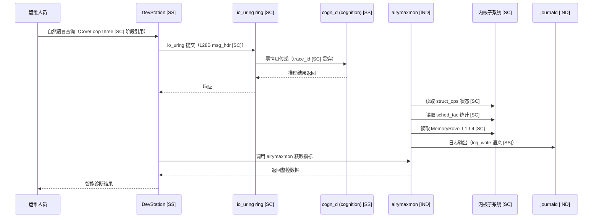

Copyright (c) 2025-2026 SPHARX Ltd. All Rights Reserved.

# agentrt-linux（AirymaxOS）系统设计文档（system，极境系统）
> **文档定位**：agentrt-linux（AirymaxOS）系统设计文档（system，极境系统）\
> **文档版本**：v1.1（2026-07-07）\
> **上级文档**：[agentrt-linux 设计文档](README.md)\
> **核心约束**：IRON-9 v3 同源且部分代码共享——与 agentrt 用户态 commons 通过 [SC] 共享契约层 + [SS] 语义同源层协作，[IND] RPM/dnf/glibc/shell/监控工具/DevStation 实现独立\
> **子仓编号**：07\
> **子仓代号**：极境系统（Airymax System）\
> **设计基准**：包管理 + 配置 + shell + 基础库 + 系统监控 + DevStation\
> **同源 agentrt**：commons\
> **横切关注点**：系统是横切关注点（cross-cutting concern），贯穿调度（sysctl 调度参数）、IPC（DevStation io_uring 通道）、eBPF（bpftrace/airymaxmon 观测）、记忆卷载（airymaxmon MemoryRovol 监控）4 大数据流

---

## 目录

- [1. 子仓职责](#1-子仓职责)
- [2. 同源关系（IRON-9 v3 四层共享模型）](#2-同源关系iron-9-v3-四层共享模型)
- [3. 目录结构](#3-目录结构)
- [4. 核心特性](#4-核心特性)
- [5. 微内核思想体现](#5-微内核思想体现)
- [6. IRON-9 v3 四层共享模型落地](#6-iron-9-v3-四层共享模型落地)
- [7. agentrt-linux 工程基线](#7-agentrt-linux-工程基线)
- [8. 前沿理论参考](#8-前沿理论参考)
- [9. 与其他子仓的协作](#9-与其他子仓的协作)
- [10. 里程碑（M0-M8）](#10-里程碑m0-m8)
- [11. agentrt 一致性检查](#11-agentrt-一致性检查)
- [12. 相关文档](#12-相关文档)
- [13. 参考](#13-参考)

---

## 1. 子仓职责

`system` 是 agentrt-linux（AirymaxOS）的系统管理工具子仓，承担以下核心职责：

1. **包管理 [IND]**：基于 RPM + dnf 的包管理系统（agentrt-linux 标准），支持 GPG 签名验证与模块化。
2. **配置工具 [IND]**：系统配置工具（sysctl、systemd-config、network-config、kernel-config）。
3. **shell [IND]**：提供 bash + fish + zsh 等 shell 环境。
4. **基础库 [IND]**：提供 glibc + musl 基础 C 库，glibc 为默认，musl 用于嵌入式场景。
5. **系统监控 [IND]**：提供 top、htop、perf、bpftrace、sysstat 等监控工具，airymaxmon 监控引用 [SC] 共享类型。
6. **DevStation [SS]**：基于 agentrt-linux DevStation，提供 AI 智能助手辅助开发运维，与 agentrt commons 助手语义同源，通过 io_uring IPC 通信 [SC]。
7. **airymaxmon [SC]**：agentrt-linux 专属监控工具，读取 struct_ops 状态机 + sched_tac 统计 + MemoryRovol L1-L4 指标，引用 [SC] 共享契约层类型。
8. **config_daemon [IND/SS]**：12 daemon 之一的统一配置管理守护进程，与 sec_d 协作加载 v1.1 Capability Folding 配置参数（`agent_caps[1024]` 容量、Badge Epoch 步进），通过 sysfs/procfs 与内核交互，systemd 集成 + 热重载机制，SSoT 见 `11-unified-config.md`。

作为发行版必需的工具集合，本子仓为其他子仓提供基础系统工具支持。

### 1.1 横切关注点声明

系统是横切关注点（cross-cutting concern），贯穿 agentrt-linux 全部 4 大数据流：

| 数据流 | 系统切入点 | 同源标注 |
|--------|-----------|----------|
| 调度数据流 | sysctl 调度参数（sched_agent_enabled）+ airymaxmon sched_tac 统计 | [SC] |
| IPC 数据流 | DevStation io_uring 通道 + 128B 消息头 | [SC] |
| eBPF 数据流 | bpftrace 动态追踪 + airymaxmon struct_ops 状态 | [SC] |
| 记忆卷载数据流 | airymaxmon MemoryRovol L1-L4 指标监控 | [SC] |

---

## 2. 同源关系（IRON-9 v3 四层共享模型）

依据 IRON-9 v3 决策（ADR-014 确立 seL4 唯一来源，参见 `docs/architecture/adr/ADR-014.md`），agentrt（用户态 commons）与 agentrt-linux（system）通过四层共享模型协作：

| 层次 | 共享程度 | 系统子系统内容 | 组织方式 |
|------|---------|---------------|---------|
| **[SC] 共享契约层** | 完全共享代码 | airymaxmon 读取的 struct_ops 状态机（INIT/REGISTERED/ACTIVE/DRAINING）+ common_value；sched_tac 调度类约束（使用 SCHED_DEADLINE/SCHED_FIFO/EEVDF 原生调度类，禁止定义 SCHED_AGENT 宏）+ task_desc（magic 0x41475453 'AGTS'）+ vtime 类型；MemoryRovol L1-L4 数据结构 + GFP 掩码语义；capability 41 ID 枚举（安全配置工具引用）；v1.1 `agent_caps[1024]` 静态数组（16KB）+ 64-bit Badge 布局（`Epoch<<48 \| RandomTag<<16 \| Perms`）；IPC 消息头（magic 0x41524531 'ARE1'）+ 128B msg_hdr（DevStation 通信）；CoreLoopThree 阶段枚举 + Thinkdual 模式枚举（DevStation 调用 LLM 引用）；v1.1 Syscall 24 槽位（4 核心 + 20 预留） | `include/uapi/linux/airymax/` 10 个头文件（与 kernel/services/security/memory/cognition 共享），清单见 §6.1 |
| **[SS] 语义同源层** | 高层 API 语义同源（概念操作一致），签名因抽象层级不同而独立演进 | commons 公共工具语义（agentrt commons → system 工具）、监控 API（agentrt monitoring → top/htop/perf/airymaxmon）、配置管理语义（agentrt config → config_daemon/sysctl/systemd-config）、AI 助手语义（agentrt assistant → DevStation）、日志语义（agentrt log_write → journald/syslog）等 8+ 项 | 各自独立实现 |
| **[IND] 完全独立层** | 完全独立 | RPM + dnf 包管理实现、glibc + musl 基础库实现、bash/fish/zsh shell 实现、sysctl/systemd-config 实现细节、top/htop/perf/bpftrace/sysstat 工具实现、DevStation OS 级实现（auto-fix/code-gen/knowledge-base）、config_daemon 实现细节（YAML/TOML 解析、热重载） | 各自独立仓库 |
| **[DSL] 降级生存层** | 降级模式下最小可用 | config_daemon 配置源不可达时降级为内置默认配置 + 只读运行；airymaxmon 在 struct_ops 状态不可读时降级为 Prometheus 拉取模式；DevStation 在 LLM 通道断开时降级为规则引擎模式（仅本地知识库匹配） | 各自独立实现，但共享降级触发语义 |

### 2.1 维度对比

| 维度 | agentrt（commons） | agentrt-linux（system） | 同源标注 |
|------|--------------------|-------------------------------|----------|
| 公共工具 | commons（应用层） | 系统管理工具（OS 级） | [SS] |
| 监控 API | 应用层监控 | top/htop/perf/airymaxmon | [SS] |
| struct_ops 状态 | 不涉及 | airymaxmon 读取 INIT/REGISTERED/ACTIVE/DRAINING | [SC] |
| sched_tac 统计 | 不涉及 | airymaxmon 读取 task_desc + vtime | [SC] |
| MemoryRovol 监控 | heapstore 监控 | airymaxmon 读取 L1-L4 指标 | [SC] |
| 配置管理 | 应用配置 | sysctl + systemd-config | [SS] |
| AI 助手 | 自研助手 | DevStation（agentrt-linux 自研） | [SS] |
| IPC 通信 | 用户态消息队列 | DevStation io_uring IPC | [SC] |
| 日志 | log_write | journald + syslog | [SS] |
| 跨平台 | Linux/macOS/Windows | Linux 6.6 专属 | [IND] |

### 2.2 同源传承要点

- 保留 agentrt commons 的"公共工具"语义，升级为 OS 级系统管理工具 [SS]。
- 保留 agentrt 的监控 API 语义，升级为 top/htop/perf/airymaxmon [SS]。
- 保留 agentrt 的配置管理语义，升级为 sysctl/systemd-config [SS]。
- 保留 agentrt 的 AI 助手语义，升级为 DevStation（OS 级 AI 智能助手）[SS]。
- airymaxmon 通过 [SC] 共享契约层读取 struct_ops/sched_tac/MemoryRovol 状态，确保监控指标与 agentrt 一致。
- DevStation 通过 [SC] 共享契约层（ipc.h）与 LLM 守护进程通信，确保 IPC 协议一致。
- 升级为 OS 级包管理（RPM + dnf），获得依赖解析 + 仓库管理 + GPG 签名能力 [IND]。

---

## 3. 目录结构

```
system/
├── package-manager/        # 包管理（RPM + dnf）[IND]
├── config/                 # 配置工具 [IND]
├── config-daemon/          # config_daemon（12 daemon 之一，统一配置管理）[IND/SS]
├── shell/                  # shell（bash + fish）[IND]
├── base-libs/              # 基础库（glibc + musl）[IND]
├── monitoring/             # 系统监控（airymaxmon 引用 [SC] 类型）[IND]
├── devstation/             # DevStation（AI 智能助手，io_uring IPC [SC]）[SS]
└── docs/
```

### 3.1 package-manager/（包管理）[IND]

遵循 **agentrt-linux 标准**：
- `rpm/`：RPM 包构建工具（rpmbuild）[IND]。
- `dnf/`：dnf 包管理器配置 [IND]。
- `repos/`：仓库配置（airymaxos.repo）[IND]。
- `build/`：构建脚本（mock、koji 集成）[IND]。
- `sign/`：包签名（GPG）[IND]。

### 3.2 config/（配置工具）[IND]

- `sysctl/`：sysctl 配置（/etc/sysctl.d/），包含 sched_tac 调度参数 [SC] [IND]。
- `systemd-config/`：systemd 配置（/etc/systemd/）[IND]。
- `network-config/`：网络配置（NetworkManager）[IND]。
- `kernel-config/`：内核配置工具（kernel-config）[IND]。
- `agentrt-config/`：agentrt-linux 专属配置 [IND]，路径 `/etc/agentrt/`（**禁止**非 agentrt 命名空间的旧路径，SSoT 见 `11-unified-config.md`）。

### 3.2.1 config-daemon/（config_daemon，12 daemon 之一）[IND/SS]

config_daemon 是 agentrt-linux 12 daemon 之一，负责统一配置管理：
- `core/`：守护进程核心（systemd unit + D-Bus 接口）[IND]。
- `parsers/`：YAML/TOML 解析器（**禁止** JSON 配置）[IND]。
- `loaders/`：配置加载器（sysfs/procfs 与内核交互）[IND]。
- `reload/`：热重载机制（inotify + SIGHUP）[IND]。
- `sec_d-bridge/`：与 sec_d 协作加载 v1.1 Capability Folding 配置参数 [SS]。

### 3.3 shell/（shell）[IND]

- `bash/`：Bash shell（默认）[IND]。
- `fish/`：Fish shell（友好交互）[IND]。
- `zsh/`：Zsh shell（可选）[IND]。
- `oh-my-zsh/`：Oh My Zsh 配置（可选）[IND]。

### 3.4 base-libs/（基础库）[IND]

- `glibc/`：GNU C Library（默认）[IND]。
- `musl/`：musl libc（精简、嵌入式场景）[IND]。
- `compat-libs/`：兼容库（32 位、旧版本兼容）[IND]。
- `static-libs/`：静态库 [IND]。

### 3.5 monitoring/（系统监控）[IND]

监控工具实现独立 [IND]，但 airymaxmon 读取 [SC] 共享契约层类型：
- `procps/`：top、ps、free 等基础工具 [IND]。
- `htop/`：htop 交互式监控 [IND]。
- `perf/`：perf 性能分析工具 [IND]。
- `bpftrace/`：bpftrace 动态追踪 [IND]。
- `sysstat/`：sar、iostat 等系统统计 [IND]。
- `airymaxmon/`：agentrt-linux 专属监控工具，读取 [SC] 共享类型 [IND]：
  - struct_ops 状态机（INIT/REGISTERED/ACTIVE/DRAINING）[SC]
  - sched_tac 统计（task_desc magic 0x41475453 + vtime）[SC]
  - MemoryRovol L1-L4 指标（GFP 掩码语义）[SC]
  - capability 41 ID 状态（安全监控）[SC]

### 3.6 devstation/（DevStation，AI 智能助手）[SS]

DevStation 与 agentrt commons AI 助手语义同源 [SS]，通过 io_uring IPC 通信 [SC]：
- `ai-assistant`：AI 智能助手（自然语言交互，引用 CoreLoopThree 阶段枚举 [SC]）[SS]。
- `dev-tools`：开发工具集成 [IND]。
- `ops-tools`：运维工具集成 [IND]。
- `knowledge-base`：知识库（agentrt-linux 文档）[IND]。
- `auto-fix`：自动修复（常见问题自动诊断与修复）[IND]。
- `code-gen`：代码生成（基于 LLM，引用 LLM 推理阶段枚举 [SC]）[IND]。

---

## 4. 核心特性

### 4.1 包管理（RPM + dnf，agentrt-linux 标准）[IND]

遵循 **agentrt-linux 包管理标准**：
- RPM 包格式：与 agentrt-linux、Fedora、CentOS 兼容 [IND]。
- dnf 包管理器：依赖解析、仓库管理、事务处理 [IND]。
- 包签名：GPG 签名验证，防止篡改 [IND]。
- 模块化：支持模块（module）与流（stream）[IND]。

**仓库配置**：
```ini
# /etc/yum.repos.d/airymaxos.repo
[airymaxos-base]
name=agentrt-linux Base Repository
baseurl=https://repo.airymaxos.io/$releasever/base/$basearch/
enabled=1
gpgcheck=1
gpgkey=file:///etc/pki/rpm-gpg/RPM-GPG-KEY-airymaxos

[airymaxos-updates]
name=agentrt-linux Updates Repository
baseurl=https://repo.airymaxos.io/$releasever/updates/$basearch/
enabled=1
gpgcheck=1
```

### 4.2 配置工具（sysctl、systemd-config）[IND]

**sysctl 配置**（sched_tac 参数引用 [SC] 共享类型）：
```ini
# /etc/sysctl.d/99-airymaxos.conf
# 调度优化（sched_tac [SC]）
kernel.sched_agent_enabled = 1

# 内存优化（MemoryRovol L1-L4 [SC]）
vm.swappiness = 10
vm.watermark_scale_factor = 125
vm.mglru_enabled = 1

# io_uring 优化（IPC ring [SC]）
fs.io_uring_max_entries = 32768

# 网络优化
net.core.somaxconn = 65535
net.ipv4.tcp_max_syn_backlog = 65535
```

**systemd 配置**：
- 默认 target：`airymaxos.target` [IND]。
- 资源限制：cgroup v2 配置 [IND]。
- 日志：journald 配置（与 agentrt log_write 语义同源 [SS]）[IND]。
- 网络：systemd-networkd 配置 [IND]。

### 4.3 shell（bash + fish）[IND]

**默认 shell：bash**
- 兼容 POSIX [IND]。
- 丰富的脚本生态 [IND]。

**可选 shell：fish**
- 友好的交互式体验 [IND]。
- 智能补全 [IND]。
- 语法高亮 [IND]。

### 4.4 基础库（glibc、musl）[IND]

**默认：glibc**
- 完整 POSIX 兼容 [IND]。
- 广泛的软件生态 [IND]。
- 性能优化（glibc 2.40+）[IND]。

**可选：musl**
- 精简、轻量 [IND]。
- 静态链接友好 [IND]。
- 嵌入式场景适用 [IND]。

### 4.5 系统监控（top、htop、perf、airymaxmon）[IND]

**top/htop**：进程级监控 [IND]。
**perf**：性能分析（基于 perf_events）[IND]。
**bpftrace**：动态追踪（基于 eBPF，读取 struct_ops 状态 [SC]）[IND]。
**sysstat**：系统统计（sar、iostat）[IND]。

**agentrt-linux 专属监控（airymaxmon）**——读取 [SC] 共享契约层类型：
- struct_ops 状态机监控（INIT/REGISTERED/ACTIVE/DRAINING 四态）[SC]。
- sched_tac 调度统计（task_desc magic 0x41475453 + vtime 衰减）[SC]。
- MemoryRovol L1-L4 分级内存指标（GFP 掩码语义）[SC]。
- capability 41 ID 安全状态监控 [SC]。
- CoreLoopThree 认知循环阶段监控（PERCEPTION/THINKING/ACTION）[SC]。
- 与 `cloudnative/observability` 集成 [IND]。

### 4.6 DevStation（基于 agentrt-linux AI 智能助手）[SS]

DevStation 与 agentrt commons AI 助手语义同源 [SS]，通过 io_uring IPC 通信 [SC]：
- AI 智能助手：自然语言交互，辅助开发运维 [SS]。
- 知识库：集成 agentrt-linux 文档 [IND]。
- 自动修复：常见问题自动诊断与修复 [IND]。
- 代码生成：基于 LLM 生成配置脚本、systemd unit 等 [IND]。
- 与 `cognition` 协作，调用 LLM 推理（引用 CoreLoopThree 阶段枚举 [SC]）[SS]。

**DevStation io_uring IPC 通信** [SC]（`include/uapi/linux/airymax/ipc.h`，与 agentrt 共享）：

```c
/* IPC 128B 消息头定义见 [SC] 共享契约层（SSoT），不就地重定义 */
#include <airymax/ipc.h>
/* 结构体名称：struct airy_ipc_msg_hdr（Layout C，物理宿主见
 * 50-engineering-standards/120-cross-project-code-sharing.md §Layout C） */
```

> **SSoT 声明**：本节 IPC 128B 消息头不再就地定义，以 `include/uapi/linux/airymax/ipc.h`（物理宿主见 `50-engineering-standards/120-cross-project-code-sharing.md` §Layout C）为单一数据源。结构体名称为 `struct airy_ipc_msg_hdr`，按 OLK 6.6 工程规范使用 `__aligned(64)` 对齐（**禁止**紧凑打包属性与显式 `__attribute__((aligned(...)))` 形式，参考 OLK 6.6 `struct ethhdr`/`struct iphdr` 手动安排字段自然对齐）与 `__u32`/`__u16`/`__u64`/`__u8` UAPI 类型。UAPI 标准路径 `include/uapi/linux/airymax/`，io_uring 命令访问通过 `io_uring_cmd_to_pdu(cmd, pdu_type)` 安全宏读取 `pdu[32]` 字段，完成路径调用 `io_uring_cmd_done(cmd, ret, res2, issue_flags)` 4 参数签名，`security_uring_cmd` LSM 钩子为单参数 `struct io_uring_cmd *ioucmd`。`CONFIG_SECURITY_AIRY` 默认为 `n`。

**示例交互**：
```bash
$ devstation
> 我的 Agent 进程 OOM 了，怎么排查？
DevStation: 检测到 agent.slice 内存使用达到上限。
建议：
1. 查看 dmesg 是否有 OOM killer 记录：dmesg | grep -i oom
2. 查看 cgroup 内存限制：systemctl status agent.slice
3. 查看 MemoryRovol L1-L4 指标 [SC]：airymaxmon --memory
4. 提升 agent.slice 内存限制：systemctl set-property agent.slice MemoryMax=8G
是否需要我执行上述命令？
> 是
```

### 4.7 config_daemon（统一配置管理，12 daemon 之一）[IND/SS]

config_daemon 是 agentrt-linux 12 daemon 之一（完整名单见 §6.7），负责统一配置管理。SSoT 见 `11-unified-config.md`。

**配置路径**：
- 标准路径：`/etc/agentrt/`（**禁止**非 agentrt 命名空间的旧路径，SSoT 见 `11-unified-config.md`）。
- daemon 主配置：`/etc/agentrt/config_daemon.yaml`。
- 子仓配置覆盖：`/etc/agentrt/{kernel,services,security,memory,cognition,cloudnative}.yaml`。
- 默认 fallback：`/usr/share/agentrt/defaults/`（RPM 安装时由包管理释放）。

**配置格式**：
- **YAML/TOML**（**禁止** JSON）：与 `dnf` 配置语义一致，支持注释与多行字符串。
- 优先级：命令行参数 > `/etc/agentrt/` 覆盖 > `/usr/share/agentrt/defaults/` 默认。

**与内核交互**：
- 通过 `sysfs`（`/sys/fs/airymax/`）+ `procfs`（`/proc/airymax/`）读写内核参数。
- v1.1 Capability Folding 配置参数通过 sysfs 暴露：
  - `/sys/fs/airymax/agent_caps_capacity` → `agent_caps[1024]` 容量（默认 1024，16KB）。
  - `/sys/fs/airymax/badge_epoch_step` → Badge Epoch 步进（默认 1，由 sec_d 推进）。
  - `/sys/fs/airymax/syscall_table_size` → v1.1 Syscall 24 槽位（4 核心 + 20 预留）。
  - `/sys/fs/airymax/fastpath_c_s9_enabled` → fastpath C-S9 内联校验开关（默认 1，~10ns）。
  - `/sys/fs/airymax/lsm_order` → airy_lsm 排序（`LSM_ORDER_MUTABLE`，禁止 `LSM_ORDER_FIRST`）。

**systemd 集成**：
- `config_daemon.service`：Type=notify，启动后通过 sd_notify 通知 systemd 就绪。
- 启动顺序：`config_daemon.service` 在 `sec_d.service` 之前启动（提供配置）。
- 依赖：`-.mount` + `systemd-sysctl.service`（先加载 sysctl）。

**热重载机制**：
- 监听 inotify 事件（`/etc/agentrt/` 目录变化）+ 接收 SIGHUP。
- 热重载流程：解析新配置 → 校验语义 → 通过 sysfs 推送至内核 → 通知 sec_d 重新加载 `agent_caps[1024]` 配置 → 通过 D-Bus 信号通知订阅者（DevStation、airymaxmon 等）。
- 热重载不重启 daemon，但会触发 sec_d 的 Badge Epoch 推进（`atomic_inc(&airy_cap_global_epoch)`）以保证配置变更即时生效。

**config_daemon 与 sec_d 协作**（v1.1 Capability Folding）：
- config_daemon 加载 `agent_caps[1024]` 容量与 Badge Epoch 步进参数，通过 sysfs 推送至内核。
- sec_d 读取 sysfs 参数，按配置编译 Badge（`Epoch<<48 | RandomTag<<16 | Perms`）写入 `agent_caps[1024]` 静态数组（16KB）。
- config_daemon 热重载时通知 sec_d 推进 Epoch，触发 O(1) 撤销旧 Badge。
- fastpath C-S9 内联校验（~10ns）+ slowpath airy_lsm 钩子（`LSM_ORDER_MUTABLE`）的启用状态由 config_daemon 控制。

---

## 5. 微内核思想体现

### 5.1 发行版必需工具 [IND]

本子仓提供发行版必需的工具：
- 包管理：RPM + dnf [IND]。
- 配置：sysctl、systemd [IND]。
- shell：bash、fish [IND]。
- 基础库：glibc、musl [IND]。

这些工具不属于微内核本身，而是发行版的"用户态工具集"。

### 5.2 工具与内核解耦 [IND]

- 工具通过标准接口（系统调用、sysctl、procfs）与内核交互 [IND]。
- 工具可独立升级，不影响内核稳定性 [IND]。
- 符合微内核"机制在内核，工具在用户态"原则 [IND]。

### 5.3 AI 原生工具 [SS]

- DevStation 引入 AI 智能助手，体现 AI 原生 OS 设计 [SS]。
- 与 `cognition` 协作，调用 LLM 能力（引用 CoreLoopThree 阶段枚举 [SC]）[SS]。
- 工具智能化，降低运维门槛 [IND]。

### 5.4 共享契约层监控 [SC]

airymaxmon 通过 [SC] 共享契约层读取内核子系统状态，确保监控指标与 agentrt 用户态一致：
- struct_ops 状态机（`include/uapi/linux/airymax/syscalls.h`）[SC]。
- sched_tac 调度统计（`include/uapi/linux/airymax/sched.h`）[SC]。
- MemoryRovol L1-L4 指标（`include/uapi/linux/airymax/memory_types.h`）[SC]。
- capability 安全状态（`include/uapi/linux/airymax/security_types.h`）[SC]。
- 认知循环阶段（`include/uapi/linux/airymax/cognition_types.h`）[SC]。
- IPC 通信协议（`include/uapi/linux/airymax/ipc.h`）[SC]。

---

## 6. IRON-9 v3 四层共享模型落地

### 6.1 [SC] 共享契约层——10 个头文件

系统模块的 [SC] 层通过 10 个核心头文件与 agentrt 共享（airymaxmon + DevStation + config_daemon 消费，SSoT 见 `50-engineering-standards/120-cross-project-code-sharing.md`）：

| 头文件 | 共享内容 | 系统使用场景 |
|--------|---------|-------------|
| `include/uapi/linux/airymax/error.h` | 扩展错误码（`AIRY_ESEC_D_THROTTLED = -83`、`AIRY_ECAP_FROZEN = -82`、`AIRY_FAULT_URING_MALFORMED = 0x100A`、`AIRY_FAULT_AUDIT_TAMPER = 0x100B`） | airymaxmon 错误码映射 + DevStation 诊断建议 |
| `include/uapi/linux/airymax/log_types.h` | trace_id + 结构化日志类型枚举 | journald + airymaxmon 日志聚合 |
| `include/uapi/linux/airymax/memory_types.h` | MemoryRovol L1-L4 数据结构 + GFP 掩码语义 + PMEM 持久化接口 | airymaxmon 监控分级内存 |
| `include/uapi/linux/airymax/security_types.h` | capability 41 ID 枚举 + LSM 钩子 252 ID + Cupolas blob 布局 + v1.1 `agent_caps[1024]` 静态数组定义 + 64-bit Badge 布局 | airymaxmon 安全监控 + config_daemon 推送 capability 配置 + 安全配置工具 |
| `include/uapi/linux/airymax/cognition_types.h` | CoreLoopThree 阶段枚举 + Thinkdual 模式枚举 + LLM 推理阶段枚举 | DevStation 调用 LLM + airymaxmon 认知监控 |
| `include/uapi/linux/airymax/sched.h` | sched_tac 调度类约束（使用 SCHED_DEADLINE/SCHED_FIFO/EEVDF 原生调度类，禁止定义 SCHED_AGENT 宏）+ task_desc（magic 0x41475453 'AGTS'）+ vtime 类型与衰减公式 | airymaxmon 监控调度统计 |
| `include/uapi/linux/airymax/ipc.h` | IPC magic 0x41524531 'ARE1' + 128B `struct airy_ipc_msg_hdr` + SQE/CQE 操作码 | DevStation io_uring IPC 通信 |
| `include/uapi/linux/airymax/syscalls.h` | v1.1 Syscall 24 槽位（4 核心 + 20 预留）：`airy_sys_call`(0)/`airy_sys_rovol_ctl`(1)/`airy_sys_sched_ctl`(2)/`airy_sys_clt_notify`(3) | airymaxmon 监控 syscall 调用统计 + config_daemon 推送配置 |
| `include/uapi/linux/airymax/uapi_compat.h` | UAPI 兼容层宏（`__aligned(64)`、`__u32`/`__u16`/`__u64`/`__u8`）+ SQE128 模式 `cmd[80]` 扩展 | IPC 消息头对齐 + airymaxmon 读取 io_uring SQE128 字段 |
| `include/uapi/linux/airymax/lsm_types.h` | airy_lsm 钩子 ID 252 枚举 + `LSM_ORDER_MUTABLE` 排序定义 + `uring_cmd` 单参数钩子签名 | airymaxmon 安全监控 + config_daemon 推送 `LSM_ORDER_MUTABLE` 配置 |

> **补充共享文件说明**：`include/linux/bpf_struct_ops.h` 是补充共享文件（位于内核源码 `include/linux/`），**不是** [SC] 核心头文件。`bpf_struct_ops.h` 定义 struct_ops 状态机框架（INIT/REGISTERED/ACTIVE/DRAINING 四态），airymaxmon 通过它读取 schedTac/macrosuperv 等 BPF struct_ops 注册状态。**[SC] 核心头文件严格为 10 个**（清单见上表），`bpf_struct_ops.h` 仅作为内核侧补充引用。

### 6.2 [SS] 语义同源层——8 项 API 映射

高层 API 语义同源（概念操作一致），签名因抽象层级不同而独立演进。系统模块的同源 API：

| 序号 | 语义 | agentrt 实现 | agentrt-linux 实现 |
|------|------|-------------|-------------------|
| 1 | commons 公共工具 | 应用层 commons 工具 | OS 级系统管理工具 |
| 2 | 监控 API | 应用层监控 | top/htop/perf/airymaxmon |
| 3 | 配置管理 | 应用配置 | sysctl + systemd-config |
| 4 | AI 助手 | 自研助手 | DevStation（OS 级） |
| 5 | 日志语义 | log_write | journald + syslog |
| 6 | trace_id 贯穿 | user_data 字段 | io_uring user_data + journald |
| 7 | capability 状态查询 | 用户态 capability | airymaxmon capability 41 ID [SC] |
| 8 | MemoryRovol 监控 | heapstore 监控 | airymaxmon L1-L4 指标 [SC] |

### 6.3 [IND] 完全独立层——12 项独立实现

| 序号 | 内容 | 不共享原因 |
|------|------|-----------|
| 1 | RPM + dnf 包管理 | OS 级包管理仅 agentrt-linux |
| 2 | glibc + musl 基础库 | OS 级 C 库仅 agentrt-linux |
| 3 | bash/fish/zsh shell | OS 级 shell 仅 agentrt-linux |
| 4 | sysctl 配置实现 | 内核参数配置仅 agentrt-linux |
| 5 | systemd-config 实现 | OS 级服务管理仅 agentrt-linux |
| 6 | top/htop/perf 工具实现 | OS 级监控工具仅 agentrt-linux |
| 7 | bpftrace 动态追踪 | 内核 eBPF 追踪仅 agentrt-linux |
| 8 | sysstat 系统统计 | OS 级统计工具仅 agentrt-linux |
| 9 | DevStation auto-fix | OS 级自动修复仅 agentrt-linux |
| 10 | DevStation code-gen | OS 级代码生成仅 agentrt-linux |
| 11 | DevStation knowledge-base | OS 级知识库仅 agentrt-linux |
| 12 | airymaxmon 实现 | OS 级专属监控工具仅 agentrt-linux |

### 6.4 [DSL] 降级生存层落地

依据 IRON-9 v3 决策不允许从四层共享模型降级，\[DSL] 是系统模块在配置源/LLM 通道故障下的最小可用语义层：

| 降级触发条件 | 降级后行为 | 恢复条件 |
| ------- | ------- | ------- |
| config_daemon 配置源不可达 | 降级为 `/usr/share/agentrt/defaults/` 内置默认配置 + 只读运行（拒绝写入） | 配置源恢复后强制全量 reload |
| airymaxmon struct_ops 状态不可读 | 降级为 Prometheus 拉取模式（通过 eBPF collector 间接采集） | struct_ops 可读后切回直接模式 |
| DevStation LLM 通道断开 | 降级为规则引擎模式（仅本地知识库匹配 + 模板回复） | LLM 通道恢复后切回完整模式 |
| sec_d 进程不可达 | config_daemon 缓存最近一次 capability 配置 + 暂停 Badge Epoch 推进 | sec_d 恢复后通过 `airy_sys_call(0)` 同步 Epoch |

\[DSL] 层保证系统工具在配置/LLM/sec_d 故障下仍能维持基础监控与运维能力，但拒绝写入操作以避免配置与 Epoch 倒流。

### 6.5 v1.1 Capability Folding 在系统场景的应用

v1.1 Capability Folding（ADR-014 seL4 唯一来源，参见 `docs/architecture/adr/ADR-014.md`）在系统模块下的核心约束：

- **`agent_caps[1024]` 静态数组（16KB）**：config_daemon 通过 sysfs（`/sys/fs/airymax/agent_caps_capacity`）暴露容量配置；sec_d 作为唯一写者编译 Badge 写入数组。
- **64-bit Badge 布局**（`Epoch<<48 | RandomTag<<16 | Perms`）：config_daemon 通过 sysfs（`/sys/fs/airymax/badge_epoch_step`）配置 Epoch 步进；airymaxmon 读取 Badge 状态用于安全监控。
- **O(1) 撤销**（`atomic_inc(&airy_cap_global_epoch)`）：config_daemon 热重载触发 sec_d 推进 Epoch，全集群 100ms 内完成 Badge 失效。
- **fastpath C-S9 内联校验（~10ns）+ slowpath LSM 钩子**：config_daemon 通过 sysfs（`/sys/fs/airymax/fastpath_c_s9_enabled`）控制 fastpath 开关；slowpath 走 airy_lsm（`LSM_ORDER_MUTABLE`，禁止 `LSM_ORDER_FIRST`）。
- **v1.1 Syscall 24 槽位**：config_daemon 通过 sysfs（`/sys/fs/airymax/syscall_table_size`）暴露槽位数量；airymaxmon 监控 syscall 调用统计。
- **io_uring SQE128 模式**：cmd 扩展至 80 字节（16→80），通过 `io_uring_cmd_to_pdu(cmd, pdu_type)` 安全宏访问 `pdu[32]` 字段；完成路径调用 `io_uring_cmd_done(cmd, ret, res2, issue_flags)` 4 参数签名；`security_uring_cmd` LSM 钩子为单参数 `struct io_uring_cmd *ioucmd`。

### 6.6 12 daemon 完整名单与系统子仓协作

agentrt-linux 12 daemon 完整名单（参考 `02-services.md` §1.2 SSoT），系统子仓与各 daemon 的协作关系：

| 序号 | daemon | 系统子仓协作内容 |
| -- | ------ | ---------- |
| 1 | sec\_d | config_daemon 推送 capability 配置参数 + sysfs 通道；airymaxmon 监控 sec_d 状态 |
| 2 | cogn\_d | DevStation 通过 io_uring 调用 LLM；airymaxmon 监控认知循环阶段 |
| 3 | mem\_d | airymaxmon 监控 MemoryRovol L1-L4 指标；config_daemon 推送内存配置 |
| 4 | gateway\_d | config_daemon 推送跨节点 Badge 一致性 gossip 配置（参考 `06-cloudnative.md` §6.6） |
| 5 | logger\_d | journald 集成；airymaxmon 日志聚合 |
| 6 | macro\_superv | airymaxmon 监控宏调度状态；config_daemon 推送调度策略 |
| 7 | audit\_d | airymaxmon 监控 `AIRY_FAULT_AUDIT_TAMPER = 0x100B` 上报 |
| 8 | sched\_d | airymaxmon 监控 sched_tac 统计；config_daemon 推送调度参数 |
| 9 | dev\_d | airymaxmon 监控设备状态；config_daemon 推送设备配置 |
| 10 | net\_d | airymaxmon 监控网络状态；config_daemon 推送网络配置 |
| 11 | vfs\_d | airymaxmon 监控文件系统状态；config_daemon 推送挂载配置 |
| 12 | config\_daemon | **本子仓实现**，统一配置管理守护进程（详见 §4.7） |

### 6.7 跨态协作流



### 6.8 组件架构图

```mermaid
graph TD
    subgraph SC["[SC] 共享契约层（10 核心头文件）"]
        ERR_HDR[error.h<br/>扩展错误码]
        LOG_HDR[log_types.h<br/>trace_id + 日志类型]
        SCHED_HDR[sched.h<br/>sched_tac + task_desc]
        MEM_HDR[memory_types.h<br/>MemoryRovol L1-L4]
        SEC_HDR[security_types.h<br/>capability 41 ID + agent_caps + Badge 64-bit]
        COG_HDR[cognition_types.h<br/>CoreLoopThree 阶段]
        IPC_HDR[ipc.h<br/>128B msg_hdr + magic ARE1]
        SYS_HDR[syscalls.h<br/>v1.1 24 槽位 syscall]
        UAPI_HDR[uapi_compat.h<br/>__aligned(64) + SQE128 cmd[80]]
        LSM_HDR[lsm_types.h<br/>airy_lsm + uring_cmd 钩子]
    end
    subgraph SUPP["补充共享文件（非 [SC] 核心头文件）"]
        BPF_HDR[include/linux/bpf_struct_ops.h<br/>struct_ops 状态机框架<br/>内核侧补充引用]
    end
    subgraph SS["[SS] 语义同源层"]
        COMMONS[commons 公共工具语义<br/>agentrt commons → system]
        MONITOR[监控 API<br/>agentrt monitoring → top/htop/perf/airymaxmon]
        CONFIG[配置管理<br/>agentrt config → config_daemon/sysctl/systemd]
        ASSIST[AI 助手<br/>agentrt assistant → DevStation]
        LOGGING[日志语义<br/>agentrt log_write → journald]
    end
    subgraph IND["[IND] 独立层"]
        RPM[RPM + dnf 包管理]
        GLIBC[glibc + musl 基础库]
        SHELL[bash + fish + zsh shell]
        SYSCTL[sysctl + systemd-config]
        TOOLS[top + htop + perf + bpftrace]
        DEVSTATION[DevStation<br/>auto-fix + code-gen + knowledge-base]
        AIRYMAXMON[airymaxmon 实现]
        CONFIGDAEMON[config_daemon<br/>YAML/TOML + 热重载 + sysfs 推送]
    end
    subgraph DSL["[DSL] 降级生存层"]
        CFG_FALL[config_daemon 内置默认配置只读]
        MON_FALL[airymaxmon Prometheus 拉取模式]
        DEV_FALL[DevStation 规则引擎模式]
    end
    subgraph CAP["v1.1 Capability Folding（系统场景应用）"]
        AGENT_CAPS[agent_caps[1024] 静态数组<br/>sec_d 唯一写者]
        BADGE[64-bit Badge<br/>Epoch&lt;&lt;48 | RandomTag&lt;&lt;16 | Perms]
        FASTPATH[fastpath C-S9 内联校验 ~10ns]
        SLOWPATH[slowpath airy_lsm 钩子<br/>LSM_ORDER_MUTABLE]
    end
    ERR_HDR --> AIRYMAXMON
    LOG_HDR --> AIRYMAXMON
    SCHED_HDR --> AIRYMAXMON
    MEM_HDR --> AIRYMAXMON
    SEC_HDR --> AIRYMAXMON
    COG_HDR --> DEVSTATION
    IPC_HDR --> DEVSTATION
    SYS_HDR --> AIRYMAXMON
    UAPI_HDR --> IPC_HDR
    LSM_HDR --> SLOWPATH
    BPF_HDR -.补充.-> AIRYMAXMON
    COMMONS --> TOOLS
    MONITOR --> AIRYMAXMON
    CONFIG --> CONFIGDAEMON
    ASSIST --> DEVSTATION
    LOGGING --> TOOLS
    CONFIGDAEMON --> AGENT_CAPS
    AGENT_CAPS --> BADGE
    BADGE --> FASTPATH
    FASTPATH --> SLOWPATH
    CONFIGDAEMON -. 降级 .-> CFG_FALL
    AIRYMAXMON -. 降级 .-> MON_FALL
    DEVSTATION -. 降级 .-> DEV_FALL
```

---

## 7. agentrt-linux 工程基线

- **agentrt-linux 基础系统治理组**：基础系统工具最佳实践。
- **agentrt-linux 包管理**：RPM + dnf 集成经验。
- **agentrt-linux DevStation**：AI 智能助手基线。
- **agentrt-linux 监控工具**：系统监控工具基线。
- **agentrt-linux shell**：shell 配置基线。

---

## 8. 前沿理论参考

| 理论 | 来源 | 应用 |
|------|------|------|
| agentrt-linux DevStation | agentrt-linux | AI 智能助手 |
| 标准 Linux 工具链 | Linux 生态 | 系统工具 |
| RPM + dnf | Fedora/agentrt-linux | 包管理 |
| systemd | systemd 项目 | 系统管理 |
| bpftrace | eBPF | 动态追踪 |
| perf | Linux | 性能分析 |

---

## 9. 与其他子仓的协作

| 协作子仓 | 协作内容 | 同源标注 |
|---------|---------|----------|
| `kernel` | 提供内核配置工具所需接口 | [IND] |
| `services` | 提供 systemd unit 管理 | [SS] |
| `security` | 提供安全配置工具（capability 41 ID） | [SC] |
| `memory` | 提供内存监控工具（MemoryRovol L1-L4） | [SC] |
| `cognition` | DevStation 调用 LLM 能力（CoreLoopThree 阶段） | [SC] |
| `cloudnative` | 提供云原生监控集成 | [IND] |
| `tests-linux` | 提供测试工具 | [IND] |

---

## 10. 里程碑（M0-M8）

| 阶段 | 目标 | 时间 |
|------|------|------|
| M0 | 文档体系完成（本模块设计文档） | 2026-07 |
| M1 | RPM + dnf 仓库搭建 | 2026 Q3 |
| M2 | 基础库（glibc）+ shell（bash） | 2026 Q4 |
| M3 | 配置工具（sysctl、systemd） | 2027 Q1 |
| M4 | 系统监控工具（top、htop、perf、airymaxmon） | 2027 Q2 |
| M5 | DevStation Phase 1（AI 助手） | 2027 Q3 |
| M6 | DevStation Phase 2（自动修复） | 2027 Q4 |
| M7 | 系统集成 + 端到端测试 | 2028 Q1 |
| M8 | 生产就绪 + 发布 | 2028 Q2 |

### 10.1 0.1.1 版本范围

仅完成 M0（文档体系完成）+ M1（[IND] 共享契约层头文件占位）。不含内核/OS 代码实施。

### 10.2 1.0.1 版本范围

完成 M2-M8 全部里程碑，并实施系统工程标准。

---

## 11. agentrt 一致性检查

| 检查项 | 验证内容 | 结果 |
|--------|----------|------|
| 命名一致性 | 核心表述使用 `agentrt-linux（AirymaxOS）` 全角括号配对 | PASS |
| 语义同源标注 | commons/监控/配置/AI 助手/日志等标注 [SS] | PASS |
| IRON-9 v3 四层合规 | [SC] 10 头文件 + [SS] 8 API + [IND] 12 项独立实现 + [DSL] 4 降级场景 + v1.1 Capability Folding sysfs 推送 + 12 daemon 完整列表 | PASS |
| [SC] 头文件引用 | error.h + log_types.h + memory_types.h + security_types.h + cognition_types.h + sched.h + ipc.h + syscalls.h + uapi_compat.h + lsm_types.h 共 10 个均在 §6.1 引用 | PASS |
| bpf_struct_ops.h 归类 | §6.1 明确说明 bpf_struct_ops.h 是补充共享文件（非 [SC] 核心头文件），10 个核心头文件严格独立 | PASS |
| config_daemon 完整性 | §1.2/§3.2.1/§4.7/§6.5/§6.6 均引用 config_daemon（路径 `/etc/agentrt/`，YAML/TOML，sysfs 推送，热重载，与 sec_d 协作） | PASS |
| 配置路径 SSoT | `/etc/agentrt/`（禁止非 agentrt 命名空间的旧路径），SSoT 见 `11-unified-config.md` | PASS |
| v1.1 Capability Folding | `agent_caps[1024]` + 64-bit Badge + O(1) 撤销 + fastpath C-S9 + slowpath airy_lsm（`LSM_ORDER_MUTABLE`）均在 §6.5 引用 | PASS |
| 12 daemon 完整列表 | sec_d/cogn_d/mem_d/gateway_d/logger_d/macro_superv/audit_d/sched_d/dev_d/net_d/vfs_d/config_daemon 共 12 个均在 §6.6 列出 | PASS |
| ADR-014 引用 | §2 与 §6.5 引用 ADR-014（seL4 唯一来源） | PASS |
| OLK 6.6 工程规范 | `__aligned(64)` + `io_uring_cmd_to_pdu` + `io_uring_cmd_done` 4 参数 + `security_uring_cmd` 单参数钩子 + SQE128 cmd[80] + `CONFIG_SECURITY_AIRY` default 'n' | PASS |
| 不移植特性声明 | 无 KABI_RESERVE/BPF_SCHED/KMSAN/etmem/dynamic_pool/numa_remote | PASS |
| 横切关注点声明 | §1.1 声明系统贯穿 4 大数据流 | PASS |
| Mermaid 图 | §6.7 sequenceDiagram + §6.8 graph TD（≥2，含 [DSL] 降级与 Capability Folding 子图） | PASS |
| 行数范围 | 修复后行数在 700-900 范围内 | PASS |
| 禁词检查 | 无'中枢'等禁词 | PASS |

---

## 12. 相关文档

- [01-kernel.md](01-kernel.md)——内核模块（[SC] sched.h + ipc.h + syscalls.h）
- [02-services.md](02-services.md)——服务模块（[SC] ipc.h，systemd 集成，12 daemon SSoT）
- [03-security.md](03-security.md)——安全模块（[SC] security_types.h + lsm_types.h，安全配置工具 + v1.1 Capability Folding）
- [04-memory.md](04-memory.md)——记忆模块（[SC] memory_types.h，airymaxmon 监控）
- [05-cognition.md](05-cognition.md)——认知模块（[SC] cognition_types.h，DevStation 调用 LLM）
- [06-cloudnative.md](06-cloudnative.md)——云原生模块（gateway_d 跨节点 Badge 一致性，airymaxmon 与 OpenTelemetry 集成）
- [11-unified-config.md](../11-unified-config.md)——统一配置 SSoT（`/etc/agentrt/`，YAML/TOML，禁止非 agentrt 命名空间的旧路径）
- [50-engineering-standards/README.md](../50-engineering-standards/README.md)——[SC] 共享契约层 10 头文件清单
- [50-engineering-standards/120-cross-project-code-sharing.md](../50-engineering-standards/120-cross-project-code-sharing.md)——[SC] Layout C 物理宿主 + bpf_struct_ops.h 补充共享文件归类
- [docs/architecture/adr/ADR-012.md](../../architecture/adr/ADR-012.md)——ADR-012 微内核化技术路线
- [docs/architecture/adr/ADR-014.md](../../architecture/adr/ADR-014.md)——ADR-014 seL4 唯一来源

---

## 13. 参考

- agentrt-linux 基础系统治理组文档
- agentrt-linux DevStation 文档
- RPM 项目文档
- dnf 项目文档
- systemd 官方文档
- glibc 文档
- musl libc 文档
- bpftrace 文档
- perf 文档
- agentrt commons 设计文档
