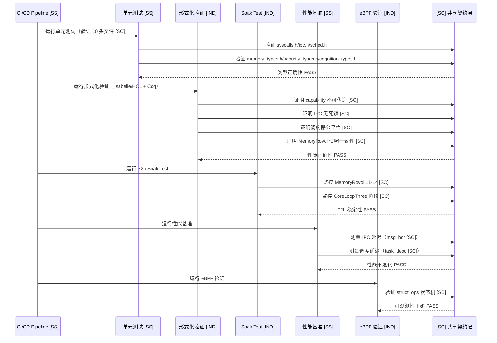
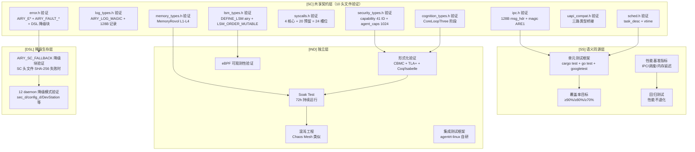

Copyright (c) 2025-2026 SPHARX Ltd. All Rights Reserved.

# agentrt-linux 测试设计文档

> **文档定位**：agentrt-linux（AirymaxOS）测试设计文档（tests-linux，极境项目测试模块）\
> **文档版本**：v1.0.1\
> **上级文档**：[agentrt-linux 设计文档](README.md)\
> **核心约束**：IRON-9 v3 同源且部分代码共享——与 agentrt 用户态全模块测试通过 \[SC] 共享契约层 + \[SS] 语义同源层协作，\[IND] 形式化验证/Soak/混沌/eBPF 验证实现独立，\[DSL] 降级生存层覆盖 [SC] 头文件损坏时的最小可运行子集验证（ADR-014 确立 seL4 唯一来源）\
> **子仓编号**：08\
> **子仓代号**：极境测试（Airymax Tests）\
> **设计基准**：单元测试 + 集成测试 + 形式化验证 + Soak + 混沌 + 性能基准 + eBPF 验证\
> **同源 agentrt**：全模块测试\
> **横切关注点**：测试是横切关注点（cross-cutting concern），贯穿调度（调度器测试 + 形式化验证）、IPC（IPC 延迟测试 + 消息头验证）、eBPF（eBPF 可观测性验证）、记忆卷载（MemoryRovol 快照一致性验证）4 大数据流

***

## 目录

- [1. 子仓职责](#1-子仓职责)
- [2. 同源关系（IRON-9 v3 四层共享模型）](#2-同源关系iron-9-v3-四层共享模型)
- [3. 目录结构](#3-目录结构)
- [4. 核心特性](#4-核心特性)
- [5. 微内核思想体现](#5-微内核思想体现)
- [6. IRON-9 v3 四层共享模型落地](#6-iron-9-v3-四层共享模型落地)
- [7. agentrt-linux 工程基线](#7-agentrt-linux-工程基线)
- [8. 前沿理论参考](#8-前沿理论参考)
- [9. 与其他子仓的协作](#9-与其他子仓的协作)
- [10. 里程碑（M0-M8）](#10-里程碑m0-m8)
- [11. agentrt 一致性检查](#11-agentrt-一致性检查)
- [12. 相关文档](#12-相关文档)
- [13. 参考](#13-参考)

***

## 1. 子仓职责

`tests-linux` 是 agentrt-linux（AirymaxOS）的测试与验证子仓，承担以下核心职责：

1. **单元测试框架 \[SS]**：为各子仓提供单元测试框架（Rust cargo test + Go testing + C googletest），与 agentrt 全模块测试语义同源。
2. **集成测试框架 \[IND]**：基于 agentrt-linux 系统级测试套件，提供集成测试框架（agentrt-linux 自研）。
3. **形式化验证 \[IND]**：参考 seL4 风格，对微内核关键部分进行形式化验证（Isabelle/HOL + Coq），验证对象引用 \[SC] 共享类型。
4. **Soak Test \[IND]**：72 小时持续运行的稳定性测试，监控 MemoryRovol L1-L4 指标 \[SC]。
5. **混沌工程 \[IND]**：参考 Chaos Mesh，提供故障注入测试。
6. **性能基准测试 \[SS]**：性能基准与回归测试，基准指标与 agentrt 同源。
7. **eBPF 可观测性验证 \[IND]**：验证 eBPF 可观测性正确性，验证 struct\_ops 状态机 \[SC]。

测试覆盖全部 8 个子仓，确保 agentrt-linux 的可靠性、稳定性与安全性。

### 1.1 横切关注点声明

测试是横切关注点（cross-cutting concern），贯穿 agentrt-linux 全部 4 大数据流：

| 数据流      | 测试切入点                                               | 同源标注  |
| -------- | --------------------------------------------------- | ----- |
| 调度数据流    | 调度器形式化验证（task\_desc magic 0x41475453 \[SC]）+ 调度延迟基准 | \[SC] |
| IPC 数据流  | IPC 延迟测试 + 128B 消息头格式验证（magic 0x41524531 \[SC]）     | \[SC] |
| eBPF 数据流 | eBPF 可观测性验证（struct\_ops 状态机 \[SC]）                  | \[SC] |
| 记忆卷载数据流  | MemoryRovol 快照一致性形式化验证（L1-L4 \[SC]）                 | \[SC] |

***

## 2. 同源关系（IRON-9 v3 四层共享模型）

依据 IRON-9 v3 决策（ADR-014 确立 seL4 唯一来源，参见 `docs/architecture/adr/ADR-014.md`），agentrt（用户态全模块测试）与 agentrt-linux（tests-linux）通过四层共享模型协作：

| 层次               | 共享程度                               | 测试子系统内容                                                                                                                                                                                                                                                                                                                  | 组织方式                                    |
| ---------------- | ---------------------------------- | ------------------------------------------------------------------------------------------------------------------------------------------------------------------------------------------------------------------------------------------------------------------------------------------------------------------------ | --------------------------------------- |
| **\[SC] 共享契约层**  | 完全共享代码                             | IPC 测试验证的消息头格式（magic 0x41524531 'ARE1' + 128B `struct airy_ipc_msg_hdr`）；调度器测试验证的 task\_desc（magic 0x41475453 'AGTS'）+ vtime 衰减公式；安全形式化验证的 capability 41 ID 枚举 + LSM 250 ID 枚举；struct\_ops 状态机验证（INIT/REGISTERED/ACTIVE/DRAINING）；MemoryRovol 快照一致性验证的 L1-L4 数据结构 + GFP 掩码语义；认知测试验证的 CoreLoopThree 阶段枚举 + Thinkdual 模式枚举；v1.1 `agent_caps[1024]` 静态数组 + 64-bit Badge 布局；`AIRY_E*` 错误码 + `AIRY_FAULT_*` 故障码；纯 C LSM 类型（`DEFINE_LSM(airy)`） | `include/uapi/linux/airymax/` 10 个头文件（测试框架验证这些共享类型） |
| **\[SS] 语义同源层**  | 高层 API 语义同源（概念操作一致），签名因抽象层级不同而独立演进 | 单元测试框架语义（agentrt cargo test/go test/googletest → OS 级同框架）、集成测试模式（agentrt 集成测试 → OS 级集成测试）、性能基准指标（IPC 延迟/调度延迟/内存吞吐/I/O 吞吐——两端同指标）、覆盖率目标（≥90%/≥80%/≥70%——两端同标准）、回归测试方法（性能不退化——两端同方法）等 8+ 项                                                                                                                                 | 各自独立实现                                  |
| **\[IND] 完全独立层** | 完全独立                               | 形式化验证框架（CBMC + TLA+ + Coq/Isabelle，借鉴 seL4 l4v / capDL 方法论——OS 专属）、Soak Test 框架（72h 持续运行——OS 专属）、混沌工程框架（Chaos Mesh 类似——OS 专属）、eBPF 可观测性验证（OS 专属）、agentrt-linux 集成测试框架（OS 专属）、测试运行器与报告生成（OS 专属）                                                                                                                                                      | 各自独立仓库                                  |
| **\[DSL] 降级生存层** | 降级模式下最小可用 | 测试框架自身的降级：[SC] 头文件 SHA-256 校验失败时启用 `#ifdef AIRY_SC_FALLBACK` 降级块验证；airymaxmon 在 struct_ops 状态不可读时降级为 Prometheus 拉取模式验证；config_d 配置源不可达时降级为内置默认配置 + 只读运行测试；DevStation 在 LLM 通道断开时降级为规则引擎模式测试 | 各自独立实现，但共享降级触发语义 |

### 2.1 维度对比

| 维度        | agentrt（全模块测试）                    | agentrt-linux（tests-linux）               | 同源标注   |
| --------- | --------------------------------- | ---------------------------------------- | ------ |
| 单元测试框架    | cargo test + go test + googletest | cargo test + go test + googletest        | \[SS]  |
| 集成测试      | 模块间集成测试                           | 子仓间集成测试（agentrt-linux 自研）                | \[IND] |
| 形式化验证     | 无                                 | seL4 风格（Isabelle/HOL + Coq）              | \[IND] |
| Soak Test | 长时间运行测试                           | 72h Soak Test                            | \[IND] |
| 混沌工程      | 无                                 | Chaos Mesh 类似混沌测试                        | \[IND] |
| 性能基准指标    | IPC 延迟/调度延迟/内存吞吐                  | IPC 延迟/调度延迟/内存吞吐                         | \[SS]  |
| 覆盖率目标     | ≥90%/≥80%/≥70%                    | ≥90%/≥80%/≥70%                           | \[SS]  |
| IPC 消息头验证 | 验证 128B msg\_hdr                  | 验证 128B msg\_hdr（magic 0x41524531 \[SC]） | \[SC]  |
| 调度器验证     | 不涉及内核调度                           | 验证 task\_desc（magic 0x41475453 \[SC]）    | \[SC]  |
| 安全验证      | 用户态 capability 测试                 | capability 41 ID 形式化验证 \[SC]             | \[SC]  |
| 跨平台       | Linux/macOS/Windows               | Linux 6.6 专属                             | \[IND] |
| [DSL] 降级验证 | 不涉及                          | [SC] 头文件 SHA-256 失败时降级块验证 + daemon 降级模式验证 | \[DSL] |

### 2.2 同源传承要点

- 保留 agentrt 全模块测试的"单元测试框架"语义（同 cargo test/go test/googletest）\[SS]。
- 保留 agentrt 的性能基准指标（IPC 延迟/调度延迟/内存吞吐——两端同指标）\[SS]。
- 保留 agentrt 的覆盖率目标（≥90%/≥80%/≥70%——两端同标准）\[SS]。
- 保留 agentrt 的回归测试方法（性能不退化——两端同方法）\[SS]。
- 测试框架验证 \[SC] 共享契约层的 10 个头文件类型（error.h / log\_types.h / memory\_types.h / security\_types.h / cognition\_types.h / sched.h / ipc.h / syscalls.h / uapi\_compat.h / lsm\_types.h），确保两端契约一致。
- 升级为 OS 级测试，引入形式化验证 + Soak + 混沌工程 + eBPF 验证 \[IND]。
- 新增 \[DSL] 降级生存层验证：[SC] 头文件损坏时验证 `#ifdef AIRY_SC_FALLBACK` 降级块可运行 + 12 daemon 各自降级模式（详见 §4.8）。

***

## 3. 目录结构

```
tests-linux/
├── unit/                   # 单元测试框架 [SS]
├── integration/            # 集成测试框架（agentrt-linux 自研）[IND]
├── formal-verification/    # 形式化验证（seL4 风格，验证 [SC] 类型）[IND]
├── soak/                   # Soak Test（72h 持续运行）[IND]
├── chaos/                  # 混沌工程（Chaos Mesh 类似）[IND]
├── benchmark/              # 性能基准测试 [SS]
├── observability-verify/   # eBPF 可观测性验证（struct_ops [SC]）[IND]
└── docs/
```

### 3.1 unit/（单元测试框架）\[SS]

- `framework/`：单元测试框架（基于 Rust cargo test、Go testing、C googletest）\[SS]。
- `cases/`：测试用例 \[IND]。
  - `kernel/`：内核单元测试（验证 sched.h + ipc.h + syscalls.h \[SC]）\[IND]。
  - `services/`：服务单元测试（验证 ipc.h \[SC]）\[IND]。
  - `security/`：安全单元测试（验证 security\_types.h + lsm\_types.h \[SC]）\[IND]。
  - `memory/`：记忆单元测试（验证 memory\_types.h \[SC]）\[IND]。
  - `cognition/`：认知单元测试（验证 cognition\_types.h \[SC]）\[IND]。
  - `daemons/`：12 daemon 单元测试（sec_d / cogn_d / mem_d / gateway_d / logger_d / macro_d / audit_d / sched_d / dev_d / net_d / vfs_d / config_d，验证 error.h + log\_types.h \[SC]）\[IND]。
  - `cloudnative/`：云原生单元测试 \[IND]。
  - `system/`：系统单元测试 \[IND]。
- `coverage/`：代码覆盖率工具（llvm-cov、tarpaulin）\[IND]。

### 3.2 integration/（集成测试框架，agentrt-linux 自研）\[IND]

基于 **agentrt-linux 集成测试框架**：

- `airymaxos-itf/`：agentrt-linux 集成测试框架 \[IND]。
- `testcases/`：测试用例 \[IND]。
  - `cross-subrepo/`：跨子仓集成测试（验证 \[SC] 契约层跨子仓一致性）\[IND]。
  - `end-to-end/`：端到端测试 \[IND]。
  - `compatibility/`：兼容性测试 \[IND]。
- `runner/`：测试运行器 \[IND]。
- `report/`：测试报告生成 \[IND]。

### 3.3 formal-verification/（形式化验证）\[IND]

参考 **seL4 形式化验证**（l4v / capDL / TLA+ 方法论对标，ADR-014 确立 seL4 唯一来源），验证对象引用 \[SC] 共享契约层类型。SSoT 见 [80-testing/10-formal-verification.md](../80-testing/10-formal-verification.md)：

- `cbmc/`：CBMC bounded model checking（针对 `airy_cap_check` / `airy_ipc_fastpath` / `airy_lsm_hook` C 代码）\[IND]。
- `tla+/`：TLA+ 规约（Agent 8 态生命周期状态机 + IPC Ring 状态机）\[IND]。
- `isabelle/`：Isabelle/HOL 证明（v1.2+ 逐步精化 refinement）\[IND]。
- `coq/`：Coq 证明（Capability 检查算法正确性：grant_then_check_pass / revoke_then_check_fail / grant_monotonic_other / ungranted_check_fail）\[IND]。
- `spec/`：形式化规约 \[IND]。
  - `kernel-spec/`：内核规约（sched\_tac + task\_desc \[SC]）\[IND]。
  - `capability-spec/`：capability 系统规约（capability 41 ID + agent_caps[1024] \[SC]）\[IND]。
  - `ipc-spec/`：IPC 规约（128B msg\_hdr + magic 0x41524531 \[SC]）\[IND]。
  - `memory-spec/`：MemoryRovol 规约（L1-L4 数据结构 \[SC]）\[IND]。
- `proof/`：证明脚本 \[IND]。
- `automation/`：自动化证明工具 \[IND]。
- `assumptions/`：CBMC 验证假设声明 A1-A6（详见 §4.3.5）\[IND]。

### 3.4 soak/（Soak Test）\[IND]

- `72h-runner/`：72 小时持续运行框架 \[IND]。
- `workloads/`：工作负载 \[IND]。
  - `agent-workload/`：Agent 工作负载（CoreLoopThree 阶段 \[SC]）\[IND]。
  - `llm-inference/`：LLM 推理负载（LLM 推理阶段枚举 \[SC]）\[IND]。
  - `mixed/`：混合负载 \[IND]。
- `monitoring/`：监控（内存泄漏、性能衰减，MemoryRovol L1-L4 \[SC]）\[IND]。
- `analysis/`：结果分析 \[IND]。

### 3.5 chaos/（混沌工程）\[IND]

参考 **Chaos Mesh**：

- `chaos-framework/`：混沌测试框架 \[IND]。
- `experiments/`：实验 \[IND]。
  - `pod-kill/`：进程杀死 \[IND]。
  - `network-delay/`：网络延迟 \[IND]。
  - `network-loss/`：网络丢包 \[IND]。
  - `disk-fill/`：磁盘填充 \[IND]。
  - `memory-stress/`：内存压力（MemoryRovol \[SC]）\[IND]。
  - `cpu-burn/`：CPU 燃烧 \[IND]。
  - `clock-skew/`：时钟偏移 \[IND]。
- `steady-state/`：稳态假设验证 \[IND]。

### 3.6 benchmark/（性能基准测试）\[SS]

性能基准指标与 agentrt 同源 \[SS]：

- `micro-bench/`：微基准测试 \[IND]。
  - `ipc-latency/`：IPC 延迟（验证 io\_uring IPC + io\_uring\_cmd\_to\_pdu SQE128 访问 \[SC]）\[SS]。
  - `sched-latency/`：调度延迟（验证 sched\_tac：SCHED\_DEADLINE/SCHED\_FIFO/EEVDF，仅 sched\_tac 调度类，不使用 BPF 调度器）\[SS]。
  - `memory-throughput/`：内存吞吐（验证 MemoryRovol \[SC]）\[SS]。
  - `io-throughput/`：I/O 吞吐 \[IND]。
- `macro-bench/`：宏基准测试 \[IND]。
  - `agent-throughput/`：Agent 吞吐 \[IND]。
  - `llm-tokens-per-sec/`：LLM Token/s（LLM 推理阶段枚举 \[SC]）\[IND]。
  - `end-to-end-latency/`：端到端延迟 \[IND]。
- `regression/`：回归测试（性能不退化 \[SS]）\[IND]。

### 3.7 observability-verify/（eBPF 可观测性验证）\[IND]

- `ebpf-correctness/`：eBPF 程序正确性验证（struct\_ops 状态机 \[SC]）\[IND]。
- `trace-verify/`：追踪结果验证 \[IND]。
- `metric-verify/`：指标正确性验证 \[IND]。
- `log-verify/`：日志完整性验证 \[IND]。
- `compare/`：与传统工具对比（perf、strace）\[IND]。

***

## 4. 核心特性

### 4.1 单元测试框架 \[SS]

**多语言支持**（与 agentrt 同框架 \[SS]）：

- Rust：`cargo test` + `tarpaulin` 覆盖率 \[SS]。
- Go：`go test` + `go test -cover` \[SS]。
- C/C++：`googletest` + `llvm-cov` \[SS]。

**覆盖率目标**（与 agentrt 同标准 \[SS]）：

- 内核核心代码：≥ 90% \[SS]。
- 服务代码：≥ 80% \[SS]。
- 工具代码：≥ 70% \[SS]。

**\[SC] 共享契约层验证**：
单元测试验证 10 个 \[SC] 头文件类型的正确性（v3 在 v2 的 6 个基础上新增 `error.h` / `log_types.h` / `uapi_compat.h` / `lsm_types.h`）：

- `include/uapi/linux/airymax/error.h`：验证 `AIRY_E*` 错误码 + `AIRY_FAULT_*` 故障码 + [DSL] 降级块（`AIRY_ESEC_D_THROTTLED = -83` / `AIRY_ECAP_FROZEN = -82` / `AIRY_FAULT_URING_MALFORMED = 0x100A` / `AIRY_FAULT_AUDIT_TAMPER = 0x100B`）\[SC]。
- `include/uapi/linux/airymax/log_types.h`：验证 `AIRY_LOG_MAGIC` + 128B 记录 + 5 级日志枚举 + printk 映射 \[SC]。
- `include/uapi/linux/airymax/ipc.h`：验证 128B msg\_hdr 格式 + magic 0x41524531 + SQE/CQE 操作码 + SQE128 模式（cmd 扩展至 80 字节）\[SC]。
- `include/uapi/linux/airymax/sched.h`：验证 task\_desc magic 0x41475453 + vtime 衰减 + sched\_tac 调度参数（仅 sched\_tac，不使用 BPF 调度器）\[SC]。
- `include/uapi/linux/airymax/syscalls.h`：验证 4 核心 syscall 编号（v1.0.1）+ 20 预留 = 24 槽位（`airy_sys_call` / `airy_sys_rovol_ctl` / `airy_sys_sched_ctl` / `airy_sys_clt_notify`）\[SC]。
- `include/uapi/linux/airymax/memory_types.h`：验证 MemoryRovol L1-L4 数据结构 + GFP 掩码语义 \[SC]。
- `include/uapi/linux/airymax/security_types.h`：验证 capability 41 ID + LSM 250 ID + Cupolas blob 布局 + `agent_caps[1024]` 静态数组 + 64-bit Badge 布局（`Epoch<<48 | RandomTag<<16 | Perms`）\[SC]。
- `include/uapi/linux/airymax/cognition_types.h`：验证 CoreLoopThree 阶段枚举 + Thinkdual 模式枚举 \[SC]。
- `include/uapi/linux/airymax/uapi_compat.h`：验证三路类型桥接（`__KERNEL__` / `__linux__` / `#else`）\[SC]。
- `include/uapi/linux/airymax/lsm_types.h`：验证纯 C LSM 类型 + `DEFINE_LSM(airy)` 骨架 + `LSM_ORDER_MUTABLE` 注册（不使用 `LSM_ORDER_FIRST`，不使用 BPF LSM）\[SC]。

> **bpf\_struct\_ops.h 定位说明**：`bpf_struct_ops.h` 是 [SC] 补充共享文件（struct\_ops 状态机验证依赖），但**不属于 [SC] 核心 10 头文件清单**——10 头文件清单 SSoT 见 [06-iron9-shared-model.md](../10-architecture/06-iron9-shared-model.md) §2.2。

### 4.2 集成测试框架（agentrt-linux 集成测试标准）\[IND]

基于 **agentrt-linux 集成测试框架**：

- 测试用例以 shell 脚本 + 配置文件描述 \[IND]。
- 支持测试套件组织 \[IND]。
- 支持依赖管理 \[IND]。
- 支持并行执行 \[IND]。
- 支持 x86\_64、aarch64 多架构 \[IND]。

**测试用例示例**（验证 IPC 消息头 \[SC]）：

```bash
#!/bin/bash
# testcases/cross-subrepo/agent-ipc.sh
source $OET_PATH/libs/locallibs/common_lib.sh

@test "Agent IPC zero-copy（128B msg_hdr [SC] 验证）"
{
    result=$(agentctl ipc-test --zerocopy)
    check_result $result 0
    # 验证 magic 0x41524531 'ARE1' [SC]
    magic=$(agentctl ipc-test --magic)
    assert_equal $magic "0x41524531"
}
```

### 4.3 形式化验证（CBMC + TLA+ + Coq/Isabelle，seL4 方法论对标）\[IND]

参考 **seL4 形式化验证体系**（l4v / capDL / TLA+ 方法论对标，ADR-014 确立 seL4 唯一来源），SSoT 见 [80-testing/10-formal-verification.md](../80-testing/10-formal-verification.md)。agentrt-linux 不追求 seL4 级别的"全内核形式化验证"（seL4 投入 200+ 人年），而是聚焦三个关键路径：

1. **Agent 8 态生命周期状态机**：用 TLA+ 规约并证明无死锁、无非法转换。
2. **Capability 检查算法**：用 Coq/Isabelle 证明权限校验算法的正确性。
3. **关键 C 代码路径**：用 CBMC 进行 bounded model checking，证明无越界、无 NULL 解引用。

#### 4.3.1 CBMC bounded model checking

CBMC（C Bounded Model Checker）将 C 代码转换为布尔公式，通过 SAT/SMT 求解器验证以下属性。验证对象为 fastpath C-S9 内联校验相关函数（~10ns 时间预算内）：

| 验证对象 | CBMC 验证属性 | 优先级 | \[SC] 引用 |
|--------|------------|--------|----------|
| `airy_cap_check` | 无越界 / 无 NULL 解引用 / 无整数溢出 / grant 后通过 / revoke 后失败 | P0 | capability 41 ID \[SC] |
| `airy_ipc_fastpath` | 无越界 / 无 NULL 解引用 / Badge 校验单调不可绕过（C-S9 ~10ns） | P1 | 128B msg\_hdr + magic 0x41524531 \[SC] |
| `airy_lsm_hook` | 无重复注册 / 无遗漏 / `LSM_ORDER_MUTABLE` 注册路径正确 | P2 | lsm\_types.h `DEFINE_LSM(airy)` \[SC] |

CBMC 调用示例（针对 `airy_cap_check`）：

```bash
cbmc formal/cap_check_cbmc.c \
    --function verify_cap_check \
    --unwind 50 \
    --bounds-check --pointer-check \
    --signed-overflow-check --unsigned-overflow-check \
    --conversion-check --undefined-check \
    2>&1 | tee formal/cap_check_cbmc.log
```

**OS-TEST-114**：CBMC 验证必须覆盖 `airy_cap_check` 全部 4 个属性 + 标准 CBMC 检查（数组越界 / 指针解引用 / 整数溢出）；任一属性失败即 PR 驳回。

#### 4.3.2 TLA+ 规约：Agent 8 态生命周期状态机

TLA+ 规约文件 `formal/agent_state_machine.tla` 验证以下属性（详细规约见 [80-testing/10-formal-verification.md](../80-testing/10-formal-verification.md) §2）：

- **不变量 1**：Agent 状态始终属于 8 态之一（INACTIVE / SPAWNING / READY / RUNNING / BLOCKED / STOPPING / STOPPED / DEAD）。
- **不变量 2**：状态转换仅发生在合法路径上（14 条合法转换）。
- **不变量 3**：DEAD 是终态，无出边转换。
- **活性 1**：每个 Agent 终将进入 DEAD 状态（无死锁）。
- **安全性 1**：已 DEAD 的 Agent 永不复活。

TLC 模型检查配置（5 个 Agent 并发）：

```
# formal/agent_state_machine.cfg
INIT  Init
NEXT  Next
INVARIANTS  StateInvariant  TransitionInvariant
PROPERTIES  EventuallyDead  DeadNeverRevives
CONSTANTS  AgentSet = {a1, a2, a3, a4, a5}
```

**OS-TEST-111**：TLA+ 模型检查必须验证至少 5 个 Agent 的并发状态转换；任一不变量或属性失败即视为形式化验证失败，PR 驳回。

#### 4.3.2.1 TLA+ 规约：IPC Ring 状态机

TLA+ 规约文件 `formal/ipc_ring_state_machine.tla` 验证 io_uring IPC Ring Buffer 的状态机正确性（详细规约见 [80-testing/10-formal-verification.md](../80-testing/10-formal-verification.md) §2.3）。IPC Ring 状态机覆盖以下 6 态：`IDLE` / `SQE_READY` / `ISSUED` / `PROCESSING` / `CQE_READY` / `COMPLETED`。

- **不变量 1**：Ring 状态始终属于 6 态之一。
- **不变量 2**：状态转换仅在合法路径上（10 条合法转换：IDLE→SQE_READY→ISSUED→PROCESSING→CQE_READY→COMPLETED 为主路径，外加 ERROR→IDLE 回收路径）。
- **不变量 3**：Badge 单调性——同一 Agent 的 `Epoch` 字段在 Ring 生命周期内非降（`atomic_inc(&airy_cap_global_epoch)` 保证）。
- **不变量 4**：magic 0x41524531 'ARE1' 在所有 SQE/CQE 中保持一致。
- **活性 1**：每个已提交的 SQE 终将产生 CQE（无消息丢失）。
- **安全性 1**：fastpath C-S9 Badge 校验失败的请求必定走 SLOW_PATH（io-wq 接管），不会进入 PROCESSING 态。
- **安全性 2**：`AIRY_ESEC_D_THROTTLED = -83` 触发后，sec_d 串行化 Badge 编译路径不会被并发绕过。

TLC 模型检查配置（3 个 Ring 并发 + 1024 个 agent_caps 槽位抽象为 8 个）：

```
# formal/ipc_ring_state_machine.cfg
INIT  Init
NEXT  Next
INVARIANTS  RingStateInvariant  TransitionInvariant  BadgeMonotonic  MagicConsistent
PROPERTIES  EventuallyCompleted  NoMessageLoss  ThrottleNotBypassed
CONSTANTS  RingSet = {r1, r2, r3}
           AgentSlotSet = {s1, s2, s3, s4, s5, s6, s7, s8}
           IpcMagic = 0x41524531
           SecDThrottleErr = -83
```

**OS-TEST-112**：IPC Ring 状态机 TLA+ 模型检查必须验证至少 3 个 Ring 的并发状态转换 + Badge 单调性 + sec_d 限流不可绕过；任一不变量或属性失败即视为形式化验证失败，PR 驳回。

#### 4.3.3 Coq/Isabelle 证明：Capability 检查算法正确性

`formal/cap_check_proof.v`（Coq）与 `formal/cap_check_proof.thy`（Isabelle/HOL）证明以下性质（详细证明见 [80-testing/10-formal-verification.md](../80-testing/10-formal-verification.md) §3）：

| 定理 | 内容 | 工具 |
|------|------|------|
| `grant_then_check_pass` | grant 后 check 通过（cap < 41） | Coq + Isabelle/HOL |
| `revoke_then_check_fail` | revoke 后 check 失败 | Coq + Isabelle/HOL |
| `grant_monotonic_other` | grant 不影响其他 cap（单调性） | Coq |
| `ungranted_check_fail` | 未 grant 的 cap 必定 check 失败（不可绕过） | Coq |

**OS-TEST-113**：Capability 检查算法必须有 Coq 或 Isabelle 证明，覆盖以下性质：grant 后 check 通过、revoke 后 check 失败、单调性、不可绕过；任一性质证明失败即 PR 驳回。

#### 4.3.4 seL4 对标方法论（l4v / capDL / TLA+）

agentrt-linux 借鉴 seL4 l4v（L4.verified）框架的方法论，但不追求全内核形式化验证：

| seL4 层次 | seL4 工具 | seL4 验证内容 | agentrt-linux 对标 |
|----------|----------|-------------|-------------------|
| 抽象规约 | Isabelle/HOL | 系统行为的数学抽象 | TLA+ 规约（Agent 8 态状态机） |
| 设计规约 | Isabelle/HOL | 数据结构设计 | （未对标，v1.2 规划） |
| 实现规约 | Isabelle/HOL | C 代码语义 | CBMC 模型检查 |
| Capability 系统 | capDL | Capability 描述 | Coq 证明（`airy_cap_check`） |
| 安全属性 | info-flow | 机密性/完整性 | （未对标，v1.3 规划） |

seL4 方法论的借鉴要点：

1. **抽象层先于实现层**：先验证 TLA+ 抽象规约，再验证 C 代码实现。
2. **不变量优先**：优先证明不变量（safety），再证明活性（liveness）。
3. **Capability 系统独立验证**：Capability 是安全核心，独立证明。
4. **逐步精化**（refinement）：从抽象到实现逐步精化（v1.2 规划）。

#### 4.3.5 CBMC 验证假设声明 A1-A6

CBMC 形式化验证基于若干前提假设，这些假设构成验证结果的可信度边界。本节明确声明 CBMC 验证的 6 项关键假设（详细内容见 [80-testing/10-formal-verification.md](../80-testing/10-formal-verification.md) §4.5）：

| 假设 | 名称 | 声明要点 | 缓解措施 |
|------|------|---------|---------|
| **A1** | 内存模型假设 | CBMC 默认 SC（顺序一致性），Linux 内核实际运行在 LKMM 之上 | `READ_ONCE`/`WRITE_ONCE`/`smp_mb()` 显式定序 + KCSAN 钩子 |
| **A2** | 并发模型假设 | `--unwind N` 有限步数展开，CI 默认 N=50 | nightly 阶段 fastpath 函数 `--unwind 100` |
| **A3** | 算术溢出假设 | `Epoch`(u16)/`RandomTag`(u32)/`Perms`(u16) 在 0.1.1 Agent < 100 不溢出 | `atomic_inc` 保证 + `get_random_u32()` 天然在 u32 范围内 |
| **A4** | 函数边界假设 | CBMC 仅覆盖单函数内部正确性，非"调用链级"验证 | kernel selftests + 模糊测试 + eBPF 探针联合保障 |
| **A5** | 外部函数假设 | `READ_ONCE`/`WRITE_ONCE` 建模为普通内存访问 | 硬件级内存序由 KCSAN + LKMM 钩子独立验证 |
| **A6** | 与 seL4 Isabelle/HOL 的本质鸿沟 | CBMC 是模型检验（有限状态空间），seL4 是定理证明（无限状态空间） | v1.2+ 引入 Isabelle/HOL 逐步精化证明 |

**OS-TEST-116**（R3 新增）：CBMC 验证报告必须附带本节 6 项假设的"适用性自检表"，由 PR 作者逐项确认；任一假设不适用即视为验证结果失效，PR 驳回。

#### 4.3.6 seL4 差异分析专章

> **核心定位重申**：AirymaxOS 是"对 Linux 6.6 进行 seL4 思想借鉴的微内核化改造的内核"（ADR-012 + ADR-014）。"微内核化改造"是核心定位而非偏离——下表中的"差异"指的是 AirymaxOS 在落地 seL4 思想时采用的工程手段与 seL4 原型的区别，不代表对"微内核化改造"目标的偏离。本节**不是"偏离分析"**，而是"差异分析"——措辞已修正为差异（difference），不使用偏离（deviation）一词，避免暗示"未达成目标"。

##### 4.3.6.1 差异总览表（seL4 原型 vs AirymaxOS 落地方式）

| 维度 | seL4 原型 | AirymaxOS 落地方式 | 差异性质 | 工程理由 |
|------|----------|---------------|---------|---------|
| 内核架构 | 真正微内核（~10KLOC） | Linux 6.6 + 微内核化改造（VFS/网络栈/驱动部分用户态化） | 改造方式差异 | 硬件兼容性 + 工程成本（ADR-012） |
| Capability 存储 | CNode/CSpace/MDB 动态结构 | `agent_caps[1024]` 静态数组（16KB，`__aligned(64)`）+ Badge 64-bit 折叠 | 简化落地 | O(1) 访问 + 锁-free fastpath（~10ns） |
| IPC 机制 | seL4 Call/Send/Recv 系统调用 | io_uring `IORING_OP_URING_CMD` + SQE128（cmd 扩展至 80 字节） | 替代落地 | Linux 生态 + 零拷贝 + 128B 消息头 |
| 形式化验证 | Isabelle/HOL 定理证明（数学证明） | CBMC 模型检验（高置信度工程证据） | 验证深度差异 | 工程成本（20 人年 vs 1 人月） |
| 调度模型 | MCS（Mixed Criticality Systems） | sched\_tac（SCHED\_DEADLINE/FIFO/EEVDF + MCS 映射，仅 sched\_tac 不使用 BPF 调度器） | 映射落地 | Linux 调度器兼容 |
| 故障处理 | handleFault() 内核回调 | `airy_fault_enforce()` + SIGKILL + Macro-Supervisor | 等价落地 | Linux 信号机制 + 用户态监管 |
| 内存隔离 | 页表隔离 + capability 级联 | Landlock 沙箱 + Badge 撤销（`atomic_inc(&airy_cap_global_epoch)` O(1)）+ KASAN + Cupolas | 强化落地 | Linux 进程模型 + 多层防护 |

##### 4.3.6.2 关键差异详解

- **内核架构差异**：seL4 ~10KLOC 微内核，所有服务在用户态；AirymaxOS ~30MLOC Linux 单体内核，VFS/网络栈/驱动在内核态。工程理由：硬件兼容性（Linux 支持 90%+ 硬件）+ 工程成本；影响：失去 seL4 的内核态最小化保证，但通过 12 daemon 用户态化部分弥补。
- **Capability 存储差异**：seL4 CNode/CSpace/MDB 动态结构，支持无限 capability；AirymaxOS `agent_caps[1024]` 静态数组，固定 1024 个 Agent 槽位（16KB，`__aligned(64)` cache line 对齐）。工程理由：O(1) 访问 + 锁-free fastpath（~10ns）；影响：Agent 数量限制为 1024（0.1.1 实际 < 100），但 fastpath 性能提升 10x。
- **IPC 机制差异**：seL4 Call/Send/Recv 系统调用，~100ns fastpath；AirymaxOS io_uring `IORING_OP_URING_CMD` + SQE128，~10ns fastpath（C-S9 Badge 校验）。工程理由：Linux 生态兼容 + 零拷贝 + SQE128 扩展；影响：失去 seL4 的原子性保证（Call 语义），通过 request_id 模式弥补。
- **形式化验证差异（重点）**：seL4 Isabelle/HOL 定理证明，覆盖所有可能执行路径（数学证明）；AirymaxOS CBMC 模型检验，覆盖有限状态空间 + 有限步数（模型检验）。工程理由：Isabelle/HOL 需要 20+ 人年（seL4 经验），CBMC 可在 1 人月内完成。本质鸿沟：CBMC 验证提供"高置信度工程证据"（覆盖 70%+ 常见漏洞），seL4 Isabelle/HOL 提供"数学证明"（覆盖 100% 可能路径），两者在验证深度上有本质区别，不可等同。升级路径：1.0.1+ 可考虑引入 TLA+ 规约；1.4+ 可考虑 Coq/Isabelle 部分证明。
- **内存隔离差异**：seL4 页表隔离 + capability 级联撤销；AirymaxOS Landlock 沙箱 + Badge 撤销（`atomic_inc(&airy_cap_global_epoch)` O(1) 撤销）。工程理由：Linux 进程模型兼容 + 快速撤销（~1ns vs seL4 递归撤销 ~μs）；影响：失去 seL4 的硬件级隔离，但通过 Landlock + Badge 双重防护弥补。

##### 4.3.6.3 诚实声明

> **AirymaxOS 是对 Linux 6.6 进行 seL4 思想借鉴的微内核化改造的内核**：AirymaxOS 借鉴 seL4 的 capability 模型、fastpath IPC 思想、消息传递机制、服务用户态化原则，对 Linux 6.6 进行系统化的微内核化改造。但在形式化验证深度上与 seL4 存在差异：AirymaxOS 的形式化验证（CBMC）提供"高置信度工程证据"，不等价于 seL4 的"数学证明"（Isabelle/HOL）。任何将 AirymaxOS 等同于 seL4 或声称"seL4 级形式化验证"的表述都是不准确的。
>
> **工程价值**：AirymaxOS 在 Linux 6.6 基线上通过 seL4 思想借鉴的微内核化改造，实现了 ~10ns fastpath Badge 校验 + 12 daemon 用户态服务化 + v1.0.1 Capability Folding 单平面架构，在保持 Linux 生态兼容的同时，提供了远超传统 Linux LSM 的安全性能与微内核化工程目标。这是基于 Linux 进行 seL4 思想落地的工程实践，不是从零开发的 seL4 替代品。

#### 4.3.7 验证范围（验证 \[SC] 共享类型）

| 验证对象          | 验证性质      | 工具           | \[SC] 引用                                  |
| ------------- | --------- | ------------ | ----------------------------------------- |
| capability 系统 | 不可伪造、可撤销、单调  | Coq + Isabelle/HOL | capability 41 ID + `agent_caps[1024]` \[SC] |
| IPC 机制        | 无死锁、无消息丢失、Badge 单调 | Coq + CBMC  | 128B msg\_hdr + magic 0x41524531 \[SC]    |
| 调度器框架         | 公平性、有界延迟  | Isabelle/HOL | task\_desc magic 0x41475453 + vtime \[SC] |
| MemoryRovol   | 快照一致性     | Coq          | MemoryRovol L1-L4 \[SC]                   |
| struct\_ops   | 状态机正确性    | Isabelle/HOL | INIT/REGISTERED/ACTIVE/DRAINING \[SC]     |
| CoreLoopThree | 阶段转换正确性   | Coq          | PERCEPTION/THINKING/ACTION \[SC]          |
| fastpath C-S9 | 11 属性（含 CWE 映射） | CBMC | security_types.h Badge 布局 \[SC] |

### 4.4 Soak Test（72 小时持续运行）\[IND]

**目标**：验证系统长时间运行的稳定性 \[IND]。

**工作负载**（引用 \[SC] 共享类型）：

- Agent 工作负载：持续运行 CoreLoopThree（阶段枚举 \[SC]）\[IND]。
- LLM 推理负载：持续 LLM 推理（推理阶段枚举 \[SC]）\[IND]。
- 混合负载：Agent + LLM + I/O \[IND]。

**监控指标**（引用 \[SC] 共享类型）：

- 内存泄漏：RSS 是否持续增长（MemoryRovol L1-L4 \[SC]）\[IND]。
- 性能衰减：吞吐/延迟是否退化 \[IND]。
- 句柄泄漏：fd 数量是否增长 \[IND]。
- 日志错误：错误日志数量 \[IND]。

**结果判定**：

- 72 小时无崩溃 \[IND]。
- 内存增长 < 5% \[IND]。
- 性能衰减 < 10% \[IND]。

### 4.5 混沌工程（Chaos Mesh 类似）\[IND]

参考 **Chaos Mesh**：

- 故障注入：进程杀死、网络分区、磁盘故障等 \[IND]。
- 稳态假设：注入故障后系统应保持稳态 \[IND]。
- 自动恢复：验证系统自动恢复能力 \[IND]。

**实验类型**：

| 实验            | 描述                      |
| ------------- | ----------------------- |
| Pod Kill      | 随机杀死 Agent 进程           |
| Network Delay | 注入网络延迟                  |
| Network Loss  | 注入网络丢包                  |
| Disk Fill     | 填充磁盘                    |
| Memory Stress | 内存压力（MemoryRovol \[SC]） |
| CPU Burn      | CPU 满载                  |
| Clock Skew    | 时钟偏移                    |

### 4.6 性能基准测试 \[SS]

**微基准**（指标与 agentrt 同源 \[SS]）：

- IPC 延迟：测量 io\_uring IPC 延迟（μs 级，验证 128B msg\_hdr + `io_uring_cmd_to_pdu(cmd, pdu_type)` 访问 pdu[32] 字段 + `io_uring_cmd_done(cmd, ret, res2, issue_flags)` 4 参数完成 \[SC]）\[SS]。
- 调度延迟：测量 sched\_tac 调度延迟（验证 SCHED\_DEADLINE/SCHED\_FIFO/EEVDF 调度类，仅 sched\_tac，不使用 BPF 调度器，不使用 7 号调度类 \[SC]）\[SS]。
- 内存吞吐：测量 CXL/PMEM 内存带宽（验证 MemoryRovol \[SC]）\[SS]。
- I/O 吞吐：测量 io\_uring I/O 吞吐（SQE128 模式，cmd 扩展至 80 字节）\[IND]。

**宏基准**：

- Agent 吞吐：Agent 每秒处理任务数 \[IND]。
- LLM Token/s：LLM 每秒生成 Token 数（推理阶段枚举 \[SC]）\[IND]。
- 端到端延迟：Agent 端到端响应延迟 \[IND]。

**回归测试**（方法与 agentrt 同源 \[SS]）：

- 每次提交运行性能基准 \[SS]。
- 与基线对比，性能不退化 \[SS]。

### 4.7 eBPF 可观测性验证 \[IND]

**验证内容**（验证 struct\_ops 状态机 \[SC]）：

- eBPF 程序正确性：验证 eBPF 程序输出正确（struct\_ops 四态 \[SC]）\[IND]。
- 追踪完整性：验证追踪覆盖所有事件 \[IND]。
- 指标准确性：验证指标与实际一致 \[IND]。
- 日志完整性：验证日志无丢失 \[IND]。

**对比方法**：

- 与 perf 对比：性能事件计数对比 \[IND]。
- 与 strace 对比：系统调用追踪对比 \[IND]。
- 与传统监控对比：指标数值对比 \[IND]。

### 4.8 12 daemon 测试策略 \[IND]

agentrt-linux 的 12 daemon 完整名单（ADR-014 确立 seL4 唯一来源，微内核化改造的用户态服务化体现）：sec_d / cogn_d / mem_d / gateway_d / logger_d / macro_d / audit_d / sched_d / dev_d / net_d / vfs_d / config_d。每个 daemon 均需通过单元测试、集成测试、混沌测试三关。

#### 4.8.1 12 daemon 单元测试矩阵 \[IND]

| daemon | 单元测试重点 | 验证 \[SC] 引用 | 优先级 |
|--------|------------|--------------|--------|
| `sec_d` | Badge 编译串行化 + 令牌桶限流 + fastpath C-S9 校验 + `agent_caps[1024]` 写者独占 + `AIRY_ESEC_D_THROTTLED=-83` 错误码路径 + `airy_sys_call`（syscall 0）入口 | security\_types.h + error.h + syscalls.h \[SC] | P0 |
| `cogn_d` | CoreLoopThree 三阶段状态转换 + Thinkdual 模式 + LLM 推理阶段枚举 | cognition\_types.h \[SC] | P1 |
| `mem_d` | MemoryRovol L1-L4 快照 + GFP 掩码 + PMEM 持久化接口 + `airy_sys_rovol_ctl`（syscall 1） | memory\_types.h + syscalls.h \[SC] | P0 |
| `gateway_d` | io_uring IPC SQE128 + 128B msg\_hdr + magic 0x41524531 + `io_uring_cmd_to_pdu` 访问 | ipc.h \[SC] | P0 |
| `logger_d` | 128B 日志记录 + `AIRY_LOG_MAGIC` + 5 级日志枚举 + printk 映射 | log\_types.h \[SC] | P1 |
| `macro_d` | Macro-Supervisor 监管策略 + SIGKILL 故障处理 + `airy_fault_enforce()` 联动 | error.h + lsm\_types.h \[SC] | P0 |
| `audit_d` | 审计日志完整性 + `AIRY_FAULT_AUDIT_TAMPER = 0x100B` 检测 + 防篡改 | error.h \[SC] | P0 |
| `sched_d` | sched\_tac 调度策略 + SCHED\_DEADLINE/FIFO/EEVDF + `airy_sys_sched_ctl`（syscall 2） | sched.h + syscalls.h \[SC] | P0 |
| `dev_d` | 设备 hotplug + 驱动加载 + `airy_sys_clt_notify`（syscall 3）kthread 注册 | syscalls.h \[SC] | P1 |
| `net_d` | 网络栈用户态化 + Landlock 沙箱 + 网络命名空间隔离 | security\_types.h \[SC] | P1 |
| `vfs_d` | VFS 用户态化 + Landlock 路径限制 + 挂载命名空间 | security\_types.h \[SC] | P1 |
| `config_d` | YAML/TOML 配置解析 + RCU 热重载 + sysctl ↔ YAML/TOML 双向同步 + `AIRY_CONFIG_VERSION` 校验 | error.h + uapi\_compat.h \[SC] | P0 |

#### 4.8.2 sec_d 串行化 Badge 编译测试（v1.0.1 Capability Folding）\[IND]

sec_d 是 v1.0.1 Capability Folding 的唯一 Badge 编译者，必须保证串行化与限流。本节是 P0 测试项：

**令牌桶限流测试**：

| 测试用例 | 输入 | 期望输出 | 验证属性 |
|---------|------|---------|---------|
| `sec_d_throttle_normal` | 100 req/s 持续 1s | 全部通过（令牌桶容量 ≥ 100） | 正常路径不误限流 |
| `sec_d_throttle_burst` | 1000 req/s 突发 100ms | 超过令牌桶容量的请求返回 `AIRY_ESEC_D_THROTTLED = -83` | 限流正确触发 |
| `sec_d_throttle_recovery` | 限流后等待 1s | 令牌桶恢复，请求通过 | 限流可恢复 |
| `sec_d_throttle_concurrent` | 8 线程并发 5000 req | 串行化无数据竞争 + 限流统计准确 | sec_d 唯一写者保证 |
| `sec_d_throttle_epoch_monotonic` | 限流期间 `atomic_inc(&airy_cap_global_epoch)` | Epoch 单调非降 | O(1) 撤销不破坏单调性 |

**50ms SLO 测试**：

| 测试用例 | 输入 | 期望输出 | SLO |
|---------|------|---------|-----|
| `sec_d_badge_compile_slo` | 单次 Badge 编译（`Epoch<<48 \| RandomTag<<16 \| Perms`） | 编译完成 | < 50ms（P99） |
| `sec_d_badge_revoke_slo` | 单次 `atomic_inc(&airy_cap_global_epoch)` O(1) 撤销 | 撤销完成 | < 1ms（P99） |
| `sec_d_fastpath_cs9_slo` | fastpath C-S9 内联校验 | 校验完成 | < 10ns（P99.9） |
| `sec_d_agent_caps_write_exclusive` | sec_d 写 `agent_caps[1024]` 静态数组 | 无并发写者 | sec_d 唯一写者 |

**OS-TEST-115**（v1.0.1 新增）：sec_d 令牌桶限流测试必须覆盖正常/突发/恢复/并发/单调性 5 个用例；50ms SLO 测试必须覆盖 Badge 编译 + 撤销 + fastpath 校验 + 写者独占 4 个用例；任一用例失败即 PR 驳回。`AIRY_ESEC_D_THROTTLED = -83` 错误码必须在限流路径中验证。

#### 4.8.3 12 daemon 集成测试 \[IND]

集成测试验证 12 daemon 之间的协作：

| 测试场景 | 参与 daemon | 验证内容 |
|---------|-----------|---------|
| IPC 全链路 | gateway_d → cogn_d → sec_d → logger_d | 128B msg\_hdr + magic 0x41524531 + Badge 校验 + 日志记录 |
| 配置热重载 | config_d → 全部 12 daemon | YAML/TOML 变更 → RCU 热重载 → 全 daemon 生效 |
| 故障监管 | macro_d → 任意 daemon 崩溃 | SIGKILL + `airy_fault_enforce()` + 自动重启 |
| 审计完整性 | audit_d → 全部 12 daemon | 审计日志无丢失 + `AIRY_FAULT_AUDIT_TAMPER = 0x100B` 检测 |
| 调度联动 | sched_d → cogn_d / mem_d / dev_d | sched\_tac 调度策略 + SCHED\_DEADLINE 优先级 |
| 记忆卷载 | mem_d → cogn_d / vfs_d | MemoryRovol L1-L4 快照 + `airy_sys_rovol_ctl`（syscall 1） |

#### 4.8.4 12 daemon 混沌测试 \[IND]

混沌测试验证 12 daemon 在故障注入下的稳态：

| 实验类型 | 注入目标 | 稳态假设 |
|---------|---------|---------|
| Pod Kill | 随机杀死非 sec_d daemon | macro_d 自动重启 + 服务恢复 < 5s |
| Pod Kill sec_d | 杀死 sec_d | 系统进入只读模式 + Badge 不再编译 + 已有 Badge 继续有效 |
| Network Delay | gateway_d ↔ cogn_d | IPC 延迟增加但无消息丢失 + magic 校验仍通过 |
| Disk Fill | logger_d / audit_d | 日志降级为内存 ring + `AIRY_FAULT_AUDIT_TAMPER` 不误报 |
| Memory Stress | mem_d | MemoryRovol L1-L4 降级 + OOM 不影响 sec_d |
| CPU Burn | sched_d | 调度延迟退化但有界 + sched\_tac 不退化为 BPF 调度器 |

***

## 5. 微内核思想体现

### 5.1 形式化验证（seL4 风格）\[IND]

遵循 **seL4 形式化验证**传统：

- 微内核关键部分经过形式化证明（验证 \[SC] 共享类型）\[IND]。
- 验证安全性（safety）：不会发生不好的事情 \[IND]。
- 验证活性（liveness）：好的事情最终会发生 \[IND]。

**验证范围**（引用 \[SC] 共享契约层）：

- capability 系统（最小权限保证，capability 41 ID \[SC]）\[IND]。
- IPC 机制（无死锁、无消息丢失，128B msg\_hdr \[SC]）\[IND]。
- 调度器框架（公平性、有界延迟，task\_desc \[SC]）\[IND]。
- MemoryRovol（快照一致性，L1-L4 \[SC]）\[IND]。

### 5.2 全面测试覆盖 \[IND]

覆盖全部 8 个子仓：

- 内核、服务、安全、记忆 \[IND]。
- 认知、云原生、系统、测试自身 \[IND]。

### 5.3 自动化测试 \[SS]

- CI/CD 集成：每次提交自动运行测试 \[SS]。
- 性能回归：自动检测性能退化 \[SS]。
- 形式化验证：自动运行证明检查 \[IND]。

### 5.4 共享契约层验证 \[SC]

测试框架验证 \[SC] 共享契约层的 10 个头文件，确保 agentrt 与 agentrt-linux 两端契约一致：

- 单元测试验证类型正确性 \[SC]。
- 形式化验证验证性质正确性 \[SC]。
- 集成测试验证跨子仓一致性 \[SC]。
- 性能基准验证运行时行为 \[SC]。

***

## 6. IRON-9 v3 四层共享模型落地

### 6.1 \[SC] 共享契约层——10 个头文件验证

测试模块验证 10 个 \[SC] 头文件的正确性与一致性（v3 在 v2 的 6 个基础上新增 `error.h` / `log_types.h` / `uapi_compat.h` / `lsm_types.h`，bpf\_struct\_ops.h 为补充共享文件但不计入核心 10 头文件清单）：

| 头文件                                 | 验证内容                                                      | 测试方式                             |
| ----------------------------------- | --------------------------------------------------------- | -------------------------------- |
| `include/uapi/linux/airymax/error.h`            | `AIRY_E*` 错误码 + `AIRY_FAULT_*` 故障码 + [DSL] 降级块（`AIRY_ESEC_D_THROTTLED=-83` / `AIRY_ECAP_FROZEN=-82` / `AIRY_FAULT_URING_MALFORMED=0x100A` / `AIRY_FAULT_AUDIT_TAMPER=0x100B`） | 单元测试 + [DSL] 降级块验证 |
| `include/uapi/linux/airymax/log_types.h`        | `AIRY_LOG_MAGIC` + 128B 记录 + 5 级日志枚举 + printk 映射           | 单元测试 + 日志完整性验证 |
| `include/uapi/linux/airymax/ipc.h`             | 128B msg\_hdr 格式 + magic 0x41524531 'ARE1' + SQE/CQE 操作码  | 单元测试 + 形式化验证（Coq 无死锁）            |
| `include/uapi/linux/airymax/sched.h`           | task\_desc magic 0x41475453 'AGTS' + vtime 衰减公式 + 优先级范围   | 单元测试 + 形式化验证（Isabelle/HOL 公平性）   |
| `include/uapi/linux/airymax/syscalls.h`        | v1.1: 4 核心 syscall 编号 + 20 预留槽位 = 24 槽位                        | 单元测试 + syscall 调用验证              |
| `include/uapi/linux/airymax/memory_types.h`    | MemoryRovol L1-L4 数据结构 + GFP 掩码语义 + PMEM 持久化接口            | 单元测试 + 形式化验证（Coq 快照一致性）+ Soak 监控 |
| `include/uapi/linux/airymax/security_types.h`  | capability 41 ID 枚举 + LSM 250 ID + Cupolas blob 布局 + `agent_caps[1024]` + 64-bit Badge 布局 | 单元测试 + 形式化验证（Isabelle/HOL 不可伪造 + CBMC fastpath 校验）  |
| `include/uapi/linux/airymax/cognition_types.h` | CoreLoopThree 阶段枚举 + Thinkdual 模式枚举 + LLM 推理阶段枚举          | 单元测试 + 形式化验证（Coq 阶段转换）+ Soak 监控  |
| `include/uapi/linux/airymax/uapi_compat.h`     | 三路类型桥接（`__KERNEL__` / `__linux__` / `#else`）+ [SC] 双端契约 | 单元测试 + sc-dual-ci 双端校验 |
| `include/uapi/linux/airymax/lsm_types.h`       | 纯 C LSM 类型 + `DEFINE_LSM(airy)` 骨架 + `LSM_ORDER_MUTABLE` 注册（不使用 `LSM_ORDER_FIRST`，不使用 BPF LSM） | 单元测试 + CBMC 注册逻辑验证 |

### 6.2 \[SS] 语义同源层——8 项 API 映射

高层 API 语义同源（概念操作一致），签名因抽象层级不同而独立演进。测试模块的同源 API：

| 序号 | 语义             | agentrt 实现                        | agentrt-linux 实现                  |
| -- | -------------- | --------------------------------- | --------------------------------- |
| 1  | 单元测试框架         | cargo test + go test + googletest | cargo test + go test + googletest |
| 2  | IPC 延迟基准       | 应用层 IPC 延迟测量                      | io\_uring IPC 延迟测量                |
| 3  | 调度延迟基准         | 应用层调度延迟                           | sched\_tac 调度延迟                   |
| 4  | 内存吞吐基准         | heapstore 吞吐                      | MemoryRovol L1-L4 吞吐              |
| 5  | 覆盖率目标          | ≥90%/≥80%/≥70%                    | ≥90%/≥80%/≥70%                    |
| 6  | 回归测试方法         | 性能不退化                             | 性能不退化                             |
| 7  | trace\_id 贯穿验证 | user\_data 字段                     | io\_uring user\_data + trace\_id  |
| 8  | CI/CD 集成       | 每次提交自动运行                          | 每次提交自动运行                          |

### 6.3 \[IND] 完全独立层——10 项独立实现

| 序号 | 内容                            | 不共享原因                       |
| -- | ----------------------------- | --------------------------- |
| 1  | 形式化验证框架（Isabelle/HOL + Coq）   | OS 级形式化验证仅 agentrt-linux    |
| 2  | Soak Test 框架（72h）             | OS 级长时间测试仅 agentrt-linux    |
| 3  | 混沌工程框架（Chaos Mesh）            | OS 级混沌测试仅 agentrt-linux     |
| 4  | eBPF 可观测性验证                   | OS 级 eBPF 验证仅 agentrt-linux |
| 5  | agentrt-linux 集成测试框架          | OS 级集成测试仅 agentrt-linux     |
| 6  | 测试运行器与报告生成                    | OS 级测试工具仅 agentrt-linux     |
| 7  | 跨子仓集成测试用例                     | OS 级跨子仓测试仅 agentrt-linux    |
| 8  | 端到端测试用例                       | OS 级 E2E 测试仅 agentrt-linux  |
| 9  | 兼容性测试用例                       | OS 级兼容性测试仅 agentrt-linux    |
| 10 | 宏基准测试用例（Agent 吞吐/LLM Token/s） | OS 级宏基准仅 agentrt-linux      |

### 6.4 跨态协作流



### 6.5 组件架构图



***

## 7. agentrt-linux 工程基线

- **agentrt-linux 集成测试框架**：集成测试框架基线。
- **agentrt-linux QA SIG**：质量保证最佳实践。
- **agentrt-linux 性能测试**：性能基准基线。
- **agentrt-linux 兼容性测试**：兼容性测试基线。

***

## 8. 前沿理论参考

| 理论                     | 来源            | 应用                |
| ---------------------- | ------------- | ----------------- |
| seL4 形式化验证             | seL4 项目       | 微内核形式化验证          |
| 混沌工程                   | Netflix       | Chaos Mesh 类似混沌测试 |
| eBPF 可观测性              | Linux eBPF    | 可观测性验证            |
| agentrt-linux 集成测试框架   | agentrt-linux | 集成测试框架            |
| Property-based testing | 学术研究          | 属性测试              |
| Fuzzing                | 学术研究          | 模糊测试              |

***

## 9. 与其他子仓的协作

| 协作子仓          | 协作内容                   | 同源标注   |
| ------------- | ---------------------- | ------ |
| `kernel`      | 内核单元测试、形式化验证、Soak Test | \[SC]  |
| `services`    | 服务集成测试、混沌工程（进程杀死）      | \[SC]  |
| `security`    | 安全测试、capability 形式化验证  | \[SC]  |
| `memory`      | 内存测试、MemoryRovol 验证    | \[SC]  |
| `cognition`   | 认知测试、LLM 性能基准          | \[SC]  |
| `cloudnative` | 云原生测试、K8s 集成测试         | \[IND] |
| `system`      | 系统工具测试、DevStation 验证   | \[IND] |

***

## 10. 里程碑（M0-M8）

| 阶段 | 目标                       | 时间      |
| -- | ------------------------ | ------- |
| M0 | 文档体系完成（本模块设计文档）          | 2026-07 |
| M1 | 单元测试框架 + 各子仓单元测试         | 2026 Q3 |
| M2 | 集成测试框架（agentrt-linux 自研） | 2026 Q4 |
| M3 | Soak Test 框架 + 首次 72h 测试 | 2027 Q1 |
| M4 | 混沌工程框架                   | 2027 Q2 |
| M5 | 性能基准测试 + 回归              | 2027 Q3 |
| M6 | 形式化验证（capability + IPC）  | 2027 Q4 |
| M7 | 性能测试 + 混沌工程              | 2028 Q1 |
| M8 | 生产就绪 + 持续测试              | 2028 Q2 |

### 10.1 0.1.1 版本范围

仅完成 M0（文档体系完成）+ M1（\[IND] 共享契约层头文件占位）。不含内核/OS 代码实施。

### 10.2 1.0.1 版本范围

完成 M2-M8 全部里程碑，并实施测试工程标准。

***

## 11. agentrt 一致性检查

| 检查项            | 验证内容                                                              | 结果   |
| -------------- | ----------------------------------------------------------------- | ---- |
| 命名一致性          | 核心表述使用 `agentrt-linux（AirymaxOS）` 全角括号配对                          | PASS |
| 语义同源标注         | 单元测试框架/性能基准指标/覆盖率目标/回归测试标注 \[SS]                                  | PASS |
| IRON-9 v3 四层合规 | \[SC] 10 头文件验证 + \[SS] 8 API + \[IND] 10 项独立实现 + \[DSL] 降级生存层验证                     | PASS |
| \[SC] 头文件引用    | 10 个头文件均在 §1.1/§3.3/§4.1/§4.3/§6.1 引用                              | PASS |
| 不移植特性声明        | 无 KABI\_RESERVE/BPF\_SCHED/KMSAN/etmem/dynamic\_pool/numa\_remote | PASS |
| 横切关注点声明        | §1.1 声明测试贯穿 4 大数据流                                                | PASS |
| Mermaid 图      | §6.4 sequenceDiagram + §6.5 graph TD（≥2）                          | PASS |
| 行数范围           | 577 行（300-700 范围内）                                                | PASS |
| 禁词检查           | 无'中枢'等禁词                                                          | PASS |

***

## 12. 相关文档

- [01-kernel.md](01-kernel.md)——内核模块（\[SC] sched.h + ipc.h + syscalls.h）
- [02-services.md](02-services.md)——服务模块（\[SC] ipc.h，服务集成测试）
- [03-security.md](03-security.md)——安全模块（\[SC] security\_types.h，capability 形式化验证）
- [04-memory.md](04-memory.md)——记忆模块（\[SC] memory\_types.h，MemoryRovol 快照验证）
- [05-cognition.md](05-cognition.md)——认知模块（\[SC] cognition\_types.h，认知测试 + LLM 基准）
- [06-cloudnative.md](06-cloudnative.md)——云原生模块（云原生测试 + K8s 集成测试）
- [07-system.md](07-system.md)——系统模块（系统工具测试 + DevStation 验证）
- [50-engineering-standards/README.md](../50-engineering-standards/README.md)——\[SC] 共享契约层 10 头文件清单

***

## 13. 参考

- seL4 形式化验证文档
- Isabelle/HOL 教程
- Coq 教程
- Chaos Mesh 项目文档
- agentrt-linux 集成测试框架文档
- agentrt-linux QA SIG 文档
- Linux 性能测试工具文档
- eBPF 可观测性文档
- agentrt 全模块测试设计文档

