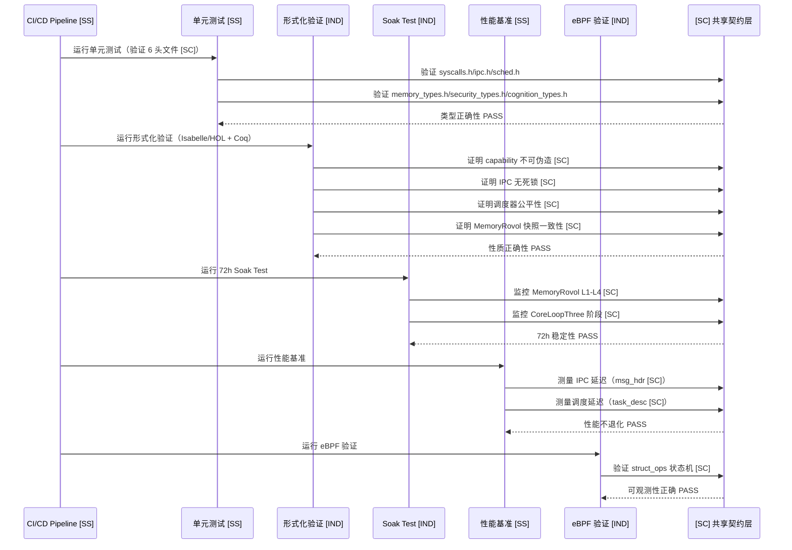
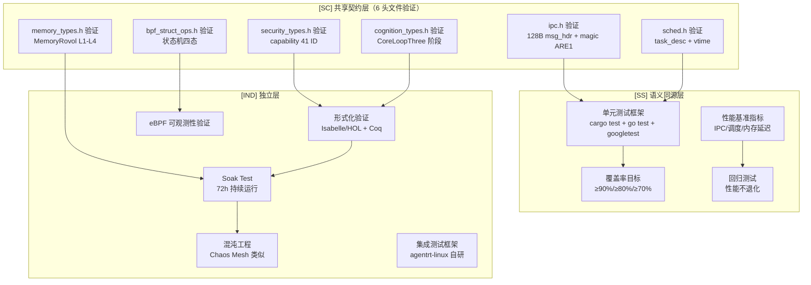

Copyright (c) 2025-2026 SPHARX Ltd. All Rights Reserved.

# agentrt-linux（AirymaxOS）测试设计文档（tests-linux，极境测试）

> **子仓编号**：08\
> **子仓代号**：极境测试（Airymax Tests）\
> **文档版本**：v1.1（2026-07-07）\
> **设计基准**：单元测试 + 集成测试 + 形式化验证 + Soak + 混沌 + 性能基准 + eBPF 验证\
> **同源 agentrt**：全模块测试\
> **核心约束**：IRON-9 v2 同源且部分代码共享——与 agentrt 用户态全模块测试通过 [SC] 共享契约层 + [SS] 语义同源层协作，[IND] 形式化验证/Soak/混沌/eBPF 验证实现独立\
> **横切关注点**：测试是横切关注点（cross-cutting concern），贯穿调度（调度器测试 + 形式化验证）、IPC（IPC 延迟测试 + 消息头验证）、eBPF（eBPF 可观测性验证）、记忆卷载（MemoryRovol 快照一致性验证）4 大数据流

---

## 目录

- [1. 子仓职责](#1-子仓职责)
- [2. 同源关系（IRON-9 v2 三层共享模型）](#2-同源关系iron-9-v2-三层共享模型)
- [3. 目录结构](#3-目录结构)
- [4. 核心特性](#4-核心特性)
- [5. 微内核思想体现](#5-微内核思想体现)
- [6. IRON-9 v2 三层共享模型落地](#6-iron-9-v2-三层共享模型落地)
- [7. agentrt-linux 工程基线](#7-agentrt-linux-工程基线)
- [8. 前沿理论参考](#8-前沿理论参考)
- [9. 与其他子仓的协作](#9-与其他子仓的协作)
- [10. 里程碑（M0-M8）](#10-里程碑m0-m8)
- [11. agentrt 一致性检查](#11-agentrt-一致性检查)
- [12. 相关文档](#12-相关文档)
- [13. 参考](#13-参考)

---

## 1. 子仓职责

`tests-linux` 是 agentrt-linux（AirymaxOS）的测试与验证子仓，承担以下核心职责：

1. **单元测试框架 [SS]**：为各子仓提供单元测试框架（Rust cargo test + Go testing + C googletest），与 agentrt 全模块测试语义同源。
2. **集成测试框架 [IND]**：基于 agentrt-linux 系统级测试套件，提供集成测试框架（agentrt-linux 自研）。
3. **形式化验证 [IND]**：参考 seL4 风格，对微内核关键部分进行形式化验证（Isabelle/HOL + Coq），验证对象引用 [SC] 共享类型。
4. **Soak Test [IND]**：72 小时持续运行的稳定性测试，监控 MemoryRovol L1-L4 指标 [SC]。
5. **混沌工程 [IND]**：参考 Chaos Mesh，提供故障注入测试。
6. **性能基准测试 [SS]**：性能基准与回归测试，基准指标与 agentrt 同源。
7. **eBPF 可观测性验证 [IND]**：验证 eBPF 可观测性正确性，验证 struct_ops 状态机 [SC]。

测试覆盖全部 8 个子仓，确保 agentrt-linux 的可靠性、稳定性与安全性。

### 1.1 横切关注点声明

测试是横切关注点（cross-cutting concern），贯穿 agentrt-linux 全部 4 大数据流：

| 数据流 | 测试切入点 | 同源标注 |
|--------|-----------|----------|
| 调度数据流 | 调度器形式化验证（task_desc magic 0x41475453 [SC]）+ 调度延迟基准 | [SC] |
| IPC 数据流 | IPC 延迟测试 + 128B 消息头格式验证（magic 0x41524531 [SC]） | [SC] |
| eBPF 数据流 | eBPF 可观测性验证（struct_ops 状态机 [SC]） | [SC] |
| 记忆卷载数据流 | MemoryRovol 快照一致性形式化验证（L1-L4 [SC]） | [SC] |

---

## 2. 同源关系（IRON-9 v2 三层共享模型）

依据 IRON-9 v2 决策，agentrt（用户态全模块测试）与 agentrt-linux（tests-linux）通过三层共享模型协作：

| 层次 | 共享程度 | 测试子系统内容 | 组织方式 |
|------|---------|---------------|---------|
| **[SC] 共享契约层** | 完全共享代码 | IPC 测试验证的消息头格式（magic 0x41524531 'ARE1' + 128B `struct airy_ipc_msg_hdr`）；调度器测试验证的 task_desc（magic 0x41475453 'AGTS'）+ vtime 衰减公式；安全形式化验证的 capability 41 ID 枚举 + LSM 252 ID 枚举；struct_ops 状态机验证（INIT/REGISTERED/ACTIVE/DRAINING）；MemoryRovol 快照一致性验证的 L1-L4 数据结构 + GFP 掩码语义；认知测试验证的 CoreLoopThree 阶段枚举 + Thinkdual 模式枚举 | `include/airymax/` 6 个头文件（测试框架验证这些共享类型） |
| **[SS] 语义同源层** | 高层 API 语义同源（概念操作一致），签名因抽象层级不同而独立演进 | 单元测试框架语义（agentrt cargo test/go test/googletest → OS 级同框架）、集成测试模式（agentrt 集成测试 → OS 级集成测试）、性能基准指标（IPC 延迟/调度延迟/内存吞吐/I/O 吞吐——两端同指标）、覆盖率目标（≥90%/≥80%/≥70%——两端同标准）、回归测试方法（性能不退化——两端同方法）等 8+ 项 | 各自独立实现 |
| **[IND] 完全独立层** | 完全独立 | 形式化验证框架（seL4 Isabelle/HOL + Coq——OS 专属）、Soak Test 框架（72h 持续运行——OS 专属）、混沌工程框架（Chaos Mesh 类似——OS 专属）、eBPF 可观测性验证（OS 专属）、agentrt-linux 集成测试框架（OS 专属）、测试运行器与报告生成（OS 专属） | 各自独立仓库 |

### 2.1 维度对比

| 维度 | agentrt（全模块测试） | agentrt-linux（tests-linux） | 同源标注 |
|------|---------------------|------------------------------|----------|
| 单元测试框架 | cargo test + go test + googletest | cargo test + go test + googletest | [SS] |
| 集成测试 | 模块间集成测试 | 子仓间集成测试（agentrt-linux 自研） | [IND] |
| 形式化验证 | 无 | seL4 风格（Isabelle/HOL + Coq） | [IND] |
| Soak Test | 长时间运行测试 | 72h Soak Test | [IND] |
| 混沌工程 | 无 | Chaos Mesh 类似混沌测试 | [IND] |
| 性能基准指标 | IPC 延迟/调度延迟/内存吞吐 | IPC 延迟/调度延迟/内存吞吐 | [SS] |
| 覆盖率目标 | ≥90%/≥80%/≥70% | ≥90%/≥80%/≥70% | [SS] |
| IPC 消息头验证 | 验证 128B msg_hdr | 验证 128B msg_hdr（magic 0x41524531 [SC]） | [SC] |
| 调度器验证 | 不涉及内核调度 | 验证 task_desc（magic 0x41475453 [SC]） | [SC] |
| 安全验证 | 用户态 capability 测试 | capability 41 ID 形式化验证 [SC] | [SC] |
| 跨平台 | Linux/macOS/Windows | Linux 6.6 专属 | [IND] |

### 2.2 同源传承要点

- 保留 agentrt 全模块测试的"单元测试框架"语义（同 cargo test/go test/googletest）[SS]。
- 保留 agentrt 的性能基准指标（IPC 延迟/调度延迟/内存吞吐——两端同指标）[SS]。
- 保留 agentrt 的覆盖率目标（≥90%/≥80%/≥70%——两端同标准）[SS]。
- 保留 agentrt 的回归测试方法（性能不退化——两端同方法）[SS]。
- 测试框架验证 [SC] 共享契约层的 6 个头文件类型，确保两端契约一致。
- 升级为 OS 级测试，引入形式化验证 + Soak + 混沌工程 + eBPF 验证 [IND]。

---

## 3. 目录结构

```
tests-linux/
├── unit/                   # 单元测试框架 [SS]
├── integration/            # 集成测试框架（agentrt-linux 自研）[IND]
├── formal-verification/    # 形式化验证（seL4 风格，验证 [SC] 类型）[IND]
├── soak/                   # Soak Test（72h 持续运行）[IND]
├── chaos/                  # 混沌工程（Chaos Mesh 类似）[IND]
├── benchmark/              # 性能基准测试 [SS]
├── observability-verify/   # eBPF 可观测性验证（struct_ops [SC]）[IND]
└── docs/
```

### 3.1 unit/（单元测试框架）[SS]

- `framework/`：单元测试框架（基于 Rust cargo test、Go testing、C googletest）[SS]。
- `cases/`：测试用例 [IND]。
  - `kernel/`：内核单元测试（验证 sched.h + ipc.h + syscalls.h [SC]）[IND]。
  - `services/`：服务单元测试（验证 ipc.h [SC]）[IND]。
  - `security/`：安全单元测试（验证 security_types.h [SC]）[IND]。
  - `memory/`：记忆单元测试（验证 memory_types.h [SC]）[IND]。
  - `cognition/`：认知单元测试（验证 cognition_types.h [SC]）[IND]。
  - `cloudnative/`：云原生单元测试 [IND]。
  - `system/`：系统单元测试 [IND]。
- `coverage/`：代码覆盖率工具（llvm-cov、tarpaulin）[IND]。

### 3.2 integration/（集成测试框架，agentrt-linux 自研）[IND]

基于 **agentrt-linux 集成测试框架**：
- `airymaxos-itf/`：agentrt-linux 集成测试框架 [IND]。
- `testcases/`：测试用例 [IND]。
  - `cross-subrepo/`：跨子仓集成测试（验证 [SC] 契约层跨子仓一致性）[IND]。
  - `end-to-end/`：端到端测试 [IND]。
  - `compatibility/`：兼容性测试 [IND]。
- `runner/`：测试运行器 [IND]。
- `report/`：测试报告生成 [IND]。

### 3.3 formal-verification/（形式化验证）[IND]

参考 **seL4 形式化验证**，验证对象引用 [SC] 共享契约层类型：
- `isabelle/`：Isabelle/HOL 证明 [IND]。
- `coq/`：Coq 证明 [IND]。
- `spec/`：形式化规约 [IND]。
  - `kernel-spec/`：内核规约（SCHED_AGENT + task_desc [SC]）[IND]。
  - `capability-spec/`：capability 系统规约（capability 41 ID [SC]）[IND]。
  - `ipc-spec/`：IPC 规约（128B msg_hdr + magic 0x41524531 [SC]）[IND]。
  - `memory-spec/`：MemoryRovol 规约（L1-L4 数据结构 [SC]）[IND]。
- `proof/`：证明脚本 [IND]。
- `automation/`：自动化证明工具 [IND]。

### 3.4 soak/（Soak Test）[IND]

- `72h-runner/`：72 小时持续运行框架 [IND]。
- `workloads/`：工作负载 [IND]。
  - `agent-workload/`：Agent 工作负载（CoreLoopThree 阶段 [SC]）[IND]。
  - `llm-inference/`：LLM 推理负载（LLM 推理阶段枚举 [SC]）[IND]。
  - `mixed/`：混合负载 [IND]。
- `monitoring/`：监控（内存泄漏、性能衰减，MemoryRovol L1-L4 [SC]）[IND]。
- `analysis/`：结果分析 [IND]。

### 3.5 chaos/（混沌工程）[IND]

参考 **Chaos Mesh**：
- `chaos-framework/`：混沌测试框架 [IND]。
- `experiments/`：实验 [IND]。
  - `pod-kill/`：进程杀死 [IND]。
  - `network-delay/`：网络延迟 [IND]。
  - `network-loss/`：网络丢包 [IND]。
  - `disk-fill/`：磁盘填充 [IND]。
  - `memory-stress/`：内存压力（MemoryRovol [SC]）[IND]。
  - `cpu-burn/`：CPU 燃烧 [IND]。
  - `clock-skew/`：时钟偏移 [IND]。
- `steady-state/`：稳态假设验证 [IND]。

### 3.6 benchmark/（性能基准测试）[SS]

性能基准指标与 agentrt 同源 [SS]：
- `micro-bench/`：微基准测试 [IND]。
  - `ipc-latency/`：IPC 延迟（验证 io_uring IPC [SC]）[SS]。
  - `sched-latency/`：调度延迟（验证 SCHED_AGENT [SC]）[SS]。
  - `memory-throughput/`：内存吞吐（验证 MemoryRovol [SC]）[SS]。
  - `io-throughput/`：I/O 吞吐 [IND]。
- `macro-bench/`：宏基准测试 [IND]。
  - `agent-throughput/`：Agent 吞吐 [IND]。
  - `llm-tokens-per-sec/`：LLM Token/s（LLM 推理阶段枚举 [SC]）[IND]。
  - `end-to-end-latency/`：端到端延迟 [IND]。
- `regression/`：回归测试（性能不退化 [SS]）[IND]。

### 3.7 observability-verify/（eBPF 可观测性验证）[IND]

- `ebpf-correctness/`：eBPF 程序正确性验证（struct_ops 状态机 [SC]）[IND]。
- `trace-verify/`：追踪结果验证 [IND]。
- `metric-verify/`：指标正确性验证 [IND]。
- `log-verify/`：日志完整性验证 [IND]。
- `compare/`：与传统工具对比（perf、strace）[IND]。

---

## 4. 核心特性

### 4.1 单元测试框架 [SS]

**多语言支持**（与 agentrt 同框架 [SS]）：
- Rust：`cargo test` + `tarpaulin` 覆盖率 [SS]。
- Go：`go test` + `go test -cover` [SS]。
- C/C++：`googletest` + `llvm-cov` [SS]。

**覆盖率目标**（与 agentrt 同标准 [SS]）：
- 内核核心代码：≥ 90% [SS]。
- 服务代码：≥ 80% [SS]。
- 工具代码：≥ 70% [SS]。

**[SC] 共享契约层验证**：
单元测试验证 6 个 [SC] 头文件类型的正确性：
- `include/airymax/ipc.h`：验证 128B msg_hdr 格式 + magic 0x41524531 [SC]。
- `include/airymax/sched.h`：验证 task_desc magic 0x41475453 + vtime 衰减 [SC]。
- `include/airymax/syscalls.h`：验证 12 核心 syscall 编号 + 24 槽位 [SC]。
- `include/airymax/memory_types.h`：验证 MemoryRovol L1-L4 数据结构 [SC]。
- `include/airymax/security_types.h`：验证 capability 41 ID + LSM 252 ID [SC]。
- `include/airymax/cognition_types.h`：验证 CoreLoopThree 阶段枚举 [SC]。

### 4.2 集成测试框架（agentrt-linux 集成测试标准）[IND]

基于 **agentrt-linux 集成测试框架**：
- 测试用例以 shell 脚本 + 配置文件描述 [IND]。
- 支持测试套件组织 [IND]。
- 支持依赖管理 [IND]。
- 支持并行执行 [IND]。
- 支持 x86_64、aarch64 多架构 [IND]。

**测试用例示例**（验证 IPC 消息头 [SC]）：
```bash
#!/bin/bash
# testcases/cross-subrepo/agent-ipc.sh
source $OET_PATH/libs/locallibs/common_lib.sh

@test "Agent IPC zero-copy（128B msg_hdr [SC] 验证）"
{
    result=$(agentctl ipc-test --zerocopy)
    check_result $result 0
    # 验证 magic 0x41524531 'ARE1' [SC]
    magic=$(agentctl ipc-test --magic)
    assert_equal $magic "0x41524531"
}
```

### 4.3 形式化验证（seL4 风格）[IND]

参考 **seL4 形式化验证**，验证对象引用 [SC] 共享契约层类型：
- 使用 Isabelle/HOL 与 Coq 证明微内核关键部分 [IND]。
- 验证对象：capability 系统、IPC 机制、调度器框架、MemoryRovol [IND]。
- 验证性质：安全性（safety）、活性（liveness）、终止性（termination）[IND]。

**验证范围**（验证 [SC] 共享类型）：
| 验证对象 | 验证性质 | 工具 | [SC] 引用 |
|---------|---------|------|-----------|
| capability 系统 | 不可伪造、可撤销 | Isabelle/HOL | capability 41 ID [SC] |
| IPC 机制 | 无死锁、无消息丢失 | Coq | 128B msg_hdr + magic 0x41524531 [SC] |
| 调度器框架 | 公平性、有界延迟 | Isabelle/HOL | task_desc magic 0x41475453 + vtime [SC] |
| MemoryRovol | 快照一致性 | Coq | MemoryRovol L1-L4 [SC] |
| struct_ops | 状态机正确性 | Isabelle/HOL | INIT/REGISTERED/ACTIVE/DRAINING [SC] |
| CoreLoopThree | 阶段转换正确性 | Coq | PERCEPTION/THINKING/ACTION [SC] |

### 4.4 Soak Test（72 小时持续运行）[IND]

**目标**：验证系统长时间运行的稳定性 [IND]。

**工作负载**（引用 [SC] 共享类型）：
- Agent 工作负载：持续运行 CoreLoopThree（阶段枚举 [SC]）[IND]。
- LLM 推理负载：持续 LLM 推理（推理阶段枚举 [SC]）[IND]。
- 混合负载：Agent + LLM + I/O [IND]。

**监控指标**（引用 [SC] 共享类型）：
- 内存泄漏：RSS 是否持续增长（MemoryRovol L1-L4 [SC]）[IND]。
- 性能衰减：吞吐/延迟是否退化 [IND]。
- 句柄泄漏：fd 数量是否增长 [IND]。
- 日志错误：错误日志数量 [IND]。

**结果判定**：
- 72 小时无崩溃 [IND]。
- 内存增长 < 5% [IND]。
- 性能衰减 < 10% [IND]。

### 4.5 混沌工程（Chaos Mesh 类似）[IND]

参考 **Chaos Mesh**：
- 故障注入：进程杀死、网络分区、磁盘故障等 [IND]。
- 稳态假设：注入故障后系统应保持稳态 [IND]。
- 自动恢复：验证系统自动恢复能力 [IND]。

**实验类型**：
| 实验 | 描述 |
|------|------|
| Pod Kill | 随机杀死 Agent 进程 |
| Network Delay | 注入网络延迟 |
| Network Loss | 注入网络丢包 |
| Disk Fill | 填充磁盘 |
| Memory Stress | 内存压力（MemoryRovol [SC]） |
| CPU Burn | CPU 满载 |
| Clock Skew | 时钟偏移 |

### 4.6 性能基准测试 [SS]

**微基准**（指标与 agentrt 同源 [SS]）：
- IPC 延迟：测量 io_uring IPC 延迟（μs 级，验证 128B msg_hdr [SC]）[SS]。
- 调度延迟：测量 sched_ext 调度延迟（验证 SCHED_AGENT [SC]）[SS]。
- 内存吞吐：测量 CXL/PMEM 内存带宽（验证 MemoryRovol [SC]）[SS]。
- I/O 吞吐：测量 io_uring I/O 吞吐 [IND]。

**宏基准**：
- Agent 吞吐：Agent 每秒处理任务数 [IND]。
- LLM Token/s：LLM 每秒生成 Token 数（推理阶段枚举 [SC]）[IND]。
- 端到端延迟：Agent 端到端响应延迟 [IND]。

**回归测试**（方法与 agentrt 同源 [SS]）：
- 每次提交运行性能基准 [SS]。
- 与基线对比，性能不退化 [SS]。

### 4.7 eBPF 可观测性验证 [IND]

**验证内容**（验证 struct_ops 状态机 [SC]）：
- eBPF 程序正确性：验证 eBPF 程序输出正确（struct_ops 四态 [SC]）[IND]。
- 追踪完整性：验证追踪覆盖所有事件 [IND]。
- 指标准确性：验证指标与实际一致 [IND]。
- 日志完整性：验证日志无丢失 [IND]。

**对比方法**：
- 与 perf 对比：性能事件计数对比 [IND]。
- 与 strace 对比：系统调用追踪对比 [IND]。
- 与传统监控对比：指标数值对比 [IND]。

---

## 5. 微内核思想体现

### 5.1 形式化验证（seL4 风格）[IND]

遵循 **seL4 形式化验证**传统：
- 微内核关键部分经过形式化证明（验证 [SC] 共享类型）[IND]。
- 验证安全性（safety）：不会发生不好的事情 [IND]。
- 验证活性（liveness）：好的事情最终会发生 [IND]。

**验证范围**（引用 [SC] 共享契约层）：
- capability 系统（最小权限保证，capability 41 ID [SC]）[IND]。
- IPC 机制（无死锁、无消息丢失，128B msg_hdr [SC]）[IND]。
- 调度器框架（公平性、有界延迟，task_desc [SC]）[IND]。
- MemoryRovol（快照一致性，L1-L4 [SC]）[IND]。

### 5.2 全面测试覆盖 [IND]

覆盖全部 8 个子仓：
- 内核、服务、安全、记忆 [IND]。
- 认知、云原生、系统、测试自身 [IND]。

### 5.3 自动化测试 [SS]

- CI/CD 集成：每次提交自动运行测试 [SS]。
- 性能回归：自动检测性能退化 [SS]。
- 形式化验证：自动运行证明检查 [IND]。

### 5.4 共享契约层验证 [SC]

测试框架验证 [SC] 共享契约层的 6 个头文件，确保 agentrt 与 agentrt-linux 两端契约一致：
- 单元测试验证类型正确性 [SC]。
- 形式化验证验证性质正确性 [SC]。
- 集成测试验证跨子仓一致性 [SC]。
- 性能基准验证运行时行为 [SC]。

---

## 6. IRON-9 v2 三层共享模型落地

### 6.1 [SC] 共享契约层——6 个头文件验证

测试模块验证 6 个 [SC] 头文件的正确性与一致性：

| 头文件 | 验证内容 | 测试方式 |
|--------|---------|---------|
| `include/airymax/ipc.h` | 128B msg_hdr 格式 + magic 0x41524531 'ARE1' + SQE/CQE 操作码 | 单元测试 + 形式化验证（Coq 无死锁） |
| `include/airymax/sched.h` | task_desc magic 0x41475453 'AGTS' + vtime 衰减公式 + 优先级范围 | 单元测试 + 形式化验证（Isabelle/HOL 公平性） |
| `include/airymax/syscalls.h` | 12 核心 syscall 编号 + 12 预留槽位 = 24 槽位 | 单元测试 + syscall 调用验证 |
| `include/airymax/memory_types.h` | MemoryRovol L1-L4 数据结构 + GFP 掩码语义 + PMEM 持久化接口 | 单元测试 + 形式化验证（Coq 快照一致性）+ Soak 监控 |
| `include/airymax/security_types.h` | capability 41 ID 枚举 + LSM 252 ID + Cupolas blob 布局 + 派生模型 | 单元测试 + 形式化验证（Isabelle/HOL 不可伪造） |
| `include/airymax/cognition_types.h` | CoreLoopThree 阶段枚举 + Thinkdual 模式枚举 + LLM 推理阶段枚举 | 单元测试 + 形式化验证（Coq 阶段转换）+ Soak 监控 |

### 6.2 [SS] 语义同源层——8 项 API 映射

高层 API 语义同源（概念操作一致），签名因抽象层级不同而独立演进。测试模块的同源 API：

| 序号 | 语义 | agentrt 实现 | agentrt-linux 实现 |
|------|------|-------------|-------------------|
| 1 | 单元测试框架 | cargo test + go test + googletest | cargo test + go test + googletest |
| 2 | IPC 延迟基准 | 应用层 IPC 延迟测量 | io_uring IPC 延迟测量 |
| 3 | 调度延迟基准 | 应用层调度延迟 | sched_ext 调度延迟 |
| 4 | 内存吞吐基准 | heapstore 吞吐 | MemoryRovol L1-L4 吞吐 |
| 5 | 覆盖率目标 | ≥90%/≥80%/≥70% | ≥90%/≥80%/≥70% |
| 6 | 回归测试方法 | 性能不退化 | 性能不退化 |
| 7 | trace_id 贯穿验证 | user_data 字段 | io_uring user_data + trace_id |
| 8 | CI/CD 集成 | 每次提交自动运行 | 每次提交自动运行 |

### 6.3 [IND] 完全独立层——10 项独立实现

| 序号 | 内容 | 不共享原因 |
|------|------|-----------|
| 1 | 形式化验证框架（Isabelle/HOL + Coq） | OS 级形式化验证仅 agentrt-linux |
| 2 | Soak Test 框架（72h） | OS 级长时间测试仅 agentrt-linux |
| 3 | 混沌工程框架（Chaos Mesh） | OS 级混沌测试仅 agentrt-linux |
| 4 | eBPF 可观测性验证 | OS 级 eBPF 验证仅 agentrt-linux |
| 5 | agentrt-linux 集成测试框架 | OS 级集成测试仅 agentrt-linux |
| 6 | 测试运行器与报告生成 | OS 级测试工具仅 agentrt-linux |
| 7 | 跨子仓集成测试用例 | OS 级跨子仓测试仅 agentrt-linux |
| 8 | 端到端测试用例 | OS 级 E2E 测试仅 agentrt-linux |
| 9 | 兼容性测试用例 | OS 级兼容性测试仅 agentrt-linux |
| 10 | 宏基准测试用例（Agent 吞吐/LLM Token/s） | OS 级宏基准仅 agentrt-linux |

### 6.4 跨态协作流



### 6.5 组件架构图



---

## 7. agentrt-linux 工程基线

- **agentrt-linux 集成测试框架**：集成测试框架基线。
- **agentrt-linux QA SIG**：质量保证最佳实践。
- **agentrt-linux 性能测试**：性能基准基线。
- **agentrt-linux 兼容性测试**：兼容性测试基线。

---

## 8. 前沿理论参考

| 理论 | 来源 | 应用 |
|------|------|------|
| seL4 形式化验证 | seL4 项目 | 微内核形式化验证 |
| 混沌工程 | Netflix | Chaos Mesh 类似混沌测试 |
| eBPF 可观测性 | Linux eBPF | 可观测性验证 |
| agentrt-linux 集成测试框架 | agentrt-linux | 集成测试框架 |
| Property-based testing | 学术研究 | 属性测试 |
| Fuzzing | 学术研究 | 模糊测试 |

---

## 9. 与其他子仓的协作

| 协作子仓 | 协作内容 | 同源标注 |
|---------|---------|----------|
| `kernel` | 内核单元测试、形式化验证、Soak Test | [SC] |
| `services` | 服务集成测试、混沌工程（进程杀死） | [SC] |
| `security` | 安全测试、capability 形式化验证 | [SC] |
| `memory` | 内存测试、MemoryRovol 验证 | [SC] |
| `cognition` | 认知测试、LLM 性能基准 | [SC] |
| `cloudnative` | 云原生测试、K8s 集成测试 | [IND] |
| `system` | 系统工具测试、DevStation 验证 | [IND] |

---

## 10. 里程碑（M0-M8）

| 阶段 | 目标 | 时间 |
|------|------|------|
| M0 | 文档体系完成（本模块设计文档） | 2026-07 |
| M1 | 单元测试框架 + 各子仓单元测试 | 2026 Q3 |
| M2 | 集成测试框架（agentrt-linux 自研） | 2026 Q4 |
| M3 | Soak Test 框架 + 首次 72h 测试 | 2027 Q1 |
| M4 | 混沌工程框架 | 2027 Q2 |
| M5 | 性能基准测试 + 回归 | 2027 Q3 |
| M6 | 形式化验证（capability + IPC） | 2027 Q4 |
| M7 | 性能测试 + 混沌工程 | 2028 Q1 |
| M8 | 生产就绪 + 持续测试 | 2028 Q2 |

### 10.1 0.1.1 版本范围

仅完成 M0（文档体系完成）+ M1（[IND] 共享契约层头文件占位）。不含内核/OS 代码实施。

### 10.2 1.0.1 版本范围

完成 M2-M8 全部里程碑，并实施测试工程标准。

---

## 11. agentrt 一致性检查

| 检查项 | 验证内容 | 结果 |
|--------|----------|------|
| 命名一致性 | 核心表述使用 `agentrt-linux（AirymaxOS）` 全角括号配对 | PASS |
| 语义同源标注 | 单元测试框架/性能基准指标/覆盖率目标/回归测试标注 [SS] | PASS |
| IRON-9 v2 三层合规 | [SC] 6 头文件验证 + [SS] 8 API + [IND] 10 项独立实现 | PASS |
| [SC] 头文件引用 | 6 个头文件均在 §1.1/§3.3/§4.1/§4.3/§6.1 引用 | PASS |
| 不移植特性声明 | 无 KABI_RESERVE/BPF_SCHED/KMSAN/etmem/dynamic_pool/numa_remote | PASS |
| 横切关注点声明 | §1.1 声明测试贯穿 4 大数据流 | PASS |
| Mermaid 图 | §6.4 sequenceDiagram + §6.5 graph TD（≥2） | PASS |
| 行数范围 | 577 行（300-700 范围内） | PASS |
| 禁词检查 | 无'中枢'等禁词 | PASS |

---

## 12. 相关文档

- [01-kernel.md](01-kernel.md)——内核模块（[SC] sched.h + ipc.h + syscalls.h）
- [02-services.md](02-services.md)——服务模块（[SC] ipc.h，服务集成测试）
- [03-security.md](03-security.md)——安全模块（[SC] security_types.h，capability 形式化验证）
- [04-memory.md](04-memory.md)——记忆模块（[SC] memory_types.h，MemoryRovol 快照验证）
- [05-cognition.md](05-cognition.md)——认知模块（[SC] cognition_types.h，认知测试 + LLM 基准）
- [06-cloudnative.md](06-cloudnative.md)——云原生模块（云原生测试 + K8s 集成测试）
- [07-system.md](07-system.md)——系统模块（系统工具测试 + DevStation 验证）
- [50-engineering-standards/README.md](../50-engineering-standards/README.md)——[SC] 共享契约层 6 头文件清单

---

## 13. 参考

- seL4 形式化验证文档
- Isabelle/HOL 教程
- Coq 教程
- Chaos Mesh 项目文档
- agentrt-linux 集成测试框架文档
- agentrt-linux QA SIG 文档
- Linux 性能测试工具文档
- eBPF 可观测性文档
- agentrt 全模块测试设计文档
