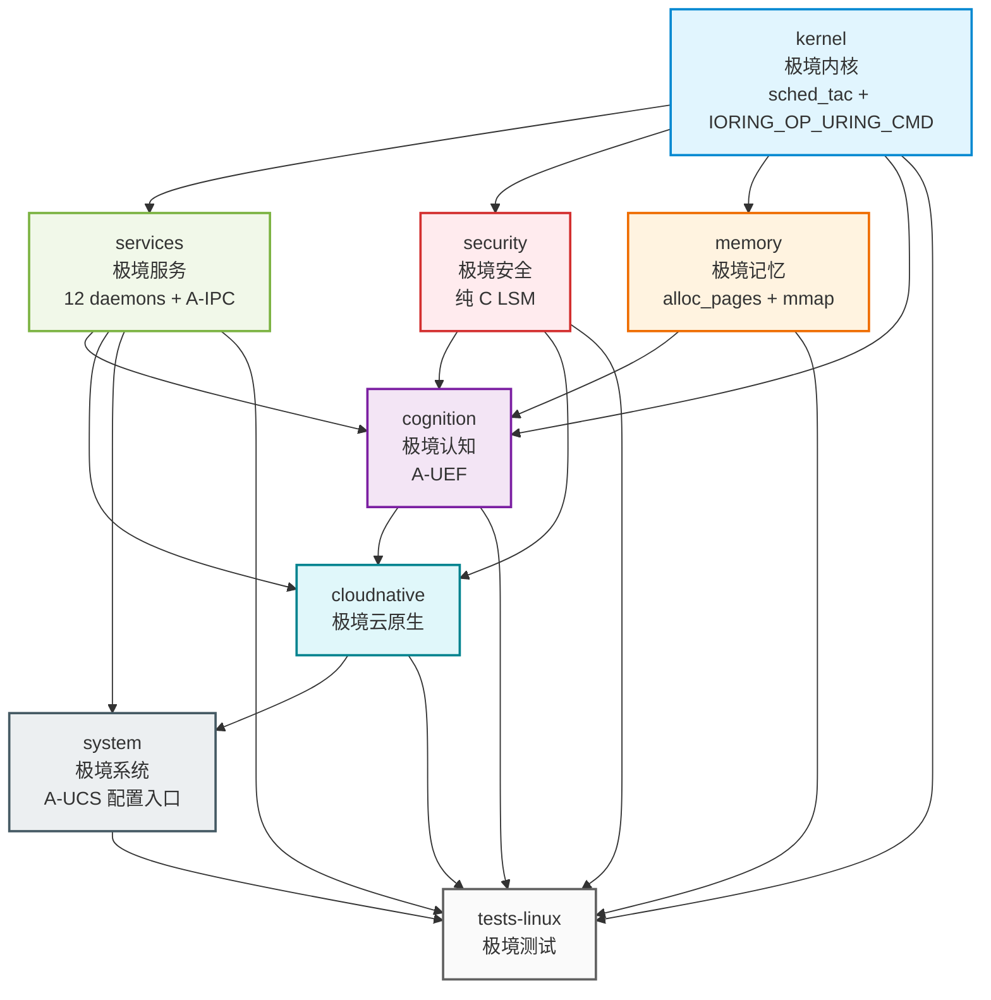

Copyright (c) 2025-2026 SPHARX Ltd. All Rights Reserved.

# agentrt-linux（AirymaxOS）模块设计总览
> **文档定位**：agentrt-linux（AirymaxOS）模块设计层的总览与索引，覆盖 8 子仓核心模块 + A-ULS/A-ULP/A-UCS 三大 Unify Design 模块 + Logger Daemon/printk-bridge/unified-config 子模块\
> **文档版本**：v1.0\
> **最后更新**：2026-07-17\
> **上级文档**：[agentrt-linux 总览](../README.md)\
> **核心约束**：IRON-9 v3 同源代码共享——[SC] 共享契约层 10 个头文件落地于 `include/uapi/linux/airymax/`

---

## 1. 模块概述

本文档是 `20-modules/` 目录的总览与索引，定义 agentrt-linux 的模块设计体系：

1. **8 子仓核心模块**：kernel / services / security / memory / cognition / cloudnative / system / tests-linux，遵循微内核设计思想（机制与策略分离）+ Linux 6.6 内核基线规范 + Airymax 同源传承。
2. **Unify Design 三大模块**：A-ULS（统一生命周期管理）、A-ULP（统一日志与打印系统）、A-UCS（统一配置管理体系），分别由 `09-kernel-agent-supervisor.md` + `10-user-supervisor-daemon.md`、`12-logger-daemon-module.md` + `13-printk-bridge.md`、`11-unified-config.md` 三个文档组承载。
3. **[SC] 头文件清单**：10 个共享契约层头文件（完整列表见 §5），物理宿主于 `kernel/include/uapi/linux/airymax/`，其他子仓通过 `-I../kernel/include` 引用（OS-IRON-014 落地）。

---

## 2. 技术选型声明

本目录的模块设计以 agentrt-linux v1.0 五大技术选型为基线：

| # | 技术维度 | 选定方案 | 明确不采用的方案 | 模块影响 |
|---|---------|---------|----------------|---------|
| 1 | **内核调度** | **sched_tac**：复用 Linux 6.6 原生 `SCHED_DEADLINE` / `SCHED_FIFO` / `EEVDF` 调度类 | **不使用 sched_ext**（不引入 eBPF 调度器、不使用 SCHED_AGENT 宏） | `01-kernel.md` 调度子系统基于sched_tac；`09-kernel-agent-supervisor.md`（A-ULS）监管sched_tac 调度策略 |
| 2 | **IPC 零拷贝** | **IORING_OP_URING_CMD**：io_uring 命令操作码零拷贝传输 | **不使用 page flipping** | `01-kernel.md` IPC 子系统基于 IORING_OP_URING_CMD；`02-services.md` 服务间通信基于 A-IPC |
| 3 | **安全钩子** | **纯 C LSM**：纯 C 实现 `airy_lsm`，通过 `security_hook_list` 注册 | **不使用 BPF LSM** | `03-security.md` 安全子系统基于纯 C LSM，不依赖 BPF LSM 框架 |
| 4 | **内存分配** | **alloc_pages + mmap**：物理页分配后映射到用户态 | **不使用 DMA 一致性内存** | `04-memory.md` 记忆子系统基于 alloc_pages + mmap；`09-kernel-agent-supervisor.md`（A-ULS）监管内存生命周期 |
| 5 | **同源代码共享** | **IRON-9 v3 四层模型**：[SC] + [SS] + [IND] + [DSL] | （v2 三层模型升级，新增 [DSL] 降级生存层） | 10 个 [SC] 头文件物理宿主于 `kernel/include/uapi/linux/airymax/`；降级生存块见 `50-engineering-standards/11-sc-header-type-bridging.md` |

---

## 3. 8 子仓矩阵

| # | 子仓 | 中文 | 核心职责 | 同源 agentrt | 关键能力 | 仓库 URL |
|---|------|------|---------|--------------|---------|---------|
| 1 | kernel | 极境内核 | Linux 6.6 + sched_tac + IORING_OP_URING_CMD + 纯 C LSM | atoms/corekern（MicroCoreRT） | EEVDF + sched_tac + io_uring + alloc_pages + mmap | https://atomgit.com/openairymax/kernel.git |
| 2 | services | 极境服务 | 用户态系统服务 | daemons（12 daemons） | systemd + io_uring 消息传递（A-IPC） | https://atomgit.com/openairymax/services.git |
| 3 | security | 极境安全 | capability + 纯 C LSM + 国密 | cupolas | seL4 capability + 纯 C airy_lsm + Landlock | https://atomgit.com/openairymax/security.git |
| 4 | memory | 极境记忆 | 记忆持久化 + CXL + PMEM | heapstore + memoryrovol | MemoryRovol 内核态 + MGLRU + alloc_pages + mmap | https://atomgit.com/openairymax/memory.git |
| 5 | cognition | 极境认知 | 认知循环 + Wasm + LLM | coreloopthree + frameworks | CoreLoopThree kthread（A-UEF）+ Wasm 3.0 | https://atomgit.com/openairymax/cognition.git |
| 6 | cloudnative | 极境云原生 | K8s + containerd + OCI | gateway + sdk | K8s CRD + containerd shim | https://atomgit.com/openairymax/cloudnative.git |
| 7 | system | 极境系统 | 包管理 + 配置 + shell | commons | RPM + dnf + DevStation（A-UCS 配置入口） | https://atomgit.com/openairymax/system.git |
| 8 | tests-linux | 极境测试 | 单元 + 集成 + 形式化 | 全模块测试 | 集成测试框架 + seL4 风格验证 | https://atomgit.com/openairymax/tests-linux.git |

---

## 4. 文档索引

本目录包含 13 个模块设计文档，覆盖 8 子仓核心模块 + A-ULS/A-ULP/A-UCS 三大 Unify Design 模块 + Logger Daemon/printk-bridge/unified-config 子模块：

| # | 文档 | 模块类别 | 核心内容 | 版本 | 状态 |
|---|------|---------|---------|------|------|
| 1 | [01-kernel.md](01-kernel.md) | 8 子仓 | Linux 6.6 + sched_tac + IORING_OP_URING_CMD + 纯 C LSM + alloc_pages + mmap + Rust 实验性 + 微内核化 | v1.0 | 维护中 |
| 2 | [02-services.md](02-services.md) | 8 子仓 | 用户态 VFS/网络/驱动 + 12 daemons + A-IPC（io_uring IPC） | v1.0 | 维护中 |
| 3 | [03-security.md](03-security.md) | 8 子仓 | capability + 纯 C airy_lsm + Landlock + 国密 + 机密计算 | v1.0 | 维护中 |
| 4 | [04-memory.md](04-memory.md) | 8 子仓 | MemoryRovol + CXL + PMEM + MGLRU + alloc_pages + mmap + userfaultfd | v1.0 | 维护中 |
| 5 | [05-cognition.md](05-cognition.md) | 8 子仓 | CoreLoopThree kthread（A-UEF）+ Thinkdual + Wasm 3.0 + LLM 调度 | v1.0 | 维护中 |
| 6 | [06-cloudnative.md](06-cloudnative.md) | 8 子仓 | K8s CRD + containerd shim + OCI + agentctl + 超节点 | v1.0 | 维护中 |
| 7 | [07-system.md](07-system.md) | 8 子仓 | RPM + dnf + sysctl（A-UCS）+ DevStation + 监控工具 | v1.0 | 维护中 |
| 8 | [08-tests-linux.md](08-tests-linux.md) | 8 子仓 | 单元/集成/形式化/Soak/混沌/基准/纯 C LSM 验证 | v1.0 | 维护中 |
| 9 | [09-kernel-agent-supervisor.md](09-kernel-agent-supervisor.md) | **A-ULS** | 内核 Agent 监管器（sched_tac 调度监管 + 设备生命周期 + alloc_pages 内存监管） | v1.0 | 维护中 |
| 10 | [10-user-supervisor-daemon.md](10-user-supervisor-daemon.md) | **A-ULS** | 用户态监管守护进程（macro_superv，12 daemons 生命周期管理 + 故障重启） | v1.0 | 维护中 |
| 11 | [11-unified-config.md](11-unified-config.md) | **A-UCS** | 统一配置管理体系（sysctl + Kconfig + airy_defconfig + 运行时配置热更新） | v1.0 | 维护中 |
| 12 | [12-logger-daemon-module.md](12-logger-daemon-module.md) | **A-ULP** | Logger Daemon 模块（Ring Buffer 消费 + 结构化日志 + Panic 生存落盘） | v1.0 | 维护中 |
| 13 | [13-printk-bridge.md](13-printk-bridge.md) | **A-ULP** | printk-bridge（内核 printk → 用户态 Logger Daemon 桥接 + 等级映射） | v1.0 | 维护中 |

---

## 5. [SC] 头文件清单（10 个完整列表）

IRON-9 v3 [SC] 共享契约层包含 10 个头文件，物理宿主于 `kernel/include/uapi/linux/airymax/`，其他子仓通过 `-I../kernel/include` 引用（OS-IRON-014 落地）。Tab 8 缩进 + 最小 typedef + 双向 CI 校验（OS-IRON-008）。

| # | 头文件 | 核心内容 | 关联 Unify 模块 | 关联子仓 |
|---|--------|---------|---------------|---------|
| 1 | `error.h` | 错误码体系（`airy_err_t`）+ 错误码枚举 | 全部 | 全部子仓 |
| 2 | `log_types.h` | 日志类型定义 + 日志级别枚举 + Ring Buffer 数据结构 | **A-ULP** | kernel + services |
| 3 | `memory_types.h` | MemoryRovol L1-L4 数据结构 + GFP 掩码语义 + PMEM 持久化接口 | — | kernel + memory |
| 4 | `security_types.h` | POSIX capability 41 ID + LSM 钩子 252 ID + Cupolas blob 布局 + capability 派生模型 + Vault backend + 策略裁决 4 值枚举 | **A-ULS** | kernel + security |
| 5 | `cognition_types.h` | CoreLoopThree 阶段枚举 + Thinkdual 模式枚举 + LLM 推理阶段枚举 + 上下文结构 + Token 能效指标 + GPU/NPU 描述符 | **A-UEF** | kernel + cognition |
| 6 | `sched.h` | sched_tac 调度类约束（SCHED_DEADLINE/SCHED_FIFO/EEVDF，**禁止 SCHED_AGENT 宏**）+ 任务描述符（magic 0x41475453 'AGTS'）+ vtime 类型与衰减公式 + 优先级范围 + AIRY_SLICE_DFL | **A-UEF** + **A-ULS** | kernel |
| 7 | `ipc.h` | IPC magic（0x41524531 'ARE1'）+ 128B 消息头结构（`struct airy_ipc_msg_hdr`）+ SQE/CQE 操作码与标志位 + IORING_OP_URING_CMD 命令码 | **A-IPC** | kernel + services |
| 8 | `syscalls.h` | Syscall 编号体系（v1.1: 4 核心 + 20 预留 = 24 槽位，`AIRY_SYS_*` 前缀） | **A-UCS** | kernel + 全部 |
| 9 | `uapi_compat.h` | UAPI 兼容性定义（`__u32`/`__u64` 用户态可见类型 + ABI 稳定性约束） | — | kernel + 全部 |
| 10 | `lsm_types.h` | 纯 C LSM 钩子类型定义（`security_hook_list` 注册 + `airy_lsm` blob 布局）+ Landlock 规则结构 | **A-ULS** | kernel + security |

### 5.1 Fastpath 语义分层（[01-kernel.md](01-kernel.md) §6.4）

`01-kernel.md` §6.4 Fastpath 设计明确**语义分层**，消除 seL4 Fastpath 与 io_uring 零拷贝同名混淆：

| 概念 | 语义定义 | seL4 源码证据 |
|------|---------|---------------|
| **POINT OF NO RETURN**（seL4 Fastpath 借鉴） | 12 项前置检查全部通过后进入**不可逆点**，直接切换线程上下文，避免回退开销 | `src/fastpath/fastpath.c:168-233` |
| **io_uring 零拷贝优化**（IORING_OP_URING_CMD） | 固定 buffer + registered ring 路径，**buffer 共享避免数据拷贝** | （Linux 6.6 io_uring 子系统） |

**核心澄清**：两者同名但不同义，**禁止混用**。seL4 Fastpath 是"批量验证后不可逆提交 + 线程上下文切换"；io_uring 零拷贝是"buffer 共享避免数据拷贝"（IORING_OP_URING_CMD，非 page flipping）。

---

## 6. Airymax Unify Design 映射

本目录承载 Airymax Unify Design 三个核心模块的详细设计（A-UEF 在 `05-cognition.md`，A-IPC 在 `01-kernel.md` + `02-services.md`）：

| Unify 模块 | 模块设计文档 | 核心职责 | 关键技术 |
|-----------|------------|---------|---------|
| **A-ULS**（统一生命周期管理） | `09-kernel-agent-supervisor.md` + `10-user-supervisor-daemon.md` | 内核 Agent 监管（sched_tac 调度监管 + 设备生命周期 + 内存监管）+ 用户态监管守护进程（macro_superv，12 daemons 生命周期 + 故障重启） | sched_tac + alloc_pages + mmap + security_hook_list |
| **A-ULP**（统一日志与打印系统） | `12-logger-daemon-module.md` + `13-printk-bridge.md` | Logger Daemon（Ring Buffer 消费 + 结构化日志 + Panic 生存落盘）+ printk-bridge（内核 printk → 用户态 Logger Daemon 桥接 + 等级映射） | Ring Buffer + printk-bridge + Panic 生存路径 |
| **A-UCS**（统一配置管理体系） | `11-unified-config.md` | 统一配置管理体系（sysctl + Kconfig + airy_defconfig + 运行时配置热更新） | sysctl + Kconfig + airy_defconfig |
| **A-UEF**（统一错误码与故障定义体系） | `05-cognition.md` | CoreLoopThree kthread + Thinkdual 双系统协同 + Wasm 3.0 沙箱 + LLM 调度 | CoreLoopThree kthread + sched_tac 调度 |
| **A-IPC**（统一进程间通信体系） | `01-kernel.md` + `02-services.md` | io_uring 零拷贝 IPC（IORING_OP_URING_CMD）+ 128B 消息头 + 5 种 payload | IORING_OP_URING_CMD + 128B 消息头（magic 0x41524531 'ARE1'） |

---

## 7. 子仓依赖图

---

## 8. 同源 agentrt 模块映射表

agentrt-linux 与 agentrt（AirymaxAgentRT）共享设计理念，每个子仓都能追溯到 agentrt 的对应模块。两端通过 IRON-9 v3 四层模型（[SC]/[SS]/[IND]/[DSL]）共享契约层代码与降级生存块。

| agentrt-linux 子仓 | agentrt 同源模块 | 同源语义 | IRON-9 v3 层次 |
|----------------|------------------|---------|----------|
| kernel | atoms/corekern（MicroCoreRT） | sched_tac 调度语义 + IORING_OP_URING_CMD IPC | [SC] sched.h + ipc.h + [SS] 调度/IPC 语义 + [IND] 内核态实现 |
| services | daemons（12 daemons） | 12 daemons 守护进程模型 + A-IPC | [SC] ipc.h + [SS] 守护进程命名 *_d + [IND] systemd 集成 |
| security | cupolas | capability + 纯 C LSM 安全模型 | [SC] security_types.h + lsm_types.h + [SS] capability 模型 + [IND] 纯 C LSM |
| memory | heapstore + memoryrovol | MemoryRovol L1-L4 记忆模型 | [SC] memory_types.h + [SS] 四层卷载语义 + [IND] alloc_pages + mmap |
| cognition | coreloopthree + frameworks | CoreLoopThree 三层认知循环（A-UEF） | [SC] cognition_types.h + [SS] 循环模型 + [IND] kthread |
| cloudnative | gateway + sdk | K8s CRD + agentctl 网关 | [SS] 网关语义 + [IND] K8s 实现 |
| system | commons | RPM + dnf + 配置（A-UCS） | [SS] 工具语义 + [IND] 发行版实现 |
| tests-linux | 全模块测试 | 单元/集成/形式化验证 | [IND] 独立实现 |

---

## 9. 子仓间接口契约

子仓间通过标准化的接口契约协作，遵循 K-2 接口契约化原则。详细接口定义见 [30-interfaces/](../30-interfaces/README.md)。

| 源子仓 | 目标子仓 | 接口类型 | 契约概要 |
|--------|---------|---------|---------|
| kernel → services | 内核接口 | syscall | VFS/网络/驱动用户态服务的内核侧接口 |
| kernel → security | 内核接口 | syscall + security_hook_list | capability 令牌、纯 C LSM hook 注册 |
| kernel → memory | 内核接口 | syscall | MemoryRovol/CXL/MGLRU 内核实现（alloc_pages + mmap） |
| kernel → cognition | 内核接口 | syscall | CoreLoopThree kthread（A-UEF）、Wasm runtime 支持 |
| services → cognition | IPC | io_uring（IORING_OP_URING_CMD） | cogn_d/sched_d 与认知循环协作（128B 消息头） |
| services → cloudnative | IPC | HTTP/gRPC | gateway_d 与 K8s API 集成 |
| security → cognition | IPC | capability | Wasm 沙箱 capability 授权 |
| security → cloudnative | IPC | capability | 容器沙箱、网络策略 |
| memory → cognition | IPC | syscall | MemoryRovol 快照、超节点迁移 |
| cognition → cloudnative | IPC | CRD | Agent 容器化运行 |
| system → services/security/memory | 配置 | sysctl/procfs（A-UCS） | systemd unit、sysctl 配置 |
| tests → 全部子仓 | 验证 | 测试框架 | 单元/集成/形式化/Soak/混沌 |

---

## 10. 相关文档

- [agentrt-linux 总览](../README.md)：v1.0 设计文档体系总览与技术选型声明
- [架构设计](../10-architecture/README.md)：系统架构 + Unify Design 总纲 + IRON-9 v3 + [DSL] 降级层
- [微内核策略](../10-architecture/03-microkernel-strategy.md)：seL4 思想 + 改造路径
- [接口设计](../30-interfaces/README.md)：系统调用 + A-IPC IPC + SDK + 编码规范
- [数据流程设计](../40-dataflows/README.md)：A-UEF/A-IPC/A-ULS/A-ULP 数据流路径
- [工程标准规范](../50-engineering-standards/README.md)：SSoT v2 + [SC] 类型桥接（`11-sc-header-type-bridging.md`）
- [需求分析](../00-requirements/README.md)：业务/功能/非功能需求

---

## 11. 版本历史

| 版本 | 日期 | 变更 |
|------|------|------|
| 0.1.1 | 2026-07-06 | 初始版本，8 子仓模块设计 |
| 0.1.1 | 2026-07-13 | [SC] 头文件 Tab 8 缩进验证通过；Fastpath 语义分层澄清 |
| v1.0 | 2026-07-17 | 升级为 v1.0：新增sched_tac 技术选型声明（不使用 sched_ext）、IORING_OP_URING_CMD（不使用 page flipping）、纯 C LSM（不使用 BPF LSM）、alloc_pages + mmap（不使用 DMA 一致性内存）、IRON-9 v3 四层模型；新增 A-ULS 模块（`09-kernel-agent-supervisor.md` + `10-user-supervisor-daemon.md`）、A-ULP 模块（`12-logger-daemon-module.md` + `13-printk-bridge.md`）、A-UCS 模块（`11-unified-config.md`）；[SC] 头文件清单补全为完整 10 个列表；模块文档数 8 → 13 |

---

© 2025-2026 SPHARX Ltd. All Rights Reserved. | "From data intelligence emerges."
