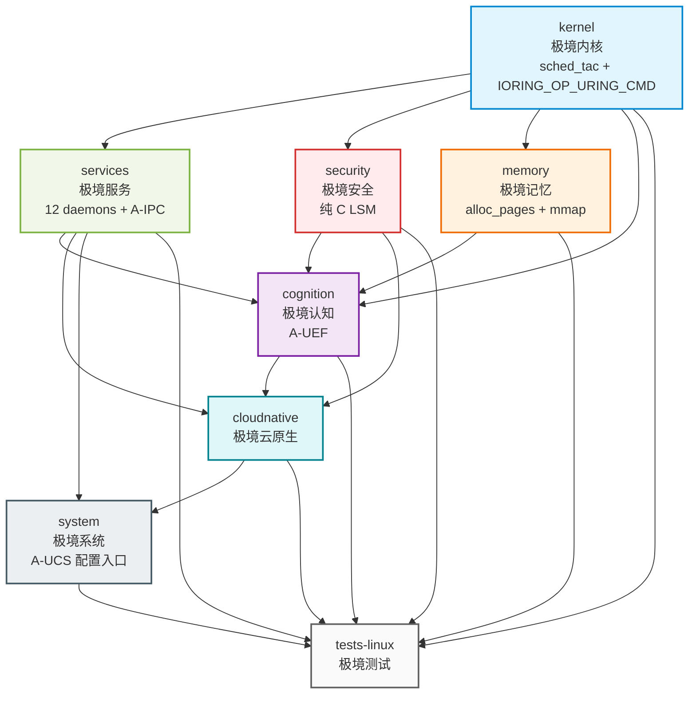

Copyright (c) 2025-2026 SPHARX Ltd. All Rights Reserved.

# agentrt-linux（AirymaxOS）模块设计总览

> **文档定位**：agentrt-linux（AirymaxOS）模块设计层的总览与索引，覆盖 8 子仓核心模块 + A-ULS/A-ULP/A-UCS 三大 Unify Design 模块 + `logger_d`/printk-bridge/unified-config 子模块；声明极境内核标准、v1.0.1 Capability Folding 单平面架构、IRON-9 v3 四层共享模型\
> **文档版本**：v1.0.1\
> **最后更新**： 2026-07-21\
> **上级文档**：[agentrt-linux 总览](../README.md)\
> **极境内核标准**：本目录所有模块遵循"对 Linux 6.6 进行 seL4 思想借鉴的微内核化改造的内核"定位（[ADR-012](../10-architecture/05-adrs.md#adr-012-微内核化改造技术路线确认基于-linux-改造--sel4-思想非从零开发) 确立技术路线 + [ADR-014](../10-architecture/05-adrs.md#adr-014-微内核设计思想来源单一化仅-sel4不引入-zirconminix3) 确立 seL4 唯一来源）\
> **核心约束**：IRON-9 v3 同源代码共享——[SC] 共享契约层 12 个头文件落地于 `include/uapi/linux/airymax/`

---

## 1. 极境内核标准声明

agentrt-linux（AirymaxOS）的极境内核定位为 **"对 Linux 6.6 进行 seL4 思想借鉴的微内核化改造的内核"**：

- **基座**：Linux 6.6 内核（ADR-012）——继承 Linux 30 年积累的硬件支持与生态兼容性
- **思想来源**：seL4 微内核工程思想（ADR-014）——Liedtke 极简原则、capability 单一安全模型、消息传递 IPC、服务用户态化、形式化验证；**不引入 Zircon/Minix3**
- **改造手段**：sched_tac（不使用 sched_ext）+ IORING_OP_URING_CMD（不使用 page flipping）+ 纯 C LSM（不使用 BPF LSM）+ alloc_pages + mmap（不使用 DMA 一致性内存）+ IRON-9 v3 四层共享模型
- **OLK 6.6 工程规范**：UAPI 标准路径 `include/uapi/linux/airymax/`；共享结构使用 `__aligned(64)`（不使用 packed 属性）；`LSM_ORDER_MUTABLE` 用于 `airy_lsm`；`io_uring_cmd_to_pdu(cmd, pdu_type)` / `io_uring_cmd_done(cmd, ret, res2, issue_flags)` 4 参数；`CONFIG_SECURITY_AIRY` default 'n'

本目录的模块设计以此标准为基线，所有子仓与 Unify Design 模块均需对齐。

---

## 2. 模块概述

本文档是 `20-modules/` 目录的总览与索引，定义 agentrt-linux 的模块设计体系：

1. **8 子仓核心模块**：kernel / services / security / memory / cognition / cloudnative / system / tests-linux，遵循 seL4 微内核设计思想（机制与策略分离，ADR-014）+ Linux 6.6 内核基线规范 + Airymax 同源传承。
2. **Unify Design 三大模块**：A-ULS（统一生命周期管理）、A-ULP（统一日志与打印系统）、A-UCS（统一配置管理体系），分别由 `09-kernel-agent-supervisor.md` + `10-user-supervisor-daemon.md`、`12-logger-daemon-module.md` + `13-printk-bridge.md`、`11-unified-config.md` 三个文档组承载。
3. **[SC] 头文件清单**：12 个共享契约层头文件（完整列表见 §6），物理宿主于 `kernel/include/uapi/linux/airymax/`，其他子仓通过 `-I../kernel/include` 引用（OS-IRON-014 落地）。
4. **12 daemon 完整名单**：sec_d / cogn_d / mem_d / gateway_d / logger_d / macro_d / audit_d / sched_d / dev_d / net_d / vfs_d / config_d（详见 §8）。
5. **v1.0.1 Capability Folding 单平面架构**：4 核心 + 20 预留 = 24 syscall 槽位，agent_caps[1024] 静态数组，O(1) 撤销机制（详见 §9）。

---

## 3. 技术选型声明

本目录的模块设计以 agentrt-linux v1.0.1 五大技术选型为基线：

| # | 技术维度 | 选定方案 | 明确不采用的方案 | 模块影响 |
|---|---------|---------|----------------|---------|
| 1 | **内核调度** | **sched_tac**：复用 Linux 6.6 原生 `SCHED_DEADLINE` / `SCHED_FIFO` / `EEVDF` 调度类 | **不使用 sched_ext**（不引入 eBPF 调度器、不使用 SCHED_AGENT 宏） | `01-kernel.md` 调度子系统基于 sched_tac；`09-kernel-agent-supervisor.md`（A-ULS）监管 sched_tac 调度策略 |
| 2 | **IPC 零拷贝** | **IORING_OP_URING_CMD**：io_uring 命令操作码零拷贝传输 | **不使用 page flipping** | `01-kernel.md` IPC 子系统基于 IORING_OP_URING_CMD；`02-services.md` 服务间通信基于 A-IPC |
| 3 | **安全钩子** | **纯 C LSM**：纯 C 实现 `airy_lsm`，通过 `security_hook_list` 注册（`LSM_ORDER_MUTABLE`） | **不使用 BPF LSM** | `03-security.md` 安全子系统基于纯 C LSM，不依赖 BPF LSM 框架；`CONFIG_SECURITY_AIRY` default 'n' |
| 4 | **内存分配** | **alloc_pages + mmap**：物理页分配后映射到用户态 | **不使用 DMA 一致性内存** | `04-memory.md` 记忆子系统基于 alloc_pages + mmap；`09-kernel-agent-supervisor.md`（A-ULS）监管内存生命周期 |
| 5 | **同源代码共享** | **IRON-9 v3 四层模型**：[SC] + [SS] + [IND] + [DSL] | v2 模型升级为四层，新增 [DSL] 降级生存层 | 12 个 [SC] 头文件物理宿主于 `kernel/include/uapi/linux/airymax/`；降级生存块见 `50-engineering-standards/11-sc-header-type-bridging.md` |

---

## 4. 8 子仓矩阵

| # | 子仓 | 中文 | 核心职责 | 同源 agentrt | 关键能力 | 仓库 URL |
|---|------|------|---------|--------------|---------|---------|
| 1 | kernel | 极境内核 | Linux 6.6 + sched_tac + IORING_OP_URING_CMD + 纯 C LSM | atoms/corekern（MicroCoreRT） | EEVDF + sched_tac + io_uring + alloc_pages + mmap | https://atomgit.com/openairymax/kernel.git |
| 2 | services | 极境服务 | 用户态系统服务 | daemons（12 daemons） | systemd + io_uring 消息传递（A-IPC） | https://atomgit.com/openairymax/services.git |
| 3 | security | 极境安全 | capability + 纯 C LSM + 国密 | cupolas | seL4 capability + 纯 C airy_lsm + Landlock | https://atomgit.com/openairymax/security.git |
| 4 | memory | 极境记忆 | 记忆持久化 + CXL + PMEM | heapstore + memoryrovol | MemoryRovol 内核态 + MGLRU + alloc_pages + mmap | https://atomgit.com/openairymax/memory.git |
| 5 | cognition | 极境认知 | 认知循环 + Wasm + LLM | coreloopthree + frameworks | CoreLoopThree kthread（A-UEF）+ Wasm 3.0 | https://atomgit.com/openairymax/cognition.git |
| 6 | cloudnative | 极境云原生 | K8s + containerd + OCI | gateway + sdk | K8s CRD + containerd shim | https://atomgit.com/openairymax/cloudnative.git |
| 7 | system | 极境系统 | 包管理 + 配置 + shell | commons | RPM + dnf + DevStation（A-UCS 配置入口） | https://atomgit.com/openairymax/system.git |
| 8 | tests-linux | 极境测试 | 单元 + 集成 + 形式化 | 全模块测试 | 集成测试框架 + seL4 风格验证 | https://atomgit.com/openairymax/tests-linux.git |

---

## 5. 文档索引（14 个完整列表）

本目录包含 14 个模块设计文档（13 个模块文档 + 本 README 总览），覆盖 8 子仓核心模块 + A-ULS/A-ULP/A-UCS 三大 Unify Design 模块 + `logger_d`/printk-bridge/unified-config 子模块：

| # | 文档 | 模块类别 | 核心内容 | 版本 | 状态 |
|---|------|---------|---------|------|------|
| 0 | [README.md](README.md) | 总览 | 模块设计总览 + 极境内核标准 + 12 daemon 名单 + Capability Folding + IRON-9 v3 四层模型 | v1.0.1 | 维护中 |
| 1 | [01-kernel.md](01-kernel.md) | 8 子仓 | Linux 6.6 + sched_tac + IORING_OP_URING_CMD + 纯 C LSM + alloc_pages + mmap + Rust 实验性 + 微内核化 | v1.0.1 | 维护中 |
| 2 | [02-services.md](02-services.md) | 8 子仓 | 用户态 VFS/网络/驱动 + 12 daemons + A-IPC（io_uring IPC） | v1.0.1 | 维护中 |
| 3 | [03-security.md](03-security.md) | 8 子仓 | capability + 纯 C airy_lsm + Landlock + 国密 + 机密计算 | v1.0.1 | 维护中 |
| 4 | [04-memory.md](04-memory.md) | 8 子仓 | MemoryRovol + CXL + PMEM + MGLRU + alloc_pages + mmap + userfaultfd | v1.0.1 | 维护中 |
| 5 | [05-cognition.md](05-cognition.md) | 8 子仓 | CoreLoopThree kthread + Thinkdual + Wasm 3.0 + LLM 调度（A-UEF 认知循环框架） | v1.0.1 | 维护中 |
| 6 | [06-cloudnative.md](06-cloudnative.md) | 8 子仓 | K8s CRD + containerd shim + OCI + agentctl + 超节点 | v1.0.1 | 维护中 |
| 7 | [07-system.md](07-system.md) | 8 子仓 | RPM + dnf + sysctl（A-UCS）+ DevStation + 监控工具 | v1.0.1 | 维护中 |
| 8 | [08-tests-linux.md](08-tests-linux.md) | 8 子仓 | 单元/集成/形式化/Soak/混沌/基准/纯 C LSM 验证 | v1.0.1 | 维护中 |
| 9 | [09-kernel-agent-supervisor.md](09-kernel-agent-supervisor.md) | **A-ULS** | 内核 Agent 监管器（sched_tac 调度监管 + 设备生命周期 + alloc_pages 内存监管） | v1.0.1 | 维护中 |
| 10 | [10-user-supervisor-daemon.md](10-user-supervisor-daemon.md) | **A-ULS** | 用户态监管守护进程（macro_d，12 daemons 生命周期管理 + 故障重启） | v1.0.1 | 维护中 |
| 11 | [11-unified-config.md](11-unified-config.md) | **A-UCS** | 统一配置管理体系（sysctl + Kconfig + airy_defconfig + 运行时配置热更新 + Capability Folding 配置项） | v1.0.1 | 维护中 |
| 12 | [12-logger-daemon-module.md](12-logger-daemon-module.md) | **A-ULP** | `logger_d` 模块（Ring Buffer 消费 + 结构化日志 + 审计哈希链 + Panic 生存落盘 + Capability Folding） | v1.0.1 | 维护中 |
| 13 | [13-printk-bridge.md](13-printk-bridge.md) | **A-ULP** | printk-bridge（内核 printk → 用户态 `logger_d` 桥接 + 等级映射 + `AIRY_LOG_FAC_*` facility） | v1.0.1 | 维护中 |

---

## 6. [SC] 头文件清单（12 个完整列表）

IRON-9 v3 [SC] 共享契约层包含 12 个头文件，物理宿主于 `kernel/include/uapi/linux/airymax/`，其他子仓通过 `-I../kernel/include` 引用（OS-IRON-014 落地）。Tab 8 缩进 + 最小 typedef + 双向 CI 校验（OS-IRON-008）。所有 [SC] 共享结构使用 `__aligned(64)`（cache line 对齐，OLK 6.6 工程规范），不使用 packed 属性。

| # | 头文件 | 核心内容 | 关联 Unify 模块 | 关联子仓 |
|---|--------|---------|---------------|---------|
| 1 | `error.h` | 错误码体系（`airy_err_t`，10 子空间）+ 故障码（`AIRY_FAULT_*` 0x1001-0x1006）+ `AIRY_ECAP_FROZEN`(82) + `AIRY_ESEC_D_THROTTLED`(83) | 全部 | 全部子仓 |
| 2 | `log_types.h` | 日志类型定义 + 5 级日志枚举 + 128B `airy_log_record`（含 `caller_id` / `payload_len` / `reserved` 字段，`__aligned(64)`）+ `AIRY_LOG_FAC_*` facility 宏（0x0001-0x0007） | **A-ULP** | kernel + services |
| 3 | `memory_types.h` | MemoryRovol L1-L4 数据结构 + GFP 掩码语义 + PMEM 持久化接口 | — | kernel + memory |
| 4 | `security_types.h` | POSIX capability 44 ID（41 标准 + 3 Airymax 扩展）+ `cap_t`=`__u64` + Badge 权限位（`AIRY_CAP_PERM_SEND`=0x1 ... `SUPERVISE`=0x40）+ LSM 钩子 250 ID 枚举（`AIRY_LSM_KERNEL_HOOK_TOTAL=250`，对齐 Linux 6.6 框架总插槽；Airy M0 实际注册 7 钩子 `AIRY_LSM_HOOK_IMPLEMENTED=7`：uring_cmd/task_alloc/task_free/task_kill/file_open/inode_alloc_security/inode_free_security）+ 策略裁决 4 值枚举 | **A-ULS** | kernel + security |
| 5 | `cognition_types.h` | CoreLoopThree 阶段枚举 + Thinkdual 模式枚举 + LLM 推理阶段枚举 + 上下文结构 + Token 能效指标 + GPU/NPU 描述符 | **A-UEF** | kernel + cognition |
| 6 | `sched.h` | sched_tac 调度类约束（SCHED_DEADLINE/SCHED_FIFO/EEVDF，**禁止 SCHED_AGENT 宏**）+ 任务描述符（magic 0x41475453 'AGTS'，12 字段 64B）+ vtime 类型与衰减公式 + 优先级范围 + AIRY_SLICE_DFL | **A-UEF** + **A-ULS** | kernel |
| 7 | `ipc.h` | IPC magic（0x41524531 'ARE1'）+ 128B 消息头结构（`struct airy_ipc_msg_hdr`，`__aligned(64)`，capability_badge@40）+ 7 种操作码（0x0001-0x0011）+ 5 个 active 标志位 | **A-IPC** | kernel + services |
| 8 | `syscalls.h` | Syscall 编号体系（v1.0.1: 4 核心（548-551）+ 20 预留（552-571）= 24 槽位，`AIRY_SYS_*` 前缀；`airy_sys_call` / `airy_sys_rovol_ctl` / `airy_sys_sched_ctl` / `airy_sys_clt_notify`） | **A-UCS** | kernel + 全部 |
| 9 | `syscall.h` | `airy_sys_*` syscall 语义/ABI 声明（与 syscalls.h 编号表配套） | **A-UCS** | kernel + 全部 |
| 10 | `uapi_compat.h` | UAPI 兼容性定义（`__u32`/`__u64` 用户态可见类型 + ABI 稳定性约束 + 三路类型桥接） | — | kernel + 全部 |
| 11 | `lsm_types.h` | 纯 C LSM 钩子类型定义（`security_hook_list` 注册 + `airy_lsm` blob 布局，`LSM_ORDER_MUTABLE`）+ `airy_cap_slot`（80B，含 MDB 派生树） | **A-ULS** | kernel + security |
| 12 | `bpf_struct_ops.h` | eBPF struct\_ops 状态机（INIT/REGISTERED/ACTIVE/DRAINING，仅可观测性用，H5 约束） | — | kernel + services |

### 6.1 Fastpath 语义分层（[01-kernel.md](01-kernel.md) §6.4）

`01-kernel.md` §6.4 Fastpath 设计明确**语义分层**，消除 seL4 Fastpath 与 io_uring 零拷贝同名混淆：

| 概念 | 语义定义 | seL4 源码证据 |
|------|---------|---------------|
| **POINT OF NO RETURN**（seL4 Fastpath 借鉴） | 12 项前置检查全部通过后进入**不可逆点**，直接切换线程上下文，避免回退开销 | `src/fastpath/fastpath.c:168-233` |
| **fastpath C-S9 Badge 校验**（v1.0.1 Capability Folding） | `agent_caps[1024]` 静态数组内联校验 Badge Epoch/RandomTag/Perms（~10ns），O(1) 撤销 | ADR-014 seL4 capability 模型 |
| **io_uring 零拷贝优化**（IORING_OP_URING_CMD） | 固定 buffer + registered ring 路径，**buffer 共享避免数据拷贝** | （Linux 6.6 io_uring 子系统） |

**核心澄清**：三者同名但不同义，**禁止混用**。seL4 Fastpath 是"批量验证后不可逆提交 + 线程上下文切换"；fastpath C-S9 是"Badge 64-bit 内联校验"；io_uring 零拷贝是"buffer 共享避免数据拷贝"（IORING_OP_URING_CMD，非 page flipping）。

---

## 7. Airymax Unify Design 映射

本目录承载 Airymax Unify Design 三个核心模块的详细设计（A-UEF 的认知循环框架部分在 `05-cognition.md`，A-UEF 的错误码与故障定义体系在 `30-interfaces/08-sc-error-contract.md`；A-IPC 在 `01-kernel.md` + `02-services.md`）：

| Unify 模块 | 模块设计文档 | 核心职责 | 关键技术 |
|-----------|------------|---------|---------|
| **A-ULS**（统一生命周期管理） | `09-kernel-agent-supervisor.md` + `10-user-supervisor-daemon.md` | 内核 Agent 监管（sched_tac 调度监管 + 设备生命周期 + 内存监管）+ 用户态监管守护进程（macro_d，12 daemons 生命周期 + 故障重启） | sched_tac + alloc_pages + mmap + security_hook_list |
| **A-ULP**（统一日志与打印系统） | `12-logger-daemon-module.md` + `13-printk-bridge.md` | `logger_d`（Ring Buffer 消费 + 结构化日志 + 审计哈希链 + Panic 生存落盘）+ printk-bridge（内核 printk → 用户态 `logger_d` 桥接 + 等级映射 + `AIRY_LOG_FAC_*` facility） | Ring Buffer + printk-bridge + SHA-256 哈希链 + Ed25519 签名 + TPM 2.0 度量 + Panic 生存路径 |
| **A-UCS**（统一配置管理体系） | `11-unified-config.md` | 统一配置管理体系（sysctl + Kconfig + airy_defconfig + 运行时配置热更新 + Capability Folding 配置项） | sysctl + Kconfig + airy_defconfig |
| **A-UEF**（统一错误码与故障定义体系） | [30-interfaces/08-sc-error-contract.md](../30-interfaces/08-sc-error-contract.md) + `05-cognition.md`（认知循环框架部分） | 错误码与故障定义体系（`AIRY_E*` + `AIRY_FAULT_*` 0x1001-0x1006 + `AIRY_ECAP_FROZEN`=82 / `AIRY_ESEC_D_THROTTLED`=83）+ CoreLoopThree kthread + Thinkdual 双系统协同 + Wasm 3.0 沙箱 + LLM 调度 | `AIRY_E*` / `AIRY_FAULT_*` 错误码体系 + CoreLoopThree kthread + sched_tac 调度 |
| **A-IPC**（统一进程间通信体系） | `01-kernel.md` + `02-services.md` | io_uring 零拷贝 IPC（IORING_OP_URING_CMD）+ 128B 消息头 + 5 种 payload + v1.0.1 Capability Folding Badge 校验 | IORING_OP_URING_CMD + 128B 消息头（magic 0x41524531 'ARE1'，`__aligned(64)`）+ agent_caps[1024] + fastpath C-S9 |

---

## 8. 12 daemon 完整名单

agentrt-linux 的 12 daemon 完整名单（与 [10-user-supervisor-daemon.md](10-user-supervisor-daemon.md) §1.3 对齐），由 `macro_d` 统一监管：

| # | Daemon | 职责 | 关键能力 |
|---|--------|------|---------|
| 1 | `sec_d` | capability 编译/撤销 | Ed25519 签名密钥管理 + `agent_caps[1024]` 唯一写者 + Badge 编译串行化 + TPM 2.0 密钥密封 |
| 2 | `cogn_d` | 认知循环调度 | CoreLoopThree kthread + Wasm 3.0 沙箱 + LLM 调度 |
| 3 | `mem_d` | 记忆卷载管理 | MemoryRovol L1-L4 + CXL + PMEM + MGLRU |
| 4 | `gateway_d` | 跨节点 IPC | K8s CRD + 跨节点审计日志聚合签名 |
| 5 | `logger_d` | 统一日志 | Ring Buffer 消费 + 落盘 + zstd 归档 + 审计哈希链追加（详见 [12-logger-daemon-module.md](12-logger-daemon-module.md)） |
| 6 | `macro_d` | 宏观监管 | 12 daemons 生命周期管理 + 故障重启 + 裁决分发 |
| 7 | `audit_d` | 审计哈希链校验 | 审计日志读取方 + `airy_audit_chain_verify()` 完整性校验 + 篡改检测 |
| 8 | `sched_d` | sched_tac 策略守护 | SCHED_DEADLINE/SCHED_FIFO/EEVDF 调度参数注入 |
| 9 | `dev_d` | 设备驱动用户态化 | 用户态驱动 + io_uring 设备命令 |
| 10 | `net_d` | 网络栈用户态化 | 用户态网络栈 + XDP 集成 |
| 11 | `vfs_d` | VFS 用户态化 | 用户态 VFS + 文件系统抽象 |
| 12 | `config_d` | 统一配置管理 | A-UCS 配置同步 + sysctl/JSON 热重载 + RCU 指针切换 |

> **v1.0.1 Capability Folding 后**：IPC 数据传递完全由 io_uring IORING_OP_URING_CMD 承载，不存在独立 ipc daemon；Badge 编译由 `sec_d` 承担，跨节点 IPC 由 `gateway_d` 承担。

### 8.1 12 daemon 权限校验细节

每个 daemon 接收 IPC 消息时，fastpath C-S9 内联校验 `capability_badge`（~10ns），校验维度包括 Epoch、RandomTag、Perms 与 Ring 冻结状态。下表列出各 daemon 所需的 Badge Perms 位与校验失败行为：

| # | Daemon | 所需 Perms 位 | 校验失败返回 | 特殊权限 |
|---|--------|-------------|------------|---------|
| 1 | `sec_d` | `AIRY_CAP_PERM_SUPERVISE`(0x0040) | `AIRY_ECAP_PERM`(-81) | 唯一 Badge 写者；令牌桶限流 100 req/s，超限返回 `AIRY_ESEC_D_THROTTLED`(-83) |
| 2 | `cogn_d` | `AIRY_CAP_PERM_SEND`(0x0001) + `AIRY_CAP_PERM_RECV`(0x0002) | `AIRY_ECAP_PERM`(-81) | CoreLoopThree kthread 注册需 `AIRY_CAP_PERM_DERIVE`(0x0004) |
| 3 | `mem_d` | `AIRY_CAP_PERM_SEND`(0x0001) + `AIRY_CAP_PERM_RECV`(0x0002) | `AIRY_ECAP_PERM`(-81) | 快照/恢复操作需 `AIRY_CAP_PERM_FILE_OPEN`(0x0010) |
| 4 | `gateway_d` | `AIRY_CAP_PERM_SEND`(0x0001) + `AIRY_CAP_PERM_RECV`(0x0002) + `AIRY_CAP_PERM_DERIVE`(0x0004) | `AIRY_ECAP_PERM`(-81) | 入站消息重新编译 Badge；跨节点 mTLS 双向认证 |
| 5 | `logger_d` | `AIRY_CAP_PERM_SEND`(0x0001) | `AIRY_ECAP_PERM`(-81) | Ring Buffer 消费端只读；审计哈希链追加需 `sec_d` Ed25519 签名 |
| 6 | `macro_d` | `AIRY_CAP_PERM_SUPERVISE`(0x0040) | `AIRY_ECAP_PERM`(-81) | 12 daemon 生命周期管理；冻结/解冻 Ring 需 `AIRY_CAP_PERM_ROTATE`(0x0020) |
| 7 | `audit_d` | `AIRY_CAP_PERM_RECV`(0x0002) | `AIRY_ECAP_PERM`(-81) | 审计日志只读；哈希链校验 `airy_audit_chain_verify()` 为纯本地操作 |
| 8 | `sched_d` | `AIRY_CAP_PERM_SEND`(0x0001) + `AIRY_CAP_PERM_RECV`(0x0002) | `AIRY_ECAP_PERM`(-81) | 调度参数注入需 `AIRY_CAP_PERM_DERIVE`(0x0004)；sched_tac 策略配置 |
| 9 | `dev_d` | `AIRY_CAP_PERM_SEND`(0x0001) + `AIRY_CAP_PERM_RECV`(0x0002) | `AIRY_ECAP_PERM`(-81) | 设备 DMA 操作需 `AIRY_CAP_PERM_DERIVE`(0x0004)；VFIO 设备直通 |
| 10 | `net_d` | `AIRY_CAP_PERM_SEND`(0x0001) + `AIRY_CAP_PERM_RECV`(0x0002) | `AIRY_ECAP_PERM`(-81) | XDP/DPDK 数据面操作；跨节点需 `gateway_d` 转发 |
| 11 | `vfs_d` | `AIRY_CAP_PERM_SEND`(0x0001) + `AIRY_CAP_PERM_RECV`(0x0002) | `AIRY_ECAP_PERM`(-81) | 文件操作需 `AIRY_CAP_PERM_FILE_OPEN`(0x0010)；Landlock 沙箱文件访问控制 |
| 12 | `config_d` | `AIRY_CAP_PERM_SEND`(0x0001) + `AIRY_CAP_PERM_RECV`(0x0002) | `AIRY_ECAP_PERM`(-81) | sysctl/JSON 配置读写；RCU 指针切换需 `AIRY_CAP_PERM_DERIVE`(0x0004) |

> **Perms 位 SSoT**：权限位定义以 [SC] `security_types.h` 为准——`AIRY_CAP_PERM_SEND`=0x0001 / `RECV`=0x0002 / `DERIVE`=0x0004 / `KILL`=0x0008 / `FILE_OPEN`=0x0010 / `ROTATE`=0x0020 / `SUPERVISE`=0x0040（位 7-15 预留，`AIRY_CAP_PERM_ALL`=0x007F）。旧版 `CALL`/`GRANT`/`FREEZE`/`ADMIN` 位名已废弃，按 daemon 职责映射到实际权限位。

> **权限校验流程**：每个 daemon 的 IPC 消息经过 fastpath C-S0（Ring 冻结检查）→ C-S1（magic 校验）→ C-S9（Badge 校验：Epoch + RandomTag + Perms）→ 通过后投递。slowpath 仅在 C-S9 失败时进入 `airy_lsm` LSM 钩子做策略裁决。Badge 撤销通过 `airy_cap_epoch_bump(agent_id)` O(1) 立即失效（K9-1 主要机制），详见 [10-user-supervisor-daemon.md](10-user-supervisor-daemon.md) §4.4。

---

## 9. v1.0.1 Capability Folding 单平面架构

自 v1.0.1 起，agentrt-linux 引入 Capability Folding 单平面架构，作为 A-IPC 的第一块基石（详见 [11-unified-config.md](11-unified-config.md) §7）。

### 9.1 Syscall 架构（4 核心 + 20 预留 = 24 槽位）

| Syscall | 编号 | 职责 |
|---------|------|------|
| `airy_sys_call` | 548 | `sec_d` 专属管理入口（Badge 编译/撤销/查询） |
| `airy_sys_rovol_ctl` | 549 | 记忆卷载控制（mem_d） |
| `airy_sys_sched_ctl` | 550 | 调度策略配置（sched_d） |
| `airy_sys_clt_notify` | 551 | CoreLoopThree 通知 + kthread 注册（cogn_d） |
| 预留 | 552-571 | 20 个预留槽位（v2.x 扩展用） |

### 9.2 agent_caps[1024] 静态数组

`agent_caps[1024]` 静态数组（128KB，`sec_d` 唯一写者）是 Capability Folding 单平面架构的核心数据结构：

| 属性 | 值 |
|------|-----|
| 容量 | 1024 个 Agent capability 槽位 |
| 大小 | 128KB |
| 写者 | `sec_d` 唯一写者（串行化 Badge 编译） |
| 读者 | 内核 fastpath + `logger_d` + 其他 daemon 只读 |
| 校验 | fastpath C-S9 内联校验（~10ns） |
| 撤销 | O(1)（`airy_cap_epoch_bump(agent_id)` per-agent，K9-1 主要机制） |

### 9.3 Badge 64-bit 布局

```
┌─────────────┬─────────────────┬─────────────┐
│  Epoch (16) │  RandomTag (32) │  Perms (16) │
│  bits 48-63 │  bits 16-47     │  bits 0-15  │
└─────────────┴─────────────────┴─────────────┘
```

| 字段 | 位宽 | 偏移 | 用途 |
|------|------|------|------|
| `Epoch` | 16-bit | 48-63 | per-agent Epoch（O(1) 撤销时 `airy_cap_epoch_bump(agent_id)` 跃迁 `agent_caps[agent_id].epoch`，K9-1 主要机制） |
| `RandomTag` | 32-bit | 16-47 | 随机标签（伪造检测：`badge_randtag != agent_caps[src_task].randtag` 即伪造） |
| `Perms` | 16-bit | 0-15 | 权限位（`badge_perms & required != required` 即权限不足） |

### 9.4 O(1) 撤销机制

`airy_cap_epoch_bump(agent_id)` 递增目标 Agent 的 per-agent epoch（`agent_caps[agent_id].epoch`，K9-1 主要撤销机制），该 Agent 的旧 Badge 在 fastpath C-S9 校验时立即失效（`badge_epoch != slot_epoch`），实现 O(1) 定向撤销。UNFREEZE 全局撤销通过 `airy_cap_epoch_bump_all()` 触发补充性 `airy_cap_global_epoch` 自增。撤销后：

- `agent_caps[src_task].frozen = true`（C-S0 检查）
- 后续 Badge 校验失败返回 `AIRY_ECAP_FROZEN = -82`
- `sec_d` 限流拒绝返回 `AIRY_ESEC_D_THROTTLED = -83`

### 9.5 fastpath C-S9 内联校验

fastpath C-S9 在 `agent_caps[1024]` 静态数组上执行内联校验（~10ns），slowpath 委托给 `airy_lsm` LSM 钩子：

```
fastpath C-S9（~10ns，内联）          slowpath（airy_lsm LSM 钩子）
┌───────────────────────────┐        ┌───────────────────────────┐
│ 1. badge_epoch 校验        │        │ 1. 复杂权限裁决            │
│ 2. badge_randtag 校验      │ ──失败─▶│ 2. 策略引擎查询            │
│ 3. badge_perms 校验        │        │ 3. 审计日志写入            │
│ 4. agent_caps[].frozen 校验│        │ 4. 返回裁决结果            │
└───────────────────────────┘        └───────────────────────────┘
```

### 9.6 sec_d 串行化 Badge 编译

`sec_d` 是 `agent_caps[1024]` 的唯一写者，Badge 编译通过 `airy_sys_call`（syscall #548）串行化执行：

| 操作 | 触发方式 | 数据流 |
|------|---------|--------|
| Badge 编译 | `airy_sys_call(548, CAP_COMPILE, ...)` | `sec_d` 校验请求 → 写入 `agent_caps[src_task]` → 返回 64-bit Badge |
| Badge 撤销 | `airy_cap_epoch_bump(agent_id)` | per-agent epoch 跃迁 → 该 Agent 旧 Badge 失效（O(1)） |
| Badge 查询 | `airy_sys_call(548, CAP_QUERY, ...)` | `sec_d` 查询 `agent_caps[src_task]` → 返回 Badge 状态 |

---

## 10. 审计哈希链完整性保护

A-ULP 模块的审计哈希链完整性保护（详见 [12-logger-daemon-module.md](12-logger-daemon-module.md) §6）由 `logger_d` 与 `sec_d`/`audit_d` 协作完成：

| 层 | 机制 | 责任方 | 触发频率 |
|----|------|--------|---------|
| 1 | **SHA-256 哈希链** | `logger_d` 落盘前追加 `prev_hash` | 每条审计记录 |
| 2 | **Ed25519 数字签名** | `sec_d` 持有私钥并签名链尾 | 每 N=1000 条或 T=60s（先到者触发） |
| 3 | **TPM 2.0 度量** | `sec_d` 启动时度量 `genesis_hash` 至 TPM PCG | 启动时 |

> **数据流权威源**：审计哈希链 C 数据结构、`airy_audit_chain_*` API、密钥管理细节的权威源为 [40-dataflows/06-logger-daemon-design.md](../40-dataflows/06-logger-daemon-design.md) §5.5。
>
> **故障码**：哈希链断裂触发 `AIRY_FAULT_AUDIT_TAMPER = 0x100B`（v1.0.1 在 [SC] error.h 中为预留故障码，需先经 [30-interfaces/08-sc-error-contract.md](../30-interfaces/08-sc-error-contract.md) §3.1 注册；error.h 当前已定义 0x1001-0x1006）。

---

## 11. IRON-9 v3 四层共享模型

本目录所有模块遵循 IRON-9 v3 四层共享模型（[SC] + [SS] + [IND] + [DSL]），权威源为 [10-architecture/06-iron9-shared-model.md](../10-architecture/06-iron9-shared-model.md)：

| 层 | 名称 | 共享程度 | 物理宿主 |
|----|------|---------|---------|
| **[SC]** | 共享契约层 | 完全共享代码（逐字节相同） | `kernel/include/uapi/linux/airymax/` |
| **[SS]** | 语义同源层 | 高层 API 语义同源，签名独立演进 | sysctl + YAML/TOML |
| **[IND]** | 完全独立层 | 完全独立（构建系统、平台适配、形式化验证） | 各子仓独立实现 |
| **[DSL]** | 降级生存层 | [SC] 损坏时的最小可运行子集 | `#ifdef AIRY_SC_FALLBACK` 降级块 |

### 11.1 v3 四层模型应用归属

详细的技术点四层归属矩阵见 [06-iron9-shared-model.md](../10-architecture/06-iron9-shared-model.md) §6.1。本目录的模块设计在以下维度落地四层模型：

- **[SC]**：12 个共享契约头文件（§6）——二进制布局、magic 值、枚举编号、结构体定义
- **[SS]**：A-UCS 配置语义、A-ULS 高层 API 语义——语义同源，签名独立
- **[IND]**：8 子仓构建系统（Kbuild/Kconfig）、平台适配（Linux 6.6 内核 API）、形式化验证（tests-linux seL4 风格）
- **[DSL]**：每个 [SC] 头文件底部的 `#ifdef AIRY_SC_FALLBACK` 降级块——[SC] 损坏时降级为最小可运行子集（详见 [11-degraded-survival-layer.md](../10-architecture/11-degraded-survival-layer.md)）

### 11.2 [DSL] 降级模式

[DSL] 降级模式下，各模块的最小可运行子集：

| 模块 | 正常模式 | [DSL] 降级模式 |
|------|---------|--------------|
| 错误码 | 10 子空间（300 码） | 38 个 POSIX 码 → 5 核心码 + 1 个配置码 |
| 日志 | Ring Buffer + `logger_d` | printk 原生（仅 `LOG_FATAL` + `LOG_ERROR`） |
| printk 桥接 | 启用（printk 镜像至 Ring Buffer） | 禁用（回归 printk_safe） |
| IPC | 完整 128B 消息头 + 7 操作（0x0001-0x0011） | 最简 128B 消息头 + 2 操作（SEND/RECV） |
| 调度 | sched_tac 多策略（SCHED_DEADLINE/SCHED_FIFO/EEVDF） | EEVDF 默认 |
| 安全 | 纯 C LSM 完整校验 | 仅 POSIX capability |
| 审计哈希链 | SHA-256 + Ed25519 + TPM 2.0 | 关闭（降级模式不可靠） |
| Capability Folding | fastpath C-S9 Badge 校验 | 跳过（仅 POSIX capability） |

---

## 12. 子仓依赖图


```mermaid
graph TB
    KERNEL[kernel<br/>极境内核<br/>sched_tac + IORING_OP_URING_CMD]
    SERVICES[services<br/>极境服务<br/>12 daemons + A-IPC]
    SECURITY[security<br/>极境安全<br/>纯 C LSM]
    MEMORY[memory<br/>极境记忆<br/>alloc_pages + mmap]
    COGNITION[cognition<br/>极境认知<br/>A-UEF]
    CLOUD[cloudnative<br/>极境云原生]
    SYSTEM[system<br/>极境系统<br/>A-UCS 配置入口]
    TESTS[tests-linux<br/>极境测试]

    KERNEL --> SERVICES
    KERNEL --> SECURITY
    KERNEL --> MEMORY
    KERNEL --> COGNITION
    SERVICES --> COGNITION
    SERVICES --> CLOUD
    SECURITY --> COGNITION
    SECURITY --> CLOUD
    MEMORY --> COGNITION
    COGNITION --> CLOUD
    SERVICES --> SYSTEM
    CLOUD --> SYSTEM
    KERNEL --> TESTS
    SERVICES --> TESTS
    SECURITY --> TESTS
    MEMORY --> TESTS
    COGNITION --> TESTS
    CLOUD --> TESTS
    SYSTEM --> TESTS

    style KERNEL fill:#e1f5fe,stroke:#0288d1,stroke-width:2px
    style SERVICES fill:#f1f8e9,stroke:#7cb342,stroke-width:2px
    style SECURITY fill:#ffebee,stroke:#d32f2f,stroke-width:2px
    style MEMORY fill:#fff3e0,stroke:#ef6c00,stroke-width:2px
    style COGNITION fill:#f3e5f5,stroke:#7b1fa2,stroke-width:2px
    style CLOUD fill:#e0f7fa,stroke:#00838f,stroke-width:2px
    style SYSTEM fill:#eceff1,stroke:#455a64,stroke-width:2px
    style TESTS fill:#fafafa,stroke:#616161,stroke-width:2px
```

---

## 13. 同源 agentrt 模块映射表

agentrt-linux 与 agentrt（AirymaxAgentRT）共享设计理念，每个子仓都能追溯到 agentrt 的对应模块。两端通过 IRON-9 v3 四层模型（[SC]/[SS]/[IND]/[DSL]）共享契约层代码与降级生存块。

| agentrt-linux 子仓 | agentrt 同源模块 | 同源语义 | IRON-9 v3 层次 |
|----------------|------------------|---------|----------|
| kernel | atoms/corekern（MicroCoreRT） | sched_tac 调度语义 + IORING_OP_URING_CMD IPC | [SC] sched.h + ipc.h + [SS] 调度/IPC 语义 + [IND] 内核态实现 |
| services | daemons（12 daemons） | 12 daemons 守护进程模型 + A-IPC | [SC] ipc.h + [SS] 守护进程命名 *_d + [IND] systemd 集成 |
| security | cupolas | capability + 纯 C LSM 安全模型 | [SC] security_types.h + lsm_types.h + [SS] capability 模型 + [IND] 纯 C LSM |
| memory | heapstore + memoryrovol | MemoryRovol L1-L4 记忆模型 | [SC] memory_types.h + [SS] 四层卷载语义 + [IND] alloc_pages + mmap |
| cognition | coreloopthree + frameworks | CoreLoopThree 三阶段认知循环（A-UEF） | [SC] cognition_types.h + [SS] 循环模型 + [IND] kthread |
| cloudnative | gateway + sdk | K8s CRD + agentctl 网关 | [SS] 网关语义 + [IND] K8s 实现 |
| system | commons | RPM + dnf + 配置（A-UCS） | [SS] 工具语义 + [IND] 发行版实现 |
| tests-linux | 全模块测试 | 单元/集成/形式化验证 | [IND] 独立实现 |

---

## 14. 子仓间接口契约

子仓间通过标准化的接口契约协作，遵循 K-2 接口契约化原则。详细接口定义见 [30-interfaces/](../30-interfaces/README.md)。

| 源子仓 | 目标子仓 | 接口类型 | 契约概要 |
|--------|---------|---------|---------|
| kernel → services | 内核接口 | syscall | VFS/网络/驱动用户态服务的内核侧接口 |
| kernel → security | 内核接口 | syscall + security_hook_list | capability 令牌、纯 C LSM hook 注册（`LSM_ORDER_MUTABLE`） |
| kernel → memory | 内核接口 | syscall | MemoryRovol/CXL/MGLRU 内核实现（alloc_pages + mmap） |
| kernel → cognition | 内核接口 | syscall | CoreLoopThree kthread（A-UEF）、Wasm runtime 支持 |
| services → cognition | IPC | io_uring（IORING_OP_URING_CMD） | cogn_d/sched_d 与认知循环协作（128B 消息头，`__aligned(64)`） |
| services → cloudnative | IPC | HTTP/gRPC | gateway_d 与 K8s API 集成 |
| security → cognition | IPC | capability | Wasm 沙箱 capability 授权 |
| security → cloudnative | IPC | capability | 容器沙箱、网络策略 |
| memory → cognition | IPC | syscall | MemoryRovol 快照、超节点迁移 |
| cognition → cloudnative | IPC | CRD | Agent 容器化运行 |
| system → services/security/memory | 配置 | sysctl/procfs（A-UCS） | systemd unit、sysctl 配置（`/etc/agentrt/` 命名空间） |
| tests → 全部子仓 | 验证 | 测试框架 | 单元/集成/形式化/Soak/混沌 |

### 14.1 跨模块协作逻辑

agentrt-linux 的 8 子仓与 Unify Design 五模块通过以下 6 条关键协作路径实现端到端功能闭环：

| 协作路径 | 参与模块 | 数据流 | 关键机制 |
|---------|---------|--------|---------|
| **Agent 启动** | kernel + services + security | macro_d 拉起 daemon → sec_d 编译 Badge → agent_caps[] 写入 → cogn_d 注册 kthread | systemd unit 依赖顺序 + `AIRY_IPC_OP_CAP_REQUEST` + `airy_sys_clt_notify` |
| **IPC 消息传递** | kernel + services + security | 发送方 IORING_OP_URING_CMD → fastpath C-S0~C-S12 校验链 → kfifo 投递 → 接收方 CQE | agent_caps[1024] 静态数组 + C-S9 Badge 内联校验（~10ns）+ io_uring 零拷贝 |
| **故障检测与恢复** | kernel + services + security | Micro-Supervisor 检测异常 → 冻结 Ring → eventfd 通知 macro_d → macro_d 裁决（警告/降级/暂停/终止） | 双 Supervisor 模型（内核冷酷执法 + 用户温情裁决）+ sec_d 5 阶段恢复流程 |
| **审计日志** | kernel + services + security | printk → printk-bridge → Ring Buffer → logger_d 消费 → SHA-256 哈希链 → sec_d Ed25519 签名 → TPM 2.0 度量 | 三层审计保护（哈希链 + 签名 + TPM）+ audit_d 完整性校验 |
| **认知循环** | kernel + cognition + services + memory | CoreLoopThree kthread PERCEPT → THINK → ACT → MemoryRovol 记忆写入 | sched_tac 策略调度 + Wasm 3.0 沙箱 + alloc_pages + mmap |
| **配置管理** | system + kernel + services | config_d 接收配置变更 → sysctl/JSON 热重载 → RCU 指针切换 → 各 daemon 读取新配置 | A-UCS 统一配置 + `airy_defconfig` + `/etc/agentrt/` 命名空间 |

> **协作原则**：所有跨模块协作遵循 K-2 接口契约化原则——模块间通过标准化接口交互，禁止模块间直接共享全局变量或内部数据结构。跨节点协作由 `gateway_d` 承载（gRPC over QUIC/TCP + mTLS），入站时重新编译 Badge，不污染单节点 fastpath C-S9。

---

## 15. 扩展错误码体系

agentrt-linux v1.0.1 扩展错误码体系（权威源 [30-interfaces/08-sc-error-contract.md](../30-interfaces/08-sc-error-contract.md)）：

| 错误码/故障码 | 值 | 含义 | 触发场景 |
|------------|---|------|---------|
| `AIRY_ECAP_FROZEN` | 82（返回 -82） | Capability 冻结 | `agent_caps[1024]` 静态数组被冻结（O(1) 撤销后 Epoch 跃迁） |
| `AIRY_ESEC_D_THROTTLED` | 83（返回 -83） | sec_d 限流拒绝 | sec_d Badge 编译请求超过令牌桶容量（50ms SLO 违约保护） |
| `AIRY_FAULT_URING_MALFORMED` | 0x100A（预留） | io_uring SQE 格式错误 | SQE128 cmd 字段长度 ≠ 80 字节或 magic 0x41524531 校验失败（v1.0.1 需先经 08-sc-error-contract.md 注册） |
| `AIRY_FAULT_AUDIT_TAMPER` | 0x100B（预留） | 审计日志篡改检测 | audit_d 检测到审计日志哈希链断裂（防篡改触发，v1.0.1 需先经 08-sc-error-contract.md 注册） |

---

## 16. 相关文档

- [agentrt-linux 总览](../README.md)：v1.0.1 设计文档体系总览与技术选型声明
- [架构设计](../10-architecture/README.md)：系统架构 + Unify Design 总纲 + IRON-9 v3 + [DSL] 降级层
- [微内核策略](../10-architecture/03-microkernel-strategy.md)：seL4 思想 + 改造路径（ADR-014）
- [ADR 总览](../10-architecture/05-adrs.md)：ADR-012（微内核化改造技术路线）+ ADR-014（微内核设计思想来源单一化：仅 seL4）
- [IRON-9 v3 共享模型](../10-architecture/06-iron9-shared-model.md)：四层模型 [SC]/[SS]/[IND]/[DSL]
- [DSL 降级生存层](../10-architecture/11-degraded-survival-layer.md)：[SC] 损坏时的最小可运行子集
- [接口设计](../30-interfaces/README.md)：系统调用 + A-IPC IPC + SDK + 编码规范
- [数据流程设计](../40-dataflows/README.md)：A-UEF/A-IPC/A-ULS/A-ULP 数据流路径
- [Logger Daemon 数据流](../40-dataflows/06-logger-daemon-design.md) §5.5：审计哈希链 C 实现 SSoT
- [工程标准规范](../50-engineering-standards/README.md)：SSoT v2 + [SC] 类型桥接（`11-sc-header-type-bridging.md`）
- [需求分析](../00-requirements/README.md)：业务/功能/非功能需求

---

## 17. 版本历史

| 版本 | 日期 | 变更 |
|------|------|------|
| 0.1.1 | 2026-07-06 | 初始版本，8 子仓模块设计 |
| 0.1.1 | 2026-07-13 | [SC] 头文件 Tab 8 缩进验证通过；Fastpath 语义分层澄清 |
| v1.0 | 2026-07-17 | 升级为 v1.0：新增 sched_tac 技术选型声明（不使用 sched_ext）、IORING_OP_URING_CMD（不使用 page flipping）、纯 C LSM（不使用 BPF LSM）、alloc_pages + mmap（不使用 DMA 一致性内存）、IRON-9 v3 四层模型；新增 A-ULS 模块（`09-kernel-agent-supervisor.md` + `10-user-supervisor-daemon.md`）、A-ULP 模块（`12-logger-daemon-module.md` + `13-printk-bridge.md`）、A-UCS 模块（`11-unified-config.md`）；[SC] 头文件清单补全为完整 10 个列表；模块文档数 8 → 13 |
| v1.0.1 | 2026-07-19 | 升级为 v1.0.1：声明极境内核标准（对 Linux 6.6 进行 seL4 思想借鉴的微内核化改造）；新增 v1.0.1 Capability Folding 单平面架构章节（agent_caps[1024] 静态数组 + Badge 64-bit 布局 + O(1) 撤销 + fastpath C-S9 内联校验 + sec_d 串行化 Badge 编译）；新增 12 daemon 完整名单章节（sec_d/cogn_d/mem_d/gateway_d/logger_d/macro_d/audit_d/sched_d/dev_d/net_d/vfs_d/config_d）；新增审计哈希链完整性保护章节（SHA3-256 + Ed25519 + TPM 2.0，引用 40-dataflows/06-logger-daemon-design.md §5.5）；新增扩展错误码体系章节（`AIRY_ECAP_FROZEN`/`AIRY_ESEC_D_THROTTLED`/`AIRY_FAULT_URING_MALFORMED`/`AIRY_FAULT_AUDIT_TAMPER`）；引用 ADR-012 + ADR-014；A-UEF 映射修正（错误码部分映射至 30-interfaces/08-sc-error-contract.md）；文档索引补全为 14 个（01-13 + README）；`__aligned(64)` 替换 packed 属性；配置路径统一为 `/etc/agentrt/` |
| v1.0.1 | 2026-07-30 | 版本号修复：修正版本历史中 v1.1→v1.0.1（IRON-7 合规）；新增 §8.1 12 daemon 权限校验细节（Badge Perms 位 + 校验失败行为）；新增 §14.1 跨模块协作逻辑（6 条关键协作路径：Agent 启动/IPC 消息传递/故障检测与恢复/审计日志/认知循环/配置管理） |

---

© 2025-2026 SPHARX Ltd. All Rights Reserved. | "From data intelligence emerges."
