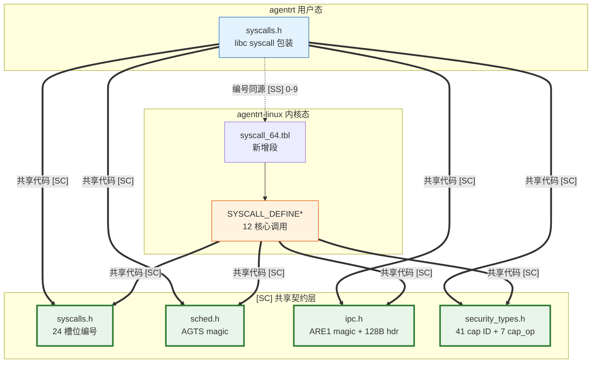

Copyright (c) 2025-2026 SPHARX Ltd. All Rights Reserved.

# 系统调用接口
> **文档定位**：agentrt-linux（AirymaxOS） 内核系统调用的分类、编号、C 接口、清单、性能约束与错误码\
> **文档版本**：0.1.1\
> **最后更新**：2026-07-11\
> **上级文档**：[agentrt-linux 设计文档](README.md)\
> **SSoT**：[120-cross-project-code-sharing.md §2.8](../50-engineering-standards/120-cross-project-code-sharing.md)（syscall 编号权威来源）

---

## 1. 系统调用分类

agentrt-linux 在 Linux 6.6 内核基线的标准系统调用之上，新增 Agent 感知专用系统调用。系统调用分为 **2 平面架构**：

### 1.1 控制面（12 核心 syscall）

| # | 平面 | 分类 | 核心 syscall | 借鉴来源 |
|---|------|------|-------------|---------|
| 1 | 控制面 | IPC 原语（8） | `airy_sys_call` / `send` / `recv` / `nbsend` / `nbrecv` / `reply_recv` / `yield` / `reply` | seL4 master 模式 8-activity syscall 模型 |
| 2 | 控制面 | 控制原语（3） | `airy_sys_rovol_ctl` / `sched_ctl` / `clt_notify` | agent 领域最小需求 |
| 3 | 控制面 | 通知原语（1） | `airy_sys_notify` | seL4 Notification 异步信号 |

> **说明**：LsmCtl（安全策略加载）与 WasmLoad（模块加载）已归入 `airy_sys_call` 统一 capability invocation 入口——通过 security capability 和 module capability 进行类型分发，无需独立 syscall。`airy_sys_reply` 完齐 seL4 master 模式 8 个 activity syscall（Reply 独立回复，无需等待下一条消息）。

### 1.2 数据面（io_uring，零 syscall）

| 路径类型 | 路径 | 延迟量级 | 用途 |
|---------|------|---------|------|
| 数据面（io_uring） | 用户态 → SQE → 内核 → CQE → 用户态 | ~10 μs | IPC 收发、记忆迁移、流式数据 |

- **IPC 数据面**：高频消息传递走 io_uring 零拷贝通道（共享内存 SQ/CQ ring），无需陷入内核。
- **控制面**：低频、需同步语义的操作（capability invocation、调度策略设置、认知阶段通知）走 syscall。

**设计原则**:

- **机制在内核，策略在用户态**：系统调用仅提供机制，策略由用户态通过 eBPF struct_ops 定义。
- **Capability invocation 统一入口**：`airy_sys_call` 替代 task_submit/cancel/status/capability_request/revoke/lsm_ctl/wasm_load 等独立 syscall，操作类型由 IPC 消息中的 capability 类型决定（seL4 风格）。
- **io_uring 优先**：高频路径（IPC 数据面、记忆迁移）走 io_uring 零拷贝通道，系统调用仅用于控制面。
- **最小完备集**：12 核心 syscall = seL4 8 IPC 原语 + agent 领域 3 控制原语 + 1 通知原语，无冗余。

### 1.3 调用路径

| 路径类型 | 路径 | 延迟量级 | 用途 |
|---------|------|---------|------|
| 控制面（syscall） | 用户态 → syscall → 内核 → 返回 | ~1 μs | capability invocation、策略设置、认知通知 |
| 数据面（io_uring） | 用户态 → SQE → 内核 → CQE → 用户态 | ~10 μs | IPC 收发、记忆迁移、流式数据 |

控制面用于低频、需同步语义的操作；数据面用于高频、可异步、需零拷贝的操作。二者配合实现"机制在内核、策略在用户态"的微内核目标。

### 1.4 Capability Invocation 模型

`airy_sys_call` 是统一的 capability invocation 入口，借鉴 seL4 的 `decodeInvocation` 模式：

```c
/* Unified capability invocation: seL4 Call style */
int ret = airy_sys_call(cap, &msg);
if (ret < 0) {
    log_write(LOG_ERROR, "cap invocation failed: errno=%d", ret);
    return ret;
}
```

- 操作类型（task_submit / capability_request / mint / revoke / lsm_policy_load / wasm_load 等）由 **capability 类型**决定，而非 syscall 编号。
- capability 通过 CNode 操作（Copy/Mint/Move/Revoke）在进程间传递，无需独立的 `capability_request` syscall。
- 安全策略加载通过 `airy_sys_call(security_cap, &msg)` 完成，Wasm 模块加载通过 `airy_sys_call(module_cap, &msg)` 完成。
- 详见 [02-ipc-protocol.md](02-ipc-protocol.md) 和 [120-cross-project-code-sharing.md §2.4](../50-engineering-standards/120-cross-project-code-sharing.md)。

**重构示例：应用 OS-KER-225 校验优先于修改**

以下将 agentrt-linux 的 `airy_sys_call` 内部 `decode_and_invoke` 函数按 OS-KER-225 原则重构——十一项校验全部完成后方执行 capability invocation，校验阶段零副作用：

```c
/*
 * airy_decode_and_invoke - 解码 capability invocation 并分派执行
 * @cap:    能力令牌
 * @msg:    IPC 消息（128B 头 + payload）
 *
 * 本函数是 airy_sys_call 的内部实现，展示 OS-KER-225 校验优先于修改的
 * agentrt-linux 落地模式。继承 seL4 decodeUntypedInvocation 的工程思想——
 * 全部校验在前、零副作用，修改在后、goto 清理。
 *
 * 适用规则：
 *   OS-KER-225  校验优先于修改——校验阶段零副作用
 *   OS-KER-001  goto 集中出口——执行阶段逆序释放
 *   OS-KER-222  毒化保护——cap 对象分配后 SLAB_POISON 写入 POISON_INUSE
 *   OS-KER-224  __free() 自动释放——临时缓冲区由编译器管理
 *   OS-BAN-002  禁止 BUG()——所有校验失败走 WARN_ON_ONCE + return -Exxx
 *
 * Return: 0 成功；-Exxx 失败
 */
static int airy_decode_and_invoke(cap_t cap,
                                   const struct airy_ipc_msg_hdr *msg)
{
        u32 op_type;
        u32 obj_type;
        int ret = 0;

        /*
         * ============================================================
         * 阶段 1：校验——纯读取，零副作用（OS-KER-225）
         * 共 11 项校验：
         *   校验 1-2：输入指针非空 + magic 验证
         *   校验 3-4：cap 合法性 + 类型
         *   校验 5-6：消息长度 + opcode 范围
         *   校验 7-8：权限检查 + 子能力约束
         *   校验 9-10：对象类型特定约束
         *   校验 11：资源可用性预检查
         * ============================================================
         */

        /* 校验 1：cap 非空 */
        if (!cap) {
                WARN_ON_ONCE(1);
                return -EINVAL;
        }

        /* 校验 2：消息头 magic 验证 */
        if (msg->magic != IPC_MAGIC_ARE1) {
                log_write(LOG_ERROR, "airy_decode_invoke: bad magic 0x%08x", msg->magic);
                return -EINVAL;
        }

        /* 校验 3：cap 类型必须在合法范围 */
        obj_type = cap_get_type(cap);
        if (obj_type >= AIRY_CAP_TYPE_COUNT) {
                log_write(LOG_ERROR, "airy_decode_invoke: invalid cap type %u", obj_type);
                return -EINVAL;
        }

        /* 校验 4：cap 必须处于有效状态（未被撤销） */
        if (!cap_is_valid(cap)) {
                log_write(LOG_ERROR, "airy_decode_invoke: cap revoked");
                return -EACCES;
        }

        /* 校验 5：消息长度 >= 128B 最小头 */
        if (msg->hdr_len < IPC_HDR_MIN_SIZE || msg->hdr_len > IPC_HDR_MAX_SIZE) {
                log_write(LOG_ERROR, "airy_decode_invoke: bad hdr_len %u", msg->hdr_len);
                return -EMSGSIZE;
        }

        /* 校验 6：opcode 范围检查 */
        op_type = msg->opcode & IPC_OP_MASK;
        if (op_type >= AIRY_CAP_OP_COUNT) {
                log_write(LOG_ERROR, "airy_decode_invoke: invalid opcode %u", op_type);
                return -EINVAL;
        }

        /* 校验 7：权限检查——调用者是否有权操作此 cap */
        if (!cap_has_rights(cap, op_type_to_rights(op_type))) {
                log_write(LOG_ERROR, "airy_decode_invoke: insufficient rights");
                return -EPERM;
        }

        /* 校验 8：CNode 操作的特殊约束——不允许在自身子能力上进行危险操作 */
        if (obj_type == AIRY_CAP_CNODE &&
            !cnode_op_is_allowed(cap, op_type)) {
                log_write(LOG_ERROR, "airy_decode_invoke: CNode op not allowed");
                return -ENOTSUP;
        }

        /* 校验 9：对象类型-操作兼容性检查 */
        if (!cap_op_compatible(obj_type, op_type)) {
                log_write(LOG_ERROR, "airy_decode_invoke: type %u op %u incompatible",
                          obj_type, op_type);
                return -EINVAL;
        }

        /* 校验 10：Untyped Retype —— 验证 FreeIndex 空间是否充足（纯读取） */
        if (obj_type == AIRY_CAP_UNTYPED && op_type == AIRY_CAP_OP_RETYPE) {
                u32 free_bytes = cap_untyped_get_free_bytes(cap);
                u32 need_bytes = msg->obj_count * (1u << msg->obj_size_bits);
                if (need_bytes > free_bytes) {
                        log_write(LOG_ERROR,
                                  "airy_decode_invoke: untyped retype needs %u, has %u",
                                  need_bytes, free_bytes);
                        return -ENOMEM;
                }
        }

        /* 校验 11：安全检查——LSM hook（纯读取，不修改状态） */
        {
                u32 sec_ret;
                sec_ret = security_cap_invoke_check(cap, op_type, msg);
                if (sec_ret) {
                        log_write(LOG_ERROR, "airy_decode_invoke: LSM denied (ret=%d)",
                                  sec_ret);
                        return -EACCES;
                }
        }

        /*
         * ============================================================
         * 阶段 2：执行——全部校验通过，开始实际的 capability invocation
         * 使用 __free() 自动释放临时对象（OS-KER-224）
         * ============================================================
         */

        /* dispatch 对象自动管理——kmem_cache_zalloc 写入 POISON_INUSE（OS-KER-222） */
        __free(kfree) struct airy_invoke_ctx *ctx = NULL;

        ctx = kmem_cache_zalloc(invoke_ctx_cache, GFP_KERNEL);
        if (!ctx)
                return -ENOMEM;

        ctx->cap     = cap;
        ctx->op_type = op_type;
        ctx->msg     = msg;

        /* 调用类型分派表执行实际操作 */
        ret = cap_op_dispatch[obj_type][op_type](ctx);
        if (ret)
                log_write(LOG_ERROR, "airy_decode_invoke: dispatch failed, ret=%d", ret);

        return ret;
        /* ctx 在 return 时通过 __free(kfree) 自动释放 —— OS-KER-224 */
}
```

> **设计说明**：此重构将原分散在 `do_*_invoke` 各子函数中的校验逻辑集中到 `airy_decode_and_invoke` 统一校验阶段，确保：
> - 校验 1-11 全部为纯读取操作，不分配内存，不修改全局状态
> - 校验失败直接 `return -Exxx`，无需 goto 清理
> - 校验通过后才进入执行阶段——分配 `invoke_ctx`（kmem_cache_zalloc + POISON_INUSE）
> - 临时对象通过 `__free(kfree)` 编译器自动释放

---

## 2. 系统调用编号规则

### 2.1 命名前缀

所有 agentrt-linux 专用系统调用 C 符号使用小写 `airy_sys_` 前缀，编号宏使用 `AIRY_SYS_` 前缀（SSoT 定义于 `120-cross-project-code-sharing.md §2.8`）。

| 前缀 | 用途 | 示例 |
|------|------|------|
| `AIRY_SYS_CALL` | 统一 capability invocation | `airy_sys_call` |
| `AIRY_SYS_SEND` / `AIRY_SYS_RECV` | 同步 IPC 原语 | `airy_sys_send` / `airy_sys_recv` |
| `AIRY_SYS_NBSEND` / `AIRY_SYS_NBRECV` | 非阻塞 IPC 原语 | `airy_sys_nbsend` / `airy_sys_nbrecv` |
| `AIRY_SYS_REPLY_RECV` | 回复并接收下一条 | `airy_sys_reply_recv` |
| `AIRY_SYS_YIELD` | 让出 CPU | `airy_sys_yield` |
| `AIRY_SYS_ROVOL_CTL` | 记忆卷载控制 | `airy_sys_rovol_ctl` |
| `AIRY_SYS_SCHED_CTL` | 调度策略控制 | `airy_sys_sched_ctl` |
| `AIRY_SYS_CLT_NOTIFY` | CoreLoopThree 通知 | `airy_sys_clt_notify` |
| `AIRY_SYS_REPLY` | 独立回复（不等待） | `airy_sys_reply` |
| `AIRY_SYS_NOTIFY` | 异步通知信号 | `airy_sys_notify` |

### 2.2 编号分配

agentrt-linux 专用系统调用采用 **12 核心 + 12 预留 = 24 槽位** 方案：

| 编号 | 符号 | 分类 | 说明 |
|------|------|------|------|
| 0 | `AIRY_SYS_CALL` | IPC 原语 | 统一 capability invocation（seL4 Call，含 LSM/Wasm 加载） |
| 1 | `AIRY_SYS_SEND` | IPC 原语 | 阻塞同步发送 |
| 2 | `AIRY_SYS_RECV` | IPC 原语 | 阻塞同步接收 |
| 3 | `AIRY_SYS_NBSEND` | IPC 原语 | 非阻塞发送 |
| 4 | `AIRY_SYS_NBRECV` | IPC 原语 | 非阻塞接收 |
| 5 | `AIRY_SYS_REPLY_RECV` | IPC 原语 | 回复并等待下一条 |
| 6 | `AIRY_SYS_YIELD` | IPC 原语 | 让出 CPU |
| 7 | `AIRY_SYS_ROVOL_CTL` | 控制原语 | 记忆卷载控制（snapshot/restore/migrate/tier） |
| 8 | `AIRY_SYS_SCHED_CTL` | 控制原语 | 调度策略配置（set/get） |
| 9 | `AIRY_SYS_CLT_NOTIFY` | 控制原语 | CoreLoopThree 阶段通知 + kthread 注册 |
| 10 | `AIRY_SYS_REPLY` | IPC 原语 | 独立回复（不等待下一条，seL4 Reply） |
| 11 | `AIRY_SYS_NOTIFY` | 通知原语 | 异步通知信号（seL4 Notification） |
| 12-23 | 预留 | — | 未来扩展 |

**内部编号 → Linux syscall_64.tbl 注册号映射**：

agentrt-linux 新增 syscall 在 Linux 内核 `arch/x86/entry/syscalls/syscall_64.tbl` 中注册于 512 起始的预留区间。下表为内部编号与 Linux 注册号的完整映射：

| 内部编号 | 符号 | Linux 注册号 | syscall_64.tbl 条目 |
|---------|------|-------------|-------------------|
| 0 | `AIRY_SYS_CALL` | 512 | `512  common  airy_sys_call      sys_airy_sys_call` |
| 1 | `AIRY_SYS_SEND` | 513 | `513  common  airy_sys_send      sys_airy_sys_send` |
| 2 | `AIRY_SYS_RECV` | 514 | `514  common  airy_sys_recv      sys_airy_sys_recv` |
| 3 | `AIRY_SYS_NBSEND` | 515 | `515  common  airy_sys_nbsend    sys_airy_sys_nbsend` |
| 4 | `AIRY_SYS_NBRECV` | 516 | `516  common  airy_sys_nbrecv    sys_airy_sys_nbrecv` |
| 5 | `AIRY_SYS_REPLY_RECV` | 517 | `517  common  airy_sys_reply_recv sys_airy_sys_reply_recv` |
| 6 | `AIRY_SYS_YIELD` | 518 | `518  common  airy_sys_yield     sys_airy_sys_yield` |
| 7 | `AIRY_SYS_ROVOL_CTL` | 519 | `519  common  airy_sys_rovol_ctl sys_airy_sys_rovol_ctl` |
| 8 | `AIRY_SYS_SCHED_CTL` | 520 | `520  common  airy_sys_sched_ctl sys_airy_sys_sched_ctl` |
| 9 | `AIRY_SYS_CLT_NOTIFY` | 521 | `521  common  airy_sys_clt_notify sys_airy_sys_clt_notify` |
| 10 | `AIRY_SYS_REPLY` | 522 | `522  common  airy_sys_reply     sys_airy_sys_reply` |
| 11 | `AIRY_SYS_NOTIFY` | 523 | `523  common  airy_sys_notify    sys_airy_sys_notify` |
| 12-23 | 预留 | 524-535 | 预留（`524-535 common airy_sys_reserved_*`） |

> **映射原则**：内部编号（0-11）仅用于文档和 ABI 头文件中的符号常量定义；Linux 注册号（512-535）用于 `syscall_64.tbl` 注册。两者之间为固定偏移 `+512` 关系，由 `syscalls.h` [SC] 头文件通过 `#define __NR_airy_sys_call 512` 锁定。

**设计依据**：借鉴 seL4 syscall 极简模型（源码证据 `libsel4/include/api/syscall.xml:11-37`）：

- **seL4 master 模式：8 个 API syscall**（`Call/ReplyRecv/Send/NBSend/Recv/NBRecv/Reply/Yield`）
- **seL4 MCS 模式：11 个 API syscall**（master 8 个中替换 `Reply` 为 `Wait/NBWait`，新增 `NBSendRecv/NBSendWait`）

agentrt-linux 采用 master 模式 8 个 IPC 原语作为"seL4 风格基础"（`airy_sys_call/airy_sys_send/airy_sys_recv/airy_sys_nbsend/airy_sys_nbrecv/airy_sys_reply_recv/airy_sys_yield/airy_sys_reply`，与 seL4 master 模式 8 个一一对应）；**不引入 MCS 模式**（agent 场景不需要 MCS 的 `reply_t` 对象与 `schedcontext` 模型，由 `airy_ep->lock` 临界区串行执行保证原子性，详见 `30-interfaces/02-ipc-protocol.md` §4.8）。

在 seL4 master 8 原语基础上，agentrt-linux 扩展 4 个 agent 领域控制原语（`AIRY_SYS_ROVOL_CTL/AIRY_SYS_SCHED_CTL/AIRY_SYS_CLT_NOTIFY/AIRY_SYS_NOTIFY`），覆盖 agent 领域最小需求（记忆卷载、调度策略、认知通知、异步事件信号）。LsmCtl 与 WasmLoad 通过 capability invocation 归入 `airy_sys_call`。数据面 I/O 完全由 io_uring 处理（零 syscall）。

**总计：8 seL4 风格 IPC 原语 + 4 agent 扩展控制原语 = 12 核心 syscall**，符合 §2.2"12 核心 + 12 预留 = 24 槽位"分配（从原 v0.6.0 的 120 槽位缩减 80%）。

### 2.3 ABI 稳定性

- 编号在 MAJOR 版本内不可变更。
- 新增调用只能追加到预留段末尾（12-23），不可复用已废弃编号。
- 废弃调用保留编号但返回 `-AIRY_ENOSYS`，并在 Doxygen 注释中标注 `@deprecated`。

---

## 3. C 接口定义

所有系统调用通过 `AIRY_API` 宏导出，遵循 Linux 内核编码规范（Tab=8, snake_case, kernel-doc 注释）。头文件位置：`kernel/include/uapi/airy_syscalls.h`。

### 3.1 导出宏

```c
/* airy_api.h */
#if defined(__GNUC__) && __GNUC__ >= 4
    #define AIRY_API __attribute__((visibility("default")))
#else
    #define AIRY_API
#endif
```

> **类型说明**：下述 syscall 签名中的 `cap_t` 为 capability 引用句柄类型（`typedef uint64_t cap_t`），定义于 [SC] 共享头文件 `include/airymax/security_types.h`。详见 [20-modules/03-security.md §4.1](../20-modules/03-security.md)。

### 3.2 IPC 原语（7 个）

```c
/**
 * airy_sys_call - Unified capability invocation (seL4 Call)
 * @cap: Capability to invoke.
 * @msg: IPC message (128B header + payload).
 *
 * This is the single entry point for all capability-based operations.
 * The capability type determines the operation dispatch (cap-type dispatch).
 * Operations include: task submit/cancel/status, capability mint/revoke/derive,
 * IPC rendezvous, LSM policy load, Wasm module load, and notification delivery.
 *
 * Return: 0 on success, negative errno on failure.
 *
 * @since 1.0.1
 * @see enum airy_cap_op
 */
AIRY_API int airy_sys_call(cap_t cap,
                                 const struct airy_ipc_msg_hdr *msg);

/**
 * airy_sys_send - Blocking synchronous send
 * @cap: Endpoint capability.
 * @msg: IPC message to send.
 *
 * Blocks until the message is delivered to a receiver (rendezvous).
 *
 * Return: 0 on success, negative errno on failure.
 */
AIRY_API int airy_sys_send(cap_t cap,
                                 const struct airy_ipc_msg_hdr *msg);

/**
 * airy_sys_recv - Blocking synchronous receive
 * @cap: Endpoint capability.
 * @msg: IPC message buffer for received data.
 *
 * Blocks until a sender delivers a message.
 *
 * Return: 0 on success, negative errno on failure.
 */
AIRY_API int airy_sys_recv(cap_t cap,
                                 struct airy_ipc_msg_hdr *msg);

/**
 * airy_sys_nbsend - Non-blocking send
 * @cap: Endpoint capability.
 * @msg: IPC message to send.
 *
 * Returns immediately; if no receiver is waiting, returns -AIRY_EAGAIN.
 *
 * Return: 0 on success, negative errno on failure.
 */
AIRY_API int airy_sys_nbsend(cap_t cap,
                                   const struct airy_ipc_msg_hdr *msg);

/**
 * airy_sys_nbrecv - Non-blocking receive
 * @cap: Endpoint capability.
 * @msg: IPC message buffer for received data.
 *
 * Returns immediately; if no sender is waiting, returns -AIRY_EAGAIN.
 *
 * Return: 0 on success, negative errno on failure.
 */
AIRY_API int airy_sys_nbrecv(cap_t cap,
                                   struct airy_ipc_msg_hdr *msg);

/**
 * airy_sys_reply_recv - Reply to current message and wait for next
 * @cap: Reply capability.
 * @reply: Reply message to send.
 * @recv: Buffer for next received message.
 *
 * Combined reply + receive in one syscall (seL4 ReplyRecv).
 *
 * Return: 0 on success, negative errno on failure.
 */
AIRY_API int airy_sys_reply_recv(cap_t cap,
                                       const struct airy_ipc_msg_hdr *reply,
                                       struct airy_ipc_msg_hdr *recv);

/**
 * airy_sys_yield - Yield CPU
 *
 * Voluntarily yields the CPU to the scheduler. Used by cooperative
 * scheduling and idle loops.
 *
 * Return: 0 on success.
 */
AIRY_API int airy_sys_yield(void);

/**
 * airy_sys_reply - Reply to current message without waiting (seL4 Reply)
 * @reply: Reply capability.
 * @msg: Reply message to send.
 *
 * Sends a reply to the caller without blocking for a new message.
 * Used when the server has no more work to accept immediately.
 * Unlike ReplyRecv, this does not wait for the next message.
 *
 * Return: 0 on success, negative errno on failure.
 *
 * @since 1.0.1
 */
AIRY_API int airy_sys_reply(cap_t reply,
                                  const struct airy_ipc_msg_hdr *msg);
```

### 3.3 控制原语（3 个）

```c
/**
 * airy_sys_rovol_ctl - Memory snapshot/restore/migrate/tier control
 * @op: Operation (0=snapshot, 1=restore, 2=migrate, 3=tier_set).
 * @pid: Target process ID.
 * @arg: Operation-specific argument (snapshot_id / tier_level / etc.).
 *
 * Unified memory control interface covering MemoryRovol L1-L4 operations.
 *
 * Return: 0 on success, negative errno on failure.
 *
 * @since 1.0.1
 */
AIRY_API int airy_sys_rovol_ctl(uint32_t op, uint32_t pid,
                                      uint64_t arg);

/**
 * airy_sys_sched_ctl - Scheduling policy configuration
 * @op: Operation (0=set, 1=get).
 * @cgroup_path: Target cgroup path.
 * @policy: Policy name (scx_realtime / scx_batch / scx_interactive / scx_agent).
 *
 * Unified scheduling control via user-space scheduler (Scheme C-Prime).
 *
 * Return: 0 on success, negative errno on failure.
 *
 * @since 1.0.1
 */
AIRY_API int airy_sys_sched_ctl(uint32_t op,
                                      const char *cgroup_path,
                                      const char *policy);

/**
 * airy_sys_clt_notify - CoreLoopThree phase notification + kthread control
 * @task_id: Agent task ID (0 for kthread register).
 * @phase: Phase (0=perception, 1=thinking, 2=action) or kthread op.
 *
 * Notifies the kernel of CoreLoopThree phase transitions and
 * manages kthread registration for the cognition data flow.
 *
 * Return: 0 on success, negative errno on failure.
 *
 * @since 1.0.1
 */
AIRY_API int airy_sys_clt_notify(int task_id, uint32_t phase);
```

### 3.4 通知原语（1 个）

```c
/**
 * airy_sys_notify - Async notification signal (seL4 Notification)
 * @cap: Notification capability.
 *
 * Signals a notification object. Wakes any waiting agents.
 * Binary semaphore semantics: signal sets the notification,
 * wait (via airy_sys_call with notification cap) clears it atomically.
 *
 * Return: 0 on success, negative errno on failure.
 *
 * @since 1.0.1
 */
AIRY_API int airy_sys_notify(cap_t cap);
```

---

## 4. 系统调用清单

下表列出 12 个核心系统调用，覆盖 8 子仓能力入口。

| 编号 | 调用名 | 分类 | 覆盖子仓 | 说明 |
|------|--------|------|---------|------|
| 0 | `airy_sys_call` | IPC 原语 | kernel / security / cognition | 统一 capability invocation（替代 task_submit/cancel/status/capability_request/revoke/lsm_ctl/wasm_load） |
| 1 | `airy_sys_send` | IPC 原语 | kernel / services | 阻塞同步 IPC 发送 |
| 2 | `airy_sys_recv` | IPC 原语 | kernel / services | 阻塞同步 IPC 接收 |
| 3 | `airy_sys_nbsend` | IPC 原语 | kernel / services | 非阻塞 IPC 发送 |
| 4 | `airy_sys_nbrecv` | IPC 原语 | kernel / services | 非阻塞 IPC 接收 |
| 5 | `airy_sys_reply_recv` | IPC 原语 | kernel / services | 回复并接收下一条（seL4 ReplyRecv） |
| 6 | `airy_sys_yield` | IPC 原语 | kernel | 让出 CPU |
| 7 | `airy_sys_rovol_ctl` | 控制原语 | memory | 统一记忆卷载控制（snapshot/restore/migrate/tier） |
| 8 | `airy_sys_sched_ctl` | 控制原语 | kernel | 统一调度策略配置（set/get） |
| 9 | `airy_sys_clt_notify` | 控制原语 | cognition | CoreLoopThree 阶段通知 + kthread 注册 |
| 10 | `airy_sys_reply` | IPC 原语 | kernel / services | 独立回复（seL4 Reply，不等待下一条） |
| 11 | `airy_sys_notify` | 通知原语 | kernel / services | 异步通知信号（seL4 Notification） |

**数据面**：IPC 高频收发、记忆迁移、流式数据全部走 io_uring（零 syscall），不占用 syscall 槽位。

---

## 5. 系统调用性能约束

系统调用性能约束对齐非功能性需求 NFR-P-001（详见 [00-requirements/03-non-functional-requirements.md](../00-requirements/03-non-functional-requirements.md)）。

### 5.1 NFR-P-001 调度延迟

| 约束 ID | 指标 | 阈值 | 测量方法 |
|---------|------|------|---------|
| NFR-P-001 | Agent 任务调度延迟 | < 100 ms（P99） | `airy_sys_call` capability invocation 到任务首次执行 |
| NFR-P-001a | 系统调用本身开销 | < 1 μs（P99） | strace + perf 测量 |
| NFR-P-001b | io_uring IPC 往返延迟 | < 10 μs（P99） | io_uring SQE 提交到 CQE 完成 |

### 5.2 调度路径优化

- **方案 C-Prime 调度**：通过用户态调度器（方案 C-Prime：SCHED_DEADLINE/SCHED_FIFO/EEVDF + seL4 MCS 映射）实现 Agent 调度策略，零内核调度器修改。
- **EEVDF 调度器**：Linux 6.6 原生 EEVDF 调度器提供混合抢占模式，兼顾吞吐与响应。
- **CoreLoopThree 阶段感知**：`airy_sys_clt_notify` 在思考阶段提升优先级，行动阶段恢复正常，减少关键路径抢占。

### 5.3 性能回归保护

- 每次提交运行 `tests-linux/benchmark/sched-latency` 微基准。
- 与基线对比，调度延迟退化 > 5% 自动打回（详见 [20-modules/08-tests-linux.md](../20-modules/08-tests-linux.md) 第 4.6 节）。

### 5.4 性能剖析方法

系统调用性能剖析基于 Linux 6.6 原生可观测性能力，遵循 E-2 可观测性原则：

| 工具 | 用途 | 示例 |
|------|------|------|
| `perf trace` | 系统调用延迟直方图 | `perf trace -e airy_sys_* --summary` |
| `bpftrace` | 动态追踪系统调用参数与耗时 | `bpftrace -e 'tracepoint:airymax:sys_call { ... }'` |
| `perf stat` | 调度器与 cache 事件计数 | `perf stat -e sched:* airymaxctl bench ipc` |
| `io_uring-bench` | io_uring IPC 吞吐基准 | `io_uring-bench --zerocopy --msg-size 128` |

剖析结果通过 OpenTelemetry Metrics 导出，与 `cloudnative/observability` 集成，形成持续性能基线。

### 5.5 优先级与延迟预算

agentrt-linux 为不同 Agent 任务类别定义延迟预算（latency budget），由用户态调度器策略（方案 C-Prime）强制：

| 任务类别 | cgroup | 优先级范围 | 延迟预算（P99） | 典型场景 |
|---------|---------|-----------|----------------|---------|
| 实时控制 | `realtime.slice` | 0-49 | < 1 ms | 具身智能运动控制 |
| 交互响应 | `interactive.slice` | 50-99 | < 10 ms | 用户对话补全 |
| Agent 认知 | `agent.slice` | 100-119 | < 100 ms | CoreLoopThree 思考 |
| 批处理推理 | `batch.slice` | 120-139 | < 1 s | LLM 批量推理 |

超出延迟预算的任务由 sub-scheduler 触发 `AIRY_ETIMEDOUT` 错误码，由 SDK 层按重试策略处理（详见 [03-sdk-api.md](03-sdk-api.md) 第 7 章）。

---

## 6. 错误码定义

错误码对齐 `include/airymax/error.h`（[SC] 补充共享头文件，SSoT 权威定义见 `180-i18n/03-error-message-i18n.md` §2.2），与 agentrt 同源且部分代码共享（IRON-9 v2）。错误码统一使用 `AIRY_E*` 前缀，负值返回。以下为 SSoT 引用，权威定义见 `include/airymax/error.h`，不得另起定义。

| 错误码 | 值 | 含义 | 触发场景 |
|--------|-----|------|---------|
| `AIRY_EOK` | 0 | 成功 | 调用成功 |
| `AIRY_EINVAL` | -1 | 无效参数 | 参数为 NULL 或非法值 |
| `AIRY_ENOMEM` | -2 | 内存不足 | 内核分配失败 |
| `AIRY_ENOSYS` | -3 | 未实现 | 编号未实现或已废弃 |
| `AIRY_EPERM` | -4 | 权限不足 | capability 令牌缺失 |
| `AIRY_ENOENT` | -5 | 资源不存在 | 任务 ID / 快照 ID 不存在 |
| `AIRY_EAGAIN` | -6 | 重试 | io_uring 队列满，需重试 |
| `AIRY_EMSGSIZE` | -7 | 消息过大 | payload 超过最大长度 |
| `AIRY_EBADF` | -8 | 描述符错误 | ring fd / capability 句柄无效 |
| `AIRY_EBUSY` | -9 | 资源繁忙 | 任务正在迁移，无法快照 |
| `AIRY_ENOTSUP` | -10 | 不支持 | 硬件不支持（如无 CXL 设备） |
| `AIRY_ETIMEDOUT` | -11 | 超时 | 调度等待超时 |
| `AIRY_ECONFLICT` | -12 | 状态冲突 | 任务状态不允许当前操作 |

### 6.1 错误码使用规范

```c
/* 正确：检查返回值并传递错误码 */
int ret = airy_sys_call(cap, &msg);
if (ret < 0) {
    log_write(LOG_ERROR, "call failed: errno=%d (%s)",
              ret, airy_strerror(ret));
    return ret;
}
```

### 6.2 错误码转换

- 与 Linux 标准 `errno` 的转换通过 `airy_errno_to_linux()` 工具函数完成。
- 与 agentrt 应用层错误码的转换通过 `airy_errno_to_app()` 工具函数完成。
- 转换表在 `include/airymax/error.h` 中以静态数组定义，便于维护。

### 6.3 错误码稳定性

- `AIRY_E*` 错误码值在 MAJOR 版本内不可变更。
- 新增错误码只能追加到末尾，不可复用已废弃值。
- 错误码字符串描述通过 `airy_strerror()` 提供，与 agentrt 同源保持描述一致。

---

## 7. 相关文档

- [接口设计](README.md)
- [IPC 协议](02-ipc-protocol.md)
- [SDK API](03-sdk-api.md)
- [编码规范](04-coding-standard.md)
- [内核设计](../20-modules/01-kernel.md)
- [安全设计](../20-modules/03-security.md)
- [非功能性需求](../00-requirements/03-non-functional-requirements.md)（NFR-P-001）
- [SSoT syscall 编号](../50-engineering-standards/120-cross-project-code-sharing.md)（§2.8）

---

## 8. IRON-9 v2 三层共享模型

> **OS-IFACE-001**： 系统调用接口遵循 IRON-9 v2 三层共享模型——agentrt 用户态 `syscalls.h` 与 agentrt-linux 内核 `airy_syscalls.h` 的编号、签名、错误码通过 [SC] 共享契约层头文件同源；syscall 表注册、`SYSCALL_DEFINE*` 宏、capability 守卫实现各自独立。禁止在用户态与内核态之间引入 syscall 号映射表或编号转换层。

### 8.1 三层模型概览

| 层次 | 共享程度 | 本接口涉及内容 |
|------|---------|---------------|
| **[SC] 共享契约层** | 完全共享代码 | `syscalls.h`（12 核心 + 12 预留 = 24 槽位编号）+ `sched.h`（任务描述符 magic 0x41475453 'AGTS'、优先级 0-139）+ `ipc.h`（IPC magic 0x41524531 'ARE1'、`struct airy_ipc_msg_hdr`）+ `security_types.h`（capability 41 ID + cap_op 7 操作）+ `memory_types.h`（MemoryRovol L1-L4）+ `cognition_types.h`（三阶段枚举） |
| **[SS] 语义同源层** | 操作模式同源，签名独立演进 | agentrt `syscalls.h`（用户态 libc syscall 包装）↔ agentrt-linux `airy_syscalls.h`（内核 `SYSCALL_DEFINE*`）12 核心同源 |
| **[IND] 完全独立层** | 完全独立 | agentrt 跨平台 syscall 封装（Linux/macOS/Windows 三平台）↔ agentrt-linux 内核 syscall 表注册（`arch/x86/entry/syscalls/syscall_64.tbl` 新增段） |

### 8.2 [SC] 共享契约层——头文件在系统调用接口中的角色

| 头文件 | 在系统调用中的角色 | 消费方 |
|--------|-------------------|--------|
| `syscalls.h` | Syscall 编号体系（12 核心 + 12 预留 = 24 槽位） | 全部 12 个 syscall |
| `sched.h` | `struct airy_task_desc` 任务描述符（magic 0x41475453 'AGTS'）+ 优先级 0-139 + MAC_MAX_AGENTS=1024 | `airy_sys_call` / `airy_sys_sched_ctl` |
| `ipc.h` | `struct airy_ipc_msg_hdr` 128B 消息头（magic 0x41524531 'ARE1'）+ opcode + flags | `airy_sys_call` / `airy_sys_send` / `airy_sys_recv` 等 |
| `security_types.h` | capability 41 ID + cap_op 7 操作（Copy/Mint/Move/Mutate/Revoke/Delete/Rotate） | `airy_sys_call`（security capability invocation） |
| `memory_types.h` | MemoryRovol L1-L4 快照结构 + snapshot_id 布局 | `airy_sys_rovol_ctl` |
| `cognition_types.h` | CoreLoopThree 三阶段枚举（PERCEPTION/THINKING/ACTION） | `airy_sys_clt_notify` |

### 8.3 [SS] 语义同源层——agentrt ↔ agentrt-linux 系统调用映射

| agentrt 用户态（syscalls.h） | agentrt-linux 内核（SYSCALL_DEFINE） | 同源签名 | 实现差异 |
|------------------------------|--------------------------------------|---------|---------|
| `airy_sys_call()` | `SYSCALL_DEFINE2(airy_call, ...)` | `(cap_t, const struct airy_ipc_msg_hdr *) -> int` | 用户态 libc syscall() vs 内核 capability dispatch |
| `airy_sys_send()` | `SYSCALL_DEFINE2(airy_send, ...)` | `(cap_t, const struct airy_ipc_msg_hdr *) -> int` | 用户态 POSIX MQ vs 内核 io_uring SQE |
| `airy_sys_recv()` | `SYSCALL_DEFINE2(airy_recv, ...)` | `(cap_t, struct airy_ipc_msg_hdr *) -> int` | 用户态 mq_receive vs 内核 io_uring CQE |
| `airy_sys_rovol_ctl()` | `SYSCALL_DEFINE3(airy_rovol_ctl, ...)` | `(uint32_t, uint32_t, uint64_t) -> int` | 用户态 mmap+msync vs 内核 PMEM |
| `airy_sys_clt_notify()` | `SYSCALL_DEFINE2(airy_clt_notify, ...)` | `(int, uint32_t) -> int` | 用户态 event loop vs 内核 kthread |

### 8.4 [IND] 完全独立层

| 独立项 | agentrt 实现 | agentrt-linux 实现 | 独立原因 |
|--------|-------------|-------------------|---------|
| syscall 表注册 | 无（用户态直接 libc syscall()） | `syscall_64.tbl` 新增段 | 跨平台约束 |
| ABI 稳定性 | 编译期符号绑定 | 内核 syscall 号绑定（MAJOR 锁定） | 工具链差异 |
| 错误码返回 | `AIRY_E*` 负值（用户态 errno 互转） | `AIRY_E*` 负值（内核 IS_ERR_VALUE） | errno 语义差异 |
| 调用入口 | `airy_syscalls.h`（CMake 安装） | `uapi/airy_syscalls.h`（Kbuild 导出） | 构建系统差异 |

### 8.5 跨态协作流



> **OS-IFACE-002**： 系统调用编号 0-9 段在 agentrt 用户态（`syscalls.h` 宏定义）与 agentrt-linux 内核态（`syscall_64.tbl` 表项）保持二进制一致——同一编号在两侧语义完全相同，禁止在用户态引入编号重映射。`AIRY_E*` 错误码在两侧同源，用户态通过 `airy_errno_to_linux()` 互转，但 syscall 返回值本身不转换。

---

© 2025-2026 SPHARX Ltd. All Rights Reserved.