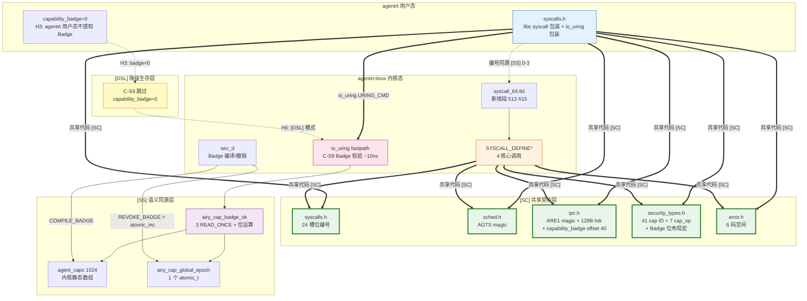

Copyright (c) 2025-2026 SPHARX Ltd. All Rights Reserved.

# 系统调用接口
> **文档定位**：agentrt-linux（AirymaxOS） 内核系统调用的分类、编号、C 接口、清单、性能约束与错误码\
> **文档版本**：v1.1（Capability Folding 集成版）\
> **最后更新**：2026-07-18\
> **上级文档**：[agentrt-linux 设计文档](README.md)\
> **SSoT**：[120-cross-project-code-sharing.md §2.8](../50-engineering-standards/120-cross-project-code-sharing.md)（syscall 编号权威来源）

---

> **Capability Folding 工程定义**（v1.1 新增）：A-IPC 采用 Capability Folding 设计模式——将 capability check 从独立控制面 syscall"折叠"到 IPC 数据面 fastpath 中。物理载体是 [SC] `ipc.h` Layout C v4 消息头 offset 40-47 的 `capability_badge` 字段（64-bit Native Word：Epoch + Random Tag + Perms）；执行点是 fastpath C-S9 内联校验 `airy_cap_badge_ok()`（~10ns，3 个 `READ_ONCE` + 位运算 + 比较，详见 [07-ipc-fastpath.md §3.1.1](07-ipc-fastpath.md)）。本设计直接后果：syscall 数从 12 精简为 4，8 个 seL4 风格 IPC 原语全部移除，IPC 数据传递完全由 io_uring 数据面承载。
>
> **6 条硬约束 H1-H6**（v1.1 新增，源自 Capability Folding 决策）：H1 Layout C v4 总长 128B/magic 0x41524531；H2 `capability_badge` 进 [SC] 但校验属 [SS]；H3 agentrt 用户态 `capability_badge=0`；H4 agentrt-linux 内核 Badge 由 sec_d 编译、C-S9 校验；H5 纯 C LSM 职责不变、Badge 校验是 fastpath 内联；H6 [DSL] 降级模式 `capability_badge=0` 跳过 C-S9。详见 [02-ipc-protocol.md §2.6](02-ipc-protocol.md)。

---

## 1. 系统调用分类

agentrt-linux 在 Linux 6.6 内核基线的标准系统调用之上，新增 Agent 感知专用系统调用。v1.1 起，A-IPC 采用 **Capability Folding 单平面架构**：控制面仅保留 4 个低频管理 syscall，IPC 数据传递与能力校验全部折叠到 io_uring 数据面 fastpath（C-S9 内联 Badge 校验）。

### 1.1 控制面（4 核心 syscall）

| # | 分类 | syscall | 职责 | 借鉴来源 |
|---|------|---------|------|---------|
| 1 | Capability Invocation | `airy_sys_call` | sec_d 编译/撤销 Badge、LSM 策略加载、Wasm 模块加载（cap-type dispatch） | seL4 Call + Capability 模型 |
| 2 | 控制原语 | `airy_sys_rovol_ctl` | MemoryRovol L1-L4 控制（snapshot/restore/migrate/tier） | agent 领域最小需求 |
| 3 | 控制原语 | `airy_sys_sched_ctl` | sched_tac 调度策略配置（set/get） | agent 领域最小需求 |
| 4 | 控制原语 | `airy_sys_clt_notify` | CoreLoopThree 阶段通知 + kthread 注册 | agent 领域最小需求 |

> **设计说明**：v1.1 相对 0.1.1 的根本变化——8 个 seL4 风格 IPC 原语（send/recv/nbsend/nbrecv/reply_recv/yield/reply/notify）全部移除，IPC 数据传递完全由 io_uring `IORING_OP_URING_CMD` 承载（见 §1.3）；能力校验折叠到数据面 fastpath C-S9（见 [07-ipc-fastpath.md §3.1.1](07-ipc-fastpath.md)）；原 `airy_sys_call` 的 IPC rendezvous 语义被 Capability Folding 取代，仅保留 Badge 编译/撤销/LSM_ctl/Wasm_load 等 sec_d 专属管理操作。详细 12→4 映射见 §2.2。

### 1.2 数据面（io_uring，零 syscall）

| 路径类型 | 路径 | 延迟量级 | 用途 |
|---------|------|---------|------|
| 数据面（io_uring） | 用户态 → SQE → `IORING_OP_URING_CMD` → 内核 fastpath → CQE → 用户态 | ~158ns（FAST_SEND，含 C-S9 Badge 校验） | IPC 收发 + 内联能力校验 |
| 数据面（io_uring） | 用户态 → SQE → `IORING_OP_URING_CMD` → io-wq → CQE → 用户态 | ~600ns-5.5μs（SLOW_SEND） | IPC 异步回退、payload 路径、跨 CPU 投递 |
| 数据面（kfifo） | 内核 kthread A → per-cpu kfifo → kthread B | ~80ns（per-cpu 无锁） | kthread 间消息传递 |

- **IPC 数据面**：高频消息传递走 io_uring 零拷贝通道，fastpath 内联 C-S9 Capability Folding Badge 校验，IPC 数据传递即能力校验。
- **控制面**：低频、需同步语义的管理操作（sec_d Badge 编译、调度策略设置、认知阶段通知、MemoryRovol 控制）走 syscall，不接触 IPC 数据路径。

**设计原则**:

- **机制在内核，策略在用户态**：系统调用仅提供机制，策略由用户态通过 eBPF struct_ops 或 sched_tac 定义。
- **Capability Folding 单平面**：能力校验从控制面"折叠"到数据面 fastpath C-S9；控制面 `airy_sys_call` 仅用于 sec_d 编译/撤销 Badge，不再传递 IPC 数据。
- **io_uring 唯一平面**：IPC 数据传递完全走 io_uring `IORING_OP_URING_CMD` + `cmd_op` 区分操作（SEND/RECV/SEND_BATCH/CANCEL/FREEZE/CAP_REQUEST/CAP_RESPONSE），详见 [02-ipc-protocol.md §4.4](02-ipc-protocol.md)。
- **最小完备集**：4 核心 syscall = 1 Capability Invocation + 3 控制原语，覆盖 agent 领域最小管理需求；IPC 数据传递零 syscall。

### 1.3 调用路径

| 路径类型 | 路径 | 延迟量级 | 用途 |
|---------|------|---------|------|
| 控制面（syscall） | 用户态 → syscall → 内核 `decode_and_invoke` → 返回 | ~1 μs | sec_d Badge 编译/撤销、策略设置、认知通知、MemoryRovol 控制 |
| 数据面 fastpath（io_uring） | 用户态 → SQE → `airy_uring_cmd` → `airy_ipc_validate` (C-S0~C-S12) → `airy_ipc_deliver_fast` → CQE → 用户态 | ~158ns | 128B 消息头 IPC + 内联 Badge 校验 |
| 数据面 slowpath（io_uring + io-wq） | 用户态 → SQE → `airy_uring_cmd` → `-EAGAIN` → io-wq 接管 → `airy_ipc_deliver_full` → CQE → 用户态 | ~600ns-5.5μs | payload 路径、kfifo 满、跨 CPU 投递 |

控制面用于低频、需同步语义的管理操作；数据面用于高频、可异步、需零拷贝的 IPC 操作。两平面职责严格隔离：控制面不接触 kfifo/io_uring ring，数据面不做管理操作——这是 Capability Folding 消除双平面死锁的根本设计（详见 [07-ipc-fastpath.md §1.2](07-ipc-fastpath.md)）。

### 1.4 Capability Invocation 模型（v1.1 重写）

`airy_sys_call` 是唯一的 capability invocation 入口，借鉴 seL4 的 `decodeInvocation` 模式。v1.1 起，其语义从"统一 IPC + capability invocation"收窄为"sec_d 专属管理操作入口"：

```c
/* v1.1: airy_sys_call 仅用于 sec_d 专属管理操作 */
/* 操作类型由 capability 类型决定（cap-type dispatch） */

/* sec_d 编译 Badge（H4：agentrt-linux 内核 Badge 由 sec_d 编译） */
int ret = airy_sys_call(sec_d_cap, &msg);
/* msg.opcode = AIRY_IPC_OP_CAP_RESPONSE
 * msg.capability_badge = AIRY_BADGE_COMPILE(epoch, randtag, perms)
 * msg.dst_task = target_agent_id
 */

/* sec_d 撤销 Badge（1 行 atomic_inc 立即生效） */
int ret = airy_sys_call(sec_d_cap, &msg);
/* msg.opcode = AIRY_IPC_OP_FREEZE
 * msg.dst_task = target_agent_id
 * 内核执行：airy_cap_epoch_increment() → atomic_inc(&airy_cap_global_epoch)
 */
```

- **操作类型**（COMPILE_BADGE / REVOKE_BADGE / LSM_CTL / WASM_LOAD）由 **capability 类型**决定，而非 syscall 编号。
- v1.1 移除的语义：IPC rendezvous（send/recv/reply_recv）、capability mint/derive（改由 sec_d 集中编译 Badge）、notification（改由 io_uring CQE 事件流）。
- 详见 [02-ipc-protocol.md §2.6 Capability Folding Badge 模型](02-ipc-protocol.md) 和 [120-cross-project-code-sharing.md §2.8](../50-engineering-standards/120-cross-project-code-sharing.md)。

**重构示例：应用 OS-KER-225 校验优先于修改**

以下将 agentrt-linux 的 `airy_sys_call` 内部 `decode_and_invoke` 函数按 OS-KER-225 原则重构——十一项校验全部完成后方执行 capability invocation，校验阶段零副作用：

```c
/*
 * airy_decode_and_invoke - 解码 capability invocation 并分派执行
 * @cap:    能力令牌
 * @msg:    IPC 消息（128B 头 + payload）
 *
 * 本函数是 airy_sys_call 的内部实现，展示 OS-KER-225 校验优先于修改的
 * agentrt-linux 落地模式。继承 seL4 decodeUntypedInvocation 的工程思想——
 * 全部校验在前、零副作用，修改在后、goto 清理。
 *
 * v1.1 适用范围：仅 sec_d 调用（COMPILE_BADGE/REVOKE_BADGE/LSM_CTL/WASM_LOAD）
 * IPC 数据传递不经过此函数——走 io_uring fastpath C-S9 Badge 校验
 *
 * 适用规则：
 *   OS-KER-225  校验优先于修改——校验阶段零副作用
 *   OS-KER-001  goto 集中出口——执行阶段逆序释放
 *   OS-KER-222  毒化保护——cap 对象分配后 SLAB_POISON 写入 POISON_INUSE
 *   OS-KER-224  __free() 自动释放——临时缓冲区由编译器管理
 *   OS-BAN-002  禁止 BUG()——所有校验失败走 WARN_ON_ONCE + return -Exxx
 *
 * Return: 0 成功；-Exxx 失败
 */
static int airy_decode_and_invoke(cap_t cap,
                                   const struct airy_ipc_msg_hdr *msg)
{
        u32 op_type;
        u32 obj_type;
        int ret = 0;

        /*
         * ============================================================
         * 阶段 1：校验——纯读取，零副作用（OS-KER-225）
         * 共 11 项校验：
         *   校验 1-2：输入指针非空 + magic 验证
         *   校验 3-4：cap 合法性 + 类型
         *   校验 5-6：消息长度 + opcode 范围
         *   校验 7-8：权限检查 + 子能力约束
         *   校验 9-10：对象类型特定约束
         *   校验 11：资源可用性预检查
         * ============================================================
         */

        /* 校验 1：cap 非空 */
        if (!cap) {
                WARN_ON_ONCE(1);
                return -EINVAL;
        }

        /* 校验 2：消息头 magic 验证 */
        if (msg->magic != AIRY_IPC_MAGIC) {
                log_write(LOG_ERROR, "airy_decode_invoke: bad magic 0x%08x", msg->magic);
                return -EINVAL;
        }

        /* 校验 3：cap 类型必须在合法范围 */
        obj_type = cap_get_type(cap);
        if (obj_type >= AIRY_CAP_TYPE_COUNT) {
                log_write(LOG_ERROR, "airy_decode_invoke: invalid cap type %u", obj_type);
                return -EINVAL;
        }

        /* 校验 4：cap 必须处于有效状态（未被撤销） */
        if (!cap_is_valid(cap)) {
                log_write(LOG_ERROR, "airy_decode_invoke: cap revoked");
                return -EACCES;
        }

        /* 校验 5：消息长度 >= 128B 最小头 */
        if (msg->hdr_len < AIRY_IPC_HDR_SIZE || msg->hdr_len > AIRY_IPC_HDR_SIZE) {
                log_write(LOG_ERROR, "airy_decode_invoke: bad hdr_len %u", msg->hdr_len);
                return -EMSGSIZE;
        }

        /* 校验 6：opcode 范围检查（仅管理 opcode，排除 IPC 数据面 opcode） */
        op_type = msg->opcode;
        if (!airy_sys_call_op_valid(op_type)) {
                log_write(LOG_ERROR, "airy_decode_invoke: invalid opcode %u", op_type);
                return -EINVAL;
        }

        /* 校验 7：权限检查——调用者是否有权操作此 cap */
        if (!cap_has_rights(cap, op_type_to_rights(op_type))) {
                log_write(LOG_ERROR, "airy_decode_invoke: insufficient rights");
                return -EPERM;
        }

        /* 校验 8：CNode 操作的特殊约束——不允许在自身子能力上进行危险操作 */
        if (obj_type == AIRY_CAP_CNODE &&
            !cnode_op_is_allowed(cap, op_type)) {
                log_write(LOG_ERROR, "airy_decode_invoke: CNode op not allowed");
                return -ENOTSUP;
        }

        /* 校验 9：对象类型-操作兼容性检查 */
        if (!cap_op_compatible(obj_type, op_type)) {
                log_write(LOG_ERROR, "airy_decode_invoke: type %u op %u incompatible",
                          obj_type, op_type);
                return -EINVAL;
        }

        /* 校验 10：Untyped Retype —— 验证 FreeIndex 空间是否充足（纯读取） */
        if (obj_type == AIRY_CAP_UNTYPED && op_type == AIRY_CAP_OP_RETYPE) {
                u32 free_bytes = cap_untyped_get_free_bytes(cap);
                u32 need_bytes = msg->obj_count * (1u << msg->obj_size_bits);
                if (need_bytes > free_bytes) {
                        log_write(LOG_ERROR,
                                  "airy_decode_invoke: untyped retype needs %u, has %u",
                                  need_bytes, free_bytes);
                        return -ENOMEM;
                }
        }

        /* 校验 11：安全检查——LSM hook（纯读取，不修改状态） */
        {
                u32 sec_ret;
                sec_ret = security_cap_invoke_check(cap, op_type, msg);
                if (sec_ret) {
                        log_write(LOG_ERROR, "airy_decode_invoke: LSM denied (ret=%d)",
                                  sec_ret);
                        return -EACCES;
                }
        }

        /*
         * ============================================================
         * 阶段 2：执行——全部校验通过，开始实际的 capability invocation
         * 使用 __free() 自动释放临时对象（OS-KER-224）
         * ============================================================
         */

        /* dispatch 对象自动管理——kmem_cache_zalloc 写入 POISON_INUSE（OS-KER-222） */
        __free(kfree) struct airy_invoke_ctx *ctx = NULL;

        ctx = kmem_cache_zalloc(invoke_ctx_cache, GFP_KERNEL);
        if (!ctx)
                return -ENOMEM;

        ctx->cap     = cap;
        ctx->op_type = op_type;
        ctx->msg     = msg;

        /* 调用类型分派表执行实际操作 */
        ret = cap_op_dispatch[obj_type][op_type](ctx);
        if (ret)
                log_write(LOG_ERROR, "airy_decode_invoke: dispatch failed, ret=%d", ret);

        return ret;
        /* ctx 在 return 时通过 __free(kfree) 自动释放 —— OS-KER-224 */
}
```

> **设计说明**：此重构将原分散在 `do_*_invoke` 各子函数中的校验逻辑集中到 `airy_decode_and_invoke` 统一校验阶段，确保：
> - 校验 1-11 全部为纯读取操作，不分配内存，不修改全局状态
> - 校验失败直接 `return -Exxx`，无需 goto 清理
> - 校验通过后才进入执行阶段——分配 `invoke_ctx`（kmem_cache_zalloc + POISON_INUSE）
> - 临时对象通过 `__free(kfree)` 编译器自动释放
> - v1.1：`airy_sys_call` 仅用于 sec_d 管理；IPC 数据传递不经过此函数

---

## 2. 系统调用编号规则

### 2.1 命名前缀

所有 agentrt-linux 专用系统调用 C 符号使用小写 `airy_sys_` 前缀，编号宏使用 `AIRY_SYS_` 前缀（SSoT 定义于 `120-cross-project-code-sharing.md §2.8`）。

| 前缀 | 用途 | 示例 |
|------|------|------|
| `AIRY_SYS_CALL` | Capability Invocation（sec_d 专属管理入口） | `airy_sys_call` |
| `AIRY_SYS_ROVOL_CTL` | 记忆卷载控制 | `airy_sys_rovol_ctl` |
| `AIRY_SYS_SCHED_CTL` | 调度策略控制 | `airy_sys_sched_ctl` |
| `AIRY_SYS_CLT_NOTIFY` | CoreLoopThree 通知 | `airy_sys_clt_notify` |

### 2.2 编号分配（v1.1：4 核心 + 20 预留 = 24 槽位）

agentrt-linux 专用系统调用采用 **4 核心 + 20 预留 = 24 槽位** 方案：

| 编号 | 符号 | 分类 | 说明 |
|------|------|------|------|
| 0 | `AIRY_SYS_CALL` | Capability Invocation | sec_d 专属管理入口（Badge 编译/撤销 + LSM_ctl + Wasm_load） |
| 1 | `AIRY_SYS_ROVOL_CTL` | 控制原语 | 记忆卷载控制（snapshot/restore/migrate/tier） |
| 2 | `AIRY_SYS_SCHED_CTL` | 控制原语 | 调度策略配置（set/get） |
| 3 | `AIRY_SYS_CLT_NOTIFY` | 控制原语 | CoreLoopThree 阶段通知 + kthread 注册 |
| 4-23 | 预留 | — | 未来扩展 |

**内部编号 → Linux syscall_64.tbl 注册号映射**：

agentrt-linux 新增 syscall 在 Linux 内核 `arch/x86/entry/syscalls/syscall_64.tbl` 中注册于 512 起始的预留区间。下表为内部编号与 Linux 注册号的完整映射：

| 内部编号 | 符号 | Linux 注册号 | syscall_64.tbl 条目 |
|---------|------|-------------|-------------------|
| 0 | `AIRY_SYS_CALL` | 512 | `512  common  airy_sys_call      sys_airy_sys_call` |
| 1 | `AIRY_SYS_ROVOL_CTL` | 513 | `513  common  airy_sys_rovol_ctl sys_airy_sys_rovol_ctl` |
| 2 | `AIRY_SYS_SCHED_CTL` | 514 | `514  common  airy_sys_sched_ctl sys_airy_sys_sched_ctl` |
| 3 | `AIRY_SYS_CLT_NOTIFY` | 515 | `515  common  airy_sys_clt_notify sys_airy_sys_clt_notify` |
| 4-23 | 预留 | 516-535 | 预留（`516-535 common airy_sys_reserved_*`） |

> **映射原则**：内部编号（0-3）仅用于文档和 ABI 头文件中的符号常量定义；Linux 注册号（512-515）用于 `syscall_64.tbl` 注册。两者之间为固定偏移 `+512` 关系，由 `syscalls.h` [SC] 头文件通过 `#define __NR_airy_sys_call 512` 锁定。

#### 2.2.1 0.1.1 → v1.1：syscall 12 → 4 精确映射

Capability Folding 决策将 0.1.1 的 12 核心 syscall 精简为 v1.1 的 4 核心 syscall。下表为完整映射，所有 IPC 数据传递语义全部迁移至 io_uring 数据面 `IORING_OP_URING_CMD`：

| 0.1.1 旧 syscall（12 个） | Linux 注册号 | 处理方式 | v1.1 新方案 |
|---|---|---|---|
| `airy_sys_send` | 513 | 移除 → io_uring URING_CMD | `IORING_OP_URING_CMD + cmd_op=AIRY_URING_CMD_IPC_SEND` |
| `airy_sys_recv` | 514 | 移除 → io_uring CQE | 接收方 poll CQE（无需 syscall） |
| `airy_sys_call` | 512 | 保留（语义收窄） | `airy_sys_call`（仅 sec_d 编译/撤销 Badge + LSM_ctl + Wasm_load） |
| `airy_sys_reply` | 522 | 移除 → io_uring URING_CMD | `IORING_OP_URING_CMD + cmd_op=AIRY_URING_CMD_IPC_SEND`（反向） |
| `airy_sys_delegate` | — | 移除 → sec_d 重编译 Badge | `airy_sys_call + COMPILE_BADGE`（由 sec_d 集中处理） |
| `airy_sys_mint` | — | 移除 → sec_d 编译 Badge | `airy_sys_call + COMPILE_BADGE`（由 sec_d 集中处理） |
| `airy_sys_revoke` | — | 移除 → sec_d 撤销 + atomic_inc | `airy_sys_call + REVOKE_BADGE`（1 行 atomic_inc） |
| `airy_sys_call_batch` | — | 移除 → io_uring SQE 链 | 多个 `IORING_OP_URING_CMD` SQE + `AIRY_IPC_F_BATCH_TAIL` |
| `airy_sys_nbsend` | 515 | 移除 → io_uring NONBLOCK | `IORING_OP_URING_CMD + IOSQE_ASYNC=0`（fastpath 内联） |
| `airy_sys_nbrecv` | 516 | 移除 → io_uring CQE poll | 接收方 poll CQE（无需 syscall） |
| `airy_sys_reply_recv` | 517 | 移除 → io_uring URING_CMD + CQE | `IORING_OP_URING_CMD + cmd_op=IPC_SEND` + CQE poll |
| `airy_sys_yield` | 518 | 移除 → sched_tac 用户态调度 | 用户态调度器 sched_tac 处理（`sched_yield()` 标准接口） |
| `airy_sys_notify` | 523 | 移除 → io_uring CQE 事件流 | `IORING_OP_URING_CMD + cmd_op=IPC_SEND`（事件消息） |
| `airy_sys_rovol_ctl` | 519 | 保留（重新编号 513） | `airy_sys_rovol_ctl`（Linux 注册号 519 → 513） |
| `airy_sys_sched_ctl` | 520 | 保留（重新编号 514） | `airy_sys_sched_ctl`（Linux 注册号 520 → 514） |
| `airy_sys_clt_notify` | 521 | 保留（重新编号 515） | `airy_sys_clt_notify`（Linux 注册号 521 → 515） |
| `airy_sys_lsm_ctl`（合入 airy_sys_call） | — | 合并 → `airy_sys_call` | `airy_sys_call + LSM_CTL`（cap-type dispatch） |

**保留的 4 个 syscall 注册号**（Linux 512-515 槽位）：
- `airy_sys_call` → 512
- `airy_sys_rovol_ctl` → 513（原 519，重新编号）
- `airy_sys_sched_ctl` → 514（原 520，重新编号）
- `airy_sys_clt_notify` → 515（原 521，重新编号）

> **设计依据**：Capability Folding 决策（[37-capability-folding-decision-and-roadmap.md](../10-architecture/10-unify-design.md) §6.3 + [02-ipc-protocol.md §2.6](02-ipc-protocol.md)）。8 个 seL4 风格 IPC 原语全部移除的原因：
>
> 1. **消除控制面/数据面双平面**：0.1.1 的 12 syscall 中 8 个是 seL4 风格同步阻塞 IPC，与 io_uring 异步数据面形成双平面架构，导致死锁、不可通约、排序丢失、OP 码不对齐（详见 [10-unify-design.md §8](../10-architecture/10-unify-design.md)）。
> 2. **IPC 数据传递即能力校验**：v1.1 Capability Folding 将能力校验折叠到 fastpath C-S9（~10ns 内联），无需独立 IPC syscall 承载能力校验。
> 3. **io_uring 唯一平面**：所有 IPC 数据传递走 `IORING_OP_URING_CMD + cmd_op`，fastpath ~158ns vs 旧 syscall ~1μs，性能提升 6.3 倍。
> 4. **seL4 master 8 原语模型不再适用**：seL4 的 8 IPC 原语基于同步阻塞 rendezvous 语义，与 io_uring 异步 CQE 语义不可通约；agentrt-linux 选择 io_uring 异步模型作为唯一平面。

**总计：1 Capability Invocation + 3 控制原语 = 4 核心 syscall**，符合 §2.2 "4 核心 + 20 预留 = 24 槽位"分配（从 0.1.1 的 12 核心缩减 67%）。

### 2.3 ABI 稳定性

- 编号在 MAJOR 版本内不可变更。
- v1.1 起，slot 513-515 重新分配给保留的 3 个控制原语（`airy_sys_rovol_ctl`/`sched_ctl`/`clt_notify`，原 0.1.1 的 519-521 重新编号为 513-515）；原 0.1.1 的 8 个 seL4 风格 IPC syscall（send/recv/nbsend/nbrecv/reply_recv/yield/reply/notify）全部移除，其原 slot 516-518/522-523 纳入预留段 516-535，调用返回 `-AIRY_ENOSYS`，并在 Doxygen 注释中标注 `@deprecated since v1.1, use IORING_OP_URING_CMD instead`。
- 新增调用只能追加到预留段末尾（4-23），不可复用 0.1.1 已废弃编号。
- 废弃调用保留编号但返回 `-AIRY_ENOSYS`，并在 Doxygen 注释中标注 `@deprecated`。

---

## 3. C 接口定义

所有系统调用通过 `AIRY_API` 宏导出，遵循 Linux 内核编码规范（Tab=8, snake_case, kernel-doc 注释）。头文件位置：`kernel/include/uapi/airy_syscalls.h`。

### 3.1 导出宏

```c
/* airy_api.h */
#if defined(__GNUC__) && __GNUC__ >= 4
    #define AIRY_API __attribute__((visibility("default")))
#else
    #define AIRY_API
#endif
```

> **类型说明**：下述 syscall 签名中的 `cap_t` 为 capability 引用句柄类型（`typedef uint64_t cap_t`），定义于 [SC] 共享头文件 `include/uapi/linux/airymax/security_types.h`。详见 [20-modules/03-security.md §4.1](../20-modules/03-security.md)。

### 3.2 Capability Invocation（1 个）

```c
/**
 * airy_sys_call - Unified capability invocation (sec_d 专属管理入口)
 * @cap: Capability to invoke (typically sec_d_cap).
 * @msg: IPC message (128B header + payload).
 *
 * This is the single entry point for sec_d management operations.
 * The capability type determines the operation dispatch (cap-type dispatch).
 *
 * v1.1 operations (Capability Folding 后语义收窄):
 *   - COMPILE_BADGE: sec_d compiles Badge for target Agent (H4)
 *   - REVOKE_BADGE:  sec_d revokes Badge via atomic_inc (1 line)
 *   - LSM_CTL:       security policy load (原 airy_sys_lsm_ctl 合入)
 *   - WASM_LOAD:     Wasm module load (原独立 syscall 合入)
 *
 * v0.1.1 removed operations (Capability Folding 折叠到 io_uring fastpath):
 *   - IPC rendezvous (send/recv/reply_recv) → IORING_OP_URING_CMD
 *   - capability mint/derive              → COMPILE_BADGE
 *   - notification delivery               → io_uring CQE event flow
 *
 * Return: 0 on success, negative errno on failure.
 *
 * @since v1.1 (semantics narrowed from 0.1.1)
 * @see enum airy_cap_op
 * @see 02-ipc-protocol.md §2.6 (Capability Folding Badge Model)
 */
AIRY_API int airy_sys_call(cap_t cap,
                                 const struct airy_ipc_msg_hdr *msg);
```

### 3.3 控制原语（3 个）

```c
/**
 * airy_sys_rovol_ctl - Memory snapshot/restore/migrate/tier control
 * @op: Operation (0=snapshot, 1=restore, 2=migrate, 3=tier_set).
 * @pid: Target process ID.
 * @arg: Operation-specific argument (snapshot_id / tier_level / etc.).
 *
 * Unified memory control interface covering MemoryRovol L1-L4 operations.
 *
 * Return: 0 on success, negative errno on failure.
 *
 * @since 1.0.1
 */
AIRY_API int airy_sys_rovol_ctl(uint32_t op, uint32_t pid,
                                      uint64_t arg);

/**
 * airy_sys_sched_ctl - Scheduling policy configuration
 * @op: Operation (0=set, 1=get).
 * @cgroup_path: Target cgroup path.
 * @policy: Policy name (scx_realtime / scx_batch / scx_interactive / scx_agent).
 *
 * Unified scheduling control via user-space scheduler (sched_tac).
 *
 * Return: 0 on success, negative errno on failure.
 *
 * @since 1.0.1
 */
AIRY_API int airy_sys_sched_ctl(uint32_t op,
                                      const char *cgroup_path,
                                      const char *policy);

/**
 * airy_sys_clt_notify - CoreLoopThree phase notification + kthread control
 * @task_id: Agent task ID (0 for kthread register).
 * @phase: Phase (0=perception, 1=thinking, 2=action) or kthread op.
 *
 * Notifies the kernel of CoreLoopThree phase transitions and
 * manages kthread registration for the cognition data flow.
 *
 * Return: 0 on success, negative errno on failure.
 *
 * @since 1.0.1
 */
AIRY_API int airy_sys_clt_notify(int task_id, uint32_t phase);
```

---

## 4. 系统调用清单

下表列出 4 个核心系统调用，覆盖 8 子仓能力入口。

| 编号 | 调用名 | 分类 | 覆盖子仓 | 说明 |
|------|--------|------|---------|------|
| 0 | `airy_sys_call` | Capability Invocation | kernel / security / cognition | sec_d 专属管理入口（COMPILE_BADGE/REVOKE_BADGE/LSM_CTL/WASM_LOAD） |
| 1 | `airy_sys_rovol_ctl` | 控制原语 | memory | 统一记忆卷载控制（snapshot/restore/migrate/tier） |
| 2 | `airy_sys_sched_ctl` | 控制原语 | kernel | 统一调度策略配置（set/get） |
| 3 | `airy_sys_clt_notify` | 控制原语 | cognition | CoreLoopThree 阶段通知 + kthread 注册 |

**数据面**：IPC 高频收发、能力校验、记忆迁移、流式数据全部走 io_uring `IORING_OP_URING_CMD`（零 syscall），不占用 syscall 槽位。详见 [02-ipc-protocol.md §4.4](02-ipc-protocol.md)。

---

## 5. 系统调用性能约束

系统调用性能约束对齐非功能性需求 NFR-P-001（详见 [00-requirements/03-non-functional-requirements.md](../00-requirements/03-non-functional-requirements.md)）。

### 5.1 NFR-P-001 调度延迟

| 约束 ID | 指标 | 阈值 | 测量方法 |
|---------|------|------|---------|
| NFR-P-001 | Agent 任务调度延迟 | < 100 ms（P99） | `airy_sys_call` capability invocation 到任务首次执行 |
| NFR-P-001a | 控制面 syscall 本身开销 | < 1 μs（P99） | strace + perf 测量（仅 sec_d 管理调用） |
| NFR-P-001b | io_uring IPC fastpath 往返延迟 | < 200 ns（P99，128B 消息头） | io_uring SQE 提交到 CQE 完成（含 C-S9 Badge 校验） |
| NFR-P-001c | io_uring IPC slowpath 往返延迟 | < 10 μs（P99，payload 路径） | io_uring SQE 提交到 CQE 完成（io-wq 接管） |

### 5.2 调度路径优化

- **sched_tac 调度**：通过用户态调度器（sched_tac：SCHED_DEADLINE/SCHED_FIFO/EEVDF + seL4 MCS 映射）实现 Agent 调度策略，零内核调度器修改。
- **EEVDF 调度器**：Linux 6.6 原生 EEVDF 调度器提供混合抢占模式，兼顾吞吐与响应。
- **CoreLoopThree 阶段感知**：`airy_sys_clt_notify` 在思考阶段提升优先级，行动阶段恢复正常，减少关键路径抢占。
- **v1.1 新增：io_uring fastpath CPU 亲和性**：fastpath C-S5 要求 src 与 dst 同 CPU，避免 CFS 迁移导致的 SLOW_PATH 降级（详见 [07-ipc-fastpath.md §3.1](07-ipc-fastpath.md)）。

### 5.3 性能回归保护

- 每次提交运行 `tests-linux/benchmark/sched-latency` 微基准。
- 与基线对比，调度延迟退化 > 5% 自动打回（详见 [20-modules/08-tests-linux.md](../20-modules/08-tests-linux.md) 第 4.6 节）。
- v1.1 新增：fastpath 锁内延迟退化 > 10% 自动打回（基线 ~158ns，详见 [07-ipc-fastpath.md §5.3](07-ipc-fastpath.md)）。

### 5.4 性能剖析方法

系统调用性能剖析基于 Linux 6.6 原生可观测性能力，遵循 E-2 可观测性原则：

| 工具 | 用途 | 示例 |
|------|------|------|
| `perf trace` | 系统调用延迟直方图 | `perf trace -e airy_sys_* --summary` |
| `bpftrace` | 动态追踪系统调用参数与耗时 | `bpftrace -e 'tracepoint:airymax:sys_call { ... }'` |
| `perf stat` | 调度器与 cache 事件计数 | `perf stat -e sched:* airymaxctl bench ipc` |
| `io_uring-bench` | io_uring IPC 吞吐基准 | `io_uring-bench --uring-cmd --msg-size 128` |
| `airy_ipc_fastpath_probe` | fastpath C-S9 Badge 校验耗时 | debugfs tracepoint（详见 [07-ipc-fastpath.md §9](07-ipc-fastpath.md)） |

剖析结果通过 OpenTelemetry Metrics 导出，与 `cloudnative/observability` 集成，形成持续性能基线。

### 5.5 优先级与延迟预算

agentrt-linux 为不同 Agent 任务类别定义延迟预算（latency budget），由用户态调度器策略（sched_tac）强制：

| 任务类别 | cgroup | 优先级范围 | 延迟预算（P99） | 典型场景 |
|---------|---------|-----------|----------------|---------|
| 实时控制 | `realtime.slice` | 0-49 | < 1 ms | 具身智能运动控制 |
| 交互响应 | `interactive.slice` | 50-99 | < 10 ms | 用户对话补全 |
| Agent 认知 | `agent.slice` | 100-119 | < 100 ms | CoreLoopThree 思考 |
| 批处理推理 | `batch.slice` | 120-139 | < 1 s | LLM 批量推理 |

超出延迟预算的任务由 sub-scheduler 触发 `AIRY_ETIMEDOUT` 错误码，由 SDK 层按重试策略处理（详见 [03-sdk-api.md](03-sdk-api.md) 第 7 章）。

---

## 6. 错误码定义

错误码对齐 `include/uapi/linux/airymax/error.h`（[SC] 补充共享头文件，SSoT 权威定义见 `30-interfaces/08-sc-error-contract.md` §2.4），与 agentrt 同源且部分代码共享（IRON-9 v3）。错误码统一使用 `AIRY_E*` 前缀，负值返回。以下为 SSoT 引用，权威定义见 `include/uapi/linux/airymax/error.h` 与 [08-sc-error-contract.md §2](08-sc-error-contract.md)，不得另起定义。

### 6.1 POSIX 码空间 [-1, -40]

| 错误码 | 值 | 含义 | 触发场景 |
|--------|-----|------|---------|
| `AIRY_EINVAL` | -1 | 无效参数 | 参数为 NULL 或非法值 |
| `AIRY_ENOMEM` | -2 | 内存不足 | 内核分配失败 |
| `AIRY_ENOSYS` | -3 | 未实现 | 编号未实现或已废弃（v1.1 废弃 syscall 返回此码） |
| `AIRY_EPERM` | -4 | 权限不足 | capability 令牌缺失 |
| `AIRY_ENOENT` | -5 | 资源不存在 | 任务 ID / 快照 ID 不存在 |
| `AIRY_EAGAIN` | -6 | 重试 | io_uring 队列满，需重试或走 io-wq |
| `AIRY_EMSGSIZE` | -7 | 消息过大 | payload 超过最大长度 |
| `AIRY_EBADF` | -8 | 描述符错误 | ring fd / capability 句柄无效 |
| `AIRY_EBUSY` | -9 | 资源繁忙 | 任务正在迁移，无法快照 |
| `AIRY_ENOTSUP` | -10 | 不支持 | 硬件不支持（如无 CXL 设备） |
| `AIRY_ETIMEDOUT` | -11 | 超时 | 调度等待超时 |
| `AIRY_ECONFLICT` | -12 | 状态冲突 | 任务状态不允许当前操作 |
| `AIRY_ECANCELED` | -13 | 已取消 | fastpath CANCEL 状态（详见 [07-ipc-fastpath.md §2.3](07-ipc-fastpath.md)） |
| `AIRY_EALREADY` | -14 | 已完成 | CANCEL 时资源已被对端取走 |
| `AIRY_EPROTO` | -15 | 协议错误 | magic 校验失败 |
| `AIRY_EINTR` | -16 | 信号中断 | slowpath wait_event_interruptible 被信号打断 |
| `AIRY_EFAULT` | -17 | 地址错误 | 接收缓冲区被 munmap |

### 6.2 IPC 码空间 [-41, -70]（v1.1 Capability Folding）

| 错误码 | 值 | 含义 | 触发场景 |
|--------|-----|------|---------|
| `AIRY_EIPC_MAGIC` | -41 | IPC magic 错误 | C-S1 校验失败（magic != 0x41524531） |
| `AIRY_EIPC_OPCODE` | -42 | opcode 非法 | C-S2 校验失败（不在 7 种 opcode 内） |
| `AIRY_EIPC_PAYLOAD` | -43 | payload 过大 | C-S3 校验失败（payload_len > AIRY_IPC_MAX_PAYLOAD） |
| `AIRY_EIPC_HDRSIZE` | -44 | 消息头大小错误 | C-S4 校验失败（hdr_size != 128） |
| `AIRY_EIPC_RESERVED` | -45 | reserved 非零 | C-S4 校验失败（reserved[72] 含非零字节） |
| `AIRY_EIPC_FLAGS` | -46 | flags 非法 | C-S10 校验失败（含 ENCRYPT/COMPRESS 或 RESERVED 位） |
| `AIRY_EIPC_NOTSUPP` | -47 | 不支持的操作 | C-S10 校验失败（flags 含未实现特性） |
| `AIRY_EIPC_KFIFO` | -48 | kfifo 满 | C-S6 校验失败（kfifo_avail 不足） |
| `AIRY_EIPC_RECLAIM` | -49 | reclaim flag 错误 | C-S7 校验失败 |
| `AIRY_EIPC_CONTEXT` | -50 | 上下文错误 | C-S8 校验失败（!in_task()） |
| `AIRY_EIPC_CRC32` | -51 | CRC32 校验失败 | C-S12 校验失败（header[0:52) + payload 校验不过） |
| `AIRY_EIPC_TIMEOUT` | -52 | IPC 超时 | slowpath 等待超时 |

### 6.3 Capability 码空间 [-71, -100]（v1.1 Capability Folding）

| 错误码 | 值 | 含义 | 触发场景 |
|--------|-----|------|---------|
| `AIRY_ECAP_MISSING` | -71 | capability 缺失 | agentrt 用户态无 cap 引用 |
| `AIRY_ECAP_REVOKED` | -72 | capability 已撤销 | cap_is_valid 返回 false |
| `AIRY_ECAP_EXPIRED` | -73 | capability 过期 | （保留，0.1.1 不启用） |
| `AIRY_ECAP_MISMATCH` | -74 | capability 不匹配 | cap_type 与 opcode 不兼容 |
| `AIRY_ECAP_LSM_DENIED` | -75 | LSM 拒绝 | security_cap_invoke_check 返回非零 |
| `AIRY_ECAP_RADIX_MISS` | -76 | radix tree 未命中 | （v1.1 废弃，保留编号） |
| `AIRY_ECAP_STATIC_KEY` | -77 | static key 错误 | （保留，0.1.1 不启用） |
| `AIRY_ECAP_BADGE` | -78 | Badge 错误 | C-S9 校验失败（badge=0 但 CAP_CARRY 置位，或 CAP_REQUEST 非 sec_d） |
| `AIRY_ECAP_EPOCH` | -79 | Epoch 失配 | C-S9 校验失败（badge_epoch != global_epoch） |
| `AIRY_ECAP_FORGED` | -80 | Badge 伪造 | C-S9 校验失败（badge_randtag != agent_caps[randtag]），触发 `AIRY_FAULT_CAP_FORGED` |
| `AIRY_ECAP_PERM` | -81 | 权限不足 | C-S9 校验失败（badge_perms 不含 opcode 对应权限位） |
| `AIRY_ECAP_FROZEN` | -82 | ring 已冻结 | C-S0 校验失败（ring->frozen == true） |

### 6.4 [SC] 码空间 [-101, -200]

[SC] 共享契约层错误码，agentrt 与 agentrt-linux 同源。详见 [08-sc-error-contract.md §2.5](08-sc-error-contract.md)。

### 6.5 [DSL] 码空间 [-201, -300]（v1.1 新增）

[DSL] 降级生存层错误码。详见 [08-sc-error-contract.md §2.6](08-sc-error-contract.md) 与 [10-architecture/11-degraded-survival-layer.md](../10-architecture/11-degraded-survival-layer.md)。

### 6.6 Fault 码空间 [0x1000, 0x1FFF]（v1.1 新增）

| 错误码 | 值 | 含义 | 触发场景 |
|--------|-----|------|---------|
| `AIRY_FAULT_CAP_FORGED` | 0x1001 | Badge 伪造攻击 | C-S9 Random Tag 失配，触发安全告警 |
| `AIRY_FAULT_CAP_LEAK` | 0x1002 | Badge 泄漏 | Badge 出现在非预期 src_task |
| `AIRY_FAULT_RING_CORRUPT` | 0x1003 | Ring 数据损坏 | C-S12 CRC32 校验失败 |

### 6.7 错误码使用规范

```c
/* 正确：检查返回值并传递错误码 */
int ret = airy_sys_call(cap, &msg);
if (ret < 0) {
    log_write(LOG_ERROR, "call failed: errno=%d (%s)",
              ret, airy_strerror(ret));
    return ret;
}
```

### 6.8 错误码转换

- 与 Linux 标准 `errno` 的转换通过 `airy_errno_to_linux()` 工具函数完成。
- 与 agentrt 应用层错误码的转换通过 `airy_errno_to_app()` 工具函数完成。
- 转换表在 `include/uapi/linux/airymax/error.h` 中以静态数组定义，便于维护。

### 6.9 错误码稳定性

- `AIRY_E*` 错误码值在 MAJOR 版本内不可变更。
- 新增错误码只能追加到末尾，不可复用已废弃值。
- 错误码字符串描述通过 `airy_strerror()` 提供，与 agentrt 同源保持描述一致。
- v1.1 废弃：`AIRY_ECAP_RADIX_MISS`(-76) 保留编号但不再触发（radix tree 已移除）。

---

## 7. 相关文档

- [接口设计](README.md)
- [IPC 协议](02-ipc-protocol.md)（Layout C v4 + Capability Folding Badge 模型 SSoT）
- [IPC Fastpath 状态机](07-ipc-fastpath.md)（C-S9 Badge 校验 + 7 态状态机 SSoT）
- [SC 错误契约](08-sc-error-contract.md)（错误码空间 SSoT）
- [SDK API](03-sdk-api.md)
- [编码规范](04-coding-standard.md)
- [内核设计](../20-modules/01-kernel.md)
- [安全设计](../20-modules/03-security.md)
- [Capability 模型](../110-security/03-capability-model.md)（Badge 64-bit Native Word SSoT）
- [非功能性需求](../00-requirements/03-non-functional-requirements.md)（NFR-P-001）
- [SSoT syscall 编号](../50-engineering-standards/120-cross-project-code-sharing.md)（§2.8）
- [A-IPC 总纲](../10-architecture/10-unify-design.md)（§8 Capability Folding 单平面架构）

---

## 8. IRON-9 v3 四层共享模型

> **OS-IFACE-001**： 系统调用接口遵循 IRON-9 v3 四层共享模型——agentrt 用户态 `syscalls.h` 与 agentrt-linux 内核 `airy_syscalls.h` 的编号、签名、错误码通过 [SC] 共享契约层头文件同源；syscall 表注册、`SYSCALL_DEFINE*` 宏、capability 守卫实现各自独立。禁止在用户态与内核态之间引入 syscall 号映射表或编号转换层。

### 8.1 四层模型概览（v1.1 Capability Folding 集成版）

| 层次 | 共享程度 | 本接口涉及内容 |
|------|---------|---------------|
| **[SC] 共享契约层** | 完全共享代码 | `syscalls.h`（4 核心 + 20 预留 = 24 槽位编号）+ `sched.h`（任务描述符 magic 0x41475453 'AGTS'、优先级 0-139）+ `ipc.h`（IPC magic 0x41524531 'ARE1'、`struct airy_ipc_msg_hdr` Layout C v4 含 `capability_badge` 字段）+ `security_types.h`（capability 41 ID + cap_op 7 操作 + Badge 位布局宏 + Capability 权限位）+ `memory_types.h`（MemoryRovol L1-L4）+ `cognition_types.h`（三阶段枚举）+ `error.h`（POSIX/IPC/Capability/[SC]/[DSL]/Fault 码空间） |
| **[SS] 语义同源层** | 操作模式同源，签名独立演进 | agentrt `syscalls.h`（用户态 libc syscall 包装）↔ agentrt-linux `airy_syscalls.h`（内核 `SYSCALL_DEFINE*`）4 核心同源；Badge 校验机制（`airy_cap_badge_ok()` 内联函数、`agent_caps[]` 静态数组、`airy_cap_global_epoch` atomic_t）由 agentrt-linux 内核侧实现，agentrt 用户态不感知（H3） |
| **[IND] 完全独立层** | 完全独立 | agentrt 跨平台 syscall 封装（Linux/macOS/Windows 三平台）↔ agentrt-linux 内核 syscall 表注册（`arch/x86/entry/syscalls/syscall_64.tbl` 新增段）；agentrt 用户态 `capability_badge=0`，agentrt-linux 内核 `capability_badge` 由 sec_d 编译 |
| **[DSL] 降级生存层** | 降级模式生存 | [DSL] 模式下 `capability_badge=0`，fastpath C-S9 跳过 Badge 校验（H6）；IPC 数据面 fastpath 仍可用，控制面 `airy_sys_call` 降级为传统 cap_t 引用模式 |

### 8.2 [SC] 共享契约层——头文件在系统调用接口中的角色

| 头文件 | 在系统调用中的角色 | 消费方 |
|--------|-------------------|--------|
| `syscalls.h` | Syscall 编号体系（4 核心 + 20 预留 = 24 槽位） | 全部 4 个 syscall |
| `sched.h` | `struct airy_task_desc` 任务描述符（magic 0x41475453 'AGTS'）+ 优先级 0-139 + MAC_MAX_AGENTS=1024 | `airy_sys_call` / `airy_sys_sched_ctl` |
| `ipc.h` | `struct airy_ipc_msg_hdr` Layout C v4 128B 消息头（magic 0x41524531 'ARE1' + `capability_badge` offset 40 + `crc32` offset 52）+ 7 opcode + 6 flags + Badge 位布局宏 + Capability 权限位 | `airy_sys_call`（管理 opcode 通过 msg.opcode 传递） |
| `security_types.h` | capability 41 ID + cap_op 7 操作（Copy/Mint/Move/Mutate/Revoke/Delete/Rotate）+ Badge 位布局（H2：[SC] 数据结构定义） | `airy_sys_call`（COMPILE_BADGE/REVOKE_BADGE/LSM_CTL/WASM_LOAD cap-type dispatch） |
| `memory_types.h` | MemoryRovol L1-L4 快照结构 + snapshot_id 布局 | `airy_sys_rovol_ctl` |
| `cognition_types.h` | CoreLoopThree 三阶段枚举（PERCEPTION/THINKING/ACTION） | `airy_sys_clt_notify` |
| `error.h` | POSIX [-1,-40] + IPC [-41,-70] + Capability [-71,-100] + [SC] [-101,-200] + [DSL] [-201,-300] + Fault [0x1000,0x1FFF] | 全部 4 个 syscall + fastpath C-S0~C-S12 |

### 8.3 [SS] 语义同源层——agentrt ↔ agentrt-linux 系统调用映射

| agentrt 用户态（syscalls.h） | agentrt-linux 内核（SYSCALL_DEFINE） | 同源签名 | 实现差异 |
|------------------------------|--------------------------------------|---------|---------|
| `airy_sys_call()` | `SYSCALL_DEFINE2(airy_call, ...)` | `(cap_t, const struct airy_ipc_msg_hdr *) -> int` | 用户态 libc syscall() vs 内核 capability dispatch；v1.1：agentrt 用户态 `capability_badge=0`，agentrt-linux 内核由 sec_d 编译 Badge（H3/H4） |
| `airy_sys_rovol_ctl()` | `SYSCALL_DEFINE3(airy_rovol_ctl, ...)` | `(uint32_t, uint32_t, uint64_t) -> int` | 用户态 mmap+msync vs 内核 PMEM |
| `airy_sys_sched_ctl()` | `SYSCALL_DEFINE3(airy_sched_ctl, ...)` | `(uint32_t, const char *, const char *) -> int` | 用户态 cgroup fs vs 内核 sched_tac 策略 |
| `airy_sys_clt_notify()` | `SYSCALL_DEFINE2(airy_clt_notify, ...)` | `(int, uint32_t) -> int` | 用户态 event loop vs 内核 kthread |

> **v1.1 移除的 [SS] 映射**：`airy_sys_send/recv/nbsend/nbrecv/reply_recv/yield/reply/notify` 共 8 个 IPC 原语在 agentrt 用户态仍保留为 libc 包装函数（内部调用 io_uring `IORING_OP_URING_CMD`），但在 agentrt-linux 内核侧不再注册为独立 syscall。这种"用户态包装存在、内核 syscall 不存在"的不对称是 IRON-9 v3 [IND] 完全独立层的合法形态。

### 8.4 [IND] 完全独立层

| 独立项 | agentrt 实现 | agentrt-linux 实现 | 独立原因 |
|--------|-------------|-------------------|---------|
| syscall 表注册 | 无（用户态直接 libc syscall() 或 io_uring） | `syscall_64.tbl` 新增段（4 个注册号 512-515） | 跨平台约束 |
| ABI 稳定性 | 编译期符号绑定 | 内核 syscall 号绑定（MAJOR 锁定） | 工具链差异 |
| 错误码返回 | `AIRY_E*` 负值（用户态 errno 互转） | `AIRY_E*` 负值（内核 IS_ERR_VALUE） | errno 语义差异 |
| 调用入口 | `airy_syscalls.h`（CMake 安装） | `uapi/airy_syscalls.h`（Kbuild 导出） | 构建系统差异 |
| Badge 编译 | 不存在（agentrt 用户态 `capability_badge=0`，H3） | sec_d 通过 `airy_sys_call + COMPILE_BADGE` 编译（H4） | 安全模型差异 |
| fastpath C-S9 | 不存在（agentrt 用户态不感知 Badge） | 内联 `airy_cap_badge_ok()` ~10ns（[SS] 语义同源层） | 实现语义差异 |

### 8.5 [DSL] 降级生存层（v1.1 新增）

| 降级场景 | agentrt 用户态行为 | agentrt-linux 内核行为 | 生存保证 |
|---------|-------------------|----------------------|---------|
| sec_d 不可用 | `capability_badge=0`（H3） | fastpath C-S9 跳过 Badge 校验（H6） | IPC 数据面 fastpath 仍可用，传统 cap_t 引用模式 |
| Badge Epoch 溢出 | 不感知（H3） | atomic_inc 回绕，触发 `AIRY_ECAP_EPOCH` (-79) 重新编译 Badge | 短暂 IPC 失败，sec_d 重编译后恢复 |
| agent_caps[] 容量满 | 不感知（H3） | 返回 `AIRY_ECAP_MISSING` (-71)，新 Agent 无法获得 Badge | 0.1.1 Agent < 100，1024 槽位足够 |
| Ring 数据损坏 | 不感知 | C-S12 CRC32 失败，触发 `AIRY_FAULT_RING_CORRUPT` (0x1003) | 消息丢弃，接收方走 SLOW_RECV 等待重传 |

### 8.6 跨态协作流



> **OS-IFACE-002**： 系统调用编号 0-3 段在 agentrt 用户态（`syscalls.h` 宏定义）与 agentrt-linux 内核态（`syscall_64.tbl` 表项）保持二进制一致——同一编号在两侧语义完全相同，禁止在用户态引入编号重映射。`AIRY_E*` 错误码在两侧同源，用户态通过 `airy_errno_to_linux()` 互转，但 syscall 返回值本身不转换。
>
> **OS-IFACE-003**（v1.1 新增）： IPC 数据传递不经过 syscall——agentrt 用户态通过 io_uring `IORING_OP_URING_CMD + cmd_op` 提交 IPC 请求，agentrt-linux 内核 fastpath `airy_uring_cmd()` 完成 C-S0~C-S12 校验链（含 C-S9 Badge 校验）后投递消息。此设计是 Capability Folding 的直接体现：IPC 数据传递即能力校验，无双平面、无独立 capability syscall。

---

© 2025-2026 SPHARX Ltd. All Rights Reserved.
