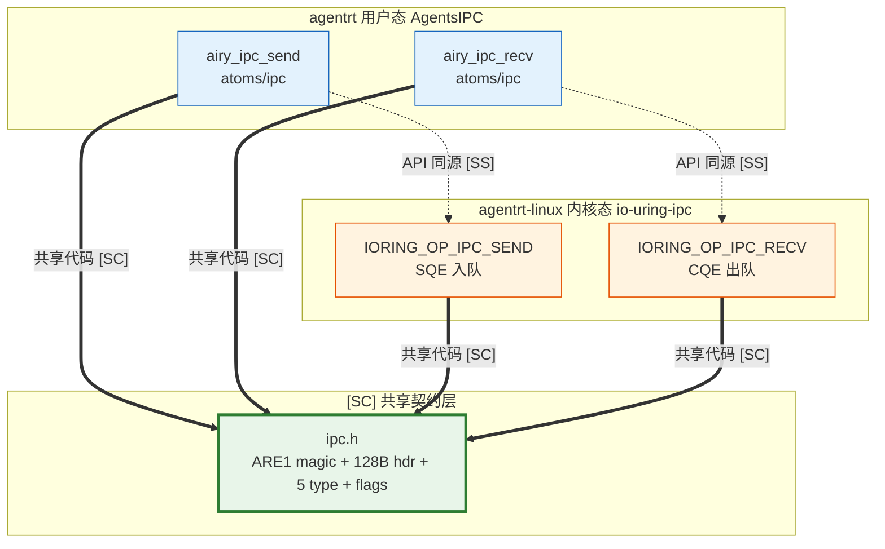

Copyright (c) 2025-2026 SPHARX Ltd. All Rights Reserved.

# IPC 协议

> **文档定位**： agentrt-linux（AirymaxOS） 进程间通信协议的 128B 消息头、5 种 payload、io_uring 零拷贝与同源映射\
> **版本**： 0.1.1\
> **最后更新**： 2026-07-06\
> **父文档**： [接口设计](README.md)

---

## 1. IPC 协议设计原则

agentrt-linux IPC 协议与 agentrt AgentsIPC 同源，保留 128 字节定长消息头设计，并在底层升级为基于 io_uring 的零拷贝实现。设计原则：

1. **定长消息头**: 128 字节定长，packed 紧凑布局（Layout C SSoT，`__attribute__((packed))`），128 字节 = 2 cache lines，便于零拷贝 page flipping。
2. **同源兼容**: 消息头字段布局与 agentrt AgentsIPC 保持兼容，agentrt 在 agentrt-linux 上运行无需协议转换。
3. **机制与策略分离**: 协议提供消息传递机制，消息语义（RPC / 事件 / 流）由 payload 类型决定。
4. **零拷贝优先**: 高频路径基于 io_uring + registered buffers + page flipping，避免数据复制。
5. **可观测性**: 消息头携带 `trace_id`（OpenTelemetry）与 `timestamp_ns`，全链路可追踪。
6. **版本协商**: 版本协商在 L2 服务协议层处理（见 `50-engineering-standards/30-runtime-interfaces/runtime_interfaces.md` Part II），L1 [SC] 基础消息头不含 `version` 字段，通过 `opcode` 区分消息类型、`reserved[84]` 预留扩展空间。
7. **capability 守卫**: 消息可携带 capability 令牌，跨进程传递权限。

---

## 2. 128 字节定长消息头

消息头定义位于 [SC] 共享契约层头文件 `include/airymax/ipc.h`（SSoT 物理宿主见 `50-engineering-standards/120-cross-project-code-sharing.md` §Layout C），遵循 **Tab 8 缩进**（对齐 OLK-6.6 §1 + SSoT）+ Doxygen 注释规范（详见 [04-coding-standard.md](04-coding-standard.md)）。

```c
#ifndef AIRY_IPC_MSG_H
#define AIRY_IPC_MSG_H

#include <stdint.h>

#define AIRY_IPC_HDR_SZ	128
#define AIRY_IPC_MAGIC		0x41524531u	/* 'A''R''E''1' — 同源 agentrt AgentsIPC */

/* payload 协议类型 */
#define AIRY_IPC_TYPE_REQUEST		0x0001
#define AIRY_IPC_TYPE_RESPONSE		0x0002
#define AIRY_IPC_TYPE_EVENT		0x0003
#define AIRY_IPC_TYPE_STREAM		0x0004
#define AIRY_IPC_TYPE_CONTROL		0x0005

/* flags 位定义 */
#define AIRY_IPC_F_ZEROCOPY		0x00000001u
#define AIRY_IPC_F_CAP_CARRY		0x00000002u
#define AIRY_IPC_F_COMPRESS		0x00000004u
#define AIRY_IPC_F_ENCRYPT		0x00000008u

/**
 * struct airy_ipc_msg_hdr - IPC 128 字节定长消息头（SSoT：Layout C）
 *
 * 权威定义见 include/airymax/ipc.h（物理宿主见
 * 50-engineering-standards/120-cross-project-code-sharing.md §Layout C）。
 */
struct airy_ipc_msg_hdr {
	__u32	magic;		/* offset 0, 'ARE1' (0x41524531) */
	__u16	opcode;		/* offset 4, SQE/CQE 操作码（见 enum airy_ipc_op） */
	__u16	flags;		/* offset 6, 标志位（NOWAIT/SIGNAL 等） */
	__u64	trace_id;	/* offset 8, 链路追踪 ID（OpenTelemetry） */
	__u64	timestamp_ns;	/* offset 16, 纳秒时间戳（CLOCK_REALTIME，对齐北京时间） */
	__u64	src_task;	/* offset 24, 源任务 ID（0 表示内核发起） */
	__u64	dst_task;	/* offset 32, 目标任务 ID（0 表示广播） */
	__u32	payload_len;	/* offset 40, payload 字节数，0 表示无 payload */
	__u8	reserved[84];	/* offset 44, 保留字段，填充 0 */
} __attribute__((packed));

static_assert(sizeof(struct airy_ipc_msg_hdr) == 128,
	      "airy_ipc_msg_hdr must be 128 bytes");
```

> **SSoT 声明**：本结构体定义以 `include/airymax/ipc.h`（物理宿主见 `50-engineering-standards/120-cross-project-code-sharing.md` §Layout C）为单一数据源。结构体名 `struct airy_ipc_msg_hdr`，`__attribute__((packed))` 对齐，UAPI 类型 `__u32`/`__u16`/`__u64`/`__u8`，字段顺序 magic/opcode/flags/trace_id/timestamp_ns/src_task/dst_task/payload_len/reserved[84]。本协议主文档与 SSoT 逐字节一致，**缩进风格对齐 OLK-6.6 §1（Tab 8）**。

### 2.1 字段语义

| 字段 | 偏移 | 长度 | 语义 |
|------|------|------|------|
| `magic` | 0 | 4 | 魔数 `0x41524531`（'ARE1'），用于协议识别 |
| `opcode` | 4 | 2 | SQE/CQE 操作码（见 `enum airy_ipc_op`，如 SEND/RECV/SEND_BATCH/CANCEL） |
| `flags` | 6 | 2 | 标志位（NOWAIT/SIGNAL 等） |
| `trace_id` | 8 | 8 | OpenTelemetry 链路追踪 ID |
| `timestamp_ns` | 16 | 8 | 纳秒时间戳（CLOCK_REALTIME，对齐北京时间） |
| `src_task` | 24 | 8 | 源任务 ID（0 表示内核发起） |
| `dst_task` | 32 | 8 | 目标任务 ID（0 表示广播） |
| `payload_len` | 40 | 4 | payload 字节数，0 表示无 payload |
| `reserved` | 44 | 84 | 保留字段，填充 0，未来扩展 |

> **注意**：Layout C 消息头无 `version` 与 `type` 字段。`opcode` 是传输层 SQE/CQE 操作码（SEND/RECV/SEND_BATCH/CANCEL），与 payload 协议类型（REQUEST/RESPONSE/EVENT/STREAM/CONTROL）不同——后者下沉至 payload 体首字段携带（见第 3 章）。

### 2.2 字节序

- 消息头统一使用小端序（与 x86_64 / aarch64 默认字节序一致）。
- 跨架构通信（x86_64 ↔ aarch64）通过 `htonl/ntohl` 转换，由 IPC 库自动处理。

### 2.3 对齐与 cache 优化

- `__attribute__((packed))` 确保结构体无填充间隙，字段偏移与表 2.1 逐字节对应。
- 128 字节定长 = 2 个 cache line，单次预取即可加载完整消息头。
- payload 独立于消息头存储，便于零拷贝 page flipping。

### 2.4 `timestamp_ns` 时钟基准设计权衡（CLOCK_REALTIME vs CLOCK_MONOTONIC）

`timestamp_ns` 字段（offset 16）使用 **CLOCK_REALTIME** 作为时钟基准，对齐北京时间（UTC+8）。本节记录该选择的工程权衡，避免未来误改。

**设计决策**：IPC 消息头 `timestamp_ns` 使用 `CLOCK_REALTIME`，调度数据流 vtime 使用 `__s32` Q16.16 定点（不依赖 wall clock）。

**权衡分析**：

| 维度 | CLOCK_REALTIME（已选） | CLOCK_MONOTONIC（备选） |
|------|----------------------|----------------------|
| 语义 | 挂钟时间（wall clock），可被 NTP/settimeofday 调整 | 单调递增，不受系统时间调整影响 |
| 跨主机对齐 | ✅ 支持（agent 分布式部署场景关键） | ❌ 各主机启动基准不同，无法跨机对齐 |
| 跨时区可读性 | ✅ 配合 UTC+8 偏移可读为北京时间 | ❌ 仅"自启动以来纳秒"，无挂钟含义 |
| 链路追踪对齐 | ✅ OpenTelemetry `trace_id` 时间戳默认 CLOCK_REALTIME，可对齐 | ❌ 无法与外部系统日志对齐 |
| NTP 跳变风险 | ⚠️ NTP 渐变或跳变可导致时间戳非单调 | ✅ 单调保证 |
| 适用场景 | 跨主机分布式追踪、可观测性、审计 | 单机内调度顺序、超时检测 |

**取舍依据**：
1. agentrt-linux 部署形态为分布式 agent 集群，IPC 消息在多机间传递，`timestamp_ns` 必须跨主机对齐以支持全链路追踪。
2. 调度顺序与超时检测由 [SC] `airy_vtime_t`（Q16.16 定点）独立承担，不依赖 `timestamp_ns`，避免时钟跳变影响调度正确性。
3. OpenTelemetry 协议默认 CLOCK_REALTIME，保持兼容性。
4. NTP 跳变风险通过 NTP 渐变（slewing，默认 NTP 守护进程行为）缓解，避免跳跃式调整。

**禁止误改**：`timestamp_ns` 不应改用 `CLOCK_MONOTONIC`，否则将破坏跨主机分布式追踪能力。如需单机单调时间戳，应在 payload 协议中扩展独立字段（不污染 [SC] 消息头）。

---

## 3. 5 种 payload 协议

> **字段说明**：Layout C 128B 消息头（见第 2 章）无 `type` 字段。下列 5 种 payload 协议类型（REQUEST/RESPONSE/EVENT/STREAM/CONTROL）由 payload 体首字段携带，而非消息头 `opcode`。`opcode` 是传输层 SQE/CQE 操作码（SEND/RECV/SEND_BATCH/CANCEL），二者分属不同层次。

payload 协议类型共 5 种：

| type 值 | 协议 | 用途 | 通信模式 |
|---------|------|------|---------|
| 0x0001 | REQUEST | 请求-响应的请求方 | 同步 RPC |
| 0x0002 | RESPONSE | 请求-响应的响应方 | 同步 RPC |
| 0x0003 | EVENT | 事件通知 | 发布-订阅 |
| 0x0004 | STREAM | 流式数据 | 双向流 |
| 0x0005 | CONTROL | 控制消息 | 链路管理 |

### 3.1 REQUEST payload

```c
/**
 * @brief REQUEST payload（请求-响应的请求方）
 */
typedef struct airy_ipc_request {
    uint64_t request_id;      /* 请求 ID（与 RESPONSE.request_id 对应） */
    uint32_t method_id;       /* 方法 ID（RPC 方法编号） */
    uint32_t timeout_ms;      /* 超时（毫秒） */
    uint8_t  params[];        /* 方法参数（柔性数组） */
} airy_ipc_request_t;
```

### 3.2 RESPONSE payload

```c
/**
 * @brief RESPONSE payload（请求-响应的响应方）
 */
typedef struct airy_ipc_response {
    uint64_t request_id;      /* 请求 ID（与 REQUEST.request_id 对应） */
    int32_t  status;          /* 状态码（0 成功，<0 AIRY_E* 错误码） */
    uint32_t reserved;        /* 保留字段 */
    uint8_t  result[];        /* 结果数据（柔性数组） */
} airy_ipc_response_t;
```

### 3.3 EVENT payload

```c
/**
 * @brief EVENT payload（事件通知，发布-订阅）
 */
typedef struct airy_ipc_event {
    uint64_t event_id;       /* 事件 ID */
    uint32_t topic_id;       /* 主题 ID（订阅时分配） */
    uint32_t priority;       /* 事件优先级（0-139） */
    uint8_t  payload[];      /* 事件数据（柔性数组） */
} airy_ipc_event_t;
```

### 3.4 STREAM payload

```c
/**
 * @brief STREAM payload（流式数据，双向流）
 */
typedef struct airy_ipc_stream {
    uint64_t stream_id;      /* 流 ID */
    uint32_t seq;             /* 序列号（递增） */
    uint32_t flags;           /* 流标志（FIN / RST / MORE） */
    uint8_t  chunk[];        /* 流数据块（柔性数组） */
} airy_ipc_stream_t;

#define AIRY_IPC_STREAM_FLAG_FIN  0x00000001u
#define AIRY_IPC_STREAM_FLAG_RST  0x00000002u
#define AIRY_IPC_STREAM_FLAG_MORE 0x00000004u
```

### 3.5 CONTROL payload

```c
/**
 * @brief CONTROL payload（控制消息，链路管理）
 */
typedef struct airy_ipc_control {
    uint32_t opcode;         /* 控制操作码 */
    uint32_t arg;            /* 操作参数 */
    uint8_t  data[];         /* 附加数据（柔性数组） */
} airy_ipc_control_t;

/* 控制操作码 */
#define AIRY_IPC_CTRL_HELLO     0x0001  /* 握手 */
#define AIRY_IPC_CTRL_BYE       0x0002  /* 关闭 */
#define AIRY_IPC_CTRL_PING      0x0003  /* 心跳 */
#define AIRY_IPC_CTRL_PONG      0x0004  /* 心跳响应 */
#define AIRY_IPC_CTRL_FLOW_OFF  0x0005  /* 流控：暂停 */
#define AIRY_IPC_CTRL_FLOW_ON   0x0006  /* 流控：恢复 */
```

---

## 4. io_uring 零拷贝实现

agentrt-linux IPC 基于 Linux 6.6 内核基线的 io_uring 子系统实现零拷贝消息传递。

### 4.1 通信原语

参考 seL4 消息传递模型（Endpoint/Notification，ADR-014），提供 4 种通信原语（详见 [20-modules/02-services.md](../20-modules/02-services.md) 第 4.5 节）：

| 原语 | 语义 | 用途 |
|------|------|------|
| Channel | 双向、面向消息 | RPC 调用（REQUEST/RESPONSE） |
| Socket | 双向、面向流 | 流式数据（STREAM） |
| FIFO | 单向、面向消息 | 高吞吐单向通信（EVENT） |
| Eventpair | 事件同步 | 跨进程信号量（CONTROL） |

### 4.2 零拷贝路径

```c
/**
 * @brief io_uring 零拷贝发送示例
 *
 * 发送方注册 page 为 io_uring buffer，接收方通过 page flipping 获取引用。
 */
static int airy_ipc_send_zerocopy(int ring_fd,
                                     const struct airy_ipc_msg_hdr *hdr,
                                     const void *payload, size_t payload_len)
{
    struct io_uring_sqe sqe;
    struct iovec iov[2];

    /* 注册 header 与 payload 为 iovec */
    iov[0].iov_base = (void *)hdr;
    iov[0].iov_len = AIRY_IPC_HDR_SZ;
    iov[1].iov_base = (void *)payload;
    iov[1].iov_len = payload_len;

    /* 提交 IORING_OP_IPC_SEND（agentrt-linux 注册的固定 OP） */
    io_uring_prep_rw(&sqe, IORING_OP_IPC_SEND, ring_fd,
                     iov, 2, 0);
    sqe.flags = IOSQE_FIXED_FILE;

    return io_uring_submit_and_wait(ring_fd, 1);
}
```

### 4.3 跨进程 ring 共享

```c
/**
 * @brief 注册 io_uring ring 给目标进程（跨进程 ring 共享）
 *
 * 通过 io_uring_register 将 ring fd 注册给 dst_task，实现零拷贝通道。
 */
AIRY_API int airy_sys_ipc_register_ring(int ring_fd, __u64 dst_task);
```

### 4.4 固定 OP 扩展

agentrt-linux 在 io_uring 注册以下 IPC 专用 OP（详见 [20-modules/01-kernel.md](../20-modules/01-kernel.md) 第 4.2 节）：

| OP | 用途 |
|----|------|
| `IORING_OP_IPC_SEND` | 零拷贝发送消息 |
| `IORING_OP_IPC_RECV` | 零拷贝接收消息 |
| `IORING_OP_IPC_REGISTER_RING` | 注册跨进程 ring |
| `IORING_OP_IPC_DEREGISTER_RING` | 注销跨进程 ring |

### 4.5 零拷贝机制

- **registered buffers**: 发送方注册 page 为 io_uring buffer，内核持有 page 引用。
- **page flipping**: 接收方通过 `IORING_OP_IPC_RECV` 接收 page 引用，内核仅翻转 page table entry，不拷贝数据。
- **MSG_ZEROCOPY**: 网络路径使用 `MSG_ZEROCOPY` 减少协议栈拷贝。

### 4.6 capability 携带与权限校验

当消息头 `flags` 中置位 `AIRY_IPC_F_CAP_CARRY` 时，消息可携带 capability 令牌跨进程传递，遵循 seL4 风格的不可伪造语义：

```c
/**
 * @brief 携带 capability 令牌发送 IPC 消息
 *
 * capability 令牌由内核生成（不可伪造），随消息传递至 dst_task，
 * 接收方在 cap_slot_out 中获得派生 capability（受限权限）。
 *
 * @param hdr        128B 消息头（flags 须置 CAP_CARRY）
 * @param payload    消息负载
 * @param cap_slot   待传递的 capability 句柄
 * @param cap_slot_out 接收方 capability 句柄输出
 * @return 0 成功，<0 失败（AIRY_EPERM 表示令牌无效）
 *
 * @since 1.0.1
 */
AIRY_API int airy_sys_ipc_send_with_cap(const struct airy_ipc_msg_hdr *hdr,
                                              const void *payload,
                                              uint32_t cap_slot,
                                              uint32_t *cap_slot_out);
```

**校验流程**:

1. 发送方在 `flags` 中置位 `AIRY_IPC_F_CAP_CARRY`。
2. 内核校验 `cap_slot` 是否属于 `src_task`，若不属于则返回 `AIRY_EPERM`。
3. 内核派生受限 capability 至 `dst_task`，写入 `cap_slot_out`。
4. 接收方使用派生令牌执行受保护操作（如 `file.read`）。

**派生规则**: 派生 capability 的权限不得超过原令牌（最小权限原则），支持递归撤销（详见 [20-modules/03-security.md](../20-modules/03-security.md) 第 4.1 节 capability 系统）。

### 4.7 端点状态机（seL4 风格，Step 2.4 #2 补齐）

参考 seL4 Endpoint 状态机（ADR-014，源码证据 `include/object/structures.h:36-41`：`EPState_Idle/EPState_Send/EPState_Recv`），agentrt-linux IPC 端点有 3 个状态，由内核维护，用户态不可直接观测。**命名严格对齐 seL4**：状态名描述"端点所处的语义态"而非"线程等待态"，因此不带 `Waiting` 后缀。

| 状态 | 含义 | 触发转换 |
|------|------|----------|
| **Idle** | 无消息等待，端点空闲 | Send→Send；Recv→Recv |
| **Send** | 端点处于发送态：发送方已就绪并阻塞，等待接收方 Recv | Recv→匹配发送方，双方就绪，转 Idle |
| **Recv** | 端点处于接收态：接收方已就绪并阻塞，等待发送方 Send | Send→匹配接收方，双方就绪，转 Idle |

```
状态转换图：
  Idle --Send--> Send --Recv--> Idle（消息传递完成）
  Idle --Recv--> Recv --Send--> Idle（消息传递完成）
```

**Fastpath 优化**（借鉴 seL4）：当端点处于 Idle 且发送方与接收方同时就绪时，走 Fastpath——内核直接切换上下文，不经过 SQE/CQE 队列，延迟 < 1μs。Slowpath（阻塞情况）走 io_uring SQE/CQE 标准路径。

**与 seL4 的差异**：seL4 端点状态机是微内核核心（形式化验证）；agentrt-linux 在 io_uring 之上实现端点状态语义，Fastpath 用 sched_ext 直接切换，Slowpath 用 io_uring CQE 通知。状态机语义在 [SS] 语义同源层与 agentrt 共享，实现独立。

### 4.8 Reply 原子性（seL4 `doReplyTransfer` 临界区串行执行模式）

参考 seL4 Reply 语义（ADR-014，源码证据 `src/object/endpoint.c:115-127` 的 `doReplyTransfer` + `src/kernel/thread.c:131-200` 的线程状态切换）：**seL4 不存在独立的"Reply Capability 原子性"机制**，原子性是"线程状态切换 + 回复消息传递"两步在 `doReplyTransfer` 函数内串行执行的涌现属性。agentrt-linux 借鉴该模式：`AIRY_SYS_REPLY` 在内核临界区内串行完成"写入回复 + 恢复接收方"，要么完全成功（接收方收到回复并恢复运行），要么完全失败（回复方阻塞等待接收方就绪），保证 IPC 调用-回复的语义完整性，不会出现"回复已发送但接收方未恢复"的中间状态。

**seL4 原子性来源（源码级分析）**：
1. seL4 master 模式：`doReplyTransfer()` 内部先 `setThreadState(blocked, ts_idle)` 再 `sendIPC()`，调用方 caller slot 由 `setupCallerCap` 在 Call 阶段绑定到 TCB 内嵌的 `tcbCaller`（`src/object/endpoint.c:115-127` + `src/kernel/thread.c:131-200`），整个调用链在单核上不可抢占，因此天然串行。
2. seL4 MCS 模式：通过 `reply_t` 对象 + `reply_push/reply_remove` 显式管理回复链，仍非显式 "atomic reply" 系统调用。
3. **关键澄清**：seL4 没有 "Reply Capability 原子性" 独立设计，原子性是临界区串行执行的涌现属性。

**agentrt-linux 原子性保证机制**（借鉴 `doReplyTransfer` 模式，实现独立）：
1. Reply 操作在内核态持端点锁（`airy_ep->lock`）期间完成——对齐 seL4 单核不可抢占语义。
2. 内核将回复消息写入接收方地址空间，并恢复接收方上下文——两步在同一临界区内串行完成，对齐 seL4 `doReplyTransfer` 的"setThreadState + sendIPC"两步串行模式。
3. 若接收方未在 Recv 状态（端点未处于接收态），回复方阻塞（端点转 Send 态），等待接收方 Recv。

```c
/* Reply 原子性：借鉴 seL4 doReplyTransfer 临界区串行执行模式 */
static int airy_ipc_reply(struct airy_endpoint *ep,
                          const struct airy_ipc_msg_hdr *reply,
                          const void *payload, size_t len)
{
    spin_lock(&ep->lock);                    /* 进入临界区 */
    if (ep->state != AIRY_EP_RECV) {         /* 端点不在 Recv 态 */
        spin_unlock(&ep->lock);
        return -AIRY_EAGAIN;                 /* 接收方未就绪，回复方阻塞 */
    }
    /* 串行两步：写入回复 + 恢复接收方上下文（对齐 doReplyTransfer 两步模式） */
    airy_ipc_copy_reply(ep->recv_task, reply, payload, len);
    airy_task_wake(ep->recv_task);           /* 恢复接收方 */
    ep->state = AIRY_EP_IDLE;                /* 端点回 Idle */
    spin_unlock(&ep->lock);                  /* 退出临界区 */
    return 0;
}
```

**与 seL4 的差异**：seL4 Reply 原子性通过"TCB 内嵌 caller slot + `doReplyTransfer` 临界区串行 + 形式化验证"三重保证；agentrt-linux 通过"自旋锁 + 临界区串行"保证（非形式化验证），借鉴 `doReplyTransfer` 模式但实现独立（M1 暂不引入 TCB 内嵌 reply slot，1.0.1 M2+ 评估 C-C07）。Reply 原子性语义在 [SS] 语义同源层与 agentrt 共享。

---

## 5. 与 agentrt AgentsIPC 的同源映射

agentrt-linux IPC 与 agentrt AgentsIPC 同源，保留 128B 定长消息头布局兼容。

| 维度 | agentrt AgentsIPC | agentrt-linux IPC | 同源关系 |
|------|------------------|---------------|---------|
| 消息头长度 | 128B 定长 | 128B 定长 | 完全兼容 |
| magic | 'ARE1' | 'ARE1' | 完全兼容（同源 agentrt） |
| src_task / dst_task | 任务 ID | 任务 ID | 完全兼容 |
| trace_id | OpenTelemetry | OpenTelemetry | 完全兼容 |
| timestamp_ns | CLOCK_REALTIME | CLOCK_REALTIME | 完全兼容 |
| 底层传输 | 用户态消息队列 | io_uring 零拷贝 | agentrt-linux 升级 |
| payload 协议 | 自定义 | 5 种（REQUEST/RESPONSE/EVENT/STREAM/CONTROL） | agentrt-linux 扩展 |
| capability | 应用权限模型 | seL4 风格 capability | agentrt-linux 升级 |

**同源红利**: agentrt 在 agentrt-linux 上运行时，IPC 消息头布局完全兼容，无需协议转换层，天然契合。

**独立性**: agentrt-linux IPC 为 OS 级实现（基于 io_uring + 内核固定 OP），agentrt AgentsIPC 为应用级实现（用户态消息队列），二者在分层上独立。遵循 IRON-9"同源且部分代码共享"原则。

---

## 6. IPC 性能约束

IPC 性能约束对齐非功能性需求 NFR-P-002（详见 [00-requirements/03-non-functional-requirements.md](../00-requirements/03-non-functional-requirements.md)）。

### 6.1 NFR-P-002 IPC 吞吐

| 约束 ID | 指标 | 阈值 | 测量方法 |
|---------|------|------|---------|
| NFR-P-002 | IPC 吞吐 | > 100K msg/s（单核） | 128B 消息往返吞吐 |
| NFR-P-002a | IPC 延迟 | < 10 μs（P99） | `airy_sys_ipc_send` + `airy_sys_ipc_recv` 往返 |
| NFR-P-002b | 大消息吞吐 | > 10 Gbps（1MB 消息） | 零拷贝 page flipping |
| NFR-P-002c | 跨节点 IPC | > 1M msg/s（4 节点） | 超节点 OS 跨节点 IPC |

### 6.2 性能优化手段

- **io_uring 零拷贝**: 消除数据复制，单核可达 100K+ msg/s。
- **cache line 对齐**: 128B 消息头 = 2 cache line，单次预取加载完整消息头。
- **batch 提交**: io_uring 支持批量提交 SQE，减少 syscall 次数。
- **registered buffers**: 预注册 buffer 池，避免每次发送注册开销。
- **CXL 跨节点共享**: 跨节点 IPC 通过 CXL 3.0 内存池化共享 ring，减少网络往返。

### 6.3 性能回归保护

- 每次提交运行 `tests-linux/benchmark/ipc-latency` 与 `ipc-throughput` 微基准。
- 与基线对比，吞吐退化 > 5% 或延迟退化 > 10% 自动打回（详见 [20-modules/08-tests.md](../20-modules/08-tests.md) 第 4.6 节）。
- Soak Test 72 小时持续 IPC 负载，验证无内存泄漏、无性能衰减。

---

## 7. 相关文档

- [接口设计](README.md)
- [系统调用接口](01-syscalls.md)
- [SDK API](03-sdk-api.md)
- [编码规范](04-coding-standard.md)
- [内核设计](../20-modules/01-kernel.md)
- [服务设计](../20-modules/02-services.md)
- [非功能性需求](../00-requirements/03-non-functional-requirements.md)（NFR-P-002）

---

## 8. IRON-9 v2 三层共享模型

> **OS-IFACE-003**： IPC 协议遵循 IRON-9 v2 三层共享模型——128B 消息头结构、magic 0x41524531（'ARE1'）、5 种 payload type 通过 [SC] 共享契约层 `ipc.h` 完全共享；io_uring 操作码与传输实现各自独立。禁止在 agentrt 与 agentrt-linux 之间引入协议转换层或字节序适配层。

### 8.1 三层模型概览

| 层次 | 共享程度 | 本接口涉及内容 |
|------|---------|---------------|
| **[SC] 共享契约层** | 完全共享代码 | `ipc.h`（IPC magic 0x41524531 'ARE1' + `struct airy_ipc_msg_hdr` 128B 定长头 + 5 种 payload type + flags 位 + SQE/CQE 操作码枚举） |
| **[SS] 语义同源层** | 操作模式同源（注册/匹配/生命周期等概念一致），函数签名因抽象层级不同而独立 | agentrt AgentsIPC（`atoms/ipc`）↔ agentrt-linux `io-uring-ipc`（services）的 send/recv/register_ring 同源 API |
| **[IND] 完全独立层** | 完全独立 | agentrt POSIX MQ + mmap 传输 ↔ agentrt-linux io_uring + SQPOLL + page flipping 零拷贝传输 |

### 8.2 [SC] 共享契约层——`ipc.h` 在 IPC 协议中的角色

| `ipc.h` 定义项 | 在协议中的角色 | 消费方 |
|---------------|---------------|--------|
| `AIRY_IPC_MAGIC` 0x41524531 'ARE1' | 协议识别魔数，消息头首 4 字节 | agentrt AgentsIPC / agentrt-linux io-uring-ipc |
| `struct airy_ipc_msg_hdr` 128B 定长头 | packed 消息头结构（magic/opcode/flags/trace_id/timestamp_ns/src_task/dst_task/payload_len/reserved[84]） | send/recv 路径 |
| `AIRY_IPC_TYPE_*` 5 种 payload | REQUEST/RESPONSE/EVENT/STREAM/CONTROL 类型枚举 | payload 解码 |
| `AIRY_IPC_F_*` flags 位 | ZEROCOPY/CAP_CARRY/COMPRESS/ENCRYPT 标志位 | 消息处理 |
| `IORING_OP_IPC_*` 操作码 | IPC_SEND/IPC_RECV/REGISTER_RING/DEREGISTER_RING SQE/CQE 操作码 | io_uring 数据面 |

### 8.3 [SS] 语义同源层——agentrt ↔ agentrt-linux IPC API 映射

| agentrt AgentsIPC（用户态） | agentrt-linux io-uring-ipc（内核态） | 同源签名 | 实现差异 |
|----------------------------|--------------------------------------|---------|---------|
| `airy_ipc_send()` | `airy_sys_ipc_send()` | `(const struct airy_ipc_msg_hdr *, const void *) -> int` | 用户态 POSIX MQ vs 内核 io_uring SQE |
| `airy_ipc_recv()` | `airy_sys_ipc_recv()` | `(struct airy_ipc_msg_hdr *, void *, size_t) -> int` | 用户态 mq_receive vs 内核 io_uring CQE |
| `airy_ipc_send_with_cap()` | `airy_sys_ipc_send_with_cap()` | `(hdr, payload, cap_slot, cap_slot_out) -> int` | 用户态 Cupolas 令牌 vs 内核 LSM 令牌 |
| `airy_ipc_register_ring()` | `airy_sys_ipc_register_ring()` | `(int ring_fd, __u64 dst_task) -> int` | 用户态 mmap 共享 vs 内核 io_uring_register |

### 8.4 [IND] 完全独立层

| 独立项 | agentrt 实现 | agentrt-linux 实现 | 独立原因 |
|--------|-------------|-------------------|---------|
| 传输后端 | POSIX MQ + mmap | io_uring + SQPOLL + registered buffers | 内核态零拷贝优势 |
| 零拷贝机制 | 用户态 page 共享（mmap） | 内核 page flipping（page table entry 翻转） | 内核态性能 |
| 跨进程 ring | 用户态 fd 共享（SCM_RIGHTS） | `io_uring_register` 跨进程注册 | 内核态机制 |
| 字节序处理 | `htonl/ntohl` 库函数 | 内核 `cpu_to_le32/le32_to_cpu` | 工具链差异 |

### 8.5 跨态协作流



> **OS-IFACE-004**： IPC 协议的 128B 消息头布局（`struct airy_ipc_msg_hdr`）与 magic 0x41524531（'ARE1'）在 agentrt 与 agentrt-linux 间完全共享同一份 `ipc.h`——agentrt 在 agentrt-linux 上运行时无需任何协议转换或字节序适配，消息头字段布局二进制兼容。

---

© 2025-2026 SPHARX Ltd. All Rights Reserved.
