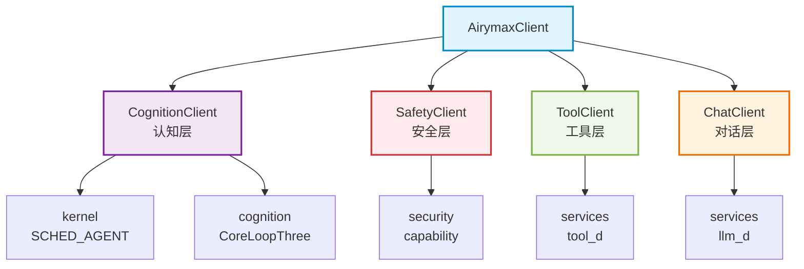
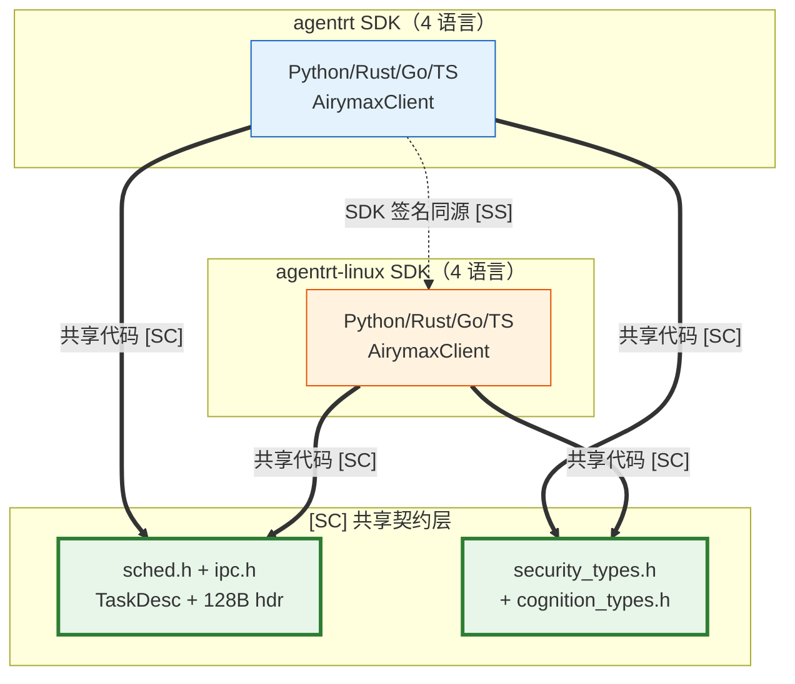

Copyright (c) 2025-2026 SPHARX Ltd. All Rights Reserved.

# SDK API

> **文档定位**： agentrt-linux（AirymaxOS） SDK 的 4 语言矩阵、4 嵌套客户端、代码示例与错误处理策略\
> **版本**： 0.1.1\
> **最后更新**： 2026-07-06\
> **父文档**： [接口设计](README.md)

---

## 1. SDK 4 语言矩阵

agentrt-linux 提供 4 种语言的官方 SDK，统一封装 8 子仓能力，遵循同源 agentrt sdk 的"管理接口"语义，升级为 OS 级 SDK。

| 语言 | 包名 | 仓库 | 同源 agentrt | 目标用户 |
|------|------|------|--------------|---------|
| Python | `agentrt` | https://atomgit.com/openairymax/agentrt-py.git | sdk | 应用层 Agent 开发 |
| Rust | `agentrt` | https://atomgit.com/openairymax/agentrt-rs.git | sdk | 系统级 Agent / 性能敏感 |
| Go | `github.com/openairymax/agentrt-go` | https://atomgit.com/openairymax/agentrt-go.git | sdk | 云原生 Agent / Operator |
| TypeScript | `@openairymax/agentrt` | https://atomgit.com/openairymax/agentrt-ts.git | sdk | Web/Node.js Agent |

### 1.1 统一设计

- **统一入口**: 所有语言 SDK 均通过 `AirymaxClient` 入口接入，连接至 OS 级网关（`unix:///var/run/agentrt.sock`）。
- **统一客户端**: 4 个嵌套客户端（CognitionClient / SafetyClient / ToolClient / ChatClient）覆盖 Agent 开发全部场景。
- **统一传输**: 底层均使用 io_uring IPC（本地）或 gRPC over mTLS（远程）。
- **统一错误**: 错误码对齐 `include/airymax/error.h`（详见 [01-syscalls.md](01-syscalls.md) 第 6 章）。

### 1.2 传输层

| 模式 | 传输 | 用途 |
|------|------|------|
| 本地 | Unix socket + io_uring | 同节点 Agent，零拷贝 |
| 远程 | gRPC over mTLS（国密 TLS） | 跨节点 Agent，零信任网络 |
| 沙箱 | Wasm 3.0 runtime | 沙箱内 Agent，安全隔离 |

---

## 2. 4 嵌套客户端

`AirymaxClient` 提供四个嵌套客户端，分别对应 Agent 开发的四个核心场景。

| 客户端 | 职责 | 同源 agentrt | 覆盖子仓 |
|--------|------|--------------|---------|
| `CognitionClient` | 认知层：提交任务、管理 CoreLoopThree | coreloopthree | cognition |
| `SafetyClient` | 安全层：capability 校验、策略查询 | cupolas | security |
| `ToolClient` | 工具层：执行工具（web_search 等） | daemons/tool_d | services / cognition |
| `ChatClient` | 对话层：LLM 对补全 | daemons/llm_d | services / cognition |

### 2.1 客户端关系



---

## 3. Python 代码示例

Python SDK 包名 `agentrt`，提供同步与异步两种 API。

```python
from agentrt import AirymaxClient

client = AirymaxClient(endpoint="unix:///var/run/agentrt.sock")

# CognitionClient - 认知层
cognition = client.cognition
task_id = cognition.submit_task(
    description="分析论文并提取关键概念",
    priority=10,
    max_depth=5
)

# SafetyClient - 安全层
safety = client.safety
permission = safety.check_capability(
    action="file.read",
    resource="/etc/agentrt/config.yaml"
)

# ToolClient - 工具层
tool = client.tool
result = tool.execute(
    name="web_search",
    args={"query": "agentrt-linux 认知循环"}
)

# ChatClient - 对话层
chat = client.chat
response = chat.complete(
    messages=[{"role": "user", "content": "解释微内核设计思想"}],
    model="gpt-4"
)
```

### 3.1 异步 API

```python
import asyncio
from agentrt import AsyncAirymaxClient

async def main():
    client = AsyncAirymaxClient(endpoint="unix:///var/run/agentrt.sock")
    cognition = client.cognition
    task_id = await cognition.submit_task(
        description="分析论文并提取关键概念",
        priority=10,
        max_depth=5
    )
    print(f"task_id={task_id}")
    await client.close()

asyncio.run(main())
```

### 3.2 上下文管理

```python
from agentrt import AirymaxClient

with AirymaxClient(endpoint="unix:///var/run/agentrt.sock") as client:
    permission = client.safety.check_capability(
        action="file.read",
        resource="/etc/agentrt/config.yaml"
    )
    if permission.granted:
        result = client.tool.execute(name="file_read", args={"path": "/etc/agentrt/config.yaml"})
```

---

## 4. Rust 代码示例

Rust SDK 包名 `agentrt`，遵循 rustfmt + clippy 规范（详见 [04-coding-standard.md](04-coding-standard.md) 第 4 章）。

```rust
use agentrt::AirymaxClient;
use agentrt::cognition::TaskDesc;

#[tokio::main]
async fn main() -> Result<(), Box<dyn std::error::Error>> {
    let client = AirymaxClient::connect("unix:///var/run/agentrt.sock").await?;

    // CognitionClient - 认知层
    let cognition = client.cognition();
    let task_id = cognition
        .submit_task(TaskDesc {
            description: "分析论文并提取关键概念".to_string(),
            priority: 10,
            max_depth: 5,
        })
        .await?;
    println!("task_id={task_id}");

    // SafetyClient - 安全层
    let safety = client.safety();
    let permission = safety
        .check_capability("file.read", "/etc/agentrt/config.yaml")
        .await?;
    println!("granted={}", permission.granted);

    // ToolClient - 工具层
    let tool = client.tool();
    let result = tool
        .execute("web_search", &[("query", "agentrt-linux 认知循环")])
        .await?;
    println!("result={result:?}");

    // ChatClient - 对话层
    let chat = client.chat();
    let response = chat
        .complete(
            &[agentrt::chat::Message::user("解释微内核设计思想")],
            "gpt-4",
        )
        .await?;
    println!("response={response}");

    Ok(())
}
```

### 4.1 同步 API

```rust
use agentrt::AirymaxClient;

fn main() -> Result<(), Box<dyn std::error::Error>> {
    let client = AirymaxClient::connect_sync("unix:///var/run/agentrt.sock")?;
    let permission = client
        .safety()
        .check_capability_sync("file.read", "/etc/agentrt/config.yaml")?;
    if permission.granted {
        let result = client
            .tool()
            .execute_sync("file_read", &[("path", "/etc/agentrt/config.yaml")])?;
        println!("{result:?}");
    }
    Ok(())
}
```

### 4.2 Cargo.toml 依赖

```toml
[dependencies]
agentrt = { version = "1.0", features = ["tokio"] }
tokio = { version = "1", features = ["full"] }
```

---

## 5. Go 代码示例

Go SDK 模块路径 `github.com/openairymax/agentrt-go`。

```go
package main

import (
    "context"
    "fmt"
    "log"

    "github.com/openairymax/agentrt-go"
)

func main() {
    client, err := agentrt.NewClient("unix:///var/run/agentrt.sock")
    if err != nil {
        log.Fatalf("connect failed: %v", err)
    }
    defer client.Close()

    ctx := context.Background()

    // CognitionClient - 认知层
    cognition := client.Cognition()
    taskID, err := cognition.SubmitTask(ctx, &agentrt.TaskDesc{
        Description: "分析论文并提取关键概念",
        Priority:    10,
        MaxDepth:    5,
    })
    if err != nil {
        log.Fatalf("submit task failed: %v", err)
    }
    fmt.Printf("task_id=%d\n", taskID)

    // SafetyClient - 安全层
    safety := client.Safety()
    perm, err := safety.CheckCapability(ctx, "file.read", "/etc/agentrt/config.yaml")
    if err != nil {
        log.Fatalf("check capability failed: %v", err)
    }
    fmt.Printf("granted=%v\n", perm.Granted)

    // ToolClient - 工具层
    tool := client.Tool()
    result, err := tool.Execute(ctx, "web_search", map[string]string{
        "query": "agentrt-linux 认知循环",
    })
    if err != nil {
        log.Fatalf("execute failed: %v", err)
    }
    fmt.Printf("result=%v\n", result)

    // ChatClient - 对话层
    chat := client.Chat()
    resp, err := chat.Complete(ctx, []agentrt.Message{
        {Role: "user", Content: "解释微内核设计思想"},
    }, "gpt-4")
    if err != nil {
        log.Fatalf("complete failed: %v", err)
    }
    fmt.Printf("response=%s\n", resp.Content)
}
```

### 5.1 go.mod 依赖

```go
module github.com/openairymax/agentrt-example

go 1.22

require github.com/openairymax/agentrt-go v0.1.1
```

---

## 6. TypeScript 代码示例

TypeScript SDK 包名 `@openairymax/agentrt`，支持 Node.js 与浏览器（通过 WebSocket 网关）。

```typescript
import { AirymaxClient } from "@openairymax/agentrt";

async function main(): Promise<void> {
    const client = new AirymaxClient({ endpoint: "unix:///var/run/agentrt.sock" });

    // CognitionClient - 认知层
    const cognition = client.cognition;
    const taskId = await cognition.submitTask({
        description: "分析论文并提取关键概念",
        priority: 10,
        maxDepth: 5,
    });
    console.log(`task_id=${taskId}`);

    // SafetyClient - 安全层
    const safety = client.safety;
    const permission = await safety.checkCapability({
        action: "file.read",
        resource: "/etc/agentrt/config.yaml",
    });
    console.log(`granted=${permission.granted}`);

    // ToolClient - 工具层
    const tool = client.tool;
    const result = await tool.execute({
        name: "web_search",
        args: { query: "agentrt-linux 认知循环" },
    });
    console.log(`result=${JSON.stringify(result)}`);

    // ChatClient - 对话层
    const chat = client.chat;
    const response = await chat.complete({
        messages: [{ role: "user", content: "解释微内核设计思想" }],
        model: "gpt-4",
    });
    console.log(`response=${response.content}`);

    await client.close();
}

main().catch((err) => console.error(err));
```

### 6.1 流式响应

```typescript
import { AirymaxClient } from "@openairymax/agentrt";

const client = new AirymaxClient({ endpoint: "unix:///var/run/agentrt.sock" });
const chat = client.chat;

const stream = await chat.stream({
    messages: [{ role: "user", content: "解释微内核设计思想" }],
    model: "gpt-4",
});

for await (const chunk of stream) {
    process.stdout.write(chunk.delta);
}
```

### 6.2 package.json 依赖

```json
{
  "dependencies": {
    "@openairymax/agentrt": "^0.1.1"
  }
}
```

---

## 7. SDK 错误处理与重试策略

### 7.1 错误处理

所有 SDK 错误对齐 `include/airymax/error.h`（详见 [01-syscalls.md](01-syscalls.md) 第 6 章），通过语言原生的错误机制暴露。

| 语言 | 错误机制 | 示例 |
|------|---------|------|
| Python | `agentrt.AgentrtError` 异常 | `raise AgentrtError(code=-4, message="EPERM")` |
| Rust | `Result<T, agentrt::Error>` | `Err(agentrt::Error::Eperm)` |
| Go | `error`（实现 `Unwrap()` / `Code()`） | `return agentrt.ErrEperm` |
| TypeScript | `AgentrtError` 类（`code` / `message`） | `throw new AgentrtError(-4, "EPERM")` |

### 7.2 Python 错误处理示例

```python
from agentrt import AirymaxClient, AgentrtError

client = AirymaxClient(endpoint="unix:///var/run/agentrt.sock")

try:
    permission = client.safety.check_capability(
        action="file.read",
        resource="/etc/agentrt/config.yaml"
    )
except AgentrtError as e:
    if e.code == -4:  # AIRY_EPERM
        print("权限不足，请先申请 capability")
    elif e.code == -6:  # AIRY_EAGAIN
        print("资源繁忙，请重试")
    else:
        raise
```

### 7.3 Rust 错误处理示例

```rust
use agentrt::{AirymaxClient, Error};

async fn run() -> Result<(), Error> {
    let client = AirymaxClient::connect("unix:///var/run/agentrt.sock").await?;
    let safety = client.safety();
    let perm = match safety
        .check_capability("file.read", "/etc/agentrt/config.yaml")
        .await
    {
        Ok(p) => p,
        Err(Error::Eperm) => {
            eprintln!("权限不足，请先申请 capability");
            return Err(Error::Eperm);
        }
        Err(Error::Eagain) => {
            eprintln!("资源繁忙，重试中...");
            return Err(Error::Eagain);
        }
        Err(e) => return Err(e),
    };
    Ok(())
}
```

### 7.4 重试策略

SDK 内置指数退避重试机制，默认对以下错误码自动重试：

| 错误码 | 是否重试 | 默认重试次数 | 退避策略 |
|--------|---------|-------------|---------|
| `AIRY_EAGAIN` | 是 | 3 | 指数退避（10ms / 20ms / 40ms） |
| `AIRY_ETIMEDOUT` | 是 | 2 | 指数退避（100ms / 200ms） |
| `AIRY_EBUSY` | 是 | 3 | 固定退避（50ms） |
| `AIRY_EPERM` | 否 | - | 立即返回，需申请 capability |
| `AIRY_EINVAL` | 否 | - | 立即返回，参数错误 |
| `AIRY_ENOENT` | 否 | - | 立即返回，资源不存在 |

### 7.5 重试配置

```python
from agentrt import AirymaxClient, RetryPolicy

client = AirymaxClient(
    endpoint="unix:///var/run/agentrt.sock",
    retry=RetryPolicy(
        max_attempts=5,
        initial_backoff_ms=10,
        max_backoff_ms=1000,
        retry_on=(-6, -11),  # AIRY_EAGAIN, AIRY_ETIMEDOUT
    ),
)
```

### 7.6 超时与取消

- 所有 SDK 调用支持超时配置（默认 30 秒）。
- Python / Rust / Go 支持取消（`context` / `CancellationToken`）。
- 超时返回 `AIRY_ETIMEDOUT`，已提交的任务不会被自动取消（需显式调用 `task_cancel`）。

### 7.7 可观测性

- SDK 自动注入 `trace_id`（OpenTelemetry），与 IPC 消息头 `trace_id` 对齐。
- SDK 日志通过 `log_write()` 输出（详见 [04-coding-standard.md](04-coding-standard.md) 第 5 章），ANSI 颜色对齐。
- SDK 指标（调用次数、延迟、错误率）通过 OpenTelemetry Metrics 导出，与 `cloudnative/observability` 集成。

---

## 8. 相关文档

- [接口设计](README.md)
- [系统调用接口](01-syscalls.md)
- [IPC 协议](02-ipc-protocol.md)
- [编码规范](04-coding-standard.md)
- [认知设计](../20-modules/05-cognition.md)
- [云原生设计](../20-modules/06-cloudnative.md)
- [非功能性需求](../00-requirements/03-non-functional-requirements.md)

---

## 9. IRON-9 v2 三层共享模型

> **OS-IFACE-005**： SDK API 遵循 IRON-9 v2 三层共享模型——SDK 层签名同源（同一份源码两端编译，构建期条件编译切换传输层），其他层（系统调用层等）仅语义同源、签名因抽象层级不同而独立演进；底层系统调用通过 [SC] 共享契约层头文件同源；传输层与构建链各自独立。禁止在 SDK 层引入平台判定或后端切换的适配层。

### 9.1 三层模型概览

| 层次 | 共享程度 | 本接口涉及内容 |
|------|---------|---------------|
| **[SC] 共享契约层** | 完全共享代码 | `syscalls.h`（12 核心 syscall 编号）+ `sched.h`（TaskDesc 结构）+ `ipc.h`（消息头与 payload）+ `security_types.h`（capability 模型）+ `cognition_types.h`（CoreLoopThree 阶段）+ `memory_types.h`（记忆快照） |
| **[SS] 语义同源层** | SDK 层签名同源（同一份源码两端编译，构建期条件编译切换传输层），其他层语义同源 | agentrt sdk（4 语言）↔ agentrt-linux SDK（4 语言）的 `AirymaxClient` + 4 嵌套客户端签名一致 |
| **[IND] 完全独立层** | 完全独立 | agentrt SDK 用户态传输（libc/gRPC）↔ agentrt-linux SDK 内核加速路径（io_uring/syscall 直达） |

### 9.2 [SC] 共享契约层——头文件在 SDK 中的角色

| 头文件 | 在 SDK 中的角色 | 消费客户端 |
|--------|----------------|-----------|
| `syscalls.h` | 12 核心 syscall 编号（AIRY_SYS_CALL 等）+ capability invocation 统一入口 | 全部客户端（调用 syscall 接口时） |
| `sched.h` | `TaskDesc` 任务描述符（magic 0x41475453 'AGTS'）+ 优先级 0-139 + MAC_MAX_AGENTS=1024 | CognitionClient.submit_task |
| `ipc.h` | 128B 消息头（magic 0x41524531 'ARE1'）+ 5 payload type + trace_id | 全部客户端传输层 |
| `security_types.h` | capability 41 ID + mint/revoke/derive 签名 + 252 LSM 钩子 | SafetyClient.check_capability |
| `cognition_types.h` | 三阶段枚举 + Thinkdual 模式 + Token 能效 | CognitionClient / ChatClient |
| `memory_types.h` | MemoryRovol L1-L4 快照结构 | ToolClient（记忆上下文） |

> **补充**：`bpf_struct_ops.h`（struct_ops 4 状态机 INIT/REGISTERED/ACTIVE/DRAINING）是 SDK 网关状态管理的共享结构，由 SDK 消费，但不属于上述 6 个核心 [SC] 共享契约层头文件（SSoT: `20-contracts/README.md`）。

### 9.3 [SS] 语义同源层——agentrt ↔ agentrt-linux SDK API 映射

| agentrt SDK（用户态） | agentrt-linux SDK（OS 级） | 同源签名 | 实现差异 |
|----------------------|---------------------------|---------|---------|
| `AirymaxClient.connect()` | `AirymaxClient.connect()` | `(endpoint: str) -> Client` | agentrt gRPC vs agentrt-linux unix socket + io_uring |
| `CognitionClient.submit_task()` | `CognitionClient.submit_task()` | `(desc, priority, max_depth) -> task_id` | 用户态协程 vs 内核 SCHED_AGENT |
| `SafetyClient.check_capability()` | `SafetyClient.check_capability()` | `(action, resource) -> Permission` | 用户态 Cupolas vs 内核 LSM + cap |
| `ToolClient.execute()` | `ToolClient.execute()` | `(name, args) -> Result` | 用户态 tool_d 进程 vs 内核 daemon |
| `ChatClient.complete()` | `ChatClient.complete()` | `(messages, model) -> Response` | 用户态 llm_d vs 内核 llm_d kthread |

### 9.4 [IND] 完全独立层

| 独立项 | agentrt 实现 | agentrt-linux 实现 | 独立原因 |
|--------|-------------|-------------------|---------|
| 传输层 | gRPC over mTLS（本地 unix socket 备选） | unix socket + io_uring（本地）/ gRPC mTLS（远程） | 内核态加速 |
| 错误处理 | `AIRY_E*` 用户态异常包装 | `AIRY_E*` 内核负值直达 | 语言绑定差异 |
| 重试策略 | SDK 层指数退避 | SDK 层指数退避（同源配置） | 配置一致，实现独立 |
| 可观测性 | OpenTelemetry 用户态导出 | OpenTelemetry + 内核 tracepoint | 导出路径差异 |

### 9.5 跨态协作流



> **OS-IFACE-006**： 4 语言 SDK 的 `AirymaxClient` 及 4 嵌套客户端（CognitionClient/SafetyClient/ToolClient/ChatClient）API 签名在 agentrt 与 agentrt-linux 上一致——SDK 层签名同源（同一份 SDK 源码两端编译运行，底层传输由构建期条件编译切换）；此一致性仅限 SDK 层，系统调用层等签名因抽象层级不同而独立演进、仅概念操作语义同源。禁止运行时平台判定。

---

© 2025-2026 SPHARX Ltd. All Rights Reserved.
