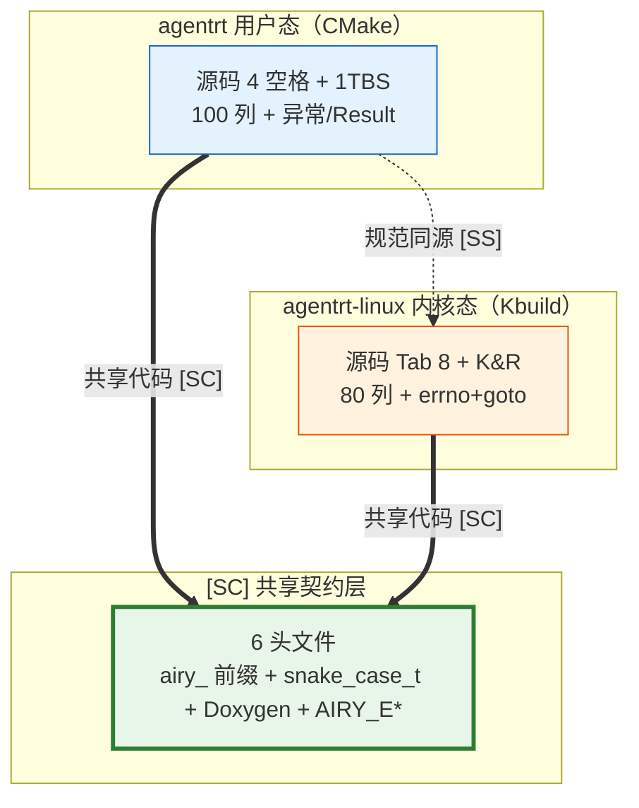

Copyright (c) 2025-2026 SPHARX Ltd. All Rights Reserved.

# 编码规范遵循

> **文档定位**： agentrt-linux（AirymaxOS） 编码规范的遵循声明、命名规范、C/Rust 风格、日志标准、Doxygen 与安全编码\
> **版本**： 0.1.1\
> **最后更新**： 2026-07-06\
> **父文档**： [接口设计](README.md)

---

## 1. 编码规范遵循声明

agentrt-linux 8 子仓的全部源代码严格遵循 `50-engineering-standards/10-coding-style/` 下的编码规范文件。本文件给出 agentrt-linux 专属的命名空间与补充约定，作为编码规范的前置索引。

| # | 规范文件 | 适用范围 | agentrt-linux 遵循要点 |
|---|---------|---------|-------------------|
| 1 | `coding_conventions.md Part IV` | 全部子仓 | `airy_` 前缀 + `<service>_d` daemon + `module_action_object()` |
| 2 | `C_Cpp_coding_style.md Part I` | kernel / security / memory | 4 空格 + snake_case + 1TBS |
| 3 | `C_Cpp_coding_style.md Part III` | 部分服务 | PascalCase 类型 + RAII |
| 4 | `Rust_coding_style.md Part I` | cognition / cloudnative | rustfmt + clippy |
| 5 | `Go_coding_style.md Part I` | cloudnative / agentctl | gofmt + go vet |
| 6 | `scripting_coding_style.md Part I` | SDK / DevStation | PEP 8 + type hints |
| 7 | `scripting_coding_style.md Part II` | SDK (TS) | ESLint + Prettier |
| 8 | `Rust_coding_style.md Part II` | cognition / cloudnative | unsafe 审查 + 类型安全 |
| 9 | `C_Cpp_coding_style.md Part IV` | kernel / security / memory | 边界检查 + 内存安全 |
| 10 | `Go_coding_style.md Part II` | cloudnative | errcheck + race detector |
| 11 | `scripting_coding_style.md Part III` | （预留） | - |
| 12 | `coding_conventions.md Part V` | 全部子仓 | 最小权限 + capability |
| 13 | `coding_conventions.md Part III` | 全部子仓 | ANSI 颜色 + log_write() |
| 14 | `coding_conventions.md Part I` | 全部子仓 | Doxygen 模板 |
| 15 | `coding_conventions.md Part II` | 全部子仓 | 配置审计日志 |

**遵循原则**:

- **强制优先**: 本文件未覆盖的事项，以 5 个合并规范文件为准。
- **agentrt-linux 专属约定**: 本文件第 2-5 章给出 agentrt-linux 专属的命名空间与风格补充，与 5 个合并规范文件叠加生效。
- **评审门槛**: 代码评审必须检查编码规范遵循情况，违反规范必须打回（对齐 ACC-OS03 验收标准）。

---

## 2. 命名规范

### 2.1 命名空间前缀

agentrt-linux 全部公共符号使用统一命名空间前缀，与 agentrt 同源保持兼容：

| 语言 | 命名空间前缀 | 示例 |
|------|-------------|------|
| C | `airy_` | `airy_sys_task_submit` / `struct airy_ipc_msg_hdr` |
| C++ | `agentrt::` | `agentrt::AirymaxClient` |
| Rust | `agentrt`（crate）/ `agentrt::`（mod） | `agentrt::cognition::TaskDesc` |
| Go | `agentrt`（package） | `agentrt.AirymaxClient` |
| Python | `agentrt`（package） | `agentrt.AirymaxClient` |
| TypeScript | `@openairymax/agentrt`（package） | `AirymaxClient`（导出符号） |

### 2.2 Daemon 二进制命名

守护进程二进制统一使用 `<service_name>_d` 后缀（与 agentrt daemons 同源）：

| Daemon 二进制 | 职责 | 所属子仓 |
|--------------|------|---------|
| `gateway_d` | 网关守护进程 | services |
| `llm_d` | LLM 推理守护进程 | services |
| `tool_d` | 工具守护进程 | services |
| `sched_d` | 调度守护进程 | services |
| `market_d` | 市场守护进程 | services |
| `monit_d` | 监控守护进程 | services |
| `channel_d` | 通道守护进程 | services |
| `info_d` | 信息守护进程 | services |
| `notify_d` | 通知守护进程 | services |
| `observe_d` | 观测守护进程 | services |
| `hook_d` | 钩子守护进程 | services |
| `plugin_d` | 插件守护进程 | services |
| `memoryrovol_d` | 记忆卷载守护进程 | memory |

### 2.3 函数命名

函数命名使用 `module_action_object()` 模式（动词 + 对象，模块前缀）：

| 示例 | 模块 | 动作 | 对象 |
|------|------|------|------|
| `airy_task_submit` | agentrt | submit | task |
| `airy_ipc_send` | agentrt | send | ipc |
| `airy_ipc_recv` | agentrt | recv | ipc |
| `airy_rovol_snapshot` | agentrt | snapshot | rovol（记忆卷载） |
| `airy_capability_request` | agentrt | request | capability |
| `airy_clt_phase_notify` | agentrt | notify | clt（CoreLoopThree）阶段 |

### 2.4 文件命名

文件命名使用 snake_case：

| 示例 | 用途 |
|------|------|
| `airy_ipc_msg.h` | IPC 消息头定义 |
| `airy_syscalls.h` | 系统调用接口 |
| `include/airymax/error.h` | 错误码 SSoT 定义（[SC] 补充共享头文件） |
| `daemon_errors.h` | daemon 错误码 |
| `sched_agent.bpf.c` | SCHED_AGENT eBPF 程序 |
| `io_uring_ipc.c` | io_uring IPC 实现 |

### 2.5 类型命名

| 语言 | 类型命名风格 | 示例 |
|------|-------------|------|
| C | snake_case_t（`_t` 后缀） | `struct airy_ipc_msg_hdr` / `struct airy_task_desc` |
| C++ | PascalCase | `AirymaxClient` / `TaskDesc` |
| Rust | PascalCase | `AirymaxClient` / `TaskDesc` |
| Go | PascalCase（导出）/ camelCase（私有） | `AirymaxClient` / `taskDesc` |
| Python | PascalCase（类） | `AirymaxClient` |
| TypeScript | PascalCase | `AirymaxClient` |

---

## 3. C 代码风格

C 代码风格遵循 `C_Cpp_coding_style.md Part I`，agentrt-linux 补充约定如下。

### 3.1 缩进与括号

- **缩进**: 4 空格，禁止 Tab。
- **括号风格**: 1TBS（K&R 风格），开括号与控制语句同行。
- **行宽**: 100 字符，超长需换行并对齐。

```c
/* 正确：4 空格 + 1TBS */
if (ret < 0) {
    log_write(LOG_ERROR, "ipc_send failed: errno=%d", ret);
    return ret;
}
```

### 3.2 命名

- 函数与变量: snake_case（`airy_ipc_send` / `payload_len`）。
- 类型: snake_case_t（`struct airy_ipc_msg_hdr`）。
- 宏与常量: UPPER_SNAKE_CASE（`AIRY_IPC_HDR_SZ`）。

### 3.3 头文件保护

```c
#ifndef AIRY_IPC_MSG_H
#define AIRY_IPC_MSG_H
/* ... */
#endif /* AIRY_IPC_MSG_H */
```

### 3.4 Doxygen 注释

所有公共函数必须包含 Doxygen 注释（模板见第 6 章）。

---

## 4. Rust 代码风格

Rust 代码风格遵循 `Rust_coding_style.md Part I`，agentrt-linux 补充约定如下。

### 4.1 工具链

- **rustfmt**: 全部代码必须通过 `cargo fmt --check`。
- **clippy**: 全部代码必须通过 `cargo clippy -- -D warnings`。
- **edition**: Rust 2021 edition。

### 4.2 命名

- 函数与方法: snake_case（`submit_task` / `check_capability`）。
- 类型与 trait: PascalCase（`AirymaxClient` / `TaskDesc`）。
- 常量: UPPER_SNAKE_CASE（`AIRY_IPC_HDR_SZ`）。
- 模块: snake_case（`agentrt::cognition`）。

### 4.3 错误处理

```rust
/* 正确：使用 Result<T, Error>，禁止 unwrap() 在生产代码 */
pub async fn submit_task(&self, desc: TaskDesc) -> Result<i32, Error> {
    let req = self.encode_request(desc)?;
    let resp = self.transport.send(req).await?;
    self.decode_task_id(resp)
}
```

### 4.4 unsafe 审查

- 生产代码禁止 `unsafe`，除非有详细安全论证（SAFETY 注释）。
- `unsafe` 块必须包含 `// SAFETY: ...` 注释说明安全性依据。

---

## 5. 日志标准

日志标准遵循 `coding_conventions.md Part III`，agentrt-linux 补充约定如下。

### 5.1 ANSI 颜色

日志必须使用 ANSI 颜色区分级别：

| 级别 | ANSI 颜色 | 转义码 | 用途 |
|------|----------|--------|------|
| INFO | 蓝 | `\033[34m` | 正常运行信息 |
| WARN | 黄 | `\033[33m` | 警告，可继续运行 |
| ERROR | 红 | `\033[31m` | 错误，需介入 |
| FATAL | 品红 | `\033[35m` | 致命错误，进程退出 |
| DEBUG | 灰 | `\033[90m` | 调试信息（默认关闭） |

### 5.2 时间戳

- 使用 `CLOCK_REALTIME` 纳秒时间戳，与 IPC 消息头 `timestamp_ns` 对齐。
- 日志显示对齐北京时间（UTC+8）。
- 格式: `YYYY-MM-DD HH:MM:SS.nnnnnnnnn`。

### 5.3 日志 API

必须使用 `log_write()` 或 `log_write_va()`，禁止 `fprintf` / `printf` 直接输出：

```c
/* 日志 API（airy_log.h） */
#define LOG_DEBUG 0
#define LOG_INFO  1
#define LOG_WARN  2
#define LOG_ERROR 3
#define LOG_FATAL 4

AIRY_API void log_write(int level, const char *fmt, ...);
AIRY_API void log_write_va(int level, const char *fmt, va_list ap);
```

### 5.4 日志格式

```
2026-07-06 14:30:00.123456789 [INFO] [gateway_d:1234] ipc_send ok: trace_id=0x...
```

字段顺序: 时间戳 / 级别 / [进程名:PID] / 消息。

### 5.5 结构化字段

关键操作必须输出结构化字段，便于 OpenTelemetry 采集：

- `trace_id`: 链路追踪 ID（与 IPC 消息头对齐）。
- `task_id`: Agent 任务 ID。
- `errno`: 错误码（对齐 `include/airymax/error.h`）。

---

## 6. Doxygen 注释模板

注释模板遵循 `coding_conventions.md Part I`，所有公共函数必须使用以下 Doxygen 模板。

### 6.1 函数注释模板

```c
/**
 * @brief 一句话功能描述
 *
 * 详细描述（可选，多行）。
 *
 * @param param1 参数1说明
 * @param param2 参数2说明
 * @return 返回值说明（成功 / 失败语义）
 *
 * @since 1.0.1
 * @see 关联函数或文档
 * @note 注意事项（可选）
 * @warning 警告事项（可选）
 */
```

### 6.2 类型注释模板

```c
/**
 * @brief IPC 128 字节定长消息头（SSoT：include/airymax/ipc.h，Layout C）
 *
 * 权威定义见 [SC] 共享契约层；此处仅展示 Doxygen 行内注释风格示例。
 */
struct airy_ipc_msg_hdr {
    __u32 magic;          /**< 魔数 'ARE1'（0x41524531） */
    __u16 opcode;         /**< SQE/CQE 操作码 */
    __u16 flags;          /**< 标志位 */
    /* ... 其余字段见 SSoT Layout C */
} __attribute__((packed));
```

### 6.3 文件头注释模板

```c
/**
 * @file airy_ipc_msg.h
 * @brief agentrt-linux IPC 128 字节定长消息头定义
 *
 * 同源 agentrt AgentsIPC，基于 io_uring 零拷贝实现。
 *
 * @since 1.0.1
 * @copyright (c) 2026 SPHARX Ltd.
 */
```

---

## 7. 安全编码规范

安全编码遵循 `coding_conventions.md Part V` + `C_Cpp_coding_style.md Part IV` + `Rust_coding_style.md Part II`，agentrt-linux 补充约定如下。

### 7.1 输入验证

- 所有外部输入（用户参数、IPC payload、网络数据）必须校验。
- 字符串参数必须检查长度与 NUL 终止。
- 数值参数必须检查范围（如 `priority` 必须 0-139）。

```c
/* 正确：校验 priority 范围 */
AIRY_API int airy_sys_task_submit(const struct airy_task_desc *task_desc,
                                       uint32_t priority)
{
    if (task_desc == NULL) {
        return -AIRY_EINVAL;
    }
    if (priority > 139) {
        return -AIRY_EINVAL;
    }
    /* ... */
}
```

### 7.2 内存管理

- 禁止 `strcpy` / `strcat` / `strncpy` / `strncat`，必须使用 `strscpy` / `strscpy_pad`（对齐 OS-BAN-004，禁止 strncpy 因其不保证 NUL 终止）。
- 禁止 `sprintf`，必须使用 `snprintf`。
- 动态分配必须配对 `free`，推荐使用 RAII（C++）或 `Drop`（Rust）。
- 所有堆分配必须检查返回值。

### 7.3 错误处理

- 所有系统调用与库函数必须检查返回值。
- 错误必须通过 `AIRY_E*` 错误码返回，禁止吞掉错误。
- 资源释放使用 `goto cleanup` 模式（C）或 `Drop`（Rust）。

```c
/* 正确：goto cleanup 模式 */
AIRY_API int do_work(void)
{
    int ret;
    void *buf = malloc(SIZE);
    if (buf == NULL) {
        return -AIRY_ENOMEM;
    }

    ret = step_one(buf);
    if (ret < 0) {
        goto cleanup;
    }

    ret = step_two(buf);
    if (ret < 0) {
        goto cleanup;
    }

cleanup:
    free(buf);
    return ret;
}
```

### 7.4 沙箱隔离

- Agent 代码默认运行在 Wasm 3.0 沙箱（详见 [20-modules/05-cognition.md](../20-modules/05-cognition.md) 第 4.3 节）。
- 沙箱内 capability 受限，通过 `airy_sys_capability_request` 显式申请。
- 系统调用通过 seccomp 白名单过滤（详见 [20-modules/03-security.md](../20-modules/03-security.md) 第 4.3 节）。
- 文件访问通过 Landlock 限制。

### 7.5 并发安全

- 共享数据必须加锁或使用原子操作。
- 推荐使用无锁数据结构（io_uring ring）减少锁竞争。
- Rust 代码通过类型系统保证线程安全（`Send` / `Sync`）。

---

## 8. 代码示例对照

### 8.1 对照一：返回值检查

```c
/* 错误：未检查返回值 */
airy_sys_ipc_send(hdr, payload);

/* 正确：检查返回值并记录日志 */
int ret = airy_sys_ipc_send(hdr, payload);
if (ret < 0) {
    log_write(LOG_ERROR, "ipc_send failed: errno=%d (%s)",
              ret, airy_strerror(ret));
    return ret;
}
```

### 8.2 对照二：字符串操作

```c
/* 错误：使用 strcpy，存在缓冲区溢出风险 */
strcpy(dst, src);

/* 正确：使用 strncpy 并显式限制长度 */
strncpy(dst, src, dst_size - 1);
dst[dst_size - 1] = '\0';
```

### 8.3 对照三：日志输出

```c
/* 错误：使用 fprintf 直接输出 */
fprintf(stderr, "ipc_send failed\n");

/* 正确：使用 log_write 并携带结构化字段 */
log_write(LOG_ERROR, "ipc_send failed: trace_id=0x%lx errno=%d",
          hdr->trace_id, ret);
```

### 8.4 对照四：内存分配

```c
/* 错误：未检查 malloc 返回值 */
void *buf = malloc(SIZE);
process(buf);  /* buf 可能为 NULL */
free(buf);

/* 正确：检查返回值 + goto cleanup */
void *buf = malloc(SIZE);
if (buf == NULL) {
    log_write(LOG_ERROR, "malloc failed: size=%zu", (size_t)SIZE);
    return -AIRY_ENOMEM;
}
process(buf);
free(buf);
```

### 8.5 对照五：Rust 错误处理

```rust
// 错误：生产代码使用 unwrap()
let resp: Response = client.send(req).await.unwrap();

// 正确：使用 ? 传播错误，由调用方决定处理策略
let resp: Response = client.send(req).await?;
```

### 8.6 对照六：参数校验

```c
/* 错误：未校验参数 */
AIRY_API int airy_sys_task_submit(const struct airy_task_desc *task_desc,
                                       uint32_t priority)
{
    return do_submit(task_desc, priority);
}

/* 正确：校验 NULL 与范围 */
AIRY_API int airy_sys_task_submit(const struct airy_task_desc *task_desc,
                                       uint32_t priority)
{
    if (task_desc == NULL) {
        return -AIRY_EINVAL;
    }
    if (priority > 139) {
        return -AIRY_EINVAL;
    }
    return do_submit(task_desc, priority);
}
```

---

## 9. 相关文档

- [接口设计](README.md)
- [系统调用接口](01-syscalls.md)
- [IPC 协议](02-ipc-protocol.md)
- [SDK API](03-sdk-api.md)
- [内核设计](../20-modules/01-kernel.md)
- [安全设计](../20-modules/03-security.md)
- 编码规范目录: `50-engineering-standards/10-coding-style/`（编码规范文件）

---

## 10. IRON-9 v2 三层共享模型

> **OS-IFACE-007**： 编码规范遵循 IRON-9 v2 三层共享模型——命名前缀（`airy_`）、类型命名（`snake_case_t`）、Doxygen 注释、错误码（`AIRY_E*`）通过 [SC] 共享契约层头文件同源；构建系统与缩进风格各自独立。禁止在 agentrt 与 agentrt-linux 之间引入风格转换工具或 lint 规则映射层。

### 10.1 三层模型概览

| 层次 | 共享程度 | 本接口涉及内容 |
|------|---------|---------------|
| **[SC] 共享契约层** | 完全共享代码 | 6 个头文件的命名风格、类型定义、Doxygen 注释、`AIRY_E*` 错误码前缀在两侧完全一致 |
| **[SS] 语义同源层** | 规范同源，实现独立 | agentrt（CMake 管理）↔ agentrt-linux（Kbuild + Kconfig 管理）的命名规范、daemon 命名（`_d` 后缀）、函数命名（`module_action_object()`）同源 |
| **[IND] 完全独立层** | 完全独立 | agentrt 用户态编码风格（4 空格 + 1TBS + 100 列）↔ agentrt-linux 内核态编码风格（Linux 6.6 内核基线：Tab 8 + K&R + 80 列 + errno+goto） |

### 10.2 [SC] 共享契约层——头文件编码风格在两侧的角色

| 头文件 | 共享的编码风格要素 | 消费方 |
|--------|-------------------|--------|
| `sched.h` | `struct airy_task_desc` 类型命名 + magic 宏 UPPER_SNAKE + kernel-doc | kernel / cognition |
| `ipc.h` | `struct airy_ipc_msg_hdr` 类型命名 + `AIRY_IPC_*` 宏前缀 + Doxygen | kernel / services |
| `syscalls.h` | `AIRY_SYS_*` 宏命名 + 24 槽位编号 + kernel-doc | kernel / cognition |
| `security_types.h` | 41 cap ID 枚举 + 252 LSM 钩子枚举 + `snake_case_t` | kernel / security |
| `memory_types.h` | L1-L4 结构命名 + GFP 掩码宏 + Doxygen | kernel / memory |
| `cognition_types.h` | 三阶段枚举 + Thinkdual 模式 + kernel-doc | kernel / cognition |

### 10.3 [SS] 语义同源层——agentrt ↔ agentrt-linux 编码规范映射

| 规范项 | agentrt（用户态，CMake） | agentrt-linux（内核态，Kbuild） | 同源程度 |
|--------|------------------------|-------------------------------|---------|
| 命名前缀 | `airy_` / `agentrt::` / `agentrt.` | `airy_` / `agentrt::` / `agentrt.` | 完全同源 |
| daemon 命名 | `<service>_d` 后缀 | `<service>_d` 后缀 | 完全同源 |
| 函数命名 | `module_action_object()` | `module_action_object()` | 完全同源 |
| 类型命名 | `snake_case_t`（C）/ PascalCase（Rust/Go） | `snake_case_t`（C）/ PascalCase（Rust/Go） | 完全同源 |
| Doxygen 注释 | `@brief` / `@param` / `@return` | `@brief` / `@param` / `@return` | 完全同源 |
| 错误码 | `AIRY_E*` 负值返回 | `AIRY_E*` 负值返回 | 完全同源 |

### 10.4 [IND] 完全独立层

| 独立项 | agentrt 实现 | agentrt-linux 实现 | 独立原因 |
|--------|-------------|-------------------|---------|
| 缩进风格 | 4 空格（禁止 Tab） | Linux 6.6 内核基线 Tab 8（内核态强制） | 内核编码传统 |
| 括号风格 | 1TBS（K&R 变体） | K&R（Linux 6.6 内核基线 标准） | 内核风格统一 |
| 行宽限制 | 100 字符 | 80 列（Linux 6.6 内核基线 强制） | 内核传统 |
| 错误处理 | 异常 / Result / error | errno + goto（Linux 6.6 内核基线 单出口） | 内核 goto 惯例 |
| 构建系统 | CMake（跨三平台） | Kbuild + Kconfig（Linux 6.6） | 工具链差异 |
| Lint 工具 | clang-format / rustfmt / gofmt | checkpatch.pl（Linux 6.6 内核基线） | 内核审查工具 |

### 10.5 跨态协作流



> **OS-IFACE-008**： 编码规范在 agentrt（用户态，4 空格 + 1TBS + 100 列）与 agentrt-linux 内核态（Linux 6.6 内核基线 Tab 8 + K&R + 80 列 + errno+goto）间保持命名同源而风格独立——6 个 [SC] 共享头文件统一采用 `airy_` 前缀 + `snake_case_t` + Doxygen + `AIRY_E*`，在两侧编译期通过 `-I` 引用同一份源码，禁止生成风格转换中间文件。

---

© 2025-2026 SPHARX Ltd. All Rights Reserved.
