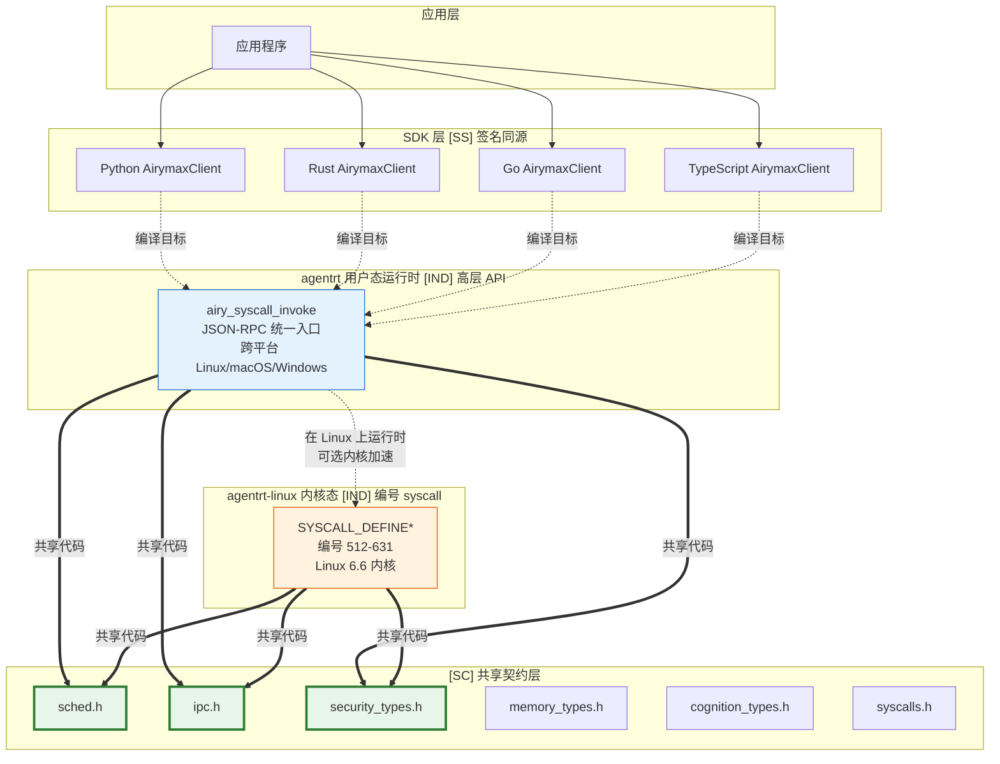
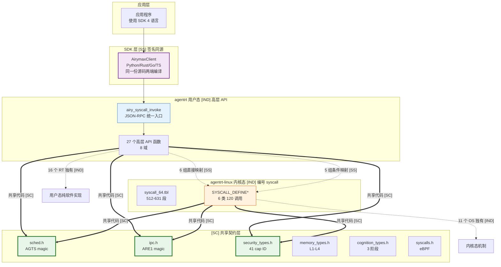

Copyright (c) 2025-2026 SPHARX Ltd. All Rights Reserved.

# agentrt ↔ agentrt-linux 系统调用语义映射
> **文档定位**：基于 P0-03 决策（方案 D：分层 API 设计），建立 agentrt（用户态运行时）与 agentrt-linux（AirymaxOS 内核态）之间的系统调用语义映射关系，落地 IRON-9 v2 [SS] 语义同源层\
> **文档版本**：0.1.1\
> **最后更新**：2026-07-10\
> **上级文档**：[agentrt-linux 设计文档](README.md)

---

## 1. 背景与决策

### 1.1 P0-03 问题回顾

IRON-9 v2 [SS] 语义同源层声明"API 签名同源、实现独立"，但深度审查发现 agentrt（用户态）与 agentrt-linux（内核态）的系统调用 API 签名**根本不同**：

| 对比项 | AirymaxRT（agentrt 用户态） | AirymaxOS（agentrt-linux 内核态） | 差异性质 |
|--------|---------------------------|--------------------------------|---------|
| 参数类型 | JSON 字符串（`const char *input, size_t input_len`） | 类型化结构体（`const struct airy_task_desc *task_desc`） | 抽象层级不同 |
| 返回类型 | `airy_err_t` + JSON 输出（`char **out_output`） | `int`（`AIRY_E*` 负值） | 接口范式不同 |
| 调用入口 | 统一入口 `airy_syscall_invoke()` | 编号 syscall（512-631） | 设计哲学不同 |
| 功能域 | 7 域（Agent/Task/Skill/Session/Memory/Telemetry + init/free） | 6 类（Task/IPC/Memory/Sched/Security/Cognition） | 分类不同 |

**根因**：AirymaxRT 的系统调用设计为 **JSON-RPC 风格的统一调用**（高抽象层，跨平台行业底座），AirymaxOS 的系统调用设计为 **Linux 风格的编号 syscall**（低抽象层，Linux 传统 + seL4 借鉴）。二者处于不同的抽象层级，不是同一接口的两个实现。

### 1.2 方案 D 决策（分层 API 设计）

用户经 8 维度量化分析后选择**方案 D（分层 API 设计）**：

| 层级 | agentrt（用户态运行时） | agentrt-linux（AirymaxOS 内核态） |
|------|----------------------|--------------------------------|
| **API 范式** | JSON-RPC 高层 API | 编号 syscall（512-631） |
| **调用入口** | `airy_syscall_invoke()` 统一入口 | `SYSCALL_DEFINE*` 宏 + `syscall_64.tbl` |
| **参数风格** | JSON 字符串（跨语言、跨平台） | 类型化结构体（Linux 传统 + seL4 借鉴） |
| **定位** | 跨平台行业底座（Linux/macOS/Windows） | Linux 6.6 内核智能体操作系统 |
| **[SS] 语义** | 高层 API 语义同源（概念操作一致），签名因抽象层级不同而独立演进 | 同左 |
| **SDK 层** | 4 语言 AirymaxClient，同一份源码两端编译，签名确实同源 | 同左 |

**决策要点**：
- agentrt 保持 JSON-RPC 高层 API，作为跨平台行业底座（不绑定 Linux syscall 号）
- agentrt-linux 保持编号 syscall 512-631，遵循 Linux 传统 + seL4 借鉴
- [SS] 修正为"高层 API 语义同源（概念操作一致），签名因抽象层级不同而独立演进"
- SDK 层（AirymaxClient 4 语言）签名确实同源，保留"签名同源"但限定为"SDK 层"

---

## 2. 分层 API 设计概览



### 2.1 三层调用模型

| 层次 | agentrt 侧 | agentrt-linux 侧 | 共享程度 |
|------|-----------|-----------------|---------|
| **[SC] 共享契约层** | 6 个头文件（`include/airymax/`） | 同一 6 个头文件（`kernel/include/airymax/`） | 完全共享代码 |
| **[SS] 语义同源层** | JSON-RPC 高层 API（27 函数，8 域） | 编号 syscall（512-631，6 类 120 调用） | 概念操作一致，签名独立演进 |
| **[IND] 完全独立层** | 跨平台 syscall 封装（libc syscall()） | 内核 syscall 表注册（`syscall_64.tbl`） | 完全独立 |

### 2.2 调用路径

agentrt 在 agentrt-linux 上运行时，系统调用经过两条路径：

| 路径类型 | 路径 | 延迟量级 | 用途 |
|---------|------|---------|------|
| **控制面（syscall）** | 应用 → SDK → `airy_syscall_invoke()` → libc syscall() → 内核 `SYSCALL_DEFINE*` | ~1 μs | 任务提交、capability 申请、策略设置 |
| **数据面（io_uring）** | 应用 → SDK → `airy_ipc_ring_enter()` → io_uring SQE → 内核 CQE → 应用 | ~10 μs | IPC 收发、记忆迁移、流式数据 |

控制面用于低频、需同步语义的操作；数据面用于高频、可异步、需零拷贝的操作。二者配合实现"机制在内核、策略在用户态"的微内核目标。

---

## 3. [SS] 语义同源映射表

### 3.1 直接语义映射（概念操作一一对应）

以下 6 组系统调用在 agentrt 与 agentrt-linux 之间存在**直接语义映射**——概念操作一致，但因抽象层级不同，函数签名独立演进：

| # | agentrt 用户态 API | agentrt-linux 内核 syscall | 语义概念 | [SC] 共享契约 | 签名差异 |
|---|-------------------|-------------------------|---------|--------------|---------|
| 1 | `airy_sys_task_submit(input, input_len, timeout_ms, out_output)` | #512 `airy_sys_task_submit(task_desc, priority)` | 提交 Agent 任务到调度器 | `sched.h`（`struct airy_task_desc` magic 0x41475453） | JSON 字符串 vs 类型化结构体 |
| 2 | `airy_sys_task_cancel(task_id)` | #513 `airy_sys_task_cancel(task_id)` | 取消 Agent 任务 | `sched.h`（任务描述符） | 字符串 ID vs 整数 ID |
| 3 | `airy_sys_task_query(task_id, out_status)` | #514 `airy_sys_task_status(task_id, out_status)` | 查询任务状态 | `sched.h`（任务状态枚举） | 字符串 ID + int* vs 整数 ID + 结构体* |
| 4 | `airy_sys_ipc_send(hdr, payload)` → 通过 `airy_syscall_invoke` 路由 | #532 `airy_sys_ipc_send(hdr, payload)` | 发送 IPC 消息 | `ipc.h`（`struct airy_ipc_msg_hdr` magic 0x41524531） | JSON 包装 vs 直接调用 |
| 5 | `airy_sys_ipc_recv(hdr, payload_buf)` → 通过 `airy_syscall_invoke` 路由 | #533 `airy_sys_ipc_recv(hdr, payload_buf, payload_cap)` | 接收 IPC 消息 | `ipc.h`（128B 消息头布局） | JSON 包装 vs 直接调用 |
| 6 | `airy_sys_memory_write` / `airy_sys_memory_get` | #552 `airy_sys_rovol_snapshot(pid, snapshot_id_out)` | 进程记忆写入 / 快照 | `memory_types.h`（MemoryRovol L1-L4 结构） | 应用层写入 vs 内核态快照 |

### 3.2 条件语义映射（概念相关但非一一对应）

以下映射组在概念上相关，但因抽象层级不同，agentrt 的一个高层 API 可能映射到 agentrt-linux 的多个低层 syscall，或反之：

| # | agentrt 用户态 API | agentrt-linux 内核 syscall 组 | 映射关系 | 说明 |
|---|-------------------|----------------------------|---------|------|
| 1 | `airy_sys_agent_spawn(agent_spec, out_agent_id)` | #512 `task_submit` + #592 `capability_request` | 1 → 2 | agentrt 高层 spawn 语义在内核态分解为"提交任务 + 申请 capability" |
| 2 | `airy_sys_agent_terminate(agent_id)` | #513 `task_cancel` + #593 `capability_revoke` | 1 → 2 | 终止 Agent 在内核态分解为"取消任务 + 撤销 capability" |
| 3 | `airy_sys_memory_delete` | #553 `airy_sys_rovol_restore(snapshot_id, pid)` | 1 → 1 | 应用层删除记忆 ↔ 内核态从快照恢复（语义逆向） |
| 4 | `airy_sys_skill_execute` | #614 `airy_sys_wasm_load_module` + #612 `airy_sys_clt_phase_notify` | 1 → 2 | Skill 执行在内核态分解为"Wasm 模块加载 + CLT 阶段通知" |
| 5 | `airy_sys_telemetry_metrics` | 内核 `perf trace` + `bpftrace`（非 syscall） | 1 → 0 | agentrt 应用层 metrics 在 agentrt-linux 上通过内核原生可观测性工具获取，无专用 syscall |

### 3.3 语义映射规则

**规则 SM-1**：agentrt 高层 API 的一个概念操作，在 agentrt-linux 内核态可能分解为 1~N 个低层 syscall。分解规则由 [SC] 共享契约层的类型定义约束。

**规则 SM-2**：agentrt-linux 的 syscall 在内核态提供"机制"（提交、发送、快照、授权），agentrt 高层 API 在用户态组合"策略"（Agent 生命周期、Skill 编排、Session 管理）。

**规则 SM-3**：当 agentrt 运行在 agentrt-linux 上时，`airy_syscall_invoke()` 内部可选地走内核加速路径（直接调用编号 syscall 512-631），而非 Linux 平台则走用户态纯软件实现。这一选择对应用层透明。

---

## 4. [IND] agentrt 独有系统调用（用户态高层 API）

以下 agentrt 系统调用在 agentrt-linux 内核态**无直接对应**，属于 agentrt 用户态运行时独有，因抽象层级差异或跨平台约束而不下沉到内核：

### 4.1 初始化与生命周期

| agentrt API | 独有原因 | 跨平台说明 |
|-------------|---------|-----------|
| `airy_syscalls_init()` | 用户态运行时初始化，无内核对应 | Linux/macOS/Windows 三平台共用 |
| `airy_syscalls_cleanup()` | 用户态运行时清理，无内核对应 | 同上 |
| `airy_sys_free(ptr)` | 用户态内存释放，无内核对应 | 同上 |

### 4.2 会话管理（Session）

| agentrt API | 独有原因 |
|-------------|---------|
| `airy_sys_session_create()` | 会话是应用层概念，内核态无对应 |
| `airy_sys_session_get()` | 同上 |
| `airy_sys_session_close()` | 同上 |
| `airy_sys_session_list()` | 同上 |
| `airy_sys_session_get_persist_status()` | 同上 |

### 4.3 Agent 管理（应用层编排）

| agentrt API | 独有原因 |
|-------------|---------|
| `airy_sys_agent_spawn()` | 高层 spawn 语义，内核态分解为 task_submit + capability_request |
| `airy_sys_agent_terminate()` | 高层 terminate 语义，内核态分解为 task_cancel + capability_revoke |
| `airy_sys_agent_invoke()` | 高层 invoke 语义，内核态无直接对应 |
| `airy_sys_agent_list()` | 应用层查询，内核态无 list syscall |

### 4.4 Skill 管理

| agentrt API | 独有原因 |
|-------------|---------|
| `airy_sys_skill_install()` | 应用层 Skill 安装，内核态无直接对应 |
| `airy_sys_skill_execute()` | 高层执行语义，内核态分解为 wasm_load_module + clt_phase_notify |
| `airy_sys_skill_list()` | 应用层查询，内核态无 list syscall |
| `airy_sys_skill_uninstall()` | 应用层 Skill 卸载，内核态无直接对应 |

### 4.5 记忆管理（应用层语义）

| agentrt API | 独有原因 |
|-------------|---------|
| `airy_sys_memory_write()` | 应用层写入，内核态对应 rovol_snapshot（语义不完全对等） |
| `airy_sys_memory_search()` | 应用层搜索，内核态无对应（用户态索引） |
| `airy_sys_memory_get()` | 应用层读取，内核态对应 rovol_restore（语义逆向） |
| `airy_sys_memory_delete()` | 应用层删除，内核态无直接对应 |

### 4.6 可观测性

| agentrt API | 独有原因 |
|-------------|---------|
| `airy_sys_telemetry_metrics()` | 应用层 metrics，agentrt-linux 通过内核 perf/bpftrace 获取 |
| `airy_sys_telemetry_traces()` | 应用层 traces，agentrt-linux 通过 OpenTelemetry 导出 |

### 4.7 任务管理（部分独有）

| agentrt API | 独有原因 |
|-------------|---------|
| `airy_sys_task_wait()` | 用户态同步原语，内核态无 wait syscall（由 polling task_status 实现） |

---

## 5. [IND] agentrt-linux 独有系统调用（内核态机制）

以下 agentrt-linux 系统调用在 agentrt 用户态运行时**无直接对应**，属于内核态独有机制，因 Linux 内核能力或 seL4 借鉴而不上提到应用层：

### 5.1 IPC 内核机制（io_uring 零拷贝）

| OS syscall # | 内核 API | 独有原因 |
|-------------|---------|---------|
| #534 | `airy_sys_ipc_register_ring()` | 注册跨进程 io_uring ring，内核态机制，agentrt 用户态使用 POSIX MQ |
| — | `io_uring_setup()` / `io_uring_enter()` | io_uring 内核接口，agentrt 用户态封装为 `airy_ipc_ring_create()` |

### 5.2 内存内核机制（MemoryRovol + CXL + MGLRU）

| OS syscall # | 内核 API | 独有原因 |
|-------------|---------|---------|
| #554 | `airy_sys_rovol_migrate()` | 记忆跨节点迁移，内核态 PMEM 机制 |
| #555 | `airy_sys_cxl_tier_set()` | CXL 内存分层策略，内核态硬件接口 |
| #556 | `airy_sys_mglru_config()` | MGLRU（多代 LRU）配置，内核态页回收策略 |

### 5.3 调度内核机制（sched_ext + eBPF）

| OS syscall # | 内核 API | 独有原因 |
|-------------|---------|---------|
| #572 | `airy_sys_sched_set_policy()` | 设置 sched_ext 策略，内核态 eBPF 机制 |
| #573 | `airy_sys_sched_get_policy()` | 查询当前策略，内核态 eBPF 机制 |

### 5.4 安全内核机制（capability + LSM）

| OS syscall # | 内核 API | 独有原因 |
|-------------|---------|---------|
| #593 | `airy_sys_capability_revoke()` | 撤销 capability，内核态 CNode 操作（agentrt 用户态无 revoke syscall） |
| #594 | `airy_sys_lsm_load_policy()` | 加载 agent_lsm 策略，内核态 LSM 钩子 |

### 5.5 认知内核机制（CoreLoopThree kthread + Wasm）

| OS syscall # | 内核 API | 独有原因 |
|-------------|---------|---------|
| #613 | `airy_sys_clt_register_kthread()` | 注册 CoreLoopThree kthread，内核态线程机制 |
| #614 | `airy_sys_wasm_load_module()` | 加载 Wasm 3.0 模块，内核态运行时 |
| #615 | `airy_sys_task_migrate()` | 跨超节点迁移任务，内核态 cloudnative 机制 |

---

## 6. SDK 层签名同源

虽然 agentrt 与 agentrt-linux 的系统调用签名因抽象层级不同而独立演进，但 **SDK 层**（AirymaxClient 4 语言）保持签名同源——同一份源码在两端编译：

| 语言 | agentrt SDK 包 | agentrt-linux SDK 包 | 签名同源机制 |
|------|---------------|---------------------|-------------|
| Python | `agentrt.AirymaxClient` | 同一包（`pip install agentrt`） | 同一份源码，运行时自动检测平台 |
| Rust | `agentrt::AirymaxClient` | 同一 crate（`cargo add agentrt`） | 同一份源码，feature flag 区分 |
| Go | `github.com/openairymax/agentrt-go` | 同一 module | 同一份源码，build tag 区分 |
| TypeScript | `@openairymax/agentrt` | 同一包（`npm install @openairymax/agentrt`） | 同一份源码，运行时检测 |

**SDK 层签名同源示例（Python）**：

```python
# 同一份源码，在 agentrt 用户态和 agentrt-linux 内核态上均可运行
from agentrt import AirymaxClient

client = AirymaxClient()

# 任务提交——SDK 层签名同源
# 在 agentrt 用户态：内部走 airy_syscall_invoke() JSON-RPC
# 在 agentrt-linux：内部可选走编号 syscall #512 内核加速
result = client.task_submit(task_desc, priority=100)
```

**SDK 层同源规则 SR-1**：SDK 层签名同源不意味着底层调用路径相同。SDK 内部根据运行平台（Linux/macOS/Windows）和是否检测到 agentrt-linux 内核，自动选择最优调用路径（JSON-RPC 或编号 syscall），对应用层透明。

---

## 7. 调用路径选择决策

### 7.1 agentrt 在不同平台上的调用路径

| 平台 | 控制面路径 | 数据面路径 | 说明 |
|------|-----------|-----------|------|
| **agentrt-linux** | `airy_syscall_invoke()` → libc syscall() → #512-631 | `airy_ipc_ring_enter()` → io_uring SQE/CQE | 内核加速路径，最优性能 |
| **Linux（非 agentrt-linux）** | `airy_syscall_invoke()` → 用户态纯软件实现 | POSIX MQ / Unix Domain Socket | 用户态路径，跨发行版兼容 |
| **macOS** | `airy_syscall_invoke()` → 用户态纯软件实现 | Mach ports / Unix Domain Socket | 用户态路径，跨平台 |
| **Windows** | `airy_syscall_invoke()` → 用户态纯软件实现 | Named Pipes / ALPC | 用户态路径，跨平台 |

### 7.2 内核加速路径检测

agentrt 运行时在启动时检测是否运行在 agentrt-linux 上：

```c
/* agentrt 运行时启动时检测平台 */
static int detect_kernel_accel(void)
{
    /* 检查 /proc/sys/agentrt/present 标记 */
    int fd = open("/proc/sys/agentrt/present", O_RDONLY);
    if (fd < 0) {
        return 0;  /* 非 agentrt-linux，走用户态路径 */
    }
    close(fd);
    return 1;  /* agentrt-linux 检测到，启用内核加速 */
}
```

当检测到 agentrt-linux 时，`airy_syscall_invoke()` 内部可选地将 JSON-RPC 请求解码后，直接调用编号 syscall 512-631，绕过用户态纯软件实现，获得内核加速。这一选择对应用层完全透明。

---

## 8. IRON-9 v2 三层共享模型

> **OS-IFACE-009**： 系统调用语义映射遵循 IRON-9 v2 三层共享模型——agentrt 高层 API（JSON-RPC 统一入口）与 agentrt-linux 编号 syscall（512-631）在 [SS] 语义同源层保持概念操作一致，签名因抽象层级不同而独立演进；SDK 层（AirymaxClient 4 语言）签名确实同源（同一份源码两端编译）。禁止在系统调用层引入签名转换层或 JSON-to-struct 适配层，签名同源仅限于 SDK 层。

### 8.1 三层映射概览

| 层次 | 共享程度 | 本映射文档涉及内容 |
|------|---------|------------------|
| **[SC] 共享契约层** | 完全共享代码 | `sched.h`（任务描述符）+ `ipc.h`（128B 消息头）+ `security_types.h`（capability）+ `memory_types.h`（MemoryRovol）+ `cognition_types.h`（CLT 三阶段）+ `syscalls.h`（eBPF 策略） |
| **[SS] 语义同源层** | 概念操作一致，签名独立演进 | 6 组直接语义映射 + 5 组条件语义映射（见 §3） |
| **[IND] 完全独立层** | 完全独立 | agentrt 独有 19 个高层 API（见 §4）+ agentrt-linux 独有 11 个内核 syscall（见 §5） |

### 8.2 [SC] 共享契约层——在语义映射中的角色

| 头文件 | 在语义映射中的角色 | 消费方 |
|--------|------------------|--------|
| `sched.h` | `struct airy_task_desc` 任务描述符（magic 0x41475453 'AGTS'）约束 task_submit/task_cancel/task_query 的语义同源 | agentrt `syscalls.h` + agentrt-linux `airy_syscalls.h` |
| `ipc.h` | `struct airy_ipc_msg_hdr` 128B 消息头（magic 0x41524531 'ARE1'）约束 ipc_send/ipc_recv 的语义同源 | 同上 |
| `security_types.h` | capability 41 ID 枚举约束 capability_request 的语义同源 | 同上 |
| `memory_types.h` | MemoryRovol L1-L4 快照结构约束 memory_write/rovol_snapshot 的语义同源 | 同上 |
| `cognition_types.h` | CoreLoopThree 三阶段枚举约束 clt_phase_notify 的语义同源 | 同上 |
| `syscalls.h` | 12 核心 syscall 编号体系约束 airy_sys_call/send/recv 等的语义同源 | 同上 |

### 8.3 [SS] 语义同源层——映射完整性

| 映射类型 | 数量 | 占比 | 说明 |
|---------|------|------|------|
| 直接语义映射 | 6 组 | 22%（6/27 RT 函数） | 概念操作一一对应，签名独立演进 |
| 条件语义映射 | 5 组 | 19%（5/27 RT 函数） | 概念相关，1→N 或 N→1 分解 |
| agentrt 独有 | 16 个 | 59%（16/27 RT 函数） | 用户态高层 API，无内核对应 |
| agentrt-linux 独有 | 11 个 | —（11/20 OS syscall） | 内核态机制，无应用层对应 |

### 8.4 [IND] 完全独立层

| 独立项 | agentrt 实现 | agentrt-linux 实现 | 独立原因 |
|--------|-------------|-------------------|---------|
| 调用入口 | `airy_syscall_invoke()` JSON-RPC 统一入口 | `SYSCALL_DEFINE*` 编号 syscall 512-631 | 抽象层级 + 跨平台约束 |
| 参数序列化 | JSON 字符串（跨语言） | 类型化结构体（Linux ABI） | 设计哲学差异 |
| 返回值 | `airy_err_t` + JSON 输出 | `int`（`AIRY_E*` 负值） | 接口范式差异 |
| syscall 表注册 | 无（用户态直接 libc syscall()） | `syscall_64.tbl` 512-631 段 120 项 | 工具链 + 构建系统差异 |
| 平台覆盖 | Linux/macOS/Windows 三平台 | Linux 6.6 内核专属 | 跨平台 vs OS 专属 |

### 8.5 跨态协作流



> **OS-IFACE-010**： SDK 层签名同源是 IRON-9 v2 在系统调用领域的唯一签名同源点——agentrt 与 agentrt-linux 的系统调用层签名因抽象层级不同而独立演进，仅 SDK 层（AirymaxClient 4 语言）通过同一份源码两端编译实现签名同源。禁止在系统调用层引入签名转换层、JSON-to-struct 适配层或编号映射表来强制签名同源。

---

## 9. 映射维护与演进

### 9.1 新增系统调用流程

当任一侧新增系统调用时，需按以下流程更新映射表：

1. **评估映射类型**：新增调用是否属于直接映射、条件映射、RT 独有或 OS 独有？
2. **更新 [SC] 契约**：若涉及共享数据结构，更新对应 [SC] 头文件（`include/airymax/`）。
3. **更新本映射表**：在 §3（[SS] 映射）或 §4/§5（[IND] 独有）中新增条目。
4. **SDK 层适配**：若新增调用需暴露给应用层，在 SDK 4 语言中新增对应方法。
5. **接口评审**：通过 API Review 检查映射一致性、命名规范、错误码规范。

### 9.2 编号稳定性

- agentrt-linux syscall 编号 512-631 在 MAJOR 版本内不可变更（见 [01-syscalls.md](01-syscalls.md) §2.3 ABI 稳定性）。
- agentrt 高层 API 函数名在 MAJOR 版本内不可变更，新增调用只能追加。
- 本映射表的映射关系在 MAJOR 版本内保持稳定，新增映射只能追加，不可复用已废弃映射。

### 9.3 废弃流程

- 废弃映射关系保留 2 个 MAJOR 版本，标注 `@deprecated` 并提供迁移指引。
- agentrt 废弃高层 API 时，对应 agentrt-linux syscall 编号保留但返回 `AIRY_ENOSYS`。
- agentrt-linux 废弃 syscall 时，对应 agentrt 高层 API 降级为用户态纯软件实现。

---

## 10. 相关文档

- [系统调用接口](01-syscalls.md) — agentrt-linux 内核系统调用编号与 C 接口
- [IPC 协议](02-ipc-protocol.md) — 128B 消息头 + io_uring 零拷贝
- [SDK API](03-sdk-api.md) — 4 语言 AirymaxClient 客户端
- [编码规范](04-coding-standard.md) — C/Rust 风格 + 日志 + Doxygen
- [接口设计总览](README.md)
- [架构设计](../10-architecture/01-system-architecture.md) — 五维正交原则

---

© 2025-2026 SPHARX Ltd. All Rights Reserved.
