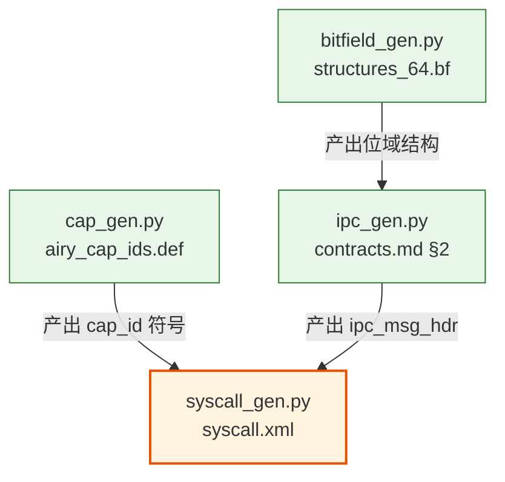
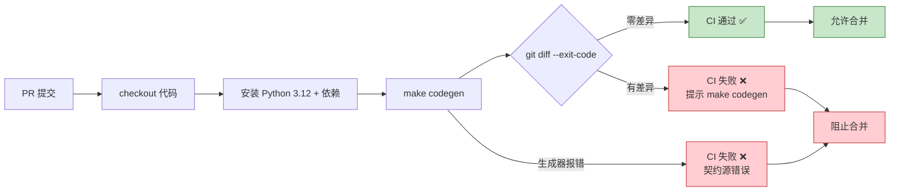

Copyright (c) 2025-2026 SPHARX Ltd. All Rights Reserved.

# agentrt-linux 代码生成管道设计
> **文档定位**：agentrt-linux（AirymaxOS）代码生成管道设计——以契约源（XML/.bf/.def）为唯一输入，自动生成 C / Rust / Python / Go / TypeScript 多语言绑定，消除手工样板代码并保证 [SC] 共享契约层头文件与生成代码的一致性\
> **文档版本**：0.2.8\
> **最后更新**： 2026-07-21\
> **上级文档**：[agentrt-linux 设计文档](README.md)\
> **SSoT 依赖**：[09-ssot-registry.md](../50-engineering-standards/09-ssot-registry.md)（规则编号与契约物理宿主权威来源）

---

## 1. 设计目标

agentrt-linux 在 1.0.1 开发阶段引入代码生成管道（codegen pipeline），将所有跨语言、跨子仓共享的接口契约从"手工维护头文件"模式升级为"契约源驱动生成"模式。代码生成管道是 K-2 接口契约化与 E-7 文档即代码两项原则的工程落地，确保 [SC] 共享契约层头文件在多语言绑定间逐字节一致。

### 1.1 核心目标

| # | 目标 | 衡量标准 |
|---|------|---------|
| 1 | **消除手工编写的样板代码** | syscall 编号宏、syscall 表注册项、位域操作宏、capability ID 枚举、IPC 消息头结构全部由生成器产出，手工编写量为 0 |
| 2 | **保证 [SC] 共享契约层头文件与生成代码的一致性** | CI diff 检查：`make codegen` 输出与仓库已提交文件 diff 必须为空（零差异） |
| 3 | **支持 C / Rust / Python / Go / TypeScript 多语言生成** | 同一契约源一次解析，5 种语言绑定同时产出，签名语义同源 |
| 4 | **CI 集成：codegen 是编译的前置步骤** | `make codegen && make` 串行依赖；codegen 失败则编译终止，PR 不得合并 |

### 1.2 设计原则

代码生成管道遵循以下原则，与五维正交 24 原则（详见 [10-architecture/02-five-dimensional-principles.md](../10-architecture/02-five-dimensional-principles.md)）对齐：

- **契约唯一性（K-2）**：每类契约只有一个权威输入源（`syscall.xml` / `*.bf` / `airy_cap_ids.def` / `contracts.md`），生成代码是派生产物。
- **机制与策略分离（K-1）**：生成器只产出"机制代码"（结构体、宏、枚举、编号），不产出"策略代码"（调度算法、安全策略）。
- **同源兼容（IRON-9 v3）**：生成的多语言绑定遵循 [SC] 共享契约层 + [SS] 语义同源层 + [IND] 完全独立层三层模型，与 agentrt 用户态签名同源（详见 [05-syscall-semantic-mapping.md](05-syscall-semantic-mapping.md)）。
- **幂等性**：对同一契约源多次运行生成器，输出必须逐字节相同（确定性生成），便于 CI diff 校验。
- **禁止手工修改生成代码**：所有生成文件头部注入 `@generated` 标记，`checkpatch-airymax.sh` 拒绝手工修改生成文件。

### 1.3 适用范围

代码生成管道覆盖以下 4 类契约源，对应 4 个生成器：

| 契约源 | 生成器 | 输入文件 | 主输出 |
|--------|--------|---------|--------|
| 系统调用契约（R-01） | `syscall_gen.py` | `include/uapi/linux/airymax/syscall.xml` | C syscall 头文件 + x86 syscall 表 + Rust/Python 绑定 |
| 位域契约（R-02） | `bitfield_gen.py` | `include/uapi/linux/airymax/structures_32.bf` / `structures_64.bf` | C 位域结构头文件 |
| IPC 消息头契约 | `ipc_gen.py` | `50-engineering-standards/20-contracts/contracts.md` §2 SSoT 定义 | C/Rust/Python IPC 消息头绑定 |
| Capability ID 契约 | `cap_gen.py` | `security/include/airy_cap_ids.def` | C capability ID 枚举 + LSM 钩子 ID + Rust/Python 绑定 |

---

## 2. syscall.xml 契约源定义 (R-01)

系统调用契约源是 syscall 编号、签名、capability 约束的唯一权威输入（SSoT 编号 R-01，登记于 [09-ssot-registry.md](../50-engineering-standards/09-ssot-registry.md)）。生成器 `syscall_gen.py` 解析此 XML，产出多语言绑定。

> **v1.0.1 Capability Folding 变更说明**：下方 `syscall.xml` 示例反映 v1.0.1 Capability Folding **之前**的 12 核心 syscall 布局（0.1.1 版本），用于演示 codegen 工具的 XML Schema 与字段定义。v1.1 后 8 个 seL4 风格 IPC 原语（`airy_sys_send`/`recv`/`nbsend`/`nbrecv`/`reply_recv`/`yield`/`reply`/`notify`）已全部移除，IPC 数据传递改用 io_uring `IORING_OP_URING_CMD`；控制面精简为 4 核心 syscall（`airy_sys_call`/`rovol_ctl`/`sched_ctl`/`clt_notify`），`core_count` 应为 4、`reserved_count` 应为 20。当前 v1.1 `syscall.xml` 的权威内容见 [01-syscalls.md](01-syscalls.md) §2.2。

### 2.1 XML Schema 定义

契约源文件位于 `include/uapi/linux/airymax/syscall.xml`，采用自描述 XML Schema，根元素 `<syscalls>` 携带版本与槽位容量约束：

```xml
<?xml version="1.0" encoding="UTF-8"?>
<!--
  syscall.xml — agentrt-linux 系统调用契约源（R-01 SSoT）
  物理宿主: include/uapi/linux/airymax/syscall.xml
  生成器:   tools/codegen/syscall_gen.py
  禁止手工修改生成产物: include/uapi/linux/airymax/syscall.h 等
-->
<syscalls version="0x0100"
          core_count="12"
          reserved_count="12"
          total_slots="24"
          linux_base="512">

  <!-- 元数据：生成器与模板版本锁定 -->
  <meta>
    <generator>syscall_gen.py</generator>
    <generator_version>0.2.8</generator_version>
    <schema_version>1.0</schema_version>
    <prefix_symbol>AIRY_SYS_</prefix_symbol>
    <prefix_function>airy_sys_</prefix_function>
  </meta>

  <!--
    单个 syscall 定义。
    字段：
      name                 小写函数名（airy_sys_call）
      number               内部编号（0-23），Linux 注册号 = number + linux_base
      signature            C 函数签名（参数列表）
      capability_required  调用所需 capability ID（可选，0 表示无）
      flags                标志位（blocking / nonblocking / control / notify）
      since                引入版本
      stability            ABI 稳定性（stable / experimental / deprecated）
  -->
  <syscall>
    <name>airy_sys_call</name>
    <number>0</number>
    <signature>cap_t cap, const struct airy_ipc_msg_hdr *msg</signature>
    <capability_required>AIRY_CAP_INVOKE</capability_required>
    <flags>blocking</flags>
    <category>ipc_primitive</category>
    <since>1.0.1</since>
    <stability>stable</stability>
    <doc>Unified capability invocation (seL4 Call style).</doc>
  </syscall>

  <syscall>
    <name>airy_sys_send</name>
    <number>1</number>
    <signature>cap_t cap, const struct airy_ipc_msg_hdr *msg</signature>
    <capability_required>AIRY_CAP_ENDPOINT_SEND</capability_required>
    <flags>blocking</flags>
    <category>ipc_primitive</category>
    <since>1.0.1</since>
    <stability>stable</stability>
    <doc>Blocking synchronous send.</doc>
  </syscall>

  <syscall>
    <name>airy_sys_recv</name>
    <number>2</number>
    <signature>cap_t cap, struct airy_ipc_msg_hdr *msg</signature>
    <capability_required>AIRY_CAP_ENDPOINT_RECV</capability_required>
    <flags>blocking</flags>
    <category>ipc_primitive</category>
    <since>1.0.1</since>
    <stability>stable</stability>
    <doc>Blocking synchronous receive.</doc>
  </syscall>

  <syscall>
    <name>airy_sys_reply</name>
    <number>10</number>
    <signature>cap_t reply, const struct airy_ipc_msg_hdr *msg</signature>
    <capability_required>AIRY_CAP_REPLY</capability_required>
    <flags>blocking</flags>
    <category>ipc_primitive</category>
    <since>1.0.1</since>
    <stability>stable</stability>
    <doc>Reply without waiting for next message (seL4 Reply).</doc>
  </syscall>

  <syscall>
    <name>airy_sys_notify</name>
    <number>11</number>
    <signature>cap_t cap</signature>
    <capability_required>AIRY_CAP_NOTIFICATION</capability_required>
    <flags>notify</flags>
    <category>notify_primitive</category>
    <since>1.0.1</since>
    <stability>stable</stability>
    <doc>Async notification signal (seL4 Notification).</doc>
  </syscall>

  <!-- 12-23: 预留槽位，不生成实现，仅占用编号 -->
  <reserved from="12" to="23" reason="future extension"/>

</syscalls>
```

### 2.2 字段定义

| 字段 | 类型 | 必填 | 语义 |
|------|------|------|------|
| `name` | string | 是 | 小写函数名，前缀 `airy_sys_`，对应 C 符号 `airy_sys_call` |
| `number` | int | 是 | 内部编号（0-23），Linux 注册号 = `number + linux_base`（512） |
| `signature` | string | 是 | C 参数列表（不含返回类型），生成器据此推导 `SYSCALL_DEFINEN` 宏参数数 |
| `capability_required` | string | 否 | 调用所需 capability ID 符号（引用 `airy_cap_ids.def` 中的定义），0 或省略表示无需 capability |
| `flags` | enum | 是 | `blocking` / `nonblocking` / `control` / `notify`，用于文档分类与 Rust 异步包装生成 |
| `category` | enum | 是 | `ipc_primitive` / `control_primitive` / `notify_primitive`，与 [01-syscalls.md](01-syscalls.md) §1.1 分类一致 |
| `since` | string | 是 | 引入版本（如 `1.0.1`），注入 Doxygen `@since` |
| `stability` | enum | 是 | `stable` / `experimental` / `deprecated`，控制 ABI 稳定性标注 |
| `doc` | string | 是 | 一句话描述，注入 Doxygen 注释 |

### 2.3 槽位约束

- **4 核心 syscall + 20 预留 = 24 槽位**（v1.0.1 Capability Folding 后），与 [01-syscalls.md](01-syscalls.md) §2.2 编号分配完全一致。
- 内部编号 0-11 为核心调用，12-23 为预留段（`<reserved>` 元素），生成器对预留段只生成编号宏占位（`#define AIRY_SYS_RESERVED_12 12`），不生成函数声明与 syscall 表实现。
- Linux 注册号映射：内部编号 N → Linux 注册号 `N + 512`，固定偏移，由 `syscall.h` 通过 `#define __NR_airy_sys_call 512` 锁定（OS-IFACE-002）。
- 编号在 MAJOR 版本内不可变更，新增调用只能追加到预留段末尾，不可复用已废弃编号。

### 2.4 生成目标

`syscall_gen.py` 解析 `syscall.xml` 后，按目标语言分别产出以下文件：

| 语言 | 生成目标 | 内容 |
|------|---------|------|
| C | `include/uapi/linux/airymax/syscall.h` | 系统调用号宏（`#define AIRY_SYS_CALL 0`）+ `__NR_*` Linux 注册号宏 + 函数原型声明 |
| C | `arch/x86/entry/syscalls/syscall_64.tbl`（Airymax 段） | x86 syscall 表条目（`512 common airy_sys_call sys_airy_sys_call`） |
| Rust | `kernel/src/syscall.rs` | Rust syscall 绑定（`pub const AIRY_SYS_CALL: u32 = 0;` + `extern "C"` 原型） |
| Python | `sdk/python/airyx/syscalls.py` | Python 绑定（`AIRY_SYS_CALL = 0` + ctypes 封装） |
| Go | `sdk/go/airyx/syscalls.go` | Go 绑定（`const AirySysCall = 0` + `syscall.Syscall` 封装） |
| TypeScript | `sdk/ts/airyx/syscalls.ts` | TypeScript 绑定（`export const AIRY_SYS_CALL = 0` + 常量表） |

生成产物头部统一注入标记：

```c
/* SPDX-License-Identifier: GPL-2.0 */
/* @generated by syscall_gen.py v0.2.8 from syscall.xml — DO NOT EDIT */
/* Source: include/uapi/linux/airymax/syscall.xml (R-01 SSoT) */
```

---

## 3. bitfield_gen 位域生成器 (R-02)

位域生成器借鉴 seL4 `tools/bitfield_gen.py` 的工程思想（详见 [10-architecture/07-directory-structure.md](../10-architecture/07-directory-structure.md) §prune + 生成头文件分离构建），将 `.bf` 契约源编译为 C 位域操作宏与 getter/setter 函数。

### 3.1 输入文件

| 输入 | 路径 | 用途 |
|------|------|------|
| 32-bit 位域定义 | `include/uapi/linux/airymax/structures_32.bf` | 32 位架构位域布局（兼容 32 位用户态） |
| 64-bit 位域定义 | `include/uapi/linux/airymax/structures_64.bf` | 64 位架构位域布局（x86_64 / aarch64 主目标） |

### 3.2 .bf 文件格式定义

`.bf` 文件格式参考 seL4 bitfield_gen.py 的 DSL，以块（block）为单位定义位域结构。每个 block 声明一个固定宽度的位域结构体，字段以 `field` / `field_high` 关键字声明，生成器据此产出 struct 定义、位域操作宏、getter/setter 函数。

语法规则：

| 关键字 | 语义 | 示例 |
|--------|------|------|
| `block <name>(<width>)` | 声明一个宽度为 `<width>` 位的位域结构 | `block ipc_msg_hdr(128)` |
| `field <name> <high>..<low>` | 声明字段，占据 `high` 到 `low` 位 | `field magic 31..0` |
| `field_high <name> <high>..<low>` | 高位字段（生成器优化提示） | `field_high opcode 47..32` |
| `padding <high>..<low>` | 填充位（不生成访问宏） | `padding 127..64` |
| `mask <name> <high>..<low>` | 只读掩码字段 | `mask flags 63..48` |
| `pivot <name>` | 联合体判别字段 | `pivot opcode` |

### 3.3 .bf 文件示例

`structures_64.bf` 中定义 IPC 消息头位域与 capability 描述符位域：

```
-- structures_64.bf — 64-bit 位域定义（R-02 SSoT）
-- 物理宿主: include/uapi/linux/airymax/structures_64.bf
-- 生成器:   tools/codegen/bitfield_gen.py
-- 生成产物: include/uapi/linux/airymax/structures_64_gen.h（禁止手工修改）

-- IPC 128 字节定长消息头位域（与 ipc.h struct airy_ipc_msg_hdr 逐字节对齐）
-- D-9 修复后字段顺序：capability_badge 前移至 offset 40 恢复 8 字节自然对齐
-- magic 0x41524531 'ARE1' 由 ipc_gen.py 注入，此处仅定义位域布局
block ipc_msg_hdr(128) {
    field magic             31..0       -- offset 0,  4B, 魔数 'ARE1'
    field opcode            47..32      -- offset 4,  2B, SQE/CQE 操作码
    field flags             63..48      -- offset 6,  2B, 标志位
    field trace_id          127..64     -- offset 8,  8B, OpenTelemetry trace ID
    field timestamp_ns      191..128    -- offset 16, 8B, 纳秒时间戳
    field src_task          255..192    -- offset 24, 8B, 源任务 ID
    field dst_task          319..256    -- offset 32, 8B, 目标任务 ID
    field capability_badge  383..320    -- offset 40, 8B, [SS] Capability Badge (D-9: 8-byte aligned)
    field payload_len       415..384    -- offset 48, 4B, payload 字节数
    field crc32             447..416    -- offset 52, 4B, CRC32 校验
    padding reserved        1023..448   -- offset 56, 72B, 保留字段 (CL1 [56:64) + CL2 [64:128))
}

-- Capability 描述符位域（seL4 风格 capability node）
-- 64 位 capability 令牌布局
block cap_desc(64) {
    field cap_type      7..0        -- capability 类型（0-255）
    field cap_id        39..8       -- capability 唯一 ID（32 位空间）
    field badge         55..40      -- 权限徽章（16 位权限掩码）
    field guard_size    59..56      -- CNode 守护位长度
    field guard         63..60      -- CNode 守护位
}

-- 任务描述符位域（magic 0x41475453 'AGTS'）
block task_desc(64) {
    field magic         31..0       -- 'AGTS' 0x41475453
    field prio          39..32      -- 优先级 0-139
    field state         47..40      -- 任务状态
    field agent_id      63..48      -- Agent ID
}
```

### 3.4 生成目标

| 语言 | 生成目标 | 内容 |
|------|---------|------|
| C | `include/uapi/linux/airymax/structures_32_gen.h` | 32 位位域 struct 定义 + 位域操作宏 + getter/setter 函数 |
| C | `include/uapi/linux/airymax/structures_64_gen.h` | 64 位位域 struct 定义 + 位域操作宏 + getter/setter 函数 |

生成内容包含三类产物：

**（1）struct 定义**——自然对齐结构体（D-9 修复后移除 packed，使用 `__attribute__((aligned(64)))`，字段偏移与 `.bf` 声明逐位对应）：

```c
/* @generated by bitfield_gen.py v0.2.8 from structures_64.bf — DO NOT EDIT */
#ifndef AIRY_STRUCTURES_64_GEN_H
#define AIRY_STRUCTURES_64_GEN_H

#include <stdint.h>

struct airy_ipc_msg_hdr {
	uint32_t magic;          /* 31..0     offset 0  */
	uint16_t opcode;         /* 47..32    offset 4  */
	uint16_t flags;          /* 63..48    offset 6  */
	uint64_t trace_id;       /* 127..64   offset 8  */
	uint64_t timestamp_ns;   /* 191..128  offset 16 */
	uint64_t src_task;       /* 255..192  offset 24 */
	uint64_t dst_task;       /* 319..256  offset 32 */
	uint64_t capability_badge; /* 383..320 offset 40 (D-9: 8-byte aligned) */
	uint32_t payload_len;    /* 415..384  offset 48 */
	uint32_t crc32;          /* 447..416  offset 52 */
	uint8_t  reserved[72];   /* 1023..448 offset 56 (CL1 [56:64) + CL2 [64:128)) */
} __attribute__((aligned(64)));

static_assert(sizeof(struct airy_ipc_msg_hdr) == 128,
	      "airy_ipc_msg_hdr must be 128 bytes");
static_assert(offsetof(struct airy_ipc_msg_hdr, capability_badge) == 40,
	      "capability_badge must be at offset 40 (D-9 fix)");
```

**（2）位域操作宏**——读写、置位、清位宏，借鉴 seL4 生成器命名约定：

```c
/* 位域操作宏（ipc_msg_hdr.magic） */
#define AIRY_IPC_MSG_HDR_MAGIC_BITS    32
#define AIRY_IPC_MSG_HDR_MAGIC_OFFSET  0
#define AIRY_IPC_MSG_HDR_MAGIC_MASK    0xffffffffu

/* 读取 magic 字段 */
static inline uint32_t
airy_ipc_msg_hdr_get_magic(const struct airy_ipc_msg_hdr *p)
{
	return (uint32_t)(p->magic & AIRY_IPC_MSG_HDR_MAGIC_MASK);
}

/* 写入 magic 字段 */
static inline void
airy_ipc_msg_hdr_set_magic(struct airy_ipc_msg_hdr *p, uint32_t v)
{
	p->magic = (p->magic & ~AIRY_IPC_MSG_HDR_MAGIC_MASK) |
		   (v & AIRY_IPC_MSG_HDR_MAGIC_MASK);
}
```

**（3）getter/setter 函数**——每个 `field` 生成一对 `get`/`set` 内联函数，`padding` 不生成访问函数，`mask` 只生成 `get` 函数。

---

## 4. IPC 消息头生成

IPC 消息头生成器 `ipc_gen.py` 以 `50-engineering-standards/20-contracts/contracts.md` §2 的 128B 消息头 SSoT 定义为唯一输入，产出多语言绑定。magic 值 `0x41524531`（'ARE1'）由生成器自动注入，不在契约源中重复声明。

### 4.1 输入：contracts.md SSoT 定义

输入源为 [contracts.md](../50-engineering-standards/20-contracts/contracts.md) §2 "AgentsIPC 128B 消息头布局"，其中以 SSoT 声明形式锁定了 `struct airy_ipc_msg_hdr` 的字段顺序、类型与偏移（物理宿主见 `50-engineering-standards/120-cross-project-code-sharing.md` §Layout C）。`ipc_gen.py` 解析 contracts.md 中的字段语义表（magic/opcode/flags/trace_id/timestamp_ns/src_task/dst_task/capability_badge/payload_len/crc32/reserved[72]），生成各语言绑定。D-9 修复后字段顺序调整为 capability_badge 前移至 offset 40，对齐 OLK 6.6 内核协议头规范（不使用 packed）。

### 4.2 magic 自动注入

magic 值 `0x41524531`（'ARE1'）是 IPC 协议识别魔数，与 agentrt AgentsIPC 逐字节一致（[SC] 共享契约层）。生成器将此值作为常量自动注入所有语言绑定，避免在多份契约源中重复声明导致不一致：

| 语言 | 注入形式 | 说明 |
|------|---------|------|
| C | `#define AIRY_IPC_MAGIC 0x41524531u` | 后缀 `u` 确保无符号 |
| Rust | `pub const AIRY_IPC_MAGIC: u32 = 0x41524531;` | — |
| Python | `AIRY_IPC_MAGIC = 0x41524531` | — |
| Go | `const AiryIpcMagic uint32 = 0x41524531` | — |
| TypeScript | `export const AIRY_IPC_MAGIC = 0x41524531;` | — |

### 4.3 生成目标

| 语言 | 生成目标 | 内容 |
|------|---------|------|
| C | `include/uapi/linux/airymax/ipc.h` 中的 `struct airy_ipc_msg_hdr` | 128B 自然对齐结构体（D-9 修复后移除 packed，使用 `__attribute__((aligned(64)))`） + magic 宏 + payload 类型宏 + flags 位定义 |
| Rust | `sdk/rust/airyx/ipc.rs` | `#[repr(C, align(64))]` 结构体（D-9 修复后移除 packed） + 常量 |
| Python | `sdk/python/airyx/ipc.py` | `ctypes.Structure` 子类 + 常量 |
| Go | `sdk/go/airyx/ipc.go` | `struct` + 常量 |
| TypeScript | `sdk/ts/airyx/ipc.ts` | `interface` + 常量（Node.js Buffer 编解码） |

### 4.4 生成产物示例（C）

生成器产出的 C 头文件片段（Tab 8 缩进，对齐 OLK-6.6 §1 + SSoT，详见 [02-ipc-protocol.md](02-ipc-protocol.md) §2）：

```c
/* @generated by ipc_gen.py v0.2.8 from contracts.md §2 — DO NOT EDIT */
/* SSoT: 50-engineering-standards/20-contracts/contracts.md §2 (Layout C) */
#ifndef AIRY_IPC_MSG_H
#define AIRY_IPC_MSG_H

#include <stdint.h>

#define AIRY_IPC_HDR_SIZE		128
#define AIRY_IPC_MAGIC		0x41524531u	/* 'A''R''E''1' — auto-injected */

#define AIRY_IPC_TYPE_REQUEST	0x0001
#define AIRY_IPC_TYPE_RESPONSE	0x0002
#define AIRY_IPC_TYPE_EVENT	0x0003
#define AIRY_IPC_TYPE_STREAM	0x0004
#define AIRY_IPC_TYPE_CONTROL	0x0005

#define AIRY_IPC_F_ZEROCOPY	0x00000001u
#define AIRY_IPC_F_CAP_CARRY	0x00000002u
#define AIRY_IPC_F_COMPRESS	0x00000004u
#define AIRY_IPC_F_ENCRYPT	0x00000008u

/**
 * struct airy_ipc_msg_hdr - IPC 128 字节定长消息头（SSoT：Layout C）
 * @generated by ipc_gen.py — 禁止手工修改
 *
 * D-9 修复：移除 __attribute__((packed))，改用 __attribute__((aligned(64)))，
 * 参考 OLK 6.6 内核协议头（struct ethhdr/iphdr）手动安排字段自然对齐。
 * capability_badge 前移至 offset 40 恢复 8 字节对齐，payload_len 顺移至 offset 48。
 */
struct airy_ipc_msg_hdr {
	__u32	magic;			/* offset  0, 'ARE1' (0x41524531) */
	__u16	opcode;			/* offset  4, SQE/CQE 操作码 */
	__u16	flags;			/* offset  6, 标志位 */
	__u64	trace_id;		/* offset  8, 链路追踪 ID */
	__u64	timestamp_ns;		/* offset 16, 纳秒时间戳 */
	__u64	src_task;		/* offset 24, 源任务 ID */
	__u64	dst_task;		/* offset 32, 目标任务 ID */
	__u64	capability_badge;	/* offset 40, [SS] Capability Badge */
	__u32	payload_len;		/* offset 48, payload 字节数 */
	__u32	crc32;			/* offset 52, CRC32 校验 */
	__u8	reserved[72];		/* offset 56, 保留字段 (CL1 [56:64) + CL2 [64:128)) */
} __attribute__((aligned(64)));

static_assert(sizeof(struct airy_ipc_msg_hdr) == 128,
	      "airy_ipc_msg_hdr must be 128 bytes");
static_assert(offsetof(struct airy_ipc_msg_hdr, capability_badge) == 40,
	      "capability_badge must be at offset 40 (D-9 fix)");

#endif /* AIRY_IPC_MSG_H */
```

### 4.5 生成产物示例（Python）

```python
# @generated by ipc_gen.py v0.2.8 from contracts.md §2 — DO NOT EDIT
# SSoT: 50-engineering-standards/20-contracts/contracts.md §2 (Layout C)
import ctypes

AIRY_IPC_HDR_SIZE = 128
AIRY_IPC_MAGIC = 0x41524531  # 'ARE1' — auto-injected

AIRY_IPC_TYPE_REQUEST  = 0x0001
AIRY_IPC_TYPE_RESPONSE = 0x0002
AIRY_IPC_TYPE_EVENT    = 0x0003
AIRY_IPC_TYPE_STREAM   = 0x0004
AIRY_IPC_TYPE_CONTROL  = 0x0005

AIRY_IPC_F_ZEROCOPY   = 0x00000001
AIRY_IPC_F_CAP_CARRY  = 0x00000002
AIRY_IPC_F_COMPRESS   = 0x00000004
AIRY_IPC_F_ENCRYPT    = 0x00000008


class AiryIpcMsgHdr(ctypes.LittleEndianStructure):
    """IPC 128 字节定长消息头（@generated — 禁止手工修改）。"""
    _pack_ = 1
    _fields_ = [
        ("magic",        ctypes.c_uint32),  # offset 0, 'ARE1'
        ("opcode",       ctypes.c_uint16),  # offset 4
        ("flags",        ctypes.c_uint16),  # offset 6
        ("trace_id",     ctypes.c_uint64),  # offset 8
        ("timestamp_ns", ctypes.c_uint64),  # offset 16
        ("src_task",     ctypes.c_uint64),  # offset 24
        ("dst_task",     ctypes.c_uint64),  # offset 32
        ("payload_len",  ctypes.c_uint32),  # offset 40
        ("reserved",     ctypes.c_uint8 * 84),  # offset 44
    ]


assert ctypes.sizeof(AiryIpcMsgHdr) == 128, "AiryIpcMsgHdr must be 128 bytes"
```

---

## 5. Capability ID 生成

Capability ID 生成器 `cap_gen.py` 以 `security/include/airy_cap_ids.def` 为唯一输入，产出 capability ID 枚举与 LSM 钩子 ID。

### 5.1 输入：airy_cap_ids.def

`airy_cap_ids.def` 采用 `X-macro` 风格定义，每个条目声明一个 capability ID 符号、值与描述。文件包含 41 个 POSIX capability ID 定义（编号 0-40，对齐 Linux 6.6 `CAP_LAST_CAP=CAP_CHECKPOINT_RESTORE=40`，详见 [110-security/03-capability-model.md](../110-security/03-capability-model.md) §4.1）：

```c
/* airy_cap_ids.def — Capability ID 契约源
 * 物理宿主: security/include/airy_cap_ids.def
 * 生成器:   tools/codegen/cap_gen.py
 * 生成产物: include/uapi/linux/airymax/security_types.h（禁止手工修改）
 *
 * 格式: AIRY_CAP_ID(symbol, value, description)
 */

/* POSIX 标准 capability（0-40，41 个，对齐 Linux 6.6） */
AIRY_CAP_ID(CAP_CHOWN,              0,  "chown 文件属主/属组")
AIRY_CAP_ID(CAP_DAC_OVERRIDE,       1,  "绕过 DAC 读/写/执行检查")
AIRY_CAP_ID(CAP_DAC_READ_SEARCH,    2,  "绕过 DAC 读/搜索检查")
AIRY_CAP_ID(CAP_FOWNER,             3,  "绕过文件属主权限检查")
AIRY_CAP_ID(CAP_FSETID,             4,  "setuid/setgid 位设置")
AIRY_CAP_ID(CAP_KILL,               5,  "绕过发送信号权限检查")
AIRY_CAP_ID(CAP_SETGID,             6,  "设置 GID")
AIRY_CAP_ID(CAP_SETUID,             7,  "设置 UID")
AIRY_CAP_ID(CAP_SETPCAP,            8,  "设置进程 capability")
AIRY_CAP_ID(CAP_LINUX_IMMUTABLE,    9,  "设置 immutable/append-only")
AIRY_CAP_ID(CAP_NET_BIND_SERVICE,   10, "绑定 <1024 端口")
/* ... 中间省略，完整 41 个对齐 security_types.h ... */
AIRY_CAP_ID(CAP_PERFMON,            38, "性能监控")
AIRY_CAP_ID(CAP_BPF,                39, "BPF 操作")
AIRY_CAP_ID(CAP_CHECKPOINT_RESTORE, 40, "checkpoint/restore")

/* Airymax 专属 capability（41-43，从 41 开始避免与 Linux 0-40 冲突） */
AIRY_CAP_ID(AIRY_CAP_AGENT_SPAWN,   41, "Agent 生成")
AIRY_CAP_ID(AIRY_CAP_INVOKE,        42, "统一 capability invocation 入口")
AIRY_CAP_ID(AIRY_CAP_NOTIFICATION,   43, "异步通知信号")

#define AIRY_CAP_AGENT_MAX  44  /* agentrt-linux 专属上限 */
```

### 5.2 生成目标

| 语言 | 生成目标 | 内容 |
|------|---------|------|
| C | `include/uapi/linux/airymax/security_types.h` | capability ID 枚举（`enum airy_cap_id`）+ `AIRY_CAP_AGENT_MAX` 上限宏 |
| C | `security/include/airy_lsm_hook_ids.h` | LSM 钩子 ID 枚举（250 ID） |
| Rust | `sdk/rust/airyx/cap_ids.rs` | capability ID 常量 + 枚举 |
| Python | `sdk/python/airyx/cap_ids.py` | capability ID 常量字典 |

### 5.3 LSM 钩子 ID 生成

LSM 钩子 ID（250 个，对齐 Linux 6.6 `security_hook_heads` 钩子数量，详见 [10-architecture/07-directory-structure.md](../10-architecture/07-directory-structure.md) §include/uapi/linux/airymax/security_types.h）由 `cap_gen.py` 的第二阶段生成。输入为 `security/include/airy_lsm_hooks.def`（X-macro 风格，每个条目声明一个 LSM 钩子），生成 `enum airy_lsm_hook_id`（0-249）与钩子分派表索引。

```c
/* @generated by cap_gen.py v0.2.8 from airy_cap_ids.def — DO NOT EDIT */
#ifndef AIRY_SECURITY_TYPES_H
#define AIRY_SECURITY_TYPES_H

#include <stdint.h>

/**
 * enum airy_cap_id - capability ID 枚举（41 POSIX + 3 Airymax = 44）
 * @generated — 禁止手工修改
 */
enum airy_cap_id {
	CAP_CHOWN              = 0,
	CAP_DAC_OVERRIDE       = 1,
	CAP_DAC_READ_SEARCH    = 2,
	CAP_FOWNER             = 3,
	CAP_FSETID             = 4,
	CAP_KILL               = 5,
	CAP_SETGID             = 6,
	CAP_SETUID             = 7,
	CAP_SETPCAP            = 8,
	CAP_LINUX_IMMUTABLE    = 9,
	CAP_NET_BIND_SERVICE   = 10,
	/* ... 完整 41 个 POSIX capability ... */
	CAP_PERFMON            = 38,
	CAP_BPF                = 39,
	CAP_CHECKPOINT_RESTORE = 40,
	AIRY_CAP_AGENT_SPAWN   = 41,
	AIRY_CAP_INVOKE        = 42,
	AIRY_CAP_NOTIFICATION  = 43,
	AIRY_CAP_AGENT_MAX     = 44,
};

#endif /* AIRY_SECURITY_TYPES_H */
```

### 5.4 跨契约引用校验

`cap_gen.py` 在生成 `syscall.rs` 所需 capability 常量时，会交叉校验 `syscall.xml` 中 `<capability_required>` 字段引用的符号在 `airy_cap_ids.def` 中是否存在。若引用未定义的 capability 符号，生成器报错终止，避免运行时 capability 检查失效。

---

## 6. Codegen 工具链

代码生成管道由 4 个 Python 脚本组成，统一位于 `tools/codegen/` 目录。

### 6.1 工具清单

| 工具 | 路径 | 输入 | 输出 | 说明 |
|------|------|------|------|------|
| `syscall_gen.py` | `tools/codegen/syscall_gen.py` | `syscall.xml` | C syscall.h + syscall_64.tbl + Rust/Python/Go/TS 绑定 | syscall XML → 多语言生成 |
| `bitfield_gen.py` | `tools/codegen/bitfield_gen.py` | `structures_32.bf` / `structures_64.bf` | C structures_*_gen.h | .bf → C 头文件生成（参考 seL4） |
| `ipc_gen.py` | `tools/codegen/ipc_gen.py` | `contracts.md` §2 | C/Rust/Python/Go/TS IPC 消息头绑定 | IPC 消息头生成 |
| `cap_gen.py` | `tools/codegen/cap_gen.py` | `airy_cap_ids.def` + `airy_lsm_hooks.def` | C security_types.h + lsm_hook_ids.h + Rust/Python 绑定 | Capability ID + LSM 钩子生成 |

### 6.2 运行时依赖

所有工具基于 Python 3.12，依赖以下包（锁定版本确保确定性生成）：

| 依赖 | 版本 | 用途 |
|------|------|------|
| Python | >= 3.12 | 运行时 |
| PyYAML | >= 6.0 | 解析 YAML 前置元数据（部分契约源使用 YAML front matter） |
| Jinja2 | >= 3.1 | 模板引擎，渲染多语言绑定 |

依赖锁定文件 `tools/codegen/requirements.txt`：

```text
# tools/codegen/requirements.txt — codegen 工具链依赖锁定
PyYAML>=6.0,<7.0
Jinja2>=3.1,<4.0
```

### 6.3 统一入口

`tools/codegen/run_codegen.py` 是统一入口，按依赖顺序调用 4 个生成器（capability 先于 syscall，因 syscall.xml 引用 capability 符号）：

```python
#!/usr/bin/env python3
"""
run_codegen.py — agentrt-linux 代码生成管道统一入口
按依赖顺序调用 4 个生成器，输出确定性生成产物。
"""
import sys
from pathlib import Path

GENERATORS = [
    # (模块, 入口函数, 说明)
    ("cap_gen",      "generate", "Capability ID + LSM 钩子生成"),
    ("bitfield_gen", "generate", "位域结构生成"),
    ("ipc_gen",      "generate", "IPC 消息头生成"),
    ("syscall_gen",  "generate", "syscall 多语言绑定生成（依赖 cap_gen 输出）"),
]

def main() -> int:
    repo_root = Path(__file__).resolve().parents[2]
    tools_dir = repo_root / "tools" / "codegen"
    sys.path.insert(0, str(tools_dir))

    for mod_name, entry, desc in GENERATORS:
        print(f"[codegen] {mod_name}: {desc}")
        mod = __import__(mod_name)
        rc = getattr(mod, entry)(repo_root)
        if rc != 0:
            print(f"[codegen] {mod_name} FAILED (rc={rc})", file=sys.stderr)
            return rc
    print("[codegen] all generators completed successfully")
    return 0

if __name__ == "__main__":
    sys.exit(main())
```

### 6.4 生成顺序与依赖



依赖关系：
1. `cap_gen.py` 最先运行——`syscall.xml` 的 `<capability_required>` 引用其产出的符号。
2. `bitfield_gen.py` 与 `ipc_gen.py` 并行运行——IPC 消息头位域布局来自 `.bf`，结构体定义来自 `contracts.md`。
3. `syscall_gen.py` 最后运行——依赖 capability 符号校验与 IPC 消息头类型。

---

## 7. CI 集成

代码生成管道是编译的前置步骤，CI 流水线强制校验生成产物与契约源的一致性。

### 7.1 编译前置步骤

`Makefile` 顶层目标定义 codegen 为编译依赖：

```makefile
# Makefile — codegen 作为编译前置步骤
.PHONY: codegen all

# codegen: 运行全部生成器
codegen:
	@echo "  CODEGEN  running codegen pipeline"
	@python3 tools/codegen/run_codegen.py

# all: codegen 先于编译
all: codegen
	$(MAKE) -C kernel
```

开发者执行 `make` 时，`make codegen && make` 自动串行执行：先生成代码，再编译。`make codegen` 可单独运行以预览生成产物。

### 7.2 CI 验证：diff 必须为空

CI 在 PR 检查阶段运行 codegen 并与仓库已提交文件对比，diff 必须为空。校验逻辑：运行 `make codegen` 后执行 `git diff --exit-code`，若有差异则 CI 失败。

```yaml
# .github/workflows/codegen-verify.yml — codegen 一致性校验工作流
name: codegen-verify

on:
  pull_request:
    paths:
      - 'include/uapi/linux/airymax/syscall.xml'
      - 'include/uapi/linux/airymax/structures_*.bf'
      - '50-engineering-standards/20-contracts/contracts.md'
      - 'security/include/airy_cap_ids.def'
      - 'security/include/airy_lsm_hooks.def'
      - 'tools/codegen/**'
      - 'include/uapi/linux/airymax/syscall.h'
      - 'arch/x86/entry/syscalls/syscall_64.tbl'
      - 'include/uapi/linux/airymax/structures_*_gen.h'
      - 'include/uapi/linux/airymax/ipc.h'
      - 'include/uapi/linux/airymax/security_types.h'
      - 'sdk/**/syscalls.*'
      - 'sdk/**/ipc.*'
      - 'sdk/**/cap_ids.*'

jobs:
  codegen-diff-check:
    runs-on: ubuntu-22.04
    steps:
      - uses: actions/checkout@v4
        with:
          fetch-depth: 0

      - name: Set up Python 3.12
        uses: actions/setup-python@v5
        with:
          python-version: '3.12'

      - name: Install codegen dependencies
        run: pip install -r tools/codegen/requirements.txt

      - name: Run codegen pipeline
        run: make codegen

      - name: Verify generated files match committed files (diff must be empty)
        run: |
          if ! git diff --exit-code; then
            echo "::error::codegen output differs from committed files."
            echo "::error::Run 'make codegen' locally and commit the results."
            git diff --stat
            exit 1
          fi
          echo "::notice::codegen output matches committed files (zero diff)."
```

### 7.3 回滚策略

- **codegen 失败阻止 PR 合并**：codegen 生成器报错（契约源语法错误、引用未定义符号等）时，CI job 直接失败，PR 进入 blocked 状态，不得合并。
- **diff 非空阻止 PR 合并**：codegen 成功但输出与已提交文件不一致时，CI job 失败并提示开发者运行 `make codegen` 后提交结果。
- **契约变更触发全量重新生成**：任何契约源文件（`syscall.xml` / `*.bf` / `contracts.md` / `airy_cap_ids.def`）变更，CI 通过 `paths` 触发器自动运行 codegen-verify，确保生成产物同步更新。

### 7.4 CI 流程图



---

## 8. 模板系统

代码生成管道使用 Jinja2 模板引擎，模板与生成器逻辑分离，便于多语言绑定维护。

### 8.1 模板引擎

- **引擎**：Jinja2 >= 3.1
- **模板位置**：`tools/codegen/templates/`
- **命名约定**：`<output_filename>.<lang>.j2`，如 `syscall.h.j2` 生成 `syscall.h`，`syscall.rs.j2` 生成 `syscall.rs`。
- **渲染约定**：模板使用 `trim_blocks=True` + `lstrip_blocks=True`，避免生成代码出现多余空行，确保确定性输出。

### 8.2 模板列表

| 模板文件 | 用途 | 输出目标 |
|---------|------|---------|
| `syscall.h.j2` | C syscall 头文件模板 | `include/uapi/linux/airymax/syscall.h` |
| `syscall_64.tbl.j2` | x86 syscall 表模板 | `arch/x86/entry/syscalls/syscall_64.tbl`（Airymax 段） |
| `syscall.rs.j2` | Rust syscall 绑定模板 | `kernel/src/syscall.rs` |
| `syscall.py.j2` | Python syscall 绑定模板 | `sdk/python/airyx/syscalls.py` |
| `syscall.go.j2` | Go syscall 绑定模板 | `sdk/go/airyx/syscalls.go` |
| `syscall.ts.j2` | TypeScript syscall 绑定模板 | `sdk/ts/airyx/syscalls.ts` |
| `structures.h.j2` | C 位域结构模板 | `include/uapi/linux/airymax/structures_{32,64}_gen.h` |
| `ipc.h.j2` | IPC 消息头模板（C） | `include/uapi/linux/airymax/ipc.h` |
| `ipc.rs.j2` | IPC 消息头模板（Rust） | `sdk/rust/airyx/ipc.rs` |
| `ipc.py.j2` | IPC 消息头模板（Python） | `sdk/python/airyx/ipc.py` |
| `cap_ids.h.j2` | Capability ID 枚举模板 | `include/uapi/linux/airymax/security_types.h` |

### 8.3 Jinja2 模板示例

**syscall.h.j2**——C syscall 头文件模板：

```jinja2
{# syscall.h.j2 — C syscall 头文件模板 #}
{#- SPDX-License-Identifier: GPL-2.0 -#}
/* @generated by syscall_gen.py v{{ generator_version }} from syscall.xml — DO NOT EDIT */
/* Source: include/uapi/linux/airymax/syscall.xml (R-01 SSoT) */
#ifndef AIRY_SYSCALLS_H
#define AIRY_SYSCALLS_H

#include <stdint.h>
#include "airymax/ipc.h"
#include "airymax/security_types.h"

#ifdef __cplusplus
extern "C" {
#endif

/* ===== 系统调用号（内部编号） ===== */

#define {{ sc.symbol_macro }}	{{ sc.number }}	/* {{ sc.name }} */


/* ===== Linux 注册号（内部编号 + {{ linux_base }}） ===== */

#define __NR_{{ sc.name }}	{{ sc.number + linux_base }}


/* ===== 函数原型 ===== */

/**
 * {{ sc.name }} - {{ sc.doc }}
 *
 * Return: 0 on success, negative errno on failure.
 *
 * @since {{ sc.since }}
 * @stability {{ sc.stability }}
 */
AIRY_API int {{ sc.name }}({{ sc.signature }});



#ifdef __cplusplus
}
#endif
#endif /* AIRY_SYSCALLS_H */
```

**syscall_64.tbl.j2**——x86 syscall 表模板（Airymax 段）：

```jinja2
{# syscall_64.tbl.j2 — x86 syscall 表 Airymax 段 #}
{#- 此模板仅生成 Airymax 专属段，追加到上游 syscall_64.tbl 末尾 -#}
#
# Airymax agentrt-linux syscalls ({{ linux_base }}-{{ linux_base + total_slots - 1 }})
# @generated by syscall_gen.py v{{ generator_version }} — DO NOT EDIT
#

{{ sc.number + linux_base }}	common	{{ sc.name }}	sys_{{ sc.name }}


{{ r.from + linux_base }}-{{ r.to + linux_base }}	reserved	airy_sys_reserved	-

```

**cap_ids.h.j2**——Capability ID 枚举模板：

```jinja2
{# cap_ids.h.j2 — Capability ID 枚举模板 #}
{#- SPDX-License-Identifier: GPL-2.0 -#}
/* @generated by cap_gen.py v{{ generator_version }} from airy_cap_ids.def — DO NOT EDIT */
#ifndef AIRY_SECURITY_TYPES_H
#define AIRY_SECURITY_TYPES_H

#include <stdint.h>

/**
 * enum airy_cap_id - capability ID 枚举
 * @generated — 禁止手工修改
 */
enum airy_cap_id {

	{{ cap.symbol }}	= {{ cap.value }},	/* {{ cap.desc }} */

};

#endif /* AIRY_SECURITY_TYPES_H */
```

### 8.4 模板渲染上下文

生成器在渲染模板时，向 Jinja2 上下文注入以下变量：

| 变量 | 类型 | 说明 |
|------|------|------|
| `generator_version` | string | 生成器版本（如 `0.2.8`），注入 `@generated` 头部 |
| `linux_base` | int | Linux 注册号基址（512） |
| `total_slots` | int | 总槽位数（24） |
| `syscalls` | list[dict] | 核心 syscall 列表，每项含 `name`/`number`/`signature`/`symbol_macro`/`doc`/`since`/`stability` |
| `reserved` | list[dict] | 预留段定义，每项含 `from`/`to` |
| `cap_ids` | list[dict] | capability ID 列表，每项含 `symbol`/`value`/`desc` |

---

## 9. 一致性保证

代码生成管道通过以下机制保证契约源与生成代码的一致性。

### 9.1 契约源唯一性

- **唯一输入**：每类契约只有一个权威输入源（`syscall.xml` / `*.bf` / `contracts.md` / `airy_cap_ids.def`），物理宿主登记于 [09-ssot-registry.md](../50-engineering-standards/09-ssot-registry.md)。
- **禁止就地重定义**：任何文档与代码不得私自定义契约字段，必须引用契约源。例如 IPC 消息头结构体只由 `ipc_gen.py` 从 `contracts.md` §2 生成，[02-ipc-protocol.md](02-ipc-protocol.md) 中的结构体定义是 SSoT 引用而非独立定义。
- **跨契约引用校验**：`syscall_gen.py` 校验 `syscall.xml` 引用的 capability 符号在 `airy_cap_ids.def` 中存在；`ipc_gen.py` 校验 magic 值与 `bitfield_gen.py` 产出的位域布局一致。

### 9.2 生成代码派生性

- **派生产物**：所有生成文件是契约源的派生产物，头部注入 `@generated by <gen> v<ver> from <source> — DO NOT EDIT` 标记。
- **禁止手工修改**：`checkpatch-airymax.sh` 检测 `@generated` 标记，拒绝包含手工修改的生成文件提交。
- **幂等生成**：对同一契约源多次运行生成器，输出逐字节相同（确定性生成）。确定性通过以下措施保证：
  - 模板渲染使用 `trim_blocks=True` + `lstrip_blocks=True`。
  - 生成器按契约源声明顺序遍历，不依赖字典迭代顺序。
  - 时间戳不注入生成产物（版本号与生成器版本绑定，而非构建时间）。

### 9.3 CI diff 检查

- **零差异校验**：CI 运行 `make codegen` 后执行 `git diff --exit-code`，生成产物与已提交文件 diff 必须为空（详见第 7 章）。
- **触发条件**：任何契约源文件或生成产物文件变更，CI 通过 `paths` 触发器自动运行 codegen-verify。
- **失败阻断**：diff 非空或生成器报错时，CI job 失败，PR 不得合并。

### 9.4 契约变更触发全量重新生成

- **全量生成**：任何契约源变更（如 `syscall.xml` 新增 syscall、`airy_cap_ids.def` 新增 capability）触发 `make codegen` 全量重新生成所有语言绑定。
- **原子提交**：契约源变更与生成产物更新必须在同一 commit 提交，避免"契约已改但生成产物未更新"的中间状态。CI 的 diff 检查强制此约束——若开发者只提交契约源变更而未运行 `make codegen`，CI 将检测到 diff 非空而失败。
- **版本对齐**：契约源变更时，同步更新本文档（`06-codegen-pipeline.md`）版本号与 `09-ssot-registry.md` 中的契约物理宿主登记。

### 9.5 一致性保证机制总览

| 机制 | 阶段 | 保证目标 |
|------|------|---------|
| 契约源唯一性 | 设计期 | 每类契约只有一个权威输入，禁止就地重定义 |
| 跨契约引用校验 | 生成期 | syscall.xml 引用的 capability 符号必须存在 |
| 幂等生成 | 生成期 | 同一输入多次生成，输出逐字节相同 |
| `@generated` 标记 | 提交期 | checkpatch 拒绝手工修改生成文件 |
| CI diff 检查 | CI 期 | 生成产物与已提交文件 diff 必须为空 |
| 原子提交约束 | CI 期 | 契约源与生成产物必须同一 commit |

---

## 10. 相关文档

- [接口设计](README.md)（父文档）
- [系统调用接口](01-syscalls.md)（syscall 编号与 C 接口，codegen 生成目标）
- [IPC 协议](02-ipc-protocol.md)（128B 消息头 SSoT 引用，codegen 生成目标）
- [编码规范](04-coding-standard.md)（生成代码风格约束）
- [系统调用语义映射](05-syscall-semantic-mapping.md)（多语言绑定同源语义）
- [目录结构](../10-architecture/07-directory-structure.md)（codegen 工具与契约源路径）
- [SSoT 注册表](../50-engineering-standards/09-ssot-registry.md)（规则编号与契约物理宿主权威来源）
- [共享契约层](../50-engineering-standards/120-cross-project-code-sharing.md)（[SC] 头文件物理宿主）
- [契约总览](../50-engineering-standards/20-contracts/contracts.md)（IPC 消息头 SSoT 定义）
- [Capability 模型](../110-security/03-capability-model.md)（41 ID + 3 Airymax 专属 capability）

---

© 2025-2026 SPHARX Ltd. All Rights Reserved.
