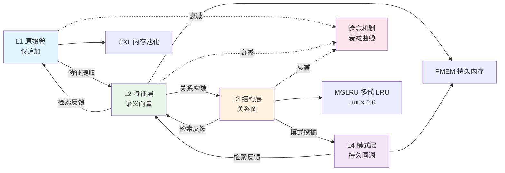
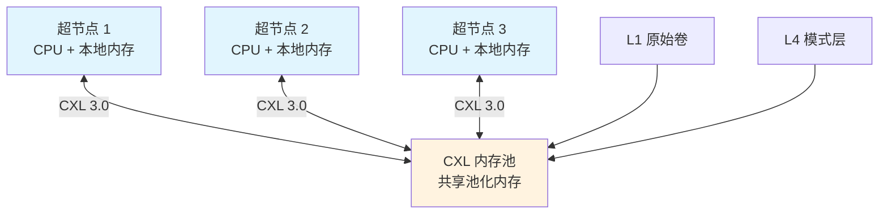
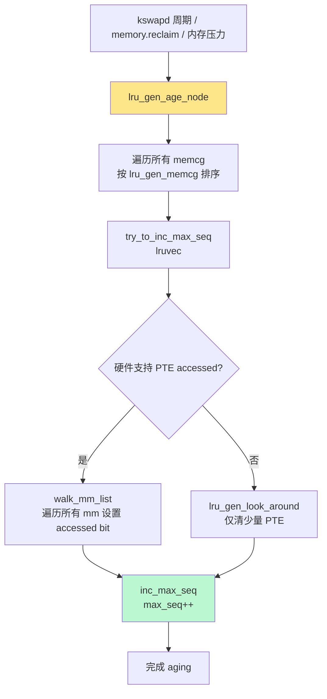
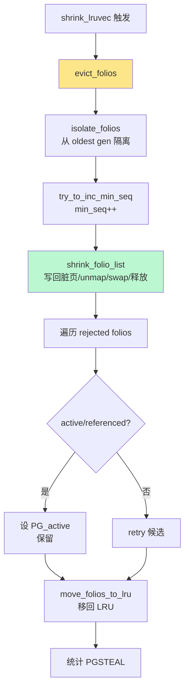
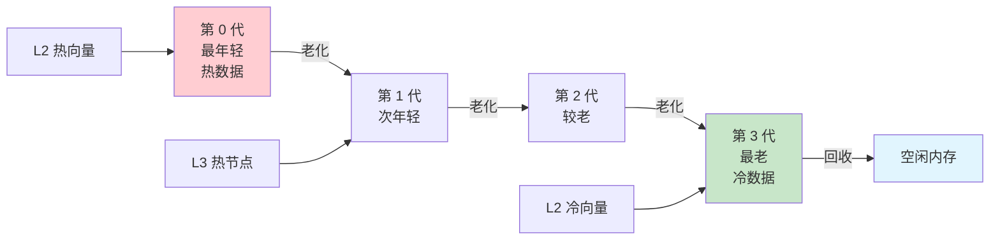
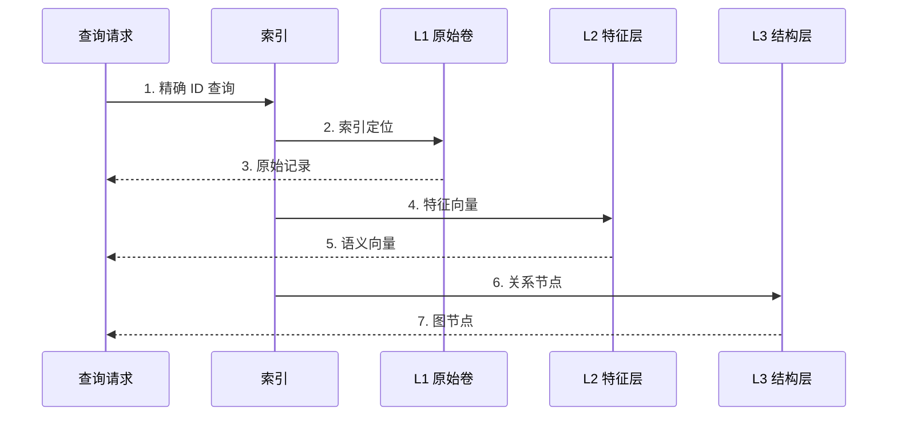
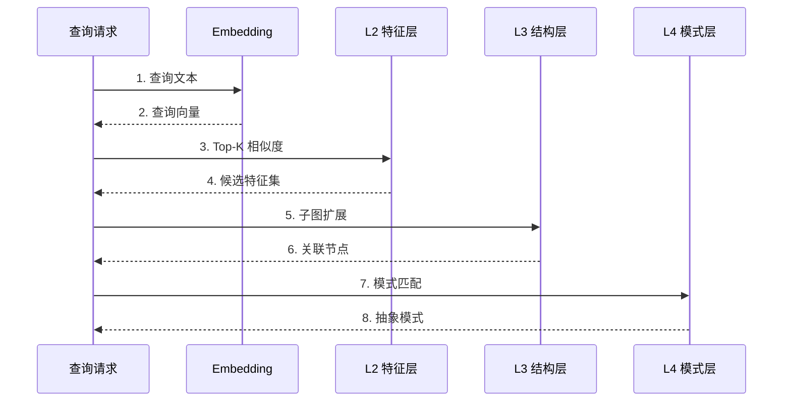
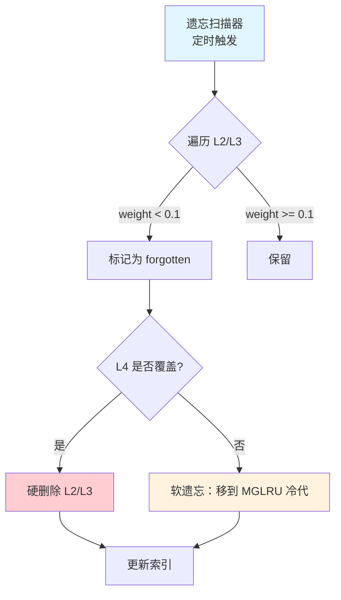
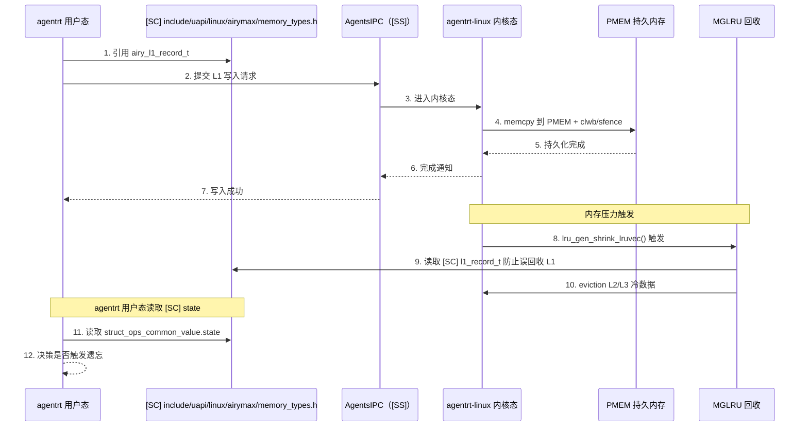

Copyright (c) 2025-2026 SPHARX Ltd. All Rights Reserved.

# agentrt-linux（AirymaxOS）记忆卷载数据流
> **文档定位**：agentrt-linux（AirymaxOS）记忆卷载数据流的详细设计，刻画 L1→L4 四层递进与 CXL/PMEM/MGLRU 硬件协同\
> **文档版本**：0.1.1\
> **最后更新**：2026-07-07\
> **上级文档**：[agentrt-linux 设计文档](README.md)\
> **理论根基**：Linux 6.6 内核基线 mm 子系统 + Airymax 五维正交 24 原则\
> **核心约束**：IRON-9 v3 同源且部分代码共享——与 agentrt 用户态 memoryrovol/heapstore 通过 [SC] 共享契约层 + [SS] 语义同源层协作，[IND] 内核态 CXL/PMEM/MGLRU 实现独立

---

## 1. 记忆卷载数据流概览

记忆卷载数据流是 agentrt-linux 区别于通用操作系统的核心特征之一，落地于 `memory` 子仓（同源 agentrt memoryrovol + heapstore 模块）。该数据流借鉴认知科学的记忆分层理论，将记忆从原始感知到抽象模式分为四层递进：

- **L1 原始卷（Raw Volume）**：仅追加（append-only），不可变，存储原始执行记录与感知数据。同源 memoryrovol L1。
- **L2 特征层（Feature Layer）**：从 L1 提取语义向量，支持相似度检索。同源 memoryrovol L2。
- **L3 结构层（Structure Layer）**：从 L2 向量构建关系图（知识图谱），支持图遍历。同源 memoryrovol L3。
- **L4 模式层（Pattern Layer）**：从 L3 图挖掘持久同调（persistent homology）模式，支持抽象推理。同源 memoryrovol L4。

四层之间通过「特征提取 → 关系构建 → 模式挖掘」单向流动，同时通过「检索反馈」反向调整权重与衰减速率，形成闭环（满足 S-1 反馈闭环原则）。

记忆卷载依赖 Linux 6.6 内核基线的三大硬件能力：

1. **CXL 内存池化**（FR-035）：跨节点内存共享，支持超节点 OS。
2. **PMEM 持久内存**（FR-036）：L1/L4 持久化存储，断电不丢失。
3. **MGLRU 多代 LRU**（FR-037，Linux 6.6）：多代 LRU 内存回收，相比传统 LRU 效率提升 > 20%（NFR-P-006）。

**IRON-9 v3 四层共享模型在记忆卷载的落地**：

- **[SC] 共享契约层**（`include/uapi/linux/airymax/memory_types.h`）：L1-L4 数据结构定义（`airy_l1_record_t` 等）、GFP 掩码语义、PMEM 持久化接口——agentrt 用户态与 agentrt-linux 内核态**完全共享代码**
- **[SS] 语义同源层**：MGLRU aging/eviction API、`memory.reclaim` 主动回收、userfaultfd 记忆迁移——agentrt 用户态与 agentrt-linux 内核态**高层 API 语义同源（概念操作一致），签名因抽象层级不同而独立演进**
- **[IND] 完全独立层**：CXL 驱动、PMEM nvdimm 驱动、Kbuild、内核 ABI 预留机制移除——**各自独立实现**

---

## 2. Mermaid 流程图

下图为记忆卷载数据流的完整路径，包含四层递进、检索反馈、遗忘机制与硬件协同：



---

## 3. 每层数据结构

### 3.0 定点数类型定义 [SC]

> **内核态禁用 float 约束**：Linux 6.6 内核编译使用 `-mno-80387` 禁用 x87 FPU（见 `arch/x86/Makefile:137`），内核态任何 float/double 算术运算必须包裹在 `kernel_fpu_begin()`/`kernel_fpu_end()` 之间（会禁用抢占，不可在原子/中断/调度器热路径使用）。
>
> **[SC] 共享契约层方案**：`include/uapi/linux/airymax/memory_types.h` 中所有浮点字段统一使用 Q16.16 定点数 `airy_q16_t`（int32_t），用户态需 float 展示时用 `AIRY_Q16_TO_F()` 转换。

```c
/**
 * @brief Q16.16 定点数类型（内核态禁用 float 的替代方案）
 * @since 1.0.1
 * @see arch/x86/Makefile -mno-80387; arch/x86/include/asm/fpu/api.h
 * @location include/uapi/linux/airymax/memory_types.h
 */
typedef int32_t airy_q16_t;        /* Q16.16 定点：1 符号 + 15 整数 + 16 小数 */
typedef int64_t airy_q32_t;       /* Q32.32 定点：用于 L2 向量内积累加 */

#define AIRY_Q16_ONE      (1 << 16)                    /* 1.0 的 Q16.16 表示 */
#define AIRY_Q16_MAX      INT32_MAX                    /* 最大值（替代 INFINITY 表示永生） */
#define AIRY_Q16_FLOAT(f) ((airy_q16_t)((f) * AIRY_Q16_ONE))  /* float → Q16.16 */
#define AIRY_Q16_TO_F(x)  ((float)(x) / AIRY_Q16_ONE)            /* Q16.16 → float（仅用户态） */
#define AIRY_Q16_MUL(a,b) ((airy_q16_t)(((int64_t)(a) * (b)) >> 16))  /* Q16.16 乘法（s64 累加） */
```

### 3.1 L1 原始卷（仅追加） [SC]

L1 存储原始执行记录与感知数据，**仅追加（append-only），不可变**（FR-031，NFR-S-005 哈希链保护）。L1 数据结构 `airy_l1_record_t` 是 [SC] 共享契约层的核心——agentrt 用户态与 agentrt-linux 内核态通过 `include/uapi/linux/airymax/memory_types.h` 共享此定义。

```c
/**
 * @brief L1 原始记录条目
 * @since 1.0.1
 * @see memoryrovol L1（同源 agentrt） [SC] 共享契约层
 * @location include/uapi/linux/airymax/memory_types.h
 */
typedef struct __attribute__((aligned(64))) airy_l1_record {
    uint64_t record_id;        /* 记录 ID（单调递增） */
    uint64_t timestamp_ns;     /* 纳秒时间戳（CLOCK_REALTIME） */
    uint64_t trace_id;         /* 链路追踪 ID（OpenTelemetry） */
    uint64_t task_id;          /* 任务 ID */
    uint32_t record_type;      /* 记录类型（EXEC/PERCEPT/FEEDBACK） */
    uint32_t payload_len;      /* payload 长度 */
    uint8_t  prev_hash[32];    /* 前一条记录的 SHA-256 哈希 */
    uint8_t  payload[];        /* 柔性数组，存储原始数据 */
} airy_l1_record_t;
```

**L1 存储特性**：

| 属性 | 值 | 说明 |
|---|---|---|
| 可变性 | 仅追加 | 不可修改、不可删除 |
| 持久性 | PMEM | 断电不丢失 |
| 完整性 | SHA-256 哈希链 | 任何篡改可检测 |
| 检索方式 | 顺序扫描 + 索引 | 不支持直接修改 |
| 同源 | memoryrovol L1 | 协议完全一致 |

### 3.2 L2 特征层（语义向量） [SC]

L2 从 L1 提取语义向量，支持相似度检索（FR-032）。向量维度 768（兼容主流 embedding 模型）。`airy_l2_feature_t` 同样是 [SC] 共享契约层。

```c
/**
 * @brief L2 特征向量条目
 * @since 1.0.1
 * @see memoryrovol L2（同源 agentrt） [SC] 共享契约层
 * @location include/uapi/linux/airymax/memory_types.h
 */
typedef struct __attribute__((aligned(64))) airy_l2_feature {
    uint64_t feature_id;       /* 特征 ID */
    uint64_t source_record_id; /* 源 L1 记录 ID */
    uint64_t timestamp_ns;     /* 创建时间戳 */
    uint32_t model_version;    /* embedding 模型版本 */
    uint32_t dim;              /* 向量维度（默认 768） */
    airy_q16_t weight;      /* 权重（Q16.16 定点，受遗忘机制影响；内核态禁用 float，见 arch/x86/Makefile -mno-80387） */
    airy_q16_t vector[768]; /* 语义向量（Q16.16 定点；用户态需 float 时用 AIRY_Q16_TO_F() 转换） */
} airy_l2_feature_t;
```

### 3.3 L3 结构层（关系图） [SC]

L3 从 L2 向量构建关系图（知识图谱），支持图遍历（FR-033）。采用邻接表存储。`airy_l3_node_t` / `airy_l3_edge_t` 同为 [SC] 共享契约层。

```c
/**
 * @brief L3 关系图节点
 * @since 1.0.1
 * @see memoryrovol L3（同源 agentrt） [SC] 共享契约层
 * @location include/uapi/linux/airymax/memory_types.h
 */
typedef struct airy_l3_node {
    uint64_t node_id;           /* 节点 ID */
    uint64_t source_feature_id; /* 源 L2 特征 ID */
    uint32_t node_type;         /* 节点类型（ENTITY/CONCEPT/EVENT） */
    uint32_t edge_count;       /* 邻接边数 */
    char     label[64];         /* 节点标签 */
    struct airy_l3_edge *edges; /* 邻接边数组 */
} airy_l3_node_t;

/**
 * @brief L3 关系图边
 */
typedef struct airy_l3_edge {
    uint64_t target_node_id;   /* 目标节点 ID */
    uint32_t edge_type;         /* 边类型（IS_A/RELATES_TO/CAUSES） */
    airy_q16_t weight;       /* 边权重（Q16.16 定点；内核态禁用 float） */
} airy_l3_edge_t;
```

### 3.4 L4 模式层（持久同调） [SC]

L4 从 L3 图挖掘持久同调（persistent homology）模式，支持抽象推理（FR-034）。采用 barcodes 表示模式的 birth/death。`airy_l4_barcode_t` 同为 [SC] 共享契约层。

```c
/**
 * @brief L4 持久同调 barcode
 * @since 1.0.1
 * @see memoryrovol L4（同源 agentrt） [SC] 共享契约层
 * @location include/uapi/linux/airymax/memory_types.h
 */
typedef struct airy_l4_barcode {
    uint64_t pattern_id;        /* 模式 ID */
    uint64_t source_graph_id;   /* 源 L3 图 ID */
    int32_t  dimension;         /* 同调维度（0/1/2） */
    airy_q16_t birth;        /* birth 阈值（Q16.16 定点） */
    airy_q16_t death;        /* death 阈值（INT32_MAX 表示永生，替代 INFINITY） */
    airy_q16_t persistence;  /* 持久性 = death - birth（Q16.16 定点算术） */
    uint32_t confidence;         /* 置信度（0-100） */
} airy_l4_barcode_t;
```

---

## 4. CXL 内存池化数据流

CXL（Compute Express Link）内存池化（FR-035）是 agentrt-linux 超节点 OS 的核心能力，支持跨节点内存共享。同源 agentrt atoms/corekern 的 CXL 池化扩展。

### 4.1 CXL 池化架构



### 4.2 CXL 数据流步骤

| # | 步骤 | 节点 | 操作 | 延迟 |
|---|------|------|------|------|
| 1 | L1 写入请求 | 超节点 1 | 发起 L1 记录写入 | < 1μs |
| 2 | CXL 路由 | CXL 控制器 | 路由到内存池节点 | < 2μs |
| 3 | 池化内存分配 | 内存池节点 | 分配 CXL 内存页 | < 5μs |
| 4 | 跨节点写入 | 超节点 1 → 池节点 | CXL 3.0 写入 | < 10μs |
| 5 | 一致性确认 | 池节点 → 超节点 1 | CXL flush + ack | < 5μs |
| 6 | 跨节点读取 | 超节点 2 → 池节点 | CXL 3.0 读取 | < 10μs |

**CXL 池化优势**：

- L1 原始卷可被超节点 1/2/3 共享读取，无需复制
- L4 模式层在内存池节点集中计算，避免数据搬运
- 故障切换时内存不丢失（CXL 持久域）

### 4.3 CXL 内存分配 API

```c
/**
 * @brief 从 CXL 内存池分配
 * @param pool_id 池 ID
 * @param size 分配大小（字节）
 * @return 内存指针（NULL 失败）
 * @since 1.0.1
 */
AIRY_API void *airy_cxl_alloc(uint32_t pool_id, size_t size);

/**
 * @brief 释放 CXL 内存到池
 * @param ptr 内存指针
 * @since 1.0.1
 */
AIRY_API void airy_cxl_free(void *ptr);
```

---

## 5. MGLRU 多代 LRU 回收数据流 [SS]

MGLRU（Multi-Gen LRU）是 Linux 6.6 内核基线的原生能力（FR-037），相比传统 LRU 内存回收效率提升 > 20%（NFR-P-006）。agentrt-linux 利用 MGLRU 实现 L2/L3 内存的分级回收——MGLRU 的代际模型（aging/eviction）与 MemoryRovol 遗忘机制语义同源（[SS] 语义同源层）。

### 5.1 MGLRU 核心数据结构（Linux 6.6 内核基线）

Linux 6.6 内核基线在 `include/linux/mmzone.h` 定义了 MGLRU 的核心数据结构 `struct lru_gen_folio`。agentrt-linux MemoryRovol L2/L3 遗忘机制与此语义同源：

| lru_gen_folio 字段 | 类型 | MemoryRovol 对应 | 同源标注 |
|---------------------|------|------------------|----------|
| `max_seq` | `unsigned long` | 最年轻代序号——aging 增量，对应 L2 特征新生 | [SS] |
| `min_seq[ANON_AND_FILE]` | `unsigned long[]` | 最老代序号——eviction 增量，对应 L2/L3 遗忘 | [SS] |
| `timestamps[MAX_NR_GENS]` | `unsigned long[]` | 每代 birth time（jiffies） | [SS] |
| `folios[MAX_NR_GENS][ANON_AND_FILE][MAX_NR_ZONES]` | `list_head[][][]` | MGLRU 链表（按代/类型/zone 三维） | [SS] |
| `nr_pages[MAX_NR_GENS][ANON_AND_FILE][MAX_NR_ZONES]` | `long[][][]` | 每代页数（最终一致，可瞬时为负） | [SS] |
| `avg_refaulted/avg_total[ANON_AND_FILE][MAX_NR_TIERS]` | `unsigned long[][]` | EMA 重故障率（用于 tier 调整） | [SS] |
| `enabled` | `bool` | MGLRU 启用标志 | [SS] |

**关键常量**（`include/linux/mmzone.h`）：

```c
#define MIN_NR_GENS    2U   /* 最小代数——second chance 算法要求 */
#define MAX_NR_GENS    4U   /* 最大代数——是 active/inactive LRU 的 2 倍 */
#define MAX_NR_TIERS   4U   /* 最大 tier 数——基于访问频次 order_base_2(N) */
#define MEMCG_NR_GENS  3    /* memcg 代数（含 1 防回绕） */
#define MEMCG_NR_BINS  8    /* memcg 分桶（提升 scalability） */
```

### 5.2 aging 入口：try_to_inc_max_seq() [SS]

**Linux 6.6 内核基线位置**：`mm/vmscan.c` aging 函数。aging 是 MGLRU 的核心——它识别"被访问"的页，将它们升级到 youngest gen，并增量 `max_seq`。MemoryRovol L2 特征提取与此语义同源——新特征被加入到"youngest gen"。



**MemoryRovol aging 语义对应**：MemoryRovol L2 特征提取触发后，新特征进入"youngest gen"（L2 热向量集合），与 MGLRU aging 增量 `max_seq` 语义一致。

### 5.3 eviction 入口：evict_folios() [SS]

**Linux 6.6 内核基线位置**：`mm/vmscan.c` eviction 函数。eviction 从 oldest gen 隔离 folio，调用 `shrink_folio_list()` 实际回收，并增量 `min_seq`。MemoryRovol L2/L3 遗忘与此语义同源——被遗忘的特征/节点从 L2/L3 链表移除。



**MemoryRovol eviction 语义对应**：MemoryRovol L2/L3 遗忘触发后，被遗忘的特征/节点从对应链表移除，与 MGLRU eviction 增量 `min_seq` 语义一致。但 MemoryRovol 遗忘不可逆（硬删除），而 MGLRU eviction 可被 retry（保留 active 标志）。

### 5.4 MGLRU 多代划分



### 5.5 Generation Tiering 机制 [SS]

Linux 6.6 内核基线在每代内进一步划分 tier——tier 基于"通过文件描述符的访问次数 N"，`tier = order_base_2(N+1)`。tier 调整仅涉及 `folio->flags` 原子操作，无需 LRU 锁——比代际调整（需 LRU 锁）轻量得多。

| N（访问次数） | tier | 标志 |
|---------------|------|------|
| 0, 1 | 0 | 无（首次访问） |
| 2, 3 | 1 | PG_referenced |
| 4-7 | 2 | PG_referenced + PG_workingset |
| 8-15 | 3 | PG_referenced + PG_workingset |

**MemoryRovol tier 对应**：MemoryRovol L2 特征的 `weight` 字段（Q16.16 定点，`0x0000`-`0xFFFF` 对应 0.0-1.0 衰减曲线）与 MGLRU tier 机制语义同源——都是基于"访问频次"的优先级调整。MemoryRovol weight 用 Q16.16 定点表示（与 SSoT `airy_vtime_t` 定点约束一致，禁止 FPU），MGLRU tier 是离散值（0-3），这是 MemoryRovol 的增强点。

### 5.6 MGLRU 回收策略

| 记忆层 | MGLRU 代 | 回收优先级 | 回收触发 |
|---|---|---|---|
| L2 热向量 | 第 0 代 | 不回收 | - |
| L2 温向量 | 第 1 代 | 低优先级 | 内存压力 > 70% |
| L2 冷向量 | 第 3 代 | 高优先级 | 内存压力 > 50% |
| L3 热节点 | 第 0-1 代 | 不回收 | - |
| L3 冷节点 | 第 2-3 代 | 中优先级 | 内存压力 > 60% |
| L1 原始卷 | 不参与 | 不回收（PMEM 持久） | - |
| L4 模式层 | 不参与 | 不回收（PMEM 持久） | - |

### 5.7 per-agent 主动回收 [SS]

Linux 6.6 内核基线提供 `memory.reclaim` cgroup v2 接口，允许用户态主动触发指定 memcg 的内存回收。agentrt-linux 利用此机制实现 per-agent 主动回收——当 agent 实例 token 配额告警时，daemon 写入 `memory.reclaim` 触发该 agent 的 memcg 回收。

```bash
# 主动回收指定 agent 的 1GB 内存
echo "1G" > /sys/fs/cgroup/agent_001/memory.reclaim

# 指定 swappiness（默认继承父 memcg）
echo "1G,20" > /sys/fs/cgroup/agent_001/memory.reclaim
```

### 5.8 MGLRU 调优参数

```bash
# 查看 MGLRU 多代状态
cat /sys/kernel/mm/lru_gen/enabled
# 输出：0x0007（bit0=enabled, bit1=mm_walk, bit2=nonleaf_young）

# 启用 MGLRU（默认启用，Linux 6.6）
echo "y" > /sys/kernel/mm/lru_gen/enabled

# 启用 mm_walk + nonleaf_young（完整特性）
echo "0x7" > /sys/kernel/mm/lru_gen/enabled

# 查看代老化周期
cat /sys/kernel/mm/lru_gen/min_ttl_ms

# 设置最小 TTL（防 thrashing，默认 1000ms）
echo 1000 > /sys/kernel/mm/lru_gen/min_ttl_ms

# 查看详细统计
cat /sys/kernel/debug/lru_gen
```

---

## 6. 检索双路径

记忆检索支持双路径（FR-039），延迟 < 50ms：

### 6.1 精确检索（Exact Retrieval）

通过 record_id / feature_id / node_id 直接索引访问，延迟 < 1ms。



### 6.2 语义检索（Semantic Retrieval）

通过向量相似度（cosine similarity）检索，延迟 < 50ms。



### 6.3 检索双路径对比

| 维度 | 精确检索 | 语义检索 |
|---|---|---|
| 延迟 | < 1ms | < 50ms |
| 准确率 | 100%（精确匹配） | > 85%（相似度） |
| 索引 | B+ tree | HNSW / IVF |
| 适用场景 | 已知 ID 的精确查询 | 模糊查询、联想推理 |
| 同源 | memoryrovol exact | memoryrovol semantic |

---

## 7. 遗忘机制

遗忘机制（FR-038）是记忆卷载的关键能力，避免 L2/L3 无限膨胀。同源 agentrt memoryrovol 遗忘曲线。

### 7.1 衰减曲线

采用 Ebbinghaus 遗忘曲线的改进版：

```
weight(t) = initial_weight * exp(-λ * t / 3600)
```

- `t`：自上次访问以来的秒数
- `λ`：衰减系数（默认 0.5，可配置）
- 当 `weight < threshold`（默认 0.1）时，触发遗忘

### 7.2 主动遗忘触发条件

| 触发条件 | 阈值 | 遗忘策略 |
|---|---|---|
| 时间衰减 | weight < 0.1 | 软遗忘（移到冷代） |
| 内存压力 | MGLRU 第 3 代 + 压力 > 70% | 硬遗忘（删除 L2/L3） |
| L4 模式覆盖 | persistence > 0.9 | 删除被覆盖的 L2/L3 |
| 显式遗忘 | 用户/API 调用 | 标记为 forgotten（不真正删除） |

### 7.3 遗忘数据流



**遗忘不可逆性**：硬删除的 L2/L3 不可恢复，但 L1 原始卷保留（PMEM 持久），可重新提取特征。

---

## 8. 数据流性能约束

记忆卷载数据流满足以下非功能需求：

| NFR | 指标 | 目标 | 验证方法 |
|---|---|---|---|
| NFR-R-001 | 数据持久性 | L1/L4 断电不丢失 | PMEM 持久性测试 |
| NFR-P-006 | 内存占用 | 基础 < 512MB（边缘 < 256MB） | 系统空闲内存测量 |
| NFR-R-006 | 资源确定性 | 无内存泄漏 | ASan + 泄漏检测 |
| NFR-R-005 | 灾备 | RPO < 1min，RTO < 30min | 灾备演练 |

**性能分解**：

| 操作 | 目标延迟 | 占比 |
|---|---|---|
| L1 写入（PMEM） | 5μs | 1% |
| L2 特征提取 | 20ms | 40% |
| L3 关系构建 | 15ms | 30% |
| L4 模式挖掘 | 10ms | 20% |
| 检索（精确） | < 1ms | - |
| 检索（语义） | < 50ms | - |
| CXL 跨节点访问 | < 10μs | - |
| MGLRU 回收（单页） | < 100μs | - |

---

## 9. 可观测性

记忆卷载数据流通过 OpenTelemetry + Prometheus + 结构化日志实现可观测性：

### 9.1 Prometheus Metrics

```prometheus
# 记忆容量
airy_memory_l1_records_total 1542000
airy_memory_l2_features_total 385000
airy_memory_l3_nodes_total 42000
airy_memory_l4_patterns_total 1280

# 检索延迟
airy_memory_retrieval_latency_seconds{path="exact"} 0.0008
airy_memory_retrieval_latency_seconds{path="semantic", quantile="0.99"} 0.045

# 遗忘统计
airy_memory_forget_total{type="soft"} 15200
airy_memory_forget_total{type="hard"} 3200

# CXL 池化
airy_cxl_pool_usage_bytes{pool_id="0"} 8589934592
airy_cxl_pool_operations_total{op="alloc"} 42000

# MGLRU 回收
airy_mglru_reclaimed_pages{gen="3"} 152000
```

### 9.2 OpenTelemetry span

```
trace_id: mem_abc123
  span: l1.append           (内核态, 5μs)
    span: l2.extract        (用户态, 20ms)
      span: l3.graph_build  (内核态, 15ms)
        span: l4.homology   (内核态, 10ms)
          span: forget.scan (后台, 2ms)
```

---

## 10. IRON-9 v3 四层共享模型落地

### 10.1 三层共享模型概览

| 层次 | 共享程度 | 内容 | 组织方式 |
|------|---------|------|---------|
| **[SC] 共享契约层** | 完全共享代码 | L1-L4 数据结构、GFP 掩码语义、PMEM 持久化接口 | `include/uapi/linux/airymax/memory_types.h` 独立头文件 |
| **[SS] 语义同源层** | 高层 API 语义同源（概念操作一致），签名因抽象层级不同而独立演进 | MGLRU aging/eviction、`memory.reclaim`、userfaultfd | agentrt 用户态实现 + agentrt-linux 内核态实现 |
| **[IND] 完全独立层** | 完全独立 | CXL 驱动、PMEM nvdimm 驱动、Kbuild、内核 ABI 预留机制移除 | 各自独立仓库 |

### 10.2 [SC] 共享契约层 `include/uapi/linux/airymax/memory_types.h`

[SC] 共享契约层定义 agentrt 用户态与 agentrt-linux 内核态**完全共享的代码**——L1-L4 数据结构、GFP 掩码语义、PMEM 持久化接口。这避免双份定义导致不一致。

```c
/* include/uapi/linux/airymax/memory_types.h —— IRON-9 v3 [SC] 共享契约层 */
#ifndef AIRY_MEMORY_TYPES_H
#define AIRY_MEMORY_TYPES_H

#include <stdint.h>

/* ========== GFP 掩码语义（与 Linux __GFP_* 语义同源） ========== */
#define AIRY_GFP_IO            0x0001u   /* 允许 I/O */
#define AIRY_GFP_FS             0x0002u   /* 允许文件系统操作 */
#define AIRY_GFP_RECLAIM        0x0004u   /* 允许直接回收 */
#define AIRY_GFP_KSWAPD         0x0008u   /* 唤醒 kswapd */
#define AIRY_GFP_HIGH           0x0010u   /* 高优先级 */
#define AIRY_GFP_NOWARN         0x0020u   /* 抑制失败警告 */
#define AIRY_GFP_ZERO           0x0040u   /* 返回清零内存 */
typedef uint32_t airy_gfp_t;

/* ========== MemoryRovol L1-L4 数据结构（见 §3） ========== */
typedef struct __attribute__((aligned(64))) airy_l1_record { ... } airy_l1_record_t;
typedef struct __attribute__((aligned(64))) airy_l2_feature { ... } airy_l2_feature_t;
typedef struct airy_l3_node { ... } airy_l3_node_t;
typedef struct airy_l3_edge { ... } airy_l3_edge_t;
typedef struct airy_l4_barcode { ... } airy_l4_barcode_t;

/* ========== PMEM 持久化语义 ========== */
typedef void (*airy_pmem_flush_fn)(void *addr, size_t size);

#endif /* AIRY_MEMORY_TYPES_H */
```

> **OS-MM-001**： `include/uapi/linux/airymax/memory_types.h` 是 MemoryRovol 数据结构的 [SC] 共享契约层——agentrt 用户态与 agentrt-linux 内核态通过此头文件共享 L1-L4 数据结构定义、GFP 掩码语义、PMEM 持久化接口，避免双份定义导致不一致。

### 10.3 [SS] 语义同源层

[SS] 语义同源层定义 agentrt 用户态与 agentrt-linux 内核态**高层 API 语义同源（概念操作一致），签名因抽象层级不同而独立演进**的接口——MGLRU aging/eviction 语义、`memory.reclaim` 主动回收、userfaultfd 记忆迁移。

| Linux 6.6 内核基线 API | agentrt-linux 对应 | agentrt 用户态对应 | 同源说明 |
|------------------------|----------------|-------------------|----------|
| MGLRU `try_to_inc_max_seq()` | 内核态调用 | `airy_l2_extract()` | aging 语义：新数据进入 youngest gen |
| MGLRU `evict_folios()` | 内核态调用 | `airy_l2_forget()` | eviction 语义：老数据被驱逐 |
| `memory.reclaim` 写接口 | cgroup v2 接口 | `airy_mem_reclaim()` | 主动回收语义 |
| `userfaultfd` ioctl | 内核态 hook | `airy_uffd_*()` | 缺页处理语义 |
| `clwb + sfence` | 内核态调用 | `airy_pmem_flush()` | PMEM 持久化语义 |
| `kmem_cache_create()` | 内核态 SLUB | `airy_cache_create()` | 专用对象池语义 |
| `migrate_pages()` | 内核态调用 | `airy_migrate_pages()` | 页迁移语义（CXL demotion） |

### 10.4 [IND] 完全独立层

[IND] 完全独立层定义 agentrt-linux 内核态独有、agentrt 用户态不实现的设计——CXL 驱动、PMEM nvdimm 驱动、Kbuild、内核 ABI 预留机制移除。

| agentrt-linux 内核态特性 | 独立原因 |
|---------------------|----------|
| CXL 驱动（`drivers/cxl/`） | 硬件驱动层，agentrt 用户态不涉及 |
| PMEM nvdimm 驱动（`drivers/nvdimm/`） | 硬件驱动层，agentrt 用户态不涉及 |
| Kbuild 配置 | 内核构建系统，agentrt 不需要 |
| 内核 ABI 预留字段移除 | 与 IRON-1 唯一奠基版本策略冲突，全部移除 |
| `lru_gen_memcg` 全局 memcg LRU | per-agent 隔离由 services daemon 管理 |
| Bloom 过滤器双缓冲 | 1.0.1 后按需引入 |

### 10.5 跨态协作流

MemoryRovol 数据流涉及 agentrt 用户态与 agentrt-linux 内核态的协作：



---

## 11. 五维正交 24 原则映射

记忆卷载数据流遵循 Airymax 五维正交 24 原则：

| 维度 | 原则 | 记忆卷载落地 |
|------|------|--------------|
| **S-1 反馈闭环** | 系统必须形成闭环 | L1→L2→L3→L4 单向流动 + 检索反馈反向调整权重（§2 Mermaid 图） |
| **S-2 同源契约** | 同源代码必须共享 | [SC] 共享契约层 `include/uapi/linux/airymax/memory_types.h`（§10.2） |
| **S-3 解耦优先** | 子系统解耦优先 | MemoryRovol 通过 io_uring/IPC 与其他子系统通信，不直接耦合 |
| **P-1 性能可观测** | 性能必须有指标 | Prometheus metrics + OpenTelemetry span（§9） |
| **P-2 资源确定性** | 资源使用可预测 | 内存 < 512MB（边缘 < 256MB），无泄漏（NFR-R-006） |
| **R-1 持久性** | 数据持久 | L1/L4 PMEM 持久化（NFR-R-001） |
| **R-2 完整性** | 数据完整 | SHA-256 哈希链保护 L1（§3.1） |
| **R-3 可恢复性** | 故障可恢复 | RPO < 1min，RTO < 30min（NFR-R-005） |
| **K-1 内核极简** | 内核保持极简 | MemoryRovol 内核态仅做 PMEM 持久化与 MGLRU hook，遗忘策略在用户态 |
| **K-2 用户态优先** | 复杂逻辑用户态 | L2 特征提取、L3 图构建、L4 同调挖掘在用户态 |
| **A-1 可审计** | 操作可审计 | OpenTelemetry span 全链路追踪（§9.2） |

> **OS-MM-002**： 五维原则在记忆卷载数据流中的落地必须经过工程规范委员会审查，新增设计不得违反已落地的原则。

---

## 12. agentrt 一致性检查

### 12.1 检查方法

agentrt 一致性检查遵循"全面推理 → 系统验证 → 确认不合理则提出修改意见"三段式方法。本节列出 MemoryRovol 数据流与 agentrt 用户态 memoryrovol/heapstore 的一致性验证结果。

### 12.2 检查结果

| 检查项 | agentrt 状态 | agentrt-linux 状态 | 一致性 | 备注 |
|--------|--------------|----------------|--------|------|
| L1-L4 数据结构 | 用户态定义 | [SC] 共享 | 一致 | `include/uapi/linux/airymax/memory_types.h` |
| GFP 语义 | 用户态简化版 | [SC] 共享 | 一致 | `airy_gfp_t` |
| PMEM 持久化 | 用户态 memcpy + clwb | [SC] 共享 | 一致 | `airy_pmem_flush_fn` |
| MGLRU aging | 用户态 weight 衰减 | [SS] 语义同源 | 一致 | aging 增 max_seq |
| MGLRU eviction | 用户态遗忘扫描 | [SS] 语义同源 | 一致 | eviction 增 min_seq |
| 检索双路径 | 用户态 exact + semantic | [SS] 语义同源 | 一致 | HNSW + IVF 索引 |
| userfaultfd 迁移 | 用户态使用 | [SS] 共享 API | 一致 | 记忆迁移 |
| memcg 隔离 | 不适用（用户态） | [IND] 内核态独有 | 合理 | per-agent 隔离 |
| CXL 驱动 | 不适用（用户态） | [IND] 独立实现 | 合理 | 硬件驱动层 |
| PMEM nvdimm 驱动 | 不适用（用户态） | [IND] 独立实现 | 合理 | 硬件驱动层 |
| 内核 ABI 预留机制 | 不适用（用户态） | [IND] 全部移除 | 合理 | 与 IRON-1 冲突 |

### 12.3 agentrt 合理性验证结论

经过全面推理与系统验证，**agentrt memoryrovol/heapstore 的设计在 [SC]/[SS] 层与 agentrt-linux 内核态保持一致**，未发现不合理之处：

1. **数据结构一致**：L1-L4 数据结构通过 [SC] 共享契约层完全共享
2. **API 语义一致**：MGLRU aging/eviction、`memory.reclaim`、userfaultfd 等通过 [SS] 语义同源
3. **独立层合理**：CXL/PMEM 驱动、Kbuild 等 [IND] 层独立实现符合微内核解耦哲学
4. **无修改意见**：agentrt memoryrovol/heapstore 设计无需修改

---

## 13. 相关文档

- [数据流程设计概览](README.md)：4 大数据流分类
- [认知循环数据流](01-cognition-flow.md)：System 1/2 双系统
- [IPC 消息流](03-ipc-flow.md)：跨节点 IPC
- [内存模块设计](../20-modules/04-memory.md)：MemoryRovol + CXL + PMEM
- [IPC 协议](../30-interfaces/02-ipc-protocol.md)：128B 消息头结构
- [系统调用](../30-interfaces/01-syscalls.md)：CXL 分配 API
- [功能需求 FR-031~FR-040](../00-requirements/02-functional-requirements.md)
- [工程标准规范](../50-engineering-standards/README.md) §1.3 IRON-9 v3 四层共享模型

---

## 14. 文档变更记录

| 版本 | 日期 | 变更内容 | 变更人 |
|---|---|---|---|
| 0.1.1 | 2026-07-06 | 初始版本，定义 L1→L4 四层递进与 CXL/PMEM/MGLRU 协同 | 工程规范委员会 |
| 0.1.1 | 2026-07-07 | 修订：添加 Copyright 头、IRON-9 v3 四层共享模型、MGLRU 源码映射深度、[SC]/[SS]/[IND] 标注、agentrt 一致性检查 | 工程规范委员会 |

---

© 2025-2026 SPHARX Ltd. All Rights Reserved.
"From data intelligence emerges."
