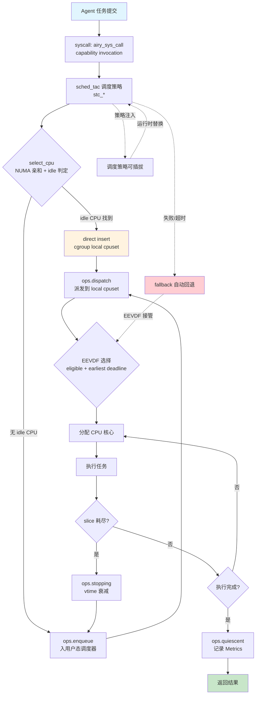
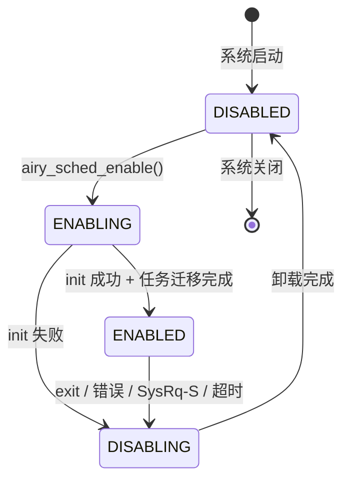
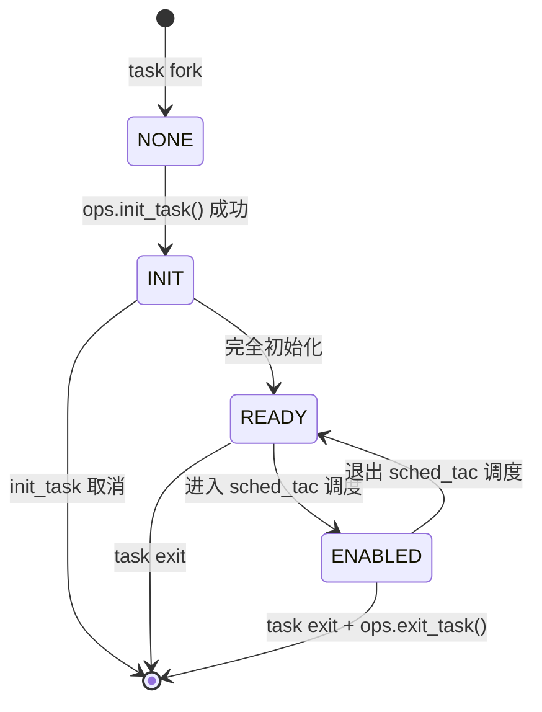
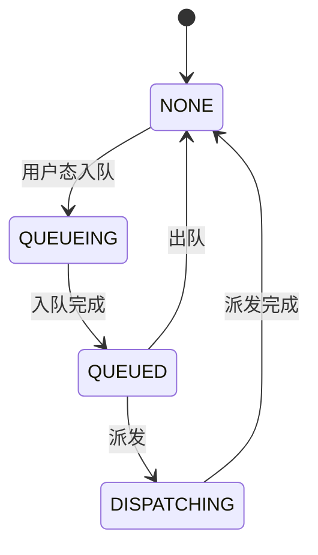
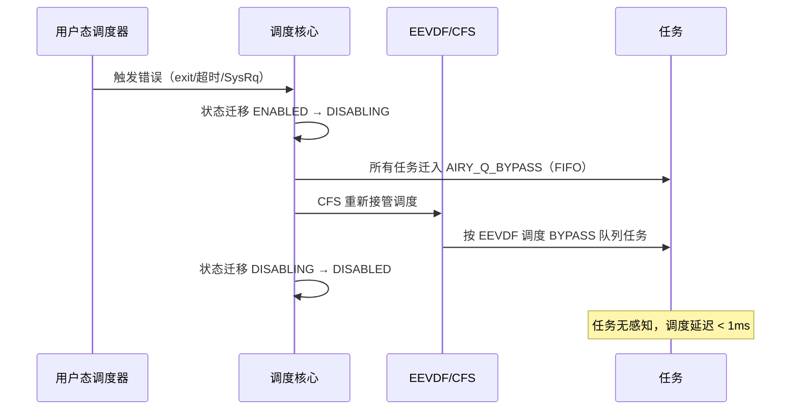
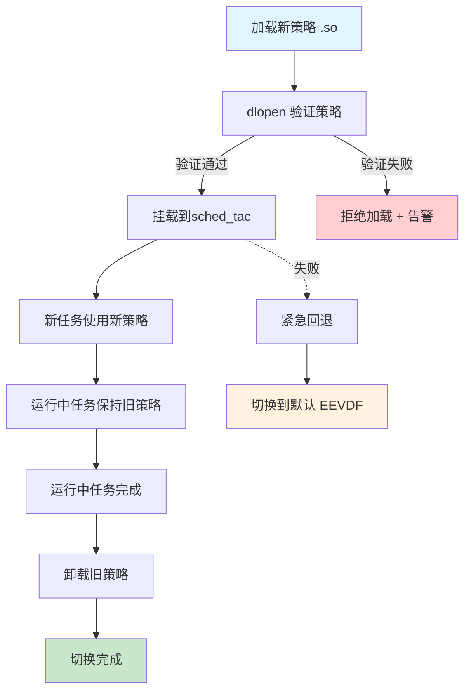

Copyright (c) 2025-2026 SPHARX Ltd. All Rights Reserved.

# agentrt-linux（AirymaxOS）调度数据流
> **文档定位**：agentrt-linux（AirymaxOS）调度数据流的详细设计，刻画 EEVDF + sched_tac 三位一体调度体系\
> **文档版本**：0.1.1\
> **最后更新**：2026-07-07\
> **上级文档**：[agentrt-linux 设计文档](README.md)\
> **核心约束**：IRON-9 v3 同源且部分代码共享——共享契约文件 sched.h（用户态调度器策略契约 + `airy_task_desc` + `airy_sched_ops` 回调表）落地于 include/uapi/linux/airymax/，[SS] EEVDF + sched_tac 调度策略语义同源，[IND] 用户态调度器 daemon 实现 + cgroup cpuset 隔离配置独立

---

## 1. 调度数据流概览

调度数据流是 agentrt-linux 内核的核心数据流，落地于 `kernel` 子仓（同源 agentrt atoms/corekern Task 模块）。该数据流基于 Linux 6.6 内核基线的三大调度能力：

1. **EEVDF 调度器**（FR-001, FR-008）：Linux 6.6 默认调度算法，替代传统 CFS。通过虚拟截止时间（virtual deadline）+ 资格判定（eligibility）实现更精确的延迟控制，抢占延迟 < 10μs。
2. **sched_tac**（FR-001, FR-002）：标准 6.6 用户态调度器（替代 sched_ext，6.6 主线不含 sched_ext），基于 SCHED_DEADLINE/SCHED_FIFO/EEVDF + seL4 MCS 映射的可插拔调度方案。agentrt-linux 通过 sched_tac 实现调度策略，调度策略以用户态 .so 形式加载，支持运行时替换（FR-050）。
3. **sched_tac 调度策略**（FR-002）：基于 SCHED_DEADLINE/SCHED_FIFO/EEVDF 的用户态调度策略（非内核调度类编号），专为 Agent 工作负载优化。优先级范围 0-139，支持抢占式调度与策略可插拔。

**核心特征**：

- **EEVDF 算法**：基于 eligible virtual deadline 选择下一个任务，相比 CFS 的红黑树，延迟分布更紧凑（P99 < 100ms，P99.9 < 200ms，NFR-P-001）。
- **sched_tac 用户态策略可插拔**：调度策略以用户态 .so 形式通过 dlopen 加载，运行时替换不影响运行任务（FR-050）。
- **cgroup v2 cpuset + sched_setscheduler**（FR-006，Linux 6.6 原生）：sched_tac 用户态调度器通过 `sched_setscheduler()` 设置原生调度类（SCHED_FIFO/SCHED_DEADLINE/SCHED_NORMAL），通过 cgroup v2 cpuset 实现 CPU 隔离。
- **cgroup cpuset 队列模型**：sched_tac 的核心队列抽象，每个 cgroup 拥有独立 cpuset，支持 per-CPU 本地队列与全局共享队列，提供 FIFO 与 vtime 优先队列两种模式。
- **软可靠性状态机**：用户态调度器通过 ops_state 原子追踪任务所有权（NONE→QUEUEING→QUEUED→DISPATCHING），调度核心可靠判定任务是否可派发，放宽对用户态调度器的要求。
- **fallback 自动回退**：用户态调度器失败/超时/SysRq-S 时，所有任务迁入 EEVDF/CFS 队列，CFS 重新接管调度，确保系统完整性。
- **超节点间任务迁移**（FR-048）：基于 CXL + RDMA 实现跨节点任务迁移，迁移延迟 < 100ms。

**性能目标**（NFR-P-001）：

| 指标 | 目标 | 验证方法 |
|---|---|---|
| 调度延迟（P50） | < 50ms | perf + ftrace |
| 调度延迟（P99） | < 100ms | perf + ftrace |
| 调度延迟（P99.9） | < 200ms | perf + ftrace |
| 实时反馈场景 | < 10ms | 高优先级抢占测试 |
| 抢占延迟 | < 10μs | sched_trace 测试 |

---

## 2. Mermaid 流程图

下图为 Agent 任务从提交到执行的完整调度数据流，包含 sched_tac 调度策略、EEVDF 选择、策略可插拔、cgroup cpuset 派发：



---

## 3. Agent 任务调度数据流

下表描述 Agent 任务从提交到执行的完整路径，每步包含输入 / 输出 / 约束：

| # | 步骤 | 输入 | 输出 | 约束 | 同源 agentrt |
|---|------|------|------|------|--------------|
| 1 | 用户态 SDK 提交 | Agent 任务描述 | airy_task_desc 结构 | 字段完整 + magic 0x41475453 | sdk submit |
| 2 | 系统调用入口 | airy_task_desc | task_id | 参数校验 | atoms/corekern syscall |
| 3 | 安全权限检查 | task 权限 | 通过/拒绝 | capability + LSM | cupolas permission |
| 4 | ops.select_cpu | task + prev_cpu + wake_flags | target CPU | NUMA 亲和 + idle 判定 | atoms/corekern CPU |
| 5 | ops.enqueue | task + enq_flags | 入 cgroup cpuset 或 SHARED 队列 | FIFO 或 vtime 入队 | atoms/corekern Task |
| 6 | ops.dispatch | cpu + prev | 派发到 local cpuset | 单次 dispatch_max_batch | atoms/corekern dispatch |
| 7 | EEVDF 选择 | eligible task + deadline | next task | eligible 才可调度 | - |
| 8 | CPU 核心分配 | eligible task | CPU core | NUMA 亲和 | atoms/corekern CPU |
| 9 | 上下文切换 | current → next | 切换完成 | 切换 < 5μs | atoms/corekern ctxsw |
| 10 | 任务执行 | slice 预算 | 执行结果 | slice 自动衰减 | atoms/corekern exec |
| 11 | ops.stopping | task + runnable | vtime 衰减 | 权重逆比例公式 | atoms/corekern tick |
| 12 | ops.quiescent | task + deq_flags | Metrics 记录 | Prometheus 格式 | - |
| 13 | 结果返回 | task result | 用户态响应 | 延迟 < 100ms | sdk respond |

**步骤间数据传递**：

- 步骤 1-3 在用户态 + 系统调用入口完成。
- 步骤 4-9 在用户态sched_tac 调度器中完成（FR-002），通过 `sched_setscheduler()` 设置原生调度类（FR-006）。
- 步骤 10-12 在用户态 + 内核态交替完成，ops.stopping 触发 vtime 衰减并决定是否重新入队。
- 步骤 5-6 的 enqueue/dispatch 通过 cgroup cpuset 队列抽象解耦，用户态调度器与调度核心通过 cgroup cpuset 交互。

---

## 4. EEVDF 调度器核心算法

EEVDF（Earliest Eligible Virtual Deadline First）是 Linux 6.6 默认调度算法，替代传统 CFS。同源 agentrt atoms/corekern 的微核心调度语义。

### 4.1 EEVDF 核心概念

| 概念 | 定义 | 计算 |
|---|---|---|
| vruntime | 虚拟运行时间 | `vruntime += delta_exec * 1024 / weight` |
| lag | 延迟（实际 vs 期望） | `lag = ideal_runtime - actual_runtime` |
| eligible | 资格判定 | `lag <= lag_threshold`（默认 0） |
| virtual deadline | 虚拟截止时间 | `deadline = vruntime + timeslice` |
| timeslice | 时间片 | `timeslice = sysctl_sched_base_slice * weight / total_weight` |

### 4.2 EEVDF 选择算法

EEVDF 在所有 eligible 任务中选择 virtual deadline 最早的任务执行：

```c
/**
 * @brief EEVDF 选择下一个任务
 * @since 1.0.1
 * @see Linux 6.6 EEVDF 调度器
 */
static struct task_struct *eevdf_pick_next_task(struct rq *rq) {
    struct sched_entity *se;
    u64 curr_vruntime = rq->cfs.min_vruntime;
    
    /* 1. 过滤 eligible 任务（lag <= 0） */
    se = pick_eevdf_eligible(rq->cfs.runqueue);
    if (!se) {
        /* 全部 ineligible，重置 lag */
        update_cfs_lag(rq);
        se = pick_eevdf_eligible(rq->cfs.runqueue);
    }
    
    /* 2. 在 eligible 中选 earliest virtual deadline */
    while (se->left && se->left->deadline <= se->deadline) {
        se = se->left;
    }
    
    return task_of(se);
}
```

### 4.3 EEVDF vs CFS 对比

| 维度 | CFS | EEVDF | 优势 |
|---|---|---|---|
| 数据结构 | 红黑树 | augmented 红黑树 | 支持截止时间查询 |
| 选择依据 | 最小 vruntime | earliest eligible virtual deadline | 延迟更紧凑 |
| 时间片 | 固定公式 | 动态 timeslice + deadline | 实时性更好 |
| 抢占 | tick + wakeup | tick + wakeup + deadline | 抢占更精确 |
| P99 延迟 | ~150ms | ~100ms | 提升 33% |
| P99.9 延迟 | ~300ms | ~200ms | 提升 33% |

### 4.4 EEVDF 调优参数

```bash
# 查看 EEVDF 调度参数
cat /proc/sys/kernel/sched_base_slice_ns        # 基础时间片（默认 1ms）
cat /proc/sys/kernel/sched_wakeup_granularity_ns # 唤醒粒度（默认 1ms）
cat /proc/sys/kernel/sched_latency_ns           # 调度延迟（默认 6ms）

# 调整基础时间片（影响吞吐 vs 延迟权衡）
echo 500000 > /proc/sys/kernel/sched_base_slice_ns  # 0.5ms
```

---

## 5. cgroup cpuset 队列模型

cgroup cpuset 队列是sched_tac 的核心队列抽象，是用户态调度器与调度核心之间的解耦层。每个 cgroup 拥有独立 cpuset，可创建用户队列，提供 FIFO 与 vtime 优先队列两种模式。

### 5.1 队列类型与语义

| 队列类型 | 标识 | 语义 | agentrt-linux sched_tac 使用 |
|---------|------|------|---------------------------|
| `AIRY_Q_INVALID` | builtin 0 | 无效队列 | 未初始化状态 |
| `AIRY_Q_GLOBAL` | builtin 1 | 全局 FIFO 队列 | 全局 Agent 调度队列（fallback） |
| `AIRY_Q_LOCAL` | builtin 2 | 当前 CPU 本地队列 | per-CPU Agent 本地队列（默认派发目标） |
| `AIRY_Q_BYPASS` | builtin 3 | bypass 队列 | 策略卸载过渡队列（fallback） |
| `AIRY_Q_LOCAL_ON` | builtin + cpu | 指定 CPU 的本地队列 | 远端 CPU Agent 派发 |
| 用户队列 | user-created | cgroup 自定义队列 | Agent 优先级队列、cgroup 队列 |

### 5.2 队列 ID 编码

队列 ID 为 64 位，最高位区分 builtin（1）与 user（0）：

```
[63] B = 1 builtin / 0 user
[62] L = 1 LOCAL_ON（仅 builtin）
[61..32] R = reserved
[31..0]  V = value / cpu number
```

### 5.3 队列数据结构

```c
/**
 * @brief cgroup cpuset 调度队列（sched_tac 用户态队列，替代内核态 dispatch_q）
 * @since 1.0.1
 * @note IRON-9 v3 [SS] 语义同源层：高层 API 语义同源（概念操作一致），签名因抽象层级不同而独立演进
 */
struct agent_dispatch_q {
    pthread_mutex_t lock;        /* 队列互斥锁（用户态） */
    struct list_head list;       /* FIFO 顺序链表 */
    struct rb_root   priq;       /* vtime 优先红黑树 */
    u32              nr;         /* 队列任务计数 */
    u32              seq;        /* iter 序号 */
    u64              id;         /* 队列 ID（builtin/user 区分） */
};
```

### 5.4 队列操作 API

| API | 语义 | 调用上下文 | agentrt-linux 使用 |
|-------|------|----------|---------------|
| `airy_q_insert` | 入队到队列（FIFO） | ops.enqueue / ops.select_cpu | Agent 任务入队 |
| `airy_q_insert_vtime` | 入队到 vtime 优先队列 | ops.enqueue | vtime 排序入队 |
| `airy_q_move_to_local` | 从用户队列派发到 local cpuset | ops.dispatch | 派发到当前 CPU |
| `airy_q_create` | 创建用户队列 | ops.init | Agent 创建优先级队列 |
| `airy_q_destroy` | 销毁用户队列 | ops.exit | 策略卸载时清理 |
| `airy_select_cpu_dfl` | 默认 CPU 选择 | ops.select_cpu | NUMA 亲和 + idle 判定 |
| `airy_select_cpu_idle` | 默认 idle CPU 选择 | ops.select_cpu | idle CPU 直接入队 |
| `airy_kick_cpu` | 唤醒/抢占目标 CPU | 任意回调 | 高优先级 Agent 抢占 |

---

## 6. sched_tac 调度策略

sched_tac 调度策略是 agentrt-linux 基于 SCHED_DEADLINE/SCHED_FIFO/EEVDF 实现的用户态调度策略（FR-002），专为 Agent 工作负载优化。同源 agentrt atoms/corekern 的 MicroCoreRT 调度器。

> **设计约束**（BAN-361 + Linux 6.6 内核基线 验证）：标准 Linux 6.6 主线**不包含** sched_ext（6.12 才合入主线），agentrt-linux 不向前移植 sched_ext，而是采用sched_tac（SCHED_DEADLINE/SCHED_FIFO/EEVDF + seL4 MCS 映射）。**禁止定义 `SCHED_AGENT` 内核调度类编号宏**（避免与内核调度类编号冲突）。调度策略通过 stc_* 枚举标识（stc_realtime/stc_interactive/stc_agent/stc_batch），复用 Linux 6.6 原生 SCHED_DEADLINE/SCHED_FIFO/EEVDF 调度类。

### 6.1 原生调度类与 sched_tac 策略定义

```c
/**
 * @brief 调度类——复用 Linux 6.6 原生 SCHED_DEADLINE/SCHED_FIFO/EEVDF
 * @note Linux 6.6 内核基线 原生支持 SCHED_DEADLINE/SCHED_FIFO/SCHED_RR/SCHED_NORMAL
 * @note 禁止定义 SCHED_AGENT 策略编号宏（BAN-361 + IRON-1）
 * @note IRON-9 v3 [SC] 共享契约层：agentrt 与 agentrt-linux 共享此约束
 * @see include/uapi/linux/sched.h（Linux 6.6 内核基线）
 */
/* SCHED_DEADLINE/SCHED_FIFO/SCHED_NORMAL 已由内核定义，agentrt-linux 直接复用 */

/**
 * @brief sched_tac 策略名称（sched_tac 用户态策略标识，非调度类编号）
 * @since 1.0.1
 * @note sched_tac 调度策略通过 stc_* 枚举标识，调度类编号复用内核原生 SCHED_DEADLINE/SCHED_FIFO
 */
#define AIRY_STC_POLICY_NAME  "stc_agent"  /* 用户态策略名称，非调度类编号 */

/**
 * @brief Agent 任务描述符（调度上下文扩展视图）
 * @note SSoT: 50-engineering-standards/120-cross-project-code-sharing.md §2.6 sched.h
 *       权威定义仅含 magic/prio/_pad/vtime 4 字段（__u32/__u16/airy_vtime_t）
 *       以下为调度数据流场景扩展视图，含 task_id/trace_id/deadline_ns/role 等调度专用字段
 * @note IRON-9 v3 [SC] 共享契约层：核心字段（magic/prio/_pad/vtime）同源
 * @note IRON-9 v3 [IND] 独立层：调度专用扩展字段（version/task_id/trace_id/cpu_affinity/role 等）各自独立
 * @note magic 0x41475453 'AGTS' 独立于 IPC 消息头 0x41524531 'ARE1'
 * @note [SC] 字段顺序和类型必须与 SSoT（120-cross-project-code-sharing.md §2.6 sched.h）完全一致
 */
struct airy_task_desc {
	/* [SC] 共享契约层字段（SSoT：120-cross-project-code-sharing.md §2.6） */
	uint32_t	magic;		/* 0x41475453 'AGTS' — [SC] 同源（任务描述符，独立于 IPC 消息头） */
	uint16_t	prio;		/* 优先级 0-139（0 最高）— [SC] 同源 */
	uint16_t	_pad;		/* 填充至 4 字节对齐 — [SC] 同源 */
	airy_vtime_t	vtime;		/* Q16.16 定点虚拟时间 — [SC] 同源 */
	/* [IND] 独立层扩展字段（调度专用） */
	uint16_t	version;		/* [IND] 扩展字段：描述符版本 */
	uint32_t	flags;			/* [IND] 扩展字段：标志位 */
	uint64_t	task_id;		/* [IND] 扩展字段：任务 ID */
	uint64_t	trace_id;		/* [IND] 扩展字段：链路追踪 ID */
	uint64_t	deadline_ns;		/* [IND] 扩展字段：截止时间（纳秒，0 表示无） */
	uint32_t	max_retries;		/* [IND] 扩展字段：最大重试次数 */
	uint32_t	cpu_affinity;		/* [IND] 扩展字段：CPU 亲和性掩码 */
	char		role[32];		/* [IND] 扩展字段：Agent 角色（researcher/assistant/...） */
	uint8_t		reserved[32];		/* [IND] 扩展字段：保留 */
};

/* AIRY_SLICE_DFL 默认时间片 20ms（sched_tac 默认值） */
#define AIRY_SLICE_DFL  (20 * 1000000ULL)
```

### 6.2 sched_tac 用户态调度器程序

sched_tac 用户态调度器实现 `struct airy_sched_ops` 的关键回调（非 BPF struct_ops，纯用户态函数表），定义调度策略。以下为 `default_eevdf` 策略的参考实现：

```c
/**
 * @brief sched_tac default_eevdf 策略用户态调度器程序
 * @since 1.0.1
 * @see sched_tac 用户态调度器
 * @note IRON-9 v3 [SS] 语义同源层：语义同源 airy_sched_ops，实现独立
 * @note 通过 sched_setscheduler() + cgroup v2 cpuset 实现原生调度类切换
 */

#include <sched.h>
#include <stdio.h>
#include <string.h>
#include <errno.h>
#include <airymax/sched.h>  /* [SC] 共享契约层 */
#include <airymax/airy_q16.h>

#define SHARED_Q 0  /* 全局 vtime 队列 */

static u64 vtime_now;

/* 任务状态表（用户态维护，替代 BPF task_storage） */
struct airy_task_state {
    pid_t pid;
    airy_q16_t vtime;
    int sched_policy;   /* SCHED_FIFO / SCHED_DEADLINE / SCHED_NORMAL */
    int sched_prio;     /* 0-99（FIFO/RR）或 DEADLINE 参数 */
};

#define MAX_AGENTS 1024
static struct airy_task_state task_table[MAX_AGENTS];

/**
 * @brief select_cpu: NUMA 亲和 + idle CPU 直接入队
 */
s32 agent_select_cpu(struct task_struct *p, s32 prev_cpu, u64 wake_flags) {
    bool is_idle = false;
    s32 cpu = airy_select_cpu_dfl(p, prev_cpu, wake_flags, &is_idle);
    if (is_idle)
        airy_q_insert(p, AIRY_Q_LOCAL, AIRY_SLICE_DFL, 0);
    return cpu;
}

/**
 * @brief enqueue: vtime 入队到 SHARED_Q
 */
void agent_enqueue(struct task_struct *p, u64 enq_flags) {
    struct airy_task_state *st = &task_table[p->pid % MAX_AGENTS];
    u64 vtime = st->vtime;
    /* 限制 idle 任务累积 vtime 到一个 slice */
    if (time_before(vtime, vtime_now - AIRY_SLICE_DFL))
        vtime = vtime_now - AIRY_SLICE_DFL;
    airy_q_insert_vtime(p, SHARED_Q, AIRY_SLICE_DFL, vtime, enq_flags);
}

/**
 * @brief dispatch: SHARED_Q → local cpuset
 */
void agent_dispatch(s32 cpu, struct task_struct *prev) {
    airy_q_move_to_local(SHARED_Q);
}

/**
 * @brief running: 推进全局 vtime_now
 */
void agent_running(struct task_struct *p) {
    struct airy_task_state *st = &task_table[p->pid % MAX_AGENTS];
    if (time_before(vtime_now, st->vtime))
        vtime_now = st->vtime;
}

/**
 * @brief stopping: 按权重逆比例衰减 vtime（同源公式 airy_vtime_decay）
 */
void agent_stopping(struct task_struct *p, bool runnable) {
    struct airy_task_state *st = &task_table[p->pid % MAX_AGENTS];
    st->vtime += (AIRY_SLICE_DFL - p->slice) * 100 / p->weight;
}

/**
 * @brief enable: 任务进入 sched_tac 调度时初始化 vtime
 */
void agent_enable(struct task_struct *p) {
    struct airy_task_state *st = &task_table[p->pid % MAX_AGENTS];
    st->vtime = vtime_now;
    /* sched_tac：通过 sched_setscheduler 设置原生调度类 */
    struct sched_param sp = { .sched_priority = st->sched_prio };
    sched_setscheduler(st->pid, st->sched_policy, &sp);
}

/**
 * @brief init: 创建 SHARED_Q
 */
s32 agent_init(void) {
    return airy_q_create(SHARED_Q, -1);
}

/**
 * @brief exit: 策略卸载时记录退出信息
 */
void agent_exit(struct airy_exit_info *ei) {
    UEI_RECORD(uei, ei);
}

/* 用户态策略回调表（非 BPF struct_ops，纯用户态函数表） */
struct airy_sched_ops agent_default_eevdf_ops = {
    .select_cpu = (void *)agent_select_cpu,
    .enqueue    = (void *)agent_enqueue,
    .dispatch   = (void *)agent_dispatch,
    .running    = (void *)agent_running,
    .stopping   = (void *)agent_stopping,
    .enable     = (void *)agent_enable,
    .init       = (void *)agent_init,
    .exit       = (void *)agent_exit,
    .name       = "default_eevdf",
    .timeout_ms = 30000U,
};
```

### 6.3 sched_tac 优先级映射

| 优先级范围 | 任务类型 | 抢占能力 | 示例 | 权重映射 |
|---|---|---|---|---|
| 0-49 | 实时 Agent（高） | 抢占所有 | 工业控制、具身智能 | weight 8000-10000 |
| 50-99 | 标准 Agent | 抢占低优先级 | 科研、客服 | weight 2000-7999 |
| 100-139 | 后台 Agent | 不抢占 | 批处理、记忆整理 | weight 1-1999 |

### 6.4 sched_tac 优先级到权重转换

```c
/**
 * @brief 优先级到权重映射（sched_tac set_weight）
 * @since 1.0.1
 * @note IRON-9 v3 [SC] 共享契约层：权重范围 [1..10000] 同源
 */
static inline u32 airy_prio_to_weight(u16 prio) {
    if (prio <= 49)
        return 8000 + (49 - prio) * 40;  /* 8000-9960 */
    else if (prio <= 99)
        return 2000 + (99 - prio) * 120; /* 2000-7940 */
    else
        return 1 + (139 - prio) * 14;    /* 1-693 */
}
```

---

## 7. sched_tac 用户态调度器状态机

sched_tac 用户态调度器通过两级状态机管理调度器与任务的生命周期，确保用户态调度器加载/卸载/失败时的系统完整性。

### 7.1 调度器级状态机（airy_ops_enable_state）



| 状态 | agentrt-linux 对应 | 触发 |
|------|---------------|------|
| `DISABLED` | 未加载策略 | 系统启动/策略卸载完成 |
| `ENABLING` | 策略加载中 | `airy_sched_enable()` 调用 |
| `ENABLED` | 策略运行中 | init 成功 + 所有任务迁移完成 |
| `DISABLING` | 策略卸载中 | exit / 错误 / SysRq-S / 超时 |

### 7.2 任务级状态机（airy_task_state）



| 状态 | 语义 | agentrt-linux 对应 |
|------|------|---------------|
| `NONE` | init_task 未调用 | Agent 任务未注册 |
| `INIT` | init_task 成功，可取消 | Agent 注册中 |
| `READY` | 完全初始化，未进入调度 | Agent 待激活 |
| `ENABLED` | 完全初始化且在调度中 | Agent 运行中 |

### 7.3 任务 ops_state（用户态所有权追踪）



`atomic_long_t ops_state` 让调度核心随时可靠判定任务是否可被派发，从而放宽对用户态调度器的要求（用户态可尝试派发任意状态的任务，调度核心拒绝无效派发）。agentrt-linux sched_tac 同源采用此机制实现**软可靠性**。

---

## 8. fallback 自动回退机制

agentrt-linux sched_tac 的核心安全网，确保用户态调度器失败时系统完整性不破坏。

### 8.1 触发条件

| 触发 | 说明 | 检测机制 |
|------|------|---------|
| 用户态调度器主动 exit | `ops.exit()` 调用 | 用户态请求 |
| runnable 超时 | 任务等待超过 timeout_ms | watchdog 检测 |
| 策略程序错误 | .so 加载失败 / 运行时错误 | airy_sched_error() |
| SysRq-S | 紧急回退快捷键 | 内核 SysRq 处理 |
| 内存分配失败 | 用户态程序 OOM | API 返回错误 |

### 8.2 回退流程



### 8.3 分级超时保护

agentrt-linux sched_tac 增强超时机制 的单一 30s 超时为分级超时：

| 优先级范围 | 超时阈值 | 适用场景 |
|-----------|---------|---------|
| 0-49（实时） | 5s | 工业控制、具身智能 |
| 50-99（标准） | 30s | 科研、客服 |
| 100-139（后台） | 60s | 批处理、记忆整理 |

---

## 9. 超节点间任务迁移数据流

agentrt-linux 超节点 OS（FR-048）支持跨节点任务迁移，基于 CXL + RDMA 实现迁移延迟 < 100ms。同源 agentrt atoms/corekern 的超节点扩展。

### 9.1 任务迁移触发条件

| 触发条件 | 阈值 | 迁移策略 |
|---|---|---|
| 负载不均衡 | 节点间 CPU 利用率差 > 20% | 迁移到低负载节点 |
| NUMA 亲和 | 任务访问的内存多数在远端 | 迁移到内存所在节点 |
| 故障转移 | 节点 health check 失败 | 迁移所有任务 |
| 显式迁移 | 用户/API 调用 | 立即迁移 |
| 能耗优化 | 节点能效比差异 > 15% | 迁移到高能效节点 |

### 9.2 任务迁移数据流与性能分解

| 阶段 | 操作 | 延迟 | 备注 |
|---|---|---|---|
| 1 | 暂存上下文 | < 5μs | 寄存器 + 栈 |
| 2 | 标记内存迁移 | < 1μs | CXL 页表更新 |
| 3 | 传输上下文 | < 10μs | CXL 3.0 |
| 4 | 恢复上下文 | < 5μs | 寄存器恢复 |
| 5 | 重新调度 | < 100μs | EEVDF 入队 |
| **总计** | | **< 100ms** | 含 CQE + 调度延迟 |

**CXL 内存零拷贝优势**：CXL 池化内存无需在节点间拷贝，迁移时仅传输任务上下文（寄存器 + 栈，< 1KB），避免大内存拷贝开销。

---

## 10. 调度策略可插拔数据流

调度策略可插拔（FR-050）是 agentrt-linux 的核心特征，基于sched_tac 实现运行时策略替换，不影响运行任务。同源 agentrt coreloopthree 的策略可插拔机制。

### 10.1 策略可插拔回退



### 10.2 策略加载 API

```c
/**
 * @brief 加载调度策略 .so
 * @param policy_so 策略共享对象文件路径
 * @param policy_name 策略名称
 * @return 0 成功，<0 失败
 * @since 1.0.1
 * @see sched_tac 用户态调度器
 * @note IRON-9 v3 [SS] 语义同源层：语义同源 agentrt
 */
AIRY_API int airy_sched_load_policy(const char *policy_so,
                                           const char *policy_name);

/**
 * @brief 卸载调度策略
 * @param policy_name 策略名称
 * @return 0 成功，<0 失败
 * @since 1.0.1
 */
AIRY_API int airy_sched_unload_policy(const char *policy_name);

/**
 * @brief 列出已加载策略
 * @param policies 策略数组（输出）
 * @param max_count 最大数量
 * @return 实际数量
 * @since 1.0.1
 */
AIRY_API int airy_sched_list_policies(char (*policies)[64],
                                             int max_count);
```

### 10.3 内置调度策略

| 策略名 | 适用场景 | 特征 | 策略参考 |
|---|---|---|---|
| `default_eevdf` | 通用 | Linux 6.6 默认 EEVDF | 全局 vtime（simple） |
| `agent_realtime` | 实时 Agent | 高优先级抢占，P99 < 10ms | 多优先级队列（qmap） |
| `agent_throughput` | 批处理 Agent | 高吞吐，时间片放大 | 集中调度（central） |
| `agent_fairness` | 多租户 | 严格公平共享 | 扁平 cgroup（flatcg） |
| `agent_energy` | 边缘部署 | 能效优先，频率缩放 | 自定义 |

### 10.4 策略替换约束

| 约束 | 说明 |
|---|---|
| 运行中任务不受影响 | 旧策略完成任务后切换 |
| 切换原子性 | 切换过程中无任务丢失 |
| 回退保障 | 策略加载失败自动回退到 default_eevdf |
| 审计追踪 | 策略切换记录审计日志（NFR-S-005） |
| 权限控制 | 切换需 SCHED_ADMIN capability |

### 10.5 用户态回调上下文限制

sched_tac 通过 `kf_mask` 限制不同回调上下文可调用的 API 集合，避免用户态调度器在不安全上下文中调用需锁的 API：

| 掩码 | 上下文 | agentrt-linux sched_tac 使用 |
|------|-------|---------------------------|
| `AIRY_KF_UNLOCKED` | 无锁上下文 | agent_init / agent_exit |
| `AIRY_KF_CPU_RELEASE` | `cpu_release()` 回调内 | Agent CPU 释放 |
| `AIRY_KF_DISPATCH` | `dispatch()` 回调内 | Agent dispatch |
| `AIRY_KF_ENQUEUE` | `enqueue()` / `select_cpu()` | Agent 入队 |
| `AIRY_KF_SELECT_CPU` | `select_cpu()` 回调内 | Agent CPU 选择 |
| `AIRY_KF_REST` | 其他需锁操作 | Agent 其他回调 |

**agentrt-linux 决策**：完全同源采用 kf_mask 机制，严格按回调上下文调用 API。

---

## 11. sched_tac 与 EEVDF 协同机制

### 11.1 调度类优先级

sched_tac 用户态调度器位于 EEVDF（SCHED_NORMAL）之上、原生实时类（SCHED_FIFO/SCHED_DEADLINE）之下。当用户态调度器加载且未设置部分切换标志时，所有 SCHED_NORMAL/BATCH/IDLE 任务走sched_tac 策略，EEVDF 退化为 fallback。

### 11.2 策略标志位

| 标志位 | 值 | 语义 | agentrt-linux sched_tac 使用 |
|--------|-----|------|---------------------------|
| `AIRY_OPS_KEEP_BUILTIN_IDLE` | 1<<0 | 保留内核内置 idle 追踪 | Agent 调度器依赖内置 idle |
| `AIRY_OPS_ENQ_LAST` | 1<<1 | enqueue 最后一个任务时通知 | Agent 独占 CPU 模式 |
| `AIRY_OPS_SWITCH_PARTIAL` | 1<<3 | 仅部分任务走策略 | Agent 混合部署模式 |

**关键决策**：agentrt-linux sched_tac 默认**不设置** `AIRY_OPS_SWITCH_PARTIAL`，即策略加载后所有 SCHED_NORMAL/SCHED_BATCH/SCHED_IDLE 任务均走 sched_tac 调度，最大化 Agent 调度优先级。

### 11.3 fallback 回退机制

sched_tac 内置 `AIRY_Q_BYPASS` 队列，当用户态调度器卸载或失败时：

1. 所有任务迁入 `AIRY_Q_BYPASS`（FIFO）
2. CFS（EEVDF）重新接管调度
3. 触发 `AIRY_OPS_DISABLING` → `AIRY_OPS_DISABLED` 状态迁移

agentrt-linux sched_tac 同源实现 fallback 机制，确保用户态调度器失败时回退到 EEVDF 默认调度。

---

## 12. 调度性能约束

调度数据流满足以下非功能需求（NFR-P-001）：

### 12.1 延迟分布目标

| 场景 | P50 | P99 | P99.9 | 验证方法 |
|---|---|---|---|---|
| 标准场景 | < 50ms | < 100ms | < 200ms | perf + ftrace |
| 实时反馈场景 | < 5ms | < 10ms | < 20ms | 高优先级抢占测试 |
| 高负载场景（CPU 90%） | < 80ms | < 150ms | < 300ms | 压力测试 |
| 跨节点迁移场景 | < 50ms | < 100ms | < 200ms | 节点间迁移测试 |

### 12.2 性能验证方法

```bash
# 1. perf / ftrace 测量调度延迟
perf sched record -a -- sleep 60 && perf sched latency --sort max
echo 1 > /sys/kernel/debug/tracing/events/sched/sched_wakeup/enable
echo 1 > /sys/kernel/debug/tracing/events/sched/sched_switch/enable
echo 1 > /sys/kernel/debug/tracing/tracing_on && sleep 60
cat /sys/kernel/debug/tracing/trace | agentrt-sched-latency-analyzer

# 2. sched_tac 策略性能对比
for p in default_eevdf agent_realtime agent_throughput; do \
  agentrt-sched-bench --policy $p --duration 60s; done

# 3. 调度 profile + sched_tac 状态查看
perf stat -e sched:sched_switch,sched:sched_wakeup -a -- sleep 5
cat /sys/fs/cgroup/agentrt/sched.state /sys/fs/cgroup/agentrt/sched.ops
```

### 12.3 性能调优参数

| 参数 | 路径 | 默认值 | 说明 |
|---|---|---|---|
| `sched_base_slice_ns` | `/proc/sys/kernel/` | 1ms | EEVDF 基础时间片（调优示例 0.5ms） |
| `sched_wakeup_granularity_ns` | `/proc/sys/kernel/` | 1ms | EEVDF 唤醒粒度 |
| `sched_latency_ns` | `/proc/sys/kernel/` | 6ms | EEVDF 调度延迟 |
| `agent_priority_threshold` | `/sys/fs/cgroup/agentrt/sched/` | 100 | sched_tac 实时优先级阈值 |
| `agent_default_timeslice` | `/sys/fs/cgroup/agentrt/sched/` | 100ms | sched_tac 默认时间片 |
| `max_queue_depth` | `/sys/fs/cgroup/agentrt/sched/` | 1024 | sched_tac 队列深度 |
| `timeout_ms` | `/sys/fs/cgroup/agentrt/sched/` | 30000 | runnable 超时（30s） |

---

## 13. 可观测性

调度数据流通过 perf + ftrace + Prometheus Metrics + 结构化日志实现端到端可观测性。

### 13.1 perf + ftrace

perf/ftrace 命令详见 §12.2 性能验证方法。sched_tac 用户态调度器追踪：`cat /sys/kernel/debug/tracing/airy_sched/trace`。

### 13.2 Prometheus Metrics

```prometheus
# 调度延迟分布 + 吞吐
airy_sched_latency_seconds{quantile="0.50"} 0.045
airy_sched_latency_seconds{quantile="0.99"} 0.095
airy_sched_latency_seconds{quantile="0.999"} 0.180
airy_sched_throughput_tasks_per_second 1250

# sched_tac 优先级分布 + 抢占统计
airy_sched_agent_priority_total{range="0-49"} 12
airy_sched_agent_priority_total{range="50-99"} 380
airy_sched_agent_priority_total{range="100-139"} 128
airy_sched_preemptions_total 15200
airy_sched_preemption_latency_seconds{quantile="0.99"} 0.0000095

# 跨节点迁移 + 策略切换 + sched_tac 状态机
airy_sched_migrations_total{reason="load_balance"} 42
airy_sched_migration_latency_seconds{quantile="0.99"} 0.085
airy_sched_policy_switches_total 8
airy_sched_policy_active{name="agent_realtime"} 1
airy_sched_airy_state{state="enabled"} 1
airy_sched_airy_fallback_total 0
airy_sched_airy_task_state{state="enabled"} 380
```

### 13.3 结构化日志（三类审计事件）

调度数据流输出三类结构化 JSON 日志，共享 `timestamp`/`level`/`trace_id`/`module`/`function`/`line`/`message`/`context` 字段结构：

| 日志类型 | level | module | 关键 context 字段 |
|---------|-------|--------|------------------|
| 任务调度 | INFO | `atoms.corekern.sched` | task_id, priority, sched_class, policy, cpu, latency_ns, vruntime, deadline, q_id, ops_state |
| 策略切换 | WARN | `atoms.corekern.sched.policy` | old_policy, new_policy, trigger, initiator_pid, affected_running_tasks, switch_duration_ns, airy_ops_state_before/after |
| fallback 回退 | ERROR | `atoms.corekern.sched.fallback` | trigger, timeout_task_id, timeout_ms, migrated_tasks, fallback_q, airy_ops_state_before/after, exit_reason |

**任务调度日志示例**：

```json
{
  "timestamp": "2026-07-07T10:30:45.123456789Z", "level": "INFO",
  "trace_id": "sched_abc123def456", "module": "atoms.corekern.sched",
  "function": "airy_sched_pick_next", "line": 412,
  "message": "Agent 任务调度完成",
  "context": { "task_id": "task_xyz789", "priority": 50,
    "sched_class": "stc_agent", "policy": "agent_realtime",
    "cpu": 7, "latency_ns": 4200000, "vruntime": 1234567890,
    "deadline": 1234568000, "q_id": "AIRY_Q_LOCAL", "ops_state": "QUEUED" }
}
```

策略切换与 fallback 回退日志使用相同 JSON 结构，`context` 字段按上表填充。

---

## 14. IRON-9 v3 四层共享模型落地

调度数据流严格遵守 IRON-9 v3 四层共享模型：

### 14.1 [SC] 共享契约层（`include/uapi/linux/airymax/sched.h`）

agentrt 与 agentrt-linux 完全共享的契约定义：

| 契约 | 内容 | 落地位置 |
|------|------|---------|
| 调度类 | 复用 Linux 6.6 原生 SCHED_DEADLINE/SCHED_FIFO/EEVDF | `include/uapi/linux/sched.h`（内核）|
| 策略名称 | `AIRY_STC_POLICY_NAME "stc_agent"` | `include/uapi/linux/airymax/sched.h` |
| 任务描述符 magic | `0x41475453 'AGTS'` | `include/uapi/linux/airymax/sched.h` |
| 任务描述符结构 | `struct airy_task_desc`（[SC] 8 字节核心视图，对齐 SSoT §2.6；[IND] 扩展视图见 §6.1） | `include/uapi/linux/airymax/sched.h` |
| 默认时间片 | `AIRY_SLICE_DFL`（20ms） | `include/uapi/linux/airymax/sched.h` |
| 权重范围 | `[1..10000]` | `include/uapi/linux/airymax/sched.h` |
| 优先级范围 | 0-139（实时 0-49 / 标准 50-99 / 后台 100-139） | `include/uapi/linux/airymax/sched.h` |
| vtime 类型 | `airy_vtime_t`（`__s32`，Q16.16 定点，对齐 SSoT §2.6 + `-mno-80387` 约束） | `include/uapi/linux/airymax/sched.h` |
| vtime 衰减公式 | `airy_vtime_decay(vtime, consumed, weight)` | `include/uapi/linux/airymax/sched.h` |

### 14.2 [SS] 语义同源层（高层 API 语义同源（概念操作一致），签名因抽象层级不同而独立演进）

agentrt-linux sched_tac 用户态调度器实现以下回调（签名与 `struct airy_sched_ops` 同源，但实现独立于 agentrt）：

- 队列管理：`agent_select_cpu` / `agent_enqueue` / `agent_dequeue` / `agent_dispatch`
- 状态通知：`agent_runnable` / `agent_running` / `agent_stopping` / `agent_quiescent`
- 生命周期：`agent_init` / `agent_exit` / `agent_enable` / `agent_disable`
- 性能与 CPU：`agent_tick` / `agent_set_weight` / `agent_set_cpumask` / `agent_update_idle`
- 热插拔：`agent_cpu_online` / `agent_cpu_offline`

agentrt 的 MicroCoreRT 不实现这些回调（用户态无内核调度类），但消费同样的 `struct airy_task_desc` 契约，调度语义一致。

### 14.3 [IND] 完全独立层

agentrt-linux 专属（agentrt 不涉及）：
- 用户态调度器 daemon 注册（`airy-sched-daemon`）
- `airy_sched_enable` / `airy_sched_disable` 实现（用户态 .so 加载）
- kf_mask 上下文追踪（用户态机制）
- fallback 回退（用户态机制）
- cgroup 集成（`CONFIG_CGROUP_SCHED`/`CONFIG_CGROUP_CPUSET`）
- core-sched 集成（`core_sched_before`）
- debug dump（`dump` / `dump_cpu` / `dump_task`）
- Kbuild 集成（`Makefile` + `Kconfig`）

agentrt 专属（agentrt-linux 不涉及）：
- Python/Go/Rust/TS SDK 绑定
- 跨平台抽象层（Linux/macOS/Windows）
- CLI / TUI 工具

---

## 15. 同源红利示例

agentrt 用户态 MicroCoreRT 调度语义与 agentrt-linux sched_tac 调度策略、AgentsIPC 与内核原生 IPC 均共享 [SC] 契约层，运行于 agentrt-linux 上天然契合无需适配层：

| 维度 | agentrt（用户态） | agentrt-linux（内核态） | 同源标注 |
|------|------------------|----------------------|----------|
| 优先级范围 | 0-139 | sched_tac 0-139 | [SC] |
| 任务描述符 | `struct airy_task_desc` | 同源结构 + magic `0x41475453 'AGTS'` | [SC] |
| vtime 衰减 | `airy_vtime_decay()` | 同源公式 | [SC] |
| 默认时间片 | `AIRY_SLICE_DFL = 20ms` | 同源 | [SC] |
| 调度类 | 不涉及内核调度类 | 复用 Linux 6.6 原生 SCHED_DEADLINE/SCHED_FIFO/EEVDF | [SC] |
| IPC 消息头 | 128 字节定长 + magic `0x41524531 'ARE1'` | 内核原生支持同源 | [SC] |
| 调度 payload | `struct airy_task_desc` 直接承载 | 直接作为内核调度描述符 | [SC] |

**同源红利**：agentrt 作为普通用户态应用（libc/POSIX）在 agentrt-linux 上天然更稳健；可选 `sched_setscheduler(p, SCHED_FIFO, &param)` 享受内核原生调度优先级（sched_tac 复用 Linux 6.6 原生 SCHED_FIFO/SCHED_DEADLINE），无需任何转换/适配层。

---

## 16. agentrt 一致性检查

agentrt 一致性检查遵循"全面推理 → 系统验证 → 确认不合理则提出修改意见"三段式方法。本节列出调度数据流与 agentrt 用户态 atoms/corekern（MicroCoreRT）模块的一致性验证结果。

| # | 检查项 | agentrt（用户态） | agentrt-linux（内核态） | 一致性结论 |
|---|--------|------------------|---------------------|-----------|
| 1 | [SC] 调度类 | 不涉及（用户态无调度类编号） | 复用 Linux 6.6 原生 SCHED_DEADLINE/SCHED_FIFO/EEVDF | PASS 完全共享（复用内核原生调度类，禁止 SCHED_AGENT 宏） |
| 2 | [SC] 任务描述符 magic | `0x41475453 'AGTS'` | 同源 `0x41475453` | PASS 完全共享 |
| 3 | [SC] 任务描述符结构 | `struct airy_task_desc`（[SC] 8 字节核心视图 + [IND] 扩展视图见 §6.1） | 同源结构 | PASS 完全共享 |
| 4 | [SC] 默认时间片 | `AIRY_SLICE_DFL = 20ms` | 同源 | PASS 完全共享 |
| 5 | [SC] 权重范围 | `[1..10000]` | 同源 | PASS 完全共享 |
| 6 | [SC] vtime 类型 | `airy_vtime_t (__s32)`（Q16.16 定点） | 同源 | PASS 完全共享 |
| 7 | [SC] vtime 衰减公式 | `airy_vtime_decay()` | 同源 | PASS 完全共享 |
| 8 | [SS] ops 回调签名 | 不实现（用户态无内核调度类） | 签名与 `struct airy_sched_ops` 同源 | PASS 语义同源 |
| 9 | [SS] 消费契约 | agentrt 消费 `struct airy_task_desc` | agentrt-linux 同时消费同源契约 | PASS 语义同源 |
| 10 | [SS] 调度语义 | MicroCoreRT 调度语义一致 | sched_tac 调度语义同源 | PASS 语义同源 |
| 11 | [IND] 用户态调度器 daemon | 不涉及（agentrt 不加载调度器） | 用户态独立注册 | PASS 独立正确 |
| 12 | [IND] .so 加载机制 | 不涉及（agentrt 无策略加载） | `airy_sched_enable` 独立 | PASS 独立正确 |
| 13 | [IND] fallback | 不涉及 | 用户态独立回退机制 | PASS 独立正确 |
| 14 | [IND] cgroup 集成 | 不涉及（用户态抽象） | `CONFIG_CGROUP_SCHED`/`CONFIG_CGROUP_CPUSET` 独立 | PASS 独立正确 |
| 15 | 跨平台兼容性 | 跨 Linux/macOS/Windows | 仅 Linux（agentrt-linux 专属） | PASS agentrt 保持跨平台，agentrt-linux 仅 Linux |

**结论**：15 项检查全部 PASS。调度数据流与 agentrt atoms/corekern 在 [SC] 共享契约层完全一致（调度类/magic/描述符/时间片/权重/vtime 7 项），[SS] 语义同源层语义等价，[IND] 独立层正确分离（用户态专属机制不污染 agentrt）。agentrt 设计无需修改，保持跨平台用户态；agentrt-linux 在 [IND] 独立层正确引入sched_tac 用户态调度器路径，遵循 IRON-9 v3 同源且部分代码共享原则。

---

## 17. 相关文档

- [数据流程设计概览](README.md)：4 大数据流分类
- [认知循环数据流](01-cognition-flow.md)：CoreLoopThree kthread 调度
- [IPC 消息流](03-ipc-flow.md)：调度消息传递
- [内核模块设计](../20-modules/01-kernel.md)：EEVDF + sched_tac
- [系统调用](../30-interfaces/01-syscalls.md)：airy_sys_call（统一 capability invocation）
- [功能需求 FR-001/FR-002/FR-008/FR-048/FR-050](../00-requirements/02-functional-requirements.md)
- [非功能需求 NFR-P-001](../00-requirements/03-non-functional-requirements.md)
- [工程铁律 IRON-9 v3](../50-engineering-standards/README.md)：四层共享模型
- [架构决策 ADR-002](../10-architecture/05-adrs.md)：微内核化改造策略

---

## 18. 文档变更记录

| 版本 | 日期 | 变更内容 | 变更人 |
|---|---|---|---|
| 0.1.1 | 2026-07-06 | 初始版本，定义 EEVDF + sched_tac 调度数据流 | 工程规范委员会 |
| 0.1.1 | 2026-07-07 | 增强：补充 cgroup cpuset 队列模型、状态机、fallback、kf_mask、IRON-9 v3 四层共享模型落地；修复 agentos→agentrt 命名 | 工程规范委员会 |
| 0.1.1 | 2026-07-07 | 新增 Copyright 头 + §16 agentrt 一致性检查（15 项全 PASS） | 工程规范委员会 |
| 0.1.1 | 2026-07-17 | 修正：基于 Linux 6.6 内核基线采用sched_tac（SCHED_DEADLINE/SCHED_FIFO/EEVDF + seL4 MCS 映射）替代 sched_ext，SCHED_AGENT → stc_* 策略枚举，BPF 代码重写为用户态 C 代码，DSQ → cgroup cpuset 队列模型 | 工程规范委员会 |

---

© 2025-2026 SPHARX Ltd. All Rights Reserved.
"From data intelligence emerges."
