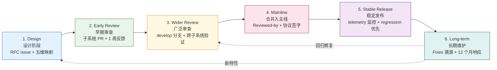
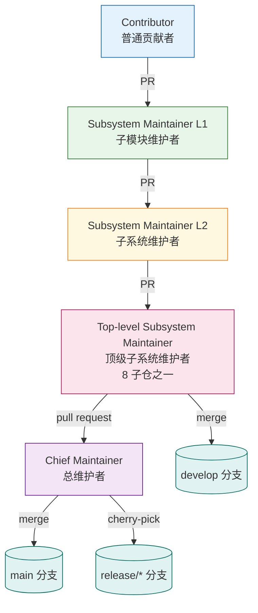

Copyright (c) 2025-2026 SPHARX Ltd. All Rights Reserved.

# agentrt-linux（AirymaxOS）开发流程标准

> **文档定位**: agentrt-linux（AirymaxOS，极境智能体操作系统）工程标准规范第 5 卷——开发流程。本卷规定从设计构想进入主线、稳定版到长期维护的完整生命周期，以及维护者层级制度、补丁格式、审查响应与稳定版规则。
> **版本**: 1.0.1（开发）
> **最后更新**: 2026-07-06
> **同源映射**: `docs/AirymaxRT/00-architectural-principles.md`（五维正交 24 原则）+ Linux 6.6 内核基线 `Documentation/process/development-process.rst`
> **理论根基**: Linux 6.6 内核基线工程思想 + Airymax 体系并行论（Multibody Cybernetic Intelligent System）

---

## 0. 章节定位

本卷是 agentrt-linux 工程标准 7 主题文档中的第 5 卷，回答"代码怎么进入主线"这一问题。它在 04 工程思想（双层稳定性、策略机制分离）与 06 工具链自动化（7 层验证、CI/CD）之间形成承上启下的桥梁：

- **上游依赖**：04 工程思想定义"为什么"——稳定性哲学、可追溯性、审查优先；本卷定义"怎么做"——补丁生命周期、维护者层级、审查响应规范。
- **下游依赖**：06 工具链自动化定义"规范怎么被执行"——7 层验证、checkpatch、覆盖率门槛；本卷定义"规范在哪个阶段被执行"——每个生命周期阶段的强制工具链关卡。

本卷所有强制规则均赋予 **OS-STD** / **OS-KER** 编号，与 07 维护者制度与治理的"规则编号注册表"对齐。

### 0.1 关键术语

| 术语 | 定义 |
|------|------|
| 补丁（Patch） | 一个 git commit，对应一个逻辑变更；在 GitHub 流程中表现为 PR 中的一个提交 |
| 补丁序列（Patch Series） | 一组相互关联、按依赖顺序排列的补丁；在 GitHub 流程中表现为单个 PR 内的多个提交 |
| 子系统树 | 维护者维护的分支（等价 Linux 子系统树），是补丁进入主线的中间站 |
| `develop` 分支 | agentrt-linux 预览集成分支，等价 linux-next 树 |
| `release/*` 分支 | agentrt-linux 稳定版分支，等价 Linux -stable 树 |
| MicroCoreRT | Airymax 微核心运行时基座（Minimal Core Runtime），agentrt-linux 内核态对其保持同源语义 |
| AgentsIPC | Airymax 智能体进程间通信协议，128B 定长消息头；本卷涉及的协议改动必须经专门审查 |
| 五维正交 24 原则 | Airymax 架构设计原则体系（S/K/C/E/A 五维，每维 4-8 项原则） |

---

## 1. 补丁生命周期（6 阶段）

agentrt-linux 继承 Linux 6.6 内核基线的 6 阶段补丁生命周期模型，并将其适配到 GitHub PR 流程。每个阶段有明确的输入、输出、责任人和 SLA。

### 1.1 阶段一：Design（设计）

设计阶段确定"做什么"和"为什么做"。

- **可在社区内或社区外**：设计可以闭门进行，但**公开设计可节省后期返工**——尤其是涉及 AgentsIPC 协议、Agent SDK 接口、内核 ABI 的设计。
- **强制产出**：RFC issue（GitHub）或设计文档（Markdown）。涉及 ABI 改动的设计必须遵循 04 工程思想 §6.2 的 4 层接口稳定性分级。
- **OS-STD-101**：任何影响 L1（Agent 应用 API）或 L2（AgentsIPC 协议）的设计，必须先在 GitHub 创建 RFC issue 并至少获得 1 名顶级子系统维护者 ACK，方可进入早期审查阶段。
- **OS-STD-102**：设计文档必须包含"五维原则映射"小节，说明该设计涉及哪些原则（如 S-4 涌现性管理、K-2 接口契约化）。

### 1.2 阶段二：Early Review（早期审查）

将补丁序列提交到相关子系统维护者的 GitHub PR。

- **目标审查者**：由 `MAINTAINERS` 文件（agentrt-linux 等价物，详见 07 卷）和 `CODEOWNERS` 自动识别。
- **SLA**：子系统维护者通常在 **1 周内**给出审查反馈，否则可能 PR 发错了地方。
- **OS-STD-103**：早期审查 PR 必须包含完整的补丁描述（问题描述、用户可见影响、量化权衡），禁止"占位描述"。
- **OS-STD-104**：早期审查阶段发现的所有审查意见必须在 PR 内联回复，禁止离线沟通。

### 1.3 阶段三：Wider Review（广泛审查）

补丁进入子系统树和 `develop` 分支（等价 -next 树）。

- **可见性提升**：进入 `develop` 分支后，补丁会暴露给更广泛的测试者与 CI 矩阵。
- **跨子系统冲突**：`develop` 分支的 nightly build 会检测跨子系统符号冲突、ABI 漂移、协议契约违反。
- **OS-STD-105**：补丁进入 `develop` 分支前，必须通过 06 卷定义的 7 层自动化验证的前 4 层（编译期 / 静态分析 / 预提交 / CI 门禁）。
- **OS-STD-106**：`develop` 分支禁止 force-push 历史，所有变更必须以 merge commit 或 rebase 后的提交形式进入。

### 1.4 阶段四：Merging into Mainline（合并入主线）

由顶级子系统维护者发起 pull request 到 `main` 分支。

- **合并窗口**：参照 Linux Merge Window 模型，agentrt-linux 采用 2 周 Merge Window + 6 周 RC 周期的发布节奏（详见 130-roadmap）。
- **RC 期间仅接受修复**：RC1 发布后，新特性补丁必须等待下一个 Merge Window。
- **OS-STD-107**：合并入 `main` 的补丁必须包含至少 1 个 `Reviewed-by:` 标签（来自非作者维护者）。
- **OS-STD-108**：合并入 `main` 的补丁若修改 AgentsIPC 128B 消息头布局，必须由 agentrt-linux 协议委员会额外签字（详见 30-interfaces）。

### 1.5 阶段五：Stable Release（稳定发布）

补丁随某个正式版本（如 1.0.1）发布，更多用户暴露更多 bug。

- **回归报告优先级**：发布后报告的 regression 是最高优先级 bug，必须在下一个 RC 修复。
- **OS-STD-109**：任何 regression 报告必须在 48 小时内得到响应，7 天内提供修复或回滚方案。
- **OS-STD-110**：稳定版发布后 30 天内，相关补丁作者需主动监控 telemetry 指标（详见 90-observability）。

### 1.6 阶段六：Long-term Maintenance（长期维护）

作者需持续负责其合并入主线的代码。

- **"the development community remembers developers who lose interest in their code after it's merged"**——这是 Linux 内核社区的明确警告，agentrt-linux 完全继承此原则。
- **OS-STD-111**：补丁作者在代码合并后 12 个月内，须响应与其补丁相关的所有 bug 报告与审查请求；若长期无响应，维护者可将其代码标记为 `Orphaned` 并寻找新维护者。
- **OS-STD-112**：长期维护期间发现的修复需通过 `Fixes:` 标签溯源到引入 bug 的原始提交（详见 §4.3）。

### 1.7 6 阶段流转图



---

## 2. 维护者层级制度（Lieutenant System / Chain of Trust）

agentrt-linux 继承 Linux 内核的 Lieutenant System（副手系统）——一条从普通贡献者到总维护者的信任链。

### 2.1 信任链结构

```
普通贡献者（Contributor）
    │ 提交 PR
    ▼
子系统维护者（Subsystem Maintainer）
    │ pull request
    ▼
顶级子系统维护者（Top-level Subsystem Maintainer）
    │ pull request
    ▼
总维护者（Chief Maintainer）
    │ merge to main
    ▼
main 分支
```

### 2.2 信任链长度

- **链可任意长，但很少超过 2-3 级**——超过 3 级通常意味着子系统拆分不合理。
- agentrt-linux 的 8 子仓（kernel/services/security/memory/cognition/cloudnative/system/tests）各设 1 名顶级子系统维护者，其下可有 2-3 层子系统维护者。

### 2.3 信任传递规则

每层 maintainer 信任下层 maintainer 的选择——但**信任不等于免责**：

- **OS-STD-121**：上层 maintainer 拉取下层分支时，必须执行 7 层自动化验证的 CI 门禁层；CI 不通过的拉取请求禁止合并。
- **OS-STD-122**：上层 maintainer 保留对下层补丁的最终否决权（NACK）；下层 maintainer 必须响应 NACK 并修改或撤回。
- **OS-STD-123**：信任链中任意一层断裂（如某层 maintainer 失联超过 30 天），上层 maintainer 可越级接管其分支，并启动维护者补选流程（详见 07 卷）。

### 2.4 agentrt-linux 适配：从 git send-email 到 GitHub PR

Linux 内核使用邮件列表 + `git send-email` 流程，agentrt-linux 将其适配为 GitHub PR 流程，但保留同源语义：

| Linux 内核概念 | agentrt-linux 等价物 | 同源语义 |
|---------------|------------------|---------|
| 邮件列表（mailing list） | GitHub PR + 子仓 issue tracker | 公开讨论存档 |
| `git send-email` | GitHub PR 内联提交 | 补丁可被引用、逐行评论 |
| `MAINTAINERS` 文件 | `MAINTAINERS.md` + `CODEOWNERS` | 自动识别审查者 |
| patchwork | GitHub Projects（看板） | 补丁状态追踪 |
| `Cc: stable@vger.kernel.org` | PR 评论 `Cc: release/1.0.x` | 标记需回溯到稳定版 |
| `Signed-off-by:` 邮件签名 | DCO bot 自动验证 | Developer Certificate of Origin |

### 2.5 维护者层级图



---

## 3. -next 树与 -mm 树（预览集成）

### 3.1 linux-next 等价物：`develop` 分支

- `develop` 分支是 agentrt-linux 的预览集成分支，等价 Linux 的 linux-next 树。
- 所有进入 `main` 之前、已通过子系统树审查的补丁，会汇聚到 `develop` 分支进行跨子系统联调。
- **OS-STD-131**：`develop` 分支每天至少运行 1 次 nightly build，覆盖 x86_64 / aarch64 / riscv64 三个架构 × allmodconfig / allnoconfig / defconfig 三种配置。
- **OS-STD-132**：`develop` 分支 nightly build 失败必须在 24 小时内修复或回滚；连续 3 天失败的子系统，其补丁将被冻结进入下一轮 Merge Window。

### 3.2 -mm 等价物：无明确子系统树的补丁归宿

Linux 内核历史上由 Andrew Morton 维护的 -mm 树，承担"无明确子系统归属的补丁"。agentrt-linux 等价物为 `airymax-mm` 分支：

- 由总维护者直接管辖，作为"维护者最后手段"（maintainer of last resort）。
- 适合跨子系统、不属于任何单一子仓的补丁（如构建系统、文档、CI 配置）。
- **OS-STD-133**：进入 `airymax-mm` 的补丁必须额外说明"为何无子系统归属"。

### 3.3 staging tree 等价物

Linux 内核的 `drivers/staging/` 是质量未达标的代码暂存地。agentrt-linux 等价物为 `staging/` 目录与 `feature/staging-*` 分支：

- 进入 `staging/` 的代码不视为正式主线代码，不享受 ABI 稳定性保证。
- **OS-STD-134**：`staging/` 代码必须在每个文件顶部标注 `// STAGING: 未达主线质量标准` 注释。
- **OS-STD-135**：`staging/` 代码必须在 2 个发布周期内毕业到正式目录，否则移除。

### 3.4 agentrt-linux 专属：feature/* 分支命名规范

| 分支前缀 | 用途 | 生命周期 |
|---------|------|---------|
| `feature/<name>` | 新特性开发 | 合并入 `develop` 后删除 |
| `fix/<issue-id>-<desc>` | Bug 修复 | 合并入 `develop` 或 `release/*` 后删除 |
| `refactor/<name>` | 重构 | 合并入 `develop` 后删除 |
| `release/<version>` | 稳定版维护 | 长期保留 |
| `hotfix/<issue-id>` | 紧急修复 | 合并入 `main` + `release/*` 后删除 |

**OS-STD-136**：禁止使用 `dev`、`test`、`tmp`、`wip` 等无语义分支名；分支名必须能从名称推断用途。

---

## 4. 补丁提交规范

### 4.1 补丁拆分原则

agentrt-linux 继承 Linux 内核的"一补丁一逻辑"原则，并增加量化约束：

- **每个逻辑变更一个补丁**：不混合不同类型改动（bug fix / 性能优化 / API 改动 / 新驱动）。
- **每个补丁必须能独立审查、独立验证**：审查者可在不阅读其他补丁的前提下理解单个补丁。
- **每个 patch 在序列中点都应能编译运行**——这是 `git bisect` 友好的硬性要求。
- **不要过度拆分**：曾有人单文件提交 500 补丁，被社区嫌弃为噪音；agentrt-linux 设定单 PR 上限。
- **OS-STD-141**：单个 PR 最多 15 个 commit；超过 15 个必须拆分为多个 PR，并在 PR 描述中标注依赖关系。
- **OS-STD-142**：单个 commit 的 diff 不超过 1000 行（含上下文）；超过 1000 行必须在 commit message 中说明不可拆分的理由。
- **OS-STD-143**：补丁序列中任意中间点 `git bisect` 后必须能成功编译，违反此规则的序列将被整体退回。
- **OS-STD-144**：移动代码与修改代码必须分属不同 commit——纯移动 commit 的 diff 应仅含文件路径变化，无任何逻辑修改。

### 4.2 PR / Commit 格式

agentrt-linux 采用与 Linux 内核同源的补丁格式，适配为 GitHub commit message 规范：

```
[PATCH 001/123] subsystem: summary phrase

详细描述正文，行宽 75 列。
描述必须解释问题、用户可见影响、量化权衡。

Signed-off-by: Author Name <author@example.com>
Reviewed-by: Reviewer Name <reviewer@example.com>
---
实际 patch（GitHub 中为 commit diff）
```

**格式规则**：

- **OS-STD-151**：Subject 行格式为 `[PATCH NNN/total] subsystem: summary`，其中 `subsystem` 是子仓或子系统名（如 `kernel/sched`、`security/cupolas`），`summary` 是祈使语气的短语（≤50 字符）。
- **OS-STD-152**：描述正文行宽 75 列（标签行如 `Fixes:` / `Closes:` / `Link:` 不受此限制，便于脚本解析）。
- **OS-STD-153**：Subject 与正文之间必须有空行分隔。
- **OS-STD-154**：`---` 分隔符分隔 changelog 与 diffstat；分隔符之后的 commit message 不会进入最终 git log。
- **OS-STD-155**：禁止 MIME 附件、压缩包、二进制文件；所有补丁必须以 GitHub PR 内联 commit 形式提交。

### 4.3 描述规范

补丁描述必须说服审查者"这个问题值得修复"。agentrt-linux 强制以下要素：

- **必须描述问题**：无论是 1 行 bug 修复还是 5000 行新特性，都必须解释底层问题。
- **必须描述用户可见影响**：包括崩溃、卡死、数据损坏、性能回退、延迟尖峰、dmesg 输出等。
- **必须量化优化与权衡**：性能、内存、栈占用、二进制大小的改进必须提供数字证据；同时描述非显而易见的代价（CPU / 内存 / 可读性之间的取舍）。
- **必须使用祈使语气**（imperative mood）：用 "make xyzzy do frotz"，而非 "[This patch] makes xyzzy do frotz"。
- **引用 commit 必须用至少 12 字符 SHA-1 + 单行摘要**：

  ```
  Commit e21d2170f36602ae2708 ("video: remove unnecessary
  platform_set_drvdata()") removed the unnecessary
  platform_set_drvdata(), but left the variable "dev" unused.
  ```

  agentrt-linux 仓库对象众多，6-8 字符 SHA-1 有碰撞风险，必须使用至少 12 字符。

- **用 `Link:` 指向讨论存档**：GitHub PR / issue 链接、邮件列表存档、设计文档 URL。
- **修复 bug 用 `Closes:`**：指向公开 bug tracker；私有 tracker 与无效 URL 被禁止。
- **溯源 bug 用 `Fixes:`**：使用引入 bug 的原始 commit 的 12 字符 SHA + 单行摘要，不要跨行拆分标签。

  ```
  Fixes: 54a4f0239f2e ("KVM: MMU: make kvm_mmu_zap_page() return the number of pages it actually freed")
  ```

- **OS-STD-161**：所有 commit 必须包含 `Signed-off-by:`（DCO 签名），由 DCO bot 自动验证；无 DCO 签名的 PR 禁止合并。
- **OS-STD-162**：`Reviewed-by:` / `Acked-by:` / `Tested-by:` 标签必须由对应人员本人添加（GitHub 评论形式），作者不得代签。
- **OS-STD-163**：补丁描述必须自包含——禁止"详见前序版本"或"详见链接"作为唯一描述，因为部分审查者可能未收到前序版本。

### 4.4 PR 礼仪

agentrt-linux 完全继承 Linux 内核审查礼仪，并将其适配到 GitHub：

- **使用 GitHub PR 内联提交**：每个 commit 必须可被逐行评论，禁止将整个 PR 作为单一 diff 评论。
- **用 interleaved（inline）回复，禁止 top-posting**：回复审查意见时，将回复插入到对应引用下方，并修剪无关引用。
- **回复时保留所有 Cc 收件人**：在 GitHub 中体现为 @-mention 所有相关审查者；禁止悄悄移除 Cc。
- **一周内通常会有审查反馈，否则可能发错地方**——审查者是忙碌的人，若 1 周内无反馈，先检查 `CODEOWNERS` 是否正确，再考虑 ping。
- **重发未修改补丁加 `RESEND`**：在 PR 标题或 commit 标题加 `[RESEND]`；修改版本用 `v2`、`v3` 等。
- **回复必须礼貌并感谢审查者**：代码审查是耗时耗力的过程，审查者偶尔会变得焦躁；即使如此，回复仍须礼貌，并明确说明修改内容。
- **OS-STD-171**：禁止在 PR 评论中人身攻击、贬低、或质疑审查者动机；违反者将被暂时禁言（详见 07 卷治理）。
- **OS-STD-172**：每条未导致代码改动的审查意见都应转化为代码注释或 changelog 条目（Andrew Morton 建议）——这让下一轮审查者理解"为何这条意见没改代码"。

---

## 5. 审查流程

### 5.1 审查响应

- **必须响应每条审查意见**：不同意需解释技术理由，不能沉默忽略。
- **忽略审查是致命错误**：在 Linux 内核社区，忽略审查者的开发者会被社区忽略；agentrt-linux 同样如此。
- **Andrew Morton 建议**：每条未导致代码改动的审查意见都应转化为代码注释或 changelog 条目——这既是对审查者的尊重，也是对后续维护者的文档。
- **OS-STD-181**：PR 作者必须在收到审查意见后 7 天内响应（即使只是"已记录，将在 v2 修改"）；超过 7 天无响应的 PR 将被标记为 `stale` 并最终关闭。
- **OS-STD-182**：审查者 NAK 必须附带技术理由，禁止"感觉不对"式的无理由 NAK。

### 5.2 后续阶段

补丁合并入主线并非终点，而是新阶段的起点：

- **进入子系统树后可见性提升**：更多测试者会运行你的代码。
- **进入主线后会有新评论和 bug 报告**：稳定版发布后，用户基数扩大一个数量级。
- **regression 是最严重的 bug**：任何导致已工作功能失效的改动都是 P0 优先级。
- **"the development community remembers developers who lose interest in their code after it's merged"**——这是 Linux 内核社区的明确警告，agentrt-linux 完全继承。

### 5.3 审查者声明（Reviewer's Statement of Oversight）

agentrt-linux 沿用 Linux 内核的 Reviewed-by 标签语义——给出 `Reviewed-by:` 即声明：

> (a) 我已对该补丁进行了技术审查，评估其是否适合进入主线。
> (b) 任何与补丁相关的问题、疑虑或提问已反馈给提交者，且我对提交者的回应满意。
> (c) 虽然本提交可能仍有改进空间，但我认为它目前是对内核的有价值修改，且不存在已知阻碍合并的问题。
> (d) 我已审查该补丁并认为其健全，但我（除非另行明确声明）不对其达成既定目的或在任何场景下正常运行作任何担保。

**OS-STD-183**：`Reviewed-by:` 标签的给予者必须实际进行技术审查；流于形式的"橡皮图章"审查一经发现，审查者的 Reviewed-by 权限将被暂停。

---

## 6. 稳定版维护

### 6.1 -stable 树规则（等价物：release/* 分支）

agentrt-linux 的 `release/<version>` 分支等价 Linux -stable 树，遵循以下规则：

- 补丁或其等价修复**必须已存在于 main 分支**（上游）。
- 补丁必须**显然正确且已测试**。
- 补丁**不超过 100 行**（含上下文）。
- 补丁必须遵循本卷第 4 节的提交规范。
- 补丁必须**修复真实 bug 或新增设备 ID**——禁止"理论性 race condition"（除非附带可利用性说明）、禁止"琐碎修复"（拼写、空白等无用户收益的改动）。

### 6.2 三种提交流径

| 选项 | 描述 | 适用场景 |
|------|------|---------|
| Option 1 | 在主线 PR 的 sign-off 区域添加 `Cc: release/1.0.x`，合并入主线后自动 cherry-pick 到稳定版 | **强烈推荐**，最常用 |
| Option 2 | 补丁已合并主线后，向稳定版维护者提交请求 | 主线合并时未考虑回溯的场景 |
| Option 3 | 提交一个等价于已主线化的补丁到稳定版，需在 changelog 标注 `[ Upstream commit <sha1> ]` | 主线补丁因 API 变化需调整才能适配旧稳定版 |

**OS-STD-191**：使用 Option 2 / Option 3 时，必须确保修复或等价修复已存在于所有更新的稳定版分支，防止用户升级时遭遇回归。

### 6.3 审查周期（48 小时 ACK/NAK）

- 稳定版补丁提交后，进入审查队列。
- 审查委员会有 **48 小时**给出 ACK 或 NAK。
- 任一委员会成员或社区成员提出有效异议，补丁将被移出队列。
- ACK 后的补丁作为 -rc 发布，供开发者和测试者验证。
- 通常只发布 1 个 -rc；若有遗留问题，可能修改、移除补丁或追加 -rc。
- 最终发布的稳定版包含所有队列中且通过测试的补丁。

### 6.4 安全补丁直接由安全团队处理

- 安全补丁**不走常规稳定版审查流程**，由 agentrt-linux 安全团队直接处理（详见 110-security）。
- 严重安全漏洞可能进入短期 embargo，允许发行版先行准备补丁；embargo 期间补丁禁止进入任何公开分支或 PR。
- **OS-STD-192**：安全补丁的 `Fixes:` 标签必须指向引入漏洞的 commit；若无法溯源，必须在 commit message 中说明原因。

---

## 7. 长期支持（LTS）

### 7.1 LTS 内核选择

Linux 内核社区将部分内核指定为 "long term" 内核，提供长期维护。agentrt-linux 继承此模型：

- LTS 版本从正式发布版本中遴选，由专门的 LTS 维护者团队负责。
- LTS 版本只接受 bug 修复与安全补丁，不接受新特性。

### 7.2 选择标准

- **有 maintainer 需要且有精力维护**——LTS 不是自动授予的，必须有维护者承诺。
- 该版本在企业生产环境中已有显著部署基数。
- 该版本与最新主线版本的 API 差异可控（避免回溯成本过高）。

### 7.3 agentrt-linux LTS 策略

- **每 2 年一个 LTS 版本**：如 1.0 LTS、3.0 LTS、5.0 LTS。
- LTS 维护周期：**5 年**（含 2 年积极维护 + 3 年仅安全补丁）。
- **OS-STD-201**：LTS 版本必须每季度发布一个维护版本（如 1.0.1、1.0.2 ...）。
- **OS-STD-202**：LTS 维护者离职需提前 6 个月通知，启动继任者培养流程（详见 07 卷）。

### 7.4 LTS 流转图

```mermaid
flowchart TD
    V1[1.0 正式版]
    V2[2.0 正式版]
    V3[3.0 LTS]
    V4[4.0 正式版]
    V5[5.0 LTS]

    V1 -->|2 年后| V3
    V2 -->|1 年后| V3
    V3 -->|LTS 5 年维护|
    V3 -->|2 年后| V5
    V4 -->|1 年后| V5

    style V3 fill:#fce4ec,stroke:#ad1457
    style V5 fill:#fce4ec,stroke:#ad1457
```

---

## 8. 贡献者成长路径

### 8.1 从 fix real bugs 起步

Andrew Morton 的建议：**新人从修复真实 bug 起步**，而非从拼写错误或风格修正开始。原因：

- 真实 bug 修复让新人熟悉完整流程（设计、审查、测试、合并、维护）。
- 真实 bug 修复有真实用户受益，社区会认真审查。
- 风格修正和拼写修复被视为**噪音**——它们占用审查者时间但不带来用户价值。

### 8.2 6 级成熟度模型

agentrt-linux 采用与 agentrt 同源的 6 级贡献者成熟度模型（详见 04-engineering-philosophy.md §10）：

| 级别 | 角色 | 能力 |
|------|------|------|
| L1 | Contributor | 提交符合规范的 PR |
| L2 | Trusted Contributor | PR 可免 Early Review 直入 Wider Review |
| L3 | Subsystem Maintainer L1 | 维护子模块分支 |
| L4 | Subsystem Maintainer L2 | 维护子系统分支 |
| L5 | Top-level Subsystem Maintainer | 维护 8 子仓之一 |
| L6 | Chief Maintainer | 维护 main 分支 |

### 8.3 成长建议

- **从 fix real bugs 起步**：选择有真实用户影响的 bug，而非理论性 bug。
- **写好 commit message**：好的描述比好的代码更能体现工程素养。
- **响应每一条审查意见**：审查是学习的机会，不是攻击。
- **持续维护你的代码**：合并不是终点，而是责任的开始。
- **OS-STD-211**：从 L1 晋升 L2 需至少 5 个被合并的 PR，且无 regression 记录。
- **OS-STD-212**：从 L2 晋升 L3 需至少 20 个被合并的 PR，且通过维护者面试（详见 07 卷）。

---

## 9. 子系统特定手册

### 9.1 网络设备手册

继承 Linux `Documentation/networking/netdevices.rst`，agentrt-linux 网络子系统手册规定：

- 网络设备驱动的注册/注销流程。
- NAPI 轮询接口契约。
- XDP / AF_XDP 在 agentrt-linux 中的扩展（用于 Agent 高速 IPC）。

### 9.2 SoC 平台手册

继承 Linux `Documentation/devicetree/` 与 SoC 平台手册，agentrt-linux SoC 平台手册规定：

- 设备树绑定规范。
- SoC 平台移植 checklist。
- MicroCoreRT 在不同 SoC 上的适配指南。

### 9.3 agentrt-linux 专属：8 子仓各自手册

agentrt-linux 的 8 子仓各有独立的子系统手册，作为本卷的补丁：

| 子仓 | 手册路径 | 核心规范 |
|------|---------|---------|
| kernel | `60-driver-model/` + kernel 子仓 `MAINTAINERS.md` | 内核子系统、驱动模型、MicroCoreRT 适配 |
| services | `100-operations/` + services 子仓 | 用户态服务（`*_d`）规范 |
| security | `110-security/` + security 子仓 | Cupolas 安全穹顶、LSM 集成、capability |
| memory | `170-performance/` + memory 子仓 | MemoryRovol 四层记忆、MGLRU 多代 LRU、CXL/PMEM |
| cognition | `40-dataflows/` + cognition 子仓 | CoreLoopThree 三层认知循环 |
| cloudnative | `150-cloudnative/` + cloudnative 子仓 | 云原生 Agent 部署、容器化 |
| system | `10-architecture/` + system 子仓 | 系统调用、ABI、AgentsIPC 128B 协议 |
| tests-linux | `80-testing/` + tests-linux 子仓 | KUnit / kselftest / Agent 行为契约测试 |

**OS-STD-221**：每个子仓必须维护一份 `MAINTAINERS.md`，列出该子仓的所有维护者、审查者、文件路径映射、PR SLA。

---

## 10. 工具链

### 10.1 git（主导 SCM）

- git 是 agentrt-linux 唯一主导 SCM，所有补丁以 git commit 形式存在。
- **OS-STD-231**：所有 commit 必须用 `git commit -s` 添加 DCO 签名。
- **OS-STD-232**：禁止 `git push --force` 到 `main` / `develop` / `release/*` 分支；feature 分支允许 force-push 但须在 PR 描述中说明。

### 10.2 GitHub（PR + CODEOWNERS + Actions）

- GitHub 是 agentrt-linux 的代码托管与审查平台。
- `CODEOWNERS` 自动识别审查者。
- GitHub Actions 执行 7 层自动化验证（详见 06 卷）。
- **OS-STD-233**：所有 PR 必须通过 GitHub Actions 全部检查才能合并；任一检查失败的 PR 禁止合并（即使审查者已 ACK）。

### 10.3 patchwork 等价物（GitHub Projects）

- Linux 内核的 patchwork 用于追踪补丁状态（New / Under Review / Accepted / Rejected）。
- agentrt-linux 等价物为 GitHub Projects 看板，每个子仓一个 Projects。
- **OS-STD-234**：PR 状态变更（如从"待审查"到"已合并"）必须同步到 GitHub Projects 看板。

---

## 11. 五维原则映射

本卷开发流程规范与 Airymax 五维正交 24 原则的映射如下：

| 原则 | 含义 | 在本卷的体现 |
|------|------|------------|
| **S-1 反馈闭环** | 系统每一层必须有完整"感知-决策-执行-反馈"闭环 | 审查反馈、CI 反馈、稳定版 telemetry 反馈构成开发流程的三级反馈闭环 |
| **S-3 总体设计部** | 统筹系统整体设计 | 总维护者角色 + 8 子仓顶级子系统维护者构成总体设计部 |
| **S-4 涌现性管理** | 通过简单规则引导系统产生有益整体行为 | 渐进式开发模型（6 阶段 + Merge Window + RC）+ `develop` 分支预览集成管理涌现性 |
| **K-2 接口契约化** | 双层稳定性哲学（用户 ABI 稳定 / 内部 API 可重构） | L1-L4 接口分级 + AgentsIPC 128B 消息头改动需协议委员会签字（OS-STD-108） |
| **C-2 增量演化** | 渐进式演进，每一步可验证 | 补丁序列中点可编译运行 + `git bisect` 友好（OS-STD-143） |
| **E-6 错误可追溯** | 错误可溯源、可追踪 | `Fixes:` / `Closes:` / `Link:` 标签 + 12 字符 SHA-1 + Signed-off-by DCO 链 |
| **E-7 文档即代码** | 文档与代码同源同审 | RFC issue + 设计文档 + 五维原则映射小节（OS-STD-102） |
| **A-3 人文关怀** | 不烧桥管理哲学 | 审查礼仪（OS-STD-171）+ 感谢审查者 + Morton 原则（OS-STD-172） |
| **A-4 完美主义** | 7 层验证确保完美 | 每个生命周期阶段强制工具链关卡（OS-STD-105 / OS-STD-107 / OS-STD-233） |

---

## 12. OS-STD 规则编号汇总

本卷定义的 OS-STD 规则编号汇总如下，与 07 卷"规则编号注册表"对齐：

| 编号 | 规则 | 强制级别 |
|------|------|---------|
| OS-STD-101 | L1/L2 接口设计需 RFC + 顶级维护者 ACK | MUST |
| OS-STD-102 | 设计文档含五维原则映射小节 | MUST |
| OS-STD-103 | 早期审查 PR 含完整补丁描述 | MUST |
| OS-STD-104 | 早期审查意见 PR 内联回复 | MUST |
| OS-STD-105 | 进入 develop 前过 7 层验证前 4 层 | MUST |
| OS-STD-106 | develop 禁止 force-push 历史 | MUST |
| OS-STD-107 | 合并入 main 需至少 1 个 Reviewed-by | MUST |
| OS-STD-108 | AgentsIPC 128B 消息头改动需协议委员会签字 | MUST |
| OS-STD-109 | regression 48 小时响应 | MUST |
| OS-STD-110 | 稳定版后 30 天 telemetry 主动监控 | SHOULD |
| OS-STD-111 | 作者 12 个月内响应 bug 报告 | MUST |
| OS-STD-112 | 长期维护修复用 Fixes 溯源 | MUST |
| OS-STD-121 | 上层拉取需过 CI 门禁 | MUST |
| OS-STD-122 | 上层保留 NACK 否决权 | MUST |
| OS-STD-123 | 信任链断裂 30 天启动补选 | MUST |
| OS-STD-131 | develop nightly build 三架构三配置 | MUST |
| OS-STD-132 | develop 连续 3 天失败冻结补丁 | MUST |
| OS-STD-133 | airymax-mm 补丁说明无子系统归属理由 | MUST |
| OS-STD-134 | staging 文件标注 STAGING 注释 | MUST |
| OS-STD-135 | staging 2 周期毕业或移除 | MUST |
| OS-STD-136 | 禁止无语义分支名 | MUST |
| OS-STD-141 | 单 PR 最多 15 个 commit | MUST |
| OS-STD-142 | 单 commit diff ≤1000 行（否则说明理由） | MUST |
| OS-STD-143 | 补丁序列中点可编译（bisect 友好） | MUST |
| OS-STD-144 | 移动代码与修改代码分属不同 commit | MUST |
| OS-STD-151 | Subject 行格式 | MUST |
| OS-STD-152 | 描述正文行宽 75 列 | MUST |
| OS-STD-153 | Subject 与正文空行分隔 | MUST |
| OS-STD-154 | `---` 分隔符分隔 changelog 与 diffstat | MUST |
| OS-STD-155 | 禁止 MIME 附件 | MUST |
| OS-STD-161 | DCO 签名强制 | MUST |
| OS-STD-162 | 审查标签本人添加 | MUST |
| OS-STD-163 | 补丁描述自包含 | MUST |
| OS-STD-171 | 禁止人身攻击 | MUST |
| OS-STD-172 | 未改代码的意见转注释/changelog | SHOULD |
| OS-STD-181 | PR 7 天内响应审查 | MUST |
| OS-STD-182 | NAK 需技术理由 | MUST |
| OS-STD-183 | Reviewed-by 不得橡皮图章 | MUST |
| OS-STD-191 | Option 2/3 需覆盖所有更新稳定版 | MUST |
| OS-STD-192 | 安全补丁 Fixes 标签溯源 | MUST |
| OS-STD-201 | LTS 季度维护版本 | MUST |
| OS-STD-202 | LTS 维护者离职提前 6 个月通知 | MUST |
| OS-STD-211 | L1→L2 需 5 PR 无 regression | MUST |
| OS-STD-212 | L2→L3 需 20 PR + 面试 | MUST |
| OS-STD-221 | 子仓维护 MAINTAINERS.md | MUST |
| OS-STD-231 | commit 用 git commit -s | MUST |
| OS-STD-232 | 禁止 force-push 到受保护分支 | MUST |
| OS-STD-233 | PR 必须过全部 GitHub Actions | MUST |
| OS-STD-234 | PR 状态同步 GitHub Projects | MUST |

---

## 13. 相关文档

### 13.1 同卷文档

- `04-engineering-philosophy.md`（工程思想：双层稳定性 / 策略机制分离 / 6 级成熟度模型）
- `06-toolchain-and-automation.md`（工具链与自动化：7 层验证 / checkpatch / CI/CD）
- `07-maintainers-and-governance.md`（维护者制度与治理：MAINTAINERS / 层级 / DCO）

### 13.2 上游设计文档

- `10-architecture/`（系统架构：MicroCoreRT / AgentsIPC / Cupolas / MemoryRovol / CoreLoopThree）
- `30-interfaces/`（接口设计：AgentsIPC 128B 消息头布局 / Agent SDK / 系统调用）
- `40-dataflows/`（数据流：认知流 / IPC 流 / 调度流）

### 13.3 参考材料

- Linux 6.6 内核源码 `Documentation/process/development-process.rst`
- Linux 6.6 内核源码 `Documentation/process/submitting-patches.rst`
- Linux 6.6 内核源码 `Documentation/process/submit-checklist.rst`
- Linux 6.6 内核源码 `Documentation/process/stable-kernel-rules.rst`

---

## 14. 文档版本与维护

- **当前版本**: v1.0.1（2026-07-06）
- **维护者**: agentrt-linux 工程标准委员会（待成立，详见 07 卷）
- **变更流程**: 任何本卷变更必须经过 RFC → 评审 → ACC 验收流程
- **回顾周期**: 季度回顾 + 年度大版本

---

> **文档结束** | agentrt-linux 工程标准第 5 卷 | 共 13 章节 + 规则编号汇总
