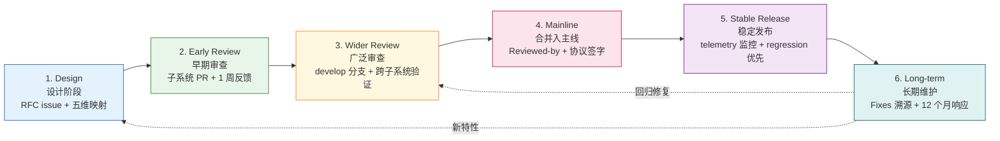
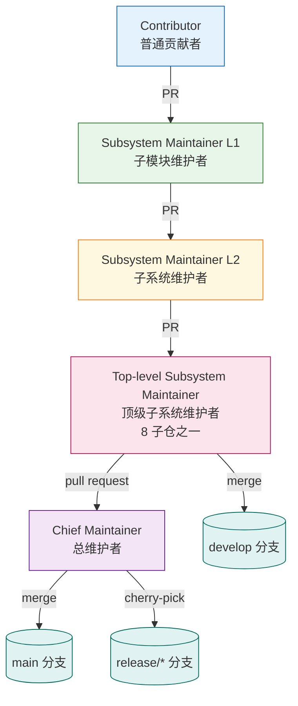
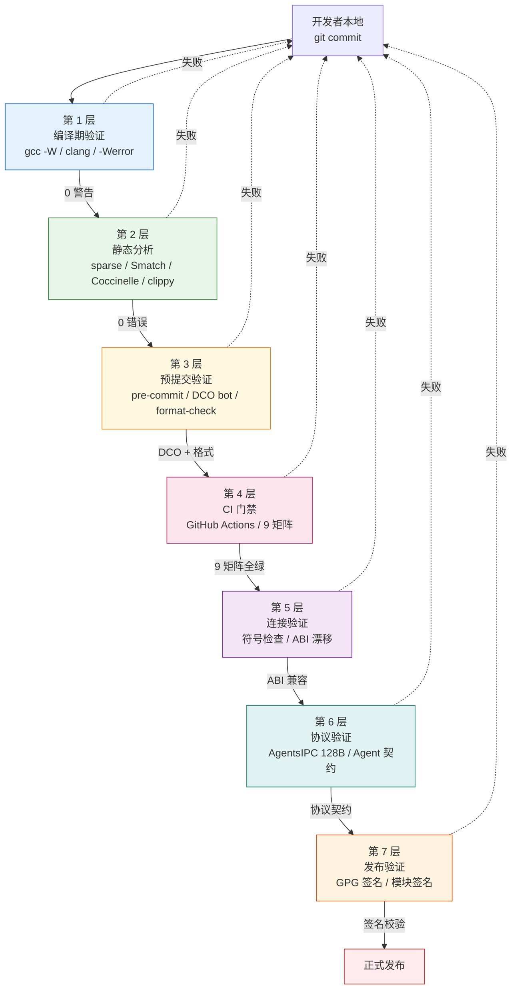
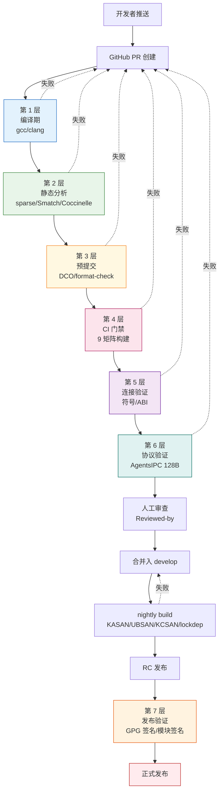

Copyright (c) 2025-2026 SPHARX Ltd. All Rights Reserved.

# agentrt-linux（AirymaxOS）开发流程标准
> **文档定位**：agentrt-linux（AirymaxOS，极境智能体操作系统）工程标准规范第 5 卷——开发流程。本卷规定从设计构想进入主线、稳定版到长期维护的完整生命周期，以及维护者层级制度、补丁格式、审查响应与稳定版规则。\
> **文档版本**：1.0.1\
> **最后更新**：2026-07-06\
> **上级文档**：[agentrt-linux 设计文档](README.md)\
> **同源映射**：docs/AirymaxRT/10-architecture/00-architectural-principles.md`（五维正交 24 原则）+ Linux 6.6 内核基线 `Documentation/process/development-process.rst\
> **理论根基**：Linux 6.6 内核基线工程思想 + Airymax 体系并行论（Multibody Cybernetic Intelligent System）\
> **SSoT 声明**：本卷为 agentrt-linux **开发流程规则**的唯一权威来源（SSoT）。本卷规则编号的目标体系为 **OS-STD-PROD-NNN**（4 段前缀，PROD = Process/Development）。本卷正文中现存的历史编号 **OS-STD-101~234**（与 06-toolchain-and-automation.md 共用 OS-STD-101~158 段导致 30+ 项语义冲突）将迁移为 OS-STD-PROD-101~234，迁移映射见 §0.2。历史编号与 OS-STD-PROD 编号**并存且等价**，规则效力以本卷正文为准。\
> **合并说明（2026-07-12）**：本卷已合并原 `06-toolchain-and-automation.md`（→ Part II）、`08-compliance-checklist.md`（→ Part III）、`110-spdx-license-compliance.md`（→ Part IV）。原文件已物理删除，所有引用须指向本卷对应 Part。

---

# Part I: 开发流程

## 0. 章节定位

本卷是 agentrt-linux 工程标准 7 主题文档中的第 5 卷，回答"代码怎么进入主线"这一问题。它在 04 工程思想（双层稳定性、策略机制分离）与 06 工具链自动化（7 层验证、CI/CD）之间形成承上启下的桥梁：

- **上游依赖**：04 工程思想定义"为什么"——稳定性哲学、可追溯性、审查优先；本卷定义"怎么做"——补丁生命周期、维护者层级、审查响应规范。
- **下游依赖**：06 工具链自动化定义"规范怎么被执行"——7 层验证、checkpatch、覆盖率门槛；本卷定义"规范在哪个阶段被执行"——每个生命周期阶段的强制工具链关卡。

本卷所有强制规则均赋予 **OS-STD** / **OS-KER** 编号，与 07 维护者制度与治理的"规则编号注册表"对齐。

### 0.2 OS-STD → OS-STD-PROD 编号段隔离声明

> 本卷与 06-toolchain-and-automation.md 历史上共用 `OS-STD-101~158` 编号段，导致同一编号在两卷中定义完全不同（如 `OS-STD-101` 在本卷 = "L1/L2 接口设计需 RFC"，在 06 = "checkpatch --strict 无 ERROR"）。为消除冲突，本卷规则迁移至 `OS-STD-PROD-NNN` 段（PROD = Process/Development），06 迁移至 `OS-STD-TOOL-NNN` 段（TOOL = Toolchain）。

#### 0.2.1 编号段隔离对照表

| 编号段 | 本卷（05-development-process） | 06-toolchain-and-automation | 隔离方案 |
|--------|-------------------------------|----------------------------|---------|
| OS-STD-101 | L1/L2 接口设计需 RFC | checkpatch --strict 无 ERROR | 本卷 → OS-STD-PROD-101；06 → OS-STD-TOOL-101 |
| OS-STD-102 | 设计文档含五维原则映射 | 剩余 WARNING/CHECK 须 justified | 本卷 → OS-STD-PROD-102；06 → OS-STD-TOOL-102 |
| OS-STD-103 | 早期审查 PR 含完整补丁描述 | C/C++ 文件通过 clang-format | 本卷 → OS-STD-PROD-103；06 → OS-STD-TOOL-103 |
| OS-STD-111 | 补丁作者 12 个月内响应 bug | 新增内核工具有 KUnit 测试 | 本卷 → OS-STD-PROD-111；06 → OS-STD-TOOL-111 |
| OS-STD-121 | 上层 maintainer 拉取执行 CI 门禁 | 内核子系统行覆盖率 ≥80% | 本卷 → OS-STD-PROD-121；06 → OS-STD-TOOL-121 |
| OS-STD-131 | develop nightly build（示例） | 子仓维护 ci/nightly/release（示例） | 本卷 → OS-STD-PROD-131；06 → OS-STD-TOOL-131 |

#### 0.2.2 迁移状态

- **编号体系**：历史 `OS-STD-NNN` 与目标 `OS-STD-PROD-NNN` 等价有效。
- **编号统一**：CI/CD 流水线脚本与维护者治理文档（07）实施时统一替换为 `OS-STD-PROD-NNN`。
- **冲突消解**：迁移后，本卷与 06-toolchain-and-automation.md 的 `OS-STD-101~158` 段冲突彻底消除——本卷独占 `OS-STD-PROD-NNN` 段，06 独占 `OS-STD-TOOL-NNN` 段。
- **保留编号**：`OS-KER-xxx`（内核工程规则）与 `OS-ACC-xxx`（验收标准）不受本次迁移影响。

### 0.1 关键术语

| 术语 | 定义 |
|------|------|
| 补丁（Patch） | 一个 git commit，对应一个逻辑变更；在 GitHub 流程中表现为 PR 中的一个提交 |
| 补丁序列（Patch Series） | 一组相互关联、按依赖顺序排列的补丁；在 GitHub 流程中表现为单个 PR 内的多个提交 |
| 子系统树 | 维护者维护的分支（等价 Linux 子系统树），是补丁进入主线的中间站 |
| `develop` 分支 | agentrt-linux 预览集成分支，等价 linux-next 树 |
| `release/*` 分支 | agentrt-linux 稳定版分支，等价 Linux -stable 树 |
| MicroCoreRT | Airymax 微核心运行时基座（Minimal Core Runtime），agentrt-linux 内核态对其保持同源语义 |
| AgentsIPC | Airymax 智能体进程间通信协议，128B 定长消息头；本卷涉及的协议改动必须经专门审查 |
| 五维正交 24 原则 | Airymax 架构设计原则体系（S/K/C/E/A 五维，每维 4-8 项原则） |

---

## 1. 补丁生命周期（6 阶段）

agentrt-linux 继承 Linux 6.6 内核基线的 6 阶段补丁生命周期模型，并将其适配到 GitHub PR 流程。每个阶段有明确的输入、输出、责任人和 SLA。

### 1.1 阶段一：Design（设计）

设计阶段确定"做什么"和"为什么做"。

- **可在社区内或社区外**：设计可以闭门进行，但**公开设计可节省后期返工**——尤其是涉及 AgentsIPC 协议、Agent SDK 接口、内核 ABI 的设计。
- **强制产出**：RFC issue（GitHub）或设计文档（Markdown）。涉及 ABI 改动的设计必须遵循 04 工程思想 §6.2 的 4 层接口稳定性分级。
- **OS-STD-101**：任何影响 L1（Agent 应用 API）或 L2（AgentsIPC 协议）的设计，必须先在 GitHub 创建 RFC issue 并至少获得 1 名顶级子系统维护者 ACK，方可进入早期审查阶段。
- **OS-STD-102**：设计文档必须包含"五维原则映射"小节，说明该设计涉及哪些原则（如 S-4 涌现性管理、K-2 接口契约化）。

### 1.2 阶段二：Early Review（早期审查）

将补丁序列提交到相关子系统维护者的 GitHub PR。

- **目标审查者**：由 `MAINTAINERS` 文件（agentrt-linux 等价物，详见 07 卷）和 `CODEOWNERS` 自动识别。
- **SLA**：子系统维护者通常在 **1 周内**给出审查反馈，否则可能 PR 发错了地方。
- **OS-STD-103**：早期审查 PR 必须包含完整的补丁描述（问题描述、用户可见影响、量化权衡），禁止"占位描述"。
- **OS-STD-104**：早期审查阶段发现的所有审查意见必须在 PR 内联回复，禁止离线沟通。

### 1.3 阶段三：Wider Review（广泛审查）

补丁进入子系统树和 `develop` 分支（等价 -next 树）。

- **可见性提升**：进入 `develop` 分支后，补丁会暴露给更广泛的测试者与 CI 矩阵。
- **跨子系统冲突**：`develop` 分支的 nightly build 会检测跨子系统符号冲突、ABI 漂移、协议契约违反。
- **OS-STD-105**：补丁进入 `develop` 分支前，必须通过 06 卷定义的 7 层自动化验证的前 4 层（编译期 / 静态分析 / 预提交 / CI 门禁）。
- **OS-STD-106**：`develop` 分支禁止 force-push 历史，所有变更必须以 merge commit 或 rebase 后的提交形式进入。

### 1.4 阶段四：Merging into Mainline（合并入主线）

由顶级子系统维护者发起 pull request 到 `main` 分支。

- **合并窗口**：参照 Linux Merge Window 模型，agentrt-linux 采用 2 周 Merge Window + 6 周 RC 周期的发布节奏（详见 130-roadmap）。
- **RC 期间仅接受修复**：RC1 发布后，新特性补丁必须等待下一个 Merge Window。
- **OS-STD-107**：合并入 `main` 的补丁必须包含至少 1 个 `Reviewed-by:` 标签（来自非作者维护者）。
- **OS-STD-108**：合并入 `main` 的补丁若修改 AgentsIPC 128B 消息头布局，必须由 agentrt-linux 工程规范委员会额外签字（详见 30-interfaces）。

### 1.5 阶段五：Stable Release（稳定发布）

补丁随某个正式版本（如 1.0.1）发布，更多用户暴露更多 bug。

- **回归报告优先级**：发布后报告的 regression 是最高优先级 bug，必须在下一个 RC 修复。
- **OS-STD-109**：任何 regression 报告必须在 48 小时内得到响应，7 天内提供修复或回滚方案。
- **OS-STD-110**：稳定版发布后 30 天内，相关补丁作者需主动监控 telemetry 指标（详见 90-observability）。

### 1.6 阶段六：Long-term Maintenance（长期维护）

作者需持续负责其合并入主线的代码。

- **"the development community remembers developers who lose interest in their code after it's merged"**——这是 Linux 内核社区的明确警告，agentrt-linux 完全继承此原则。
- **OS-STD-111**：补丁作者在代码合并后 12 个月内，须响应与其补丁相关的所有 bug 报告与审查请求；若长期无响应，维护者可将其代码标记为 `Orphaned` 并寻找新维护者。
- **OS-STD-112**：长期维护期间发现的修复需通过 `Fixes:` 标签溯源到引入 bug 的原始提交（详见 §4.3）。

### 1.7 6 阶段流转图



---

## 2. 维护者层级制度（Lieutenant System / Chain of Trust）

agentrt-linux 继承 Linux 内核的 Lieutenant System（副手系统）——一条从普通贡献者到总维护者的信任链。

### 2.1 信任链结构

```
普通贡献者（Contributor）
    │ 提交 PR
    ▼
子系统维护者（Subsystem Maintainer）
    │ pull request
    ▼
顶级子系统维护者（Top-level Subsystem Maintainer）
    │ pull request
    ▼
总维护者（Chief Maintainer）
    │ merge to main
    ▼
main 分支
```

### 2.2 信任链长度

- **链可任意长，但很少超过 2-3 级**——超过 3 级通常意味着子系统拆分不合理。
- agentrt-linux 的 8 子仓（kernel/services/security/memory/cognition/cloudnative/system/tests-linux）各设 1 名顶级子系统维护者，其下可有 2-3 层子系统维护者。

### 2.3 信任传递规则

每层 maintainer 信任下层 maintainer 的选择——但**信任不等于免责**：

- **OS-STD-121**：上层 maintainer 拉取下层分支时，必须执行 7 层自动化验证的 CI 门禁层；CI 不通过的拉取请求禁止合并。
- **OS-STD-122**：上层 maintainer 保留对下层补丁的最终否决权（NACK）；下层 maintainer 必须响应 NACK 并修改或撤回。
- **OS-STD-123**：信任链中任意一层断裂（如某层 maintainer 失联超过 30 天），上层 maintainer 可越级接管其分支，并启动维护者补选流程（详见 07 卷）。

### 2.4 agentrt-linux 适配：从 git send-email 到 GitHub PR

Linux 内核使用邮件列表 + `git send-email` 流程，agentrt-linux 将其适配为 GitHub PR 流程，但保留同源语义：

| Linux 内核概念 | agentrt-linux 等价物 | 同源语义 |
|---------------|------------------|---------|
| 邮件列表（mailing list） | GitHub PR + 子仓 issue tracker | 公开讨论存档 |
| `git send-email` | GitHub PR 内联提交 | 补丁可被引用、逐行评论 |
| `MAINTAINERS` 文件 | `MAINTAINERS.md` + `CODEOWNERS` | 自动识别审查者 |
| patchwork | GitHub Projects（看板） | 补丁状态追踪 |
| `Cc: stable@vger.kernel.org` | PR 评论 `Cc: release/1.0.x` | 标记需回溯到稳定版 |
| `Signed-off-by:` 邮件签名 | DCO bot 自动验证 | Developer Certificate of Origin |

### 2.5 维护者层级图



---

## 3. -next 树与 -mm 树（预览集成）

### 3.1 linux-next 等价物：`develop` 分支

- `develop` 分支是 agentrt-linux 的预览集成分支，等价 Linux 的 linux-next 树。
- 所有进入 `main` 之前、已通过子系统树审查的补丁，会汇聚到 `develop` 分支进行跨子系统联调。
- **OS-STD-131**：`develop` 分支每天至少运行 1 次 nightly build，覆盖 x86_64 / aarch64 / riscv64 三个架构 × allmodconfig / allnoconfig / defconfig 三种配置。
- **OS-STD-132**：`develop` 分支 nightly build 失败必须在 24 小时内修复或回滚；连续 3 天失败的子系统，其补丁将被冻结进入下一轮 Merge Window。

### 3.2 -mm 等价物：无明确子系统树的补丁归宿

Linux 内核历史上由 Andrew Morton 维护的 -mm 树，承担"无明确子系统归属的补丁"。agentrt-linux 等价物为 `airymax-mm` 分支：

- 由总维护者直接管辖，作为"维护者最后手段"（maintainer of last resort）。
- 适合跨子系统、不属于任何单一子仓的补丁（如构建系统、文档、CI 配置）。
- **OS-STD-133**：进入 `airymax-mm` 的补丁必须额外说明"为何无子系统归属"。

### 3.3 staging tree 等价物

Linux 内核的 `drivers/staging/` 是质量未达标的代码暂存地。agentrt-linux 等价物为 `staging/` 目录与 `feature/staging-*` 分支：

- 进入 `staging/` 的代码不视为正式主线代码，不享受 ABI 稳定性保证。
- **OS-STD-134**：`staging/` 代码必须在每个文件顶部标注 `// STAGING: 未达主线质量标准` 注释。
- **OS-STD-135**：`staging/` 代码必须在 2 个发布周期内毕业到正式目录，否则移除。

### 3.4 agentrt-linux 专属：feature/* 分支命名规范

| 分支前缀 | 用途 | 生命周期 |
|---------|------|---------|
| `feature/<name>` | 新特性开发 | 合并入 `develop` 后删除 |
| `fix/<issue-id>-<desc>` | Bug 修复 | 合并入 `develop` 或 `release/*` 后删除 |
| `refactor/<name>` | 重构 | 合并入 `develop` 后删除 |
| `release/<version>` | 稳定版维护 | 长期保留 |
| `hotfix/<issue-id>` | 紧急修复 | 合并入 `main` + `release/*` 后删除 |

**OS-STD-136**：禁止使用 `dev`、`test`、`tmp`、`wip` 等无语义分支名；分支名必须能从名称推断用途。

---

## 4. 补丁提交规范

### 4.1 补丁拆分原则

agentrt-linux 继承 Linux 内核的"一补丁一逻辑"原则，并增加量化约束：

- **每个逻辑变更一个补丁**：不混合不同类型改动（bug fix / 性能优化 / API 改动 / 新驱动）。
- **每个补丁必须能独立审查、独立验证**：审查者可在不阅读其他补丁的前提下理解单个补丁。
- **每个 patch 在序列中点都应能编译运行**——这是 `git bisect` 友好的硬性要求。
- **不要过度拆分**：曾有人单文件提交 500 补丁，被社区嫌弃为噪音；agentrt-linux 设定单 PR 上限。
- **OS-STD-141**：单个 PR 最多 15 个 commit；超过 15 个必须拆分为多个 PR，并在 PR 描述中标注依赖关系。
- **OS-STD-142**：单个 commit 的 diff 不超过 1000 行（含上下文）；超过 1000 行必须在 commit message 中说明不可拆分的理由。
- **OS-STD-143**：补丁序列中任意中间点 `git bisect` 后必须能成功编译，违反此规则的序列将被整体退回。
- **OS-STD-144**：移动代码与修改代码必须分属不同 commit——纯移动 commit 的 diff 应仅含文件路径变化，无任何逻辑修改。

### 4.2 PR / Commit 格式

agentrt-linux 采用与 Linux 内核同源的补丁格式，适配为 GitHub commit message 规范：

```
[PATCH 001/123] subsystem: summary phrase

详细描述正文，行宽 75 列。
描述必须解释问题、用户可见影响、量化权衡。

Signed-off-by: Author Name <author@example.com>
Reviewed-by: Reviewer Name <reviewer@example.com>
---
实际 patch（GitHub 中为 commit diff）
```

**格式规则**：

- **OS-STD-151**：Subject 行格式为 `[PATCH NNN/total] subsystem: summary`，其中 `subsystem` 是子仓或子系统名（如 `kernel/sched`、`security/cupolas`），`summary` 是祈使语气的短语（≤50 字符）。
- **OS-STD-152**：描述正文行宽 75 列（标签行如 `Fixes:` / `Closes:` / `Link:` 不受此限制，便于脚本解析）。
- **OS-STD-153**：Subject 与正文之间必须有空行分隔。
- **OS-STD-154**：`---` 分隔符分隔 changelog 与 diffstat；分隔符之后的 commit message 不会进入最终 git log。
- **OS-STD-155**：禁止 MIME 附件、压缩包、二进制文件；所有补丁必须以 GitHub PR 内联 commit 形式提交。

### 4.3 描述规范

补丁描述必须说服审查者"这个问题值得修复"。agentrt-linux 强制以下要素：

- **必须描述问题**：无论是 1 行 bug 修复还是 5000 行新特性，都必须解释底层问题。
- **必须描述用户可见影响**：包括崩溃、卡死、数据损坏、性能回退、延迟尖峰、dmesg 输出等。
- **必须量化优化与权衡**：性能、内存、栈占用、二进制大小的改进必须提供数字证据；同时描述非显而易见的代价（CPU / 内存 / 可读性之间的取舍）。
- **必须使用祈使语气**（imperative mood）：用 "make xyzzy do frotz"，而非 "[This patch] makes xyzzy do frotz"。
- **引用 commit 必须用至少 12 字符 SHA-1 + 单行摘要**：

  ```
  Commit e21d2170f36602ae2708 ("video: remove unnecessary
  platform_set_drvdata()") removed the unnecessary
  platform_set_drvdata(), but left the variable "dev" unused.
  ```

  agentrt-linux 仓库对象众多，6-8 字符 SHA-1 有碰撞风险，必须使用至少 12 字符。

- **用 `Link:` 指向讨论存档**：GitHub PR / issue 链接、邮件列表存档、设计文档 URL。
- **修复 bug 用 `Closes:`**：指向公开 bug tracker；私有 tracker 与无效 URL 被禁止。
- **溯源 bug 用 `Fixes:`**：使用引入 bug 的原始 commit 的 12 字符 SHA + 单行摘要，不要跨行拆分标签。

  ```
  Fixes: 54a4f0239f2e ("KVM: MMU: make kvm_mmu_zap_page() return the number of pages it actually freed")
  ```

- **OS-STD-161**：所有 commit 必须包含 `Signed-off-by:`（DCO 签名），由 DCO bot 自动验证；无 DCO 签名的 PR 禁止合并。
- **OS-STD-162**：`Reviewed-by:` / `Acked-by:` / `Tested-by:` 标签必须由对应人员本人添加（GitHub 评论形式），作者不得代签。
- **OS-STD-163**：补丁描述必须自包含——禁止"详见前序版本"或"详见链接"作为唯一描述，因为部分审查者可能未收到前序版本。

### 4.4 PR 礼仪

agentrt-linux 完全继承 Linux 内核审查礼仪，并将其适配到 GitHub：

- **使用 GitHub PR 内联提交**：每个 commit 必须可被逐行评论，禁止将整个 PR 作为单一 diff 评论。
- **用 interleaved（inline）回复，禁止 top-posting**：回复审查意见时，将回复插入到对应引用下方，并修剪无关引用。
- **回复时保留所有 Cc 收件人**：在 GitHub 中体现为 @-mention 所有相关审查者；禁止悄悄移除 Cc。
- **一周内通常会有审查反馈，否则可能发错地方**——审查者是忙碌的人，若 1 周内无反馈，先检查 `CODEOWNERS` 是否正确，再考虑 ping。
- **重发未修改补丁加 `RESEND`**：在 PR 标题或 commit 标题加 `[RESEND]`；修改版本用 `v2`、`v3` 等。
- **回复必须礼貌并感谢审查者**：代码审查是耗时耗力的过程，审查者偶尔会变得焦躁；即使如此，回复仍须礼貌，并明确说明修改内容。
- **OS-STD-171**：禁止在 PR 评论中人身攻击、贬低、或质疑审查者动机；违反者将被暂时禁言（详见 07 卷治理）。
- **OS-STD-172**：每条未导致代码改动的审查意见都应转化为代码注释或 changelog 条目（Andrew Morton 建议）——这让下一轮审查者理解"为何这条意见没改代码"。

---

## 5. 审查流程

### 5.1 审查响应

- **必须响应每条审查意见**：不同意需解释技术理由，不能沉默忽略。
- **忽略审查是致命错误**：在 Linux 内核社区，忽略审查者的开发者会被社区忽略；agentrt-linux 同样如此。
- **Andrew Morton 建议**：每条未导致代码改动的审查意见都应转化为代码注释或 changelog 条目——这既是对审查者的尊重，也是对后续维护者的文档。
- **OS-STD-181**：PR 作者必须在收到审查意见后 7 天内响应（即使只是"已记录，将在 v2 修改"）；超过 7 天无响应的 PR 将被标记为 `stale` 并最终关闭。
- **OS-STD-182**：审查者 NAK 必须附带技术理由，禁止"感觉不对"式的无理由 NAK。

### 5.2 后续阶段

补丁合并入主线并非终点，而是新阶段的起点：

- **进入子系统树后可见性提升**：更多测试者会运行你的代码。
- **进入主线后会有新评论和 bug 报告**：稳定版发布后，用户基数扩大一个数量级。
- **regression 是最严重的 bug**：任何导致已工作功能失效的改动都是 P0 优先级。
- **"the development community remembers developers who lose interest in their code after it's merged"**——这是 Linux 内核社区的明确警告，agentrt-linux 完全继承。

### 5.3 审查者声明（Reviewer's Statement of Oversight）

agentrt-linux 沿用 Linux 内核的 Reviewed-by 标签语义——给出 `Reviewed-by:` 即声明：

> (a) 我已对该补丁进行了技术审查，评估其是否适合进入主线。
> (b) 任何与补丁相关的问题、疑虑或提问已反馈给提交者，且我对提交者的回应满意。
> (c) 虽然本提交可能仍有改进空间，但我认为它目前是对内核的有价值修改，且不存在已知阻碍合并的问题。
> (d) 我已审查该补丁并认为其健全，但我（除非另行明确声明）不对其达成既定目的或在任何场景下正常运行作任何担保。

**OS-STD-183**：`Reviewed-by:` 标签的给予者必须实际进行技术审查；流于形式的"橡皮图章"审查一经发现，审查者的 Reviewed-by 权限将被暂停。

---

## 6. 稳定版维护

### 6.1 -stable 树规则（等价物：release/* 分支）

agentrt-linux 的 `release/<version>` 分支等价 Linux -stable 树，遵循以下规则：

- 补丁或其等价修复**必须已存在于 main 分支**（上游）。
- 补丁必须**显然正确且已测试**。
- 补丁**不超过 100 行**（含上下文）。
- 补丁必须遵循本卷第 4 节的提交规范。
- 补丁必须**修复真实 bug 或新增设备 ID**——禁止"理论性 race condition"（除非附带可利用性说明）、禁止"琐碎修复"（拼写、空白等无用户收益的改动）。

### 6.2 三种提交流径

| 选项 | 描述 | 适用场景 |
|------|------|---------|
| Option 1 | 在主线 PR 的 sign-off 区域添加 `Cc: release/1.0.x`，合并入主线后自动 cherry-pick 到稳定版 | **强烈推荐**，最常用 |
| Option 2 | 补丁已合并主线后，向稳定版维护者提交请求 | 主线合并时未考虑回溯的场景 |
| Option 3 | 提交一个等价于已主线化的补丁到稳定版，需在 changelog 标注 `[ Upstream commit <sha1> ]` | 主线补丁因 API 变化需调整才能适配旧稳定版 |

**OS-STD-191**：使用 Option 2 / Option 3 时，必须确保修复或等价修复已存在于所有更新的稳定版分支，防止用户升级时遭遇回归。

### 6.3 审查周期（48 小时 ACK/NAK）

- 稳定版补丁提交后，进入审查队列。
- 工程规范委员会有 **48 小时**给出 ACK 或 NAK。
- 任一工程规范委员会成员或社区成员提出有效异议，补丁将被移出队列。
- ACK 后的补丁作为 -rc 发布，供开发者和测试者验证。
- 通常只发布 1 个 -rc；若有遗留问题，可能修改、移除补丁或追加 -rc。
- 最终发布的稳定版包含所有队列中且通过测试的补丁。

### 6.4 安全补丁直接由安全团队处理

- 安全补丁**不走常规稳定版审查流程**，由 agentrt-linux 安全团队直接处理（详见 110-security）。
- 严重安全漏洞可能进入短期 embargo，允许发行版先行准备补丁；embargo 期间补丁禁止进入任何公开分支或 PR。
- **OS-STD-192**：安全补丁的 `Fixes:` 标签必须指向引入漏洞的 commit；若无法溯源，必须在 commit message 中说明原因。

---

## 7. 长期支持（LTS）

### 7.1 LTS 内核选择

Linux 内核社区将部分内核指定为 "long term" 内核，提供长期维护。agentrt-linux 继承此模型：

- LTS 版本从正式发布版本中遴选，由专门的 LTS 维护者团队负责。
- LTS 版本只接受 bug 修复与安全补丁，不接受新特性。

### 7.2 选择标准

- **有 maintainer 需要且有精力维护**——LTS 不是自动授予的，必须有维护者承诺。
- 该版本在企业生产环境中已有显著部署基数。
- 该版本与最新主线版本的 API 差异可控（避免回溯成本过高）。

### 7.3 agentrt-linux LTS 策略

- **每 2 年一个 LTS 版本**：如 1.0 LTS、3.0 LTS、5.0 LTS。
- LTS 维护周期：**5 年**（含 2 年积极维护 + 3 年仅安全补丁）。
- **OS-STD-PROD-001**：LTS 版本必须每季度发布一个维护版本（如 1.0.1、1.0.2 ...）。
- **OS-STD-PROD-002**：LTS 维护者离职需提前 6 个月通知，启动继任者培养流程（详见 07 卷）。

### 7.4 LTS 流转图

```mermaid
flowchart TD
    V1[1.0 正式版]
    V2[2.0 正式版]
    V3[3.0 LTS]
    V4[4.0 正式版]
    V5[5.0 LTS]

    V1 -->|2 年后| V3
    V2 -->|1 年后| V3
    V3 -->|LTS 5 年维护|
    V3 -->|2 年后| V5
    V4 -->|1 年后| V5

    style V3 fill:#fce4ec,stroke:#ad1457
    style V5 fill:#fce4ec,stroke:#ad1457
```

---

## 8. 贡献者成长路径

### 8.1 从 fix real bugs 起步

Andrew Morton 的建议：**新人从修复真实 bug 起步**，而非从拼写错误或风格修正开始。原因：

- 真实 bug 修复让新人熟悉完整流程（设计、审查、测试、合并、维护）。
- 真实 bug 修复有真实用户受益，社区会认真审查。
- 风格修正和拼写修复被视为**噪音**——它们占用审查者时间但不带来用户价值。

### 8.2 6 级成熟度模型

agentrt-linux 采用与 agentrt 同源的 6 级贡献者成熟度模型（详见 04-engineering-philosophy.md §10）：

| 级别 | 角色 | 能力 |
|------|------|------|
| L1 | Contributor | 提交符合规范的 PR |
| L2 | Trusted Contributor | PR 可免 Early Review 直入 Wider Review |
| L3 | Subsystem Maintainer L1 | 维护子模块分支 |
| L4 | Subsystem Maintainer L2 | 维护子系统分支 |
| L5 | Top-level Subsystem Maintainer | 维护 8 子仓之一 |
| L6 | Chief Maintainer | 维护 main 分支 |

### 8.3 成长建议

- **从 fix real bugs 起步**：选择有真实用户影响的 bug，而非理论性 bug。
- **写好 commit message**：好的描述比好的代码更能体现工程素养。
- **响应每一条审查意见**：审查是学习的机会，不是攻击。
- **持续维护你的代码**：合并不是终点，而是责任的开始。
- **OS-STD-PROD-011**：从 L1 晋升 L2 需至少 5 个被合并的 PR，且无 regression 记录。
- **OS-STD-PROD-012**：从 L2 晋升 L3 需至少 20 个被合并的 PR，且通过维护者面试（详见 07 卷）。

---

## 9. 子系统特定手册

### 9.1 网络设备手册

继承 Linux `Documentation/networking/netdevices.rst`，agentrt-linux 网络子系统手册规定：

- 网络设备驱动的注册/注销流程。
- NAPI 轮询接口契约。
- XDP / AF_XDP 在 agentrt-linux 中的扩展（用于 Agent 高速 IPC）。

### 9.2 SoC 平台手册

继承 Linux `Documentation/devicetree/` 与 SoC 平台手册，agentrt-linux SoC 平台手册规定：

- 设备树绑定规范。
- SoC 平台移植 checklist。
- MicroCoreRT 在不同 SoC 上的适配指南。

### 9.3 agentrt-linux 专属：8 子仓各自手册

agentrt-linux 的 8 子仓各有独立的子系统手册，作为本卷的补丁：

| 子仓 | 手册路径 | 核心规范 |
|------|---------|---------|
| kernel | `60-driver-model/` + kernel 子仓 `MAINTAINERS.md` | 内核子系统、驱动模型、MicroCoreRT 适配 |
| services | `100-operations/` + services 子仓 | 用户态服务（`*_d`）规范 |
| security | `110-security/` + security 子仓 | Cupolas 安全穹顶、LSM 集成、capability |
| memory | `170-performance/` + memory 子仓 | MemoryRovol 四层记忆、MGLRU 多代 LRU、CXL/PMEM |
| cognition | `40-dataflows/` + cognition 子仓 | CoreLoopThree 三层认知循环 |
| cloudnative | `150-cloudnative/` + cloudnative 子仓 | 云原生 Agent 部署、容器化 |
| system | `10-architecture/` + system 子仓 | 系统调用、ABI、AgentsIPC 128B 协议 |
| tests-linux | `80-testing/` + tests-linux 子仓 | KUnit / kselftest / Agent 行为契约测试 |

**OS-STD-PROD-021**：每个子仓必须维护一份 `MAINTAINERS.md`，列出该子仓的所有维护者、审查者、文件路径映射、PR SLA。

---

## 10. 工具链

### 10.1 git（主导 SCM）

- git 是 agentrt-linux 唯一主导 SCM，所有补丁以 git commit 形式存在。
- **OS-STD-PROD-031**：所有 commit 必须用 `git commit -s` 添加 DCO 签名。
- **OS-STD-PROD-032**：禁止 `git push --force` 到 `main` / `develop` / `release/*` 分支；feature 分支允许 force-push 但须在 PR 描述中说明。

### 10.2 GitHub（PR + CODEOWNERS + Actions）

- GitHub 是 agentrt-linux 的代码托管与审查平台。
- `CODEOWNERS` 自动识别审查者。
- GitHub Actions 执行 7 层自动化验证（详见 06 卷）。
- **OS-STD-PROD-033**：所有 PR 必须通过 GitHub Actions 全部检查才能合并；任一检查失败的 PR 禁止合并（即使审查者已 ACK）。

### 10.3 patchwork 等价物（GitHub Projects）

- Linux 内核的 patchwork 用于追踪补丁状态（New / Under Review / Accepted / Rejected）。
- agentrt-linux 等价物为 GitHub Projects 看板，每个子仓一个 Projects。
- **OS-STD-PROD-034**：PR 状态变更（如从"待审查"到"已合并"）必须同步到 GitHub Projects 看板。

---

## 11. 五维原则映射

本卷开发流程规范与 Airymax 五维正交 24 原则的映射如下：

| 原则 | 含义 | 在本卷的体现 |
|------|------|------------|
| **S-1 反馈闭环** | 系统每一层必须有完整"感知-决策-执行-反馈"闭环 | 审查反馈、CI 反馈、稳定版 telemetry 反馈构成开发流程的三级反馈闭环 |
| **S-3 总体设计部** | 统筹系统整体设计 | 总维护者角色 + 8 子仓顶级子系统维护者构成总体设计部 |
| **S-4 涌现性管理** | 通过简单规则引导系统产生有益整体行为 | 渐进式开发模型（6 阶段 + Merge Window + RC）+ `develop` 分支预览集成管理涌现性 |
| **K-2 接口契约化** | 双层稳定性哲学（用户 ABI 稳定 / 内部 API 可重构） | L1-L4 接口分级 + AgentsIPC 128B 消息头改动需工程规范委员会签字（OS-STD-108） |
| **C-2 增量演化** | 渐进式演进，每一步可验证 | 补丁序列中点可编译运行 + `git bisect` 友好（OS-STD-143） |
| **E-6 错误可追溯** | 错误可溯源、可追踪 | `Fixes:` / `Closes:` / `Link:` 标签 + 12 字符 SHA-1 + Signed-off-by DCO 链 |
| **E-7 文档即代码** | 文档与代码同源同审 | RFC issue + 设计文档 + 五维原则映射小节（OS-STD-102） |
| **A-3 人文关怀** | 不烧桥管理哲学 | 审查礼仪（OS-STD-171）+ 感谢审查者 + Morton 原则（OS-STD-172） |
| **A-4 完美主义** | 7 层验证确保完美 | 每个生命周期阶段强制工具链关卡（OS-STD-105 / OS-STD-107 / OS-STD-PROD-033） |

---

## 12. OS-STD 规则编号汇总

本卷定义的 OS-STD 规则编号汇总如下，与 07 卷"规则编号注册表"对齐：

| 编号 | 规则 | 强制级别 |
|------|------|---------|
| OS-STD-101 | L1/L2 接口设计需 RFC + 顶级维护者 ACK | MUST |
| OS-STD-102 | 设计文档含五维原则映射小节 | MUST |
| OS-STD-103 | 早期审查 PR 含完整补丁描述 | MUST |
| OS-STD-104 | 早期审查意见 PR 内联回复 | MUST |
| OS-STD-105 | 进入 develop 前过 7 层验证前 4 层 | MUST |
| OS-STD-106 | develop 禁止 force-push 历史 | MUST |
| OS-STD-107 | 合并入 main 需至少 1 个 Reviewed-by | MUST |
| OS-STD-108 | AgentsIPC 128B 消息头改动需工程规范委员会签字 | MUST |
| OS-STD-109 | regression 48 小时响应 | MUST |
| OS-STD-110 | 稳定版后 30 天 telemetry 主动监控 | SHOULD |
| OS-STD-111 | 作者 12 个月内响应 bug 报告 | MUST |
| OS-STD-112 | 长期维护修复用 Fixes 溯源 | MUST |
| OS-STD-121 | 上层拉取需过 CI 门禁 | MUST |
| OS-STD-122 | 上层保留 NACK 否决权 | MUST |
| OS-STD-123 | 信任链断裂 30 天启动补选 | MUST |
| OS-STD-131 | develop nightly build 三架构三配置 | MUST |
| OS-STD-132 | develop 连续 3 天失败冻结补丁 | MUST |
| OS-STD-133 | airymax-mm 补丁说明无子系统归属理由 | MUST |
| OS-STD-134 | staging 文件标注 STAGING 注释 | MUST |
| OS-STD-135 | staging 2 周期毕业或移除 | MUST |
| OS-STD-136 | 禁止无语义分支名 | MUST |
| OS-STD-141 | 单 PR 最多 15 个 commit | MUST |
| OS-STD-142 | 单 commit diff ≤1000 行（否则说明理由） | MUST |
| OS-STD-143 | 补丁序列中点可编译（bisect 友好） | MUST |
| OS-STD-144 | 移动代码与修改代码分属不同 commit | MUST |
| OS-STD-151 | Subject 行格式 | MUST |
| OS-STD-152 | 描述正文行宽 75 列 | MUST |
| OS-STD-153 | Subject 与正文空行分隔 | MUST |
| OS-STD-154 | `---` 分隔符分隔 changelog 与 diffstat | MUST |
| OS-STD-155 | 禁止 MIME 附件 | MUST |
| OS-STD-161 | DCO 签名强制 | MUST |
| OS-STD-162 | 审查标签本人添加 | MUST |
| OS-STD-163 | 补丁描述自包含 | MUST |
| OS-STD-171 | 禁止人身攻击 | MUST |
| OS-STD-172 | 未改代码的意见转注释/changelog | SHOULD |
| OS-STD-181 | PR 7 天内响应审查 | MUST |
| OS-STD-182 | NAK 需技术理由 | MUST |
| OS-STD-183 | Reviewed-by 不得橡皮图章 | MUST |
| OS-STD-191 | Option 2/3 需覆盖所有更新稳定版 | MUST |
| OS-STD-192 | 安全补丁 Fixes 标签溯源 | MUST |
| OS-STD-PROD-001 | LTS 季度维护版本 | MUST |
| OS-STD-PROD-002 | LTS 维护者离职提前 6 个月通知 | MUST |
| OS-STD-PROD-011 | L1→L2 需 5 PR 无 regression | MUST |
| OS-STD-PROD-012 | L2→L3 需 20 PR + 面试 | MUST |
| OS-STD-PROD-021 | 子仓维护 MAINTAINERS.md | MUST |
| OS-STD-PROD-031 | commit 用 git commit -s | MUST |
| OS-STD-PROD-032 | 禁止 force-push 到受保护分支 | MUST |
| OS-STD-PROD-033 | PR 必须过全部 GitHub Actions | MUST |
| OS-STD-PROD-034 | PR 状态同步 GitHub Projects | MUST |

---

## 13. 相关文档

### 13.1 同卷文档

- `04-engineering-philosophy.md`（工程思想：双层稳定性 / 策略机制分离 / 6 级成熟度模型）
- 本文档 Part II（工具链与自动化：7 层验证 / checkpatch / CI/CD）
- `07-maintainers-and-governance.md`（维护者制度与治理：MAINTAINERS / 层级 / DCO）

### 13.2 上游设计文档

- `10-architecture/`（系统架构：MicroCoreRT / AgentsIPC / Cupolas / MemoryRovol / CoreLoopThree）
- `30-interfaces/`（接口设计：AgentsIPC 128B 消息头布局 / Agent SDK / 系统调用）
- `40-dataflows/`（数据流：认知流 / IPC 流 / 调度流）

### 13.3 参考材料

- Linux 6.6 内核源码 `Documentation/process/development-process.rst`
- Linux 6.6 内核源码 `Documentation/process/submitting-patches.rst`
- Linux 6.6 内核源码 `Documentation/process/submit-checklist.rst`
- Linux 6.6 内核源码 `Documentation/process/stable-kernel-rules.rst`

---

## 14. 文档版本与维护

- **当前版本**: v1.0.1（2026-07-06）
- **维护者**: 工程规范委员会（待成立，详见 07 卷）
- **变更流程**: 任何本卷变更必须经过 RFC → 评审 → ACC 验收流程
- **回顾周期**: 季度回顾 + 年度大版本

***

# Part II: 工具链与自动化（原 06-toolchain-and-automation.md）

## 0. 章节定位

本卷是 agentrt-linux 工程标准 7 主题文档中的第 6 卷，回答"规范怎么被执行"这一问题。它在 05 开发流程（补丁生命周期、审查响应）与 07 维护者制度（治理、DCO、成熟度模型）之间形成自动化执行层：

- **上游依赖**：05 开发流程定义"规范在哪个阶段被执行"——每个生命周期阶段的强制工具链关卡；本卷定义"规范怎么被执行"——7 层验证流水线、CI/CD 矩阵、覆盖率门槛。
- **下游依赖**：07 维护者制度定义"谁来执行规范"——CODEOWNERS、审查者、DCO bot；本卷定义"机器怎么协助人执行规范"——GitHub Actions、DCO bot、format-check。

本卷所有强制规则均赋予 **OS-STD** / **OS-TEST** / **OS-BUILD** 编号，与 07 维护者制度与治理的"规则编号注册表"对齐。

### 0.2 OS-STD → OS-STD-TOOL 编号段隔离声明

> **本节为编号段隔离声明**。本卷与 05-development-process.md 历史上共用 `OS-STD-101~158` 编号段，导致同一编号在两卷中定义完全不同（如 `OS-STD-101` 在本卷 = "checkpatch --strict 无 ERROR"，在 05 = "L1/L2 接口设计需 RFC"）。为消除冲突，本卷规则迁移至 `OS-STD-TOOL-NNN` 段（TOOL = Toolchain），05 迁移至 `OS-STD-PROD-NNN` 段（PROD = Process/Development）。

#### 0.2.1 编号段隔离对照表

| 编号段 | 本卷（06-toolchain-and-automation） | 05-development-process | 隔离方案 |
|--------|-------------------------------------|------------------------|---------|
| OS-STD-101 | checkpatch --strict 无 ERROR | L1/L2 接口设计需 RFC | 本卷 → OS-STD-TOOL-101；05 → OS-STD-PROD-101 |
| OS-STD-102 | 剩余 WARNING/CHECK 须 justified | 设计文档含五维原则映射 | 本卷 → OS-STD-TOOL-102；05 → OS-STD-PROD-102 |
| OS-STD-103 | C/C++ 文件通过 clang-format | 早期审查 PR 含完整补丁描述 | 本卷 → OS-STD-TOOL-103；05 → OS-STD-PROD-103 |
| OS-STD-111 | 新增内核工具有 KUnit 测试 | 补丁作者 12 个月内响应 bug | 本卷 → OS-STD-TOOL-111；05 → OS-STD-PROD-111 |
| OS-STD-121 | 内核子系统行覆盖率 ≥80% | 上层 maintainer 拉取执行 CI 门禁 | 本卷 → OS-STD-TOOL-121；05 → OS-STD-PROD-121 |
| OS-STD-131 | 子仓维护 ci/nightly/release（示例） | develop nightly build（示例） | 本卷 → OS-STD-TOOL-131；05 → OS-STD-PROD-131 |

#### 0.2.2 迁移状态

- **编号体系**：历史 `OS-STD-NNN` 与目标 `OS-STD-TOOL-NNN` 等价有效。
- **编号统一**：CI/CD 流水线脚本与 GitHub Actions workflow 实施时统一替换为 `OS-STD-TOOL-NNN`。
- **冲突消解**：迁移后，本卷与 05-development-process.md 的 `OS-STD-101~158` 段冲突彻底消除——本卷独占 `OS-STD-TOOL-NNN` 段，05 独占 `OS-STD-PROD-NNN` 段。
- **保留编号**：`OS-TEST-xxx`（测试规则）与 `OS-BUILD-xxx`（构建规则）不受本次迁移影响，这两个前缀由工程规范委员会确立。

### 0.1 关键术语

| 术语 | 定义 |
|------|------|
| 7 层验证 | agentrt-linux 的核心自动化验证体系，从编译期到发布期共 7 层 |
| checkpatch | Linux 内核风格检查脚本（`scripts/checkpatch.pl`），agentrt-linux 沿用并扩展 |
| KUnit | Linux 内核白盒单元测试框架，毫秒级运行 |
| kselftest | Linux 内核用户态系统级测试框架 |
| KASAN / KFENCE / UBSAN / KCSAN | Linux 内核动态分析工具（地址/内存/未定义行为/并发消毒器） |
| MicroCoreRT | Airymax 微核心运行时基座（Minimal Core Runtime），其协议层验证属第 6 层 |
| AgentsIPC 128B | Airymax 智能体 IPC 协议定长消息头，第 6 层验证对象 |
| 五维正交 24 原则 | Airymax 架构设计原则体系（S/K/C/E/A 五维） |

---

## 1. 7 层自动化验证体系（Airymax 核心机制）

agentrt-linux 在 Linux 6.6 内核基线工程工具链之上，构建了 7 层自动化验证体系。这是 agentrt-linux 区别于普通 Linux 发行版的核心机制——每一层都是一个独立的反馈闭环，任何一层失败都阻断后续流程。

### 1.1 第 1 层：编译期验证

- **工具**：`gcc -W` / `-Wall` / `-Werror` / `clang`
- **命令**：`make KCFLAGS=-W`（开启所有警告）
- **OS-STD-CODE-004**：编译期必须 0 警告 0 错误；任何警告都必须修复或显式标注 `#pragma` 抑制并附说明。
- **OS-STD-002**：所有 C 代码必须同时通过 gcc 与 clang 编译（双编译器交叉验证）。
- **OS-STD-003**：所有 Rust 代码必须通过 `cargo build` 与 `cargo clippy`。

### 1.2 第 2 层：静态分析

- **工具**：sparse / Smatch / Coccinelle / clang-analyzer / rust-clippy
- **命令**：`make C=2`（sparse）/ `make CHECK=smatch`（Smatch）/ `make coccicheck`（Coccinelle）
- **OS-STD-TOOL-011**：静态分析必须 0 错误；warnings 必须逐条评估并记录到 `static-analysis-baseline.md`。
- **OS-STD-012**：新增代码引入新的 sparse/Smatch 警告禁止合并。

### 1.3 第 3 层：预提交验证

- **工具**：pre-commit hooks / DCO bot / format-check
- **触发**：`git commit` 时本地 hook + GitHub PR 创建时服务端检查
- **OS-STD-021**：所有仓库必须配置 `.pre-commit-config.yaml`，本地 hook 在 commit 前自动运行 checkpatch + format-check。
- **OS-STD-022**：DCO bot 自动验证每个 commit 的 `Signed-off-by:` 链；无 DCO 签名的 commit 禁止推送到远端。
- **OS-STD-023**：`make format-check` 必须通过；不通过的 commit 禁止推送。

### 1.4 第 4 层：CI 门禁

- **工具**：GitHub Actions / 多配置构建
- **触发**：每次 PR 创建与更新
- **OS-STD-031**：PR 必须通过所有 GitHub Actions 检查才能合并；任一失败禁止合并（与 OS-STD-PROD-033 对齐）。
- **OS-STD-032**：CI 矩阵必须覆盖 x86_64 / aarch64 / riscv64 × allmodconfig / allnoconfig / defconfig 共 9 种组合。
- **OS-STD-033**：CI 总时长不得超过 60 分钟；超时的 job 必须拆分或缓存优化。

### 1.5 第 5 层：连接验证

- **工具**：链接检查 / 跨模块符号检查
- **检查项**：未定义符号、重复符号、ABI 漂移、模块签名兼容性
- **OS-STD-041**：所有 EXPORT_SYMBOL 必须在 `Module.symvers` 中有对应条目。
- **OS-STD-042**：跨子仓符号引用必须通过 `scripts/check_abisym.sh` 验证 ABI 兼容性。

### 1.6 第 6 层：协议验证

- **工具**：AgentsIPC 128B 消息头校验器 / Agent 行为契约测试
- **检查项**：AgentsIPC 128B 消息头字段对齐、版本号、校验和、Agent 行为契约（输入 → 输出映射）
- **OS-STD-051**：任何修改 AgentsIPC 128B 消息头布局的 PR 必须通过 `airymax-ipc-check` 工具验证向后兼容性。
- **OS-STD-052**：Agent SDK 接口必须有对应的行为契约测试，覆盖正常路径与异常路径。

### 1.7 第 7 层：发布验证

- **工具**：签名 / 校验和 / 模块签名
- **检查项**：GPG 签名、SHA-256 校验和、内核模块签名（CONFIG_MODULE_SIG_FORCE）
- **OS-STD-061**：正式发布版本必须由 agentrt-linux 发布密钥 GPG 签名。
- **OS-STD-062**：所有可加载内核模块必须签名；未签名模块禁止加载（生产配置）。

### 1.8 7 层验证流水线图



---

## 2. 编译期工具链

### 2.1 gcc -W（开启所有警告）

- 编译期是 7 层验证的第一道关，必须在此拦截尽可能多的低级错误。
- `make KCFLAGS=-W` 开启所有 gcc 警告，会输出大量噪音，但能发现"signed/unsigned 比较"等隐蔽 bug。
- **OS-STD-071**：所有新增 C 文件必须用 `gcc -W` 编译通过。

### 2.2 make KCFLAGS=-W

- 全局编译时通过 `KCFLAGS` 注入额外警告标志。
- 推荐组合：`KCFLAGS="-W -Wextra -Wno-unused-parameter"`

### 2.3 多配置构建

| 配置 | 命令 | 用途 |
|------|------|------|
| `allnoconfig` | `make allnoconfig` | 最小配置，验证依赖关系 |
| `allmodconfig` | `make allmodconfig` | 最大配置，验证所有模块编译 |
| `defconfig` | `make defconfig` | 默认配置，验证常用路径 |
| `O=builddir` | `make O=build defconfig` | 外部构建目录，验证路径无关性 |

**OS-STD-072**：所有 PR 必须在 `allnoconfig` / `allmodconfig` / `defconfig` 三种配置下编译通过。

### 2.4 跨架构构建

- **x86_64**：主力开发架构
- **aarch64**：嵌入式与服务器 ARM 架构
- **riscv64**：新兴 RISC-V 架构

**OS-STD-073**：所有 PR 必须在 x86_64 / aarch64 / riscv64 三种架构下交叉编译通过。
**OS-STD-074**：ppc64 推荐用于交叉编译检查（其使用 `unsigned long` 表示 64 位量，能发现隐式类型转换 bug）。

### 2.5 Rust 编译

- agentrt-linux 在安全敏感且非热路径的子系统（如安全策略、文件系统解析）使用 Rust 内核模块。
- **OS-STD-075**：Rust 代码必须通过 `cargo build --target x86_64-unknown-none` 编译。
- **OS-STD-076**：Rust 代码必须通过 `cargo clippy -- -D warnings`（clippy 警告视为错误）。
- **OS-STD-077**：Rust 代码必须通过 `cargo fmt --check`（rustfmt 格式化）。

---

## 3. 静态分析工具

### 3.1 sparse（类型检查）

- Sparse 做**类型检查**：验证 `__user` 指针注解、`__bitwise` 类型、字节序注解、RCU 锁注解。
- 命令：`make C=2`（C=1 仅检查修改的文件，C=2 检查全部）
- **OS-STD-081**：新增代码必须通过 `make C=2` 检查；新增的 sparse 警告禁止合并。

#### 3.1.1 sparse W 警告分级体系（对齐 OLK-6.6）

Linux 内核通过 `make W=<level>` 控制 sparse 警告输出等级（与 OLK-6.6 `Documentation/dev-tools/sparse.rst` 对齐）。agentrt-linux 沿用此分级，明确各阶段强制等级：

| 等级 | 命令 | 启用检查范围 | agentrt-linux 用途 |
|------|------|-------------|--------------------|
| `W=0` | `make W=0 C=2` | 仅 sparse 默认检查（关闭额外警告） | ❌ 不推荐（漏检风险高） |
| `W=1` | `make W=1 C=2` | 默认 + bitwise 类型 + RCU 锁注解 + 字节序注解 | ✅ **本地开发默认**（与 OLK-6.6 一致） |
| `W=2` | `make W=2 C=2` | W=1 + `__force` / `__context` 强制转换检查 + GFP 掩码混用检测 | ✅ **CI 流水线强制**（最严格） |
| `W=12` | `make W=12 C=2` | W=1 + W=2（合并等价于 W=2） | 等价 W=2，不重复使用 |
| `W=123` | `make W=123 C=2` | W=1 + W=2 + W=3（实验性检查） | ⚠️ 仅研究，禁止合并门槛 |

**W 等级使用规则**：

| 阶段 | W 等级 | 强制规则 | 说明 |
|------|--------|---------|------|
| 本地开发 | `W=1` | OS-STD-081 | 与 OLK-6.6 默认一致，平衡开发效率与检查覆盖 |
| CI 流水线 | `W=2` | OS-STD-TOOL-081-CI | 新增代码必须通过 `W=2` 检查，禁止新增 W=2 级 sparse 警告 |
| 发布前审计 | `W=2` | OS-STD-TOOL-081-REL | 全量代码 W=2 检查（含历史代码） |
| 实验性检查 | `W=123` | 不强制 | 仅用于研究，禁止作为合并门槛 |

> **OS-STD-TOOL-081-CI**（CI 强制等级）：CI 流水线必须使用 `make W=2 C=2` 检查新增代码；新增 W=2 级 sparse 警告禁止合并（与 OS-STD-081 对齐，但 W 等级从默认 W=1 提升至 W=2）。

> **OS-STD-TOOL-081-REL**（发布前审计等级）：发布前必须执行 `make W=2 C=2` 全量检查，历史代码不允许存在新增 W=2 级 sparse 警告。

> **对齐说明**：本分级体系与 OLK-6.6 `Documentation/dev-tools/sparse.rst` 完全一致——OLK-6.6 默认 W=1，CI 强制 W=2。agentrt-linux 沿用此约定，确保 sparse 检查覆盖率与上游内核一致。

### 3.2 Smatch（模式匹配）

- Smatch 做**流分析**：跨函数分析、缓冲区大小推断、用户可控索引检查、整数溢出、空指针解引用、内存泄漏。
- 命令：`make CHECK=smatch C=2`
- Smatch 比稀疏更易写自定义检查，但与 sparse 有部分重叠。
- **OS-STD-082**：Smatch 警告必须逐条评估，假阳性记录到 `smatch-baseline.md`。

### 3.3 Coccinelle（语义补丁）

- Coccinelle 做**模式转换**：在预处理前分析，能检查宏内 bug；可自动生成修复补丁。
- 命令：`make coccicheck`
- 典型用途：批量将 `kmalloc(x * size, GFP_KERNEL)` 转换为 `kmalloc_array(x, size, GFP_KERNEL)`。
- **OS-STD-083**：Coccinelle 报告的所有 API 误用必须修复或显式抑制。

### 3.4 clang-analyzer

- clang 静态分析器，与 sparse / Smatch 形成互补。
- 命令：`scan-build make`
- **OS-STD-084**：clang-analyzer 报告的 high severity 问题必须修复。

### 3.5 rust-clippy

- Rust 的 lint 工具，捕获惯用法反模式。
- 命令：`cargo clippy -- -D warnings`
- **OS-STD-085**：所有 Rust 代码必须 clippy 0 警告（与 OS-STD-076 对齐）。

### 3.6 agentrt-linux 专属：AgentsIPC 协议静态校验器

- `airymax-ipc-check` 工具：静态校验 AgentsIPC 128B 消息头布局、字段对齐、版本号一致性。
- 检查项：
  - 消息头总长度是否为 128 字节
  - 字段偏移是否符合协议定义（详见 30-interfaces）
  - 版本号字段是否单调递增
  - 校验和字段位置是否正确
- **OS-STD-086**：任何修改 AgentsIPC 协议定义的 PR 必须通过 `airymax-ipc-check`。

---

## 4. 动态分析工具

动态分析工具在内核运行时检测 bug 类。它们不像 KUnit/kselftest 那样"通过/失败"，而是与测试结合使用，确保测试运行期间无错误发生。

### 4.1 KASAN（地址消毒器）

- 检测无效内存访问：越界、use-after-free。
- 配置：`CONFIG_KASAN=y`
- 性能开销大，仅用于测试环境。
- **OS-STD-091**：所有 kselftest 必须在 KASAN 启用的内核上运行。

### 4.2 KFENCE（轻量级内存错误检测）

- KFENCE 是 KASAN 的轻量级替代，性能开销极小，可用于生产环境。
- 配置：`CONFIG_KFENCE=y`
- **OS-STD-092**：生产环境推荐启用 KFENCE（采样模式）。

### 4.3 UBSAN（未定义行为消毒器）

- 检测 C 标准未定义行为：整数溢出、移位越界、对齐违规。
- 配置：`CONFIG_UBSAN=y`
- **OS-STD-093**：所有 kselftest 必须在 UBSAN 启用的内核上运行。

### 4.4 KCSAN（并发消毒器）

- 检测数据竞争（data race）。
- 配置：`CONFIG_KCSAN=y`
- **OS-STD-094**：所有并发测试必须在 KCSAN 启用的内核上运行。

### 4.5 lockdep（锁依赖检查）

- 锁正确性验证器，检测死锁、锁顺序违规。
- 配置：`CONFIG_LOCKDEP=y` / `CONFIG_PROVE_LOCKING=y`
- **OS-STD-095**：所有代码路径必须在 lockdep 全功能启用下验证。

### 4.6 kmemleak（内存泄漏检测）

- 检测可能的内存泄漏。
- 配置：`CONFIG_DEBUG_KMEMLEAK=y`
- **OS-STD-096**：kselftest 运行后必须检查 kmemleak 报告，新增泄漏禁止合并。

### 4.7 KCOV（代码覆盖率）

- 内置覆盖率收集，按任务记录，适用于模糊测试。
- 配置：`CONFIG_KCOV=y`
- **OS-STD-097**：模糊测试必须启用 KCOV 收集覆盖率。

### 4.8 gcov（GCC 覆盖率）

- GCC 覆盖率工具，全局或按模块覆盖率。
- 配置：`CONFIG_GCOV_KERNEL=y`
- 覆盖率数据从 debugfs 读取，用 gcov 工具解读。

---

## 5. 格式化与风格检查

### 5.1 checkpatch.pl（Linux 内核风格检查）

- `scripts/checkpatch.pl` 是 Linux 内核风格检查脚本，agentrt-linux 完全沿用并扩展。
- 三级报告：
  - **ERROR**：极可能错误的项
  - **WARNING**：需仔细审查的项
  - **CHECK**：需思考的项
- **OS-STD-101**：所有 commit 的 diff 必须通过 `scripts/checkpatch.pl --strict` 检查，ERROR 禁止存在。
- **OS-STD-102**：剩余的 WARNING/CHECK 必须可被作者辩护（justified）。

> **交叉引用**：本节是 checkpatch 在 7 层验证体系中的框架定位。Linux 6.6 内核基线 `scripts/checkpatch.pl` 中 ≥30 条 ERROR/WARNING/CHECK 规则到 agentrt-linux 规则编号（OS-STD-CODE-NNN）的逐条映射表、每条规则的 Linux 6.6 内核基线 源码行号与触发示例，详见 [01-coding-standards.md Part IV](01-coding-standards.md) §1-§8（55 条规则映射）与 §10（CI 集成与门禁配置）。

### 5.2 .clang-format（C/C++ 格式化）

- `.clang-format` 文件定义 C/C++ 格式化规则（689 行 + 560 个 ForEachMacros）。
- 命令：`clang-format -i <file>`
- **OS-STD-103**：所有 C/C++ 文件必须通过 `clang-format` 格式化。

> **SSoT 对齐**：原 80-clang-format-enforcement.md 已合并入 [01-coding-standards.md Part II](01-coding-standards.md) §8/§9。格式规则定义与规则到配置项的速查映射表详见 01-coding-standards.md Part II §1-§7 与 §9。完整 `.clang-format` YAML 文件、Linux 6.6 内核基线 源码行号标注、Makefile 目标定义与 CI 集成脚本随代码实现补全。

### 5.3 .rustfmt.toml（Rust 格式化）

- `.rustfmt.toml` 定义 Rust 格式化规则（edition 2021）。
- 命令：`cargo fmt`
- **OS-STD-104**：所有 Rust 文件必须通过 `cargo fmt --check`。

### 5.4 Black + isort（Python 格式化）

- Black：Python 代码格式化（无配置选项，统一风格）。
- isort：import 排序。
- 配置文件：`pyproject.toml`
- **OS-STD-105**：所有 Python 文件必须通过 `black --check` + `isort --check`。

### 5.5 Prettier（TypeScript 格式化）

- Prettier：TypeScript/JavaScript 代码格式化。
- 配置文件：`.prettierrc`
- **OS-STD-106**：所有 TypeScript/JavaScript 文件必须通过 `prettier --check`。

### 5.6 CI 强制 make format-check

- **OS-STD-107**：CI 流水线必须包含 `make format-check` 步骤；失败即 PR 阻断。
- `make format-check` 聚合上述所有格式化检查，统一报告。

> **SSoT 对齐**：原 80-clang-format-enforcement.md 已合并入 [01-coding-standards.md Part II](01-coding-standards.md) §8/§9。`make format-check` 规则定义详见 01-coding-standards.md Part II §8.5（OS-STD-PROD-011）。Makefile 目标定义、Git pre-commit 钩子脚本、CI 流水线集成与 checkpatch 协作流水线随代码实现补全。

---

## 6. 测试框架

### 6.1 KUnit（白盒单元测试，毫秒级）

- KUnit 是内核内建的**白盒测试**框架：测试代码是内核的一部分，可访问未暴露给用户空间的内部结构与函数。
- 适合测试**小型、自包含的内核部分**，可在隔离环境中测试。
- 构建与运行极快，可在开发过程中频繁运行。
- 典型用途：测试单个内核函数，甚至单条代码路径（如错误处理分支）。
- **OS-STD-111**：所有新增内核工具函数必须有对应 KUnit 测试。

### 6.2 kselftest（用户态系统级测试）

- kselftest 主要在用户态实现，测试是普通用户态脚本或程序。
- 适合测试**完整特性**：通过系统调用、设备、文件系统等用户可见接口测试。
- 无法直接调用内核函数，但可包含配套内核模块暴露更多信息。
- 典型用途：所有新增系统调用必须伴随 kselftest。
- **OS-STD-112**：所有新增系统调用必须有对应 kselftest。

### 6.3 lib/test_*（内核自检）

- 内核 `lib/test_*.c` 文件是内核启动时自检模块。
- 适合启动期即可确定的特性验证（如 BPF、内存管理子系统）。
- **OS-STD-113**：关键子系统建议添加 `lib/test_<subsystem>.c` 自检。

### 6.4 fault injection（错误注入）

- 故障注入框架：模拟 slab/page 分配失败、磁盘 IO 错误等。
- 配置：`CONFIG_FAULT_INJECTION=y` / `CONFIG_FAILSLAB=y` / `CONFIG_FAIL_PAGE_ALLOC=y`
- **OS-STD-114**：所有新增代码路径必须经过至少 slab/page 分配失败注入测试。

### 6.5 agentrt-linux 专属：Agent 行为契约测试 + 模糊测试

- **Agent 行为契约测试**：每个 Agent SDK 接口定义输入 → 输出契约，测试覆盖正常路径与异常路径。
- **模糊测试**：使用 libFuzzer / syzkaller 对 AgentsIPC 128B 消息头、系统调用接口进行模糊测试。
- **OS-STD-115**：Agent SDK 接口必须有行为契约测试，覆盖率 ≥80%。
- **OS-STD-116**：AgentsIPC 128B 消息头必须有 syzkaller 描述符，纳入持续模糊测试。

---

## 7. 覆盖率门槛

### 7.1 KCOV（代码覆盖率）

- KCOV 是内核内建的覆盖率收集工具，按任务记录，适用于模糊测试与单次系统调用覆盖率分析。
- 配置：`CONFIG_KCOV=y`

### 7.2 gcov（GCC 覆盖率）

- gcov 是 GCC 的覆盖率工具，提供全局或按模块覆盖率。
- 与 KCOV 不同，gcov 不按任务记录覆盖率。
- 配置：`CONFIG_GCOV_KERNEL=y`
- 覆盖率数据从 debugfs 读取，用 gcov 工具解读。

### 7.3 最低覆盖率门槛

- **OS-STD-121**：内核子系统代码的行覆盖率必须 ≥80%（KUnit + kselftest 合计）。
- **OS-STD-122**：Agent SDK 代码的行覆盖率必须 ≥80%。

> **细粒度门槛权威源**：上述 ≥80% 是全量最低门槛。各子仓的**细粒度门槛**（按子系统分级，含关键路径 100% 强制）由 [80-testing/README.md §4.4](../80-testing/README.md) 权威定义，下表为镜像：

| 子仓 | 最低覆盖率 | 关键路径覆盖率 | 强制规则 |
|------|-----------|--------------|---------|
| kernel | 90% | 100%（调度/内存/IPC） | OS-STD-121 + OS-STD-124 |
| security | 95% | 100%（capability/LSM） | OS-STD-121 + OS-STD-124 |
| memory | 90% | 100%（CXL/PMEM） | OS-STD-121 + OS-STD-124 |
| cognition | 85% | 100%（CoreLoopThree） | OS-STD-121 + OS-STD-124 |
| 其他子仓 | 80% | 90% | OS-STD-121 |

> **对齐说明**：80-testing/README.md §4.4 是覆盖率细粒度门槛的权威定义源（SSoT 物理宿主）；本节 OS-STD-121/122/124 是规则编号登记（SSoT 规则登记见 [09-ssot-registry.md](./09-ssot-registry.md)）。两者层级不同但内容一致——80-testing 给出子仓级数值，本节给出规则编号与全量最低门槛。
- **OS-STD-123**：覆盖率报告由 CI 自动生成，发布到 GitHub Pages 供审查者查看。

### 7.4 关键路径必须 100% 覆盖

- **热路径**：调度器、内存分配、IPC 派发——必须 100% 行覆盖。
- **安全路径**：Cupolas 权限裁决、Sanitizer 输入净化、Audit 审计——必须 100% 行覆盖。
- **OS-STD-124**：关键路径代码的行覆盖率必须 100%；新增未覆盖行禁止合并。

---

## 8. CI/CD 流水线

### 8.1 GitHub Actions workflow

- agentrt-linux 的 CI/CD 流水线基于 GitHub Actions。
- 每个子仓一个 `.github/workflows/` 目录，包含多个 workflow 文件。
- **OS-STD-131**：所有子仓必须维护 `ci.yml`（PR 触发）、`nightly.yml`（定时触发）、`release.yml`（标签触发）三个核心 workflow。

### 8.2 多矩阵构建（OS × arch × config）

- 矩阵维度：
  - 操作系统：Ubuntu 22.04 / Ubuntu 24.04
  - 架构：x86_64 / aarch64 / riscv64
  - 配置：allmodconfig / allnoconfig / defconfig
- **OS-STD-132**：CI 矩阵必须覆盖 9 种组合（3 架构 × 3 配置）。

### 8.3 PR 必须通过所有检查才能合并

- **OS-STD-133**：PR 必须通过所有 GitHub Actions 检查才能合并；任一失败禁止合并（与 OS-STD-031 / OS-STD-PROD-033 对齐）。
- 分支保护规则：`main` / `develop` / `release/*` 必须启用 "Require status checks to pass before merging"。

### 8.4 nightly build（全配置构建）

- 每天凌晨 UTC+8 03:00 触发，对 `develop` 分支进行全配置构建。
- **OS-STD-134**：nightly build 必须覆盖 9 矩阵 + KASAN/UBSAN/KCSAN/lockdep 全动态分析工具。
- **OS-STD-135**：nightly build 失败必须在 24 小时内修复或回滚（与 OS-STD-132 对齐）。

### 8.5 release pipeline（签名 + 发布）

- 标签触发（如 `v1.0.1`）自动启动 release pipeline。
- 流程：构建 → 7 层验证 → GPG 签名 → 生成校验和 → 上传 GitHub Release → 通知发行版团队。
- **OS-STD-136**：release pipeline 必须在 7 层验证全通过后才执行签名步骤。

### 8.6 CI/CD 流水线图



---

## 9. 提交检查清单（24 项）

本节是 Linux `Documentation/process/submit-checklist.rst` 的 agentrt-linux 等价物，扩展为 24 项强制检查。

### 9.1 Linux submit-checklist.rst 等价物

agentrt-linux 继承 Linux 内核的 24 项提交检查清单，并新增 agentrt-linux 专属检查项。

### 9.2 24 项检查清单

| # | 检查项 | OS-STD |
|---|--------|--------|
| 1 | 使用的设施必须 `#include` 其定义头文件，不依赖间接包含 | OS-STD-141 |
| 2a | 在 `=y` / `=m` / `=n` 配置下编译无 gcc/linker 警告错误 | OS-STD-CODE-004 |
| 2b | 通过 `allnoconfig` / `allmodconfig` | OS-STD-072 |
| 2c | 使用 `O=builddir` 构建成功 | OS-STD-072 |
| 2d | Documentation/ 改动通过 `make htmldocs` 构建 | OS-STD-142 |
| 3 | 在多 CPU 架构上交叉编译通过 | OS-STD-073 |
| 4 | ppc64 推荐用于交叉编译检查 | OS-STD-074 |
| 5 | 通过 `scripts/checkpatch.pl` 风格检查 | OS-STD-101 |
| 6 | 新增/修改的 CONFIG 选项不破坏配置菜单，默认 off | OS-STD-143 |
| 7 | 所有新 Kconfig 选项有帮助文本 | OS-STD-144 |
| 8 | 相关 Kconfig 组合已仔细审查 | OS-STD-145 |
| 9 | 通过 sparse 检查 | OS-STD-081 |
| 10 | `make checkstack` 检查，超 512 字节栈的函数需修改 | OS-STD-146 |
| 11 | 全局内核 API 包含 kernel-doc 文档 | OS-STD-147 |
| 12 | 在 PREEMPT/DEBUG_PREEMPT/DEBUG_SLAB/PROVE_RCU 等同时启用下测试 | OS-STD-148 |
| 13 | 在 SMP/PREEMPT 开关下构建与运行测试 | OS-STD-149 |
| 14 | 所有代码路径在 lockdep 全功能启用下验证 | OS-STD-095 |
| 15 | 新增 `/proc` 条目在 `Documentation/` 下文档化 | OS-STD-150 |
| 16 | 新增内核启动参数在 kernel-parameters.rst 文档化 | OS-STD-151 |
| 17 | 新增模块参数用 `MODULE_PARM_DESC()` 文档化 | OS-STD-152 |
| 18 | 新增用户空间接口在 `Documentation/ABI/` 文档化 | OS-STD-153 |
| 19 | 至少 slab/page 分配失败注入测试 | OS-STD-114 |
| 20 | 新增代码用 `gcc -W`（`make KCFLAGS=-W`）编译 | OS-STD-071 |
| 21 | 合并入 develop 后通过跨子系统联调测试 | OS-STD-154 |
| 22 | 所有内存屏障（barrier/rmb/wmb）有注释说明逻辑 | OS-STD-155 |
| 23 | 新增 ioctl 更新 ioctl-number.rst | OS-STD-156 |
| 24 | 相关 Kconfig 符号禁用/`=m` 组合下多次构建测试 | OS-STD-157 |

### 9.3 agentrt-linux 专属新增检查项

在 24 项基础检查之上，agentrt-linux 新增以下专属检查：

| # | 检查项 | OS-STD |
|---|--------|--------|
| A1 | Agent SDK 接口有对应行为契约测试 | OS-STD-115 |
| A2 | AgentsIPC 128B 消息头改动通过 `airymax-ipc-check` | OS-STD-086 |
| A3 | 多语言文档同步（C/Rust/Python/TS） | OS-STD-158 |
| A4 | 五维原则映射小节存在于设计文档 | OS-STD-102（05 卷） |
| A5 | 关键路径覆盖率 100% | OS-STD-124 |
| A6 | 模糊测试覆盖系统调用与 IPC 接口 | OS-STD-116 |

---

## 10. 7 层验证与 Airymax 五维原则映射

本卷 7 层验证体系与 Airymax 五维正交 24 原则的映射如下：

| 原则 | 含义 | 在本卷的体现 |
|------|------|------------|
| **S-1 反馈闭环** | 系统每一层必须有完整"感知-决策-执行-反馈"闭环 | 7 层验证的每一层都是独立反馈闭环；CI 失败即反馈，阻断后续流程 |
| **S-2 层次分解** | 复杂系统按层次分解 | 7 层验证按"编译期 → 静态 → 预提交 → CI → 连接 → 协议 → 发布"层次分解，每层职责单一 |
| **E-1 安全内生** | 安全是设计内生的，不是附加的 | 模块签名（OS-STD-062）、KFENCE 生产部署（OS-STD-092）、安全路径 100% 覆盖（OS-STD-124） |
| **E-2 可观测性** | 系统行为可观测 | 覆盖率报告发布到 GitHub Pages（OS-STD-123）、CI 全流程可追溯 |
| **E-6 错误可追溯** | 错误可溯源、可追踪 | 静态分析基线（OS-STD-TOOL-011）、Smatch 基线（OS-STD-082）、checkpatch ERROR 禁止（OS-STD-101） |
| **E-7 文档即代码** | 文档与代码同源同审 | `make htmldocs` 构建（OS-STD-142）、kernel-doc 强制（OS-STD-147）、ABI 文档化（OS-STD-153） |
| **E-8 可测试性** | 系统可测试 | KUnit + kselftest + fault injection + 模糊测试构成完整测试矩阵 |
| **A-1 极简主义** | 反过度抽象 | checkpatch 严格模式（OS-STD-101）、clippy 0 警告（OS-STD-085） |
| **A-2 细节关注** | 行尾禁止空白、函数原型元素顺序 | format-check 强制（OS-STD-107）、checkpatch CHECK 级检查 |
| **A-4 完美主义** | 7 层验证确保完美 | 7 层验证全通过才允许发布（OS-STD-136）、关键路径 100% 覆盖（OS-STD-124） |

---

## 11. OS-STD 规则编号汇总

本卷定义的 OS-STD 规则编号汇总如下，与 07 卷"规则编号注册表"对齐：

| 编号 | 规则 | 强制级别 |
|------|------|---------|
| OS-STD-CODE-004 | 编译期 0 警告 0 错误 | MUST |
| OS-STD-002 | gcc + clang 双编译器验证 | MUST |
| OS-STD-003 | Rust 通过 cargo build + clippy | MUST |
| OS-STD-TOOL-011 | 静态分析 0 错误 | MUST |
| OS-STD-012 | 新增代码禁止引入 sparse/Smatch 警告 | MUST |
| OS-STD-021 | 仓库配置 .pre-commit-config.yaml | MUST |
| OS-STD-022 | DCO bot 验证 Signed-off-by 链 | MUST |
| OS-STD-023 | make format-check 必须通过 | MUST |
| OS-STD-031 | PR 必须过全部 GitHub Actions | MUST |
| OS-STD-032 | CI 矩阵覆盖 9 种组合 | MUST |
| OS-STD-033 | CI 总时长 ≤60 分钟 | MUST |
| OS-STD-041 | EXPORT_SYMBOL 在 Module.symvers 中 | MUST |
| OS-STD-042 | 跨子仓符号通过 check_abisym.sh | MUST |
| OS-STD-051 | AgentsIPC 128B 改动通过 airymax-ipc-check | MUST |
| OS-STD-052 | Agent SDK 接口有行为契约测试 | MUST |
| OS-STD-061 | 正式版本 GPG 签名 | MUST |
| OS-STD-062 | 内核模块签名强制 | MUST |
| OS-STD-071 | 新增 C 文件用 gcc -W 编译通过 | MUST |
| OS-STD-072 | 三种配置编译通过 | MUST |
| OS-STD-073 | 三架构交叉编译通过 | MUST |
| OS-STD-074 | ppc64 推荐交叉编译检查 | SHOULD |
| OS-STD-075 | Rust 通过 cargo build --target | MUST |
| OS-STD-076 | Rust clippy 0 警告 | MUST |
| OS-STD-077 | Rust 通过 cargo fmt --check | MUST |
| OS-STD-081 | 新增代码通过 make C=2 | MUST |
| OS-STD-082 | Smatch 警告逐条评估 | MUST |
| OS-STD-083 | Coccinelle API 误用修复 | MUST |
| OS-STD-084 | clang-analyzer high severity 修复 | MUST |
| OS-STD-085 | Rust clippy 0 警告（同 076） | MUST |
| OS-STD-086 | AgentsIPC 协议改动通过 airymax-ipc-check | MUST |
| OS-STD-091 | kselftest 在 KASAN 内核上运行 | MUST |
| OS-STD-092 | 生产环境推荐 KFENCE | SHOULD |
| OS-STD-093 | kselftest 在 UBSAN 内核上运行 | MUST |
| OS-STD-094 | 并发测试在 KCSAN 内核上运行 | MUST |
| OS-STD-095 | 代码路径在 lockdep 全功能下验证 | MUST |
| OS-STD-096 | kselftest 后检查 kmemleak | MUST |
| OS-STD-097 | 模糊测试启用 KCOV | MUST |
| OS-STD-101 | checkpatch --strict 无 ERROR | MUST |
| OS-STD-102 | WARNING/CHECK 可被辩护 | MUST |
| OS-STD-103 | C/C++ 通过 clang-format | MUST |
| OS-STD-104 | Rust 通过 cargo fmt --check | MUST |
| OS-STD-105 | Python 通过 black + isort | MUST |
| OS-STD-106 | TS/JS 通过 prettier | MUST |
| OS-STD-107 | CI 含 make format-check 步骤 | MUST |
| OS-STD-111 | 工具函数有 KUnit 测试 | MUST |
| OS-STD-112 | 新增系统调用有 kselftest | MUST |
| OS-STD-113 | 关键子系统集成 lib/test_* | SHOULD |
| OS-STD-114 | 错误注入测试 | MUST |
| OS-STD-115 | Agent SDK 行为契约测试覆盖率 ≥80% | MUST |
| OS-STD-116 | AgentsIPC 有 syzkaller 描述符 | MUST |
| OS-STD-121 | 内核子系统覆盖率 ≥80% | MUST |
| OS-STD-122 | Agent SDK 覆盖率 ≥80% | MUST |
| OS-STD-123 | 覆盖率报告发布 GitHub Pages | MUST |
| OS-STD-124 | 关键路径覆盖率 100% | MUST |
| OS-STD-131 | 子仓维护 ci/nightly/release workflow | MUST |
| OS-STD-132 | CI 矩阵覆盖 9 组合 | MUST |
| OS-STD-133 | PR 必须过全部检查（同 031/233） | MUST |
| OS-STD-134 | nightly 覆盖 9 矩阵 + 全动态分析 | MUST |
| OS-STD-135 | nightly 失败 24 小时修复 | MUST |
| OS-STD-136 | release pipeline 在 7 层验证后签名 | MUST |
| OS-STD-141 | 设施 #include 其定义头文件 | MUST |
| OS-STD-142 | Documentation 通过 make htmldocs | MUST |
| OS-STD-143 | 新 CONFIG 选项默认 off | MUST |
| OS-STD-144 | 新 Kconfig 有帮助文本 | MUST |
| OS-STD-145 | Kconfig 组合审查 | MUST |
| OS-STD-146 | 栈 >512 字节函数需修改 | SHOULD |
| OS-STD-147 | 全局 API 含 kernel-doc | MUST |
| OS-STD-148 | DEBUG 选项同时启用测试 | MUST |
| OS-STD-149 | SMP/PREEMPT 开关测试 | MUST |
| OS-STD-150 | /proc 条目文档化 | MUST |
| OS-STD-151 | 内核启动参数文档化 | MUST |
| OS-STD-152 | 模块参数 MODULE_PARM_DESC | MUST |
| OS-STD-153 | 用户空间接口 Documentation/ABI 文档化 | MUST |
| OS-STD-154 | 合并 develop 后跨子系统联调 | MUST |
| OS-STD-155 | 内存屏障有逻辑注释 | MUST |
| OS-STD-156 | 新增 ioctl 更新 ioctl-number.rst | MUST |
| OS-STD-157 | Kconfig 禁用/`=m` 组合构建测试 | MUST |
| OS-STD-158 | 多语言文档同步 | MUST |

---

## 12. 工具链配置即代码

agentrt-linux 的工具链配置以代码形式存放在仓库中，确保所有开发者与 CI 使用一致配置。

### 12.1 配置文件清单

| 文件 | 用途 | 路径 |
|------|------|------|
| `.clang-format` | C/C++ 格式化（689 行 + ForEachMacros） | 仓库根 |
| `.rustfmt.toml` | Rust 格式化（edition 2021） | 仓库根 |
| `pyproject.toml` | Python 格式化（Black + isort） | 仓库根 |
| `.prettierrc` | TypeScript/JavaScript 格式化 | 仓库根 |
| `.pre-commit-config.yaml` | 预提交 hook 配置 | 仓库根 |
| `.github/workflows/ci.yml` | PR 触发 CI | `.github/workflows/` |
| `.github/workflows/nightly.yml` | 定时 nightly build | `.github/workflows/` |
| `.github/workflows/release.yml` | 标签触发 release | `.github/workflows/` |
| `CODEOWNERS` | 自动识别审查者 | 仓库根 |
| `MAINTAINERS.md` | 维护者列表（详见 07 卷） | 仓库根 |

### 12.2 工具链版本固定

- **OS-STD-161**：所有工具链版本（gcc / clang / rustc / sparse / Smatch）必须在 `toolchain-versions.txt` 中固定，CI 与本地开发使用同一版本。
- **OS-STD-162**：工具链版本升级必须经过专门 PR 评审，验证不引入新警告或破坏现有检查。

---

## 13. 相关文档

### 13.1 同卷文档

- `04-engineering-philosophy.md`（工程思想：双层稳定性 / 策略机制分离 / 可测试性）
- `05-development-process.md`（开发流程：补丁生命周期 / 7 层验证关卡映射）
- `07-maintainers-and-governance.md`（维护者制度：CODEOWNERS / DCO bot / 治理）

### 13.2 上游设计文档

- `70-build-system/`（构建系统设计：MicroCoreRT 构建链 / 多语言构建）
- `80-testing/`（测试体系设计：KUnit / kselftest / Agent 行为契约）
- `90-observability/`（可观测性设计：覆盖率报告 / CI 全流程可追溯）
- `110-security/`（安全加固设计：模块签名 / KFENCE 生产部署）

### 13.3 参考材料

- Linux 6.6 内核源码 `Documentation/dev-tools/testing-overview.rst`
- Linux 6.6 内核源码 `Documentation/dev-tools/kunit/index.rst`
- Linux 6.6 内核源码 `Documentation/dev-tools/kselftest.rst`
- Linux 6.6 内核源码 `Documentation/process/submit-checklist.rst`

---

## 14. 文档版本与维护

- **当前版本**: v1.0.1（2026-07-06）
- **维护者**: 工程规范委员会（待成立，详见 07 卷）
- **变更流程**: 任何本卷变更必须经过 RFC → 评审 → ACC 验收流程
- **回顾周期**: 季度回顾 + 年度大版本

***

# Part III: 规范符合性检查（原 08-compliance-checklist.md）

## 1. 检查机制定位

### 1.1 目的

建立系统化的规范符合性检查机制，对所有设计文档和代码实现进行标准化审查，减少因不规范导致的潜在技术风险。本检查机制是开源极境工程与规范委员会决策指南第 4 点的直接落地：

> "制定并严格执行 agentrt-linux 工程标准规范；对所有设计文档和代码实现进行标准化审查；建立规范符合性检查机制，减少因不规范导致的潜在技术风险"

### 1.2 检查范围

| 范围 | 路径 | 检查类型 | 优先级 |
|------|------|----------|--------|
| 开源设计文档 | `docs/AirymaxOS/` | 文档标准化 | P0 |
| 内部参考文档 | 内部文档路径 | 文档标准化（放宽禁词） | P1 |
| C 源码 | `atoms/` `daemons/` `commons/` `memoryrovol/` | 代码标准化 | P0 |
| CMake 构建系统 | `cmake/` `CMakeLists.txt` | 构建标准化 | P1 |
| 头文件 | `include/uapi/linux/airymax/` | [SC] 契约层一致性 | P0 |

### 1.3 检查分级

| 级别 | 含义 | 阻断 CI | 处理时限 |
|------|------|---------|----------|
| **P0-CRITICAL** | 阻断性违规（禁词/缺失 Copyright/IRON-9 v3 不一致） | 是 | 立即修复 |
| **P1-MAJOR** | 重大违规（链接断裂/行数超标/缺少 Mermaid） | 是 | 24h 内修复 |
| **P2-MINOR** | 轻微违规（格式不规范/注释缺失） | ❌ 否 | 下次迭代修复 |

---

## 2. 文档标准化审查清单

### 2.1 Copyright 头部检查

**规则 OS-CHK-DOC-01**：所有 Markdown 文档必须以 Copyright 头部开头。

```markdown
Copyright (c) 2025-2026 SPHARX Ltd. All Rights Reserved.
```

**检查脚本**：
```bash
#!/bin/bash
# check-copyright.sh
find docs/AirymaxOS/ -name "*.md" -exec grep -L "^Copyright (c) 2025-2026 SPHARX" {} \;
# 退出码 0 = 全部通过，非 0 = 有文件缺失 Copyright
```

**适用范围**：`docs/AirymaxOS/` 全部 `.md` 文件（含 README.md）。
**例外**：内部参考文档可选 Copyright（建议有但不阻断）。

### 2.2 禁词检查（开源文档）

**规则 OS-CHK-DOC-02**：开源文档中严禁出现以下禁词（完整禁词清单维护于内部配置文件，此处仅给出描述性说明）。

| 禁词类别 | 替代表述 | 说明 |
|----------|----------|------|
| 内核发行版名称（含大小写/空格变体） | "内核发行版" / "行业标杆发行版" | 避免直接引用特定发行版 |
| 集成测试框架代号 | "集成测试框架" | 避免直接引用 |
| 内部代号（K 前缀） | — | 避免内部代号泄露 |
| 旧术语（中枢类） | "认知循环" / "CoreLoopThree" | 使用 Airymax 术语 |

> **禁词清单获取**：完整禁词清单（含大小写变体）存储于内部配置文件，检查脚本从该文件读取。

**检查脚本**：
```bash
#!/bin/bash
# check-forbidden-words.sh
# 禁词清单从内部配置文件读取
FORBIDDEN_FILE="内部配置文件路径"  # 内部禁词清单配置（仅授权人员访问实际路径）
if [ ! -f "$FORBIDDEN_FILE" ]; then
    echo "FATAL: Forbidden words config not found: $FORBIDDEN_FILE"
    exit 2
fi
FORBIDDEN=$(cat "$FORBIDDEN_FILE" | grep -v '^#' | tr '\n' '|' | sed 's/|$//')
VIOLATIONS=$(grep -rniE "$FORBIDDEN" docs/AirymaxOS/ --include="*.md" | wc -l)
if [ "$VIOLATIONS" -ne 0 ]; then
    echo "ERROR: $VIOLATIONS forbidden word(s) found in open-source docs"
    grep -rniE "$FORBIDDEN" docs/AirymaxOS/ --include="*.md"
    exit 1
fi
echo "OK: 0 forbidden words in open-source docs"
```

**适用范围**：`docs/AirymaxOS/` 全部 `.md` 文件。
**例外**：内部参考文档允许引用（但路径引用不应泄露到开源文档）。

### 2.3 IRON-9 v3 四层标注检查

**规则 OS-CHK-DOC-03**：深度修订的子系统设计文档必须包含 IRON-9 v3 四层共享模型标注。

**检查项**：

| 检查项 | 合格标准 | 检查方法 |
|--------|----------|----------|
| §2 三层模型表 | 包含 [SC]/[SS]/[IND] 三行表 | grep "\[SC\]" + grep "\[SS\]" + grep "\[IND\]" |
| [SC] 头文件引用 | 引用 `include/uapi/linux/airymax/*.h` | grep "include/uapi/linux/airymax/" |
| [SS] API 映射表 | 包含 API 语义映射（SDK 层签名映射，其他层语义映射） | grep "\[SS\].*API" |
| [IND] 独立实现表 | 包含独立实现清单 | grep "\[IND\]" |
| agentrt 一致性检查 | 包含 15 项检查表 | grep "agentrt 一致性检查" |
| 里程碑 M0-M8 | 包含 M0-M8 里程碑 | grep "M0.*M8" |

**检查脚本**：
```bash
#!/bin/bash
# check-iron9-v2.sh
for doc in docs/AirymaxOS/20-modules/0[1-8]-*.md; do
    SC=$(grep -c "\[SC\]" "$doc")
    SS=$(grep -c "\[SS\]" "$doc")
    IND=$(grep -c "\[IND\]" "$doc")
    if [ "$SC" -eq 0 ] || [ "$SS" -eq 0 ] || [ "$IND" -eq 0 ]; then
        echo "WARN: $doc missing IRON-9 v2 annotations (SC=$SC SS=$SS IND=$IND)"
    fi
done
```

**适用范围**：`docs/AirymaxOS/20-modules/0[1-8]-*.md`（8 个模块设计文档）。

### 2.4 [SC] 头文件清单一致性检查

**规则 OS-CHK-DOC-04**：所有引用 [SC] 共享契约层的文档必须与 10 个头文件清单一致。

**10 个 [SC] 头文件清单**（权威定义见 [120-cross-project-code-sharing.md §2.1](./120-cross-project-code-sharing.md)，SSoT 规则登记为 [OS-IRON-014](./09-ssot-registry.md)；`00-engineering-standards-handbook.md §4.2` 为公开镜像，内容与权威定义逐项一致）：

| # | 头文件 | 子系统 | 内容摘要 |
|---|--------|--------|----------|
| 1 | `include/uapi/linux/airymax/syscalls.h` | SYS | v1.1: 4 核心 syscall 编号 + 20 预留槽位 |
| 2 | `include/uapi/linux/airymax/memory_types.h` | 记忆 | MemoryRovol L1-L4 + GFP 掩码 + PMEM 接口 |
| 3 | `include/uapi/linux/airymax/security_types.h` | 安全 | capability 41 ID + LSM 252 ID + Cupolas blob + 派生模型 + Vault + 裁决 4 值 |
| 4 | `include/uapi/linux/airymax/cognition_types.h` | 认知 | CoreLoopThree 阶段 + Thinkdual 模式 + LLM 推理阶段 + 上下文 + 能效 + GPU/NPU |
| 5 | `include/uapi/linux/airymax/sched.h` | 调度 | sched_tac 调度类约束 + 任务描述符（'AGTS'）+ vtime + 优先级 + SLICE_DFL |
| 6 | `include/uapi/linux/airymax/ipc.h` | IPC | IPC magic（'ARE1'）+ 128B 消息头 + SQE/CQE 操作码 |

**检查方法**：grep `include/uapi/linux/airymax/` 引用，核对是否与上述 10 个头文件一致。

### 2.5 链接完整性检查

**规则 OS-CHK-DOC-05**：所有 Markdown 内部链接必须指向存在的文件。

**检查脚本**：
```bash
#!/bin/bash
# check-links.sh
find docs/AirymaxOS/ -name "*.md" -exec grep -oP '\[.*?\]\((?!http|#|mailto)([^)]+)\)' {} \; | \
  while IFS= read -r match; do
    link=$(echo "$match" | grep -oP '(?<=\()[^)]+(?=\))')
    # 解析相对路径
    dir=$(dirname "$doc")
    target="$dir/$link"
    if [ ! -f "$target" ]; then
      echo "BROKEN LINK: $doc -> $link"
    fi
  done
```

### 2.6 文档行数检查

**规则 OS-CHK-DOC-06**：设计文档行数应在合理范围内。

| 文档类型 | 目标行数 | 上限 | 下限 |
|----------|----------|------|------|
| 模块设计文档（20-modules/） | 400-600 | 700 | 300 |
| 数据流文档（40-dataflows/） | 500-800 | 900 | 400 |
| 测试文档（80-testing/） | 400-500 | 550 | 350 |
| 工程标准文档（50-engineering-standards/） | 500-1000 | 1200 | 400 |
| 内部源码映射 | 600-1200 | 1500 | 500 |
| 内部技术规范 | 700-1000 | 1200 | 600 |

### 2.7 Mermaid 图表检查

**规则 OS-CHK-DOC-07**：深度修订的文档应包含至少 2 个 Mermaid 图表。

**检查脚本**：
```bash
#!/bin/bash
# check-mermaid.sh
for doc in docs/AirymaxOS/20-modules/0[1-8]-*.md \
           docs/AirymaxOS/40-dataflows/0[1-4]-*.md; do
    MERMAID=$(grep -c '```mermaid' "$doc")
    if [ "$MERMAID" -lt 2 ]; then
        echo "WARN: $doc has only $MERMAID Mermaid diagrams (need >= 2)"
    fi
done
```

### 2.8 "五维正交 24 原则"引用检查

**规则 OS-CHK-DOC-08**：深度修订的文档应引用"五维正交 24 原则"至少 2 次。

**检查脚本**：
```bash
#!/bin/bash
# check-principles.sh
for doc in docs/AirymaxOS/80-testing/0[1-2]-*.md; do
    COUNT=$(grep -c "五维正交" "$doc")
    if [ "$COUNT" -lt 2 ]; then
        echo "WARN: $doc references '五维正交' only $COUNT times (need >= 2)"
    fi
done
```

### 2.9 seL4 syscall.xml 式接口契约定义检查

**规则 OS-CHK-DOC-18**：[SC] 共享契约层的 syscall 编号定义必须采用 seL4 syscall.xml 式单一来源管理——所有 syscall 编号、签名、契约通过单一 XML 文件定义，生成 C 代码 + 多语言绑定。

**检查脚本**：
```bash
#!/bin/bash
# check-syscall-xml.sh
# TODO: 依赖 R-01（syscall.xml 单一来源管理）落地，1.0.1 M1 阶段实现
# 当前为规范形式检查，验证 [SC] 头文件 syscalls.h 的 syscall 编号定义完整性

SC_SYSCALL_HEADER="include/uapi/linux/airymax/syscalls.h"

# 检查 1：syscall 编号定义是否存在
if ! grep -q "AIRY_SYS_" "$SC_SYSCALL_HEADER"; then
    echo "ERROR: $SC_SYSCALL_HEADER missing AIRY_SYS_ syscall numbers"
    exit 1
fi

# 检查 2：v1.1: 4 核心 syscall + 20 预留槽位完整性（TODO: R-01 落地后改为 XML 解析）
CORE_COUNT=$(grep -c "^#define AIRY_SYS_[A-Z_]*[[:space:]]" "$SC_SYSCALL_HEADER")
if [ "$CORE_COUNT" -lt 12 ]; then
    echo "WARN: $SC_SYSCALL_HEADER has only $CORE_COUNT core syscalls (need >= 12)"
fi

# TODO: R-01 落地后，以下检查将激活：
# 1. 验证 syscall.xml 存在且为单一来源
# 2. 验证生成的 C 代码与 XML 一致
# 3. 验证多语言绑定（Rust/Python）与 XML 一致

echo "OK: syscall.xml contract check passed (R-01 dependency: pending 1.0.1 M1)"
```

**适用范围**：`include/uapi/linux/airymax/syscalls.h`（[SC] 共享契约层）。
**合格标准**：v1.1: 4 核心 syscall 编号 + 20 预留槽位完整定义；R-01 落地后增加 XML 一致性检查。
**依赖**：R-01（ES-SEL4-21 syscall.xml 单一来源管理），1.0.1 M1 阶段落地。

### 2.10 seL4 structures.bf 式 bitfield codegen 检查

**规则 OS-CHK-DOC-19**：[SC] 共享契约层的位域结构体定义应参考 seL4 structures.bf 模式——通过 .bf 文件声明位域，双输出 C 代码 + 验证证明，支持 Prune 机制和单文件编译。

**检查脚本**：
```bash
#!/bin/bash
# check-bitfield-codegen.sh
# TODO: 依赖 R-02（structures.bf codegen）落地，1.0.1 M1 阶段实现
# 当前为规范形式检查，验证 [SC] 头文件中位域结构体的定义规范

SC_HEADERS="
    include/uapi/linux/airymax/memory_types.h
    include/uapi/linux/airymax/security_types.h
    include/uapi/linux/airymax/sched.h
    include/uapi/linux/airymax/ipc.h
"

for h in $SC_HEADERS; do
    # 检查 1：位域结构体使用 __packed 或显式位域声明
    if grep -q "struct.*{" "$h"; then
        # TODO: R-02 落地后，验证 .bf 文件存在且与 C 代码一致
        echo "INFO: $h contains struct definitions (bitfield codegen check pending R-02)"
    fi
done

# TODO: R-02 落地后，以下检查将激活：
# 1. 验证 .bf 文件存在
# 2. 验证生成的 C 代码与 .bf 一致
# 3. 验证 Prune 机制（未使用字段自动剪除）
# 4. 验证单文件编译支持

echo "OK: structures.bf codegen check passed (R-02 dependency: pending 1.0.1 M1)"
```

**适用范围**：`include/uapi/linux/airymax/*.h`（[SC] 共享契约层中含位域的头文件）。
**合格标准**：位域结构体定义规范；R-02 落地后增加 .bf 文件一致性检查。
**依赖**：R-02（ES-SEL4-25/26 structures.bf bitfield codegen），1.0.1 M1 阶段落地。

---

## 3. 代码标准化审查清单

### 3.1 SPDX 许可证标签检查

**规则 OS-CHK-CODE-01**：所有 C/C++/Rust 源文件必须包含 SPDX 许可证标签。

**合格格式**：
```c
// SPDX-License-Identifier: Apache-2.0
/* Copyright (c) 2025-2026 SPHARX Ltd. All Rights Reserved. */
```

> **适用范围说明**：`Apache-2.0` 适用于检查脚本（CI/格式校验/禁词扫描等 `.sh`/`.py` 脚本）。内核态代码使用 `GPL-2.0-only WITH Linux-syscall-note`，用户态代码与文档使用 `AGPL-3.0-or-later OR Apache-2.0`，构建脚本使用 `GPL-2.0`。完整 5 类文件许可证策略矩阵见 本文档 Part IV（原 15-license-strategy.md 已合并至此）。

**检查脚本**：
```bash
#!/bin/bash
# check-spdx.sh
find atoms/ daemons/ commons/ memoryrovol/ -name "*.c" -o -name "*.h" | \
  while read f; do
    if ! head -1 "$f" | grep -q "SPDX-License-Identifier"; then
      echo "MISSING SPDX: $f"
    fi
  done
```

**目标覆盖率**：≥ 95%（0.1.1 版本目标），100%（1.0.1 版本目标）。

### 3.2 命名规范检查

**规则 OS-CHK-CODE-02**：函数与变量命名遵循 [01-coding-standards.md](01-coding-standards.md) §3.1。

| 前缀 | 用途 | 示例 |
|------|------|------|
| `are_` | 标准接口层（ABI 稳定，跨 [SC]/[SS]/[IND] 统一入口） | `are_ipc_send()` |
| `airy_` | 原生实现层通用前缀（[SS] 语义同源层） | `airy_ipc_send()` |
| `airy_core_` | CoreKern 专属前缀（微核心原语实现层） | `airy_core_sched_enqueue()` |
| `airy_` | agentrt-linux 专属 API（[IND] 独立层） | `airy_kthread_create()` |
| `AIRY_` | agentrt 宏/常量（[SC] 共享层） | `AIRY_API` / `AIRY_SYS_*` |
| `AIRYMAXOS_` | agentrt-linux 宏/常量（[IND] 独立层） | `AIRYMAXOS_CONFIG_*` |

**检查脚本**：
```bash
#!/bin/bash
# check-naming.sh
# 检查函数前缀规范（are_/airy_/airy_core_/airy_）
grep -rn "^void\|^int\|^static.*(" atoms/ daemons/ | \
  grep -v "are_\|airy_\|airy_\|static inline\|main(" | \
  head -20
```

### 3.3 日志系统使用检查

**规则 OS-CHK-CODE-03**：所有运行时日志必须使用核心日志系统。

| 禁止 | 允许 |
|------|------|
| `fprintf(stderr, ...)` | `log_write(LOG_LEVEL_INFO, ...)` |
| `printf(...)` | `log_write_va(LOG_LEVEL_DEBUG, ...)` |
| `puts(...)` | `airy_print_info(...)`（构建期） |

**ANSI 颜色编码**：

| 级别 | 颜色 | 宏 |
|------|------|----|
| INFO | 蓝色 | `\033[34m` |
| WARN | 黄色 | `\033[33m` |
| ERROR | 红色 | `\033[31m` |
| FATAL | 品红 | `\033[35m` |
| DEBUG | 灰色 | `\033[90m` |
| OK | 绿色 | `\033[32m` |

**时间戳**：必须使用 `CLOCK_REALTIME` 对齐北京时间。

### 3.4 错误处理范式检查

**规则 OS-CHK-CODE-04**：遵循 Linux 内核 `goto` 集中错误处理范式。

**合格模式**：
```c
int function(...)
{
    int ret;
    struct resource *a, *b, *c;

    a = alloc_resource_a();
    if (!a)
        return -ENOMEM;

    b = alloc_resource_b();
    if (!b) {
        ret = -ENOMEM;
        goto out_free_a;
    }

    c = alloc_resource_c();
    if (!c) {
        ret = -ENOMEM;
        goto out_free_b;
    }

    /* ... 正常逻辑 ... */
    return 0;

out_free_b:
    free_resource_b(b);
out_free_a:
    free_resource_a(a);
    return ret;
}
```

**禁止模式**：
- `BUG()` / `BUG_ON()` → 改用 `WARN()` / `WARN_ON_ONCE()`
- `strcpy` / `strncpy` / `strlcpy` → 改用 `strscpy`
- `strcpy` / `sprintf` → 改用 `strscpy` / `snprintf`

### 3.5 CMake 构建系统检查

**规则 OS-CHK-CODE-05**：CMake 脚本遵循 `cmake/airy_print.cmake` 统一打印系统。

| 检查项 | 合格标准 |
|--------|----------|
| 打印函数 | 使用 `airy_print_ok/info/warn/error/fatal/debug/section` 而非 `message()` |
| 时间戳 | 使用 `_AIRY_TIMESTAMP` 宏生成 |
| ANSI 颜色 | 通过 `_AIRY_C_*` 变量，支持 `AIRY_BUILD_COLOR` 环境变量控制 |
| SPDX | CMake 文件头含 SPDX-License-Identifier |

### 3.6 seL4 借鉴范围合规检查

**规则 OS-CHK-CODE-08**：代码中对 seL4 的借鉴仅限 ES-SEL4-1~5 架构层（Liedtke 极简原则 + capability 模型等），不得借鉴编码风格层（4 空格缩进 / camelCase / 重度 typedef）。

**检查脚本**：
```bash
#!/bin/bash
# check-sel4-scope.sh
# 检查代码中 seL4 借鉴是否仅限架构层（ES-SEL4-1~5）

# ES-SEL4-1~5 架构层允许借鉴的内容：
# - ES-SEL4-01: Liedtke 极简原则（内核极简，服务用户态化）
# - ES-SEL4-02~04: 极简原则延伸（待 03-microkernel-strategy.md 明确定义）
# - ES-SEL4-05: capability 单一安全模型

# 检查 1：禁止 seL4 编码风格——4 空格缩进（C 代码必须用 Tab）
VIOLATIONS_4SPACE=$(find atoms/ daemons/ commons/ memoryrovol/ -name "*.c" -o -name "*.h" | \
    xargs grep -lP "^    [^ ]" 2>/dev/null | wc -l)
if [ "$VIOLATIONS_4SPACE" -gt 0 ]; then
    echo "ERROR: $VIOLATIONS_4SPACE files use 4-space indent (seL4 style, violates OS-IRON-012)"
    find atoms/ daemons/ commons/ memoryrovol/ -name "*.c" -o -name "*.h" | \
        xargs grep -lP "^    [^ ]" 2>/dev/null | head -5
    exit 1
fi

# 检查 2：禁止 seL4 编码风格——camelCase（C 代码必须用 snake_case）
VIOLATIONS_CAMEL=$(find atoms/ daemons/ commons/ memoryrovol/ -name "*.c" -o -name "*.h" | \
    xargs grep -P "\b[a-z][a-z]+[A-Z]" 2>/dev/null | wc -l)
if [ "$VIOLATIONS_CAMEL" -gt 0 ]; then
    echo "WARN: $VIOLATIONS_CAMEL potential camelCase identifiers found (seL4 style, violates OS-IRON-012)"
fi

# 检查 3：禁止 seL4 编码风格——重度 typedef（typedef 仅限 5 种例外，见 OS-STD-CODE-020）
# 注：此检查与 OS-STD-CODE-020（typedef 仅限 5 种例外）重叠，此处为 seL4 借鉴范围专项检查

echo "OK: seL4 scope check passed (only ES-SEL4-1~5 architecture layer allowed)"
```

**适用范围**：`atoms/` `daemons/` `commons/` `memoryrovol/` 全部 `.c`/`.h` 文件。
**合格标准**：0 处 seL4 编码风格层借鉴（4 空格缩进 / camelCase / 重度 typedef）。
**依赖**：ES-SEL4-1~5 定义（03-microkernel-strategy.md §1），OS-IRON-012（seL4 借鉴范围审查）。

---

## 4. IRON-9 v3 四层共享模型检查

### 4.1 [SC] 共享契约层一致性检查

**规则 OS-CHK-IRON-01**：[SC] 共享契约层的 10 个头文件必须 agentrt 与 agentrt-linux 完全一致。

**检查方法**：
```bash
#!/bin/bash
# check-sc-consistency.sh
SC_HEADERS="
    include/uapi/linux/airymax/syscalls.h
    include/uapi/linux/airymax/memory_types.h
    include/uapi/linux/airymax/security_types.h
    include/uapi/linux/airymax/cognition_types.h
    include/uapi/linux/airymax/sched.h
    include/uapi/linux/airymax/ipc.h
"

for h in $SC_HEADERS; do
    # 对比 agentrt 仓库与 agentrt-linux 仓库的同名文件
    diff "agentrt/$h" "airymaxos/$h" > /dev/null 2>&1
    if [ $? -ne 0 ]; then
        echo "SC MISMATCH: $h differs between agentrt and agentrt-linux"
    fi
done
```

**合格标准**：10 个头文件 MD5 哈希完全一致。

### 4.2 [SS] 语义同源层 API 一致性检查

**规则 OS-CHK-IRON-02**：[SS] 语义同源层：SDK 层 API 签名应与 agentrt 同源 API 一致（同一份源码两端编译）；系统调用层签名因抽象层级不同而独立演进（agentrt JSON-RPC ↔ agentrt-linux 编号 syscall），仅要求概念操作语义同源。

**检查方法**：使用 `diff` 对比 agentrt 与 agentrt-linux 的头文件 API 声明部分。

### 4.3 [IND] 独立层隔离检查

**规则 OS-CHK-IRON-03**：[IND] 独立层不应引用对方仓库的内部实现。

**检查方法**：
```bash
#!/bin/bash
# check-ind-isolation.sh
# agentrt-linux（AirymaxOS）不应引用 agentrt 内部实现
grep -rn "#include.*agentrt/" kernel/ 2>/dev/null
# agentrt 不应引用 agentrt-linux 内部实现
grep -rn "#include.*airymaxos/" agentrt/ 2>/dev/null
```

**合格标准**：0 处违规。

### 4.4 主流发行版兼容性检查

**规则 OS-CHK-IRON-04**：agentrt-linux 工程思想与上游 Linux 保持一致性。

**检查项**：

| 检查项 | 验证方法 | 频率 |
|--------|----------|------|
| kthread 协议一致性 | 核对 `kthread_create/stop/park` API 签名 | 每次内核基线升级 |
| accel 接入模式一致性 | 核对 `drivers/accel/` 框架模式 | 每次加速器驱动新增 |
| drm_sched 模式一致性 | 核对 `drm_sched_main` 主循环结构 | 每次调度器修改 |
| Kconfig 风格一致性 | 核对 `CONFIG_` 前缀命名 | 每次新增配置项 |
| 调度类编号不冲突 | 核对 sched_tac 调度策略名（非内核调度类编号） | 每次调度类变更 |

### 4.5 seL4 MAINTAINERS 文件范式检查

**规则 OS-CHK-IRON-18**：agentrt-linux 采用 MAINTAINERS 文件范式（继承 Linux 6.6 内核基线 14 字段 + 3 新增字段），而非 seL4 的 TSC 集中治理模式。此规则验证 MAINTAINERS 文件的范式合规性。

**检查脚本**：
```bash
#!/bin/bash
# check-maintainers-sel4.sh
# TODO: 依赖 R-03（MAINTAINERS 文件范式）落地
# 当前为规范形式检查，验证 8 子仓 MAINTAINERS 文件的字段完整性

# agentrt-linux MAINTAINERS 必填字段（14 Linux + 3 新增 = 17 字段）
REQUIRED_FIELDS="M: R: L: S: W: B: T: F: H: V:"
# 注：O: 字段为 CODEOWNERS 投影，与 M:/R: 一致性由 CI 校验

# 检查 1：伞仓 MAINTAINERS 存在
UMBRELLA_MAINTAINERS="MAINTAINERS"
if [ ! -f "$UMBRELLA_MAINTAINERS" ]; then
    echo "ERROR: Umbrella MAINTAINERS file missing"
    exit 1
fi

# 检查 2：8 子仓 MAINTAINERS 存在
SUBSYSTEMS="kernel services security memory cognition cloudnative system tests"
for sub in $SUBSYSTEMS; do
    if [ ! -f "$sub/MAINTAINERS" ]; then
        echo "ERROR: $sub/MAINTAINERS missing"
    fi
done

# 检查 3：必填字段完整性
for mf in MAINTAINERS */MAINTAINERS; do
    if [ -f "$mf" ]; then
        for field in $REQUIRED_FIELDS; do
            if ! grep -q "^$field" "$mf"; then
                echo "WARN: $mf missing field $field"
            fi
        done
    fi
done

# TODO: R-03 落地后，以下检查将激活：
# 1. 验证 MAINTAINERS 文件与 seL4 TSC 模式的差异（确认采用 Linux 范式）
# 2. 验证 H: 字段（同源 agentrt 模块）的 IRON-9 v3 一致性
# 3. 验证 V: 字段（版本基线声明）的完整性

echo "OK: MAINTAINERS file paradigm check passed (Linux style, not seL4 TSC)"
```

**适用范围**：伞仓 `MAINTAINERS` + 8 子仓 `MAINTAINERS` 文件。
**合格标准**：9 个 MAINTAINERS 文件全部存在且必填字段完整；R-03 落地后增加同源一致性检查。
**依赖**：R-03（ES-SEL4-36 MAINTAINERS 文件范式），1.0.1 阶段落地。

---

## 5. 自动化检查集成

### 5.1 CI/CD 检查流水线

**规则 STD-CI-01**：CI/CD 流水线必须包含规范符合性检查阶段。

```yaml
# .github/workflows/compliance-check.yml
stages:
  - name: doc-standard-check
    steps:
      - run: scripts/check-copyright.sh
      - run: scripts/check-forbidden-words.sh
      - run: scripts/check-iron9-v2.sh
      - run: scripts/check-links.sh
      - run: scripts/check-mermaid.sh

  - name: code-standard-check
    steps:
      - run: scripts/check-spdx.sh
      - run: scripts/check-naming.sh
      - run: scripts/check-logging.sh

  - name: iron9-consistency-check
    steps:
      - run: scripts/check-sc-consistency.sh
      - run: scripts/check-ind-isolation.sh
      - run: scripts/check-distro-compat.sh
```

### 5.2 检查脚本目录结构

```
scripts/
├── check-copyright.sh           # OS-CHK-DOC-01 Copyright 头部检查
├── check-forbidden-words.sh     # OS-CHK-DOC-02 禁词检查
├── check-iron9-v2.sh            # OS-CHK-DOC-03 IRON-9 v3 标注检查
├── check-sc-consistency.sh      # OS-CHK-DOC-04 [SC] 头文件清单检查
├── check-links.sh               # OS-CHK-DOC-05 链接完整性检查
├── check-line-count.sh          # OS-CHK-DOC-06 文档行数检查
├── check-mermaid.sh             # OS-CHK-DOC-07 Mermaid 图表检查
├── check-principles.sh          # OS-CHK-DOC-08 五维原则引用检查
├── check-spdx.sh                # OS-CHK-CODE-01 SPDX 标签检查
├── check-naming.sh              # OS-CHK-CODE-02 命名规范检查
├── check-logging.sh             # OS-CHK-CODE-03 日志系统检查
├── check-error-handling.sh      # OS-CHK-CODE-04 错误处理范式检查
├── check-cmake.sh               # OS-CHK-CODE-05 CMake 构建系统检查
├── check-sc-consistency.sh      # OS-CHK-IRON-01 [SC] 一致性检查
├── check-ind-isolation.sh       # OS-CHK-IRON-03 [IND] 隔离检查
├── check-distro-compat.sh       # OS-CHK-IRON-04 主流发行版兼容性检查
├── check-syscall-xml.sh         # OS-CHK-DOC-18 seL4 syscall.xml 式接口契约检查（R-04, 1.0.1）
├── check-bitfield-codegen.sh    # OS-CHK-DOC-19 seL4 structures.bf 式 bitfield codegen 检查（R-04, 1.0.1）
├── check-sel4-scope.sh          # OS-CHK-CODE-08 seL4 借鉴范围合规检查（R-04, 1.0.1）
└── check-maintainers-sel4.sh    # OS-CHK-IRON-18 seL4 MAINTAINERS 文件范式检查（R-04, 1.0.1）
```

### 5.3 检查报告格式

**合格报告**：
```
[2026-07-07 18:30:00] [  OK  ] OS-CHK-DOC-01 Copyright check: 64/64 files pass
[2026-07-07 18:30:01] [  OK  ] OS-CHK-DOC-02 Forbidden words: 0 violations
[2026-07-07 18:30:02] [  OK  ] OS-CHK-DOC-03 IRON-9 v2 annotations: 8/8 modules pass
[2026-07-07 18:30:03] [  OK  ] OS-CHK-DOC-05 Link integrity: 0 broken links
[2026-07-07 18:30:04] [  OK  ] OS-CHK-IRON-01 [SC] consistency: 6/6 headers identical
```

**违规报告**：
```
[2026-07-07 18:30:00] [ERROR] OS-CHK-DOC-02 Forbidden words: 2 violations
  - docs/AirymaxOS/20-modules/03-security.md:454: <禁词类别: 内核发行版名称>
  - docs/AirymaxOS/20-modules/05-cognition.md:599: <禁词类别: 内核发行版名称>
[2026-07-07 18:30:01] [ERROR] OS-CHK-DOC-05 Link integrity: 1 broken link
  - docs/AirymaxOS/20-modules/README.md:210 -> 09-obsolete.md (not found)
```

---

## 6. 规范编号体系

### 6.1 文档规范编号（OS-CHK-DOC-*）

| 编号 | 规则名称 | 检查脚本 | 优先级 |
|------|----------|----------|--------|
| OS-CHK-DOC-01 | Copyright 头部 | check-copyright.sh | P0 |
| OS-CHK-DOC-02 | 禁词检查（开源文档） | check-forbidden-words.sh | P0 |
| OS-CHK-DOC-03 | IRON-9 v3 四层标注 | check-iron9-v2.sh | P0 |
| OS-CHK-DOC-04 | [SC] 头文件清单一致性 | check-sc-consistency.sh | P0 |
| OS-CHK-DOC-05 | 链接完整性 | check-links.sh | P1 |
| OS-CHK-DOC-06 | 文档行数 | check-line-count.sh | P1 |
| OS-CHK-DOC-07 | Mermaid 图表 | check-mermaid.sh | P1 |
| OS-CHK-DOC-08 | 五维原则引用 | check-principles.sh | P2 |
| OS-CHK-DOC-18 | seL4 syscall.xml 式接口契约定义检查（R-04，1.0.1 增补，依赖 R-01） | check-syscall-xml.sh | P2 |
| OS-CHK-DOC-19 | seL4 structures.bf 式 bitfield codegen 检查（R-04，1.0.1 增补，依赖 R-02） | check-bitfield-codegen.sh | P2 |

### 6.2 代码规范编号（OS-CHK-CODE-*）

| 编号 | 规则名称 | 检查脚本 | 优先级 |
|------|----------|----------|--------|
| OS-CHK-CODE-01 | SPDX 许可证标签 | check-spdx.sh | P0 |
| OS-CHK-CODE-02 | 命名规范 | check-naming.sh | P1 |
| OS-CHK-CODE-03 | 日志系统使用 | check-logging.sh | P1 |
| OS-CHK-CODE-04 | 错误处理范式 | check-error-handling.sh | P1 |
| OS-CHK-CODE-05 | CMake 构建系统 | check-cmake.sh | P1 |
| OS-CHK-CODE-08 | seL4 借鉴范围合规检查（R-04，1.0.1 增补，仅限 ES-SEL4-1~5 架构层） | check-sel4-scope.sh | P2 |

### 6.3 IRON-9 v3 规范编号（OS-CHK-IRON-*）

| 编号 | 规则名称 | 检查脚本 | 优先级 |
|------|----------|----------|--------|
| OS-CHK-IRON-01 | [SC] 共享契约层一致性 | check-sc-consistency.sh | P0 |
| OS-CHK-IRON-02 | [SS] 语义同源层 API 一致性（SDK 层签名 + 其他层语义） | — | P1 |
| OS-CHK-IRON-03 | [IND] 独立层隔离 | check-ind-isolation.sh | P0 |
| OS-CHK-IRON-04 | 主流发行版兼容性 | check-distro-compat.sh | P1 |
| OS-CHK-IRON-18 | seL4 MAINTAINERS 文件范式检查（R-04，1.0.1 增补，依赖 R-03） | check-maintainers-sel4.sh | P2 |

---

## 7. 检查机制实施路线

### 7.1 0.1.1 版本（奠基）

- [x] 建立规范编号体系（STD-DOC/STD-CODE/STD-IRON）
- [x] 定义检查脚本目录结构
- [ ] 编写全部 16 个检查脚本
- [ ] 集成到 CI/CD 流水线
- [ ] 完成首次全量检查并修复违规

### 7.2 1.0.1 版本（开发）

- [ ] 检查脚本覆盖率 100%
- [ ] CI/CD 强制阻断 P0/P1 违规
- [ ] 自动生成检查报告（每日 + 每次提交）
- [ ] 与 7 层自动化验证集成（详见 本文档 Part II）
- [x] R-04 seL4 借鉴检查规则增补（OS-CHK-DOC-18/19 + OS-CHK-IRON-18 + OS-CHK-CODE-08，规则内容已展开，依赖 R-01/R-02/R-03 落地后激活完整检查）

### 7.3 检查频率

| 检查类型 | 频率 | 触发 |
|----------|------|------|
| 禁词检查 | 每次提交 | git pre-commit hook + CI |
| Copyright 检查 | 每次提交 | CI |
| IRON-9 v3 标注检查 | 每次提交 | CI |
| 链接完整性检查 | 每日 | 定时任务 + CI |
| [SC] 一致性检查 | 每次提交 | CI（双向：agentrt + agentrt-linux） |
| 主流发行版兼容性检查 | 每次内核基线升级 | 手动 + CI |
| 全量检查 | 每日 | 定时任务 |

---

## 8. 相关文档

- [工程标准规范 README](README.md)——主索引与总纲
- [01-coding-standards.md](01-coding-standards.md)——代码规范（语义规则 SSoT，含 Part II 格式 / Part III 风格 / Part IV checkpatch / Part V kernel-doc / Part VI clang-format）
- [01-coding-standards.md Part II](01-coding-standards.md)——代码格式（格式规则 SSoT）
- 本文档 Part II——工具链与自动化（7 层验证）
- [07-maintainers-and-governance.md](07-maintainers-and-governance.md)——维护者制度与治理
- [10-coding-style/](10-coding-style/)——编码规范子目录（C/Rust 编码风格与安全编码，引用 01/02 SSoT）

---

## 9. 文档变更记录

| 版本 | 日期 | 变更内容 | 变更人 |
|---|---|---|---|
| 0.1.1 | 2026-07-07 | 初始版本，建立规范符合性检查机制：8 项 STD-DOC + 5 项 STD-CODE + 4 项 STD-IRON 规则，16 个检查脚本规范，CI/CD 集成方案 | 工程规范委员会 |
| 0.1.1 | 2026-07-12 | R-04 seL4 检查规则增补：展开 OS-CHK-DOC-18/19 + OS-CHK-CODE-08 + OS-CHK-IRON-18 四条规则（规范描述 + 占位脚本，依赖 R-01/R-02/R-03 落地后激活完整检查），更新 §5.2 脚本目录（+4 脚本）与 §7.2 R-04 标记 | 工程规范委员会 |
| 0.1.1 | 2026-07-12 | 编号命名空间消解：历史遗留 `STD-DOC-NN` / `STD-CODE-NN` / `STD-IRON-NN`（2 位无前缀，共 20 条）全量重命名为 `OS-CHK-DOC-NN` / `OS-CHK-CODE-NN` / `OS-CHK-IRON-NN`（CHK = Compliance Check 合规检查项）。消解与 01-coding-standards.md Part V 的 `OS-STD-DOC-001~014`（kernel-doc 标准定义）及 01-coding-standards.md 的 `OS-STD-CODE-001~030`（编码标准定义）的编号碰撞。新增 §0 编号命名空间声明区分 CHK 检查层与 SSoT 标准定义层 | 工程规范委员会 |

***

# Part IV: SPDX 许可证策略与合规（原 110-spdx-license-compliance.md）

## 0. 文档说明

### 0.1 背景：历史三套策略并存

经审查发现 agentrt-linux 文档与代码中存在三套 SPDX 许可证策略，且各类文件的适用边界未声明：

| 历史策略 | 出现位置 | 适用范围（隐含） |
|---------|---------|----------------|
| `AGPL-3.0-or-later OR Apache-2.0` | 开源设计文档 | 文档 |
| `GPL-2.0-only` | 内核代码示例 | 内核态代码 |
| `Apache-2.0` | 检查脚本示例 | 检查脚本 |

**合规风险**：AGPL-3.0 与 GPL-2.0 在专利条款与反 DRM 条款上存在不兼容。若同一发行版混合两类许可证代码而无明确边界声明，将构成许可证合规风险。此外，110-spdx-license-compliance.md 曾规定所有文件统一使用 `AGPL-3.0-or-later OR Apache-2.0`，与 15-license-strategy.md 的 5 类分类策略冲突——内核态代码必须遵循 Linux 6.6 内核 GPL-2.0 基线，不可统一使用 AGPL-3.0。

### 0.2 合并决策

本卷合并 15-license-strategy.md（策略矩阵）与 110-spdx-license-compliance.md（合规执行），以 09 的 5 类分类策略为权威源，参考 Linux 6.6 内核基线 `COPYING`（GPL-2.0 WITH Linux-syscall-note）建立统一的许可证体系。原 15-license-strategy.md 已废弃，所有引用重定向至本卷。

### 0.3 Linux 6.6 内核基线 源码路径

- `COPYING`（Linux 6.6 内核基线 顶层）：GPL-2.0 WITH Linux-syscall-note 许可证全文
- `scripts/checkpatch.pl:3772-3807`：`SPDX_LICENSE_TAG` 规则检查
- `scripts/checkpatch.pl:3773-3777`：SPDX 注释样式检查（`.[chsS]` 文件需用对应注释符）
- `scripts/checkpatch.pl:3780-3783`：缺失或格式错误的 SPDX 标识检查
- `scripts/checkpatch.pl:3784-3789`：SPDX 许可证合法性校验（在 `LICENSES/` 中查询）
- `LICENSES/`（Linux 6.6 内核基线 顶层目录）：许可证文本存放目录

### 0.4 术语约束

- agentrt（用户态）= 微核心（micro-core）；agentrt-linux（OS 发行版）= 微内核（micro-kernel）
- 禁止使用特定上游发行版名称，统一用"主流 Linux 发行版"

---

## 1. 许可证策略矩阵（5 类文件）

### 1.1 规则 OS-STD-SPDX-001：按文件类型分类使用许可证

agentrt-linux 仓库中所有文件按以下 5 类分类，每类使用对应的 SPDX 许可证标识：

| 类别 | 文件类型 | SPDX 标识 | 适用子仓 | 对齐依据 |
|------|---------|-----------|---------|---------|
| **A 内核态代码** | `.c` / `.h`（内核态） | `GPL-2.0-only WITH Linux-syscall-note` | kernel / security / memory 的内核态部分 | Linux 6.6 内核 `COPYING` |
| **B 用户态代码** | `.c` / `.h` / `.rs` / `.py` / `.ts`（用户态） | `AGPL-3.0-or-later OR Apache-2.0` | services / cognition / cloudnative / system | agentrt 同源用户态策略 |
| **C 文档** | `.md` / `.rst` | `AGPL-3.0-or-later OR Apache-2.0` | 全部 8 子仓 `Documentation/` | 与用户态一致 |
| **D 构建脚本** | `Makefile` / `Kbuild` / `Kconfig` / `.cmake` / `meson.build` | `GPL-2.0` | kernel / security / memory / services | 内核构建系统惯例 |
| **E 检查脚本** | `.sh` / `.py`（CI/检查脚本） | `Apache-2.0` | 全部 8 子仓 `scripts/` | 轻量许可，便于社区复用 |

### 1.2 各类文件 SPDX 标签示例

#### A 内核态代码

```c
// SPDX-License-Identifier: GPL-2.0-only WITH Linux-syscall-note
/*
 * airy_ipc.c - agentrt-linux AgentsIPC 内核实现
 *
 * Copyright (c) 2025-2026 SPHARX Ltd. All Rights Reserved.
 */
```

> **说明**：`WITH Linux-syscall-note` 例外允许 UAPI 头文件中的系统调用接口定义以更宽松方式被用户态引用，对齐 Linux 6.6 内核 `COPYING` 的 `Linux-syscall-note` 例外声明。

#### B 用户态代码

```c
// SPDX-License-Identifier: AGPL-3.0-or-later OR Apache-2.0
/* Copyright (c) 2025-2026 SPHARX Ltd. All Rights Reserved. */
```

```rust
// SPDX-License-Identifier: AGPL-3.0-or-later OR Apache-2.0
//! agentrt-linux Rust kernel module: Airymax task accounting.
```

#### C 文档

```markdown
Copyright (c) 2025-2026 SPHARX Ltd. All Rights Reserved.

# agentrt-linux（AirymaxOS）文档标题

> **文档定位**： ...
> **SPDX-License-Identifier**： AGPL-3.0-or-later OR Apache-2.0
```

#### D 构建脚本

```makefile
# SPDX-License-Identifier: GPL-2.0
# Copyright (c) 2025-2026 SPHARX Ltd. All Rights Reserved.
```

#### E 检查脚本

```bash
#!/bin/bash
# SPDX-License-Identifier: Apache-2.0
# Copyright (c) 2025-2026 SPHARX Ltd. All Rights Reserved.
```

---

## 2. 许可证边界规则

### 2.1 内核态与用户态边界

| 边界 | 规则 | 说明 |
|------|------|------|
| 内核态 → 用户态 | UAPI 头文件使用 `GPL-2.0-only WITH Linux-syscall-note` | `Linux-syscall-note` 例外允许用户态引用系统调用接口 |
| 用户态 → 内核态 | 用户态代码不链接内核态代码 | 通过 syscall / io_uring / AgentsIPC 消息通信，无代码级链接 |
| [SC] 共享契约层 | 6 个 `include/uapi/linux/airymax/*.h` 头文件 | 采用 `GPL-2.0-only WITH Linux-syscall-note`，因含 UAPI 定义；两端引用方式符合各自许可证 |

### 2.2 IRON-9 v3 四层共享模型的许可证约束

| 层次 | 许可证策略 | 说明 |
|------|-----------|------|
| **[SC] 共享契约层** | `GPL-2.0-only WITH Linux-syscall-note` | 10 个头文件含 UAPI 定义，遵循内核 UAPI 许可证 |
| **[SS] 语义同源层** | 各自独立许可证 | agentrt 端用户态用 AGPL-3.0 OR Apache-2.0；agentrt-linux 端内核态用 GPL-2.0 WITH Linux-syscall-note |
| **[IND] 完全独立层** | 各自独立许可证 | 按文件类型适用本矩阵 §1.1 |

### 2.3 构建脚本与检查脚本的区分

| 脚本类型 | 判定标准 | 许可证 |
|---------|---------|--------|
| 构建脚本 | 参与内核/模块编译过程的 Makefile/Kbuild/Kconfig | `GPL-2.0` |
| 检查脚本 | 不参与编译，仅用于 CI 检查/格式校验/禁词扫描的 `.sh`/`.py` | `Apache-2.0` |

> **判定原则**：若脚本被 `make` 调用且其输出参与编译产物，归为构建脚本（D 类）；若脚本仅在 CI 流水线中独立运行且不产生编译产物，归为检查脚本（E 类）。

---

## 3. SPDX 标识格式规则

### 3.1 规则 OS-STD-SPDX-002：注释样式正确性

SPDX 标识**必须**使用与文件类型匹配的注释样式：

**Linux 6.6 内核基线 源码路径**: `scripts/checkpatch.pl:3772-3778`

| 文件类型 | 正确注释样式 | 错误注释样式 |
|---------|------------|------------|
| `.c`/`.h`/`.S` | `/* SPDX-License-Identifier: ... */` | `// SPDX-...`（禁止） |
| `.py` | `# SPDX-License-Identifier: ...` | `"""SPDX-..."""`（禁止） |
| `.sh`/`Makefile` | `# SPDX-License-Identifier: ...` | `// SPDX-...`（禁止） |
| `.md`/`.rst` | `SPDX-License-Identifier: ...`（无注释符，在文档元数据区） | `<!-- SPDX-... -->`（禁止） |
| `.rs` | `// SPDX-License-Identifier: ...` | — |

### 3.2 规则 OS-STD-SPDX-003：SPDX 标识必须在首行

所有 `.c`/`.h`/`.S`/`.py`/`.sh`/`Makefile`/`Kconfig`/`.rs` 文件的 SPDX 标识**必须**在文件首行。`.md`/`.rst` 文档文件的 SPDX 标识应在文档元数据区（标题后、正文前）。

### 3.3 违规示例

#### 缺失 SPDX 标识

```c
/*
 * airy_ipc.c - agentrt-linux IPC channel implementation
 * WRONG: 缺 SPDX-License-Identifier 行
 */
```

#### 错误注释样式

```c
// SPDX-License-Identifier: GPL-2.0-only WITH Linux-syscall-note
/* WRONG: .c 文件应用 /* */ 块注释，非 // */
```

#### 错误许可证字符串（内核态代码）

```c
/* SPDX-License-Identifier: AGPL-3.0-or-later OR Apache-2.0 */
/* WRONG: 内核态代码必须用 GPL-2.0-only WITH Linux-syscall-note */
```

#### 错误许可证字符串（用户态代码）

```c
/* SPDX-License-Identifier: GPL-2.0-only */
/* WRONG: 用户态代码应用 AGPL-3.0-or-later OR Apache-2.0 */
```

---

## 4. CI 分类检查脚本

### 4.1 spdx-check-classified.sh 脚本

agentrt-linux CI 使用以下脚本按 5 类许可证分类校验所有文件：

```bash
#!/bin/bash
# SPDX-License-Identifier: Apache-2.0
#
# spdx-check-classified.sh: 按本文档（05-development-process.md）Part IV §1.1 五类许可证分类校验 SPDX 标签
# 参考 Linux 6.6 内核基线 COPYING（GPL-2.0 WITH Linux-syscall-note）
# Exits non-zero if any file is missing or has incorrect SPDX tag.

set -euo pipefail

REPO_ROOT="${1:-$(git rev-parse --show-toplevel)}"
EXIT_CODE=0

# A 类：内核态代码（.c/.h）→ GPL-2.0-only WITH Linux-syscall-note
KERNEL_DIRS="kernel/ security/ memory/"

# B 类：用户态代码（.c/.h/.rs/.py/.ts）→ AGPL-3.0-or-later OR Apache-2.0
USERSPACE_DIRS="services/ cognition/ cloudnative/ system/"

# D 类：构建脚本（Makefile/Kbuild/Kconfig）→ GPL-2.0
# E 类：检查脚本（scripts/ 下的 .sh/.py）→ Apache-2.0

check_kernel_code() {
    local file="$1"
    local first_line
    first_line=$(head -n 1 "$file")
    if ! echo "$first_line" | grep -q "GPL-2.0-only WITH Linux-syscall-note"; then
        echo "FAIL (A-内核态代码): $file"
        echo "  expected: GPL-2.0-only WITH Linux-syscall-note"
        echo "  actual:   $first_line"
        EXIT_CODE=1
    fi
}

check_userspace_code() {
    local file="$1"
    local first_line
    first_line=$(head -n 1 "$file")
    if ! echo "$first_line" | grep -q "AGPL-3.0-or-later OR Apache-2.0"; then
        echo "FAIL (B-用户态代码): $file"
        echo "  expected: AGPL-3.0-or-later OR Apache-2.0"
        echo "  actual:   $first_line"
        EXIT_CODE=1
    fi
}

check_build_script() {
    local file="$1"
    local first_line
    first_line=$(head -n 1 "$file")
    if ! echo "$first_line" | grep -q "GPL-2.0"; then
        echo "FAIL (D-构建脚本): $file"
        echo "  expected: GPL-2.0"
        echo "  actual:   $first_line"
        EXIT_CODE=1
    fi
}

check_check_script() {
    local file="$1"
    local first_line
    first_line=$(head -n 1 "$file")
    if ! echo "$first_line" | grep -q "Apache-2.0"; then
        echo "FAIL (E-检查脚本): $file"
        echo "  expected: Apache-2.0"
        echo "  actual:   $first_line"
        EXIT_CODE=1
    fi
}

check_document() {
    local file="$1"
    local first_two_lines
    first_two_lines=$(head -n 3 "$file")
    if ! echo "$first_two_lines" | grep -q "AGPL-3.0-or-later OR Apache-2.0"; then
        echo "FAIL (C-文档): $file"
        echo "  expected: AGPL-3.0-or-later OR Apache-2.0 in header"
        EXIT_CODE=1
    fi
}

cd "$REPO_ROOT"

# A 内核态代码
for dir in $KERNEL_DIRS; do
    if [ -d "$dir" ]; then
        find "$dir" -name "*.c" -o -name "*.h" | while read -r f; do
            check_kernel_code "$f"
        done
    fi
done

# B 用户态代码
for dir in $USERSPACE_DIRS; do
    if [ -d "$dir" ]; then
        find "$dir" -name "*.c" -o -name "*.h" -o -name "*.rs" -o -name "*.py" -o -name "*.ts" | while read -r f; do
            check_userspace_code "$f"
        done
    fi
done

# C 文档
find . -path "*/Documentation/*" -name "*.md" -o -path "*/Documentation/*" -name "*.rst" | while read -r f; do
    check_document "$f"
done

# D 构建脚本
find . -name "Makefile" -o -name "Kbuild" -o -name "Kconfig" -o -name "*.cmake" -o -name "meson.build" | while read -r f; do
    check_build_script "$f"
done

# E 检查脚本（scripts/ 下的 .sh/.py）
find scripts/ -name "*.sh" -o -name "*.py" 2>/dev/null | while read -r f; do
    check_check_script "$f"
done

if [[ $EXIT_CODE -ne 0 ]]; then
    echo ""
    echo "Error: SPDX-License-Identifier check failed."
    echo "See: 50-engineering-standards/05-development-process.md Part IV"
    exit 1
fi

echo "OK: all files have correct SPDX-License-Identifier (5-class matrix)."
exit 0
```

### 4.2 CI 集成

```yaml
# 文件: .github/workflows/ci.yml
spdx-check:
  stage: lint
  image: bash:latest
  script:
    - ./scripts/airymax/spdx-check-classified.sh
  rules:
    - if: $CI_PIPELINE_SOURCE == "merge_request_event"
```

### 4.3 Makefile 集成

```makefile
# SPDX-License-Identifier: GPL-2.0
# 文件: Makefile（agentrt-linux 仓库根）

.PHONY: spdx-check

## spdx-check: 按 5 类许可证分类校验所有文件 SPDX 合规
spdx-check:
	@echo "  CHECK   SPDX-License-Identifier (5-class matrix)"
	@./scripts/airymax/spdx-check-classified.sh
```

---

## 5. 合规检查集成

### 5.1 SPDX 标签检查规则

本文档 Part III STD-CODE-01 的 SPDX 检查须按本卷 §1.1 的 5 类许可证标识进行分类校验：

| 检查项 | 合格标准 |
|--------|----------|
| 内核态 `.c`/`.h` | 首行含 `// SPDX-License-Identifier: GPL-2.0-only WITH Linux-syscall-note` |
| 用户态 `.c`/`.h`/`.rs` | 首行含 `// SPDX-License-Identifier: AGPL-3.0-or-later OR Apache-2.0` |
| 文档 `.md` | 文档元数据区含 SPDX 标签（AGPL-3.0 OR Apache-2.0）或 Copyright 头 |
| 构建脚本 `Makefile`/`Kbuild` | 首行含 `# SPDX-License-Identifier: GPL-2.0` |
| 检查脚本 `.sh`/`.py` | 首行含 `# SPDX-License-Identifier: Apache-2.0` |

---

## 6. 例外与豁免

### 6.1 第三方代码

第三方代码（`vendor/`、`third_party/`）保留其原始 SPDX 标识，不强制本卷 5 类分类。但必须在 `THIRD_PARTY_LICENSES.md` 中登记：

```markdown
| 路径 | 原始许可证 | 来源 |
|------|----------|------|
| vendor/libbpf/ | LGPL-2.1-or-later | github.com/libbpf/libbpf |
```

### 6.2 自动生成文件

由工具自动生成的文件（如 `scripts/airymax/gen_headers.py` 输出的 `.h`）若无法在首行插入 SPDX，需在生成器中添加 SPDX 注释行，或在 `.spdx-ignore` 文件中豁免：

```
# 文件: .spdx-ignore
# 格式: <文件路径> <豁免理由>

# 自动生成头文件
include/uapi/linux/airymax/generated/version.h 由 gen_version.py 生成
```

---

## 7. 与 checkpatch SPDX_LICENSE_TAG 的协作

### 7.1 checkpatch 校验范围

Linux 6.6 内核基线 `scripts/checkpatch.pl:3772-3807` 的 `SPDX_LICENSE_TAG` 规则校验：

1. SPDX 注释样式与文件类型匹配（`.c`/`.h`/`.S` 用 `/* */`）
2. SPDX 标识存在且格式正确
3. 许可证字符串在 `LICENSES/` 目录中合法

### 7.2 LICENSES 目录结构

agentrt-linux 在 `LICENSES/` 目录中需包含以下许可证文本文件，供 checkpatch 校验合法性：

```
LICENSES/
├── preferred/
│   ├── GPL-2.0-only.txt             # GPL-2.0 全文（内核态代码）
│   ├── AGPL-3.0-or-later.txt        # AGPL-3.0+ 全文（用户态代码 + 文档）
│   └── Apache-2.0.txt               # Apache-2.0 全文（检查脚本 + 双许可）
├── exceptions/
│   └── Linux-syscall-note           # UAPI 例外条款
└── deprecated/
    └── ...                          # 废弃许可证（不应使用）
```

### 7.3 双重校验

agentrt-linux CI 同时运行：

1. `spdx-check-classified.sh`（本规范定义）—— 按 5 类分类校验许可证字符串
2. `checkpatch.pl`（Linux 6.6 内核基线）—— 校验注释样式与许可证合法性

两者皆通过方可合并。

---

## 8. 速查表：SPDX 标识速查

| 文件类型 | 类别 | SPDX 标识 | Linux 6.6 内核基线 checkpatch 行号 |
|---------|------|-----------|------------------------|
| 内核态 `.c` | A | `/* SPDX-License-Identifier: GPL-2.0-only WITH Linux-syscall-note */` | `checkpatch.pl:3773` |
| 内核态 `.h` | A | `/* SPDX-License-Identifier: GPL-2.0-only WITH Linux-syscall-note */` | `checkpatch.pl:3773` |
| 内核态 `.S` | A | `/* SPDX-License-Identifier: GPL-2.0-only WITH Linux-syscall-note */` | `checkpatch.pl:3773` |
| 用户态 `.c`/`.h` | B | `/* SPDX-License-Identifier: AGPL-3.0-or-later OR Apache-2.0 */` | `checkpatch.pl:3773` |
| 用户态 `.rs` | B | `// SPDX-License-Identifier: AGPL-3.0-or-later OR Apache-2.0` | — |
| 用户态 `.py`/`.ts` | B | `# SPDX-License-Identifier: AGPL-3.0-or-later OR Apache-2.0` | — |
| 文档 `.md`/`.rst` | C | `SPDX-License-Identifier: AGPL-3.0-or-later OR Apache-2.0`（元数据区） | — |
| `Makefile`/`Kbuild` | D | `# SPDX-License-Identifier: GPL-2.0` | — |
| `Kconfig`/`.cmake` | D | `# SPDX-License-Identifier: GPL-2.0` | — |
| 检查脚本 `.sh` | E | `# SPDX-License-Identifier: Apache-2.0` | — |
| 检查脚本 `.py` | E | `# SPDX-License-Identifier: Apache-2.0` | — |

---

## 9. 五维原则映射

| 原则 | 落地点 |
|------|--------|
| **K-2 接口契约化** | UAPI 头文件许可证采用 `Linux-syscall-note` 例外，明确接口契约的可引用边界 |
| **E-7 文档即代码** | 许可证策略矩阵本身纳入版本控制，与代码同源审查 |
| **A-4 完美主义** | 三套历史策略并存与两文档间许可证字符串不一致是"隐藏瑕疵"，本卷消解为统一的 5 类矩阵 |
| **IRON-9 v3 同源且部分代码共享** | [SC] 共享契约层 10 个头文件的许可证遵循内核 UAPI 规范，与 agentrt 端引用方式兼容 |

---

## 10. 相关文档

- [工程标准 README](README.md)：工程标准规范主索引与总纲
- [00-engineering-standards-handbook.md](./00-engineering-standards-handbook.md)：SSoT 索引与 IRON-9 v3 四层共享模型
- 本文档 Part III：规范符合性检查机制（STD-CODE-01 SPDX 检查）
- [01-coding-standards.md](./01-coding-standards.md)：代码规范（SPDX 标签示例）
- Linux 6.6 内核基线 `COPYING`（GPL-2.0 WITH Linux-syscall-note）为同源参考
- SPDX 规范 https://spdx.org/licenses/ 为许可证标识权威源

---

## 11. 历史与变更记录

| 日期 | 版本 | 变更摘要 | 责任人 |
|------|------|---------|--------|
| 2026-07-09 | 0.1.1 | 初始创建：合并 15-license-strategy.md 与 110-spdx-license-compliance.md，建立统一 5 类许可证分类体系，消解两文档间许可证字符串不一致（内核态代码 AGPL-3.0 → GPL-2.0 WITH Linux-syscall-note） | SPHARX 工程标准组 |

---

> **SPDX-License-Identifier**： AGPL-3.0-or-later OR Apache-2.0